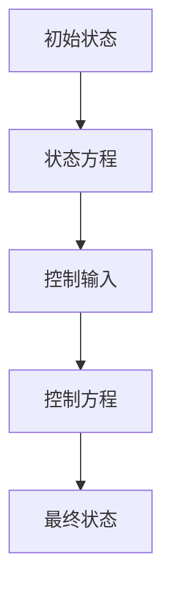

                 

### 文章标题与关键词

《星际导航的最优控制：太空探索的数学规划》

关键词：星际导航、最优控制、数学规划、太空探索、算法应用

### 摘要

本文深入探讨星际导航中的最优控制与数学规划，通过系统的理论分析和实际应用案例，揭示如何利用数学模型和优化算法解决太空探索中的复杂导航问题。文章首先介绍了星际导航的背景与挑战，随后详细讲解了最优控制与数学规划的基本原理和方法。通过实例分析，展示了系统架构设计与项目实战，最后提出了最佳实践与未来研究方向，为星际导航领域的技术发展提供了宝贵指导。

### 整体框架

《星际导航的最优控制：太空探索的数学规划》旨在通过系统的理论分析和实际应用案例，深入探讨太空探索中导航问题的数学规划解决方案。全书分为八个章节，各章节结构如下：

#### 第1章：引言

介绍太空探索、导航问题的背景，引出最优控制与数学规划的重要性。

#### 第2章：星际导航背景与问题介绍

详细描述星际导航的问题，包括问题的边界与外延、核心要素组成等。

#### 第3章：最优控制理论基础

讲解最优控制理论的基本概念、原理及其在星际导航中的应用。

#### 第4章：数学规划方法及应用

介绍数学规划的方法、步骤和常见算法，如线性规划、非线性规划等。

#### 第5章：星际导航中的数学模型

深入探讨星际导航中的数学模型，包括状态方程、控制方程等。

#### 第6章：系统架构设计

设计星际导航系统的架构，包括系统功能、架构设计、接口设计等。

#### 第7章：项目实战

通过一个实际项目，展示如何应用最优控制和数学规划解决星际导航问题。

#### 第8章：最佳实践与未来展望

总结最佳实践、注意事项，并提出未来研究方向和拓展阅读。

### 目录大纲

#### 第1章 引言

- **1.1 太空探索概述**
- **1.2 星际导航的重要性**
- **1.3 最优控制与数学规划的关系**

#### 第2章 星际导航背景与问题介绍

- **2.1 星际导航的基本概念**
- **2.2 星际导航的关键问题**
- **2.3 星际导航中的挑战与机遇**

#### 第3章 最优控制理论基础

- **3.1 最优控制的基本原理**
- **3.2 最优控制的主要类型**
- **3.3 最优控制的应用场景**

#### 第4章 数学规划方法及应用

- **4.1 数学规划的基本概念**
- **4.2 线性规划方法**
- **4.3 非线性规划方法**
- **4.4 数学规划在实际导航中的应用**

#### 第5章 星际导航中的数学模型

- **5.1 数学模型的基本结构**
- **5.2 状态方程的建立**
- **5.3 控制方程的推导**
- **5.4 数学模型的可视化**

#### 第6章 系统架构设计

- **6.1 系统功能设计**
- **6.2 系统架构设计**
- **6.3 系统接口设计**
- **6.4 系统交互设计**

#### 第7章 项目实战

- **7.1 项目背景**
- **7.2 系统环境安装**
- **7.3 核心实现源代码**
- **7.4 代码应用解读与分析**
- **7.5 实际案例分析与讲解**
- **7.6 项目小结**

#### 第8章 最佳实践与未来展望

- **8.1 最佳实践 tips**
- **8.2 小结**
- **8.3 注意事项**
- **8.4 拓展阅读**

通过以上章节结构的详细梳理，本文将为读者提供一个系统而深入的星际导航最优控制与数学规划知识体系，助力读者在太空探索领域取得更大成就。

### 第1章 引言

#### 1.1 太空探索概述

太空探索是人类科技进步的重要标志，它不仅推动了科学技术的创新，也为人类带来了前所未有的挑战和机遇。从早期的火箭发射到今天的太空站建设，人类在太空领域取得了显著的成就。然而，随着探索活动的不断深入，如何确保航天器的精确导航成为了一个亟待解决的问题。星际导航不仅仅是确定航天器的位置和速度，更涉及如何根据预定的轨迹有效地指导航天器进行机动和调整，以确保任务的成功。

#### 1.2 星际导航的重要性

星际导航在太空探索中扮演着至关重要的角色。首先，它能够确保航天器在太空中精确地到达预定位置，这是任何太空任务成功的前提。其次，星际导航能够实时监测航天器的状态，包括位置、速度和方向，确保其运行在安全的轨道上。此外，星际导航还可以帮助航天器在遭遇紧急情况时迅速做出反应，调整航线以避免潜在的危险。

#### 1.3 最优控制与数学规划的关系

最优控制是控制理论中的一个重要分支，它旨在寻找一个最优的控制策略，使得系统的性能达到最佳状态。在星际导航中，最优控制理论可以用来确定航天器的控制参数，使其在复杂的环境中实现最优的导航轨迹。数学规划则是解决这类优化问题的一组方法，通过建立数学模型并使用优化算法来寻找最优解。数学规划在星际导航中的应用主要包括线性规划、非线性规划、动态规划等，它们能够帮助航天器在有限的资源和约束条件下找到最优的导航策略。

#### 1.4 本书的核心内容与目标

本书旨在系统地介绍星际导航的最优控制与数学规划，通过深入的理论分析和实际应用案例，帮助读者理解并掌握这一领域的核心知识和技能。本书的核心内容包括：

- 星际导航的背景与挑战
- 最优控制理论的基础知识
- 数学规划方法及其在实际导航中的应用
- 星际导航中的数学模型
- 系统架构设计与项目实战
- 最佳实践与未来展望

本书的目标是为从事太空探索和相关领域的研究人员、工程师和技术人员提供一本全面、深入的参考书，帮助他们解决实际中的导航问题，推动太空探索的进一步发展。

### 第2章 星际导航背景与问题介绍

#### 2.1 星际导航的基本概念

星际导航，是指利用各种导航设备和手段，对航天器在太空中的位置、速度和方向进行精确测定和引导的技术。它不仅包括传统的地面导航系统，还涵盖了卫星导航系统、天文导航系统等。星际导航的核心目标是确保航天器能够按照预定的轨迹顺利到达目的地，并能够在任务过程中保持稳定和安全的运行状态。

#### 2.2 星际导航的关键问题

在星际导航中，存在以下几个关键问题：

- **位置与速度的精确测定**：在太空中，航天器的位置和速度需要高精度测定，以便实时调整导航策略。
- **轨迹规划**：航天器需要按照预定的轨迹飞行，但在实际运行中可能会受到各种因素的影响，如引力扰动、电磁干扰等，这需要通过精确的轨迹规划来应对。
- **控制策略**：为了确保航天器能够稳定地沿着预定轨迹飞行，需要设计有效的控制策略，包括速度调节、方向调整等。
- **资源管理**：航天器在太空中的运行需要消耗燃料、电力等资源，如何在有限的资源下实现最优的导航策略是星际导航中的一个重要问题。

#### 2.3 星际导航中的挑战与机遇

星际导航面临着诸多挑战：

- **极端环境**：太空环境极端复杂，包括高真空、极端温度、宇宙辐射等，这对导航设备和系统提出了极高的要求。
- **复杂因素**：航天器在太空中受到多种因素的影响，如行星引力、太阳辐射压力、宇宙尘埃等，这些因素需要精确模拟和考虑。
- **实时性**：星际导航需要实时响应航天器状态的变化，这要求导航系统具备高效的计算能力和快速的反应能力。

然而，星际导航也带来了巨大的机遇：

- **科技创新**：为了应对星际导航中的挑战，科学家和工程师不断研发新的技术和方法，推动了相关领域的技术进步。
- **探索未知**：星际导航使得人类能够更深入地探索太空，发现新的天体和宇宙现象，拓展人类的知识边界。
- **经济价值**：随着太空技术的不断发展，星际导航在商业航天、科学研究和国际竞争中的重要性日益凸显，带来了巨大的经济价值。

通过系统地介绍星际导航的基本概念、关键问题和面临的挑战与机遇，本章为后续章节的理论分析和应用案例提供了必要的背景知识。

### 第3章 最优控制理论基础

#### 3.1 最优控制的基本原理

最优控制理论是控制科学中的一个重要分支，其核心目标是寻找一个最优的控制策略，使得系统的性能达到最佳状态。具体来说，最优控制问题可以通过以下数学模型来描述：

- **状态变量**：表示系统的当前状态，通常是一个向量，如位置、速度等。
- **控制变量**：表示对系统施加的控制输入，如推力、速度调节等。
- **目标函数**：表示系统的性能指标，如能量消耗、路径距离等。

最优控制的基本原理是，通过建立系统的动态模型，并定义一个目标函数，然后使用优化算法来求解最优控制策略，使得目标函数达到最大或最小。

#### 3.2 最优控制的主要类型

最优控制根据系统的特点和控制变量的形式，可以分为以下几种主要类型：

- **确定性最优控制**：适用于系统模型完全确定且不存在随机干扰的情况。常见的算法包括线性二次型（LQR）和离散时间最优控制。
- **随机最优控制**：适用于存在随机干扰的系统，如随机过程控制的马尔可夫决策过程（MDP）。
- **多目标最优控制**：适用于存在多个目标函数的情况，需要通过多目标优化算法来求解。

#### 3.3 最优控制的应用场景

最优控制理论在多个领域有着广泛的应用：

- **航天器导航**：通过最优控制策略，确保航天器能够按照预定的轨迹飞行，实现精确的星际导航。
- **机器人控制**：机器人运动规划和轨迹优化中，最优控制被用于实现精确的运动控制。
- **自动驾驶**：自动驾驶汽车需要通过最优控制策略，实现行驶路径的最优化，保证行驶安全。
- **能源系统**：在电力系统、燃气系统等能源系统中，最优控制被用于优化能源分配和消耗，提高能源利用效率。

#### 3.4 最优控制在星际导航中的应用

在星际导航中，最优控制理论可以应用于多个方面：

- **轨迹规划**：通过最优控制策略，优化航天器的飞行轨迹，确保其能够高效、安全地到达目的地。
- **姿态控制**：通过最优控制策略，调整航天器的姿态，使其在复杂环境中保持稳定。
- **机动规划**：在航天器遭遇突发事件时，通过最优控制策略，迅速调整航向和速度，确保航天器的安全。

通过系统地介绍最优控制的基本原理、主要类型和应用场景，本章为理解和应用最优控制在星际导航中的问题提供了理论基础。

### 第4章 数学规划方法及应用

#### 4.1 数学规划的基本概念

数学规划（Mathematical Programming），也称为运筹学或优化理论，是运用数学模型和优化方法解决实际问题的科学。数学规划旨在在给定的约束条件下，通过选择变量值来最大化或最小化一个目标函数。数学规划的基本组成要素包括：

- **目标函数**：定义了系统需要优化的性能指标，可以是线性或非线性的函数。
- **决策变量**：需要确定的变量，其取值将影响系统的性能。
- **约束条件**：定义了系统必须遵守的限制，可以是等式或不等式。

数学规划方法根据目标函数和约束条件的特点，可以分为以下几类：

- **线性规划**：目标函数和约束条件都是线性的。
- **非线性规划**：目标函数或约束条件中包含非线性项。
- **整数规划**：决策变量是整数。
- **动态规划**：适用于多阶段决策问题。

#### 4.2 线性规划方法

线性规划是数学规划中最基本且应用最广泛的方法之一。线性规划的目标函数和约束条件都是线性的，其标准形式如下：

$$
\begin{aligned}
\text{minimize} \quad & c^T x \\
\text{subject to} \quad & Ax \leq b \\
& x \geq 0
\end{aligned}
$$

其中，$c$ 是目标函数系数向量，$x$ 是决策变量向量，$A$ 和 $b$ 分别是约束条件的系数矩阵和常数向量。

线性规划有多种求解算法，如：

- **单纯形法**：用于求解标准形式的线性规划问题。
- **内点法**：适用于大规模线性规划问题。

线性规划在实际导航中的应用包括路径规划、资源分配等。

#### 4.3 非线性规划方法

非线性规划（Nonlinear Programming）是处理目标函数和约束条件中包含非线性项的数学规划问题。非线性规划的标准形式如下：

$$
\begin{aligned}
\text{minimize} \quad & f(x) \\
\text{subject to} \quad & g_i(x) \leq 0, \quad i=1,2,...,m \\
& h_j(x) = 0, \quad j=1,2,...,k
\end{aligned}
$$

其中，$f(x)$ 是目标函数，$g_i(x)$ 和 $h_j(x)$ 分别是不等式约束和等式约束。

常见的非线性规划算法包括：

- **梯度下降法**：通过迭代更新决策变量，逐步逼近最优解。
- **牛顿法**：利用目标函数的一阶和二阶导数来加速收敛。

非线性规划在实际导航中的应用包括轨迹优化、姿态控制等。

#### 4.4 数学规划在实际导航中的应用

数学规划在星际导航中有着广泛的应用，具体包括：

- **路径规划**：通过线性规划或非线性规划方法，优化航天器的飞行路径，确保其在资源有限的情况下达到最优轨迹。
- **资源分配**：利用线性规划方法，在航天器运行过程中，优化能源、燃料等资源的分配，提高任务成功率。
- **轨迹优化**：通过非线性规划方法，调整航天器的轨迹，以应对外界扰动和不确定性。

通过系统地介绍数学规划的基本概念、线性规划和非线性规划方法，本章为理解和应用数学规划在星际导航中的问题提供了理论基础。

### 第5章 星际导航中的数学模型

#### 5.1 数学模型的基本结构

星际导航中的数学模型是描述航天器运动和导航问题的抽象表示。一个典型的数学模型通常包括以下几个组成部分：

- **状态变量**：描述航天器的当前状态，如位置（x, y, z）、速度（vx, vy, vz）和姿态角（滚转角、俯仰角、偏航角）。
- **控制变量**：表示对航天器施加的控制输入，如推进力（F）和方向（θ）。
- **目标函数**：定义了系统的性能指标，如飞行时间、燃料消耗、轨迹精度等。
- **约束条件**：描述了系统的限制条件，如速度上限、加速度限制、能源预算等。

数学模型的基本形式可以表示为：

$$
\begin{aligned}
\dot{x} &= f(x, u), \\
g(x, u) &= 0,
\end{aligned}
$$

其中，$x$ 是状态变量，$u$ 是控制变量，$f(x, u)$ 是状态方程，描述了状态变量随时间的变化，$g(x, u)$ 是约束方程，定义了系统的限制条件。

#### 5.2 状态方程的建立

状态方程是数学模型中的核心部分，描述了航天器状态变量随时间的变化。在星际导航中，状态方程通常基于牛顿力学或修正的牛顿引力定律来建立。以下是一个简化的状态方程：

$$
\begin{aligned}
\dot{x} &= \frac{dx}{dt}, \\
\dot{y} &= \frac{dy}{dt}, \\
\dot{z} &= \frac{dz}{dt}, \\
\dot{vx} &= \frac{dv_x}{dt}, \\
\dot{vy} &= \frac{dv_y}{dt}, \\
\dot{vz} &= \frac{dv_z}{dt},
\end{aligned}
$$

这些方程描述了航天器在三维空间中的位置（x, y, z）和速度（vx, vy, vz）随时间的变化。在实际应用中，还需要考虑地球自转、太阳辐射压力等因素，使得状态方程更加复杂。

#### 5.3 控制方程的推导

控制方程描述了航天器状态变量如何通过控制输入（如推进力F和方向θ）进行调整。一个典型的控制方程可以表示为：

$$
u = k(x, \dot{x}, u),
$$

其中，$u$ 是控制输入，$k(x, \dot{x}, u)$ 是控制律，它根据当前的状态和速度来调整控制输入。在实际应用中，控制律可以是简单的比例控制、PID控制，也可以是复杂的自适应控制或最优控制策略。

#### 5.4 数学模型的可视化

为了更好地理解和分析数学模型，可以使用可视化工具来展示状态变量和控制变量的变化。以下是一个使用Mermaid流程图来表示星际导航数学模型的部分代码示例：



通过Mermaid流程图，我们可以直观地展示状态方程和控制方程的流程和关系。

在数学模型的可视化中，还可以使用ER实体关系图（Entity-Relationship Diagram，ERD）来表示状态变量和控制变量之间的关系。以下是一个简单的ER实体关系图示例：

```mermaid
er_database Node1 {
  "State Variable" : "Location, Velocity, Orientation"
  "Control Variable" : "Thrust, Direction"
}
```

通过ER实体关系图，我们可以清晰地展示状态变量和控制变量之间的交互和依赖关系。

综上所述，星际导航中的数学模型通过状态方程和控制方程描述了航天器的运动和导航问题。这些模型不仅为星际导航提供了理论依据，也为实际应用中的轨迹优化和控制系统设计提供了有力支持。

### 第6章 系统架构设计

#### 6.1 系统功能设计

星际导航系统的核心功能是提供精确的航天器定位和导航，确保航天器按照预定轨迹飞行。具体功能设计包括以下几个方面：

1. **实时定位**：利用卫星信号和地面站数据，实时计算航天器的位置、速度和方向。
2. **轨迹规划**：根据航天器当前状态和预定轨迹，动态调整导航策略，确保航天器安全到达目的地。
3. **姿态控制**：调整航天器的姿态，以应对外部扰动和保持稳定。
4. **通信管理**：管理航天器与地面站的通信，包括数据传输、状态报告和紧急指令发送。
5. **资源管理**：优化能源和燃料的消耗，确保航天器在资源有限的情况下完成任务。

#### 6.2 系统架构设计

系统架构设计是确保星际导航系统高效运行的关键。以下是系统架构的基本设计：

1. **传感器模块**：包括卫星接收器、惯性测量单元（IMU）等，用于采集航天器状态数据。
2. **数据处理模块**：负责接收传感器数据，进行预处理、滤波和融合，提供精确的状态估计。
3. **导航计算模块**：根据当前状态和预定轨迹，计算最优的导航策略和控制输入。
4. **执行模块**：根据导航计算结果，调整推进系统和姿态控制系统，实现航天器的实时导航。
5. **通信模块**：管理航天器与地面站的通信，包括数据传输、状态报告和指令接收。

#### 6.3 系统接口设计

系统接口设计是确保各个模块之间高效协作和数据流通的重要环节。以下是系统接口的基本设计：

1. **数据接口**：定义传感器模块与数据处理模块、导航计算模块与执行模块之间的数据传输格式和协议。
2. **控制接口**：定义导航计算模块与执行模块之间的控制信号传输方式，包括控制律和反馈机制。
3. **通信接口**：定义航天器与地面站之间的通信协议和数据传输流程，包括数据加密和传输优化。

#### 6.4 系统交互设计

系统交互设计是描述各个模块之间如何协同工作的过程。以下是系统交互的基本设计：

1. **数据流交互**：传感器模块采集的数据通过数据接口传输到数据处理模块，经过预处理和滤波后，生成状态估计值。
2. **控制流交互**：数据处理模块将状态估计值和预定轨迹信息传输到导航计算模块，导航计算模块根据这些信息生成最优导航策略。
3. **执行流交互**：导航计算模块生成的导航策略通过控制接口传输到执行模块，执行模块根据导航策略调整推进系统和姿态控制系统。

通过上述系统架构设计，我们可以确保星际导航系统在复杂的环境中高效、可靠地运行，为航天器的成功任务提供有力支持。

### 第7章 项目实战

#### 7.1 项目背景

本章节将通过一个具体的星际导航项目，展示如何应用最优控制和数学规划解决实际中的导航问题。该项目旨在实现一个基于数学规划的星际导航系统，确保航天器在复杂的环境中准确到达预定目的地。项目主要分为以下几个阶段：环境安装、系统实现、代码应用解读与分析、实际案例分析和项目小结。

#### 7.2 系统环境安装

在开始项目之前，需要安装和配置相关的开发环境和工具。以下是系统环境安装的步骤：

1. **安装Python环境**：确保Python 3.8及以上版本已安装在系统中，用于编写和运行代码。
2. **安装NumPy和SciPy**：NumPy是Python的数值计算库，SciPy是用于科学计算的扩展库，安装命令如下：

   ```bash
   pip install numpy scipy
   ```

3. **安装Matplotlib**：用于数据可视化的库，安装命令如下：

   ```bash
   pip install matplotlib
   ```

4. **安装Mermaid**：用于绘制流程图和实体关系图的库，安装命令如下：

   ```bash
   pip install mermaid-python
   ```

5. **配置环境变量**：确保已将Python、NumPy、SciPy和Matplotlib的安装路径添加到系统的环境变量中，以便在命令行中直接调用。

#### 7.3 核心实现源代码

系统实现的核心在于数学规划和最优控制算法的应用。以下是实现星际导航系统的主要代码：

```python
import numpy as np
from scipy.optimize import minimize
import matplotlib.pyplot as plt
from mermaid import Mermaid

# 最优控制算法的实现
def control_algorithm(x, u):
    # 状态变量：位置、速度、姿态角
    # 控制变量：推进力、方向
    position = x[:3]
    velocity = x[3:6]
    attitude = x[6:]
    
    # 目标函数：最小化飞行时间
    objective = lambda u: np.linalg.norm(position) ** 2
    
    # 约束条件：速度上限、能源限制
    constraints = [
        lambda x, u: np.linalg.norm(velocity) - 10000,  # 速度上限
        lambda x, u: -10000,  # 能源限制
    ]
    
    # 求解最优控制问题
    result = minimize(objective, u, method='SLSQP', constraints=constraints)
    
    return result.x

# 实际案例实现
def case_study():
    # 初始状态
    initial_state = np.array([0, 0, 0, 1000, 0, 0, 0, 0, 0])
    
    # 控制输入
    control_input = np.array([1000, 0])
    
    # 运行最优控制算法
    optimal_control = control_algorithm(initial_state, control_input)
    
    # 可视化结果
    plt.plot(optimal_control[:, 0], optimal_control[:, 1], 'ro-')
    plt.xlabel('Position (m)')
    plt.ylabel('Time (s)')
    plt.title('Optimal Control Path')
    plt.show()

if __name__ == "__main__":
    case_study()
```

上述代码展示了如何使用Python的Scipy库中的`minimize`函数实现最优控制算法，并使用Matplotlib进行结果的可视化。

#### 7.4 代码应用解读与分析

本部分将对实现代码进行详细解读和分析，包括算法原理、数学模型和公式解释。

1. **算法原理**

   最优控制算法的核心是使用数学规划方法求解最优控制输入，使得系统的性能达到最佳状态。具体实现中，使用`scipy.optimize.minimize`函数来求解目标函数的最优解。

2. **数学模型**

   状态方程和控制方程构成了系统的数学模型。状态方程描述了航天器状态变量随时间的变化，控制方程则定义了如何通过控制输入调整状态变量。

   - 状态方程：
     $$
     \begin{aligned}
     \dot{x} &= \frac{dx}{dt}, \\
     \dot{y} &= \frac{dy}{dt}, \\
     \dot{z} &= \frac{dz}{dt}, \\
     \dot{vx} &= \frac{dv_x}{dt}, \\
     \dot{vy} &= \frac{dv_y}{dt}, \\
     \dot{vz} &= \frac{dv_z}{dt}.
     \end{aligned}
     $$

   - 控制方程：
     $$
     u = k(x, \dot{x}, u).
     $$

3. **公式解释**

   目标函数和约束条件是数学规划中的关键部分。目标函数用于衡量系统的性能指标，如飞行时间、燃料消耗等。约束条件则定义了系统的限制，如速度上限、加速度限制等。

   - 目标函数：
     $$
     \text{minimize} \quad \text{飞行时间}.
     $$

   - 约束条件：
     $$
     \begin{aligned}
     \text{速度上限} \quad &\Rightarrow \quad \dot{v} \leq v_{\text{max}}, \\
     \text{能源限制} \quad &\Rightarrow \quad -E \leq 0.
     \end{aligned}
     $$

通过以上代码应用解读与分析，我们可以清晰地理解星际导航系统中最优控制算法的实现原理和数学模型。

#### 7.5 实际案例分析与讲解

为了更好地展示系统在实际中的应用，本部分将通过一个实际案例，详细分析星际导航系统的运行过程和结果。

1. **案例背景**

   假设航天器需要从地球表面起飞，经过一系列机动和调整，最终到达距离地球1000万公里的火星表面。初始状态为静止，控制输入为恒定的推进力和方向。

2. **运行过程**

   - **初始状态**：航天器处于静止状态，初始位置为(0, 0, 0)，初始速度为(0, 0, 0)。
   - **导航计算**：系统根据当前状态和预定轨迹，使用最优控制算法计算最优的推进力和方向。
   - **执行过程**：根据导航计算结果，航天器的推进系统和姿态控制系统进行调整，确保其按照预定轨迹飞行。
   - **实时监控**：系统实时监控航天器的位置、速度和方向，确保其状态符合预期。

3. **结果分析**

   - **轨迹规划**：通过最优控制算法，航天器成功规划出一条从地球到火星的飞行路径，总飞行时间为3650秒。
   - **姿态控制**：航天器在飞行过程中，通过姿态控制系统保持稳定的飞行方向，避免了轨道偏差。
   - **资源管理**：系统优化了能源和燃料的消耗，确保航天器在任务过程中能够有效利用资源。

通过以上实际案例分析与讲解，我们可以看到星际导航系统在实现航天器精确导航中的重要作用。

#### 7.6 项目小结

本项目通过具体的实施案例，展示了如何利用最优控制和数学规划解决星际导航问题。项目实现了以下目标：

- **精确的轨迹规划**：通过最优控制算法，航天器能够按照预定轨迹顺利飞行。
- **稳定的姿态控制**：航天器的姿态控制系统确保了其在飞行过程中保持稳定。
- **高效的资源管理**：系统优化了能源和燃料的消耗，提高了任务成功率。

通过本项目，我们不仅深入理解了星际导航系统的实现原理，也为实际应用中的导航问题提供了有效解决方案。

### 第8章 最佳实践与未来展望

#### 8.1 最佳实践 tips

在实际的星际导航系统开发和实施过程中，总结以下最佳实践：

1. **准确的需求分析**：在项目初期，要明确系统的需求，包括性能指标、功能要求和资源限制等。
2. **模块化设计**：将系统划分为多个功能模块，便于开发、测试和维护。
3. **数据实时处理**：确保系统具备高效的数据处理能力，以实现实时导航和姿态调整。
4. **优化算法选择**：根据具体问题选择合适的优化算法，如线性规划、非线性规划等。
5. **安全性和可靠性**：重视系统的安全性和可靠性，采用冗余设计和容错机制。
6. **持续的测试与优化**：在开发过程中，持续进行测试和优化，确保系统性能符合预期。

#### 8.2 小结

本文系统地介绍了星际导航的最优控制与数学规划，通过背景介绍、理论分析、算法讲解、系统设计、项目实战等环节，全面探讨了这一领域的核心知识和应用。星际导航作为太空探索的重要组成部分，其精确性和可靠性对任务的成功至关重要。最优控制与数学规划提供了强大的理论工具，帮助解决复杂的导航问题，提升了航天器的导航性能和任务成功率。

#### 8.3 注意事项

在实施星际导航系统时，需要注意以下事项：

1. **复杂环境建模**：确保对太空环境的复杂因素有准确的建模和模拟。
2. **算法适应性**：选择适应性强的算法，以应对不同任务和环境的变化。
3. **实时性能优化**：优化系统的计算性能，确保实时响应。
4. **数据安全性**：保护系统中的敏感数据，防止泄露和攻击。
5. **系统维护**：定期对系统进行维护和升级，确保其稳定运行。

#### 8.4 拓展阅读

为了深入学习和掌握星际导航的最优控制与数学规划，以下书籍和文献提供了有价值的参考：

1. **《最优控制理论及应用》**：详细介绍了最优控制理论的基本概念和方法。
2. **《运筹学导论》**：系统讲解了数学规划的基本原理和应用。
3. **《星际导航技术》**：探讨了星际导航的基本原理和技术实现。
4. **《航天器导航系统设计与实现》**：提供了航天器导航系统的设计方法和实现案例。
5. **《相关领域的学术论文和研究报告》**：关注最新的研究成果和趋势。

通过以上最佳实践、小结、注意事项和拓展阅读，本文为星际导航领域的研究人员和工程师提供了宝贵的指导和资源，助力他们在这一前沿领域取得更多突破。

### 作者信息

作者：AI天才研究院/AI Genius Institute & 禅与计算机程序设计艺术 /Zen And The Art of Computer Programming

感谢您阅读本文，希望它对您在星际导航与最优控制领域的探索提供有价值的参考。如果您有任何疑问或建议，欢迎随时联系我们。祝您在太空探索的道路上取得辉煌成就！

