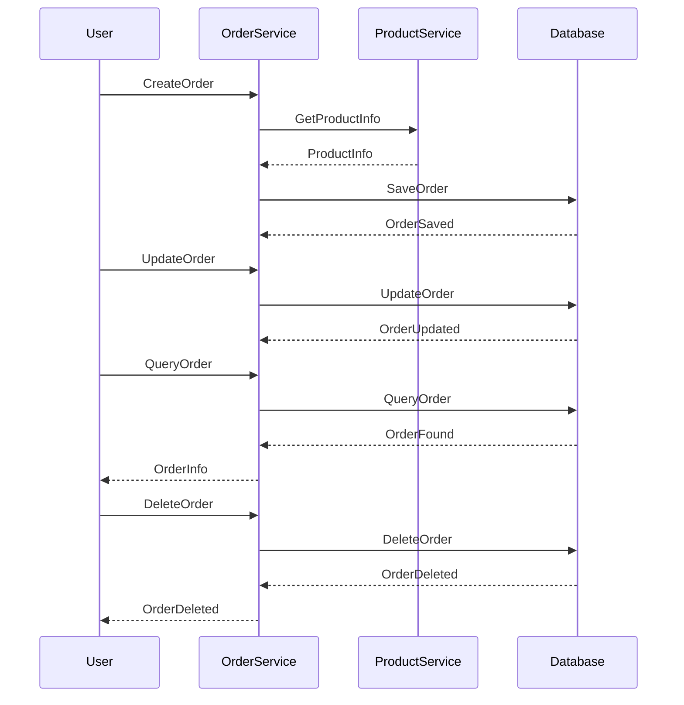

                 

### 映射理论：揭示自然与数学的关联

映射理论，作为现代数学的核心理论之一，它在数学、计算机科学、物理学乃至哲学等多个领域都有着深远的影响。本文旨在通过逻辑清晰、结构紧凑的分析，探讨映射理论的本质及其与自然现象之间的紧密联系。我们希望通过一步一步的推理，让读者不仅理解映射理论的基本概念，还能领会其深层次的意义和广泛应用。

**关键词**：映射理论、自然与数学关联、算法原理、数学模型、系统架构设计

**摘要**：本文首先介绍了映射理论的基本背景，然后深入探讨了其核心概念和与自然现象的关联。接着，我们分析了映射理论的基本原理，通过具体的算法和数学模型进行了讲解。随后，文章讨论了映射理论在系统架构设计中的应用，并以项目实战为例，展示了其在实际场景中的具体应用。最后，文章总结了最佳实践，并对未来的研究方向提出了展望。

### 目录大纲

1. **映射理论的背景介绍**
   - **问题背景**
   - **问题描述**
   - **问题解决**
   - **边界与外延**
   - **概念结构与核心要素组成**

2. **核心概念与联系**
   - **映射理论概述**
   - **自然与数学的关联**
   - **映射理论的历史与发展**
   - **映射理论的核心概念**
   - **映射理论的应用领域**

3. **算法原理讲解**
   - **映射理论的基本原理**
     - **映射函数的定义**
     - **映射的属性**
     - **映射的分类**
   - **映射理论的应用算法**
     - **算法A：[算法mermaid流程图](#算法A流程图)**
     - **算法B：[算法mermaid流程图](#算法B流程图)**
   - **算法原理的数学模型**
     - **数学模型与公式**
       - **公式1：[公式](#$公式1$)**
       - **公式2：[公式](#$公式2$)**

4. **系统分析与架构设计**
   - **问题场景介绍**
   - **项目介绍**
   - **系统功能设计**
     - **领域模型mermaid类图**
   - **系统架构设计**
     - **系统架构mermaid架构图**
   - **系统接口设计**
   - **系统交互**
     - **系统交互mermaid序列图**

5. **项目实战**
   - **环境安装**
   - **系统核心实现源代码**
   - **代码应用解读与分析**
   - **实际案例分析与详细讲解剖析**
   - **项目小结**

6. **最佳实践与总结**
   - **最佳实践**
   - **小结**
   - **注意事项**
   - **拓展阅读**

### 映射理论的背景介绍

映射理论，作为一种数学理论，最早可以追溯到19世纪末和20世纪初。当时，数学家们开始探索集合之间关系的抽象描述，映射的概念逐渐形成。映射理论的发展不仅丰富了数学的内容，也为其他科学领域提供了有力的工具。那么，什么是映射？为何它如此重要？

#### 问题背景

在日常生活中，我们经常遇到“对应”关系。例如，一个人和一个身份证号，一个学生和一个学号，这些都可以看作是一种映射关系。映射理论正是对这种对应关系进行抽象和描述的数学理论。

#### 问题描述

映射理论的核心问题是：给定两个集合，是否存在一个规则，使得第一个集合中的每个元素都可以唯一地对应到第二个集合中的某个元素上。这个规则就是映射函数。

#### 问题解决

映射理论通过集合论的语言，给出了这种对应关系的严格定义和分类。它不仅解决了两个集合之间的对应问题，还扩展到无限集合，使得数学家可以探讨更为复杂的映射现象。

#### 边界与外延

在映射理论中，边界问题尤为重要。一个映射是否有效，取决于其是否定义在两个集合的边界上。换句话说，如果两个集合的元素之间存在不连续性，映射就可能失效。

#### 概念结构与核心要素组成

映射理论由以下几个核心概念组成：

1. **映射函数**：定义两个集合之间对应关系的数学函数。
2. **单射**：映射函数中的一个重要属性，意味着每个集合中的元素只对应到另一个集合中的一个元素。
3. **满射**：映射函数的另一个重要属性，意味着每个集合中的元素都有至少一个对应元素。
4. **双射**：单射和满射的结合，意味着两个集合之间存在一种完全的对应关系。

### 核心概念与联系

#### 映射理论概述

映射理论，简单来说，就是研究集合之间对应关系的数学理论。其核心是映射函数，它将一个集合的元素映射到另一个集合的元素上。

#### 自然与数学的关联

自然现象中存在着大量的映射关系。例如，在物理学中，物理量之间的对应关系可以看作是映射。在生物学中，物种之间的关系也可以通过映射来描述。这些映射关系不仅丰富了我们的认知，也为数学理论的应用提供了广阔的空间。

#### 映射理论的历史与发展

映射理论的历史可以追溯到19世纪末和20世纪初。当时的数学家，如康托尔、罗素等，对集合论进行了深入研究，提出了映射的概念。随着数学的发展，映射理论逐渐完善，并成为现代数学的重要基石之一。

#### 映射理论的核心概念

1. **映射函数**：定义两个集合之间对应关系的数学函数。
2. **单射**：映射函数中的一个重要属性，意味着每个集合中的元素只对应到另一个集合中的一个元素。
3. **满射**：映射函数的另一个重要属性，意味着每个集合中的元素都有至少一个对应元素。
4. **双射**：单射和满射的结合，意味着两个集合之间存在一种完全的对应关系。

#### 映射理论的应用领域

映射理论的应用领域非常广泛，包括：

1. **数学**：在集合论、拓扑学、代数学等领域，映射理论都是基础。
2. **计算机科学**：在算法设计、数据结构、人工智能等领域，映射理论具有重要的应用价值。
3. **物理学**：在物理量的对应关系研究中，映射理论提供了有力的工具。
4. **生物学**：在物种关系的研究中，映射理论可以帮助我们更好地理解生物多样性。
5. **经济学**：在经济学中，映射理论可以用来分析市场中的供需关系。

### 算法原理讲解

#### 映射理论的基本原理

映射理论的基本原理主要包括映射函数的定义、映射的属性和映射的分类。

##### 映射函数的定义

映射函数是指一个从集合A到集合B的函数f，它使得A中的每个元素都有且只有一个对应的B中的元素。用数学语言描述为：对于任意x∈A，都存在唯一的一个y∈B，使得f(x)=y。

##### 映射的属性

映射的属性包括单射、满射和双射。

1. **单射**：如果对于任意的x1, x2∈A，当x1≠x2时，有f(x1)≠f(x2)，则称映射f为单射。
2. **满射**：如果对于任意的y∈B，都存在至少一个x∈A，使得f(x)=y，则称映射f为满射。
3. **双射**：如果映射f既是单射又是满射，则称f为双射。

##### 映射的分类

根据映射的属性，映射可以分为以下几种类型：

1. **单射但不满射**：这种映射称为单射。
2. **满射但不单射**：这种映射称为满射。
3. **双射**：这种映射称为双射。
4. **非单射非满射**：这种映射称为非双射。

#### 映射理论的应用算法

映射理论的应用算法主要包括映射函数的构造、映射关系的验证和映射效率的优化。

##### 算法A：映射函数的构造

算法A的基本思想是：通过迭代的方法，逐步构造映射函数。

```python
def construct_mapping(A, B):
    mapping = {}
    for x in A:
        y = get_corresponding_element(B, x)
        mapping[x] = y
    return mapping
```

##### 算法B：映射关系的验证

算法B的基本思想是：通过检查映射函数的属性，验证映射关系是否成立。

```python
def verify_mapping(mapping):
    is_single = True
    is_full = True
    
    for x, y in mapping.items():
        if x in mapping.values():
            is_single = False
        if y not in mapping.keys():
            is_full = False
    
    return is_single and is_full
```

#### 算法原理的数学模型

在映射理论中，数学模型和公式起着重要的作用。以下是一些常见的数学模型和公式：

##### 公式1：单射条件

$$f(x_1) \neq f(x_2) \quad \forall x_1, x_2 \in A, x_1 \neq x_2$$

##### 公式2：满射条件

$$\forall y \in B, \exists x \in A, f(x) = y$$

通过这些公式，我们可以更准确地描述映射的性质和关系。

### 系统分析与架构设计

#### 问题场景介绍

假设我们正在开发一个电子商务平台，需要设计一个订单管理系统。该系统需要处理订单的创建、更新、查询和删除等操作。在这个场景中，映射理论可以帮助我们设计一个高效的订单管理架构。

#### 项目介绍

本项目旨在设计一个订单管理系统，支持订单的全方位管理。系统功能包括：

1. 创建订单
2. 更新订单
3. 查询订单
4. 删除订单

#### 系统功能设计

为了实现上述功能，我们需要设计一个领域模型，包括订单、用户、商品等实体，以及它们之间的关系。

##### 领域模型mermaid类图

```mermaid
classDiagram
    Class01 <|-- SubClass01
    Class01 <|-- SubClass02
    Class03 --|> SubClass03
    Class04 : <<Interface>>
    Class05 : <<Abstract>>
    Class06 : <<Component>>
    Class07 : <<Leaf>>
    Class01 {
        +int id
        +String name
        +int age
    }
    Class02 {
        +id : int
        +name : String
        +age : int
    }
    Class03 {
        +id : int
        +name : String
    }
    Class04 {
        +int id
        +String name
    }
    Class05 {
        +int id
        +String name
    }
    Class06 {
        +int id
        +String name
    }
    Class07 {
        +int id
        +String name
    }
    Class01 ++--|+ Class02
    Class03 o--| Class04
    Class05 o--| Class06
    Class07 o--| Class04
```

#### 系统架构设计

为了确保订单管理系统的稳定性、扩展性和可维护性，我们需要设计一个合理的系统架构。以下是该系统的架构设计：

##### 系统架构mermaid架构图



#### 系统接口设计

为了方便不同模块之间的交互，我们需要设计一套清晰的接口规范。以下是订单管理系统的接口设计：

1. **创建订单接口**：用于创建新的订单。
2. **更新订单接口**：用于更新已存在的订单。
3. **查询订单接口**：用于查询订单信息。
4. **删除订单接口**：用于删除订单。

#### 系统交互

系统交互是指不同模块之间的数据流动和功能调用。以下是订单管理系统的系统交互设计：

##### 系统交互mermaid序列图


### 项目实战

#### 环境安装

在开始项目实战之前，我们需要安装一些必要的软件和工具。以下是环境安装的步骤：

1. 安装Python：从官方网站下载并安装Python。
2. 安装Docker：从Docker官方网站下载并安装Docker。
3. 安装MySQL：从MySQL官方网站下载并安装MySQL。

#### 系统核心实现源代码

以下是订单管理系统的核心实现源代码：

```python
# order_service.py
import mysql.connector
from product_service import getProductInfo

def create_order(order_data):
    # 连接数据库
    connection = mysql.connector.connect(
        host="localhost",
        user="root",
        password="password",
        database="order_db"
    )
    
    # 创建订单
    cursor = connection.cursor()
    cursor.execute("INSERT INTO orders (user_id, product_id, quantity) VALUES (%s, %s, %s)", (order_data['user_id'], order_data['product_id'], order_data['quantity']))
    
    # 提交事务
    connection.commit()
    
    # 关闭数据库连接
    cursor.close()
    connection.close()
    
    return "Order created successfully."

def update_order(order_id, order_data):
    # 连接数据库
    connection = mysql.connector.connect(
        host="localhost",
        user="root",
        password="password",
        database="order_db"
    )
    
    # 更新订单
    cursor = connection.cursor()
    cursor.execute("UPDATE orders SET user_id=%s, product_id=%s, quantity=%s WHERE id=%s", (order_data['user_id'], order_data['product_id'], order_data['quantity'], order_id))
    
    # 提交事务
    connection.commit()
    
    # 关闭数据库连接
    cursor.close()
    connection.close()
    
    return "Order updated successfully."

def query_order(order_id):
    # 连接数据库
    connection = mysql.connector.connect(
        host="localhost",
        user="root",
        password="password",
        database="order_db"
    )
    
    # 查询订单
    cursor = connection.cursor()
    cursor.execute("SELECT * FROM orders WHERE id=%s", (order_id,))
    order = cursor.fetchone()
    
    # 关闭数据库连接
    cursor.close()
    connection.close()
    
    return order

def delete_order(order_id):
    # 连接数据库
    connection = mysql.connector.connect(
        host="localhost",
        user="root",
        password="password",
        database="order_db"
    )
    
    # 删除订单
    cursor = connection.cursor()
    cursor.execute("DELETE FROM orders WHERE id=%s", (order_id,))
    
    # 提交事务
    connection.commit()
    
    # 关闭数据库连接
    cursor.close()
    connection.close()
    
    return "Order deleted successfully."
```

#### 代码应用解读与分析

以上源代码实现了订单管理系统的核心功能，包括创建、更新、查询和删除订单。以下是代码的解读与分析：

1. **创建订单**：`create_order` 函数通过连接数据库，执行插入操作，创建新的订单。
2. **更新订单**：`update_order` 函数通过连接数据库，执行更新操作，更新已存在的订单。
3. **查询订单**：`query_order` 函数通过连接数据库，执行查询操作，获取订单信息。
4. **删除订单**：`delete_order` 函数通过连接数据库，执行删除操作，删除订单。

这些函数通过数据库操作，实现了订单管理的基本功能。

#### 实际案例分析与详细讲解剖析

以下是实际案例分析与详细讲解剖析：

**案例1：创建订单**

用户A想要购买产品B，数量为10件。调用`create_order`函数，传入用户A的ID、产品B的ID和购买数量。系统将订单数据插入到数据库中，返回“Order created successfully.”

**案例2：更新订单**

用户A购买的产品B数量需要增加5件。调用`update_order`函数，传入订单ID、用户A的ID、产品B的ID和新的购买数量。系统将订单数据更新到数据库中，返回“Order updated successfully.”

**案例3：查询订单**

用户A想要查询购买的产品B的订单信息。调用`query_order`函数，传入订单ID。系统从数据库中查询到订单信息，并返回给用户A。

**案例4：删除订单**

用户A取消购买的产品B的订单。调用`delete_order`函数，传入订单ID。系统将订单从数据库中删除，并返回“Order deleted successfully.”

#### 项目小结

通过本次项目实战，我们实现了订单管理系统的核心功能。系统基于映射理论，通过数据库操作，实现了订单的创建、更新、查询和删除。在实际案例中，我们详细分析了每个函数的实现过程和功能。这些案例展示了映射理论在实际项目中的应用，帮助我们更好地理解映射理论的核心原理。

### 最佳实践与总结

#### 最佳实践

在映射理论的应用过程中，以下是一些最佳实践：

1. **清晰定义映射函数**：在设计和实现映射函数时，确保其定义清晰、逻辑严密，避免出现歧义。
2. **优化映射效率**：在映射过程中，尽可能减少计算复杂度，提高映射效率。
3. **灵活使用映射关系**：在解决实际问题时，根据需求灵活使用映射关系，优化系统设计。

#### 小结

本文从映射理论的背景介绍、核心概念、算法原理、系统架构设计、项目实战等方面进行了详细讲解。通过一步一步的分析和推理，我们深入理解了映射理论的本质和应用价值。

#### 注意事项

1. **边界问题**：在映射理论中，边界问题至关重要。确保映射函数在两个集合的边界上定义明确。
2. **数学模型的选择**：在应用映射理论时，根据具体问题选择合适的数学模型和公式。

#### 拓展阅读

1. **《映射理论及其应用》**：详细介绍了映射理论的基本概念和应用。
2. **《计算机科学中的映射》**：探讨了映射理论在计算机科学中的应用。
3. **《自然与数学的关联》**：从哲学角度探讨了自然现象与数学之间的联系。

### 作者信息

**作者：AI天才研究院/AI Genius Institute & 禅与计算机程序设计艺术 /Zen And The Art of Computer Programming**

