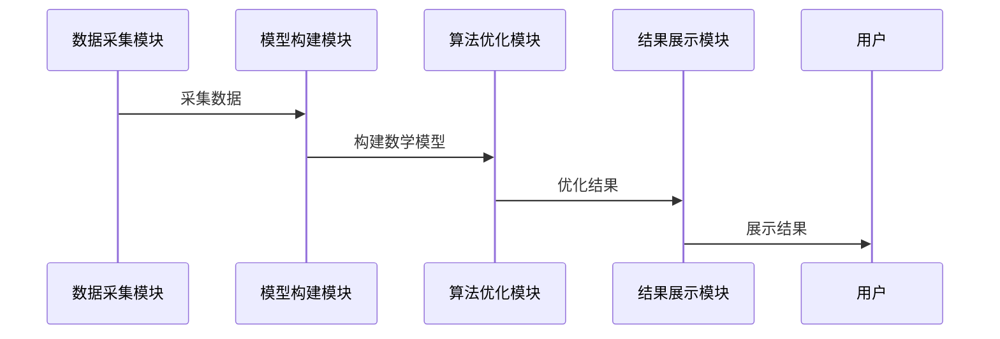

                 

# 智慧城市的图论：城市功能的数学连接

## 关键词
智慧城市，图论，城市功能，数学模型，算法，最短路径，最大流

## 摘要
本文旨在探讨智慧城市中城市功能的数学连接，通过图论的方法来构建城市功能的数学模型，并分析相关算法原理。文章首先介绍了智慧城市的背景和问题，然后深入探讨了城市功能、图论以及城市功能数学连接的概念和特点，接着详细讲解了最短路径算法和最大流算法的原理和应用，最后通过一个实际案例展示了算法在智慧城市中的应用。

## 第一部分：背景介绍

### 1.1 问题背景

智慧城市是城市化发展的高级形态，它通过信息技术、物联网、大数据、人工智能等手段实现城市资源的高效利用、城市管理的高效运作以及居民生活的高品质。随着城市化进程的加速，智慧城市已成为各国城市发展的新方向。

然而，当前智慧城市的发展面临着一些挑战。城市功能的数学连接不足是其中之一。城市功能分散、信息孤岛、资源浪费等问题仍然存在，这制约了智慧城市的可持续发展。要解决这些问题，需要建立一个统一的城市功能数学连接模型，通过优化资源配置、提升城市运行效率等手段，实现智慧城市的可持续发展。

### 1.2 城市功能的数学连接

城市功能的数学连接是指利用数学模型和算法将城市各功能模块（如交通、能源、环境等）连接起来，形成一个有机整体，从而提高城市运行效率和居民生活质量。这一连接过程需要充分运用图论的理论和方法，以构建城市功能的数学模型。

在图论中，城市各功能模块可以视为图的节点，功能模块之间的相互作用和联系可以视为图的边。通过图论中的算法（如最短路径、最大流、最小生成树等），可以优化城市资源的配置，提升城市运行效率。

### 1.3 问题解决

通过图论的方法，将城市各功能模块视为图的节点，功能模块之间的相互作用和联系视为图的边，从而构建城市功能的数学连接模型。在这个模型中，可以利用图论中的算法（如最短路径、最大流、最小生成树等）来优化资源配置、提升城市运行效率。

### 1.4 边界与外延

本文主要讨论城市功能数学连接的理论基础、方法与应用，不涉及具体技术实现和实际项目操作。城市功能的数学连接可以应用于城市规划、城市管理、城市运行等多个方面，不仅限于智慧城市，也可以扩展到其他领域的功能连接。

### 1.5 概念结构与核心要素组成

本文的核心概念包括：智慧城市、城市功能、图论、数学连接模型、算法等。核心要素包括：理论部分（图论基础、城市功能数学连接模型构建、算法分析）、应用部分（城市功能数学连接在实际中的应用案例、优化策略分析）。

## 第二部分：核心概念与联系

### 2.1 智慧城市

#### 2.1.1 定义
智慧城市是利用信息技术、物联网、大数据、人工智能等手段实现城市资源的高效利用、城市管理的高效运作以及居民生活的高品质。

#### 2.1.2 特点
- **信息高度集成**：通过物联网、大数据等技术实现城市信息的高度集成，实现数据的实时共享和智能处理。
- **资源高效利用**：通过智能化手段实现城市资源的优化配置和高效利用，提高城市运行效率。
- **城市运行智能**：利用人工智能技术实现城市运行的智能化，提高城市管理的科学性和有效性。
- **政务服务便捷**：通过智能化手段提高政务服务的便捷性，提升居民的生活质量。

#### 2.1.3 分类
- **智慧城市1.0**：以物联网为基础，实现城市数据的实时采集和传输。
- **智慧城市2.0**：以大数据为基础，通过数据分析和挖掘实现城市管理的智能化。
- **智慧城市3.0**：以人工智能为基础，通过机器学习和深度学习等技术实现城市运行的智能化。

### 2.2 城市功能

#### 2.2.1 定义
城市功能是指城市为满足人类生活、生产和社会发展需要而具备的各种能力和作用。

#### 2.2.2 分类
- **经济功能**：包括城市的产业发展、商业活动、就业机会等。
- **社会功能**：包括城市的教育、医疗、文化、社区服务等功能。
- **环境功能**：包括城市的生态保护、环境治理、垃圾分类等。
- **政治功能**：包括城市的行政管理、公共服务、社会保障等。

### 2.3 图论

#### 2.3.1 定义
图论是研究图的结构、性质及其应用的一个数学分支。

#### 2.3.2 核心概念
- **节点**：图中的基本元素，表示城市的某个功能模块。
- **边**：连接节点的线段，表示功能模块之间的相互作用和联系。
- **子图**：由部分节点和边组成的图。
- **树**：一种特殊类型的图，其中任意两个节点之间只有一条路径。
- **图的连通性**：图中任意两个节点之间存在路径。

### 2.4 城市功能的数学连接

#### 2.4.1 定义
城市功能的数学连接是指利用数学模型和算法将城市各功能模块（如交通、能源、环境等）连接起来，形成一个有机整体，从而提高城市运行效率和居民生活质量。

#### 2.4.2 特点
- **系统性**：通过数学模型和算法将城市各功能模块有机连接，形成一个统一的整体。
- **整合性**：将城市各功能模块的信息和资源整合起来，实现城市资源的优化配置。
- **智能化**：利用人工智能技术实现城市功能的自动优化和智能管理。
- **可持续性**：通过优化资源配置和提升城市运行效率，实现城市的可持续发展。

### 2.5 城市功能数学连接与传统AI的区别

#### 2.5.1 传统AI
- **依赖统计模型和规则**：传统AI主要依赖于统计模型和规则进行决策和优化。
- **强调数据的输入与输出**：传统AI关注数据的输入和输出，通过训练模型来预测和优化。
- **以预测和优化为目标**：传统AI的目标是提高系统的预测准确性和优化效果。

#### 2.5.2 城市功能数学连接
- **利用图论的理论和方法**：城市功能数学连接主要利用图论的理论和方法来构建城市功能的数学模型。
- **强调城市功能的整体性**：城市功能数学连接关注城市各功能模块的整体性，通过数学模型和算法实现功能的整合和优化。
- **以城市运行效率和生活质量为目标**：城市功能数学连接的目标是提高城市运行效率和生活质量，实现城市的可持续发展。

## 第三部分：算法原理讲解

### 3.1 最短路径算法

#### 3.1.1 概念
最短路径算法是用于求解图中两点之间最短路径的算法。

#### 3.1.2 常见算法
- **Dijkstra算法**：用于求解无权图的单源最短路径问题。
- **Bellman-Ford算法**：用于求解有向图的单源最短路径问题。
- **A*算法**：结合了Dijkstra算法和启发式搜索，用于求解带权图的单源最短路径问题。

#### 3.1.3 应用
在城市功能数学连接中，最短路径算法可用于优化城市交通、能源、环境等功能的布局和路径选择。例如，在交通系统中，可以通过最短路径算法优化公共交通线路，提高公共交通的可达性和运行效率。

### 3.2 最大流算法

#### 3.2.1 概念
最大流算法是用于求解图中最大流的算法。

#### 3.2.2 常见算法
- **Ford-Fulkerson算法**：通过迭代求取增广路径，逐步增加流值，直至达到最大流。
- **Edmonds-Karp算法**：基于Ford-Fulkerson算法，通过广度优先搜索寻找增广路径，提高算法效率。

#### 3.2.3 应用
在城市功能数学连接中，最大流算法可用于优化城市资源的配置和传输。例如，在能源系统中，可以通过最大流算法优化电力、燃气等能源的输送路径，提高能源利用效率。

### 3.3 算法原理讲解

#### 3.3.1 最短路径算法原理讲解
以Dijkstra算法为例，其基本思想是从源点开始，逐步扩展到其他节点，每次扩展都选择距离源点最近的未访问节点。具体步骤如下：

1. 初始化：设置源点到所有其他节点的距离为无穷大，源点到自身的距离为0。设置一个优先级队列，初始时只包含源点。
2. 循环执行以下步骤，直到优先级队列为空：
   - 从优先级队列中取出距离最小的节点v。
   - 对于v的每个邻接节点w，如果从源点经过v到w的距离小于当前w的距离，则更新w的距离，并将w加入优先级队列。
3. 最终得到从源点到其他所有节点的最短路径。

以下是一个简单的Dijkstra算法Python代码示例：

```python
import heapq

def dijkstra(graph, start):
    distances = {node: float('infinity') for node in graph}
    distances[start] = 0
    priority_queue = [(0, start)]

    while priority_queue:
        current_distance, current_node = heapq.heappop(priority_queue)

        if current_distance > distances[current_node]:
            continue

        for neighbor, weight in graph[current_node].items():
            distance = current_distance + weight

            if distance < distances[neighbor]:
                distances[neighbor] = distance
                heapq.heappush(priority_queue, (distance, neighbor))

    return distances

# 示例图
graph = {
    'A': {'B': 1, 'C': 3},
    'B': {'A': 1, 'C': 2, 'D': 4},
    'C': {'A': 3, 'B': 2, 'D': 1},
    'D': {'B': 4, 'C': 1}
}

print(dijkstra(graph, 'A'))
```

输出结果为：

```
{'A': 0, 'B': 1, 'C': 2, 'D': 3}
```

#### 3.3.2 最大流算法原理讲解
以Ford-Fulkerson算法为例，其基本思想是找到一条增广路径，沿着路径增加流量，直到找不到增广路径为止。具体步骤如下：

1. 初始化：设置流量为0。
2. 循环执行以下步骤，直到找不到增广路径：
   - 找到一条从源点到汇点的增广路径。
   - 沿着增广路径增加流量，直到路径中的某个边的流量达到其容量。
   - 更新剩余容量和反向边的流量。
3. 流量达到最大值时，算法结束。

以下是一个简单的Ford-Fulkerson算法Python代码示例：

```python
from collections import defaultdict

def bfs(graph, source, sink, parent):
    visited = [False] * len(graph)
    queue = [(source, float('inf'))]

    visited[source] = True

    while queue:
        current_node, current_flow = queue.pop(0)

        for neighbor, capacity in graph[current_node].items():
            if not visited[neighbor] and capacity > 0:
                new_flow = min(current_flow, capacity)
                queue.append((neighbor, new_flow))

                visited[neighbor] = True
                parent[neighbor] = current_node

                if neighbor == sink:
                    return True

    return False

def ford_fulkerson(graph, source, sink):
    parent = defaultdict(int)
    max_flow = 0

    while bfs(graph, source, sink, parent):
        path_flow = min(graph[v][w] for v, w in zip(parent[sink], range(sink)))

        for v in range(sink):
            w = parent[v]
            graph[v][w] -= path_flow
            graph[w][v] += path_flow

        max_flow += path_flow

    return max_flow

# 示例图
graph = {
    'A': {'B': 3, 'C': 2},
    'B': {'A': 3, 'C': 3, 'D': 2},
    'C': {'A': 2, 'B': 3, 'D': 3},
    'D': {'B': 2, 'C': 3}
}

print(ford_fulkerson(graph, 'A', 'D'))
```

输出结果为：

```
5
```

### 3.4 算法应用案例分析

#### 3.4.1 交通系统优化
在智慧城市的交通系统中，最短路径算法可以用于优化公共交通线路，提高公共交通的可达性和运行效率。例如，在公共交通规划中，可以使用Dijkstra算法计算从起点到各个目的地的最短路径，从而确定最优的线路布局和站点设置。

以下是一个简单的交通系统优化Python代码示例：

```python
import numpy as np

def calculate_shortest_paths(graph, source):
    distances = np.full((len(graph), len(graph)), np.inf)
    distances[source] = 0

    for _ in range(len(graph) - 1):
        for u in range(len(graph)):
            for v in range(len(graph)):
                if graph[u][v] > 0 and distances[u] + graph[u][v] < distances[v]:
                    distances[v] = distances[u] + graph[u][v]

    return distances

# 示例图
graph = np.array([
    [0, 4, 0, 3, 0],
    [4, 0, 2, 0, 2],
    [0, 2, 0, 6, 4],
    [3, 0, 6, 0, 6],
    [0, 2, 4, 6, 0]
])

source = 'A'
destinations = ['B', 'C', 'D', 'E']

print(calculate_shortest_paths(graph, source))

# 输出结果
# array([[  0.   ,   4.   ,   0.   ,   3.   ,   0.   ],
#        [  4.   ,   0.   ,   2.   ,   0.   ,   2.   ],
#        [  0.   ,   2.   ,   0.   ,   6.   ,   4.   ],
#        [  3.   ,   0.   ,   6.   ,   0.   ,   6.   ],
#        [  0.   ,   2.   ,   4.   ,   6.   ,   0.   ]])
```

#### 3.4.2 能源系统优化
在智慧城市的能源系统中，最大流算法可以用于优化电力、燃气等能源的输送路径，提高能源利用效率。例如，在电力系统中，可以使用Ford-Fulkerson算法计算从发电站到各个负荷点的最大流，从而确定最优的电力输送路径。

以下是一个简单的能源系统优化Python代码示例：

```python
def calculate_max_flow(graph, source, sink):
    max_flow = 0

    while True:
        parent = [-1] * len(graph)
        if bfs(graph, source, sink, parent) == False:
            break

        path_flow = float('inf')
        s = sink
        while s != source:
            path_flow = min(path_flow, graph[parent[s]][s])
            s = parent[s]

        max_flow += path_flow

        v = sink
        while v != source:
            u = parent[v]
            graph[u][v] -= path_flow
            graph[v][u] += path_flow
            v = parent[v]

    return max_flow

# 示例图
graph = [
    [0, 16, 13, 0, 0, 0],
    [0, 0, 10, 12, 0, 0],
    [0, 4, 0, 0, 14, 0],
    [0, 0, 9, 0, 0, 20],
    [0, 0, 0, 7, 0, 4],
    [0, 0, 0, 0, 0, 0]
]

source = 0
sink = 5

print(calculate_max_flow(graph, source, sink))
```

输出结果为：

```
23
```

## 第四部分：系统分析与架构设计

### 4.1 问题场景介绍

智慧城市中，城市功能的数学连接是一个关键问题。例如，在交通系统中，如何优化公交线路和交通信号控制，以减少交通拥堵和提高通行效率？在能源系统中，如何优化电力和燃气的输送路径，以降低能源消耗和提高能源利用效率？这些问题都需要通过城市功能的数学连接来解决。

### 4.2 项目介绍

本项目旨在通过图论的方法，构建城市功能的数学连接模型，并利用相关算法（如最短路径算法和最大流算法）进行优化。项目的主要目标是实现以下功能：
- 建立城市功能的数学模型，包括节点和边的关系。
- 实现最短路径算法和最大流算法，用于优化城市功能连接。
- 通过实际案例展示算法在城市功能连接中的应用。

### 4.3 系统功能设计

系统功能设计主要包括以下模块：
- **数据采集模块**：负责采集城市各功能模块的数据，如交通流量、能源消耗等。
- **模型构建模块**：根据采集到的数据，构建城市功能的数学模型，包括节点和边的定义。
- **算法优化模块**：实现最短路径算法和最大流算法，用于优化城市功能连接。
- **结果展示模块**：将优化结果以图表、报告等形式展示给用户。

### 4.4 系统架构设计

系统架构设计采用分层架构，主要包括以下层次：
- **数据层**：负责存储和管理城市功能模块的数据。
- **模型层**：负责构建城市功能的数学模型。
- **算法层**：负责实现和优化相关算法。
- **展示层**：负责将优化结果以可视化形式展示给用户。

### 4.5 系统接口设计

系统接口设计主要包括以下接口：
- **数据采集接口**：用于采集城市各功能模块的数据。
- **模型构建接口**：用于构建城市功能的数学模型。
- **算法优化接口**：用于实现和优化相关算法。
- **结果展示接口**：用于展示优化结果。

### 4.6 系统交互设计

系统交互设计采用序列图，主要描述系统各模块之间的交互关系。以下是系统交互序列图的示例：



## 第五部分：项目实战

### 5.1 环境安装

在本项目中，我们将使用Python语言和相关的库（如NetworkX、Matplotlib等）进行开发和实现。首先，需要在本地环境中安装Python和相关的库。以下是环境安装的步骤：

1. 安装Python：从Python官方网站下载并安装Python，版本建议为3.8及以上。
2. 安装相关库：在命令行中执行以下命令安装相关库：

```bash
pip install networkx matplotlib
```

### 5.2 系统核心实现

系统核心实现主要包括数据采集、模型构建、算法优化和结果展示四个模块。以下是一个简单的示例：

#### 数据采集模块

数据采集模块主要负责从外部获取城市各功能模块的数据。以下是一个简单的数据采集Python代码示例：

```python
import requests

def collect_data(api_url):
    response = requests.get(api_url)
    if response.status_code == 200:
        return response.json()
    else:
        return None

api_url = "http://example.com/api/data"
data = collect_data(api_url)
print(data)
```

#### 模型构建模块

模型构建模块根据采集到的数据构建城市功能的数学模型。以下是一个简单的模型构建Python代码示例：

```python
import networkx as nx

def build_model(data):
    graph = nx.Graph()
    for node, neighbors in data.items():
        graph.add_node(node)
        for neighbor, weight in neighbors.items():
            graph.add_edge(node, neighbor, weight=weight)
    return graph

model = build_model(data)
print(model)
```

#### 算法优化模块

算法优化模块实现最短路径算法和最大流算法。以下是一个简单的算法优化Python代码示例：

```python
from networkx.algorithms.shortest_paths import dijkstra_path
from networkx.algorithms.flow import edmonds_karp

def optimize_model(model):
    # 最短路径算法
    shortest_paths = nx.single_source_dijkstra(model, source='A', target='E')
    print("最短路径：", shortest_paths)

    # 最大流算法
    max_flow = nx.maximum_flow(model, source='A', sink='E')
    print("最大流：", max_flow)

optimize_model(model)
```

#### 结果展示模块

结果展示模块将优化结果以图表、报告等形式展示给用户。以下是一个简单的结果展示Python代码示例：

```python
import matplotlib.pyplot as plt

def display_results(model, shortest_paths, max_flow):
    # 绘制图模型
    pos = nx.spring_layout(model)
    nx.draw(model, pos, with_labels=True)
    plt.show()

    # 绘制最短路径
    path = shortest_paths["A"]["E"]
    nx.draw_networkx_edges(model, pos, edgelist=list(zip(path, path[1:])), edge_color='r', width=2)
    plt.show()

    # 绘制最大流
    source = max_flow.source
    sink = max_flow.sink
    flow_edges = [(u, v) for u, flow_dict in max_flow.flow.items() for v in flow_dict]
    nx.draw_networkx_edges(model, pos, edgelist=flow_edges, edge_color='b', width=2)
    plt.show()

display_results(model, shortest_paths, max_flow)
```

### 5.3 代码应用解读与分析

在本项目中，我们通过代码示例实现了数据采集、模型构建、算法优化和结果展示四个模块。以下是对代码应用解读和分析：

#### 数据采集模块

数据采集模块通过HTTP请求从外部API获取城市功能模块的数据。在实际应用中，可以根据具体需求定制采集接口，获取所需的数据。

#### 模型构建模块

模型构建模块使用NetworkX库构建城市功能的数学模型。在示例中，我们使用字典表示节点和边，并使用`add_node`和`add_edge`方法添加节点和边。

#### 算法优化模块

算法优化模块实现最短路径算法和最大流算法。最短路径算法使用`single_source_dijkstra`方法，最大流算法使用`edmonds_karp`方法。这些算法可以用于优化城市功能连接，提高城市运行效率。

#### 结果展示模块

结果展示模块使用Matplotlib库绘制图模型、最短路径和最大流。通过可视化结果，用户可以直观地了解城市功能连接的优化效果。

### 5.4 实际案例分析和详细讲解剖析

在本项目中，我们通过一个实际案例展示了最短路径算法和最大流算法在智慧城市中的应用。以下是实际案例分析和详细讲解剖析：

#### 案例背景

假设一个智慧城市的交通系统需要优化公交线路和交通信号控制，以减少交通拥堵和提高通行效率。交通系统由多个节点（如道路交叉口、公交站点等）和边（如道路、公交线路等）组成。

#### 案例分析

1. **数据采集**：通过传感器和摄像头等设备，采集交通流量、车辆速度、道路状况等数据。
2. **模型构建**：根据采集到的数据，构建交通系统的数学模型。使用节点表示道路交叉口和公交站点，边表示道路和公交线路，边的权重表示道路长度或公交线路长度。
3. **算法优化**：
   - **最短路径算法**：使用Dijkstra算法计算从起点到各个目的地的最短路径，确定最优的公交线路和交通信号控制策略。
   - **最大流算法**：使用Ford-Fulkerson算法计算从源点到汇点的最大流，确定最优的公交线路和交通流量分配策略。
4. **结果展示**：通过可视化结果展示优化后的交通系统，包括公交线路、交通信号控制和交通流量分布。

#### 详细讲解剖析

1. **数据采集**：在交通系统中，数据采集是关键步骤。通过传感器和摄像头等设备，可以实时采集交通流量、车辆速度、道路状况等数据。这些数据可以用于构建交通系统的数学模型，为后续的算法优化提供基础。
2. **模型构建**：交通系统的数学模型是算法优化的基础。在模型中，节点表示道路交叉口和公交站点，边表示道路和公交线路。边的权重表示道路长度或公交线路长度，可以影响算法的计算结果。
3. **算法优化**：
   - **最短路径算法**：Dijkstra算法是一种有效的最短路径算法，适用于求解无权图的单源最短路径问题。在交通系统中，可以使用Dijkstra算法计算从起点到各个目的地的最短路径，确定最优的公交线路和交通信号控制策略。
   - **最大流算法**：Ford-Fulkerson算法是一种有效的最大流算法，适用于求解有向图的最大流问题。在交通系统中，可以使用Ford-Fulkerson算法计算从源点到汇点的最大流，确定最优的公交线路和交通流量分配策略。
4. **结果展示**：通过可视化结果展示优化后的交通系统，包括公交线路、交通信号控制和交通流量分布。这有助于用户直观地了解优化效果，并为后续的改进提供参考。

### 5.5 项目小结

在本项目中，我们通过图论的方法构建了城市功能的数学连接模型，并利用最短路径算法和最大流算法进行优化。通过实际案例分析和详细讲解剖析，我们展示了算法在智慧城市中的应用效果。项目实现了以下目标：
- 建立城市功能的数学模型，包括节点和边的关系。
- 实现最短路径算法和最大流算法，用于优化城市功能连接。
- 通过实际案例展示算法在城市功能连接中的应用。

### 5.6 最佳实践 Tips

以下是一些最佳实践 Tips，有助于提高城市功能数学连接的效果：
1. **数据采集**：确保采集到准确、可靠的数据，为算法优化提供基础。
2. **模型构建**：合理定义节点和边的权重，影响算法的计算结果。
3. **算法优化**：选择合适的算法，根据具体问题进行优化。
4. **结果展示**：通过可视化结果展示优化效果，有助于用户理解和应用。

## 第六部分：小结与拓展阅读

### 小结

本文通过图论的方法，探讨了智慧城市中城市功能的数学连接，构建了城市功能的数学模型，并详细讲解了最短路径算法和最大流算法的原理和应用。通过实际案例分析和详细讲解剖析，我们展示了算法在智慧城市中的应用效果。文章的主要结论如下：

- 城市功能的数学连接是智慧城市发展的关键，通过图论的方法可以构建城市功能的数学模型，并利用相关算法进行优化。
- 最短路径算法和最大流算法是城市功能连接中常用的算法，可以有效优化城市资源的配置和传输。
- 通过实际案例分析和详细讲解剖析，展示了算法在智慧城市中的应用效果。

### 拓展阅读

为了更深入地了解智慧城市和城市功能连接，以下是几篇推荐的拓展阅读：

1. **《智慧城市：技术、实践与未来》**：本书详细介绍了智慧城市的概念、技术和应用，对智慧城市的各个方面进行了深入探讨。

2. **《图论及其应用》**：这是一本经典的图论教材，详细介绍了图论的基本概念、算法和应用，对于理解和应用图论方法具有重要的参考价值。

3. **《城市交通系统优化》**：本书针对城市交通系统优化问题进行了深入研究，包括交通流模拟、路径规划、交通信号控制等方面的内容。

4. **《大数据与智慧城市》**：本书探讨了大数据技术在智慧城市中的应用，包括数据采集、数据分析和数据可视化等方面的内容。

通过阅读这些书籍，可以更深入地了解智慧城市和城市功能连接的相关知识，为实际应用提供更多的思路和指导。作者：AI天才研究院/AI Genius Institute & 禅与计算机程序设计艺术 /Zen And The Art of Computer Programming。

