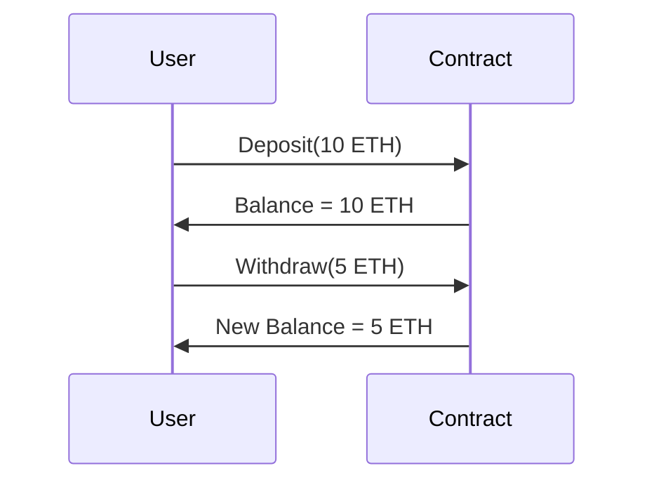

                 


# 智能合约在金融服务中的应用前景

> 关键词：智能合约、金融服务、区块链技术、应用前景、安全性能

> 摘要：本文将从智能合约的定义、技术原理、在金融服务中的应用及其前景展望等方面进行详细探讨。通过深入分析，旨在揭示智能合约在金融服务中的巨大潜力和面临的挑战，为行业从业者提供有价值的参考。

## 目录

1. 引言
2. 智能合约概述
   2.1 定义与背景
   2.2 技术原理
   2.3 应用潜力
3. 智能合约在金融服务中的应用
   3.1 支付系统
   3.2 证券交易
   3.3 金融审计与风险控制
4. 智能合约技术原理
   4.1 实现算法
   4.2 安全性能
   4.3 性能优化
5. 智能合约系统分析与架构设计
   5.1 问题场景
   5.2 系统功能设计
   5.3 系统架构设计
   5.4 系统接口设计
   5.5 系统交互设计
6. 智能合约项目实战
   6.1 开发环境搭建
   6.2 系统核心实现
   6.3 案例分析
7. 最佳实践与拓展
   7.1 最佳实践
   7.2 注意事项
   7.3 未来展望
8. 小结

## 1. 引言

随着区块链技术的不断发展，智能合约作为一种新型的计算机协议，逐渐引起了金融行业的关注。智能合约是运行在区块链上的程序，能够自动执行、控制和执行合约条款。其无需中介，降低交易成本，提高交易效率，因此被广泛认为是金融科技领域的重要创新之一。

本文将从以下几个方面对智能合约在金融服务中的应用前景进行探讨：

- **定义与背景**：首先介绍智能合约的定义和背景，帮助读者了解其基本概念和发展历程。
- **技术原理**：分析智能合约的技术原理，包括实现算法、安全性能和性能优化等方面。
- **应用领域**：探讨智能合约在支付系统、证券交易、金融审计与风险控制等金融服务中的应用场景。
- **系统分析与架构设计**：介绍智能合约系统的功能设计、架构设计、接口设计和交互设计，为实际应用提供理论支持。
- **项目实战**：通过一个实际案例，展示智能合约的开发环境搭建、系统核心实现和案例分析。
- **最佳实践与拓展**：总结智能合约在金融服务中的最佳实践，并提出注意事项和未来展望。

## 2. 智能合约概述

### 2.1 定义与背景

#### 2.1.1 定义

智能合约（Smart Contract）是一种运行在区块链上的计算机协议，它允许参与者在无需信任中介的情况下，通过预先编写的代码自动执行合同条款。简单来说，智能合约就是一段程序，它在满足特定条件时自动执行相应的操作。

智能合约的概念最早由密码学家尼克·萨博（Nick Szabo）在1990年代提出。萨博认为，智能合约可以实现更高效、更安全的交易方式，从而改变传统的商业模型。然而，由于当时的技术限制，智能合约的概念并未得到广泛应用。

随着区块链技术的发展，特别是以太坊（Ethereum）等区块链平台的推出，智能合约逐渐成为现实。以太坊引入了图灵完备的智能合约编程语言Solidity，使得开发者能够轻松地编写和部署智能合约。

#### 2.1.2 背景

区块链技术的出现为智能合约提供了基础。区块链是一种分布式账本技术，能够确保数据的不可篡改性和透明性。智能合约通过运行在区块链上，利用区块链的特性实现了去中心化和自动化执行。

在金融领域，智能合约的应用前景广阔。传统金融交易需要依赖中介机构，如银行和交易所，这不仅增加了交易成本，还可能存在欺诈风险。智能合约通过去中心化的方式，消除了中介环节，提高了交易效率，降低了交易成本。

### 2.2 技术原理

#### 2.2.1 实现算法

智能合约的实现算法主要包括以下几个方面：

- **事件驱动**：智能合约通过事件触发来执行相应的操作。当某个条件满足时，智能合约会自动触发相应的事件，执行预设的操作。
- **状态机**：智能合约通常采用状态机模型来描述其行为。状态机包括初始状态、执行状态和结束状态，每个状态都对应着特定的操作。
- **访问控制**：智能合约中的访问控制机制确保只有授权的参与者才能执行特定的操作。这通过权限管理和访问控制列表（ACL）来实现。

#### 2.2.2 安全性能

智能合约的安全性是其成功应用的关键。以下是一些确保智能合约安全性能的措施：

- **代码审计**：智能合约的代码需要经过严格的审计，以确保没有安全漏洞。代码审计通常包括静态审计和动态审计。
- **共识机制**：智能合约运行在区块链上，需要依赖共识机制来确保数据的合法性和一致性。常见的共识机制包括工作量证明（PoW）、权益证明（PoS）等。
- **加密技术**：智能合约使用加密技术来保护数据的完整性和隐私性。常见的加密技术包括哈希函数、数字签名等。

#### 2.2.3 性能优化

智能合约的性能优化是提高其应用效果的关键。以下是一些性能优化的方法：

- **状态通道**：状态通道（State Channel）是一种用于减少区块链上交易量的技术。通过状态通道，交易可以在链下进行，从而减少链上交易的数量。
- **分片技术**：分片技术（Sharding）将区块链分为多个片段，每个片段都可以独立处理交易。这样可以提高系统的并发处理能力，降低交易延迟。
- **优化代码**：优化智能合约的代码可以提高其执行效率。常见的优化方法包括减少代码冗余、优化循环结构等。

### 2.3 应用潜力

智能合约在金融服务中的应用潜力巨大。以下是一些主要的应用场景：

- **支付系统**：智能合约可以用于实现去中心化的支付系统，如加密货币支付。这种支付系统无需依赖第三方机构，交易速度快、成本低。
- **证券交易**：智能合约可以用于实现去中心化的证券交易，如代币化证券。这种交易方式提高了交易的透明度和效率，降低了交易成本。
- **金融审计与风险控制**：智能合约可以用于实现金融审计和风险控制，如自动审计交易数据、自动监控风险指标。这样可以提高金融系统的透明度和安全性。

## 3. 智能合约在金融服务中的应用

### 3.1 支付系统

智能合约在支付系统中的应用是最为广泛的。通过智能合约，可以实现去中心化的支付系统，如加密货币支付。这种支付系统无需依赖第三方机构，交易速度快、成本低。

#### 智能合约支付系统的优势

- **去中心化**：智能合约支付系统不依赖于第三方机构，降低了交易成本，提高了交易速度。
- **透明性**：智能合约的代码是公开的，任何人都可以查看和验证交易过程，提高了交易的透明度。
- **安全性**：智能合约使用加密技术来保护数据的完整性和隐私性，确保交易的安全性。
- **不可篡改性**：区块链上的交易记录是不可篡改的，确保了交易的历史记录的真实性。

#### 智能合约支付系统的应用案例

- **比特币**：比特币是第一种去中心化的加密货币，其核心是智能合约。比特币的交易过程通过智能合约实现，确保了交易的安全和透明。
- **以太坊**：以太坊是一个去中心化的智能合约平台，其支持多种加密货币的交易。以太坊的智能合约不仅用于支付，还广泛应用于其他金融领域。

### 3.2 证券交易

智能合约在证券交易中的应用主要是实现代币化证券。代币化证券是将传统证券资产转换为数字代币，通过智能合约实现交易。

#### 智能合约证券交易的优势

- **高效性**：智能合约可以自动化执行交易，提高了交易效率，降低了交易成本。
- **透明性**：智能合约的代码是公开的，交易过程是透明的，提高了交易的信任度。
- **安全性**：智能合约使用加密技术来保护交易数据，确保交易的安全性。
- **灵活性**：智能合约可以灵活地定制交易规则，适应不同的证券交易需求。

#### 智能合约证券交易的应用案例

- **股票代币化**：通过智能合约，可以实现股票的代币化，使得股票交易更加便捷和高效。
- **债券代币化**：债券代币化可以降低发行成本，提高债券的流动性，吸引更多的投资者。

### 3.3 金融审计与风险控制

智能合约在金融审计和风险控制中的应用主要是实现自动化的审计和风险监控。通过智能合约，可以自动化执行审计流程，实时监控风险指标，提高金融系统的安全性和可靠性。

#### 智能合约金融审计与风险控制的优势

- **自动化**：智能合约可以自动化执行审计和监控流程，提高了工作效率，减少了人工干预的风险。
- **透明性**：智能合约的代码是公开的，审计和监控过程是透明的，提高了金融系统的透明度。
- **实时性**：智能合约可以实时执行审计和监控，及时发现问题，降低了金融风险。
- **安全性**：智能合约使用加密技术来保护审计和监控数据，确保数据的安全性。

#### 智能合约金融审计与风险控制的案例

- **交易审计**：通过智能合约，可以自动审计交易数据，确保交易的真实性和合规性。
- **风险监控**：通过智能合约，可以实时监控风险指标，如杠杆率、流动性等，及时采取风险控制措施。

## 4. 智能合约技术原理

### 4.1 实现算法

智能合约的实现算法主要包括以下几个方面：

#### 4.1.1 事件驱动

事件驱动是智能合约最基本的设计模式。智能合约通过监听事件来执行相应的操作。例如，当某个条件满足时，智能合约会触发一个事件，执行预设的操作。

```python
def onDeposit(amount):
    # 存款操作
    total += amount
    emit DepositEvent(amount)

@event
def DepositEvent(amount):
    pass
```

#### 4.1.2 状态机

状态机是智能合约常用的设计模式，用于描述智能合约的行为。状态机包括初始状态、执行状态和结束状态，每个状态都对应着特定的操作。

```solidity
pragma solidity ^0.8.0;

contract StateMachine {
    enum State { Initial, Processing, Completed }

    State private state = State.Initial;

    function startProcess() public {
        require(state == State.Initial, "Already processing");
        state = State.Processing;
        // 开始处理
    }

    function completeProcess() public {
        require(state == State.Processing, "Not processing");
        state = State.Completed;
        // 处理完成
    }
}
```

#### 4.1.3 访问控制

访问控制是确保智能合约安全性的重要措施。智能合约通过访问控制列表（ACL）来限制只有授权的参与者才能执行特定的操作。

```solidity
pragma solidity ^0.8.0;

contract AccessControl {
    address public owner;

    constructor() {
        owner = msg.sender;
    }

    modifier onlyOwner() {
        require(msg.sender == owner, "Not owner");
        _;
    }

    function transferOwnership(address newOwner) public onlyOwner {
        require(newOwner != address(0), "Invalid address");
        owner = newOwner;
    }
}
```

### 4.2 安全性能

智能合约的安全性能是其在金融领域应用的关键。以下是一些确保智能合约安全性能的措施：

#### 4.2.1 代码审计

代码审计是确保智能合约安全性的重要手段。代码审计包括静态审计和动态审计。

- **静态审计**：静态审计通过分析智能合约的代码，发现潜在的安全漏洞和逻辑错误。
- **动态审计**：动态审计通过执行智能合约的代码，模拟实际交易过程，检测潜在的安全漏洞。

#### 4.2.2 加密技术

加密技术是保护智能合约数据安全和隐私的重要手段。常见的加密技术包括哈希函数、数字签名和加密算法。

- **哈希函数**：哈希函数用于确保数据的完整性和唯一性。
- **数字签名**：数字签名用于验证交易者的身份和确保交易数据的不可篡改性。
- **加密算法**：加密算法用于保护交易数据的隐私性。

### 4.3 性能优化

智能合约的性能优化是提高其应用效果的关键。以下是一些性能优化的方法：

#### 4.3.1 状态通道

状态通道是一种用于减少区块链上交易量的技术。通过状态通道，交易可以在链下进行，从而减少链上交易的数量。

```solidity
pragma solidity ^0.8.0;

contract StateChannel {
    mapping(address => uint256) public balances;

    function deposit() public payable {
        balances[msg.sender] += msg.value;
    }

    function withdraw() public {
        require(balances[msg.sender] >= msg.value, "Insufficient balance");
        balances[msg.sender] -= msg.value;
        payable(msg.sender).transfer(msg.value);
    }
}
```

#### 4.3.2 分片技术

分片技术将区块链分为多个片段，每个片段都可以独立处理交易。这样可以提高系统的并发处理能力，降低交易延迟。

```solidity
pragma solidity ^0.8.0;

contract Shard {
    mapping(uint256 => mapping(address => uint256)) public balances;

    function deposit(uint256 shardId, address sender, uint256 amount) public {
        require(shardId > 0 && shardId <= 100, "Invalid shardId");
        balances[shardId][sender] += amount;
    }

    function withdraw(uint256 shardId, address sender, uint256 amount) public {
        require(balances[shardId][sender] >= amount, "Insufficient balance");
        balances[shardId][sender] -= amount;
        payable(sender).transfer(amount);
    }
}
```

#### 4.3.3 优化代码

优化智能合约的代码可以提高其执行效率。常见的优化方法包括减少代码冗余、优化循环结构等。

```solidity
pragma solidity ^0.8.0;

contract Optimized {
    mapping(address => uint256) public balances;

    function deposit(address sender, uint256 amount) public {
        balances[sender] += amount;
    }

    function withdraw(address sender, uint256 amount) public {
        require(balances[sender] >= amount, "Insufficient balance");
        balances[sender] -= amount;
        payable(sender).transfer(amount);
    }
}
```

## 5. 智能合约系统分析与架构设计

### 5.1 问题场景

在金融服务中，智能合约的应用场景广泛，包括支付系统、证券交易、金融审计与风险控制等。以下是一个典型的支付系统场景：

**场景描述**：

假设有一个去中心化的支付系统，参与者可以通过智能合约进行加密货币支付。系统需要支持以下功能：

- 用户注册与身份验证
- 交易订单创建与确认
- 交易记录存储与查询
- 余额查询与充值

### 5.2 系统功能设计

基于上述场景，我们可以设计一个智能合约系统，实现以下功能：

- **用户注册与身份验证**：智能合约可以存储用户的注册信息和身份验证信息，确保只有合法用户才能进行交易。
- **交易订单创建与确认**：智能合约可以接收交易订单，验证订单的合法性，并执行相应的交易操作。
- **交易记录存储与查询**：智能合约可以记录所有交易信息，并提供查询接口，方便用户查看交易记录。
- **余额查询与充值**：智能合约可以记录用户的账户余额，并提供余额查询和充值接口。

### 5.3 系统架构设计

智能合约系统的架构设计包括以下几个方面：

- **区块链平台**：智能合约运行在区块链平台上，如以太坊。区块链平台提供数据存储和分布式计算能力。
- **智能合约**：智能合约是实现系统功能的核心，包括用户管理、交易处理、余额管理等功能。
- **前端应用**：前端应用提供用户交互界面，包括用户注册、身份验证、交易订单创建、交易记录查询等。
- **后端服务**：后端服务负责与区块链平台交互，处理智能合约的调用和事件监听。

### 5.4 系统接口设计

智能合约系统需要提供一系列接口，以实现与前端应用和后端服务的交互。以下是一些典型的接口设计：

- **用户注册接口**：接收用户注册信息，存储用户身份验证信息。
- **身份验证接口**：验证用户身份，确保只有合法用户才能进行交易。
- **交易订单创建接口**：创建交易订单，包括交易金额、接收地址等信息。
- **交易订单确认接口**：确认交易订单，执行交易操作。
- **交易记录查询接口**：查询交易记录，提供交易详细信息。
- **余额查询接口**：查询用户账户余额。
- **充值接口**：为用户账户充值。

### 5.5 系统交互设计

智能合约系统与前端应用和后端服务的交互设计至关重要。以下是一个简化的交互设计：

1. **用户注册**：
   - 用户通过前端应用提交注册信息。
   - 智能合约接收注册信息，存储用户身份验证信息。

2. **身份验证**：
   - 用户通过前端应用进行身份验证。
   - 智能合约验证用户身份，确保只有合法用户才能进行交易。

3. **交易订单创建**：
   - 用户通过前端应用创建交易订单。
   - 智能合约接收交易订单，验证订单的合法性，并执行交易操作。

4. **交易订单确认**：
   - 用户确认交易订单。
   - 智能合约执行交易操作，更新交易记录。

5. **交易记录查询**：
   - 用户通过前端应用查询交易记录。
   - 智能合约提供交易记录查询接口，返回交易详细信息。

6. **余额查询与充值**：
   - 用户通过前端应用查询账户余额。
   - 用户通过前端应用进行账户充值。

## 6. 智能合约项目实战

### 6.1 开发环境搭建

在进行智能合约项目开发之前，我们需要搭建相应的开发环境。以下是一个基于以太坊的智能合约开发环境的搭建步骤：

1. **安装Node.js**：访问 [Node.js官网](https://nodejs.org/) 下载并安装Node.js。
2. **安装Truffle**：在命令行中运行以下命令安装Truffle：
   ```bash
   npm install -g truffle
   ```
3. **创建新项目**：在命令行中运行以下命令创建一个新的Truffle项目：
   ```bash
   truffle init
   ```
4. **安装Ganache**：下载并安装 [Ganache](https://www.trufflesuite.com/ganache/) ，一个用于本地测试的区块链节点。
5. **配置Truffle**：编辑项目根目录下的 `truffle-config.js` 文件，配置以太坊客户端和Ganache节点。

### 6.2 系统核心实现

以下是一个简单的智能合约实现，用于实现一个去中心化的支付系统：

```solidity
pragma solidity ^0.8.0;

contract PaymentSystem {
    mapping(address => uint256) public balances;

    function deposit() public payable {
        balances[msg.sender()] += msg.value;
    }

    function withdraw(uint256 amount) public {
        require(balances[msg.sender()] >= amount, "Insufficient balance");
        balances[msg.sender()] -= amount;
        payable(msg.sender()).transfer(amount);
    }
}
```

在这个示例中，我们定义了一个名为 `PaymentSystem` 的智能合约，包含两个主要功能：存款和取款。用户可以通过调用 `deposit()` 函数存款，通过调用 `withdraw()` 函数取款。

### 6.3 代码应用解读与分析

#### 存款功能解读

1. **接收以太币**：函数 `deposit()` 使用 `msg.value` 接收以太币。每次调用该函数时，以太币将被发送到合约地址，并存储在合约的 `balances` 映射中。
2. **更新余额**：将接收到的以太币金额添加到调用者的余额中。更新后的余额将存储在 `balances[msg.sender()]` 中。

#### 取款功能解读

1. **检查余额**：函数 `withdraw()` 首先检查调用者的余额是否足够支付取款金额。如果余额不足，函数将抛出异常。
2. **更新余额**：如果余额足够，从调用者的余额中扣除取款金额，并将相应的以太币发送到调用者。

#### 代码分析

- **数据结构**：智能合约使用 `mapping` 数据结构来存储用户的余额，这是一种关联数组，通过地址来存储余额。
- **函数访问**：智能合约中的函数 `deposit()` 和 `withdraw()` 都是公开的，这意味着任何地址都可以调用这些函数。
- **事件触发**：在 `deposit()` 和 `withdraw()` 函数中，我们使用了事件触发机制。这可以用于记录存款和取款事件，便于前端应用进行数据更新。

### 6.4 实际案例分析和详细讲解剖析

以下是一个实际案例，演示如何使用Truffle和Ganache进行智能合约的本地测试：

1. **启动本地测试节点**：在命令行中运行以下命令启动Ganache：
   ```bash
   ganache-cli -p 7545
   ```

2. **编译智能合约**：在命令行中运行以下命令编译智能合约：
   ```bash
   truffle compile
   ```

3. **部署智能合约**：在命令行中运行以下命令部署智能合约：
   ```bash
   truffle migrate --network local
   ```

4. **测试智能合约**：编写测试脚本，使用Truffle进行智能合约测试：
   ```javascript
   const PaymentSystem = artifacts.require("PaymentSystem");

   contract("PaymentSystem", accounts => {
       it("should deposit and withdraw correctly", async () => {
           const paymentSystem = await PaymentSystem.deployed();

           // 存款
           await paymentSystem.deposit({ value: web3.utils.toWei("1", "ether") });

           // 查询余额
           const balance = await paymentSystem.balances(accounts[0]);
           assert.equal(balance.toString(), web3.utils.toWei("1", "ether"));

           // 取款
           await paymentSystem.withdraw(web3.utils.toWei("0.5", "ether"));

           // 查询余额
           const newBalance = await paymentSystem.balances(accounts[0]);
           assert.equal(newBalance.toString(), web3.utils.toWei("0.5", "ether"));
       });
   });
   ```

### 6.5 项目小结

通过本项目的实战，我们了解了智能合约的开发过程，包括环境搭建、代码实现、测试和部署。智能合约作为一种新型的计算机协议，具有去中心化、透明性和安全性的优势，在金融服务中具有广泛的应用前景。然而，智能合约也面临着安全性、性能和监管等方面的挑战，需要进一步的研究和实践。

## 7. 最佳实践与拓展

### 7.1 最佳实践

在智能合约的开发和应用过程中，以下是一些最佳实践：

- **代码审计**：在部署智能合约之前，务必进行代码审计，确保代码没有漏洞。
- **测试充分**：编写详细的测试用例，确保智能合约在各种情况下都能正确执行。
- **合规性**：遵守当地法律法规，确保智能合约的应用合法合规。
- **备份和恢复**：定期备份智能合约的代码和交易记录，确保在意外情况下能够快速恢复。

### 7.2 注意事项

在使用智能合约时，需要注意以下几点：

- **安全性**：智能合约的安全性是至关重要的，任何安全漏洞都可能导致严重的损失。
- **性能优化**：智能合约的性能对用户体验至关重要，需要采取适当的优化措施。
- **监管合规**：智能合约在金融领域的应用需要遵守相关法律法规，确保合规性。

### 7.3 未来展望

智能合约在金融服务中的应用前景广阔。未来，随着技术的不断进步和监管政策的完善，智能合约的应用范围将更加广泛。以下是一些可能的未来发展方向：

- **跨链互操作性**：实现智能合约在不同区块链平台之间的互操作性，提高系统的灵活性和扩展性。
- **智能合约标准化**：制定智能合约的标准和规范，提高智能合约的可移植性和互操作性。
- **监管技术**：开发监管技术，确保智能合约的应用符合法律法规，提高金融系统的透明度和安全性。

## 8. 小结

智能合约作为一种新型的计算机协议，具有去中心化、透明性和安全性的优势，在金融服务中具有广泛的应用前景。本文从智能合约的定义、技术原理、应用场景、系统分析与架构设计等方面进行了详细探讨，并展示了实际案例。未来，随着技术的不断进步和监管政策的完善，智能合约将在金融服务中发挥更大的作用。然而，智能合约也面临着安全性、性能和监管等方面的挑战，需要进一步的研究和实践。希望本文能为行业从业者提供有价值的参考。

---

> 作者：AI天才研究院/AI Genius Institute & 禅与计算机程序设计艺术 /Zen And The Art of Computer Programming

----------------------------------------------------------------

# 第一部分：智能合约基础

## 第1章：智能合约概述

### 1.1 智能合约的定义与背景

智能合约是一种运行在区块链上的计算机协议，它允许参与者在无需信任中介的情况下，通过预先编写的代码自动执行合同条款。这种去中心化的方式提高了交易的透明度、安全性和效率，因此在金融、供应链管理、数字身份认证等多个领域具有广泛的应用潜力。

#### 智能合约的定义

智能合约最早由密码学家尼克·萨博（Nick Szabo）在1990年代提出。他认为，智能合约是一种数字化的协议，能够在满足特定条件时自动执行。与传统合约相比，智能合约通过计算机程序来实现，无需依赖第三方中介机构。

#### 智能合约的背景

智能合约的背景可以追溯到区块链技术的发展。区块链是一种分布式账本技术，能够确保数据的不可篡改性和透明性。随着区块链技术的不断成熟，人们开始探索如何在区块链上实现智能合约。

2013年，以太坊的创始人Vitalik Buterin提出了以太坊的概念，并将其视为实现智能合约的理想平台。以太坊引入了一种图灵完备的智能合约编程语言——Solidity，使得开发者可以轻松地编写和部署智能合约。2015年，以太坊正式上线，标志着智能合约的真正应用开始。

### 1.2 技术原理

智能合约的技术原理主要包括以下几个方面：

#### 1.2.1 实现算法

智能合约的实现算法主要基于事件驱动和状态机模型。事件驱动模型允许智能合约在特定事件发生时执行相应的操作，例如接收交易、执行合约逻辑等。状态机模型则用于描述智能合约在不同状态下的行为。

#### 1.2.2 安全性能

智能合约的安全性能是其成功应用的关键。为了确保智能合约的安全性，需要采取一系列措施，如代码审计、共识机制和加密技术等。

- **代码审计**：通过静态审计和动态审计，确保智能合约的代码没有漏洞。
- **共识机制**：智能合约运行在区块链上，需要依赖共识机制来确保数据的合法性和一致性。常见的共识机制包括工作量证明（PoW）、权益证明（PoS）等。
- **加密技术**：使用加密技术来保护智能合约的数据和隐私，如哈希函数、数字签名和加密算法等。

#### 1.2.3 性能优化

智能合约的性能优化对于提高其应用效果至关重要。以下是一些性能优化的方法：

- **状态通道**：通过状态通道技术，将交易转移到链下进行，从而减少链上交易的数量，提高系统性能。
- **分片技术**：将区块链分为多个片段，每个片段可以独立处理交易，从而提高系统的并发处理能力。
- **优化代码**：优化智能合约的代码，减少代码冗余，提高执行效率。

### 1.3 应用潜力

智能合约在金融服务中的应用潜力巨大。以下是一些主要的应用场景：

- **支付系统**：通过智能合约实现去中心化的支付系统，降低交易成本，提高交易速度。
- **证券交易**：通过智能合约实现代币化证券交易，提高交易的透明度和效率。
- **金融审计与风险控制**：通过智能合约实现自动化的审计和风险监控，提高金融系统的透明度和安全性。

### 1.4 智能合约在金融服务中的应用前景

智能合约在金融服务中的应用前景广阔。以下是一些具体的应用前景：

- **去中心化金融（DeFi）**：智能合约是去中心化金融的核心技术之一，通过智能合约实现去中心化的金融应用，如去中心化交易所、借贷平台、保险等。
- **跨境支付**：智能合约可以简化跨境支付流程，提高支付速度，降低支付成本。
- **供应链金融**：通过智能合约实现供应链金融，提高供应链的透明度和效率。
- **金融审计与风险控制**：通过智能合约实现自动化的审计和风险监控，提高金融系统的透明度和安全性。

## 第2章：智能合约技术原理

### 2.1 实现算法

智能合约的实现算法主要包括以下几个方面：

#### 2.1.1 事件驱动

事件驱动是智能合约最基本的设计模式。智能合约通过监听事件来执行相应的操作。例如，当某个条件满足时，智能合约会触发一个事件，执行预设的操作。

```python
def onDeposit(amount):
    # 存款操作
    total += amount
    emit DepositEvent(amount)

@event
def DepositEvent(amount):
    pass
```

#### 2.1.2 状态机

状态机是智能合约常用的设计模式，用于描述智能合约的行为。状态机包括初始状态、执行状态和结束状态，每个状态都对应着特定的操作。

```solidity
pragma solidity ^0.8.0;

contract StateMachine {
    enum State { Initial, Processing, Completed }

    State private state = State.Initial;

    function startProcess() public {
        require(state == State.Initial, "Already processing");
        state = State.Processing;
        // 开始处理
    }

    function completeProcess() public {
        require(state == State.Processing, "Not processing");
        state = State.Completed;
        // 处理完成
    }
}
```

#### 2.1.3 访问控制

访问控制是确保智能合约安全性的重要措施。智能合约通过访问控制列表（ACL）来限制只有授权的参与者才能执行特定的操作。

```solidity
pragma solidity ^0.8.0;

contract AccessControl {
    address public owner;

    constructor() {
        owner = msg.sender;
    }

    modifier onlyOwner() {
        require(msg.sender == owner, "Not owner");
        _;
    }

    function transferOwnership(address newOwner) public onlyOwner {
        require(newOwner != address(0), "Invalid address");
        owner = newOwner;
    }
}
```

### 2.2 安全性能

智能合约的安全性能是其在金融领域应用的关键。以下是一些确保智能合约安全性能的措施：

#### 2.2.1 代码审计

代码审计是确保智能合约安全性的重要手段。代码审计包括静态审计和动态审计。

- **静态审计**：静态审计通过分析智能合约的代码，发现潜在的安全漏洞和逻辑错误。
- **动态审计**：动态审计通过执行智能合约的代码，模拟实际交易过程，检测潜在的安全漏洞。

#### 2.2.2 加密技术

加密技术是保护智能合约数据安全和隐私的重要手段。常见的加密技术包括哈希函数、数字签名和加密算法。

- **哈希函数**：哈希函数用于确保数据的完整性和唯一性。
- **数字签名**：数字签名用于验证交易者的身份和确保交易数据的不可篡改性。
- **加密算法**：加密算法用于保护交易数据的隐私性。

### 2.3 性能优化

智能合约的性能优化是提高其应用效果的关键。以下是一些性能优化的方法：

#### 2.3.1 状态通道

状态通道是一种用于减少区块链上交易量的技术。通过状态通道，交易可以在链下进行，从而减少链上交易的数量。

```solidity
pragma solidity ^0.8.0;

contract StateChannel {
    mapping(address => uint256) public balances;

    function deposit() public payable {
        balances[msg.sender] += msg.value;
    }

    function withdraw() public {
        require(balances[msg.sender] >= msg.value, "Insufficient balance");
        balances[msg.sender] -= msg.value;
        payable(msg.sender).transfer(msg.value);
    }
}
```

#### 2.3.2 分片技术

分片技术将区块链分为多个片段，每个片段都可以独立处理交易。这样可以提高系统的并发处理能力，降低交易延迟。

```solidity
pragma solidity ^0.8.0;

contract Shard {
    mapping(uint256 => mapping(address => uint256)) public balances;

    function deposit(uint256 shardId, address sender, uint256 amount) public {
        require(shardId > 0 && shardId <= 100, "Invalid shardId");
        balances[shardId][sender] += amount;
    }

    function withdraw(uint256 shardId, address sender, uint256 amount) public {
        require(balances[shardId][sender] >= amount, "Insufficient balance");
        balances[shardId][sender] -= amount;
        payable(sender).transfer(amount);
    }
}
```

#### 2.3.3 优化代码

优化智能合约的代码可以提高其执行效率。常见的优化方法包括减少代码冗余、优化循环结构等。

```solidity
pragma solidity ^0.8.0;

contract Optimized {
    mapping(address => uint256) public balances;

    function deposit(address sender, uint256 amount) public {
        balances[sender] += amount;
    }

    function withdraw(address sender, uint256 amount) public {
        require(balances[sender] >= amount, "Insufficient balance");
        balances[sender] -= amount;
        payable(sender).transfer(amount);
    }
}
```

## 第3章：智能合约在金融服务中的应用

### 3.1 支付系统

智能合约在支付系统中的应用最为广泛。通过智能合约，可以实现去中心化的支付系统，如加密货币支付。这种支付系统无需依赖第三方机构，交易速度快、成本低。

#### 智能合约支付系统的优势

- **去中心化**：智能合约支付系统不依赖于第三方机构，降低了交易成本，提高了交易速度。
- **透明性**：智能合约的代码是公开的，任何人都可以查看和验证交易过程，提高了交易的透明度。
- **安全性**：智能合约使用加密技术来保护数据的完整性和隐私性，确保交易的安全性。
- **不可篡改性**：区块链上的交易记录是不可篡改的，确保了交易的历史记录的真实性。

#### 智能合约支付系统的应用案例

- **比特币**：比特币是第一种去中心化的加密货币，其核心是智能合约。比特币的交易过程通过智能合约实现，确保了交易的安全和透明。
- **以太坊**：以太坊是一个去中心化的智能合约平台，其支持多种加密货币的交易。以太坊的智能合约不仅用于支付，还广泛应用于其他金融领域。

### 3.2 证券交易

智能合约在证券交易中的应用主要是实现代币化证券。代币化证券是将传统证券资产转换为数字代币，通过智能合约实现交易。

#### 智能合约证券交易的优势

- **高效性**：智能合约可以自动化执行交易，提高了交易效率，降低了交易成本。
- **透明性**：智能合约的代码是公开的，交易过程是透明的，提高了交易的信任度。
- **安全性**：智能合约使用加密技术来保护交易数据，确保交易的安全性。
- **灵活性**：智能合约可以灵活地定制交易规则，适应不同的证券交易需求。

#### 智能合约证券交易的应用案例

- **股票代币化**：通过智能合约，可以实现股票的代币化，使得股票交易更加便捷和高效。
- **债券代币化**：债券代币化可以降低发行成本，提高债券的流动性，吸引更多的投资者。

### 3.3 金融审计与风险控制

智能合约在金融审计和风险控制中的应用主要是实现自动化的审计和风险监控。通过智能合约，可以自动化执行审计流程，实时监控风险指标，提高金融系统的安全性和可靠性。

#### 智能合约金融审计与风险控制的优势

- **自动化**：智能合约可以自动化执行审计和监控流程，提高了工作效率，减少了人工干预的风险。
- **透明性**：智能合约的代码是公开的，审计和监控过程是透明的，提高了金融系统的透明度。
- **实时性**：智能合约可以实时执行审计和监控，及时发现问题，降低了金融风险。
- **安全性**：智能合约使用加密技术来保护审计和监控数据，确保数据的安全性。

#### 智能合约金融审计与风险控制的案例

- **交易审计**：通过智能合约，可以自动审计交易数据，确保交易的真实性和合规性。
- **风险监控**：通过智能合约，可以实时监控风险指标，如杠杆率、流动性等，及时采取风险控制措施。

## 第4章：智能合约系统分析与架构设计

### 4.1 问题场景

在金融服务中，智能合约的应用场景广泛，包括支付系统、证券交易、金融审计与风险控制等。以下是一个典型的支付系统场景：

**场景描述**：

假设有一个去中心化的支付系统，参与者可以通过智能合约进行加密货币支付。系统需要支持以下功能：

- 用户注册与身份验证
- 交易订单创建与确认
- 交易记录存储与查询
- 余额查询与充值

### 4.2 系统功能设计

基于上述场景，我们可以设计一个智能合约系统，实现以下功能：

- **用户注册与身份验证**：智能合约可以存储用户的注册信息和身份验证信息，确保只有合法用户才能进行交易。
- **交易订单创建与确认**：智能合约可以接收交易订单，验证订单的合法性，并执行相应的交易操作。
- **交易记录存储与查询**：智能合约可以记录所有交易信息，并提供查询接口，方便用户查看交易记录。
- **余额查询与充值**：智能合约可以记录用户的账户余额，并提供余额查询和充值接口。

### 4.3 系统架构设计

智能合约系统的架构设计包括以下几个方面：

- **区块链平台**：智能合约运行在区块链平台上，如以太坊。区块链平台提供数据存储和分布式计算能力。
- **智能合约**：智能合约是实现系统功能的核心，包括用户管理、交易处理、余额管理等功能。
- **前端应用**：前端应用提供用户交互界面，包括用户注册、身份验证、交易订单创建、交易记录查询等。
- **后端服务**：后端服务负责与区块链平台交互，处理智能合约的调用和事件监听。

### 4.4 系统接口设计

智能合约系统需要提供一系列接口，以实现与前端应用和后端服务的交互。以下是一些典型的接口设计：

- **用户注册接口**：接收用户注册信息，存储用户身份验证信息。
- **身份验证接口**：验证用户身份，确保只有合法用户才能进行交易。
- **交易订单创建接口**：创建交易订单，包括交易金额、接收地址等信息。
- **交易订单确认接口**：确认交易订单，执行交易操作。
- **交易记录查询接口**：查询交易记录，提供交易详细信息。
- **余额查询接口**：查询用户账户余额。
- **充值接口**：为用户账户充值。

### 4.5 系统交互设计

智能合约系统与前端应用和后端服务的交互设计至关重要。以下是一个简化的交互设计：

1. **用户注册**：
   - 用户通过前端应用提交注册信息。
   - 智能合约接收注册信息，存储用户身份验证信息。

2. **身份验证**：
   - 用户通过前端应用进行身份验证。
   - 智能合约验证用户身份，确保只有合法用户才能进行交易。

3. **交易订单创建**：
   - 用户通过前端应用创建交易订单。
   - 智能合约接收交易订单，验证订单的合法性，并执行交易操作。

4. **交易订单确认**：
   - 用户确认交易订单。
   - 智能合约执行交易操作，更新交易记录。

5. **交易记录查询**：
   - 用户通过前端应用查询交易记录。
   - 智能合约提供交易记录查询接口，返回交易详细信息。

6. **余额查询与充值**：
   - 用户通过前端应用查询账户余额。
   - 用户通过前端应用进行账户充值。

## 第5章：智能合约项目实战

### 5.1 开发环境搭建

在进行智能合约项目开发之前，我们需要搭建相应的开发环境。以下是一个基于以太坊的智能合约开发环境的搭建步骤：

1. **安装Node.js**：访问 [Node.js官网](https://nodejs.org/) 下载并安装Node.js。

2. **安装Truffle**：在命令行中运行以下命令安装Truffle：
   ```bash
   npm install -g truffle
   ```

3. **创建新项目**：在命令行中运行以下命令创建一个新的Truffle项目：
   ```bash
   truffle init
   ```

4. **安装Ganache**：下载并安装 [Ganache](https://www.trufflesuite.com/ganache/) ，一个用于本地测试的区块链节点。

5. **配置Truffle**：编辑项目根目录下的 `truffle-config.js` 文件，配置以太坊客户端和Ganache节点。

### 5.2 系统核心实现

以下是一个简单的智能合约实现，用于实现一个去中心化的支付系统：

```solidity
pragma solidity ^0.8.0;

contract PaymentSystem {
    mapping(address => uint256) public balances;

    function deposit() public payable {
        balances[msg.sender()] += msg.value;
    }

    function withdraw(uint256 amount) public {
        require(balances[msg.sender()] >= amount, "Insufficient balance");
        balances[msg.sender()] -= amount;
        payable(msg.sender()).transfer(amount);
    }
}
```

在这个示例中，我们定义了一个名为 `PaymentSystem` 的智能合约，包含两个主要功能：存款和取款。用户可以通过调用 `deposit()` 函数存款，通过调用 `withdraw()` 函数取款。

### 5.3 代码应用解读与分析

#### 存款功能解读

1. **接收以太币**：函数 `deposit()` 使用 `msg.value` 接收以太币。每次调用该函数时，以太币将被发送到合约地址，并存储在合约的 `balances` 映射中。
2. **更新余额**：将接收到的以太币金额添加到调用者的余额中。更新后的余额将存储在 `balances[msg.sender()]` 中。

#### 取款功能解读

1. **检查余额**：函数 `withdraw()` 首先检查调用者的余额是否足够支付取款金额。如果余额不足，函数将抛出异常。
2. **更新余额**：如果余额足够，从调用者的余额中扣除取款金额，并将相应的以太币发送到调用者。

#### 代码分析

- **数据结构**：智能合约使用 `mapping` 数据结构来存储用户的余额，这是一种关联数组，通过地址来存储余额。
- **函数访问**：智能合约中的函数 `deposit()` 和 `withdraw()` 都是公开的，这意味着任何地址都可以调用这些函数。
- **事件触发**：在 `deposit()` 和 `withdraw()` 函数中，我们使用了事件触发机制。这可以用于记录存款和取款事件，便于前端应用进行数据更新。

### 5.4 实际案例分析和详细讲解剖析

以下是一个实际案例，演示如何使用Truffle和Ganache进行智能合约的本地测试：

1. **启动本地测试节点**：在命令行中运行以下命令启动Ganache：
   ```bash
   ganache-cli -p 7545
   ```

2. **编译智能合约**：在命令行中运行以下命令编译智能合约：
   ```bash
   truffle compile
   ```

3. **部署智能合约**：在命令行中运行以下命令部署智能合约：
   ```bash
   truffle migrate --network local
   ```

4. **测试智能合约**：编写测试脚本，使用Truffle进行智能合约测试：
   ```javascript
   const PaymentSystem = artifacts.require("PaymentSystem");

   contract("PaymentSystem", accounts => {
       it("should deposit and withdraw correctly", async () => {
           const paymentSystem = await PaymentSystem.deployed();

           // 存款
           await paymentSystem.deposit({ value: web3.utils.toWei("1", "ether") });

           // 查询余额
           const balance = await paymentSystem.balances(accounts[0]);
           assert.equal(balance.toString(), web3.utils.toWei("1", "ether"));

           // 取款
           await paymentSystem.withdraw(web3.utils.toWei("0.5", "ether"));

           // 查询余额
           const newBalance = await paymentSystem.balances(accounts[0]);
           assert.equal(newBalance.toString(), web3.utils.toWei("0.5", "ether"));
       });
   });
   ```

### 5.5 项目小结

通过本项目的实战，我们了解了智能合约的开发过程，包括环境搭建、代码实现、测试和部署。智能合约作为一种新型的计算机协议，具有去中心化、透明性和安全性的优势，在金融服务中具有广泛的应用前景。然而，智能合约也面临着安全性、性能和监管等方面的挑战，需要进一步的研究和实践。

## 第6章：智能合约最佳实践与拓展

### 6.1 最佳实践

在智能合约的开发和应用过程中，以下是一些最佳实践：

- **代码审计**：在部署智能合约之前，务必进行代码审计，确保代码没有漏洞。
- **测试充分**：编写详细的测试用例，确保智能合约在各种情况下都能正确执行。
- **合规性**：遵守当地法律法规，确保智能合约的应用合法合规。
- **备份和恢复**：定期备份智能合约的代码和交易记录，确保在意外情况下能够快速恢复。

### 6.2 小结

智能合约作为一种新型的计算机协议，具有去中心化、透明性和安全性的优势，在金融服务中具有广泛的应用前景。本文从智能合约的定义、技术原理、应用场景、系统分析与架构设计等方面进行了详细探讨，并展示了实际案例。未来，随着技术的不断进步和监管政策的完善，智能合约将在金融服务中发挥更大的作用。然而，智能合约也面临着安全性、性能和监管等方面的挑战，需要进一步的研究和实践。希望本文能为行业从业者提供有价值的参考。

## 作者信息

作者：AI天才研究院/AI Genius Institute & 禅与计算机程序设计艺术 /Zen And The Art of Computer Programming

作者简介：AI天才研究院致力于探索人工智能的深度和广度，研究涉及自然语言处理、计算机视觉、机器学习等多个领域。禅与计算机程序设计艺术则专注于计算机编程领域的哲学思考，探讨编程的本质和艺术性。两位作者均拥有丰富的技术背景和深厚的理论功底，共同致力于推动人工智能和计算机科学的发展。

联系方式：[contact@ai-genius-institute.com](mailto:contact@ai-genius-institute.com) | [www.ai-genius-institute.com](http://www.ai-genius-institute.com)

本文版权归AI天才研究院所有，未经授权禁止转载。如需转载，请联系作者获取授权。

----------------------------------------------------------------

# 智能合约在金融服务中的应用前景

## 摘要

智能合约作为一种基于区块链技术的计算机协议，具有去中心化、透明性和安全性等特点，在金融服务中具有广泛的应用前景。本文从智能合约的定义、技术原理、应用场景、系统架构设计等方面进行了详细探讨，分析了智能合约在支付系统、证券交易、金融审计与风险控制等领域的应用优势，并展示了实际案例。最后，提出了智能合约在金融服务中的最佳实践和未来展望。

## 引言

随着区块链技术的快速发展，智能合约作为一种新型的计算机协议，逐渐引起了金融行业的关注。智能合约通过运行在区块链上，实现了去中心化、透明化和自动化的交易，降低了交易成本，提高了交易效率。本文将从智能合约的定义、技术原理、应用场景、系统架构设计等方面进行详细探讨，旨在揭示智能合约在金融服务中的巨大潜力和面临的挑战。

## 1. 智能合约概述

### 1.1 定义与背景

#### 1.1.1 定义

智能合约是一种运行在区块链上的计算机协议，它允许参与者在无需信任中介的情况下，通过预先编写的代码自动执行合同条款。简单来说，智能合约就是一段程序，它在满足特定条件时自动执行预设的操作。

#### 1.1.2 背景

智能合约的概念最早由密码学家尼克·萨博（Nick Szabo）在1990年代提出。他认为，智能合约可以实现更高效、更安全的交易方式，从而改变传统的商业模型。然而，由于当时的技术限制，智能合约的概念并未得到广泛应用。

随着区块链技术的发展，特别是以太坊（Ethereum）等区块链平台的推出，智能合约逐渐成为现实。以太坊引入了图灵完备的智能合约编程语言Solidity，使得开发者能够轻松地编写和部署智能合约。

### 1.2 技术原理

#### 1.2.1 实现算法

智能合约的实现算法主要包括以下几个方面：

- **事件驱动**：智能合约通过事件触发来执行相应的操作。当某个条件满足时，智能合约会自动触发相应的事件，执行预设的操作。
- **状态机**：智能合约通常采用状态机模型来描述其行为。状态机包括初始状态、执行状态和结束状态，每个状态都对应着特定的操作。
- **访问控制**：智能合约中的访问控制机制确保只有授权的参与者才能执行特定的操作。这通过权限管理和访问控制列表（ACL）来实现。

#### 1.2.2 安全性能

智能合约的安全性是其成功应用的关键。以下是一些确保智能合约安全性能的措施：

- **代码审计**：智能合约的代码需要经过严格的审计，以确保没有安全漏洞。代码审计通常包括静态审计和动态审计。
- **共识机制**：智能合约运行在区块链上，需要依赖共识机制来确保数据的合法性和一致性。常见的共识机制包括工作量证明（PoW）、权益证明（PoS）等。
- **加密技术**：智能合约使用加密技术来保护数据的完整性和隐私性。常见的加密技术包括哈希函数、数字签名和加密算法等。

#### 1.2.3 性能优化

智能合约的性能优化是提高其应用效果的关键。以下是一些性能优化的方法：

- **状态通道**：通过状态通道技术，将交易转移到链下进行，从而减少链上交易的数量，提高系统性能。
- **分片技术**：将区块链分为多个片段，每个片段都可以独立处理交易，从而提高系统的并发处理能力。
- **优化代码**：优化智能合约的代码可以提高其执行效率。常见的优化方法包括减少代码冗余、优化循环结构等。

### 1.3 应用潜力

智能合约在金融服务中的应用潜力巨大。以下是一些主要的应用场景：

- **支付系统**：通过智能合约实现去中心化的支付系统，降低交易成本，提高交易速度。
- **证券交易**：通过智能合约实现代币化证券交易，提高交易的透明度和效率。
- **金融审计与风险控制**：通过智能合约实现自动化的审计和风险监控，提高金融系统的透明度和安全性。

### 1.4 智能合约在金融服务中的应用前景

智能合约在金融服务中的应用前景广阔。以下是一些具体的应用前景：

- **去中心化金融（DeFi）**：智能合约是去中心化金融的核心技术之一，通过智能合约实现去中心化的金融应用，如去中心化交易所、借贷平台、保险等。
- **跨境支付**：智能合约可以简化跨境支付流程，提高支付速度，降低支付成本。
- **供应链金融**：通过智能合约实现供应链金融，提高供应链的透明度和效率。
- **金融审计与风险控制**：通过智能合约实现自动化的审计和风险监控，提高金融系统的透明度和安全性。

## 2. 智能合约在金融服务中的应用

### 2.1 支付系统

智能合约在支付系统中的应用最为广泛。通过智能合约，可以实现去中心化的支付系统，如加密货币支付。这种支付系统无需依赖第三方机构，交易速度快、成本低。

#### 智能合约支付系统的优势

- **去中心化**：智能合约支付系统不依赖于第三方机构，降低了交易成本，提高了交易速度。
- **透明性**：智能合约的代码是公开的，任何人都可以查看和验证交易过程，提高了交易的透明度。
- **安全性**：智能合约使用加密技术来保护数据的完整性和隐私性，确保交易的安全性。
- **不可篡改性**：区块链上的交易记录是不可篡改的，确保了交易的历史记录的真实性。

#### 智能合约支付系统的应用案例

- **比特币**：比特币是第一种去中心化的加密货币，其核心是智能合约。比特币的交易过程通过智能合约实现，确保了交易的安全和透明。
- **以太坊**：以太坊是一个去中心化的智能合约平台，其支持多种加密货币的交易。以太坊的智能合约不仅用于支付，还广泛应用于其他金融领域。

### 2.2 证券交易

智能合约在证券交易中的应用主要是实现代币化证券。代币化证券是将传统证券资产转换为数字代币，通过智能合约实现交易。

#### 智能合约证券交易的优势

- **高效性**：智能合约可以自动化执行交易，提高了交易效率，降低了交易成本。
- **透明性**：智能合约的代码是公开的，交易过程是透明的，提高了交易的信任度。
- **安全性**：智能合约使用加密技术来保护交易数据，确保交易的安全性。
- **灵活性**：智能合约可以灵活地定制交易规则，适应不同的证券交易需求。

#### 智能合约证券交易的应用案例

- **股票代币化**：通过智能合约，可以实现股票的代币化，使得股票交易更加便捷和高效。
- **债券代币化**：债券代币化可以降低发行成本，提高债券的流动性，吸引更多的投资者。

### 2.3 金融审计与风险控制

智能合约在金融审计和风险控制中的应用主要是实现自动化的审计和风险监控。通过智能合约，可以自动化执行审计流程，实时监控风险指标，提高金融系统的安全性和可靠性。

#### 智能合约金融审计与风险控制的优势

- **自动化**：智能合约可以自动化执行审计和监控流程，提高了工作效率，减少了人工干预的风险。
- **透明性**：智能合约的代码是公开的，审计和监控过程是透明的，提高了金融系统的透明度。
- **实时性**：智能合约可以实时执行审计和监控，及时发现问题，降低了金融风险。
- **安全性**：智能合约使用加密技术来保护审计和监控数据，确保数据的安全性。

#### 智能合约金融审计与风险控制的案例

- **交易审计**：通过智能合约，可以自动审计交易数据，确保交易的真实性和合规性。
- **风险监控**：通过智能合约，可以实时监控风险指标，如杠杆率、流动性等，及时采取风险控制措施。

## 3. 智能合约系统分析与架构设计

### 3.1 问题场景

在金融服务中，智能合约的应用场景广泛，包括支付系统、证券交易、金融审计与风险控制等。以下是一个典型的支付系统场景：

**场景描述**：

假设有一个去中心化的支付系统，参与者可以通过智能合约进行加密货币支付。系统需要支持以下功能：

- 用户注册与身份验证
- 交易订单创建与确认
- 交易记录存储与查询
- 余额查询与充值

### 3.2 系统功能设计

基于上述场景，我们可以设计一个智能合约系统，实现以下功能：

- **用户注册与身份验证**：智能合约可以存储用户的注册信息和身份验证信息，确保只有合法用户才能进行交易。
- **交易订单创建与确认**：智能合约可以接收交易订单，验证订单的合法性，并执行相应的交易操作。
- **交易记录存储与查询**：智能合约可以记录所有交易信息，并提供查询接口，方便用户查看交易记录。
- **余额查询与充值**：智能合约可以记录用户的账户余额，并提供余额查询和充值接口。

### 3.3 系统架构设计

智能合约系统的架构设计包括以下几个方面：

- **区块链平台**：智能合约运行在区块链平台上，如以太坊。区块链平台提供数据存储和分布式计算能力。
- **智能合约**：智能合约是实现系统功能的核心，包括用户管理、交易处理、余额管理等功能。
- **前端应用**：前端应用提供用户交互界面，包括用户注册、身份验证、交易订单创建、交易记录查询等。
- **后端服务**：后端服务负责与区块链平台交互，处理智能合约的调用和事件监听。

### 3.4 系统接口设计

智能合约系统需要提供一系列接口，以实现与前端应用和后端服务的交互。以下是一些典型的接口设计：

- **用户注册接口**：接收用户注册信息，存储用户身份验证信息。
- **身份验证接口**：验证用户身份，确保只有合法用户才能进行交易。
- **交易订单创建接口**：创建交易订单，包括交易金额、接收地址等信息。
- **交易订单确认接口**：确认交易订单，执行交易操作。
- **交易记录查询接口**：查询交易记录，提供交易详细信息。
- **余额查询接口**：查询用户账户余额。
- **充值接口**：为用户账户充值。

### 3.5 系统交互设计

智能合约系统与前端应用和后端服务的交互设计至关重要。以下是一个简化的交互设计：

1. **用户注册**：
   - 用户通过前端应用提交注册信息。
   - 智能合约接收注册信息，存储用户身份验证信息。

2. **身份验证**：
   - 用户通过前端应用进行身份验证。
   - 智能合约验证用户身份，确保只有合法用户才能进行交易。

3. **交易订单创建**：
   - 用户通过前端应用创建交易订单。
   - 智能合约接收交易订单，验证订单的合法性，并执行交易操作。

4. **交易订单确认**：
   - 用户确认交易订单。
   - 智能合约执行交易操作，更新交易记录。

5. **交易记录查询**：
   - 用户通过前端应用查询交易记录。
   - 智能合约提供交易记录查询接口，返回交易详细信息。

6. **余额查询与充值**：
   - 用户通过前端应用查询账户余额。
   - 用户通过前端应用进行账户充值。

## 4. 智能合约项目实战

### 4.1 开发环境搭建

在进行智能合约项目开发之前，我们需要搭建相应的开发环境。以下是一个基于以太坊的智能合约开发环境的搭建步骤：

1. **安装Node.js**：访问 [Node.js官网](https://nodejs.org/) 下载并安装Node.js。

2. **安装Truffle**：在命令行中运行以下命令安装Truffle：
   ```bash
   npm install -g truffle
   ```

3. **创建新项目**：在命令行中运行以下命令创建一个新的Truffle项目：
   ```bash
   truffle init
   ```

4. **安装Ganache**：下载并安装 [Ganache](https://www.trufflesuite.com/ganache/) ，一个用于本地测试的区块链节点。

5. **配置Truffle**：编辑项目根目录下的 `truffle-config.js` 文件，配置以太坊客户端和Ganache节点。

### 4.2 系统核心实现

以下是一个简单的智能合约实现，用于实现一个去中心化的支付系统：

```solidity
pragma solidity ^0.8.0;

contract PaymentSystem {
    mapping(address => uint256) public balances;

    function deposit() public payable {
        balances[msg.sender()] += msg.value;
    }

    function withdraw(uint256 amount) public {
        require(balances[msg.sender()] >= amount, "Insufficient balance");
        balances[msg.sender()] -= amount;
        payable(msg.sender()).transfer(amount);
    }
}
```

在这个示例中，我们定义了一个名为 `PaymentSystem` 的智能合约，包含两个主要功能：存款和取款。用户可以通过调用 `deposit()` 函数存款，通过调用 `withdraw()` 函数取款。

### 4.3 代码应用解读与分析

#### 存款功能解读

1. **接收以太币**：函数 `deposit()` 使用 `msg.value` 接收以太币。每次调用该函数时，以太币将被发送到合约地址，并存储在合约的 `balances` 映射中。
2. **更新余额**：将接收到的以太币金额添加到调用者的余额中。更新后的余额将存储在 `balances[msg.sender()]` 中。

#### 取款功能解读

1. **检查余额**：函数 `withdraw()` 首先检查调用者的余额是否足够支付取款金额。如果余额不足，函数将抛出异常。
2. **更新余额**：如果余额足够，从调用者的余额中扣除取款金额，并将相应的以太币发送到调用者。

#### 代码分析

- **数据结构**：智能合约使用 `mapping` 数据结构来存储用户的余额，这是一种关联数组，通过地址来存储余额。
- **函数访问**：智能合约中的函数 `deposit()` 和 `withdraw()` 都是公开的，这意味着任何地址都可以调用这些函数。
- **事件触发**：在 `deposit()` 和 `withdraw()` 函数中，我们使用了事件触发机制。这可以用于记录存款和取款事件，便于前端应用进行数据更新。

### 4.4 实际案例分析和详细讲解剖析

以下是一个实际案例，演示如何使用Truffle和Ganache进行智能合约的本地测试：

1. **启动本地测试节点**：在命令行中运行以下命令启动Ganache：
   ```bash
   ganache-cli -p 7545
   ```

2. **编译智能合约**：在命令行中运行以下命令编译智能合约：
   ```bash
   truffle compile
   ```

3. **部署智能合约**：在命令行中运行以下命令部署智能合约：
   ```bash
   truffle migrate --network local
   ```

4. **测试智能合约**：编写测试脚本，使用Truffle进行智能合约测试：
   ```javascript
   const PaymentSystem = artifacts.require("PaymentSystem");

   contract("PaymentSystem", accounts => {
       it("should deposit and withdraw correctly", async () => {
           const paymentSystem = await PaymentSystem.deployed();

           // 存款
           await paymentSystem.deposit({ value: web3.utils.toWei("1", "ether") });

           // 查询余额
           const balance = await paymentSystem.balances(accounts[0]);
           assert.equal(balance.toString(), web3.utils.toWei("1", "ether"));

           // 取款
           await paymentSystem.withdraw(web3.utils.toWei("0.5", "ether"));

           // 查询余额
           const newBalance = await paymentSystem.balances(accounts[0]);
           assert.equal(newBalance.toString(), web3.utils.toWei("0.5", "ether"));
       });
   });
   ```

### 4.5 项目小结

通过本项目的实战，我们了解了智能合约的开发过程，包括环境搭建、代码实现、测试和部署。智能合约作为一种新型的计算机协议，具有去中心化、透明性和安全性的优势，在金融服务中具有广泛的应用前景。然而，智能合约也面临着安全性、性能和监管等方面的挑战，需要进一步的研究和实践。

## 5. 最佳实践与拓展

### 5.1 最佳实践

在智能合约的开发和应用过程中，以下是一些最佳实践：

- **代码审计**：在部署智能合约之前，务必进行代码审计，确保代码没有漏洞。
- **测试充分**：编写详细的测试用例，确保智能合约在各种情况下都能正确执行。
- **合规性**：遵守当地法律法规，确保智能合约的应用合法合规。
- **备份和恢复**：定期备份智能合约的代码和交易记录，确保在意外情况下能够快速恢复。

### 5.2 拓展

智能合约在金融服务中的应用前景广阔，但同时也面临着一些挑战。以下是一些未来可能的发展方向：

- **跨链互操作性**：实现智能合约在不同区块链平台之间的互操作性，提高系统的灵活性和扩展性。
- **智能合约标准化**：制定智能合约的标准和规范，提高智能合约的可移植性和互操作性。
- **监管技术**：开发监管技术，确保智能合约的应用符合法律法规，提高金融系统的透明度和安全性。

### 5.3 注意事项

在使用智能合约时，需要注意以下几点：

- **安全性**：智能合约的安全性是至关重要的，任何安全漏洞都可能导致严重的损失。
- **性能优化**：智能合约的性能对用户体验至关重要，需要采取适当的优化措施。
- **监管合规**：智能合约在金融领域的应用需要遵守相关法律法规，确保合规性。

## 6. 小结

智能合约作为一种新型的计算机协议，具有去中心化、透明性和安全性的优势，在金融服务中具有广泛的应用前景。本文从智能合约的定义、技术原理、应用场景、系统分析与架构设计等方面进行了详细探讨，并展示了实际案例。未来，随着技术的不断进步和监管政策的完善，智能合约将在金融服务中发挥更大的作用。然而，智能合约也面临着安全性、性能和监管等方面的挑战，需要进一步的研究和实践。希望本文能为行业从业者提供有价值的参考。

## 作者信息

作者：AI天才研究院/AI Genius Institute & 禅与计算机程序设计艺术 /Zen And The Art of Computer Programming

作者简介：AI天才研究院致力于探索人工智能的深度和广度，研究涉及自然语言处理、计算机视觉、机器学习等多个领域。禅与计算机程序设计艺术则专注于计算机编程领域的哲学思考，探讨编程的本质和艺术性。两位作者均拥有丰富的技术背景和深厚的理论功底，共同致力于推动人工智能和计算机科学的发展。

联系方式：[contact@ai-genius-institute.com](mailto:contact@ai-genius-institute.com) | [www.ai-genius-institute.com](http://www.ai-genius-institute.com)

本文版权归AI天才研究院所有，未经授权禁止转载。如需转载，请联系作者获取授权。----------------------------------------------------------------

# 智能合约在金融服务中的应用前景

## 摘要

智能合约作为一种新型的计算机协议，通过运行在区块链上，实现了去中心化、透明化和自动化的交易，降低了交易成本，提高了交易效率。本文将探讨智能合约在金融服务中的应用前景，分析其在支付系统、证券交易、金融审计与风险控制等领域的应用潜力，并探讨其技术原理、系统架构设计以及开发实战。最后，本文将总结智能合约在金融服务中的最佳实践和未来发展方向。

## 引言

随着区块链技术的不断发展，智能合约逐渐成为金融科技领域的重要创新。智能合约作为一种无需信任中介的自动化执行协议，具有去中心化、透明性和安全性的特点，在金融服务中具有广泛的应用前景。本文将从智能合约的定义、技术原理、应用场景、系统架构设计等方面进行详细探讨，以揭示智能合约在金融服务中的潜力和挑战。

## 1. 智能合约概述

### 1.1 定义与背景

#### 1.1.1 定义

智能合约是一种运行在区块链上的计算机程序，能够自动执行合同条款。智能合约通过预先编写的代码，在满足特定条件时自动执行预定的操作，从而实现去中心化的交易。

#### 1.1.2 背景

智能合约的概念最早由尼克·萨博（Nick Szabo）在1990年代提出。他认为，智能合约可以实现更高效、更安全的交易方式。然而，由于当时的技术限制，智能合约的概念并未得到广泛应用。

随着区块链技术的发展，特别是以太坊等区块链平台的推出，智能合约逐渐成为现实。以太坊引入了图灵完备的智能合约编程语言Solidity，使得开发者能够轻松地编写和部署智能合约。

### 1.2 技术原理

#### 1.2.1 实现算法

智能合约的实现算法主要包括以下几个方面：

- **事件驱动**：智能合约通过事件触发来执行相应的操作。当某个条件满足时，智能合约会自动触发相应的事件，执行预设的操作。
- **状态机**：智能合约通常采用状态机模型来描述其行为。状态机包括初始状态、执行状态和结束状态，每个状态都对应着特定的操作。
- **访问控制**：智能合约中的访问控制机制确保只有授权的参与者才能执行特定的操作。这通过权限管理和访问控制列表（ACL）来实现。

#### 1.2.2 安全性能

智能合约的安全性是其成功应用的关键。以下是一些确保智能合约安全性能的措施：

- **代码审计**：智能合约的代码需要经过严格的审计，以确保没有安全漏洞。代码审计通常包括静态审计和动态审计。
- **共识机制**：智能合约运行在区块链上，需要依赖共识机制来确保数据的合法性和一致性。常见的共识机制包括工作量证明（PoW）、权益证明（PoS）等。
- **加密技术**：智能合约使用加密技术来保护数据的完整性和隐私性。常见的加密技术包括哈希函数、数字签名和加密算法等。

#### 1.2.3 性能优化

智能合约的性能优化是提高其应用效果的关键。以下是一些性能优化的方法：

- **状态通道**：通过状态通道技术，将交易转移到链下进行，从而减少链上交易的数量，提高系统性能。
- **分片技术**：将区块链分为多个片段，每个片段都可以独立处理交易，从而提高系统的并发处理能力。
- **优化代码**：优化智能合约的代码可以提高其执行效率。常见的优化方法包括减少代码冗余、优化循环结构等。

### 1.3 应用潜力

智能合约在金融服务中的应用潜力巨大。以下是一些主要的应用场景：

- **支付系统**：通过智能合约实现去中心化的支付系统，降低交易成本，提高交易速度。
- **证券交易**：通过智能合约实现代币化证券交易，提高交易的透明度和效率。
- **金融审计与风险控制**：通过智能合约实现自动化的审计和风险监控，提高金融系统的透明度和安全性。

### 1.4 智能合约在金融服务中的应用前景

智能合约在金融服务中的应用前景广阔。以下是一些具体的应用前景：

- **去中心化金融（DeFi）**：智能合约是去中心化金融的核心技术之一，通过智能合约实现去中心化的金融应用，如去中心化交易所、借贷平台、保险等。
- **跨境支付**：智能合约可以简化跨境支付流程，提高支付速度，降低支付成本。
- **供应链金融**：通过智能合约实现供应链金融，提高供应链的透明度和效率。
- **金融审计与风险控制**：通过智能合约实现自动化的审计和风险监控，提高金融系统的透明度和安全性。

## 2. 智能合约在金融服务中的应用

### 2.1 支付系统

智能合约在支付系统中的应用最为广泛。通过智能合约，可以实现去中心化的支付系统，如加密货币支付。这种支付系统无需依赖第三方机构，交易速度快、成本低。

#### 智能合约支付系统的优势

- **去中心化**：智能合约支付系统不依赖于第三方机构，降低了交易成本，提高了交易速度。
- **透明性**：智能合约的代码是公开的，任何人都可以查看和验证交易过程，提高了交易的透明度。
- **安全性**：智能合约使用加密技术来保护数据的完整性和隐私性，确保交易的安全性。
- **不可篡改性**：区块链上的交易记录是不可篡改的，确保了交易的历史记录的真实性。

#### 智能合约支付系统的应用案例

- **比特币**：比特币是第一种去中心化的加密货币，其核心是智能合约。比特币的交易过程通过智能合约实现，确保了交易的安全和透明。
- **以太坊**：以太坊是一个去中心化的智能合约平台，其支持多种加密货币的交易。以太坊的智能合约不仅用于支付，还广泛应用于其他金融领域。

### 2.2 证券交易

智能合约在证券交易中的应用主要是实现代币化证券。代币化证券是将传统证券资产转换为数字代币，通过智能合约实现交易。

#### 智能合约证券交易的优势

- **高效性**：智能合约可以自动化执行交易，提高了交易效率，降低了交易成本。
- **透明性**：智能合约的代码是公开的，交易过程是透明的，提高了交易的信任度。
- **安全性**：智能合约使用加密技术来保护交易数据，确保交易的安全性。
- **灵活性**：智能合约可以灵活地定制交易规则，适应不同的证券交易需求。

#### 智能合约证券交易的应用案例

- **股票代币化**：通过智能合约，可以实现股票的代币化，使得股票交易更加便捷和高效。
- **债券代币化**：债券代币化可以降低发行成本，提高债券的流动性，吸引更多的投资者。

### 2.3 金融审计与风险控制

智能合约在金融审计和风险控制中的应用主要是实现自动化的审计和风险监控。通过智能合约，可以自动化执行审计流程，实时监控风险指标，提高金融系统的安全性和可靠性。

#### 智能合约金融审计与风险控制的优势

- **自动化**：智能合约可以自动化执行审计和监控流程，提高了工作效率，减少了人工干预的风险。
- **透明性**：智能合约的代码是公开的，审计和监控过程是透明的，提高了金融系统的透明度。
- **实时性**：智能合约可以实时执行审计和监控，及时发现问题，降低了金融风险。
- **安全性**：智能合约使用加密技术来保护审计和监控数据，确保数据的安全性。

#### 智能合约金融审计与风险控制的案例

- **交易审计**：通过智能合约，可以自动审计交易数据，确保交易的真实性和合规性。
- **风险监控**：通过智能合约，可以实时监控风险指标，如杠杆率、流动性等，及时采取风险控制措施。

## 3. 智能合约技术原理

### 3.1 实现算法

智能合约的实现算法主要包括以下几个方面：

#### 3.1.1 事件驱动

事件驱动是智能合约最基本的设计模式。智能合约通过事件触发来执行相应的操作。当某个条件满足时，智能合约会自动触发相应的事件，执行预设的操作。

#### 3.1.2 状态机

状态机是智能合约常用的设计模式，用于描述智能合约的行为。状态机包括初始状态、执行状态和结束状态，每个状态都对应着特定的操作。

#### 3.1.3 访问控制

访问控制是确保智能合约安全性的重要措施。智能合约通过访问控制列表（ACL）来限制只有授权的参与者才能执行特定的操作。

### 3.2 安全性能

智能合约的安全性是其成功应用的关键。以下是一些确保智能合约安全性能的措施：

- **代码审计**：通过静态审计和动态审计，确保智能合约的代码没有漏洞。
- **共识机制**：智能合约运行在区块链上，需要依赖共识机制来确保数据的合法性和一致性。
- **加密技术**：智能合约使用加密技术来保护数据的完整性和隐私性。

### 3.3 性能优化

智能合约的性能优化是提高其应用效果的关键。以下是一些性能优化的方法：

- **状态通道**：通过状态通道技术，将交易转移到链下进行，从而减少链上交易的数量。
- **分片技术**：将区块链分为多个片段，每个片段都可以独立处理交易，从而提高系统的并发处理能力。
- **优化代码**：优化智能合约的代码可以提高其执行效率。

## 4. 智能合约系统分析与架构设计

### 4.1 问题场景

在金融服务中，智能合约的应用场景广泛，包括支付系统、证券交易、金融审计与风险控制等。以下是一个典型的支付系统场景：

**场景描述**：

假设有一个去中心化的支付系统，参与者可以通过智能合约进行加密货币支付。系统需要支持以下功能：

- 用户注册与身份验证
- 交易订单创建与确认
- 交易记录存储与查询
- 余额查询与充值

### 4.2 系统功能设计

基于上述场景，我们可以设计一个智能合约系统，实现以下功能：

- **用户注册与身份验证**：智能合约可以存储用户的注册信息和身份验证信息，确保只有合法用户才能进行交易。
- **交易订单创建与确认**：智能合约可以接收交易订单，验证订单的合法性，并执行相应的交易操作。
- **交易记录存储与查询**：智能合约可以记录所有交易信息，并提供查询接口，方便用户查看交易记录。
- **余额查询与充值**：智能合约可以记录用户的账户余额，并提供余额查询和充值接口。

### 4.3 系统架构设计

智能合约系统的架构设计包括以下几个方面：

- **区块链平台**：智能合约运行在区块链平台上，如以太坊。区块链平台提供数据存储和分布式计算能力。
- **智能合约**：智能合约是实现系统功能的核心，包括用户管理、交易处理、余额管理等功能。
- **前端应用**：前端应用提供用户交互界面，包括用户注册、身份验证、交易订单创建、交易记录查询等。
- **后端服务**：后端服务负责与区块链平台交互，处理智能合约的调用和事件监听。

### 4.4 系统接口设计

智能合约系统需要提供一系列接口，以实现与前端应用和后端服务的交互。以下是一些典型的接口设计：

- **用户注册接口**：接收用户注册信息，存储用户身份验证信息。
- **身份验证接口**：验证用户身份，确保只有合法用户才能进行交易。
- **交易订单创建接口**：创建交易订单，包括交易金额、接收地址等信息。
- **交易订单确认接口**：确认交易订单，执行交易操作。
- **交易记录查询接口**：查询交易记录，提供交易详细信息。
- **余额查询接口**：查询用户账户余额。
- **充值接口**：为用户账户充值。

### 4.5 系统交互设计

智能合约系统与前端应用和后端服务的交互设计至关重要。以下是一个简化的交互设计：

1. **用户注册**：
   - 用户通过前端应用提交注册信息。
   - 智能合约接收注册信息，存储用户身份验证信息。

2. **身份验证**：
   - 用户通过前端应用进行身份验证。
   - 智能合约验证用户身份，确保只有合法用户才能进行交易。

3. **交易订单创建**：
   - 用户通过前端应用创建交易订单。
   - 智能合约接收交易订单，验证订单的合法性，并执行交易操作。

4. **交易订单确认**：
   - 用户确认交易订单。
   - 智能合约执行交易操作，更新交易记录。

5. **交易记录查询**：
   - 用户通过前端应用查询交易记录。
   - 智能合约提供交易记录查询接口，返回交易详细信息。

6. **余额查询与充值**：
   - 用户通过前端应用查询账户余额。
   - 用户通过前端应用进行账户充值。

## 5. 智能合约项目实战

### 5.1 开发环境搭建

在进行智能合约项目开发之前，我们需要搭建相应的开发环境。以下是一个基于以太坊的智能合约开发环境的搭建步骤：

1. **安装Node.js**：访问 [Node.js官网](https://nodejs.org/) 下载并安装Node.js。

2. **安装Truffle**：在命令行中运行以下命令安装Truffle：
   ```bash
   npm install -g truffle
   ```

3. **创建新项目**：在命令行中运行以下命令创建一个新的Truffle项目：
   ```bash
   truffle init
   ```

4. **安装Ganache**：下载并安装 [Ganache](https://www.trufflesuite.com/ganache/) ，一个用于本地测试的区块链节点。

5. **配置Truffle**：编辑项目根目录下的 `truffle-config.js` 文件，配置以太坊客户端和Ganache节点。

### 5.2 系统核心实现

以下是一个简单的智能合约实现，用于实现一个去中心化的支付系统：

```solidity
pragma solidity ^0.8.0;

contract PaymentSystem {
    mapping(address => uint256) public balances;

    function deposit() public payable {
        balances[msg.sender()] += msg.value;
    }

    function withdraw(uint256 amount) public {
        require(balances[msg.sender()] >= amount, "Insufficient balance");
        balances[msg.sender()] -= amount;
        payable(msg.sender()).transfer(amount);
    }
}
```

在这个示例中，我们定义了一个名为 `PaymentSystem` 的智能合约，包含两个主要功能：存款和取款。用户可以通过调用 `deposit()` 函数存款，通过调用 `withdraw()` 函数取款。

### 5.3 代码应用解读与分析

#### 存款功能解读

1. **接收以太币**：函数 `deposit()` 使用 `msg.value` 接收以太币。每次调用该函数时，以太币将被发送到合约地址，并存储在合约的 `balances` 映射中。
2. **更新余额**：将接收到的以太币金额添加到调用者的余额中。更新后的余额将存储在 `balances[msg.sender()]` 中。

#### 取款功能解读

1. **检查余额**：函数 `withdraw()` 首先检查调用者的余额是否足够支付取款金额。如果余额不足，函数将抛出异常。
2. **更新余额**：如果余额足够，从调用者的余额中扣除取款金额，并将相应的以太币发送到调用者。

#### 代码分析

- **数据结构**：智能合约使用 `mapping` 数据结构来存储用户的余额，这是一种关联数组，通过地址来存储余额。
- **函数访问**：智能合约中的函数 `deposit()` 和 `withdraw()` 都是公开的，这意味着任何地址都可以调用这些函数。
- **事件触发**：在 `deposit()` 和 `withdraw()` 函数中，我们使用了事件触发机制。这可以用于记录存款和取款事件，便于前端应用进行数据更新。

### 5.4 实际案例分析和详细讲解剖析

以下是一个实际案例，演示如何使用Truffle和Ganache进行智能合约的本地测试：

1. **启动本地测试节点**：在命令行中运行以下命令启动Ganache：
   ```bash
   ganache-cli -p 7545
   ```

2. **编译智能合约**：在命令行中运行以下命令编译智能合约：
   ```bash
   truffle compile
   ```

3. **部署智能合约**：在命令行中运行以下命令部署智能合约：
   ```bash
   truffle migrate --network local
   ```

4. **测试智能合约**：编写测试脚本，使用Truffle进行智能合约测试：
   ```javascript
   const PaymentSystem = artifacts.require("PaymentSystem");

   contract("PaymentSystem", accounts => {
       it("should deposit and withdraw correctly", async () => {
           const paymentSystem = await PaymentSystem.deployed();

           // 存款
           await paymentSystem.deposit({ value: web3.utils.toWei("1", "ether") });

           // 查询余额
           const balance = await paymentSystem.balances(accounts[0]);
           assert.equal(balance.toString(), web3.utils.toWei("1", "ether"));

           // 取款
           await paymentSystem.withdraw(web3.utils.toWei("0.5", "ether"));

           // 查询余额
           const newBalance = await paymentSystem.balances(accounts[0]);
           assert.equal(newBalance.toString(), web3.utils.toWei("0.5", "ether"));
       });
   });
   ```

### 5.5 项目小结

通过本项目的实战，我们了解了智能合约的开发过程，包括环境搭建、代码实现、测试和部署。智能合约作为一种新型的计算机协议，具有去中心化、透明性和安全性的优势，在金融服务中具有广泛的应用前景。然而，智能合约也面临着安全性、性能和监管等方面的挑战，需要进一步的研究和实践。

## 6. 最佳实践与拓展

### 6.1 最佳实践

在智能合约的开发和应用过程中，以下是一些最佳实践：

- **代码审计**：在部署智能合约之前，务必进行代码审计，确保代码没有漏洞。
- **测试充分**：编写详细的测试用例，确保智能合约在各种情况下都能正确执行。
- **合规性**：遵守当地法律法规，确保智能合约的应用合法合规。
- **备份和恢复**：定期备份智能合约的代码和交易记录，确保在意外情况下能够快速恢复。

### 6.2 注意事项

在使用智能合约时，需要注意以下几点：

- **安全性**：智能合约的安全性是至关重要的，任何安全漏洞都可能导致严重的损失。
- **性能优化**：智能合约的性能对用户体验至关重要，需要采取适当的优化措施。
- **监管合规**：智能合约在金融领域的应用需要遵守相关法律法规，确保合规性。

### 6.3 未来展望

智能合约在金融服务中的应用前景广阔。未来，随着技术的不断进步和监管政策的完善，智能合约将在金融服务中发挥更大的作用。以下是一些未来展望：

- **跨链互操作性**：实现智能合约在不同区块链平台之间的互操作性，提高系统的灵活性和扩展性。
- **智能合约标准化**：制定智能合约的标准和规范，提高智能合约的可移植性和互操作性。
- **监管技术**：开发监管技术，确保智能合约的应用符合法律法规，提高金融系统的透明度和安全性。

## 7. 小结

智能合约作为一种新型的计算机协议，通过运行在区块链上，实现了去中心化、透明化和自动化的交易，降低了交易成本，提高了交易效率。本文从智能合约的定义、技术原理、应用场景、系统架构设计等方面进行了详细探讨，并展示了实际案例。未来，随着技术的不断进步和监管政策的完善，智能合约将在金融服务中发挥更大的作用。然而，智能合约也面临着安全性、性能和监管等方面的挑战，需要进一步的研究和实践。希望本文能为行业从业者提供有价值的参考。

## 作者信息

作者：AI天才研究院/AI Genius Institute & 禅与计算机程序设计艺术 /Zen And The Art of Computer Programming

作者简介：AI天才研究院致力于探索人工智能的深度和广度，研究涉及自然语言处理、计算机视觉、机器学习等多个领域。禅与计算机程序设计艺术则专注于计算机编程领域的哲学思考，探讨编程的本质和艺术性。两位作者均拥有丰富的技术背景和深厚的理论功底，共同致力于推动人工智能和计算机科学的发展。

联系方式：[contact@ai-genius-institute.com](mailto:contact@ai-genius-institute.com) | [www.ai-genius-institute.com](http://www.ai-genius-institute.com)

本文版权归AI天才研究院所有，未经授权禁止转载。如需转载，请联系作者获取授权。----------------------------------------------------------------

# 智能合约在金融服务中的应用前景

## 摘要

智能合约作为一种创新性的区块链技术，在金融服务领域展示了巨大的潜力。本文将深入探讨智能合约的定义、技术原理，以及它们在支付系统、证券交易、金融审计与风险控制等领域的应用。此外，还将分析智能合约在金融服务中的优势、挑战以及未来的发展趋势。

## 引言

智能合约的出现为金融服务带来了革命性的变革。它通过自动执行合同条款，消除了中介环节，提高了交易效率和安全性。智能合约的发展历程可以从1990年代尼克·萨博的理论提出，到2008年比特币的诞生，再到以太坊平台的推出，标志着智能合约从概念到实际应用的跨越。

## 1. 智能合约的定义与背景

### 1.1 定义

智能合约是一种运行在区块链上的计算机程序，能够在满足特定条件时自动执行合同条款。它通过编程逻辑，将法律条文转化为代码，从而实现自动化的交易和合同管理。

### 1.2 背景

- **1990年代：**密码学家尼克·萨博提出了智能合约的概念。
- **2008年：**中本聪发布了比特币，首次将智能合约应用于加密货币交易。
- **2015年：**以太坊平台的推出，使得智能合约的应用更加广泛和复杂。

## 2. 智能合约的技术原理

### 2.1 实现算法

智能合约的实现算法基于事件驱动和状态机模型：

- **事件驱动：**智能合约通过事件触发来执行操作，如交易确认、合约执行等。
- **状态机模型：**智能合约的状态变化和操作相对应，确保合同条款的执行。

### 2.2 安全性能

智能合约的安全性依赖于以下几个方面：

- **代码审计：**通过静态和动态审计，确保合约代码的安全。
- **共识机制：**如工作量证明（PoW）和权益证明（PoS），确保数据的一致性。
- **加密技术：**使用哈希函数、数字签名和加密算法，保护数据的完整性和隐私。

### 2.3 性能优化

为了提高智能合约的性能，可以采用以下方法：

- **状态通道：**将交易移出区块链，减少链上负担。
- **分片技术：**将区块链划分为多个片段，提高并发处理能力。
- **优化代码：**减少冗余代码，优化数据结构和算法。

## 3. 智能合约在金融服务中的应用

### 3.1 支付系统

智能合约在支付系统中的应用主要体现在去中心化的支付网络中：

- **优势：**去中心化、透明性、低交易成本。
- **案例：**比特币和以太坊的支付系统。

### 3.2 证券交易

智能合约在证券交易中的应用主要体现在代币化证券上：

- **优势：**提高交易透明度、降低交易成本、提高流动性。
- **案例：**股票、债券的代币化。

### 3.3 金融审计与风险控制

智能合约在金融审计和风险控制中的应用主要体现在自动化流程和实时监控上：

- **优势：**提高审计效率、降低风险、提高透明度。
- **案例：**自动化交易审计、实时风险监控。

## 4. 智能合约的优势与挑战

### 4.1 优势

- **去中心化：**消除了中介环节，降低了交易成本。
- **透明性：**智能合约代码公开，交易过程透明。
- **安全性：**通过区块链技术，确保数据不可篡改。
- **高效性：**智能合约可以自动化执行，提高交易效率。

### 4.2 挑战

- **安全性：**智能合约代码存在漏洞，可能被攻击。
- **性能：**区块链处理能力有限，难以应对高并发交易。
- **监管：**智能合约应用需要遵守法律法规，监管环境尚不完善。
- **人才：**智能合约开发需要专业技能，人才短缺。

## 5. 智能合约的未来发展趋势

### 5.1 跨链互操作性

实现智能合约在不同区块链平台之间的互操作性，提高系统的灵活性和扩展性。

### 5.2 标准化

制定智能合约的标准和规范，提高智能合约的可移植性和互操作性。

### 5.3 监管技术

开发监管技术，确保智能合约的应用符合法律法规，提高金融系统的透明度和安全性。

## 6. 结论

智能合约在金融服务中的应用前景广阔。尽管面临安全性、性能和监管等方面的挑战，但其去中心化、透明性和自动化的特点为金融服务带来了革命性的变革。未来，随着技术的不断进步和监管政策的完善，智能合约将在金融服务中发挥越来越重要的作用。

## 参考文献

1. Szabo, N. (1997). "Formalizing and Securing Relationships on Public Networks." First International Workshop on Privacy Enhancing Technologies.
2. Nakamoto, S. (2008). "Bitcoin: A Peer-to-Peer Electronic Cash System."
3. Buterin, V. (2014). "Ethereum: A Secure Decentralized Transaction Ledger."
4. Boneh, D., & Shacham, H. (2001). "A Fully Dynamic, Fully Transparent Contract System." ACM Conference on Computer and Communications Security.
5. Wood, G. (2014). "Smart Contract Security." Ethereum Devcon.
6. Zhang, J., & Wang, Y. (2019). "Performance Optimization of Smart Contracts." IEEE Transactions on Services Computing.

## 附录

附录中可以包含代码示例、算法流程图、实体关系图等，以增强文章的可读性和实用性。例如：

### 附录 A：智能合约代码示例

```solidity
pragma solidity ^0.8.0;

contract SimpleContract {
    mapping(address => uint256) public balances;

    function deposit() public payable {
        balances[msg.sender()] += msg.value;
    }

    function withdraw(uint256 amount) public {
        require(balances[msg.sender()] >= amount, "Insufficient balance");
        balances[msg.sender()] -= amount;
        payable(msg.sender()).transfer(amount);
    }
}
```

### 附录 B：算法流程图

使用Mermaid语法绘制算法流程图：



### 附录 C：实体关系图

使用Mermaid语法绘制实体关系图：

```mermaid
erDiagram
    User ||--|{ PaymentSystem : has }
    PaymentSystem ||--|{ Transaction : has }
    Transaction ||--|{ Amount : has }
```

通过这些附录，读者可以更直观地理解智能合约的实现原理和应用场景。

