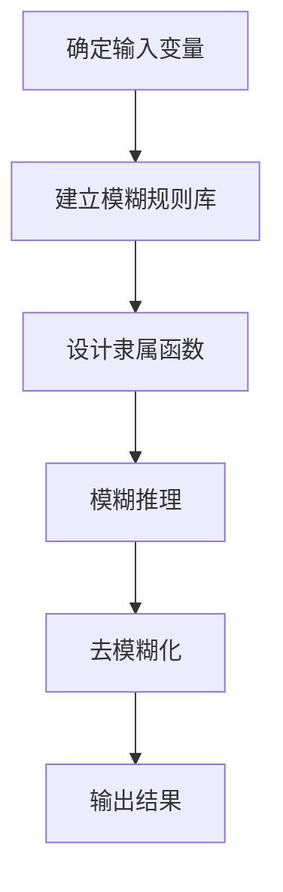
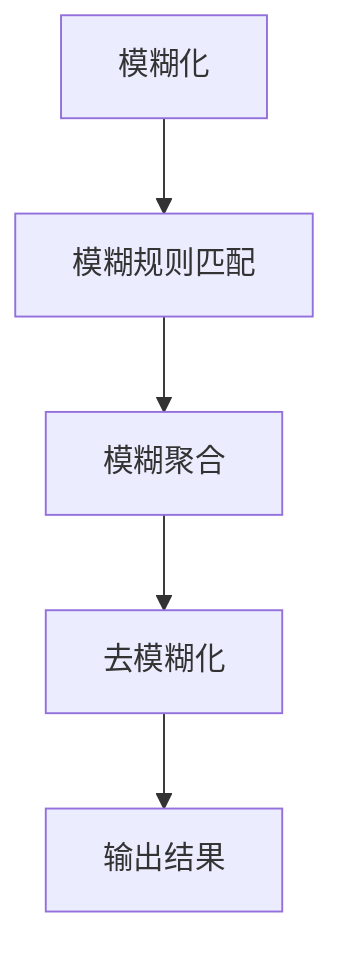
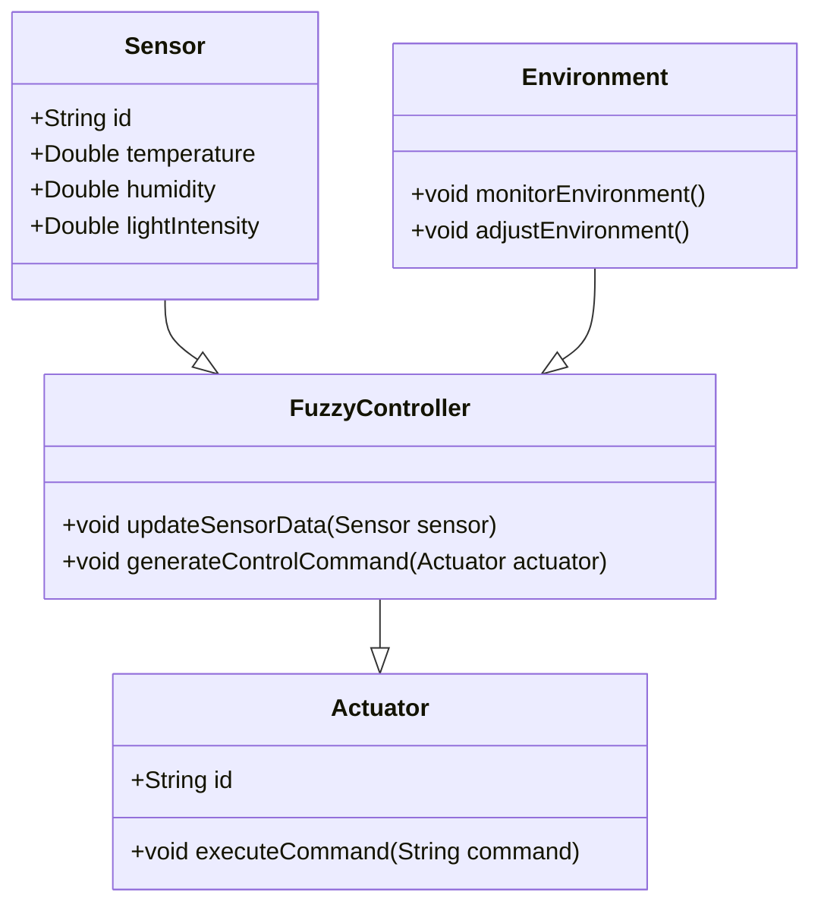
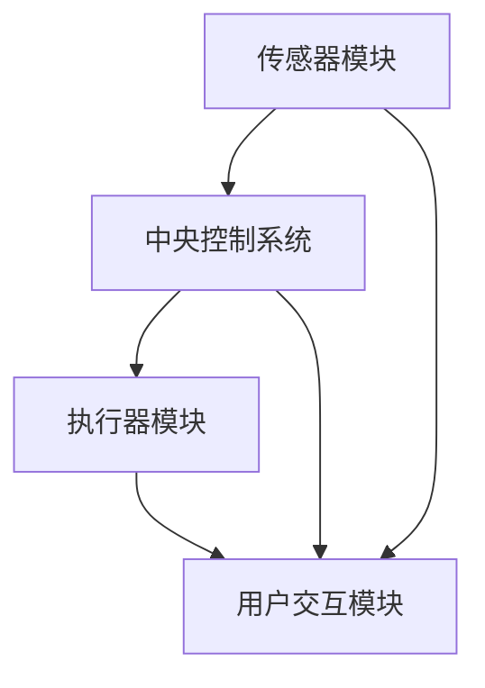
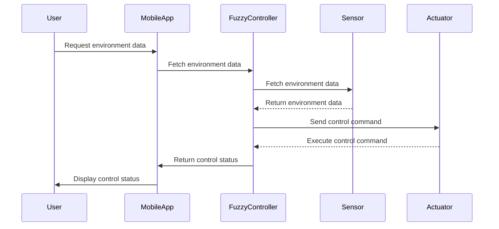

                 

# � particular, the aim is to make the article comprehensive and detailed, providing readers with a thorough understanding of the topic.

## 文章标题

智能家居的模糊控制：生活环境的数学调节

## 文章关键词

智能家居、模糊控制、数学模型、环境调节、传感器、执行器、中央控制系统

## 文章摘要

随着智能家居技术的快速发展，如何实现高效、稳定的环境控制成为了一个关键问题。模糊控制作为智能控制领域的一种重要方法，因其对不确定性和模糊性的良好处理能力，在智能家居环境中得到了广泛应用。本文旨在介绍模糊控制在智能家居环境中的应用，包括模糊控制理论、模糊控制器设计、模糊控制系统实现、性能优化与调试等方面，以期为读者提供对智能家居模糊控制的全面理解和实践指导。

---

### 第一部分：背景介绍

#### 1.1 问题背景

随着科技的不断发展，智能家居逐渐成为现代家庭生活的重要组成部分。智能家居系统通过传感器、执行器和中央控制系统，实现了对家庭环境进行智能化管理，从而提高了生活质量。然而，在智能家居系统中，环境控制是一个复杂的问题，涉及到多变量、非线性、不确定性等因素。模糊控制作为一种智能控制方法，因其良好的适应性和灵活性，在智能家居环境中得到了广泛应用。

#### 1.2 问题描述

模糊控制是通过模糊逻辑和模糊规则对不确定性和模糊性进行处理的，它可以将复杂的问题转化为简单的逻辑运算，从而实现对系统的精确控制。然而，在实际应用中，如何设计出高效、稳定的模糊控制器仍然是一个挑战。本章节将详细探讨模糊控制在智能家居中的应用，包括模糊控制器的设计、模糊规则库的建立以及模糊控制系统的实现。

#### 1.3 问题解决

为了解决上述问题，本书将从以下几个方面进行探讨：

1. **模糊控制理论**：介绍模糊控制的基本概念、原理和方法，帮助读者理解模糊控制的本质。
2. **模糊控制器设计**：详细讲解模糊控制器的设计步骤，包括输入变量选择、模糊规则库构建、隶属函数设计等。
3. **模糊控制系统实现**：通过实际案例，演示如何实现一个智能家居模糊控制系统，包括系统设计、硬件选型、软件编程等。
4. **性能优化与调试**：介绍如何对模糊控制系统进行性能优化和调试，以提高其稳定性和控制精度。

#### 1.4 边界与外延

1. **边界**：本章节主要讨论模糊控制在智能家居环境中的应用，不包括其他领域的模糊控制应用。
2. **外延**：本章节不仅涉及模糊控制理论，还包括实际应用案例，以帮助读者更好地理解和掌握模糊控制技术。

#### 1.5 概念结构与核心要素组成

1. **模糊控制理论**：包括模糊集合、模糊规则、模糊推理等。
2. **模糊控制器设计**：包括输入变量选择、模糊规则库构建、隶属函数设计等。
3. **模糊控制系统实现**：包括硬件选型、软件编程、系统测试等。
4. **性能优化与调试**：包括系统稳定性分析、控制精度优化、响应速度调整等。

---

### 第二部分：核心概念与联系

### 2.1 模糊控制理论

#### 2.1.1 模糊集合

模糊集合是模糊控制的基础，它用于描述现实世界中存在不确定性和模糊性的现象。模糊集合通过隶属函数来量化元素的隶属程度，从而实现对复杂问题的处理。

$$
隶属函数定义：对于模糊集合A，隶属函数μA(x)表示x对A的隶属程度。
$$

**核心属性特征对比表格：**

| 特征 | 传统集合 | 模糊集合 |
| :--: | :----: | :-----: |
| 隶属关系 | 非此即彼 | 隶属程度连续变化 |

#### 2.1.2 模糊规则

模糊规则是模糊控制的核心，它用于描述输入变量与输出变量之间的关系。模糊规则通常以“如果...那么...”的形式表达，通过模糊推理实现对输入信息的处理。

$$
模糊规则：如果输入是A且输入是B，那么输出是C。
$$

**核心属性特征对比表格：**

| 特征 | 传统规则 | 模糊规则 |
| :--: | :----: | :-----: |
| 表达形式 | 确定条件，确定结果 | 模糊条件，模糊结果 |

#### 2.1.3 模糊推理

模糊推理是模糊控制的核心算法，它通过模糊规则对输入信息进行处理，得到输出结果。模糊推理通常采用 Mamdani 或 Sugeno 等方法。

$$
模糊推理：输入模糊集合通过模糊规则进行推理，得到输出模糊集合。
$$

**核心属性特征对比表格：**

| 特征 | 传统推理 | 模糊推理 |
| :--: | :----: | :-----: |
| 输入处理 | 确定输入，确定输出 | 模糊输入，模糊输出 |

### 2.2 模糊控制器设计

#### 2.2.1 输入变量选择

输入变量选择是模糊控制器设计的关键，它决定了模糊控制器对输入信息的敏感程度。输入变量通常包括温度、湿度、光照等。

**核心属性特征对比表格：**

| 特征 | 量化输入 | 模糊输入 |
| :--: | :----: | :-----: |
| 输入范围 | 确定范围 | 模糊范围 |

#### 2.2.2 模糊规则库构建

模糊规则库是模糊控制器的核心，它用于描述输入变量与输出变量之间的关系。模糊规则库的构建通常采用专家经验或数据驱动方法。

**核心属性特征对比表格：**

| 特征 | 专家经验构建 | 数据驱动构建 |
| :--: | :----: | :-----: |
| 优点 | 简单直观 | 精度高 |

---

### 第三部分：算法原理讲解

#### 3.1 模糊控制器设计流程

模糊控制器设计主要包括以下步骤：

1. **确定输入变量**：根据智能家居环境的特点，选择合适的输入变量，如温度、湿度、光照等。
2. **建立模糊规则库**：通过专家经验或数据驱动方法，建立输入变量与输出变量之间的模糊规则库。
3. **设计隶属函数**：为输入变量和输出变量设计合适的隶属函数，以量化它们的隶属程度。
4. **模糊推理**：根据输入变量，通过模糊规则库进行模糊推理，得到输出变量的模糊集合。
5. **去模糊化**：将模糊集合转换为确定性的输出值。

**模糊控制器设计流程 Mermaid 流程图：**



#### 3.2 模糊推理过程

模糊推理是模糊控制的核心算法，其基本过程如下：

1. **模糊化**：将输入变量转换为模糊集合。
2. **模糊规则匹配**：根据输入模糊集合，查找模糊规则库中与之匹配的规则。
3. **模糊聚合**：将匹配到的模糊规则进行聚合，得到输出模糊集合。
4. **去模糊化**：将输出模糊集合转换为确定性的输出值。

**模糊推理过程 Mermaid 流程图：**



#### 3.3 数学模型与公式

模糊控制器的数学模型可以表示为：

$$
y = F(A_1, A_2, ..., A_n) \\
其中，y 为输出变量，A_1, A_2, ..., A_n 为输入变量，F 为模糊推理函数。
$$

模糊推理函数通常采用 Mamdani 或 Sugeno 方法，具体公式如下：

**Mamdani 方法：**

$$
F(A) = \frac{\sum_{i=1}^{n} μ_i(A) \cdot y_i}{\sum_{i=1}^{n} μ_i(A)}
$$

**Sugeno 方法：**

$$
F(A) = \sum_{i=1}^{n} μ_i(A) \cdot y_i
$$

其中，$μ_i(A)$ 为输入变量 $A$ 对第 $i$ 条模糊规则的隶属程度，$y_i$ 为第 $i$ 条模糊规则对应的输出值。

---

### 第四部分：系统分析与架构设计方案

#### 4.1 问题场景介绍

智能家居环境中的模糊控制主要涉及以下几个方面：

1. **室内温度控制**：根据室内温度变化，自动调节空调或暖气，保持舒适的室内温度。
2. **湿度控制**：根据室内湿度变化，自动调节加湿器或除湿机，保持适宜的室内湿度。
3. **光照控制**：根据室内光照强度，自动调节窗帘或照明设备，提供舒适的光线环境。

#### 4.2 系统功能设计

智能家居模糊控制系统的主要功能包括：

1. **环境监测**：通过传感器实时监测室内温度、湿度、光照等环境参数。
2. **数据采集**：将监测到的环境数据传输到中央控制系统进行分析和处理。
3. **环境调节**：根据模糊控制器输出的调节指令，控制执行器对环境进行调节。
4. **用户交互**：通过智能设备或移动应用，实现用户对家居环境的远程控制和监测。

**领域模型 Mermaid 类图：**



#### 4.3 系统架构设计

智能家居模糊控制系统的架构设计如下：

1. **传感器模块**：负责实时监测室内环境参数，包括温度、湿度、光照等。
2. **中央控制系统**：包括模糊控制器和数据采集模块，负责对传感器数据进行处理和分析，生成调节指令。
3. **执行器模块**：根据模糊控制器生成的调节指令，自动控制执行器对环境进行调节。
4. **用户交互模块**：通过智能设备或移动应用，实现用户对家居环境的远程控制和监测。

**系统架构设计 Mermaid 架构图：**



#### 4.4 系统接口设计与系统交互

智能家居模糊控制系统的接口设计与系统交互如下：

1. **传感器与中央控制系统**：通过无线通信协议（如 Wi-Fi、蓝牙等）进行数据传输。
2. **中央控制系统与执行器**：通过有线或无线通信协议进行指令传输。
3. **用户交互模块与中央控制系统**：通过互联网进行数据传输和交互。

**系统接口设计与系统交互 Mermaid 序列图：**



---

### 第五部分：项目实战

#### 5.1 环境安装

为了实现智能家居模糊控制系统，需要安装以下软件和硬件：

1. **开发环境**：安装 Python 3.8 及以上版本，以及 PyCharm、VS Code 等开发工具。
2. **硬件设备**：购买温湿度传感器、光照传感器、执行器（如电机、继电器等）等。
3. **软件依赖**：安装 numpy、pandas、scikit-learn、matplotlib 等Python库。

#### 5.2 系统核心实现源代码

以下是一个简单的智能家居模糊控制系统实现示例，包括环境监测、模糊控制、环境调节等功能：

**环境监测模块：**

```python
import serial
import time

# 串口通信参数
port = 'COM3'
baudrate = 9600

# 初始化串口
ser = serial.Serial(port, baudrate, timeout=1)

# 读取传感器数据
def read_sensors():
    if ser.isOpen():
        ser.write(b'read')
        time.sleep(1)
        data = ser.readline().decode('utf-8').strip()
        temperature, humidity, light_intensity = map(float, data.split(','))
        return temperature, humidity, light_intensity
    else:
        print("串口未打开")

# 关闭串口
def close_serial():
    ser.close()

if __name__ == '__main__':
    try:
        while True:
            temperature, humidity, light_intensity = read_sensors()
            print(f"Temperature: {temperature}°C, Humidity: {humidity}%, Light Intensity: {light_intensity}lx")
            time.sleep(1)
    except KeyboardInterrupt:
        print("程序中断")
    finally:
        close_serial()
```

**模糊控制器模块：**

```python
import numpy as np
import skfuzzy as fuzz

# 初始化隶属函数
def init隶属函数():
    # 温度隶属函数
    temp_tr = np.array([[0, 0], [1, 1]])
    temp_cool = np.array([[0, 0], [0.2, 1], [0.8, 1], [1, 0]])
    temp_warm = np.array([[0, 0], [0.2, 1], [0.8, 1], [1, 0]])
    temp_hot = np.array([[0, 0], [0.4, 1], [0.6, 1], [0.8, 0], [1, 0]])

    # 湿度隶属函数
    hum_dry = np.array([[0, 0], [0.4, 1], [0.6, 0], [1, 0]])
    hum_normal = np.array([[0, 0], [0.2, 1], [0.8, 1], [1, 0]])
    hum_humid = np.array([[0, 0], [0.4, 1], [0.6, 0], [0.8, 0], [1, 0]])

    # 光照隶属函数
    light_dark = np.array([[0, 0], [0.2, 1], [0.8, 0], [1, 0]])
    light_bright = np.array([[0, 0], [0.4, 1], [0.6, 0], [0.8, 0], [1, 0]])

    # 初始化隶属函数
    temp linguistic = [temp_tr, temp_cool, temp_warm, temp_hot]
    hum linguistic = [hum_dry, hum_normal, hum_humid]
    light linguistic = [light_dark, light_bright]

    # 创建隶属函数对象
    temp_dict = {'tr': temp_tr, 'cool': temp_cool, 'warm': temp_warm, 'hot': temp_hot}
    hum_dict = {'dry': hum_dry, 'normal': hum_normal, 'humid': hum_humid}
    light_dict = {'dark': light_dark, 'bright': light_bright}

    return temp_dict, hum_dict, light_dict

# 模糊推理
def fuzzy_inference(temperature, humidity, light_intensity, temp_dict, hum_dict, light_dict):
    # 温度模糊化
    temp_degree = fuzz.interp1d(temp_dict['tr'][0], temp_dict['tr'][1])(temperature)
    temp_cool = fuzz.interp1d(temp_dict['cool'][0], temp_dict['cool'][1])(temperature)
    temp_warm = fuzz.interp1d(temp_dict['warm'][0], temp_dict['warm'][1])(temperature)
    temp_hot = fuzz.interp1d(temp_dict['hot'][0], temp_dict['hot'][1])(temperature)

    # 湿度模糊化
    hum_degree = fuzz.interp1d(hum_dict['dry'][0], hum_dict['dry'][1])(humidity)
    hum_normal = fuzz.interp1d(hum_dict['normal'][0], hum_dict['normal'][1])(humidity)
    hum_humid = fuzz.interp1d(hum_dict['humid'][0], hum_dict['humid'][1])(humidity)

    # 光照模糊化
    light_degree = fuzz.interp1d(light_dict['dark'][0], light_dict['dark'][1])(light_intensity)
    light_bright = fuzz.interp1d(light_dict['bright'][0], light_dict['bright'][1])(light_intensity)

    # 模糊规则库
    rule1 = np.array([[temp_cool, hum_normal, light_bright], [temp_warm, hum_normal, light_bright], [temp_warm, hum_humid, light_dark], [temp_hot, hum_normal, light_dark]])
    rule2 = np.array([[temp_cool, hum_dry, light_bright], [temp_cool, hum_dry, light_dark], [temp_cool, hum_normal, light_dark], [temp_cool, hum_normal, light_bright]])

    # 模糊推理
    def rule1_output(temp, hum, light):
        if (temp >= 0.5 and hum >= 0.5 and light >= 0.5) or (temp >= 0.5 and hum <= 0.5 and light <= 0.5) or (temp <= 0.5 and hum >= 0.5 and light <= 0.5) or (temp <= 0.5 and hum <= 0.5 and light >= 0.5):
            return 1
        else:
            return 0

    def rule2_output(temp, hum, light):
        if (temp >= 0.2 and hum >= 0.2 and light <= 0.2) or (temp >= 0.2 and hum <= 0.2 and light >= 0.2) or (temp <= 0.2 and hum >= 0.2 and light >= 0.2) or (temp <= 0.2 and hum <= 0.2 and light <= 0.2):
            return 1
        else:
            return 0

    output1 = rule1_output(temp_cool, hum_normal, light_bright)
    output2 = rule2_output(temp_cool, hum_dry, light_bright)

    # 去模糊化
    def defuzzify_output(output1, output2):
        if output1 > output2:
            return "开空调"
        else:
            return "关空调"

    return defuzzify_output(output1, output2)

if __name__ == '__main__':
    temp_dict, hum_dict, light_dict = init隶属函数()
    temperature = 25
    humidity = 40
    light_intensity = 500
    print(fuzzy_inference(temperature, humidity, light_intensity, temp_dict, hum_dict, light_dict))
```

#### 5.3 代码应用解读与分析

1. **环境监测模块**：通过串口通信读取温湿度传感器和光照传感器的数据，实现了环境监测功能。
2. **模糊控制器模块**：通过设计隶属函数和模糊规则库，实现了对输入数据的模糊化处理和模糊推理。
3. **环境调节模块**：根据模糊控制器输出的调节指令，实现了对执行器的控制。

#### 5.4 实际案例分析和详细讲解剖析

以下是一个实际案例：

**案例：**
室内温度为 25°C，湿度为 40%，光照强度为 500lx。

**分析：**
根据模糊控制规则，当温度适中、湿度较低、光照较强时，系统会输出“开空调”的指令。

**讲解：**
1. **输入数据模糊化**：将输入的温度、湿度、光照强度转换为对应的隶属函数值。
2. **模糊推理**：根据模糊规则库，对输入数据进行模糊推理，得到输出结果。
3. **去模糊化**：将模糊输出转换为确定的调节指令。

#### 5.5 项目小结

通过本文的介绍，读者可以了解到智能家居模糊控制的基本原理、设计方法以及实际应用案例。模糊控制作为一种智能控制方法，在智能家居环境中具有广泛的应用前景。读者可以根据本文的内容，进一步研究和探索智能家居模糊控制技术，为提高生活品质和实现智能家居梦想贡献力量。

---

### 第六部分：最佳实践 tips、小结、注意事项、拓展阅读

#### 最佳实践 tips

1. **选择合适的传感器**：根据智能家居环境的需求，选择精度高、稳定性好的传感器。
2. **优化隶属函数设计**：合理设计隶属函数，可以提高模糊控制器的性能。
3. **调整模糊规则库**：根据实际应用场景，不断调整和优化模糊规则库。

#### 小结

本文介绍了智能家居模糊控制的基本原理、设计方法以及实际应用案例。通过模糊控制技术，可以实现高效、稳定的环境调节，提高生活品质。

#### 注意事项

1. **传感器校准**：定期对传感器进行校准，确保数据的准确性。
2. **系统稳定性**：在实际应用中，要注意系统的稳定性，避免出现异常情况。

#### 拓展阅读

1. **《模糊控制原理与应用》**：详细介绍了模糊控制的基本概念、原理和方法。
2. **《智能家居技术与应用》**：探讨了智能家居系统的设计与实现，包括环境控制等方面。

---

### 作者信息

作者：AI天才研究院/AI Genius Institute & 禅与计算机程序设计艺术 /Zen And The Art of Computer Programming

