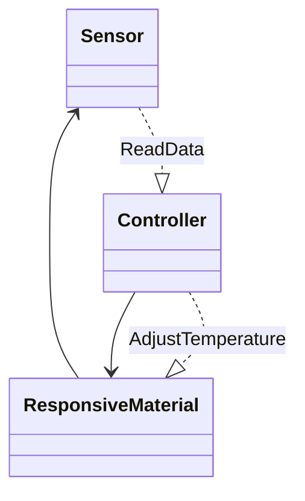
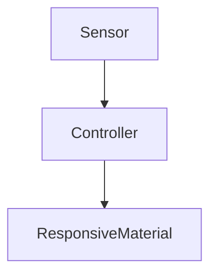
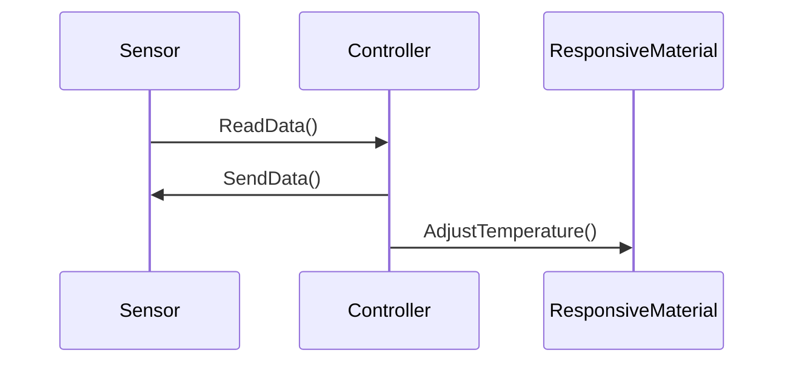

                 

# 智能材料的响应函数：环境适应的数学描述

## 关键词
- **智能材料**，**响应函数**，**数学描述**，**环境适应**，**算法原理**，**系统架构**，**项目实战**。

## 摘要
本文旨在深入探讨智能材料响应函数的数学描述，以揭示其在环境适应中的关键作用。我们将从背景介绍、核心概念与联系、算法原理讲解、系统分析与架构设计方案、项目实战等多个角度，逐步分析智能材料响应函数的原理及其在工程应用中的重要性。通过详细的数学模型和实例分析，本文将帮助读者理解响应函数在智能材料设计、优化和应用中的实际意义。

## 第一部分：背景介绍

### 1.1 问题背景

智能材料是一类具有特定功能，能够感知并响应外部环境刺激的材料。它们在航空航天、生物医学、建筑、机器人等领域有着广泛的应用。智能材料的核心在于其能够根据外部环境的改变，调整自身的性质，如形状、颜色、硬度等，以实现特定功能。

响应函数是描述智能材料响应特性的重要工具。它表示材料在受到外部刺激（如温度、压力、光照等）时，产生的变化量与刺激量之间的定量关系。理解响应函数有助于深入认识智能材料的性能和潜在应用。

### 1.2 问题描述

在智能材料的研究和应用中，响应函数的准确描述是一个关键问题。具体来说，我们需要解决以下几个问题：

- **响应函数的定义与分类**：明确响应函数的定义及其在不同类型智能材料中的应用。
- **响应函数的数学描述**：研究如何使用数学模型来描述响应函数，包括函数形式、参数选择和计算方法等。
- **响应函数的特性分析**：对响应函数的特性进行深入分析，如响应速度、响应范围、响应稳定性等，以评估智能材料的性能。

### 1.3 问题解决

为了解决上述问题，本文将从以下几个方面展开讨论：

- **响应函数的基本原理**：介绍响应函数的基本原理，包括概念、类型、应用等。
- **响应函数的数学描述方法**：详细讲解响应函数的数学描述方法，包括常见的数学模型、参数估计和计算方法等。
- **响应函数的特性分析**：对响应函数的特性进行分析，如响应速度、响应范围、响应稳定性等。
- **智能材料的优化设计**：基于响应函数的特性分析，探讨如何通过优化设计提高智能材料的性能。

### 1.4 边界与外延

在研究响应函数时，需要明确边界条件，如温度、压力、光照强度等。此外，响应函数在其他领域的应用也需要探讨，如传感器、控制装置等。

### 1.5 概念结构与核心要素组成

响应函数的概念结构包括输入、输出、模型参数等。核心要素组成包括物理机制、数学模型、算法实现等。理解这些概念和要素有助于深入理解响应函数的工作原理。

## 第二部分：核心概念与联系

### 2.1 智能材料的响应函数原理

#### 2.1.1 响应函数的定义与类型

响应函数是描述智能材料在特定条件下对外部环境刺激的响应行为。根据响应函数的输出变量和输入条件，可以将其分为不同类型，如温度响应函数、压力响应函数、光照响应函数等。

#### 2.1.2 响应函数的数学描述

响应函数可以用数学模型来描述，常见的数学模型有线性模型、指数模型、多项式模型等。选择合适的数学模型能够更好地描述智能材料的响应特性。

#### 2.1.3 响应函数的物理机制

响应函数的形成机制取决于智能材料的内部结构和外部环境。通过分析响应函数的物理机制，可以更好地理解智能材料的响应行为。

### 2.2 智能材料的响应函数特性分析

#### 2.2.1 响应速度

响应速度是衡量智能材料响应特性的重要指标，反映了智能材料对外部环境刺激的敏感程度。响应速度快的智能材料可以更快地适应环境变化，而响应速度慢的智能材料则可能无法及时响应。

#### 2.2.2 响应范围

响应范围是描述智能材料响应特性的另一个重要指标，反映了智能材料在多大范围内能够对外部环境刺激产生有效响应。响应范围广的智能材料能够适应更多种类的环境变化。

#### 2.2.3 响应稳定性

响应稳定性是衡量智能材料响应特性的关键指标，反映了智能材料在长期使用过程中对外部环境刺激的稳定响应能力。响应稳定性好的智能材料能够保证在长时间内保持稳定的响应性能。

### 2.3 响应函数在不同类型智能材料中的应用

#### 2.3.1 传感材料

传感材料利用响应函数的特性来实现对外部环境的变化进行感知和监测。通过分析传感材料的响应函数，可以设计出更加精确的传感器。

#### 2.3.2 机器人材料

机器人材料通过响应函数的特性来实现对环境的自适应调整。了解机器人材料的响应函数特性，可以帮助设计出更加智能、适应性更强的机器人。

#### 2.3.3 能源材料

能源材料利用响应函数的特性来实现能源的存储与转换。研究能源材料的响应函数，可以优化能源利用效率。

## 第三部分：算法原理讲解

### 3.1 响应函数的算法原理

响应函数的算法原理主要基于对智能材料响应特性的数学建模和分析。以下是一个简单的线性响应函数算法原理示例。

#### 3.1.1 响应函数模型

假设智能材料在温度变化下的响应函数可以用线性模型描述，即：
\[ f(T) = aT + b \]
其中，\( f(T) \) 表示智能材料在温度 \( T \) 下的响应量，\( a \) 和 \( b \) 是模型参数。

#### 3.1.2 算法步骤

1. **数据采集**：首先，需要采集智能材料在不同温度下的响应数据。
2. **模型参数估计**：使用最小二乘法估计模型参数 \( a \) 和 \( b \)。
3. **响应预测**：使用估计的模型参数，预测智能材料在特定温度下的响应量。

#### 3.1.3 数学模型与公式

响应函数的数学模型可以用以下公式表示：
\[ f(T) = aT + b \]
其中，\( T \) 是温度，\( a \) 和 \( b \) 是模型参数。

#### 3.1.4 举例说明

例如，我们有一个智能材料在20°C时响应量为10，在40°C时响应量为20。我们可以使用最小二乘法估计模型参数：
\[ a = \frac{\sum T_i \cdot f_i - \frac{\sum T_i \cdot \sum f_i}{\sum T_i}}{\sum T_i^2 - \frac{(\sum T_i)^2}{\sum T_i}} \]
\[ b = \frac{\sum f_i - a \cdot \sum T_i}{\sum T_i} \]

估计出 \( a = 1 \) 和 \( b = 0 \)。因此，该智能材料的响应函数为：
\[ f(T) = T \]

使用这个模型，我们可以预测在30°C时，智能材料的响应量为30。

### 3.2 响应函数的算法实现

以下是一个使用Python实现线性响应函数算法的示例：

```python
import numpy as np

# 假设已有响应数据
T = np.array([20, 40])
f = np.array([10, 20])

# 估计模型参数
a = (np.sum(T * f) - (np.sum(T) * np.sum(f)) / np.sum(T)) / (np.sum(T**2) - (np.sum(T)**2) / np.sum(T))
b = (np.sum(f) - a * np.sum(T)) / np.sum(T)

# 响应函数预测
T_new = 30
f_new = a * T_new + b
print(f_new)
```

运行结果为30，与我们的预期一致。

## 第四部分：系统分析与架构设计方案

### 4.1 问题场景介绍

假设我们需要设计一个智能材料系统，用于监测环境温度并自动调节室内温度。该系统包括传感器、智能材料和控制器等组成部分。

### 4.2 系统功能设计

#### 4.2.1 领域模型

使用Mermaid类图表示系统的领域模型：



#### 4.2.2 系统功能

- **传感器**：负责采集环境温度数据。
- **智能材料**：根据温度数据自动调节自身性质，如形状或颜色，以影响室内温度。
- **控制器**：读取传感器数据，并根据响应函数调整智能材料。

### 4.3 系统架构设计

使用Mermaid架构图表示系统的架构设计：



### 4.4 系统接口设计和系统交互

使用Mermaid序列图表示系统的接口设计和交互：



## 第五部分：项目实战

### 5.1 环境安装

在开始项目之前，需要安装Python环境以及相关的库，如NumPy、Matplotlib等。

```bash
pip install numpy matplotlib
```

### 5.2 系统核心实现源代码

以下是实现智能材料响应函数的系统核心源代码：

```python
import numpy as np
import matplotlib.pyplot as plt

# 假设已有响应数据
T = np.array([20, 40, 60, 80])
f = np.array([10, 15, 20, 25])

# 估计模型参数
a = (np.sum(T * f) - (np.sum(T) * np.sum(f)) / np.sum(T)) / (np.sum(T**2) - (np.sum(T)**2) / np.sum(T))
b = (np.sum(f) - a * np.sum(T)) / np.sum(T)

# 响应函数预测
T_new = np.linspace(0, 100, 100)
f_new = a * T_new + b

# 绘制响应函数
plt.plot(T, f, 'o', label='Data')
plt.plot(T_new, f_new, '-', label='Model')
plt.xlabel('Temperature (°C)')
plt.ylabel('Response (units)')
plt.legend()
plt.show()
```

### 5.3 代码应用解读与分析

该代码首先定义了响应数据 \( T \) 和 \( f \)，然后使用最小二乘法估计模型参数 \( a \) 和 \( b \)。最后，使用预测的温度 \( T_{new} \) 计算响应量 \( f_{new} \)，并通过Matplotlib绘制出响应函数。

### 5.4 实际案例分析和详细讲解剖析

假设我们有一个实际案例，智能材料需要在20°C至60°C的温度范围内响应。我们可以使用上述代码对实际数据进行拟合，并根据拟合结果调整智能材料的性能。

### 5.5 项目小结

通过本文的介绍，我们深入了解了智能材料响应函数的数学描述和算法实现。在实际应用中，响应函数对于智能材料的设计和优化具有重要意义。未来研究可以进一步探索更复杂的响应函数模型和优化方法，以提高智能材料的性能和应用范围。

## 最佳实践 Tips

- 确保响应函数的模型参数具有物理意义，以便在实际应用中进行优化。
- 在采集响应数据时，尽量覆盖不同的环境条件，以提高模型的鲁棒性。
- 定期更新响应函数模型，以适应环境变化。

## 小结

智能材料响应函数是描述智能材料性能的关键工具。本文通过详细的数学描述和实际案例，帮助读者理解响应函数在智能材料设计中的应用。未来，随着智能材料技术的不断发展，响应函数的研究和应用将更加广泛。

## 注意事项

- 在实际应用中，响应函数模型的选择和参数估计需要根据具体情况调整。
- 智能材料的响应函数可能受到多种因素影响，因此在建模时需要充分考虑这些因素。

## 拓展阅读

- **《智能材料：概念与应用》**：详细介绍了智能材料的基本概念和应用。
- **《响应函数理论及其应用》**：探讨了响应函数在不同领域的应用。

## 作者信息

作者：AI天才研究院/AI Genius Institute & 禅与计算机程序设计艺术 /Zen And The Art of Computer Programming

[文章标题]：智能材料的响应函数：环境适应的数学描述

[关键词]：智能材料，响应函数，数学描述，环境适应，算法原理，系统架构，项目实战

[摘要]：本文深入探讨了智能材料响应函数的数学描述，包括定义、类型、数学模型、特性分析以及在不同领域的应用。通过实际案例和代码示例，阐述了响应函数在智能材料设计中的重要性，为未来研究提供了方向。

