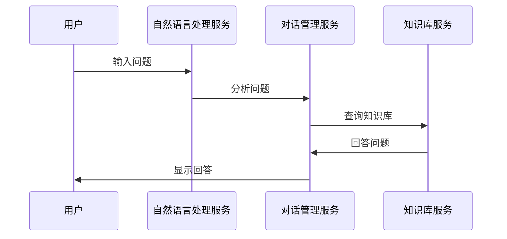

                 

# 服务编排与流程管理在复杂LLM应用中的实现

> 关键词：服务编排、流程管理、复杂LLM应用、自动化、智能化

> 摘要：本文深入探讨了服务编排与流程管理在复杂大型语言模型（LLM）应用中的重要性，以及它们在实际开发中的实现策略。通过详细的分析和案例研究，本文为开发者提供了关于如何有效地整合服务编排与流程管理到LLM应用中的实用建议和最佳实践。

## 前言

随着人工智能技术的飞速发展，大型语言模型（LLM）在自然语言处理、智能客服、内容生成等领域展现出巨大的潜力。然而，复杂LLM应用的实现不仅需要高效的算法和强大的计算资源，还需要完善的服务编排与流程管理策略。服务编排负责将不同服务整合起来，形成一个高效、灵活的应用系统，而流程管理则确保各项任务有序进行，达到预期的业务目标。

本文将分为五个部分，首先介绍服务编排与流程管理的基本概念和理论基础，接着分析复杂LLM应用的挑战和场景，最后通过具体案例展示服务编排与流程管理在LLM应用中的实现策略。希望通过本文的探讨，能为开发者提供一些实用的指导，助力他们在复杂LLM应用开发中取得成功。

## 第一部分：服务编排与流程管理基础

### 1.1 引言

服务编排（Service Orchestration）和流程管理（Process Management）是现代软件开发中至关重要的概念。它们不仅关乎应用的灵活性和可维护性，也直接影响到系统的性能和可靠性。

#### 1.1.1 服务编排

服务编排是指将多个服务（Service）组合成一个整体应用的过程。这些服务可以是独立部署的微服务，也可以是复杂的业务流程。通过服务编排，开发者可以灵活地组合和调整服务，以适应不断变化的需求。

#### 1.1.2 流程管理

流程管理则侧重于任务和活动的组织与执行。它确保流程中的每个步骤都能按预期进行，从而实现业务目标。流程管理通常涉及流程设计、流程执行、流程监控和流程优化等环节。

### 1.2 服务的概念与分类

服务（Service）是服务编排的核心概念。在服务编排中，服务可以定义为能够执行特定功能并提供结果的软件组件。根据服务的作用和特点，服务可以分为以下几类：

- **功能性服务**：提供基本的功能，如数据存储、计算资源等。
- **业务服务**：与具体业务逻辑相关的服务，如订单处理、客户服务管理等。
- **支持性服务**：提供系统运行所需的辅助功能，如日志记录、监控告警等。

### 1.3 流程管理的概念与分类

流程管理（Process Management）是确保业务流程高效运行的一套方法和实践。根据流程的目标和特性，流程管理可以分为以下几类：

- **业务流程管理**：关注业务活动的执行和管理，如订单处理流程、客户服务流程等。
- **项目流程管理**：关注项目开发过程中的任务调度和管理，如敏捷开发流程、迭代开发流程等。
- **运营流程管理**：关注日常运营中的任务执行和管理，如客户支持流程、库存管理流程等。

### 1.4 服务编排与流程管理的关系

服务编排和流程管理密不可分，它们共同构成了现代软件系统的基础架构。服务编排关注的是如何将不同的服务整合在一起，形成完整的业务流程。而流程管理则关注这些服务在执行过程中的协调和优化。

通过服务编排，开发者可以将多个服务连接成一个业务流程，实现自动化和智能化。流程管理则确保这个流程能够高效、稳定地运行，从而满足业务需求。

### 1.5 本章小结

本章介绍了服务编排和流程管理的基本概念、分类及其关系。在接下来的章节中，我们将进一步探讨服务编排与流程管理在复杂LLM应用中的具体实现，为开发者提供实用的指导。

## 第二部分：服务编排与流程管理基础

### 2.1 服务编排的基本概念

服务编排（Service Orchestration）是现代软件开发中的重要概念，它涉及到如何将多个独立的服务整合成一个整体应用。服务编排的核心在于服务的组合、调度和监控，以确保系统的高效、稳定运行。

#### 2.1.1 服务编排的定义

服务编排可以定义为将多个服务（如功能性服务、业务服务和支持性服务）按照一定的逻辑和规则进行组合、调度和监控，以实现特定业务功能的过程。

#### 2.1.2 服务编排与传统软件开发的区别

与传统软件开发相比，服务编排具有以下特点：

- **模块化**：服务编排强调服务的模块化，每个服务可以独立开发、部署和运行。
- **灵活性**：服务编排允许开发者灵活地组合和调整服务，以适应业务需求的变化。
- **自动化**：服务编排通过自动化工具和框架，实现服务的自动调度和监控，提高系统的运行效率。

#### 2.1.3 服务编排的关键特性

服务编排的关键特性包括：

- **灵活性**：服务编排允许开发者根据业务需求灵活地调整服务组合和执行顺序。
- **可扩展性**：服务编排支持系统在性能和功能上的扩展，以满足不断增长的业务需求。
- **高可用性**：服务编排通过冗余设计和服务备份，提高系统的可靠性和可用性。
- **自动化**：服务编排利用自动化工具和框架，减少人工干预，提高系统的运行效率。

### 2.2 服务编排的目标和优势

服务编排的目标是实现业务流程的自动化和智能化，以提高系统的运行效率和灵活性。具体来说，服务编排的目标包括：

- **简化开发**：通过模块化开发和服务组合，简化软件开发的复杂度。
- **提高效率**：通过自动化和智能化，减少人工干预，提高系统运行效率。
- **降低成本**：通过减少重复开发和服务整合，降低开发和维护成本。
- **增强灵活性**：通过灵活的服务组合和调整，快速响应业务需求的变化。

服务编排的优势体现在以下几个方面：

- **模块化**：服务编排支持模块化开发，提高系统的可维护性和扩展性。
- **灵活性**：服务编排允许开发者灵活地调整服务组合和执行顺序，满足不同业务场景的需求。
- **自动化**：服务编排通过自动化工具和框架，减少人工干预，提高系统的运行效率。
- **高可用性**：服务编排支持冗余设计和服务备份，提高系统的可靠性和可用性。

### 2.3 服务编排的关键要素

服务编排的核心在于服务的组合、调度和监控。为了实现这一目标，服务编排涉及以下几个关键要素：

- **服务**：服务是服务编排的基本单元，包括功能性服务、业务服务和支持性服务。每个服务都需要具备独立开发、部署和运行的能力。
- **服务模板**：服务模板是预定义的服务组合和执行顺序，用于简化服务编排的过程。服务模板可以通过模板引擎进行动态调整和扩展。
- **服务网格**：服务网格是一种用于管理服务之间通信和调度的基础设施。它提供了服务发现、负载均衡、服务监控等功能。

#### 2.3.1 服务

服务是服务编排的基本单元。根据服务的类型和功能，服务可以分为以下几类：

- **功能性服务**：提供基本的功能，如数据存储、计算资源等。
- **业务服务**：与具体业务逻辑相关的服务，如订单处理、客户服务管理等。
- **支持性服务**：提供系统运行所需的辅助功能，如日志记录、监控告警等。

#### 2.3.2 服务模板

服务模板是预定义的服务组合和执行顺序，用于简化服务编排的过程。服务模板通常包括以下内容：

- **服务定义**：定义参与服务编排的服务及其功能。
- **执行顺序**：定义服务之间的执行顺序和依赖关系。
- **参数配置**：配置服务的运行参数和配置信息。

#### 2.3.3 服务网格

服务网格是一种用于管理服务之间通信和调度的基础设施。它提供了以下功能：

- **服务发现**：服务网格自动发现和服务注册，确保服务之间的通信和调度。
- **负载均衡**：服务网格通过负载均衡算法，将请求分发到不同的服务实例，提高系统的性能和可用性。
- **服务监控**：服务网格实时监控服务的运行状态，及时发现和处理服务故障。

### 2.4 服务编排的技术体系

服务编排涉及到多种技术和工具，这些技术和工具共同构成了服务编排的技术体系。主要的技术体系包括：

- **SOA与微服务**：SOA（服务导向架构）和微服务架构是服务编排的基础。SOA强调服务的松耦合和可重用性，微服务架构强调服务的独立性和可扩展性。
- **事件驱动架构**：事件驱动架构是一种基于事件触发和服务调度的架构模式，它适用于动态和复杂的业务场景。
- **服务编排工具**：服务编排工具提供了服务编排的图形界面和自动化脚本，简化了服务编排的过程。

#### 2.4.1 SOA与微服务

SOA（服务导向架构）和微服务架构是服务编排的基础。SOA强调服务的松耦合和可重用性，微服务架构强调服务的独立性和可扩展性。

- **SOA**：SOA是一种面向服务的架构模式，它通过定义标准化的接口和服务，实现服务的松耦合和可重用性。SOA的核心思想是将系统分解为多个独立的服务，每个服务负责处理特定的业务功能。
- **微服务**：微服务架构是一种基于独立、小型服务的架构模式，每个微服务负责处理特定的业务功能。微服务架构强调服务的独立性、可扩展性和可重用性。

#### 2.4.2 事件驱动架构

事件驱动架构是一种基于事件触发和服务调度的架构模式，它适用于动态和复杂的业务场景。事件驱动架构的核心思想是事件驱动服务，即服务通过监听和响应事件来执行业务逻辑。

- **事件**：事件是触发服务执行的一种信号。事件可以来自内部（如系统内部事件）或外部（如用户操作、消息通知等）。
- **服务**：事件驱动架构中的服务是独立的、可重用的组件，负责处理特定的事件和业务逻辑。
- **事件总线**：事件总线是一种用于传递和分发事件的系统，它负责连接不同的事件源和事件处理器。

#### 2.4.3 服务编排工具

服务编排工具提供了服务编排的图形界面和自动化脚本，简化了服务编排的过程。常见的服务编排工具包括：

- **Kubernetes**：Kubernetes是一种开源的容器编排平台，它提供了服务编排、调度和管理等功能。
- **Docker Compose**：Docker Compose是一种基于Docker的容器编排工具，它通过YAML文件定义服务组合和执行顺序。
- **Apache Camel**：Apache Camel是一种基于Java的服务编排框架，它提供了丰富的组件和规则引擎，支持多种消息中间件和协议。

### 2.5 服务编排的发展趋势

随着技术的不断发展，服务编排也在不断演变和优化。以下是服务编排的发展趋势：

- **自动化与智能化**：自动化和智能化是服务编排的重要方向。通过引入自动化工具和智能算法，服务编排可以实现更高效、更灵活的调度和管理。
- **开源服务编排平台**：开源服务编排平台如Kubernetes、Apache Camel等正在成为主流。它们提供了丰富的功能和强大的社区支持，为开发者提供了更多的选择和灵活性。
- **服务编排与AI的结合**：服务编排与AI的结合将带来更多的创新和突破。通过利用AI算法和机器学习模型，服务编排可以实现更智能的服务调度和管理。

### 2.6 本章小结

本章介绍了服务编排的基本概念、目标和优势，以及服务编排的关键要素和技术体系。在接下来的章节中，我们将进一步探讨流程管理的基本概念和技术体系，为复杂LLM应用的实现提供更全面的指导。

## 第三部分：流程管理基础

### 3.1 流程管理的概述

流程管理（Process Management）是一种系统化的方法和实践，用于设计、执行、监控和优化业务流程，以实现预期的业务目标和效果。在当今快速变化和竞争激烈的市场环境中，流程管理已经成为企业提升运营效率、降低成本、提高客户满意度的重要手段。

#### 3.1.1 流程管理的定义

流程管理可以定义为一种系统化的方法和实践，通过设计、执行、监控和优化业务流程，实现特定业务目标的过程。它涉及对业务流程的各个环节进行梳理、规划、执行和监控，以确保流程的高效、稳定和持续改进。

#### 3.1.2 流程管理的重要性

流程管理在企业运营中具有重要的作用，主要体现在以下几个方面：

- **提高运营效率**：通过优化业务流程，减少冗余环节，提高工作效率，降低运营成本。
- **提升客户满意度**：通过流程管理，确保业务流程的每个环节都能满足客户需求，提高客户满意度。
- **确保业务一致性**：通过统一流程规范，确保业务流程在不同部门和地区的一致性，提高业务协同效率。
- **促进持续改进**：通过流程监控和评估，识别流程中的问题和瓶颈，持续优化和改进，提高业务流程的整体效能。

#### 3.1.3 流程管理的类型

流程管理可以根据不同的分类标准进行划分，常见的分类类型包括：

- **按业务领域分类**：如生产流程管理、销售流程管理、客户服务流程管理、供应链管理流程等。
- **按流程阶段分类**：如流程设计、流程执行、流程监控、流程优化等。
- **按流程目标分类**：如成本控制流程、质量保证流程、客户满意度提升流程等。
- **按流程技术分类**：如基于BPMN（业务流程模型和符号）的流程管理、基于DMN（决策模型和符号）的流程管理、基于CMMN（案例模型和符号）的流程管理等。

### 3.2 流程建模技术

流程建模技术是流程管理中的重要组成部分，它用于设计、描述和表示业务流程。常见的流程建模技术包括BPMN（业务流程模型和符号）、DMN（决策模型和符号）和CMMN（案例模型和符号）。

#### 3.2.1 BPMN（业务流程模型和符号）

BPMN（Business Process Model and Notation）是一种标准的流程建模语言，用于设计、描述和表示业务流程。BPMN具有直观、易用的特点，能够清晰地表示业务流程中的各个环节、活动和关系。

- **基本元素**：BPMN包括任务（Task）、事件（Event）、网关（Gateway）、分支（Branch）、连接器（Connector）等基本元素。
- **主要功能**：BPMN支持流程的设计、描述、分析和优化，能够帮助开发者更好地理解和优化业务流程。

#### 3.2.2 DMN（决策模型和符号）

DMN（Decision Model and Notation）是一种用于设计、描述和表示决策流程的建模语言。DMN侧重于描述业务决策的逻辑和规则，有助于提高业务决策的透明性和一致性。

- **基本元素**：DMN包括决策节点（Decision Node）、规则（Rule）、规则集合（Rule Set）等基本元素。
- **主要功能**：DMN支持业务决策的逻辑建模，能够帮助开发者更好地理解和优化业务决策过程。

#### 3.2.3 CMMN（案例模型和符号）

CMMN（Case Model and Notation）是一种用于设计、描述和表示案例管理流程的建模语言。CMMN适用于复杂的业务流程，如案件处理、项目管理等。

- **基本元素**：CMMN包括案例角色（Case Role）、活动（Activity）、事件（Event）、任务（Task）等基本元素。
- **主要功能**：CMMN支持复杂的业务流程建模，能够帮助开发者更好地理解和优化案例管理流程。

### 3.3 流程自动化与优化

流程自动化和优化是流程管理的重要目标，通过引入自动化工具和优化方法，可以提高业务流程的效率和质量。流程自动化与优化主要包括以下几个方面：

#### 3.3.1 流程自动化的概念

流程自动化是指利用计算机技术和自动化工具，将业务流程中的手工操作和重复性任务转化为自动化处理，以提高流程的效率和质量。

- **自动化工具**：常见的自动化工具包括RPA（Robotic Process Automation，机器人流程自动化）、BPM（Business Process Management，业务流程管理）平台等。
- **自动化流程**：流程自动化通常涉及流程设计、流程执行、流程监控和流程优化等环节，通过自动化工具实现流程的自动化运行和管理。

#### 3.3.2 流程优化的方法

流程优化是指通过改进流程设计、流程执行和流程管理，提高流程的效率和质量。流程优化可以采用以下几种方法：

- **流程重构**：通过重新设计流程，消除冗余环节，简化流程结构，提高流程的效率。
- **流程分析**：通过分析流程中的瓶颈和问题，识别改进机会，制定优化策略。
- **流程标准化**：通过制定统一流程规范，确保流程在不同部门和地区的一致性和协同性。
- **流程监控**：通过引入流程监控工具，实时监控流程的执行情况和绩效指标，及时发现和处理问题。

#### 3.3.3 流程管理工具

流程管理工具是流程自动化与优化的核心组成部分，常见的流程管理工具包括BPM平台、RPA平台等。

- **BPM平台**：BPM平台是一种用于设计、执行和监控业务流程的软件平台，它支持流程建模、流程执行、流程监控等功能，能够帮助开发者和管理者更好地管理和优化业务流程。
- **RPA平台**：RPA平台是一种用于实现流程自动化的软件平台，它通过模拟人工操作，将业务流程中的重复性任务自动化处理，提高流程的效率和准确性。

### 3.4 流程管理与IT系统的集成

流程管理与IT系统的集成是流程管理的重要环节，通过将流程管理与IT系统融合，可以实现业务流程的自动化、智能化和高效运行。

#### 3.4.1 集成的重要性

流程管理与IT系统的集成具有重要的意义，主要体现在以下几个方面：

- **提高流程效率**：通过将流程管理与IT系统融合，可以实现业务流程的自动化和智能化，提高流程的运行效率。
- **降低运营成本**：通过流程自动化和优化，可以减少人工操作和重复性工作，降低运营成本。
- **增强业务协同**：通过流程管理与IT系统的集成，可以实现业务流程的透明化和协同化，提高业务协同效率。
- **提高业务灵活性**：通过流程管理与IT系统的集成，可以快速响应业务需求的变化，提高业务灵活性。

#### 3.4.2 集成的主要挑战

流程管理与IT系统的集成面临着一系列挑战，主要包括以下几个方面：

- **数据集成**：流程管理与IT系统通常涉及多个数据源和系统，如何实现数据的高效集成和共享是集成过程中面临的主要挑战。
- **流程兼容性**：不同IT系统之间的流程规范和标准可能不一致，如何实现流程的兼容性和互操作性是集成过程中需要解决的问题。
- **系统集成度**：如何确保流程管理与IT系统的深度集成，实现业务流程的自动化和智能化，是集成过程中需要考虑的关键问题。
- **安全与合规**：在流程管理与IT系统集成的过程中，需要确保数据的安全和合规性，避免数据泄露和违规操作。

#### 3.4.3 集成的解决方案

为了解决流程管理与IT系统集成的挑战，可以采用以下几种解决方案：

- **数据集成平台**：采用数据集成平台，实现不同数据源和系统之间的数据共享和整合，提高数据集成效率。
- **流程管理工具**：采用专业的流程管理工具，如BPM平台，实现流程设计、执行、监控和优化，提高流程管理水平和系统集成度。
- **API接口**：通过API接口，实现不同IT系统之间的数据交互和功能调用，提高流程的兼容性和互操作性。
- **安全与合规性管理**：采用安全与合规性管理工具，如数据加密、访问控制等，确保流程管理与IT系统的安全性和合规性。

### 3.5 流程管理的发展趋势

随着技术的不断进步和业务环境的变化，流程管理也在不断发展和演进。以下是流程管理的发展趋势：

- **智能化与自动化**：随着人工智能和机器学习技术的应用，流程管理将更加智能化和自动化，实现业务流程的自动优化和智能化决策。
- **移动化与云端化**：随着移动设备和云计算的普及，流程管理将更加移动化和云端化，实现随时随地访问和管理业务流程。
- **业务与技术的深度融合**：随着业务和技术之间的融合，流程管理将更加关注业务需求，实现业务流程与技术创新的紧密结合。
- **开放性与互操作性**：随着行业标准和开放接口的普及，流程管理将更加开放和互操作，实现不同系统和平台之间的无缝集成和协同。

### 3.6 本章小结

本章介绍了流程管理的基本概念、重要性、类型、流程建模技术、自动化与优化方法、集成解决方案和发展趋势。在接下来的章节中，我们将进一步探讨服务编排与流程管理在复杂LLM应用中的实现，为开发者提供实用的指导。

## 第四部分：服务编排与流程管理在复杂LLM应用中的实现

### 4.1 复杂LLM应用的挑战

大型语言模型（LLM）在自然语言处理、智能客服、内容生成等领域具有巨大的应用潜力，但同时也面临着一系列的挑战。这些挑战主要集中在数据隐私、模型解释性、安全性与合规性等方面。

#### 4.1.1 数据隐私

在LLM应用中，数据隐私是一个关键问题。由于LLM的训练过程需要大量的数据，这些数据往往包含敏感信息，如个人隐私、商业秘密等。如何保护这些数据的安全性和隐私性，是LLM应用需要解决的重要问题。

- **数据加密**：通过数据加密技术，确保数据在传输和存储过程中不被未授权访问。
- **数据匿名化**：通过数据匿名化技术，消除数据中的敏感信息，降低隐私泄露风险。
- **访问控制**：通过访问控制技术，确保只有授权用户可以访问和处理敏感数据。

#### 4.1.2 模型解释性

LLM模型通常具有复杂的结构和参数，导致模型解释性较差。模型解释性差意味着开发者难以理解模型的工作原理和决策过程，这对于需要透明和可解释的模型应用来说是一个挑战。

- **模型可解释性技术**：通过引入模型可解释性技术，如LIME（Local Interpretable Model-agnostic Explanations）、SHAP（SHapley Additive exPlanations）等，提高模型的解释性。
- **可视化工具**：通过可视化工具，如决策树、网络图等，展示模型的结构和决策过程，帮助开发者更好地理解模型。

#### 4.1.3 安全性与合规性

LLM应用在处理敏感数据和执行关键任务时，面临着安全性和合规性的挑战。如何确保模型和系统的安全性，遵守相关法规和标准，是LLM应用需要关注的问题。

- **安全控制**：通过引入安全控制机制，如防火墙、入侵检测系统等，保护模型和系统的安全性。
- **合规性审计**：通过合规性审计，确保模型和系统的设计和实现符合相关法规和标准。
- **安全测试**：通过安全测试，发现和修复模型和系统中的安全漏洞，提高系统的安全性。

### 4.2 LLM应用场景

LLM在多个应用场景中展现出强大的潜力，以下是一些典型的LLM应用场景：

#### 4.2.1 智能客服

智能客服是LLM应用的一个重要领域。通过LLM模型，智能客服系统能够理解用户的意图，提供准确、快速的回答和解决方案，提高客户服务效率和质量。

- **自然语言处理**：LLM模型能够处理自然语言输入，理解用户的问题和需求。
- **上下文理解**：LLM模型能够根据对话的历史上下文，提供更加准确和相关的回答。
- **个性化服务**：通过分析用户的偏好和习惯，LLM模型能够提供个性化的服务和推荐。

#### 4.2.2 内容生成

内容生成是LLM的另一个重要应用场景。LLM模型能够生成高质量、多样化的文本内容，用于新闻报道、创意写作、广告文案等领域。

- **文本生成**：LLM模型能够根据给定的输入文本，生成连贯、有逻辑的文本内容。
- **文本翻译**：LLM模型能够进行文本翻译，支持多种语言的互译。
- **文本摘要**：LLM模型能够对长篇文章进行摘要，提取关键信息和要点。

#### 4.2.3 自动化写作

自动化写作是LLM在内容生成领域的进一步应用。通过LLM模型，自动化写作系统可以自动生成文章、报告、邮件等文本内容，提高写作效率和质量。

- **模板生成**：LLM模型可以根据给定的模板，自动生成符合模板要求的文本内容。
- **内容填充**：LLM模型可以根据用户提供的部分文本，自动填充完整的内容。
- **文本修正**：LLM模型能够对文本进行语法和拼写修正，提高文本的质量。

#### 4.2.4 聊天机器人

聊天机器人是LLM应用的另一个重要领域。通过LLM模型，聊天机器人能够与用户进行自然、流畅的对话，提供信息、解答问题和进行交互。

- **对话管理**：LLM模型能够管理对话流程，理解用户的意图和问题。
- **上下文保持**：LLM模型能够保持对话的历史上下文，提供准确、连贯的回答。
- **多轮对话**：LLM模型能够进行多轮对话，根据用户的不同问题和回答，提供进一步的交互和回答。

### 4.3 服务编排与流程管理在LLM中的应用

在复杂LLM应用中，服务编排与流程管理发挥着关键作用，它们有助于提高系统的灵活性、可维护性和可靠性。

#### 4.3.1 服务编排的优势

服务编排在LLM应用中具有以下优势：

- **模块化**：通过服务编排，可以将复杂的LLM应用分解为多个独立的服务，实现模块化开发和管理。
- **灵活性**：服务编排允许开发者根据业务需求，灵活调整服务组合和执行顺序，快速响应变化。
- **可扩展性**：服务编排支持系统在性能和功能上的扩展，以满足不断增长的业务需求。
- **高可用性**：通过服务编排，可以实现服务的冗余和备份，提高系统的可靠性和可用性。

#### 4.3.2 流程管理的作用

流程管理在LLM应用中具有以下作用：

- **任务调度**：流程管理负责将LLM应用中的任务进行调度和执行，确保任务按照预期进行。
- **流程监控**：流程管理通过实时监控任务执行情况，及时发现和处理问题，确保流程的稳定运行。
- **性能优化**：流程管理通过监控和评估流程的执行情况，识别瓶颈和优化点，持续优化流程性能。

#### 4.3.3 应用案例分析

以下是一个LLM应用案例，展示服务编排与流程管理在智能客服系统中的应用。

- **案例背景**：一家大型电商平台希望通过引入智能客服系统，提高客户服务效率和满意度。
- **服务编排**：服务编排将智能客服系统分解为多个独立的服务，如自然语言处理服务、对话管理服务、知识库服务等。
- **流程管理**：流程管理负责将服务进行调度和监控，确保客服系统按照预期进行。流程包括客户问题接收、问题解析、答案生成、答案反馈等环节。
- **效果评估**：通过服务编排与流程管理，智能客服系统实现了高效的客户服务，客户满意度显著提高，客户服务成本显著降低。

### 4.4 服务编排与流程管理的最佳实践

在复杂LLM应用中，服务编排与流程管理需要遵循一系列最佳实践，以确保系统的成功实施和运行。

#### 4.4.1 设计原则

- **模块化设计**：将复杂的LLM应用分解为多个独立的服务，实现模块化设计和管理。
- **高内聚低耦合**：确保各个服务之间的高内聚低耦合，减少服务之间的依赖和冲突。
- **可扩展性**：设计具有可扩展性的服务，支持系统的性能和功能扩展。

#### 4.4.2 架构设计

- **分层架构**：采用分层架构，将系统划分为表示层、业务层、数据层等，实现清晰的职责分离和模块化设计。
- **服务网格**：采用服务网格技术，实现服务之间的通信和负载均衡，提高系统的性能和可靠性。
- **分布式部署**：将服务分布式部署在多个节点上，实现高可用性和负载均衡。

#### 4.4.3 实施步骤

- **需求分析**：明确LLM应用的需求，确定服务编排和流程管理的目标和范围。
- **服务设计**：设计各个服务的功能、接口和依赖关系，制定服务模板和流程设计文档。
- **系统集成**：将服务编排和流程管理集成到LLM应用中，实现服务的自动调度和监控。
- **测试与优化**：对服务编排和流程管理进行测试和优化，确保系统的稳定性和性能。

### 4.5 本章小结

本章介绍了复杂LLM应用的挑战和应用场景，分析了服务编排与流程管理在LLM应用中的优势和作用，并提出了最佳实践。在接下来的章节中，我们将通过具体案例，展示服务编排与流程管理在复杂LLM应用中的实现和应用。

## 第五部分：服务编排与流程管理在复杂LLM应用中的实现案例

### 5.1 智能客服系统设计与实现

#### 5.1.1 系统背景

随着电子商务的快速发展，客户服务成为企业竞争的关键因素之一。传统的客户服务方式往往需要大量的人力投入，且效率较低。为了提高客户服务质量和效率，许多企业开始探索智能客服系统的应用。

智能客服系统利用大型语言模型（LLM）进行自然语言处理，能够理解用户的问题和需求，提供准确、快速的回答和解决方案。通过服务编排与流程管理，智能客服系统可以更加高效地运行，满足不同客户的需求。

#### 5.1.2 系统目标

智能客服系统的目标包括：

- 提高客户服务效率，降低人工成本。
- 提升客户满意度，提高客户体验。
- 支持多渠道的客户服务，如电话、邮件、在线聊天等。
- 通过数据分析，为企业提供有价值的客户反馈和改进建议。

#### 5.1.3 系统架构

智能客服系统的架构可以分为四个主要层次：表示层、业务层、数据层和支持层。

- **表示层**：负责与用户交互，提供用户界面，包括Web界面、移动应用界面等。
- **业务层**：包括自然语言处理服务、对话管理服务、知识库服务等，实现智能客服的核心功能。
- **数据层**：存储用户数据、对话记录、知识库等，支持数据分析和挖掘。
- **支持层**：包括服务编排与流程管理、日志记录、监控告警等，提供系统运行的支持。

#### 5.2 服务编排设计

在智能客服系统中，服务编排负责将不同的服务整合在一起，形成一个完整的业务流程。服务编排的设计包括以下几个方面：

- **服务定义**：定义自然语言处理服务、对话管理服务、知识库服务等功能和服务接口。
- **执行顺序**：确定各个服务的执行顺序和依赖关系，确保业务流程的连贯性。
- **参数配置**：配置服务的运行参数和配置信息，如超时时间、并发量等。

服务编排的框架可以使用开源服务编排工具，如Apache Camel，进行实现。以下是一个简单的服务编排示例：



#### 5.3 流程管理设计

流程管理在智能客服系统中负责监控和调度各个服务，确保业务流程的有序执行。流程管理的设计包括以下几个方面：

- **流程设计**：使用流程建模工具，如BPMN，设计业务流程的各个环节和活动。
- **流程执行**：实现业务流程的自动执行，确保每个环节都能按预期进行。
- **流程监控**：实时监控流程的执行情况，及时发现和处理问题。

以下是一个简单的流程管理示例，使用BPMN表示：

```mermaid
bpmn
  startEvent[开始]
  userTask[用户输入问题]
  serviceTask[NLP处理问题]
  serviceTask[CM管理对话]
  serviceTask[KB查询知识库]
  serviceTask[CM生成回答]
  endEvent[结束]

  startEvent->>userTask
  userTask->>serviceTask
  serviceTask->>serviceTask
  serviceTask->>serviceTask
  serviceTask->>endEvent
```

#### 5.4 LLM模型应用

在智能客服系统中，LLM模型是核心组件，负责自然语言处理和对话生成。以下是一个简单的LLM模型应用示例：

```python
import numpy as np
from tensorflow.keras.models import Sequential
from tensorflow.keras.layers import Embedding, LSTM, Dense

# 准备数据
data = ...

# 构建模型
model = Sequential()
model.add(Embedding(input_dim=10000, output_dim=128))
model.add(LSTM(units=128))
model.add(Dense(units=1, activation='sigmoid'))

# 编译模型
model.compile(optimizer='adam', loss='binary_crossentropy', metrics=['accuracy'])

# 训练模型
model.fit(data['input'], data['target'], epochs=10, batch_size=32)

# 预测
input_seq = np.array([1, 2, 3, 4, 5])
output = model.predict(input_seq)
print(output)
```

#### 5.5 本章小结

通过智能客服系统的设计与实现案例，展示了服务编排与流程管理在复杂LLM应用中的具体应用。服务编排实现了服务的灵活组合和调度，流程管理确保了业务流程的有序执行。在接下来的章节中，我们将继续探讨更多服务编排与流程管理的最佳实践和实现技巧。

