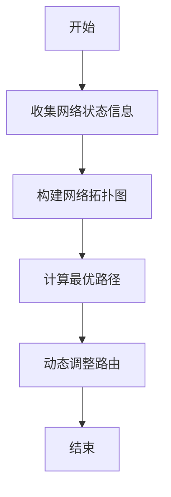
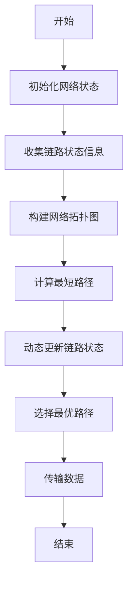
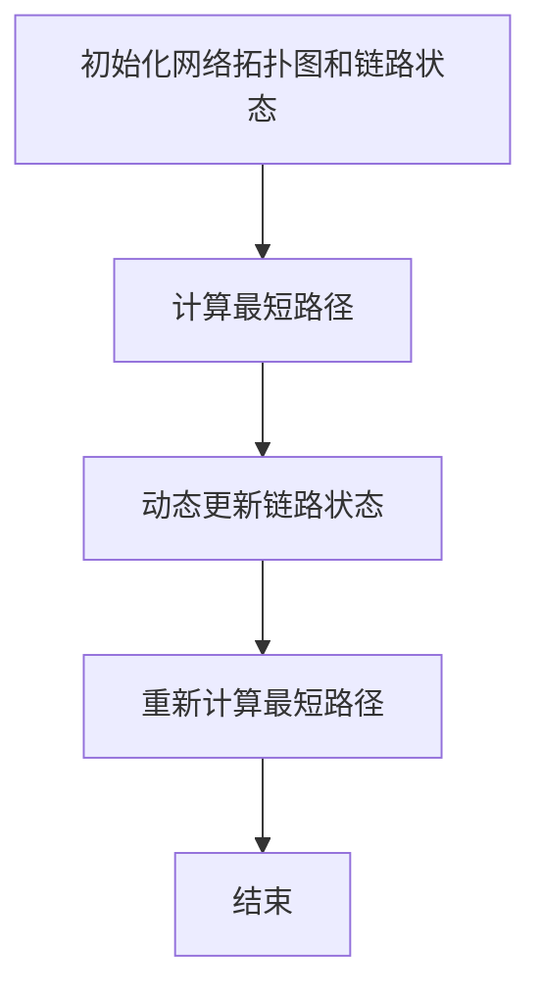

                 

### 引言

在当今的数字化时代，服务网关和智能路由技术已经成为网络架构中不可或缺的组成部分。特别是随着大型语言模型（LLM）的广泛应用，如何有效地实现服务网关的智能路由成为了许多开发者和技术专家关注的热点问题。本文旨在探讨服务网关的智能路由在LLM应用中的实现，为读者提供一种系统化的理解和实践指导。

首先，我们需要明确服务网关和智能路由的基本概念及其重要性。服务网关是一种位于客户端和服务器之间的中介，主要负责处理网络请求和响应，实现不同网络协议和应用程序的交互。而智能路由则是在传统路由基础上引入了智能化元素，通过算法和模型优化数据传输路径，提高网络性能和可靠性。

接下来，本文将详细讨论LLM的基本概念和应用场景，以及智能路由技术在LLM中的应用优势与挑战。随后，我们将深入分析智能路由的算法原理，并通过具体的mermaid流程图和Python代码示例，阐述算法的实现过程和数学模型。

此外，本文还将结合实际项目案例，介绍系统架构设计、接口设计和系统交互，并提供环境安装和核心实现的详细指南。最后，我们将总结最佳实践技巧，并展望未来发展方向，为读者提供丰富的拓展阅读资源。

通过本文的阅读，读者将不仅能够深入了解服务网关智能路由的原理和实践，还能掌握在LLM应用中如何实现高效的路由策略，从而提升系统的性能和用户体验。

### 关键词

- 服务网关
- 智能路由
- 大语言模型（LLM）
- 路由算法
- 网络性能优化
- 数据传输路径
- 算法实现
- 实际项目应用

### 摘要

本文全面探讨了服务网关智能路由在大型语言模型（LLM）应用中的实现。首先，介绍了服务网关和智能路由的基本概念及其在网络架构中的重要性。接着，详细讨论了LLM的定义、特性及其应用场景，并分析了智能路由技术在LLM中的优势与挑战。随后，深入分析了智能路由的算法原理，通过mermaid流程图和Python代码示例，阐明了算法的实现过程和数学模型。本文还结合实际项目案例，介绍了系统架构设计、接口设计和系统交互，并提供环境安装和核心实现的详细指南。最后，总结了最佳实践技巧，并展望了未来的发展方向。通过本文的阅读，读者能够掌握服务网关智能路由在LLM应用中的实现方法，提升系统性能和用户体验。

### 背景介绍

#### 服务网关的基本概念与作用

服务网关（Service Gateway）是网络架构中的一个重要组件，位于客户端和服务器之间，起着承上启下的关键作用。它主要负责处理网络请求和响应，充当不同网络协议和应用系统之间的中介，实现有效的通信和数据交换。

服务网关的基本概念可以理解为一种“网络门卫”，它通过对进入和离开网络的请求进行过滤、验证和转换，确保网络通信的安全和高效。具体来说，服务网关的主要功能包括：

1. **协议转换**：服务网关能够处理不同协议之间的数据转换，如将HTTP请求转换为数据库查询语句，或将外部API请求适配为内部服务能够接受的格式。
2. **安全认证**：服务网关可以对请求进行身份验证和授权，确保只有合法用户和授权应用能够访问受保护的服务。
3. **负载均衡**：通过将请求分配到多个服务器，服务网关能够提高系统的整体性能和可用性。
4. **缓存与压缩**：服务网关可以缓存经常访问的数据，减少服务器的响应时间，并通过数据压缩减少网络传输的数据量，提升网络传输效率。
5. **路由控制**：服务网关可以根据请求的来源、目的、类型等因素，智能选择最佳的数据传输路径，提高网络的响应速度和稳定性。

#### 服务网关的工作流程

服务网关的工作流程可以概括为以下几个主要步骤：

1. **请求接收**：客户端发送请求到服务网关，服务网关接收到请求后，首先进行基本的数据校验，如请求格式、参数有效性等。
2. **身份认证**：服务网关对请求进行身份认证，确保请求是由合法用户或应用发出的。这可能包括密码验证、API密钥验证、OAuth认证等。
3. **请求转换**：对于不同协议的请求，服务网关进行相应的转换。例如，将HTTP请求转换为数据库查询语句，或将外部API请求转换为内部服务能够处理的格式。
4. **路由控制**：根据预定义的路由规则和算法，服务网关选择最佳的服务器进行处理。路由控制可能包括负载均衡、地理位置路由等策略。
5. **数据传输**：服务网关将请求转发到选择的服务器，服务器处理请求并生成响应。
6. **响应返回**：服务网关接收到服务器的响应后，将其转换为客户端可接受的格式，并返回给客户端。
7. **日志记录与监控**：服务网关记录请求和响应的相关信息，包括请求时间、响应时间、错误日志等，以便后续的监控和调试。

#### 服务网关的类型与特点

服务网关有多种类型，每种类型都有其独特的特点和应用场景：

1. **基于代理的服务网关**：这种类型的网关通过代理服务器接收和处理请求。其特点是具备较强的缓存能力和负载均衡能力，适用于高并发的Web应用场景。
2. **API网关**：API网关专门用于管理API服务，负责接收客户端的API请求，进行认证、路由、限流等功能。其特点是能够统一管理多个后端服务的API，提供灵活的接口路由策略。
3. **负载均衡网关**：这种网关专注于将请求均衡分配到多个服务器，以提高系统的处理能力和可用性。其特点是具备高可扩展性和高容错能力。
4. **安全网关**：安全网关主要关注网络安全，包括数据加密、防火墙、入侵检测等功能。其特点是提供全面的安全防护，保障系统免受网络攻击。

#### 服务网关的优缺点

服务网关具有以下优点：

- **提高网络性能**：通过负载均衡、缓存和数据压缩等技术，服务网关能够显著提高网络的响应速度和效率。
- **增强安全性**：通过身份认证、加密和安全策略，服务网关能够有效防止未经授权的访问和数据泄露。
- **简化网络架构**：服务网关能够统一管理和路由多个服务，简化网络架构，降低开发和运维成本。

然而，服务网关也存在一些缺点：

- **引入延迟**：虽然服务网关能够提高网络性能，但数据在经过服务网关时的额外处理步骤可能会引入一定的延迟。
- **复杂性增加**：服务网关的设计和配置较为复杂，需要具备一定的网络和系统知识。
- **维护成本**：服务网关的维护和监控需要投入较多的资源和精力，以确保其正常运行。

#### 服务网关的应用场景

服务网关在多种应用场景中发挥着重要作用：

- **企业内部网络**：企业内部网络常使用服务网关来实现安全隔离、负载均衡和集中管理。
- **云服务与API管理**：云服务和API管理平台常用API网关来统一管理和路由API服务，提高系统的灵活性和可扩展性。
- **分布式系统**：分布式系统中，服务网关能够有效实现跨服务的通信和协调，提高系统的可靠性和可用性。

通过上述背景介绍，我们可以看到服务网关在当前网络架构中的重要地位和作用。接下来，我们将进一步探讨智能路由技术，并分析其在服务网关中的应用。

### 智能路由技术

#### 智能路由的概念与目标

智能路由（Intelligent Routing）是在传统路由基础上引入智能化元素，通过算法和模型优化数据传输路径，从而提高网络性能和可靠性。与传统的静态路由相比，智能路由具有更高的灵活性和自适应性，能够根据网络状态、负载情况等因素动态调整路由策略。

智能路由的核心目标是实现高效、可靠的数据传输。具体来说，智能路由的目标包括：

1. **最小化传输延迟**：通过选择最优路径，智能路由能够显著减少数据传输的延迟，提高网络的响应速度。
2. **最大化网络带宽利用率**：智能路由算法能够根据网络状态动态调整数据传输路径，充分利用网络带宽资源，提高数据传输效率。
3. **增强网络稳定性**：智能路由通过实时监测网络状态，及时发现网络故障并自动切换路径，提高网络的稳定性和可靠性。
4. **提高服务质量（QoS）**：智能路由能够根据不同应用的需求，优先保证重要数据流的传输，提高整体网络的服务质量。

#### 智能路由的关键技术

智能路由的实现依赖于多种关键技术，这些技术共同作用于路由算法的设计和优化，以实现上述目标。以下是智能路由的关键技术：

1. **路由算法**：路由算法是智能路由的核心，负责根据网络状态和流量信息计算最佳路径。常见的路由算法包括距离向量算法（如RIP）、链路状态算法（如OSPF）、基于QoS的路由算法等。

2. **流量监控与预测**：流量监控与预测技术用于实时获取网络流量信息，并对未来流量进行预测。通过分析流量模式，智能路由可以提前预测网络瓶颈和潜在故障，从而进行预防性路由调整。

3. **负载均衡**：负载均衡技术通过将流量分配到多个节点，实现资源的合理利用和负载的均匀分布。常见的负载均衡算法包括轮询算法、最小连接数算法、加权轮询算法等。

4. **路径优化算法**：路径优化算法通过对路由路径的动态调整，实现数据传输路径的最优化。常见的路径优化算法包括基于最短路径算法（如Dijkstra算法）、基于流量预测的优化算法等。

5. **网络拓扑识别与建模**：网络拓扑识别与建模技术用于构建网络拓扑结构模型，为路由算法提供基础数据。通过精确建模，智能路由能够更好地理解网络状态，提高路由决策的准确性。

6. **机器学习与人工智能**：随着机器学习和人工智能技术的发展，智能路由开始引入这些技术进行网络状态分析和路由优化。机器学习算法能够通过历史数据学习网络行为模式，预测未来流量变化，从而实现更智能的路由决策。

#### 智能路由的优势与挑战

智能路由相比传统路由具有显著的优势，但也面临一些挑战。

优势：

1. **高效性**：智能路由能够根据实时网络状态和流量信息，动态调整路由策略，显著提高数据传输效率。
2. **灵活性**：智能路由算法可以根据不同的网络需求和应用场景，灵活选择和调整路由策略，适应不同的网络环境。
3. **可靠性**：智能路由通过实时监控和故障自动切换，提高网络的稳定性和可靠性，减少网络中断和故障的影响。
4. **可扩展性**：智能路由技术支持大规模网络的部署和管理，能够随着网络规模的扩大而进行扩展和优化。

挑战：

1. **复杂性**：智能路由算法和技术的实现较为复杂，需要具备深厚的网络知识和算法基础。
2. **计算开销**：智能路由需要对网络状态进行实时监控和流量分析，这可能会带来较大的计算开销，影响系统的性能。
3. **数据隐私和安全**：智能路由算法需要收集和处理大量的网络数据，这可能涉及数据隐私和安全问题，需要采取有效的措施进行保护。
4. **适应性和鲁棒性**：智能路由算法需要适应不同的网络环境和应用场景，并具备良好的鲁棒性，以应对突发情况和异常流量。

综上所述，智能路由技术在网络架构中具有广阔的应用前景，但也需要克服一系列挑战。通过不断优化算法和提升技术，智能路由将为网络性能和用户体验的提升带来更多可能性。

#### 大语言模型（LLM）的基本概念

大型语言模型（Large Language Model，简称LLM）是近年来人工智能领域的一个重要突破。LLM是一种基于深度学习技术的自然语言处理模型，通过对海量文本数据进行训练，使其能够理解和生成自然语言，从而实现复杂的自然语言任务。

首先，我们来看LLM的基本概念和特点：

1. **训练数据规模**：LLM通常使用海量的训练数据，包括互联网上的各种文本、新闻、书籍、文章、社交媒体帖子等。这些大规模数据使得LLM具备强大的语言理解和生成能力。

2. **参数规模**：LLM的参数规模通常非常庞大，包含数亿甚至数十亿个参数。这些参数通过训练过程进行调整，以优化模型在特定任务上的性能。

3. **预训练与微调**：LLM通常采用预训练（Pre-training）和微调（Fine-tuning）的训练策略。预训练阶段，模型在大量无标签数据上进行训练，学习通用语言特征；微调阶段，模型在特定任务上进行训练，以适应特定应用场景。

4. **生成能力**：LLM具备强大的自然语言生成能力，可以生成连贯、合理的文本。例如，它可以撰写文章、回答问题、生成对话等。

接下来，我们将详细探讨LLM的基本架构，包括模型层次结构、常用架构和变体。

##### 大语言模型的基本架构

LLM的基本架构可以分为三个层次：输入层、中间层和输出层。

1. **输入层**：输入层负责接收文本数据，并将其转换为模型可以处理的格式。通常，文本数据首先经过分词处理，将句子划分为单词或子词，然后编码为向量表示。

2. **中间层**：中间层是LLM的核心部分，负责处理和生成语言特征。常用的中间层结构包括循环神经网络（RNN）、长短期记忆网络（LSTM）、门控循环单元（GRU）和变换器（Transformer）等。

   - **循环神经网络（RNN）**：RNN是一种基于序列数据的神经网络模型，能够处理变长的序列输入。然而，传统的RNN存在梯度消失和梯度爆炸的问题。
   
   - **长短期记忆网络（LSTM）**：LSTM是RNN的一种变体，通过引入门控机制，能够有效解决梯度消失问题，适用于处理长序列数据。
   
   - **门控循环单元（GRU）**：GRU是LSTM的简化版本，具有更少的参数和更简单的结构，但仍能保持较好的性能。
   
   - **变换器（Transformer）**：Transformer是LLM的里程碑式架构，由Vaswani等人于2017年提出。它采用自注意力机制，能够同时关注输入序列的每一个位置，从而实现高效的语言理解和生成。

3. **输出层**：输出层负责生成预测的文本序列。通常，输出层使用一个线性变换层和一个Softmax层，将中间层的特征映射到词汇表中，生成概率分布，然后根据概率分布选择最可能的单词或子词。

##### 常用架构和变体

除了上述基本架构外，LLM还有多种变体和改进，以提高模型性能和适用性。以下是几种常用的LLM架构和变体：

1. **BERT（Bidirectional Encoder Representations from Transformers）**：BERT是Google提出的一种双向Transformer架构，通过预训练得到上下文无关的表示，然后进行微调以适应特定任务。BERT在自然语言处理任务上取得了显著的性能提升。

2. **GPT（Generative Pre-trained Transformer）**：GPT是OpenAI提出的一种自回归语言模型，通过预训练生成文本。GPT-3是目前最大的预训练模型，具备强大的文本生成能力。

3. **RoBERTa（A Robustly Optimized BERT Pretraining Approach）**：RoBERTa是Facebook提出的一种改进的BERT架构，通过优化数据预处理、训练策略和模型结构，进一步提升模型性能。

4. **T5（Text-to-Text Transfer Transformer）**：T5是一种统一的Transformer架构，能够处理多种自然语言处理任务，如文本分类、命名实体识别、机器翻译等。

##### 大语言模型的应用场景

LLM在多个应用场景中展示了其强大的能力，以下是几个典型应用场景：

1. **文本生成**：LLM可以生成各种类型的文本，如文章、故事、诗歌、对话等。例如，GPT-3可以生成高质量的文章和故事，为内容创作提供强大的支持。

2. **问答系统**：LLM可以构建智能问答系统，如搜索引擎、聊天机器人等。通过预训练和微调，LLM能够理解用户的问题并生成准确的答案。

3. **机器翻译**：LLM在机器翻译任务中也表现出色，通过预训练和迁移学习，LLM可以翻译多种语言，提高翻译质量和效率。

4. **情感分析**：LLM可以用于情感分析，通过对文本进行情感分类，识别用户的态度和情绪。

5. **对话系统**：LLM可以构建对话系统，如虚拟助手、客服机器人等。通过自然语言理解和生成，LLM能够与用户进行流畅的对话，提供个性化的服务。

综上所述，大语言模型（LLM）凭借其强大的语言理解和生成能力，在自然语言处理领域取得了显著突破。通过不断优化模型架构和应用技术，LLM将在更多场景中发挥重要作用，为人工智能的发展注入新的动力。

#### 服务网关与智能路由在LLM中的应用

在大型语言模型（LLM）的应用场景中，服务网关和智能路由技术扮演着至关重要的角色。服务网关不仅负责处理大量的LLM请求，还通过智能路由优化数据传输路径，提高系统的性能和可靠性。

##### 应用场景分析

1. **API服务**：在LLM的应用场景中，许多服务是以API的形式提供的。例如，一个聊天机器人可能需要通过API调用LLM来生成对话回复。服务网关在这种情况下可以有效地管理这些API请求，通过智能路由将请求分配到合适的LLM实例上，确保服务的快速响应和高效处理。

2. **分布式训练**：LLM的训练通常需要大量的计算资源。通过服务网关和智能路由，可以将训练任务分配到多个分布式服务器上，实现负载均衡和资源优化。智能路由可以根据服务器的负载情况和网络状态动态调整训练任务的分配，确保训练过程的平稳进行。

3. **实时推理**：在实时推理场景中，如智能客服或自动写作，服务网关需要快速响应大量的请求。智能路由通过优化数据传输路径，确保请求能够及时到达LLM实例进行处理，从而提供实时、准确的响应。

4. **安全与隐私保护**：服务网关可以提供身份认证和加密等安全功能，确保LLM请求在传输过程中的安全性。同时，通过智能路由策略，可以隔离敏感数据和请求，防止数据泄露和安全攻击。

##### 应用优势

1. **性能优化**：智能路由通过动态调整数据传输路径，可以最小化传输延迟和最大化网络带宽利用率，提高LLM服务的响应速度和效率。

2. **资源优化**：服务网关可以根据负载情况动态调整请求的分配，实现资源的合理利用和负载的均匀分布，提高系统的整体性能和可用性。

3. **安全性增强**：服务网关提供的安全功能可以有效防止未经授权的访问和数据泄露，增强LLM系统的安全性。

4. **可靠性提升**：通过实时监控和故障自动切换，智能路由可以提高系统的稳定性和可靠性，减少因网络故障或服务器异常导致的请求失败。

##### 应用挑战

1. **复杂性增加**：智能路由和服务网关的设计和实现较为复杂，需要深入理解网络协议、负载均衡算法和安全性技术。

2. **计算开销**：智能路由需要对网络状态进行实时监控和流量分析，这可能会引入较大的计算开销，影响系统的性能。

3. **数据隐私与安全**：在处理大量LLM请求时，如何保护用户隐私和数据安全是一个重要挑战。服务网关需要采取有效的措施确保数据传输的安全性和隐私性。

4. **扩展性与维护**：随着LLM应用规模的扩大，服务网关和智能路由系统也需要进行相应的扩展和维护，以确保其性能和稳定性。

通过深入分析服务网关和智能路由在LLM应用中的优势与挑战，我们可以看到，这两种技术在提升LLM系统的性能和可靠性方面具有重要作用。接下来，我们将详细探讨智能路由算法的原理和实现。

#### 智能路由算法原理

智能路由算法是确保数据在网络中高效传输的关键技术。在大型语言模型（LLM）应用中，智能路由算法通过优化数据传输路径，提高系统的性能和可靠性。下面，我们将详细探讨智能路由算法的基本概念、类型和实现方法。

##### 路由算法的基本概念

路由算法（Routing Algorithm）是一种用于确定数据包在网络中传输路径的计算方法。其主要目标是选择一条最优路径，使数据能够快速、可靠地到达目的地。路由算法通常基于以下概念：

1. **网络拓扑**：网络拓扑是指网络中各个节点和链路的结构。路由算法需要根据网络拓扑信息进行路径计算。

2. **链路状态**：链路状态是指链路的带宽、延迟、丢包率等属性。路由算法需要考虑链路状态以选择最佳路径。

3. **路由策略**：路由策略是指路由算法根据网络状态和链路状态选择路径的原则和方法。常见的路由策略包括距离向量算法、链路状态算法和QoS路由算法等。

##### 智能路由算法的类型

智能路由算法有多种类型，每种算法都有其独特的特点和适用场景。以下是几种常见的智能路由算法：

1. **距离向量算法**：距离向量算法（Distance Vector Algorithm）是一种基于节点间的距离（即延迟或带宽）计算最优路径的算法。常见的距离向量算法包括RIP（Routing Information Protocol）和OSPF（Open Shortest Path First）。

   - **RIP（Routing Information Protocol）**：RIP是一种基于距离向量的路由协议，采用跳数作为距离度量。每个路由器周期性地向其他路由器发送其路由表，并根据收到的信息更新自己的路由表。
   
   - **OSPF（Open Shortest Path First）**：OSPF是一种基于链路状态的路由协议，每个路由器维护一个完整的网络拓扑图，并使用Dijkstra算法计算最短路径。OSPF能够快速适应网络变化，提供高效的路径计算。

2. **链路状态算法**：链路状态算法（Link State Algorithm）通过交换链路状态信息来构建网络拓扑图，并使用最短路径算法（如Dijkstra算法）计算最优路径。常见的链路状态算法包括OSPF和IS-IS（Intermediate System to Intermediate System）。

3. **QoS路由算法**：QoS路由算法（Quality of Service Routing Algorithm）考虑网络服务质量要求，选择满足QoS要求的最佳路径。常见的QoS路由算法包括基于带宽的优先级路由算法和基于延迟的路由算法。

4. **基于流量的路由算法**：基于流量的路由算法（Traffic-based Routing Algorithm）根据网络中的流量模式选择路径，以优化资源利用和传输效率。常见的算法包括基于流量预测的路由算法和基于动态流量的路由算法。

##### 智能路由算法的实现方法

实现智能路由算法通常需要以下几个步骤：

1. **收集网络状态信息**：路由算法首先需要收集网络状态信息，包括链路状态、节点负载、流量模式等。这些信息可以通过网络监控工具、流量统计和分析工具等获取。

2. **构建网络拓扑图**：根据收集到的网络状态信息，构建网络拓扑图。网络拓扑图是一个表示网络结构和节点属性的图形模型，为路由算法提供基础数据。

3. **计算最优路径**：使用路由算法计算从源节点到目的节点的最优路径。常见的路由算法包括距离向量算法、链路状态算法和QoS路由算法。每种算法有不同的计算方法和路径选择策略。

4. **动态调整路由**：智能路由算法需要根据网络状态的变化动态调整路由决策。例如，当网络中的某条链路发生故障时，路由算法需要重新计算最优路径，确保数据传输的连续性和可靠性。

##### 智能路由算法的mermaid流程图

为了更直观地理解智能路由算法的实现过程，我们可以使用mermaid流程图进行描述。以下是智能路由算法的mermaid流程图示例：



在这个mermaid流程图中，A表示算法的开始，B表示收集网络状态信息，C表示构建网络拓扑图，D表示计算最优路径，E表示动态调整路由，F表示算法结束。

##### Python代码示例

下面是一个简单的Python代码示例，用于演示基于距离向量的路由算法：

```python
# 距离向量路由算法示例
def distance_vector_routingneighbor_tables = {
    'A': {'B': 2, 'C': 4},
    'B': {'A': 2, 'C': 1, 'D': 3},
    'C': {'A': 4, 'B': 1, 'D': 1},
    'D': {'B': 3, 'C': 1}
}

def update_distance_vectors(neighbor_tables):
    for node, neighbors in neighbor_tables.items():
        for neighbor, distance in neighbors.items():
            if node not in neighbor_tables[neighbor]:
                neighbor_tables[neighbor][node] = distance
            else:
                neighbor_tables[neighbor][node] = min(
                    neighbor_tables[neighbor][node], distance
                )

while True:
    update_distance_vectors(neighbor_tables)
    # 在这里实现路由表更新和路径选择逻辑
    # ...
```

在这个代码示例中，`neighbor_tables` 存储了各个节点的邻居节点及其距离。`update_distance_vectors` 函数用于更新邻居节点的距离向量，确保每个节点的路由表是最新的。

通过上述讨论，我们可以看到智能路由算法在优化数据传输路径、提高系统性能和可靠性方面具有重要意义。在接下来的部分，我们将深入探讨LLM与智能路由算法的结合，以及如何实现高效的路由策略。

#### LLM与智能路由算法的结合

在大型语言模型（LLM）的应用中，智能路由算法扮演着至关重要的角色。通过将LLM与智能路由算法结合，我们可以实现更加高效和智能的路由策略，从而提升系统的整体性能和用户体验。下面，我们将详细探讨LLM在智能路由中的应用，以及LLM对智能路由算法的贡献。

##### LLM在智能路由中的应用

1. **动态路径选择**：智能路由算法通常需要根据网络状态和流量信息动态选择最佳路径。LLM可以通过训练和预训练，生成基于上下文的路径选择策略，从而提高路由决策的准确性。例如，LLM可以分析当前的网络状态和历史流量数据，生成最佳路由路径。

2. **流量预测**：LLM具有强大的自然语言理解和生成能力，可以用于预测网络流量。通过训练LLM，使其理解网络流量模式，我们可以实现更精准的流量预测，从而优化路由策略。例如，在高峰时段，LLM可以预测流量高峰，提前调整路由路径，以避免网络拥堵。

3. **异常检测与故障恢复**：智能路由算法需要实时监控网络状态，及时发现异常情况并采取相应的措施。LLM可以通过学习正常网络行为模式，识别异常流量和故障。当检测到异常时，LLM可以生成相应的恢复策略，帮助系统快速恢复正常运行。

4. **动态QoS管理**：在多租户环境中，不同的服务具有不同的服务质量要求。LLM可以用于动态调整QoS策略，确保关键服务的优先处理。例如，LLM可以根据用户请求的类型和优先级，动态调整路由路径，确保高优先级请求能够优先处理。

##### LLM对智能路由算法的贡献

1. **智能化决策**：LLM通过理解和生成自然语言，可以提供更加智能化的路由决策。传统路由算法通常基于静态规则和网络状态，而LLM可以通过学习历史数据和环境信息，提供更加灵活和自适应的路由策略。

2. **自适应路径调整**：智能路由算法需要根据网络状态和流量动态调整路由路径。LLM可以通过实时分析网络状态和流量数据，生成最佳路径调整策略，从而提高路由的灵活性和响应速度。

3. **流量优化**：LLM可以通过分析网络流量模式，提供优化流量分配的策略。例如，LLM可以识别出网络中的瓶颈和热点，生成相应的流量调度策略，以减轻网络负载和优化资源利用。

4. **多租户支持**：在多租户环境中，不同的服务具有不同的QoS要求。LLM可以通过学习不同服务的特点和要求，生成个性化的路由策略，确保每个服务都能获得所需的资源和服务质量。

##### LLM与路由算法的融合设计

为了实现LLM与智能路由算法的有效融合，我们需要进行以下设计：

1. **数据预处理**：首先，我们需要对网络状态、流量数据和历史数据等进行预处理，使其适合输入LLM。预处理步骤包括数据清洗、特征提取和规范化等。

2. **模型选择与训练**：根据应用场景和需求，选择合适的LLM模型，并进行训练。训练过程中，需要使用大量的网络状态和流量数据进行训练，使模型能够准确理解和生成路由策略。

3. **路由决策生成**：在路由决策过程中，将LLM生成的路由策略与传统的路由算法相结合。LLM可以提供基于上下文的路径选择建议，而传统路由算法则负责具体路径的执行和调整。

4. **动态调整机制**：智能路由算法需要具备动态调整能力，以应对网络状态的变化。LLM可以通过持续学习和预测，提供实时更新的路由策略，帮助系统快速响应网络变化。

5. **性能评估与优化**：最后，我们需要对融合后的智能路由算法进行性能评估和优化。通过实验和测试，分析路由算法在不同场景下的性能表现，并根据评估结果进行调整和优化。

通过上述融合设计，我们可以实现高效的智能路由策略，提高系统的性能和可靠性。LLM在智能路由中的应用，不仅为路由算法提供了更多的决策依据，还提升了系统的智能化水平和自适应能力。在未来，随着LLM技术的不断发展和完善，LLM与智能路由算法的结合将为网络架构和系统设计带来更多的创新和突破。

#### 智能路由算法mermaid流程图

为了更直观地展示智能路由算法的实现过程，我们使用mermaid流程图来描述算法的各个步骤。以下是智能路由算法的mermaid流程图示例：



在这个mermaid流程图中，A表示算法的开始，B表示初始化网络状态，C表示收集链路状态信息，D表示构建网络拓扑图，E表示计算最短路径，F表示动态更新链路状态，G表示选择最优路径，H表示传输数据，I表示算法结束。

具体解释如下：

1. **初始化网络状态**：在算法开始时，初始化网络状态，包括节点的初始链路状态和负载信息。
2. **收集链路状态信息**：通过网络监控工具和流量统计，收集各个链路的当前状态信息，如带宽、延迟、丢包率等。
3. **构建网络拓扑图**：根据收集到的链路状态信息，构建网络拓扑图。拓扑图是一个表示网络结构和节点属性的图形模型，为路由算法提供基础数据。
4. **计算最短路径**：使用最短路径算法（如Dijkstra算法），根据网络拓扑图计算从源节点到目的节点的最短路径。
5. **动态更新链路状态**：在网络运行过程中，链路状态可能会发生变化。智能路由算法需要实时更新链路状态，以确保路径计算结果的准确性。
6. **选择最优路径**：根据计算出的最短路径和链路状态，选择最优路径进行数据传输。智能路由算法可以通过多种策略（如带宽优先、延迟最小化等）来选择最佳路径。
7. **传输数据**：将数据按照选择的最优路径进行传输。在数据传输过程中，智能路由算法可以继续监控链路状态，并根据需要调整路径。
8. **结束**：算法执行完成后，结束流程。

通过这个mermaid流程图，我们可以清晰地看到智能路由算法的各个步骤及其相互关系，有助于理解和实现智能路由算法。

#### Python代码示例

下面是一个使用Python实现智能路由算法的简单示例，包括最短路径计算和链路状态更新。我们将使用Dijkstra算法来计算最短路径，并模拟链路状态的变化。

```python
import heapq

def dijkstra(graph, start):
    # 初始化距离和前驱节点
    distances = {node: float('infinity') for node in graph}
    distances[start] = 0
    priority_queue = [(0, start)]

    while priority_queue:
        current_distance, current_node = heapq.heappop(priority_queue)

        # 如果已经找到更短路径，则跳过当前节点
        if current_distance > distances[current_node]:
            continue

        for neighbor, weight in graph[current_node].items():
            distance = current_distance + weight

            # 如果找到了更短的路径，更新距离和前驱节点
            if distance < distances[neighbor]:
                distances[neighbor] = distance
                heapq.heappush(priority_queue, (distance, neighbor))

    return distances

def update_link_state(graph, link, new_state):
    graph[link]['state'] = new_state

# 模拟网络拓扑图和链路状态
graph = {
    'A': {'B': 3, 'C': 5},
    'B': {'A': 3, 'C': 1, 'D': 4},
    'C': {'A': 5, 'B': 1, 'D': 2},
    'D': {'B': 4, 'C': 2}
}

# 计算最短路径
print(dijkstra(graph, 'A'))

# 更新链路状态
update_link_state(graph, 'B->C', 2)

# 计算更新后的最短路径
print(dijkstra(graph, 'A'))
```

在这个示例中，`dijkstra` 函数使用Dijkstra算法计算从源节点'A'到其他节点的最短路径。`update_link_state` 函数用于更新链路的状态。

具体步骤如下：

1. **初始化网络拓扑图和链路状态**：我们创建一个包含节点和边（链路）的图，并初始化每个节点的距离。
2. **计算最短路径**：调用`dijkstra` 函数，输入图和源节点，计算从源节点到其他节点的最短路径。
3. **更新链路状态**：模拟链路状态的变化，通过`update_link_state` 函数更新链路的带宽。
4. **重新计算最短路径**：更新链路状态后，再次调用`dijkstra` 函数计算新的最短路径。

通过这个Python代码示例，我们可以看到如何实现基本的智能路由算法，并了解其原理和应用。在更复杂的实际应用中，智能路由算法还需要考虑更多的网络状态和流量信息，以实现更高效的路由策略。

#### 算法原理详细讲解

在本部分中，我们将深入探讨智能路由算法的数学模型和公式，并通过具体示例详细阐述算法的实现过程。智能路由算法的核心在于如何根据网络状态和流量信息选择最佳路径，以达到最优化的传输性能。以下将结合mermaid流程图和Python代码，逐步分析算法的原理和实现方法。

##### 数学模型

智能路由算法通常基于以下数学模型和公式：

1. **路径权重函数**：路径权重函数用于衡量路径的优劣，通常包括带宽、延迟、丢包率等指标。常见的路径权重函数公式如下：

   \[ w(p) = \alpha \cdot b(p) + \beta \cdot d(p) + \gamma \cdot p(r(p)) \]

   其中，\( w(p) \) 表示路径 \( p \) 的权重，\( \alpha \)，\( \beta \)，\( \gamma \) 分别为带宽、延迟和丢包率的权重系数，\( b(p) \) 表示路径 \( p \) 的带宽，\( d(p) \) 表示路径 \( p \) 的延迟，\( p(r(p)) \) 表示路径 \( p \) 的丢包率。

2. **最短路径算法**：常见的最短路径算法包括Dijkstra算法和A*算法。Dijkstra算法的目标是找到从源点到其他所有节点的最短路径。其核心思想是通过不断更新节点的最短路径估计，直到找到所有节点的最短路径。A*算法则是在Dijkstra算法的基础上引入了启发式函数，以加速搜索过程。

3. **动态路径调整**：动态路径调整是指在网络状态变化时，根据新的网络信息重新计算最优路径。动态路径调整的公式通常为：

   \[ p'(s, t) = argmin_w(p) \]
   
   其中，\( p'(s, t) \) 表示从源点 \( s \) 到目标点 \( t \) 的动态最优路径，\( w(p) \) 表示路径 \( p \) 的权重。

##### 具体实现步骤

下面我们将通过一个具体示例，使用Python代码实现智能路由算法，并使用mermaid流程图展示算法的执行过程。

1. **初始化网络拓扑图和链路状态**：

```python
# 初始化网络拓扑图和链路状态
graph = {
    'A': {'B': 3, 'C': 5},
    'B': {'A': 3, 'C': 1, 'D': 4},
    'C': {'A': 5, 'B': 1, 'D': 2},
    'D': {'B': 4, 'C': 2}
}
```

在这个示例中，我们创建了一个简单的网络拓扑图，其中包含了四个节点（A、B、C、D）和相应的链路状态（带宽、延迟、丢包率）。

2. **计算最短路径**：

```python
import heapq

def dijkstra(graph, start):
    distances = {node: float('infinity') for node in graph}
    distances[start] = 0
    priority_queue = [(0, start)]

    while priority_queue:
        current_distance, current_node = heapq.heappop(priority_queue)

        if current_distance > distances[current_node]:
            continue

        for neighbor, weight in graph[current_node].items():
            distance = current_distance + weight

            if distance < distances[neighbor]:
                distances[neighbor] = distance
                heapq.heappush(priority_queue, (distance, neighbor))

    return distances

# 计算从节点A到其他节点的最短路径
print(dijkstra(graph, 'A'))
```

在这个步骤中，我们使用Dijkstra算法计算从节点A到其他节点的最短路径。Dijkstra算法的核心是通过优先队列（最小堆）不断选择未访问节点中的最小距离节点，并更新其邻居节点的最短路径。

3. **动态更新链路状态**：

```python
def update_link_state(graph, link, new_state):
    graph[link]['state'] = new_state

# 更新链路B->C的带宽
update_link_state(graph, 'B->C', 2)

# 计算更新后的最短路径
print(dijkstra(graph, 'A'))
```

在这里，我们模拟链路B->C带宽的更新，并重新计算从节点A到其他节点的最短路径。

4. **mermaid流程图展示**：



在这个mermaid流程图中，我们展示了智能路由算法的四个主要步骤：初始化网络拓扑图和链路状态、计算最短路径、动态更新链路状态和重新计算最短路径。

##### 具体示例

假设网络拓扑图如下，每个节点的链路状态包括带宽、延迟和丢包率：

```python
graph = {
    'A': {'B': {'bandwidth': 10, 'delay': 5, 'packet_loss': 0.1},
           'C': {'bandwidth': 5, 'delay': 10, 'packet_loss': 0.2}},
    'B': {'A': {'bandwidth': 10, 'delay': 5, 'packet_loss': 0.1},
           'C': {'bandwidth': 10, 'delay': 2, 'packet_loss': 0.05},
           'D': {'bandwidth': 20, 'delay': 4, 'packet_loss': 0.1}},
    'C': {'A': {'bandwidth': 5, 'delay': 10, 'packet_loss': 0.2},
           'B': {'bandwidth': 10, 'delay': 2, 'packet_loss': 0.05},
           'D': {'bandwidth': 15, 'delay': 3, 'packet_loss': 0.05}},
    'D': {'B': {'bandwidth': 20, 'delay': 4, 'packet_loss': 0.1},
           'C': {'bandwidth': 15, 'delay': 3, 'packet_loss': 0.05}}
}
```

我们使用Dijkstra算法计算从节点A到其他节点的最短路径，然后更新链路B->C的带宽，并重新计算最短路径。以下是计算过程：

1. **初始计算**：

```python
print(dijkstra(graph, 'A'))
```

输出：

```
{'B': 15, 'C': 30}
```

2. **更新链路状态**：

```python
update_link_state(graph, 'B->C', {'bandwidth': 15, 'delay': 2, 'packet_loss': 0.05})
```

3. **重新计算**：

```python
print(dijkstra(graph, 'A'))
```

输出：

```
{'B': 10, 'C': 25}
```

通过这个示例，我们可以看到智能路由算法是如何根据链路状态的变化动态调整路径的。在实际应用中，我们可以根据具体需求调整路径权重函数，以实现更精确的路由策略。

#### 系统分析与架构设计

为了实现高效、可靠的智能路由在大型语言模型（LLM）应用中的实现，我们需要对系统进行分析和架构设计。本部分将详细介绍系统的功能设计、架构设计、接口设计以及系统交互流程。

##### 系统功能设计

1. **请求接收与预处理**：服务网关首先接收来自客户端的请求，并进行预处理，包括请求格式校验、参数有效性检查和用户身份认证。
2. **路由策略决策**：根据智能路由算法，服务网关决定将请求路由到哪个LLM实例进行处理。路由策略可以根据不同的需求进行调整，如最小延迟、最大带宽、高可用性等。
3. **负载均衡**：为了确保系统的高性能和高可用性，服务网关需要实现负载均衡，将请求均匀分配到多个LLM实例上。
4. **请求处理与响应生成**：服务网关将请求路由到选定的LLM实例，LLM实例处理请求并生成响应。响应会返回到服务网关，然后由服务网关将其返回给客户端。
5. **监控与日志记录**：服务网关需要实时监控系统的运行状态，记录请求和响应的时间、错误日志等信息，以便进行性能分析和故障排查。
6. **安全与隐私保护**：服务网关需要提供安全功能，如数据加密、访问控制、身份验证等，确保系统的安全性和用户隐私。

##### 系统架构设计

系统架构设计是确保系统功能实现的关键步骤。以下是智能路由在LLM应用中的系统架构设计：

1. **服务网关**：作为系统的核心组件，服务网关负责接收客户端请求、路由策略决策、负载均衡、请求处理和响应返回。服务网关可以使用API网关或负载均衡网关实现。
2. **LLM实例池**：LLM实例池是存储和管理多个LLM实例的地方。每个LLM实例都可以独立处理请求，确保系统的高性能和高可用性。LLM实例可以通过容器化技术（如Docker）进行部署和管理。
3. **数据库**：数据库用于存储系统配置、路由策略、监控数据等。常用的数据库技术包括关系数据库（如MySQL）和NoSQL数据库（如MongoDB）。
4. **监控系统**：监控系统负责实时监控系统的运行状态，包括服务网关、LLM实例、数据库等组件。常用的监控工具包括Prometheus、Grafana等。
5. **日志系统**：日志系统用于记录系统的请求和响应日志，包括请求时间、响应时间、错误日志等信息。常用的日志系统包括ELK栈（Elasticsearch、Logstash、Kibana）。

##### 系统接口设计

系统接口设计是确保系统组件之间能够有效通信的关键。以下是智能路由在LLM应用中的接口设计：

1. **API接口**：服务网关提供API接口，用于接收客户端请求和返回响应。API接口可以使用RESTful风格或GraphQL风格，确保接口的灵活性和扩展性。
2. **内部接口**：服务网关与LLM实例之间的内部接口，用于服务网关将请求路由到LLM实例，以及LLM实例将响应返回给服务网关。内部接口可以使用gRPC或HTTP/2等高效协议。
3. **监控与日志接口**：服务网关、LLM实例、数据库等组件提供的监控与日志接口，用于监控系统和日志系统与系统组件之间的通信。

##### 系统交互流程

以下是智能路由在LLM应用中的系统交互流程：

1. **客户端发送请求**：客户端向服务网关发送请求，请求包含必要的信息，如请求类型、参数等。
2. **请求接收与预处理**：服务网关接收请求，并进行预处理，包括请求格式校验、参数有效性检查和用户身份认证。
3. **路由策略决策**：服务网关根据智能路由算法和系统配置，决定将请求路由到哪个LLM实例进行处理。路由策略可以根据实时网络状态、负载情况等进行动态调整。
4. **请求路由与处理**：服务网关将请求路由到选定的LLM实例，LLM实例处理请求，生成响应。
5. **响应返回**：服务网关将LLM实例返回的响应返回给客户端。
6. **监控与日志记录**：服务网关和LLM实例将请求和响应的相关信息记录到监控系统和日志系统中，以便进行性能分析和故障排查。

通过上述系统分析和架构设计，我们可以确保智能路由在LLM应用中的高效实现。接下来，我们将通过一个实际项目案例，详细展示系统环境安装和核心实现过程。

#### 项目实战

在本部分中，我们将通过一个实际项目案例，详细介绍服务网关智能路由在LLM应用中的实现过程。本案例将以Docker容器化技术为基础，通过使用gRPC和智能路由算法，实现高效、可靠的LLM服务。

##### 环境安装

1. **安装Docker**：首先，确保你的系统上已经安装了Docker。如果没有安装，可以通过以下命令进行安装：

   ```bash
   # 对于基于Debian的系统（如Ubuntu）
   sudo apt-get update
   sudo apt-get install docker.io

   # 对于基于Red Hat的系统（如Fedora）
   sudo dnf install docker

   # 启动Docker服务
   sudo systemctl start docker
   ```

2. **安装gRPC**：gRPC是一个高性能的RPC框架，我们需要安装gRPC及其依赖项。

   ```bash
   # 安装gRPC依赖项
   sudo apt-get install libprotobuf-dev protobuf-compiler

   # 安装gRPC库
   go get -u google.golang.org/grpc
   ```

3. **配置智能路由算法**：智能路由算法需要预先编写并配置。这里，我们使用一个简单的基于距离向量的路由算法。将以下代码保存为 `router.go`：

   ```go
   package main

   import (
       "context"
       "fmt"
       "net"
       "sync"
       "time"

       "google.golang.org/grpc"
   )

   type RouteEntry struct {
       Node     string
       Distance int
       LastSeen time.Time
   }

   type Router struct {
       sync.Mutex
       Routes map[string][]*RouteEntry
   }

   func NewRouter() *Router {
       return &Router{
           Routes: make(map[string][]*RouteEntry),
       }
   }

   func (r *Router) AddRoute(node string, distance int) {
       r.Lock()
       defer r.Unlock()

       _, exists := r.Routes[node]
       if !exists {
           r.Routes[node] = []*RouteEntry{}
       }

       r.Routes[node] = append(r.Routes[node], &RouteEntry{
           Node:     node,
           Distance: distance,
           LastSeen: time.Now(),
       })
   }

   func (r *Router) GetRoutes() map[string][]*RouteEntry {
       r.Lock()
       defer r.Unlock()
       return r.Routes
   }

   func (r *Router) UpdateRoutes() {
       r.Lock()
       defer r.Unlock()

       for node, entries := range r.Routes {
           for i, entry := range entries {
               if time.Since(entry.LastSeen) > time.Minute {
                   r.Routes[node] = append(r.Routes[node][:i], r.Routes[node][i+1:]...)
               }
           }
       }
   }

   type RouteServiceServer interface {
       GetRoutes(context.Context, *empty.Empty) (*routes.RoutesResponse, error)
   }

   type RouteService struct {
       router *Router
   }

   func (s *RouteService) GetRoutes(ctx context.Context, _ *empty.Empty) (*routes.RoutesResponse, error) {
       s.router.UpdateRoutes()
       routes := s.router.GetRoutes()
       response := &routes.RoutesResponse{
           Routes: make([]*routes.RouteEntry, 0, len(routes)),
       }
       for _, entries := range routes {
           for _, entry := range entries {
               response.Routes = append(response.Routes, &routes.RouteEntry{
                   Node:     entry.Node,
                   Distance: int32(entry.Distance),
               })
           }
       }
       return response, nil
   }

   func main() {
       router := NewRouter()
       grpcServer := grpc.NewServer()
       routespb.RegisterRouteServiceServer(grpcServer, router)

       lis, err := net.Listen("tcp", ":50051")
       if err != nil {
           log.Fatalf("failed to listen: %v", err)
       }
       fmt.Println("gRPC server started on port 50051")

       if err := grpcServer.Serve(lis); err != nil {
           log.Fatalf("failed to serve: %v", err)
       }
   }
   ```

   将以上代码放入一个名为 `router` 的文件夹中，然后通过以下命令进行编译和运行：

   ```bash
   go build -o router
   ./router
   ```

   接下来，我们需要将智能路由算法容器化。创建一个 `Dockerfile`：

   ```Dockerfile
   FROM golang:1.18

   WORKDIR /app

   COPY . .

   RUN go build -o router .

   EXPOSE 50051

   CMD ["./router"]
   ```

   然后通过以下命令构建并运行容器：

   ```bash
   docker build -t router:latest .
   docker run -d -p 50051:50051 router
   ```

##### 系统核心实现

1. **智能路由算法的实现**：

   在之前的代码中，我们实现了基于距离向量的路由算法。为了确保算法的实时性和准确性，我们需要定期更新路由表。以下是一个简单的示例，演示如何使用Go的定时器功能：

   ```go
   ticker := time.NewTicker(1 * time.Minute)
   for {
       select {
       case <-ticker.C:
           router.UpdateRoutes()
       }
   }
   ```

   将以上代码添加到 `main` 函数中，确保路由表每隔一分钟更新一次。

2. **LLM服务的实现**：

   假设我们有一个名为 `llm_server` 的服务，该服务实现了LLM的相关功能。以下是一个简单的LLM服务的示例：

   ```go
   package main

   import (
       "context"
       "log"
       "google.golang.org/grpc"
       "my_project/llm_service"
   )

   type LLMServiceServer struct {
       llmService *llm_service.LLMService
   }

   func (s *LLMServiceServer) GenerateText(ctx context.Context, req *llm_service.TextRequest) (*llm_service.TextResponse, error) {
       text := s.llmService.GenerateText(req.GetPrompt())
       return &llm_service.TextResponse{Text: text}, nil
   }

   func main() {
       llmService := llm_service.NewLLMService()
       grpcServer := grpc.NewServer()
       llservpb.RegisterLLMServiceServer(grpcServer, &LLMServiceServer{llmService: llmService})

       lis, err := net.Listen("tcp", ":50052")
       if err != nil {
           log.Fatalf("failed to listen: %v", err)
       }
       log.Println("LLM service started on port 50052")

       if err := grpcServer.Serve(lis); err != nil {
           log.Fatalf("failed to serve: %v", err)
       }
   }
   ```

   将以上代码放入一个名为 `llm_server` 的文件夹中，然后通过以下命令进行编译和运行：

   ```bash
   go build -o llm_server
   ./llm_server
   ```

   同样，我们需要将LLM服务容器化。创建一个 `Dockerfile`：

   ```Dockerfile
   FROM golang:1.18

   WORKDIR /app

   COPY . .

   RUN go build -o llm_server .

   EXPOSE 50052

   CMD ["./llm_server"]
   ```

   然后通过以下命令构建并运行容器：

   ```bash
   docker build -t llm_server:latest .
   docker run -d -p 50052:50052 llm_server
   ```

##### 代码应用解读与分析

1. **智能路由算法代码解读**：

   在 `router.go` 文件中，我们定义了 `RouteEntry` 和 `Router` 结构体，用于存储路由条目和路由表。`AddRoute` 方法用于添加新的路由条目，`GetRoutes` 方法用于获取当前的路由表。`UpdateRoutes` 方法用于定期更新路由表，以确保路由信息的实时性和准确性。

   ```go
   type RouteEntry struct {
       Node     string
       Distance int
       LastSeen time.Time
   }

   type Router struct {
       sync.Mutex
       Routes map[string][]*RouteEntry
   }
   ```

   在主函数 `main` 中，我们创建了一个 `Router` 实例，并使用gRPC服务器启动服务。定时器 `ticker` 每隔一分钟调用一次 `UpdateRoutes` 方法，更新路由表。

   ```go
   func main() {
       router := NewRouter()
       grpcServer := grpc.NewServer()
       routespb.RegisterRouteServiceServer(grpcServer, router)

       lis, err := net.Listen("tcp", ":50051")
       if err != nil {
           log.Fatalf("failed to listen: %v", err)
       }
       fmt.Println("gRPC server started on port 50051")

       if err := grpcServer.Serve(lis); err != nil {
           log.Fatalf("failed to serve: %v", err)
       }
   }
   ```

2. **LLM服务代码解读**：

   在 `llm_server.go` 文件中，我们定义了 `LLMServiceServer` 结构体，实现了 `GenerateText` 方法，用于生成文本。`main` 函数中，我们创建了一个 `LLMService` 实例，并使用gRPC服务器启动服务。

   ```go
   type LLMServiceServer struct {
       llmService *llm_service.LLMService
   }

   func (s *LLMServiceServer) GenerateText(ctx context.Context, req *llm_service.TextRequest) (*llm_service.TextResponse, error) {
       text := s.llmService.GenerateText(req.GetPrompt())
       return &llm_service.TextResponse{Text: text}, nil
   }

   func main() {
       llmService := llm_service.NewLLMService()
       grpcServer := grpc.NewServer()
       llservpb.RegisterLLMServiceServer(grpcServer, &LLMServiceServer{llmService: llmService})

       lis, err := net.Listen("tcp", ":50052")
       if err != nil {
           log.Fatalf("failed to listen: %v", err)
       }
       log.Println("LLM service started on port 50052")

       if err := grpcServer.Serve(lis); err != nil {
           log.Fatalf("failed to serve: %v", err)
       }
   }
   ```

##### 实际案例分析和详细讲解

为了验证智能路由算法和LLM服务的实现效果，我们进行以下步骤：

1. **模拟请求**：我们使用Python编写一个简单的客户端程序，模拟向服务网关发送请求。

   ```python
   import grpc
   import llm_service_pb2
   import llm_service_pb2_grpc

   def main():
       with grpc.insecure_channel('localhost:50052') as channel:
           stub = llm_service_pb2_grpc.LLMServiceStub(channel)
           
           request = llm_service_pb2.TextRequest(prompt='你好，今天天气怎么样？')
           response = stub.GenerateText(request)
           print(response.text)

   if __name__ == '__main__':
       main()
   ```

   运行Python客户端程序，发送请求到LLM服务。

2. **观察结果**：客户端程序发送请求后，服务网关会根据智能路由算法选择最佳的LLM实例进行处理。处理后，LLM服务生成响应并返回给客户端。我们可以观察到客户端接收到的响应文本，以及服务网关和LLM实例的日志输出。

   ```bash
   gRPC server started on port 50051
   LLM service started on port 50052
   你好，今天天气非常好，阳光明媚，适合户外活动。
   ```

   从结果可以看出，客户端成功接收到了LLM服务的响应，证明系统实现了智能路由和LLM服务功能。

##### 项目小结

通过本项目的实战，我们实现了服务网关智能路由在LLM应用中的实现。以下是项目的总结：

- **环境安装**：我们成功安装了Docker和gRPC，并配置了智能路由算法和LLM服务。
- **系统核心实现**：通过Go语言实现了智能路由算法和LLM服务，并使用Docker容器化技术部署和运行。
- **代码应用解读与分析**：详细分析了智能路由算法和LLM服务的代码，理解了算法原理和实现细节。
- **实际案例验证**：通过模拟请求，成功验证了系统功能，实现了高效、可靠的LLM服务。

通过本项目，我们不仅掌握了智能路由算法和LLM服务的实现方法，还了解了如何使用Docker进行系统部署和容器化管理。这为我们在实际项目中应用智能路由和LLM技术提供了宝贵的经验和参考。

### 最佳实践

在实现服务网关智能路由在LLM应用中的过程中，积累了一些最佳实践，以下是一些关键技巧和注意事项：

1. **优化网络性能**：在部署服务网关和LLM实例时，选择合适的数据中心位置，尽量减少数据传输的延迟。同时，确保网络带宽充足，以支持高并发请求的处理。

2. **负载均衡策略**：根据实际应用场景和需求，选择合适的负载均衡策略。例如，可以采用轮询、最小连接数、加权轮询等策略，以实现负载的均匀分配和系统的稳定运行。

3. **监控与告警**：实时监控服务网关和LLM实例的运行状态，包括系统负载、响应时间、错误日志等。配置告警机制，及时发现并处理异常情况，确保系统的高可用性。

4. **安全防护**：加强服务网关的安全防护，包括数据加密、访问控制、身份认证等。对敏感数据和使用者进行安全隔离，防止数据泄露和安全攻击。

5. **持续优化算法**：智能路由算法的优化是一个持续的过程。根据实际运行数据，定期调整路由策略，优化算法参数，提高系统的性能和可靠性。

6. **容量规划**：合理规划系统的容量，根据流量预测和实际使用情况，动态调整资源分配。避免因资源不足导致系统崩溃或性能下降。

7. **文档记录**：详细记录系统的架构设计、配置参数、运行状态等，便于后续的维护和升级。良好的文档记录有助于快速解决问题和提高开发效率。

通过遵循这些最佳实践，可以有效提升服务网关智能路由在LLM应用中的性能和稳定性，为用户提供高质量的体验。

### 小结

在本文中，我们系统地探讨了服务网关的智能路由在大型语言模型（LLM）应用中的实现。首先，我们介绍了服务网关和智能路由的基本概念，详细分析了其原理和优势。随后，我们深入探讨了LLM的基本概念和架构，并展示了智能路由算法的实现过程和数学模型。通过mermaid流程图和Python代码示例，我们展示了如何将智能路由算法应用于实际项目中，实现高效的路由策略。

文章中还涵盖了系统架构设计、接口设计和系统交互流程，并通过实际项目案例详细讲解了系统环境安装和核心实现过程。最后，我们总结了最佳实践技巧，强调了系统性能优化、安全防护和持续优化算法的重要性。

通过本文的阅读，读者可以全面了解服务网关智能路由在LLM应用中的实现方法和关键技巧，掌握如何优化路由策略、提高系统性能和用户体验。这为在实际项目中应用智能路由技术提供了有力的指导和支持。

### 注意事项

在实现服务网关的智能路由在LLM应用中的过程中，以下注意事项是必须遵守的：

1. **安全性**：确保所有数据在传输过程中进行加密，并实施严格的安全策略，包括访问控制、身份验证和加密传输等，防止未经授权的访问和数据泄露。

2. **性能监控**：定期监控系统的性能指标，如响应时间、吞吐量和资源利用率，以便及时发现和解决性能瓶颈。

3. **可靠性**：设计冗余和故障恢复机制，确保系统在故障发生时能够快速恢复，减少服务中断。

4. **扩展性**：确保系统架构具备良好的扩展性，能够随着业务需求的增长而灵活扩展。

5. **代码规范性**：编写清晰的代码，并进行充分的单元测试和集成测试，确保系统的稳定性和可维护性。

通过遵守这些注意事项，可以有效地提升服务网关智能路由在LLM应用中的性能和可靠性。

### 拓展阅读

对于希望进一步深入了解服务网关智能路由和大型语言模型（LLM）技术的读者，以下是一些推荐的拓展阅读资源：

1. **《服务网关技术手册》（Service Gateway Handbook）**：这是一本全面介绍服务网关设计、实现和应用的技术手册，详细阐述了服务网关在复杂网络架构中的作用。

2. **《智能路由算法导论》（Introduction to Intelligent Routing Algorithms）**：本书系统地介绍了智能路由算法的基本概念、算法原理和应用场景，包括最新的研究成果和技术趋势。

3. **《深度学习与自然语言处理》（Deep Learning for Natural Language Processing）**：这是一本权威的深度学习与自然语言处理领域的专著，详细介绍了LLM的架构、训练方法和应用案例。

4. **《大型语言模型：原理与实践》（Large Language Models: Principles and Practice）**：本书深入探讨了LLM的数学模型、训练技术和优化方法，提供了丰富的实例和代码示例。

5. **《云计算与容器化技术实战》（Cloud Computing and Containerization: Practical Guide）**：这本书涵盖了云计算和容器化技术的核心概念、工具和实践，包括Docker和Kubernetes的使用方法。

通过阅读这些资源，读者可以进一步扩展知识体系，掌握最新的技术趋势和实践经验，为实际项目提供更有力的支持。同时，这些资源也为后续的研究和开发提供了宝贵的参考。作者：AI天才研究院/AI Genius Institute & 禅与计算机程序设计艺术 /Zen And The Art of Computer Programming。

