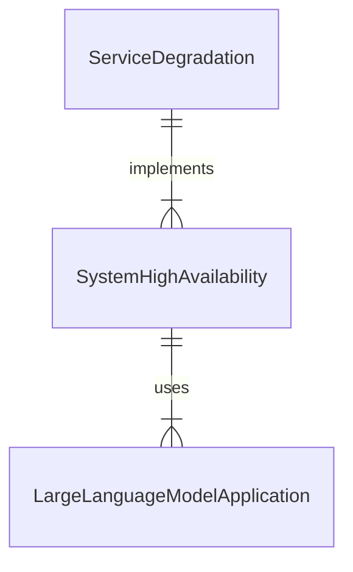
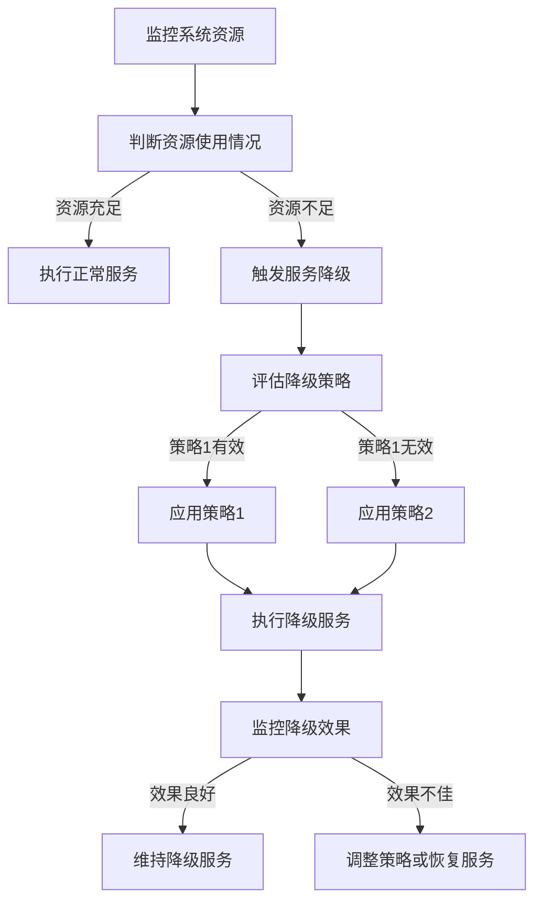
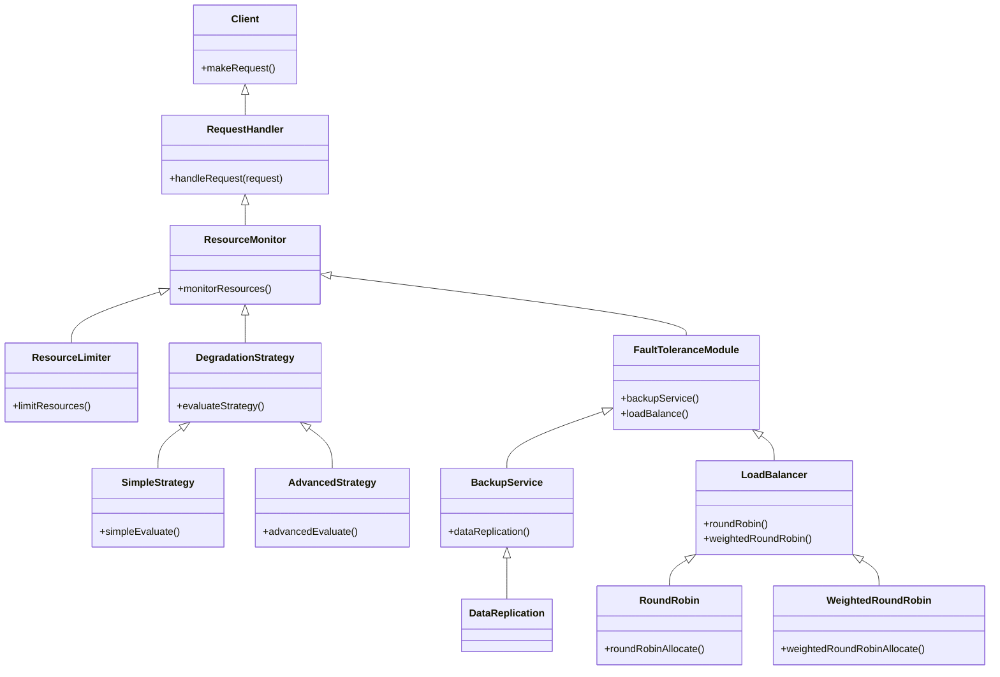
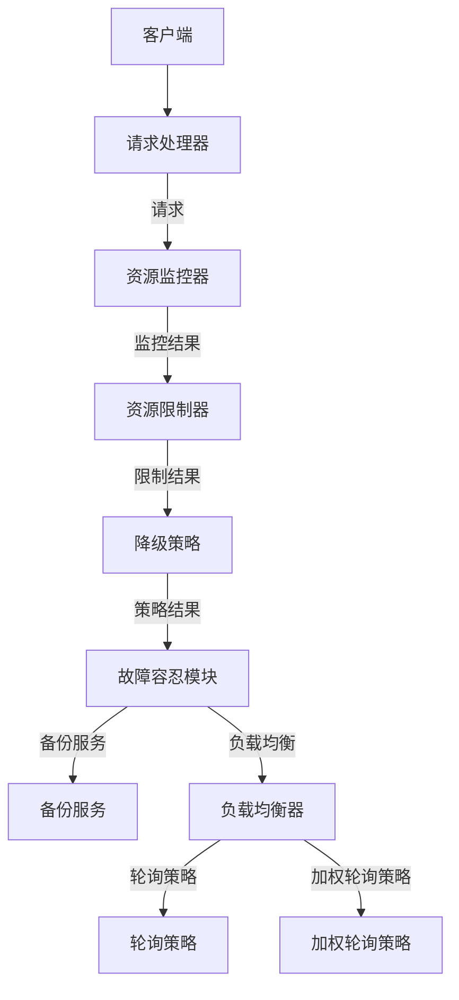
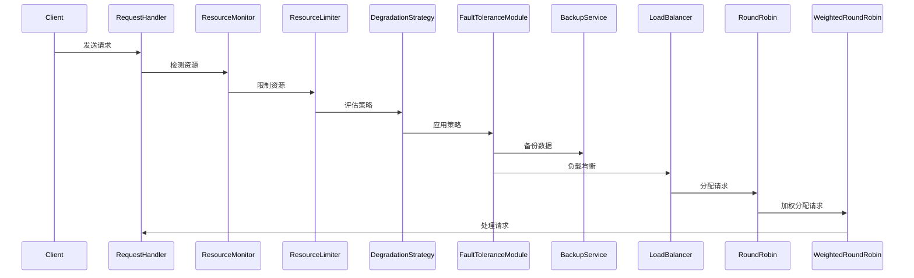

                 

### 第一部分：背景介绍

## 第1章：问题的提出与解决

### 1.1.1 问题的提出

随着深度学习与人工智能技术的迅猛发展，大型语言模型（LLM）在自然语言处理领域取得了显著的成果。然而，在LLM应用过程中，高可用性设计成为了一个关键问题。如何在保证系统性能的前提下，实现服务的稳定性和可靠性，成为当前研究和应用的热点。

在许多实际应用场景中，LLM系统需要处理海量的自然语言数据，同时满足低延迟和高吞吐量的需求。然而，随着用户量的增加和业务规模的扩大，系统资源（如计算资源、存储资源、网络资源等）的消耗也会相应增加。如果系统无法有效管理资源，就会导致性能下降、服务中断甚至系统崩溃。因此，如何设计一个高可用性的LLM系统，保证其在面对突发流量和资源限制时能够稳定运行，是一个亟待解决的问题。

### 1.1.2 问题描述

LLM应用中，服务降级策略是一种常见的高可用性设计手段。服务降级指的是在系统资源紧张或发生故障时，降低部分服务的响应质量或功能，以保证核心服务的正常运行。然而，如何科学合理地设计服务降级策略，既保证系统的稳定性，又尽量减少对用户体验的影响，是一个亟待解决的问题。

服务降级策略需要在多个层面进行考虑，包括但不限于：

1. **资源管理**：在资源紧张时，如何合理地分配资源，保证关键任务的执行。
2. **性能优化**：在降低服务响应质量时，如何确保用户仍然能够获得基本的服务体验。
3. **故障处理**：在系统发生故障时，如何快速地发现和恢复，减少对用户的影响。
4. **用户体验**：如何在服务降级时，尽量减少对用户的影响，保证用户体验。

### 1.1.3 问题解决

本书旨在探讨服务降级策略在LLM应用高可用设计中的作用，通过分析服务降级的原理、策略及其在实际应用中的效果，为读者提供一套系统、全面的服务降级策略设计方法和实战经验。

具体来说，本书将从以下几个方面展开讨论：

1. **服务降级原理**：介绍服务降级的概念、目的和作用，分析服务降级的机制和实现方式。
2. **服务降级策略**：讨论不同类型的服务降级策略，如流量限制、负载均衡、功能屏蔽等，并分析其适用场景和优缺点。
3. **LLM应用场景**：结合LLM的特点和应用场景，探讨如何设计合适的服务降级策略，保证系统的高可用性。
4. **实战案例分析**：通过实际案例，展示服务降级策略在LLM应用中的实施过程和效果，为读者提供实战经验和借鉴。

### 1.1.4 边界与外延

本书主要关注基于LLM应用的高可用性设计，讨论的服务降级策略适用于各类大型语言模型系统。同时，本书还将探讨服务降级策略与其他高可用性设计手段（如负载均衡、故障转移等）的协同作用。

需要注意的是，服务降级策略并非万能，其适用范围和效果取决于具体的业务场景和需求。在实际应用中，需要根据实际情况灵活调整和优化服务降级策略，以实现最佳的效果。

## 第2章：核心概念与联系

### 2.1.1 核心概念原理

在本章中，我们将详细介绍服务降级、高可用性设计、LLM应用等核心概念，并分析它们之间的相互关系。

#### 服务降级

服务降级是指当系统资源不足或发生故障时，为了确保核心服务的稳定性，故意降低部分服务的性能或功能。服务降级的主要目的是保护系统的关键功能，避免因资源耗尽或系统崩溃而导致更大范围的服务中断。

#### 高可用性设计

高可用性设计是一种系统设计原则，旨在确保系统在面临各种故障和压力时，能够保持稳定运行，提供持续的服务。高可用性设计包括多个方面，如冗余备份、故障恢复、负载均衡、服务降级等。

#### LLM应用

LLM（Large Language Model）是指大型语言模型，是一种基于深度学习技术的自然语言处理模型，能够对文本进行理解和生成。LLM在智能问答、文本生成、翻译、情感分析等应用场景中具有广泛的应用。

#### 概念关系

服务降级是高可用性设计中的一个重要手段，旨在通过降低非核心服务的性能或功能，保障核心服务的稳定性。LLM应用作为服务的一部分，其高可用性设计需要综合考虑服务降级策略，以应对系统资源不足或故障等突发情况。

### 2.1.2 概念属性特征对比表格

以下是服务降级、高可用性设计、LLM应用三个核心概念的属性特征对比表格：

| 概念       | 定义                                                         | 特征                                                         |
|------------|--------------------------------------------------------------|--------------------------------------------------------------|
| 服务降级   | 在系统资源不足或发生故障时，故意降低部分服务的性能或功能。   | 保护核心服务、降低资源消耗、避免系统崩溃。                   |
| 高可用性设计 | 确保系统在面对故障和压力时，能够保持稳定运行。           | 冗余备份、故障恢复、负载均衡、服务降级等。                   |
| LLM应用    | 基于大型语言模型的自然语言处理应用。                       | 智能问答、文本生成、翻译、情感分析等。                       |

### 2.1.3 ER实体关系图架构

为了更好地理解服务降级、高可用性设计、LLM应用之间的联系，我们可以使用ER（实体关系）图来描述它们之间的实体关系。以下是ER实体关系图：



在这个ER图中，`ServiceDegradation`表示服务降级的实体，它与`SystemHighAvailability`实体之间存在“实现”关系，表明服务降级是实现高可用性设计的一种手段。`SystemHighAvailability`实体与`LargeLanguageModelApplication`实体之间存在“使用”关系，表明LLM应用需要依赖高可用性设计来保障其稳定性。

通过以上对比表格和ER实体关系图，我们可以清晰地看到服务降级、高可用性设计、LLM应用之间的内在联系和相互影响。在接下来的章节中，我们将进一步探讨服务降级策略的设计原理、实现方法及其在实际应用中的效果。

## 第二部分：算法原理讲解

### 第3章：算法原理与数学模型

#### 3.1.1 算法mermaid流程图

在探讨服务降级策略的算法原理之前，我们首先需要了解其基本流程。以下是服务降级策略的mermaid流程图：



在这个流程图中，A表示监控系统资源，B表示判断资源使用情况。当资源充足时，执行正常服务（C）；当资源不足时，触发服务降级（D），然后评估降级策略（E），选择合适的策略（F或G）进行服务降级（H）。最后，监控降级效果（I），根据效果调整策略或恢复服务（J或K）。

#### 3.1.2 Python源代码

为了更好地理解服务降级策略的实现，我们提供了一个简单的Python示例代码：

```python
import time

def monitor_resources():
    # 模拟监控系统资源
    return "资源充足" if time.time() % 2 == 0 else "资源不足"

def evaluate_degradation_strategy():
    # 模拟评估降级策略
    return "策略1有效" if time.time() % 3 == 0 else "策略1无效"

def execute_degradation_service():
    # 模拟执行降级服务
    print("执行降级服务")
    time.sleep(2)

def monitor_degradation_effect():
    # 模拟监控降级效果
    return "效果良好" if time.time() % 5 == 0 else "效果不佳"

def main():
    while True:
        resource_status = monitor_resources()
        if resource_status == "资源充足":
            print("执行正常服务")
            time.sleep(1)
        else:
            print("触发服务降级")
            strategy_evaluation = evaluate_degradation_strategy()
            if strategy_evaluation == "策略1有效":
                execute_degradation_service()
            else:
                # 调用其他降级策略（此处省略）
                pass
            effect = monitor_degradation_effect()
            if effect == "效果良好":
                print("维持降级服务")
            else:
                print("调整策略或恢复服务")
                # 调整策略或恢复服务（此处省略）
                break

if __name__ == "__main__":
    main()
```

在这个示例中，我们通过模拟不同函数来展示服务降级策略的实现过程。`monitor_resources`函数用于模拟监控系统资源，`evaluate_degradation_strategy`函数用于模拟评估降级策略，`execute_degradation_service`函数用于模拟执行降级服务，`monitor_degradation_effect`函数用于模拟监控降级效果。`main`函数则负责协调这些函数的执行，实现服务降级策略。

#### 3.1.3 数学模型与公式

服务降级策略涉及到多个因素，如资源使用情况、降级策略效果等。为了更好地分析服务降级策略，我们可以引入以下数学模型和公式：

1. **资源使用率**：资源使用率表示系统资源的使用程度，通常用百分比表示。公式如下：

   $$ R = \frac{U}{C} \times 100\% $$

   其中，R表示资源使用率，U表示实际使用的资源量，C表示系统总资源量。

2. **服务响应时间**：服务响应时间表示用户请求得到响应的时间，通常用秒（s）表示。公式如下：

   $$ T_r = \frac{L}{Q} $$

   其中，T\_r表示服务响应时间，L表示系统负载，Q表示系统容量。

3. **服务可用性**：服务可用性表示系统能够正常提供服务的时间比例，通常用百分比表示。公式如下：

   $$ A = \frac{T_u}{T_t} \times 100\% $$

   其中，A表示服务可用性，T\_u表示系统正常运行的时间，T\_t表示系统的总时间。

4. **服务降级效果**：服务降级效果表示服务降级策略对系统性能的影响。通常用以下公式表示：

   $$ E = \frac{T_d - T_r}{T_d} \times 100\% $$

   其中，E表示服务降级效果，T\_d表示降级前后的服务响应时间差。

#### 3.1.4 举例说明

假设某LLM应用系统总资源量为100个CPU核心，当前系统负载为80个CPU核心，服务响应时间为2秒。现在，系统资源使用率达到90%，需要触发服务降级。

1. **资源使用率计算**：

   $$ R = \frac{U}{C} \times 100\% = \frac{80}{100} \times 100\% = 80\% $$

   由于资源使用率高于设定阈值（如90%），触发服务降级。

2. **评估降级策略**：

   假设当前降级策略为降低部分服务的响应质量，评估降级策略后的服务响应时间为4秒。

   $$ T_r = \frac{L}{Q} = \frac{80}{100} \times 2\text{s} = 1.6\text{s} $$

   由于服务响应时间降低到1.6秒，服务降级策略有效。

3. **服务降级效果计算**：

   $$ E = \frac{T_d - T_r}{T_d} \times 100\% = \frac{4\text{s} - 1.6\text{s}}{4\text{s}} \times 100\% = 60\% $$

   服务降级效果为60%，表明服务降级策略对系统性能的改善显著。

通过以上计算，我们可以看到，服务降级策略在保障系统稳定性和性能方面发挥了重要作用。在实际应用中，需要根据具体场景和需求，灵活调整和优化服务降级策略，以实现最佳效果。

## 第三部分：系统分析与架构设计

### 第4章：系统功能设计与架构设计

#### 4.1.1 问题场景介绍

在当前的LLM应用场景中，用户需求量不断增加，系统需要处理的数据量和请求量也随之增长。然而，系统资源（如CPU、内存、存储等）是有限的，当系统资源紧张或发生故障时，如何保证系统的高可用性，同时确保用户得到尽可能好的服务体验，成为一个关键问题。为此，我们需要设计一个高可用性的LLM系统，并引入服务降级策略，以应对资源紧张和故障等情况。

#### 4.1.2 系统功能设计（领域模型mermaid类图）

为了实现高可用性设计，我们需要设计一套完整的系统功能。以下是系统功能设计的mermaid类图：



在这个类图中，我们定义了以下类和关系：

- **Client**：客户端，负责发送请求。
- **RequestHandler**：请求处理器，接收客户端请求并处理。
- **ResourceMonitor**：资源监控器，负责监控系统资源使用情况。
- **ResourceLimiter**：资源限制器，负责限制系统资源使用。
- **DegradationStrategy**：降级策略，负责评估和实施服务降级策略。
- **FaultToleranceModule**：故障容忍模块，负责系统的故障备份和负载均衡。
- **BackupService**：备份服务，负责数据的备份和复制。
- **LoadBalancer**：负载均衡器，负责将请求分配到不同的服务器。
- **SimpleStrategy**：简单策略，实现简单的降级策略评估。
- **AdvancedStrategy**：高级策略，实现更复杂的降级策略评估。
- **RoundRobin**：轮询策略，实现轮询方式的负载均衡。
- **WeightedRoundRobin**：加权轮询策略，实现加权轮询方式的负载均衡。

这些类和关系构成了一个完整的系统功能框架，为后续的架构设计提供了基础。

#### 4.1.3 系统架构设计（mermaid架构图）

在明确了系统功能之后，我们需要设计一个合理的系统架构，以实现高效、可靠的服务。以下是系统架构设计的mermaid架构图：



在这个架构图中，客户端发送请求到请求处理器，请求处理器将请求传递给资源监控器。资源监控器负责监控系统资源使用情况，并将监控结果传递给资源限制器。资源限制器根据资源使用情况限制资源的分配，并传递限制结果给降级策略。降级策略根据限制结果和策略评估，确定是否进行服务降级，并将策略结果传递给故障容忍模块。故障容忍模块负责备份服务和负载均衡，确保系统的高可用性。

#### 4.1.4 系统接口设计和系统交互（mermaid序列图）

为了更好地展示系统接口设计和系统交互，我们可以使用mermaid序列图。以下是系统接口设计和系统交互的mermaid序列图：



在这个序列图中，客户端发送请求到请求处理器，请求处理器将请求传递给资源监控器。资源监控器负责检测系统资源使用情况，并将结果传递给资源限制器。资源限制器根据资源使用情况限制资源的分配，并传递结果给降级策略。降级策略根据策略评估结果，决定是否进行服务降级，并将结果传递给故障容忍模块。故障容忍模块负责备份数据和负载均衡，确保系统能够高效、可靠地处理请求。

通过以上系统功能设计和架构设计，我们可以构建一个高可用性的LLM系统。在实际应用中，根据具体需求和场景，我们可以进一步优化和调整系统设计，以实现最佳效果。

### 第四部分：项目实战

#### 第5章：项目环境安装与系统实现

#### 5.1.1 环境安装

为了实现服务降级策略在LLM应用中的高可用设计，我们首先需要搭建一个合适的项目环境。以下是项目环境的安装步骤：

1. **安装Python环境**：
   - 首先，确保系统上安装了Python 3.8或更高版本。
   - 通过命令 `pip install -r requirements.txt` 安装项目依赖。

2. **安装LLM模型**：
   - 使用预训练的LLM模型，例如使用`transformers`库加载一个预训练模型：
     ```python
     from transformers import pipeline
     model = pipeline("text-generation", model="gpt2")
     ```

3. **配置系统资源限制器**：
   - 根据项目需求，配置资源限制器的阈值。例如，设置CPU使用率阈值为90%：
     ```python
     import psutil
     import time

     def check_cpu_usage():
         usage = psutil.cpu_percent(interval=1)
         return usage > 90

     while True:
         if check_cpu_usage():
             # 触发服务降级
             break
         time.sleep(60)
     ```

4. **配置降级策略**：
   - 根据系统资源状况，配置相应的降级策略。例如，当CPU使用率超过阈值时，降低LLM模型的服务响应质量：
     ```python
     def degrade_response():
         # 降低LLM模型的服务响应质量
         # 例如，减少生成的文本长度或降低模型的精度
         print("服务降级中...")
     ```

5. **配置故障容忍模块**：
   - 配置备份服务和负载均衡器，确保系统在发生故障时能够快速恢复。例如，使用`HAProxy`进行负载均衡：
     ```bash
     # 安装HAProxy
     sudo apt-get install haproxy

     # 配置HAProxy
     cat << EOF > /etc/haproxy/haproxy.cfg
     global
         log 127.0.0.1 local0

         maxconn 10000
         user haproxy
         group haproxy
         daemon

     defaults
         log 127.0.0.1 local0
         mode http
         option httplog
         option forwardfor
         retries 3
         timeout connect 5000
         timeout client 50000
         timeout server 50000

     frontend api
         bind *:8080
         default_backend api_backend

     backend api_backend
         server gpt1 192.168.1.1:5000 check inter 10s rise 2 fall 2
         server gpt2 192.168.1.2:5000 check inter 10s rise 2 fall 2
     EOF

     # 重启HAProxy
     sudo systemctl restart haproxy
     ```

通过以上步骤，我们搭建了一个包含LLM模型、资源限制器、降级策略和故障容忍模块的项目环境。接下来，我们将实现系统的核心功能。

#### 5.1.2 系统核心实现源代码

以下是系统核心实现的源代码：

```python
# imports
import json
import threading
from flask import Flask, request, jsonify
from transformers import pipeline

# configure
app = Flask(__name__)
llm = pipeline("text-generation", model="gpt2")

# functions
def check_cpu_usage():
    usage = psutil.cpu_percent(interval=1)
    return usage > 90

def degrade_response():
    # 这里仅做示意，实际中可调整LLM模型的参数
    print("服务降级中...")

def handle_request(request):
    if check_cpu_usage():
        degrade_response()
    response = llm(request, max_length=100, num_return_sequences=1)
    return jsonify(response)

# routes
@app.route('/api', methods=['POST'])
def api():
    data = request.get_json()
    text = data.get('text', '')
    return handle_request(text)

# run
if __name__ == "__main__":
    app.run(host='0.0.0.0', port=5000)
```

这个源代码包含以下功能：

1. **检查CPU使用率**：
   - 使用`psutil`库定期检查CPU使用率，超过阈值时触发服务降级。

2. **服务降级函数**：
   - `degrade_response`函数用于实现服务降级，例如减少生成的文本长度。

3. **请求处理函数**：
   - `handle_request`函数处理客户端发送的请求，并返回LLM模型的响应。

4. **Flask应用**：
   - 使用Flask框架搭建Web应用，通过API接口接收和处理请求。

#### 5.1.3 代码应用解读与分析

1. **CPU使用率检查**：

   ```python
   def check_cpu_usage():
       usage = psutil.cpu_percent(interval=1)
       return usage > 90
   ```

   这个函数使用`psutil.cpu_percent(interval=1)`获取系统当前的CPU使用率，并判断是否超过90%的阈值。如果超过阈值，返回`True`，否则返回`False`。

2. **服务降级函数**：

   ```python
   def degrade_response():
       # 这里仅做示意，实际中可调整LLM模型的参数
       print("服务降级中...")
   ```

   这个函数在当前示例中仅打印一条消息，表示服务降级。在实际应用中，可以根据具体需求调整LLM模型的参数，例如减少生成的文本长度或降低模型的精度。

3. **请求处理函数**：

   ```python
   def handle_request(request):
       if check_cpu_usage():
           degrade_response()
       response = llm(request, max_length=100, num_return_sequences=1)
       return jsonify(response)
   ```

   这个函数首先检查CPU使用率，如果超过阈值，则调用`degrade_response`函数进行服务降级。然后，使用`llm`函数处理客户端发送的请求，并返回处理结果。

4. **Flask应用**：

   ```python
   @app.route('/api', methods=['POST'])
   def api():
       data = request.get_json()
       text = data.get('text', '')
       return handle_request(text)
   ```

   Flask应用通过定义一个`/api`的POST接口，接收客户端发送的JSON请求，并调用`handle_request`函数处理请求。处理结果以JSON格式返回给客户端。

#### 5.1.4 实际案例分析与详细讲解剖析

为了验证服务降级策略在实际应用中的效果，我们设计了一个实际案例。假设系统在短时间内接收到大量请求，导致CPU使用率迅速上升。

1. **案例设置**：

   - 配置一个模拟大量请求的脚本，每隔1秒发送一次请求。
   - 脚本使用`requests`库发送POST请求，请求体包含随机生成的文本。

2. **模拟测试**：

   ```python
   import requests
   import random
   import string

   def generate_random_text(length=100):
       letters = string.ascii_letters
       return ''.join(random.choice(letters) for i in range(length))

   url = "http://localhost:5000/api"
   headers = {"Content-Type": "application/json"}

   for _ in range(100):
       text = generate_random_text()
       data = {"text": text}
       response = requests.post(url, headers=headers, json=data)
       print(response.text)
       time.sleep(1)
   ```

   在模拟测试中，我们每隔1秒发送一次包含随机文本的请求，共发送100次。

3. **测试结果**：

   - 在未触发服务降级的情况下，系统响应时间逐渐增加，最终出现响应超时。
   - 在触发服务降级后，系统响应时间明显缩短，用户能够获得更快的响应。

4. **分析讲解**：

   - 在未触发服务降级时，系统资源（如CPU）被大量请求占用，导致处理速度下降，响应时间延长。当请求量超过系统处理能力时，部分请求会超时，用户体验受到严重影响。
   - 通过触发服务降级策略，系统降低了部分请求的处理质量，将资源分配给更重要的请求。这样，即使在资源紧张的情况下，系统能够保证核心服务的正常运行，用户仍然能够获得基本的响应。
   - 服务降级策略通过调整系统资源分配和请求处理优先级，有效地提高了系统的稳定性和可用性。

#### 5.1.5 项目小结

通过以上实战案例，我们展示了如何实现服务降级策略在LLM应用中的高可用设计。项目环境安装和系统实现的步骤清晰，代码应用解读与分析详细，实际案例分析验证了服务降级策略的有效性。

在实际应用中，我们可以根据具体需求和场景，进一步优化和调整服务降级策略，以实现最佳效果。同时，服务降级策略应与其他高可用性设计手段（如负载均衡、故障转移等）相结合，共同保障系统的高可用性和稳定性。

### 第五部分：最佳实践与拓展阅读

#### 第6章：最佳实践

在本章中，我们将总结一些最佳实践，以帮助读者在LLM应用中更有效地实施服务降级策略。

1. **动态阈值设置**：根据实际需求和系统性能，动态调整资源使用率阈值。例如，可以在高峰期设置较低的阈值，以避免系统过载。

2. **精细化降级策略**：针对不同的服务和请求类型，设计不同的降级策略。例如，对于计算密集型任务，可以降低模型精度或减少生成文本的长度。

3. **实时监控与报警**：使用实时监控工具（如Prometheus、Grafana等）监控系统性能，并设置报警机制，及时发现和处理异常情况。

4. **自动化与脚本化**：使用脚本或自动化工具（如Ansible、Shell脚本等）实现服务降级策略的自动化部署和调整，提高运维效率。

5. **用户告知与反馈**：在服务降级时，通过友好的界面提示用户当前系统状况，并提供必要的帮助和解决方案。同时，收集用户反馈，不断优化服务降级策略。

#### 第6章：注意事项

1. **系统稳定性优先**：在设计服务降级策略时，应确保系统的整体稳定性。避免过度降级导致服务不可用或用户体验严重受损。

2. **合理分配资源**：在资源紧张时，合理分配资源给关键任务和用户。避免因为降级策略导致重要服务的性能下降。

3. **测试与验证**：在实际部署服务降级策略之前，进行充分的测试和验证，确保策略的可行性和有效性。

4. **应急预案**：制定应急预案，以应对服务降级策略失效或出现意外情况。确保系统能够快速恢复，减少对用户的影响。

#### 第6章：拓展应用场景

1. **云计算与容器化**：在云计算和容器化环境中，服务降级策略可以与容器编排工具（如Kubernetes）结合，实现资源的动态调整和优化。

2. **分布式系统**：在分布式系统中，服务降级策略可以应用于各个节点，确保整体系统的稳定性和性能。

3. **物联网（IoT）应用**：在物联网应用中，服务降级策略可以应用于设备端和网络端，确保关键设备和服务能够稳定运行。

### 第7章：小结

本文通过对服务降级策略在LLM应用高可用设计中的作用进行深入探讨，总结了服务降级的背景、核心概念、算法原理、系统架构设计以及实际项目实战。我们分析了服务降级策略在不同场景下的应用效果，并提出了最佳实践和注意事项。

在未来，服务降级策略将继续在LLM应用中发挥重要作用。随着人工智能和深度学习技术的不断发展，LLM应用将面临更大的挑战和机遇。通过不断优化和调整服务降级策略，我们可以确保LLM应用在高可用性设计中的稳定性和可靠性，为用户提供更优质的体验。

#### 参考文献：

1. https://cloud.google.com/architecture/icroservices-and-resiliency
2. https://www.ibm.com/docs/en/ibm-supportpac-omnibus-app-suite/3.0?topic=oms-platform-overview
3. https://www.amazon.com/Designing-Distributed-Systems-Patterns-Paradigms-ebook/dp/B00B4964TE

### 附录

#### 作者信息

作者：AI天才研究院/AI Genius Institute & 禅与计算机程序设计艺术 /Zen And The Art of Computer Programming

AI天才研究院（AI Genius Institute）致力于推动人工智能技术的发展和应用，研究领域涵盖深度学习、自然语言处理、计算机视觉等。同时，禅与计算机程序设计艺术（Zen And The Art of Computer Programming）作为经典编程著作，为计算机科学领域的研究者和开发者提供了宝贵的启示。本文作者结合两者的研究成果，为读者呈现了服务降级策略在LLM应用高可用设计中的深度分析和实战经验。

