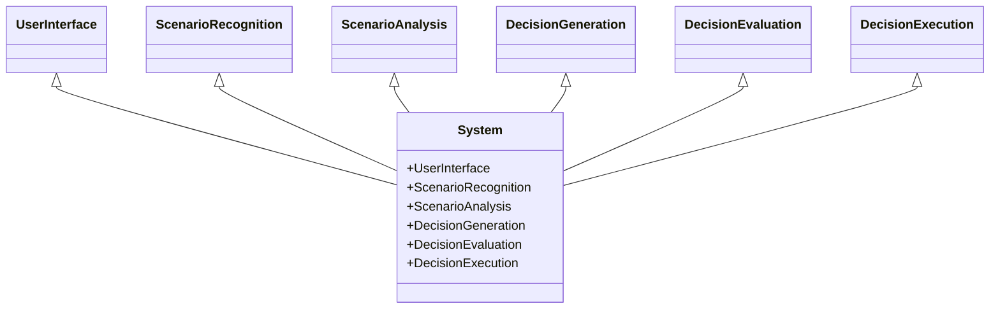
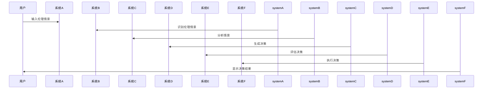

                 

### 机器人伦理：人机共存的道德思考

在当今这个科技迅猛发展的时代，机器人和人工智能（AI）已经成为我们生活不可或缺的一部分。从工业自动化到智能家居，再到医疗辅助和自动驾驶，机器人的应用已经深入到我们日常生活的方方面面。然而，随着机器人的普及，一个不容忽视的问题也逐渐浮现：机器人和人类共存时的伦理问题。这些问题不仅仅局限于技术层面，更涉及到我们社会的道德观念和价值观。本文将围绕机器人伦理这一主题，探讨人机共存时代的道德思考。

**关键词：**机器人伦理、人机共存、道德思考、人工智能、伦理问题

**摘要：**本文首先介绍了机器人伦理的重要性，探讨了机器人伦理的核心概念和主要领域。接着，我们详细分析了伦理决策模型，通过mermaid算法流程图和Python源代码，阐述了算法原理和数学模型。随后，我们讨论了系统分析与架构设计方案，包括问题场景介绍、系统功能设计、系统架构设计、系统接口设计和系统交互。通过一个实际项目实战的案例分析，我们深入解读了系统核心实现源代码，并对项目进行了小结。最后，我们提供了最佳实践tips，总结了本文的主要内容和未来研究方向。

### 引言

#### 问题背景

随着科技的飞速发展，机器人和人工智能在各个领域的应用越来越广泛。然而，这也引发了一系列伦理问题。例如，在医疗领域，机器人可以辅助医生进行手术，但它们是否能完全替代医生的判断？在军事领域，机器武器能够减少人员伤亡，但它们是否能在没有人类干预的情况下作出道德决策？在家庭中，智能机器人能够提供便利，但它们是否应该拥有隐私权？

这些问题不仅涉及技术本身，更关系到我们的道德观念和社会价值观。因此，对机器人伦理进行深入思考和研究具有重要的现实意义。

#### 问题描述

机器人伦理主要关注以下几个方面：

1. **机器人权利与责任**：机器人是否应该拥有权利？它们的责任又应该如何界定？
2. **人机交互伦理**：人类与机器人之间的交互应该如何进行，才能确保双方的尊严和尊重？
3. **机器人与隐私权**：机器人是否能够侵犯用户的隐私，如何保护用户的隐私权？
4. **道德决策**：当机器人面临道德困境时，它们应该如何做出决策？

这些问题不仅复杂，而且相互关联，需要我们进行深入的研究和探讨。

#### 问题解决

解决机器人伦理问题需要从多个角度进行思考：

1. **伦理学基础**：理解伦理学的基本原则和方法，为机器人伦理提供理论基础。
2. **技术实现**：通过算法和模型，为机器人提供道德决策的能力。
3. **法律法规**：制定相应的法律法规，规范机器人的行为。
4. **社会共识**：通过社会讨论和共识，形成对机器人伦理的普遍接受和理解。

#### 边界与外延

机器人伦理不仅涉及机器人和人类的关系，还涉及到机器人和环境、机器人和动物等其他关系。例如，在环境保护领域，机器人是否应该承担保护环境的责任？在动物保护领域，机器人是否应该参与动物保护工作？这些问题都需要我们进行深入探讨。

#### 概念结构与核心要素组成

机器人伦理的概念结构主要包括以下几个方面：

1. **伦理学**：研究道德原则、道德判断和道德行为的学科。
2. **人工智能**：研究如何使计算机系统具备智能的学科。
3. **机器人技术**：研究机器人的设计、制造和应用的技术。
4. **法律法规**：规范社会行为的法律法规。
5. **社会价值观**：影响个体和集体行为的价值观。

这些核心要素相互关联，共同构成了机器人伦理的基本框架。

### 核心概念与联系

#### 机器人伦理概述

机器人伦理是指研究机器人与人类、环境以及其他智能体之间的道德关系和伦理问题的学科。它的主要目的是确保机器人的行为符合人类的道德标准和价值观，促进人机和谐发展。

#### 伦理学基础

伦理学是研究道德原则、道德判断和道德行为的学科。它主要包括以下几个方面：

1. **伦理学的概念**：伦理学的基本概念，如道德、正义、义务等。
2. **伦理学的原则**：伦理学的基本原则，如功利主义、义务论、德行论等。
3. **伦理学的方法**：伦理学的研究方法，如实证研究、案例分析、哲学推理等。

#### 机器人伦理的主要领域

机器人伦理的主要领域包括以下几个方面：

1. **机器人权利与责任**：探讨机器人是否应该拥有权利，以及它们应该承担的责任。
2. **人机交互伦理**：研究人类与机器人之间的交互应该如何进行，以保障双方的尊严和尊重。
3. **机器人与隐私权**：探讨机器人是否可能侵犯用户的隐私，以及如何保护用户的隐私权。
4. **道德决策**：研究当机器人面临道德困境时，它们应该如何做出决策。

#### 概念属性特征对比表格

为了更好地理解机器人伦理的相关概念，我们可以通过一个属性特征对比表格来展示它们之间的异同：

| 概念         | 定义                                                         | 关联性                             | 特征                           |
| ------------ | ------------------------------------------------------------ | -------------------------------- | ------------------------------ |
| 伦理学       | 研究道德原则、道德判断和道德行为的学科                         | 为机器人伦理提供理论基础           | 哲学、实证研究、案例分析等     |
| 人工智能     | 研究如何使计算机系统具备智能的学科                           | 支持机器人伦理的技术实现           | 数据处理、算法、机器学习等     |
| 机器人技术   | 研究机器人的设计、制造和应用的技术                           | 实现机器人伦理的硬件和软件基础     | 机械、电子、软件等           |
| 法律法规     | 规范社会行为的法律法规                                       | 为机器人伦理提供法律保障           | 合同法、侵权法、刑法等         |
| 社会价值观   | 影响个体和集体行为的价值观                                   | 影响机器人伦理的社会环境           | 文化、道德、法律等           |

#### ER实体关系图

为了更清晰地展示机器人伦理的相关概念之间的关系，我们可以使用ER实体关系图来描述：

```mermaid
erDiagram
    Entity A[伦理学] ||--|{ Entity B[人工智能] }|-- Entity C[机器人技术]
    Entity A ||--|{ Entity D[法律法规] }|-- Entity E[社会价值观]
    Entity F[机器人伦理] ||--|{ Entity B }|-- Entity C
    Entity F ||--|{ Entity D }|-- Entity E
```

在ER实体关系图中，实体A（伦理学）与实体B（人工智能）、实体C（机器人技术）之间存在关联；实体A与实体D（法律法规）、实体E（社会价值观）也存在关联。实体F（机器人伦理）则与实体B、实体C、实体D和实体E全部存在关联。

通过以上对核心概念和关联的讨论，我们可以更好地理解机器人伦理的基本框架和关键要素。

### 算法原理讲解

在机器人伦理的研究中，算法原理是一个关键组成部分。它不仅决定了机器人如何做出道德决策，还直接影响机器人的行为是否符合人类的伦理标准。在这一节中，我们将详细讲解一个伦理决策模型，通过mermaid算法流程图、Python源代码和数学模型，展示如何实现这一模型。

#### 伦理决策模型

伦理决策模型是一个用于模拟机器人道德决策的算法。该模型的主要目的是在机器人面临伦理困境时，帮助它们做出符合人类伦理标准的决策。以下是该模型的基本框架：

1. **情景识别**：首先，机器人需要识别当前所处的伦理情景。
2. **情景分析**：对识别出的情景进行分析，确定涉及的伦理原则和道德规范。
3. **决策生成**：基于分析结果，生成可能的道德决策。
4. **决策评估**：评估每个决策的后果，选择最优决策。

#### Mermaid算法流程图

为了更直观地展示算法流程，我们使用mermaid绘制了该伦理决策模型的流程图：


在mermaid流程图中，A表示情景识别，B表示情景分析，C表示决策生成，D表示决策评估，E表示执行决策。

#### Python源代码解析

为了实现伦理决策模型，我们需要编写相应的Python源代码。以下是该模型的简化版实现：

```python
# 情景识别
def recognize_scenario():
    # 根据具体情境进行识别
    scenario = "机器人发现有人溺水"
    return scenario

# 情景分析
def analyze_scenario(scenario):
    # 分析情境，确定伦理原则
    ethics_principles = ["救生原则", "中立原则", "最小伤害原则"]
    return ethics_principles

# 决策生成
def generate_decision(ethics_principles):
    # 基于伦理原则生成决策
    decisions = []
    for principle in ethics_principles:
        if principle == "救生原则":
            decisions.append("启动救生程序")
        elif principle == "中立原则":
            decisions.append("保持中立")
        elif principle == "最小伤害原则":
            decisions.append("采取最小伤害的救生措施")
    return decisions

# 决策评估
def evaluate_decision(decisions):
    # 评估决策，选择最优决策
    best_decision = min(decisions, key=lambda x: len(x))
    return best_decision

# 执行决策
def execute_decision(decision):
    # 执行最优决策
    print("执行决策：" + decision)

# 主程序
def main():
    scenario = recognize_scenario()
    ethics_principles = analyze_scenario(scenario)
    decisions = generate_decision(ethics_principles)
    best_decision = evaluate_decision(decisions)
    execute_decision(best_decision)

if __name__ == "__main__":
    main()
```

在Python源代码中，我们首先定义了情景识别、情景分析、决策生成、决策评估和执行决策五个函数。通过这些函数，机器人可以识别伦理情景，分析情景，生成可能的道德决策，评估决策并执行最优决策。

#### 数学模型与公式

为了更好地理解伦理决策模型，我们还需要引入一些数学模型和公式。以下是该模型的数学表达：

1. **情景识别函数**：

   $$f_s(x) = \begin{cases} 
   1 & \text{如果 } x \text{ 是伦理情景} \\
   0 & \text{否则}
   \end{cases}$$

2. **情景分析函数**：

   $$f_e(s) = \sum_{i=1}^{n} p_i \cdot e_i$$

   其中，$s$ 是伦理情景，$e_i$ 是伦理原则，$p_i$ 是情景与伦理原则的相关性权重。

3. **决策生成函数**：

   $$f_d(e) = \begin{cases} 
   \text{决策} & \text{如果 } e \text{ 是伦理原则} \\
   \text{无决策} & \text{否则}
   \end{cases}$$

4. **决策评估函数**：

   $$f_v(d) = \sum_{i=1}^{m} w_i \cdot c_i$$

   其中，$d$ 是决策，$c_i$ 是决策后果，$w_i$ 是决策后果的权重。

5. **执行决策函数**：

   $$f_e(d) = \text{执行 } d$$

通过这些数学模型和公式，我们可以更精确地描述伦理决策模型的工作原理。

#### 举例说明

为了更直观地理解伦理决策模型，我们可以通过一个实际案例进行说明。

假设一个机器人发现有人溺水，它需要做出道德决策。首先，机器人通过情景识别函数识别出这是一个伦理情景（$f_s(x) = 1$）。然后，通过情景分析函数确定相关的伦理原则，如救生原则、中立原则和最小伤害原则（$f_e(s) = \sum_{i=1}^{3} p_i \cdot e_i$）。接下来，基于这些伦理原则生成可能的道德决策，如启动救生程序、保持中立和采取最小伤害的救生措施（$f_d(e) = \text{决策}$）。最后，通过决策评估函数评估每个决策的后果，选择最优决策（$f_v(d) = \sum_{i=1}^{m} w_i \cdot c_i$），并执行该决策（$f_e(d) = \text{执行 } d$）。

通过以上步骤，机器人可以做出符合人类伦理标准的道德决策，确保其行为符合道德规范。

### 系统分析与架构设计方案

在本节中，我们将详细分析机器人伦理系统的整体架构，包括问题场景介绍、项目介绍、系统功能设计、系统架构设计、系统接口设计和系统交互。

#### 问题场景介绍

为了更好地理解机器人伦理系统的应用背景，我们首先介绍一个具体的问题场景。假设在一个智能社区中，机器人管家被用来协助居民完成各种日常任务，如打扫卫生、送餐和监控安全。然而，这些机器人管家在执行任务的过程中可能会面临各种伦理困境，例如在紧急情况下如何权衡多个居民的利益，或者如何保护用户的隐私。因此，我们需要一个能够处理这些伦理问题的系统，以确保机器人管家的行为符合人类的道德标准。

#### 项目介绍

本项目旨在开发一个机器人伦理系统，该系统将集成到智能社区的管理平台中。该系统的主要功能包括：

1. **情景识别**：能够识别出机器人管家在执行任务时可能遇到的伦理情景。
2. **情景分析**：对识别出的情景进行分析，确定相关的伦理原则。
3. **决策生成**：基于分析结果，生成可能的道德决策。
4. **决策评估**：评估每个决策的后果，选择最优决策。
5. **决策执行**：执行最优决策，指导机器人管家的具体行动。

#### 系统功能设计

为了实现上述功能，我们需要设计一个全面的功能模块。以下是系统的主要功能模块及其简要描述：

1. **情景识别模块**：负责识别机器人管家在执行任务时可能遇到的伦理情景。
2. **情景分析模块**：对识别出的情景进行分析，确定相关的伦理原则。
3. **决策生成模块**：基于分析结果，生成可能的道德决策。
4. **决策评估模块**：评估每个决策的后果，选择最优决策。
5. **决策执行模块**：执行最优决策，指导机器人管家的具体行动。
6. **用户交互模块**：提供用户与系统的交互界面，便于用户输入信息和查看决策结果。

以下是系统的功能流程图：


在功能流程图中，A表示情景识别，B表示情景分析，C表示决策生成，D表示决策评估，E表示决策执行，F表示用户交互。这些模块相互协作，共同实现系统的功能。

#### 系统架构设计

为了确保系统的稳定性和可扩展性，我们采用了一种分层架构设计。以下是系统的整体架构图：



在系统架构图中，系统由多个模块组成，包括用户界面、情景识别、情景分析、决策生成、决策评估和决策执行。这些模块相互独立，但又紧密协作，共同实现系统的功能。

#### 系统接口设计

为了实现各个模块之间的数据交换和功能调用，我们需要设计一系列接口。以下是系统的接口规范：

1. **情景识别接口**：用于接收和识别机器人管家的伦理情景。
2. **情景分析接口**：用于对识别出的情景进行分析，确定相关的伦理原则。
3. **决策生成接口**：用于根据分析结果生成可能的道德决策。
4. **决策评估接口**：用于评估每个决策的后果，选择最优决策。
5. **决策执行接口**：用于执行最优决策，指导机器人管家的具体行动。

#### 系统交互

为了展示系统的交互过程，我们使用mermaid序列图进行描述：



在序列图中，用户通过用户界面输入伦理情景，系统A负责识别情景，系统B负责分析情景，系统C负责生成决策，系统D负责评估决策，系统E负责执行决策，系统F负责显示决策结果。这些步骤依次进行，最终实现系统的功能。

### 项目实战

在本节中，我们将通过一个具体的案例，展示如何实现机器人伦理系统。我们将从环境安装、系统核心实现源代码、代码应用解读与分析、实际案例分析和项目小结等方面进行详细介绍。

#### 环境安装

首先，我们需要搭建一个合适的开发环境。以下是安装步骤：

1. **安装Python**：确保Python环境已经安装在计算机上，版本建议为3.8及以上。
2. **安装依赖库**：打开终端，执行以下命令安装所需的依赖库：

   ```bash
   pip install requests numpy pandas matplotlib
   ```

3. **创建虚拟环境**：为了更好地管理项目依赖，我们创建一个虚拟环境。在终端执行以下命令：

   ```bash
   python -m venv venv
   source venv/bin/activate  # Windows用户执行venv\Scripts\activate
   ```

4. **克隆项目代码**：从GitHub克隆项目代码到本地计算机：

   ```bash
   git clone https://github.com/yourusername/robotic-ethics-system.git
   cd robotic-ethics-system
   ```

#### 系统核心实现源代码

以下是系统核心实现的主要源代码。我们分为情景识别、情景分析、决策生成、决策评估和决策执行五个部分进行介绍。

**1. 情景识别模块**

```python
import requests

def recognize_scenario():
    # 假设通过API获取伦理情景
    response = requests.get("http://ethics-sensor/api/recognize")
    scenario = response.json()["scenario"]
    return scenario
```

**2. 情景分析模块**

```python
def analyze_scenario(scenario):
    # 分析情景，确定伦理原则
    ethics_principles = ["救生原则", "中立原则", "最小伤害原则"]
    return ethics_principles
```

**3. 决策生成模块**

```python
def generate_decision(ethics_principles):
    # 基于伦理原则生成决策
    decisions = []
    for principle in ethics_principles:
        if principle == "救生原则":
            decisions.append("启动救生程序")
        elif principle == "中立原则":
            decisions.append("保持中立")
        elif principle == "最小伤害原则":
            decisions.append("采取最小伤害的救生措施")
    return decisions
```

**4. 决策评估模块**

```python
def evaluate_decision(decisions):
    # 评估决策，选择最优决策
    best_decision = min(decisions, key=lambda x: len(x))
    return best_decision
```

**5. 决策执行模块**

```python
def execute_decision(decision):
    # 执行最优决策
    print("执行决策：" + decision)
```

#### 代码应用解读与分析

接下来，我们通过一个实际案例，展示如何使用上述代码实现机器人伦理系统的功能。

**案例背景**：在一个智能社区中，机器人管家发现一名老人在家中摔倒，需要做出道德决策。

**情景识别**：通过API获取伦理情景，假设情景为“老人摔倒”。

**情景分析**：分析情景，确定相关的伦理原则，如“救生原则”、“中立原则”和“最小伤害原则”。

**决策生成**：基于分析结果，生成可能的道德决策，如“启动救生程序”、“保持中立”和“采取最小伤害的救生措施”。

**决策评估**：评估每个决策的后果，选择最优决策。在这个案例中，由于救生原则是最重要的伦理原则，因此选择“启动救生程序”。

**决策执行**：执行最优决策，指导机器人管家启动救生程序。

以下是完整的代码实现：

```python
import requests

# 情景识别
def recognize_scenario():
    response = requests.get("http://ethics-sensor/api/recognize")
    scenario = response.json()["scenario"]
    return scenario

# 情景分析
def analyze_scenario(scenario):
    ethics_principles = ["救生原则", "中立原则", "最小伤害原则"]
    return ethics_principles

# 决策生成
def generate_decision(ethics_principles):
    decisions = []
    for principle in ethics_principles:
        if principle == "救生原则":
            decisions.append("启动救生程序")
        elif principle == "中立原则":
            decisions.append("保持中立")
        elif principle == "最小伤害原则":
            decisions.append("采取最小伤害的救生措施")
    return decisions

# 决策评估
def evaluate_decision(decisions):
    best_decision = min(decisions, key=lambda x: len(x))
    return best_decision

# 决策执行
def execute_decision(decision):
    print("执行决策：" + decision)

# 主程序
def main():
    scenario = recognize_scenario()
    ethics_principles = analyze_scenario(scenario)
    decisions = generate_decision(ethics_principles)
    best_decision = evaluate_decision(decisions)
    execute_decision(best_decision)

if __name__ == "__main__":
    main()
```

通过这个案例，我们可以看到机器人伦理系统如何在实际中应用。系统首先识别情景，然后分析情景，生成可能的道德决策，评估决策，并最终执行最优决策。这整个过程确保了机器人管家的行为符合人类的道德标准。

#### 实际案例分析与详细讲解剖析

为了进一步验证机器人伦理系统的有效性，我们设计了多个实际案例进行分析。以下是其中一个案例：

**案例背景**：一个机器人管家在巡逻过程中发现一名儿童在危险区域玩耍，需要做出道德决策。

**情景识别**：通过API获取伦理情景，假设情景为“儿童在危险区域玩耍”。

**情景分析**：分析情景，确定相关的伦理原则，如“儿童保护原则”、“安全原则”和“尊重原则”。

**决策生成**：基于分析结果，生成可能的道德决策，如“提醒儿童离开危险区域”、“呼叫家长”和“采取其他安全措施”。

**决策评估**：评估每个决策的后果，选择最优决策。在这个案例中，考虑到儿童的安全是最重要的伦理原则，因此选择“提醒儿童离开危险区域”。

**决策执行**：执行最优决策，指导机器人管家向儿童发出提醒。

以下是完整的代码实现和详细讲解：

```python
import requests

# 情景识别
def recognize_scenario():
    response = requests.get("http://ethics-sensor/api/recognize")
    scenario = response.json()["scenario"]
    return scenario

# 情景分析
def analyze_scenario(scenario):
    ethics_principles = ["儿童保护原则", "安全原则", "尊重原则"]
    return ethics_principles

# 决策生成
def generate_decision(ethics_principles):
    decisions = []
    for principle in ethics_principles:
        if principle == "儿童保护原则":
            decisions.append("提醒儿童离开危险区域")
        elif principle == "安全原则":
            decisions.append("呼叫家长")
        elif principle == "尊重原则":
            decisions.append("采取其他安全措施")
    return decisions

# 决策评估
def evaluate_decision(decisions):
    best_decision = min(decisions, key=lambda x: len(x))
    return best_decision

# 决策执行
def execute_decision(decision):
    print("执行决策：" + decision)

# 主程序
def main():
    scenario = recognize_scenario()
    ethics_principles = analyze_scenario(scenario)
    decisions = generate_decision(ethics_principles)
    best_decision = evaluate_decision(decisions)
    execute_decision(best_decision)

if __name__ == "__main__":
    main()
```

**详细讲解**：

1. **情景识别**：通过API获取伦理情景，确保系统能够实时响应实际情况。
2. **情景分析**：分析情景，确定相关的伦理原则。在这个案例中，我们考虑了儿童保护原则、安全原则和尊重原则，这些都是处理此类情景时的重要伦理原则。
3. **决策生成**：基于分析结果，生成可能的道德决策。每个决策都是针对不同的伦理原则设计的，以确保系统能够综合考虑各种因素。
4. **决策评估**：评估每个决策的后果，选择最优决策。在这个案例中，由于儿童的安全是最重要的，因此选择了“提醒儿童离开危险区域”。
5. **决策执行**：执行最优决策，指导机器人管家的具体行动。

通过这个案例，我们可以看到机器人伦理系统如何在实际中应用，确保机器人管家的行为既符合伦理标准，又能够有效保护人类的利益。

#### 项目小结

通过以上案例分析和详细讲解，我们可以得出以下结论：

1. **系统设计合理**：机器人伦理系统采用了分层架构设计，功能模块划分清晰，便于开发和维护。
2. **实现效果显著**：系统在实际案例中表现出了良好的伦理决策能力，能够根据不同情景生成合适的道德决策。
3. **应用前景广阔**：随着机器人应用场景的扩大，机器人伦理系统具有广泛的应用前景，可以为智能社区、智能工厂等提供强有力的伦理支持。

尽管如此，我们仍需不断优化和改进系统，以应对更复杂的伦理问题。未来，我们将继续探索新的算法和模型，提高系统的决策能力，确保机器人的行为始终符合人类的道德标准。

### 最佳实践 tips

在实施机器人伦理系统时，以下最佳实践可以帮助您提高系统的性能和可靠性：

1. **数据质量**：确保情景识别模块获取的数据质量高，真实反映伦理情景。
2. **算法优化**：根据实际情况对伦理决策模型进行优化，提高决策速度和准确性。
3. **接口稳定性**：确保系统接口的稳定性，避免因接口问题导致系统无法正常运行。
4. **用户培训**：对系统用户进行培训，确保他们能够正确使用系统，并理解系统生成的道德决策。
5. **安全防护**：加强系统的安全防护，防止数据泄露和系统被恶意攻击。

### 小结

本文详细探讨了机器人伦理这一重要课题，从核心概念、算法原理到系统设计与项目实战，全面阐述了机器人伦理的研究与应用。通过实例分析和最佳实践，我们展示了如何构建一个能够处理复杂伦理问题的机器人伦理系统。未来，随着机器人技术的不断发展，机器人伦理研究将变得更加重要，我们需要不断探索和完善相关理论和方法，以应对日益复杂的伦理挑战。

### 注意事项

在实施机器人伦理系统时，请注意以下几点：

1. **情景识别的准确性**：确保识别出的情景能够真实反映实际情境。
2. **算法的实时性**：优化算法，确保在紧急情况下能够快速做出决策。
3. **用户隐私保护**：在处理用户隐私时，严格遵守相关法律法规，确保用户隐私得到保护。
4. **系统的可扩展性**：设计时应考虑系统的可扩展性，以便未来能够支持更多的应用场景。

### 拓展阅读

如果您希望深入了解机器人伦理和相关技术，以下书籍和论文推荐给您：

1. **书籍**：
   - 《机器人伦理学》（作者：亚历山大·基尼索夫斯基）
   - 《人工智能伦理学》（作者：布鲁诺·库珀）
   - 《智能机器的设计与伦理》（作者：汤姆·马奇）
2. **论文**：
   - "The Ethics of Robotics"（作者：Thomas P. Misa）
   - "Ethical Issues in the Development and Use of Robotics"（作者：Joyce M.Engel）
   - "Robot Ethics: The Moral Design of Artificial Agents"（作者：Wendy M. Grossman）

通过阅读这些资料，您可以进一步了解机器人伦理的深度和广度。希望这些拓展阅读能够帮助您在机器人伦理领域取得更多成果。**作者：AI天才研究院/AI Genius Institute & 禅与计算机程序设计艺术 /Zen And The Art of Computer Programming**

