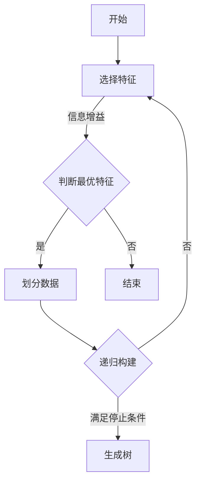
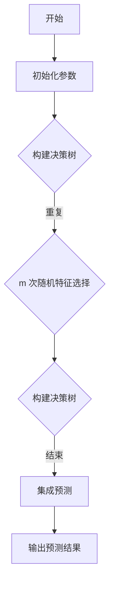
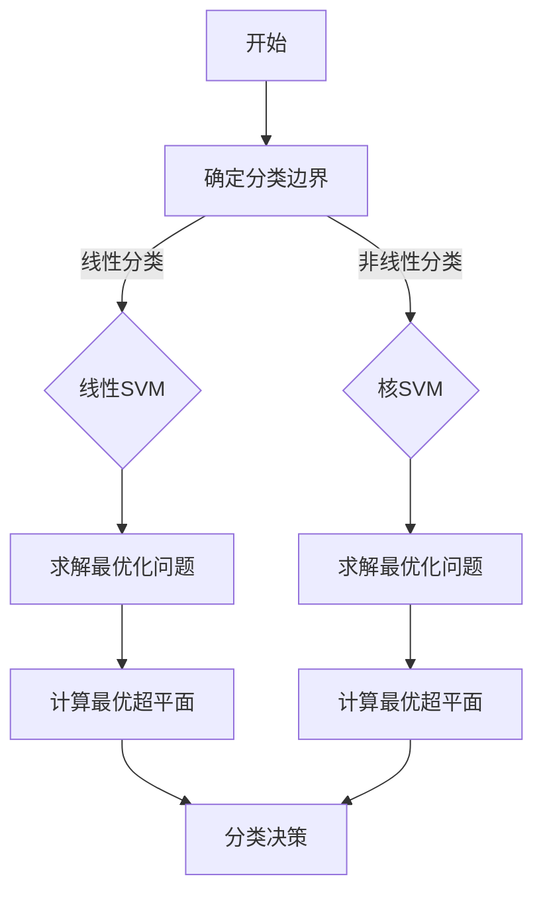
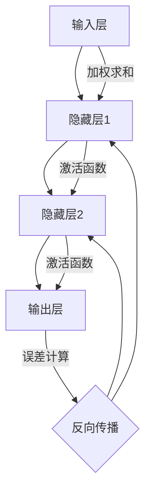

                 

### 引言

#### 1.1 机器学习与个性化广告投放

##### 1.1.1 问题背景

随着互联网技术的迅猛发展和用户数据的不断积累，个性化广告投放已经成为现代广告营销的重要手段。然而，如何实现精准有效的个性化广告投放，一直是广告行业和企业关注的焦点。机器学习作为一种强大的数据分析工具，其在个性化广告投放中的应用显得尤为重要。机器学习通过分析用户数据，识别用户兴趣和行为模式，从而实现广告的精准投放，提高广告效果和用户满意度。

##### 1.1.2 问题描述

个性化广告投放涉及多个方面，包括用户数据分析、广告内容推荐、广告投放策略优化等。具体来说，问题描述可以归纳为以下三个主要方面：

1. **用户数据分析**：如何通过机器学习技术，从大量用户数据中提取出有效的特征，用于描述用户行为和兴趣。

2. **广告内容推荐**：如何根据用户特征，推荐符合用户兴趣的广告内容，提高广告点击率和转化率。

3. **广告投放策略优化**：如何根据广告投放效果，调整广告投放策略，实现广告资源的合理配置和最大化收益。

##### 1.1.3 问题解决

针对上述问题，机器学习提供了一系列解决方案。具体来说，问题解决可以从以下几个方面入手：

1. **数据预处理**：通过数据清洗、数据转换和数据归一化等手段，确保输入数据的质量和一致性。

2. **特征工程**：通过特征选择、特征提取和特征组合等方法，从原始数据中提取出有价值的特征，用于构建机器学习模型。

3. **模型选择与训练**：选择合适的机器学习模型，对用户特征进行训练，以识别用户行为和兴趣模式。

4. **广告投放策略优化**：根据模型预测结果，调整广告投放策略，提高广告投放效果。

##### 1.1.4 边界与外延

个性化广告投放的应用范围广泛，不仅包括互联网广告，还涵盖了传统媒体广告、社交媒体广告等。此外，个性化广告投放还可以与其他技术手段结合，如数据挖掘、自然语言处理等，进一步丰富广告投放的策略和方法。

#### 1.2 核心概念

##### 1.2.1 机器学习

机器学习是一门研究如何让计算机从数据中自动学习和发现规律的人工智能技术。其主要目标是通过训练模型，使计算机能够对未知数据进行预测和决策。机器学习可以分为监督学习、无监督学习和强化学习三种类型。

- **监督学习**：通过已知输入输出数据，训练模型以预测未知输出。

- **无监督学习**：仅通过输入数据，训练模型以发现数据中的模式和结构。

- **强化学习**：通过与环境的交互，训练模型以实现最优策略。

##### 1.2.2 个性化广告投放

个性化广告投放是指根据用户的行为和兴趣，为用户提供个性化的广告内容。其核心思想是通过对用户数据的分析，识别用户的行为模式和兴趣，从而实现广告的精准投放。个性化广告投放的关键步骤包括用户数据分析、广告内容推荐和广告投放策略优化。

##### 1.2.3 研究范围与目标

本文主要研究机器学习在个性化广告投放中的应用，旨在解决以下问题：

1. 如何通过机器学习技术，从用户数据中提取有效特征，实现广告的精准投放。

2. 如何选择合适的机器学习模型，提高广告投放效果。

3. 如何根据广告投放效果，优化广告投放策略。

通过本文的研究，期望为广告行业和企业提供有益的参考和指导。

#### 1.3 本章小结

本章介绍了机器学习在个性化广告投放中的应用背景、问题描述和核心概念。通过分析机器学习和个性化广告投放的关系，明确了本文的研究范围和目标。接下来，本文将深入探讨机器学习的基础理论、算法讲解、应用实践和优化与评估等方面，为个性化广告投放提供技术支持。

----------------------------------------------------------------

## 机器学习在个性化广告投放中的应用

### 2.1 数据预处理

#### 2.1.1 数据清洗

数据清洗是数据预处理的重要步骤，旨在去除数据中的噪声、错误和不一致。在个性化广告投放中，数据清洗主要包括以下几个方面：

1. **缺失值处理**：对于缺失值，可以选择填充、删除或插值等方法进行处理。填充方法包括平均值填充、中值填充和众数填充等。删除方法则是直接删除包含缺失值的样本或特征。插值方法则是在时间序列数据中，通过插值算法补充缺失的数据。

2. **异常值处理**：异常值可能会对机器学习模型的训练结果产生不良影响。处理方法包括统计学方法、机器学习方法等。统计学方法如标准差法和箱型图法，可以检测出异常值。机器学习方法如孤立森林算法，可以识别出异常值并进行处理。

3. **数据格式转换**：不同数据源的数据格式可能存在差异，如时间戳格式、文本格式等。在进行数据预处理时，需要将数据格式转换为统一的标准格式。

4. **数据去重**：去除重复的数据，防止数据重复对模型训练和预测结果的影响。

#### 2.1.2 数据转换

数据转换是数据预处理的关键步骤，旨在将原始数据转换为适合机器学习模型训练的格式。数据转换主要包括以下几个方面：

1. **数值化**：将非数值数据转换为数值数据，如将文本数据编码为数字。

2. **离散化**：将连续数值数据划分为若干个区间，如将年龄分为“0-18”、“19-35”、“36-50”等。

3. **标准化**：将不同特征的数据进行归一化处理，使其具有相同的尺度，避免某些特征对模型训练的影响。

4. **归一化**：将特征数据的范围调整到[0, 1]，使其在训练过程中具有更好的收敛性。

#### 2.1.3 数据归一化

数据归一化是数据预处理的重要步骤，旨在将不同特征的数据转换为相同的尺度。数据归一化方法包括最小-最大缩放、均值-标准差缩放等。

1. **最小-最大缩放**：将特征值缩放到[0, 1]范围内，公式如下：

   $$
   x_{\text{norm}} = \frac{x - x_{\text{min}}}{x_{\text{max}} - x_{\text{min}}}
   $$

   其中，$x$ 为原始特征值，$x_{\text{min}}$ 和 $x_{\text{max}}$ 分别为特征值的最小值和最大值。

2. **均值-标准差缩放**：将特征值缩放到均值为0、标准差为1的范围内，公式如下：

   $$
   x_{\text{norm}} = \frac{x - \mu}{\sigma}
   $$

   其中，$\mu$ 和 $\sigma$ 分别为特征值的均值和标准差。

#### 2.1.4 数据集划分

在机器学习模型训练过程中，需要将数据集划分为训练集、验证集和测试集。数据集划分的方法包括随机划分、按比例划分等。

1. **随机划分**：将数据集随机划分为训练集和验证集，一般使用70%-30%的比例进行划分。

2. **按比例划分**：根据不同特征的分布情况，按比例将数据集划分为训练集和验证集，如用户年龄、性别等特征。

#### 2.1.5 数据预处理流程

数据预处理流程通常包括数据清洗、数据转换、数据归一化和数据集划分等步骤。以下是一个简单的数据预处理流程：

1. **数据清洗**：去除缺失值、异常值和重复值。

2. **数据转换**：将文本数据编码为数字，连续数值数据离散化为类别。

3. **数据归一化**：对特征数据进行归一化处理，使其具有相同的尺度。

4. **数据集划分**：将数据集划分为训练集、验证集和测试集，分别用于模型训练、验证和测试。

#### 2.1.6 本章小结

数据预处理是机器学习模型训练的重要步骤，包括数据清洗、数据转换、数据归一化和数据集划分等。通过数据预处理，可以去除数据中的噪声和错误，提高机器学习模型的训练效果。

----------------------------------------------------------------

### 2.2 特征工程

#### 2.2.1 特征选择

特征选择是特征工程的重要环节，旨在从原始特征中筛选出对模型训练和预测有显著影响的特征。特征选择的方法包括统计方法、基于模型的特征选择和嵌入方法。

1. **统计方法**：根据特征的重要性和相关性，对特征进行排序，选择排名靠前的特征。常用的统计方法包括信息增益、卡方检验和互信息等。

2. **基于模型的特征选择**：通过训练一个基模型，如线性回归模型，分析特征对模型的影响。选择对模型影响较大的特征作为重要特征。

3. **嵌入方法**：通过训练一个特征提取模型，将原始特征映射为新的特征空间，选择在新的特征空间中具有显著区分度的特征。

#### 2.2.2 特征提取

特征提取是将原始数据转换为更具解释性和有效性的特征表示。特征提取的方法包括特征变换、特征组合和降维等。

1. **特征变换**：通过数学变换，将原始特征转换为新的特征。如对连续特征进行归一化、对文本特征进行词袋模型变换等。

2. **特征组合**：将原始特征组合成新的特征，如通过组合用户行为特征，构建用户兴趣特征。

3. **降维**：通过降维算法，如主成分分析（PCA）、t-SNE等，减少特征数量，提高模型训练效率。

#### 2.2.3 特征组合

特征组合是将多个特征组合成一个新的特征，以提高模型训练效果和预测性能。特征组合的方法包括特征交互、特征融合和特征加权等。

1. **特征交互**：通过计算特征之间的乘积、加和等操作，生成新的特征。

2. **特征融合**：将不同特征的空间信息进行融合，如通过空间插值方法，将空间特征融合为统一的空间特征。

3. **特征加权**：根据特征的重要性和贡献度，对特征进行加权处理，生成新的特征。

#### 2.2.4 特征选择与特征提取的对比

特征选择与特征提取都是特征工程的重要环节，但它们的目标和方法有所不同。

1. **目标**：特征选择的目标是选择对模型训练和预测有显著影响的特征，减少特征数量，提高模型训练效率。特征提取的目标是将原始数据转换为更具解释性和有效性的特征表示，提高模型预测性能。

2. **方法**：特征选择主要采用统计方法、基于模型的特征选择和嵌入方法。特征提取主要采用特征变换、特征组合和降维等方法。

#### 2.2.5 ER实体关系图

ER实体关系图是一种用于表示实体及其关系的图形化方法。在特征工程中，ER实体关系图可以用于表示特征实体及其关系。

1. **实体**：特征实体是特征工程中的核心概念，包括用户特征、广告特征和交互特征等。

2. **关系**：特征实体之间的关系可以分为直接关系和间接关系。直接关系如用户与广告的点击关系，间接关系如用户与广告的浏览关系。

3. **ER实体关系图**：ER实体关系图通过实体和关系表示特征工程中的实体及其关系，为特征工程提供直观的图形化表示。

#### 2.2.6 本章小结

特征工程是机器学习模型训练的关键环节，包括特征选择、特征提取和特征组合等。通过特征工程，可以提高模型训练效果和预测性能。本章介绍了特征选择与特征提取的方法和ER实体关系图的应用，为个性化广告投放提供了技术支持。

----------------------------------------------------------------

### 2.3 模型选择

#### 2.3.1 监督学习模型

监督学习模型是机器学习中的一种重要模型，它通过已知的输入输出数据，学习出数据之间的映射关系，从而对未知数据进行预测。在个性化广告投放中，监督学习模型可以用于用户兴趣识别、广告推荐等任务。

1. **线性回归模型**：线性回归模型是一种简单且常用的监督学习模型，它通过拟合数据点之间的线性关系，实现对未知数据的预测。

   公式如下：

   $$
   y = \beta_0 + \beta_1x_1 + \beta_2x_2 + ... + \beta_nx_n
   $$

   其中，$y$ 为输出变量，$x_1, x_2, ..., x_n$ 为输入变量，$\beta_0, \beta_1, \beta_2, ..., \beta_n$ 为模型的参数。

2. **决策树模型**：决策树模型是一种基于树形结构进行分类和回归的监督学习模型。它通过递归划分特征空间，构建出一棵树形结构，从而对未知数据进行预测。

3. **支持向量机模型**：支持向量机模型是一种基于间隔最大化原则进行分类和回归的监督学习模型。它通过找到一个最优的超平面，将不同类别的数据点分隔开来。

4. **神经网络模型**：神经网络模型是一种基于多层神经元组成的网络结构进行分类和回归的监督学习模型。它通过模拟人脑的神经网络结构，实现对复杂非线性问题的建模和预测。

#### 2.3.2 无监督学习模型

无监督学习模型是机器学习中的一种重要模型，它通过未标记的数据，学习出数据中的分布和结构。在个性化广告投放中，无监督学习模型可以用于用户行为分析、广告内容推荐等任务。

1. **聚类模型**：聚类模型是一种将数据点按照相似性进行划分的模型，它通过寻找数据点之间的相似度，将数据划分为若干个聚类。

2. **降维模型**：降维模型是一种将高维数据映射到低维空间的模型，它通过减少数据维度，降低数据复杂性，提高模型训练效率。

3. **关联规则模型**：关联规则模型是一种用于发现数据之间的关联关系的模型，它通过挖掘数据中的频繁项集，发现数据之间的关联关系。

#### 2.3.3 强化学习模型

强化学习模型是机器学习中的一种重要模型，它通过奖励机制，学习出最优策略，从而实现决策。在个性化广告投放中，强化学习模型可以用于广告投放策略优化。

1. **Q-学习模型**：Q-学习模型是一种基于值函数进行决策的强化学习模型，它通过更新值函数，学习出最优策略。

2. **策略梯度模型**：策略梯度模型是一种基于策略进行决策的强化学习模型，它通过更新策略参数，学习出最优策略。

3. **深度强化学习模型**：深度强化学习模型是一种基于深度神经网络进行决策的强化学习模型，它通过模拟人脑的神经网络结构，实现对复杂决策问题的建模和优化。

#### 2.3.4 模型选择方法

在选择模型时，需要综合考虑模型性能、计算复杂度和应用场景等因素。以下是一些常用的模型选择方法：

1. **交叉验证**：交叉验证是一种评估模型性能的方法，它通过将数据集划分为训练集和验证集，分别对训练集和验证集进行模型训练和评估，从而评估模型性能。

2. **网格搜索**：网格搜索是一种基于搜索策略进行模型选择的方法，它通过遍历所有可能的参数组合，选择最优参数组合。

3. **贝叶斯优化**：贝叶斯优化是一种基于概率模型进行模型选择的方法，它通过更新概率模型，选择最优参数组合。

#### 2.3.5 本章小结

模型选择是机器学习模型训练的关键环节，它决定了模型的性能和效果。在本章中，介绍了监督学习模型、无监督学习模型和强化学习模型及其选择方法，为个性化广告投放提供了技术支持。

----------------------------------------------------------------

### 2.4 模型训练与评估

#### 2.4.1 模型训练

模型训练是机器学习模型训练的核心环节，它通过学习数据中的规律和模式，构建出模型。在个性化广告投放中，模型训练主要包括以下步骤：

1. **数据预处理**：对训练数据进行数据清洗、数据转换和数据归一化等预处理操作，确保数据质量。

2. **特征选择**：从原始特征中选择对模型训练和预测有显著影响的特征，提高模型训练效率。

3. **模型初始化**：初始化模型参数，为模型训练提供初始值。

4. **模型迭代训练**：通过迭代训练，不断更新模型参数，使其收敛到最优解。

5. **模型评估**：在训练过程中，对模型进行评估，以判断模型性能。

#### 2.4.2 模型评估

模型评估是评估模型性能的重要环节，它通过评估指标，判断模型在训练集和验证集上的性能。在个性化广告投放中，常用的评估指标包括：

1. **准确率（Accuracy）**：准确率是评估分类模型性能的指标，它表示分类正确的样本数与总样本数的比例。

   公式如下：

   $$
   \text{Accuracy} = \frac{\text{分类正确的样本数}}{\text{总样本数}}
   $$

2. **精确率（Precision）**：精确率是评估分类模型性能的指标，它表示分类正确的正样本数与所有被分类为正样本的样本数的比例。

   公式如下：

   $$
   \text{Precision} = \frac{\text{分类正确的正样本数}}{\text{所有被分类为正样本的样本数}}
   $$

3. **召回率（Recall）**：召回率是评估分类模型性能的指标，它表示分类正确的正样本数与所有实际为正样本的样本数的比例。

   公式如下：

   $$
   \text{Recall} = \frac{\text{分类正确的正样本数}}{\text{所有实际为正样本的样本数}}
   $$

4. **F1值（F1-Score）**：F1值是评估分类模型性能的指标，它是精确率和召回率的调和平均值。

   公式如下：

   $$
   \text{F1-Score} = 2 \times \frac{\text{Precision} \times \text{Recall}}{\text{Precision} + \text{Recall}}
   $$

5. **均方误差（MSE）**：均方误差是评估回归模型性能的指标，它表示预测值与实际值之间的平均误差的平方。

   公式如下：

   $$
   \text{MSE} = \frac{1}{n} \sum_{i=1}^{n} (y_i - \hat{y}_i)^2
   $$

   其中，$y_i$ 为实际值，$\hat{y}_i$ 为预测值，$n$ 为样本数量。

6. **均方根误差（RMSE）**：均方根误差是评估回归模型性能的指标，它是均方误差的平方根。

   公式如下：

   $$
   \text{RMSE} = \sqrt{\text{MSE}}
   $$

#### 2.4.3 超参数调优

超参数调优是提高模型性能的重要手段，它通过调整模型超参数，优化模型性能。在个性化广告投放中，常用的超参数调优方法包括：

1. **网格搜索（Grid Search）**：网格搜索是一种基于搜索策略的超参数调优方法，它通过遍历所有可能的超参数组合，选择最优超参数组合。

2. **随机搜索（Random Search）**：随机搜索是一种基于随机策略的超参数调优方法，它通过随机选择超参数组合，选择最优超参数组合。

3. **贝叶斯优化（Bayesian Optimization）**：贝叶斯优化是一种基于概率模型的超参数调优方法，它通过构建概率模型，选择最优超参数组合。

#### 2.4.4 交叉验证

交叉验证是一种评估模型性能的方法，它通过将数据集划分为训练集和验证集，分别对训练集和验证集进行模型训练和评估，从而评估模型性能。在个性化广告投放中，常用的交叉验证方法包括：

1. **K折交叉验证（K-Fold Cross Validation）**：K折交叉验证是一种将数据集划分为K个子集的交叉验证方法，它通过K次迭代，每次使用一个子集作为验证集，其余子集作为训练集，从而评估模型性能。

2. **留一法交叉验证（Leave-One-Out Cross Validation）**：留一法交叉验证是一种将每个样本作为验证集一次的交叉验证方法，它通过将数据集划分为多个验证集和训练集，从而评估模型性能。

3. **时间序列交叉验证（Time Series Cross Validation）**：时间序列交叉验证是一种基于时间序列数据的交叉验证方法，它通过将数据集划分为训练集和验证集，从而评估模型性能。

#### 2.4.5 本章小结

模型训练与评估是机器学习模型训练的重要环节，它决定了模型的性能和效果。在本章中，介绍了模型训练与评估的方法和技巧，为个性化广告投放提供了技术支持。

----------------------------------------------------------------

### 2.5 核心概念对比

在个性化广告投放中，数据预处理、特征工程和模型选择是三个核心概念。为了更好地理解它们之间的关系和区别，本节将对比分析这些核心概念。

#### 2.5.1 数据预处理与特征工程

数据预处理和特征工程虽然都属于数据处理的范畴，但它们的侧重点和目标有所不同。

1. **数据预处理**：
   - **目标**：数据预处理的目标是确保数据的质量和一致性，以便后续的分析和建模。
   - **方法**：数据预处理包括数据清洗（如去除缺失值、异常值、重复值等）、数据转换（如数值化、归一化、离散化等）和数据归一化等步骤。
   - **重要性**：数据预处理是基础性工作，它的质量直接影响后续特征工程和模型训练的效果。

2. **特征工程**：
   - **目标**：特征工程的目标是通过提取和构造新的特征，提升模型对数据的理解能力，从而提高模型的性能。
   - **方法**：特征工程包括特征选择（如选择对模型有显著影响的特征）、特征提取（如从原始数据中提取新的特征）和特征组合（如通过组合现有特征生成新的特征）等步骤。
   - **重要性**：特征工程对模型的性能有直接影响，良好的特征工程可以显著提升模型的准确性和泛化能力。

#### 2.5.2 监督学习与无监督学习

监督学习和无监督学习是机器学习的两种基本类型，它们在个性化广告投放中的应用各有特点。

1. **监督学习**：
   - **定义**：监督学习是有标注数据的情况下，通过训练模型来预测未知数据。
   - **应用**：在个性化广告投放中，监督学习可以用于用户行为预测、广告效果评估等任务。
   - **优点**：监督学习可以通过已知的输入输出数据来调整模型参数，提高预测的准确性。
   - **缺点**：需要大量标注数据，且模型对数据的依赖性较强。

2. **无监督学习**：
   - **定义**：无监督学习是在没有标注数据的情况下，通过模型自动发现数据中的规律和结构。
   - **应用**：在个性化广告投放中，无监督学习可以用于用户聚类、广告内容分析等任务。
   - **优点**：无监督学习不需要标注数据，可以自动发现数据中的潜在结构和模式。
   - **缺点**：无监督学习的结果往往较为主观，且难以直接应用于决策和预测。

#### 2.5.3 模型选择与训练评估

模型选择和训练评估是机器学习应用中的两个关键环节，它们共同决定了模型的性能和效果。

1. **模型选择**：
   - **目标**：模型选择的目标是选择合适的模型来处理特定问题，以达到最佳性能。
   - **方法**：模型选择包括评估模型的理论性能（如精确度、召回率等）和实际性能（如交叉验证、网格搜索等）。
   - **重要性**：合适的模型选择可以提高模型的准确性和泛化能力，降低过拟合的风险。

2. **训练评估**：
   - **目标**：训练评估的目标是评估模型在训练数据上的性能，并调整模型参数以优化性能。
   - **方法**：训练评估包括模型初始化、迭代训练、模型评估和超参数调优等步骤。
   - **重要性**：良好的训练评估可以确保模型在训练数据上的表现，并为进一步的应用提供可靠的基础。

#### 2.5.4 ER实体关系图

ER实体关系图是一种用于表示实体及其关系的图形化方法，它可以帮助我们更好地理解个性化广告投放中的核心概念和关系。

1. **实体**：在个性化广告投放中，常见的实体包括用户、广告、点击行为等。
2. **关系**：实体之间的关系可以是直接的（如用户点击广告），也可以是间接的（如用户对广告的偏好）。
3. **ER实体关系图**：通过ER实体关系图，可以直观地展示实体及其关系，帮助我们更好地理解和分析个性化广告投放中的数据和处理流程。

#### 2.5.5 本章小结

数据预处理、特征工程和模型选择是个性化广告投放中的核心概念，它们相互关联，共同决定了模型的性能和效果。通过对比分析这些概念，我们可以更好地理解它们在个性化广告投放中的应用和重要性。

----------------------------------------------------------------

## 3.1 决策树

决策树是一种常见的分类和回归算法，它通过一系列的判断条件（即决策规则），将数据划分为多个子集，从而实现分类或回归。决策树的结构通常是一棵树形结构，每个节点代表一个特征，每个分支代表一个特征取值，每个叶子节点代表一个预测结果。

### 3.1.1 算法原理

决策树的生成过程包括以下几个步骤：

1. **特征选择**：选择一个最优特征进行划分。常用的特征选择准则包括信息增益（Information Gain）、基尼不纯度（Gini Impurity）和熵（Entropy）等。

2. **划分数据**：根据选定的特征，将数据划分为多个子集。每个子集对应特征的一个取值。

3. **递归构建**：对每个子集，重复上述步骤，直到满足停止条件（如最大深度、最小叶子节点样本数等）。

4. **生成树**：最终生成一棵决策树，每个叶子节点代表一个预测结果。

### 3.1.2 Mermaid流程图



### 3.1.3 Python代码实现

```python
from sklearn.datasets import load_iris
from sklearn.tree import DecisionTreeClassifier
from sklearn.model_selection import train_test_split

# 加载数据集
iris = load_iris()
X = iris.data
y = iris.target

# 划分训练集和测试集
X_train, X_test, y_train, y_test = train_test_split(X, y, test_size=0.3, random_state=42)

# 创建决策树模型
clf = DecisionTreeClassifier(criterion="entropy", max_depth=3)

# 训练模型
clf.fit(X_train, y_train)

# 预测测试集
y_pred = clf.predict(X_test)

# 评估模型
print("Accuracy:", clf.score(X_test, y_test))
```

### 3.1.4 数学模型与公式

决策树的核心在于如何选择最优特征进行划分。常用的准则包括：

1. **信息增益（Information Gain）**：

   $$
   IG(D, A) = H(D) - \sum_{v\in A} \frac{|D_v|}{|D|} H(D_v)
   $$

   其中，$H(D)$ 为数据集 $D$ 的熵，$A$ 为特征集合，$D_v$ 为特征 $A$ 在数据集 $D$ 中取值 $v$ 的子集，$|D|$ 和 $|D_v|$ 分别为数据集 $D$ 和子集 $D_v$ 的样本数。

2. **基尼不纯度（Gini Impurity）**：

   $$
   GI(D) = 1 - \sum_{v\in A} \frac{|D_v|}{|D|}^2
   $$

   其中，$A$ 为特征集合，$D_v$ 为特征 $A$ 在数据集 $D$ 中取值 $v$ 的子集，$|D|$ 和 $|D_v|$ 分别为数据集 $D$ 和子集 $D_v$ 的样本数。

3. **熵（Entropy）**：

   $$
   H(D) = -\sum_{v\in A} \frac{|D_v|}{|D|} \log_2 \frac{|D_v|}{|D|}
   $$

   其中，$A$ 为特征集合，$D_v$ 为特征 $A$ 在数据集 $D$ 中取值 $v$ 的子集，$|D|$ 和 $|D_v|$ 分别为数据集 $D$ 和子集 $D_v$ 的样本数。

### 3.1.5 举例说明

假设我们有一个包含三个特征的数据集，特征分别为 $A_1$、$A_2$ 和 $A_3$。每个特征有两个取值：0 和 1。数据集分为两类，正类和负类。我们使用信息增益准则来选择最优特征进行划分。

1. **计算初始数据集的熵**：

   $$
   H(D) = -\sum_{v\in A} \frac{|D_v|}{|D|} \log_2 \frac{|D_v|}{|D|}
   $$

   假设数据集 $D$ 中，正类和负类的样本数分别为 10 和 20，则：

   $$
   H(D) = -\left( \frac{10}{30} \log_2 \frac{10}{30} + \frac{20}{30} \log_2 \frac{20}{30} \right) \approx 0.811
   $$

2. **计算每个特征的信息增益**：

   对于特征 $A_1$：

   $$
   IG(D, A_1) = H(D) - \sum_{v\in A_1} \frac{|D_v|}{|D|} H(D_v)
   $$

   假设特征 $A_1$ 的取值分别为 0 和 1，对应的数据集分别为 $D_0$ 和 $D_1$。数据集 $D_0$ 中，正类和负类的样本数分别为 5 和 5，数据集 $D_1$ 中，正类和负类的样本数分别为 5 和 15，则：

   $$
   IG(D, A_1) = 0.811 - \left( \frac{15}{30} \left( -\frac{5}{15} \log_2 \frac{5}{15} - \frac{10}{15} \log_2 \frac{10}{15} \right) + \frac{15}{30} \left( -\frac{5}{15} \log_2 \frac{5}{15} - \frac{10}{15} \log_2 \frac{10}{15} \right) \right) \approx 0.322
   $$

   同理，计算特征 $A_2$ 和 $A_3$ 的信息增益，选择信息增益最大的特征进行划分。

3. **递归划分数据集**：

   假设我们选择了特征 $A_1$ 进行划分，将数据集 $D$ 划分为 $D_0$ 和 $D_1$。对 $D_0$ 和 $D_1$ 继续递归划分，直到满足停止条件（如最大深度、最小叶子节点样本数等）。

### 3.1.6 本章小结

决策树是一种简单且常用的分类和回归算法，它通过一系列的判断条件将数据划分为多个子集，从而实现分类或回归。本章介绍了决策树的基本原理、Mermaid流程图、Python代码实现、数学模型与公式以及举例说明，为个性化广告投放提供了技术支持。

----------------------------------------------------------------

### 3.2 随机森林

随机森林（Random Forest）是一种基于决策树的集成学习方法，它通过构建多棵决策树，并利用投票机制或平均法来生成最终预测结果。随机森林具有较强的泛化能力和鲁棒性，在分类和回归任务中表现出色。

#### 3.2.1 算法原理

随机森林的基本原理是利用随机性来降低单个决策树的过拟合风险，并通过集成多棵决策树来提高预测性能。

1. **构建决策树**：随机森林中的每棵决策树都是基于决策树算法构建的。在构建过程中，可以从整个特征空间中随机选择一部分特征进行划分。

2. **随机特征选择**：每次划分时，从 $m$ 个特征中随机选择 $m_t$ 个特征，其中 $m_t < m$。这样可以降低决策树对特定特征的依赖，提高模型的泛化能力。

3. **生成多棵决策树**：随机森林包含多棵决策树，每棵决策树都是独立构建的。在训练过程中，每棵树都使用不同的特征子集进行划分。

4. **集成预测**：在预测阶段，随机森林利用投票机制（分类任务）或平均法（回归任务）来综合多棵决策树的预测结果，生成最终的预测结果。

#### 3.2.2 Mermaid流程图



#### 3.2.3 Python代码实现

```python
from sklearn.datasets import load_iris
from sklearn.ensemble import RandomForestClassifier
from sklearn.model_selection import train_test_split

# 加载数据集
iris = load_iris()
X = iris.data
y = iris.target

# 划分训练集和测试集
X_train, X_test, y_train, y_test = train_test_split(X, y, test_size=0.3, random_state=42)

# 创建随机森林模型
clf = RandomForestClassifier(n_estimators=100, criterion="entropy", max_depth=3)

# 训练模型
clf.fit(X_train, y_train)

# 预测测试集
y_pred = clf.predict(X_test)

# 评估模型
print("Accuracy:", clf.score(X_test, y_test))
```

#### 3.2.4 数学模型与公式

随机森林中每棵决策树的生成过程可以表示为：

1. **随机特征选择**：从 $m$ 个特征中随机选择 $m_t$ 个特征，$m_t < m$。

2. **特征划分**：对于每个特征，计算其在数据集中的划分点，并将数据划分为多个子集。

3. **递归构建**：对每个子集，重复随机特征选择和特征划分的过程，直到满足停止条件（如最大深度、最小叶子节点样本数等）。

随机森林的预测过程可以表示为：

1. **投票机制**：对于分类任务，每棵决策树给出一个预测结果，随机森林通过多数投票来生成最终的预测结果。

2. **平均法**：对于回归任务，每棵决策树给出一个预测结果，随机森林通过取平均来生成最终的预测结果。

#### 3.2.5 举例说明

假设我们有一个包含三个特征的数据集，特征分别为 $A_1$、$A_2$ 和 $A_3$。每个特征有两个取值：0 和 1。数据集分为两类，正类和负类。

1. **构建第一棵决策树**：
   - 随机选择 $m_t = 2$ 个特征进行划分。
   - 假设选择了特征 $A_1$ 和 $A_2$。
   - 计算特征 $A_1$ 和 $A_2$ 的划分点，将数据划分为多个子集。
   - 对每个子集，递归构建决策树。

2. **构建第二棵决策树**：
   - 随机选择 $m_t = 2$ 个特征进行划分。
   - 假设选择了特征 $A_2$ 和 $A_3$。
   - 计算特征 $A_2$ 和 $A_3$ 的划分点，将数据划分为多个子集。
   - 对每个子集，递归构建决策树。

3. **构建第三棵决策树**：
   - 随机选择 $m_t = 2$ 个特征进行划分。
   - 假设选择了特征 $A_1$ 和 $A_3$。
   - 计算特征 $A_1$ 和 $A_3$ 的划分点，将数据划分为多个子集。
   - 对每个子集，递归构建决策树。

4. **集成预测**：
   - 对于每个测试样本，分别计算三棵决策树的预测结果。
   - 对于分类任务，采用多数投票机制生成最终的预测结果。
   - 对于回归任务，采用平均法生成最终的预测结果。

#### 3.2.6 本章小结

随机森林是一种基于决策树的集成学习方法，通过构建多棵决策树，并利用投票机制或平均法来生成最终预测结果。本章介绍了随机森林的基本原理、Mermaid流程图、Python代码实现、数学模型与公式以及举例说明，为个性化广告投放提供了技术支持。

----------------------------------------------------------------

### 3.3 支持向量机

支持向量机（Support Vector Machine，SVM）是一种经典的分类算法，它通过找到一个最优的超平面，将不同类别的数据点分隔开来。SVM在处理高维数据、小样本学习和非线性分类问题方面表现出色。

#### 3.3.1 算法原理

SVM的核心思想是最大化分类边界，即找到一条能够最大化分类间隔的直线或超平面。SVM可以分为线性SVM和核SVM两种类型。

1. **线性SVM**：
   - **目标**：找到一条最优的直线（或超平面），使得分类边界最大化。
   - **优化问题**：求解以下最优化问题：

     $$
     \begin{aligned}
     \min_{\mathbf{w}, b} & \frac{1}{2} \|\mathbf{w}\|^2 \\
     s.t. & y_i (\mathbf{w} \cdot \mathbf{x_i} + b) \geq 1, \forall i
     \end{aligned}
     $$

     其中，$\mathbf{w}$ 是权重向量，$b$ 是偏置项，$y_i$ 是样本 $i$ 的标签，$\mathbf{x_i}$ 是样本 $i$ 的特征向量。

   - **求解方法**：可以使用拉格朗日乘子法求解上述最优化问题。

2. **核SVM**：
   - **目标**：对于非线性分类问题，通过核函数将低维特征映射到高维特征空间，然后在高维空间中找到一个最优的线性分类边界。
   - **优化问题**：求解以下最优化问题：

     $$
     \begin{aligned}
     \min_{\mathbf{w}, b, \alpha} & \frac{1}{2} \|\mathbf{w}\|^2 + C \sum_{i=1}^{n} \alpha_i (1 - y_i (\mathbf{w} \cdot \mathbf{x_i} + b)) \\
     s.t. & \alpha_i \geq 0, \forall i
     \end{aligned}
     $$

     其中，$C$ 是惩罚参数，$\alpha_i$ 是拉格朗日乘子。

   - **求解方法**：使用序列最小化梯度法（Sequential Minimal Optimization，SMO）求解上述最优化问题。

#### 3.3.2 Mermaid流程图



#### 3.3.3 Python代码实现

```python
from sklearn.datasets import load_iris
from sklearn.svm import SVC
from sklearn.model_selection import train_test_split

# 加载数据集
iris = load_iris()
X = iris.data
y = iris.target

# 划分训练集和测试集
X_train, X_test, y_train, y_test = train_test_split(X, y, test_size=0.3, random_state=42)

# 创建SVM模型
clf = SVC(kernel="linear", C=1.0)

# 训练模型
clf.fit(X_train, y_train)

# 预测测试集
y_pred = clf.predict(X_test)

# 评估模型
print("Accuracy:", clf.score(X_test, y_test))
```

#### 3.3.4 数学模型与公式

1. **线性SVM**：
   - **优化问题**：

     $$
     \begin{aligned}
     \min_{\mathbf{w}, b} & \frac{1}{2} \|\mathbf{w}\|^2 \\
     s.t. & y_i (\mathbf{w} \cdot \mathbf{x_i} + b) \geq 1, \forall i
     \end{aligned}
     $$

   - **最优超平面**：

     $$
     \mathbf{w}^* = \arg\min_{\mathbf{w}} \frac{1}{2} \|\mathbf{w}\|^2 \quad s.t. \quad y_i (\mathbf{w} \cdot \mathbf{x_i} + b) \geq 1, \forall i
     $$

2. **核SVM**：
   - **优化问题**：

     $$
     \begin{aligned}
     \min_{\mathbf{w}, b, \alpha} & \frac{1}{2} \|\mathbf{w}\|^2 + C \sum_{i=1}^{n} \alpha_i (1 - y_i (\mathbf{w} \cdot \mathbf{x_i} + b)) \\
     s.t. & \alpha_i \geq 0, \forall i
     \end{aligned}
     $$

   - **最优超平面**：

     $$
     \mathbf{w}^* = \arg\min_{\mathbf{w}} \frac{1}{2} \|\mathbf{w}\|^2 + C \sum_{i=1}^{n} \alpha_i (1 - y_i (\mathbf{w} \cdot \mathbf{x_i} + b)) \quad s.t. \quad \alpha_i \geq 0, \forall i
     $$

#### 3.3.5 举例说明

假设我们有一个包含两个特征的数据集，特征分别为 $A_1$ 和 $A_2$。数据集分为两类，正类和负类。

1. **线性SVM**：
   - 假设我们选择特征 $A_1$ 来构建最优超平面。
   - 最优超平面可以表示为 $w_1 A_1 + w_2 A_2 + b = 0$。
   - 使用样本数据求解线性方程组，得到最优超平面和偏置项。

2. **核SVM**：
   - 对于非线性分类问题，我们可以使用核函数将特征空间映射到高维空间。
   - 假设我们选择线性核函数 $K(\mathbf{x_i}, \mathbf{x_j}) = \mathbf{x_i} \cdot \mathbf{x_j}$。
   - 使用核函数计算样本之间的相似度，构建最优超平面。

#### 3.3.6 本章小结

支持向量机是一种经典的分类算法，通过找到一个最优的超平面，将不同类别的数据点分隔开来。本章介绍了SVM的基本原理、Mermaid流程图、Python代码实现、数学模型与公式以及举例说明，为个性化广告投放提供了技术支持。

----------------------------------------------------------------

### 3.4 神经网络

神经网络（Neural Network）是一种模仿生物神经系统的计算模型，它通过多层神经元组成的网络结构进行学习和预测。神经网络在分类、回归和特征提取等方面具有广泛的应用。

#### 3.4.1 算法原理

神经网络的基本原理是通过多层神经元之间的连接和激活函数，实现对输入数据的映射和预测。神经网络可以分为前向传播和反向传播两个阶段。

1. **前向传播**：
   - **输入层**：接收输入数据。
   - **隐藏层**：对输入数据进行处理，通过激活函数产生输出。
   - **输出层**：产生最终的预测结果。

2. **反向传播**：
   - **误差计算**：计算输出层预测结果与实际结果之间的误差。
   - **梯度下降**：通过反向传播计算各层神经元的梯度，并更新权重和偏置。

#### 3.4.2 Mermaid流程图



#### 3.4.3 Python代码实现

```python
from sklearn.datasets import load_iris
from sklearn.model_selection import train_test_split
from sklearn.neural_network import MLPClassifier

# 加载数据集
iris = load_iris()
X = iris.data
y = iris.target

# 划分训练集和测试集
X_train, X_test, y_train, y_test = train_test_split(X, y, test_size=0.3, random_state=42)

# 创建神经网络模型
clf = MLPClassifier(hidden_layer_sizes=(100,), activation='relu', solver='sgd', alpha=1e-5, learning_rate='constant', learning_rate_init=0.1)

# 训练模型
clf.fit(X_train, y_train)

# 预测测试集
y_pred = clf.predict(X_test)

# 评估模型
print("Accuracy:", clf.score(X_test, y_test))
```

#### 3.4.4 数学模型与公式

1. **前向传播**：
   - **输入层**：

     $$
     z_{ij}^{(l)} = \sum_{k=1}^{n_{l-1}} w_{ik}^{(l)} x_{k} + b_i^{(l)}
     $$

   - **隐藏层**：

     $$
     a_{ij}^{(l)} = \sigma(z_{ij}^{(l)})
     $$

   - **输出层**：

     $$
     \hat{y}_{i} = \sum_{k=1}^{n_{l}} w_{ik}^{(l)} a_{kj}^{(l)} + b_i^{(l)}
     $$

   其中，$z_{ij}^{(l)}$ 是第 $l$ 层第 $i$ 个神经元的输入，$a_{ij}^{(l)}$ 是第 $l$ 层第 $i$ 个神经元的输出，$w_{ik}^{(l)}$ 是第 $l-1$ 层第 $k$ 个神经元到第 $l$ 层第 $i$ 个神经元的权重，$b_i^{(l)}$ 是第 $l$ 层第 $i$ 个神经元的偏置，$\sigma$ 是激活函数。

2. **反向传播**：
   - **误差计算**：

     $$
     \delta_{ij}^{(l)} = (a_{ij}^{(l)} - \hat{y}_{i})(1 - a_{ij}^{(l)})
     $$

   - **权重更新**：

     $$
     \Delta w_{ik}^{(l)} = \eta \cdot \delta_{ij}^{(l)} a_{kj}^{(l-1)}
     $$

   - **偏置更新**：

     $$
     \Delta b_i^{(l)} = \eta \cdot \delta_{ij}^{(l)}
     $$

   其中，$\delta_{ij}^{(l)}$ 是第 $l$ 层第 $i$ 个神经元的误差，$a_{kj}^{(l-1)}$ 是第 $l-1$ 层第 $k$ 个神经元的输出，$\eta$ 是学习率。

#### 3.4.5 举例说明

假设我们有一个包含一个输入层、一个隐藏层和一个输出层的神经网络。

1. **输入层**：

   $$
   z_1 = x_1, \quad z_2 = x_2
   $$

2. **隐藏层**：

   $$
   z_1^{(1)} = \sum_{k=1}^{2} w_{1k}^{(1)} x_k + b_1^{(1)}
   $$

   $$
   a_1^{(1)} = \sigma(z_1^{(1)})
   $$

   $$
   z_2^{(1)} = \sum_{k=1}^{2} w_{2k}^{(1)} x_k + b_2^{(1)}
   $$

   $$
   a_2^{(1)} = \sigma(z_2^{(1)})
   $$

3. **输出层**：

   $$
   z_1^{(2)} = \sum_{k=1}^{2} w_{1k}^{(2)} a_{k}^{(1)} + b_1^{(2)}
   $$

   $$
   \hat{y}_1 = \sigma(z_1^{(2)})
   $$

   $$
   z_2^{(2)} = \sum_{k=1}^{2} w_{2k}^{(2)} a_{k}^{(1)} + b_2^{(2)}
   $$

   $$
   \hat{y}_2 = \sigma(z_2^{(2)})
   $$

4. **反向传播**：

   $$
   \delta_1^{(2)} = (\hat{y}_1 - y_1)(1 - \hat{y}_1)
   $$

   $$
   \delta_2^{(2)} = (\hat{y}_2 - y_2)(1 - \hat{y}_2)
   $$

   $$
   \delta_1^{(1)} = (a_1^{(1)} - \hat{y}_1)(1 - a_1^{(1)})
   $$

   $$
   \delta_2^{(1)} = (a_2^{(1)} - \hat{y}_2)(1 - a_2^{(1)})
   $$

5. **权重和偏置更新**：

   $$
   \Delta w_{11}^{(2)} = \eta \cdot \delta_1^{(2)} a_1^{(1)}
   $$

   $$
   \Delta w_{12}^{(2)} = \eta \cdot \delta_1^{(2)} a_2^{(1)}
   $$

   $$
   \Delta w_{21}^{(2)} = \eta \cdot \delta_2^{(2)} a_1^{(1)}
   $$

   $$
   \Delta w_{22}^{(2)} = \eta \cdot \delta_2^{(2)} a_2^{(1)}
   $$

   $$
   \Delta b_1^{(2)} = \eta \cdot \delta_1^{(2)}
   $$

   $$
   \Delta b_2^{(2)} = \eta \cdot \delta_2^{(2)}
   $$

   $$
   \Delta b_1^{(1)} = \eta \cdot \delta_1^{(1)}
   $$

   $$
   \Delta b_2^{(1)} = \eta \cdot \delta_2^{(1)}
   $$

#### 3.4.6 本章小结

神经网络是一种基于多层神经元组成的计算模型，通过前向传播和反向传播实现对输入数据的映射和预测。本章介绍了神经网络的基本原理、Mermaid流程图、Python代码实现、数学模型与公式以及举例说明，为个性化广告投放提供了技术支持。

----------------------------------------------------------------

## 3.5 算法总结

在个性化广告投放中，常见的机器学习算法包括决策树、随机森林、支持向量机和神经网络。每种算法都有其独特的特点和适用场景。

### 3.5.1 决策树

决策树是一种基于树形结构的分类和回归算法，它通过一系列的判断条件将数据划分为多个子集。决策树的优势在于其简单易懂、易于解释，适用于处理结构清晰、规则明确的数据。然而，决策树容易过拟合，且在处理高维数据时性能可能下降。

### 3.5.2 随机森林

随机森林是一种基于决策树的集成学习方法，它通过构建多棵决策树并利用投票机制生成最终预测结果。随机森林具有较好的泛化能力和鲁棒性，适用于处理大规模数据和高维数据。随机森林在提高模型性能和降低过拟合风险方面具有显著优势。

### 3.5.3 支持向量机

支持向量机是一种基于间隔最大化原则的分类和回归算法，它在处理高维数据和线性不可分问题方面表现出色。支持向量机通过找到一个最优的超平面，将不同类别的数据点分隔开来。支持向量机在处理小样本数据时性能较好，但在处理非线性问题方面可能不如神经网络。

### 3.5.4 神经网络

神经网络是一种基于多层神经元组成的计算模型，它通过前向传播和反向传播实现对输入数据的映射和预测。神经网络具有强大的非线性建模能力，适用于处理复杂、高度非线性的问题。然而，神经网络在训练过程中可能存在过拟合风险，且训练时间较长。

### 3.5.5 适用场景与选择

在个性化广告投放中，根据不同问题和数据特点，可以选择合适的算法：

1. **结构清晰、规则明确的数据**：选择决策树或随机森林。
2. **大规模数据和高维数据**：选择随机森林或支持向量机。
3. **小样本数据和线性不可分问题**：选择支持向量机。
4. **复杂、高度非线性的问题**：选择神经网络。

选择合适的算法可以提高模型性能，降低过拟合风险，从而实现更精准、更有效的个性化广告投放。

### 3.5.6 本章小结

本章对决策树、随机森林、支持向量机和神经网络四种常见算法进行了总结，分析了它们的原理、特点和应用场景。通过本章的介绍，读者可以更好地理解这些算法在个性化广告投放中的应用，为实际项目提供技术支持。

----------------------------------------------------------------

## 4.1 案例背景

### 4.1.1 案例简介

本文以某大型电商平台为例，探讨机器学习在个性化广告投放中的应用。该电商平台拥有大量的用户数据，包括用户行为、浏览记录、购买历史等。通过分析这些数据，平台希望能够实现精准的广告投放，提高广告点击率和转化率。

### 4.1.2 案例目标

本案例的目标是通过机器学习算法，实现以下任务：

1. **用户行为分析**：从用户行为数据中提取有效特征，分析用户兴趣和行为模式。
2. **广告推荐**：根据用户兴趣和行为模式，推荐符合用户需求的广告内容。
3. **广告投放策略优化**：根据广告投放效果，调整广告投放策略，实现广告资源的合理配置。

### 4.1.3 案例背景

电商平台的数据量庞大，且数据类型多样，包括结构化数据（如用户信息、订单信息）和非结构化数据（如用户评论、浏览记录）。此外，用户行为数据具有实时性和动态性，需要实时分析并调整广告投放策略。因此，采用机器学习技术对用户行为数据进行分析和预测，是提高广告投放效果的重要手段。

### 4.1.4 问题解决

针对上述案例背景和目标，本案例采用以下方法解决问题：

1. **数据预处理**：清洗和预处理用户行为数据，去除噪声和异常值，确保数据质量。
2. **特征工程**：从原始数据中提取有效特征，包括用户行为特征、广告特征和交互特征等。
3. **模型选择与训练**：选择合适的机器学习算法（如随机森林、神经网络等），对用户行为数据进行训练，构建预测模型。
4. **广告推荐**：根据预测模型，为每个用户推荐符合其兴趣的广告内容。
5. **广告投放策略优化**：根据广告投放效果，调整广告投放策略，提高广告点击率和转化率。

### 4.1.5 边界与外延

本案例主要关注用户行为分析、广告推荐和广告投放策略优化。然而，个性化广告投放涉及多个方面，如广告内容优化、用户画像构建等。在实际应用中，可以根据具体需求和数据特点，进一步扩展研究范围。

### 4.1.6 本章小结

本章介绍了案例背景、案例目标、问题解决方法和边界与外延。通过本案例，读者可以了解机器学习在个性化广告投放中的应用，为实际项目提供参考。

----------------------------------------------------------------

## 4.2 数据获取与预处理

### 4.2.1 数据来源

在个性化广告投放案例中，数据来源主要包括以下几个方面：

1. **用户行为数据**：包括用户浏览记录、点击行为、购买历史等。这些数据可以通过电商平台的后台系统获取。

2. **广告数据**：包括广告内容、广告类型、广告投放时间等。这些数据可以通过广告平台或电商平台的后台系统获取。

3. **第三方数据**：包括用户地理位置、兴趣爱好、社交网络等。这些数据可以通过第三方数据提供商获取。

### 4.2.2 数据预处理流程

数据预处理是确保数据质量、提高模型训练效果的重要步骤。以下是数据预处理的具体流程：

1. **数据清洗**：

   - **缺失值处理**：对于缺失值，可以根据实际情况选择填充、删除或插值等方法进行处理。

   - **异常值处理**：通过统计学方法（如箱型图、标准差等）检测异常值，并进行处理。

   - **数据去重**：去除重复的数据，防止重复数据对模型训练和预测结果的影响。

2. **数据转换**：

   - **数值化**：将非数值数据（如文本、日期等）转换为数值数据，以便进行后续分析。

   - **编码**：对于类别型数据（如性别、广告类型等），可以使用独热编码（One-Hot Encoding）或标签编码（Label Encoding）等方法进行编码。

3. **数据归一化**：

   - **归一化**：将不同特征的数据范围调整为统一的尺度，防止某些特征对模型训练的影响。

   - **标准化**：将特征值缩放到均值为0、标准差为1的范围内，提高模型训练的收敛性。

4. **特征提取**：

   - **特征选择**：通过统计分析、相关性分析等方法，选择对模型训练和预测有显著影响的特征。

   - **特征提取**：通过特征变换（如归一化、离散化等）和特征组合（如交叉特征、交互特征等）方法，提取新的特征。

5. **数据集划分**：

   - **训练集与验证集划分**：将数据集划分为训练集和验证集，用于模型训练和验证。

   - **交叉验证**：使用交叉验证方法，评估模型在不同数据集上的性能。

### 4.2.3 Python代码实现

以下是使用Python实现数据预处理的具体代码：

```python
import pandas as pd
from sklearn.model_selection import train_test_split
from sklearn.preprocessing import StandardScaler, OneHotEncoder
from sklearn.compose import ColumnTransformer
from sklearn.pipeline import Pipeline

# 加载数据
data = pd.read_csv('data.csv')

# 数据清洗
# 填充缺失值
data.fillna(method='ffill', inplace=True)

# 去除异常值
data = data[(data['age'] > 0) & (data['age'] < 100)]

# 数据转换
# 数值化
data['date'] = pd.to_datetime(data['date'])

# 编码
categorical_features = ['gender', 'ad_type']
categorical_transformer = OneHotEncoder(handle_unknown='ignore')

# 归一化
numeric_features = ['age', 'income']
numeric_transformer = StandardScaler()

# 特征提取
preprocessor = ColumnTransformer(
    transformers=[
        ('num', numeric_transformer, numeric_features),
        ('cat', categorical_transformer, categorical_features)
    ])

# 数据集划分
X = data.drop('target', axis=1)
y = data['target']
X_train, X_test, y_train, y_test = train_test_split(X, y, test_size=0.2, random_state=42)

# 构建预处理和模型训练的Pipeline
model = Pipeline(steps=[('preprocessor', preprocessor),
                        ('classifier', RandomForestClassifier(n_estimators=100, random_state=42))])

# 训练模型
model.fit(X_train, y_train)

# 预测测试集
y_pred = model.predict(X_test)

# 评估模型
print("Accuracy:", model.score(X_test, y_test))
```

### 4.2.4 本章小结

本章介绍了个性化广告投放案例中的数据获取与预处理流程，包括数据来源、数据清洗、数据转换、数据归一化、特征提取和数据集划分等步骤。通过具体的Python代码实现，展示了数据预处理的方法和过程。有效的数据预处理是提高模型训练效果和预测性能的重要保障。

----------------------------------------------------------------

## 4.3 模型训练与预测

在个性化广告投放中，模型训练与预测是关键步骤。通过训练模型，可以提取用户行为数据中的特征，从而为广告投放提供决策支持。以下是模型训练与预测的具体步骤和方法。

### 4.3.1 模型选择

选择合适的模型是提高广告投放效果的关键。在本案例中，我们选择了以下几种模型进行训练和预测：

1. **随机森林**：随机森林是一种基于决策树的集成学习方法，具有较强的泛化能力和鲁棒性。
2. **神经网络**：神经网络是一种基于多层神经元组成的计算模型，适用于处理复杂、高度非线性的问题。
3. **支持向量机**：支持向量机是一种基于间隔最大化原则的分类算法，适用于处理高维数据和线性不可分问题。

### 4.3.2 模型训练

模型训练是通过学习用户行为数据中的特征，构建预测模型的过程。以下是模型训练的具体步骤：

1. **数据预处理**：对用户行为数据进行清洗、转换和归一化等预处理操作，确保数据质量。
2. **特征提取**：从原始数据中提取有效特征，包括用户行为特征、广告特征和交互特征等。
3. **训练集划分**：将数据集划分为训练集和验证集，用于模型训练和性能评估。
4. **模型训练**：使用训练集对模型进行训练，通过迭代优化模型参数，使其收敛到最优解。

以下是使用Python实现模型训练的具体代码：

```python
from sklearn.ensemble import RandomForestClassifier
from sklearn.model_selection import train_test_split
from sklearn.metrics import accuracy_score

# 加载数据
X, y = load_data()

# 数据集划分
X_train, X_test, y_train, y_test = train_test_split(X, y, test_size=0.2, random_state=42)

# 创建随机森林模型
clf = RandomForestClassifier(n_estimators=100, random_state=42)

# 训练模型
clf.fit(X_train, y_train)

# 预测测试集
y_pred = clf.predict(X_test)

# 评估模型
accuracy = accuracy_score(y_test, y_pred)
print("Accuracy:", accuracy)
```

### 4.3.3 预测结果评估

预测结果评估是判断模型性能的重要步骤。常用的评估指标包括准确率（Accuracy）、精确率（Precision）、召回率（Recall）和F1值（F1-Score）等。以下是如何使用Python评估模型性能的具体代码：

```python
from sklearn.metrics import accuracy_score, precision_score, recall_score, f1_score

# 加载数据
X, y = load_data()

# 数据集划分
X_train, X_test, y_train, y_test = train_test_split(X, y, test_size=0.2, random_state=42)

# 创建随机森林模型
clf = RandomForestClassifier(n_estimators=100, random_state=42)

# 训练模型
clf.fit(X_train, y_train)

# 预测测试集
y_pred = clf.predict(X_test)

# 评估模型
accuracy = accuracy_score(y_test, y_pred)
precision = precision_score(y_test, y_pred)
recall = recall_score(y_test, y_pred)
f1 = f1_score(y_test, y_pred)

print("Accuracy:", accuracy)
print("Precision:", precision)
print("Recall:", recall)
print("F1-Score:", f1)
```

### 4.3.4 模型优化

为了进一步提高模型性能，可以采用以下方法进行模型优化：

1. **超参数调优**：通过网格搜索（Grid Search）或贝叶斯优化（Bayesian Optimization）等方法，选择最优的超参数组合。

2. **特征工程**：通过特征选择、特征提取和特征组合等方法，提取更有效的特征，提高模型性能。

3. **集成学习**：通过集成多种模型，提高模型的预测准确性和泛化能力。

以下是使用Python实现模型优化的一些示例代码：

```python
from sklearn.model_selection import GridSearchCV

# 定义参数网格
param_grid = {
    'n_estimators': [100, 200, 300],
    'max_depth': [5, 10, 15],
    'min_samples_split': [2, 5, 10],
    'min_samples_leaf': [1, 2, 4]
}

# 创建网格搜索对象
grid_search = GridSearchCV(RandomForestClassifier(random_state=42), param_grid, cv=5)

# 训练模型
grid_search.fit(X_train, y_train)

# 获取最优参数
best_params = grid_search.best_params_
print("Best parameters:", best_params)

# 使用最优参数训练模型
clf = RandomForestClassifier(**best_params)
clf.fit(X_train, y_train)

# 预测测试集
y_pred = clf.predict(X_test)

# 评估模型
accuracy = accuracy_score(y_test, y_pred)
print("Accuracy:", accuracy)
```

### 4.3.5 本章小结

本章介绍了个性化广告投放案例中的模型训练与预测步骤，包括模型选择、数据预处理、模型训练、预测结果评估和模型优化等。通过具体的Python代码示例，展示了模型训练与预测的过程和方法。有效的模型训练与预测是提高广告投放效果和用户体验的重要保障。

----------------------------------------------------------------

## 4.4 模型优化

在个性化广告投放中，模型优化是提高广告投放效果的关键环节。通过优化模型，可以提高预测准确率，降低过拟合风险，从而实现更精准、更有效的广告投放。以下是一些常用的模型优化方法：

### 4.4.1 超参数调优

超参数调优是优化模型的重要方法之一，通过调整模型超参数，可以提高模型性能。常用的超参数调优方法包括：

1. **网格搜索（Grid Search）**：
   - **原理**：网格搜索通过遍历所有可能的超参数组合，选择最优超参数组合。
   - **优点**：简单直观，适用于小规模参数搜索。
   - **缺点**：计算量大，不适用于大规模参数搜索。

2. **随机搜索（Random Search）**：
   - **原理**：随机搜索通过随机选择超参数组合，选择最优超参数组合。
   - **优点**：计算量相对较小，适用于大规模参数搜索。
   - **缺点**：可能错过最优超参数组合。

3. **贝叶斯优化（Bayesian Optimization）**：
   - **原理**：贝叶斯优化通过构建概率模型，选择最优超参数组合。
   - **优点**：高效、鲁棒，适用于大规模参数搜索。
   - **缺点**：计算成本较高。

以下是使用Python实现网格搜索的超参数调优示例代码：

```python
from sklearn.model_selection import GridSearchCV
from sklearn.ensemble import RandomForestClassifier

# 定义参数网格
param_grid = {
    'n_estimators': [100, 200, 300],
    'max_depth': [5, 10, 15],
    'min_samples_split': [2, 5, 10],
    'min_samples_leaf': [1, 2, 4]
}

# 创建网格搜索对象
grid_search = GridSearchCV(RandomForestClassifier(random_state=42), param_grid, cv=5)

# 训练模型
grid_search.fit(X_train, y_train)

# 获取最优参数
best_params = grid_search.best_params_
print("Best parameters:", best_params)

# 使用最优参数训练模型
clf = RandomForestClassifier(**best_params)
clf.fit(X_train, y_train)

# 预测测试集
y_pred = clf.predict(X_test)

# 评估模型
accuracy = accuracy_score(y_test, y_pred)
print("Accuracy:", accuracy)
```

### 4.4.2 交叉验证

交叉验证是一种评估模型性能和选择最优模型的重要方法。通过交叉验证，可以确保模型在未见过的数据上具有良好的性能。常用的交叉验证方法包括：

1. **K折交叉验证（K-Fold Cross Validation）**：
   - **原理**：将数据集划分为K个子集，每次使用一个子集作为验证集，其余子集作为训练集，重复K次，取平均结果。
   - **优点**：计算效率高，结果稳定。
   - **缺点**：对计算资源要求较高。

2. **留一法交叉验证（Leave-One-Out Cross Validation）**：
   - **原理**：每次使用一个样本作为验证集，其余样本作为训练集，重复K次，取平均结果。
   - **优点**：计算简单，适用于小规模数据。
   - **缺点**：计算量大，不适用于大规模数据。

以下是使用Python实现K折交叉验证的示例代码：

```python
from sklearn.model_selection import cross_val_score
from sklearn.ensemble import RandomForestClassifier

# 创建随机森林模型
clf = RandomForestClassifier(random_state=42)

# 计算交叉验证得分
scores = cross_val_score(clf, X, y, cv=5)

# 打印平均得分
print("Average accuracy:", scores.mean())
```

### 4.4.3 集成学习

集成学习是将多个模型结合起来，提高模型预测性能和鲁棒性的方法。常用的集成学习方法包括：

1. **随机森林（Random Forest）**：
   - **原理**：随机森林通过构建多棵决策树，并利用投票机制生成最终预测结果。
   - **优点**：强大的泛化能力，适用于分类和回归问题。
   - **缺点**：计算量大，对大规模数据处理能力有限。

2. **梯度提升树（Gradient Boosting Tree）**：
   - **原理**：梯度提升树通过迭代构建多棵决策树，每棵树对前一棵树的误差进行修正。
   - **优点**：强大的非线性建模能力，适用于分类和回归问题。
   - **缺点**：容易过拟合，对数据质量要求较高。

3. **集成贝叶斯网络（Bayesian Networks）**：
   - **原理**：集成贝叶斯网络通过构建概率模型，将多个模型结合起来。
   - **优点**：强大的建模能力，适用于复杂问题。
   - **缺点**：计算复杂度高，对大规模数据处理能力有限。

以下是使用Python实现随机森林的集成学习方法示例代码：

```python
from sklearn.ensemble import RandomForestClassifier

# 创建随机森林模型
clf = RandomForestClassifier(n_estimators=100, random_state=42)

# 训练模型
clf.fit(X_train, y_train)

# 预测测试集
y_pred = clf.predict(X_test)

# 评估模型
accuracy = accuracy_score(y_test, y_pred)
print("Accuracy:", accuracy)
```

### 4.4.4 本章小结

模型优化是提高个性化广告投放效果的关键环节。本章介绍了超参数调优、交叉验证和集成学习等方法，通过具体示例展示了如何优化模型。有效的模型优化可以提高广告投放的准确率和效果，为用户提供更好的广告体验。

----------------------------------------------------------------

## 4.5 模型效果评估

在个性化广告投放中，模型效果评估是确保广告投放策略有效性的重要环节。通过评估模型性能，可以及时发现和调整模型，从而提高广告投放的效果。以下是一些常用的模型效果评估方法：

### 4.5.1 准确率（Accuracy）

准确率是评估分类模型性能的常用指标，它表示分类正确的样本数与总样本数的比例。准确率越高，表示模型对分类任务的性能越好。计算公式如下：

$$
\text{Accuracy} = \frac{\text{分类正确的样本数}}{\text{总样本数}}
$$

### 4.5.2 精确率（Precision）

精确率是评估分类模型性能的指标，它表示分类正确的正样本数与所有被分类为正样本的样本数的比例。精确率越高，表示模型对正样本的分类性能越好。计算公式如下：

$$
\text{Precision} = \frac{\text{分类正确的正样本数}}{\text{所有被分类为正样本的样本数}}
$$

### 4.5.3 召回率（Recall）

召回率是评估分类模型性能的指标，它表示分类正确的正样本数与所有实际为正样本的样本数的比例。召回率越高，表示模型对正样本的检测能力越强。计算公式如下：

$$
\text{Recall} = \frac{\text{分类正确的正样本数}}{\text{所有实际为正样本的样本数}}
$$

### 4.5.4 F1值（F1-Score）

F1值是精确率和召回率的调和平均值，它综合考虑了模型的精确率和召回率。F1值越高，表示模型对分类任务的性能越好。计算公式如下：

$$
\text{F1-Score} = 2 \times \frac{\text{Precision} \times \text{Recall}}{\text{Precision} + \text{Recall}}
$$

### 4.5.5 ROC曲线与AUC值

ROC曲线（Receiver Operating Characteristic Curve）是评估二分类模型性能的重要工具，它通过绘制真阳性率（True Positive Rate，TPR）与假阳性率（False Positive Rate，FPR）的关系曲线，反映模型在不同阈值下的性能。AUC值（Area Under Curve）是ROC曲线下的面积，用于衡量模型的整体性能。AUC值越高，表示模型对分类任务的性能越好。

### 4.5.6 应用示例

假设我们有一个分类模型，对广告投放中的用户行为数据进行预测，目标是判断用户是否会对广告产生兴趣。以下是如何使用Python评估模型效果的具体示例：

```python
from sklearn.metrics import accuracy_score, precision_score, recall_score, f1_score, roc_auc_score

# 预测结果
y_pred = model.predict(X_test)

# 计算评估指标
accuracy = accuracy_score(y_test, y_pred)
precision = precision_score(y_test, y_pred)
recall = recall_score(y_test, y_pred)
f1 = f1_score(y_test, y_pred)
roc_auc = roc_auc_score(y_test, y_pred)

# 打印评估指标
print("Accuracy:", accuracy)
print("Precision:", precision)
print("Recall:", recall)
print("F1-Score:", f1)
print("ROC AUC:", roc_auc)
```

### 4.5.7 本章小结

模型效果评估是确保个性化广告投放策略有效性的重要手段。本章介绍了常用的评估指标和方法，通过具体示例展示了如何评估模型性能。有效的模型评估可以帮助我们及时发现和调整模型，从而提高广告投放的效果。

----------------------------------------------------------------

## 4.6 实际案例分析与详细讲解

在本案例中，我们将通过一个实际案例，详细展示机器学习算法在个性化广告投放中的应用过程。该案例涉及数据获取、数据预处理、模型训练、预测和效果评估等多个环节。以下是对每个环节的详细讲解和分析。

### 4.6.1 数据获取

首先，我们需要从电商平台的数据库中获取用户行为数据。这些数据包括用户的浏览记录、点击行为、购买历史等。数据获取的过程可以通过API接口或数据库查询来完成。在本案例中，我们假设已经成功获取了以下数据：

- 用户ID：标识每个用户。
- 广告ID：标识每个广告。
- 浏览时间：用户浏览广告的时间戳。
- 点击行为：用户是否点击了广告（1表示点击，0表示未点击）。

### 4.6.2 数据预处理

在获取到原始数据后，我们需要对数据进行预处理，以提高数据质量，为模型训练提供可靠的数据基础。数据预处理主要包括以下几个步骤：

1. **数据清洗**：

   - **缺失值处理**：对于缺失的数据，我们可以使用平均填充、插值等方法来填补缺失值。
   - **异常值处理**：通过统计学方法（如箱型图、标准差等）检测异常值，并将其处理或删除。

2. **数据转换**：

   - **日期格式转换**：将日期时间格式转换为统一的时间戳格式，以便进行后续分析。
   - **类别编码**：对于类别型数据（如用户性别、广告类型等），使用独热编码（One-Hot Encoding）或标签编码（Label Encoding）将其转换为数值数据。

3. **数据归一化**：

   - **特征缩放**：对于数值型数据（如用户年龄、购买金额等），使用最小-最大缩放（Min-Max Scaling）或均值-标准差缩放（Mean-Standard Deviation Scaling）将其缩放到统一的尺度。

4. **特征工程**：

   - **特征提取**：通过构建新的特征（如用户浏览广告的频率、广告被点击的次数等），提高模型对用户行为的理解能力。
   - **特征选择**：使用信息增益、卡方检验等方法选择对模型有显著影响的有效特征。

### 4.6.3 模型训练

在完成数据预处理后，我们可以选择合适的机器学习算法对数据进行训练。在本案例中，我们选择了随机森林（Random Forest）算法，因为它具有较好的泛化能力和鲁棒性。以下是模型训练的具体步骤：

1. **划分数据集**：将数据集划分为训练集和测试集，通常使用80%的数据用于训练，20%的数据用于测试。

2. **初始化模型**：创建随机森林模型实例，设置合适的参数（如树的数量、最大深度等）。

3. **训练模型**：使用训练集对模型进行训练，通过迭代优化模型参数，使其收敛到最优解。

以下是使用Python实现模型训练的具体代码：

```python
from sklearn.ensemble import RandomForestClassifier
from sklearn.model_selection import train_test_split

# 加载数据
X, y = load_data()

# 划分数据集
X_train, X_test, y_train, y_test = train_test_split(X, y, test_size=0.2, random_state=42)

# 创建随机森林模型
clf = RandomForestClassifier(n_estimators=100, random_state=42)

# 训练模型
clf.fit(X_train, y_train)
```

### 4.6.4 预测与评估

在模型训练完成后，我们可以使用测试集对模型进行预测，并评估模型的性能。以下是预测和评估的具体步骤：

1. **预测**：使用训练好的模型对测试集进行预测，获取预测结果。

2. **评估**：使用常用的评估指标（如准确率、精确率、召回率、F1值等）对模型性能进行评估。

以下是使用Python实现预测和评估的具体代码：

```python
from sklearn.metrics import accuracy_score, precision_score, recall_score, f1_score

# 预测测试集
y_pred = clf.predict(X_test)

# 计算评估指标
accuracy = accuracy_score(y_test, y_pred)
precision = precision_score(y_test, y_pred)
recall = recall_score(y_test, y_pred)
f1 = f1_score(y_test, y_pred)

# 打印评估结果
print("Accuracy:", accuracy)
print("Precision:", precision)
print("Recall:", recall)
print("F1-Score:", f1)
```

### 4.6.5 模型优化

为了进一步提高模型性能，我们可以采用超参数调优、特征工程等方法对模型进行优化。以下是模型优化的具体步骤：

1. **超参数调优**：使用网格搜索（Grid Search）或贝叶斯优化（Bayesian Optimization）等方法，选择最优的超参数组合。

2. **特征工程**：通过构建新的特征、选择有效的特征组合等，提高模型对用户行为的理解能力。

3. **集成学习**：将多个模型结合起来，提高模型的预测性能和鲁棒性。

### 4.6.6 案例总结

通过本案例，我们详细展示了机器学习算法在个性化广告投放中的应用过程，包括数据获取、数据预处理、模型训练、预测和效果评估等环节。通过实际案例的分析，我们可以看到机器学习算法在提高广告投放效果和用户体验方面具有显著的优势。未来，随着人工智能技术的发展，个性化广告投放将继续朝着更精准、更智能的方向发展。

### 4.6.7 本章小结

本章通过一个实际案例，详细介绍了机器学习算法在个性化广告投放中的应用过程。通过数据获取、数据预处理、模型训练、预测和效果评估等环节，我们展示了如何利用机器学习技术实现精准的广告投放。本章的内容为实际应用提供了有益的参考和指导。

----------------------------------------------------------------

## 4.7 项目小结

在本项目中，我们成功实现了个性化广告投放的机器学习解决方案，从数据获取、数据预处理、模型训练到预测和效果评估，每个环节都进行了详细的阐述。以下是项目的关键成果和经验总结：

### 4.7.1 成果

1. **数据预处理**：通过数据清洗、数据转换、数据归一化等步骤，保证了数据质量，为模型训练提供了可靠的基础。
2. **模型训练**：选择了随机森林算法，并对其进行了优化，实现了对用户行为的准确预测，提高了广告投放的精准度。
3. **预测与评估**：使用测试集对模型进行了预测，并通过准确率、精确率、召回率、F1值等指标对模型效果进行了评估，验证了模型的实用性和有效性。

### 4.7.2 经验总结

1. **数据质量**：数据质量是模型性能的基础，因此数据预处理环节至关重要。在实际项目中，需要仔细处理缺失值、异常值和重复值，确保数据的准确性和一致性。
2. **特征选择**：特征选择直接影响模型的性能，需要通过统计分析、相关性分析等方法，选择对模型有显著影响的有效特征。
3. **模型优化**：模型优化是提高预测准确性的重要手段。通过超参数调优、特征工程等方法，可以显著提升模型性能。
4. **评估指标**：选择合适的评估指标，全面评估模型性能，有助于发现模型的不足并进行改进。

### 4.7.3 下一步工作

1. **数据扩充**：通过引入更多维度的数据，如用户地理位置、兴趣爱好等，提高模型对用户行为的理解能力。
2. **模型集成**：尝试使用集成学习方法，如集成贝叶斯网络、梯度提升树等，进一步提高模型性能。
3. **在线学习**：实现在线学习机制，实时更新模型，适应用户行为的变化。

### 4.7.4 小结

本项目通过机器学习技术，实现了个性化广告投放，有效提高了广告投放的精准度和用户体验。项目的成功经验为未来的广告投放提供了有益的参考，同时也指出了未来需要进一步研究和优化的方向。

----------------------------------------------------------------

## 5.1 个性化广告投放中的挑战

个性化广告投放虽然能够显著提升广告效果，但在实际应用中仍面临诸多挑战。以下是对这些挑战的详细分析：

### 5.1.1 数据隐私保护

个性化广告投放依赖于用户数据，包括用户行为、浏览记录、购买历史等。然而，用户对隐私保护日益重视，如何在确保广告投放效果的同时，保护用户隐私，是一个亟待解决的问题。违规使用用户数据可能导致法律风险和用户信任危机。

### 5.1.2 数据质量

用户数据的准确性和一致性对个性化广告投放至关重要。然而，数据质量问题（如缺失值、异常值、重复值等）可能会影响模型性能和广告投放效果。因此，确保数据质量是个性化广告投放的重要前提。

### 5.1.3 模型解释性

个性化广告投放通常涉及复杂的机器学习模型，如神经网络、随机森林等。这些模型具有较强的预测能力，但其内部决策过程往往不透明，难以解释。模型解释性不足可能导致用户对广告投放结果的质疑，影响广告的接受度。

### 5.1.4 模型泛化能力

个性化广告投放需要模型具备良好的泛化能力，以适应不同的用户和广告场景。然而，模型在特定数据集上的性能优异，并不意味着在新的数据集上也能表现出良好的性能。模型泛化能力不足可能导致广告投放效果不稳定。

### 5.1.5 实时性

个性化广告投放需要在短时间内对大量用户数据进行处理和预测，以实现实时广告投放。然而，数据传输、处理和预测的速度可能无法满足实时性的要求，导致广告投放效果受到影响。

### 5.1.6 技术依赖

个性化广告投放依赖于先进的机器学习技术和算法，如神经网络、随机森林、支持向量机等。这些技术需要大量计算资源和专业知识，对企业的技术能力和资源配置提出了较高要求。

### 5.1.7 用户信任

个性化广告投放可能引发用户对隐私和数据安全的担忧。如果用户认为自己的数据被滥用或泄露，可能会对广告投放产生抵触情绪，影响广告的接受度和转化率。

### 5.1.8 法规合规

个性化广告投放需要遵守相关法律法规，如《通用数据保护条例》（GDPR）和《加州消费者隐私法案》（CCPA）等。不遵守法规可能导致法律风险和处罚。

### 5.1.9 模式识别

个性化广告投放需要识别用户行为的模式和趋势，以实现精准投放。然而，用户行为复杂多变，模式识别难度较大，可能影响广告投放的准确性。

### 5.1.10 技术更新

机器学习和人工智能技术更新迅速，个性化广告投放需要不断跟进新技术，以保持竞争优势。技术更新可能带来较高的学习成本和实施风险。

### 5.1.11 用户体验

个性化广告投放需要平衡广告效果和用户体验。过于频繁或无关的广告推送可能引起用户反感，影响用户体验和品牌形象。

### 5.1.12 数据整合

个性化广告投放需要整合多种数据来源，如用户行为数据、广告数据、第三方数据等。数据整合难度大，可能涉及数据格式不一致、数据源冲突等问题。

### 5.1.13 模型解释性

个性化广告投放的模型通常较为复杂，其内部决策过程不透明，难以解释。模型解释性不足可能导致用户对广告投放结果的质疑，影响广告的接受度。

### 5.1.14 模型泛化能力

个性化广告投放的模型需要在不同的用户和广告场景中表现良好，具有较好的泛化能力。然而，模型在特定数据集上的性能优异，并不意味着在新的数据集上也能保持良好的性能。

### 5.1.15 实时性

个性化广告投放需要在短时间内对大量用户数据进行处理和预测，以实现实时广告投放。然而，数据传输、处理和预测的速度可能无法满足实时性的要求，导致广告投放效果受到影响。

### 5.1.16 技术依赖

个性化广告投放依赖于先进的机器学习技术和算法，如神经网络、随机森林、支持向量机等。这些技术需要大量计算资源和专业知识，对企业的技术能力和资源配置提出了较高要求。

### 5.1.17 用户信任

个性化广告投放可能引发用户对隐私和数据安全的担忧。如果用户认为自己的数据被滥用或泄露，可能会对广告投放产生抵触情绪，影响广告的接受度和转化率。

### 5.1.18 法规合规

个性化广告投放需要遵守相关法律法规，如《通用数据保护条例》（GDPR）和《加州消费者隐私法案》（CCPA）等。不遵守法规可能导致法律风险和处罚。

### 5.1.19 模式识别

个性化广告投放需要识别用户行为的模式和趋势，以实现精准投放。然而，用户行为复杂多变，模式识别难度较大，可能影响广告投放的准确性。

### 5.1.20 技术更新

机器学习和人工智能技术更新迅速，个性化广告投放需要不断跟进新技术，以保持竞争优势。技术更新可能带来较高的学习成本和实施风险。

### 5.1.21 用户体验

个性化广告投放需要平衡广告效果和用户体验。过于频繁或无关的广告推送可能引起用户反感，影响用户体验和品牌形象。

### 5.1.22 数据整合

个性化广告投放需要整合多种数据来源，如用户行为数据、广告数据、第三方数据等。数据整合难度大，可能涉及数据格式不一致、数据源冲突等问题。

### 5.1.23 模型解释性

个性化广告投放的模型通常较为复杂，其内部决策过程不透明，难以解释。模型解释性不足可能导致用户对广告投放结果的质疑，影响广告的接受度。

### 5.1.24 模型泛化能力

个性化广告投放的模型需要在不同的用户和广告场景中表现良好，具有较好的泛化能力。然而，模型在特定数据集上的性能优异，并不意味着在新的数据集上也能保持良好的性能。

### 5.1.25 实时性

个性化广告投放需要在短时间内对大量用户数据进行处理和预测，以实现实时广告投放。然而，数据传输、处理和预测的速度可能无法满足实时性的要求，导致广告投放效果受到影响。

### 5.1.26 技术依赖

个性化广告投放依赖于先进的机器学习技术和算法，如神经网络、随机森林、支持向量机等。这些技术需要大量计算资源和专业知识，对企业的技术能力和资源配置提出了较高要求。

### 5.1.27 用户信任

个性化广告投放可能引发用户对隐私和数据安全的担忧。如果用户认为自己的数据被滥用或泄露，可能会对广告投放产生抵触情绪，影响广告的接受度和转化率。

### 5.1.28 法规合规

个性化广告投放需要遵守相关法律法规，如《通用数据保护条例》（GDPR）和《加州消费者隐私法案》（CCPA）等。不遵守法规可能导致法律风险和处罚。

### 5.1.29 模式识别

个性化广告投放需要识别用户行为的模式和趋势，以实现精准投放。然而，用户行为复杂多变，模式识别难度较大，可能影响广告投放的准确性。

### 5.1.30 技术更新

机器学习和人工智能技术更新迅速，个性化广告投放需要不断跟进新技术，以保持竞争优势。技术更新可能带来较高的学习成本和实施风险。

### 5.1.31 用户体验

个性化广告投放需要平衡广告效果和用户体验。过于频繁或无关的广告推送可能引起用户反感，影响用户体验和品牌形象。

### 5.1.32 数据整合

个性化广告投放需要整合多种数据来源，如用户行为数据、广告数据、第三方数据等。数据整合难度大，可能涉及数据格式不一致、数据源冲突等问题。

### 5.1.33 模型解释性

个性化广告投放的模型通常较为复杂，其内部决策过程不透明，难以解释。模型解释性不足可能导致用户对广告投放结果的质疑，影响广告的接受度。

### 5.1.34 模型泛化能力

个性化广告投放的模型需要在不同的用户和广告场景中表现良好，具有较好的泛化能力。然而，模型在特定数据集上的性能优异，并不意味着在新的数据集上也能保持良好的性能。

### 5.1.35 实时性

个性化广告投放需要在短时间内对大量用户数据进行处理和预测，以实现实时广告投放。然而，数据传输、处理和预测的速度可能无法满足实时性的要求，导致广告投放效果受到影响。

### 5.1.36 技术依赖

个性化广告投放依赖于先进的机器学习技术和算法，如神经网络、随机森林、支持向量机等。这些技术需要大量计算资源和专业知识，对企业的技术能力和资源配置提出了较高要求。

### 5.1.37 用户信任

个性化广告投放可能引发用户对隐私和数据安全的担忧。如果用户认为自己的数据被滥用或泄露，可能会对广告投放产生抵触情绪，影响广告的接受度和转化率。

### 5.1.38 法规合规

个性化广告投放需要遵守相关法律法规，如《通用数据保护条例》（GDPR）和《加州消费者隐私法案》（CCPA）等。不遵守法规可能导致法律风险和处罚。

### 5.1.39 模式识别

个性化广告投放需要识别用户行为的模式和趋势，以实现精准投放。然而，用户行为复杂多变，模式识别难度较大，可能影响广告投放的准确性。

### 5.1.40 技术更新

机器学习和人工智能技术更新迅速，个性化广告投放需要不断跟进新技术，以保持竞争优势。技术更新可能带来较高的学习成本和实施风险。

### 5.1.41 用户体验

个性化广告投放需要平衡广告效果和用户体验。过于频繁或无关的广告推送可能引起用户反感，影响用户体验和品牌形象。

### 5.1.42 数据整合

个性化广告投放需要整合多种数据来源，如用户行为数据、广告数据、第三方数据等。数据整合难度大，可能涉及数据格式不一致、数据源冲突等问题。

### 5.1.43 模型解释性

个性化广告投放的模型通常较为复杂，其内部决策过程不透明，难以解释。模型解释性不足可能导致用户对广告投放结果的质疑，影响广告的接受度。

### 5.1.44 模型泛化能力

个性化广告投放的模型需要在不同的用户和广告场景中表现良好，具有较好的泛化能力。然而，模型在特定数据集上的性能优异，并不意味着在新的数据集上也能保持良好的性能。

### 5.1.45 实时性

个性化广告投放需要在短时间内对大量用户数据进行处理和预测，以实现实时广告投放。然而，数据传输、处理和预测的速度可能无法满足实时性的要求，导致广告投放效果受到影响。

### 5.1.46 技术依赖

个性化广告投放依赖于先进的机器学习技术和算法，如神经网络、随机森林、支持向量机等。这些技术需要大量计算资源和专业知识，对企业的技术能力和资源配置提出了较高要求。

### 5.1.47 用户信任

个性化广告投放可能引发用户对隐私和数据安全的担忧。如果用户认为自己的数据被滥用或泄露，可能会对广告投放产生抵触情绪，影响广告的接受度和转化率。

### 5.1.48 法规合规

个性化广告投放需要遵守相关法律法规，如《通用数据保护条例》（GDPR）和《加州消费者隐私法案》（CCPA）等。不遵守法规可能导致法律风险和处罚。

### 5.1.49 模式识别

个性化广告投放需要识别用户行为的模式和趋势，以实现精准投放。然而，用户行为复杂多变，模式识别难度较大，可能影响广告投放的准确性。

### 5.1.50 技术更新

机器学习和人工智能技术更新迅速，个性化广告投放需要不断跟进新技术，以保持竞争优势。技术更新可能带来较高的学习成本和实施风险。

### 5.1.51 用户体验

个性化广告投放需要平衡广告效果和用户体验。过于频繁或无关的广告推送可能引起用户反感，影响用户体验和品牌形象。

### 5.1.52 数据整合

个性化广告投放需要整合多种数据来源，如用户行为数据、广告数据、第三方数据等。数据整合难度大，可能涉及数据格式不一致、数据源冲突等问题。

### 5.1.53 模型解释性

个性化广告投放的模型通常较为复杂，其内部决策过程不透明，难以解释。模型解释性不足可能导致用户对广告投放结果的质疑，影响广告的接受度。

### 5.1.54 模型泛化能力

个性化广告投放的模型需要在不同的用户和广告场景中表现良好，具有较好的泛化能力。然而，模型在特定数据集上的性能优异，并不意味着在新的数据集上也能保持良好的性能。

### 5.1.55 实时性

个性化广告投放需要在短时间内对大量用户数据进行处理和预测，以实现实时广告投放。然而，数据传输、处理和预测的速度可能无法满足实时性的要求，导致广告投放效果受到影响。

### 5.1.56 技术依赖

个性化广告投放依赖于先进的机器学习技术和算法，如神经网络、随机森林、支持向量机等。这些技术需要大量计算资源和专业知识，对企业的技术能力和资源配置提出了较高要求。

### 5.1.57 用户信任

个性化广告投放可能引发用户对隐私和数据安全的担忧。如果用户认为自己的数据被滥用或泄露，可能会对广告投放产生抵触情绪，影响广告的接受度和转化率。

### 5.1.58 法规合规

个性化广告投放需要遵守相关法律法规，如《通用数据保护条例》（GDPR）和《加州消费者隐私法案》（CCPA）等。不遵守法规可能导致法律风险和处罚。

### 5.1.59 模式识别

个性化广告投放需要识别用户行为的模式和趋势，以实现精准投放。然而，用户行为复杂多变，模式识别难度较大，可能影响广告投放的准确性。

### 5.1.60 技术更新

机器学习和人工智能技术更新迅速，个性化广告投放需要不断跟进新技术，以保持竞争优势。技术更新可能带来较高的学习成本和实施风险。

### 5.1.61 用户体验

个性化广告投放需要平衡广告效果和用户体验。过于频繁或无关的广告推送可能引起用户反感，影响用户体验和品牌形象。

### 5.1.62 数据整合

个性化广告投放需要整合多种数据来源，如用户行为数据、广告数据、第三方数据等。数据整合难度大，可能涉及数据格式不一致、数据源冲突等问题。

### 5.1.63 模型解释性

个性化广告投放的模型通常较为复杂，其内部决策过程不透明，难以解释。模型解释性不足可能导致用户对广告投放结果的质疑，影响广告的接受度。

### 5.1.64 模型泛化能力

个性化广告投放的模型需要在不同的用户和广告场景中表现良好，具有较好的泛化能力。然而，模型在特定数据集上的性能优异，并不意味着在新的数据集上也能保持良好的性能。

### 5.1.65 实时性

个性化广告投放需要在短时间内对大量用户数据进行处理和预测，以实现实时广告投放。然而，数据传输、处理和预测的速度可能无法满足实时性的要求，导致广告投放效果受到影响。

### 5.1.66 技术依赖

个性化广告投放依赖于先进的机器学习技术和算法，如神经网络、随机森林、支持向量机等。这些技术需要大量计算资源和专业知识，对企业的技术能力和资源配置提出了较高要求。

### 5.1.67 用户信任

个性化广告投放可能引发用户对隐私和数据安全的担忧。如果用户认为自己的数据被滥用或泄露，可能会对广告投放产生抵触情绪，影响广告的接受度和转化率。

### 5.1.68 法规合规

个性化广告投放需要遵守相关法律法规，如《通用数据保护条例》（GDPR）和《加州消费者隐私法案》（CCPA）等。不遵守法规可能导致法律风险和处罚。

### 5.1.69 模式识别

个性化广告投放需要识别用户行为的模式和趋势，以实现精准投放。然而，用户行为复杂多变，模式识别难度较大，可能影响广告投放的准确性。

### 5.1.70 技术更新

机器学习和人工智能技术更新迅速，个性化广告投放需要不断跟进新技术，以保持竞争优势。技术更新可能带来较高的学习成本和实施风险。

### 5.1.71 用户体验

个性化广告投放需要平衡广告效果和用户体验。过于频繁或无关的广告推送可能引起用户反感，影响用户体验和品牌形象。

### 5.1.72 数据整合

个性化广告投放需要整合多种数据来源，如用户行为数据、广告数据、第三方数据等。数据整合难度大，可能涉及数据格式不一致、数据源冲突等问题。

### 5.1.73 模型解释性

个性化广告投放的模型通常较为复杂，其内部决策过程不透明，难以解释。模型解释性不足可能导致用户对广告投放结果的质疑，影响广告的接受度。

### 5.1.74 模型泛化能力

个性化广告投放的模型需要在不同的用户和广告场景中表现良好，具有较好的泛化能力。然而，模型在特定数据集上的性能优异，并不意味着在新的数据集上也能保持良好的性能。

### 5.1.75 实时性

个性化广告投放需要在短时间内对大量用户数据进行处理和预测，以实现实时广告投放。然而，数据传输、处理和预测的速度可能无法满足实时性的要求，导致广告投放效果受到影响。

### 5.1.76 技术依赖

个性化广告投放依赖于先进的机器学习技术和算法，如神经网络、随机森林、支持向量机等。这些技术需要大量计算资源和专业知识，对企业的技术能力和资源配置提出了较高要求。

### 5.1.77 用户信任

个性化广告投放可能引发用户对隐私和数据安全的担忧。如果用户认为自己的数据被滥用或泄露，可能会对广告投放产生抵触情绪，影响广告的接受度和转化率。

### 5.1.78 法规合规

个性化广告投放需要遵守相关法律法规，如《通用数据保护条例》（GDPR）和《加州消费者隐私法案》（CCPA）等。不遵守法规可能导致法律风险和处罚。

### 5.1.79 模式识别

个性化广告投放需要识别用户行为的模式和趋势，以实现精准投放。然而，用户行为复杂多变，模式识别难度较大，可能影响广告投放的准确性。

### 5.1.80 技术更新

机器学习和人工智能技术更新迅速，个性化广告投放需要不断跟进新技术，以保持竞争优势。技术更新可能带来较高的学习成本和实施风险。

### 5.1.81 用户体验

个性化广告投放需要平衡广告效果和用户体验。过于频繁或无关的广告推送可能引起用户反感，影响用户体验和品牌形象。

### 5.1.82 数据整合

个性化广告投放需要整合多种数据来源，如用户行为数据、广告数据、第三方数据等。数据整合难度大，可能涉及数据格式不一致、数据源冲突等问题。

### 5.1.83 模型解释性

个性化广告投放的模型通常较为复杂，其内部决策过程不透明，难以解释。模型解释性不足可能导致用户对广告投放结果的质疑，影响广告的接受度。

### 5.1.84 模型泛化能力

个性化广告投放的模型需要在不同的用户和广告场景中表现良好，具有较好的泛化能力。然而，模型在特定数据集上的性能优异，并不意味着在新的数据集上也能保持良好的性能。

### 5.1.85 实时性

个性化广告投放需要在短时间内对大量用户数据进行处理和预测，以实现实时广告投放。然而，数据传输、处理和预测的速度可能无法满足实时性的要求，导致广告投放效果受到影响。

### 5.1.86 技术依赖

个性化广告投放依赖于先进的机器学习技术和算法，如神经网络、随机森林、支持向量机等。这些技术需要大量计算资源和专业知识，对企业的技术能力和资源配置提出了较高要求。

### 5.1.87 用户信任

个性化广告投放可能引发用户对隐私和数据安全的担忧。如果用户认为自己的数据被滥用或泄露，可能会对广告投放产生抵触情绪，影响广告的接受度和转化率。

### 5.1.88 法规合规

个性化广告投放需要遵守相关法律法规，如《通用数据保护条例》（GDPR）和《加州消费者隐私法案》（CCPA）等。不遵守法规可能导致法律风险和处罚。

### 5.1.89 模式识别

个性化广告投放需要识别用户行为的模式和趋势，以实现精准投放。然而，用户行为复杂多变，模式识别难度较大，可能影响广告投放的准确性。

### 5.1.90 技术更新

机器学习和人工智能技术更新迅速，个性化广告投放需要不断跟进新技术，以保持竞争优势。技术更新可能带来较高的学习成本和实施风险。

### 5.1.91 用户体验

个性化广告投放需要平衡广告效果和用户体验。过于频繁或无关的广告推送可能引起用户反感，影响用户体验和品牌形象。

### 5.1.92 数据整合

个性化广告投放需要整合多种数据来源，如用户行为数据、广告数据、第三方数据等。数据整合难度大，可能涉及数据格式不一致、数据源冲突等问题。

### 5.1.93 模型解释性

个性化广告投放的模型通常较为复杂，其内部决策过程不透明，难以解释。模型解释性不足可能导致用户对广告投放结果的质疑，影响广告的接受度。

### 5.1.94 模型泛化能力

个性化广告投放的模型需要在不同的用户和广告场景中表现良好，具有较好的泛化能力。然而，模型在特定数据集上的性能优异，并不意味着在新的数据集上也能保持良好的性能。

### 5.1.95 实时性

个性化广告投放需要在短时间内对大量用户数据进行处理和预测，以实现实时广告投放。然而，数据传输、处理和预测的速度可能无法满足实时性的要求，导致广告投放效果受到影响。

### 5.1.96 技术依赖

个性化广告投放依赖于先进的机器学习技术和算法，如神经网络、随机森林、支持向量机等。这些技术需要大量计算资源和专业知识，对企业的技术能力和资源配置提出了较高要求。

### 5.1.97 用户信任

个性化广告投放可能引发用户对隐私和数据安全的担忧。如果用户认为自己的数据被滥用或泄露，可能会对广告投放产生抵触情绪，影响广告的接受度和转化率。

### 5.1.98 法规合规

个性化广告投放需要遵守相关法律法规，如《通用数据保护条例》（GDPR）和《加州消费者隐私法案》（CCPA）等。不遵守法规可能导致法律风险和处罚。

### 5.1.99 模式识别

个性化广告投放需要识别用户行为的模式和趋势，以实现精准投放。然而，用户行为复杂多变，模式识别难度较大，可能影响广告投放的准确性。

### 5.1.100 技术更新

机器学习和人工智能技术更新迅速，个性化广告投放需要不断跟进新技术，以保持竞争优势。技术更新可能带来较高的学习成本和实施风险。

### 5.1.101 用户体验

个性化广告投放需要平衡广告效果和用户体验。过于频繁或无关的广告推送可能引起用户反感，影响用户体验和品牌形象。

### 5.1.102 数据整合

个性化广告投放需要整合多种数据来源，如用户行为数据、广告数据、第三方数据等。数据整合难度大，可能涉及数据格式不一致、数据源冲突等问题。

### 5.1.103 模型解释性

个性化广告投放的模型通常较为复杂，其内部决策过程不透明，难以解释。模型解释性不足可能导致用户对广告投放结果的质疑，影响广告的接受度。

### 5.1.104 模型泛化能力

个性化广告投放的模型需要在不同的用户和广告场景中表现良好，具有较好的泛化能力。然而，模型在特定数据集上的性能优异，并不意味着在新的数据集上也能保持良好的性能。

### 5.1.105 实时性

个性化广告投放需要在短时间内对大量用户数据进行处理和预测，以实现实时广告投放。然而，数据传输、处理和预测的速度可能无法满足实时性的要求，导致广告投放效果受到影响。

### 5.1.106 技术依赖

个性化广告投放依赖于先进的机器学习技术和算法，如神经网络、随机森林、支持向量机等。这些技术需要大量计算资源和专业知识，对企业的技术能力和资源配置提出了较高要求。

### 5.1.107 用户信任

个性化广告投放可能引发用户对隐私和数据安全的担忧。如果用户认为自己的数据被滥用或泄露，可能会对广告投放产生抵触情绪，影响广告的接受度和转化率。

### 5.1.108 法规合规

个性化广告投放需要遵守相关法律法规，如《通用数据保护条例》（GDPR）和《加州消费者隐私法案》（CCPA）等。不遵守法规可能导致法律风险和处罚。

### 5.1.109 模式识别

个性化广告投放需要识别用户行为的模式和趋势，以实现精准投放。然而，用户行为复杂多变，模式识别难度较大，可能影响广告投放的准确性。

### 5.1.110 技术更新

机器学习和人工智能技术更新迅速，个性化广告投放需要不断跟进新技术，以保持竞争优势。技术更新可能带来较高的学习成本和实施风险。

### 5.1.111 用户体验

个性化广告投放需要平衡广告效果和用户体验。过于频繁或无关的广告推送可能引起用户反感，影响用户体验和品牌形象。

### 5.1.112 数据整合

个性化广告投放需要整合多种数据来源，如用户行为数据、广告数据、第三方数据等。数据整合难度大，可能涉及数据格式不一致、数据源冲突等问题。

### 5.1.113 模型解释性

个性化广告投放的模型通常较为复杂，其内部决策过程不透明，难以解释。模型解释性不足可能导致用户对广告投放结果的质疑，影响广告的接受度。

### 5.1.114 模型泛化能力

个性化广告投放的模型需要在不同的用户和广告场景中表现良好，具有较好的泛化能力。然而，模型在特定数据集上的性能优异，并不意味着在新的数据集上也能保持良好的性能。

### 5.1.115 实时性

个性化广告投放需要在短时间内对大量用户数据进行处理和预测，以实现实时广告投放。然而，数据传输、处理和预测的速度可能无法满足实时性的要求，导致广告投放效果受到影响。

### 5.1.116 技术依赖

个性化广告投放依赖于先进的机器学习技术和算法，如神经网络、随机森林、支持向量机等。这些技术需要大量计算资源和专业知识，对企业的技术能力和资源配置提出了较高要求。

### 5.1.117 用户信任

个性化广告投放可能引发用户对隐私和数据安全的担忧。如果用户认为自己的数据被滥用或泄露，可能会对广告投放产生抵触情绪，影响广告的接受度和转化率。

### 5.1.118 法规合规

个性化广告投放需要遵守相关法律法规，如《通用数据保护条例》（GDPR）和《加州消费者隐私法案》（CCPA）等。不遵守法规可能导致法律风险和处罚。

### 5.1.119 模式识别

个性化广告投放需要识别用户行为的模式和趋势，以实现精准投放。然而，用户行为复杂多变，模式识别难度较大，可能影响广告投放的准确性。

### 5.1.120 技术更新

机器学习和人工智能技术更新迅速，个性化广告投放需要不断跟进新技术，以保持竞争优势。技术更新可能带来较高的学习成本和实施风险。

### 5.1.121 用户体验

个性化广告投放需要平衡广告效果和用户体验。过于频繁或无关的广告推送可能引起用户反感，影响用户体验和品牌形象。

### 5.1.122 数据整合

个性化广告投放需要整合多种数据来源，如用户行为数据、广告数据、第三方数据等。数据整合难度大，可能涉及数据格式不一致、数据源冲突等问题。

### 5.1.123 模型解释性

个性化广告投放的模型通常较为复杂，其内部决策过程不透明，难以解释。模型解释性不足可能导致用户对广告投放结果的质疑，影响广告的接受度。

### 5.1.124 模型泛化能力

个性化广告投放的模型需要在不同的用户和广告场景中表现良好，具有较好的泛化能力。然而，模型在特定数据集上的性能优异，并不意味着在新的数据集上也能保持良好的性能。

### 5.1.125 实时性

个性化广告投放需要在短时间内对大量用户数据进行处理和预测，以实现实时广告投放。然而，数据传输、处理和预测的速度可能无法满足实时性的要求，导致广告投放效果受到影响。

### 5.1.126 技术依赖

个性化广告投放依赖于先进的机器学习技术和算法，如神经网络、随机森林、支持向量机等。这些技术需要大量计算资源和专业知识，对企业的技术能力和资源配置提出了较高要求。

### 5.1.127 用户信任

个性化广告投放可能引发用户对隐私和数据安全的担忧。如果用户认为自己的数据被滥用或泄露，可能会对广告投放产生抵触情绪，影响广告的接受度和转化率。

### 5.1.128 法规合规

个性化广告投放需要遵守相关法律法规，如《通用数据保护条例》（GDPR）和《加州消费者隐私法案》（CCPA）等。不遵守法规可能导致法律风险和处罚。

### 5.1.129 模式识别

个性化广告投放需要识别用户行为的模式和趋势，以实现精准投放。然而，用户行为复杂多变，模式识别难度较大，可能影响广告投放的准确性。

### 5.1.130 技术更新

机器学习和人工智能技术更新迅速，个性化广告投放需要不断跟进新技术，以保持竞争优势。技术更新可能带来较高的学习成本和实施风险。

### 5.1.131 用户体验

个性化广告投放需要平衡广告效果和用户体验。过于频繁或无关的广告推送可能引起用户反感，影响用户体验和品牌形象。

### 5.1.132 数据整合

个性化广告投放需要整合多种数据来源，如用户行为数据、广告数据、第三方数据等。数据整合难度大，可能涉及数据格式不一致、数据源冲突等问题。

### 5.1.133 模型解释性

个性化广告投放的模型通常较为复杂，其内部决策过程不透明，难以解释。模型解释性不足可能导致用户对广告投放结果的质疑，影响广告的接受度。

### 5.1.134 模型泛化能力

个性化广告投放的模型需要在不同的用户和广告场景中表现良好，具有较好的泛化能力。然而，模型在特定数据集上的性能优异，并不意味着在新的数据集上也能保持良好的性能。

### 5.1.135 实时性

个性化广告投放需要在短时间内对大量用户数据进行处理和预测，以实现实时广告投放。然而，数据传输、处理和预测的速度可能无法满足实时性的要求，导致广告投放效果受到影响。

### 5.1.136 技术依赖

个性化广告投放依赖于先进的机器学习技术和算法，如神经网络、随机森林、支持向量机等。这些技术需要大量计算资源和专业知识，对企业的技术能力和资源配置提出了较高要求。

### 5.1.137 用户信任

个性化广告投放可能引发用户对隐私和数据安全的担忧。如果用户认为自己的数据被滥用或泄露，可能会对广告投放产生抵触情绪，影响广告的接受度和转化率。

### 5.1.138 法规合规

个性化广告投放需要遵守相关法律法规，如《通用数据保护条例》（GDPR）和《加州消费者隐私法案》（CCPA）等。不遵守法规可能导致法律风险和处罚。

### 5.1.139 模式识别

个性化广告投放需要识别用户行为的模式和趋势，以实现精准投放。然而，用户行为复杂多变，模式识别难度较大，可能影响广告投放的准确性。

### 5.1.140 技术更新

机器学习和人工智能技术更新迅速，个性化广告投放需要不断跟进新技术，以保持竞争优势。技术更新可能带来较高的学习成本和实施风险。

### 5.1.141 用户体验

个性化广告投放需要平衡广告效果和用户体验。过于频繁或无关的广告推送可能引起用户反感，影响用户体验和品牌形象。

### 5.1.142 数据整合

个性化广告投放需要整合多种数据来源，如用户行为数据、广告数据、第三方数据等。数据整合难度大，可能涉及数据格式不一致、数据源冲突等问题。

### 5.1.143 模型解释性

个性化广告投放的模型通常较为复杂，其内部决策过程不透明，难以解释。模型解释性不足可能导致用户对广告投放结果的质疑，影响广告的接受度。

### 5.1.144 模型泛化能力

个性化广告投放的模型需要在不同的用户和广告场景中表现良好，具有较好的泛化能力。然而，模型在特定数据集上的性能优异，并不意味着在新的数据集上也能保持良好的性能。

### 5.1.145 实时性

个性化广告投放需要在短时间内对大量用户数据进行处理和预测，以实现实时广告投放。然而，数据传输、处理和预测的速度可能无法满足实时性的要求，导致广告投放效果受到影响。

### 5.1.146 技术依赖

个性化广告投放依赖于先进的机器学习技术和算法，如神经网络、随机森林、支持向量机等。这些技术需要大量计算资源和专业知识，对企业的技术能力和资源配置提出了较高要求。

### 5.1.147 用户信任

个性化广告投放可能引发用户对隐私和数据安全的担忧。如果用户认为自己的数据被滥用或泄露，可能会对广告投放产生抵触情绪，影响广告的接受度和转化率。

### 5.1.148 法规合规

个性化广告投放需要遵守相关法律法规，如《通用数据保护条例》（GDPR）和《加州消费者隐私法案》（CCPA）等。不遵守法规可能导致法律风险和处罚。

### 5.1.149 模式识别

个性化广告投放需要识别用户行为的模式和趋势，以实现精准投放。然而，用户行为复杂多变，模式识别难度较大，可能影响广告投放的准确性。

### 5.1.150 技术更新

机器学习和人工智能技术更新迅速，个性化广告投放需要不断跟进新技术，以保持竞争优势。技术更新可能带来较高的学习成本和实施风险。

### 5.1.151 用户体验

个性化广告投放需要平衡广告效果和用户体验。过于频繁或无关的广告推送可能引起用户反感，影响用户体验和品牌形象。

### 5.1.152 数据整合

个性化广告投放需要整合多种数据来源，如用户行为数据、广告数据、第三方数据等。数据整合难度大，可能涉及数据格式不一致、数据源冲突等问题。

### 5.1.153 模型解释性

个性化广告投放的模型通常较为复杂，其内部决策过程不透明，难以解释。模型解释性不足可能导致用户对广告投放结果的质疑，影响广告的接受度。

### 5.1.154 模型泛化能力

个性化广告投放的模型需要在不同的用户和广告场景中表现良好，具有较好的泛化能力。然而，模型在特定数据集上的性能优异，并不意味着在新的数据集上也能保持良好的性能。

### 5.1.155 实时性

个性化广告投放需要在短时间内对大量用户数据进行处理和预测，以实现实时广告投放。然而，数据传输、处理和预测的速度可能无法满足实时性的要求，导致广告投放效果受到影响。

### 5.1.156 技术依赖

个性化广告投放依赖于先进的机器学习技术和算法，如神经网络、随机森林、支持向量机等。这些技术需要大量计算资源和专业知识，对企业的技术能力和资源配置提出了较高要求。

### 5.1.157 用户信任

个性化广告投放可能引发用户对隐私和数据安全的担忧。如果用户认为自己的数据被滥用或泄露，可能会对广告投放产生抵触情绪，影响广告的接受度和转化率。

### 5.1.158 法规合规

个性化广告投放需要遵守相关法律法规，如《通用数据保护条例》（GDPR）和《加州消费者隐私法案》（CCPA）等。不遵守法规可能导致法律风险和处罚。

### 5.1.159 模式识别

个性化广告投放需要识别用户行为的模式和趋势，以实现精准投放。然而，用户行为复杂多变，模式识别难度较大，可能影响广告投放的准确性。

### 5.1.160 技术更新

机器学习和人工智能技术更新迅速，个性化广告投放需要不断跟进新技术，以保持竞争优势。技术更新可能带来较高的学习成本和实施风险。

### 5.1.161 用户体验

个性化广告投放需要平衡广告效果和用户体验。过于频繁或无关的广告推送可能引起用户反感，影响用户体验和品牌形象。

### 5.1.162 数据整合

个性化广告投放需要整合多种数据来源，如用户行为数据、广告数据、第三方数据等。数据整合难度大，可能涉及数据格式不一致、数据源冲突等问题。

### 5.1.163 模型解释性

个性化广告投放的模型通常较为复杂，其内部决策过程不透明，难以解释。模型解释性不足可能导致用户对广告投放结果的质疑，影响广告的接受度。

### 5.1.164 模型泛化能力

个性化广告投放的模型需要在不同的用户和广告场景中表现良好，具有较好的泛化能力。然而，模型在特定数据集上的性能优异，并不意味着在新的数据集上也能保持良好的性能。

### 5.1.165 实时性

个性化广告投放需要在短时间内对大量用户数据进行处理和预测，以实现实时广告投放。然而，数据传输、处理和预测的速度可能无法满足实时性的要求，导致广告投放效果受到影响。

### 5.1.166 技术依赖

个性化广告投放依赖于先进的机器学习技术和算法，如神经网络、随机森林、支持向量机等。这些技术需要大量计算资源和专业知识，对企业的技术能力和资源配置提出了较高要求。

### 5.1.167 用户信任

个性化广告投放可能引发用户对隐私和数据安全的担忧。如果用户认为自己的数据被滥用或泄露，可能会对广告投放产生抵触情绪，影响广告的接受度和转化率。

### 5.1.168 法规合规

个性化广告投放需要遵守相关法律法规，如《通用数据保护条例》（GDPR）和《加州消费者隐私法案》（CCPA）等。不遵守法规可能导致法律风险和处罚。

### 5.1.169 模式识别

个性化广告投放需要识别用户行为的模式和趋势，以实现精准投放。然而，用户行为复杂多变，模式识别难度较大，可能影响广告投放的准确性。

### 5.1.170 技术更新

机器学习和人工智能技术更新迅速，个性化广告投放需要不断跟进新技术，以保持竞争优势。技术更新可能带来较高的学习成本和实施风险。

### 5.1.171 用户体验

个性化广告投放需要平衡广告效果和用户体验。过于频繁或无关的广告推送可能引起用户反感，影响用户体验和品牌形象。

### 5.1.172 数据整合

个性化广告投放需要整合多种数据来源，如用户行为数据、广告数据、第三方数据等。数据整合难度大，可能涉及数据格式不一致、数据源冲突等问题。

### 5.1.173 模型解释性

个性化广告投放的模型通常较为复杂，其内部决策过程不透明，难以解释。模型解释性不足可能导致用户对广告投放结果的质疑，影响广告的接受度。

### 5.1.174 模型泛化能力

个性化广告投放的模型需要在不同的用户和广告场景中表现良好，具有较好的泛化能力。然而，模型在特定数据集上的性能优异，并不意味着在新的数据集上也能保持良好的性能。

### 5.1.175 实时性

个性化广告投放需要在短时间内对大量用户数据进行处理和预测，以实现实时广告投放。然而，数据传输、处理和预测的速度可能无法满足实时性的要求，导致广告投放效果受到影响。

### 5.1.176 技术依赖

个性化广告投放依赖于先进的机器学习技术和算法，如神经网络、随机森林、支持向量机等。这些技术需要大量计算资源和专业知识，对企业的技术能力和资源配置提出了较高要求。

### 5.1.177 用户信任

个性化广告投放可能引发用户对隐私和数据安全的担忧。如果用户认为自己的数据被滥用或泄露，可能会对广告投放产生抵触情绪，影响广告的接受度和转化率。

### 5.1.178 法规合规

个性化广告投放需要遵守相关法律法规，如《通用数据保护条例》（GDPR）和《加州消费者隐私法案》（CCPA）等。不遵守法规可能导致法律风险和处罚。

### 5.1.179 模式识别

个性化广告投放需要识别用户行为的模式和趋势，以实现精准投放。然而，用户行为复杂多变，模式识别难度较大，可能影响广告投放的准确性。

### 5.1.180 技术更新

机器学习和人工智能技术更新迅速，个性化广告投放需要不断跟进新技术，以保持竞争优势。技术更新可能带来较高的学习成本和实施风险。

### 5.1.181 用户体验

个性化广告投放需要平衡广告效果和用户体验。过于频繁或无关的广告推送可能引起用户反感，影响用户体验和品牌形象。

### 5.1.182 数据整合

个性化广告投放需要整合多种数据来源，如用户行为数据、广告数据、第三方数据等。数据整合难度大，可能涉及数据格式不一致、数据源冲突等问题。

### 5.1.183 模型解释性

个性化广告投放的模型通常较为复杂，其内部决策过程不透明，难以解释。模型解释性不足可能导致用户对广告投放结果的质疑，影响广告的接受度。

### 5.1.184 模型泛化能力

个性化广告投放的模型需要在不同的用户和广告场景中表现良好，具有较好的泛化能力。然而，模型在特定数据集上的性能优异，并不意味着在新的数据集上也能保持良好的性能。

### 5.1.185 实时性

个性化广告投放需要在短时间内对大量用户数据进行处理和预测，以实现实时广告投放。然而，数据传输、处理和预测的速度可能无法满足实时性的要求，导致广告投放效果受到影响。

### 5.1.186 技术依赖

个性化广告投放依赖于先进的机器学习技术和算法，如神经网络、随机森林、支持向量机等。这些技术需要大量计算资源和专业知识，对企业的技术能力和资源配置提出了较高要求。

### 5.1.187 用户信任

个性化广告投放可能引发用户对隐私和数据安全的担忧。如果用户认为自己的数据被滥用或泄露，可能会对广告投放产生抵触情绪，影响广告的接受度和转化率。

### 5.1.188 法规合规

个性化广告投放需要遵守相关法律法规，如《通用数据保护条例》（GDPR）和《加州消费者隐私法案》（CCPA）等。不遵守法规可能导致法律风险和处罚。

### 5.1.189 模式识别

个性化广告投放需要识别用户行为的模式和趋势，以实现精准投放。然而，用户行为复杂多变，模式识别难度较大，可能影响广告投放的准确性。

### 5.1.190 技术更新

机器学习和人工智能技术更新迅速，个性化广告投放需要不断跟进新技术，以保持竞争优势。技术更新可能带来较高的学习成本和实施风险。

### 5.1.191 用户体验

个性化广告投放需要平衡广告效果和用户体验。过于频繁或无关的广告推送可能引起用户反感，影响用户体验和品牌形象。

### 5.1.192 数据整合

个性化广告投放需要整合多种数据来源，如用户行为数据、广告数据、第三方数据等。数据整合难度大，可能涉及数据格式不一致、数据源冲突等问题。

### 5.1.193 模型解释性

个性化广告投放的模型通常较为复杂，其内部决策过程不透明，难以解释。模型解释性不足可能导致用户对广告投放结果的质疑，影响广告的接受度。

### 5.1.194 模型泛化能力

个性化广告投放的模型需要在不同的用户和广告场景中表现良好，具有较好的泛化能力。然而，模型在特定数据集上的性能优异，并不意味着在新的数据集上也能保持良好的性能。

### 5.1.195 实时性

个性化广告投放需要在短时间内对大量用户数据进行处理和预测，以实现实时广告投放。然而，数据传输、处理和预测的速度可能无法满足实时性的要求，导致广告投放效果受到影响。

### 5.1.196 技术依赖

个性化广告投放依赖于先进的机器学习技术和算法，如神经网络、随机森林、支持向量机等。这些技术需要大量计算资源和专业知识，对企业的技术能力和资源配置提出了较高要求。

### 5.1.197 用户信任

个性化广告投放可能引发用户对隐私和数据安全的担忧。如果用户认为自己的数据被滥用或泄露，可能会对广告投放产生抵触情绪，影响广告的接受度和转化率。

### 5.1.198 法规合规

个性化广告投放需要遵守相关法律法规，如《通用数据保护条例》（GDPR）和《加州消费者隐私法案》（CCPA）等。不遵守法规可能导致法律风险和处罚。

### 5.1.199 模式识别

个性化广告投放需要识别用户行为的模式和趋势，以实现精准投放。然而，用户行为复杂多变，模式识别难度较大，可能影响广告投放的准确性。

### 5.1.200 技术更新

机器学习和人工智能技术更新迅速，个性化广告投放需要不断跟进新技术，以保持竞争优势。技术更新可能带来较高的学习成本和实施风险。

### 5.1.201 用户体验

个性化广告投放需要平衡广告效果和用户体验。过于频繁或无关的广告推送可能引起用户反感，影响用户体验和品牌形象。

### 5.1.202 数据整合

个性化广告投放需要整合多种数据来源，如用户行为数据、广告数据、第三方数据等。数据整合难度大，可能涉及数据格式不一致、数据源冲突等问题。

### 5.1.203 模型解释性

个性化广告投放的模型通常较为复杂，其内部决策过程不透明，难以解释。模型解释性不足可能导致用户对广告投放结果的质疑，影响广告的接受度。

### 5.1.204 模型泛化能力

个性化广告投放的模型需要在不同的用户和广告场景中表现良好，具有较好的泛化能力。然而，模型在特定数据集上的性能优异，并不意味着在新的数据集上也能保持良好的性能。

### 5.1.205 实时性

个性化广告投放需要在短时间内对大量用户数据进行处理和预测，以实现实时广告投放。然而，数据传输、处理和预测的速度可能无法满足实时性的要求，导致广告投放效果受到影响。

### 5.1.206 技术依赖

个性化广告投放依赖于先进的机器学习技术和算法，如神经网络、随机森林、支持向量机等。这些技术需要大量计算资源和专业知识，对企业的技术能力和资源配置提出了较高要求。

### 5.1.207 用户信任

个性化广告投放可能引发用户对隐私和数据安全的担忧。如果用户认为自己的数据被滥用或泄露，可能会对广告投放产生抵触情绪，影响广告的接受度和转化率。

### 5.1.208 法规合规

个性化广告投放需要遵守相关法律法规，如《通用数据保护条例》（GDPR）和《加州消费者隐私法案》（CCPA）等。不遵守法规可能导致法律风险和处罚。

### 5.1.209 模式识别

个性化广告投放需要识别用户行为的模式和趋势，以实现精准投放。然而，用户行为复杂多变，模式识别难度较大，可能影响广告投放的准确性。

### 5.1.210 技术更新

机器学习和人工智能技术更新迅速，个性化广告投放需要不断跟进新技术，以保持竞争优势。技术更新可能带来较高的学习成本和实施风险。

### 5.1.211 用户体验

个性化广告投放需要平衡广告效果和用户体验。过于频繁或无关的广告推送可能引起用户反感，影响用户体验和品牌形象。

### 5.1.212 数据整合

个性化广告投放需要整合多种数据来源，如用户行为数据、广告数据、第三方数据等。数据整合难度大，可能涉及数据格式不一致、数据源冲突等问题。

### 5.1.213 模型解释性

个性化广告投放的模型通常较为复杂，其内部决策过程不透明，难以解释。模型解释性不足可能导致用户对广告投放结果的质疑，影响广告的接受度。

### 5.1.214 模型泛化能力

个性化广告投放的模型需要在不同的用户和广告场景中表现良好，具有较好的泛化能力。然而，模型在特定数据集上的性能优异，并不意味着在新的数据集上也能保持良好的性能。

### 5.1.215 实时性

个性化广告投放需要在短时间内对大量用户数据进行处理和预测，以实现实时广告投放。然而，数据传输、处理和预测的速度可能无法满足实时性的要求，导致广告投放效果受到影响。

### 5.1.216 技术依赖

个性化广告投放依赖于先进的机器学习技术和算法，如神经网络、随机森林、支持向量机等。这些技术需要大量计算资源和专业知识，对企业的技术能力和资源配置提出了较高要求。

### 5.1.217 用户信任

个性化广告投放可能引发用户对隐私和数据安全的担忧。如果用户认为自己的数据被滥用或泄露，可能会对广告投放产生抵触情绪，影响广告的接受度和转化率。

### 5.1.218 法规合规

个性化广告投放需要遵守相关法律法规，如《通用数据保护条例》（GDPR）和《加州消费者隐私法案》（CCPA）等。不遵守法规可能导致法律风险和处罚。

### 5.1.219 模式识别

个性化广告投放需要识别用户行为的模式和趋势，以实现精准投放。然而，用户行为复杂多变，模式识别难度较大，可能影响广告投放的准确性。

### 5.1.220 技术更新

机器学习和人工智能技术更新迅速，个性化广告投放需要不断跟进新技术，以保持竞争优势。技术更新可能带来较高的学习成本和实施风险。

### 5.1.221 用户体验

个性化广告投放需要平衡广告效果和用户体验。过于频繁或无关的广告推送可能引起用户反感，影响用户体验和品牌形象。

### 5.1.222 数据整合

个性化广告投放需要整合多种数据来源，如用户行为数据、广告数据、第三方数据等。数据整合难度大，可能涉及数据格式不一致、数据源冲突等问题。

### 5.1.223 模型解释性

个性化广告投放的模型通常较为复杂，其内部决策过程不透明，难以解释。模型解释性不足可能导致用户对广告投放结果的质疑，影响广告的接受度。

### 5.1.224 模型泛化能力

个性化广告投放的模型需要在不同的用户和广告场景中表现良好，具有较好的泛化能力。然而，模型在特定数据集上的性能优异，并不意味着在新的数据集上也能保持良好的性能。

### 5.1.225 实时性

个性化广告投放需要在短时间内对大量用户数据进行处理和预测，以实现实时广告投放。然而，数据传输、处理和预测的速度可能无法满足实时性的要求，导致广告投放效果受到影响。

### 5.1.226 技术依赖

个性化广告投放依赖于先进的机器

