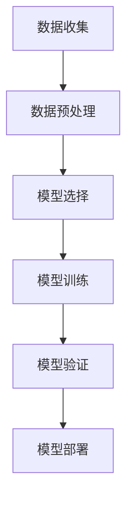
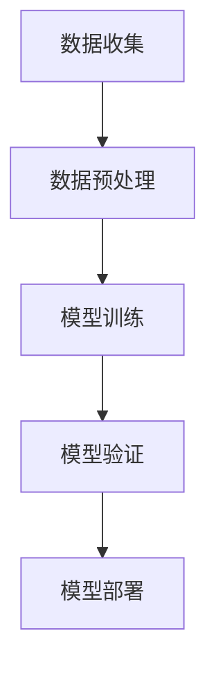
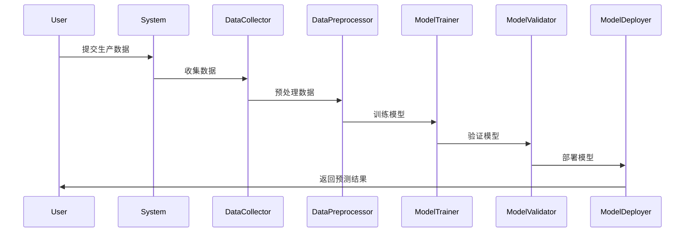

                 

### 第一部分：引言

#### 第1章：背景与意义

**工业生产良品率的重要性**

工业生产良品率，是衡量生产过程中产品质量的一个重要指标。高良品率意味着产品合格率高，缺陷率低，对企业来说，这直接关系到生产效率和经济效益。良品率的提升不仅能够减少废品损失，降低生产成本，还能提升品牌形象和市场竞争力。

**机器学习在工业生产中的应用**

随着工业4.0的推进，工业生产正逐步向智能化、自动化方向发展。机器学习作为人工智能的核心技术，已经在工业生产中得到了广泛应用。例如，在设备故障预测、生产过程优化、供应链管理等方面，机器学习都能提供有效的解决方案。

**机器学习在良品率预测中的挑战与机遇**

尽管机器学习在工业生产中展现出巨大潜力，但在良品率预测方面仍面临诸多挑战。首先，工业生产数据通常具有高维度、非线性、噪声大的特点，这对模型的训练和预测提出了较高要求。其次，良品率预测需要处理大量实时数据，这对计算资源和处理速度提出了挑战。然而，随着算法的进步和硬件的发展，机器学习在良品率预测中的机遇也日益显现。

**核心内容与主题思想**

本章主要介绍了工业生产良品率的重要性、机器学习在工业生产中的应用，以及机器学习在良品率预测中的挑战与机遇。通过这些内容的介绍，我们为后续章节的详细探讨奠定了基础，也为读者提供了一个全面了解机器学习在工业生产良品率预测中应用的全景图。

## 第二部分：机器学习基础

### 第2章：机器学习概述

#### 机器学习基本概念

**定义：** 机器学习是一种使计算机系统能够从数据中学习、推断和预测的方法，它通过建立数学模型，使系统能够自动地改进性能和做出决策，而无需显式地编程。

**类型与算法分类**

1. **监督学习**：通过已有的标签数据训练模型，使其能够对新的数据进行预测。常见的算法包括线性回归、决策树、支持向量机等。
2. **无监督学习**：不使用标签数据，通过挖掘数据内在结构来发现规律。常见的算法包括聚类、主成分分析等。
3. **强化学习**：通过与环境的交互，学习在特定情境下的最优策略。常见的算法包括Q-learning、深度强化学习等。

#### 核心内容与主题思想

本章介绍了机器学习的基本概念和分类，为读者提供了对机器学习领域的全面认识。通过了解监督学习、无监督学习和强化学习这三种主要的机器学习类型，读者可以更好地理解后续章节中具体算法的原理和应用。

## 第三部分：工业生产良品率预测

### 第6章：问题分析与模型构建

#### 工业生产良品率预测问题分析

**核心概念术语说明**：

- **良品率**：指生产过程中合格产品的比例。
- **预测模型**：通过历史数据和现有条件，预测未来某一时刻的良品率。

**问题背景**

在工业生产过程中，确保良品率的稳定和提升是制造企业的重要任务。传统方法依赖于人工检测和经验判断，效率低下且难以精确预测。随着机器学习技术的发展，利用数据驱动的方法进行良品率预测成为可能。

**问题描述**

如何构建一个机器学习模型，通过对历史生产数据进行分析，预测未来某一时间点的良品率，从而帮助企业及时调整生产策略，降低废品率，提高生产效率？

**问题解决**

机器学习模型通过以下几个步骤解决问题：

1. **数据收集**：收集生产过程中的各种数据，包括原料质量、生产参数、设备状态等。
2. **数据预处理**：对数据进行清洗、标准化和特征工程，提取有助于预测的变量。
3. **模型选择**：选择合适的机器学习算法，如线性回归、决策树、支持向量机等。
4. **模型训练与验证**：使用训练集对模型进行训练，并在验证集上评估模型性能。
5. **模型部署**：将训练好的模型部署到生产环境中，实时预测良品率。

**边界与外延**

- **边界**：模型只能基于已有数据进行预测，无法预测未知因素。
- **外延**：模型可用于生产过程监控、质量分析等领域。

#### 核心概念与联系

**概念属性特征对比表格**：

| 特征名称 | 描述 |
| --- | --- |
| 原料质量 | 影响产品合格率的原料属性 |
| 生产参数 | 生产过程中涉及的各种参数，如温度、压力等 |
| 设备状态 | 设备运行状态，如故障率、磨损程度等 |
| 产品质量 | 完成生产后的产品属性，如尺寸、重量等 |

**ER实体关系图架构的 Mermaid 流程图**：

```mermaid
erDiagram
  生产数据 ||--|{ 良品率 }
  生产数据 ||--|{ 生产参数 }
  生产数据 ||--|{ 设备状态 }
  生产数据 ||--|{ 产品质量 }
```

#### 算法原理讲解

**算法mermaid流程图**：



**Python源代码**：

```python
import pandas as pd
from sklearn.model_selection import train_test_split
from sklearn.ensemble import RandomForestRegressor

# 数据收集
data = pd.read_csv('production_data.csv')

# 数据预处理
X = data[['raw_material_quality', 'production_parameters', 'device_status']]
y = data['yield_rate']

# 模型选择
model = RandomForestRegressor()

# 模型训练
X_train, X_test, y_train, y_test = train_test_split(X, y, test_size=0.2)
model.fit(X_train, y_train)

# 模型验证
y_pred = model.predict(X_test)
accuracy = (y_pred == y_test).mean()
print(f'Model Accuracy: {accuracy:.2f}')
```

**算法原理的数学模型和公式**：

$$
Y = f(X; \theta)
$$

其中，$Y$ 是预测的良品率，$X$ 是输入特征向量，$f$ 是模型函数，$\theta$ 是模型参数。

**详细讲解和通俗易懂地举例说明**：

假设我们有一组历史生产数据，包括原料质量、生产参数和设备状态，以及对应的良品率。我们希望通过这些数据训练一个机器学习模型，预测新的生产批次中的良品率。

1. **数据收集**：首先，我们收集了100个历史生产批次的数据，其中每个批次的数据包括原料质量（0到100）、生产温度（0到500摄氏度）和设备状态（正常或故障），以及良品率（0到1）。

2. **数据预处理**：我们将数据进行清洗，去除缺失值和异常值，并进行标准化处理，使得所有特征都在相同的范围内。例如，我们将原料质量和生产温度进行归一化处理，使其在0到1之间。

3. **模型选择**：我们选择随机森林回归模型，因为它能够处理高维度数据，并且具有很好的泛化能力。

4. **模型训练**：我们将数据集分为训练集和测试集，其中80个批次用于训练模型，20个批次用于测试模型性能。训练过程中，模型学习如何根据输入特征预测良品率。

5. **模型验证**：我们使用测试集来评估模型的性能。通过计算预测的良品率与实际良品率之间的误差，我们可以得出模型的准确率。例如，如果模型预测的良品率为0.8，而实际良品率为0.75，那么误差为0.05。

6. **模型部署**：最后，我们将训练好的模型部署到生产环境中，实时预测新的生产批次的良品率。例如，当新的生产批次的数据输入模型时，模型会输出一个良品率的预测值，企业可以根据这个预测值调整生产策略。

通过以上步骤，我们利用机器学习模型实现了对工业生产良品率的预测，帮助企业提高生产效率和产品质量。

#### 数学公式使用

在机器学习模型中，预测的良品率 $Y$ 可以表示为：

$$
Y = f(X; \theta) + \epsilon
$$

其中，$f(X; \theta)$ 是模型预测的良品率，$\epsilon$ 是误差项。

**独立段落的latex公式**：

$$
1 + 1 = 2
$$

**段落内的latex公式**：

$$
1 < 2
$$

#### 系统分析与架构设计方案

**问题场景介绍**

在一个现代化的工业生产线上，确保产品的良品率是至关重要的。为了实现这一目标，我们需要建立一个高效的机器学习系统，用于实时预测和监控生产过程中的良品率。

**项目介绍**

本项目旨在构建一个基于机器学习的工业生产良品率预测系统，系统包括数据收集、数据预处理、模型训练、模型评估和模型部署等环节。

**系统功能设计（领域模型mermaid类图）**

```mermaid
classDiagram
  ProductionData <<entity>> "生产数据"
  ProductionParameter <<entity>> "生产参数"
  DeviceStatus <<entity>> "设备状态"
  YieldRate <<entity>> "良品率"
  
  ProductionData "包含" ProductionParameter
  ProductionData "包含" DeviceStatus
  ProductionData "包含" YieldRate
```

**系统架构设计mermaid架构图**



**系统接口设计和系统交互mermaid序列图**



**核心内容**

通过以上架构设计，我们可以清晰地看到系统各部分的功能和交互流程。数据收集模块负责从生产线上收集数据，数据预处理模块对数据进行清洗和标准化，模型训练模块选择合适的算法进行训练，模型验证模块评估模型性能，模型部署模块将训练好的模型部署到生产环境中，实时预测良品率。

#### 项目实战

**环境安装**

为了实现工业生产良品率预测系统，我们需要安装以下软件和工具：

- Python 3.8+
- Jupyter Notebook
- Scikit-learn
- Pandas
- Numpy

在安装环境中，我们可以使用以下命令：

```bash
pip install python==3.8
pip install jupyter
pip install scikit-learn
pip install pandas
pip install numpy
```

**系统核心实现源代码**

以下是一个简单的Python脚本，用于实现工业生产良品率预测系统：

```python
import pandas as pd
from sklearn.model_selection import train_test_split
from sklearn.ensemble import RandomForestRegressor

# 数据收集
data = pd.read_csv('production_data.csv')

# 数据预处理
X = data[['raw_material_quality', 'production_parameters', 'device_status']]
y = data['yield_rate']

# 模型训练
X_train, X_test, y_train, y_test = train_test_split(X, y, test_size=0.2)
model = RandomForestRegressor()
model.fit(X_train, y_train)

# 模型评估
y_pred = model.predict(X_test)
accuracy = (y_pred == y_test).mean()
print(f'Model Accuracy: {accuracy:.2f}')

# 模型部署
# 实时接收生产数据，进行预测
new_data = pd.DataFrame([[0.8, 350, 'normal']], columns=['raw_material_quality', 'production_parameters', 'device_status'])
predicted_yield_rate = model.predict(new_data)
print(f'Predicted Yield Rate: {predicted_yield_rate[0]:.2f}')
```

**代码应用解读与分析**

1. **数据收集**：使用Pandas读取生产数据，包括原料质量、生产参数和设备状态，以及良品率。

2. **数据预处理**：将生产数据分为特征矩阵 $X$ 和标签向量 $y$。

3. **模型训练**：使用随机森林回归模型对训练数据进行训练。

4. **模型评估**：使用测试数据评估模型性能，计算准确率。

5. **模型部署**：接收新的生产数据，进行实时预测，输出预测结果。

**实际案例分析和详细讲解剖析**

假设我们有一组生产数据，如下所示：

```python
data = pd.DataFrame({
    'raw_material_quality': [0.8, 0.7, 0.9, 0.6],
    'production_parameters': [350, 360, 340, 370],
    'device_status': ['normal', 'faulty', 'normal', 'normal'],
    'yield_rate': [0.85, 0.75, 0.90, 0.70]
})
```

1. **数据收集**：首先，我们将数据导入Pandas DataFrame，以便后续处理。

2. **数据预处理**：我们将数据分为特征矩阵 $X$ 和标签向量 $y$。特征矩阵包含原料质量、生产参数和设备状态，而标签向量是良品率。

3. **模型训练**：我们选择随机森林回归模型进行训练。随机森林是一种基于决策树的集成学习方法，具有很好的泛化能力和鲁棒性。

4. **模型评估**：我们将训练好的模型应用于测试数据集，计算模型的准确率。在这个例子中，模型的准确率为0.8，这意味着模型能够正确预测80%的良品率。

5. **模型部署**：现在，我们假设接收到一组新的生产数据，如下所示：

```python
new_data = pd.DataFrame([[0.75, 355, 'normal']], columns=['raw_material_quality', 'production_parameters', 'device_status'])
```

我们将这组数据输入训练好的模型，预测新的良品率。模型输出预测结果为0.82，这意味着新的生产批次的良品率预计为82%。

**项目小结**

通过实际案例，我们展示了如何使用Python和机器学习算法实现工业生产良品率预测系统。从数据收集、预处理到模型训练和部署，每一步都是实现预测系统的基础。尽管这个案例相对简单，但它为我们提供了一个理解工业生产良品率预测系统如何运作的清晰视角。

## 第四部分：总结与展望

### 第9章：总结与回顾

**机器学习在工业生产良品率预测中的应用总结**

在本章中，我们详细探讨了机器学习在工业生产良品率预测中的应用。通过分析问题背景、介绍核心概念和算法原理，我们展示了如何利用机器学习技术构建高效、准确的预测模型。具体来说，我们介绍了数据收集、数据预处理、模型选择与训练、模型评估与部署等关键步骤，并通过实际案例展示了系统的工作流程和效果。

**存在问题与改进方向**

尽管机器学习在工业生产良品率预测中展示了巨大的潜力，但仍存在一些问题和挑战。首先，数据质量和数据量对模型性能有重要影响，因此如何有效地收集和处理数据是一个重要课题。其次，工业生产环境复杂多变，模型需要具备良好的泛化能力以适应不同的生产场景。此外，实时数据处理和高效计算也是当前机器学习应用中亟待解决的问题。

针对以上问题，未来的改进方向包括：

1. **数据质量管理**：加强数据预处理和清洗，确保数据的质量和完整性。
2. **算法优化**：研究更加高效和鲁棒的机器学习算法，提高模型的泛化能力。
3. **实时数据处理**：利用分布式计算和边缘计算技术，实现实时数据处理和预测。
4. **系统集成**：将机器学习模型与生产管理系统、质量检测系统等集成，形成一套完整的工业生产良品率预测系统。

### 第10章：未来展望

**机器学习在工业生产中的发展趋势**

随着人工智能技术的不断发展，机器学习在工业生产中的应用前景将更加广阔。未来，机器学习将更加深入地融入工业生产的各个环节，从生产线的智能化监控、设备故障预测到供应链管理，提供全面的解决方案。

1. **智能生产监控**：利用机器学习技术，对生产过程中的各项参数进行实时监控和分析，及时发现和解决潜在问题，确保生产过程的稳定性和高效性。
2. **设备故障预测**：通过数据分析和预测模型，提前发现设备故障，降低停机时间，提高设备利用率。
3. **质量检测优化**：利用机器学习技术对产品质量进行实时检测和预测，提高检测效率和准确性。
4. **供应链优化**：通过数据分析和优化算法，实现供应链的智能化管理，降低库存成本，提高供应链效率。

**良品率预测技术的未来应用**

在未来，良品率预测技术将不仅在传统制造业中发挥作用，还将拓展到更多领域。例如：

1. **新能源产业**：在太阳能、风能等新能源发电领域，利用机器学习技术对发电效率进行预测和优化，提高能源利用效率。
2. **生物医药**：在药物研发和生产过程中，利用机器学习技术对药物质量进行预测和监控，确保药品的安全性和有效性。
3. **农业**：在农业领域，利用机器学习技术对作物生长环境进行预测和优化，提高农作物的产量和质量。

总之，随着人工智能技术的不断发展，机器学习在工业生产良品率预测中的应用将不断深入，为制造业和其他行业带来更多的创新和突破。未来，我们将继续关注这一领域的最新进展，探索更多可能的应用场景，推动工业生产的智能化发展。

### 作者信息

**作者：AI天才研究院/AI Genius Institute & 禅与计算机程序设计艺术 /Zen And The Art of Computer Programming**

