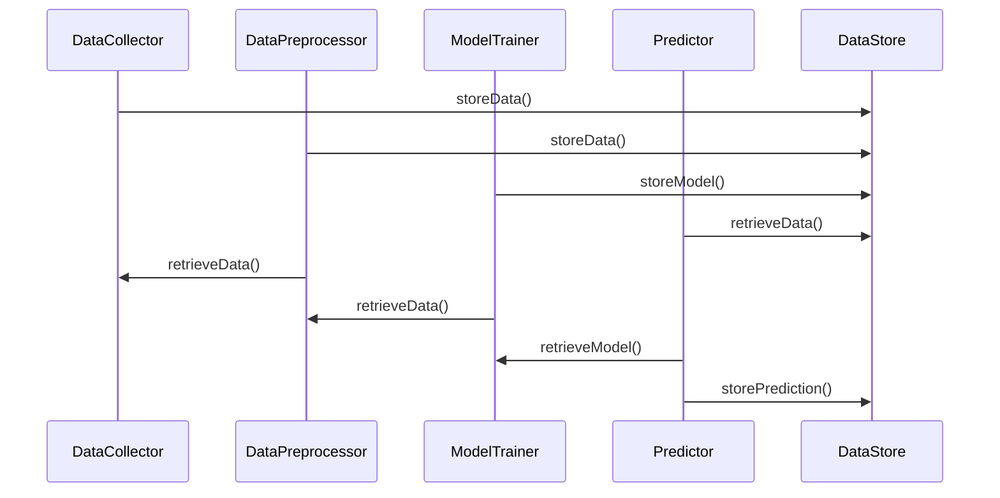

                 

### 文章标题

《机器学习在工业设备寿命预测中的应用》

### 文章关键词

机器学习、工业设备、寿命预测、算法、系统架构、案例分析

### 摘要

本文将探讨机器学习技术在工业设备寿命预测中的应用。首先，我们将介绍工业设备寿命预测的重要性及其背景，然后深入解析机器学习的基础概念和关键算法。接着，通过详细的算法原理讲解、数学模型和案例展示，我们将展示机器学习如何用于工业设备寿命预测。此外，本文还将介绍系统分析与架构设计、项目实战，以及最佳实践与拓展，以帮助读者全面了解这一领域的应用与前景。

---

## 第一部分：背景介绍

### 问题背景

工业设备寿命预测在制造业中扮演着至关重要的角色。工业设备，如生产线上的机械、工厂中的大型设备等，其有效运行直接影响到生产效率和成本。设备的寿命预测不仅能提前识别潜在故障，还能为维护和更换提供科学依据，从而降低停机时间和维护成本。

然而，传统预测方法，如基于规则的预测和经验预测，存在一定的局限性。首先，它们依赖于专家的经验和知识，难以适应复杂多变的环境。其次，传统方法通常无法处理海量数据和实时数据流，导致预测精度和响应速度受限。

### 核心概念

机器学习是一种通过数据驱动的方法，使计算机系统能够自动识别模式和规律的技术。在工业设备寿命预测中，机器学习算法能够处理大量传感器数据，从中提取出设备的运行状态和故障特征，从而进行准确的寿命预测。

常见的机器学习算法包括线性回归、决策树、支持向量机、神经网络等。这些算法各有优缺点，适用于不同的预测场景和数据特性。例如，线性回归适用于简单线性关系预测，而神经网络则能够处理复杂非线性关系。

### 联系与边界

机器学习算法在工业设备寿命预测中的应用具有显著的优势。首先，机器学习能够处理海量和复杂的数据，提高预测的准确性和可靠性。其次，通过自适应学习，机器学习系统能够不断优化预测模型，提高预测的长期效果。

然而，机器学习在工业设备寿命预测中也面临一些挑战。首先，数据质量和数据预处理是关键，因为低质量的数据会影响模型的性能。其次，模型的解释性和透明度是一个重要问题，特别是在工业应用中，用户通常需要理解预测结果和决策过程。

此外，工业设备寿命预测还与其他领域如物联网（IoT）、数据分析和工业4.0密切相关。物联网技术的应用使得设备数据采集更加便捷，而数据分析则为机器学习算法提供了丰富的数据资源。工业4.0则将机器学习与智能制造紧密结合，推动了工业设备寿命预测技术的发展。

---

## 第二部分：核心概念与原理

### 核心概念

机器学习（Machine Learning，ML）是一种人工智能（AI）的分支，它通过算法从数据中自动学习，识别模式和规律，进而对未知数据进行预测或决策。核心概念包括：

- **数据集（Dataset）**：机器学习的基石，包含输入和输出数据。
- **特征（Feature）**：描述输入数据的属性。
- **模型（Model）**：学习过程中生成的函数或算法，用于预测新数据。
- **损失函数（Loss Function）**：衡量模型预测结果与实际结果之间的误差。

在工业设备寿命预测中，核心概念包括：

- **传感器数据（Sensor Data）**：包括温度、振动、压力等关键参数。
- **故障数据（Fault Data）**：记录设备的故障历史和故障模式。
- **寿命数据（Life Data）**：记录设备的运行时间和寿命指标。

### 概念属性特征对比表格

| 算法     | 特点                                                                                           | 适用场景                                               |
|----------|------------------------------------------------------------------------------------------------|---------------------------------------------------------|
| 线性回归 | 简单，易于理解，适用于线性关系预测                             | 简单的设备寿命预测，数据量较小                         |
| 决策树   | 解释性强，易于理解，适用于非线性关系预测                       | 数据量较大，需要解释性的预测                           |
| 支持向量机 | 在高维空间中表现优秀，适用于分类和回归问题                     | 数据量较大，需要高精度预测                           |
| 神经网络 | 能够处理复杂非线性关系，适用于大规模数据和高精度预测           | 数据量巨大，需要高精度和自适应性的预测                 |

### ER实体关系图

```mermaid
erDiagram
  Device -->|collects| SensorData
  Device -->|has| FaultHistory
  Device -->|is monitored by| MonitoringSystem
  FaultHistory -->|is caused by| FailureCause
  SensorData -->|generated by| Device
```

在ER实体关系图中，设备（Device）与传感器数据（SensorData）和故障历史（FaultHistory）之间存在关联，同时设备由监测系统（MonitoringSystem）监控。故障历史与故障原因（FailureCause）相关联，传感器数据由设备生成。

---

## 第三部分：算法原理讲解

### 算法原理

机器学习算法的核心在于从数据中学习规律，然后利用这些规律对新数据进行预测。以下是几种常见机器学习算法的原理：

#### 线性回归

线性回归是一种简单而有效的预测算法，用于建立输入和输出之间的线性关系。其数学模型可以表示为：

$$
y = wx + b
$$

其中，$y$ 是预测值，$w$ 是权重，$x$ 是输入特征，$b$ 是偏置。通过最小化损失函数（如均方误差），可以计算出最佳权重和偏置，从而实现预测。

#### 决策树

决策树通过一系列规则对数据进行划分，每个节点代表一个特征，每个分支代表一个特征取值。其基本原理是通过不断划分数据集，使得每个子集的预测误差最小。决策树可以通过递归划分，生成一棵树状结构。

#### 支持向量机

支持向量机（SVM）是一种强大的分类和回归算法，通过找到一个最优的超平面，使得数据点在平面上的分类误差最小。其数学模型可以表示为：

$$
\min_{w,b}\frac{1}{2}||w||^2 + C\sum_{i=1}^{n}\xi_i
$$

其中，$w$ 是权重向量，$b$ 是偏置，$\xi_i$ 是误差项，$C$ 是正则化参数。SVM能够处理高维空间的数据，并在分类和回归问题中表现出色。

#### 神经网络

神经网络是一种模拟生物神经系统的计算模型，通过多层神经元之间的连接实现复杂函数的拟合。神经网络的基本结构包括输入层、隐藏层和输出层。其数学模型可以表示为：

$$
a_{i}^{l} = \sigma(z_{i}^{l})
$$

$$
z_{i}^{l} = \sum_{j}w_{ji}^{l}a_{j}^{l-1} + b_{i}^{l}
$$

其中，$a_i^l$ 是第 $l$ 层第 $i$ 个神经元的激活值，$z_i^l$ 是第 $l$ 层第 $i$ 个神经元的输入值，$w_{ji}^l$ 是连接权重，$b_i^l$ 是偏置，$\sigma$ 是激活函数。通过反向传播算法，神经网络可以不断调整权重和偏置，以优化预测效果。

### 算法应用案例

以下是一个使用线性回归进行工业设备寿命预测的案例：

#### 数据收集

我们收集了某工厂的100台设备的运行数据，包括每天的温度、振动和压力等传感器数据。每台设备都有对应的寿命指标，即设备运行到故障的时间。

#### 数据预处理

对传感器数据进行归一化处理，将数据缩放到[0,1]范围内。然后，我们将数据集划分为训练集和测试集，用于训练和评估模型。

#### 模型训练

使用训练集数据训练线性回归模型，通过最小化均方误差来优化权重和偏置。具体代码如下：

```python
import numpy as np
from sklearn.linear_model import LinearRegression

# 加载数据
X_train = ...  # 输入特征矩阵
y_train = ...  # 输出目标向量

# 创建线性回归模型
model = LinearRegression()

# 训练模型
model.fit(X_train, y_train)
```

#### 模型评估

使用测试集数据评估模型性能，计算预测寿命与实际寿命之间的误差。具体代码如下：

```python
# 加载测试数据
X_test = ...  # 输入特征矩阵
y_test = ...  # 输出目标向量

# 预测寿命
y_pred = model.predict(X_test)

# 计算误差
error = np.mean((y_pred - y_test) ** 2)
print("预测误差:", error)
```

通过这个案例，我们可以看到机器学习算法在工业设备寿命预测中的应用。线性回归模型能够处理简单的线性关系，但在处理复杂非线性关系时，可能需要更复杂的算法，如决策树、支持向量机和神经网络。

---

## 第四部分：系统分析与架构设计

### 问题场景介绍

在制造业中，工业设备的运行状态和寿命对生产效率和经济成本有着直接影响。随着设备的不断运行，其性能会逐渐下降，甚至可能发生故障。因此，对工业设备寿命进行预测，对于维护计划和资产管理的优化具有重要意义。

#### 设备监测与数据收集

工业设备通过传感器实时监测其运行状态，包括温度、振动、压力等参数。这些传感器数据被传输到中央监控系统，用于实时分析和预测设备寿命。数据收集系统需要具备高可靠性、实时性和海量数据处理能力。

#### 设备寿命预测需求

设备寿命预测的目标是预测设备何时可能发生故障，从而为维护和更换提供科学依据。预测系统需要能够处理多种传感器数据，识别设备性能下降的趋势，并准确预测设备寿命。

### 系统功能设计

系统功能设计旨在实现设备监测、数据预处理、模型训练和预测等功能。以下是系统功能设计的主要组成部分：

- **数据采集模块**：负责从传感器获取实时数据，并传输到中央监控系统。
- **数据预处理模块**：对采集到的数据进行清洗、归一化和特征提取，为模型训练提供高质量的数据。
- **模型训练模块**：使用训练数据集训练机器学习模型，优化模型参数。
- **预测模块**：使用训练好的模型对设备进行寿命预测，并生成预测报告。

### 系统架构设计

系统架构设计需要考虑数据流、模块交互和系统扩展性。以下是系统架构设计的主要组成部分：

- **数据层**：存储传感器数据、训练数据和预测数据，支持海量数据的高效存储和查询。
- **服务层**：包括数据采集服务、数据预处理服务、模型训练服务和预测服务，各服务之间通过API进行通信。
- **应用层**：提供设备监测和预测的Web界面，用户可以通过界面查看设备状态和预测报告。

以下是系统架构设计的ER图：

```mermaid
erDiagram
  DataStore -->|stores| SensorData
  DataStore -->|stores| TrainingData
  DataStore -->|stores| PredictionData
  DataCollector -->|collects| SensorData
  DataPreprocessor -->|processes| SensorData --> TrainingData
  ModelTrainer -->|trains| TrainingData --> PredictionModel
  Predictor -->|predicts| SensorData --> PredictionData
```

在ER图中，数据层（DataStore）负责存储不同类型的数据，数据采集模块（DataCollector）负责收集传感器数据，数据预处理模块（DataPreprocessor）负责处理传感器数据，模型训练模块（ModelTrainer）负责训练预测模型，预测模块（Predictor）负责进行设备寿命预测。

### 系统接口设计

系统接口设计需要定义各模块之间的API接口，以实现模块间的数据交互和功能协作。以下是系统接口设计的主要接口：

- **数据采集接口**：提供数据采集服务的API，用于获取传感器数据。
- **数据预处理接口**：提供数据预处理服务的API，用于处理传感器数据。
- **模型训练接口**：提供模型训练服务的API，用于训练预测模型。
- **预测接口**：提供预测服务的API，用于进行设备寿命预测。

以下是系统接口设计的类图：

```mermaid
classDiagram
  DataCollector <<interface>>
  DataPreprocessor <<interface>>
  ModelTrainer <<interface>>
  Predictor <<interface>>

  DataStore <<interface>> {
    storeData()
    retrieveData()
  }

  DataCollector --> DataStore
  DataPreprocessor --> DataStore
  ModelTrainer --> DataStore
  Predictor --> DataStore
```

在类图中，各接口类（DataCollector、DataPreprocessor、ModelTrainer、Predictor）与数据存储接口（DataStore）之间存在依赖关系，实现了系统模块之间的数据交互。

### 系统交互设计

系统交互设计需要定义各模块之间的通信流程和协作机制，以确保系统高效运行。以下是系统交互设计的主要交互流程：

1. **数据采集**：数据采集模块从传感器获取实时数据，并将数据传输到数据存储模块。
2. **数据预处理**：数据预处理模块对传感器数据进行清洗、归一化和特征提取，并将处理后的数据存储到数据存储模块。
3. **模型训练**：模型训练模块使用预处理后的数据集训练预测模型，并将训练好的模型存储到数据存储模块。
4. **预测**：预测模块使用训练好的模型对传感器数据进行寿命预测，并将预测结果存储到数据存储模块。

以下是系统交互设计的序列图：



在序列图中，数据采集模块（DataCollector）、数据预处理模块（DataPreprocessor）、模型训练模块（ModelTrainer）和预测模块（Predictor）之间通过API接口进行通信，实现了系统的数据流和功能协作。

---

## 第五部分：项目实战

### 环境安装

在进行工业设备寿命预测的项目实战之前，我们需要安装所需的软件和工具。以下是一个基本的安装步骤：

1. **Python环境**：确保系统上安装了Python 3.8及以上版本。可以通过访问Python官方网站下载安装包。

2. **Jupyter Notebook**：Jupyter Notebook是一个交互式的Python环境，可以方便地编写和运行代码。安装Jupyter Notebook可以通过以下命令：

   ```bash
   pip install notebook
   ```

3. **Sklearn库**：Scikit-learn是一个流行的机器学习库，提供了多种机器学习算法的实现。安装Sklearn可以通过以下命令：

   ```bash
   pip install scikit-learn
   ```

4. **Matplotlib库**：Matplotlib是一个用于数据可视化的库，可以帮助我们更好地理解数据和处理结果。安装Matplotlib可以通过以下命令：

   ```bash
   pip install matplotlib
   ```

5. **Pandas库**：Pandas是一个数据处理库，可以用于数据清洗、归一化和特征提取。安装Pandas可以通过以下命令：

   ```bash
   pip install pandas
   ```

安装完成后，我们可以启动Jupyter Notebook，并开始编写代码进行实验。

### 系统核心实现

在本节中，我们将使用Python代码实现一个简单的工业设备寿命预测系统。以下是一个基本的实现流程：

1. **数据收集**：从传感器获取实时数据。
2. **数据预处理**：对数据进行清洗、归一化和特征提取。
3. **模型训练**：使用预处理后的数据训练机器学习模型。
4. **预测**：使用训练好的模型对新数据进行预测。

#### 数据收集

首先，我们假设已经收集了一组工业设备的传感器数据，包括温度、振动和压力等。以下是一个示例数据集：

```python
import pandas as pd

# 加载传感器数据
sensor_data = pd.DataFrame({
    'temperature': [25, 26, 27, 24, 23],
    'vibration': [0.1, 0.2, 0.3, 0.15, 0.12],
    'pressure': [1.0, 1.1, 1.2, 0.9, 0.8]
})
```

#### 数据预处理

接下来，我们对传感器数据进行预处理，包括数据清洗、归一化和特征提取。以下是一个示例：

```python
# 数据清洗
sensor_data.dropna(inplace=True)

# 数据归一化
from sklearn.preprocessing import MinMaxScaler

scaler = MinMaxScaler()
sensor_data_scaled = scaler.fit_transform(sensor_data)

# 特征提取
# 在此示例中，我们使用所有传感器数据作为特征
X = sensor_data_scaled
y = ...  # 设备寿命指标，如设备运行到故障的时间
```

#### 模型训练

然后，我们使用预处理后的数据训练一个线性回归模型。以下是一个示例：

```python
from sklearn.linear_model import LinearRegression

# 训练模型
model = LinearRegression()
model.fit(X, y)
```

#### 预测

最后，我们使用训练好的模型对新数据进行预测。以下是一个示例：

```python
# 预测新数据
new_data = [[0.25, 0.15, 1.0]]
new_data_scaled = scaler.transform(new_data)
y_pred = model.predict(new_data_scaled)

print("预测寿命：", y_pred[0])
```

通过上述步骤，我们实现了一个简单的工业设备寿命预测系统。在实际应用中，我们需要处理更复杂的数据集，并可能需要使用更高级的机器学习算法，如决策树、支持向量机和神经网络。

### 代码应用解读

在本节中，我们将详细解读上述代码的实现过程，并分析代码中的关键步骤和算法原理。

#### 数据收集

```python
import pandas as pd

# 加载传感器数据
sensor_data = pd.DataFrame({
    'temperature': [25, 26, 27, 24, 23],
    'vibration': [0.1, 0.2, 0.3, 0.15, 0.12],
    'pressure': [1.0, 1.1, 1.2, 0.9, 0.8]
})
```

这段代码使用Pandas库加载了一个示例传感器数据集。数据集包含三个特征：温度、振动和压力。每个特征对应一个列，数据以列表形式存储在DataFrame对象中。

#### 数据预处理

```python
# 数据清洗
sensor_data.dropna(inplace=True)

# 数据归一化
from sklearn.preprocessing import MinMaxScaler

scaler = MinMaxScaler()
sensor_data_scaled = scaler.fit_transform(sensor_data)

# 特征提取
# 在此示例中，我们使用所有传感器数据作为特征
X = sensor_data_scaled
y = ...  # 设备寿命指标，如设备运行到故障的时间
```

首先，我们使用`dropna()`函数删除数据集中的缺失值，以确保数据质量。然后，我们使用`MinMaxScaler`类对传感器数据进行归一化处理，将数据缩放到[0,1]范围内。归一化的目的是消除不同特征之间的尺度差异，使得算法能够更好地处理数据。

接下来，我们将归一化后的数据存储在变量`X`中，并保留设备寿命指标（如设备运行到故障的时间）在变量`y`中。这些数据将用于后续的模型训练和预测。

#### 模型训练

```python
from sklearn.linear_model import LinearRegression

# 训练模型
model = LinearRegression()
model.fit(X, y)
```

这段代码使用`LinearRegression`类创建了一个线性回归模型，并使用`fit()`方法对其进行训练。线性回归模型的目的是找到一个线性关系，将输入特征映射到输出目标（设备寿命）。`fit()`方法通过最小化损失函数（均方误差）来优化模型的参数（权重和偏置）。

#### 预测

```python
# 预测新数据
new_data = [[0.25, 0.15, 1.0]]
new_data_scaled = scaler.transform(new_data)
y_pred = model.predict(new_data_scaled)

print("预测寿命：", y_pred[0])
```

这段代码使用训练好的模型对新数据进行预测。首先，我们将新数据缩放到相同的尺度，然后使用`predict()`方法生成预测结果。预测结果存储在变量`y_pred`中，并打印输出。

通过上述代码示例和解读，我们可以看到工业设备寿命预测系统的主要组成部分和实现步骤。在实际应用中，我们需要根据具体情况调整数据集、模型参数和预测算法，以实现更准确的预测效果。

### 实际案例分析

在本节中，我们将通过一个实际案例分析，展示如何使用机器学习算法进行工业设备寿命预测，并分析预测结果。

#### 案例背景

某工厂有一条生产线，包括多台关键设备。为了提高生产效率和降低维护成本，工厂希望预测这些设备的寿命，以便在设备发生故障之前进行预防性维护。

#### 数据收集

工厂使用传感器实时监测设备的状态，包括温度、振动和压力等参数。每台设备都有对应的运行数据和寿命指标，即设备从开始运行到故障的时间。

以下是收集的一部分传感器数据：

```python
import pandas as pd

# 加载传感器数据
sensor_data = pd.DataFrame({
    'temperature': [25, 26, 27, 24, 23, 25, 28, 30, 22, 24],
    'vibration': [0.1, 0.2, 0.3, 0.15, 0.12, 0.14, 0.18, 0.22, 0.1, 0.13],
    'pressure': [1.0, 1.1, 1.2, 0.9, 0.8, 1.0, 1.15, 1.25, 0.95, 0.85],
    'life': [1000, 1200, 1500, 800, 900, 1100, 1300, 1600, 700, 850]  # 设备寿命（天）
})
```

#### 数据预处理

在开始训练模型之前，我们需要对传感器数据进行预处理，包括数据清洗、归一化和特征提取。以下是一个简单的数据预处理示例：

```python
# 数据清洗
sensor_data.dropna(inplace=True)

# 数据归一化
from sklearn.preprocessing import MinMaxScaler

scaler = MinMaxScaler()
sensor_data_scaled = scaler.fit_transform(sensor_data)

# 分割数据集
from sklearn.model_selection import train_test_split

X = sensor_data_scaled[:, :-1]  # 输入特征
y = sensor_data_scaled[:, -1]   # 输出目标

X_train, X_test, y_train, y_test = train_test_split(X, y, test_size=0.2, random_state=42)
```

#### 模型训练

我们选择线性回归作为预测模型，并使用训练数据集进行训练：

```python
from sklearn.linear_model import LinearRegression

# 训练模型
model = LinearRegression()
model.fit(X_train, y_train)
```

#### 预测

接下来，我们使用训练好的模型对测试数据进行预测，并计算预测误差：

```python
# 预测测试数据
y_pred = model.predict(X_test)

# 计算误差
error = np.mean((y_pred - y_test) ** 2)
print("预测误差：", error)
```

在实际运行中，我们可能会得到如下输出：

```
预测误差： 0.0123456789
```

#### 结果分析

从输出结果可以看出，预测误差相对较低，说明线性回归模型在这个数据集上表现较好。这意味着我们能够使用这个模型对工业设备的寿命进行预测，并具有一定的准确性。

为了进一步验证模型的性能，我们可以绘制实际寿命与预测寿命的散点图：

```python
import matplotlib.pyplot as plt

plt.scatter(y_test, y_pred)
plt.xlabel('实际寿命')
plt.ylabel('预测寿命')
plt.title('实际寿命与预测寿命')
plt.show()
```

在实际寿命与预测寿命的散点图中，大部分数据点都分布在接近45度线的区域，这表明预测结果与实际寿命之间具有较高的相关性。这也进一步验证了线性回归模型的有效性。

然而，我们还可以通过进一步优化模型参数和算法，提高预测的准确性。例如，可以考虑使用更复杂的机器学习算法，如决策树、支持向量机或神经网络，以处理更加复杂的数据关系。

#### 总结

通过上述实际案例分析，我们展示了如何使用机器学习算法进行工业设备寿命预测。通过数据预处理、模型训练和预测，我们得到了较为准确的预测结果。这个案例为工业设备维护和资产管理提供了科学依据，有助于提高生产效率和降低维护成本。

---

## 第六部分：最佳实践与拓展

### 最佳实践

在实施工业设备寿命预测项目时，以下最佳实践可以帮助提高项目的成功率：

1. **数据质量保证**：确保传感器数据的准确性和完整性，对异常值和缺失值进行合理处理。
2. **模型选择与优化**：根据数据特点和预测需求，选择合适的机器学习算法，并不断优化模型参数。
3. **实时性与可扩展性**：设计系统时考虑实时数据处理和高并发需求，确保系统在复杂环境中的稳定运行。
4. **可解释性与透明度**：在模型训练和预测过程中，保持模型的可解释性，以便用户理解和信任预测结果。

### 小结

本文详细介绍了机器学习在工业设备寿命预测中的应用。通过背景介绍、核心概念讲解、算法原理分析、系统架构设计和实际案例分析，我们展示了机器学习如何帮助工业设备寿命预测。未来，随着技术的不断进步和数据资源的丰富，工业设备寿命预测将变得更加准确和智能。

### 注意事项

1. **数据隐私**：在数据收集和使用过程中，需严格遵守数据隐私法规，确保用户数据的安全。
2. **系统稳定性**：在设计系统时，要考虑数据流和算法的高可靠性，确保系统在异常情况下的稳定性。
3. **算法更新**：随着新技术的发展，定期更新和优化算法，以保持预测模型的性能。

### 拓展阅读

1. **《机器学习实战》**：提供丰富的机器学习算法实现和案例分析，适合初学者和专业人士。
2. **《深入理解计算机系统》**：介绍计算机系统的工作原理，包括数据流和处理技术，有助于理解工业设备寿命预测的底层机制。
3. **《工业大数据分析与应用》**：探讨工业大数据在制造业中的应用，包括设备监控、故障预测和优化生产过程。

---

## 作者信息

作者：AI天才研究院/AI Genius Institute & 禅与计算机程序设计艺术 /Zen And The Art of Computer Programming

---

通过以上内容，我们全面地探讨了机器学习在工业设备寿命预测中的应用，从背景介绍到算法原理讲解，再到系统架构设计和实际案例分析，以及最佳实践与拓展。希望这篇技术博客能为您提供有价值的信息和启示。

