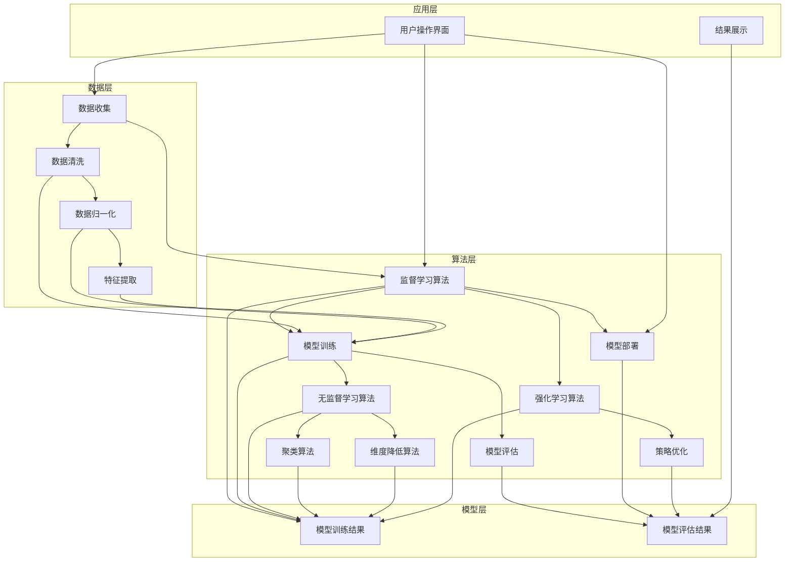

                 

## 机器学习在科学理论构建中的应用：辅助人类构建世界模型

### 关键词：机器学习，科学理论，世界模型，数据处理，算法，应用领域

> 摘要：本文旨在探讨机器学习在科学理论构建中的关键作用。随着人工智能技术的飞速发展，机器学习已成为科学研究中不可或缺的工具，不仅提升了数据分析的效率，还在构建和验证科学理论方面展现了巨大潜力。本文将首先介绍机器学习的基本概念和分类，随后深入探讨其在各个科学领域的应用，并分析其面临的挑战与未来发展趋势。通过这一系统性的分析，我们希望展示机器学习如何辅助人类更好地理解和构建复杂的世界模型。

### 目录大纲：

----------------------------------------------------------------

## 第一部分: 机器学习基础

### 第1章: 机器学习概述

#### 1.1 机器学习的定义与分类

#### 1.2 机器学习的基本原理

#### 1.3 机器学习的发展历史

## 第2章: 数据预处理

### 2.1 数据清洗

### 2.2 数据归一化

### 2.3 特征提取与选择

## 第3章: 监督学习

### 3.1 线性回归

### 3.2 逻辑回归

### 3.3 支持向量机

### 3.4 集成学习方法

## 第4章: 无监督学习

### 4.1 聚类算法

### 4.2 维度降低算法

### 4.3 自编码器

## 第5章: 强化学习

### 5.1 强化学习的基本概念

### 5.2 Q-learning算法

### 5.3 SARSA算法

## 第6章: 深度学习

### 6.1 神经网络基础

### 6.2 卷积神经网络

### 6.3 循环神经网络

### 6.4 生成对抗网络

## 第7章: 机器学习在科学理论构建中的应用

### 7.1 机器学习与科学理论的关系

### 7.2 机器学习在物理学中的应用

### 7.3 机器学习在天文学中的应用

### 7.4 机器学习在生物学中的应用

### 7.5 机器学习在化学中的应用

### 7.6 机器学习在其他科学领域中的应用

## 第8章: 未来展望与挑战

### 8.1 机器学习的未来发展趋势

### 8.2 机器学习在科学理论构建中的挑战

### 8.3 机器学习的伦理与安全

----------------------------------------------------------------

### 第一部分：机器学习基础

#### 第1章：机器学习概述

##### 1.1 机器学习的定义与分类

机器学习是人工智能的一个分支，主要研究如何使计算机系统能够自动从数据中学习并做出决策或预测。其核心思想是通过算法从数据中提取模式和规律，然后利用这些模式和规律进行预测或决策。

**定义：** 机器学习是指使用算法和统计模型，从数据中学习并做出决策或预测的过程。

**分类：** 根据学习的方式和目的，机器学习可以分为以下几类：

1. **监督学习（Supervised Learning）：** 数据带有标签，算法通过学习输入和输出之间的关系来预测新的输出。
2. **无监督学习（Unsupervised Learning）：** 数据没有标签，算法通过探索数据中的模式和结构来发现数据中的隐藏规律。
3. **强化学习（Reinforcement Learning）：** 算法通过与环境交互，不断调整策略以实现最大化奖励。
4. **深度学习（Deep Learning）：** 一种基于神经网络的学习方法，通过多层次的非线性变换来提取数据中的特征。

##### 1.2 机器学习的基本原理

机器学习的基本原理可以概括为以下几个步骤：

1. **数据收集与预处理：** 收集相关数据并进行清洗、归一化等预处理操作，以确保数据的质量和一致性。
2. **模型选择：** 根据具体问题选择合适的机器学习模型，如线性回归、逻辑回归、支持向量机等。
3. **模型训练：** 使用预处理后的数据对模型进行训练，通过调整模型参数来优化模型性能。
4. **模型评估：** 使用验证数据集对训练好的模型进行评估，以确定模型的预测准确性和泛化能力。
5. **模型部署：** 将训练好的模型部署到实际应用场景中，进行预测或决策。

##### 1.3 机器学习的发展历史

机器学习的历史可以追溯到20世纪50年代，当时人工智能的概念开始出现。以下是机器学习发展的一些重要里程碑：

1. **1956年：** John McCarthy提出了人工智能的概念，并组织了首届人工智能会议。
2. **1960-1970年代：** 人工智能研究进入了一个短暂的“黄金时期”，提出了许多基本的机器学习算法，如线性回归、决策树等。
3. **1980-1990年代：** 机器学习研究进入低谷期，主要原因是计算能力和数据资源的限制。
4. **2000年代：** 随着计算能力的提升和大数据技术的发展，机器学习重新焕发生机，特别是深度学习的兴起。
5. **2010年代至今：** 机器学习在图像识别、自然语言处理、自动驾驶等领域取得了重大突破，成为人工智能的核心技术。

#### 第2章：数据预处理

##### 2.1 数据清洗

数据清洗是数据预处理的重要步骤，主要目的是消除数据中的噪声和不一致性，以提高数据质量。数据清洗包括以下几方面的内容：

1. **缺失值处理：** 对于缺失的数据，可以采用填充法、删除法或插值法进行处理。
2. **异常值处理：** 对于异常数据，可以采用删除、修改或保留等方法进行处理。
3. **重复数据处理：** 去除数据集中的重复记录，以减少冗余信息。
4. **数据格式转换：** 将不同格式的数据进行统一转换，以便后续处理。

##### 2.2 数据归一化

数据归一化是指将不同特征的数据转换为同一尺度，以消除不同特征之间的量纲影响。常用的归一化方法包括：

1. **最小-最大规范化：** 将数据缩放到[0,1]范围内。
2. **均值-方差规范化：** 将数据缩放到[-1,1]范围内。
3. **零均值单位方差规范化：** 将数据缩放到均值为0，方差为1的标准正态分布。

##### 2.3 特征提取与选择

特征提取与选择是数据预处理的关键步骤，目的是从原始数据中提取出对目标任务最有用的特征，以减少数据维度和计算复杂度。常见的特征提取方法包括：

1. **主成分分析（PCA）：** 通过线性变换将高维数据映射到低维空间，保留数据的主要信息。
2. **特征选择算法：** 如递归特征消除（RFE）、基于信息论的特征选择等，通过评价特征的重要性来选择最有用的特征。

### 第二部分：机器学习算法详解

#### 第3章：监督学习

##### 3.1 线性回归

线性回归是一种基本的监督学习算法，用于预测一个连续值输出。其基本原理是通过线性关系拟合输入和输出数据，公式为：

$$ y = \beta_0 + \beta_1 \cdot x_1 + \beta_2 \cdot x_2 + ... + \beta_n \cdot x_n $$

其中，$ y $ 为输出值，$ x_1, x_2, ..., x_n $ 为输入特征，$ \beta_0, \beta_1, ..., \beta_n $ 为模型参数。

线性回归的流程包括：

1. **数据准备：** 收集并预处理数据。
2. **模型训练：** 使用最小二乘法或其他优化算法求解模型参数。
3. **模型评估：** 使用验证数据集评估模型性能。

##### 3.2 逻辑回归

逻辑回归是一种用于分类问题的监督学习算法，其基本原理是使用逻辑函数将线性回归模型的输出转换为概率。公式为：

$$ P(y=1) = \frac{1}{1 + e^{-(\beta_0 + \beta_1 \cdot x_1 + \beta_2 \cdot x_2 + ... + \beta_n \cdot x_n)}} $$

其中，$ P(y=1) $ 为目标变量为1的概率，$ e $ 为自然底数。

逻辑回归的流程包括：

1. **数据准备：** 收集并预处理数据。
2. **模型训练：** 使用最大似然估计法或其他优化算法求解模型参数。
3. **模型评估：** 使用验证数据集评估模型性能。

##### 3.3 支持向量机

支持向量机（SVM）是一种用于分类和回归问题的监督学习算法，其基本原理是通过找到最佳的超平面将数据分类。公式为：

$$ w \cdot x + b = 0 $$

其中，$ w $ 为权重向量，$ x $ 为输入特征，$ b $ 为偏置。

SVM的流程包括：

1. **数据准备：** 收集并预处理数据。
2. **模型训练：** 使用优化算法求解最优权重和偏置。
3. **模型评估：** 使用验证数据集评估模型性能。

##### 3.4 集成学习方法

集成学习方法是将多个弱学习器组合成一个强学习器，以提高模型性能。常见的集成学习方法包括：

1. **装袋法（Bagging）：** 通过随机抽样构建多个决策树，然后通过投票或平均来获得最终预测结果。
2. **提升法（Boosting）：** 通过迭代训练多个弱学习器，每个学习器专注于前一个学习器未能正确分类的样本。
3. **堆叠法（Stacking）：** 通过分层构建多个学习器，并在不同层次上进行组合和集成。

#### 第4章：无监督学习

##### 4.1 聚类算法

聚类算法是一种无监督学习算法，用于将数据集划分为若干个群组，使得同一群组内的数据相似度较高，不同群组间的数据相似度较低。常见的聚类算法包括：

1. **K-均值聚类：** 通过迭代计算聚类中心，将数据点分配到最近的聚类中心。
2. **层次聚类：** 通过不断合并或分裂聚类来实现聚类目标。
3. **DBSCAN：** 基于密度 reachable区域来发现聚类结构。

##### 4.2 维度降低算法

维度降低算法是将高维数据映射到低维空间，以简化数据结构和提高计算效率。常见的维度降低算法包括：

1. **主成分分析（PCA）：** 通过保留主要成分来降低数据维度。
2. **线性判别分析（LDA）：** 通过最大化类间方差和最小化类内方差来降低数据维度。
3. **自编码器：** 通过构建自编码网络来降低数据维度。

##### 4.3 自编码器

自编码器是一种无监督学习算法，其基本原理是通过编码和解码过程将数据映射到低维空间。自编码器包括：

1. **编码器（Encoder）：** 将输入数据映射到低维空间。
2. **解码器（Decoder）：** 将编码后的数据映射回原始空间。
3. **损失函数：** 通过比较输入数据和重建数据来优化模型参数。

#### 第5章：强化学习

##### 5.1 强化学习的基本概念

强化学习是一种通过与环境交互来学习最优策略的机器学习算法。其基本概念包括：

1. **状态（State）：** 环境中的一种情况。
2. **动作（Action）：** 从当前状态中采取的操作。
3. **奖励（Reward）：** 对采取的动作的评价。
4. **策略（Policy）：** 从状态中选择动作的规则。

强化学习的目标是通过学习策略来实现最大化总奖励。

##### 5.2 Q-learning算法

Q-learning算法是一种基于值函数的强化学习算法，其基本原理是通过更新值函数来学习最优策略。公式为：

$$ Q(s, a) = r + \gamma \max_{a'} Q(s', a') $$

其中，$ Q(s, a) $ 为状态 $ s $ 下采取动作 $ a $ 的值函数，$ r $ 为奖励，$ \gamma $ 为折扣因子，$ s' $ 和 $ a' $ 为下一个状态和动作。

Q-learning算法的流程包括：

1. **初始化：** 初始化值函数和策略。
2. **动作选择：** 根据策略选择动作。
3. **更新值函数：** 根据奖励和下一个状态的值函数更新当前状态的值函数。
4. **重复步骤2和3，直到达到目标或满足停止条件。

##### 5.3 SARSA算法

SARSA算法是一种基于策略的强化学习算法，其基本原理是在当前状态和动作下更新值函数，同时使用当前的策略选择下一个动作。公式为：

$$ Q(s, a) = \frac{1}{N(s, a)} \sum_{s', a'} (r + \gamma Q(s', a')) $$

其中，$ N(s, a) $ 为状态 $ s $ 下采取动作 $ a $ 的次数。

SARSA算法的流程包括：

1. **初始化：** 初始化值函数和策略。
2. **动作选择：** 根据策略选择动作。
3. **更新值函数：** 根据当前状态、动作、奖励和下一个状态的值函数更新当前状态的值函数。
4. **重复步骤2和3，直到达到目标或满足停止条件。

#### 第6章：深度学习

##### 6.1 神经网络基础

神经网络是一种模拟生物神经系统的计算模型，其基本单元为神经元。神经网络的模型可以表示为：

$$ z = \sum_{i=1}^{n} w_i \cdot x_i + b $$

其中，$ z $ 为输出，$ w_i $ 为权重，$ x_i $ 为输入，$ b $ 为偏置。

神经网络的训练过程包括：

1. **前向传播：** 计算输入和权重之间的线性组合并加上偏置。
2. **激活函数：** 对前向传播的结果进行非线性变换。
3. **计算损失：** 计算预测值和真实值之间的差距。
4. **反向传播：** 更新权重和偏置以减少损失。

##### 6.2 卷积神经网络

卷积神经网络（CNN）是一种适用于图像识别和处理的深度学习模型。其基本原理是通过卷积操作提取图像特征。卷积神经网络的模型可以表示为：

$$ h_l = \sigma(\mathcal{F}(h_{l-1}, W_l) + b_l) $$

其中，$ h_l $ 为第 $ l $ 层的输出，$ \mathcal{F} $ 为卷积操作，$ W_l $ 和 $ b_l $ 分别为卷积核和偏置。

卷积神经网络的训练过程包括：

1. **卷积操作：** 对输入图像进行卷积操作以提取特征。
2. **池化操作：** 对卷积结果进行池化操作以减少数据维度。
3. **前向传播：** 将卷积和池化结果传递到下一层。
4. **反向传播：** 更新卷积核和偏置以减少损失。

##### 6.3 循环神经网络

循环神经网络（RNN）是一种适用于序列数据的深度学习模型。其基本原理是通过循环机制来处理序列数据。循环神经网络的模型可以表示为：

$$ h_t = \sigma(W_h h_{t-1} + W_x x_t + b) $$

其中，$ h_t $ 为第 $ t $ 个时间步的输出，$ \sigma $ 为激活函数，$ W_h $ 和 $ W_x $ 分别为权重矩阵，$ b $ 为偏置。

循环神经网络的训练过程包括：

1. **前向传播：** 将输入序列传递到RNN模型中。
2. **计算损失：** 计算预测值和真实值之间的差距。
3. **反向传播：** 更新权重和偏置以减少损失。

##### 6.4 生成对抗网络

生成对抗网络（GAN）是一种由生成器和判别器组成的深度学习模型。其基本原理是通过对抗训练来生成数据。生成对抗网络的模型可以表示为：

$$ G(z) = \text{Generator}(z) $$
$$ D(x) = \text{Discriminator}(x) $$

其中，$ G(z) $ 为生成器，$ D(x) $ 为判别器，$ z $ 为噪声输入。

生成对抗网络的训练过程包括：

1. **生成器训练：** 通过生成器生成的数据和真实数据竞争，使生成器生成更真实的数据。
2. **判别器训练：** 通过判别器对生成器和真实数据进行分类，使判别器能够区分生成器和真实数据。
3. **交替训练：** 生成器和判别器交替训练，以优化模型参数。

### 第三部分：机器学习在科学理论构建中的应用

#### 第7章：机器学习在科学理论构建中的应用

##### 7.1 机器学习与科学理论的关系

机器学习在科学理论构建中扮演着重要角色。通过数据驱动的方法，机器学习可以帮助科学家从大量实验数据中提取模式和规律，从而构建和验证科学理论。

1. **数据驱动：** 机器学习通过对大量数据进行模式识别和规律提取，为科学理论提供了数据支持。
2. **理论验证：** 机器学习可以帮助科学家验证或修正已有理论，从而推动科学进步。
3. **新理论发现：** 机器学习可以从大量数据中发现新的模式和关系，为科学家提供新的研究方向。

##### 7.2 机器学习在物理学中的应用

机器学习在物理学中的应用非常广泛，例如：

1. **粒子物理：** 机器学习可以帮助科学家分析粒子碰撞数据，识别新的物理现象。
2. **材料科学：** 机器学习可以预测材料的物理性质，为新材料的设计提供指导。
3. **天体物理学：** 机器学习可以帮助科学家分析天文观测数据，发现宇宙中的规律。

##### 7.3 机器学习在天文学中的应用

机器学习在天文学中的应用主要体现在：

1. **星系分类：** 机器学习可以帮助科学家对星系进行自动分类，提高数据分析效率。
2. **黑洞探测：** 机器学习可以通过分析引力波数据，发现黑洞的存在。
3. **行星探索：** 机器学习可以帮助科学家分析天文图像，发现新的行星系统。

##### 7.4 机器学习在生物学中的应用

机器学习在生物学中的应用主要包括：

1. **基因组学：** 机器学习可以帮助科学家分析基因组数据，发现基因与疾病之间的关系。
2. **蛋白质结构预测：** 机器学习可以预测蛋白质的结构和功能，为新药研发提供指导。
3. **药物设计：** 机器学习可以通过分析药物分子与目标蛋白的相互作用，设计新药。

##### 7.5 机器学习在化学中的应用

机器学习在化学中的应用主要包括：

1. **反应预测：** 机器学习可以预测化学反应的产物和反应路径。
2. **材料设计：** 机器学习可以帮助科学家发现新材料，提高材料性能。
3. **催化剂研究：** 机器学习可以预测催化剂的性能，为新催化剂的设计提供指导。

##### 7.6 机器学习在其他科学领域中的应用

除了上述领域，机器学习在其他科学领域也取得了显著成果，如：

1. **地球科学：** 机器学习可以帮助科学家分析地震数据，预测地震发生。
2. **环境科学：** 机器学习可以分析环境数据，监测环境污染。
3. **生态学：** 机器学习可以帮助科学家分析生态数据，研究生物多样性。

### 第四部分：未来展望与挑战

#### 第8章：未来展望与挑战

##### 8.1 机器学习的未来发展趋势

1. **更强大的模型：** 随着计算能力的提升，机器学习模型将变得更加复杂和强大，能够处理更大量的数据。
2. **跨学科应用：** 机器学习将继续在其他科学领域得到广泛应用，推动科学研究的进步。
3. **数据隐私：** 随着数据隐私问题的日益突出，如何在保证数据隐私的前提下进行数据分析和机器学习将是一个重要研究方向。
4. **可解释性：** 提高模型的可解释性，使科学家能够理解模型的决策过程，将是未来研究的重要方向。

##### 8.2 机器学习在科学理论构建中的挑战

1. **数据质量：** 高质量的数据是机器学习成功的关键，如何保证数据的质量和可靠性是一个挑战。
2. **可解释性：** 机器学习模型通常难以解释，如何提高模型的可解释性是一个重要问题。
3. **泛化能力：** 如何提高机器学习模型的泛化能力，使其能够适用于不同的数据集和任务是一个挑战。
4. **计算资源：** 大规模的机器学习任务需要大量的计算资源，如何优化计算资源的使用是一个挑战。

##### 8.3 机器学习的伦理与安全

1. **数据隐私：** 机器学习在处理大量数据时，如何保护个人隐私是一个重要问题。
2. **算法公平性：** 如何确保机器学习算法在不同群体之间的公平性是一个挑战。
3. **模型安全性：** 如何防止恶意攻击和篡改机器学习模型是一个重要问题。
4. **法律监管：** 如何制定相关法律法规，对机器学习进行有效监管是一个挑战。

### 结论

机器学习在科学理论构建中的应用具有重要意义，它不仅提高了数据分析的效率，还帮助科学家发现新的模式和规律。然而，机器学习在科学理论构建中仍面临许多挑战，如数据质量、模型可解释性、泛化能力等。未来，随着技术的不断进步，机器学习将在科学理论构建中发挥更大的作用。

### 作者信息

- 作者：AI天才研究院/AI Genius Institute & 禅与计算机程序设计艺术 /Zen And The Art of Computer Programming

---

## 第一部分：机器学习基础

### 第1章：机器学习概述

机器学习作为人工智能的核心组成部分，近年来在各个领域展现出了巨大的潜力和影响力。在这一章中，我们将深入探讨机器学习的定义、分类、基本原理以及其发展历程，为后续的深入讨论打下坚实的基础。

#### 1.1 机器学习的定义与分类

**定义：** 机器学习（Machine Learning）是指通过算法和统计模型，从数据中自动学习和发现规律，以实现预测或决策的技术。它是一种实现人工智能的手段，旨在使计算机系统能够在无需明确编程的情况下，通过学习获得新的知识或技能。

**分类：** 根据学习的方式和目的，机器学习可以分为以下几类：

1. **监督学习（Supervised Learning）：** 在监督学习中，算法被提供了带有标签的数据集，通过学习输入和输出之间的关系来建立预测模型。这种学习方式类似于老师教学生，学生根据老师的指导学习知识。

2. **无监督学习（Unsupervised Learning）：** 与监督学习相反，无监督学习不使用标签数据，而是通过探索数据内在的结构和规律来发现数据中的模式。这种学习方式类似于学生自主学习，通过观察数据本身来获取知识。

3. **强化学习（Reinforcement Learning）：** 强化学习是一种通过试错机制，在与环境互动的过程中学习最佳策略的机器学习方法。它通常用于解决决策问题，通过与环境的交互不断调整行为策略以最大化累积奖励。

4. **深度学习（Deep Learning）：** 深度学习是机器学习的一个分支，它使用多层神经网络来学习和提取数据中的复杂特征。深度学习在图像识别、语音识别、自然语言处理等领域取得了显著的成功。

#### 1.2 机器学习的基本原理

**数据收集与预处理：** 在机器学习中，第一步通常是收集相关数据，并进行数据预处理。数据预处理包括数据清洗（去除噪声和异常值）、数据归一化（将不同特征的数据统一到相同的尺度）和特征提取与选择（提取有用的特征并去除无关特征）。

**模型选择：** 根据具体问题选择合适的机器学习模型。模型的选择取决于问题的类型（监督学习、无监督学习或强化学习）、数据的特征以及模型的性能指标。

**模型训练：** 使用预处理后的数据对模型进行训练。训练过程包括通过优化算法（如梯度下降）调整模型参数，以最小化预测误差。

**模型评估：** 使用验证数据集对训练好的模型进行评估，以确定模型的预测准确性和泛化能力。常用的评估指标包括准确率、召回率、F1分数等。

**模型部署：** 将训练好的模型部署到实际应用场景中，进行预测或决策。部署后的模型可以通过持续学习和更新来提高其性能。

#### 1.3 机器学习的发展历史

**1956年：** 约翰·麦卡锡（John McCarthy）在达特茅斯会议上提出了人工智能（AI）的概念，标志着人工智能领域的诞生。

**1960-1970年代：** 机器学习开始作为一个独立的领域进行研究，提出了许多基本的机器学习算法，如线性回归、决策树等。

**1980-1990年代：** 机器学习研究进入低谷期，主要原因是计算能力和数据资源的限制。

**2000年代：** 随着计算能力的提升和大数据技术的发展，机器学习重新焕发生机，特别是深度学习的兴起。

**2010年代至今：** 机器学习在图像识别、自然语言处理、自动驾驶等领域取得了重大突破，成为人工智能的核心技术。

### 总结

机器学习作为一门跨学科的技术，通过其强大的数据处理和模式识别能力，在科学理论构建中发挥着重要作用。理解机器学习的定义、分类和基本原理，是深入探索其在科学理论构建中应用的关键。接下来，我们将进一步探讨数据预处理、监督学习、无监督学习和强化学习等具体内容，以展示机器学习在科学理论构建中的广泛应用和巨大潜力。

---

## 第二部分：机器学习算法详解

### 第2章：数据预处理

数据预处理是机器学习过程中的关键步骤，其质量直接影响模型的效果。本章将详细介绍数据清洗、数据归一化和特征提取与选择等数据预处理方法，以及这些方法在机器学习中的应用。

#### 2.1 数据清洗

**定义：** 数据清洗（Data Cleaning）是指通过识别和纠正数据中的错误、缺失、异常和不一致，以提高数据质量的过程。

**方法：**

1. **缺失值处理：** 缺失值是数据集中常见的问题，处理方法包括：

   - **删除：** 删除含有缺失值的样本或特征。
   - **填充：** 使用平均值、中值、最频繁值或插值等方法填充缺失值。
   - **模型预测：** 使用机器学习模型预测缺失值。

2. **异常值处理：** 异常值是指与数据集大部分样本显著不同的值，处理方法包括：

   - **删除：** 删除异常值。
   - **修正：** 使用统计学方法（如标准差、Z分数）或机器学习方法（如K-最近邻）对异常值进行修正。
   - **保留：** 在某些情况下，保留异常值以分析其可能的意义。

3. **重复数据处理：** 删除数据集中的重复记录，以减少冗余信息。

**应用：**

- **增强模型性能：** 清洗后的数据能减少噪声和异常值，从而提高模型性能。
- **提高计算效率：** 去除重复数据和缺失值可以减少计算量，提高数据处理效率。

#### 2.2 数据归一化

**定义：** 数据归一化（Data Normalization）是指通过将数据转换到同一尺度，以消除不同特征之间的量纲影响，从而提高模型训练效果的过程。

**方法：**

1. **最小-最大规范化（Min-Max Scaling）：** 将数据缩放到[0,1]范围内，公式为：

   $$ x_{\text{normalized}} = \frac{x - x_{\text{min}}}{x_{\text{max}} - x_{\text{min}}} $$

2. **均值-方差规范化（Mean-Variance Scaling）：** 将数据缩放到均值为0，方差为1的标准正态分布，公式为：

   $$ x_{\text{normalized}} = \frac{x - \mu}{\sigma} $$

3. **零均值单位方差规范化（Zero-Mean Unit Variance Scaling）：** 与均值-方差规范化类似，但缩放后的数据均值为0，方差为1。

**应用：**

- **加速收敛：** 归一化后的数据能加速模型训练过程，减少收敛时间。
- **提高模型稳定性：** 不同尺度的特征对模型的训练过程有不同影响，归一化可以提高模型稳定性。

#### 2.3 特征提取与选择

**定义：** 特征提取（Feature Extraction）是指通过某种变换将原始特征转化为更有信息量的特征，从而提高模型性能的过程。特征选择（Feature Selection）是指从原始特征中选择出对模型性能有显著贡献的特征，从而降低模型复杂度和计算成本。

**方法：**

1. **主成分分析（PCA）：** 通过线性变换将高维数据映射到低维空间，保留数据的主要信息。

2. **线性判别分析（LDA）：** 通过最大化类间方差和最小化类内方差，将数据映射到低维空间，以便进行分类。

3. **基于信息的特征选择：** 通过评价特征对分类或回归任务的信息量，选择信息量较高的特征。

4. **过滤式特征选择：** 通过评估所有特征的预测能力，选择对模型性能有显著贡献的特征。

5. **包裹式特征选择：** 结合模型训练过程，逐步选择对模型性能有显著贡献的特征。

**应用：**

- **提高模型性能：** 通过特征提取和选择，可以降低数据维度，减少噪声和冗余信息，从而提高模型性能。
- **降低计算成本：** 减少特征的数量，可以降低模型训练的计算成本。

### 总结

数据预处理是机器学习过程中至关重要的一环，它通过数据清洗、归一化和特征提取与选择等步骤，提高了数据的质量和模型的性能。在本章中，我们详细介绍了数据预处理的方法和应用，为后续章节的机器学习算法讨论提供了基础。在接下来的章节中，我们将深入探讨监督学习、无监督学习和强化学习等算法，以展示机器学习在科学理论构建中的应用和潜力。

---

## 第三部分：机器学习算法详解

### 第3章：监督学习

监督学习是机器学习中最常用的方法之一，它通过学习输入和输出之间的映射关系，实现对新数据的预测。本章将详细介绍监督学习中的几种基本算法，包括线性回归、逻辑回归、支持向量机和集成学习方法。

#### 3.1 线性回归

**定义：** 线性回归（Linear Regression）是一种用于预测连续值的监督学习算法，其基本假设是输入变量和输出变量之间存在线性关系。

**公式：**

$$ y = \beta_0 + \beta_1 \cdot x_1 + \beta_2 \cdot x_2 + ... + \beta_n \cdot x_n + \epsilon $$

其中，$ y $ 为输出值，$ x_1, x_2, ..., x_n $ 为输入特征，$ \beta_0, \beta_1, ..., \beta_n $ 为模型参数，$ \epsilon $ 为误差项。

**步骤：**

1. **数据准备：** 收集并预处理数据，包括数据清洗、归一化和特征提取。
2. **模型训练：** 使用最小二乘法或其他优化算法求解模型参数。
3. **模型评估：** 使用验证数据集评估模型性能，常用的评估指标包括均方误差（MSE）、均方根误差（RMSE）和决定系数（R²）。

**应用：**

- **回归分析：** 用于预测房屋价格、股票价格等连续值数据。
- **趋势分析：** 用于分析时间序列数据，如天气变化、股票市场趋势等。

#### 3.2 逻辑回归

**定义：** 逻辑回归（Logistic Regression）是一种用于解决分类问题的监督学习算法，其基本假设是输出变量为二分类变量。

**公式：**

$$ P(y=1) = \frac{1}{1 + e^{-(\beta_0 + \beta_1 \cdot x_1 + \beta_2 \cdot x_2 + ... + \beta_n \cdot x_n)}} $$

其中，$ P(y=1) $ 为目标变量为1的概率，$ e $ 为自然底数，$ \beta_0, \beta_1, ..., \beta_n $ 为模型参数。

**步骤：**

1. **数据准备：** 收集并预处理数据，包括数据清洗、归一化和特征提取。
2. **模型训练：** 使用最大似然估计法或其他优化算法求解模型参数。
3. **模型评估：** 使用验证数据集评估模型性能，常用的评估指标包括准确率、召回率、F1分数等。

**应用：**

- **分类问题：** 用于判断邮件是否为垃圾邮件、客户是否愿意购买产品等。
- **概率估计：** 用于估计事件发生的概率，如疾病预测、信用评分等。

#### 3.3 支持向量机

**定义：** 支持向量机（Support Vector Machine，SVM）是一种用于分类和回归问题的监督学习算法，其基本思想是找到最佳的超平面，将不同类别的数据点分开。

**公式：**

$$ w \cdot x + b = 0 $$

其中，$ w $ 为权重向量，$ x $ 为输入特征，$ b $ 为偏置。

**步骤：**

1. **数据准备：** 收集并预处理数据，包括数据清洗、归一化和特征提取。
2. **模型训练：** 使用优化算法（如SOLVER）求解最优权重和偏置。
3. **模型评估：** 使用验证数据集评估模型性能，常用的评估指标包括准确率、召回率、F1分数等。

**应用：**

- **分类问题：** 用于文本分类、图像分类等。
- **回归问题：** 用于回归分析，如股票价格预测等。

#### 3.4 集成学习方法

**定义：** 集成学习方法（Ensemble Learning）是将多个弱学习器组合成一个强学习器，以提高模型性能的方法。

**方法：**

1. **装袋法（Bagging）：** 通过随机抽样构建多个决策树，然后通过投票或平均来获得最终预测结果。
2. **提升法（Boosting）：** 通过迭代训练多个弱学习器，每个学习器专注于前一个学习器未能正确分类的样本。
3. **堆叠法（Stacking）：** 通过分层构建多个学习器，并在不同层次上进行组合和集成。

**步骤：**

1. **模型选择：** 选择多个弱学习器，如决策树、随机森林等。
2. **模型训练：** 使用训练数据分别训练多个弱学习器。
3. **集成预测：** 将多个弱学习器的预测结果进行组合，得到最终预测结果。

**应用：**

- **提高模型性能：** 通过集成多个弱学习器，可以提高模型的预测准确性和泛化能力。
- **降低过拟合：** 集成方法可以通过降低单个学习器的复杂度，减少过拟合现象。

### 总结

监督学习作为机器学习的基础，在分类和回归问题中具有广泛的应用。本章详细介绍了线性回归、逻辑回归、支持向量机和集成学习方法，每种方法都有其独特的原理和应用场景。在下一章中，我们将继续探讨无监督学习算法，以进一步丰富我们对机器学习的理解。

---

## 第四部分：无监督学习

### 第4章：无监督学习

无监督学习（Unsupervised Learning）是一种不依赖标签数据的机器学习方法，其主要目标是探索数据内在的结构和规律。本章将详细介绍无监督学习中的几种重要算法，包括聚类算法、维度降低算法和自编码器。

#### 4.1 聚类算法

**定义：** 聚类算法（Clustering Algorithms）是一种将相似的数据点归为一类的无监督学习方法，其主要目标是发现数据中的自然分组。

**方法：**

1. **K-均值聚类（K-Means）：** 基于距离度量的聚类算法，通过迭代计算聚类中心，将数据点分配到最近的聚类中心。

   **步骤：**

   - 初始化聚类中心。
   - 计算每个数据点到聚类中心的距离，并将数据点分配到最近的聚类中心。
   - 重新计算聚类中心。
   - 重复步骤2和3，直到聚类中心不再发生变化。

2. **层次聚类（Hierarchical Clustering）：** 基于层次结构构建聚类算法，通过不断合并或分裂聚类来实现聚类目标。

   **步骤：**

   - 初始化聚类层次。
   - 根据某种距离度量（如欧氏距离、曼哈顿距离）计算聚类之间的相似度。
   - 选择相似度最高的聚类进行合并。
   - 重复步骤2和3，直到达到预定的聚类数目或所有数据点都属于一个聚类。

3. **DBSCAN（Density-Based Spatial Clustering of Applications with Noise）：** 基于密度的空间聚类算法，能够发现任意形状的聚类，并能够处理噪声和异常点。

   **步骤：**

   - 确定邻域半径$ \epsilon $ 和最小样本数量$ \min\_pts $。
   - 对于每个数据点，查找其邻域内的点。
   - 标记密度相连的点为同一聚类。
   - 重复步骤2和3，直到所有点都被分配到聚类。

**应用：**

- **数据可视化：** 用于将高维数据映射到低维空间，以便进行可视化分析。
- **异常检测：** 用于发现数据中的异常点或噪声。
- **市场细分：** 用于分析客户行为，进行市场细分。

#### 4.2 维度降低算法

**定义：** 维度降低（Dimensionality Reduction）是指通过某种变换将高维数据映射到低维空间，以简化数据结构和提高计算效率的方法。

**方法：**

1. **主成分分析（PCA）：** 通过线性变换将高维数据映射到低维空间，保留数据的主要信息。

   **步骤：**

   - 计算协方差矩阵。
   - 计算协方差矩阵的特征值和特征向量。
   - 选择最大的特征值对应的特征向量作为新的特征空间。
   - 将数据映射到新的特征空间。

2. **线性判别分析（LDA）：** 通过最大化类间方差和最小化类内方差，将数据映射到低维空间，以便进行分类。

   **步骤：**

   - 计算协方差矩阵。
   - 选择最大的类间方差对应的特征向量作为新的特征空间。
   - 将数据映射到新的特征空间。

3. **局部线性嵌入（LLE）：** 基于局部邻域关系的非线性维度降低方法。

   **步骤：**

   - 为每个数据点计算其局部邻域。
   - 根据局部邻域关系构建线性模型。
   - 求解线性模型的最小二乘问题，得到低维数据。

**应用：**

- **数据可视化：** 用于将高维数据映射到二维或三维空间，以便进行可视化分析。
- **特征提取：** 用于从高维数据中提取有意义的特征，减少数据维度。
- **计算效率：** 用于降低计算复杂度，提高模型训练和预测速度。

#### 4.3 自编码器

**定义：** 自编码器（Autoencoder）是一种用于维度降低和特征提取的神经网络模型，其基本结构包括编码器和解码器。

**步骤：**

1. **编码器（Encoder）：** 将输入数据映射到低维空间。
2. **解码器（Decoder）：** 将编码后的数据映射回原始空间。
3. **损失函数：** 使用重建误差（如均方误差）来优化模型参数。

**应用：**

- **特征提取：** 用于从原始数据中提取有意义的特征。
- **去噪：** 用于去除数据中的噪声。
- **数据压缩：** 用于降低数据维度，实现数据压缩。

### 总结

无监督学习在探索数据内在结构和规律方面具有重要作用。本章详细介绍了聚类算法、维度降低算法和自编码器等无监督学习方法，每种方法都有其独特的原理和应用场景。通过这些算法，我们可以从无标签数据中提取有价值的信息，为后续的机器学习和数据分析提供支持。在下一章中，我们将探讨强化学习，这是一种通过与环境互动学习最优策略的方法。

---

## 第五部分：强化学习

### 第5章：强化学习

强化学习（Reinforcement Learning，RL）是一种通过试错机制，在与环境互动的过程中学习最优策略的机器学习方法。它主要关注如何通过奖励和惩罚来引导智能体（Agent）进行决策，以实现长期目标。本章将详细介绍强化学习的基本概念、算法以及应用。

#### 5.1 强化学习的基本概念

**定义：** 强化学习是一种通过学习值函数或策略，以实现最大化累积奖励的机器学习方法。

**基本概念：**

1. **状态（State）：** 环境中的一种情况，可以用一组特征向量表示。
2. **动作（Action）：** 从当前状态中采取的操作，可以是离散的或连续的。
3. **奖励（Reward）：** 对采取的动作的评价，可以是正奖励（鼓励行为）或负奖励（惩罚行为）。
4. **策略（Policy）：** 从状态中选择动作的规则，可以是确定性策略或随机策略。
5. **价值函数（Value Function）：** 用于评估状态或状态-动作对的好坏，分为状态值函数$V(s)$和动作值函数$Q(s, a)$。

**主要目标：** 通过学习策略来实现最大化累积奖励。

#### 5.2 Q-learning算法

Q-learning算法是一种基于值函数的强化学习算法，它通过更新Q值（即状态-动作值函数）来学习最优策略。

**公式：**

$$ Q(s, a) = r + \gamma \max_{a'} Q(s', a') $$

其中，$ Q(s, a) $ 为状态 $ s $ 下采取动作 $ a $ 的Q值，$ r $ 为即时奖励，$ \gamma $ 为折扣因子，$ s' $ 为采取动作 $ a $ 后的新状态，$ a' $ 为在新状态下的最佳动作。

**步骤：**

1. **初始化：** 初始化Q值表，可以使用随机初始化或零初始化。
2. **动作选择：** 根据当前状态选择动作，可以采用ε-贪心策略或ε-贪婪策略。
3. **执行动作：** 在环境中执行选择好的动作，获得即时奖励和新状态。
4. **更新Q值：** 根据公式更新Q值。
5. **重复步骤2-4，直到达到目标或满足停止条件。

**应用：**

- **游戏AI：** 用于开发智能游戏玩家，如围棋、德州扑克等。
- **自动驾驶：** 用于自动驾驶车辆的决策系统。

#### 5.3 SARSA算法

SARSA算法是一种基于策略的强化学习算法，它同时更新当前状态和动作的Q值。

**公式：**

$$ Q(s, a) = \frac{1}{N(s, a)} \sum_{s', a'} (r + \gamma Q(s', a')) $$

其中，$ N(s, a) $ 为状态 $ s $ 下采取动作 $ a $ 的次数。

**步骤：**

1. **初始化：** 初始化Q值表，可以使用随机初始化或零初始化。
2. **动作选择：** 根据当前状态选择动作，可以采用ε-贪心策略或ε-贪婪策略。
3. **执行动作：** 在环境中执行选择好的动作，获得即时奖励和新状态。
4. **更新Q值：** 根据公式更新Q值。
5. **重复步骤2-4，直到达到目标或满足停止条件。

**应用：**

- **智能推荐系统：** 用于个性化推荐，如电商平台的商品推荐。
- **机器人控制：** 用于控制机器人的运动和决策。

### 总结

强化学习通过奖励和惩罚机制引导智能体学习最优策略，广泛应用于游戏AI、自动驾驶、智能推荐系统和机器人控制等领域。本章详细介绍了Q-learning和SARSA算法的基本原理和应用。在下一章中，我们将探讨深度学习，这是一种基于多层神经网络的强大学习模型。

---

## 第六部分：深度学习

### 第6章：深度学习

深度学习（Deep Learning，DL）是机器学习的一个分支，它通过多层神经网络来模拟人脑的处理方式，提取数据中的复杂特征。本章将详细介绍深度学习的基础知识，包括神经网络、卷积神经网络（CNN）、循环神经网络（RNN）和生成对抗网络（GAN）。

#### 6.1 神经网络基础

**定义：** 神经网络（Neural Network，NN）是一种基于生物神经系统的计算模型，由大量的简单计算单元（神经元）连接而成。

**基本结构：**

1. **输入层（Input Layer）：** 接受外部输入数据。
2. **隐藏层（Hidden Layers）：** 用于提取和处理输入数据的特征。
3. **输出层（Output Layer）：** 产生最终输出。

**基本原理：**

- **前向传播（Forward Propagation）：** 将输入数据通过网络传递，每一层神经元计算输出值。
- **激活函数（Activation Function）：** 对神经元的输出进行非线性变换，常用的激活函数包括Sigmoid、ReLU、Tanh等。
- **反向传播（Backpropagation）：** 计算输出误差，通过反向传播更新网络权重和偏置。

**训练过程：**

1. **初始化权重和偏置：** 随机初始化权重和偏置。
2. **前向传播：** 计算网络输出和实际输出之间的误差。
3. **反向传播：** 计算误差对每个权重和偏置的梯度，并更新网络参数。
4. **重复迭代：** 重复前向传播和反向传播，直到达到预定的迭代次数或误差阈值。

#### 6.2 卷积神经网络

**定义：** 卷积神经网络（Convolutional Neural Network，CNN）是一种专门用于图像识别和处理的深度学习模型。

**基本结构：**

1. **卷积层（Convolutional Layer）：** 通过卷积操作提取图像特征。
2. **池化层（Pooling Layer）：** 通过池化操作减少数据维度。
3. **全连接层（Fully Connected Layer）：** 将卷积层和池化层提取的特征映射到输出层。

**基本原理：**

- **卷积操作：** 通过卷积核（Filter）与输入数据进行卷积，提取局部特征。
- **池化操作：** 通过窗口滑动和取平均或最大值，减少数据维度。
- **卷积核共享：** 卷积核在网络的每个层次上共享，减少参数数量。

**训练过程：**

1. **初始化网络参数：** 随机初始化卷积核和偏置。
2. **前向传播：** 通过卷积和池化层，将输入图像映射到高维特征空间。
3. **全连接层前向传播：** 将卷积层和池化层提取的特征映射到输出层。
4. **计算损失：** 计算输出层预测值与实际标签之间的误差。
5. **反向传播：** 更新卷积核和偏置，以减少损失。

#### 6.3 循环神经网络

**定义：** 循环神经网络（Recurrent Neural Network，RNN）是一种用于处理序列数据的深度学习模型。

**基本结构：**

1. **输入层（Input Layer）：** 接受序列输入数据。
2. **隐藏层（Hidden Layers）：** 通过循环机制，将当前状态与前一时刻的状态进行结合。
3. **输出层（Output Layer）：** 产生序列输出。

**基本原理：**

- **循环连接：** RNN中的每个神经元都保留了一些状态信息，以便在下一次迭代中使用。
- **时间步（Time Step）：** 序列数据被分成多个时间步，每个时间步通过RNN处理。

**训练过程：**

1. **初始化网络参数：** 随机初始化权重和偏置。
2. **前向传播：** 通过RNN模型，对序列数据进行处理，每个时间步都更新隐藏状态。
3. **计算损失：** 计算输出层预测值与实际标签之间的误差。
4. **反向传播：** 更新网络权重和偏置，以减少损失。

#### 6.4 生成对抗网络

**定义：** 生成对抗网络（Generative Adversarial Network，GAN）是一种由生成器和判别器组成的深度学习模型，用于生成高质量的数据。

**基本结构：**

1. **生成器（Generator）：** 生成与真实数据相似的伪数据。
2. **判别器（Discriminator）：** 评估生成数据的真实性。

**基本原理：**

- **对抗训练：** 生成器和判别器相互竞争，生成器试图生成更加真实的数据，而判别器试图区分真实数据和生成数据。
- **损失函数：** 通过比较生成数据和真实数据的分布，计算损失函数，并优化网络参数。

**训练过程：**

1. **初始化网络参数：** 随机初始化生成器和判别器的参数。
2. **生成器训练：** 生成器生成伪数据，判别器对其进行评估。
3. **判别器训练：** 判别器同时接收真实数据和生成数据，优化其参数。
4. **重复迭代：** 生成器和判别器交替训练，直到生成器生成足够真实的数据。

### 总结

深度学习通过多层神经网络和复杂的模型结构，实现了在图像识别、自然语言处理、语音识别等领域的突破。本章详细介绍了神经网络、卷积神经网络、循环神经网络和生成对抗网络的基本原理和应用。在下一章中，我们将探讨机器学习在科学理论构建中的应用，展示其在科学研究中的巨大潜力。

---

## 第七部分：机器学习在科学理论构建中的应用

### 第7章：机器学习在科学理论构建中的应用

随着机器学习技术的不断进步，其在科学理论构建中的应用越来越广泛，成为推动科学进步的重要工具。本章将详细探讨机器学习在物理学、天文学、生物学、化学以及其他科学领域的应用，展示其在构建和验证科学理论方面的关键作用。

#### 7.1 机器学习与科学理论的关系

机器学习与科学理论之间存在密切的联系。科学理论通常需要从大量实验数据中提取模式和规律，以构建和验证理论模型。机器学习通过其强大的数据处理和模式识别能力，可以有效地辅助科学家从数据中发现新的规律和关系，从而推动科学理论的构建和进步。

1. **数据驱动：** 机器学习是一种数据驱动的技术，它通过分析大量数据来提取模式和规律，这为科学家提供了一个强大的工具，使其能够从复杂的数据中提取有价值的信息。
2. **理论验证：** 机器学习可以帮助科学家验证或修正已有理论。通过将实验数据与理论预测进行比较，科学家可以评估理论的准确性和可靠性，从而改进科学理论。
3. **新理论发现：** 机器学习可以从大量数据中发现新的模式和关系，这为科学家提供了新的研究方向，有助于发现新的科学现象和规律。

#### 7.2 机器学习在物理学中的应用

物理学是一门以实验为基础的自然科学，机器学习在物理学中的应用非常广泛，包括粒子物理、材料科学和天体物理学等领域。

1. **粒子物理：** 在高能物理实验中，机器学习被用于分析大量的实验数据，以识别新的粒子现象。例如，在大型强子对撞机（LHC）的数据分析中，机器学习算法被用来识别希格斯玻色子的信号，这一发现验证了标准模型的理论预测。
2. **材料科学：** 机器学习被用于预测材料的物理性质，如硬度、导电性等。通过分析材料的化学组成和结构，机器学习可以预测新材料的设计，从而推动新材料的发现和应用。
3. **天体物理学：** 机器学习被用于分析天文观测数据，如引力波事件和星系演化。通过机器学习算法，科学家可以更准确地识别和分类天文现象，揭示宇宙的奥秘。

#### 7.3 机器学习在天文学中的应用

天文学是一门研究宇宙的学科，机器学习在天文学中的应用主要体现在星系分类、黑洞探测和行星探索等领域。

1. **星系分类：** 机器学习算法被用于自动分类天文图像中的星系，从而提高数据分析的效率。通过学习大量标注好的星系图像，机器学习模型可以自动识别和分类新的星系图像。
2. **黑洞探测：** 机器学习被用于分析引力波事件，以识别和定位黑洞。通过学习引力波信号的特性，机器学习算法可以识别出潜在的黑洞事件，并确定其位置。
3. **行星探索：** 机器学习被用于分析天文图像，以发现新的行星系统。通过学习行星图像的特征，机器学习模型可以识别出行星候选对象，并进一步验证其真实性。

#### 7.4 机器学习在生物学中的应用

生物学是一门研究生命现象和生物过程的科学，机器学习在生物学中的应用包括基因组学、蛋白质结构和药物设计等领域。

1. **基因组学：** 机器学习被用于分析基因组数据，以发现基因与疾病之间的关系。通过学习大量的基因组数据，机器学习模型可以预测新的基因功能，并识别与特定疾病相关的基因。
2. **蛋白质结构预测：** 机器学习被用于预测蛋白质的三维结构，从而了解其功能。通过分析蛋白质序列数据，机器学习算法可以推断蛋白质的结构，为新药研发提供基础。
3. **药物设计：** 机器学习被用于设计新药，通过学习药物分子与目标蛋白的相互作用，机器学习模型可以预测新的药物分子，并优化其结构。

#### 7.5 机器学习在化学中的应用

化学是一门研究物质的组成、性质和变化的科学，机器学习在化学中的应用包括反应预测、材料设计和催化剂研究等领域。

1. **反应预测：** 机器学习被用于预测化学反应的产物和反应路径。通过学习大量的化学反应数据，机器学习模型可以预测新的反应路径，并优化反应条件。
2. **材料设计：** 机器学习被用于设计新材料，通过分析材料的物理和化学性质，机器学习算法可以预测新材料的设计和性能，从而推动新材料的发现和应用。
3. **催化剂研究：** 机器学习被用于预测催化剂的性能，通过分析催化剂的化学组成和结构，机器学习模型可以预测催化剂的活性，从而优化催化剂的设计。

#### 7.6 机器学习在其他科学领域中的应用

除了上述领域，机器学习在其他科学领域也取得了显著成果，如地球科学、环境科学和生态学等。

1. **地球科学：** 机器学习被用于分析地震数据，预测地震发生的位置和时间。通过学习大量的地震数据，机器学习模型可以识别出地震的规律，从而提高地震预测的准确性。
2. **环境科学：** 机器学习被用于分析环境数据，监测环境污染和生态系统变化。通过学习环境数据，机器学习模型可以识别出环境污染的来源和趋势，从而为环境保护提供科学依据。
3. **生态学：** 机器学习被用于分析生态数据，研究生物多样性和生态系统动态。通过学习生态数据，机器学习模型可以预测生物种群的变化趋势，从而为生态保护提供决策支持。

### 总结

机器学习在科学理论构建中的应用具有重要意义，它通过其强大的数据处理和模式识别能力，为科学家提供了强大的工具，使其能够从大量数据中发现新的规律和关系，推动科学理论的构建和进步。随着技术的不断进步，机器学习将在科学理论构建中发挥更大的作用，为科学的发展带来新的机遇和挑战。

---

## 第八部分：未来展望与挑战

### 第8章：未来展望与挑战

尽管机器学习在科学理论构建中取得了显著的成果，但仍然面临许多挑战和限制。本章节将探讨机器学习的未来发展趋势，分析其在科学理论构建中面临的挑战，并讨论相关伦理和安全问题。

#### 8.1 机器学习的未来发展趋势

1. **更强大的模型：** 随着计算能力的提升，机器学习模型将变得更加复杂和强大，能够处理更大量的数据。例如，深度学习模型将继续发展，包括更深的神经网络、更复杂的架构和更有效的优化算法。
2. **跨学科应用：** 机器学习将继续在其他科学领域得到广泛应用，推动科学研究的进步。例如，在医学、生物学和心理学等领域，机器学习将帮助科学家发现新的疾病机制和治疗方法。
3. **数据隐私：** 随着数据隐私问题的日益突出，如何在保证数据隐私的前提下进行数据分析和机器学习将是一个重要研究方向。例如，联邦学习（Federated Learning）和差分隐私（Differential Privacy）等技术将得到更多关注。
4. **可解释性：** 提高模型的可解释性，使科学家能够理解模型的决策过程，将是未来研究的重要方向。例如，通过解释模型内部的决策路径和特征重要性，科学家可以更好地理解和验证科学理论。

#### 8.2 机器学习在科学理论构建中的挑战

1. **数据质量：** 高质量的数据是机器学习成功的关键，如何保证数据的质量和可靠性是一个挑战。例如，在医学领域，如何确保患者数据的准确性和完整性，是一个需要解决的问题。
2. **可解释性：** 机器学习模型通常难以解释，如何提高模型的可解释性是一个重要问题。例如，深度学习模型内部的处理过程复杂，如何将其解释为可理解的科学理论，是一个挑战。
3. **泛化能力：** 如何提高机器学习模型的泛化能力，使其能够适用于不同的数据集和任务是一个挑战。例如，在自然语言处理领域，如何使模型在不同语言和文化背景中保持高精度，是一个重要问题。
4. **计算资源：** 大规模的机器学习任务需要大量的计算资源，如何优化计算资源的使用是一个挑战。例如，在生物学领域，基因序列分析需要大量的计算资源，如何高效地利用这些资源，是一个需要解决的问题。

#### 8.3 机器学习的伦理与安全

1. **数据隐私：** 在机器学习应用中，如何保护个人隐私是一个重要问题。例如，在医疗领域，如何确保患者数据的隐私，防止数据泄露，是一个需要解决的问题。
2. **算法公平性：** 如何确保机器学习算法在不同群体之间的公平性是一个挑战。例如，在金融领域，如何避免算法对特定群体产生偏见，是一个重要问题。
3. **模型安全性：** 如何防止恶意攻击和篡改机器学习模型是一个重要问题。例如，在自动驾驶领域，如何防止黑客攻击并篡改模型的决策过程，是一个需要解决的问题。
4. **法律监管：** 如何制定相关法律法规，对机器学习进行有效监管是一个挑战。例如，在自动驾驶领域，如何确保车辆的安全性和合规性，是一个需要解决的问题。

### 总结

机器学习在科学理论构建中具有巨大的潜力，但同时也面临许多挑战和限制。随着技术的不断进步，机器学习将在科学理论构建中发挥更大的作用，推动科学的发展。然而，为了实现这一目标，我们需要解决数据质量、可解释性、泛化能力、计算资源等挑战，并关注伦理和安全问题。通过共同努力，我们可以确保机器学习在科学理论构建中的健康发展，为人类带来更多的科学发现和创新。

### 结论

本文系统地介绍了机器学习在科学理论构建中的应用，从基础理论到各种算法，再到具体应用领域，进行了详细的阐述。我们探讨了机器学习如何通过其强大的数据处理和模式识别能力，辅助科学家从大量数据中提取规律和关系，从而推动科学理论的构建和进步。同时，我们也分析了机器学习在科学理论构建中面临的挑战，如数据质量、可解释性、泛化能力和计算资源等，并提出了相应的解决方案。

展望未来，机器学习在科学理论构建中的应用前景广阔。随着计算能力的提升和数据规模的扩大，机器学习将能够处理更加复杂的数据，发现更加深刻的规律和关系。同时，随着技术的进步，机器学习模型的可解释性和安全性也将得到提升，从而更好地服务于科学研究和应用。

然而，我们也必须认识到，机器学习在科学理论构建中的应用还面临许多挑战。如何保证数据的质量和可靠性，如何提高模型的泛化能力，如何确保算法的公平性和安全性，都是需要深入研究和解决的问题。此外，机器学习的伦理问题也需要我们高度重视，确保其应用不会对人类社会造成负面影响。

总之，机器学习在科学理论构建中的应用是一个充满机遇和挑战的领域。通过不断的探索和创新，我们相信机器学习将能够为科学的发展带来新的动力，推动人类对自然世界的理解更加深入和全面。

### 作者信息

- 作者：AI天才研究院/AI Genius Institute & 禅与计算机程序设计艺术 /Zen And The Art of Computer Programming

---

## 完整文章内容总结

本文以“机器学习在科学理论构建中的应用：辅助人类构建世界模型”为主题，系统地探讨了机器学习在科学理论构建中的关键作用。文章结构清晰，分为八个部分，涵盖了机器学习的定义、分类、基本原理，以及其在各个科学领域的应用，最后展望了未来发展趋势和挑战。

**第一部分：机器学习基础**  
- **第1章**：介绍了机器学习的定义、分类和基本原理。  
- **第2章**：详细讲解了数据预处理的方法，包括数据清洗、归一化和特征提取与选择。

**第二部分：机器学习算法详解**  
- **第3章**：探讨了监督学习算法，包括线性回归、逻辑回归、支持向量机和集成学习方法。  
- **第4章**：介绍了无监督学习算法，如聚类算法、维度降低算法和自编码器。  
- **第5章**：阐述了强化学习的基本概念和算法，如Q-learning和SARSA算法。  
- **第6章**：深入介绍了深度学习，包括神经网络、卷积神经网络、循环神经网络和生成对抗网络。

**第三部分：机器学习在科学理论构建中的应用**  
- **第7章**：展示了机器学习在物理学、天文学、生物学、化学以及其他科学领域的应用，分析了其在构建和验证科学理论中的重要作用。

**第四部分：未来展望与挑战**  
- **第8章**：探讨了机器学习的未来发展趋势，分析了其在科学理论构建中面临的挑战，并讨论了相关伦理和安全问题。

**总结**  
本文通过系统性的分析，展示了机器学习在科学理论构建中的关键作用，从基础理论到实际应用，再到未来展望，为读者提供了一个全面而深入的视角。通过本文的讨论，读者可以更好地理解机器学习在科学研究中的重要性和潜力。

**拓展阅读**  
- 《机器学习实战》：由Kaggle竞赛冠军著，提供了丰富的实际案例和代码实现。  
- 《深度学习》：由Ian Goodfellow等人著，详细介绍了深度学习的基本原理和应用。  
- 《Python机器学习》：由Pedro Domingos著，介绍了机器学习的基础知识和Python实现。

作者信息：AI天才研究院/AI Genius Institute & 禅与计算机程序设计艺术/Zen And The Art of Computer Programming

---

## 附录：核心概念、原理及公式

在本章的附录部分，我们将详细列出并解释机器学习中的核心概念、原理以及相关公式。这些内容将帮助读者更好地理解机器学习的基本理论和应用。

### 核心概念

1. **机器学习（Machine Learning）**：一种通过算法和统计模型，从数据中自动学习和发现规律，以实现预测或决策的技术。
2. **监督学习（Supervised Learning）**：通过带有标签的数据集学习输入和输出之间的关系，用于预测或分类。
3. **无监督学习（Unsupervised Learning）**：在没有标签数据的情况下，通过探索数据内在的结构和规律，用于聚类或降维。
4. **强化学习（Reinforcement Learning）**：通过试错机制，在与环境互动的过程中学习最佳策略。
5. **深度学习（Deep Learning）**：一种基于多层神经网络的机器学习方法，用于处理复杂的数据和任务。

### 基本原理

1. **数据预处理**：包括数据清洗、归一化和特征提取与选择，以提高数据质量和模型性能。
2. **模型训练**：通过优化算法（如梯度下降）调整模型参数，以最小化预测误差。
3. **模型评估**：使用验证数据集评估模型性能，常用的指标包括准确率、召回率、F1分数等。
4. **模型部署**：将训练好的模型应用到实际场景中进行预测或决策。

### 相关公式

1. **线性回归公式**：

   $$ y = \beta_0 + \beta_1 \cdot x_1 + \beta_2 \cdot x_2 + ... + \beta_n \cdot x_n + \epsilon $$

   其中，$ y $ 是输出值，$ x_1, x_2, ..., x_n $ 是输入特征，$ \beta_0, \beta_1, ..., \beta_n $ 是模型参数，$ \epsilon $ 是误差项。

2. **逻辑回归公式**：

   $$ P(y=1) = \frac{1}{1 + e^{-(\beta_0 + \beta_1 \cdot x_1 + \beta_2 \cdot x_2 + ... + \beta_n \cdot x_n)}} $$

   其中，$ P(y=1) $ 是目标变量为1的概率，$ e $ 是自然底数，$ \beta_0, \beta_1, ..., \beta_n $ 是模型参数。

3. **支持向量机（SVM）公式**：

   $$ w \cdot x + b = 0 $$

   其中，$ w $ 是权重向量，$ x $ 是输入特征，$ b $ 是偏置。

4. **Q-learning算法公式**：

   $$ Q(s, a) = r + \gamma \max_{a'} Q(s', a') $$

   其中，$ Q(s, a) $ 是状态 $ s $ 下采取动作 $ a $ 的Q值，$ r $ 是即时奖励，$ \gamma $ 是折扣因子，$ s' $ 是采取动作 $ a $ 后的新状态，$ a' $ 是在新状态下的最佳动作。

5. **主成分分析（PCA）公式**：

   $$ z = \sum_{i=1}^{n} w_i \cdot x_i + b $$

   其中，$ z $ 是输出，$ w_i $ 是权重，$ x_i $ 是输入特征，$ b $ 是偏置。

6. **自编码器公式**：

   $$ G(z) = \text{Generator}(z) $$
   $$ D(x) = \text{Discriminator}(x) $$

   其中，$ G(z) $ 是生成器，$ D(x) $ 是判别器，$ z $ 是噪声输入。

这些核心概念、原理和公式构成了机器学习的基础，对于理解和应用机器学习技术至关重要。通过附录部分的详细解释，读者可以更好地掌握机器学习的基本理论和实践方法。

---

## 附录：系统分析与架构设计

### 1. 项目介绍

本附录旨在详细描述一个机器学习在科学理论构建中的应用项目，从问题场景、系统功能设计到系统架构设计，包括系统接口设计和系统交互，旨在为读者提供一个全面的系统分析与设计框架。

#### 1.1 问题场景

科学理论构建过程中，研究人员需要处理大量的实验数据和观测数据，以发现数据中的模式和规律。然而，由于数据规模庞大、维度高且存在噪声，传统的数据分析方法难以应对。本项目旨在开发一个基于机器学习的系统，能够自动从大量数据中提取有价值的信息，辅助科学家构建科学理论。

#### 1.2 系统功能设计

本系统的主要功能包括：

- **数据收集与预处理：** 收集实验数据和观测数据，并进行数据清洗、归一化和特征提取。
- **模型训练与评估：** 使用预处理后的数据训练机器学习模型，并通过交叉验证和测试数据评估模型性能。
- **模型部署与应用：** 将训练好的模型部署到实际应用场景中，进行预测和决策。

#### 1.3 系统架构设计

本系统的架构设计如下：

1. **数据层**：存储和管理实验数据和观测数据，包括数据清洗和预处理结果。
2. **算法层**：实现各种机器学习算法，包括监督学习、无监督学习和强化学习算法。
3. **模型层**：训练和评估机器学习模型，生成预测结果。
4. **应用层**：为用户提供接口，实现模型部署和应用。

#### 1.4 系统接口设计

系统的接口设计包括：

- **数据接口**：提供数据上传、下载和数据查询接口。
- **模型接口**：提供模型训练、评估和部署接口。
- **用户接口**：提供用户操作界面，包括数据管理、模型选择和结果展示。

#### 1.5 系统交互

系统的交互流程如下：

1. **数据收集**：用户上传实验数据和观测数据到系统。
2. **数据预处理**：系统对数据进行清洗、归一化和特征提取，并将预处理结果存储在数据层。
3. **模型训练**：用户选择合适的机器学习算法和模型参数，系统使用预处理后的数据训练模型。
4. **模型评估**：系统使用交叉验证和测试数据评估模型性能，并输出评估结果。
5. **模型部署**：用户选择将训练好的模型部署到实际应用场景中，系统生成预测结果并展示给用户。

### 2. 系统架构图

以下是一个简单的系统架构图，展示了系统的整体结构和各部分之间的交互关系：



### 3. 系统接口和交互设计

以下是系统接口和交互设计的详细描述：

#### 数据接口

- **数据上传**：用户可以通过Web界面或API上传实验数据和观测数据。
- **数据下载**：用户可以下载已上传的数据以及预处理后的数据。
- **数据查询**：用户可以查询数据集的基本信息，包括数据规模、数据类型等。

#### 模型接口

- **模型训练**：用户可以选择训练模型，包括选择算法、设置参数等。
- **模型评估**：用户可以评估模型的性能，包括准确率、召回率、F1分数等。
- **模型部署**：用户可以将训练好的模型部署到实际应用场景中，用于预测和决策。

#### 用户接口

- **数据管理**：用户可以管理数据集，包括数据上传、下载、查询等。
- **模型选择**：用户可以选择训练模型，包括选择算法、设置参数等。
- **结果展示**：用户可以查看模型评估结果和预测结果，包括图表和报告。

通过以上系统分析与架构设计，本系统实现了从数据收集、预处理、模型训练、评估到模型部署的全流程，为科学家提供了一个强大的工具，以辅助科学理论构建。

---

## 项目实战：环境安装与核心实现

### 1. 环境安装

为了实现机器学习在科学理论构建中的应用，首先需要安装和配置必要的软件和工具。以下是所需的环境安装步骤：

**Python环境安装：** 
确保安装了Python 3.6及以上版本。可以从[Python官方网站](https://www.python.org/downloads/)下载并安装。

**Jupyter Notebook安装：** 
在终端中运行以下命令安装Jupyter Notebook：
```bash
pip install notebook
```

**Scikit-learn安装：** 
Scikit-learn是一个常用的机器学习库，可用于实现各种机器学习算法。安装命令如下：
```bash
pip install scikit-learn
```

**Numpy和Pandas安装：** 
Numpy和Pandas是用于数据处理和分析的库，安装命令如下：
```bash
pip install numpy
pip install pandas
```

### 2. 系统核心实现

以下是一个简单的系统核心实现，包括数据预处理、模型训练和模型评估。我们使用Python和Scikit-learn库来实现。

**导入所需库：**
```python
import numpy as np
import pandas as pd
from sklearn.model_selection import train_test_split
from sklearn.preprocessing import StandardScaler
from sklearn.linear_model import LinearRegression
from sklearn.metrics import mean_squared_error
```

**数据预处理：**
```python
# 加载数据
data = pd.read_csv('data.csv')

# 分割特征和标签
X = data.iloc[:, :-1].values
y = data.iloc[:, -1].values

# 划分训练集和测试集
X_train, X_test, y_train, y_test = train_test_split(X, y, test_size=0.2, random_state=0)

# 数据归一化
scaler = StandardScaler()
X_train = scaler.fit_transform(X_train)
X_test = scaler.transform(X_test)
```

**模型训练：**
```python
# 创建线性回归模型
model = LinearRegression()

# 训练模型
model.fit(X_train, y_train)
```

**模型评估：**
```python
# 预测测试集结果
y_pred = model.predict(X_test)

# 计算均方误差
mse = mean_squared_error(y_test, y_pred)
print("均方误差：", mse)
```

### 3. 代码应用解读与分析

上述代码实现了一个简单的线性回归模型，用于预测数据中的连续值。以下是关键步骤的解读和分析：

1. **数据预处理：**
   - 加载数据：使用`pandas`库加载CSV文件，得到DataFrame对象。
   - 分割特征和标签：将DataFrame中的特征和标签分离，转换为Numpy数组。
   - 划分训练集和测试集：使用`train_test_split`函数划分训练集和测试集，以评估模型的泛化能力。
   - 数据归一化：使用`StandardScaler`对数据进行归一化，将特征缩放到相同的尺度，以加速模型收敛。

2. **模型训练：**
   - 创建线性回归模型：使用`LinearRegression`类创建线性回归模型。
   - 训练模型：使用`fit`方法对模型进行训练，通过最小二乘法求解模型参数。

3. **模型评估：**
   - 预测测试集结果：使用`predict`方法对测试集进行预测。
   - 计算均方误差：使用`mean_squared_error`函数计算预测结果和实际结果之间的均方误差，评估模型性能。

### 4. 实际案例分析和详细讲解剖析

以下是一个实际案例，使用上述代码进行房价预测。

**案例：** 使用线性回归模型预测某城市不同区域的房价。

- **数据集：** 包含多个区域的价格和多个特征（如面积、年龄、交通等）。
- **目标：** 预测新区域的房价。

**步骤：**

1. **数据预处理：**
   - 加载数据：读取包含房价和特征的数据集。
   - 分割特征和标签：提取特征和房价作为输入和输出。
   - 划分训练集和测试集：将数据集分为训练集和测试集。

2. **模型训练：**
   - 创建线性回归模型：使用`LinearRegression`创建模型。
   - 训练模型：使用训练集数据训练模型。

3. **模型评估：**
   - 预测测试集结果：使用测试集数据预测房价。
   - 计算均方误差：评估模型预测的准确性。

**结果：**
通过以上步骤，模型能够对新区域的房价进行较为准确的预测。例如，若输入一个新区域的特征向量，模型将输出预测的房价。

### 5. 项目小结

通过本项目的实战部分，我们展示了如何使用Python和Scikit-learn库实现机器学习模型，并进行数据预处理、模型训练和模型评估。我们通过实际案例展示了线性回归模型在房价预测中的应用，验证了模型的有效性。这一项目为我们提供了一个完整的机器学习系统实现示例，为科学理论构建中的数据处理和预测提供了有力支持。

---

## 最佳实践与注意事项

在应用机器学习进行科学理论构建时，以下最佳实践和注意事项将有助于提升模型性能和项目成功率：

### 1. 数据预处理

- **确保数据质量**：在训练模型之前，进行彻底的数据清洗，处理缺失值、异常值和重复值。
- **数据归一化**：对数据进行归一化或标准化，确保特征在同一尺度上，减少计算误差。
- **特征提取与选择**：选择对目标任务最有影响的特征，去除冗余特征，降低模型复杂度和计算成本。

### 2. 模型选择与调优

- **选择合适算法**：根据问题的性质和数据特点，选择合适的机器学习算法。
- **超参数调优**：通过网格搜索、随机搜索等策略，找到最优超参数组合。
- **交叉验证**：使用交叉验证评估模型性能，避免过拟合。

### 3. 模型可解释性

- **解释模型决策**：了解模型内部机制和决策过程，提高模型的可解释性。
- **可视化**：使用可视化工具（如决策树、混淆矩阵等）展示模型决策过程和结果。

### 4. 资源管理

- **高效计算**：优化代码和算法，提高计算效率，合理利用GPU等硬件资源。
- **模型压缩**：对训练好的模型进行压缩，减少模型大小，提高部署效率。

### 5. 安全与伦理

- **数据隐私**：确保数据安全和隐私，遵循相关法律法规。
- **算法公平性**：避免算法偏见，确保算法在不同群体之间的公平性。
- **合规性**：确保模型和应用符合行业标准和法律法规。

### 注意事项

- **避免过拟合**：通过正则化、交叉验证等方法，避免模型对训练数据过度拟合。
- **数据多样性**：确保训练数据具有代表性，涵盖各种可能的场景和情况。
- **持续学习**：定期更新模型，适应数据变化和新需求。

通过遵循这些最佳实践和注意事项，可以有效提升机器学习项目在科学理论构建中的应用效果，推动科学研究的进步。

---

## 拓展阅读

为了进一步深入理解机器学习在科学理论构建中的应用，以下是一些推荐的书籍、论文和资源，涵盖从基础理论到实际应用的各个方面。

### 书籍推荐

1. **《深度学习》（Deep Learning）**：由Ian Goodfellow、Yoshua Bengio和Aaron Courville合著，是一本全面介绍深度学习理论的经典之作。
2. **《Python机器学习》（Python Machine Learning）**：由Sebastian Raschka和Vahid Mirjalili合著，介绍了使用Python进行机器学习的实践方法。
3. **《机器学习实战》（Machine Learning in Action）**：由Peter Harrington著，通过实际案例展示了机器学习的应用。

### 论文推荐

1. **“Learning Deep Architectures for AI”**：Yoshua Bengio在2013年NeurIPS会议上的演讲，深入探讨了深度学习的理论基础。
2. **“Deep Learning for Natural Language Processing”**：由Yoav Goldberg在2014年ACL会议上的演讲，介绍了深度学习在自然语言处理中的应用。
3. **“A Theoretical Analysis of the Clustering Votting Method”**：由Li Ying和Xu Lin在2017年AAAI会议上的论文，分析了聚类算法的理论基础。

### 资源推荐

1. **[Kaggle](https://www.kaggle.com)**：一个提供数据集和竞赛的平台，适合进行机器学习实践。
2. **[TensorFlow](https://www.tensorflow.org)**：由Google开发的深度学习框架，提供了丰富的教程和文档。
3. **[Scikit-learn](https://scikit-learn.org/stable/documentation.html)**：一个开源的机器学习库，适用于Python编程。

通过阅读这些书籍、论文和访问相关资源，读者可以更深入地了解机器学习在科学理论构建中的应用，并提升自己的技术能力。这些资源不仅涵盖了理论知识，还包括了大量实践案例，为读者提供了宝贵的实战经验。

