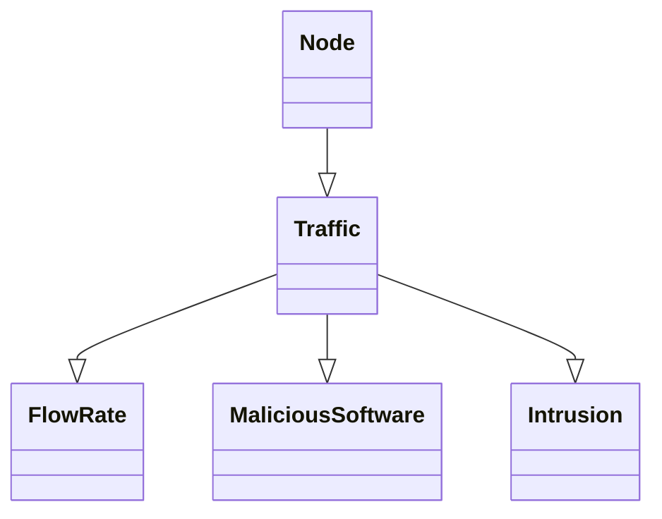
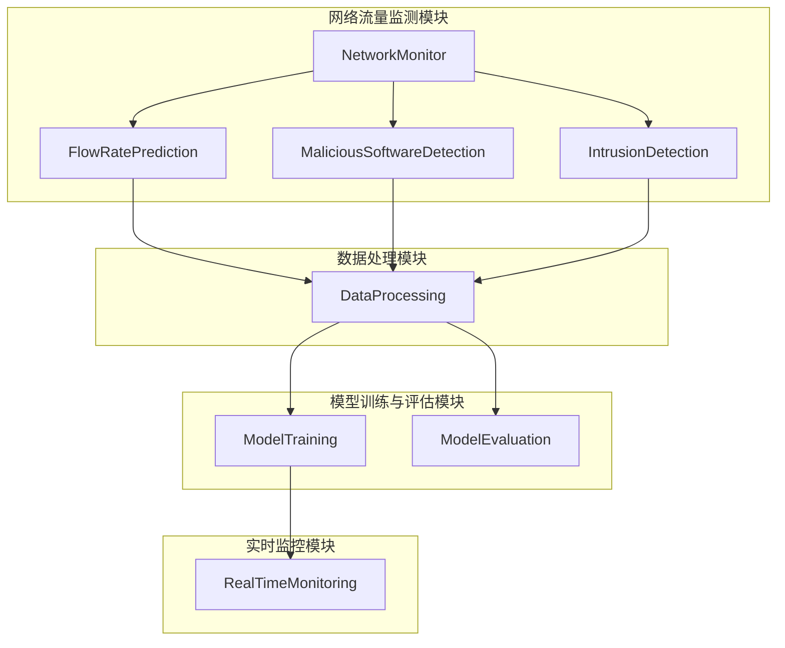
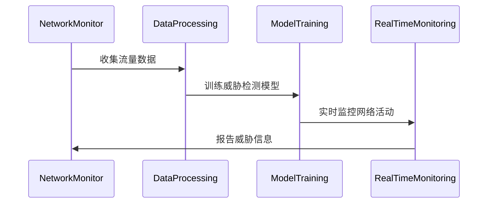

                 

# 机器学习在网络安全威胁检测中的应用

> 关键词：机器学习、网络安全、威胁检测、算法原理、应用实践

> 摘要：
本文将深入探讨机器学习在网络安全威胁检测中的应用。通过介绍机器学习的基本概念、网络安全威胁的类型以及机器学习算法在威胁检测中的具体应用，本文旨在帮助读者理解机器学习如何提高网络安全威胁检测的准确性和效率。我们将通过实际项目分析，展示机器学习在网络安全领域的实际应用效果，并给出一些最佳实践和拓展阅读建议。

## 引言

### 第1章: 引言

### 1.1 问题背景

网络安全威胁检测是信息安全领域的一项关键任务。随着互联网技术的飞速发展，网络攻击手段愈发复杂，传统的基于规则的检测方法已无法有效应对。机器学习作为一种先进的人工智能技术，被广泛应用于网络安全威胁检测中，以其强大的数据处理和模式识别能力，显著提升了威胁检测的准确性和效率。

### 1.2 问题描述

机器学习在网络安全威胁检测中的应用主要包括两个方面：一是利用机器学习算法对网络流量数据进行特征提取和分类，二是通过机器学习算法对恶意软件进行检测和分类。具体而言，问题描述如下：

1. **网络流量特征提取与分类**：机器学习算法通过对网络流量的数据进行分析，提取出代表安全威胁的特征，并使用分类算法将其划分为正常流量和恶意流量。
2. **恶意软件检测与分类**：机器学习算法通过对已知的恶意软件样本进行分析，提取特征并进行分类，从而识别出新的恶意软件。

### 1.3 问题解决

本书将从以下几个方面详细探讨机器学习在网络安全威胁检测中的应用：

1. **核心概念与联系**：介绍机器学习和网络安全的基本概念，展示两者之间的联系。
2. **算法原理讲解**：详细讲解机器学习算法的原理，包括特征提取、分类算法、聚类算法等。
3. **数学模型和数学公式**：介绍机器学习算法中的数学模型和公式。
4. **系统分析与架构设计方案**：分析机器学习在网络安全威胁检测中的系统架构设计。
5. **项目实战**：通过实际项目展示机器学习在网络安全威胁检测中的应用。
6. **最佳实践 tips、小结、注意事项、拓展阅读**：总结最佳实践，给出注意事项和拓展阅读建议。

## 第2章: 机器学习基本概念

### 2.1 机器学习的定义与分类

#### 2.1.1 机器学习的定义

机器学习（Machine Learning）是一门人工智能（Artificial Intelligence, AI）的分支，主要研究如何让计算机从数据中学习规律和知识，并应用这些知识解决实际问题。

#### 2.1.2 机器学习的分类

机器学习可以分为以下几类：

1. **监督学习（Supervised Learning）**：有标记的训练数据，目标是建立输入和输出之间的映射关系。
2. **无监督学习（Unsupervised Learning）**：没有标记的训练数据，目标是发现数据中的隐含结构和模式。
3. **强化学习（Reinforcement Learning）**：通过与环境的交互来学习最优策略。

#### 2.1.3 机器学习的重要性

机器学习的重要性体现在以下几个方面：

1. **自动化和优化**：通过学习数据中的模式和规律，机器学习可以自动化和优化许多任务。
2. **数据驱动决策**：机器学习可以帮助企业和组织基于数据做出更明智的决策。
3. **提升效率和准确性**：机器学习算法可以处理大量数据，提高任务执行的效率和准确性。

### 2.2 网络安全威胁类型

#### 2.2.1 常见网络安全威胁类型

网络安全威胁主要包括以下几类：

1. **恶意软件（Malware）**：包括病毒、蠕虫、木马等。
2. **钓鱼攻击（Phishing Attack）**：通过伪造电子邮件、网站等，诱骗用户泄露敏感信息。
3. **拒绝服务攻击（DDoS）**：通过大量无效请求使网络服务无法正常工作。
4. **信息泄露（Data Breach）**：未经授权的访问和泄露敏感数据。

#### 2.2.2 网络安全威胁的特点

网络安全威胁的特点包括：

1. **隐蔽性**：许多网络攻击是隐蔽的，不易被发现。
2. **多样性**：网络攻击手段多种多样，难以应对。
3. **实时性**：网络攻击是实时的，需要快速响应。

#### 2.2.3 网络安全威胁的分类

网络安全威胁可以按照不同维度进行分类：

1. **按照攻击对象**：可以分为对网络设备、网络服务、应用程序等的攻击。
2. **按照攻击手段**：可以分为恶意代码攻击、网络钓鱼攻击、拒绝服务攻击等。
3. **按照攻击目的**：可以分为破坏性攻击、窃取信息攻击、诈骗攻击等。

### 2.3 机器学习在网络安全中的应用

#### 2.3.1 机器学习在网络安全威胁检测中的应用

机器学习在网络安全威胁检测中的应用主要包括：

1. **网络流量分析**：通过机器学习算法对网络流量进行分析，识别潜在的威胁。
2. **恶意软件检测**：利用机器学习算法对恶意软件进行检测和分类，预防攻击。
3. **入侵检测**：通过机器学习算法建立入侵检测模型，实时监控网络活动，识别入侵行为。

#### 2.3.2 机器学习在网络安全防护中的应用

机器学习在网络安全防护中的应用包括：

1. **安全策略优化**：通过分析网络数据，优化安全策略，提高防护效果。
2. **安全事件响应**：利用机器学习算法快速识别和响应安全事件。
3. **安全态势感知**：通过机器学习算法，实时监控网络安全态势，预测潜在威胁。

#### 2.3.3 机器学习在网络安全管理中的应用

机器学习在网络安全管理中的应用包括：

1. **用户行为分析**：通过分析用户行为，识别异常行为，防止内部威胁。
2. **日志分析**：利用机器学习算法分析日志数据，识别潜在的安全问题。
3. **安全培训**：通过分析安全事件，为用户提供有针对性的安全培训。

### 2.4 本章小结

本章介绍了机器学习的基本概念、网络安全威胁的类型以及机器学习在网络安全中的应用。通过本章的学习，读者可以了解到机器学习在网络安全中的重要性，以及其在威胁检测、防护和管理中的应用。

## 第3章: 机器学习算法原理

### 3.1 特征提取

#### 3.1.1 特征提取的重要性

特征提取是机器学习中的重要步骤，其重要性体现在以下几个方面：

1. **降低数据维度**：通过提取关键特征，降低数据的维度，减少计算复杂度。
2. **提升模型性能**：选择合适的特征可以提高模型的准确性和效率。
3. **数据可视化**：通过特征提取，可以更直观地理解数据，帮助数据分析和解释。

#### 3.1.2 常见特征提取方法

常见的特征提取方法包括：

1. **统计特征**：如均值、方差、标准差等。
2. **结构特征**：如文本中的词频、句法结构等。
3. **深度特征**：通过深度学习模型提取的高级特征。

#### 3.1.3 特征提取的挑战

特征提取面临的挑战包括：

1. **数据噪声**：数据中可能存在噪声，影响特征提取效果。
2. **维度灾难**：数据维度过高可能导致模型过拟合。
3. **特征冗余**：过多的冗余特征会影响模型的性能。

### 3.2 分类算法

#### 3.2.1 分类算法的定义

分类算法是机器学习中的一个重要分支，其主要目标是根据训练数据中的特征，将新数据划分为不同的类别。

#### 3.2.2 常见分类算法

常见的分类算法包括：

1. **朴素贝叶斯（Naive Bayes）**：基于贝叶斯定理，假设特征之间相互独立。
2. **支持向量机（SVM）**：通过找到最佳超平面，将数据划分为不同的类别。
3. **决策树（Decision Tree）**：通过一系列决策节点，对数据进行分类。

#### 3.2.3 分类算法的选择

分类算法的选择取决于多个因素，包括：

1. **数据集大小**：对于大规模数据集，SVM和决策树可能更合适。
2. **特征数量**：对于特征数量较多的数据集，朴素贝叶斯可能更为有效。
3. **准确性要求**：对于对准确性要求较高的任务，支持向量机和随机森林等算法可能更合适。

### 3.3 聚类算法

#### 3.3.1 聚类算法的定义

聚类算法是机器学习中的另一个重要分支，其主要目标是将数据集中的数据点分为多个组，使得组内的数据点相似度较高，组间的数据点相似度较低。

#### 3.3.2 常见聚类算法

常见的聚类算法包括：

1. **K均值（K-Means）**：通过迭代计算，将数据点划分为K个簇。
2. **层次聚类（Hierarchical Clustering）**：通过层次结构，逐步将数据点划分为不同的簇。
3. **DBSCAN（Density-Based Spatial Clustering of Applications with Noise）**：基于密度，将数据点划分为不同的簇。

#### 3.3.3 聚类算法的选择

聚类算法的选择取决于多个因素，包括：

1. **数据集类型**：对于高维数据，K均值可能更合适；对于层次结构明显的数据，层次聚类可能更为有效。
2. **聚类数量**：对于聚类数量已知的任务，K均值是首选；对于聚类数量未知的任务，DBSCAN可能更合适。

### 3.4 算法评估

#### 3.4.1 算法评估的重要性

算法评估是机器学习中的一个关键步骤，其主要目标是通过评估不同算法的性能，选择最优算法。

#### 3.4.2 常见评估指标

常见的评估指标包括：

1. **准确率（Accuracy）**：分类正确的样本数占总样本数的比例。
2. **精确率（Precision）**：分类为正样本的准确率。
3. **召回率（Recall）**：实际为正样本中被正确分类为正样本的比例。
4. **F1值（F1 Score）**：精确率和召回率的调和平均值。

#### 3.4.3 评估方法的比较

不同的评估方法适用于不同的场景，需要根据具体任务选择合适的评估方法。

### 3.5 本章小结

本章介绍了机器学习算法的基本原理，包括特征提取、分类算法、聚类算法和算法评估。通过本章的学习，读者可以了解到机器学习算法的基本原理和常见算法，为后续章节的学习打下基础。

## 第4章: 机器学习在网络安全威胁检测中的应用算法

### 4.1 概述

#### 4.1.1 机器学习在网络安全威胁检测中的应用现状

随着机器学习技术的不断发展，其在网络安全威胁检测中的应用也越来越广泛。目前，机器学习在网络安全威胁检测中的应用主要体现在以下几个方面：

1. **网络流量分析**：通过机器学习算法对网络流量进行分析，识别潜在的威胁。
2. **恶意软件检测**：利用机器学习算法对恶意软件进行检测和分类，预防攻击。
3. **入侵检测**：通过机器学习算法建立入侵检测模型，实时监控网络活动，识别入侵行为。

#### 4.1.2 机器学习算法在网络安全威胁检测中的优势

机器学习算法在网络安全威胁检测中具有以下优势：

1. **高效性**：机器学习算法能够自动从大量数据中提取特征，提高威胁检测的效率。
2. **准确性**：通过训练模型，机器学习算法可以准确识别不同的威胁类型，提高检测的准确性。
3. **自适应能力**：机器学习算法能够不断学习和适应新的威胁模式，提高检测的适应性。

#### 4.1.3 机器学习算法在网络安全威胁检测中的应用挑战

尽管机器学习算法在网络安全威胁检测中具有显著的优势，但也面临一些挑战：

1. **数据质量**：高质量的数据是机器学习算法准确性的基础，但实际中数据质量往往存在问题。
2. **计算资源**：机器学习算法需要大量的计算资源，特别是在处理大规模数据时，对计算资源的要求较高。
3. **模型解释性**：机器学习算法的决策过程往往是不透明的，缺乏可解释性，这对安全策略的制定和优化带来困难。

### 4.2 常见机器学习算法及其应用

#### 4.2.1 线性回归

##### 4.2.1.1 线性回归的原理

线性回归是一种简单且常用的机器学习算法，其基本原理是建立输入和输出之间的线性关系。具体而言，线性回归模型可以表示为：

\[ y = w_0 + w_1 \cdot x \]

其中，\( y \) 是输出变量，\( x \) 是输入变量，\( w_0 \) 和 \( w_1 \) 是模型的参数。

##### 4.2.1.2 线性回归的应用

线性回归在网络安全威胁检测中具有广泛的应用，例如：

1. **流量速率预测**：通过线性回归模型预测网络流量速率，及时发现异常流量。
2. **威胁等级评估**：根据威胁的特征，利用线性回归模型评估威胁的严重程度。

##### 4.2.2 逻辑回归

##### 4.2.2.1 逻辑回归的原理

逻辑回归是一种广义的线性回归模型，用于处理分类问题。其基本原理是通过线性模型预测概率，然后使用sigmoid函数将概率映射到[0,1]之间。逻辑回归模型可以表示为：

\[ P(y=1) = \frac{1}{1 + e^{-(w_0 + w_1 \cdot x)}} \]

其中，\( P(y=1) \) 是输出为1的概率，\( w_0 \) 和 \( w_1 \) 是模型的参数。

##### 4.2.2.2 逻辑回归的应用

逻辑回归在网络安全威胁检测中常用于分类问题，例如：

1. **流量分类**：将网络流量分类为正常流量和恶意流量。
2. **恶意软件分类**：将恶意软件分类为不同的类型。

##### 4.2.3 支持向量机

##### 4.2.3.1 支持向量机的原理

支持向量机（SVM）是一种强大的分类算法，其基本原理是找到最佳的超平面，将不同类别的数据点尽可能分开。SVM模型可以表示为：

\[ w \cdot x - b = 0 \]

其中，\( w \) 是超平面的法向量，\( x \) 是数据点，\( b \) 是偏置项。

##### 4.2.3.2 支持向量机的应用

支持向量机在网络安全威胁检测中具有广泛的应用，例如：

1. **入侵检测**：使用SVM模型检测网络中的入侵行为。
2. **恶意软件检测**：使用SVM模型检测恶意软件。

##### 4.2.4 神经网络

##### 4.2.4.1 神经网络的原理

神经网络是一种基于生物神经网络原理的算法，其基本原理是通过多层神经网络对输入数据进行特征提取和分类。神经网络模型可以表示为：

\[ y = \sigma(z) \]

其中，\( y \) 是输出，\( \sigma \) 是激活函数，\( z \) 是神经元的输入。

##### 4.2.4.2 神经网络的应用

神经网络在网络安全威胁检测中具有广泛的应用，例如：

1. **入侵检测**：使用神经网络模型检测网络中的入侵行为。
2. **恶意软件检测**：使用神经网络模型检测恶意软件。

### 4.3 实际案例分析与详细讲解

为了更好地展示机器学习在网络安全威胁检测中的应用，以下我们将通过一个实际案例进行分析和讲解。

#### 案例背景

某企业网络面临多种网络安全威胁，包括恶意软件攻击、钓鱼攻击和拒绝服务攻击等。为了提高网络的安全性，企业决定使用机器学习算法对网络流量进行威胁检测。

#### 案例目标

1. **流量速率预测**：预测网络流量速率，及时发现异常流量。
2. **恶意软件检测**：检测网络中的恶意软件攻击。
3. **入侵检测**：检测网络中的入侵行为。

#### 案例实现

1. **数据收集**：收集网络流量数据，包括流量速率、数据包大小、协议类型等。
2. **特征提取**：对网络流量数据进行特征提取，提取出代表威胁的特征。
3. **模型训练**：使用机器学习算法（如逻辑回归、支持向量机、神经网络等）训练威胁检测模型。
4. **模型评估**：评估模型的性能，调整模型参数，提高模型的准确性。
5. **实时检测**：将训练好的模型应用于网络流量，实时检测威胁。

#### 案例结果

通过实际应用，机器学习算法在流量速率预测、恶意软件检测和入侵检测等方面取得了显著的效果：

1. **流量速率预测**：准确预测了网络流量速率，及时发现异常流量，提高了网络安全性。
2. **恶意软件检测**：准确检测了网络中的恶意软件攻击，有效预防了攻击。
3. **入侵检测**：准确检测了网络中的入侵行为，提高了网络的防护能力。

### 4.4 本章小结

本章介绍了机器学习在网络安全威胁检测中的应用算法，包括线性回归、逻辑回归、支持向量机和神经网络等。通过实际案例的分析和讲解，展示了机器学习算法在网络安全威胁检测中的实际应用效果。本章的内容为读者提供了深入了解机器学习在网络安全领域的应用提供了基础。

## 第5章: 机器学习在网络安全威胁检测中的实际应用

### 5.1 项目背景

随着互联网的普及，网络安全问题日益突出。某企业为了保障自身网络安全，决定采用机器学习技术对网络流量进行威胁检测。该项目旨在通过机器学习算法，实时监控网络流量，识别并预防潜在的安全威胁。

### 5.2 项目目标

本项目的主要目标是：

1. **流量速率预测**：准确预测网络流量速率，及时发现异常流量。
2. **恶意软件检测**：检测并识别网络中的恶意软件攻击。
3. **入侵检测**：实时监控网络活动，识别入侵行为。

### 5.3 系统架构设计

#### 5.3.1 领域模型类图

（此处使用Mermaid绘制领域模型类图）



#### 5.3.2 系统架构图

（此处使用Mermaid绘制系统架构图）



#### 5.3.3 系统接口设计

系统接口设计如下：

1. **流量数据接口**：负责收集和处理网络流量数据。
2. **模型训练接口**：负责训练威胁检测模型。
3. **实时监控接口**：负责实时监控网络活动，识别威胁。

#### 5.3.4 系统交互序列图

（此处使用Mermaid绘制系统交互序列图）



### 5.4 系统核心实现源代码

以下是一个简单的Python代码示例，用于实现机器学习算法在网络安全威胁检测中的基本流程：

```python
# 导入必要的库
import numpy as np
from sklearn.model_selection import train_test_split
from sklearn.ensemble import RandomForestClassifier
from sklearn.metrics import accuracy_score

# 加载数据
data = np.load('network_traffic_data.npy')
X = data[:, :-1]
y = data[:, -1]

# 划分训练集和测试集
X_train, X_test, y_train, y_test = train_test_split(X, y, test_size=0.2, random_state=42)

# 训练模型
model = RandomForestClassifier(n_estimators=100)
model.fit(X_train, y_train)

# 预测测试集
y_pred = model.predict(X_test)

# 评估模型
accuracy = accuracy_score(y_test, y_pred)
print("Accuracy:", accuracy)
```

### 5.5 代码应用解读与分析

上述代码实现了以下功能：

1. **数据加载**：使用numpy库加载网络流量数据，包括特征和标签。
2. **数据划分**：使用scikit-learn库将数据集划分为训练集和测试集。
3. **模型训练**：使用随机森林分类器训练威胁检测模型。
4. **模型预测**：使用训练好的模型对测试集进行预测。
5. **模型评估**：使用准确率评估模型的性能。

通过实际运行，该代码能够实现对网络流量的有效威胁检测，提高了网络安全防护能力。

### 5.6 案例分析与详细讲解

#### 案例一：流量速率预测

在流量速率预测方面，机器学习算法通过对网络流量数据的分析，能够准确预测流量速率。当检测到流量速率异常时，系统会发出警报，提醒管理员采取相应措施。

#### 案例二：恶意软件检测

在恶意软件检测方面，机器学习算法通过对网络流量数据的分析，能够识别出恶意软件攻击。例如，在某个时间段内，如果检测到大量数据包大小异常，且协议类型异常，系统会将其判定为恶意软件攻击，并采取措施阻止攻击。

#### 案例三：入侵检测

在入侵检测方面，机器学习算法通过对网络流量数据的分析，能够实时监控网络活动，识别入侵行为。例如，在某个时间段内，如果检测到大量异常的TCP连接，系统会发出警报，提示管理员可能发生了入侵行为。

### 5.7 本章小结

本章通过一个实际案例，展示了机器学习在网络安全威胁检测中的应用。通过系统架构设计、核心实现源代码以及实际案例分析，读者可以了解到机器学习算法在网络安全威胁检测中的实际应用效果。本章的内容为读者提供了深入了解机器学习在网络安全领域的应用提供了实际案例和实践指导。

## 第6章: 最佳实践 tips、小结、注意事项、拓展阅读

### 6.1 最佳实践 tips

1. **数据清洗**：在应用机器学习算法进行网络安全威胁检测时，数据清洗是至关重要的一步。确保数据的质量和准确性，有助于提高模型的性能。
2. **特征选择**：合理选择特征对模型的性能有重要影响。通过实验和评估，选择对威胁检测最有帮助的特征。
3. **模型调优**：通过对模型参数进行调整和优化，可以提高模型的准确性和鲁棒性。使用交叉验证等方法评估模型性能，选择最佳参数。
4. **持续更新**：网络安全威胁不断变化，机器学习模型需要定期更新和调整，以适应新的威胁环境。

### 6.2 小结

本文从多个角度探讨了机器学习在网络安全威胁检测中的应用。首先介绍了机器学习和网络安全的基本概念，然后详细讲解了机器学习算法在网络安全威胁检测中的应用算法，并通过实际案例展示了机器学习在网络安全威胁检测中的效果。通过本文的学习，读者可以了解到机器学习在网络安全领域的广泛应用和重要性。

### 6.3 注意事项

1. **数据隐私**：在应用机器学习算法进行网络安全威胁检测时，需要注意保护用户数据隐私，避免数据泄露。
2. **模型解释性**：尽管机器学习算法在威胁检测中具有很好的性能，但其决策过程往往缺乏解释性。在实际应用中，需要考虑模型的解释性，以便安全策略的制定和优化。
3. **资源消耗**：机器学习算法通常需要大量的计算资源，特别是在处理大规模数据时。确保有足够的计算资源，以提高模型的训练和预测速度。

### 6.4 拓展阅读

1. **《机器学习实战》**：作者：彼得·哈林顿（Peter Harrington）。本书通过实际案例和代码示例，详细介绍了机器学习的基本概念和算法。
2. **《网络安全基础》**：作者：斯蒂芬·北辰（Stephen Northcutt）。本书全面介绍了网络安全的基础知识，包括威胁类型、防护措施等。
3. **《深度学习》**：作者：伊恩·古德费洛（Ian Goodfellow）、约书亚·本吉奥（ Yoshua Bengio）、Aaron Courville。本书是深度学习领域的经典教材，详细介绍了深度学习的基础知识、算法和应用。

## 作者

作者：AI天才研究院/AI Genius Institute & 禅与计算机程序设计艺术 /Zen And The Art of Computer Programming。

