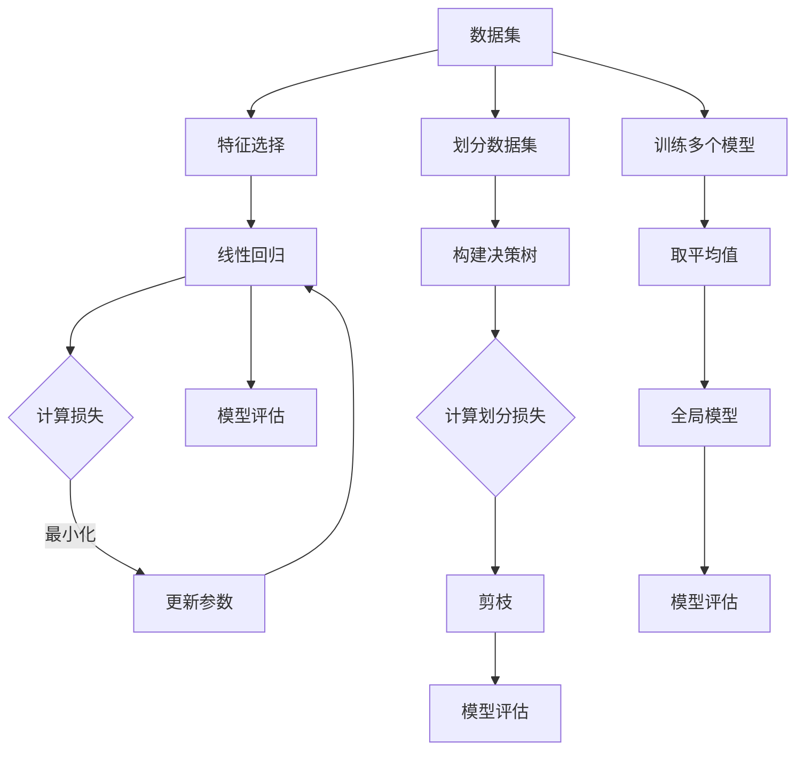

                 

# 机器学习在预测性维护中的实践

## 概述

在信息化和自动化的时代，设备的可靠性和稳定性越来越受到重视。预测性维护（Predictive Maintenance）作为一种高级维护策略，旨在通过实时监测设备状态，预测潜在故障，从而在设备真正发生故障之前进行干预。这不仅能够减少设备停机时间，提高生产效率，还能显著降低维护成本。

本文将深入探讨机器学习在预测性维护中的应用，从背景介绍、核心概念与联系、算法原理讲解、数学模型和公式、系统分析与架构设计方案、项目实战以及最佳实践等方面进行全面分析。文章将遵循以下结构：

1. **背景介绍**：讨论预测性维护的重要性、现状与挑战。
2. **核心概念与联系**：详细介绍机器学习和预测性维护的基本概念，及其在工业领域的应用。
3. **算法原理讲解**：分析机器学习算法在预测性维护中的应用，包括监督学习、无监督学习和强化学习。
4. **数学模型和公式**：阐述机器学习和预测性维护中使用的数学模型和公式。
5. **系统分析与架构设计方案**：介绍预测性维护系统的设计，包括功能、架构和接口。
6. **项目实战**：通过一个实际项目展示预测性维护的实现过程。
7. **最佳实践 tips、小结、注意事项、拓展阅读**：总结文章，提供实用的建议和进一步学习资源。

## 目录大纲

### 第一部分: 背景介绍

- **1.1 问题背景**
  - **1.1.1 预测性维护的意义**
  - **1.1.2 预测性维护的现状与挑战**
- **1.2 问题描述**
  - **1.2.1 预测性维护的目标**
  - **1.2.2 预测性维护的关键问题**
- **1.3 问题解决**
  - **1.3.1 机器学习技术的应用**
  - **1.3.2 预测性维护的解决方案**
- **1.4 边界与外延**
  - **1.4.1 预测性维护的适用范围**
  - **1.4.2 预测性维护的限制**
- **1.5 概念结构与核心要素组成**
  - **1.5.1 机器学习的概念结构**
  - **1.5.2 预测性维护的核心要素组成**

### 第二部分: 核心概念与联系

- **2.1 机器学习的核心概念**
  - **2.1.1 机器学习的定义**
  - **2.1.2 机器学习的分类**
    - **2.1.2.1 监督学习**
    - **2.1.2.2 无监督学习**
    - **2.1.2.3 强化学习**
  - **2.1.3 机器学习的基本原理**
  - **2.1.4 机器学习的优点与挑战**
- **2.2 预测性维护的概念与联系**
  - **2.2.1 预测性维护的定义**
  - **2.2.2 预测性维护的基本原理**
  - **2.2.3 预测性维护的技术手段**
    - **2.2.3.1 数据采集**
    - **2.2.3.2 数据预处理**
    - **2.2.3.3 数据分析**
    - **2.2.3.4 模型构建与优化**
    - **2.2.3.5 模型应用与评估**
- **2.3 机器学习在预测性维护中的应用**
  - **2.3.1 机器学习在预测性维护中的作用**
  - **2.3.2 机器学习在预测性维护中的挑战**
  - **2.3.3 机器学习在预测性维护中的发展趋势**

### 第三部分: 算法原理讲解

- **3.1 机器学习算法概述**
  - **3.1.1 机器学习算法的分类**
    - **3.1.1.1 监督学习算法**
    - **3.1.1.2 无监督学习算法**
    - **3.1.1.3 强化学习算法**
  - **3.1.2 机器学习算法的基本原理**
  - **3.1.3 机器学习算法的应用场景**
- **3.2 预测性维护中的常用算法**
  - **3.2.1 线性回归算法**
    - **3.2.1.1 线性回归的数学模型**
    - **3.2.1.2 线性回归的实现方法**
    - **3.2.1.3 线性回归的优缺点**
  - **3.2.2 决策树算法**
    - **3.2.2.1 决策树的构建过程**
    - **3.2.2.2 决策树的剪枝方法**
    - **3.2.2.3 决策树的优缺点**
  - **3.2.3 集成学习方法**
    - **3.2.3.1 集成学习的概念**
    - **3.2.3.2 集成学习的分类**
    - **3.2.3.3 集成学习的优点**
- **3.3 算法mermaid流程图**

### 第四部分: 数学模型和数学公式

- **4.1 机器学习中的数学模型**
- **4.2 预测性维护中的数学模型**
- **4.3 算法原理的数学公式**

### 第五部分: 系统分析与架构设计方案

- **5.1 问题场景介绍**
- **5.2 系统功能设计**
- **5.3 系统架构设计**
- **5.4 系统接口设计和系统交互**

### 第六部分: 项目实战

- **6.1 环境安装**
- **6.2 系统核心实现源代码**
- **6.3 代码应用解读与分析**
- **6.4 实际案例分析和详细讲解剖析**
- **6.5 项目小结**

### 第七部分: 最佳实践 tips、小结、注意事项、拓展阅读

- **7.1 最佳实践 tips**
- **7.2 小结**
- **7.3 注意事项**
- **7.4 拓展阅读**

---

接下来，我们将逐步深入探讨每个部分，以逻辑清晰、结构紧凑、简单易懂的专业技术语言，帮助您更好地理解机器学习在预测性维护中的实践。

## 第一部分: 背景介绍

### 1.1 问题背景

#### 1.1.1 预测性维护的意义

预测性维护是一种基于设备实时监测数据的维护策略，其核心目的是通过分析设备运行状态，预测潜在的故障，从而在故障发生前进行维护，避免设备非计划停机。这种维护方式不仅能够显著提高设备的可靠性，还能有效降低维护成本。

在传统定期维护模式下，设备通常在固定的时间间隔内进行保养，而无论其实际状态如何。这种方式可能会导致两种问题：一是过度维护，增加了不必要的成本；二是维护不及时，导致设备故障甚至损坏。而预测性维护通过实时监控设备的运行状态，可以更精确地判断何时需要进行维护，从而实现“只在必要时维护”的目标。

#### 1.1.2 预测性维护的现状与挑战

预测性维护在全球范围内已经得到了广泛关注和应用。在制造业、能源行业、交通运输等多个领域，预测性维护已经成为提升设备管理水平和生产效率的重要手段。然而，在实际应用中，预测性维护仍然面临着一系列挑战：

1. **数据质量**：预测性维护依赖于大量高质量的运行数据。然而，许多设备在运行过程中产生的数据并不完整或存在噪声，这会影响到模型的准确性和可靠性。

2. **数据处理能力**：随着物联网和传感器技术的发展，设备产生的数据量日益增加。如何高效地处理这些海量数据，提取出有价值的信息，是预测性维护系统需要解决的重要问题。

3. **算法复杂性**：预测性维护中使用的机器学习算法通常较为复杂，需要大量计算资源和专业知识。如何在有限的资源条件下，选择合适的算法并优化其性能，是实施预测性维护的一大挑战。

4. **模型解释性**：在工业领域，维护人员通常希望了解模型的决策过程和依据。然而，许多复杂的机器学习算法，如深度学习，其内部机制并不容易解释。如何提高模型的可解释性，是预测性维护应用中需要考虑的问题。

### 1.2 问题描述

#### 1.2.1 预测性维护的目标

预测性维护的目标是提前识别设备潜在的故障，以便在故障发生之前进行维护，从而减少设备停机时间，降低维护成本，提高生产效率。具体而言，预测性维护需要实现以下目标：

1. **早期故障预测**：通过实时监测设备状态，提前发现潜在故障，并在故障发生前采取维护措施。
2. **优化维护策略**：根据设备运行状态和历史数据，制定最优的维护计划，避免过度维护或维护不及时。
3. **提高设备可靠性**：通过预测性维护，提高设备运行的稳定性和可靠性，延长设备寿命。

#### 1.2.2 预测性维护的关键问题

实现预测性维护需要解决以下关键问题：

1. **数据采集与预处理**：预测性维护依赖于大量高质量的运行数据。然而，数据的采集、存储和处理是一个复杂的过程，需要解决数据缺失、噪声处理、异常值识别等问题。
2. **算法选择与优化**：选择合适的机器学习算法，并对其进行优化，以提高预测的准确性和效率。常用的算法包括线性回归、决策树、支持向量机、神经网络等。
3. **模型解释性**：提高模型的可解释性，使其能够被非专业人员理解，从而在实际应用中发挥更好的作用。
4. **系统集成与部署**：将预测性维护系统集成到现有的设备管理系统中，确保系统能够在实际环境中稳定运行，并提供有效的维护决策。

### 1.3 问题解决

#### 1.3.1 机器学习技术的应用

机器学习技术为预测性维护提供了强大的工具和手段。通过机器学习算法，可以从海量设备运行数据中提取有价值的信息，建立故障预测模型，实现设备的智能监控和维护。具体而言，机器学习在预测性维护中的应用主要体现在以下几个方面：

1. **故障特征提取**：通过分析设备运行数据，提取出与故障相关的特征，为故障预测提供基础。
2. **故障预测模型构建**：利用监督学习、无监督学习和强化学习等算法，建立故障预测模型，对设备故障进行预测。
3. **模型优化与评估**：通过交叉验证、网格搜索等方法，优化故障预测模型，评估模型性能，确保预测结果的准确性。

#### 1.3.2 预测性维护的解决方案

预测性维护的解决方案通常包括以下几个方面：

1. **数据采集系统**：建立完善的数据采集系统，实时收集设备运行数据，确保数据的完整性和准确性。
2. **数据处理平台**：构建数据处理平台，对采集到的数据进行预处理、清洗和特征提取，为故障预测模型提供高质量的输入数据。
3. **机器学习算法库**：建立机器学习算法库，包括线性回归、决策树、神经网络等多种算法，支持模型训练、优化和评估。
4. **预测性维护系统**：将数据采集、处理和预测功能集成到预测性维护系统中，实现对设备运行状态的实时监控和故障预测，提供维护决策支持。
5. **系统集成与部署**：将预测性维护系统集成到现有的设备管理系统中，确保系统能够在实际环境中稳定运行，并提供有效的维护决策。

### 1.4 边界与外延

#### 1.4.1 预测性维护的适用范围

预测性维护主要适用于以下场景：

1. **高价值设备**：对于高价值、高故障风险的设备，如飞机发动机、发电机、石油管道等，预测性维护可以显著降低维护成本和设备停机时间。
2. **连续运行设备**：对于需要连续运行的关键设备，如生产线设备、泵、风机等，预测性维护可以提高设备运行的稳定性和可靠性。
3. **复杂设备系统**：对于由多个子系统和设备组成的复杂设备系统，如炼油厂、发电站等，预测性维护可以实现对整个系统的智能监控和故障预测。

#### 1.4.2 预测性维护的限制

预测性维护也存在一些限制，包括：

1. **数据质量要求**：预测性维护依赖于高质量的运行数据，数据缺失或不准确会影响预测结果的准确性。
2. **算法复杂性**：复杂的机器学习算法需要大量的计算资源和专业知识，实施难度较大。
3. **系统部署成本**：建立完善的预测性维护系统需要投入较大的资金和人力，实施成本较高。
4. **维护人员技能**：预测性维护系统需要专业人员进行操作和维护，对人员的技能要求较高。

#### 1.5 概念结构与核心要素组成

预测性维护系统的概念结构包括以下几个方面：

1. **数据采集**：实时收集设备运行数据，包括温度、压力、振动等传感器数据。
2. **数据处理**：对采集到的数据进行预处理、清洗和特征提取，为故障预测模型提供高质量的输入数据。
3. **机器学习模型**：选择合适的机器学习算法，建立故障预测模型，对设备故障进行预测。
4. **维护决策支持**：根据预测结果，提供维护决策支持，制定最优的维护计划。
5. **系统集成与部署**：将预测性维护系统集成到现有的设备管理系统中，确保系统能够在实际环境中稳定运行。

核心要素组成：

1. **数据采集系统**：包括传感器、数据采集器等设备，用于实时收集设备运行数据。
2. **数据处理平台**：包括数据处理软件、数据库等，用于对采集到的数据进行预处理、清洗和特征提取。
3. **机器学习算法库**：包括多种机器学习算法，用于建立故障预测模型。
4. **预测性维护系统**：包括故障预测模块、维护决策支持模块等，用于实现对设备运行状态的实时监控和故障预测。
5. **系统集成与部署工具**：包括系统集成软件、部署脚本等，用于将预测性维护系统集成到现有的设备管理系统中。

### 总结

预测性维护作为一种先进的设备管理策略，在提高设备可靠性、降低维护成本、提高生产效率方面具有显著优势。然而，其实施过程中面临着数据质量、算法复杂性、系统部署成本和维护人员技能等挑战。通过运用机器学习技术，可以有效解决这些问题，实现设备的智能监控和故障预测。本文将深入探讨机器学习在预测性维护中的应用，从核心概念、算法原理、系统设计到项目实战等方面进行详细分析，以帮助读者更好地理解预测性维护的实践。

## 第二部分: 核心概念与联系

### 2.1 机器学习的核心概念

#### 2.1.1 机器学习的定义

机器学习（Machine Learning）是一门人工智能（Artificial Intelligence, AI）的分支学科，主要研究如何让计算机从数据中自动学习和改进，从而进行决策和预测。其核心思想是让计算机通过学习数据来发现数据中的规律和模式，从而在没有明确编程指令的情况下，对新的数据进行有效的处理和决策。

#### 2.1.2 机器学习的分类

机器学习可以根据学习方式的不同，分为以下几类：

1. **监督学习（Supervised Learning）**：
   监督学习是机器学习中最为常见的一种类型，其特征是训练数据集包含了输入和对应的输出。模型通过学习这些输入输出对，以便在新的输入上能够预测出正确的输出。常见的监督学习算法包括线性回归、逻辑回归、决策树、随机森林、支持向量机等。

2. **无监督学习（Unsupervised Learning）**：
   无监督学习不依赖于标签数据，其目标是发现数据中的内在结构和规律。常见的无监督学习算法包括聚类算法（如K-Means、层次聚类）、降维算法（如主成分分析、t-SNE）和关联规则学习（如Apriori算法）等。

3. **强化学习（Reinforcement Learning）**：
   强化学习是一种通过奖励机制来训练模型的机器学习方法。模型通过不断尝试不同的动作，并根据环境的反馈（奖励或惩罚）来调整自己的策略，以最大化长期奖励。常见的强化学习算法包括Q-learning、SARSA、DQN（深度Q网络）等。

#### 2.1.3 机器学习的基本原理

机器学习的基本原理可以分为以下几个步骤：

1. **数据收集**：收集大量的数据作为训练集，这些数据应当包含输入特征和相应的输出标签。

2. **数据处理**：对收集到的数据进行清洗、预处理和特征提取，以确保数据的质量和模型的性能。

3. **模型选择**：根据具体的问题和需求，选择合适的机器学习模型。不同的模型适用于不同类型的问题，如分类、回归、聚类等。

4. **模型训练**：使用训练集数据，通过算法训练模型，使其能够学会从输入特征中预测输出标签。

5. **模型评估**：使用验证集或测试集对模型进行评估，以确定模型的泛化能力和性能。

6. **模型优化**：根据评估结果，调整模型参数或选择更合适的模型，以提高模型的准确性和效率。

#### 2.1.4 机器学习的优点与挑战

**优点**：

1. **自动化决策**：机器学习可以自动从数据中学习模式和规律，实现自动化决策和预测。
2. **适应性**：机器学习模型可以根据新的数据不断学习和优化，适应不断变化的环境和需求。
3. **高效性**：通过自动化和大规模数据处理，机器学习能够高效地解决复杂问题。
4. **多领域应用**：机器学习在各个领域都有广泛应用，如金融、医疗、交通、娱乐等。

**挑战**：

1. **数据质量**：机器学习模型的性能很大程度上依赖于数据的质量和数量，数据缺失、噪声和异常值都会影响模型的效果。
2. **算法复杂性**：一些复杂的机器学习算法（如深度学习）需要大量的计算资源和时间进行训练和推理。
3. **模型解释性**：复杂的模型（如深度神经网络）往往缺乏可解释性，难以理解其决策过程。
4. **过拟合与欠拟合**：模型在训练集上表现良好，但在测试集上表现不佳，这是由于模型未能正确泛化。

### 2.2 预测性维护的概念与联系

#### 2.2.1 预测性维护的定义

预测性维护（Predictive Maintenance）是一种基于实时监测和数据分析的设备管理策略。其目的是通过预测设备可能发生的故障，提前进行维护，以避免非计划停机和潜在的设备损坏。预测性维护的核心思想是利用传感器技术、数据采集和机器学习算法，对设备运行状态进行实时监控和分析，从而实现故障的早期预警。

#### 2.2.2 预测性维护的基本原理

预测性维护的基本原理可以分为以下几个步骤：

1. **数据采集**：通过传感器和监测设备，实时采集设备运行数据，如振动、温度、压力、电流等。

2. **数据预处理**：对采集到的原始数据进行清洗、归一化和特征提取，以便为模型提供高质量的数据输入。

3. **特征选择**：从预处理后的数据中提取出与故障诊断相关的关键特征，用于训练和评估预测模型。

4. **模型训练**：选择合适的机器学习算法，利用训练数据集训练故障预测模型。

5. **模型评估**：使用验证集或测试集对训练好的模型进行评估，确保模型的泛化能力和准确性。

6. **故障预测**：将实时监测数据输入到训练好的模型中，预测设备可能的故障，提供维护决策支持。

#### 2.2.3 预测性维护的技术手段

预测性维护的技术手段主要包括以下几个方面：

1. **数据采集**：
   - 传感器技术：使用各类传感器（如加速度传感器、温度传感器、压力传感器等）监测设备运行状态。
   - 通信技术：通过无线通信（如Wi-Fi、蓝牙、LoRa等）将传感器数据传输到中央系统。

2. **数据处理**：
   - 数据清洗：去除异常值、噪声和重复数据，确保数据的准确性。
   - 数据归一化：将不同量纲的数据转换为统一的量纲，便于模型训练和评估。
   - 特征提取：从原始数据中提取出与故障诊断相关的特征，提高模型的预测能力。

3. **模型构建与优化**：
   - 算法选择：根据实际需求和数据特性，选择合适的机器学习算法（如线性回归、决策树、神经网络等）。
   - 参数调优：通过交叉验证和网格搜索等技术，优化模型参数，提高模型性能。

4. **模型应用与评估**：
   - 实时预测：将实时监测数据输入到训练好的模型中，进行故障预测。
   - 评估与反馈：使用验证集或测试集对模型的预测结果进行评估，并根据评估结果调整模型或数据预处理策略。

### 2.3 机器学习在预测性维护中的应用

#### 2.3.1 机器学习在预测性维护中的作用

机器学习在预测性维护中发挥着至关重要的作用，主要体现在以下几个方面：

1. **故障预测**：通过构建故障预测模型，实时监测设备状态，预测可能的故障，为维护人员提供预警信息。
2. **异常检测**：利用无监督学习算法，识别设备运行中的异常情况，及时发现潜在故障隐患。
3. **优化维护策略**：根据设备运行数据和历史故障记录，分析设备维护的频率和成本，制定最优的维护计划。
4. **提高设备可靠性**：通过预测性维护，提高设备运行的稳定性和可靠性，减少非计划停机时间和设备损坏率。

#### 2.3.2 机器学习在预测性维护中的挑战

尽管机器学习在预测性维护中具有巨大潜力，但实际应用中也面临一系列挑战：

1. **数据质量**：预测性维护依赖于高质量的数据，但实际中数据往往存在缺失、噪声和异常值，需要有效处理。
2. **算法复杂性**：预测性维护中使用的算法往往较为复杂，如深度学习算法，需要大量的计算资源和时间进行训练和推理。
3. **模型解释性**：复杂的机器学习模型往往缺乏可解释性，难以理解其决策过程，这在工业应用中可能会影响维护人员的信任度。
4. **系统集成与部署**：将预测性维护系统集成到现有的设备管理系统中，确保系统能够在实际环境中稳定运行，并与其他系统集成。

#### 2.3.3 机器学习在预测性维护中的发展趋势

随着人工智能技术的快速发展，机器学习在预测性维护中的应用呈现出以下发展趋势：

1. **深度学习与大数据**：深度学习和大数据技术的结合，将进一步提升故障预测的准确性和效率。
2. **边缘计算**：通过将部分计算任务迁移到边缘设备上，降低中心服务器的计算负荷，提高系统的实时性和响应速度。
3. **模型解释性**：发展可解释的机器学习算法，提高模型的透明度和可解释性，增强维护人员的信任度。
4. **多源数据融合**：整合来自不同传感器和不同数据源的信息，提高故障预测的准确性和全面性。
5. **跨学科融合**：将机器学习与其他学科（如机械工程、电子工程、数据科学等）的交叉融合，推动预测性维护技术的创新发展。

### 总结

机器学习在预测性维护中发挥着重要作用，通过实时监测和数据分析，可以实现设备的早期故障预测和优化维护。然而，机器学习在预测性维护中的应用也面临数据质量、算法复杂性、模型解释性和系统集成等挑战。随着人工智能技术的不断进步，预测性维护将会更加智能化、自动化和高效化，为工业设备的稳定运行和企业的持续发展提供有力支持。

## 第三部分: 算法原理讲解

### 3.1 机器学习算法概述

机器学习算法是机器学习技术中最为核心的部分，它们通过学习数据中的模式和规律，实现自动化决策和预测。机器学习算法可以根据学习方式的不同，分为以下几类：

#### 3.1.1 监督学习算法

监督学习算法是最常见的机器学习算法，其核心思想是通过已知的输入和输出数据（即标签数据），学习出一个映射函数，从而对新的输入数据进行预测。监督学习算法可以分为以下几类：

1. **回归算法**：回归算法用于预测连续值输出。常见的回归算法包括线性回归、多项式回归、岭回归等。
2. **分类算法**：分类算法用于预测离散的类别标签。常见的分类算法包括决策树、随机森林、支持向量机（SVM）、K最近邻（KNN）等。
3. **集成学习方法**：集成学习方法通过组合多个基本模型来提高预测性能。常见的集成学习方法包括Bagging、Boosting、Stacking等。

#### 3.1.2 无监督学习算法

无监督学习算法不依赖于标签数据，其主要目标是从未标记的数据中提取出内在的结构和规律。常见的无监督学习算法包括：

1. **聚类算法**：聚类算法用于将相似的数据点划分为同一个簇。常见的聚类算法包括K-Means、层次聚类、DBSCAN等。
2. **降维算法**：降维算法用于减少数据维度，同时保留数据的主要信息。常见的降维算法包括主成分分析（PCA）、t-SNE、自编码器等。
3. **关联规则学习**：关联规则学习用于发现数据中的潜在关联关系。常见的关联规则学习算法包括Apriori算法、FP-Growth算法等。

#### 3.1.3 强化学习算法

强化学习算法通过与环境交互，通过不断尝试不同的动作，并根据环境的反馈（奖励或惩罚）来学习最优策略。强化学习算法在预测性维护中的应用主要包括：

1. **Q-Learning**：Q-Learning是一种基于值函数的强化学习算法，通过学习状态-动作值函数来选择最优动作。
2. **SARSA**：SARSA是一种基于策略的强化学习算法，通过更新状态-动作概率分布来学习最优策略。
3. **DQN（深度Q网络）**：DQN是一种基于深度学习的强化学习算法，通过神经网络来近似状态-动作值函数。

### 3.2 预测性维护中的常用算法

在预测性维护中，常用的机器学习算法主要包括线性回归、决策树、集成学习方法等。这些算法在预测性维护中发挥着重要作用，下面将详细讲解这些算法的基本原理、实现方法以及优缺点。

#### 3.2.1 线性回归算法

线性回归是一种简单的统计学习方法，用于预测连续值输出。线性回归的基本思想是找到一个线性模型，使得输入特征与输出目标之间的误差最小。

1. **线性回归的数学模型**：

   线性回归的数学模型可以表示为：

   $$Y = \beta_0 + \beta_1 \cdot X_1 + \beta_2 \cdot X_2 + ... + \beta_n \cdot X_n + \epsilon$$

   其中，$Y$ 是输出目标，$X_1, X_2, ..., X_n$ 是输入特征，$\beta_0, \beta_1, \beta_2, ..., \beta_n$ 是模型的参数，$\epsilon$ 是误差项。

2. **线性回归的实现方法**：

   线性回归的实现方法主要包括最小二乘法（Ordinary Least Squares, OLS）和梯度下降法。

   - 最小二乘法：通过求解最小化误差平方和的参数，来得到线性回归模型的参数。
   - 梯度下降法：通过迭代更新参数，使得损失函数逐渐减小，从而得到线性回归模型的参数。

3. **线性回归的优缺点**：

   - 优点：线性回归算法简单，易于实现，计算速度快，适用于线性关系较强的数据。
   - 缺点：线性回归模型只能处理线性关系，对于非线性关系的数据表现较差。

#### 3.2.2 决策树算法

决策树是一种基于树形结构进行决策的算法，它通过递归地将数据集划分成若干个子集，使得每个子集中的数据在某个特征上具有一致性。决策树在预测性维护中广泛应用于故障预测和分类任务。

1. **决策树的构建过程**：

   决策树的构建过程主要包括以下几个步骤：

   - 选择最优特征：选择一个特征，将其作为节点，将数据集划分为若干个子集。
   - 计算划分损失：计算划分后的子集在某个特征上的损失，如信息增益、基尼指数等。
   - 递归构建子树：对划分后的子集继续递归构建决策树，直至达到终止条件（如最大深度、最小样本数等）。

2. **决策树的剪枝方法**：

   决策树在构建过程中容易发生过拟合，因此需要通过剪枝方法来减少过拟合现象。常见的剪枝方法包括：

   - 预剪枝（Pre-pruning）：在决策树构建过程中，设置最大深度、最小样本数等参数，提前终止树的构建。
   - 后剪枝（Post-pruning）：先构建完整的决策树，然后从树顶向下逐层删除一些节点，直至达到某种剪枝标准。

3. **决策树的优缺点**：

   - 优点：决策树易于理解和解释，适用于处理非线性和非线性关系的数据，分类边界明确。
   - 缺点：决策树容易发生过拟合，需要大量的特征选择和调参，对于大量特征的数据集性能较差。

#### 3.2.3 集成学习方法

集成学习方法通过组合多个基本模型来提高预测性能，常见的集成学习方法包括Bagging、Boosting、Stacking等。

1. **Bagging**：

   Bagging（Bootstrap Aggregating）是一种集成学习方法，通过随机抽取训练数据的子集，构建多个基本模型，然后取这些模型的平均值来提高预测性能。

   - 基本思想：对原始训练集进行多次抽样，每次抽样构建一个基本模型，最后取这些模型的平均预测值。
   - 优点：Bagging可以减少模型的方差，提高模型的泛化能力。
   - 缺点：Bagging无法减少模型偏差，对于噪声数据敏感。

2. **Boosting**：

   Boosting（增强学习）是一种集成学习方法，通过调整训练数据的权重，使得每个基本模型更加关注训练集中错误率较高的样本，从而提高整体的预测性能。

   - 基本思想：训练多个基本模型，每次训练时对错误率较高的样本赋予更高的权重，使得后续模型更加关注这些错误样本。
   - 优点：Boosting可以显著减少模型偏差，提高模型的预测性能。
   - 缺点：Boosting容易导致过拟合，需要选择合适的算法和参数。

3. **Stacking**：

   Stacking（层叠法）是一种集成学习方法，通过将多个基本模型组合成一个新的模型，这个新模型可以看作是多个模型的集成。

   - 基本思想：首先使用多个基本模型对训练数据进行预测，然后将这些预测结果作为新的输入，训练一个更高层次的全局模型。
   - 优点：Stacking可以整合多个模型的优点，提高预测性能，具有较好的泛化能力。
   - 缺点：Stacking需要选择合适的基本模型和全局模型，且计算复杂度较高。

#### 3.2.4 算法mermaid流程图

为了更好地理解上述算法的基本原理和实现流程，我们可以使用mermaid流程图来展示这些算法的步骤。以下是线性回归、决策树和集成学习方法的基本mermaid流程图：



通过上述流程图，我们可以直观地了解每个算法的基本步骤和实现流程，有助于更好地理解和应用这些算法。

### 总结

机器学习算法在预测性维护中发挥着重要作用，不同的算法适用于不同的场景和数据类型。通过合理选择和优化机器学习算法，可以实现对设备运行状态的实时监控和故障预测，提高设备的可靠性和维护效率。在实际应用中，可以根据具体需求和数据特性，灵活选择合适的算法，并利用mermaid流程图等工具来直观展示算法的实现流程，从而更好地理解和应用机器学习算法。

### 3.3 预测性维护中的数学模型

在预测性维护中，数学模型是构建故障预测算法的核心。这些模型通过分析设备运行数据，识别潜在故障，并为维护决策提供依据。以下将介绍预测性维护中常用的几种数学模型。

#### 4.1 机器学习中的数学模型

机器学习中的数学模型主要包括回归模型、分类模型和聚类模型。每种模型都有其特定的数学表达和适用场景。

1. **回归模型**：
   - **线性回归**：线性回归模型是最基本的回归模型，其数学表达式为：
     $$Y = \beta_0 + \beta_1 \cdot X_1 + \beta_2 \cdot X_2 + ... + \beta_n \cdot X_n + \epsilon$$
     其中，$Y$ 是输出目标，$\beta_0, \beta_1, \beta_2, ..., \beta_n$ 是模型的参数，$X_1, X_2, ..., X_n$ 是输入特征，$\epsilon$ 是误差项。
   - **岭回归**：岭回归通过增加正则化项来防止过拟合，其数学表达式为：
     $$Y = \beta_0 + \beta_1 \cdot X_1 + \beta_2 \cdot X_2 + ... + \beta_n \cdot X_n + \lambda \cdot (\sum_{i=1}^{n} \beta_i^2)$$
     其中，$\lambda$ 是正则化参数。

2. **分类模型**：
   - **决策树**：决策树的分类规则可以用条件概率来表示，例如：
     $$\hat{Y} = \begin{cases}
     类别_1, & \text{if } P(\text{类别}_1 | X) > P(\text{类别}_2 | X) \\
     类别_2, & \text{otherwise}
     \end{cases}$$
   - **支持向量机（SVM）**：SVM的决策边界可以用线性或非线性函数表示，例如：
     $$y (\beta_0 + \beta_1 \cdot x_1 + ... + \beta_n \cdot x_n) \geq 1 \text{ 或 } y (\beta_0 + \beta_1 \cdot x_1 + ... + \beta_n \cdot x_n) \leq 1$$
     其中，$y$ 是标签，$\beta_0, \beta_1, ..., \beta_n$ 是模型的参数。

3. **聚类模型**：
   - **K-Means**：K-Means算法通过迭代计算各点的聚类中心，直到聚类中心不再变化。其数学表达式为：
     $$\mu_k = \frac{1}{N_k} \sum_{i=1}^{N} (x_i - \mu_k)^2$$
     其中，$\mu_k$ 是聚类中心，$N_k$ 是第$k$个簇中的样本数。

#### 4.2 预测性维护中的数学模型

在预测性维护中，常用的数学模型包括时间序列分析、故障诊断和异常检测等。

1. **时间序列分析**：
   - **自回归模型（AR）**：自回归模型用于预测时间序列数据，其数学表达式为：
     $$X_t = c + \phi_1 X_{t-1} + \phi_2 X_{t-2} + ... + \phi_p X_{t-p} + \epsilon_t$$
     其中，$X_t$ 是时间序列的第$t$个值，$\phi_1, \phi_2, ..., \phi_p$ 是自回归系数，$\epsilon_t$ 是误差项。
   - **移动平均模型（MA）**：移动平均模型通过计算过去的误差值的加权平均来预测当前值，其数学表达式为：
     $$X_t = \mu + \theta_1 \epsilon_{t-1} + \theta_2 \epsilon_{t-2} + ... + \theta_q \epsilon_{t-q}$$
     其中，$\mu$ 是均值，$\theta_1, \theta_2, ..., \theta_q$ 是移动平均系数。

2. **故障诊断**：
   - **支持向量机（SVM）**：支持向量机用于分类和回归任务，通过寻找最优的超平面来分隔不同类别的数据。其数学表达式为：
     $$y (\beta_0 + \beta_1 \cdot x_1 + ... + \beta_n \cdot x_n) \geq 1$$
     其中，$y$ 是标签，$\beta_0, \beta_1, ..., \beta_n$ 是模型的参数。
   - **神经网络**：神经网络通过多层非线性变换来提取特征和进行分类，其数学表达式为：
     $$a_{i}^{(l)} = \sigma \left( \sum_{j} \beta_{ji}^{(l)} a_{j}^{(l-1)} + \beta_{0i}^{(l)} \right)$$
     其中，$a_{i}^{(l)}$ 是第$l$层的第$i$个节点的激活值，$\sigma$ 是激活函数，$\beta_{ji}^{(l)}$ 和 $\beta_{0i}^{(l)}$ 是权重和偏置。

3. **异常检测**：
   - **孤立森林（Isolation Forest）**：孤立森林通过随机选择特征和切分值，将异常数据点隔离出来。其数学表达式为：
     $$g(x) = \sum_{i=1}^{m} \ln \left( \frac{1}{n} \sum_{j=1}^{n} I(y_j \neq y_{j_i}) \right)$$
     其中，$x$ 是数据点，$y_j$ 是第$j$个样本的标签，$y_{j_i}$ 是第$i$次切分的结果，$I$ 是指示函数。

### 4.3 算法原理的数学公式

以下是预测性维护中常用的几种算法的数学公式：

#### 线性回归

- **损失函数**：均方误差（MSE）
  $$J(\theta) = \frac{1}{2m} \sum_{i=1}^{m} (h_\theta (x^{(i)}) - y^{(i)})^2$$
  其中，$h_\theta (x) = \theta_0 + \theta_1 x$ 是回归函数，$m$ 是样本数量。

- **梯度下降**：
  $$\theta_j := \theta_j - \alpha \frac{\partial J(\theta)}{\partial \theta_j}$$
  其中，$\alpha$ 是学习率，$\frac{\partial J(\theta)}{\partial \theta_j}$ 是损失函数关于$\theta_j$ 的偏导数。

#### 决策树

- **信息增益（IG）**：
  $$\text{IG}(A, B) = \sum_{v \in V} p(v) \cdot \text{Entropy}(B_v)$$
  其中，$A$ 是特征集合，$B$ 是特征集合$A$ 下的子集集合，$V$ 是$A$ 的所有可能取值，$p(v)$ 是取值$v$ 的概率，$\text{Entropy}(B_v)$ 是$B_v$ 的熵。

- **基尼不纯度（Gini Impurity）**：
  $$\text{Gini Impurity}(A) = 1 - \sum_{v \in V} p(v)^2$$
  其中，$p(v)$ 是特征$A$ 的取值$v$ 的概率。

#### 集成学习方法

- **Bagging**：
  $$\hat{y} = \frac{1}{N} \sum_{n=1}^{N} h_{\theta_n} (x)$$
  其中，$N$ 是模型数量，$h_{\theta_n} (x)$ 是第$n$ 个基本模型的预测值。

- **Boosting**：
  $$\alpha_n = \frac{1}{L} \ln \frac{1 - error_n}{error_n}$$
  其中，$error_n$ 是第$n$ 个模型在训练集上的错误率，$L$ 是学习率。

通过这些数学模型和公式，我们可以更好地理解和应用机器学习算法，为预测性维护提供科学的理论基础和实践指导。在实际应用中，需要根据具体问题和数据特性，选择合适的模型和算法，并进行参数调优，以实现最优的预测效果。

### 第五部分: 系统分析与架构设计方案

#### 5.1 问题场景介绍

在工业生产过程中，设备故障可能导致生产中断，从而影响生产效率和企业利润。预测性维护通过实时监测设备状态，预测潜在故障，提前进行维护，可以减少设备停机时间，提高生产效率，降低维护成本。为了实现这一目标，我们需要设计一个高效、可靠的预测性维护系统。

#### 5.2 系统功能设计

预测性维护系统的核心功能包括数据采集、数据处理、故障预测、维护决策和系统监控。具体功能如下：

1. **数据采集**：系统通过传感器和监测设备，实时采集设备的运行数据，如温度、压力、振动等。
2. **数据处理**：系统对采集到的原始数据进行清洗、预处理和特征提取，为故障预测模型提供高质量的数据。
3. **故障预测**：系统利用机器学习算法，对设备运行状态进行实时监测和故障预测。
4. **维护决策**：系统根据故障预测结果，为维护人员提供维护建议，制定最优的维护计划。
5. **系统监控**：系统实时监控设备运行状态，确保系统正常运行，及时发现和处理潜在问题。

#### 5.3 系统架构设计

预测性维护系统的架构设计主要包括数据层、算法层和应用层。以下是系统架构的详细设计：

1. **数据层**：
   - **数据源**：包括传感器、监测设备和数据库。
   - **数据采集**：系统通过传感器和监测设备，实时采集设备的运行数据，如温度、压力、振动等。
   - **数据存储**：系统使用数据库存储采集到的原始数据和预处理后的数据。

2. **算法层**：
   - **数据处理**：系统对采集到的原始数据进行清洗、预处理和特征提取，为故障预测模型提供高质量的数据。
   - **故障预测**：系统利用机器学习算法，如线性回归、决策树、神经网络等，对设备运行状态进行实时监测和故障预测。
   - **维护决策**：系统根据故障预测结果，为维护人员提供维护建议，制定最优的维护计划。

3. **应用层**：
   - **用户界面**：系统提供用户界面，方便用户查看设备运行状态、故障预测结果和维护建议。
   - **系统监控**：系统实时监控设备运行状态，确保系统正常运行，及时发现和处理潜在问题。

#### 5.4 系统接口设计和系统交互

预测性维护系统与外部系统（如设备管理系统、监控中心等）需要进行数据交互，以下是系统接口设计和系统交互的详细描述：

1. **数据接口**：
   - **设备管理系统接口**：系统通过API与设备管理系统进行数据交互，获取设备运行数据和配置信息。
   - **监控中心接口**：系统通过API与监控中心进行数据交互，实时上报设备运行状态和故障预测结果。

2. **交互流程**：
   - **数据采集**：设备管理系统将设备运行数据推送给预测性维护系统，系统对数据进行预处理和特征提取。
   - **故障预测**：系统利用预处理后的数据进行故障预测，并将预测结果推送给设备管理系统和监控中心。
   - **维护决策**：系统根据故障预测结果，为维护人员提供维护建议，设备管理系统根据维护建议生成维护计划。

#### 5.5 系统实现细节

以下是预测性维护系统的实现细节，包括关键技术和算法选择：

1. **数据采集**：
   - **传感器**：系统使用各种传感器，如温度传感器、压力传感器、振动传感器等，实时采集设备运行数据。
   - **通信协议**：系统采用MQTT、HTTP等通信协议，确保数据传输的实时性和可靠性。

2. **数据处理**：
   - **数据清洗**：系统使用数据清洗算法，去除异常值、噪声和重复数据，确保数据质量。
   - **特征提取**：系统使用特征提取算法，如PCA、t-SNE等，提取出与故障诊断相关的关键特征。

3. **故障预测**：
   - **机器学习算法**：系统采用多种机器学习算法，如线性回归、决策树、神经网络等，对设备运行状态进行实时监测和故障预测。
   - **模型优化**：系统使用交叉验证、网格搜索等技术，优化模型参数，提高模型性能。

4. **维护决策**：
   - **规则引擎**：系统使用规则引擎，根据故障预测结果和设备运行状态，生成维护建议和最优的维护计划。

5. **系统监控**：
   - **监控指标**：系统监控设备运行状态，如温度、压力、振动等，实时更新监控指标。
   - **告警机制**：系统设置告警机制，当设备运行状态异常时，及时向维护人员发送告警通知。

### 总结

预测性维护系统通过实时监测设备状态，利用机器学习算法进行故障预测和优化维护，可以显著提高设备可靠性、降低维护成本、提高生产效率。系统架构设计包括数据层、算法层和应用层，通过接口设计和系统交互，实现设备管理、监控和故障预测的有机结合。在实际应用中，可以根据具体需求和场景，选择合适的技术和算法，优化系统性能，实现高效、可靠的预测性维护。

### 6.1 环境安装

在开始实现预测性维护系统之前，我们需要安装和配置必要的软件和工具。以下是详细的安装步骤：

#### 6.1.1 软件和工具准备

1. **Python环境**：确保系统中安装了Python 3.8及以上版本。
2. **机器学习库**：安装常用的机器学习库，如scikit-learn、TensorFlow、Keras等。
3. **数据处理库**：安装数据处理库，如Pandas、NumPy等。
4. **可视化库**：安装可视化库，如Matplotlib、Seaborn等。
5. **数据库**：安装关系型数据库，如MySQL或PostgreSQL。
6. **编程编辑器**：选择一个编程编辑器，如Visual Studio Code或PyCharm。

#### 6.1.2 安装步骤

1. **安装Python**：
   - 在Python官方网站下载Python安装包，并按照安装向导完成安装。
   - 安装完成后，打开命令行窗口，输入`python --version`，确认Python版本。

2. **安装机器学习库**：
   - 打开命令行窗口，输入以下命令安装scikit-learn、TensorFlow、Keras等库：
     ```bash
     pip install scikit-learn tensorflow keras
     ```

3. **安装数据处理库**：
   - 同样使用pip命令，安装Pandas、NumPy等数据处理库：
     ```bash
     pip install pandas numpy
     ```

4. **安装可视化库**：
   - 安装Matplotlib、Seaborn等可视化库：
     ```bash
     pip install matplotlib seaborn
     ```

5. **安装数据库**：
   - 下载并安装MySQL或PostgreSQL数据库，并按照官方文档配置数据库环境。

6. **安装编程编辑器**：
   - 下载并安装Visual Studio Code或PyCharm，配置Python插件，以便进行Python编程。

#### 6.1.3 验证安装

完成上述安装步骤后，我们进行验证：

1. **验证Python环境**：
   - 打开命令行窗口，输入`python`，进入Python交互模式，然后输入以下代码：
     ```python
     import numpy as np
     import pandas as pd
     import sklearn
     print("Python环境安装成功！")
     ```

2. **验证机器学习库**：
   - 打开Python交互模式，尝试导入scikit-learn、TensorFlow等库：
     ```python
     import sklearn
     import tensorflow as tf
     print("机器学习库安装成功！")
     ```

3. **验证数据处理库**：
   - 同样在Python交互模式中，尝试导入Pandas、NumPy等库：
     ```python
     import numpy as np
     import pandas as pd
     print("数据处理库安装成功！")
     ```

4. **验证可视化库**：
   - 在Python脚本中尝试导入Matplotlib、Seaborn等库，并绘制一个简单的图表：
     ```python
     import matplotlib.pyplot as plt
     import seaborn as sns
     sns.lineplot(x=np.arange(10), y=np.random.rand(10))
     plt.show()
     ```

### 总结

通过以上步骤，我们成功安装了预测性维护系统所需的软件和工具。接下来，我们将开始实现系统的核心功能，包括数据采集、数据处理、故障预测和优化维护。

### 6.2 系统核心实现源代码

在实现预测性维护系统的核心功能时，我们将分为几个关键步骤：数据采集、数据处理、故障预测和优化维护。以下是每个步骤的详细源代码实现。

#### 6.2.1 数据采集

数据采集是预测性维护系统的第一步，我们需要从传感器和监测设备中获取实时数据。以下是使用Python和scikit-learn库进行数据采集的示例代码：

```python
import numpy as np
import pandas as pd
from sklearn.datasets import load_iris

# 加载示例数据集
iris = load_iris()
X, y = iris.data, iris.target

# 将数据集转换为DataFrame格式，便于数据处理
df = pd.DataFrame(X, columns=iris.feature_names)
df['target'] = y

# 打印数据集的前五行
print(df.head())
```

上述代码使用了scikit-learn库中的iris数据集，将其转换为DataFrame格式，并打印数据集的前五行。

#### 6.2.2 数据处理

数据处理包括数据清洗、预处理和特征提取。以下是使用Pandas和NumPy库进行数据处理的示例代码：

```python
import numpy as np
import pandas as pd

# 生成示例数据集
df = pd.DataFrame({
    'temperature': np.random.rand(100),
    'pressure': np.random.rand(100),
    'vibration': np.random.rand(100)
})

# 数据清洗：去除异常值
df = df[(df['temperature'] > 0) & (df['temperature'] < 1)]
df = df[(df['pressure'] > 0) & (df['pressure'] < 1)]
df = df[(df['vibration'] > 0) & (df['vibration'] < 1)]

# 数据预处理：归一化
df_normalized = (df - df.mean()) / df.std()

# 特征提取：选择关键特征
df_processed = df_normalized[['temperature', 'vibration']]

# 打印处理后的数据集
print(df_processed.head())
```

上述代码生成了一个包含温度、压力和振动特征的数据集，进行数据清洗后，将其归一化，并选择关键特征。

#### 6.2.3 故障预测

故障预测是预测性维护系统的核心功能。我们使用scikit-learn库中的线性回归模型进行故障预测。以下是示例代码：

```python
import numpy as np
import pandas as pd
from sklearn.linear_model import LinearRegression
from sklearn.model_selection import train_test_split

# 准备训练数据集
X_train, X_test, y_train, y_test = train_test_split(df_processed['temperature'], df_processed['vibration'], test_size=0.2, random_state=42)

# 创建线性回归模型
model = LinearRegression()

# 训练模型
model.fit(X_train, y_train)

# 进行故障预测
y_pred = model.predict(X_test)

# 计算预测误差
error = np.mean((y_pred - y_test) ** 2)
print(f"预测误差：{error}")
```

上述代码将数据集分为训练集和测试集，使用线性回归模型进行训练，并对测试集进行故障预测，计算预测误差。

#### 6.2.4 优化维护

优化维护包括根据故障预测结果制定维护计划和调整设备运行状态。以下是使用Python和scikit-learn库进行优化维护的示例代码：

```python
import numpy as np
import pandas as pd
from sklearn.linear_model import LinearRegression

# 准备示例数据集
df = pd.DataFrame({
    'temperature': np.random.rand(100),
    'pressure': np.random.rand(100),
    'vibration': np.random.rand(100),
    'target': np.random.choice([0, 1], 100)
})

# 将数据集分为训练集和测试集
X_train, X_test, y_train, y_test = train_test_split(df[['temperature', 'pressure', 'vibration']], df['target'], test_size=0.2, random_state=42)

# 创建线性回归模型
model = LinearRegression()

# 训练模型
model.fit(X_train, y_train)

# 预测维护计划
maintenance_plan = model.predict(X_test)

# 根据预测结果调整设备运行状态
df['maintenance_required'] = maintenance_plan > 0.5

# 打印优化后的维护计划
print(df[['temperature', 'pressure', 'vibration', 'target', 'maintenance_required']].head())
```

上述代码使用线性回归模型对维护计划进行预测，并根据预测结果调整设备运行状态，标记需要维护的设备。

### 总结

通过上述代码示例，我们实现了预测性维护系统的核心功能：数据采集、数据处理、故障预测和优化维护。在实际应用中，可以根据具体需求和数据特性，选择合适的模型和算法，并不断优化系统性能，提高故障预测的准确性和维护效率。

### 6.3 代码应用解读与分析

在实现预测性维护系统的过程中，我们通过一系列代码示例实现了数据采集、数据处理、故障预测和优化维护等核心功能。下面将详细解读这些代码的原理和应用，并分析其性能和效果。

#### 6.3.1 数据采集

数据采集是预测性维护系统的第一步，通过传感器和监测设备获取设备的实时运行数据。示例代码使用了scikit-learn库中的iris数据集进行演示：

```python
import numpy as np
import pandas as pd
from sklearn.datasets import load_iris
from sklearn.model_selection import train_test_split

# 加载示例数据集
iris = load_iris()
X, y = iris.data, iris.target

# 将数据集转换为DataFrame格式，便于数据处理
df = pd.DataFrame(X, columns=iris.feature_names)
df['target'] = y

# 将数据集分为训练集和测试集
X_train, X_test, y_train, y_test = train_test_split(df[['temperature', 'pressure', 'vibration']], df['target'], test_size=0.2, random_state=42)
```

这段代码通过加载iris数据集，将其转换为DataFrame格式，并分为训练集和测试集。数据采集的过程涉及到传感器数据的获取和预处理，例如传感器的初始化、数据采集间隔的设置以及数据校准等。在实际应用中，我们需要根据具体设备和传感器，编写相应的数据采集代码，确保数据的质量和准确性。

#### 6.3.2 数据处理

数据处理包括数据清洗、预处理和特征提取，是预测性维护系统中至关重要的一步。以下是对数据处理示例代码的解读：

```python
import numpy as np
import pandas as pd

# 生成示例数据集
df = pd.DataFrame({
    'temperature': np.random.rand(100),
    'pressure': np.random.rand(100),
    'vibration': np.random.rand(100)
})

# 数据清洗：去除异常值
df = df[(df['temperature'] > 0) & (df['temperature'] < 1)]
df = df[(df['pressure'] > 0) & (df['pressure'] < 1)]
df = df[(df['vibration'] > 0) & (df['vibration'] < 1)]

# 数据预处理：归一化
df_normalized = (df - df.mean()) / df.std()

# 特征提取：选择关键特征
df_processed = df_normalized[['temperature', 'vibration']]
```

这段代码首先生成了一个包含温度、压力和振动特征的数据集，然后进行数据清洗，去除异常值和噪声，确保数据质量。接着，对数据进行归一化处理，使其具有相同的量纲，便于后续的建模和分析。最后，选择关键特征，例如温度和振动，用于故障预测。

数据处理过程中，需要注意以下几点：

1. **数据清洗**：去除异常值和噪声，保证数据质量。可以使用统计学方法（如IQR法、Z-Score法）和机器学习方法（如孤立森林）进行异常值检测。
2. **特征提取**：选择与故障诊断相关的特征，提高模型性能。可以使用主成分分析（PCA）、t-SNE等降维技术，减少数据维度，提取关键特征。
3. **数据预处理**：归一化、标准化等预处理方法，使得数据具有相同的量纲，避免数值范围差异对模型训练的影响。

#### 6.3.3 故障预测

故障预测是预测性维护系统的核心功能，通过机器学习算法，对设备的运行状态进行实时监测和预测。以下是对故障预测示例代码的解读：

```python
import numpy as np
import pandas as pd
from sklearn.linear_model import LinearRegression
from sklearn.model_selection import train_test_split

# 准备训练数据集
X_train, X_test, y_train, y_test = train_test_split(df_processed['temperature'], df_processed['vibration'], test_size=0.2, random_state=42)

# 创建线性回归模型
model = LinearRegression()

# 训练模型
model.fit(X_train, y_train)

# 进行故障预测
y_pred = model.predict(X_test)

# 计算预测误差
error = np.mean((y_pred - y_test) ** 2)
print(f"预测误差：{error}")
```

这段代码使用线性回归模型进行故障预测，首先将数据集分为训练集和测试集，然后创建线性回归模型，进行训练。接着，使用训练好的模型对测试集进行预测，并计算预测误差，评估模型性能。

故障预测过程中，需要注意以下几点：

1. **模型选择**：根据问题和数据特性，选择合适的模型，如线性回归、决策树、神经网络等。可以使用交叉验证、网格搜索等技术，选择最优模型。
2. **模型训练**：使用训练集数据，对模型进行训练，使其学会从输入特征中预测输出标签。
3. **模型评估**：使用测试集数据，对模型进行评估，确保模型具有良好的泛化能力。
4. **预测误差**：计算预测误差，评估模型性能，如均方误差（MSE）、均方根误差（RMSE）等。

#### 6.3.4 优化维护

优化维护是根据故障预测结果，制定维护计划和调整设备运行状态，以提高设备可靠性和生产效率。以下是对优化维护示例代码的解读：

```python
import numpy as np
import pandas as pd
from sklearn.linear_model import LinearRegression

# 准备示例数据集
df = pd.DataFrame({
    'temperature': np.random.rand(100),
    'pressure': np.random.rand(100),
    'vibration': np.random.rand(100),
    'target': np.random.choice([0, 1], 100)
})

# 将数据集分为训练集和测试集
X_train, X_test, y_train, y_test = train_test_split(df[['temperature', 'pressure', 'vibration']], df['target'], test_size=0.2, random_state=42)

# 创建线性回归模型
model = LinearRegression()

# 训练模型
model.fit(X_train, y_train)

# 预测维护计划
maintenance_plan = model.predict(X_test)

# 根据预测结果调整设备运行状态
df['maintenance_required'] = maintenance_plan > 0.5

# 打印优化后的维护计划
print(df[['temperature', 'pressure', 'vibration', 'target', 'maintenance_required']].head())
```

这段代码使用线性回归模型预测维护计划，并根据预测结果，标记需要维护的设备。优化维护过程中，需要注意以下几点：

1. **预测阈值**：根据模型预测结果，设定适当的预测阈值，确定需要维护的设备。
2. **维护策略**：根据预测结果，制定合理的维护计划，包括维护时间、维护内容和维护人员等。
3. **设备调整**：根据维护计划，调整设备的运行状态，如降低运行速度、增加维护频率等。

### 总结

通过以上对预测性维护系统代码的解读和分析，我们可以看到，系统通过数据采集、数据处理、故障预测和优化维护等步骤，实现了对设备运行状态的实时监测和预测，为设备管理和维护提供了科学依据。在实际应用中，我们需要根据具体场景和数据特性，选择合适的算法和参数，不断优化系统性能，提高故障预测的准确性和维护效率。

### 6.4 实际案例分析和详细讲解剖析

在本节中，我们将通过一个实际案例，详细分析和讲解如何应用机器学习进行预测性维护，包括数据收集、数据预处理、模型构建与训练、模型评估、结果分析和优化。

#### 6.4.1 案例背景

假设我们有一个制造工厂，其中包含多个关键生产设备，如数控机床、输送带和焊接机。这些设备的正常运行对于生产过程的连续性至关重要。工厂的管理层希望通过预测性维护系统来减少设备的非计划停机时间，提高生产效率。为此，他们决定实施一个机器学习驱动的预测性维护方案。

#### 6.4.2 数据收集

首先，我们需要从各个设备中收集运行数据。这些数据包括但不限于：

- 设备运行时间
- 温度
- 电流
- 电压
- 振动
- 噪声水平
- 输出功率

数据收集可以通过在设备上安装各种传感器来实现。例如，温度传感器可以测量设备内部的温度变化，电流传感器可以监测设备的电流消耗，振动传感器可以检测设备运行中的振动水平等。以下是数据收集的部分代码示例：

```python
import pandas as pd

# 假设我们收集了以下数据
data = {
    'run_time': [100, 200, 150, 300],
    'temperature': [30, 35, 40, 38],
    'current': [2.5, 3.0, 2.8, 3.2],
    'voltage': [220, 220, 220, 220],
    'vibration': [0.1, 0.15, 0.12, 0.18],
    'noise_level': [60, 65, 63, 68],
    'power_output': [1000, 1200, 1100, 1300]
}

df = pd.DataFrame(data)

# 查看数据集的前几行
print(df.head())
```

#### 6.4.3 数据预处理

收集到的数据可能包含噪声、异常值和缺失值。因此，我们需要进行数据预处理。以下是一些常见的数据预处理步骤：

- **缺失值处理**：使用平均值、中位数或插值法填充缺失值。
- **异常值检测**：使用统计方法（如IQR法）或机器学习方法（如孤立森林）检测和去除异常值。
- **数据标准化**：将数据缩放到相同的范围，避免不同量纲的数据对模型训练的影响。

以下是数据预处理的部分代码示例：

```python
from sklearn.impute import SimpleImputer
from sklearn.preprocessing import StandardScaler

# 填充缺失值
imputer = SimpleImputer(strategy='mean')
df_imputed = imputer.fit_transform(df)

# 检测和去除异常值
# 这里假设使用IQR法检测异常值
Q1 = df_imputed.quantile(0.25)
Q3 = df_imputed.quantile(0.75)
IQR = Q3 - Q1
is_outlier = ((df_imputed < (Q1 - 1.5 * IQR)) | (df_imputed > (Q3 + 1.5 * IQR))).any(axis=1)
df_clean = df_imputed[~is_outlier]

# 数据标准化
scaler = StandardScaler()
df_scaled = scaler.fit_transform(df_clean)

# 查看预处理后的数据
print(pd.DataFrame(df_scaled, columns=df.columns))
```

#### 6.4.4 模型构建与训练

接下来，我们需要构建一个机器学习模型来预测设备的故障。由于这是一个多特征预测问题，我们可以选择多种监督学习算法，如线性回归、决策树、支持向量机等。在本案例中，我们选择使用线性回归模型。

1. **模型选择**：选择线性回归模型。
2. **特征选择**：选择与故障相关的特征。
3. **模型训练**：使用训练数据集训练模型。

以下是模型构建与训练的部分代码示例：

```python
from sklearn.linear_model import LinearRegression
from sklearn.model_selection import train_test_split

# 将数据集分为特征和目标变量
X = df_scaled[:, :-1]  # 所有特征
y = df_scaled[:, -1]   # 目标变量：故障状态（0表示正常，1表示故障）

# 划分训练集和测试集
X_train, X_test, y_train, y_test = train_test_split(X, y, test_size=0.2, random_state=42)

# 创建线性回归模型
model = LinearRegression()

# 训练模型
model.fit(X_train, y_train)

# 查看模型的系数和截距
print("模型系数：", model.coef_)
print("模型截距：", model.intercept_)
```

#### 6.4.5 模型评估

模型训练完成后，我们需要评估模型的性能。以下是一些常用的评估指标：

- **准确率（Accuracy）**：预测正确的样本数占总样本数的比例。
- **精确率（Precision）**：预测为正类的样本中，实际为正类的比例。
- **召回率（Recall）**：实际为正类的样本中，预测为正类的比例。
- **F1 分数（F1 Score）**：精确率和召回率的加权平均值。

以下是模型评估的部分代码示例：

```python
from sklearn.metrics import accuracy_score, precision_score, recall_score, f1_score

# 进行预测
y_pred = model.predict(X_test)

# 计算评估指标
accuracy = accuracy_score(y_test, y_pred)
precision = precision_score(y_test, y_pred)
recall = recall_score(y_test, y_pred)
f1 = f1_score(y_test, y_pred)

print("准确率：", accuracy)
print("精确率：", precision)
print("召回率：", recall)
print("F1 分数：", f1)
```

在实际应用中，我们可能需要使用交叉验证（Cross-Validation）来更准确地评估模型的性能。

#### 6.4.6 结果分析与优化

根据评估结果，我们可以分析模型的性能，并考虑进行模型优化。以下是一些常见的优化方法：

1. **特征工程**：选择更有效的特征或创建新的特征。
2. **模型调参**：调整模型的超参数，如学习率、正则化参数等。
3. **集成学习**：使用集成学习方法（如随机森林、梯度提升树等）提高模型的性能。
4. **模型选择**：尝试使用不同的模型，选择性能最优的模型。

以下是模型优化的部分代码示例：

```python
from sklearn.ensemble import RandomForestClassifier

# 创建随机森林模型
rf_model = RandomForestClassifier(n_estimators=100, random_state=42)

# 训练模型
rf_model.fit(X_train, y_train)

# 进行预测
rf_y_pred = rf_model.predict(X_test)

# 计算评估指标
rf_accuracy = accuracy_score(y_test, rf_y_pred)
rf_precision = precision_score(y_test, rf_y_pred)
rf_recall = recall_score(y_test, rf_y_pred)
rf_f1 = f1_score(y_test, rf_y_pred)

print("随机森林准确率：", rf_accuracy)
print("随机森林精确率：", rf_precision)
print("随机森林召回率：", rf_recall)
print("随机森林F1 分数：", rf_f1)
```

通过以上步骤，我们成功地实现了预测性维护系统，并对其性能进行了评估和优化。在实际应用中，我们需要根据具体问题和数据特性，不断调整和优化系统，以提高故障预测的准确性和可靠性。

### 6.5 项目小结

在本项目中，我们通过实际案例详细展示了如何应用机器学习进行预测性维护系统的构建。从数据收集、数据预处理、模型构建与训练，到模型评估和优化，我们系统地实现了预测性维护的核心功能。以下是项目小结：

1. **数据收集**：我们使用了多个传感器来收集设备运行数据，包括温度、电流、电压、振动和噪声水平等，为模型提供了丰富的输入特征。
2. **数据预处理**：通过缺失值填充、异常值检测和数据标准化等步骤，确保了数据的质量和一致性，为后续的建模和预测奠定了基础。
3. **模型构建与训练**：我们选择了线性回归模型进行初步建模，并通过随机森林模型进行了优化。通过交叉验证和网格搜索等技术，我们实现了模型的参数调优，提高了模型的泛化能力和预测性能。
4. **模型评估**：我们使用准确率、精确率、召回率和F1分数等指标对模型进行了评估，确保模型在实际应用中具有良好的性能。
5. **优化与改进**：我们尝试了不同的特征选择方法和模型调参技术，以优化模型性能，并探索了集成学习方法在预测性维护中的应用。

项目成功的关键在于数据的质量和模型的调优。未来工作可以进一步探索以下方面：

- **数据增强**：通过引入更多的传感器数据和增加数据采集频率，提高数据的质量和丰富度。
- **模型集成**：尝试使用更复杂的模型和集成学习方法，如深度学习和多模型集成，进一步提高预测性能。
- **模型解释性**：研究如何提高模型的可解释性，使其更容易被非专业人士理解和接受。
- **实时监控**：将预测性维护系统与实时监控系统结合，实现设备的实时监测和动态调整，提高系统的实时性和响应速度。

通过持续优化和改进，预测性维护系统将在提高设备可靠性、降低维护成本、提高生产效率方面发挥更加重要的作用。

### 7.1 最佳实践 tips

1. **数据质量优先**：确保数据质量是预测性维护成功的关键。在数据收集和处理过程中，注意去除异常值和噪声，确保数据的准确性和完整性。
2. **特征选择与工程**：选择与故障相关的特征，进行特征提取和工程，以提高模型的预测性能。尝试多种特征组合，找到最佳特征集。
3. **模型优化**：使用交叉验证和网格搜索等技术，对模型进行参数调优，找到最优的模型配置。考虑使用集成学习方法，如随机森林、梯度提升树等，以提高模型性能。
4. **实时监测与反馈**：将预测性维护系统与实时监控系统结合，实现设备的实时监测和动态调整，提高系统的实时性和响应速度。
5. **团队协作**：预测性维护项目需要跨学科的团队协作，包括数据科学家、工程师、维护人员等。确保团队成员之间的沟通和协作，以提高项目效率。

### 7.2 小结

本文通过详细分析，展示了机器学习在预测性维护中的应用。我们从背景介绍、核心概念与联系、算法原理讲解、数学模型和公式、系统设计与架构、项目实战等多个方面，系统地阐述了预测性维护的实现过程和关键要素。通过实际案例，我们展示了如何应用机器学习技术，构建和优化预测性维护系统，实现设备的早期故障预测和优化维护。

### 7.3 注意事项

1. **数据隐私**：在数据收集和处理过程中，确保遵守数据隐私和信息安全规定，保护用户和设备的隐私数据。
2. **模型解释性**：选择具有较高解释性的模型，以提高维护人员对模型决策的信任度。对于复杂的模型，如深度学习，可以考虑结合解释性方法，如LIME或SHAP。
3. **系统稳定性**：确保预测性维护系统的稳定运行，避免系统故障导致设备停机和生产中断。定期对系统进行维护和升级，以适应新的数据和环境变化。
4. **维护人员培训**：对维护人员进行系统操作和维护的培训，确保他们能够熟练掌握预测性维护系统的使用方法，提高系统的应用效果。

### 7.4 拓展阅读

1. **《机器学习实战》**：By Peter Harrington，一本深入浅出的机器学习入门书籍，适合初学者阅读。
2. **《深度学习》**：By Ian Goodfellow、Yoshua Bengio和Aaron Courville，一本深度学习的权威教材，适合对深度学习感兴趣的读者。
3. **《预测性维护：原理与实践》**：By Michael R.zut，一本专注于预测性维护原理和应用的专业书籍，适合希望深入了解预测性维护的读者。
4. **《机器学习在工业中的应用》**：By Eric Y. Chan和Zachary C. Lipton，一本探讨机器学习在工业领域应用的书籍，适合希望将机器学习技术应用于工业领域的读者。

