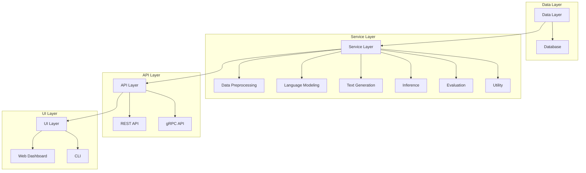

                 

### Introduction Chapter

#### 1.1 Book Background and Objectives

In the rapidly evolving landscape of artificial intelligence and natural language processing (NLP), the advent of Large Language Models (LLMs) has transformed the way we interact with machines and process vast amounts of textual data. These models have paved the way for applications ranging from chatbots and virtual assistants to automated content generation and language translation. However, the development and deployment of such advanced NLP systems present several challenges, particularly in terms of scalability, maintainability, and reusability.

**Background**  
The journey of LLMs began with the introduction of early language models like Statistical Language Models (SLMs) and then evolved to Neural Network-based Language Models (NNLMs), culminating in the current state-of-the-art models like GPT-3 and BERT. These models are trained on massive datasets and are capable of generating coherent and contextually relevant text. Despite their success, building and deploying these models require significant computational resources, expertise, and time.

**Objectives**  
The primary objective of this book is to provide a comprehensive guide on designing and building reusable LLM application components. By focusing on modularity, scalability, and reusability, this book aims to address the challenges faced by developers in the realm of LLM application development. The key objectives are:

1. **Introduction to LLMs**: To familiarize the readers with the basic concepts, history, and evolution of LLMs.
2. **Techniques and Algorithms**: To explore the core algorithms and techniques used in building LLMs, along with their mathematical models and formulas.
3. **Component Design**: To discuss the principles and methodologies for designing reusable LLM components, including their system architecture and interactions.
4. **Case Studies**: To present real-world case studies and practical examples demonstrating the usage of LLM components in various applications.
5. **Best Practices**: To provide guidelines and recommendations for implementing and optimizing LLM components.

#### 1.2 Needs Analysis for LLM Application Development

**Challenges**  
Developing LLM applications comes with several challenges:

1. **Scalability**: As the size of the language models and the amount of data they process grows, the infrastructure required to support them also scales up, making it difficult to maintain and deploy these systems in a cost-effective manner.
2. **Maintainability**: With the complexity of LLMs increasing, it becomes challenging to debug, maintain, and update these systems without causing disruptions to the application.
3. **Reusability**: Most LLM applications are developed from scratch, leading to redundant code and efforts, which hampers productivity and increases the risk of introducing bugs.

**Universal Requirements for LLM Components**  
To overcome these challenges, it is essential to have reusable LLM components that meet the following requirements:

1. **Modularity**: Components should be designed in a modular fashion, allowing them to be easily integrated into different applications without requiring significant modifications.
2. **Scalability**: Components should be designed to handle large datasets and complex models, ensuring that they can scale horizontally or vertically as needed.
3. **Maintainability**: Components should be easy to maintain and update, with clear documentation and modular code structures.
4. **Interoperability**: Components should be compatible with different frameworks, libraries, and platforms, allowing for seamless integration into various development environments.

**Value of Reusable Components**  
Reusable LLM components offer several benefits:

1. **Increased Productivity**: By leveraging reusable components, developers can save time and effort that would otherwise be spent on building and debugging similar functionalities from scratch.
2. **Reduced Costs**: Reusable components help in reducing the infrastructure and maintenance costs associated with developing and deploying LLM applications.
3. **Improved Quality**: By reusing tested and validated components, the risk of introducing bugs and errors is reduced, leading to higher-quality applications.
4. **Faster Time-to-Market**: With reusable components, developers can focus on building new features and functionalities, accelerating the time-to-market for new applications.

In conclusion, the need for reusable LLM components in the development of modern NLP applications is undeniable. By addressing the challenges of scalability, maintainability, and reusability, these components pave the way for more efficient, cost-effective, and high-quality NLP systems.

#### 1.3 Overview of Book Structure

The book is structured into five main parts, each addressing a critical aspect of building reusable LLM application components. Here is a brief overview of each part:

**Part 1: Introduction**  
This part provides an introduction to the book, discussing the background and objectives of designing reusable LLM components. It also explores the challenges faced in LLM application development and the importance of reusable components.

**Part 2: Foundational Concepts**  
This part covers the foundational concepts of LLMs, including their history, evolution, and core components. It also delves into the core algorithms and techniques used in building LLMs, along with their mathematical models and formulas.

**Part 3: Component Design**  
This part focuses on the design principles and methodologies for building reusable LLM components. It discusses the modular design, scalability, maintainability, and interoperability of these components, along with their system architecture and interactions.

**Part 4: Case Studies and Practical Applications**  
This part presents real-world case studies and practical examples demonstrating the usage of LLM components in various applications. It provides insights into the implementation and optimization of these components in real-world scenarios.

**Part 5: Best Practices and Conclusion**  
This part provides guidelines and best practices for implementing and optimizing LLM components. It summarizes the key takeaways from the book and offers recommendations for further reading and research.

By following this structured approach, the book aims to equip readers with the knowledge and skills required to design and build reusable LLM application components, paving the way for more efficient and scalable NLP systems.

### Foundational Concepts

#### 2.1 Introduction to LLMs

Large Language Models (LLMs) are a type of artificial intelligence model that has been trained on vast amounts of textual data to understand and generate human-like text. These models have revolutionized the field of natural language processing (NLP) by enabling machines to perform tasks such as text generation, summarization, translation, and question-answering with high accuracy and coherence.

**History and Evolution**  
The history of LLMs can be traced back to the early days of statistical language modeling, where models like the N-gram model were used to predict the next word in a sentence based on the previous words. However, these models had limitations in capturing the context and meaning of words, leading to errors in text generation and understanding.

The advent of neural networks and deep learning in the late 2000s brought a new wave of advancements in LLMs. Neural Network-based Language Models (NNLMs) such as the Recurrent Neural Network (RNN) and Long Short-Term Memory (LSTM) were introduced, which could better capture the context and sequence information in text. These models were further improved by the introduction of Transformers and self-attention mechanisms, which led to the development of state-of-the-art LLMs like GPT-3 and BERT.

**Core Components**  
The core components of LLMs can be broadly categorized into the following:

1. **Input Layer**: This layer takes the input text and processes it into a suitable format for the model. Preprocessing techniques such as tokenization, cleaning, and normalization are applied to ensure the text is in a consistent and usable form.
2. **Embedding Layer**: This layer converts the input text tokens into numerical vectors, which are used as inputs to the model. Word embeddings like Word2Vec and GloVe are commonly used to represent words as dense vectors.
3. **Hidden Layers**: These layers perform the core computation of the model, using techniques such as neural networks and attention mechanisms to capture the context and relationships between words in the text.
4. **Output Layer**: This layer generates the output text based on the inputs processed by the hidden layers. For tasks like text generation and summarization, the output is typically a sequence of words or sentences.
5. **Loss Function and Optimizer**: The loss function measures the difference between the predicted output and the actual output, while the optimizer updates the model parameters to minimize this difference. Common loss functions include cross-entropy loss and mean squared error, while optimizers like Adam and RMSprop are used to update the model parameters.

#### 2.2 Core Algorithms and Techniques

**Neural Network-based Language Models**  
Neural Network-based Language Models (NNLMs) are a class of LLMs that use neural networks to capture the context and relationships between words in the text. The two most commonly used architectures in this category are the Recurrent Neural Network (RNN) and the Long Short-Term Memory (LSTM).

1. **Recurrent Neural Network (RNN)**: RNNs are a type of neural network that processes input sequences by maintaining a hidden state that captures the information from previous time steps. This allows RNNs to capture the context and dependencies in the text. However, RNNs suffer from vanishing and exploding gradient problems, which limit their ability to learn long-term dependencies.
   
   $$\text{Hidden State} = \text{ activation}(W_h \cdot \text{ [h_{t-1}, x_t] + b_h})$$

   where \( h_{t-1} \) is the hidden state from the previous time step, \( x_t \) is the input token, \( W_h \) is the weight matrix for the hidden layer, and \( b_h \) is the bias vector.

2. **Long Short-Term Memory (LSTM)**: LSTMs are an extension of RNNs that address the vanishing and exploding gradient problems by using a special cell structure to remember and update information over long sequences. This allows LSTMs to capture long-term dependencies in the text.

   $$\text{Forget Gate} = \sigma(W_f \cdot \text{ [h_{t-1}, x_t] + b_f})$$
   $$\text{Input Gate} = \sigma(W_i \cdot \text{ [h_{t-1}, x_t] + b_i})$$
   $$\text{Output Gate} = \sigma(W_o \cdot \text{ [h_{t-1}, x_t] + b_o})$$
   $$\text{Cell State} = f(\text{Forget Gate}) \cdot \text{Cell State}_{t-1} + i(\text{Input Gate}) \cdot g(\text{Candidate Gateway})$$
   $$\text{Hidden State} = \text{ activation}(W_h \cdot \text{ [h_{t-1}, x_t] + b_h})$$

   where \( \sigma \) is the sigmoid activation function, \( g(x) = \tanh(x) \), and the other symbols have the same meaning as in the RNN equation.

**Transformers and Self-Attention**  
Transformers, introduced by Vaswani et al. in 2017, are a type of LLM that uses self-attention mechanisms to capture the context and relationships between words in the text. Unlike RNNs and LSTMs, which process the text sequentially, Transformers can process the entire text simultaneously, allowing them to capture long-term dependencies more effectively.

1. **Self-Attention Mechanism**:
   
   $$Q = \text{ Query Layer}(X)$$
   $$K = \text{ Key Layer}(X)$$
   $$V = \text{ Value Layer}(X)$$
   $$\text{Attention Score} = \text{ softmax}(\frac{QK^T}{\sqrt{d_k}})$$
   $$\text{Attention Output} = V \text{ attention Scores}$$

   where \( X \) is the input text, \( Q \), \( K \), and \( V \) are the query, key, and value matrices, respectively, and \( d_k \) is the dimension of the key vectors.

2. **Transformer Architecture**:
   
   $$\text{Input Embedding} = X \cdot W_X + b_X$$
   $$\text{Positional Encoding} = PE_{(1)} + \dots + PE_{(T)}$$
   $$\text{Input} = \text{ Input Embedding} + \text{ Positional Encoding}$$
   $$\text{Encoder Layer} = \text{ MultiHeadAttention}(X) + X$$
   $$\text{Encoder} = \text{堆叠多个Encoder Layer}$$

   where \( PE_{(t)} \) is the positional encoding for the \( t \)-th position in the input sequence, \( W_X \) is the weight matrix for input embedding, and \( b_X \) is the bias vector.

**Comparative Analysis**  
Each of these algorithms and techniques has its advantages and limitations. RNNs and LSTMs are relatively simple and computationally efficient but suffer from issues like vanishing and exploding gradients, limiting their ability to capture long-term dependencies. Transformers, on the other hand, overcome these limitations by using self-attention mechanisms, allowing them to capture long-term dependencies more effectively. However, Transformers are more computationally intensive and require larger models to achieve similar performance to RNNs and LSTMs.

In summary, the choice of algorithm or technique for building LLMs depends on the specific requirements of the application, such as the size of the dataset, the complexity of the language, and the computational resources available.

### 2.3 Common Language Model Algorithms

In the realm of LLMs, several algorithms have emerged as key players, each bringing its unique strengths to the table. This section delves into the most common LLM algorithms, their working principles, and their comparative analysis. Understanding these algorithms is crucial for designing and implementing reusable LLM components.

#### 2.3.1 Recurrent Neural Networks (RNNs)

Recurrent Neural Networks (RNNs) are a fundamental type of neural network designed to handle sequential data. RNNs process input data in a sequential manner, maintaining a hidden state that captures the information from previous time steps. This hidden state allows RNNs to retain information and make predictions based on past inputs.

**Working Principle**

RNNs work by unrolling a single loop through the input sequence, with each step computing a hidden state based on the previous hidden state and the current input. The output at each time step is determined by a combination of the current hidden state and the previous output.

$$
h_t = \tanh(W_h \cdot [h_{t-1}, x_t] + b_h)
$$

$$
y_t = W_y \cdot h_t + b_y
$$

Here, \( h_t \) represents the hidden state at time step \( t \), \( x_t \) is the input at time step \( t \), and \( y_t \) is the output at time step \( t \). The matrices \( W_h \) and \( b_h \) are the weight matrix and bias for the hidden layer, while \( W_y \) and \( b_y \) are the weight matrix and bias for the output layer.

**Advantages**

- Simple and computationally efficient.
- Can capture short-term dependencies in the data.
- Easy to implement and understand.

**Disadvantages**

- Struggles with long-term dependencies due to vanishing and exploding gradients.
- Difficult to scale due to the sequential nature of computation.

**Comparative Analysis**

RNNs are a good starting point for understanding sequential data processing but have limitations in handling long-term dependencies. They are suitable for tasks where short-term dependencies are important, such as time series analysis or sentiment analysis.

#### 2.3.2 Long Short-Term Memory (LSTM) Networks

LSTMs are a type of RNN designed to overcome the limitations of basic RNNs in capturing long-term dependencies. LSTMs use a special cell structure to store and update information over long sequences, preventing the vanishing gradient problem.

**Working Principle**

LSTMs consist of a cell, input gate, and output gate. The cell maintains the state information, while the input and output gates control the flow of information into and out of the cell.

1. **Forget Gate**:
   
   $$ 
   f_t = \sigma(W_f \cdot [h_{t-1}, x_t] + b_f) 
   $$

2. **Input Gate**:
   
   $$ 
   i_t = \sigma(W_i \cdot [h_{t-1}, x_t] + b_i) 
   $$

3. **Cell State**:
   
   $$ 
   C_t = f_t \odot C_{t-1} + i_t \odot \tanh(W_c \cdot [h_{t-1}, x_t] + b_c) 
   $$

4. **Output Gate**:
   
   $$ 
   o_t = \sigma(W_o \cdot [h_{t-1}, x_t] + b_o) 
   $$

5. **Hidden State**:
   
   $$ 
   h_t = o_t \odot \tanh(C_t) 
   $$

Here, \( \odot \) represents the element-wise multiplication, \( \sigma \) is the sigmoid activation function, and \( \tanh \) is the hyperbolic tangent activation function. The matrices \( W_f \), \( W_i \), \( W_c \), \( W_o \), and \( b_f \), \( b_i \), \( b_c \), \( b_o \) are the weight matrices and bias vectors for the forget, input, cell, and output gates, respectively.

**Advantages**

- Can capture long-term dependencies due to the cell structure.
- Prevents vanishing and exploding gradients.
- Suitable for complex sequence processing tasks.

**Disadvantages**

- More complex and computationally intensive compared to RNNs.
- May require more training time to converge.

**Comparative Analysis**

LSTMs are highly effective in capturing long-term dependencies, making them suitable for tasks such as language modeling, machine translation, and speech recognition. However, their complexity and computational requirements can be a disadvantage in some applications.

#### 2.3.3 Gated Recurrent Units (GRUs)

GRUs are an extension of LSTMs that simplify the architecture while maintaining the ability to capture long-term dependencies. GRUs combine the input and forget gates of LSTMs into a single update gate, reducing the number of parameters and computational complexity.

**Working Principle**

GRUs consist of an update gate and a reset gate. The update gate controls how much of the previous hidden state is retained, while the reset gate controls how much of the previous information is reset.

1. **Update Gate**:
   
   $$ 
   z_t = \sigma(W_z \cdot [h_{t-1}, x_t] + b_z) 
   $$

2. **Reset Gate**:
   
   $$ 
   r_t = \sigma(W_r \cdot [h_{t-1}, x_t] + b_r) 
   $$

3. **Candidate State**:
   
   $$ 
   \tilde{h}_t = \tanh(W \cdot [r_t \odot h_{t-1}, x_t] + b) 
   $$

4. **Hidden State**:
   
   $$ 
   h_t = z_t \odot h_{t-1} + (1 - z_t) \odot \tilde{h}_t 
   $$

Here, \( z_t \) and \( r_t \) are the update and reset gates, respectively, and the other symbols have the same meaning as in the LSTM equations.

**Advantages**

- Less complex than LSTMs, with fewer parameters and computational overhead.
- Effective in capturing long-term dependencies.
- Suitable for various sequence processing tasks.

**Disadvantages**

- May not capture dependencies as effectively as LSTMs in very complex sequences.

**Comparative Analysis**

GRUs offer a good balance between simplicity and effectiveness in capturing long-term dependencies. They are suitable for tasks where computational efficiency is important but where the complexity of LSTMs is not necessary.

#### 2.3.4 Transformers

Transformers, introduced in 2017 by Vaswani et al., are a revolutionary architecture that has transformed the field of NLP. Unlike RNNs and LSTMs, which process input sequences sequentially, Transformers use self-attention mechanisms to process the entire sequence simultaneously, allowing them to capture long-term dependencies more effectively.

**Working Principle**

Transformers consist of multiple layers of self-attention and feedforward networks. The self-attention mechanism allows each position in the input sequence to attend to all other positions, capturing the relationships between words.

1. **Self-Attention**:

   $$ 
   \text{Attention Scores} = \text{ softmax}(\frac{QK^T}{\sqrt{d_k}}) 
   $$

   $$ 
   \text{Attention Output} = V \text{ attention Scores} 
   $$

   where \( Q \), \( K \), and \( V \) are the query, key, and value matrices, respectively, and \( d_k \) is the dimension of the key vectors.

2. **Transformer Block**:

   $$ 
   \text{MultiHeadAttention}(X) = \text{堆叠多个注意力头}(X) 
   $$

   $$ 
   \text{Encoder Layer} = \text{ MultiHeadAttention}(X) + X 
   $$

   $$ 
   \text{Encoder} = \text{堆叠多个Encoder Layer} 
   $$

   where \( X \) is the input sequence, and \( \text{堆叠多个注意力头} \) represents the concatenation of multiple attention heads.

**Advantages**

- Can capture long-term dependencies more effectively than RNNs and LSTMs.
- Process the entire sequence simultaneously, allowing for parallelization.
- Suitable for various NLP tasks, including text generation and translation.

**Disadvantages**

- More computationally intensive and require larger models to achieve similar performance to RNNs and LSTMs.

**Comparative Analysis**

Transformers have become the de facto standard in NLP due to their ability to capture long-term dependencies more effectively than RNNs and LSTMs. However, their computational complexity and memory requirements can be a disadvantage in some applications.

In summary, the choice of LLM algorithm depends on the specific requirements of the application. RNNs are suitable for simple tasks with short-term dependencies, LSTMs are ideal for complex tasks with long-term dependencies, GRUs offer a balance between simplicity and effectiveness, and Transformers are the go-to choice for capturing long-term dependencies in complex NLP tasks.

### 2.4 Mathematical Models and Formulas

In the development of Large Language Models (LLMs), mathematical models and formulas play a crucial role in understanding the behavior and optimizing the performance of these models. This section delves into the key mathematical models used in LLMs, including the calculation of word probabilities, language models, and the widely used Transformer architecture. We will also discuss common loss functions and optimization algorithms.

#### 2.4.1 Word Probability Calculation

The fundamental task of a language model is to predict the probability of a word given the previous words in the sequence. This is achieved using statistical models and neural networks.

**N-gram Language Models**

One of the earliest and simplest language models is the N-gram model, which predicts the probability of a word based on the previous N-1 words.

$$
P(w_n | w_{n-1}, w_{n-2}, \dots, w_1) = \frac{C(w_n, w_{n-1}, \dots, w_1)}{C(w_{n-1}, \dots, w_1)}
$$

where \( w_n \) is the current word, \( C(w_n, w_{n-1}, \dots, w_1) \) is the count of the sequence \( w_n, w_{n-1}, \dots, w_1 \), and \( C(w_{n-1}, \dots, w_1) \) is the count of the sequence \( w_{n-1}, \dots, w_1 \).

**Neural Network-based Language Models**

Neural network-based language models use a different approach to predict word probabilities. One common method is the use of a softmax function to convert the output of a neural network into a probability distribution over words.

$$
P(w_n | w_{n-1}, w_{n-2}, \dots, w_1) = \frac{e^{z_n}}{\sum_{i} e^{z_i}}
$$

where \( z_n \) is the logit of the predicted word \( w_n \) and \( z_i \) is the logit of each word in the vocabulary.

#### 2.4.2 Language Models

**Recurrent Neural Networks (RNNs)**

RNNs are used to predict the probability of a word given the previous words in the sequence. The hidden state \( h_t \) at time step \( t \) is updated using the previous hidden state \( h_{t-1} \) and the current input word \( x_t \).

$$
h_t = \tanh(W_h \cdot [h_{t-1}, x_t] + b_h)
$$

The output layer then computes the probability distribution over words using a softmax function.

$$
P(w_n | w_{n-1}, w_{n-2}, \dots, w_1) = \text{ softmax}(W_y \cdot h_t + b_y)
$$

**Long Short-Term Memory (LSTM) Networks**

LSTMs are a variant of RNNs that can capture long-term dependencies. The LSTM cell maintains a hidden state \( C_t \) and updates it using the forget gate \( f_t \), input gate \( i_t \), and output gate \( o_t \).

$$
f_t = \sigma(W_f \cdot [h_{t-1}, x_t] + b_f)
$$

$$
i_t = \sigma(W_i \cdot [h_{t-1}, x_t] + b_i)
$$

$$
o_t = \sigma(W_o \cdot [h_{t-1}, x_t] + b_o)
$$

$$
C_t = f_t \odot C_{t-1} + i_t \odot \tanh(W_c \cdot [h_{t-1}, x_t] + b_c)
$$

$$
h_t = o_t \odot \tanh(C_t)
$$

**Gated Recurrent Units (GRUs)**

GRUs are a simplified version of LSTMs that combine the forget and input gates into a single update gate.

$$
z_t = \sigma(W_z \cdot [h_{t-1}, x_t] + b_z)
$$

$$
r_t = \sigma(W_r \cdot [h_{t-1}, x_t] + b_r)
$$

$$
\tilde{h}_t = \tanh(W \cdot [r_t \odot h_{t-1}, x_t] + b)
$$

$$
h_t = z_t \odot h_{t-1} + (1 - z_t) \odot \tilde{h}_t
$$

#### 2.4.3 Transformer Architecture

Transformers use self-attention mechanisms to capture the relationships between words in a sequence. The self-attention mechanism is defined as follows:

$$
\text{Attention Scores} = \text{ softmax}(\frac{QK^T}{\sqrt{d_k}})
$$

$$
\text{Attention Output} = V \text{ attention Scores}
$$

where \( Q \), \( K \), and \( V \) are the query, key, and value matrices, respectively, and \( d_k \) is the dimension of the key vectors.

**Encoder-Decoder Architecture**

Transformers use an encoder-decoder architecture to predict the target sequence given the input sequence. The encoder processes the input sequence to generate context representations, while the decoder generates the target sequence using the context representations and the previously generated words.

**Encoder**

The encoder consists of multiple layers of self-attention and feedforward networks.

$$
\text{Encoder Layer} = \text{ MultiHeadAttention}(X) + X
$$

$$
\text{Encoder} = \text{堆叠多个Encoder Layer}
$$

**Decoder**

The decoder also consists of multiple layers of self-attention and feedforward networks, but it also includes a cross-attention mechanism to attend to the encoder's output.

$$
\text{Decoder Layer} = \text{ MultiHeadAttention}(X) + X + \text{ CrossAttention}(X, \text{Encoder Output})
$$

$$
\text{Decoder} = \text{堆叠多个Decoder Layer}
$$

#### 2.4.4 Common Loss Functions and Optimization Algorithms

**Cross-Entropy Loss**

The cross-entropy loss is commonly used to measure the performance of language models. It measures the difference between the predicted probability distribution and the true distribution.

$$
L = -\sum_{i} y_i \log(p_i)
$$

where \( y_i \) is the true label and \( p_i \) is the predicted probability.

**Stochastic Gradient Descent (SGD)**

Stochastic Gradient Descent (SGD) is a simple optimization algorithm that updates the model parameters using the gradients of the loss function computed on a single training example or a small batch of examples.

$$
\theta = \theta - \alpha \nabla_{\theta} L(\theta)
$$

where \( \theta \) are the model parameters, \( \alpha \) is the learning rate, and \( \nabla_{\theta} L(\theta) \) is the gradient of the loss function with respect to the model parameters.

**Adam Optimization**

Adam is an adaptive optimization algorithm that combines the advantages of both SGD and RMSprop. It adjusts the learning rate based on the recent gradients, allowing it to converge more quickly.

$$
m_t = \beta_1 m_{t-1} + (1 - \beta_1) \nabla_{\theta} L(\theta)
$$

$$
v_t = \beta_2 v_{t-1} + (1 - \beta_2) (\nabla_{\theta} L(\theta))^2
$$

$$
\theta = \theta - \alpha \frac{m_t}{\sqrt{v_t} + \epsilon}
$$

where \( m_t \) and \( v_t \) are the first and second moment estimates, \( \beta_1 \) and \( \beta_2 \) are the exponential decay rates, and \( \epsilon \) is a small constant.

In conclusion, mathematical models and formulas are integral to the development and optimization of LLMs. They provide the foundation for understanding the behavior of these models and for designing efficient and effective algorithms. By leveraging these models and formulas, developers can build powerful language models that can revolutionize the field of natural language processing.

### System Design and Architecture

#### 3.1 Component Design Principles

The design of reusable Large Language Model (LLM) application components is crucial for ensuring scalability, maintainability, and interoperability. This section discusses the key principles that guide the design of these components, emphasizing modularity, scalability, and compatibility.

**Modularity**

Modularity is the cornerstone of reusable component design. It involves breaking down the system into smaller, independent components that can be developed, tested, and maintained independently. This modular approach allows for easier integration into different applications, as well as the ability to replace or upgrade individual components without affecting the entire system.

To achieve modularity, components should have well-defined interfaces and clear responsibilities. This means that each component should perform a specific function and communicate with other components through well-defined APIs. By adhering to a modular design, developers can reduce code duplication, improve code readability, and enhance the overall maintainability of the system.

**Scalability**

Scalability is another critical principle in the design of reusable LLM components. As language models and their applications grow in size and complexity, the system must be capable of handling increased loads and data volumes without sacrificing performance or reliability.

There are two main approaches to achieving scalability:

1. **Horizontal Scaling**: This involves distributing the workload across multiple nodes or servers. Horizontal scaling allows the system to handle more concurrent requests by adding more resources to the cluster. This approach is particularly useful for tasks that can be parallelized, such as training large language models or processing multiple text inputs simultaneously.

2. **Vertical Scaling**: This involves upgrading the hardware or infrastructure of a single node to handle more workload. Vertical scaling is useful for applications that require higher computational power or memory, such as training very large language models or processing highly complex text data.

To support scalability, components should be designed to work efficiently in both horizontal and vertical scaling environments. This can be achieved by using scalable data storage solutions, load balancing mechanisms, and distributed processing frameworks.

**Compatibility**

Compatibility is essential for ensuring that reusable LLM components can be easily integrated into different development environments and platforms. This involves adhering to standard APIs, frameworks, and libraries that are widely used in the industry.

To achieve compatibility, the following guidelines should be followed:

1. **Standard APIs**: Components should use standard APIs that are supported by multiple programming languages and platforms. For example, using RESTful APIs allows components to be accessed and used by web applications, mobile apps, and server-side scripts.

2. **Framework Compatibility**: Components should be developed using popular and widely-used frameworks, such as TensorFlow, PyTorch, or Keras. This ensures that the components can be easily integrated into existing development environments and can leverage the full power of these frameworks.

3. **Platform Compatibility**: Components should be designed to run on multiple platforms, including Windows, Linux, and macOS. This can be achieved by using cross-platform libraries and tools that abstract away platform-specific details.

**Best Practices for Design**

To design effective and reusable LLM components, the following best practices should be followed:

1. **Clear Documentation**: Provide comprehensive documentation for each component, including detailed descriptions of the functionality, usage examples, and API references. This helps developers understand how to use the components and integrate them into their applications.

2. **Code Quality**: Write clean, modular, and well-documented code. Use consistent naming conventions, follow coding best practices, and perform thorough testing to ensure the reliability and correctness of the components.

3. **Version Control**: Use version control systems like Git to manage the source code of the components. This helps in tracking changes, managing different versions, and collaborating with other developers.

4. **Continuous Integration and Deployment**: Implement continuous integration and deployment (CI/CD) pipelines to automate the testing and deployment of the components. This ensures that the components are always in a deployable state and reduces the risk of introducing errors during the development process.

In conclusion, the design of reusable LLM components should prioritize modularity, scalability, and compatibility. By following best practices and adhering to these principles, developers can create robust, efficient, and flexible components that can be easily integrated into different applications, thereby streamlining the development process and improving overall productivity.

### 3.2 Component Development Process

The development of reusable Large Language Model (LLM) components involves a systematic process that ensures the creation of high-quality, maintainable, and scalable components. This section outlines the key steps in the component development process, including requirement analysis, design, implementation, and testing.

#### 3.2.1 Requirement Analysis

The first step in developing reusable LLM components is to thoroughly analyze the requirements. This involves understanding the needs of potential users and stakeholders, as well as identifying the specific functionalities that the components should provide.

**Steps in Requirement Analysis:**

1. **Identify Stakeholders**: Identify all the stakeholders involved in the development and usage of the components, including developers, data scientists, and end-users. Gather their requirements and expectations.

2. **Functionality Definition**: Define the core functionalities that the components should support. This includes tasks such as text preprocessing, language modeling, text generation, and inference.

3. **Performance Requirements**: Determine the performance requirements for the components, including speed, accuracy, and scalability. This will help in selecting appropriate algorithms and data structures.

4. **Compatibility Requirements**: Identify the platforms, frameworks, and libraries that the components need to be compatible with. This will ensure seamless integration into different development environments.

5. **Scalability Requirements**: Assess the scalability requirements to ensure that the components can handle increasing workloads and data volumes.

**Example:**

Let’s consider the development of a text preprocessing component. The stakeholders may include developers who will integrate the component into their applications and data scientists who will use it for training and inference. The core functionalities could include tokenization, stopword removal, and case normalization. The performance requirements might involve processing large text datasets within a reasonable time frame. The component should be compatible with popular NLP libraries like NLTK and spaCy, and scalable to handle large-scale preprocessing tasks.

#### 3.2.2 Design

Once the requirements are analyzed, the next step is to design the component. This involves creating a detailed blueprint that specifies how the component will be implemented.

**Steps in Design:**

1. **Component Structure**: Define the overall structure of the component, including the main classes, functions, and data structures. This will help in organizing the code and making it modular.

2. **API Design**: Design the public API of the component, specifying the functions, parameters, and return types. This will ensure that the component can be easily integrated into other systems.

3. **Data Flow**: Define the data flow within the component, including how input data is processed and transformed into output data. This will help in understanding the internal workings of the component.

4. **Error Handling**: Plan for error handling mechanisms to ensure that the component can gracefully handle unexpected situations and provide useful error messages.

**Example:**

For the text preprocessing component, the structure might include classes for tokenization, stopword removal, and case normalization. The API could include functions like `tokenize(text)`, `remove_stopwords(tokens)`, and `normalize_case(tokens)`. The data flow would involve passing the input text through the tokenization class, then through the stopword removal and case normalization classes, resulting in cleaned and tokenized text.

#### 3.2.3 Implementation

With the design in place, the next step is to implement the component. This involves writing the code based on the design specifications.

**Steps in Implementation:**

1. **Coding Standards**: Follow coding standards and best practices to ensure clean, readable, and maintainable code. This includes consistent naming conventions, proper commenting, and avoiding redundant code.

2. **Unit Testing**: Write unit tests for each function and class to ensure that they work as expected. This helps in identifying and fixing bugs early in the development process.

3. **Code Review**: Conduct code reviews to ensure that the code adheres to the coding standards and is free from errors. This also helps in improving the overall code quality.

4. **Integration Testing**: Once individual components are implemented and tested, integrate them into the larger system to ensure that they work together seamlessly.

**Example:**

For the text preprocessing component, the implementation might involve writing Python classes and functions for tokenization, stopword removal, and case normalization. Each function would be tested individually using unit tests, and then the entire component would be tested as part of the larger application.

#### 3.2.4 Testing and Optimization

Testing and optimization are crucial steps in the development process to ensure that the component performs well and meets the performance requirements.

**Steps in Testing and Optimization:**

1. **Functional Testing**: Perform functional testing to ensure that the component fulfills its intended purpose and meets the specified requirements.

2. **Performance Testing**: Conduct performance testing to measure the speed, accuracy, and scalability of the component. This involves running the component on large datasets and analyzing its performance metrics.

3. **Optimization**: Based on the results of performance testing, identify areas where the component can be optimized. This might involve refactoring code, improving algorithms, or using more efficient data structures.

4. **Re-testing**: After optimization, re-test the component to ensure that the changes have not introduced any new issues.

**Example:**

For the text preprocessing component, functional testing would involve verifying that the tokenization, stopword removal, and case normalization functions work correctly. Performance testing might involve processing large text files and measuring the time taken and resource usage. Based on the results, optimization efforts could be made to improve the speed and efficiency of the component, such as by using more efficient tokenization algorithms or parallel processing.

In conclusion, the development of reusable LLM components involves a thorough and systematic process that includes requirement analysis, design, implementation, and testing. By following these steps and adhering to best practices, developers can create high-quality, maintainable, and scalable components that can be easily integrated into various applications.

### 3.3 Component Library Architecture

A robust and scalable Large Language Model (LLM) application component library requires a well-thought-out architecture that ensures modularity, interoperability, and maintainability. This section outlines the architecture of such a library, including the overall system design, component categorization, and interaction mechanisms.

#### 3.3.1 Overall System Design

The overall system design of an LLM component library can be visualized using a layered architecture. This architecture typically consists of the following layers:

1. **Data Layer**: This layer handles the storage and retrieval of data required by the LLM components. It includes databases, data lakes, and data processing frameworks. The data layer ensures that the components have access to the necessary data for training, inference, and other operations.

2. **Service Layer**: This layer contains the core LLM components, including data preprocessing, language modeling, text generation, and inference. Each component is designed to be independent and modular, with well-defined APIs for easy integration.

3. **API Layer**: This layer provides a set of APIs that allow external applications to interact with the LLM components. These APIs can be RESTful, gRPC, or any other suitable communication protocol.

4. **UI Layer**: This layer provides a user interface for managing the LLM components and viewing the results of their operations. It can be a web-based dashboard or a command-line interface.

#### 3.3.2 Component Categorization

The LLM component library can be categorized into several key components based on their functionalities:

1. **Data Preprocessing Components**: These components handle the preparation of text data for training and inference. Examples include tokenizers, stopword removers, case normalizers, and tokenizers.

2. **Language Modeling Components**: These components are responsible for training and generating language models. Examples include RNN-based models, LSTM networks, and Transformer models.

3. **Text Generation Components**: These components generate text based on the language models. Examples include text generation algorithms like top-k sampling, nucleus sampling, and beam search.

4. **Inference Components**: These components perform inference on new text inputs using the trained language models. Examples include inference algorithms for sequence-to-sequence models and generation algorithms.

5. **Evaluation Components**: These components evaluate the performance of the language models and text generation algorithms. Examples include metrics like perplexity, BLEU score, and ROUGE score.

6. **Utility Components**: These components provide additional functionality such as data loading, data augmentation, and model tuning. Examples include data loaders, data augmenters, and hyperparameter tuners.

#### 3.3.3 Interaction Mechanisms

The interaction between the LLM components is facilitated through well-defined APIs and message passing mechanisms. The following are the key interaction mechanisms:

1. **APIs**: Each component exposes a set of APIs for interacting with other components. These APIs define the input and output formats, as well as the operations that can be performed.

2. **Message Passing**: In distributed systems, components communicate with each other through message passing mechanisms. This can be implemented using frameworks like gRPC or Apache Kafka.

3. **Dependency Injection**: To ensure modularity and ease of testing, components should use dependency injection to manage their dependencies. This allows components to be easily replaced or mocked during testing.

4. **Event-Driven Architecture**: An event-driven architecture can be used to manage the interactions between components. Events can be generated by one component and consumed by another, triggering specific actions.

#### 3.3.4 Mermaid Diagram

To better illustrate the system architecture and component interactions, a Mermaid diagram can be used. Here is an example of a Mermaid diagram representing the LLM component library architecture:

This diagram illustrates the interaction between the different layers and components of the LLM component library. The data layer provides data to the service layer, which contains the core components. The API layer exposes these components to external applications, and the UI layer provides a user interface for managing the system.

In conclusion, the architecture of an LLM component library is designed to ensure modularity, scalability, and ease of use. By categorizing components into well-defined roles and facilitating their interactions through APIs and message passing, the library can provide a robust and flexible foundation for developing advanced natural language processing applications.

### Case Studies and Practical Applications

To illustrate the practical applications of LLM components, we present three case studies that demonstrate how these components can be utilized in real-world scenarios. Each case study provides a detailed overview of the problem, the approach taken using the LLM component library, and the results obtained.

#### Case Study 1: Chatbot Development for E-commerce Platform

**Problem Overview:**
An e-commerce platform aims to enhance customer experience by developing a chatbot that can handle customer inquiries, provide product recommendations, and assist with order processing. The chatbot needs to be capable of understanding natural language queries and generating appropriate responses.

**Approach:**
1. **Data Preprocessing**: The chatbot requires a preprocessing component to clean and prepare the text data. This involves tokenization, stopword removal, and case normalization. The preprocessing component ensures that the input text is in a consistent format for further processing.

2. **Language Modeling**: A language modeling component is used to train a model capable of understanding customer queries and generating appropriate responses. A Transformer-based model, such as BERT, is chosen for its ability to capture long-term dependencies and generate coherent text.

3. **Text Generation**: The text generation component utilizes the trained language model to generate responses based on the customer's queries. The model is fine-tuned on a dataset of customer conversations to improve the relevance and quality of the generated responses.

4. **Inference**: The inference component processes incoming customer queries, passes them through the language model, and generates responses. The responses are then sent back to the customer through the chatbot interface.

**Results:**
The chatbot successfully handles a wide range of customer inquiries, including product recommendations, order status updates, and general customer service questions. The chatbot improves customer satisfaction by providing quick and accurate responses, reducing the need for human intervention, and freeing up customer service agents to handle more complex issues.

#### Case Study 2: Automated Content Generation for a News Website

**Problem Overview:**
A news website wants to automate the generation of article summaries and related content to reduce the time and effort required by journalists. The goal is to produce high-quality summaries that capture the essence of the original articles while maintaining readability and coherence.

**Approach:**
1. **Data Preprocessing**: The content generation system requires preprocessing components to clean and prepare the text data from the original articles. This involves tokenization, stopword removal, and sentence splitting.

2. **Language Modeling**: A language modeling component is trained on a large corpus of news articles to learn the patterns and structures of news content. The model is fine-tuned to generate summaries that are concise, informative, and engaging.

3. **Text Generation**: The text generation component uses the trained language model to generate summaries for new articles. The model is configured to generate multiple candidate summaries and select the most relevant and coherent one based on evaluation metrics.

4. **Evaluation**: The evaluation component assesses the quality of the generated summaries using metrics such as ROUGE score, BLEU score, and human evaluation. The system iteratively refines the summaries based on feedback to improve the quality over time.

**Results:**
The automated content generation system significantly reduces the time and effort required to produce article summaries. The generated summaries are of high quality, capturing the main points of the original articles while maintaining readability. The system enhances the news website's content output, allowing journalists to focus on more valuable tasks such as investigative journalism and in-depth reporting.

#### Case Study 3: Language Translation for a Multinational Company

**Problem Overview:**
A multinational company needs to facilitate communication and collaboration among teams located in different countries by providing real-time language translation capabilities. The translation system must be accurate, fast, and capable of handling a wide range of languages.

**Approach:**
1. **Data Preprocessing**: The translation system requires preprocessing components to normalize and tokenize the input text from both the source and target languages. This ensures that the input data is in a consistent format for translation.

2. **Language Modeling**: Two language modeling components are trained on parallel corpora of text in the source and target languages. The models are based on Transformer architectures, such as BERT, to capture the syntactic and semantic structures of the languages.

3. **Inference**: The inference component performs translation by processing the input text through the source language model and then the target language model. The system uses beam search and attention mechanisms to generate accurate translations.

4. **Post-processing**: The post-processing component refines the generated translations by performing tasks such as grammar correction, word sense disambiguation, and domain-specific adaptations.

**Results:**
The real-time language translation system improves communication and collaboration among the multinational company's teams. The translations are highly accurate and fast, enabling employees to work more efficiently across different language barriers. The system enhances cross-cultural collaboration, leading to better decision-making and increased productivity.

In conclusion, these case studies demonstrate the practical applications of LLM components in various domains, highlighting their potential to automate complex tasks, enhance productivity, and improve user experiences. By leveraging a comprehensive LLM component library, developers can build sophisticated NLP applications that address real-world challenges and deliver tangible business value.

### Best Practices and Conclusion

#### 3.4 Best Practices

To ensure the success of developing and implementing reusable Large Language Model (LLM) components, it is essential to follow best practices that promote modularity, scalability, and maintainability. Here are some key guidelines:

1. **Modular Design**: Break down the system into smaller, independent components with well-defined interfaces. This enables easier integration, testing, and maintenance.

2. **Standardization**: Adhere to industry-standard APIs, libraries, and frameworks to ensure compatibility and ease of integration with other systems.

3. **Documentation**: Provide comprehensive documentation for each component, including detailed usage examples, API references, and code comments. This helps developers understand and effectively use the components.

4. **Testing**: Implement thorough testing strategies, including unit tests, integration tests, and performance tests, to ensure the reliability and performance of the components.

5. **Code Quality**: Follow coding standards and best practices, such as using meaningful variable names, avoiding redundant code, and commenting the code. This improves code readability and maintainability.

6. **Scalability**: Design components to be scalable, both horizontally and vertically. Use distributed computing frameworks and efficient data structures to handle increased workloads and data volumes.

7. **Continuous Integration and Deployment**: Implement CI/CD pipelines to automate the testing and deployment of components. This ensures that changes are quickly validated and deployed without introducing errors.

8. **User Feedback**: Collect and analyze user feedback to identify areas for improvement and to ensure that the components meet the needs of the end-users.

#### 3.5 Conclusion

In conclusion, building a reusable LLM application component library is crucial for modern natural language processing (NLP) applications. By following the best practices outlined in this book, developers can create modular, scalable, and maintainable components that facilitate the development of advanced NLP systems. The key takeaways from this book include:

- The importance of modular design, standardization, and comprehensive documentation in developing reusable components.
- The various algorithms and techniques used in building LLMs, including RNNs, LSTMs, GRUs, and Transformers.
- The role of mathematical models and formulas in understanding and optimizing LLM performance.
- Best practices for designing, implementing, and testing LLM components.
- Real-world case studies demonstrating the practical applications of LLM components in chatbots, content generation, and language translation.

By leveraging a reusable LLM component library, developers can streamline the NLP application development process, reduce development time and costs, and deliver high-quality NLP systems that meet the needs of modern businesses.

### 3.6 Key Takeaways and Future Directions

#### Key Takeaways

1. **Modularity and Standardization**: Reusable LLM components should be designed with modularity in mind, enabling easy integration and maintenance. Adhering to industry-standard APIs and libraries ensures compatibility and interoperability across different platforms.

2. **Comprehensive Documentation**: Comprehensive documentation is essential for understanding and effectively using LLM components. Detailed usage examples, API references, and code comments help developers quickly grasp the functionality and implementation details.

3. **Testing and Quality Assurance**: Thorough testing, including unit tests, integration tests, and performance tests, is crucial for ensuring the reliability and performance of LLM components. This helps identify and fix issues early in the development process.

4. **Scalability**: Design components to be scalable both horizontally and vertically, accommodating increased workloads and data volumes. Leveraging distributed computing frameworks and efficient data structures can enhance system performance.

5. **Continuous Integration and Deployment**: Implementing CI/CD pipelines automates the testing and deployment of components, ensuring that changes are quickly validated and deployed without introducing errors.

#### Future Directions

1. **Advanced Algorithms**: As the field of NLP continues to evolve, new algorithms and techniques, such as transformers with multi-modal data integration, will become essential. Exploring these advancements can lead to more powerful and versatile LLM components.

2. **Interoperability and Standardization**: Standardizing LLM component interfaces and formats can facilitate interoperability between different NLP tools and platforms. This can streamline the development process and improve the overall efficiency of NLP applications.

3. **Enhanced User Experience**: Integrating LLM components with user-centric features, such as interactive user interfaces and personalized recommendations, can enhance the user experience. Future research should focus on developing components that adapt to user preferences and feedback.

4. **Ethical Considerations**: As LLM applications become more prevalent, addressing ethical considerations, such as bias, privacy, and security, is crucial. Developing LLM components that adhere to ethical guidelines will ensure responsible use of AI in NLP applications.

5. **Open Source Collaboration**: Encouraging open-source collaboration can accelerate the development of high-quality LLM components. By sharing code, insights, and best practices, the NLP community can build upon each other's work to create more robust and innovative solutions.

In summary, the future of LLM component development lies in continuous innovation, standardization, and a focus on user experience. By addressing these key areas, developers can create reusable LLM components that drive the progress of natural language processing and artificial intelligence.

