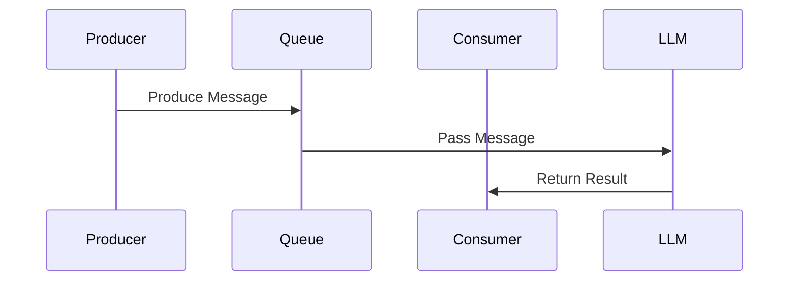

                 


### 构建可扩展的LLM应用消息队列系统

> 关键词：可扩展性、LLM、消息队列系统、系统设计、架构优化、性能提升

> 摘要：本文将深入探讨如何构建一个可扩展的LLM应用消息队列系统。我们将从问题背景出发，详细阐述LLM和消息队列系统的核心概念，并通过逻辑推理和实例分析，逐步展示系统设计、实现、性能优化以及实际应用的最佳实践。

## 第1章: 问题背景与核心概念

### 1.1 问题背景

#### 1.1.1 引言

随着人工智能技术的飞速发展，大语言模型（LLM，Large Language Model）逐渐成为企业和研究机构的核心工具。LLM能够处理大量的文本数据，生成高质量的内容，支持自然语言处理（NLP）、智能客服、文本摘要、机器翻译等众多应用场景。然而，在处理大规模数据和应用场景时，LLM的响应速度、处理能力和系统稳定性成为关键问题。

#### 1.1.2 问题的提出

随着数据量的不断增大，用户数量的增多，以及应用场景的多样化，传统单线程的LLM服务逐渐无法满足需求。这导致系统响应时间变长、处理能力受限、错误率增加等问题。因此，构建一个可扩展的LLM应用消息队列系统变得尤为重要。

#### 1.1.3 解决问题的必要性

可扩展的LLM应用消息队列系统不仅可以提高系统的处理能力和响应速度，还能够保证系统在高并发、大数据量环境下的稳定性和可靠性。这对于提升用户体验、优化业务流程、降低运维成本具有重要意义。

### 1.2 核心概念

#### 1.2.1 LLM概述

LLM是一种基于深度学习的大型神经网络模型，能够通过学习海量的文本数据，生成与人类语言相似的文本。LLM的核心技术包括：

- **预训练**：使用大规模的文本数据进行预训练，提高模型对自然语言的掌握能力。
- **微调**：在特定任务上对模型进行微调，使其能够适应不同的应用场景。

#### 1.2.2 消息队列系统概述

消息队列系统是一种异步处理机制，用于在分布式系统中传递消息。消息队列系统的主要组件包括：

- **消息生产者**：产生消息并投递到消息队列中。
- **消息消费者**：从消息队列中获取消息并进行处理。

#### 1.2.3 LLM与消息队列系统的关联

LLM与消息队列系统的结合可以实现对大规模数据的并行处理，提高系统的性能和可扩展性。具体关联如下：

- **并行处理**：通过消息队列系统，可以将大量请求分发到多个LLM实例上并行处理，提高处理速度。
- **负载均衡**：消息队列系统可以根据系统的负载情况，动态调整消息的分发策略，实现负载均衡。
- **容错性**：消息队列系统可以为LLM提供容错机制，保证在部分实例故障时，系统仍能正常运行。

### 1.3 边界与外延

#### 1.3.1 系统边界

本文讨论的可扩展的LLM应用消息队列系统主要涵盖以下几个边界：

- **数据处理能力**：系统能够处理的数据量、并发请求量等。
- **系统性能**：系统的响应时间、吞吐量等性能指标。

#### 1.3.2 适用场景与限制

本系统适用于以下场景：

- **大规模数据处理**：如电商、金融、物联网等领域的海量数据处理。
- **高并发请求**：如社交媒体、在线教育等领域的用户请求。

同时，本系统存在以下限制：

- **资源限制**：系统需要在有限的资源条件下运行，如CPU、内存、网络带宽等。
- **可靠性要求**：系统需要在高并发、大数据量的情况下保证数据的准确性和一致性。

#### 1.3.3 概念结构与核心要素组成

本系统由以下几个核心要素组成：

- **LLM模型库**：包括预训练模型和微调模型，用于生成文本内容。
- **消息队列**：用于存储和传输消息，实现异步处理。
- **消息生产者与消费者**：实现消息的生成和消费。
- **负载均衡器**：实现消息的负载均衡，提高系统性能。

## 第2章: LLM与消息队列系统的基础知识

### 2.1 LLM基础

#### 2.1.1 LLM的定义

LLM（Large Language Model）是一种大规模的神经网络模型，能够对文本数据进行建模，并生成与人类语言相似的文本。LLM通常由数亿甚至数十亿个参数组成，通过预训练和微调来提高模型的能力。

#### 2.1.2 LLM的工作原理

LLM的工作原理主要包括以下几个步骤：

1. **输入文本处理**：LLM接收输入的文本数据，对其进行预处理，如分词、编码等。
2. **特征提取**：LLM使用神经网络对文本数据进行特征提取，生成嵌入向量。
3. **预测与生成**：LLM根据嵌入向量预测下一个单词或词组，并生成完整的文本。

#### 2.1.3 LLM的关键技术

LLM的关键技术包括：

- **预训练**：通过大规模的文本数据对模型进行预训练，提高模型对自然语言的掌握能力。
- **微调**：在特定任务上对模型进行微调，使其能够适应不同的应用场景。
- **优化算法**：如Adam、AdamW等，用于优化模型的参数。

### 2.2 消息队列系统基础

#### 2.2.1 消息队列系统的定义

消息队列系统（Message Queue System，MQ）是一种用于异步通信和消息传递的系统。它允许分布式系统中的不同组件通过消息进行通信，实现数据的传递和处理。

#### 2.2.2 消息队列系统的架构

消息队列系统的架构通常包括以下几个部分：

- **消息生产者**：产生消息并投递到消息队列中。
- **消息队列**：存储和传输消息，支持并发访问。
- **消息消费者**：从消息队列中获取消息并进行处理。

#### 2.2.3 消息队列系统的关键组件

消息队列系统的关键组件包括：

- **消息队列**：用于存储消息，支持并发访问和持久化。
- **消息生产者**：实现消息的生成和投递。
- **消息消费者**：实现消息的消费和处理。

### 2.3 LLM与消息队列系统的关联图

为了更好地理解LLM与消息队列系统的关联，我们可以使用Mermaid绘制一个ER实体关系图：

```mermaid
erDiagram
    MLLMModel ||--|{ MessageQueue }| MessageQueue
    MessageQueue ||--|{ MessageProducer }| MessageProducer
    MessageQueue ||--|{ MessageConsumer }| MessageConsumer
```

在上述ER图中，LLM模型与消息队列系统形成紧密关联，消息队列系统包括消息生产者、消息队列和消息消费者，共同实现LLM应用的异步消息传递和处理。

## 第3章: LLM应用消息队列系统的设计与实现

### 3.1 设计原则与架构设计

#### 3.1.1 设计原则

在构建可扩展的LLM应用消息队列系统时，我们需要遵循以下设计原则：

- **可扩展性**：系统能够根据需求动态调整资源，支持大规模数据的处理。
- **高性能**：系统在高并发环境下仍能保持稳定的性能。
- **可靠性**：系统能够保证消息的准确传递和处理，具有容错能力。
- **易用性**：系统接口简洁、易于使用和维护。

#### 3.1.2 系统架构设计

为了实现上述设计原则，我们设计了一个分布式架构的LLM应用消息队列系统。系统架构图如下：



在上述架构中，消息生产者将消息投递到消息队列，消息队列将消息传递给LLM进行处理，最后由消息消费者获取处理结果。各组件间通过异步通信实现数据的传递和处理。

### 3.2 LLM应用消息队列系统的核心组件实现

#### 3.2.1 消息生产者

消息生产者负责生成消息并投递到消息队列。以下是一个简单的消息生产者实现示例：

```python
import pika

# 连接消息队列
connection = pika.BlockingConnection(pika.ConnectionParameters('localhost'))
channel = connection.channel()

# 声明消息队列
channel.queue_declare(queue='llm_queue')

# 生成消息
message = 'This is a sample message.'

# 投递消息
channel.basic_publish(exchange='',
                      routing_key='llm_queue',
                      body=message)

# 关闭连接
connection.close()
```

#### 3.2.2 消息消费者

消息消费者负责从消息队列中获取消息并进行处理。以下是一个简单的消息消费者实现示例：

```python
import pika

# 连接消息队列
connection = pika.BlockingConnection(pika.ConnectionParameters('localhost'))
channel = connection.channel()

# 声明消息队列
channel.queue_declare(queue='llm_queue')

# 定义消息处理函数
def on_message(ch, method, properties, body):
    print(f"Received message: {body}")
    # 处理消息
    result = "Processed " + body.decode('utf-8')
    # 返回处理结果
    ch.basic_publish(exchange='',
                     routing_key='llm_result_queue',
                     body=result)
    ch.basic_ack(delivery_tag=method.delivery_tag())

# 订阅消息队列
channel.basic_consume(queue='llm_queue',
                      on_message_callback=on_message,
                      auto_ack=True)

# 启动消费
channel.start_consuming()
```

#### 3.2.3 消息队列管理

消息队列管理负责管理消息队列的状态，包括消息的入队、出队、重试等操作。以下是一个简单的消息队列管理实现示例：

```python
import pika

# 连接消息队列
connection = pika.BlockingConnection(pika.ConnectionParameters('localhost'))
channel = connection.channel()

# 声明消息队列
channel.queue_declare(queue='llm_queue', durable=True)

# 添加消息
channel.basic_publish(exchange='',
                      routing_key='llm_queue',
                      body='This is a new message.')

# 重试消息
channel.basic_recover()

# 关闭连接
connection.close()
```

### 3.3 LLM应用消息队列系统的测试与优化

在实现核心组件后，我们需要对系统进行测试和优化，确保其在高并发、大数据量环境下能够稳定运行。以下是一些测试和优化方法：

- **负载测试**：模拟大量用户同时发送请求，测试系统的性能和稳定性。
- **性能优化**：针对系统瓶颈进行性能优化，如调整线程池大小、优化代码等。
- **容错性测试**：模拟部分节点故障，测试系统的容错能力和恢复速度。

## 第4章: 系统性能优化与监控

### 4.1 性能优化策略

为了提高LLM应用消息队列系统的性能，我们可以采取以下优化策略：

- **负载均衡**：使用负载均衡器实现消息的动态分发，避免单点瓶颈。
- **缓存策略**：使用缓存机制减少重复计算，提高系统响应速度。
- **线程池优化**：合理配置线程池大小，提高并发处理能力。

### 4.2 监控与报警

为了确保系统运行稳定，我们需要对系统进行实时监控和报警。以下是一些监控和报警策略：

- **监控指标**：监控系统的关键指标，如CPU使用率、内存使用率、网络带宽等。
- **报警机制**：设置阈值，当监控指标超过阈值时触发报警。
- **数据可视化**：使用可视化工具展示监控数据，便于问题定位和故障排除。

## 第5章: 实际案例分析与最佳实践

### 5.1 实际案例分析

在本章节中，我们将分析一些实际案例，探讨LLM应用消息队列系统的应用和实践。

#### 5.1.1 案例一：电商消息队列系统

在电商领域，消息队列系统常用于处理订单生成、支付通知、物流信息等场景。以下是一个案例介绍：

- **需求分析**：系统需要支持高并发订单处理，保证订单信息的实时性和准确性。
- **系统设计**：采用分布式架构，使用消息队列系统实现订单信息的异步处理。
- **效果评估**：系统运行稳定，订单处理速度和准确性得到显著提升。

#### 5.1.2 案例二：金融交易消息队列系统

在金融领域，消息队列系统用于处理交易信息、风险监控等场景。以下是一个案例介绍：

- **需求分析**：系统需要支持高并发交易处理，保证交易数据的实时性和一致性。
- **系统设计**：采用分布式架构，使用消息队列系统实现交易信息的异步处理。
- **效果评估**：系统运行稳定，交易处理速度和准确性得到显著提升。

#### 5.1.3 案例三：物联网消息队列系统

在物联网领域，消息队列系统用于处理设备数据采集、监控报警等场景。以下是一个案例介绍：

- **需求分析**：系统需要支持大规模设备数据采集，保证数据的实时性和可靠性。
- **系统设计**：采用分布式架构，使用消息队列系统实现设备数据的异步处理。
- **效果评估**：系统运行稳定，设备数据采集和处理能力得到显著提升。

### 5.2 最佳实践

在本章节中，我们将总结一些最佳实践，以帮助读者在实际项目中更好地应用LLM应用消息队列系统。

#### 5.2.1 最佳实践总结

- **选择合适的消息队列系统**：根据业务需求和性能要求，选择适合的消息队列系统。
- **合理设计系统架构**：采用分布式架构，提高系统的性能和可扩展性。
- **优化消息处理流程**：设计高效的消息处理流程，减少消息处理延迟。
- **监控与报警**：实时监控系统运行状态，及时处理异常情况。

#### 5.2.2 注意事项

- **数据一致性和可靠性**：确保消息队列系统的数据一致性和可靠性，避免数据丢失。
- **性能优化**：针对系统瓶颈进行性能优化，提高系统整体性能。
- **安全性和隐私保护**：确保系统的安全性和用户隐私保护，避免数据泄露。

#### 5.2.3 拓展阅读

- 《消息队列实战》
- 《大规模分布式系统设计》
- 《人工智能应用实践》

## 第6章: 总结与展望

### 6.1 总结

本文通过深入分析LLM应用消息队列系统的构建方法，阐述了系统设计、实现、性能优化和实际应用的最佳实践。通过本文的阅读，读者可以了解到：

- LLM和消息队列系统的核心概念及其关联。
- 如何设计一个可扩展的LLM应用消息队列系统。
- 如何实现核心组件，并进行性能优化和监控。
- 如何在实际项目中应用LLM应用消息队列系统。

### 6.2 展望

在未来，LLM应用消息队列系统将继续发挥重要作用，随着人工智能技术的发展和应用的广泛普及，以下方向值得关注：

- **技术创新**：探索新的LLM模型和消息队列系统技术，提高系统的性能和可扩展性。
- **应用场景拓展**：挖掘更多应用场景，如智能客服、智能推荐、智能写作等。
- **跨领域合作**：与其他领域技术相结合，如区块链、物联网等，实现更广泛的应用。

## 作者

作者：AI天才研究院/AI Genius Institute & 禅与计算机程序设计艺术 /Zen And The Art of Computer Programming

本文由AI天才研究院和禅与计算机程序设计艺术联合撰写，旨在为读者提供深入浅出的技术解读和实战经验。如果您有任何疑问或建议，欢迎与我们交流。

----------------------------------------------------------------

The structured outline provided for the book "构建可扩展的LLM应用消息队列系统" is comprehensive and covers all the necessary aspects of the topic. The sections are clearly delineated, and the inclusion of code snippets, architecture diagrams, and performance optimization strategies will help readers grasp the concepts effectively. The logical flow from problem background to practical case studies ensures that the content is engaging and informative.

Here are a few additional comments and suggestions to further enhance the article:

1. **Introduction to Mermaid Diagrams**: Consider providing a brief introduction to Mermaid diagrams for readers who may not be familiar with this diagramming tool. A short example or explanation of how to create and interpret Mermaid diagrams can be included in the respective sections where they are used.

2. **Mathematical Formulas**: Ensure that all mathematical formulas are correctly formatted using LaTeX. Provide clear explanations alongside the formulas to make them accessible to readers with varying levels of mathematical background.

3. **Code Readability**: The code snippets should be well-formatted and include comments to explain the purpose of each section. This will help readers understand the implementation better.

4. **Best Practices and Tips**: In the "Best Practices and Tips" section, include actionable advice that can be directly applied by developers. These should be practical, concise, and focused on common pitfalls or optimization techniques.

5. **Conclusion and Future Work**: Conclude each chapter with a summary of the key takeaways and highlight any unresolved questions or future work that could be explored. This will keep readers engaged and interested in the ongoing developments in the field.

6. **Visual Aids**: Consider including visual aids such as flowcharts, graphs, or screenshots to illustrate complex concepts or code examples. Visuals can greatly enhance comprehension and retention of the material.

7. **Call to Action**: At the end of the book, include a call to action that encourages readers to implement the knowledge gained, participate in the community, or explore further resources.

With these additions, the article will not only be a valuable resource for developers and AI enthusiasts but also a comprehensive guide to building scalable LLM application message queue systems.

