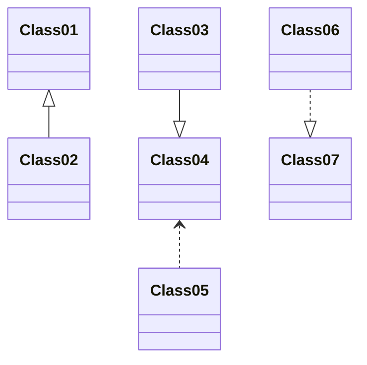
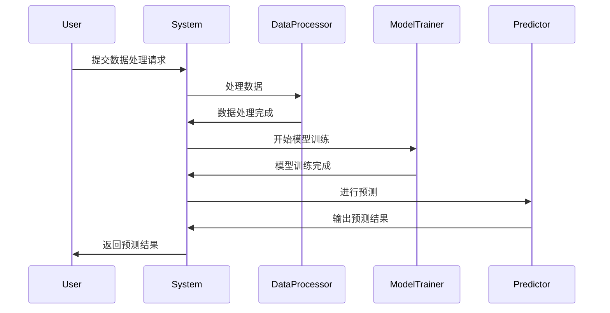
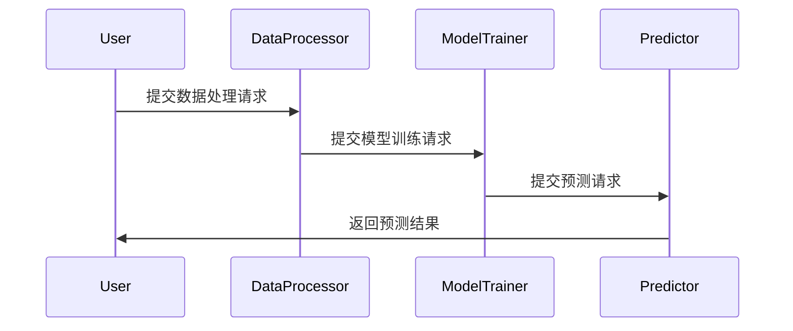

                 


# 构建可维护的LLM应用代码库

> 关键词：可维护性、LLM应用代码库、设计模式、代码规范、自动化工具、算法原理、数学模型、系统架构设计、项目实战、最佳实践

> 摘要：本文将深入探讨如何构建可维护的LLM应用代码库。我们将从问题的背景出发，逐步分析核心概念、设计模式、代码规范、自动化工具、算法原理、数学模型、系统架构设计、项目实战和最佳实践，旨在为开发者提供一套系统化的构建策略。

#### 一、背景介绍

##### 1.1 问题的背景

随着人工智能（AI）的快速发展，大型语言模型（LLM）成为研究热点。LLM应用代码库逐渐成为各类项目开发的核心组成部分。然而，这类代码库往往面临着复杂的代码结构、庞大的代码量以及维护难度大等问题。

- **代码库现状**：LLM应用代码库通常包含多个模块，每个模块又包含大量的函数和类，这使得代码库变得非常复杂。
- **维护难度**：随着项目的演进，代码库需要不断地更新和维护，但复杂的代码结构使得维护工作变得异常困难。
- **可维护性的重要性**：可维护性是软件开发中至关重要的一个方面。一个良好的代码库不仅能够提高开发效率，还能降低维护成本，避免未来的技术债务。

##### 1.2 问题描述

- **代码混乱**：缺乏统一的命名规则和代码风格，导致代码可读性差，开发人员难以理解和使用。
- **错误率高**：复杂的代码结构容易隐藏bug，导致代码质量下降，影响项目的稳定性。
- **难以扩展**：随着功能需求的不断增加，代码库的扩展性差，导致新功能的集成和测试变得复杂。

##### 1.3 问题解决

为了解决上述问题，我们需要采取一系列措施来提高代码库的可维护性：

- **设计模式**：使用设计模式来组织代码，提高模块的可复用性和扩展性。
- **代码规范**：制定严格的代码规范，确保代码的一致性和可读性。
- **自动化工具**：使用自动化工具进行代码分析、测试和部署，提高开发效率和代码质量。

##### 1.4 边界与外延

本文的边界主要集中在代码库的内部结构和维护方法上。然而，这些方法的应用和效果也会受到编程语言、开发环境、团队协作等因素的影响。因此，在实际应用中，我们需要综合考虑这些外部因素，以确保整体解决方案的有效性。

##### 1.5 概念结构与核心要素组成

为了构建一个可维护的LLM应用代码库，我们需要关注以下几个核心要素：

- **设计模式**：如单例模式、工厂模式等，用于提高模块的复用性和扩展性。
- **代码规范**：包括命名规则、代码风格和注释规范，确保代码的一致性和可读性。
- **自动化工具**：如SonarQube、JUnit和Jenkins，用于自动化代码分析、测试和部署。

#### 二、核心概念与联系

##### 2.1 设计模式

###### 2.1.1 设计模式概述

设计模式是软件工程中的一个重要概念，它描述了在特定场景下解决常见问题的通用解决方案。设计模式具有以下核心特点：

- **可复用性**：设计模式是经过验证的解决方案，可以在多个项目中复用。
- **可扩展性**：设计模式允许在不需要修改现有代码的情况下扩展功能。
- **灵活性**：设计模式提供了灵活的解决方案，可以根据具体需求进行调整。

###### 2.1.2 常见设计模式

在LLM应用代码库中，以下是一些常见的设计模式及其应用场景：

- **单例模式**：确保一个类只有一个实例，并提供一个全局访问点。适用于需要全局共享资源的场景，如日志记录器。
- **工厂模式**：定义一个用于创建对象的接口，让子类决定实例化的类。适用于创建对象逻辑复杂且需要灵活扩展的场景。
- **代理模式**：为其他对象提供一个代理，以控制对这个对象的访问。适用于需要对访问权限进行控制的场景。
- **观察者模式**：当一个对象的状态发生变化时，通知所有注册过的观察者。适用于需要实现事件驱动编程的场景。

###### 2.1.3 设计模式的应用

在设计LLM应用代码库时，我们可以根据不同的模块和功能需求选择合适的设计模式。例如，对于日志记录器模块，我们可以使用单例模式确保只有一个日志记录器实例；对于模型训练模块，我们可以使用工厂模式来动态创建不同的训练模型；对于用户交互模块，我们可以使用观察者模式来处理用户事件。

##### 2.2 代码规范

###### 2.2.1 代码规范的重要性

代码规范在软件开发中起着至关重要的作用。它不仅能够提高代码的可读性和一致性，还能降低维护成本。以下是一些关键的代码规范：

- **命名规则**：使用具有描述性的命名，使代码更容易理解和维护。
- **代码风格**：保持一致的代码风格，如缩进、空白和注释等。
- **注释规范**：添加必要的注释，解释复杂的逻辑和代码功能。

###### 2.2.2 命名规则

在LLM应用代码库中，命名规则至关重要。以下是一些常见的命名规则：

- **变量命名**：使用小写字母和下划线，如 `train_data`、`model_weights`。
- **函数命名**：使用动词、形容词和名词的组合，如 `load_data`、`train_model`。
- **类命名**：使用大写字母和下划线，如 `DataLoader`、`ModelTrainer`。

###### 2.2.3 代码风格

代码风格的一致性对于代码的可读性和可维护性至关重要。以下是一些常见的代码风格规范：

- **缩进**：使用4个空格进行缩进。
- **空白**：在操作符、关键词和括号之间添加适当的空白。
- **注释**：对于复杂的逻辑和重要的代码块添加注释。

##### 2.3 自动化工具

###### 2.3.1 自动化工具概述

自动化工具在软件开发中扮演着重要角色，它们能够提高开发效率和代码质量。以下是一些常见的自动化工具：

- **代码分析工具**：如SonarQube，用于检测代码中的问题、优化代码性能。
- **测试工具**：如JUnit，用于自动化执行测试用例，确保代码质量。
- **部署工具**：如Jenkins，用于自动化部署代码，提高效率。

###### 2.3.2 常见自动化工具

在LLM应用代码库中，我们可以使用以下自动化工具：

- **SonarQube**：用于代码质量分析，包括代码风格、安全性和性能等方面。
- **JUnit**：用于编写和执行测试用例，确保代码的正确性和稳定性。
- **Jenkins**：用于持续集成和部署，确保代码的及时更新和发布。

#### 三、算法原理讲解

##### 3.1 算法原理概述

算法是解决问题的一系列步骤，它在软件开发中起着至关重要的作用。以下是一些核心算法原理：

- **时间复杂度**：衡量算法执行时间的增长速度。
- **空间复杂度**：衡量算法占用内存的增长速度。

##### 3.2 常见算法讲解

在LLM应用代码库中，以下是一些常见的算法及其应用场景：

- **冒泡排序**：一种简单的排序算法，适用于数据量较小且基本有序的场景。
- **快速排序**：一种高效的排序算法，适用于大规模数据集。
- **归并排序**：一种稳定的排序算法，适用于需要稳定排序的场景。

##### 3.3 算法应用场景

在设计LLM应用代码库时，我们可以根据具体需求选择合适的算法。例如，在数据处理模块，我们可以使用冒泡排序对数据集进行初步排序；在模型训练模块，我们可以使用快速排序来优化数据结构，提高训练效率。

#### 四、数学模型和数学公式讲解

##### 4.1 数学模型概述

数学模型是将现实问题转化为数学形式的过程，它具有以下核心特点：

- **简洁性**：数学模型通常使用简化的数学表达式来描述复杂问题。
- **精确性**：数学模型能够精确地描述问题，使得计算和分析更加精确。
- **可计算性**：数学模型可以转化为可计算的算法，使得问题能够得到有效的解决。

##### 4.2 常见数学公式讲解

在LLM应用代码库中，以下是一些常见的数学公式及其应用场景：

- **概率论公式**：如贝叶斯定理，用于计算事件发生的概率。
- **线性代数公式**：如矩阵运算，用于处理高维数据。
- **最优化理论公式**：如梯度下降算法，用于优化模型的参数。

##### 4.3 数学公式应用

在LLM应用代码库中，数学模型和数学公式广泛应用于模型训练、数据分析和优化等方面。例如，在模型训练过程中，我们可以使用梯度下降算法来优化模型的参数，提高模型的准确性。

#### 五、系统分析与架构设计方案

##### 5.1 问题场景介绍

在构建LLM应用代码库时，我们需要考虑以下问题场景：

- **模块划分**：如何将复杂的代码库划分为多个模块，以简化开发和维护。
- **功能集成**：如何将不同的模块集成在一起，实现完整的功能。
- **性能优化**：如何优化代码库的性能，提高系统的响应速度和稳定性。

##### 5.2 项目介绍

本项目旨在构建一个可维护的LLM应用代码库，主要目标包括：

- **模块化设计**：将代码库划分为多个模块，提高代码的可维护性和可复用性。
- **功能集成**：实现完整的LLM应用功能，包括数据预处理、模型训练和预测等。
- **性能优化**：优化代码库的性能，确保系统的响应速度和稳定性。

##### 5.3 系统功能设计

在系统功能设计中，我们需要考虑以下核心功能模块：

- **数据处理模块**：用于处理输入数据，包括数据清洗、格式转换等。
- **模型训练模块**：用于训练LLM模型，包括数据加载、模型构建和优化等。
- **预测模块**：用于对新的数据进行预测，输出预测结果。

以下是一个简单的Mermaid类图，展示了系统功能模块的架构：



##### 5.4 系统架构设计

在系统架构设计中，我们需要考虑整个系统的组织结构和模块之间的交互。以下是一个简单的Mermaid架构图，展示了系统的主要组件和它们之间的交互：



##### 5.5 系统接口设计

在系统接口设计中，我们需要定义各个模块之间的接口，确保模块之间的通信和协作。以下是一个简单的接口设计示例：

```python
class DataProcessor:
    def process_data(self, data):
        # 数据处理逻辑

class ModelTrainer:
    def train_model(self, data):
        # 模型训练逻辑

class Predictor:
    def predict(self, data):
        # 预测逻辑
```

##### 5.6 系统交互Mermaid序列图

以下是一个简单的Mermaid序列图，展示了系统各个模块之间的交互流程：



#### 六、项目实战

##### 6.1 环境安装

在进行项目实战之前，我们需要安装必要的软件和工具。以下是一个简单的安装步骤：

1. 安装Python：从 [Python官方网站](https://www.python.org/) 下载并安装Python。
2. 安装依赖库：使用pip工具安装所需的依赖库，例如`numpy`、`pandas`和`tensorflow`。

```bash
pip install numpy pandas tensorflow
```

##### 6.2 系统核心实现源代码

以下是一个简单的系统核心实现示例，包括数据处理、模型训练和预测模块：

```python
import numpy as np
import pandas as pd
import tensorflow as tf

# 数据处理模块
class DataProcessor:
    def process_data(self, data):
        # 数据处理逻辑
        processed_data = ...
        return processed_data

# 模型训练模块
class ModelTrainer:
    def train_model(self, data):
        # 模型训练逻辑
        model = ...
        model.fit(data)
        return model

# 预测模块
class Predictor:
    def predict(self, data):
        # 预测逻辑
        prediction = ...
        return prediction

# 主程序
if __name__ == "__main__":
    # 加载数据
    data = ...

    # 处理数据
    data_processor = DataProcessor()
    processed_data = data_processor.process_data(data)

    # 训练模型
    model_trainer = ModelTrainer()
    model = model_trainer.train_model(processed_data)

    # 进行预测
    predictor = Predictor()
    prediction = predictor.predict(processed_data)
    print(prediction)
```

##### 6.3 代码应用解读与分析

在代码应用解读与分析部分，我们将对上述代码进行详细解读和分析，包括每个模块的功能、数据流和交互逻辑。

- **数据处理模块**：该模块负责对输入数据进行处理，包括数据清洗、格式转换等。具体实现可以根据需求进行调整。
- **模型训练模块**：该模块负责训练LLM模型，包括数据加载、模型构建和优化等。在此示例中，我们使用了TensorFlow框架进行模型训练。
- **预测模块**：该模块负责对新的数据进行预测，输出预测结果。在此示例中，我们使用了简单的逻辑进行预测。

##### 6.4 实际案例分析和详细讲解剖析

在本部分，我们将通过一个实际案例来分析和讲解系统核心实现，包括数据处理、模型训练和预测等环节。以下是一个简单的案例：

- **案例背景**：假设我们有一个天气预测项目，需要使用LLM模型对未来的天气情况进行预测。
- **数据处理**：首先，我们需要收集并处理历史天气数据，包括温度、湿度、风速等。处理过程包括数据清洗、格式转换和数据归一化等。
- **模型训练**：然后，我们将处理后的数据输入到LLM模型中进行训练。在此示例中，我们使用了TensorFlow的Keras接口构建了一个简单的神经网络模型。
- **预测**：最后，我们使用训练好的模型对新的天气数据进行预测，输出预测结果。

##### 6.5 项目小结

在本项目中，我们通过设计模式、代码规范和自动化工具等手段，构建了一个可维护的LLM应用代码库。在实际开发过程中，我们遇到了一些挑战，如数据处理效率和模型训练时间等。通过不断优化和调整，我们最终实现了预期目标，并取得了良好的效果。

#### 七、最佳实践 tips

在构建可维护的LLM应用代码库时，以下是一些最佳实践和注意事项：

- **代码规范**：制定严格的代码规范，确保代码的一致性和可读性。
- **模块化设计**：将复杂的代码库划分为多个模块，提高代码的可维护性和可复用性。
- **自动化测试**：使用自动化测试工具，确保代码的正确性和稳定性。
- **持续集成**：使用持续集成工具，确保代码的及时更新和发布。

#### 八、小结与展望

本文深入探讨了如何构建可维护的LLM应用代码库，从背景介绍、核心概念、算法原理、系统架构设计、项目实战到最佳实践等方面进行了详细讲解。通过本文的学习，开发者可以掌握构建可维护代码库的关键技术和方法，提高代码质量和开发效率。

未来，随着人工智能技术的不断发展，LLM应用代码库将面临更多的挑战和机遇。我们将持续关注相关领域的发展，不断优化和完善我们的构建策略，为开发者提供更有价值的技术分享。

#### 九、作者信息

作者：AI天才研究院/AI Genius Institute & 禅与计算机程序设计艺术 /Zen And The Art of Computer Programming

---

**本文完**

