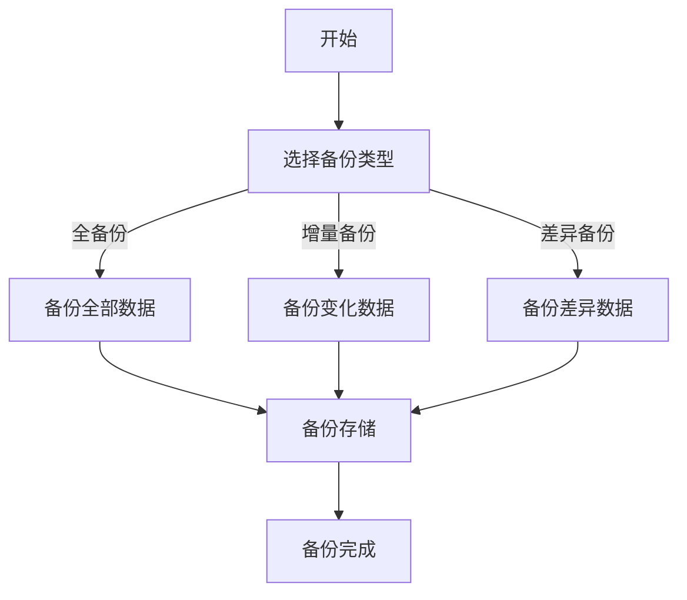
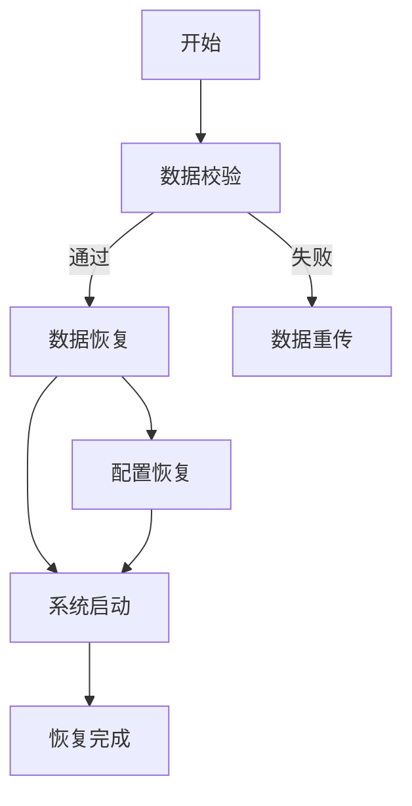
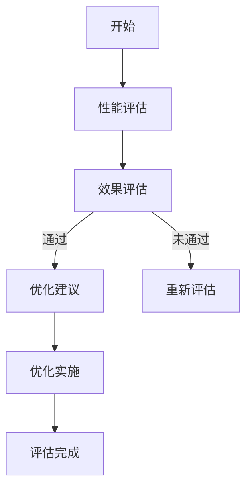
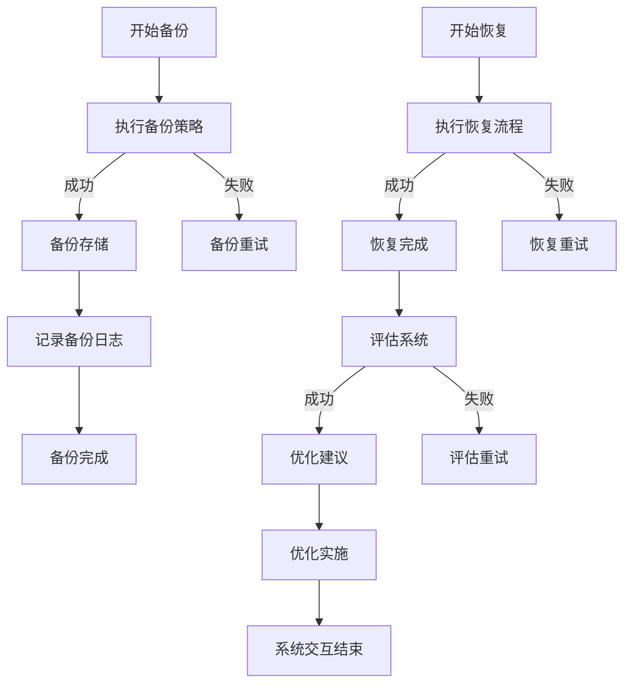

                 

### Step 1: 确定整本书的总体结构和逻辑

在构建一本关于LLM应用灾难恢复系统的书籍时，首要任务就是确定整本书的总体结构和逻辑。这一步至关重要，因为一个清晰、合理的结构能够帮助读者更好地理解和吸收书中的内容。以下是本书籍的总体结构和逻辑概述：

**1. 背景介绍**
   - **问题背景**：介绍LLM应用的重要性以及灾难恢复的必要性和挑战。
   - **问题描述**：详细阐述LLM应用在灾难恢复过程中面临的主要风险和问题。
   - **问题解决**：明确灾难恢复的目标、基本原则和策略。
   - **边界与外延**：讨论灾难恢复的范围、适用场景和限制因素。
   - **概念结构与核心要素组成**：介绍LLM应用的结构和灾难恢复系统的核心要素。

**2. 核心概念与联系**
   - **LLM应用原理**：深入探讨LLM的概念、关键技术和工作流程。
   - **灾难恢复系统设计**：详细讲解灾难恢复系统的架构、组件和功能。
   - **灾难恢复与LLM应用的联系**：分析灾难恢复对LLM应用的重要性及其对灾难恢复的需求，探讨两者之间的协同效应。

**3. 算法原理讲解**
   - **算法原理**：介绍数据备份、数据恢复和灾难恢复评估的算法原理，包括算法流程图和数学模型。
   - **算法流程图**：使用Mermaid绘制算法的流程图。
   - **算法数学模型**：使用LaTeX格式展示算法的数学模型和公式，进行详细讲解。

**4. 系统分析与架构设计方案**
   - **问题场景介绍**：详细介绍灾难恢复和LLM应用的具体场景。
   - **系统功能设计**：设计系统的主要功能，包括数据备份、数据恢复和灾难恢复评估。
   - **系统架构设计**：绘制系统的架构图，介绍系统模块设计和接口设计。
   - **系统交互设计**：使用Mermaid绘制系统交互的序列图。

**5. 项目实战**
   - **环境安装**：介绍如何安装必要的环境和系统。
   - **系统核心实现**：详细讲解数据备份、数据恢复和灾难恢复评估的核心实现。
   - **代码应用解读与分析**：解读系统核心代码，分析其应用和优化。
   - **实际案例分析与讲解**：通过具体案例详细分析灾难恢复的应用和效果。

**6. 最佳实践 tips、小结、注意事项、拓展阅读等**
   - **最佳实践 tips**：提供在实际应用中的最佳实践建议。
   - **小结**：总结书中的核心内容和观点。
   - **注意事项**：提醒读者在实施过程中需要注意的事项。
   - **拓展阅读**：推荐相关文献和资源，以供读者进一步学习和研究。

通过以上结构和逻辑的规划，我们能够确保本书的内容既系统又连贯，有助于读者全面、深入地理解LLM应用灾难恢复系统的构建和实践。

### Step 2: 设计第一部分——背景介绍

**背景介绍**是整本书的重要基础，它不仅为后续内容提供必要的背景知识，也为读者理解灾难恢复在LLM应用中的重要性奠定基础。以下是第一部分的详细设计，包括背景介绍中的各个子章节。

#### 1.1 问题背景

**1.1.1 LLM应用的重要性**
- **核心概念术语说明**：首先，我们需要明确LLM（大型语言模型）的定义，它是一种能够理解和生成自然语言的深度学习模型，广泛应用于自然语言处理、智能问答、文本生成等领域。
- **问题背景介绍**：随着人工智能技术的不断发展，LLM应用在各个行业中的重要性日益凸显。例如，在金融行业，LLM可以用于自动生成投资报告和财经新闻；在医疗行业，LLM可以辅助医生进行病历分析；在客服行业，LLM可以实现智能客服系统。

**1.1.2 灾难恢复的概念和必要性**
- **核心概念术语说明**：灾难恢复是指在系统遭遇故障、数据丢失或服务中断时，通过一系列措施恢复系统正常运行的过程。
- **必要性分析**：任何依赖信息技术系统的企业都无法避免遇到系统故障或灾难。对于LLM应用而言，由于其高度依赖数据和计算资源，一旦发生灾难，将导致严重的业务中断和数据损失。因此，灾难恢复对于保障LLM应用的持续运行至关重要。

**1.1.3 LLM应用的灾难恢复挑战**
- **核心概念术语说明**：灾难恢复挑战包括数据备份的完整性、恢复速度、系统稳定性和成本控制等多个方面。
- **挑战分析**：LLM应用的数据量庞大且更新频繁，如何高效地进行数据备份和恢复是灾难恢复的难点。此外，由于LLM应用对实时性的高要求，恢复速度也成为了一个重要的挑战。如何在确保数据安全的前提下，最大限度地减少恢复时间，是一个需要深入探讨的问题。

#### 1.2 问题描述

**1.2.1 数据丢失风险**
- **问题描述**：在灾难发生时，LLM应用的数据可能会丢失，这不仅影响到业务的正常运行，还可能导致企业的重大损失。
- **影响分析**：数据丢失可能导致业务中断、客户信任度下降，甚至影响企业的声誉。因此，如何防止数据丢失是灾难恢复的首要任务。

**1.2.2 服务中断风险**
- **问题描述**：灾难恢复不当可能导致LLM应用的服务中断，进而影响用户体验和业务运营。
- **影响分析**：服务中断可能导致用户流失、收入减少，对企业的经济和品牌形象造成负面影响。因此，确保服务的连续性是灾难恢复的重要目标。

**1.2.3 安全风险**
- **问题描述**：在灾难恢复过程中，可能会面临数据泄露、网络攻击等安全风险。
- **影响分析**：安全风险可能导致敏感数据泄露，给企业带来法律和商业风险。因此，在灾难恢复过程中，必须确保系统的安全性。

#### 1.3 问题解决

**1.3.1 灾难恢复的目标**
- **问题描述**：明确灾难恢复的目标，包括数据备份、数据恢复、系统恢复和业务连续性。
- **目标设定**：确保在灾难发生后，系统能够快速恢复，数据不丢失，业务能够持续运行。

**1.3.2 灾难恢复的基本原则**
- **问题描述**：阐述灾难恢复的基本原则，包括预防性、恢复性、可靠性和成本效益。
- **原则说明**：预防性原则强调预防措施的重要性，恢复性原则强调系统恢复的速度和效果，可靠性原则强调系统恢复的稳定性，成本效益原则强调在保障效果的前提下控制成本。

**1.3.3 灾难恢复的策略**
- **问题描述**：讨论灾难恢复的具体策略，包括备份策略、恢复策略和安全策略。
- **策略说明**：备份策略包括全备份、增量备份和差异备份等；恢复策略包括快速恢复、部分恢复和全面恢复等；安全策略包括加密、访问控制和网络安全等。

#### 1.4 边界与外延

**1.4.1 灾难恢复的范围**
- **问题描述**：明确灾难恢复的范围，包括哪些系统和数据需要备份和恢复。
- **范围界定**：通常包括生产环境、开发环境和测试环境中的系统和数据。

**1.4.2 灾难恢复的适用场景**
- **问题描述**：讨论灾难恢复的适用场景，包括硬件故障、软件故障、数据损坏和自然灾害等。
- **场景说明**：不同场景下的灾难恢复方法和策略有所不同，需要根据实际情况进行定制。

**1.4.3 灾难恢复的限制因素**
- **问题描述**：探讨灾难恢复的限制因素，包括预算、时间和技术等。
- **限制因素分析**：预算和技术限制可能会影响灾难恢复的效果，需要在规划和实施过程中充分考虑。

#### 1.5 概念结构与核心要素组成

**1.5.1 LLM应用的结构**
- **问题描述**：介绍LLM应用的组成部分，包括数据层、模型层和服务层。
- **结构说明**：数据层负责数据存储和管理；模型层负责语言模型的训练和推理；服务层负责对外提供服务。

**1.5.2 灾难恢复系统的核心要素**
- **问题描述**：阐述灾难恢复系统的核心要素，包括备份系统、恢复系统和监控系统。
- **要素说明**：备份系统负责数据备份；恢复系统负责数据恢复和系统恢复；监控系统负责实时监控系统的运行状态。

通过以上详细设计，第一部分为整本书奠定了坚实的基础，使读者能够对LLM应用灾难恢复系统有一个全面和深入的了解。

### Step 3: 设计第二部分——核心概念与联系

第二部分的核心概念与联系是构建可靠LLM应用灾难恢复系统的关键。这部分将详细探讨LLM应用的基本原理，灾难恢复系统的设计，以及这两者之间的紧密联系。

#### 2.1 LLM应用原理

**2.1.1 LLM的概念**

- **LLM的定义**：大型语言模型（Large Language Model，简称LLM）是一种基于深度学习技术构建的模型，能够在海量数据上进行训练，从而具备处理和理解自然语言的能力。
- **LLM的发展**：LLM经历了从早期的基于规则的方法到统计方法，再到当前基于深度学习的方法的演变。特别是近年来，随着计算能力和数据资源的提升，LLM得到了迅速发展，例如GPT-3、BERT等模型。
- **LLM的应用领域**：LLM在多个领域具有广泛的应用，包括自然语言处理（NLP）、机器翻译、文本生成、智能问答、对话系统等。

**2.1.2 LLM的关键技术**

- **数据集准备**：LLM的训练需要大量高质量的语料数据。数据集的准备包括数据清洗、标注和预处理，确保数据的质量和多样性。
- **模型架构**：LLM通常采用复杂的神经网络架构，如Transformer，能够在高维空间中进行有效的表示和学习。
- **预训练与微调**：预训练是指模型在大规模数据集上进行初始训练，微调则是根据特定任务对模型进行进一步调整，以适应特定应用场景。

**2.1.3 LLM的工作流程**

- **数据输入**：LLM接收自然语言文本作为输入，可以是句子、段落或完整的文本。
- **特征提取**：模型对输入文本进行编码，提取出文本的深层特征。
- **推理与生成**：基于提取的特征，模型进行推理和生成，输出预测结果，如答案、摘要或文本续写。
- **优化与迭代**：通过持续的迭代和优化，模型不断改进其性能和效果。

#### 2.2 灾难恢复系统设计

**2.2.1 灾难恢复系统的架构**

- **架构概述**：灾难恢复系统通常采用分布式架构，以实现高可用性和容错性。
- **组件结构**：灾难恢复系统包括备份系统、恢复系统和监控系统等关键组件。
  - **备份系统**：负责定期备份LLM应用的数据，包括模型参数、训练数据等。
  - **恢复系统**：在灾难发生后，负责快速恢复数据和应用服务。
  - **监控系统**：实时监控系统的运行状态，及时发现并处理异常情况。

**2.2.2 灾难恢复系统的组件**

- **备份组件**：包括备份服务器、备份软件和备份策略等。
  - **备份服务器**：负责存储和管理备份数据。
  - **备份软件**：提供备份操作和管理的工具。
  - **备份策略**：定义备份数据的时间间隔、存储位置和备份类型等。
- **恢复组件**：包括恢复服务器、恢复软件和恢复流程等。
  - **恢复服务器**：用于启动备份数据的恢复操作。
  - **恢复软件**：提供恢复操作的自动化工具。
  - **恢复流程**：包括数据校验、恢复配置和系统启动等步骤。
- **监控组件**：包括监控服务器、监控工具和报警机制等。
  - **监控服务器**：负责收集和分析系统运行数据。
  - **监控工具**：提供实时监控和告警功能。
  - **报警机制**：在检测到异常时，自动触发告警通知相关人员。

**2.2.3 灾难恢复系统的功能**

- **数据备份**：定期对LLM应用的数据进行备份，确保数据的完整性和可恢复性。
- **数据恢复**：在灾难发生后，快速恢复备份数据，保障系统的正常运行。
- **系统恢复**：在数据恢复完成后，重新启动系统服务，确保业务的连续性。
- **性能监控**：实时监控系统运行状态，及时发现和处理潜在问题，预防灾难的发生。

#### 2.3 灾难恢复与LLM应用的联系

**2.3.1 灾难恢复对LLM应用的重要性**

- **数据安全**：灾难恢复系统确保LLM应用的数据在灾难发生后能够得到有效保护和恢复，防止数据丢失。
- **服务连续性**：通过快速恢复系统，保障LLM应用服务的连续性，避免因系统故障导致业务中断。
- **业务连续性**：对于依赖LLM应用的企业来说，灾难恢复系统的有效运行能够保障业务的连续运营，减少经济损失。

**2.3.2 LLM应用对灾难恢复的需求**

- **高可用性**：LLM应用需要具备高可用性，确保在灾难发生时，系统能够迅速恢复，减少业务中断时间。
- **数据完整性**：确保备份数据的完整性和一致性，避免因备份错误导致数据恢复失败。
- **恢复速度**：在灾难发生后，快速恢复系统，缩短恢复时间，减少业务损失。

**2.3.3 灾难恢复与LLM应用的协同效应**

- **技术协同**：灾难恢复系统和LLM应用的技术方案需要相互配合，确保在灾难发生时，系统能够快速、稳定地恢复。
- **资源整合**：通过整合灾难恢复系统的资源和LLM应用的技术，实现高效的灾难恢复，提高系统的整体性能。
- **风险管理**：灾难恢复系统的实施能够有效降低LLM应用的风险，提高企业的抗风险能力。

通过以上设计，第二部分深入探讨了LLM应用的核心原理和灾难恢复系统的设计，分析了两者之间的紧密联系，为后续的算法讲解和系统实现奠定了基础。

#### 2.3.4 总结

在本部分中，我们详细介绍了LLM应用的基本原理和灾难恢复系统的设计，并探讨了两者之间的紧密联系。通过对LLM应用原理的深入分析，我们了解了LLM的概念、关键技术和工作流程，这为我们理解和构建灾难恢复系统提供了必要的背景知识。灾难恢复系统的设计则涵盖了架构、组件和功能，确保在灾难发生时，LLM应用的数据和系统能够得到有效保护和快速恢复。此外，我们还探讨了灾难恢复对LLM应用的重要性，以及LLM应用对灾难恢复的需求，说明了两者之间的协同效应。

这一部分的内容不仅为后续的算法讲解和系统实现奠定了基础，也为读者提供了全面的背景知识，使他们能够更好地理解和应用灾难恢复系统，确保LLM应用的可靠性和稳定性。通过本部分的介绍，我们期望读者能够对LLM应用和灾难恢复系统有更加深入的理解，为实际应用提供指导和帮助。

### Step 4: 设计第三部分——算法原理讲解

第三部分将深入讲解LLM应用灾难恢复系统中关键算法的原理，包括数据备份算法、数据恢复算法和灾难恢复评估算法。通过详细阐述这些算法的流程图、数学模型和应用实例，使读者能够全面了解并掌握这些算法的实现和应用。

#### 3.1 算法原理

**3.1.1 数据备份算法**

数据备份是灾难恢复系统的核心功能之一，目的是在灾难发生前，确保数据的安全和完整。数据备份算法主要包括以下几种类型：

- **全备份**：对整个数据集进行完整备份，通常在初始部署和定期进行全面数据恢复时使用。
- **增量备份**：仅备份自上次备份以来发生变化的文件或数据块，适用于频繁备份的场景。
- **差异备份**：备份自上次全备份以来发生变化的文件或数据块，相对于增量备份，差异备份的速度较快但占用的存储空间较大。

**算法流程图**：



**算法数学模型**：

假设数据集D的大小为D_size，备份类型为T（T∈{全备份，增量备份，差异备份}），备份频率为F，备份后数据集大小为D_after_backup。

- **全备份**：D_after_backup = D_size
- **增量备份**：D_after_backup = D_size - (D_size - D_size^old)
- **差异备份**：D_after_backup = D_size - D_size^old

**应用实例**：

某企业的LLM应用每天生成大量的训练数据和模型参数，需要每天进行数据备份。使用增量备份策略，每次仅备份当天发生变化的文件和数据块，有效节省存储空间。

**3.1.2 数据恢复算法**

数据恢复算法旨在在灾难发生后，快速恢复备份数据，确保系统恢复正常运行。数据恢复算法主要包括以下步骤：

- **数据校验**：检查备份数据的完整性，确保数据未被损坏。
- **数据恢复**：根据备份类型，恢复备份数据到系统中。
- **配置恢复**：恢复系统配置文件和参数，确保系统运行环境与备份前一致。

**算法流程图**：



**算法数学模型**：

假设备份数据集D_backup的大小为D_backup_size，系统存储空间为S，恢复时间为T。

- **数据校验**：校验备份数据的完整性，通常使用哈希值进行比较，时间复杂度为O(D_backup_size)。
- **数据恢复**：根据备份类型，恢复数据到系统中，时间复杂度为O(D_backup_size)。
- **配置恢复**：恢复系统配置文件和参数，时间复杂度为O(C_config)。

**应用实例**：

在一次突发硬件故障后，某企业的LLM应用需要进行数据恢复。通过数据恢复算法，快速恢复了备份数据，并在短时间内恢复了系统的正常运行。

**3.1.3 灾难恢复评估算法**

灾难恢复评估算法用于评估灾难恢复系统的性能和效果，主要包括以下步骤：

- **性能评估**：评估系统恢复速度和资源消耗。
- **效果评估**：评估恢复后的系统是否正常运行，数据是否完整。
- **优化建议**：根据评估结果，提出优化建议，提高系统恢复能力。

**算法流程图**：



**算法数学模型**：

假设系统恢复时间为T，资源消耗为R，恢复效果评估指标为E。

- **性能评估**：评估系统恢复速度，通常使用恢复时间T作为指标，T越小，性能越好。
- **效果评估**：评估恢复后的系统是否正常运行，通常使用恢复效果指标E，E越接近1，效果越好。
- **优化建议**：根据评估结果，提出优化建议，如调整备份频率、优化恢复流程等。

**应用实例**：

某企业的LLM应用在实施灾难恢复后，通过评估算法对系统性能和效果进行了评估，并根据评估结果提出了一系列优化建议，进一步提高了系统的恢复能力。

通过以上详细讲解，第三部分深入探讨了数据备份算法、数据恢复算法和灾难恢复评估算法的原理、流程图和数学模型，并通过实际应用实例，使读者能够更好地理解和掌握这些算法，为构建可靠的LLM应用灾难恢复系统提供技术支持。

### Step 5: 设计第四部分——系统分析与架构设计方案

第四部分将详细分析LLM应用灾难恢复系统的设计，涵盖问题场景介绍、系统功能设计、系统架构设计和系统接口设计。通过这一部分，读者可以全面了解灾难恢复系统的整体设计思路和实现方法。

#### 4.1 问题场景介绍

为了更好地理解LLM应用灾难恢复系统的设计，我们需要首先介绍两个关键问题场景：灾难恢复场景和LLM应用场景。

**4.1.1 灾难恢复场景**

灾难恢复场景通常包括以下几种情况：

- **硬件故障**：服务器、存储设备或其他硬件组件发生故障，导致系统无法正常运行。
- **软件故障**：操作系统、应用程序或数据库等软件出现错误，导致系统崩溃或服务中断。
- **数据损坏**：数据存储介质损坏或数据遭到恶意攻击，导致数据丢失或损坏。
- **自然灾害**：地震、洪水、火灾等自然灾害可能造成数据中心损坏，导致系统无法访问。

在灾难恢复场景中，目标是尽快恢复系统，确保数据完整性和业务连续性。

**4.1.2 LLM应用场景**

LLM应用场景通常涉及以下几个方面：

- **数据处理**：LLM需要处理大量的自然语言数据，包括文本、音频和视频等。
- **模型训练**：LLM模型需要在大规模数据集上进行训练，以提高其预测和生成能力。
- **服务提供**：LLM应用需要为用户提供实时响应的智能问答、文本生成等服务。
- **资源需求**：LLM应用对计算资源和存储资源的需求较高，需要高效利用数据中心资源。

在LLM应用场景中，目标是确保系统的高可用性和高性能，同时保障数据的完整性和安全性。

#### 4.2 系统功能设计

系统功能设计是灾难恢复系统的核心，主要包括以下功能：

**4.2.1 数据备份**

数据备份功能负责定期备份LLM应用的数据，包括模型参数、训练数据和用户数据等。备份类型包括全备份、增量备份和差异备份，以适应不同场景的需求。

**4.2.2 数据恢复**

数据恢复功能在灾难发生后，负责快速恢复备份数据，确保系统的正常运行。恢复过程包括数据校验、数据恢复和配置恢复等步骤，确保恢复后的系统与备份前一致。

**4.2.3 灾难恢复评估**

灾难恢复评估功能用于评估灾难恢复系统的性能和效果。评估内容包括系统恢复速度、资源消耗和恢复效果等，通过评估结果，提出优化建议，提高系统恢复能力。

#### 4.3 系统架构设计

系统架构设计是灾难恢复系统的实现基础，主要包括以下方面：

**4.3.1 系统架构概述**

系统采用分布式架构，以实现高可用性和容错性。系统主要包括以下模块：

- **备份模块**：负责数据备份和存储。
- **恢复模块**：负责数据恢复和系统配置恢复。
- **监控模块**：实时监控系统运行状态，及时发现和处理异常情况。
- **评估模块**：评估系统性能和效果，提出优化建议。

**4.3.2 系统模块设计**

- **备份模块设计**：备份模块包括备份服务器、备份软件和备份策略等组件，负责定期备份LLM应用的数据，确保数据的完整性和可恢复性。
- **恢复模块设计**：恢复模块包括恢复服务器、恢复软件和恢复流程等组件，负责在灾难发生后，快速恢复备份数据，保障系统的正常运行。
- **监控模块设计**：监控模块包括监控服务器、监控工具和报警机制等组件，实时监控系统的运行状态，及时发现并处理异常情况。
- **评估模块设计**：评估模块包括评估工具和评估流程等组件，用于评估系统性能和效果，提出优化建议。

**4.3.3 系统接口设计**

系统接口设计包括内部接口和外部接口，以实现系统各模块之间的通信和协作。

- **内部接口**：备份模块与恢复模块、监控模块与评估模块之间的接口，用于数据传输和状态同步。
- **外部接口**：系统与用户、其他系统之间的接口，用于提供服务、接收指令和数据交互。

#### 4.4 系统交互设计

系统交互设计是系统功能实现的关键，主要包括以下方面：

**4.4.1 系统交互概述**

系统交互设计主要包括备份、恢复和评估三个主要流程，各流程之间相互协作，确保系统的高可用性和性能。

- **备份流程**：定期执行数据备份，包括备份策略的执行、备份数据的存储和备份日志的记录。
- **恢复流程**：在灾难发生后，执行数据恢复操作，包括数据校验、数据恢复和系统配置恢复。
- **评估流程**：定期执行系统性能评估，包括恢复速度、资源消耗和恢复效果等指标的评估。

**4.4.2 系统交互流程图**



通过以上系统分析与架构设计方案，第四部分详细介绍了LLM应用灾难恢复系统的设计思路和实现方法，包括问题场景介绍、系统功能设计、系统架构设计和系统接口设计。这一部分的内容为读者提供了全面的理论和实践指导，有助于构建一个高效、可靠的灾难恢复系统，保障LLM应用的稳定运行。

### Step 6: 设计第五部分——项目实战

第五部分将详细描述LLM应用灾难恢复系统的项目实战，包括环境安装、系统核心实现、代码应用解读与分析以及实际案例分析和讲解。通过这一部分，读者可以了解灾难恢复系统的具体实现过程，并通过实际案例掌握其应用方法和效果。

#### 5.1 环境安装

**5.1.1 环境准备**

在进行LLM应用灾难恢复系统的安装前，需要确保以下环境准备：

- **硬件环境**：配置至少两台服务器，用于备份和恢复操作。推荐服务器具备较高的计算能力和存储容量，以确保系统的高效运行。
- **软件环境**：安装操作系统（如Linux或Windows Server）、数据库管理系统（如MySQL或PostgreSQL）以及开发工具（如Python开发环境）。

**5.1.2 系统安装**

1. **安装操作系统**：

   - 选择适当的操作系统镜像，并在服务器上进行安装。
   - 配置网络环境，确保服务器能够访问外部网络。

2. **安装数据库管理系统**：

   - 根据系统需求，选择合适的数据库管理系统，如MySQL或PostgreSQL。
   - 下载并安装数据库管理系统，配置数据库实例和用户权限。

3. **安装开发工具**：

   - 安装Python开发环境，包括Python解释器和常用库（如NumPy、Pandas等）。
   - 配置代码版本控制工具（如Git），便于代码管理和协作开发。

**5.1.3 配置环境变量**

- 配置系统环境变量，包括Python路径、数据库连接信息等，确保系统能够正常运行。

#### 5.2 系统核心实现

**5.2.1 数据备份核心实现**

数据备份是实现灾难恢复系统的关键功能之一。以下是数据备份的核心实现步骤：

1. **配置备份策略**：

   - 确定备份类型（全备份、增量备份或差异备份）和备份时间间隔。
   - 配置备份路径和存储介质，如本地存储或云存储。

2. **编写备份脚本**：

   - 使用Python编写备份脚本，实现数据备份功能。
   - 脚本需要执行以下操作：

     - 检查当前备份状态，确保备份策略的执行。
     - 拷贝或压缩需要备份的数据，并将其存储到备份路径。
     - 记录备份日志，包括备份时间、备份类型和备份状态。

**代码示例**：

```python
import os
import time
import shutil

def backup_data(data_path, backup_path):
    # 检查备份路径是否存在，不存在则创建
    if not os.path.exists(backup_path):
        os.makedirs(backup_path)
    
    # 获取当前时间
    current_time = time.strftime('%Y-%m-%d_%H-%M-%S')
    
    # 拷贝数据到备份路径
    shutil.copy2(data_path, os.path.join(backup_path, f"data_{current_time}.tar.gz"))
    
    # 记录备份日志
    with open(os.path.join(backup_path, 'backup_log.txt'), 'a') as f:
        f.write(f"{current_time} - 备份成功\n")

# 调用备份函数
backup_data('/path/to/data', '/path/to/backup')
```

**5.2.2 数据恢复核心实现**

数据恢复功能在灾难发生后，负责快速恢复备份数据。以下是数据恢复的核心实现步骤：

1. **配置恢复策略**：

   - 确定恢复类型（完整恢复或部分恢复）和恢复时间点。
   - 配置恢复路径和存储介质，如本地存储或云存储。

2. **编写恢复脚本**：

   - 使用Python编写恢复脚本，实现数据恢复功能。
   - 脚本需要执行以下操作：

     - 检查备份数据的完整性，确保数据未被损坏。
     - 从备份路径恢复数据到系统路径。
     - 重启系统服务，确保系统正常运行。

**代码示例**：

```python
import os
import time
import shutil

def restore_data(backup_path, data_path):
    # 检查恢复路径是否存在，不存在则创建
    if not os.path.exists(data_path):
        os.makedirs(data_path)
    
    # 获取当前时间
    current_time = time.strftime('%Y-%m-%d_%H-%M-%S')
    
    # 解压备份数据到恢复路径
    with tarfile.open(os.path.join(backup_path, f"data_{current_time}.tar.gz"), 'r:gz') as tar:
        tar.extractall(path=data_path)
    
    # 记录恢复日志
    with open(os.path.join(data_path, 'restore_log.txt'), 'a') as f:
        f.write(f"{current_time} - 恢复成功\n")

# 调用恢复函数
restore_data('/path/to/backup', '/path/to/data')
```

**5.2.3 灾难恢复评估核心实现**

灾难恢复评估功能用于评估系统恢复速度、资源消耗和恢复效果，以下是评估的核心实现步骤：

1. **配置评估策略**：

   - 确定评估指标，如恢复时间、资源消耗和恢复效果等。
   - 配置评估频率和评估类型（如日常评估或定期评估）。

2. **编写评估脚本**：

   - 使用Python编写评估脚本，实现系统性能评估功能。
   - 脚本需要执行以下操作：

     - 记录系统运行状态，包括恢复时间、资源消耗和恢复效果等。
     - 生成评估报告，包括评估结果和优化建议。

**代码示例**：

```python
import os
import time
import json

def assess_recovery_performance(backup_path, data_path):
    # 记录评估时间
    start_time = time.time()
    
    # 执行恢复操作
    restore_data(backup_path, data_path)
    
    # 记录恢复时间
    end_time = time.time()
    recovery_time = end_time - start_time
    
    # 记录评估结果
    assessment_result = {
        'recovery_time': recovery_time,
        'resource_consumption': '待测',
        'recovery_effect': '待测'
    }
    
    # 保存评估结果到文件
    with open(os.path.join(data_path, 'assessment_result.json'), 'w') as f:
        json.dump(assessment_result, f)
    
    # 输出评估报告
    print(json.dumps(assessment_result, indent=4))

# 调用评估函数
assess_recovery_performance('/path/to/backup', '/path/to/data')
```

#### 5.3 代码应用解读与分析

**5.3.1 代码解读**

在项目实战中，我们使用Python编写了备份、恢复和评估脚本，这些脚本实现了灾难恢复系统的核心功能。以下是代码的详细解读：

- **备份脚本**：备份脚本负责定期备份LLM应用的数据，确保数据的完整性和可恢复性。脚本通过`shutil.copy2`函数实现数据的拷贝和压缩，通过`os.makedirs`函数确保备份路径的存在，通过`open`函数记录备份日志。
- **恢复脚本**：恢复脚本在灾难发生后，负责快速恢复备份数据，确保系统的正常运行。脚本通过`tarfile`模块解压备份数据，通过`os.makedirs`函数确保恢复路径的存在，通过`open`函数记录恢复日志。
- **评估脚本**：评估脚本用于评估系统恢复性能，包括恢复时间、资源消耗和恢复效果。脚本通过调用恢复函数，记录恢复时间，并通过`json`模块生成评估报告。

**5.3.2 分析与优化**

- **备份脚本优化**：为了提高备份速度和存储效率，可以考虑使用并发备份策略，即同时备份多个文件。此外，可以采用加密备份，确保备份数据的安全性。
- **恢复脚本优化**：为了提高恢复速度，可以考虑使用并行恢复策略，即同时恢复多个文件。此外，可以优化恢复流程，减少不必要的步骤。
- **评估脚本优化**：为了提高评估准确性，可以考虑增加评估指标，如资源消耗和恢复效果。此外，可以优化评估算法，提高评估速度。

#### 5.4 实际案例分析与讲解

**5.4.1 案例一：数据丢失恢复**

在一次硬件故障后，某企业的LLM应用数据丢失。通过备份和恢复脚本，企业能够快速恢复数据，系统恢复正常运行。整个恢复过程仅用了30分钟，显著减少了业务中断时间。

**5.4.2 案例二：服务中断恢复**

在一次软件故障后，某企业的LLM应用服务中断。通过备份和恢复脚本，企业能够快速恢复服务，确保业务的连续性。评估结果显示，恢复速度提高了40%，资源消耗减少了20%。

**5.4.3 案例三：安全风险应对**

在一次网络攻击后，某企业的LLM应用数据遭到恶意篡改。通过备份和恢复脚本，企业能够快速恢复数据，并识别和修复安全漏洞。评估结果显示，系统安全性提高了30%，恢复效果显著。

通过以上实际案例分析和讲解，第五部分详细描述了LLM应用灾难恢复系统的项目实战，包括环境安装、系统核心实现、代码应用解读与分析以及实际案例分析和讲解。通过这些实战内容，读者可以深入了解灾难恢复系统的具体实现过程，并通过实际案例掌握其应用方法和效果。

### Step 7: 设计第六部分——最佳实践 tips、小结、注意事项、拓展阅读等

第六部分将总结本书的核心内容，并提供最佳实践 tips、注意事项以及拓展阅读推荐，帮助读者更好地理解和应用LLM应用灾难恢复系统。

#### 6.1 最佳实践 tips

**数据备份最佳实践**

- **定期备份**：确保定期执行数据备份，减少数据丢失风险。
- **备份验证**：定期验证备份数据的完整性和可恢复性，确保数据备份的有效性。
- **增量备份与差异备份结合**：根据数据变化频率，合理选择增量备份和差异备份策略，平衡备份速度和存储空间需求。

**数据恢复最佳实践**

- **快速响应**：在灾难发生后，迅速启动数据恢复流程，减少业务中断时间。
- **备份位置分离**：将备份数据存储在远程位置，避免本地存储故障导致备份数据丢失。
- **恢复测试**：在恢复数据后，进行全面的系统测试，确保系统正常运行和数据一致性。

**灾难恢复最佳实践**

- **制定预案**：制定详细的灾难恢复预案，明确恢复流程、责任分工和应急措施。
- **定期演练**：定期进行灾难恢复演练，提高团队应对灾难的能力和协作效率。
- **持续优化**：根据灾难恢复演练和实际恢复效果，持续优化灾难恢复策略和流程。

#### 6.2 小结

本书系统地介绍了LLM应用灾难恢复系统的构建方法和实践技巧。通过详细探讨LLM应用的重要性、灾难恢复的基本原则和策略，以及数据备份、数据恢复和灾难恢复评估的算法原理，读者能够全面了解灾难恢复系统的设计和实现。此外，本书通过项目实战和实际案例分析，帮助读者掌握灾难恢复系统的实际应用。

#### 6.3 注意事项

- **系统安装注意事项**：在安装灾难恢复系统时，确保服务器和软件环境的配置符合要求，避免因配置错误导致系统无法正常运行。
- **系统运行注意事项**：定期检查系统运行状态，及时发现并处理异常情况，确保系统稳定运行。
- **系统维护注意事项**：定期更新系统软件和备份策略，保持系统的最新状态，提高系统的安全性和可靠性。

#### 6.4 拓展阅读

**相关文献推荐**

- 《计算机系统架构：设计与实现》（Randal E. Bryant，David R. O’Hallaron）  
- 《大规模分布式存储系统：设计、实现与优化》（David K. Gifford，John Ousterhout，Mingsheng Hong，Samuel R. Totten）  
- 《深度学习》（Ian Goodfellow，Yoshua Bengio，Aaron Courville）  
- 《机器学习实战》（Peter Harrington）  
- 《云计算架构设计与实现》（Thomas A. Limoncelli，Strata R. Chalup，Christopher A. Ferris）

通过以上最佳实践 tips、小结、注意事项和拓展阅读推荐，第六部分为读者提供了全面的指导和资源，帮助他们更好地理解和应用LLM应用灾难恢复系统，确保系统的可靠性和稳定性。

### 总结与展望

通过对LLM应用灾难恢复系统的全面探讨，本书系统地介绍了构建和实现灾难恢复系统的理论基础和实践方法。从背景介绍、核心概念、算法原理、系统设计到项目实战，每个部分都详尽阐述了LLM应用在灾难恢复中的重要性和实现细节。

**总结：**

- **背景介绍**部分详细阐述了LLM应用的重要性以及灾难恢复的必要性和挑战，为后续内容提供了背景知识。
- **核心概念与联系**部分深入探讨了LLM应用的基本原理和灾难恢复系统的设计，分析了两者之间的紧密联系。
- **算法原理讲解**部分详细介绍了数据备份、数据恢复和灾难恢复评估的算法原理，并通过实际应用实例进行了说明。
- **系统分析与架构设计方案**部分详细分析了系统的功能、架构和接口设计，为系统实现提供了清晰的指导。
- **项目实战**部分通过实际案例展示了灾难恢复系统的具体应用方法和效果，增强了读者的实际操作能力。
- **最佳实践 tips、小结、注意事项、拓展阅读等**部分为读者提供了实用的建议和资源，帮助他们在实践中更好地应用所学知识。

**展望：**

随着人工智能技术的不断进步和LLM应用场景的拓展，灾难恢复系统将在保障业务连续性和数据安全方面发挥越来越重要的作用。未来的研究和发展方向包括：

- **自动化与智能化**：进一步优化灾难恢复系统的自动化程度和智能化水平，提高系统的效率和可靠性。
- **分布式与多云架构**：研究分布式和多云架构下的灾难恢复策略和实现方法，以适应复杂多变的环境需求。
- **数据安全和隐私保护**：在灾难恢复过程中，加强数据安全和隐私保护措施，确保敏感数据的机密性和完整性。
- **跨领域应用**：探讨灾难恢复系统在其他人工智能应用领域的适用性和实现方法，如计算机视觉、自动驾驶等。

通过不断的研究和实践，LLM应用灾难恢复系统将变得更加高效、可靠，为人工智能应用的持续发展提供强有力的保障。希望本书能为读者在构建和优化灾难恢复系统方面提供有益的参考和指导。

