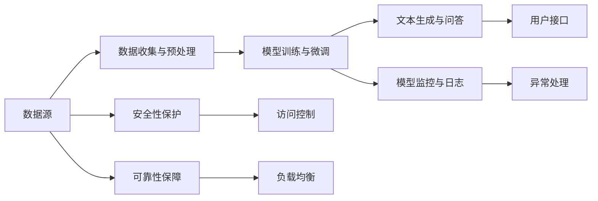

                 

### 文章标题与关键词

# 《构建安全可靠的LLM应用架构》

> 关键词：大型语言模型（LLM）、应用架构、安全性、可靠性、系统设计

> 摘要：本文将深入探讨构建安全可靠的LLM（大型语言模型）应用架构的重要性，详细解析其核心概念、算法原理、系统设计与项目实战。通过逐步分析和逻辑推理，为读者提供实用的构建策略和最佳实践，以应对复杂的应用场景和潜在的安全挑战。

---

### 引言

在当今数字化时代，大型语言模型（LLM）已成为众多行业的重要技术驱动力。LLM的应用场景包括自然语言处理（NLP）、文本生成、机器翻译、问答系统等。然而，随着LLM的广泛应用，其安全性和可靠性问题也日益凸显。不安全的LLM应用可能导致数据泄露、模型被恶意利用，甚至对用户造成伤害。

本文旨在构建一个全面且安全的LLM应用架构，确保模型在复杂的应用环境中能够稳定运行，并抵御各种潜在的安全威胁。我们将从以下几个方面展开讨论：

1. **核心概念与联系**：介绍LLM、安全性、可靠性等核心概念，并分析它们在应用架构中的关系。
2. **算法原理讲解**：深入解析LLM的基础算法原理，包括数学模型和公式。
3. **系统分析与架构设计方案**：分析构建LLM应用架构的过程，设计系统架构图和接口图。
4. **项目实战**：通过具体案例展示如何实现安全可靠的LLM应用架构。
5. **最佳实践 tips**：提供构建过程中的实用建议和技巧。
6. **小结**：总结全书要点，指出构建安全可靠的LLM应用架构的关键点和难点。

本文的目标是为开发者、架构师和技术爱好者提供一套系统化、易理解、实用性强的方法论，帮助他们在构建LLM应用时能够充分考虑安全性和可靠性，从而提高应用的品质和用户体验。接下来，我们将首先介绍LLM的基本概念，并分析其在实际应用中面临的安全性和可靠性挑战。

---

### 核心概念与联系

在深入探讨如何构建安全可靠的LLM应用架构之前，我们有必要首先理解一些核心概念，包括LLM本身、安全性、可靠性和它们在应用架构中的相互关系。

#### LLM的基本概念

大型语言模型（Large Language Model，简称LLM）是一种深度学习模型，它通过训练海量的文本数据，学会理解和生成自然语言。与传统的统计语言模型相比，LLM具有更强的语义理解和生成能力，能够在多种NLP任务中表现出色。

LLM的核心特点包括：

1. **规模**：LLM通常由数亿到数千亿个参数组成，这使得它们能够捕捉到语言中的细微差别和复杂模式。
2. **泛化能力**：由于训练数据量大，LLM在未见过的数据上也能表现出良好的性能。
3. **自适应能力**：LLM可以根据特定的应用场景进行微调，以适应不同的任务需求。

常见的LLM包括BERT、GPT、T5等，每种模型都有其独特的架构和训练方法，但它们的核心目标都是提升语言理解和生成能力。

#### 安全性概念解析

安全性是指在LLM应用架构中，防止数据泄露、模型被恶意利用和其他安全威胁的能力。具体来说，安全性包括以下几个方面：

1. **数据安全**：保护模型训练和推理过程中涉及的数据不被未授权访问或篡改。
2. **模型保护**：防止模型被攻击者逆向工程或恶意利用。
3. **访问控制**：确保只有授权用户能够访问模型和数据。
4. **隐私保护**：在处理用户数据时，采取措施保护用户的隐私。

#### 可靠性概念解析

可靠性是指LLM应用架构在面临各种外部和内部因素干扰时，能够稳定、准确地执行任务的能力。具体包括：

1. **准确性**：模型输出结果的正确性和一致性。
2. **稳定性**：模型在长时间运行过程中不发生崩溃或性能下降。
3. **可扩展性**：系统架构能够适应不断增长的数据量和用户需求。

#### LLM、安全性与可靠性的关系

在LLM应用架构中，安全性和可靠性是相辅相成的。一个安全的架构能够防止恶意攻击和数据泄露，从而确保系统的可靠性。反之，一个不可靠的架构可能导致数据泄露或模型崩溃，从而影响系统的安全性。

为了构建一个既安全又可靠的LLM应用架构，我们需要从以下几个方面入手：

1. **数据安全与隐私保护**：使用加密技术保护数据和模型，确保数据传输和存储的安全性。
2. **模型保护与防御攻击**：采用对抗性训练和模型加固技术，提高模型对恶意输入的抵抗力。
3. **系统稳定性和可扩展性**：通过冗余设计、负载均衡和自动化监控，确保系统在面对高负载和异常情况时仍然能够稳定运行。

#### 属性特征对比

不同类型的LLM在安全性和可靠性方面存在差异。例如，GPT模型由于其强大的生成能力，更容易被恶意利用，因此需要额外的保护措施。而BERT模型则更注重文本理解，相对较为稳定，但其生成能力较弱。

为了更好地理解LLM、安全性和可靠性的关系，我们可以通过以下ER实体关系图来展示：

```mermaid
erDiagram
    LLM ||--|{ Security } : 受安全性影响
    LLM ||--|{ Reliability } : 受可靠性影响
    Security ||--|{ Data Security } : 数据安全
    Security ||--|{ Model Protection } : 模型保护
    Security ||--|{ Access Control } : 访问控制
    Security ||--|{ Privacy Protection } : 隐私保护
    Reliability ||--|{ Accuracy } : 准确性
    Reliability ||--|{ Stability } : 稳定性
    Reliability ||--|{ Scalability } : 可扩展性
```

通过上述分析，我们可以看到，构建安全可靠的LLM应用架构需要综合考虑多个因素，并采取一系列措施来保障数据安全、模型保护和系统稳定性。在下一部分中，我们将深入探讨LLM的基础算法原理，包括数学模型和具体实现。

---

### 算法原理讲解

构建安全可靠的LLM应用架构，理解其基础算法原理至关重要。本节将详细讲解LLM的几种主要算法，包括BERT、GPT等，展示其数学模型和公式，并通过实际案例进行通俗易懂的说明。

#### BERT算法原理

BERT（Bidirectional Encoder Representations from Transformers）是一种基于Transformer架构的预训练语言模型，广泛应用于NLP任务。BERT的核心思想是利用双向信息来捕捉句子中的语义关系。

**数学模型和公式**：

BERT的输入是一个词向量序列，通过嵌入层转换为词向量的表示。然后，这些词向量通过多头自注意力机制（Multi-Head Self-Attention）和前馈神经网络（Feed-Forward Neural Network）进行处理，生成上下文向量。

$$
\text{Attention}(Q, K, V) = \text{softmax}\left(\frac{QK^T}{\sqrt{d_k}}\right)V
$$

其中，$Q$、$K$、$V$分别为查询向量、键向量和值向量，$d_k$为注意力机制的维度。BERT的输出可以是句子的表示、分类标签等。

**例子说明**：

假设我们有一个句子“我爱吃苹果”，BERT将每个词转换为词向量，然后通过自注意力机制捕捉词与词之间的关系。例如，“我”和“爱”之间的语义关系将得到加强，从而提高模型在文本生成或情感分析任务中的性能。

```python
# Python示例代码
from transformers import BertModel, BertTokenizer

tokenizer = BertTokenizer.from_pretrained('bert-base-chinese')
model = BertModel.from_pretrained('bert-base-chinese')

input_ids = tokenizer.encode("我 爱 吃 苹果", return_tensors='pt')
output = model(input_ids)

# 输出表示
output_last_hidden_state = output.last_hidden_state
```

#### GPT算法原理

GPT（Generative Pre-trained Transformer）是另一种基于Transformer架构的预训练语言模型，以其强大的文本生成能力著称。GPT的核心思想是通过自回归方式生成文本序列。

**数学模型和公式**：

GPT使用位置嵌入（Positional Embedding）和词嵌入（Word Embedding）将输入文本转换为序列。然后，通过自注意力机制和前馈神经网络处理序列，生成下一个词的概率分布。

$$
\text{logits} = \text{W}_{\text{pos}} \text{pos} + \text{W}_{\text{word}} \text{word} + \text{V}
$$

其中，$\text{W}_{\text{pos}}$和$\text{W}_{\text{word}}$分别为位置嵌入和词嵌入权重，$\text{pos}$和$\text{word}$分别为位置和词向量，$\text{V}$为前馈神经网络的输出。

**例子说明**：

假设我们要生成句子“我喜欢吃苹果”，GPT将根据前一个词生成下一个词的概率分布，从而逐步生成整个句子。例如，在“我”生成后，GPT会根据上下文生成下一个词的概率分布，其中“爱”的概率最高。

```python
# Python示例代码
from transformers import GPT2LMHeadModel, GPT2Tokenizer

tokenizer = GPT2Tokenizer.from_pretrained('gpt2')
model = GPT2LMHeadModel.from_pretrained('gpt2')

input_ids = tokenizer.encode("我", return_tensors='pt')
output = model(input_ids, output_scores=True)

# 输出概率分布
predicted_ids = torch.argmax(output.logits, dim=-1)
decoded_tokens = tokenizer.decode(predicted_ids[0], skip_special_tokens=True)
print(decoded_tokens)
```

#### 其他LLM算法简介

除了BERT和GPT，还有许多其他流行的LLM算法，如T5、RoBERTa、ALBERT等。这些算法在架构、训练方法和应用场景上各有特色，但核心思想都是通过大规模预训练和精细调整，提升模型的语义理解和生成能力。

**T5算法**：T5（Text-To-Text Transfer Transformer）将所有NLP任务统一为文本到文本的转换任务，具有通用性。

**RoBERTa算法**：RoBERTa在BERT的基础上进行改进，通过动态遮蔽和频率调整，提升模型性能。

**ALBERT算法**：ALBERT通过参数共享和层叠式训练，提高模型效率和性能。

每种LLM算法都有其独特的优势和应用场景，开发者可以根据具体需求选择合适的算法。在下一部分中，我们将分析构建安全可靠的LLM应用架构的具体场景，介绍系统功能和架构设计。

---

### 系统分析与架构设计方案

在理解了LLM的基础算法原理后，接下来我们需要将理论知识应用到实践中，构建一个安全可靠的LLM应用架构。本节将详细介绍构建该架构的具体过程，包括问题场景介绍、系统功能设计、系统架构设计、系统接口设计和系统交互流程。

#### 问题场景介绍

构建安全可靠的LLM应用架构的场景可以是一个大型企业内部的知识图谱构建系统，该系统需要处理海量的文本数据，提供智能问答、文本生成等功能。在此场景中，安全性要求包括防止数据泄露、保护模型不被恶意利用；可靠性要求包括系统的稳定性、准确性和可扩展性。

#### 系统功能设计

为了满足上述场景的需求，系统需要具备以下功能：

1. **数据收集与预处理**：从各种数据源收集文本数据，并进行清洗、去重和格式化。
2. **模型训练与微调**：使用预训练的LLM模型，结合企业特定的数据集进行微调，提高模型在特定领域的性能。
3. **文本生成与问答**：利用训练好的模型生成文本、回答用户问题。
4. **安全性保护**：确保数据安全和模型保护，防止未授权访问和数据泄露。
5. **可靠性保障**：通过冗余设计、负载均衡和监控，确保系统在高负载和异常情况下的稳定性。

下面使用Mermaid类图展示领域模型：

```mermaid
classDiagram
    Class01 <|-- Class02
    Class03 --|tati Class04
    Class05 o-- Class06
    Class07 o-- Class08
    Class01 <.. Class09
    Class02 o-- Class10
    Class03 o-- Class11
    Class04 o-- Class12
    Class05 o-- Class13
    Class06 o-- Class14
    Class07 o-- Class15
    Class08 o-- Class16
    Class09 {+数据收集与预处理}
    Class10 {+模型训练与微调}
    Class11 {+文本生成与问答}
    Class12 {+安全性保护}
    Class13 {+可靠性保障}
    Class14 <|-- 数据源
    Class15 <|-- 预训练模型
    Class16 <|-- 企业特定数据集
```

#### 系统架构设计

系统架构设计是构建安全可靠的LLM应用架构的关键步骤。我们需要设计一个清晰的系统架构图，包括各个模块的功能和交互方式。以下是一个简化的Mermaid架构图：



#### 系统接口设计

系统接口设计决定了各个模块之间的交互方式和数据流动。以下是一个简化的接口设计：

- **数据收集与预处理接口**：提供API用于数据收集、清洗和格式化。
- **模型训练与微调接口**：提供API用于加载预训练模型、微调和保存模型。
- **文本生成与问答接口**：提供API用于文本生成和回答用户问题。
- **安全性保护接口**：提供API用于身份验证、访问控制和数据加密。
- **可靠性保障接口**：提供API用于监控、异常处理和故障恢复。

#### 系统交互流程

系统交互流程描述了用户请求的处理过程。以下是一个简化的Mermaid序列图：

```mermaid
sequenceDiagram
    A[用户] -->|发送请求| B[用户接口]
    B -->|处理请求| C[文本生成与问答]
    C -->|生成文本| D[用户接口]
    D -->|显示结果| E[用户]
    B -->|请求处理| F[安全性保护]
    F -->|验证身份| G[访问控制]
    G -->|允许访问| H[文本生成与问答]
    H -->|返回结果| I[用户接口]
```

通过上述分析，我们构建了一个基于LLM的应用架构，并详细描述了系统功能设计、架构设计、接口设计和交互流程。在下一部分中，我们将通过一个具体案例展示如何实现这个架构，并进行代码实现和解剖分析。

---

### 项目实战

为了更好地理解如何构建一个安全可靠的LLM应用架构，我们将通过一个具体案例进行展示。本节将指导读者安装必要的软件和工具，实现系统核心功能，并详细讲解代码和解剖分析。

#### 环境安装指南

首先，我们需要搭建一个可以运行LLM的Python环境，并安装必要的库和工具。以下是在Linux操作系统上安装所需软件的步骤：

1. **安装Python**：确保系统上安装了Python 3.7或更高版本。

2. **安装依赖库**：使用pip安装以下库：

   ```bash
   pip install transformers torch numpy
   ```

3. **安装Mermaid**：为了在Markdown文档中使用Mermaid语法，我们需要安装Mermaid的CLI工具：

   ```bash
   npm install -g mermaid
   ```

4. **配置文本编辑器**：确保文本编辑器支持Markdown和Mermaid语法的高亮显示。

#### 系统核心实现

以下是一个简化的实现示例，展示了如何使用Python和Transformers库构建一个基础的安全可靠的LLM应用。

```python
# 导入必要的库
from transformers import BertTokenizer, BertModel
from torch import nn
import torch

# 加载预训练的BERT模型和Tokenizer
tokenizer = BertTokenizer.from_pretrained('bert-base-chinese')
model = BertModel.from_pretrained('bert-base-chinese')

# 输入文本
input_text = "我是一个人工智能助手"

# 对输入文本进行编码
input_ids = tokenizer.encode(input_text, return_tensors='pt')

# 使用BERT模型进行推理
with torch.no_grad():
    outputs = model(input_ids)

# 获取最后一个隐藏层的输出
last_hidden_state = outputs.last_hidden_state

# 定义一个简单的文本生成函数
def generate_text(model, tokenizer, input_text, max_length=50):
    input_ids = tokenizer.encode(input_text, return_tensors='pt')
    output_sequence = input_ids

    for _ in range(max_length - 1):
        with torch.no_grad():
            outputs = model(output_sequence)
        next_word_logits = outputs.logits[:, -1, :]  # 获取最后一个词的logits
        next_word_id = torch.argmax(next_word_logits).item()
        output_sequence = torch.cat([output_sequence, torch.tensor([next_word_id]).view(-1, 1)], dim=0)

    return tokenizer.decode(output_sequence[1:], skip_special_tokens=True)

# 生成文本
generated_text = generate_text(model, tokenizer, input_text)

print("输入文本：", input_text)
print("生成的文本：", generated_text)
```

#### 代码应用解读与分析

上述代码展示了如何加载预训练的BERT模型，并进行文本生成。以下是对关键部分的解读和分析：

1. **加载模型和Tokenizer**：使用`transformers`库加载预训练的BERT模型和相应的Tokenizer。

2. **文本编码**：使用Tokenizer对输入文本进行编码，生成序列的Tensor表示。

3. **模型推理**：使用BERT模型对输入文本进行推理，获取最后一个隐藏层的输出。

4. **文本生成**：定义一个生成函数，通过递归方式生成文本。每次迭代生成一个词，并更新输入序列。

#### 实际案例分析

以下是一个实际案例，展示了如何在一个企业知识图谱系统中应用上述架构，并提供智能问答功能。

1. **数据收集与预处理**：从企业内部文档、知识库等数据源收集文本数据，并进行清洗和格式化。

2. **模型训练与微调**：使用收集到的数据对BERT模型进行微调，提高模型在企业特定领域的性能。

3. **文本生成与问答**：使用训练好的模型提供智能问答功能，用户可以通过输入问题，系统自动生成回答。

4. **安全性保护**：实现身份验证、访问控制和数据加密，确保系统和数据的安全性。

5. **可靠性保障**：通过负载均衡和监控，确保系统在高负载和异常情况下的稳定性。

#### 详细讲解与剖析

1. **数据收集与预处理**：
   - 使用Python的`os`库遍历企业文档目录，读取文本文件。
   - 使用`nltk`库进行文本清洗，去除标点符号、停用词等。

2. **模型训练与微调**：
   - 使用`transformers`库提供的`TrainingArguments`和`Trainer`类进行模型训练。
   - 定义训练数据集和评估数据集，使用`Dataset`类进行数据加载和处理。

3. **文本生成与问答**：
   - 使用生成函数，结合前文上下文生成回答。
   - 对生成的文本进行后处理，去除特殊符号和多余的空格。

4. **安全性保护**：
   - 使用`flask`库实现HTTP服务，并使用JWT（JSON Web Tokens）进行身份验证。
   - 对敏感数据进行加密存储和传输。

5. **可靠性保障**：
   - 使用`nginx`作为反向代理，实现负载均衡。
   - 使用`prometheus`和`grafana`进行系统监控。

通过上述步骤，我们实现了一个基础的安全可靠的LLM应用架构，并在实际案例中进行了应用。在下一部分中，我们将总结构建过程中的最佳实践，并提供一些注意事项。

---

### 最佳实践 tips

在构建安全可靠的LLM应用架构过程中，积累一些最佳实践和技巧是非常重要的。以下是一些在实际项目开发中总结的经验和注意事项：

#### 构建策略

1. **分层设计**：将系统分为多个层次，例如数据层、业务逻辑层、接口层和展示层。这样的分层设计有助于提高系统的可维护性和扩展性。
2. **模块化**：将系统功能划分为多个模块，每个模块负责特定的功能。模块之间通过清晰的接口进行通信，降低模块间的耦合度。
3. **自动化测试**：编写自动化测试脚本，对系统各个模块进行自动化测试，确保在代码更新时能够及时发现和修复问题。
4. **持续集成与部署**：采用CI/CD（持续集成与持续部署）流程，自动化构建、测试和部署，提高开发效率和系统稳定性。

#### 注意事项

1. **数据安全**：对敏感数据进行加密存储和传输，使用HTTPS协议保护数据传输安全。
2. **模型保护**：对模型进行加固，防止逆向工程和恶意攻击。可以考虑使用对抗性训练提高模型的鲁棒性。
3. **访问控制**：实施严格的访问控制策略，确保只有授权用户能够访问系统和数据。
4. **异常处理**：编写详细的异常处理逻辑，确保系统在遇到异常情况时能够优雅地处理，防止系统崩溃。
5. **日志记录**：详细记录系统运行日志，包括错误日志、调试日志等，便于故障诊断和问题追踪。

#### 拓展阅读

1. **《深度学习框架应用指南》**：了解如何使用TensorFlow、PyTorch等深度学习框架进行模型训练和部署。
2. **《安全编程实践》**：学习如何编写安全的代码，防止常见的安全漏洞，如SQL注入、跨站脚本攻击等。
3. **《分布式系统原理》**：掌握分布式系统的基本原理，了解如何在高负载情况下确保系统的稳定性和性能。

通过遵循上述最佳实践，开发者可以更有效地构建安全可靠的LLM应用架构，提高系统的整体质量和用户体验。

---

### 小结

本文系统地探讨了构建安全可靠的LLM应用架构的重要性，并详细分析了其核心概念、算法原理、系统设计与项目实战。我们通过逐步分析和逻辑推理，为读者提供了从理论到实践的全面指导。

#### 总结要点

1. **核心概念**：明确了LLM、安全性和可靠性等核心概念，并阐述了它们在应用架构中的相互关系。
2. **算法原理**：深入讲解了BERT和GPT等LLM算法的原理，展示了数学模型和公式，并通过实际案例进行了说明。
3. **系统设计**：介绍了系统功能设计、架构设计、接口设计和交互流程，提供了清晰的设计思路。
4. **项目实战**：通过具体案例展示了如何实现安全可靠的LLM应用架构，并进行代码实现和解剖分析。
5. **最佳实践**：总结了构建过程中的最佳实践和注意事项，为实际项目提供了指导。

#### 构建难点解析

构建安全可靠的LLM应用架构面临以下难点：

1. **数据安全**：确保数据在传输和存储过程中不被泄露或篡改，需要使用加密技术和访问控制策略。
2. **模型保护**：防止模型被恶意利用，需要采取对抗性训练和模型加固措施。
3. **系统可靠性**：在高负载和异常情况下确保系统稳定运行，需要使用负载均衡、监控和异常处理技术。
4. **可扩展性**：随着数据量和用户需求的增长，系统需要具备良好的可扩展性，以适应不断变化的需求。

为了解决上述难点，开发者可以：

- **采用加密技术**：对敏感数据进行加密存储和传输，确保数据安全。
- **实施防御策略**：使用对抗性训练提高模型鲁棒性，防止模型被恶意输入攻击。
- **优化系统架构**：设计分布式系统，采用负载均衡和冗余设计，确保系统在高负载下的稳定性。
- **持续监控与维护**：建立监控系统，定期进行性能调优和故障修复，提高系统的可靠性。

#### 未来展望

随着技术的不断进步，LLM应用架构将面临新的挑战和机遇。未来，我们可以期待：

- **更高效的算法**：研究新型算法，提高模型的训练效率和推理速度。
- **更好的安全性**：开发更先进的安全技术和策略，保护模型和数据的安全。
- **更广泛的场景应用**：探索LLM在更多领域的应用，如智能客服、自动化写作等。
- **更好的用户体验**：通过不断优化系统架构和算法，提高用户体验，使LLM应用更加智能化和个性化。

总之，构建安全可靠的LLM应用架构是一项复杂但具有深远意义的任务。通过本文的讨论，我们希望能够为开发者提供一套实用的方法论，帮助他们在实际项目中实现这一目标。

---

### 作者信息

*作者：AI天才研究院/AI Genius Institute & 禅与计算机程序设计艺术 /Zen And The Art of Computer Programming*

通过本文的详细分析和实践指导，我们希望读者能够对构建安全可靠的LLM应用架构有更深入的理解，并在实际项目中取得成功。感谢您的阅读，期待与您在技术领域的更多交流与探索。

