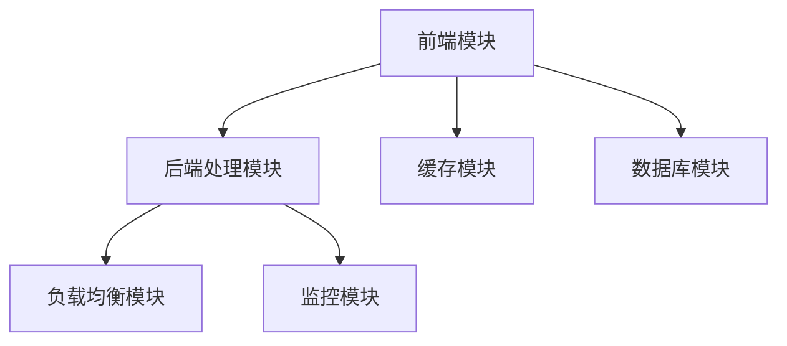
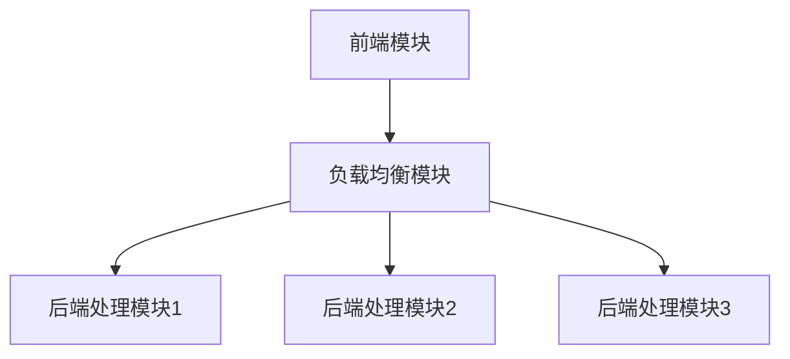
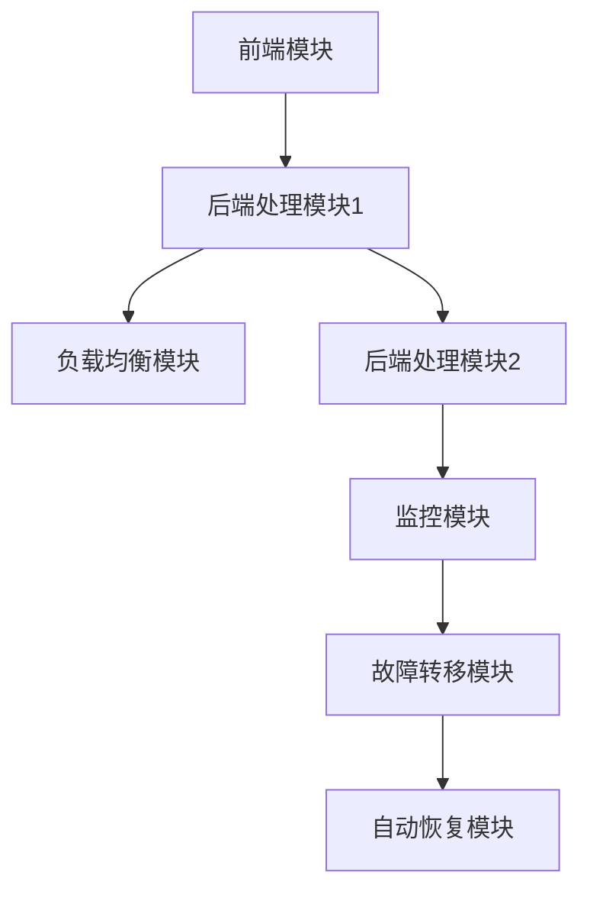
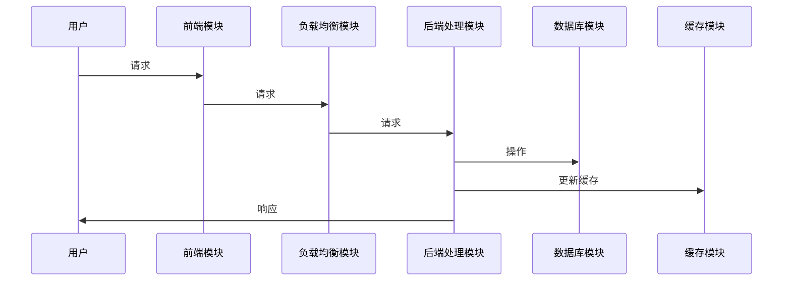
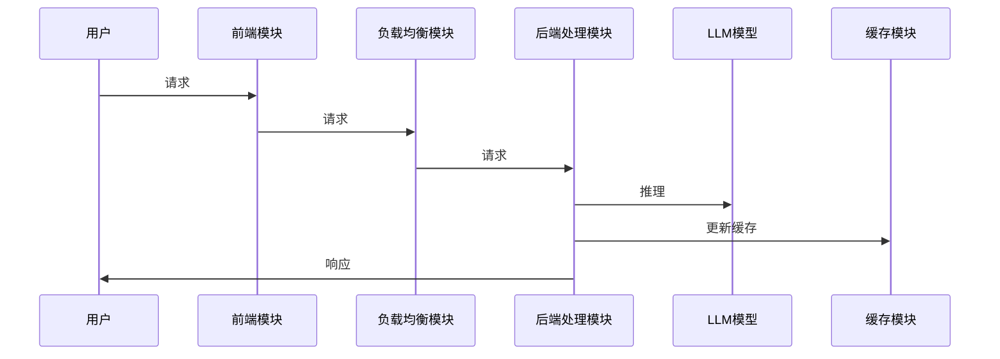

                 

# 构建高可用的LLM应用分布式系统

关键词：高可用性、分布式系统、LLM应用、架构设计、性能优化、安全性

摘要：本文将探讨如何构建高可用的LLM（Large Language Model）应用分布式系统。我们将从高可用性的基础理论出发，逐步分析分布式系统的基本原理，详细讲解LLM应用的分布式系统设计，并深入讨论高可用性监控、性能优化、安全性与数据保护、系统维护与升级等方面的关键技术和实践。最后，通过实际案例研究，总结高可用性系统建设的最佳实践。

## 目录大纲

----------------------------------------------------------------

## 第一部分: 高可用性基础理论

### 第1章: 高可用性的概念与重要性

1.1 高可用性的定义

1.2 高可用性的重要性

1.3 高可用性的关键要素

1.4 高可用性与可靠性

1.5 高可用性与可用性等级

### 第2章: 分布式系统的基本原理

2.1 分布式系统的定义

2.2 分布式系统的特点

2.3 分布式系统的架构

2.4 分布式系统的通信机制

2.5 分布式系统的容错性

### 第3章: LLM应用的分布式系统设计

3.1 LLM应用概述

3.2 LLM应用的需求分析

3.3 LLM应用的架构设计

3.4 LLM应用的负载均衡设计

3.5 LLM应用的容错与恢复设计

### 第4章: 高可用性监控与优化

4.1 高可用性监控的基本概念

4.2 高可用性监控工具的选择

4.3 高可用性监控的实现方法

4.4 高可用性监控的指标分析

4.5 高可用性优化策略

### 第5章: LLM应用性能调优

5.1 性能调优的基本原则

5.2 性能调优工具与方法

5.3 性能瓶颈分析

5.4 性能调优实战案例

### 第6章: 安全性与数据保护

6.1 安全性威胁与防护措施

6.2 数据保护的重要性

6.3 数据加密与访问控制

6.4 安全性与高可用性的关系

### 第7章: 高可用性系统维护与升级

7.1 维护与升级的重要性

7.2 维护流程与策略

7.3 升级策略与风险管理

7.4 故障恢复与灾难应对

### 第8章: 案例研究

8.1 案例一：某电商平台的高可用性系统建设

8.2 案例二：某金融公司的LLM应用分布式系统优化

8.3 案例分析与总结

----------------------------------------------------------------

### 第一部分: 高可用性基础理论

#### 第1章: 高可用性的概念与重要性

##### 1.1 高可用性的定义

高可用性（High Availability，简称HA）是指在系统发生故障时，系统能够快速恢复，确保服务持续可用的一种特性。高可用性不仅仅意味着系统运行的时间长，更重要的是在发生故障时，系统能够快速恢复到正常状态，减少服务中断时间。

##### 1.2 高可用性的重要性

高可用性对于任何需要持续运行的关键系统至关重要。其重要性体现在以下几个方面：

- **业务连续性：**高可用性确保了关键业务能够持续运行，减少因系统故障导致的业务中断，从而降低企业的运营风险。
- **客户满意度：**高可用性保证了服务的连续性，提升了客户的体验，增强了客户对企业的信任。
- **经济效益：**减少因系统故障造成的业务损失，降低维护和恢复的成本。

##### 1.3 高可用性的关键要素

实现高可用性需要考虑多个关键要素，包括：

- **冗余：**通过硬件、软件、数据等多方面的冗余，提高系统的容错能力。
- **自动化：**通过自动化工具和流程，实现快速故障检测和恢复。
- **监控：**实时监控系统的状态，及时发现并处理潜在故障。
- **备份与恢复：**定期备份数据，确保在系统故障时能够快速恢复。

##### 1.4 高可用性与可靠性

高可用性和可靠性是两个相关但不同的概念。可靠性（Reliability）是指系统在长时间运行过程中保持正常工作的能力。高可用性则强调在发生故障时系统能够快速恢复。一个高可用性系统必然具有较高的可靠性，但可靠性高的系统不一定具有高可用性。

##### 1.5 高可用性与可用性等级

可用性等级通常用百分比表示，如99.9%、99.99%等。不同等级的可用性对系统性能的要求也不尽相同。例如，一个99.9%可用性的系统每年允许8.76小时的故障时间，而99.99%可用性的系统每年仅允许53分钟故障时间。因此，在设计高可用性系统时，需要根据业务需求选择合适的可用性等级。

#### 第2章: 分布式系统的基本原理

##### 2.1 分布式系统的定义

分布式系统是由多个独立节点组成的计算机系统，这些节点通过网络相互连接，协同工作以完成共同的任务。分布式系统的核心思想是将任务分解到多个节点上执行，从而提高系统的性能、可用性和可扩展性。

##### 2.2 分布式系统的特点

分布式系统具有以下几个特点：

- **并行处理：**分布式系统能够将任务分配到多个节点上并行处理，从而提高系统的整体性能。
- **容错性：**分布式系统通过冗余设计和故障转移机制，提高了系统的容错性，确保在部分节点故障时系统仍能正常运行。
- **可扩展性：**分布式系统可以根据需求动态增加或减少节点，从而实现系统的水平扩展。
- **分布式一致性：**分布式系统需要保证数据的一致性，防止因数据不同步导致的故障。

##### 2.3 分布式系统的架构

分布式系统通常采用以下几种架构：

- **客户/服务器架构：**客户端发送请求，服务器接收请求并处理，然后将结果返回给客户端。
- **对等网络架构：**节点之间相互连接，协同工作，没有固定的客户端和服务器。
- **主从架构：**系统中有一个主节点负责协调其他从节点的任务，从节点在主节点的调度下工作。

##### 2.4 分布式系统的通信机制

分布式系统的通信机制主要包括以下几种：

- **基于消息队列的通信：**消息队列作为一种异步通信机制，允许节点之间独立工作，通过消息传递实现数据同步。
- **基于远程过程调用（RPC）的通信：**RPC是一种远程调用机制，允许节点之间直接调用对方的方法。
- **基于HTTP的通信：**HTTP是一种基于请求/响应模型的通信机制，适用于Web应用场景。

##### 2.5 分布式系统的容错性

分布式系统的容错性是指系统能够在部分节点故障的情况下仍保持正常运行。实现分布式系统容错性的关键技术包括：

- **冗余：**通过在系统中引入冗余节点，提高系统的容错性。冗余节点可以是硬件（如备用服务器）或软件（如备份副本）。
- **故障检测：**实时监控系统的状态，发现故障节点并及时处理。
- **故障转移：**在检测到故障节点后，将任务从故障节点转移到冗余节点，确保系统继续运行。
- **状态恢复：**通过备份和恢复机制，确保系统在故障恢复后能够回到一致状态。

### 第一部分: 高可用性基础理论

#### 第1章: 高可用性的概念与重要性

##### 1.1 高可用性的定义

高可用性（High Availability，简称HA）是指在系统发生故障时，系统能够快速恢复，确保服务持续可用的一种特性。高可用性不仅仅意味着系统运行的时间长，更重要的是在发生故障时，系统能够快速恢复到正常状态，减少服务中断时间。

##### 1.2 高可用性的重要性

高可用性对于任何需要持续运行的关键系统至关重要。其重要性体现在以下几个方面：

- **业务连续性：**高可用性确保了关键业务能够持续运行，减少因系统故障导致的业务中断，从而降低企业的运营风险。
- **客户满意度：**高可用性保证了服务的连续性，提升了客户的体验，增强了客户对企业的信任。
- **经济效益：**减少因系统故障造成的业务损失，降低维护和恢复的成本。

##### 1.3 高可用性的关键要素

实现高可用性需要考虑多个关键要素，包括：

- **冗余：**通过硬件、软件、数据等多方面的冗余，提高系统的容错能力。
- **自动化：**通过自动化工具和流程，实现快速故障检测和恢复。
- **监控：**实时监控系统的状态，及时发现并处理潜在故障。
- **备份与恢复：**定期备份数据，确保在系统故障时能够快速恢复。

##### 1.4 高可用性与可靠性

高可用性和可靠性是两个相关但不同的概念。可靠性（Reliability）是指系统在长时间运行过程中保持正常工作的能力。高可用性则强调在发生故障时系统能够快速恢复。一个高可用性系统必然具有较高的可靠性，但可靠性高的系统不一定具有高可用性。

##### 1.5 高可用性与可用性等级

可用性等级通常用百分比表示，如99.9%、99.99%等。不同等级的可用性对系统性能的要求也不尽相同。例如，一个99.9%可用性的系统每年允许8.76小时的故障时间，而99.99%可用性的系统每年仅允许53分钟故障时间。因此，在设计高可用性系统时，需要根据业务需求选择合适的可用性等级。

### 第2章: 分布式系统的基本原理

##### 2.1 分布式系统的定义

分布式系统是由多个独立节点组成的计算机系统，这些节点通过网络相互连接，协同工作以完成共同的任务。分布式系统的核心思想是将任务分解到多个节点上执行，从而提高系统的性能、可用性和可扩展性。

##### 2.2 分布式系统的特点

分布式系统具有以下几个特点：

- **并行处理：**分布式系统能够将任务分配到多个节点上并行处理，从而提高系统的整体性能。
- **容错性：**分布式系统通过冗余设计和故障转移机制，提高了系统的容错性，确保在部分节点故障时系统仍能正常运行。
- **可扩展性：**分布式系统可以根据需求动态增加或减少节点，从而实现系统的水平扩展。
- **分布式一致性：**分布式系统需要保证数据的一致性，防止因数据不同步导致的故障。

##### 2.3 分布式系统的架构

分布式系统通常采用以下几种架构：

- **客户/服务器架构：**客户端发送请求，服务器接收请求并处理，然后将结果返回给客户端。
- **对等网络架构：**节点之间相互连接，协同工作，没有固定的客户端和服务器。
- **主从架构：**系统中有一个主节点负责协调其他从节点的任务，从节点在主节点的调度下工作。

##### 2.4 分布式系统的通信机制

分布式系统的通信机制主要包括以下几种：

- **基于消息队列的通信：**消息队列作为一种异步通信机制，允许节点之间独立工作，通过消息传递实现数据同步。
- **基于远程过程调用（RPC）的通信：**RPC是一种远程调用机制，允许节点之间直接调用对方的方法。
- **基于HTTP的通信：**HTTP是一种基于请求/响应模型的通信机制，适用于Web应用场景。

##### 2.5 分布式系统的容错性

分布式系统的容错性是指系统能够在部分节点故障的情况下仍保持正常运行。实现分布式系统容错性的关键技术包括：

- **冗余：**通过在系统中引入冗余节点，提高系统的容错性。冗余节点可以是硬件（如备用服务器）或软件（如备份副本）。
- **故障检测：**实时监控系统的状态，发现故障节点并及时处理。
- **故障转移：**在检测到故障节点后，将任务从故障节点转移到冗余节点，确保系统继续运行。
- **状态恢复：**通过备份和恢复机制，确保系统在故障恢复后能够回到一致状态。

### 第3章: LLM应用的分布式系统设计

##### 3.1 LLM应用概述

LLM（Large Language Model）应用是指利用大型自然语言处理模型进行文本生成、摘要、问答等任务的系统。随着深度学习技术的不断发展，LLM应用在自然语言处理领域发挥着越来越重要的作用。为了满足大规模、高并发、高可用性的需求，LLM应用通常采用分布式系统架构。

##### 3.2 LLM应用的需求分析

在构建LLM应用分布式系统时，需要考虑以下需求：

- **大规模数据处理能力：**LLM应用通常需要对海量数据进行处理，分布式系统可以充分利用多节点计算资源，提高数据处理效率。
- **高并发处理能力：**LLM应用需要支持大量用户的并发请求，分布式系统可以通过负载均衡、水平扩展等方式提高系统并发处理能力。
- **高可用性：**LLM应用需要保证服务的持续可用，分布式系统通过冗余设计、故障转移等机制提高系统的可用性。
- **数据一致性：**分布式系统需要确保数据的一致性，防止因数据不同步导致的错误。
- **可扩展性：**分布式系统需要支持节点动态添加和删除，以适应业务规模的变化。

##### 3.3 LLM应用的架构设计

LLM应用分布式系统架构设计主要包括以下模块：

- **前端模块：**负责接收用户请求，进行参数验证和预处理，将请求转发到后端处理模块。
- **后端处理模块：**负责执行LLM模型的推理任务，生成文本结果。
- **缓存模块：**负责缓存用户请求和结果，提高系统响应速度。
- **数据库模块：**负责存储用户数据、模型参数等。
- **负载均衡模块：**负责分配用户请求到不同的后端处理节点，提高系统并发处理能力。
- **监控模块：**负责监控系统的运行状态，及时发现和处理潜在故障。

以下是LLM应用分布式系统的架构设计图：

##### 3.4 LLM应用的负载均衡设计

负载均衡是实现分布式系统高并发处理能力的关键技术。在LLM应用中，负载均衡模块的作用是将用户请求分配到不同的后端处理节点上，避免单个节点过载，提高系统的整体性能。

负载均衡设计主要包括以下方面：

- **负载均衡算法：**根据请求的负载情况，选择合适的负载均衡算法，如轮询、最小连接数、哈希等。
- **健康检查：**定期检查后端节点的健康状况，确保将请求分配到正常工作的节点上。
- **流量控制：**限制单个节点接收的请求数量，防止系统过载。
- **会话保持：**根据用户的会话信息，将请求分配给相同的后端节点，确保会话一致性。

以下是LLM应用负载均衡的架构设计图：

##### 3.5 LLM应用的容错与恢复设计

分布式系统的容错与恢复设计是实现高可用性的关键。在LLM应用中，容错与恢复设计主要包括以下几个方面：

- **故障检测：**通过心跳检测、监控告警等方式，实时监控系统的运行状态，发现故障节点。
- **故障转移：**在检测到故障节点后，将任务从故障节点转移到正常节点，确保系统继续运行。
- **数据备份：**定期备份用户数据和模型参数，确保在故障恢复后系统能够回到一致状态。
- **自动恢复：**通过自动化工具和脚本，实现故障节点的自动恢复和系统重启。

以下是LLM应用容错与恢复的架构设计图：

### 第4章: 高可用性监控与优化

#### 4.1 高可用性监控的基本概念

高可用性监控是指通过实时监控系统的运行状态，及时发现和处理潜在故障，确保系统持续运行的过程。高可用性监控的基本概念包括：

- **监控指标：**监控指标是用于衡量系统性能和健康状况的参数，如CPU利用率、内存使用率、磁盘空间、网络延迟等。
- **监控工具：**监控工具是实现高可用性监控的关键，常见的监控工具有Nagios、Zabbix、Prometheus等。
- **告警机制：**告警机制是在监控指标超过阈值时，自动发送通知给相关人员，提醒他们处理潜在故障。

#### 4.2 高可用性监控工具的选择

选择适合的高可用性监控工具对于构建高可用性系统至关重要。以下是几种常见的监控工具及其特点：

- **Nagios：**Nagios是一款开源的监控工具，具有丰富的插件和告警功能，适合中小型分布式系统。
- **Zabbix：**Zabbix是一款功能强大的开源监控工具，支持多种监控协议和告警方式，适用于大规模分布式系统。
- **Prometheus：**Prometheus是一款基于拉模式的监控工具，具有高效的存储和查询性能，适用于大数据量场景。

#### 4.3 高可用性监控的实现方法

实现高可用性监控的方法主要包括以下几个方面：

- **指标采集：**通过监控工具采集系统的运行指标，如CPU利用率、内存使用率、网络流量等。
- **阈值设置：**根据系统的性能要求和故障阈值，设置监控指标的告警阈值。
- **告警通知：**在监控指标超过阈值时，通过邮件、短信、钉钉等方式通知相关人员。
- **自动化处理：**在告警触发时，自动执行故障处理流程，如重启服务、切换节点等。

#### 4.4 高可用性监控的指标分析

高可用性监控的指标分析是评估系统性能和健康状况的重要环节。以下是一些常见的高可用性监控指标及其分析：

- **CPU利用率：**CPU利用率反映了系统处理任务的效率，过高或过低都可能影响系统性能。常见的问题有CPU过载、CPU空闲等。
- **内存使用率：**内存使用率反映了系统内存的利用情况，过高可能导致内存泄漏或内存不足。常见的问题有内存溢出、内存泄漏等。
- **磁盘空间：**磁盘空间不足可能导致系统性能下降或数据丢失。常见的问题有磁盘满、磁盘I/O瓶颈等。
- **网络延迟：**网络延迟反映了系统之间的通信性能，过高可能导致数据传输不畅。常见的问题有网络拥堵、网络故障等。

#### 4.5 高可用性优化策略

为了提高分布式系统的高可用性，可以采取以下优化策略：

- **资源分配：**合理分配系统资源，确保关键任务的优先处理，提高系统性能。
- **负载均衡：**采用负载均衡技术，合理分配用户请求，避免单个节点过载。
- **冗余设计：**在硬件和软件层面引入冗余设计，提高系统的容错能力。
- **自动化运维：**采用自动化工具和脚本，实现故障检测、故障转移和系统重启等自动化处理。
- **备份与恢复：**定期备份用户数据和系统配置，确保在故障发生时能够快速恢复。

### 第5章: LLM应用性能调优

#### 5.1 性能调优的基本原则

性能调优的基本原则是找到系统性能瓶颈，针对瓶颈进行优化，从而提高系统的整体性能。以下是一些常见的性能调优原则：

- **局部优化：**首先优化系统中的局部性能瓶颈，然后逐步扩大优化范围，确保整体性能提升。
- **基准测试：**通过基准测试确定系统性能指标，为优化提供数据支持。
- **优化顺序：**按照性能瓶颈的重要性和紧急性，依次优化系统中的性能问题。
- **逐步优化：**在优化过程中，逐步调整参数和配置，避免引入新的问题。

#### 5.2 性能调优工具与方法

性能调优需要借助一些工具和方法，以下是一些常用的性能调优工具和方法：

- **系统监控工具：**如Nginx、Apache等Web服务器性能监控工具，用于分析系统性能指标。
- **负载测试工具：**如JMeter、LoadRunner等，用于模拟高并发场景，评估系统性能。
- **性能分析工具：**如GProfiler、VisualVM等，用于分析系统性能瓶颈。
- **代码优化工具：**如SonarQube、FindBugs等，用于发现和修复代码中的性能问题。

#### 5.3 性能瓶颈分析

性能瓶颈分析是性能调优的关键步骤，需要识别系统中的性能瓶颈。以下是一些常见的性能瓶颈：

- **CPU瓶颈：**CPU利用率过高，导致系统处理任务缓慢。
- **内存瓶颈：**内存使用率过高，导致内存溢出或内存泄漏。
- **磁盘I/O瓶颈：**磁盘读写速度过慢，导致系统响应时间延长。
- **网络瓶颈：**网络延迟过高，导致系统间通信不畅。

#### 5.4 性能调优实战案例

以下是一个性能调优的实战案例：

**问题描述：**一个分布式LLM应用在处理大量请求时，响应时间较长，影响用户体验。

**分析过程：**

1. 使用Nginx监控工具分析系统性能指标，发现CPU利用率和内存使用率较高。
2. 使用GProfiler分析代码性能，发现部分算法复杂度较高。
3. 使用JMeter进行负载测试，发现系统在1000并发用户时，响应时间超过5秒。

**优化方案：**

1. **优化算法：**降低部分算法的复杂度，提高代码执行效率。
2. **水平扩展：**增加节点数量，提高系统并发处理能力。
3. **负载均衡：**采用更高效的负载均衡算法，如最小连接数，降低单个节点的负载。
4. **缓存策略：**引入缓存机制，减少重复计算和数据读取。

**优化效果：**

经过优化后，系统响应时间显著缩短，CPU利用率和内存使用率降低，用户体验得到明显提升。

### 第6章: 安全性与数据保护

#### 6.1 安全性威胁与防护措施

在构建高可用的LLM应用分布式系统时，安全性是一个至关重要的方面。以下是一些常见的安全性威胁与相应的防护措施：

- **网络攻击：**如DDoS攻击、SQL注入、跨站脚本攻击等。防护措施包括防火墙、入侵检测系统（IDS）、防病毒软件等。
- **数据泄露：**如数据窃取、数据篡改等。防护措施包括数据加密、访问控制、日志审计等。
- **系统漏洞：**如未授权访问、权限提升等。防护措施包括漏洞扫描、安全补丁管理等。
- **内部威胁：**如员工恶意操作、内部人员泄露等。防护措施包括员工培训、安全意识提升等。

#### 6.2 数据保护的重要性

数据保护是分布式系统安全性的核心。数据保护的重要性体现在以下几个方面：

- **业务连续性：**确保业务数据的安全，避免因数据丢失或损坏导致业务中断。
- **客户信任：**保护客户数据，增强客户对企业的信任。
- **法律法规：**遵守相关法律法规，如数据保护法、网络安全法等，避免企业面临法律风险。

#### 6.3 数据加密与访问控制

数据加密与访问控制是实现数据保护的重要手段。以下是一些关键点：

- **数据加密：**对敏感数据进行加密存储和传输，确保数据在未授权情况下无法被访问。
- **访问控制：**根据用户的角色和权限，限制用户对数据的访问权限，防止未授权访问。
- **多因素认证：**采用多因素认证（MFA）机制，提高用户身份验证的安全性。

#### 6.4 安全性与高可用性的关系

安全性与高可用性是相辅相成的。以下是一些关系：

- **安全性是高可用性的基础：**保障系统的安全性，确保系统在发生故障时能够快速恢复。
- **高可用性是安全性的保障：**确保系统在正常运行时，能够抵御各种安全威胁，避免因安全漏洞导致系统故障。

### 第7章: 高可用性系统维护与升级

#### 7.1 维护与升级的重要性

高可用性系统维护与升级是确保系统稳定运行和持续优化的重要环节。以下是一些重要性：

- **系统稳定性：**定期维护和升级，修复系统漏洞和性能问题，提高系统稳定性。
- **业务发展：**随着业务规模的扩大和需求变化，系统需要不断升级和优化，以适应新的业务场景。
- **技术更新：**跟踪最新的技术动态，引入新技术和工具，提升系统性能和安全性。

#### 7.2 维护流程与策略

维护流程与策略包括以下方面：

- **定期检查：**定期对系统进行全面的检查，包括硬件、软件、网络等方面。
- **备份策略：**制定数据备份策略，确保在系统故障时能够快速恢复。
- **升级计划：**制定系统升级计划，包括升级时间、升级范围、升级内容等。
- **故障处理：**建立故障处理流程，确保在故障发生时能够迅速响应和处理。

#### 7.3 升级策略与风险管理

升级策略与风险管理包括以下方面：

- **风险评估：**在升级前，评估系统升级可能带来的风险，包括功能兼容性、性能影响等。
- **测试验证：**在升级过程中，进行充分的功能测试和性能测试，确保升级后的系统稳定可靠。
- **逐步升级：**采取逐步升级策略，先在部分节点进行升级，再逐步推广到整个系统。
- **回滚机制：**在升级过程中，建立回滚机制，确保在升级失败时能够快速恢复到原系统状态。

#### 7.4 故障恢复与灾难应对

故障恢复与灾难应对是确保系统高可用性的关键。以下是一些关键点：

- **故障检测：**实时监控系统的运行状态，及时发现故障。
- **故障恢复：**在故障发生时，迅速定位故障原因，采取相应的恢复措施，确保系统尽快恢复正常。
- **灾难应对：**制定灾难应对计划，包括备份恢复、故障切换等，确保在发生灾难时能够快速应对。

### 第8章: 案例研究

#### 8.1 案例一：某电商平台的高可用性系统建设

**项目介绍：**

某电商平台在业务快速发展过程中，面临着高并发、高可用性的需求。为了确保服务的持续可用，电商平台决定建设一个高可用性的分布式系统。

**系统功能设计：**

电商平台系统主要包括以下功能：

- 用户注册与登录
- 商品展示与搜索
- 购物车与订单管理
- 支付与结算
- 客户服务与售后

**系统架构设计：**

电商平台系统采用主从架构，主要包括以下模块：

- **前端模块：**负责用户请求的处理和页面展示。
- **后端处理模块：**负责业务逻辑的处理和数据库操作。
- **数据库模块：**负责存储用户数据、商品信息、订单数据等。
- **缓存模块：**负责缓存用户请求和结果，提高系统响应速度。
- **负载均衡模块：**负责分配用户请求到不同的后端处理节点。
- **监控模块：**负责监控系统的运行状态，及时发现和处理故障。

**系统接口设计：**

电商平台系统主要包括以下接口：

- **用户注册与登录接口：**用于处理用户注册和登录请求。
- **商品展示与搜索接口：**用于查询商品信息和搜索商品。
- **购物车与订单管理接口：**用于添加商品到购物车、生成订单等。
- **支付与结算接口：**用于处理支付请求和结算订单。
- **客户服务与售后接口：**用于处理客户咨询和售后服务。

**系统交互设计：**

电商平台系统交互设计采用RESTful API方式，主要包括以下交互流程：

1. 用户请求：用户通过前端模块发送请求。
2. 负载均衡：负载均衡模块将请求分配到不同的后端处理节点。
3. 业务处理：后端处理模块处理用户请求，生成响应结果。
4. 数据存储：数据库模块存储用户数据、商品信息、订单数据等。
5. 缓存更新：缓存模块更新缓存数据，提高系统响应速度。

以下是电商平台系统的交互设计图：

#### 8.2 案例二：某金融公司的LLM应用分布式系统优化

**项目介绍：**

某金融公司采用LLM应用进行自然语言处理，包括文本生成、摘要、问答等功能。随着业务规模扩大，金融公司面临着系统性能瓶颈和高可用性需求。为了提高系统性能和可用性，金融公司决定对LLM应用分布式系统进行优化。

**系统功能设计：**

金融公司LLM应用系统主要包括以下功能：

- 文本生成：根据输入的文本生成相应的文本。
- 文本摘要：从长文本中提取关键信息，生成摘要。
- 问答系统：根据用户提出的问题，提供准确、详细的回答。

**系统架构设计：**

金融公司LLM应用系统采用分布式架构，主要包括以下模块：

- **前端模块：**负责接收用户请求，进行参数验证和预处理。
- **后端处理模块：**负责执行LLM模型的推理任务，生成文本结果。
- **缓存模块：**负责缓存用户请求和结果，提高系统响应速度。
- **数据库模块：**负责存储用户数据、模型参数等。
- **负载均衡模块：**负责分配用户请求到不同的后端处理节点。
- **监控模块：**负责监控系统的运行状态，及时发现和处理故障。

**系统接口设计：**

金融公司LLM应用系统主要包括以下接口：

- **文本生成接口：**用于生成文本。
- **文本摘要接口：**用于提取文本摘要。
- **问答接口：**用于处理用户提出的问题。

**系统交互设计：**

金融公司LLM应用系统交互设计采用RESTful API方式，主要包括以下交互流程：

1. 用户请求：用户通过前端模块发送请求。
2. 负载均衡：负载均衡模块将请求分配到不同的后端处理节点。
3. 模型推理：后端处理模块执行LLM模型推理任务，生成文本结果。
4. 缓存更新：缓存模块更新缓存数据，提高系统响应速度。
5. 数据存储：数据库模块存储用户数据、模型参数等。

以下是金融公司LLM应用系统的交互设计图：

#### 8.3 案例分析与总结

通过对两个实际案例的分析，我们可以得出以下结论：

1. **高可用性系统建设：**高可用性系统建设的关键在于分布式架构的合理设计，冗余设计、负载均衡、容错性与恢复机制的引入，以及监控与优化策略的实施。

2. **性能优化：**性能优化需要针对系统的瓶颈进行有针对性的优化，包括算法优化、水平扩展、缓存策略等。

3. **安全性保护：**在分布式系统中，安全性保护至关重要，需要采取数据加密、访问控制、多因素认证等措施，确保系统的安全性。

4. **系统维护与升级：**系统维护与升级是确保系统稳定运行和持续优化的重要环节，需要制定合理的维护流程与策略，以及应对故障和灾难的应急措施。

通过以上案例分析，我们可以为其他类似项目提供有益的参考和借鉴。在实际项目中，应根据具体业务需求和场景，灵活运用相关技术和方法，构建高效、稳定、可靠的高可用性分布式系统。

