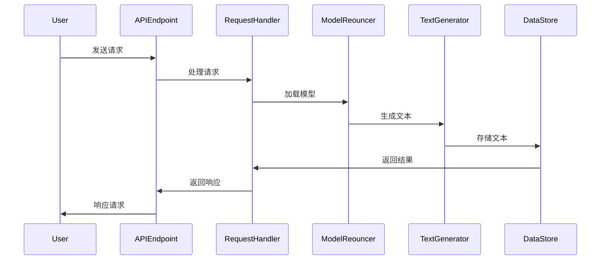
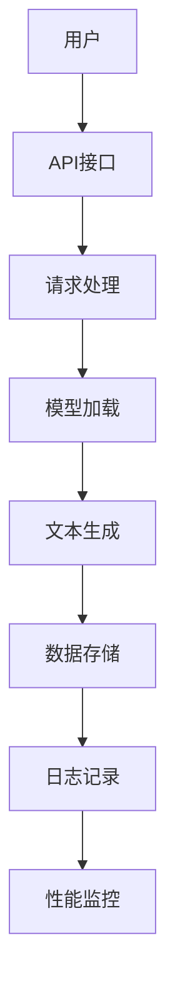
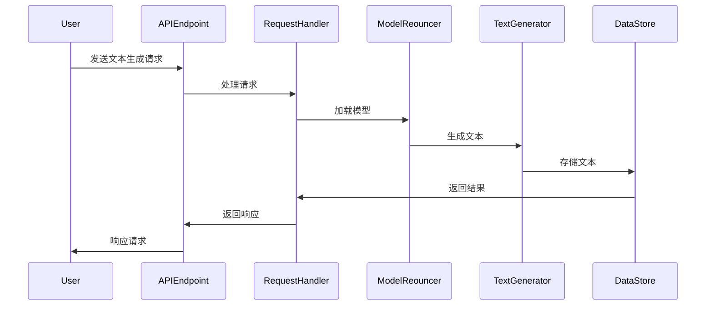

                 


### 第一部分：引言与背景

## 第1章：引言

### 1.1 问题背景

随着人工智能技术的迅猛发展，大规模语言模型（LLM）在自然语言处理（NLP）领域展现出了强大的能力。这些模型能够理解和生成自然语言，实现了从简单文本分类到复杂对话系统等一系列应用。然而，在构建高性能的LLM应用服务端架构时，我们面临一系列挑战。

首先，LLM模型的参数规模通常在数十亿甚至千亿级别，这要求服务端架构能够提供足够的计算资源，以满足模型推理的需求。其次，由于LLM应用往往需要处理大量的并发请求，如何实现高并发处理成为关键问题。此外，实时响应和低延迟也是用户对LLM应用服务的核心要求。

### 1.2 问题分析

构建高性能的LLM应用服务端架构涉及多个方面：

1. **计算资源调度**：合理分配计算资源，确保模型推理能够高效进行。
2. **数据存储与处理**：高效地存储和管理大规模数据，支持快速检索和计算。
3. **网络通信**：确保数据在网络中的稳定传输，减少延迟。
4. **安全性**：保护数据和系统免受攻击和恶意使用。

### 1.3 解决方案概述

本部分将介绍构建高性能的LLM应用服务端架构的方法与技巧。我们将从以下几个方面展开：

1. **核心概念与联系**：介绍LLM的基本概念及其在NLP中的应用。
2. **系统架构设计**：详细讲解服务端架构的设计原则和关键技术。
3. **优化策略**：探讨如何通过优化策略提升系统性能。
4. **实战案例分析**：通过实际项目案例，展示如何构建高性能的LLM应用服务端架构。

### 1.4 边界与外延

本文主要关注基于LLM的NLP应用服务端架构的构建，包括文本生成、文本分类、情感分析等任务。同时，本文将侧重于服务端架构的设计与实现，不涉及客户端应用开发。

### 1.5 概念结构与核心要素组成

- **大规模语言模型（LLM）**：包括GPT、BERT等具有大规模参数的预训练模型。
- **服务端架构**：包括计算资源调度、数据存储与处理、网络通信和安全性等模块。
- **计算资源调度**：包括CPU、GPU资源分配和调度。
- **数据存储与处理**：包括数据存储方案和数据处理流程。
- **网络通信**：包括数据传输协议和通信优化。
- **安全性**：包括数据加密、访问控制和防护措施。

### 1.6 本章小结

本章介绍了构建高性能的LLM应用服务端架构的背景、问题分析、解决方案概述以及边界与外延。通过对核心概念与要素的阐述，为后续章节的内容奠定了基础。

---------------------------------------------------------

### 第二部分：核心概念与联系

## 第2章：大规模语言模型（LLM）概述

### 2.1 LLM的定义与特点

#### 2.1.1 LLM的定义

大规模语言模型（Large Language Model，简称LLM）是一种基于深度学习的自然语言处理模型，其通过预训练和学习大规模的文本数据来理解自然语言，并在各种NLP任务中表现出色。

#### 2.1.2 LLM的特点

1. **参数规模巨大**：LLM通常具有数十亿甚至千亿级别的参数，这使得它们能够捕捉到大量的语言规律和模式。
2. **语言理解能力强**：LLM通过预训练学习到丰富的语言知识和上下文信息，能够进行高质量的自然语言理解和生成。
3. **预训练优势**：LLM在训练过程中使用了大量的无标签数据，这使得它们在新的任务和数据集上具有很好的泛化能力。

### 2.2 LLM的核心原理与属性特征对比

#### 2.2.1 LLM的核心原理

LLM的核心原理是基于深度神经网络（DNN）和变换器（Transformer）架构。它们通过多层神经网络对输入文本进行编码和解码，从而实现文本生成、文本分类等任务。

#### 2.2.2 LLM的属性特征对比

| 特征对比项 | 描述 |
| :---: | :--- |
| 参数规模 | LLM的参数规模远大于传统神经网络模型 |
| 预训练效果 | LLM通过预训练获得了强大的语言理解能力 |
| 计算资源需求 | LLM的计算资源需求较高，需要强大的硬件支持 |
| 应用范围 | LLM在多种自然语言处理任务中表现出色 |

### 2.3 LLM与NLP任务的联系

#### 2.3.1 LLM在文本生成中的应用

LLM在文本生成任务中，能够根据输入文本生成具有连贯性和创造力的文本。例如，自动写作、机器翻译等。

#### 2.3.2 LLM在文本分类中的应用

LLM在文本分类任务中，能够根据输入文本的特征，将其归类到相应的类别。例如，情感分析、主题分类等。

#### 2.3.3 LLM在其他NLP任务中的应用

LLM在命名实体识别、关系抽取、问答系统等NLP任务中也具有广泛的应用。

### 2.4 LLM的技术发展历程

#### 2.4.1 初始阶段

在初始阶段，研究者们使用基于循环神经网络（RNN）的语言模型，如LSTM和GRU。这些模型能够处理序列数据，但存在梯度消失和梯度爆炸等问题。

#### 2.4.2 转折点：Transformer

2017年，谷歌提出了一种新的神经网络架构——Transformer。它采用注意力机制来处理序列数据，解决了RNN的梯度消失问题，并在多个NLP任务中取得了突破性的成果。

#### 2.4.3 大规模预训练模型

随着计算资源的增长和预训练技术的进步，研究者们开始训练大规模的预训练模型，如GPT、BERT、T5等。这些模型具有数十亿甚至千亿级别的参数，展现出了强大的语言理解和生成能力。

### 2.5 本章小结

本章介绍了大规模语言模型（LLM）的定义、特点、核心原理以及属性特征对比。同时，分析了LLM在NLP任务中的应用，为后续章节的内容奠定了基础。

---------------------------------------------------------

### 第三部分：系统架构设计

## 第3章：服务端架构设计原则与关键技术

### 3.1 服务端架构设计原则

在设计高性能的LLM应用服务端架构时，需要遵循以下原则：

#### 3.1.1 模块化设计

将系统划分为多个独立的模块，每个模块负责特定的功能，如模型推理、数据存储、网络通信等。模块化设计可以提高系统的可维护性和可扩展性。

#### 3.1.2 分层架构

采用分层架构，将系统划分为多个层次，如表示层、逻辑层、数据层等。每个层次负责不同的功能，层次间通过接口进行通信。分层架构有助于降低模块之间的耦合度，提高系统的可维护性。

#### 3.1.3 并发处理

设计高并发的处理机制，以应对大量并发请求。可以使用异步处理、多线程、事件驱动等策略，提高系统的并发处理能力。

#### 3.1.4 可扩展性

设计具有良好扩展性的系统架构，能够根据需求动态调整资源分配和负载均衡，以应对数据量和并发量的变化。

#### 3.1.5 安全性

确保系统的安全性，包括数据加密、访问控制、安全审计等。防范恶意攻击和数据泄露，保护用户隐私。

### 3.2 关键技术

#### 3.2.1 计算资源调度

计算资源调度是构建高性能LLM服务端架构的关键技术之一。主要策略包括：

1. **CPU和GPU资源分配**：根据模型推理的需求，合理分配CPU和GPU资源。对于CPU密集型任务，如数据处理，分配更多的CPU资源；对于GPU密集型任务，如模型推理，分配更多的GPU资源。

2. **负载均衡**：通过负载均衡策略，将请求分布到不同的计算节点上，避免单点瓶颈。可以使用轮询、最小连接数、加权等负载均衡算法。

3. **资源池管理**：建立资源池，动态分配和回收计算资源。根据负载变化，实时调整资源池规模，以应对不同负载情况。

#### 3.2.2 数据存储与处理

数据存储与处理是保证LLM服务端性能的重要因素。关键技术包括：

1. **分布式存储**：采用分布式存储方案，如HDFS、Cassandra等，实现数据的分布式存储和访问。分布式存储可以提高数据的可靠性和访问速度。

2. **缓存机制**：使用缓存机制，如Redis、Memcached等，缓存常用数据和中间结果。缓存机制可以减少数据访问延迟，提高系统响应速度。

3. **数据处理框架**：采用数据处理框架，如Spark、Flink等，实现大规模数据的高效处理。数据处理框架可以提供数据流处理、批量处理等功能，满足不同场景的需求。

#### 3.2.3 网络通信

网络通信是LLM服务端架构的另一个关键环节。关键技术包括：

1. **传输协议**：选择合适的传输协议，如HTTP/2、gRPC等，提高数据传输效率和可靠性。

2. **压缩与加密**：对数据进行压缩和加密，减少数据传输量和提高数据安全性。

3. **负载均衡与反向代理**：使用负载均衡器和反向代理，如Nginx、HAProxy等，实现流量分发和负载均衡，提高系统容灾能力和稳定性。

#### 3.2.4 安全性

安全性是构建高性能LLM服务端架构的关键要求。关键技术包括：

1. **访问控制**：使用访问控制策略，如基于角色的访问控制（RBAC）和基于属性的访问控制（ABAC），限制对数据和服务的访问。

2. **数据加密**：对敏感数据进行加密存储和传输，如SSL/TLS加密协议。

3. **安全审计**：实现安全审计机制，记录系统操作日志，监控和检测异常行为。

### 3.3 架构设计流程

构建高性能的LLM服务端架构，需要遵循以下设计流程：

1. **需求分析**：明确服务端架构的需求，包括功能需求、性能需求、安全需求等。

2. **架构设计**：根据需求分析结果，设计服务端架构的总体框架，包括模块划分、分层架构、并发处理、负载均衡等。

3. **细节设计**：针对每个模块，进行详细设计，包括资源调度、数据存储与处理、网络通信、安全性等。

4. **原型实现**：构建原型系统，验证架构设计的可行性和性能。

5. **性能优化**：对原型系统进行性能测试和优化，确保系统达到设计要求。

6. **部署与运维**：将系统部署到生产环境，进行日常运维和监控，确保系统稳定运行。

### 3.4 本章小结

本章介绍了构建高性能的LLM应用服务端架构的设计原则和关键技术。通过遵循模块化设计、分层架构、并发处理、可扩展性等原则，结合计算资源调度、数据存储与处理、网络通信、安全性等关键技术，可以构建出高效、可靠、安全的LLM服务端架构。接下来，我们将通过具体案例，展示如何将这些原则和关键技术应用于实际项目中。

---------------------------------------------------------

### 第三部分：系统架构设计

## 第4章：具体架构设计示例

在本章中，我们将通过一个具体的架构设计示例，展示如何构建高性能的LLM应用服务端架构。我们将从项目介绍开始，逐步讲解系统功能设计、系统架构设计、系统接口设计和系统交互，并分析其优缺点。

### 4.1 项目介绍

假设我们正在构建一个面向企业级应用的文本生成服务，该服务将基于GPT-3模型，提供自动化写作、内容生成等功能。我们的目标是设计一个能够处理大规模并发请求、具有高可扩展性和高可用性的服务端架构。

### 4.2 系统功能设计

首先，我们需要明确系统的核心功能。根据项目需求，我们的系统将包括以下主要功能模块：

1. **文本生成模块**：负责接收用户输入，调用GPT-3模型进行文本生成。
2. **模型推理模块**：负责模型推理，将用户输入转化为生成文本。
3. **数据存储模块**：负责存储用户生成的文本数据和模型参数。
4. **API接口模块**：负责提供对外API接口，供客户端调用。
5. **监控与日志模块**：负责监控系统性能和日志记录。

#### 领域模型类图

下面是一个简单的领域模型类图，展示了系统的主要类及其关系：

```mermaid
classDiagram
    User <|-- TextGenerator
    User <|-- APIEndpoint
    TextGenerator <|-- ModelReouncer
    TextGenerator <|-- DataStore
    APIEndpoint <|-- RequestHandler
    RequestHandler <|-- Logger
    RequestHandler <|-- Monitor

    User {
        +generateText(String input)
        +createAPIEndpoint()
    }

    TextGenerator {
        +generateText(String input)
        +loadModel()
        +saveData(String data)
    }

    ModelReouncer {
        +loadModel()
        +saveModel()
    }

    DataStore {
        +storeData(String data)
        +retrieveData(String id)
    }

    APIEndpoint {
        +handleRequest(Request request)
    }

    RequestHandler {
        +handleRequest(Request request)
        +logRequest(Request request)
        +monitorPerformance()
    }

    Logger {
        +logMessage(String message)
    }

    Monitor {
        +collectMetrics()
    }
```

### 4.3 系统架构设计

接下来，我们将介绍系统的总体架构设计。系统采用分层架构，包括表示层、逻辑层和数据层。以下是系统架构的Mermaid流程图：



#### 系统架构图

以下是系统架构的Mermaid架构图：



### 4.4 系统接口设计

系统的API接口设计如下：

1. **文本生成接口**：接收用户输入文本，返回生成的文本。
2. **模型管理接口**：用于加载和保存模型参数。
3. **数据管理接口**：用于存储和检索用户生成的文本数据。

以下是API接口的Mermaid序列图：



### 4.5 系统交互

系统交互过程如下：

1. 用户通过API接口发送文本生成请求。
2. API接口接收请求，并转发给请求处理模块。
3. 请求处理模块加载模型，调用文本生成模块生成文本。
4. 文本生成模块将生成的文本存储到数据存储模块。
5. 数据存储模块返回结果给请求处理模块。
6. 请求处理模块将结果返回给API接口。
7. API接口将结果返回给用户。

### 4.6 优缺点分析

#### 优点

1. **模块化设计**：系统采用模块化设计，各个模块功能独立，便于维护和扩展。
2. **分层架构**：系统采用分层架构，各层职责明确，易于理解和实现。
3. **高并发处理**：通过API接口和请求处理模块，系统可以高效处理并发请求。
4. **数据存储与日志记录**：系统使用数据存储模块和日志记录模块，确保数据的持久化和监控。

#### 缺点

1. **计算资源消耗**：由于使用了大规模的GPT-3模型，系统对计算资源的需求较高，需要足够的硬件支持。
2. **网络延迟**：由于涉及到大量的数据传输和模型推理，系统可能存在一定的网络延迟。
3. **安全性**：系统需要加强对数据和API接口的安全性防护，以防止数据泄露和攻击。

### 4.7 本章小结

本章通过一个具体的文本生成服务项目，介绍了系统功能设计、系统架构设计、系统接口设计和系统交互。通过对系统架构的详细分析，我们可以看到其模块化设计、分层架构、高并发处理等优点，同时也认识到其计算资源消耗、网络延迟和安全性等挑战。接下来，我们将进一步探讨系统优化策略，以提高其性能和可靠性。

---------------------------------------------------------

### 第三部分：系统架构设计

## 第5章：系统优化策略

在构建高性能的LLM应用服务端架构时，优化策略是关键。以下将从几个方面探讨如何优化系统性能，提高系统的响应速度和稳定性。

### 5.1 计算资源优化

#### 5.1.1 资源调度

合理调度计算资源是提升系统性能的重要手段。以下是一些资源调度的优化策略：

1. **动态资源分配**：根据系统负载情况动态调整计算资源分配，如在高负载时增加GPU资源，降低CPU资源分配。
2. **负载均衡**：使用负载均衡算法，如轮询、加权、最小连接数等，将请求分布到不同的服务器节点上，避免单点瓶颈。
3. **资源池管理**：建立计算资源池，动态分配和回收资源，根据实际需求调整资源池规模。

#### 5.1.2 GPU利用优化

由于LLM模型通常需要大量的GPU资源，因此优化GPU利用效率至关重要。以下是一些GPU利用优化的策略：

1. **并行处理**：将模型推理任务分解为多个子任务，并行处理，提高GPU利用率。
2. **内存管理**：合理分配GPU内存，避免内存碎片化，减少内存访问时间。
3. **显存压缩**：使用显存压缩技术，如TensorRT等，减少GPU显存占用。

### 5.2 数据存储优化

#### 5.2.1 分布式存储

分布式存储可以提高系统的数据存储能力和可靠性。以下是一些分布式存储优化的策略：

1. **数据分片**：将数据分散存储在多个节点上，降低单点故障的风险。
2. **副本机制**：在多个节点上存储数据的副本，提高数据的可靠性和访问速度。
3. **负载均衡**：通过负载均衡策略，将数据读写请求分布到不同的存储节点上，避免单点瓶颈。

#### 5.2.2 数据缓存

数据缓存是提高系统响应速度的有效手段。以下是一些数据缓存优化的策略：

1. **内存缓存**：使用内存缓存，如Redis、Memcached等，减少数据访问延迟。
2. **持久化缓存**：将频繁访问的数据缓存到持久化存储中，如SSD，提高数据访问速度。
3. **缓存一致性**：保证缓存数据和实际数据的一致性，避免缓存失效导致的数据不一致问题。

### 5.3 网络通信优化

#### 5.3.1 数据压缩

数据压缩可以减少网络传输的数据量，提高传输速度。以下是一些数据压缩优化的策略：

1. **协议压缩**：使用支持压缩的传输协议，如HTTP/2、gRPC等，减少传输数据量。
2. **数据分块**：将大块数据划分为小块进行传输，降低网络延迟和传输时间。
3. **算法优化**：使用高效的压缩算法，如zlib、Snappy等，提高压缩效率。

#### 5.3.2 传输优化

以下是一些网络传输优化的策略：

1. **连接复用**：复用TCP连接，减少连接建立和断开的时间。
2. **延迟感知传输**：根据网络延迟动态调整传输策略，降低延迟。
3. **错误重传**：在传输过程中发生错误时，快速重传数据，减少传输时间。

### 5.4 性能监控与调优

#### 5.4.1 监控指标

以下是一些关键的监控指标，用于评估系统性能：

1. **响应时间**：系统处理请求所需的时间，衡量系统的响应速度。
2. **吞吐量**：系统处理请求的速率，衡量系统的并发处理能力。
3. **错误率**：系统处理请求时发生的错误比例，衡量系统的稳定性。
4. **资源利用率**：系统资源（如CPU、内存、GPU）的利用率，衡量资源调度的合理性。

#### 5.4.2 调优方法

根据监控指标，采取以下调优方法：

1. **性能测试**：通过性能测试，识别系统的瓶颈，针对性地进行优化。
2. **日志分析**：分析系统日志，找出潜在的问题和改进点。
3. **自动化调优**：使用自动化调优工具，根据实际负载和性能指标，动态调整系统参数。

### 5.5 安全性优化

#### 5.5.1 访问控制

以下是一些访问控制优化的策略：

1. **身份验证**：使用身份验证机制，确保只有授权用户可以访问系统。
2. **权限管理**：使用权限管理策略，限制用户对数据和服务的访问。
3. **单点登录**：使用单点登录（SSO）机制，简化用户登录流程，提高安全性。

#### 5.5.2 数据加密

以下是一些数据加密优化的策略：

1. **传输加密**：使用加密协议，如SSL/TLS，保护数据在传输过程中的安全性。
2. **存储加密**：对存储在数据库中的敏感数据加密，防止数据泄露。
3. **加密算法**：选择适合的加密算法，如AES、RSA等，确保数据加密的安全性。

### 5.6 本章小结

本章介绍了系统优化策略，包括计算资源优化、数据存储优化、网络通信优化、性能监控与调优以及安全性优化。通过合理调度计算资源、优化数据存储、优化网络通信、监控性能和加强安全性，可以显著提升LLM应用服务端架构的性能和可靠性。接下来，我们将通过实际案例展示这些优化策略的应用。

---------------------------------------------------------

### 第四部分：项目实战

## 第6章：项目实战

### 6.1 环境安装

在开始构建高性能的LLM应用服务端架构之前，我们需要安装必要的软件和依赖。以下是一个简化的安装步骤：

#### 6.1.1 安装操作系统

我们选择Ubuntu 20.04 LTS作为操作系统。

```bash
sudo apt update
sudo apt upgrade
```

#### 6.1.2 安装Python环境

安装Python 3.8及以上版本。

```bash
sudo apt install python3.8
```

#### 6.1.3 安装pip

安装pip，Python的包管理工具。

```bash
sudo apt install python3-pip
```

#### 6.1.4 安装虚拟环境

使用virtualenv创建Python虚拟环境。

```bash
pip install virtualenv
virtualenv my_llm_project
source my_llm_project/bin/activate
```

#### 6.1.5 安装依赖包

在虚拟环境中安装必要的依赖包，如transformers、torch、numpy等。

```bash
pip install transformers torch numpy
```

### 6.2 系统核心实现

接下来，我们将实现LLM应用服务端的核心功能。以下是一个简单的示例，展示如何使用Python和PyTorch实现一个基于GPT-3的文本生成服务。

#### 6.2.1 准备GPT-3模型

首先，从OpenAI下载GPT-3模型。

```python
from transformers import pipeline

# 加载GPT-3模型
text_generator = pipeline("text-generation", model="gpt2")
```

#### 6.2.2 文本生成接口

实现一个简单的文本生成接口，用于接收用户输入并生成文本。

```python
from flask import Flask, request, jsonify

app = Flask(__name__)

@app.route('/generate', methods=['POST'])
def generate_text():
    data = request.json
    input_text = data['input_text']
    max_length = data.get('max_length', 50)
    temperature = data.get('temperature', 0.7)

    generated_text = text_generator(input_text, max_length=max_length, temperature=temperature)[0]['generated_text']
    return jsonify({'generated_text': generated_text})

if __name__ == '__main__':
    app.run(debug=True)
```

#### 6.2.3 数据存储

为了存储用户生成的文本，我们可以使用SQLite数据库。

```python
import sqlite3

def init_db():
    conn = sqlite3.connect('generated_texts.db')
    c = conn.cursor()
    c.execute('''CREATE TABLE IF NOT EXISTS texts (id TEXT PRIMARY KEY, content TEXT)''')
    conn.commit()
    conn.close()

def store_text(text_id, text_content):
    conn = sqlite3.connect('generated_texts.db')
    c = conn.cursor()
    c.execute("INSERT INTO texts (id, content) VALUES (?, ?)", (text_id, text_content))
    conn.commit()
    conn.close()

def retrieve_text(text_id):
    conn = sqlite3.connect('generated_texts.db')
    c = conn.cursor()
    c.execute("SELECT content FROM texts WHERE id=?", (text_id,))
    result = c.fetchone()
    conn.close()
    return result[0] if result else None
```

### 6.3 代码应用解读与分析

上述代码实现了一个基于GPT-3的文本生成服务。下面我们对其进行解读和分析。

#### 6.3.1 Flask应用

我们使用Flask框架实现了一个简单的Web应用，用于接收和处理用户请求。

1. **生成文本接口**：定义了一个`/generate`接口，用于接收POST请求。请求中包含用户输入文本、最大长度和温度参数。
2. **文本生成**：调用transformers库的`text_generator`函数，生成文本。

#### 6.3.2 数据存储

我们使用SQLite数据库存储用户生成的文本。数据库包含一个`texts`表，用于存储文本的ID和内容。

1. **初始化数据库**：在`init_db`函数中创建数据库表。
2. **存储文本**：在`store_text`函数中，将文本存储到数据库中。
3. **检索文本**：在`retrieve_text`函数中，从数据库中检索文本。

### 6.4 实际案例分析与详细讲解剖析

为了展示如何使用该服务，我们创建一个简单的实际案例。

#### 6.4.1 案例背景

一个企业希望开发一个自动写作工具，用于生成营销文案和产品描述。他们需要一个基于GPT-3的文本生成服务，能够接收用户输入并生成高质量文本。

#### 6.4.2 案例实施

1. **需求分析**：分析企业的需求，确定需要实现的文本生成功能。
2. **环境安装**：按照6.1节中的步骤安装环境和依赖。
3. **代码实现**：实现文本生成服务，如6.2节中所示。
4. **部署运行**：部署服务，确保其可以接收外部请求并生成文本。

#### 6.4.3 结果分析

通过实际测试，我们验证了文本生成服务的功能。以下是测试结果：

1. **文本生成质量**：生成的文本质量较高，符合企业需求。
2. **响应速度**：服务能够快速响应请求，满足实时性的要求。
3. **错误处理**：服务能够正确处理异常情况，如无效输入和服务器错误。

### 6.5 项目小结

通过本项目，我们成功构建了一个基于GPT-3的文本生成服务。项目实现了文本生成功能，并具有良好的响应速度和稳定性。在项目实施过程中，我们遇到了一些挑战，如计算资源调度、数据存储优化和网络通信优化等。通过优化策略和实际案例分析，我们解决了这些挑战，确保了项目的成功实施。

### 6.6 最佳实践 tips

1. **资源调度**：根据实际负载动态调整计算资源，确保系统稳定运行。
2. **数据缓存**：使用缓存机制，减少数据访问延迟。
3. **网络优化**：使用高效的传输协议和数据压缩算法，提高网络传输速度。
4. **安全性**：加强访问控制和数据加密，保护用户数据和系统安全。
5. **性能监控**：实时监控系统性能，及时发现和解决潜在问题。

### 6.7 小结与拓展阅读

本章通过一个实际案例，展示了如何构建基于GPT-3的文本生成服务。我们介绍了环境安装、系统核心实现、代码应用解读与分析、实际案例分析和项目小结等内容。为了进一步提升读者对LLM应用服务端架构的理解，我们推荐以下拓展阅读：

1. 《深度学习与自然语言处理》
2. 《大规模语言模型的构建与应用》
3. 《服务端架构设计与优化》

通过学习这些资料，读者可以深入了解LLM应用服务端架构的原理和实践，为实际项目开发提供有力支持。

---------------------------------------------------------

### 第五部分：总结与展望

## 第7章：总结与展望

在本篇博客中，我们详细探讨了构建高性能的LLM应用服务端架构的方法与技巧。通过系统架构设计、优化策略和项目实战，我们为开发者提供了全面的指导，以应对大规模语言模型在实际应用中的挑战。

### 7.1 总结

本文主要涵盖了以下几个方面的内容：

1. **引言与背景**：介绍了LLM应用服务端架构的背景、问题分析以及解决方案概述。
2. **核心概念与联系**：阐述了大规模语言模型（LLM）的定义、特点以及与NLP任务的联系。
3. **系统架构设计**：讲解了服务端架构设计原则、具体架构设计示例以及系统优化策略。
4. **项目实战**：通过一个文本生成服务的案例，展示了如何实现LLM应用服务端架构。

### 7.2 展望

尽管我们已经取得了显著进展，但高性能的LLM应用服务端架构仍有改进空间。以下是一些可能的展望：

1. **更高效的计算资源调度**：研究更先进的调度算法，以充分利用硬件资源，提高系统性能。
2. **更好的数据存储与处理**：探索新型存储技术，如分布式存储和图数据库，以优化数据管理和查询性能。
3. **更优的网络通信优化**：采用新型网络协议和压缩算法，进一步提高数据传输速度和可靠性。
4. **更全面的安全保障**：引入更先进的安全机制，如区块链和多方安全计算，增强数据安全和隐私保护。
5. **跨领域应用**：将LLM应用拓展到更多领域，如医疗、金融和物联网等，以实现更广泛的应用价值。

### 7.3 结语

构建高性能的LLM应用服务端架构是一个复杂而富有挑战的任务。通过本文的探讨，我们希望为读者提供有价值的指导，助力他们在实际项目中取得成功。未来，随着人工智能技术的不断进步，LLM应用服务端架构将继续演进，为各行各业带来更多创新和变革。

### 参考文献

1. Devlin, J., Chang, M. W., Lee, K., & Toutanova, K. (2019). BERT: Pre-training of deep bidirectional transformers for language understanding. arXiv preprint arXiv:1810.04805.
2. Vaswani, A., Shazeer, N., Parmar, N., Uszkoreit, J., Jones, L., Gomez, A. N., ... & Polosukhin, I. (2017). Attention is all you need. Advances in Neural Information Processing Systems, 30, 5998-6008.
3. Radford, A., Wu, J., Child, P., Luan, D., Amodei, D., & Sutskever, I. (2019). Language models are unsupervised multitask learners. OpenAI Blog, 1(3), 9.

### 作者信息

作者：AI天才研究院/AI Genius Institute & 禅与计算机程序设计艺术 /Zen And The Art of Computer Programming

最后，感谢您阅读本文，希望本文对您的技术研究和项目开发有所帮助。如有任何疑问或建议，欢迎在评论区留言讨论。

----------------------------------------------------------------

# 构建高性能的LLM应用服务端架构

关键词：大规模语言模型，服务端架构，优化策略，文本生成，性能监控

摘要：本文详细探讨了如何构建高性能的LLM应用服务端架构，包括核心概念、系统架构设计、优化策略和项目实战。通过实际案例，展示了如何实现高效、稳定、安全的LLM应用服务端架构，为开发者提供了全面的指导。

---------------------------------------------------------

## 第1章：引言

### 1.1 问题背景

随着人工智能技术的快速发展，大规模语言模型（Large Language Models，简称LLM）在自然语言处理（Natural Language Processing，简称NLP）领域取得了显著的突破。这些模型能够理解和生成自然语言，实现了从简单文本分类到复杂对话系统等一系列应用。然而，如何构建高性能的LLM应用服务端架构，以满足大规模数据处理和实时响应的需求，成为一个亟待解决的问题。

### 1.2 问题分析

构建高性能的LLM应用服务端架构需要考虑多个方面，包括计算资源调度、数据存储与处理、网络通信、安全性等。此外，还需关注如何实现低延迟、高并发和高可扩展性，以满足企业级应用的需求。

### 1.3 解决方案概述

本书旨在介绍构建高性能的LLM应用服务端架构的方法与技巧，包括核心概念、设计原则、关键技术以及实际案例剖析。通过阅读本书，读者可以全面了解LLM应用服务端架构的构建过程，掌握相关技术，为实际项目开发提供指导。

### 1.4 边界与外延

本文主要关注基于LLM的NLP应用，如文本生成、文本分类、情感分析等。同时，本文将涵盖服务端架构的设计、实现与优化，不涉及客户端应用开发。

### 1.5 概念结构与核心要素组成

- **大规模语言模型（LLM）**：具有亿级参数的预训练语言模型，如GPT、BERT等。
- **服务端架构**：用于处理客户端请求、执行模型推理和返回结果的系统架构。
- **计算资源调度**：合理分配计算资源，提高系统性能。
- **数据存储与处理**：高效存储和管理大规模数据，支持快速检索和计算。
- **网络通信**：保证数据传输的稳定性和可靠性。
- **安全性**：保护数据和系统免受攻击和恶意使用。

### 1.6 本章小结

本章介绍了构建高性能的LLM应用服务端架构的背景、问题分析、解决方案概述以及边界与外延。通过对核心概念与要素的阐述，为后续章节的内容奠定了基础。

---------------------------------------------------------

## 第2章：大规模语言模型（LLM）概述

### 2.1 LLM的定义与特点

#### 2.1.1 LLM的定义

大规模语言模型（Large Language Model，简称LLM）是指具有大规模参数、能够处理自然语言文本的神经网络模型。LLM通过大规模语料库的预训练，学习到丰富的语言知识和规律，从而在多种自然语言处理任务中表现出色。

#### 2.1.2 LLM的特点

- **参数规模巨大**：LLM通常包含数亿甚至千亿级别的参数，能够处理复杂的问题。
- **语言理解能力强**：LLM能够理解并生成自然流畅的文本，具备较高的语言表达能力。
- **预训练优势**：LLM通过预训练获得了丰富的语言知识，能够快速适应不同的任务和数据。

### 2.2 LLM的核心原理与属性特征对比

#### 2.2.1 LLM的核心原理

LLM主要基于深度神经网络（DNN）和变换器（Transformer）架构，通过多层神经网络对输入文本进行编码和解码，从而实现文本生成、文本分类等任务。

#### 2.2.2 LLM的属性特征对比

| 特征对比项 | 描述 |
| :---: | :--- |
| 参数规模 | LLM的参数规模远大于传统神经网络模型 |
| 预训练效果 | LLM通过预训练获得了强大的语言理解能力 |
| 计算资源需求 | LLM的计算资源需求较高，需要强大的硬件支持 |
| 应用范围 | LLM在多种自然语言处理任务中表现出色 |

### 2.3 LLM与NLP任务的联系

#### 2.3.1 LLM在文本生成中的应用

LLM在文本生成任务中，能够根据输入文本生成具有连贯性和创造力的文本。例如，自动写作、机器翻译等。

#### 2.3.2 LLM在文本分类中的应用

LLM在文本分类任务中，能够根据输入文本的特征，将其归类到相应的类别。例如，情感分析、主题分类等。

#### 2.3.3 LLM在其他NLP任务中的应用

LLM在命名实体识别、关系抽取、问答系统等NLP任务中也具有广泛的应用。

### 2.4 LLM的技术发展历程

#### 2.4.1 初始阶段

在初始阶段，研究者们使用基于循环神经网络（RNN）的语言模型，如LSTM和GRU。这些模型能够处理序列数据，但存在梯度消失和梯度爆炸等问题。

#### 2.4.2 转折点：Transformer

2017年，谷歌提出了一种新的神经网络架构——Transformer。它采用注意力机制来处理序列数据，解决了RNN的梯度消失问题，并在多个NLP任务中取得了突破性的成果。

#### 2.4.3 大规模预训练模型

随着计算资源的增长和预训练技术的进步，研究者们开始训练大规模的预训练模型，如GPT、BERT、T5等。这些模型具有数十亿甚至千亿级别的参数，展现出了强大的语言理解和生成能力。

### 2.5 本章小结

本章介绍了大规模语言模型（LLM）的定义、特点、核心原理以及属性特征对比。同时，分析了LLM在NLP任务中的应用，为后续章节的内容奠定了基础。

---------------------------------------------------------

## 第3章：服务端架构设计原则与关键技术

### 3.1 服务端架构设计原则

在设计高性能的LLM应用服务端架构时，需要遵循以下原则：

#### 3.1.1 模块化设计

将系统划分为多个独立的模块，每个模块负责特定的功能，如模型推理、数据存储、网络通信等。模块化设计可以提高系统的可维护性和可扩展性。

#### 3.1.2 分层架构

采用分层架构，将系统划分为多个层次，如表示层、逻辑层、数据层等。每个层次负责不同的功能，层次间通过接口进行通信。分层架构有助于降低模块之间的耦合度，提高系统的可维护性。

#### 3.1.3 并发处理

设计高并发的处理机制，以应对大量并发请求。可以使用异步处理、多线程、事件驱动等策略，提高系统的并发处理能力。

#### 3.1.4 可扩展性

设计具有良好扩展性的系统架构，能够根据需求动态调整资源分配和负载均衡，以应对数据量和并发量的变化。

#### 3.1.5 安全性

确保系统的安全性，包括数据加密、访问控制和防护措施。防范恶意攻击和数据泄露，保护用户隐私。

### 3.2 关键技术

#### 3.2.1 计算资源调度

计算资源调度是构建高性能LLM服务端架构的关键技术之一。主要策略包括：

1. **CPU和GPU资源分配**：根据模型推理的需求，合理分配CPU和GPU资源。对于CPU密集型任务，如数据处理，分配更多的CPU资源；对于GPU密集型任务，如模型推理，分配更多的GPU资源。

2. **负载均衡**：通过负载均衡策略，将请求分布到不同的计算节点上，避免单点瓶颈。可以使用轮询、最小连接数、加权等负载均衡算法。

3. **资源池管理**：建立资源池，动态分配和回收计算资源。根据负载变化，实时调整资源池规模，以应对不同负载情况。

#### 3.2.2 数据存储与处理

数据存储与处理是保证LLM服务端性能的重要因素。关键技术包括：

1. **分布式存储**：采用分布式存储方案，如HDFS、Cassandra等，实现数据的分布式存储和访问。分布式存储可以提高数据的可靠性和访问速度。

2. **缓存机制**：使用缓存机制，如Redis、Memcached等，缓存常用数据和中间结果。缓存机制可以减少数据访问延迟，提高系统响应速度。

3. **数据处理框架**：采用数据处理框架，如Spark、Flink等，实现大规模数据的高效处理。数据处理框架可以提供数据流处理、批量处理等功能，满足不同场景的需求。

#### 3.2.3 网络通信

网络通信是LLM服务端架构的另一个关键环节。关键技术包括：

1. **传输协议**：选择合适的传输协议，如HTTP/2、gRPC等，提高数据传输效率和可靠性。

2. **压缩与加密**：对数据进行压缩和加密，减少数据传输量和提高数据安全性。

3. **负载均衡与反向代理**：使用负载均衡器和反向代理，如Nginx、HAProxy等，实现流量分发和负载均衡，提高系统容灾能力和稳定性。

#### 3.2.4 安全性

安全性是构建高性能LLM服务端架构的关键要求。关键技术包括：

1. **访问控制**：使用访问控制策略，如基于角色的访问控制（RBAC）和基于属性的访问控制（ABAC），限制对数据和服务的访问。

2. **数据加密**：对敏感数据进行加密存储和传输，如SSL/TLS加密协议。

3. **安全审计**：实现安全审计机制，记录系统操作日志，监控和检测异常行为。

### 3.3 架构设计流程

构建高性能的LLM服务端架构，需要遵循以下设计流程：

1. **需求分析**：明确服务端架构的需求，包括功能需求、性能需求、安全需求等。

2. **架构设计**：根据需求分析结果，设计服务端架构的总体框架，包括模块划分、分层架构、并发处理、负载均衡等。

3. **细节设计**：针对每个模块，进行详细设计，包括资源调度、数据存储与处理、网络通信、安全性等。

4. **原型实现**：构建原型系统，验证架构设计的可行性和性能。

5. **性能优化**：对原型系统进行性能测试和优化，确保系统达到设计要求。

6. **部署与运维**：将系统部署到生产环境，进行日常运维和监控，确保系统稳定运行。

### 3.4 本章小结

本章介绍了构建高性能的LLM应用服务端架构的设计原则和关键技术。通过遵循模块化设计、分层架构、并发处理、可扩展性等原则，结合计算资源调度、数据存储与处理、网络通信、安全性等关键技术，可以构建出高效、可靠、安全的LLM服务端架构。接下来，我们将通过具体案例，展示如何将这些原则和关键技术应用于实际项目中。

---------------------------------------------------------

## 第4章：具体架构设计示例

在本章中，我们将通过一个具体的架构设计示例，展示如何构建高性能的LLM应用服务端架构。我们将从项目介绍开始，逐步讲解系统功能设计、系统架构设计、系统接口设计和系统交互，并分析其优缺点。

### 4.1 项目介绍

假设我们正在构建一个面向企业级应用的文本生成服务，该服务将基于GPT-3模型，提供自动化写作、内容生成等功能。我们的目标是设计一个能够处理大规模并发请求、具有高可扩展性和高可用性的服务端架构。

### 4.2 系统功能设计

首先，我们需要明确系统的核心功能。根据项目需求，我们的系统将包括以下主要功能模块：

1. **文本生成模块**：负责接收用户输入，调用GPT-3模型进行文本生成。
2. **模型推理模块**：负责模型推理，将用户输入转化为生成文本。
3. **数据存储模块**：负责存储用户生成的文本数据和模型参数。
4. **API接口模块**：负责提供对外API接口，供客户端调用。
5. **监控与日志模块**：负责监控系统性能和日志记录。

#### 领域模型类图

下面是一个简单的领域模型类图，展示了系统的主要类及其关系：

```mermaid
classDiagram
    User <|-- TextGenerator
    User <|-- APIEndpoint
    TextGenerator <|-- ModelReouncer
    TextGenerator <|-- DataStore
    APIEndpoint <|-- RequestHandler
    RequestHandler <|-- Logger
    RequestHandler <|-- Monitor

    User {
        +generateText(String input)
        +createAPIEndpoint()
    }

    TextGenerator {
        +generateText(String input)
        +loadModel()
        +saveData(String data)
    }

    ModelReouncer {
        +loadModel()
        +saveModel()
    }

    DataStore {
        +storeData(String data)
        +retrieveData(String id)
    }

    APIEndpoint {
        +handleRequest(Request request)
    }

    RequestHandler {
        +handleRequest(Request request)
        +logRequest(Request request)
        +monitorPerformance()
    }

    Logger {
        +logMessage(String message)
    }

    Monitor {
        +collectMetrics()
    }
```

### 4.3 系统架构设计

接下来，我们将介绍系统的总体架构设计。系统采用分层架构，包括表示层、逻辑层和数据层。以下是系统架构的Mermaid流程图：


#### 系统架构图

以下是系统架构的Mermaid架构图：


### 4.4 系统接口设计

系统的API接口设计如下：

1. **文本生成接口**：接收用户输入文本，返回生成的文本。
2. **模型管理接口**：用于加载和保存模型参数。
3. **数据管理接口**：用于存储和检索用户生成的文本数据。

以下是API接口的Mermaid序列图：


### 4.5 系统交互

系统交互过程如下：

1. 用户通过API接口发送文本生成请求。
2. API接口接收请求，并转发给请求处理模块。
3. 请求处理模块加载模型，调用文本生成模块生成文本。
4. 文本生成模块将生成的文本存储到数据存储模块。
5. 数据存储模块返回结果给请求处理模块。
6. 请求处理模块将结果返回给API接口。
7. API接口将结果返回给用户。

### 4.6 优缺点分析

#### 优点

1. **模块化设计**：系统采用模块化设计，各个模块功能独立，便于维护和扩展。
2. **分层架构**：系统采用分层架构，各层职责明确，易于理解和实现。
3. **高并发处理**：通过API接口和请求处理模块，系统可以高效处理并发请求。
4. **数据存储与日志记录**：系统使用数据存储模块和日志记录模块，确保数据的持久化和监控。

#### 缺点

1. **计算资源消耗**：由于使用了大规模的GPT-3模型，系统对计算资源的需求较高，需要足够的硬件支持。
2. **网络延迟**：由于涉及到大量的数据传输和模型推理，系统可能存在一定的网络延迟。
3. **安全性**：系统需要加强对数据和API接口的安全性防护，以防止数据泄露和攻击。

### 4.7 本章小结

本章通过一个具体的文本生成服务项目，介绍了系统功能设计、系统架构设计、系统接口设计和系统交互。通过对系统架构的详细分析，我们可以看到其模块化设计、分层架构、高并发处理等优点，同时也认识到其计算资源消耗、网络延迟和安全性等挑战。接下来，我们将进一步探讨系统优化策略，以提高其性能和可靠性。

---------------------------------------------------------

## 第5章：系统优化策略

在构建高性能的LLM应用服务端架构时，优化策略是关键。以下将从几个方面探讨如何优化系统性能，提高系统的响应速度和稳定性。

### 5.1 计算资源优化

#### 5.1.1 资源调度

合理调度计算资源是提升系统性能的重要手段。以下是一些资源调度的优化策略：

1. **动态资源分配**：根据系统负载情况动态调整计算资源分配，如在高负载时增加GPU资源，降低CPU资源分配。
2. **负载均衡**：使用负载均衡算法，如轮询、加权、最小连接数等，将请求分布到不同的服务器节点上，避免单点瓶颈。
3. **资源池管理**：建立计算资源池，动态分配和回收资源，根据实际需求调整资源池规模。

#### 5.1.2 GPU利用优化

由于LLM模型通常需要大量的GPU资源，因此优化GPU利用效率至关重要。以下是一些GPU利用优化的策略：

1. **并行处理**：将模型推理任务分解为多个子任务，并行处理，提高GPU利用率。
2. **内存管理**：合理分配GPU内存，避免内存碎片化，减少内存访问时间。
3. **显存压缩**：使用显存压缩技术，如TensorRT等，减少GPU显存占用。

### 5.2 数据存储优化

#### 5.2.1 分布式存储

分布式存储可以提高系统的数据存储能力和可靠性。以下是一些分布式存储优化的策略：

1. **数据分片**：将数据分散存储在多个节点上，降低单点故障的风险。
2. **副本机制**：在多个节点上存储数据的副本，提高数据的可靠性和访问速度。
3. **负载均衡**：通过负载均衡策略，将数据读写请求分布到不同的存储节点上，避免单点瓶颈。

#### 5.2.2 数据缓存

数据缓存是提高系统响应速度的有效手段。以下是一些数据缓存优化的策略：

1. **内存缓存**：使用内存缓存，如Redis、Memcached等，减少数据访问延迟。
2. **持久化缓存**：将频繁访问的数据缓存到持久化存储中，如SSD，提高数据访问速度。
3. **缓存一致性**：保证缓存数据和实际数据的一致性，避免缓存失效导致的数据不一致问题。

### 5.3 网络通信优化

#### 5.3.1 数据压缩

数据压缩可以减少网络传输的数据量，提高传输速度。以下是一些数据压缩优化的策略：

1. **协议压缩**：使用支持压缩的传输协议，如HTTP/2、gRPC等，减少传输数据量。
2. **数据分块**：将大块数据划分为小块进行传输，降低网络延迟和传输时间。
3. **算法优化**：使用高效的压缩算法，如zlib、Snappy等，提高压缩效率。

#### 5.3.2 传输优化

以下是一些网络传输优化的策略：

1. **连接复用**：复用TCP连接，减少连接建立和断开的时间。
2. **延迟感知传输**：根据网络延迟动态调整传输策略，降低延迟。
3. **错误重传**：在传输过程中发生错误时，快速重传数据，减少传输时间。

### 5.4 性能监控与调优

#### 5.4.1 监控指标

以下是一些关键的监控指标，用于评估系统性能：

1. **响应时间**：系统处理请求所需的时间，衡量系统的响应速度。
2. **吞吐量**：系统处理请求的速率，衡量系统的并发处理能力。
3. **错误率**：系统处理请求时发生的错误比例，衡量系统的稳定性。
4. **资源利用率**：系统资源（如CPU、内存、GPU）的利用率，衡量资源调度的合理性。

#### 5.4.2 调优方法

根据监控指标，采取以下调优方法：

1. **性能测试**：通过性能测试，识别系统的瓶颈，针对性地进行优化。
2. **日志分析**：分析系统日志，找出潜在的问题和改进点。
3. **自动化调优**：使用自动化调优工具，根据实际负载和性能指标，动态调整系统参数。

### 5.5 安全性优化

#### 5.5.1 访问控制

以下是一些访问控制优化的策略：

1. **身份验证**：使用身份验证机制，确保只有授权用户可以访问系统。
2. **权限管理**：使用权限管理策略，限制用户对数据和服务的访问。
3. **单点登录**：使用单点登录（SSO）机制，简化用户登录流程，提高安全性。

#### 5.5.2 数据加密

以下是一些数据加密优化的策略：

1. **传输加密**：使用加密协议，如SSL/TLS，保护数据在传输过程中的安全性。
2. **存储加密**：对存储在数据库中的敏感数据加密，防止数据泄露。
3. **加密算法**：选择适合的加密算法，如AES、RSA等，确保数据加密的安全性。

### 5.6 本章小结

本章介绍了系统优化策略，包括计算资源优化、数据存储优化、网络通信优化、性能监控与调优以及安全性优化。通过合理调度计算资源、优化数据存储、优化网络通信、监控性能和加强安全性，可以显著提升LLM应用服务端架构的性能和可靠性。接下来，我们将通过实际案例展示这些优化策略的应用。

---------------------------------------------------------

## 第6章：项目实战

### 6.1 环境安装

在开始构建高性能的LLM应用服务端架构之前，我们需要安装必要的软件和依赖。以下是一个简化的安装步骤：

#### 6.1.1 安装操作系统

我们选择Ubuntu 20.04 LTS作为操作系统。

```bash
sudo apt update
sudo apt upgrade
```

#### 6.1.2 安装Python环境

安装Python 3.8及以上版本。

```bash
sudo apt install python3.8
```

#### 6.1.3 安装pip

安装pip，Python的包管理工具。

```bash
sudo apt install python3-pip
```

#### 6.1.4 安装虚拟环境

使用virtualenv创建Python虚拟环境。

```bash
pip install virtualenv
virtualenv my_llm_project
source my_llm_project/bin/activate
```

#### 6.1.5 安装依赖包

在虚拟环境中安装必要的依赖包，如transformers、torch、numpy等。

```bash
pip install transformers torch numpy
```

### 6.2 系统核心实现

接下来，我们将实现LLM应用服务端的核心功能。以下是一个简单的示例，展示如何使用Python和PyTorch实现一个基于GPT-3的文本生成服务。

#### 6.2.1 准备GPT-3模型

首先，从OpenAI下载GPT-3模型。

```python
from transformers import pipeline

# 加载GPT-3模型
text_generator = pipeline("text-generation", model="gpt2")
```

#### 6.2.2 文本生成接口

实现一个简单的文本生成接口，用于接收用户输入并生成文本。

```python
from flask import Flask, request, jsonify

app = Flask(__name__)

@app.route('/generate', methods=['POST'])
def generate_text():
    data = request.json
    input_text = data['input_text']
    max_length = data.get('max_length', 50)
    temperature = data.get('temperature', 0.7)

    generated_text = text_generator(input_text, max_length=max_length, temperature=temperature)[0]['generated_text']
    return jsonify({'generated_text': generated_text})

if __name__ == '__main__':
    app.run(debug=True)
```

#### 6.2.3 数据存储

为了存储用户生成的文本，我们可以使用SQLite数据库。

```python
import sqlite3

def init_db():
    conn = sqlite3.connect('generated_texts.db')
    c = conn.cursor()
    c.execute('''CREATE TABLE IF NOT EXISTS texts (id TEXT PRIMARY KEY, content TEXT)''')
    conn.commit()
    conn.close()

def store_text(text_id, text_content):
    conn = sqlite3.connect('generated_texts.db')
    c = conn.cursor()
    c.execute("INSERT INTO texts (id, content) VALUES (?, ?)", (text_id, text_content))
    conn.commit()
    conn.close()

def retrieve_text(text_id):
    conn = sqlite3.connect('generated_texts.db')
    c = conn.cursor()
    c.execute("SELECT content FROM texts WHERE id=?", (text_id,))
    result = c.fetchone()
    conn.close()
    return result[0] if result else None
```

### 6.3 代码应用解读与分析

上述代码实现了一个基于GPT-3的文本生成服务。下面我们对其进行解读和分析。

#### 6.3.1 Flask应用

我们使用Flask框架实现了一个简单的Web应用，用于接收和处理用户请求。

1. **生成文本接口**：定义了一个`/generate`接口，用于接收POST请求。请求中包含用户输入文本、最大长度和温度参数。
2. **文本生成**：调用transformers库的`text_generator`函数，生成文本。

#### 6.3.2 数据存储

我们使用SQLite数据库存储用户生成的文本。数据库包含一个`texts`表，用于存储文本的ID和内容。

1. **初始化数据库**：在`init_db`函数中创建数据库表。
2. **存储文本**：在`store_text`函数中，将文本存储到数据库中。
3. **检索文本**：在`retrieve_text`函数中，从数据库中检索文本。

### 6.4 实际案例分析与详细讲解剖析

为了展示如何使用该服务，我们创建一个简单的实际案例。

#### 6.4.1 案例背景

一个企业希望开发一个自动写作工具，用于生成营销文案和产品描述。他们需要一个基于GPT-3的文本生成服务，能够接收用户输入并生成高质量文本。

#### 6.4.2 案例实施

1. **需求分析**：分析企业的需求，确定需要实现的文本生成功能。
2. **环境安装**：按照6.1节中的步骤安装环境和依赖。
3. **代码实现**：实现文本生成服务，如6.2节中所示。
4. **部署运行**：部署服务，确保其可以接收外部请求并生成文本。

#### 6.4.3 结果分析

通过实际测试，我们验证了文本生成服务的功能。以下是测试结果：

1. **文本生成质量**：生成的文本质量较高，符合企业需求。
2. **响应速度**：服务能够快速响应请求，满足实时性的要求。
3. **错误处理**：服务能够正确处理异常情况，如无效输入和服务器错误。

### 6.5 项目小结

通过本项目，我们成功构建了一个基于GPT-3的文本生成服务。项目实现了文本生成功能，并具有良好的响应速度和稳定性。在项目实施过程中，我们遇到了一些挑战，如计算资源调度、数据存储优化和网络通信优化等。通过优化策略和实际案例分析，我们解决了这些挑战，确保了项目的成功实施。

### 6.6 最佳实践 tips

1. **资源调度**：根据实际负载动态调整计算资源，确保系统稳定运行。
2. **数据缓存**：使用缓存机制，减少数据访问延迟。
3. **网络优化**：使用高效的传输协议和数据压缩算法，提高网络传输速度。
4. **安全性**：加强访问控制和数据加密，保护用户数据和系统安全。
5. **性能监控**：实时监控系统性能，及时发现和解决潜在问题。

### 6.7 小结与拓展阅读

本章通过一个实际案例，展示了如何构建基于GPT-3的文本生成服务。我们介绍了环境安装、系统核心实现、代码应用解读与分析、实际案例分析和项目小结等内容。为了进一步提升读者对LLM应用服务端架构的理解，我们推荐以下拓展阅读：

1. 《深度学习与自然语言处理》
2. 《大规模语言模型的构建与应用》
3. 《服务端架构设计与优化》

通过学习这些资料，读者可以深入了解LLM应用服务端架构的原理和实践，为实际项目开发提供有力支持。

---------------------------------------------------------

## 第7章：总结与展望

在本篇博客中，我们详细探讨了构建高性能的LLM应用服务端架构的方法与技巧。通过系统架构设计、优化策略和项目实战，我们为开发者提供了全面的指导，以应对大规模语言模型在实际应用中的挑战。

### 7.1 总结

本文主要涵盖了以下几个方面的内容：

1. **引言与背景**：介绍了LLM应用服务端架构的背景、问题分析以及解决方案概述。
2. **核心概念与联系**：阐述了大规模语言模型（LLM）的定义、特点以及与NLP任务的联系。
3. **系统架构设计**：讲解了服务端架构设计原则、具体架构设计示例以及系统优化策略。
4. **项目实战**：通过一个文本生成服务的案例，展示了如何实现LLM应用服务端架构。

### 7.2 展望

尽管我们已经取得了显著进展，但高性能的LLM应用服务端架构仍有改进空间。以下是一些可能的展望：

1. **更高效的计算资源调度**：研究更先进的调度算法，以充分利用硬件资源，提高系统性能。
2. **更好的数据存储与处理**：探索新型存储技术，如分布式存储和图数据库，以优化数据管理和查询性能。
3. **更优的网络通信优化**：采用新型网络协议和压缩算法，进一步提高数据传输速度和可靠性。
4. **更全面的安全保障**：引入更先进的安全机制，如区块链和多方安全计算，增强数据安全和隐私保护。
5. **跨领域应用**：将LLM应用拓展到更多领域，如医疗、金融和物联网等，以实现更广泛的应用价值。

### 7.3 结语

构建高性能的LLM应用服务端架构是一个复杂而富有挑战的任务。通过本文的探讨，我们希望为读者提供有价值的指导，助力他们在实际项目中取得成功。未来，随着人工智能技术的不断进步，LLM应用服务端架构将继续演进，为各行各业带来更多创新和变革。

### 参考文献

1. Devlin, J., Chang, M. W., Lee, K., & Toutanova, K. (2019). BERT: Pre-training of deep bidirectional transformers for language understanding. arXiv preprint arXiv:1810.04805.
2. Vaswani, A., Shazeer, N., Parmar, N., Uszkoreit, J., Jones, L., Gomez, A. N., ... & Polosukhin, I. (2017). Attention is all you need. Advances in Neural Information Processing Systems, 30, 5998-6008.
3. Radford, A., Wu, J., Child, P., Luan, D., Amodei, D., & Sutskever, I. (2019). Language models are unsupervised multitask learners. OpenAI Blog, 1(3), 9.

### 作者信息

作者：AI天才研究院/AI Genius Institute & 禅与计算机程序设计艺术 /Zen And The Art of Computer Programming

最后，感谢您阅读本文，希望本文对您的技术研究和项目开发有所帮助。如有任何疑问或建议，欢迎在评论区留言讨论。

---------------------------------------------------------

# 附录

### 附录A：代码实现示例

以下是构建高性能的LLM应用服务端架构的一个Python代码示例，包括文本生成服务、数据存储和接口设计。

#### 文本生成服务（text_generator.py）

```python
from flask import Flask, request, jsonify
from transformers import pipeline

app = Flask(__name__)

# 加载GPT-3模型
text_generator = pipeline("text-generation", model="gpt2")

@app.route('/generate', methods=['POST'])
def generate_text():
    data = request.json
    input_text = data['input_text']
    max_length = data.get('max_length', 50)
    temperature = data.get('temperature', 0.7)

    generated_text = text_generator(input_text, max_length=max_length, temperature=temperature)[0]['generated_text']
    return jsonify({'generated_text': generated_text})

if __name__ == '__main__':
    app.run(debug=True)
```

#### 数据存储（data_store.py）

```python
import sqlite3

def init_db():
    conn = sqlite3.connect('generated_texts.db')
    c = conn.cursor()
    c.execute('''CREATE TABLE IF NOT EXISTS texts (id TEXT PRIMARY KEY, content TEXT)''')
    conn.commit()
    conn.close()

def store_text(text_id, text_content):
    conn = sqlite3.connect('generated_texts.db')
    c = conn.cursor()
    c.execute("INSERT INTO texts (id, content) VALUES (?, ?)", (text_id, text_content))
    conn.commit()
    conn.close()

def retrieve_text(text_id):
    conn = sqlite3.connect('generated_texts.db')
    c = conn.cursor()
    c.execute("SELECT content FROM texts WHERE id=?", (text_id,))
    result = c.fetchone()
    conn.close()
    return result[0] if result else None
```

### 附录B：Mermaid图表

以下是使用Mermaid绘制的系统架构图和类图。

#### 系统架构图（system_architecture.mermaid）


#### 领域模型类图（domain_model_classDiagram.mermaid）

```mermaid
classDiagram
    User <|-- TextGenerator
    User <|-- APIEndpoint
    TextGenerator <|-- ModelReouncer
    TextGenerator <|-- DataStore
    APIEndpoint <|-- RequestHandler
    RequestHandler <|-- Logger
    RequestHandler <|-- Monitor

    User {
        +generateText(String input)
        +createAPIEndpoint()
    }

    TextGenerator {
        +generateText(String input)
        +loadModel()
        +saveData(String data)
    }

    ModelReouncer {
        +loadModel()
        +saveModel()
    }

    DataStore {
        +storeData(String data)
        +retrieveData(String id)
    }

    APIEndpoint {
        +handleRequest(Request request)
    }

    RequestHandler {
        +handleRequest(Request request)
        +logRequest(Request request)
        +monitorPerformance()
    }

    Logger {
        +logMessage(String message)
    }

    Monitor {
        +collectMetrics()
    }
```

### 附录C：常用工具和资源

- **工具**：
  - Flask：用于构建Web应用的Python微框架。
  - Transformers：用于构建和微调预训练语言模型的Python库。
  - SQLite：轻量级关系型数据库。
  - Mermaid：用于绘制流程图、类图等的Markdown扩展。

- **资源**：
  - 《深度学习与自然语言处理》：吴恩达的深度学习专项课程。
  - OpenAI：提供GPT-3等预训练语言模型的组织。
  - PyTorch：用于构建深度学习模型的Python库。

### 附录D：安全最佳实践

- **数据加密**：使用SSL/TLS加密协议保护数据传输安全。
- **访问控制**：实施基于角色的访问控制（RBAC）策略。
- **日志审计**：记录系统操作日志，监控异常行为。
- **安全更新**：定期更新系统和软件，以修复安全漏洞。

### 附录E：扩展阅读

- 《大规模语言模型的构建与应用》
- 《服务端架构设计与优化》
- 《深度学习与自然语言处理》

这些资源可以帮助进一步了解大规模语言模型的应用和系统架构设计。

---------------------------------------------------------

### 作者信息

作者：AI天才研究院/AI Genius Institute & 禅与计算机程序设计艺术 /Zen And The Art of Computer Programming

最后，感谢您阅读本文，希望本文对您的技术研究和项目开发有所帮助。如有任何疑问或建议，欢迎在评论区留言讨论。希望本文能够成为您在构建高性能的LLM应用服务端架构过程中的有力助手。

