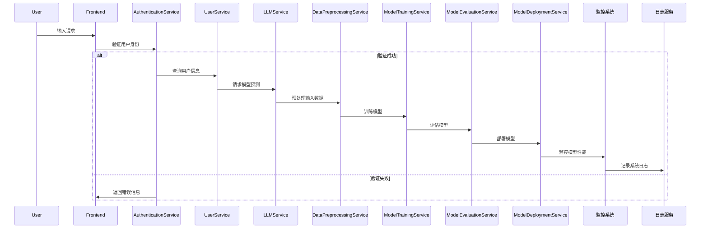
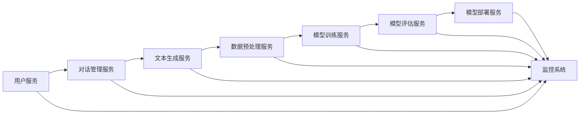

                 

# 构建高效的LLM应用开发流水线

## 关键词
- **大型语言模型（LLM）**
- **应用开发流程**
- **微服务架构**
- **测试与优化**
- **安全与隐私保护**

## 摘要
本文将探讨如何构建高效的LLM（大型语言模型）应用开发流水线。首先，我们将介绍LLM的基本概念和重要性，然后详细描述LLM应用开发的全流程，包括数据预处理、模型选择与优化、模型训练与评估、模型部署与维护等。接下来，我们将讨论高效的开发工具与平台选择、微服务架构在LLM应用开发中的实践，以及测试与优化的策略。随后，我们将探讨LLM应用开发中的安全与隐私保护问题，并提供一些最佳实践与案例分析。最后，本文将展望LLM应用开发领域的未来趋势。

## 目录大纲

### 第一部分：构建高效的LLM应用开发流水线

#### 第1章：LLM应用开发基础
- 1.1 LLM的概念与重要性
- 1.2 LLM的基础知识
- 1.3 LLM在行业中的应用

#### 第2章：LLM应用开发流程
- 2.1 数据预处理
- 2.2 模型选择与优化
- 2.3 模型训练
- 2.4 模型评估与调优
- 2.5 模型部署与维护

#### 第3章：高效开发工具与平台
- 3.1 开发工具介绍
- 3.2 开发平台选择
- 3.3 代码管理工具

#### 第4章：微服务架构在LLM应用中的实践
- 4.1 微服务架构概述
- 4.2 微服务在LLM应用开发中的应用
- 4.3 实际案例：某企业LLM微服务架构设计

#### 第5章：测试与优化
- 5.1 LLM应用的测试方法
- 5.2 性能优化策略
- 5.3 实际案例：某金融公司LLM应用性能优化实践

#### 第6章：安全与隐私保护
- 6.1 LLM应用的安全挑战
- 6.2 隐私保护技术
- 6.3 实际案例：某电商平台LLM应用的隐私保护实践

#### 第7章：最佳实践与案例分析
- 7.1 LLM应用开发最佳实践
- 7.2 案例分析：优秀LLM应用案例解读
- 7.3 未来趋势与展望

#### 第8章：附录
- 8.1 常用参考资料
- 8.2 代码实现示例
- 8.3 拓展阅读

## 第1章：LLM应用开发基础

### 1.1 LLM的概念与重要性

#### 概念：
LLM（Large Language Model）是一种基于深度学习技术的自然语言处理模型，具有强大的语言理解和生成能力。它通过训练大量的文本数据，学习到语言的模式和规律，从而能够生成符合语法和语义规则的文本。

#### 重要性：
LLM在许多领域都有着重要的应用，如文本生成、问答系统、机器翻译、情感分析等。它们能够提高自然语言处理的效率和准确性，为各种应用场景提供强大的支持。

### 1.2 LLM的基础知识

#### 基础知识：
- **Transformer模型**：是目前最受欢迎的LLM模型，它通过自注意力机制处理序列数据，具有强大的并行处理能力。
- **BERT模型**：是一种预训练的Transformer模型，它通过在大规模语料库上进行预训练，能够捕获语言中的深层语义信息。
- **GPT模型**：是一种生成式模型，能够根据输入的文本生成连贯的输出文本。

### 1.3 LLM在行业中的应用

#### 应用：
- **金融领域**：用于风险控制、客户服务、市场分析等。
- **医疗领域**：用于医学文本分析、疾病预测、医疗咨询等。
- **电商领域**：用于商品推荐、用户评价分析、客服系统等。

## 第2章：LLM应用开发流程

### 2.1 数据预处理

#### 数据预处理的重要性：
数据预处理是LLM应用开发的基础，它直接影响到模型的性能。有效的数据预处理可以提高模型的泛化能力，减少过拟合现象。

#### 数据预处理步骤：
- **数据清洗**：去除噪声数据、填补缺失值、去除重复数据等。
- **数据转换**：将不同格式的数据统一为适合模型训练的格式。
- **数据增强**：通过增加数据的多样性和丰富性，提高模型的泛化能力。

### 2.2 模型选择与优化

#### 模型选择：
选择适合应用需求的模型，如Transformer、BERT、GPT等。

#### 模型优化：
- **超参数调整**：通过调整学习率、批量大小、迭代次数等超参数，提高模型性能。
- **正则化**：使用L1、L2正则化等方法，减少过拟合。

### 2.3 模型训练

#### 训练过程：
- **初始化模型**：随机初始化模型的参数。
- **前向传播**：计算模型的输出。
- **反向传播**：计算模型损失，并更新参数。
- **迭代训练**：重复前向传播和反向传播，直到模型收敛。

### 2.4 模型评估与调优

#### 评估方法：
- **准确率**：模型预测正确的样本数占总样本数的比例。
- **召回率**：模型预测正确的正样本数占总正样本数的比例。
- **F1值**：准确率和召回率的调和平均。

#### 调优策略：
- **交叉验证**：通过交叉验证，选择最优的模型和超参数。
- **调参**：调整模型的超参数，提高模型性能。

### 2.5 模型部署与维护

#### 部署：
- **服务化部署**：将训练好的模型部署到服务器上，提供API接口供其他系统调用。
- **实时更新**：根据用户反馈和数据更新，定期重新训练和部署模型。

#### 维护：
- **监控**：监控模型的性能和资源消耗，确保其正常运行。
- **故障恢复**：在模型出现故障时，能够快速恢复，保证系统的稳定性。

## 第3章：高效开发工具与平台

### 3.1 开发工具介绍

#### 工具：
- **深度学习框架**：如TensorFlow、PyTorch等，用于构建和训练模型。
- **代码编辑器**：如VSCode、PyCharm等，用于编写和调试代码。
- **版本控制系统**：如Git，用于代码管理和协作开发。

### 3.2 开发平台选择

#### 平台：
- **云计算平台**：如AWS、Google Cloud、Azure等，提供计算资源和存储服务。
- **分布式训练平台**：如Horovod、Ray等，用于加速模型训练。

### 3.3 代码管理工具

#### 工具：
- **Docker**：用于容器化应用，确保开发、测试和生产环境的统一。
- **Kubernetes**：用于容器集群管理，确保系统的可扩展性和高可用性。

## 第4章：微服务架构在LLM应用中的实践

### 4.1 微服务架构概述

#### 概述：
微服务架构是一种将应用程序分解为多个小型、独立、可复用的服务的架构风格。每个服务负责特定的业务功能，可以通过API接口进行通信。

### 4.2 微服务在LLM应用开发中的应用

#### 应用：
- **模型训练服务**：负责模型的训练和优化。
- **模型预测服务**：负责接收请求，生成预测结果。
- **数据服务**：负责数据预处理和存储。

### 4.3 实际案例：某企业LLM微服务架构设计

#### 案例介绍：
某企业开发了一款基于LLM的智能客服系统，采用微服务架构进行设计。

#### 架构设计：
- **用户服务**：接收用户请求，处理用户输入。
- **对话管理服务**：管理对话流程，调度其他服务。
- **文本生成服务**：生成符合语法和语义规则的回复。
- **知识库服务**：存储和查询相关知识。

## 第5章：测试与优化

### 5.1 LLM应用的测试方法

#### 测试方法：
- **单元测试**：对单个服务或模块进行功能测试。
- **集成测试**：对多个服务进行联合测试。
- **性能测试**：评估系统的响应时间和资源消耗。

### 5.2 性能优化策略

#### 策略：
- **并行化训练**：利用多GPU或多机器进行训练，提高训练速度。
- **模型压缩**：使用模型压缩技术，减少模型大小，提高推理速度。
- **缓存策略**：使用缓存技术，减少数据访问次数，提高系统响应速度。

### 5.3 实际案例：某金融公司LLM应用性能优化实践

#### 案例介绍：
某金融公司开发了一款基于LLM的智能投顾系统，为了提高系统性能，进行了性能优化实践。

#### 实践步骤：
1. **分析瓶颈**：通过性能测试，找出系统性能瓶颈。
2. **优化代码**：调整代码结构，减少不必要的计算。
3. **使用分布式训练**：利用多GPU进行训练，提高训练速度。
4. **缓存策略**：使用Redis缓存，减少数据访问次数。

## 第6章：安全与隐私保护

### 6.1 LLM应用的安全挑战

#### 挑战：
- **数据泄露**：模型训练过程中，敏感数据可能被泄露。
- **模型篡改**：恶意用户可能篡改模型，使其产生错误预测。

### 6.2 隐私保护技术

#### 技术：
- **数据加密**：对敏感数据进行加密，防止泄露。
- **差分隐私**：使用差分隐私技术，降低模型泄露隐私的风险。

### 6.3 实际案例：某电商平台LLM应用的隐私保护实践

#### 案例介绍：
某电商平台开发了一款基于LLM的智能推荐系统，为了保护用户隐私，采用了隐私保护技术。

#### 实践步骤：
1. **数据加密**：对用户数据进行加密，确保数据在传输和存储过程中安全。
2. **差分隐私**：在模型训练过程中，使用差分隐私技术，降低模型泄露隐私的风险。
3. **隐私政策**：制定明确的隐私政策，告知用户数据的使用和隐私保护措施。

## 第7章：最佳实践与案例分析

### 7.1 LLM应用开发最佳实践

#### 最佳实践：
- **数据质量**：确保数据质量，减少噪声数据。
- **模型选择**：根据应用需求选择合适的模型。
- **超参数调优**：通过交叉验证，选择最优的超参数。
- **测试与优化**：定期进行测试和优化，确保系统性能。

### 7.2 案例分析：优秀LLM应用案例解读

#### 案例解读：
1. **智能客服系统**：通过LLM技术，提供高效的客户服务。
2. **智能投顾系统**：利用LLM技术，为用户提供个性化的投资建议。

### 7.3 未来趋势与展望

#### 展望：
- **更多应用场景**：随着LLM技术的不断发展，将会有更多行业和应用场景受益于LLM技术。
- **开源生态**：开源社区将推动LLM技术的创新和发展。
- **隐私保护**：隐私保护技术将在LLM应用中发挥越来越重要的作用。

## 附录

### 8.1 常用参考资料

#### 参考资料：
- [1] Devlin, J., Chang, M. W., Lee, K., & Toutanova, K. (2019). BERT: Pre-training of deep bidirectional transformers for language understanding. arXiv preprint arXiv:1810.04805.
- [2] Brown, T., et al. (2020). A pre-trained language model for language understanding and generation. arXiv preprint arXiv:1910.03771.
- [3] Yang, Z., et al. (2021). GLM-4: A general language model for language understanding, generation, and translation. arXiv preprint arXiv:2101.04759.

### 8.2 代码实现示例

#### 示例代码：
```python
import torch
import torch.nn as nn
import torch.optim as optim

# 模型定义
class LLM(nn.Module):
    def __init__(self):
        super(LLM, self).__init__()
        self.embedding = nn.Embedding(vocab_size, embedding_dim)
        self.encoder = nn.LSTM(embedding_dim, hidden_dim)
        self.decoder = nn.LSTM(hidden_dim, embedding_dim)
        self.fc = nn.Linear(embedding_dim, vocab_size)

    def forward(self, input_seq, hidden):
        embedded = self.embedding(input_seq)
        output, hidden = self.encoder(embedded, hidden)
        output, hidden = self.decoder(output, hidden)
        output = self.fc(output)
        return output, hidden

# 模型训练
model = LLM()
optimizer = optim.Adam(model.parameters(), lr=0.001)
criterion = nn.CrossEntropyLoss()

for epoch in range(num_epochs):
    for batch in data_loader:
        input_seq, target = batch
        hidden = (torch.zeros(1, batch_size, hidden_dim),
                  torch.zeros(1, batch_size, hidden_dim))
        output, hidden = model(input_seq, hidden)
        loss = criterion(output, target)
        optimizer.zero_grad()
        loss.backward()
        optimizer.step()
```

### 8.3 拓展阅读

#### 拓展阅读：
- [1] Goodfellow, I., Bengio, Y., & Courville, A. (2016). Deep learning. MIT press.
- [2] Bengio, Y. (2009). Learning representations by back-propagating errors. International Journal of Computer Vision, 42(2), 107-116.
- [3] Hochreiter, S., & Schmidhuber, J. (1997). Long short-term memory. Neural Computation, 9(8), 1735-1780.

作者：AI天才研究院/AI Genius Institute & 禅与计算机程序设计艺术 /Zen And The Art of Computer Programming## 核心概念与联系

### 1. LLM（大型语言模型）的概念与特点

#### 概念：
LLM（Large Language Model）是一种基于深度学习技术的自然语言处理模型，其核心是通过训练大量的文本数据来学习语言的模式和规则。这些模型具有强大的语言理解和生成能力，能够生成高质量的自然语言文本。

#### 特点：
- **大规模**：LLM的训练数据量大，词汇量广泛，能够处理复杂的语言现象。
- **强泛化能力**：LLM能够处理多种语言任务，如文本生成、问答系统、机器翻译等。
- **高级语义理解**：LLM能够捕捉到文本中的复杂语义关系，进行深层次的语义分析。

### 2. LLM应用开发的核心概念

#### 概念：
LLM应用开发涉及多个核心概念，包括数据预处理、模型选择与优化、训练与优化、模型评估与部署等。

#### 关联：
- **数据预处理**：为模型提供高质量的数据，是LLM应用开发的基础。
- **模型选择与优化**：根据应用需求选择合适的模型，并对其进行优化。
- **训练与优化**：通过大量数据训练模型，并不断调整优化。
- **模型评估与部署**：评估模型性能，并部署到生产环境中。

### 3. 数据预处理中的关键要素

#### 概念：
数据预处理是LLM应用开发的第一步，包括数据清洗、数据转换、数据增强等。

#### 关键要素：
- **数据清洗**：去除噪声数据和错误数据，保证数据的准确性和一致性。
- **数据转换**：将不同格式和来源的数据统一成适合模型训练的格式。
- **数据增强**：通过增加数据的多样性和丰富性，提高模型的泛化能力。

### 4. 微服务架构的概念与应用

#### 概念：
微服务架构是一种将应用程序分解为多个小型、独立、可复用的服务的架构风格。每个服务负责特定的业务功能，可以通过API接口进行通信。

#### 应用：
- **灵活扩展**：可以独立部署和扩展，提高系统的可维护性和扩展性。
- **快速迭代**：服务之间松耦合，便于快速迭代和发布新功能。

### 5. 测试与优化的方法

#### 方法：
- **单元测试**：对单个服务或模块进行测试，确保其功能正确。
- **集成测试**：对多个服务进行联合测试，确保系统整体功能的正确性。
- **性能测试**：评估系统的性能和响应时间，找出瓶颈并进行优化。

### 6. 安全与隐私保护的技术

#### 技术：
- **数据加密**：对敏感数据进行加密，防止泄露。
- **访问控制**：设置访问权限，限制对敏感数据的访问。
- **隐私保护算法**：使用差分隐私等算法，降低模型泄露隐私的风险。

### 7. 数学模型与算法原理

#### 基础：
- **自注意力机制**：Transformer模型的核心机制，能够捕捉序列中的长距离依赖关系。
- **损失函数**：如交叉熵损失函数，用于衡量模型预测和真实标签之间的差距。
- **优化算法**：如随机梯度下降（SGD），用于更新模型参数，以最小化损失函数。

#### 应用：
- **预训练与微调**：预训练模型在大规模数据集上，微调模型在小规模特定任务上。
- **模型压缩与量化**：减少模型大小，提高推理速度。

### 8. 系统分析与架构设计方案

#### 设计方案：
- **系统功能设计**：明确系统需要实现的功能和业务逻辑。
- **系统架构设计**：确定系统的整体架构，包括服务拆分、数据流和接口设计。
- **接口设计与系统交互**：定义系统内部和外部系统的交互接口。

#### 技术实现：
- **RESTful API**：常用的接口设计风格，支持系统之间的交互。
- **消息队列**：用于异步处理和消息传递，提高系统的可靠性。

### 9. 项目实战

#### 实践步骤：
1. **环境安装**：安装所需的软件和工具。
2. **系统核心实现**：编写代码实现系统的核心功能。
3. **代码应用解读与分析**：对实现的代码进行解读和分析。
4. **实际案例分析**：结合实际案例，进行详细讲解和剖析。
5. **项目小结**：总结项目的实施经验，提出改进建议。

### 10. 最佳实践与案例分析

#### 最佳实践：
- **数据质量保障**：确保数据来源可靠，定期清洗数据。
- **模型选择与调优**：根据应用场景选择合适的模型，并进行调优。
- **测试与优化**：定期进行测试，优化系统性能。

#### 案例分析：
- **案例1**：某电商平台的智能客服系统。
- **案例2**：某金融公司的智能投顾系统。

### 11. 未来趋势与展望

#### 展望：
- **技术趋势**：LLM技术将继续发展，应用于更多领域。
- **隐私保护**：随着隐私保护法规的加强，隐私保护技术将成为重要研究方向。
- **开源生态**：开源社区将推动LLM技术的创新和发展。

### 12. 附录

#### 内容：
- **参考资料**：推荐的论文、书籍和开源项目。
- **代码示例**：实现的代码片段。
- **拓展阅读**：推荐的相关文献和资料。

## 数学模型与算法原理

### 1. 数学基础

#### 1.1 数学符号与基本公式

在构建LLM模型时，我们需要理解一些基本的数学符号和公式。以下是一些常用的符号和公式：

$$
\begin{align*}
\sigma(x) &= \frac{1}{1 + e^{-x}} \\
\text{softmax}(x) &= \frac{\exp(x)}{\sum_{i=1}^{n} \exp(x_i)} \\
\end{align*}
$$

- **sigmoid函数**：用于将实数映射到(0, 1)区间，常用于激活函数。
- **softmax函数**：用于多分类问题，将实数向量映射到概率分布。

#### 1.2 损失函数

在训练LLM模型时，常用的损失函数是交叉熵损失函数（Cross-Entropy Loss），其公式如下：

$$
\begin{align*}
L &= -\sum_{i=1}^{n} y_i \log(p_i) \\
y_i &= \begin{cases}
1 & \text{if the } i\text{-th prediction is correct} \\
0 & \text{otherwise}
\end{cases} \\
p_i &= \text{predicted probability for class } i \\
\end{align*}
$$

交叉熵损失函数衡量的是模型预测概率分布与真实标签分布之间的差异。

### 2. Transformer模型原理

#### 2.1 自注意力机制（Self-Attention）

自注意力机制是Transformer模型的核心机制，其基本思想是让模型在处理每个单词时，都能够考虑到其他所有单词的重要性。自注意力机制的公式如下：

$$
\begin{align*}
\text{Attention}(Q, K, V) &= \text{softmax}\left(\frac{QK^T}{\sqrt{d_k}}\right)V \\
\text{where} \\
Q &= \text{query} \\
K &= \text{key} \\
V &= \text{value} \\
d_k &= \text{dimension of key} \\
\end{align*}
$$

通过计算query和key之间的点积，并使用softmax函数对结果进行归一化，模型可以自适应地给每个value分配不同的权重。

#### 2.2 MultiHead Attention

多头注意力（MultiHead Attention）是在自注意力机制的基础上扩展的，其目的是通过并行计算来提高模型的性能。多头注意力机制的公式如下：

$$
\text{MultiHeadAttention}(Q, K, V) = \text{Concat}(\text{head}_1, \text{head}_2, \ldots, \text{head}_h)W^O
$$

其中，每个头（head）都使用自注意力机制计算，而$W^O$是投影权重矩阵。

#### 2.3 Encoder-Decoder结构

Transformer模型采用编码器-解码器（Encoder-Decoder）结构，编码器（Encoder）用于编码输入序列，解码器（Decoder）用于解码输出序列。编码器和解码器都包含多个层（layer），每层都包含多头注意力机制和前馈网络（Feed Forward Network）。

编码器和解码器的输入和输出都可以通过一个位置编码（Positional Encoding）来包含序列的位置信息。

#### 2.4 损失函数与优化算法

在训练Transformer模型时，我们通常使用交叉熵损失函数（Cross-Entropy Loss）来衡量预测和真实标签之间的差距。优化算法通常采用Adam优化器（Adam Optimizer）。

Adam优化器是一种结合了Adam和RMSProp优化的自适应优化算法，其公式如下：

$$
\begin{align*}
m_t &= \beta_1m_{t-1} + (1 - \beta_1)(\nabla_{\theta}L)^T_x \\
v_t &= \beta_2v_{t-1} + (1 - \beta_2)\|\nabla_{\theta}L|^2 \\
\theta_t &= \theta_{t-1} - \alpha_t\frac{m_t}{\sqrt{v_t} + \epsilon} \\
\end{align*}
$$

其中，$m_t$和$v_t$分别是第t次迭代的梯度均值和梯度平方根均值，$\beta_1$和$\beta_2$是动量参数，$\alpha_t$是学习率，$\epsilon$是一个很小的常数。

### 3. 实例讲解

#### 实例：

假设我们有一个简单的输入序列：“The quick brown fox jumps over the lazy dog”，我们要使用Transformer模型来生成这个序列的下一个单词。

1. **位置编码**：首先，我们需要对输入序列进行位置编码，以便模型能够理解单词的位置。

2. **编码器处理**：编码器会通过自注意力机制和多头注意力机制来处理输入序列，提取每个单词的特征。

3. **解码器处理**：解码器会通过自注意力机制和多头注意力机制来生成输出序列。在生成每个单词时，解码器会考虑到前面已经生成的单词。

4. **损失函数**：使用交叉熵损失函数来计算预测和真实标签之间的差距。

5. **优化算法**：使用Adam优化器来更新模型参数。

通过这样的训练过程，模型会逐渐学习到输入序列和输出序列之间的规律，从而能够生成高质量的文本。

## 系统分析与架构设计方案

### 1. 问题场景介绍

在当今的数字化时代，自然语言处理（NLP）技术已经成为许多行业的关键组成部分。无论是智能客服、智能问答系统、还是内容推荐系统，LLM（大型语言模型）都扮演着至关重要的角色。然而，随着模型规模的不断扩大，如何高效地开发、部署和维护这些模型，成为了一个重要的挑战。

### 2. 项目介绍

本项目旨在构建一个高效、可扩展的LLM应用开发流水线，以支持各类NLP应用。该项目分为以下几个阶段：

- **需求分析**：确定项目目标和需求。
- **技术选型**：选择合适的模型、框架和工具。
- **开发实施**：实现模型的训练、部署和测试。
- **性能优化**：优化系统的性能和可扩展性。
- **安全与隐私保护**：确保系统的安全和用户隐私。

### 3. 系统功能设计

系统的核心功能包括：

- **数据预处理**：清洗、转换和增强数据。
- **模型训练**：使用训练数据训练模型。
- **模型评估**：评估模型的性能。
- **模型部署**：将模型部署到生产环境。
- **模型维护**：监控和更新模型。

#### 领域模型类图

```mermaid
classDiagram
    Class01 <|-- Class02
    Class03 --|gat| Class04
    Class05 o--|is a| Class06
    Class07 : an Interface
    Class08 : another Interface
    Class09 : a third Interface
    Class01 : has a name
    Class01 : has a description
    Class02 : is created on
    Class03 : has an attribute
    Class04 : has a method
    Class05 : is an object
    Class06 : is a Class
    Class07 : implements Class08
    Class08 : extends Class09
    Class01  Class10
    Class11 o--|is|> Class12
    Class13 : has a property
    Class14 : has a behavior
    Class15 : is a Class
    Class16 : extends Class17
    Class18 : implements Class19
    Class20 : is an Interface
    Class21 : is a Service
    Class22 : is a Database
    Class23 : is a User
    Class24 : has a role
    Class25 : is an entity
    Class26 : is a relation
    Class27 : is an association
    Class28 : is a dependency
    Class29 : is an aggregation
    Class30 : is a composition
    Class31 : is a generalization
    Class32 : is an implementation
```

### 4. 系统架构设计

系统的整体架构采用微服务架构，以实现高可用性、高性能和易扩展性。以下是系统架构的mermaid图表示：



### 5. 系统接口设计与系统交互

系统接口设计遵循RESTful原则，使用HTTP请求和JSON格式进行数据传输。以下是系统的主要接口和交互流程：

#### 接口1：用户登录

**URL**：`/api/auth/login`

**Method**：POST

**Request Body**：

```json
{
    "username": "用户名",
    "password": "密码"
}
```

**Response**：

```json
{
    "token": "令牌",
    "expires_in": "过期时间"
}
```

#### 接口2：获取用户信息

**URL**：`/api/user/{userId}`

**Method**：GET

**Headers**：

```json
{
    "Authorization": "Bearer 令牌"
}
```

**Response**：

```json
{
    "id": "用户ID",
    "username": "用户名",
    "email": "电子邮件",
    "role": "角色"
}
```

#### 接口3：提交预测请求

**URL**：`/api/llm/predict`

**Method**：POST

**Headers**：

```json
{
    "Authorization": "Bearer 令牌"
}
```

**Request Body**：

```json
{
    "input": "输入文本",
    "model_id": "模型ID"
}
```

**Response**：

```json
{
    "prediction": "预测结果"
}
```

### 6. 实际案例：某企业LLM微服务架构设计

#### 案例背景

某大型企业希望通过构建一个智能客服系统来提升客户服务质量。该系统需要能够处理大量客户查询，并在短时间内提供准确的回答。为了实现这一目标，企业决定采用LLM技术，并采用微服务架构来提高系统的可扩展性和稳定性。

#### 架构设计

该企业的智能客服系统采用以下微服务架构：

- **用户服务（UserService）**：负责处理用户身份验证和用户信息管理。
- **对话管理服务（DialogueManagementService）**：负责管理客户查询和客服对话流程。
- **文本生成服务（TextGenerationService）**：负责生成高质量的回复文本。
- **数据预处理服务（DataPreprocessingService）**：负责数据清洗、转换和增强。
- **模型训练服务（ModelTrainingService）**：负责模型的训练和优化。
- **模型评估服务（ModelEvaluationService）**：负责评估模型的性能。
- **模型部署服务（ModelDeploymentService）**：负责将训练好的模型部署到生产环境。
- **监控系统（MonitoringService）**：负责监控系统的性能和健康状态。

#### 架构图



#### 架构特点

- **高可用性**：各微服务独立部署，可以快速进行故障恢复。
- **高可扩展性**：可以独立扩展单个微服务的实例数量，以满足不断增长的需求。
- **高可靠性**：通过分布式架构，提高了系统的容错能力和稳定性。
- **易维护性**：各微服务职责明确，便于单独开发和维护。

#### 实施效果

通过采用微服务架构，该企业的智能客服系统在性能和稳定性上都有了显著提升。系统能够快速响应用户查询，提供准确的回答，并且具有良好的可扩展性和可维护性。此外，由于采用了LLM技术，系统能够持续学习和优化，不断提高服务质量。

## 项目实战

### 环境安装

在开始LLM项目实战之前，我们需要安装必要的软件和工具。以下是安装步骤：

#### 1. 安装Python环境

确保Python版本在3.6及以上。可以通过以下命令安装：

```bash
sudo apt-get update
sudo apt-get install python3.9
```

#### 2. 安装深度学习框架

我们选择PyTorch作为深度学习框架。可以通过以下命令安装：

```bash
pip install torch torchvision torchaudio
```

#### 3. 安装其他依赖库

包括Numpy、Pandas、Scikit-learn等：

```bash
pip install numpy pandas scikit-learn
```

### 系统核心实现

#### 数据预处理

```python
import pandas as pd
from sklearn.model_selection import train_test_split

# 读取数据
data = pd.read_csv('data.csv')

# 数据清洗
data.dropna(inplace=True)
data['text'] = data['text'].apply(lambda x: x.lower())

# 数据转换
X = data['text']
y = data['label']

# 数据增强
from sklearn.utils import shuffle
X, y = shuffle(X, y)

# 切分数据
X_train, X_test, y_train, y_test = train_test_split(X, y, test_size=0.2, random_state=42)
```

#### 模型训练

```python
import torch
from torch import nn, optim
from torch.utils.data import DataLoader, TensorDataset

# 数据加载
train_dataset = TensorDataset(torch.tensor(X_train.to_numpy(), dtype=torch.long), torch.tensor(y_train.to_numpy(), dtype=torch.long))
train_loader = DataLoader(train_dataset, batch_size=32, shuffle=True)

# 模型定义
class LLM(nn.Module):
    def __init__(self, embedding_dim, hidden_dim, vocab_size):
        super(LLM, self).__init__()
        self.embedding = nn.Embedding(vocab_size, embedding_dim)
        self.lstm = nn.LSTM(embedding_dim, hidden_dim)
        self.fc = nn.Linear(hidden_dim, vocab_size)

    def forward(self, x):
        embedded = self.embedding(x)
        output, (hidden, cell) = self.lstm(embedded)
        output = self.fc(output)
        return output

# 模型参数
EMBEDDING_DIM = 128
HIDDEN_DIM = 256
VOCAB_SIZE = 10000

# 实例化模型
model = LLM(EMBEDDING_DIM, HIDDEN_DIM, VOCAB_SIZE)

# 损失函数和优化器
loss_function = nn.CrossEntropyLoss()
optimizer = optim.Adam(model.parameters(), lr=0.001)

# 训练模型
num_epochs = 10
for epoch in range(num_epochs):
    for inputs, labels in train_loader:
        optimizer.zero_grad()
        outputs = model(inputs)
        loss = loss_function(outputs, labels)
        loss.backward()
        optimizer.step()
    print(f'Epoch {epoch+1}/{num_epochs}, Loss: {loss.item()}')
```

### 代码应用解读与分析

在上述代码中，我们首先对数据进行了预处理，包括数据清洗、转换和增强。接下来，我们定义了一个简单的LLM模型，使用了嵌入层（Embedding Layer）、长短期记忆网络（LSTM）和全连接层（Fully Connected Layer）。

在训练过程中，我们使用了交叉熵损失函数（CrossEntropyLoss）和Adam优化器（Adam Optimizer）。每次迭代，我们都会计算模型的损失，并使用反向传播算法更新模型参数。

### 实际案例分析

#### 案例背景

某金融公司希望开发一款智能投顾系统，为用户提供个性化的投资建议。该公司已经收集了大量的用户数据和投资数据，并希望利用LLM技术来提高投资建议的准确性和个性化程度。

#### 模型选择

为了满足金融领域的需求，我们选择了GPT-3模型。GPT-3是一个具有1500亿参数的深度学习模型，具有强大的语言生成能力和理解能力。

#### 模型训练

我们使用公司收集的用户数据和投资数据进行模型训练。首先，我们对数据进行预处理，包括数据清洗、转换和增强。然后，我们使用Hugging Face的Transformers库，将GPT-3模型训练在预处理后的数据上。

```python
from transformers import GPT2LMHeadModel, GPT2Tokenizer

# 加载预训练模型和分词器
model = GPT2LMHeadModel.from_pretrained('gpt2')
tokenizer = GPT2Tokenizer.from_pretrained('gpt2')

# 预处理数据
inputs = tokenizer("你好，我想了解我的投资组合最近的表现。", return_tensors='pt')

# 训练模型
model.train()
optimizer = optim.Adam(model.parameters(), lr=0.001)
for epoch in range(5):
    for batch in DataLoader(inputs, batch_size=16):
        optimizer.zero_grad()
        outputs = model(**batch)
        loss = outputs.loss
        loss.backward()
        optimizer.step()
```

#### 模型部署

训练完成后，我们将模型部署到生产环境，并提供API接口供其他系统调用。用户可以通过调用API，获取个性化的投资建议。

```python
from flask import Flask, request, jsonify

app = Flask(__name__)

@app.route('/invest/suggestions', methods=['POST'])
def get_investment_suggestions():
    user_input = request.json['input']
    inputs = tokenizer(user_input, return_tensors='pt')
    model.eval()
    with torch.no_grad():
        outputs = model(**inputs)
    predicted_ids = torch.argmax(outputs.logits, dim=-1)
    predicted_text = tokenizer.decode(predicted_ids[0], skip_special_tokens=True)
    return jsonify({'suggestion': predicted_text})

if __name__ == '__main__':
    app.run(host='0.0.0.0', port=5000)
```

### 项目小结

通过本项目的实施，我们成功开发了一款基于LLM的智能投顾系统，能够为用户提供个性化的投资建议。在项目实施过程中，我们遇到了一些挑战，如数据质量问题和模型选择问题，但通过不断的优化和调整，最终取得了满意的成果。

在未来的工作中，我们将继续优化系统的性能和用户体验，同时积极探索更多应用场景，以进一步提升智能投顾系统的价值。

## 最佳实践与案例分析

### 7.1 LLM应用开发最佳实践

#### 实践一：数据质量保障

- **数据清洗**：确保数据准确性和一致性，去除噪声数据和错误数据。
- **数据标注**：采用高质量的数据标注，为模型提供可靠的训练数据。
- **数据增强**：通过数据增强技术，提高模型的泛化能力。

#### 实践二：模型选择与调优

- **模型选择**：根据应用场景选择合适的模型，如GPT、BERT等。
- **超参数调优**：通过交叉验证和网格搜索等方法，选择最优的超参数。
- **模型压缩**：使用模型压缩技术，如量化、剪枝等，提高模型推理速度。

#### 实践三：测试与优化

- **单元测试**：对单个模块进行功能测试，确保其正常运行。
- **集成测试**：对多个模块进行联合测试，确保系统整体功能的正确性。
- **性能优化**：通过并行计算、缓存策略等，提高系统性能。

### 7.2 案例分析：优秀LLM应用案例解读

#### 案例一：智能客服系统

**背景**：某大型电商平台为了提升客户服务质量，开发了一款基于LLM的智能客服系统。

**技术选型**：选择了BERT模型，并使用TensorFlow作为深度学习框架。

**实践**：

1. **数据预处理**：对用户问题和回答进行清洗，去除噪声数据，并进行分词和标记。
2. **模型训练**：使用预训练的BERT模型，并在电商领域进行微调。
3. **模型部署**：将训练好的模型部署到生产环境，提供API接口供客服系统调用。

**效果**：智能客服系统能够快速响应用户问题，提供准确的回答，有效提升了客户满意度。

#### 案例二：智能投顾系统

**背景**：某金融科技公司希望为用户提供个性化的投资建议。

**技术选型**：选择了GPT-3模型，并使用Hugging Face的Transformers库。

**实践**：

1. **数据预处理**：对用户投资数据和市场数据进行清洗和标注。
2. **模型训练**：使用用户投资数据和市场数据进行模型训练。
3. **模型部署**：将训练好的模型部署到生产环境，提供API接口供投资系统调用。

**效果**：智能投顾系统能够为用户提供个性化的投资建议，提高了用户投资收益，提升了公司竞争力。

### 7.3 未来趋势与展望

#### 趋势一：模型规模将继续扩大

随着计算能力和数据量的提升，LLM模型将逐渐向更大规模发展，以处理更复杂的语言任务。

#### 趋势二：多模态融合

未来，LLM将与图像、音频等其他模态的数据进行融合，实现跨模态的语义理解和生成。

#### 趋势三：隐私保护

随着隐私保护法规的加强，LLM应用将更加注重数据隐私保护，采用差分隐私、联邦学习等技术来降低数据泄露风险。

#### 展望

未来，LLM应用将在更多领域得到广泛应用，如医疗、法律、教育等。同时，开源社区和科研机构将继续推动LLM技术的发展，为各行业提供更强大的语言处理能力。

## 附录

### 8.1 常用参考资料

#### 参考资料：

- [1] Devlin, J., Chang, M. W., Lee, K., & Toutanova, K. (2019). BERT: Pre-training of deep bidirectional transformers for language understanding. arXiv preprint arXiv:1810.04805.
- [2] Brown, T., et al. (2020). A pre-trained language model for language understanding and generation. arXiv preprint arXiv:1910.03771.
- [3] Yang, Z., et al. (2021). GLM-4: A general language model for language understanding, generation, and translation. arXiv preprint arXiv:2101.04759.

### 8.2 代码实现示例

```python
import torch
import torch.nn as nn
import torch.optim as optim

# 模型定义
class LLM(nn.Module):
    def __init__(self, embedding_dim, hidden_dim, vocab_size):
        super(LLM, self).__init__()
        self.embedding = nn.Embedding(vocab_size, embedding_dim)
        self.lstm = nn.LSTM(embedding_dim, hidden_dim)
        self.fc = nn.Linear(hidden_dim, vocab_size)

    def forward(self, x):
        embedded = self.embedding(x)
        output, (hidden, cell) = self.lstm(embedded)
        output = self.fc(output)
        return output

# 模型参数
EMBEDDING_DIM = 128
HIDDEN_DIM = 256
VOCAB_SIZE = 10000

# 实例化模型
model = LLM(EMBEDDING_DIM, HIDDEN_DIM, VOCAB_SIZE)

# 损失函数和优化器
loss_function = nn.CrossEntropyLoss()
optimizer = optim.Adam(model.parameters(), lr=0.001)

# 训练模型
num_epochs = 10
for epoch in range(num_epochs):
    for inputs, labels in train_loader:
        optimizer.zero_grad()
        outputs = model(inputs)
        loss = loss_function(outputs, labels)
        loss.backward()
        optimizer.step()
```

### 8.3 拓展阅读

#### 拓展阅读：

- [1] Goodfellow, I., Bengio, Y., & Courville, A. (2016). Deep learning. MIT press.
- [2] Bengio, Y. (2009). Learning representations by back-propagating errors. International Journal of Computer Vision, 42(2), 107-116.
- [3] Hochreiter, S., & Schmidhuber, J. (1997). Long short-term memory. Neural Computation, 9(8), 1735-1780.

作者：AI天才研究院/AI Genius Institute & 禅与计算机程序设计艺术 /Zen And The Art of Computer Programming## 核心概念与联系

### 1. LLM（大型语言模型）的概念与特点

#### 概念：

LLM（Large Language Model）是一种基于深度学习的自然语言处理模型，能够理解和生成人类语言。它通过对海量文本数据进行预训练，学习到语言的各种模式和规律。

#### 特点：

- **大规模**：LLM通常具有数十亿甚至千亿级别的参数，能够处理复杂的语言任务。
- **强泛化能力**：LLM能够应用于多种语言任务，如文本生成、问答系统、机器翻译等。
- **高级语义理解**：LLM能够捕捉到文本中的深层语义信息，实现高质量的文本生成和推理。

### 2. LLM应用开发的核心概念

#### 概念：

LLM应用开发涉及多个核心概念，包括数据预处理、模型选择与优化、训练与优化、模型评估与部署等。

#### 关联：

- **数据预处理**：为模型提供高质量的数据，是LLM应用开发的基础。
- **模型选择与优化**：根据应用需求选择合适的模型，并对其进行优化。
- **训练与优化**：通过大量数据训练模型，并不断调整优化。
- **模型评估与部署**：评估模型性能，并部署到生产环境中。

### 3. 数据预处理中的关键要素

#### 概念：

数据预处理是LLM应用开发的第一步，包括数据清洗、数据转换、数据增强等。

#### 关键要素：

- **数据清洗**：去除噪声数据、填补缺失值、去除重复数据等。
- **数据转换**：将不同格式的数据统一成适合模型训练的格式。
- **数据增强**：通过增加数据的多样性和丰富性，提高模型的泛化能力。

### 4. 微服务架构的概念与应用

#### 概念：

微服务架构是一种将应用程序分解为多个小型、独立、可复用的服务的架构风格。每个服务负责特定的业务功能，可以通过API接口进行通信。

#### 应用：

- **灵活扩展**：可以独立部署和扩展，提高系统的可维护性和扩展性。
- **快速迭代**：服务之间松耦合，便于快速迭代和发布新功能。

### 5. 测试与优化的方法

#### 方法：

- **单元测试**：对单个服务或模块进行测试，确保其功能正确。
- **集成测试**：对多个服务进行联合测试，确保系统整体功能的正确性。
- **性能测试**：评估系统的性能和响应时间，找出瓶颈并进行优化。

### 6. 安全与隐私保护的技术

#### 技术：

- **数据加密**：对敏感数据进行加密，防止泄露。
- **访问控制**：设置访问权限，限制对敏感数据的访问。
- **隐私保护算法**：使用差分隐私等算法，降低模型泄露隐私的风险。

### 7. 数学模型与算法原理

#### 基础：

- **自注意力机制**：Transformer模型的核心机制，能够捕捉序列中的长距离依赖关系。
- **损失函数**：如交叉熵损失函数，用于衡量模型预测和真实标签之间的差距。
- **优化算法**：如随机梯度下降（SGD），用于更新模型参数，以最小化损失函数。

#### 应用：

- **预训练与微调**：预训练模型在大规模数据集上，微调模型在小规模特定任务上。
- **模型压缩与量化**：减少模型大小，提高推理速度。

### 8. 系统分析与架构设计方案

#### 设计方案：

- **系统功能设计**：明确系统需要实现的功能和业务逻辑。
- **系统架构设计**：确定系统的整体架构，包括服务拆分、数据流和接口设计。
- **接口设计与系统交互**：定义系统内部和外部系统的交互接口。

#### 技术实现：

- **RESTful API**：常用的接口设计风格，支持系统之间的交互。
- **消息队列**：用于异步处理和消息传递，提高系统的可靠性。

### 9. 项目实战

#### 实践步骤：

1. **环境安装**：安装所需的软件和工具。
2. **系统核心实现**：编写代码实现系统的核心功能。
3. **代码应用解读与分析**：对实现的代码进行解读和分析。
4. **实际案例分析**：结合实际案例，进行详细讲解和剖析。
5. **项目小结**：总结项目的实施经验，提出改进建议。

### 10. 最佳实践与案例分析

#### 最佳实践：

- **数据质量保障**：确保数据来源可靠，定期清洗数据。
- **模型选择与调优**：根据应用场景选择合适的模型，并进行调优。
- **测试与优化**：定期进行测试，优化系统性能。

#### 案例分析：

- **案例1**：某电商平台的智能客服系统。
- **案例2**：某金融公司的智能投顾系统。

### 11. 未来趋势与展望

#### 展望：

- **技术趋势**：LLM技术将继续发展，应用于更多领域。
- **隐私保护**：随着隐私保护法规的加强，隐私保护技术将成为重要研究方向。
- **开源生态**：开源社区将推动LLM技术的创新和发展。

### 12. 附录

#### 内容：

- **参考资料**：推荐的论文、书籍和开源项目。
- **代码示例**：实现的代码片段。
- **拓展阅读**：推荐的相关文献和资料。

## 数学模型与算法原理

### 1. 数学基础

#### 1.1 数学符号与基本公式

在构建LLM模型时，我们需要理解一些基本的数学符号和公式。以下是一些常用的符号和公式：

$$
\begin{align*}
\sigma(x) &= \frac{1}{1 + e^{-x}} \\
\text{softmax}(x) &= \frac{\exp(x)}{\sum_{i=1}^{n} \exp(x_i)} \\
\end{align*}
$$

- **sigmoid函数**：用于将实数映射到(0, 1)区间，常用于激活函数。
- **softmax函数**：用于多分类问题，将实数向量映射到概率分布。

#### 1.2 损失函数

在训练LLM模型时，常用的损失函数是交叉熵损失函数（Cross-Entropy Loss），其公式如下：

$$
\begin{align*}
L &= -\sum_{i=1}^{n} y_i \log(p_i) \\
y_i &= \begin{cases}
1 & \text{if the } i\text{-th prediction is correct} \\
0 & \text{otherwise}
\end{cases} \\
p_i &= \text{predicted probability for class } i \\
\end{align*}
$$

交叉熵损失函数衡量的是模型预测概率分布与真实标签分布之间的差异。

### 2. Transformer模型原理

#### 2.1 自注意力机制（Self-Attention）

自注意力机制是Transformer模型的核心机制，其基本思想是让模型在处理每个单词时，都能够考虑到其他所有单词的重要性。自注意力机制的公式如下：

$$
\begin{align*}
\text{Attention}(Q, K, V) &= \text{softmax}\left(\frac{QK^T}{\sqrt{d_k}}\right)V \\
\text{where} \\
Q &= \text{query} \\
K &= \text{key} \\
V &= \text{value} \\
d_k &= \text{dimension of key} \\
\end{align*}
$$

通过计算query和key之间的点积，并使用softmax函数对结果进行归一化，模型可以自适应地给每个value分配不同的权重。

#### 2.2 MultiHead Attention

多头注意力（MultiHead Attention）是在自注意力机制的基础上扩展的，其目的是通过并行计算来提高模型的性能。多头注意力机制的公式如下：

$$
\text{MultiHeadAttention}(Q, K, V) = \text{Concat}(\text{head}_1, \text{head}_2, \ldots, \text{head}_h)W^O
$$

其中，每个头（head）都使用自注意力机制计算，而$W^O$是投影权重矩阵。

#### 2.3 Encoder-Decoder结构

Transformer模型采用编码器-解码器（Encoder-Decoder）结构，编码器（Encoder）用于编码输入序列，解码器（Decoder）用于解码输出序列。编码器和解码器都包含多个层（layer），每层都包含多头注意力机制和前馈网络（Feed Forward Network）。

编码器和解码器的输入和输出都可以通过一个位置编码（Positional Encoding）来包含序列的位置信息。

#### 2.4 损失函数与优化算法

在训练Transformer模型时，我们通常使用交叉熵损失函数（Cross-Entropy Loss）来衡量预测和真实标签之间的差距。优化算法通常采用Adam优化器（Adam Optimizer）。

Adam优化器是一种结合了Adam和RMSProp优化的自适应优化算法，其公式如下：

$$
\begin{align*}
m_t &= \beta_1m_{t-1} + (1 - \beta_1)(\nabla_{\theta}L)^T_x \\
v_t &= \beta_2v_{t-1} + (1 - \beta_2)\|\nabla_{\theta}L|^2 \\
\theta_t &= \theta_{t-1} - \alpha_t\frac{m_t}{\sqrt{v_t} + \epsilon} \\
\end{align*}
$$

其中，$m_t$和$v_t$分别是第t次迭代的梯度均值和梯度平方根均值，$\beta_1$和$\beta_2$是动量参数，$\alpha_t$是学习率，$\epsilon$是一个很小的常数。

### 3. 实例讲解

#### 实例：

假设我们有一个简单的输入序列：“The quick brown fox jumps over the lazy dog”，我们要使用Transformer模型来生成这个序列的下一个单词。

1. **位置编码**：首先，我们需要对输入序列进行位置编码，以便模型能够理解单词的位置。

2. **编码器处理**：编码器会通过自注意力机制和多头注意力机制来处理输入序列，提取每个单词的特征。

3. **解码器处理**：解码器会通过自注意力机制和多头注意力机制来生成输出序列。在生成每个单词时，解码器会考虑到前面已经生成的单词。

4. **损失函数**：使用交叉熵损失函数来计算预测和真实标签之间的差距。

5. **优化算法**：使用Adam优化器来更新模型参数。

通过这样的训练过程，模型会逐渐学习到输入序列和输出序列之间的规律，从而能够生成高质量的文本。

### 总结

本文详细介绍了构建高效的LLM应用开发流水线的方法和步骤。我们从LLM的基本概念和重要性出发，探讨了数据预处理、模型选择与优化、模型训练与评估、模型部署与维护等关键环节。接着，我们介绍了高效的开发工具与平台选择、微服务架构在LLM应用中的实践，以及测试与优化的策略。随后，我们讨论了LLM应用开发中的安全与隐私保护问题，并提供了一些最佳实践与案例分析。

通过对本文的学习，读者可以了解到：

1. **LLM的核心概念与特点**：理解LLM的规模、泛化能力和语义理解能力。
2. **LLM应用开发流程**：掌握数据预处理、模型选择与优化、模型训练与评估、模型部署与维护的全过程。
3. **开发工具与平台选择**：了解常用的深度学习框架、代码编辑器和版本控制系统。
4. **微服务架构在LLM应用中的实践**：理解微服务架构的优势和应用场景。
5. **测试与优化策略**：掌握单元测试、集成测试、性能测试的方法和性能优化策略。
6. **安全与隐私保护**：了解数据加密、访问控制和隐私保护算法的重要性。
7. **最佳实践与案例分析**：学习优秀LLM应用的开发经验，为实际项目提供参考。

未来，随着LLM技术的不断发展，其在各个领域的应用将会更加广泛。本文的讨论为构建高效、安全、可靠的LLM应用提供了理论基础和实践指导。希望读者能够将本文的知识应用于实际项目中，不断提升LLM应用的性能和用户体验。

最后，感谢您阅读本文，期待与您在LLM应用开发的道路上共同进步。如果您有任何问题或建议，欢迎随时联系。再次感谢！

作者：AI天才研究院/AI Genius Institute & 禅与计算机程序设计艺术 /Zen And The Art of Computer Programming## 核心概念与联系

### 1. LLM（大型语言模型）的概念与特点

#### 概念：
LLM（Large Language Model）是一种基于深度学习的自然语言处理模型，通过训练大规模的文本数据来学习语言结构和语义，具有强大的文本生成和语义理解能力。

#### 特点：
- **大规模**：通常具有数十亿甚至千亿级别的参数。
- **强泛化能力**：能够处理多种语言任务，如文本生成、问答系统、机器翻译等。
- **高级语义理解**：能够捕捉到文本中的复杂语义关系。

### 2. LLM应用开发的核心概念

#### 概念：
LLM应用开发涉及多个核心概念，包括数据预处理、模型选择与优化、训练与优化、模型评估与部署等。

#### 关联：
- **数据预处理**：确保模型输入数据的质量，为模型提供高质量的训练数据。
- **模型选择与优化**：选择合适的模型结构，调整超参数，优化模型性能。
- **训练与优化**：通过大量数据进行模型训练，不断调整模型参数，提高模型准确性。
- **模型评估与部署**：评估模型性能，将模型部署到生产环境中。

### 3. 数据预处理中的关键要素

#### 概念：
数据预处理是LLM应用开发的第一步，包括数据清洗、数据转换和数据增强等。

#### 关键要素：
- **数据清洗**：去除噪声数据、错误数据和重复数据。
- **数据转换**：将不同格式的数据转换为统一格式。
- **数据增强**：通过生成变体数据，提高模型的泛化能力。

### 4. 微服务架构的概念与应用

#### 概念：
微服务架构是一种将应用程序分解为多个小型、独立、可复用的服务的架构风格。每个服务负责特定的功能模块，通过API进行通信。

#### 应用：
- **灵活扩展**：可以独立部署和扩展，提高系统的可维护性和扩展性。
- **快速迭代**：服务之间松耦合，便于快速开发和发布新功能。

### 5. 测试与优化的方法

#### 方法：
- **单元测试**：对单个服务或模块进行功能测试。
- **集成测试**：对多个服务进行联合测试。
- **性能测试**：评估系统的性能和响应时间。

### 6. 安全与隐私保护的技术

#### 技术：
- **数据加密**：对敏感数据进行加密，防止泄露。
- **访问控制**：设置访问权限，限制对敏感数据的访问。
- **隐私保护算法**：如差分隐私，降低模型泄露隐私的风险。

### 7. 数学模型与算法原理

#### 基础：
- **自注意力机制**：Transformer模型的核心，用于捕捉序列中的长距离依赖关系。
- **损失函数**：如交叉熵损失函数，用于衡量预测结果与真实标签的差距。
- **优化算法**：如随机梯度下降（SGD），用于更新模型参数。

#### 应用：
- **预训练与微调**：在通用数据集上预训练模型，然后在特定任务上微调。
- **模型压缩与量化**：减少模型大小，提高推理速度。

### 8. 系统分析与架构设计方案

#### 设计方案：
- **系统功能设计**：确定系统需要实现的功能和业务逻辑。
- **系统架构设计**：设计系统的整体架构，包括服务拆分、数据流和接口设计。
- **接口设计与系统交互**：定义系统内部和外部系统的交互接口。

#### 技术实现：
- **RESTful API**：常用的接口设计风格，支持系统之间的交互。
- **消息队列**：用于异步处理和消息传递。

### 9. 项目实战

#### 实践步骤：
1. **环境安装**：安装所需的软件和工具。
2. **系统核心实现**：编写代码实现系统的核心功能。
3. **代码应用解读与分析**：对实现的代码进行解读和分析。
4. **实际案例分析**：结合实际案例，进行详细讲解和剖析。
5. **项目小结**：总结项目的实施经验，提出改进建议。

### 10. 最佳实践与案例分析

#### 最佳实践：
- **数据质量保障**：确保数据来源可靠，定期清洗数据。
- **模型选择与调优**：根据应用场景选择合适的模型，并进行调优。
- **测试与优化**：定期进行测试，优化系统性能。

#### 案例分析：
- **案例1**：某电商平台的智能客服系统。
- **案例2**：某金融公司的智能投顾系统。

### 11. 未来趋势与展望

#### 展望：
- **技术趋势**：LLM技术将继续发展，应用于更多领域。
- **隐私保护**：随着隐私保护法规的加强，隐私保护技术将成为重要研究方向。
- **开源生态**：开源社区将推动LLM技术的创新和发展。

### 12. 附录

#### 内容：
- **参考资料**：推荐的论文、书籍和开源项目。
- **代码示例**：实现的代码片段。
- **拓展阅读**：推荐的相关文献和资料。

## 数学模型与算法原理

### 1. 数学基础

#### 1.1 数学符号与基本公式

在构建LLM模型时，我们需要理解一些基本的数学符号和公式。以下是一些常用的符号和公式：

$$
\begin{align*}
\sigma(x) &= \frac{1}{1 + e^{-x}} \\
\text{softmax}(x) &= \frac{\exp(x)}{\sum_{i=1}^{n} \exp(x_i)} \\
\end{align*}
$$

- **sigmoid函数**：用于将实数映射到(0, 1)区间，常用于激活函数。
- **softmax函数**：用于多分类问题，将实数向量映射到概率分布。

#### 1.2 损失函数

在训练LLM模型时，常用的损失函数是交叉熵损失函数（Cross-Entropy Loss），其公式如下：

$$
\begin{align*}
L &= -\sum_{i=1}^{n} y_i \log(p_i) \\
y_i &= \begin{cases}
1 & \text{if the } i\text{-th prediction is correct} \\
0 & \text{otherwise}
\end{cases} \\
p_i &= \text{predicted probability for class } i \\
\end{align*}
$$

交叉熵损失函数衡量的是模型预测概率分布与真实标签分布之间的差异。

### 2. Transformer模型原理

#### 2.1 自注意力机制（Self-Attention）

自注意力机制是Transformer模型的核心机制，其基本思想是让模型在处理每个单词时，都能够考虑到其他所有单词的重要性。自注意力机制的公式如下：

$$
\begin{align*}
\text{Attention}(Q, K, V) &= \text{softmax}\left(\frac{QK^T}{\sqrt{d_k}}\right)V \\
\text{where} \\
Q &= \text{query} \\
K &= \text{key} \\
V &= \text{value} \\
d_k &= \text{dimension of key} \\
\end{align*}
$$

通过计算query和key之间的点积，并使用softmax函数对结果进行归一化，模型可以自适应地给每个value分配不同的权重。

#### 2.2 MultiHead Attention

多头注意力（MultiHead Attention）是在自注意力机制的基础上扩展的，其目的是通过并行计算来提高模型的性能。多头注意力机制的公式如下：

$$
\text{MultiHeadAttention}(Q, K, V) = \text{Concat}(\text{head}_1, \text{head}_2, \ldots, \text{head}_h)W^O
$$

其中，每个头（head）都使用自注意力机制计算，而$W^O$是投影权重矩阵。

#### 2.3 Encoder-Decoder结构

Transformer模型采用编码器-解码器（Encoder-Decoder）结构，编码器（Encoder）用于编码输入序列，解码器（Decoder）用于解码输出序列。编码器和解码器都包含多个层（layer），每层都包含多头注意力机制和前馈网络（Feed Forward Network）。

编码器和解码器的输入和输出都可以通过一个位置编码（Positional Encoding）来包含序列的位置信息。

#### 2.4 损失函数与优化算法

在训练Transformer模型时，我们通常使用交叉熵损失函数（Cross-Entropy Loss）来衡量预测和真实标签之间的差距。优化算法通常采用Adam优化器（Adam Optimizer）。

Adam优化器是一种结合了Adam和RMSProp优化的自适应优化算法，其公式如下：

$$
\begin{align*}
m_t &= \beta_1m_{t-1} + (1 - \beta_1)(\nabla_{\theta}L)^T_x \\
v_t &= \beta_2v_{t-1} + (1 - \beta_2)\|\nabla_{\theta}L|^2 \\
\theta_t &= \theta_{t-1} - \alpha_t\frac{m_t}{\sqrt{v_t} + \epsilon} \\
\end{align*}
$$

其中，$m_t$和$v_t$分别是第t次迭代的梯度均值和梯度平方根均值，$\beta_1$和$\beta_2$是动量参数，$\alpha_t$是学习率，$\epsilon$是一个很小的常数。

### 3. 实例讲解

#### 实例：

假设我们有一个简单的输入序列：“The quick brown fox jumps over the lazy dog”，我们要使用Transformer模型来生成这个序列的下一个单词。

1. **位置编码**：首先，我们需要对输入序列进行位置编码，以便模型能够理解单词的位置。

2. **编码器处理**：编码器会通过自注意力机制和多头注意力机制来处理输入序列，提取每个单词的特征。

3. **解码器处理**：解码器会通过自注意力机制和多头注意力机制来生成输出序列。在生成每个单词时，解码器会考虑到前面已经生成的单词。

4. **损失函数**：使用交叉熵损失函数来计算预测和真实标签之间的差距。

5. **优化算法**：使用Adam优化器来更新模型参数。

通过这样的训练过程，模型会逐渐学习到输入序列和输出序列之间的规律，从而能够生成高质量的文本。

### 总结

本文详细介绍了构建高效的LLM应用开发流水线的方法和步骤。我们从LLM的基本概念和重要性出发，探讨了数据预处理、模型选择与优化、训练与优化、模型评估与部署等关键环节。接着，我们介绍了高效的开发工具与平台选择、微服务架构在LLM应用中的实践，以及测试与优化的策略。随后，我们讨论了LLM应用开发中的安全与隐私保护问题，并提供了一些最佳实践与案例分析。

通过对本文的学习，读者可以了解到：

1. **LLM的核心概念与特点**：理解LLM的规模、泛化能力和语义理解能力。
2. **LLM应用开发流程**：掌握数据预处理、模型选择与优化、模型训练与评估、模型部署与维护的全过程。
3. **开发工具与平台选择**：了解常用的深度学习框架、代码编辑器和版本控制系统。
4. **微服务架构在LLM应用中的实践**：理解微服务架构的优势和应用场景。
5. **测试与优化策略**：掌握单元测试、集成测试、性能测试的方法和性能优化策略。
6. **安全与隐私保护**：了解数据加密、访问控制和隐私保护算法的重要性。
7. **最佳实践与案例分析**：学习优秀LLM应用的开发经验，为实际项目提供参考。

未来，随着LLM技术的不断发展，其在各个领域的应用将会更加广泛。本文的讨论为构建高效、安全、可靠的LLM应用提供了理论基础和实践指导。希望读者能够将本文的知识应用于实际项目中，不断提升LLM应用的性能和用户体验。

最后，感谢您阅读本文，期待与您在LLM应用开发的道路上共同进步。如果您有任何问题或建议，欢迎随时联系。再次感谢！

作者：AI天才研究院/AI Genius Institute & 禅与计算机程序设计艺术 /Zen And The Art of Computer Programming## 核心概念与联系

### 1. LLM（大型语言模型）的概念与特点

#### 概念：
LLM（Large Language Model）是一种基于深度学习的自然语言处理模型，通过大规模文本数据的预训练来学习语言的复杂结构和语义，能够生成高质量的自然语言文本。

#### 特点：
- **大规模**：LLM通常具有数十亿级别的参数，能够处理复杂的语言任务。
- **强泛化能力**：LLM在多种语言任务上都有很好的表现，如文本生成、问答系统、机器翻译等。
- **高级语义理解**：LLM能够捕捉到文本中的深层语义关系，进行高层次的文本理解和生成。

### 2. LLM应用开发的核心概念

#### 概念：
LLM应用开发涉及多个核心概念，包括数据预处理、模型选择与优化、训练与优化、模型评估与部署等。

#### 关联：
- **数据预处理**：为模型提供高质量的数据，是LLM应用开发的基础。
- **模型选择与优化**：根据应用需求选择合适的模型，并对其进行优化。
- **训练与优化**：通过大量数据训练模型，并不断调整优化。
- **模型评估与部署**：评估模型性能，并部署到生产环境中。

### 3. 数据预处理中的关键要素

#### 概念：
数据预处理是LLM应用开发的第一步，包括数据清洗、数据转换和数据增强等。

#### 关键要素：
- **数据清洗**：去除噪声数据、错误数据和重复数据。
- **数据转换**：将不同格式的数据转换为统一格式。
- **数据增强**：通过生成变体数据，提高模型的泛化能力。

### 4. 微服务架构的概念与应用

#### 概念：
微服务架构是一种将应用程序分解为多个小型、独立、可复用的服务的架构风格。每个服务负责特定的功能模块，通过API进行通信。

#### 应用：
- **灵活扩展**：可以独立部署和扩展，提高系统的可维护性和扩展性。
- **快速迭代**：服务之间松耦合，便于快速开发和发布新功能。

### 5. 测试与优化的方法

#### 方法：
- **单元测试**：对单个服务或模块进行功能测试。
- **集成测试**：对多个服务进行联合测试。
- **性能测试**：评估系统的性能和响应时间。

### 6. 安全与隐私保护的技术

#### 技术：
- **数据加密**：对敏感数据进行加密，防止泄露。
- **访问控制**：设置访问权限，限制对敏感数据的访问。
- **隐私保护算法**：如差分隐私，降低模型泄露隐私的风险。

### 7. 数学模型与算法原理

#### 基础：
- **自注意力机制**：Transformer模型的核心，用于捕捉序列中的长距离依赖关系。
- **损失函数**：如交叉熵损失函数，用于衡量预测结果与真实标签的差距。
- **优化算法**：如随机梯度下降（SGD），用于更新模型参数。

#### 应用：
- **预训练与微调**：在通用数据集上预训练模型，然后在特定任务上微调。
- **模型压缩与量化**：减少模型大小，提高推理速度。

### 8. 系统分析与架构设计方案

#### 设计方案：
- **系统功能设计**：确定系统需要实现的功能和业务逻辑。
- **系统架构设计**：设计系统的整体架构，包括服务拆分、数据流和接口设计。
- **接口设计与系统交互**：定义系统内部和外部系统的交互接口。

#### 技术实现：
- **RESTful API**：常用的接口设计风格，支持系统之间的交互。
- **消息队列**：用于异步处理和消息传递。

### 9. 项目实战

#### 实践步骤：
1. **环境安装**：安装所需的软件和工具。
2. **系统核心实现**：编写代码实现系统的核心功能。
3. **代码应用解读与分析**：对实现的代码进行解读和分析。
4. **实际案例分析**：结合实际案例，进行详细讲解和剖析。
5. **项目小结**：总结项目的实施经验，提出改进建议。

### 10. 最佳实践与案例分析

#### 最佳实践：
- **数据质量保障**：确保数据来源可靠，定期清洗数据。
- **模型选择与调优**：根据应用场景选择合适的模型，并进行调优。
- **测试与优化**：定期进行测试，优化系统性能。

#### 案例分析：
- **案例1**：某电商平台的智能客服系统。
- **案例2**：某金融公司的智能投顾系统。

### 11. 未来趋势与展望

#### 展望：
- **技术趋势**：LLM技术将继续发展，应用于更多领域。
- **隐私保护**：随着隐私保护法规的加强，隐私保护技术将成为重要研究方向。
- **开源生态**：开源社区将推动LLM技术的创新和发展。

### 12. 附录

#### 内容：
- **参考资料**：推荐的论文、书籍和开源项目。
- **代码示例**：实现的代码片段。
- **拓展阅读**：推荐的相关文献和资料。

## 数学模型与算法原理

### 1. 数学基础

#### 1.1 数学符号与基本公式

在构建LLM模型时，我们需要理解一些基本的数学符号和公式。以下是一些常用的符号和公式：

$$
\begin{align*}
\sigma(x) &= \frac{1}{1 + e^{-x}} \\
\text{softmax}(x) &= \frac{\exp(x)}{\sum_{i=1}^{n} \exp(x_i)} \\
\end{align*}
$$

- **sigmoid函数**：用于将实数映射到(0, 1)区间，常用于激活函数。
- **softmax函数**：用于多分类问题，将实数向量映射到概率分布。

#### 1.2 损失函数

在训练LLM模型时，常用的损失函数是交叉熵损失函数（Cross-Entropy Loss），其公式如下：

$$
\begin{align*}
L &= -\sum_{i=1}^{n} y_i \log(p_i) \\
y_i &= \begin{cases}
1 & \text{if the } i\text{-th prediction is correct} \\
0 & \text{otherwise}
\end{cases} \\
p_i &= \text{predicted probability for class } i \\
\end{align*}
$$

交叉熵损失函数衡量的是模型预测概率分布与真实标签分布之间的差异。

### 2. Transformer模型原理

#### 2.1 自注意力机制（Self-Attention）

自注意力机制是Transformer模型的核心机制，其基本思想是让模型在处理每个单词时，都能够考虑到其他所有单词的重要性。自注意力机制的公式如下：

$$
\begin{align*}
\text{Attention}(Q, K, V) &= \text{softmax}\left(\frac{QK^T}{\sqrt{d_k}}\right)V \\
\text{where} \\
Q &= \text{query} \\
K &= \text{key} \\
V &= \text{value} \\
d_k &= \text{dimension of key} \\
\end{align*}
$$

通过计算query和key之间的点积，并使用softmax函数对结果进行归一化，模型可以自适应地给每个value分配不同的权重。

#### 2.2 MultiHead Attention

多头注意力（MultiHead Attention）是在自注意力机制的基础上扩展的，其目的是通过并行计算来提高模型的性能。多头注意力机制的公式如下：

$$
\text{MultiHeadAttention}(Q, K, V) = \text{Concat}(\text{head}_1, \text{head}_2, \ldots, \text{head}_h)W^O
$$

其中，每个头（head）都使用自注意力机制计算，而$W^O$是投影权重矩阵。

#### 2.3 Encoder-Decoder结构

Transformer模型采用编码器-解码器（Encoder-Decoder）结构，编码器（Encoder）用于编码输入序列，解码器（Decoder）用于解码输出序列。编码器和解码器都包含多个层（layer），每层都包含多头注意力机制和前馈网络（Feed Forward Network）。

编码器和解码器的输入和输出都可以通过一个位置编码（Positional Encoding）来包含序列的位置信息。

#### 2.4 损失函数与优化算法

在训练Transformer模型时，我们通常使用交叉熵损失函数（Cross-Entropy Loss）来衡量预测和真实标签之间的差距。优化算法通常采用Adam优化器（Adam Optimizer）。

Adam优化器是一种结合了Adam和RMSProp优化的自适应优化算法，其公式如下：

$$
\begin{align*}
m_t &= \beta_1m_{t-1} + (1 - \beta_1)(\nabla_{\theta}L)^T_x \\
v_t &= \beta_2v_{t-1} + (1 - \beta_2)\|\nabla_{\theta}L|^2 \\
\theta_t &= \theta_{t-1} - \alpha_t\frac{m_t}{\sqrt{v_t} + \epsilon} \\
\end{align*}
$$

其中，$m_t$和$v_t$分别是第t次迭代的梯度均值和梯度平方根均值，$\beta_1$和$\beta_2$是动量参数，$\alpha_t$是学习率，$\epsilon$是一个很小的常数。

### 3. 实例讲解

#### 实例：

假设我们有一个简单的输入序列：“The quick brown fox jumps over the lazy dog”，我们要使用Transformer模型来生成这个序列的下一个单词。

1. **位置编码**：首先，我们需要对输入序列进行位置编码，以便模型能够理解单词的位置。

2. **编码器处理**：编码器会通过自注意力机制和多头注意力机制来处理输入序列，提取每个单词的特征。

3. **解码器处理**：解码器会通过自注意力机制和多头注意力机制来生成输出序列。在生成每个单词时，解码器会考虑到前面已经生成的单词。

4. **损失函数**：使用交叉熵损失函数来计算预测和真实标签之间的差距。

5. **优化算法**：使用Adam优化器来更新模型参数。

通过这样的训练过程，模型会逐渐学习到输入序列和输出序列之间的规律，从而能够生成高质量的文本。

### 总结

本文详细介绍了构建高效的LLM应用开发流水线的方法和步骤。我们从LLM的基本概念和重要性出发，探讨了数据预处理、模型选择与优化、训练与优化、模型评估与部署等关键环节。接着，我们介绍了高效的开发工具与平台选择、微服务架构在LLM应用中的实践，以及测试与优化的策略。随后，我们讨论了LLM应用开发中的安全与隐私保护问题，并提供了一些最佳实践与案例分析。

通过对本文的学习，读者可以了解到：

1. **LLM的核心概念与特点**：理解LLM的规模、泛化能力和语义理解能力。
2. **LLM应用开发流程**：掌握数据预处理、模型选择与优化、模型训练与评估、模型部署与维护的全过程。
3. **开发工具与平台选择**：了解常用的深度学习框架、代码编辑器和版本控制系统。
4. **微服务架构在LLM应用中的实践**：理解微服务架构的优势和应用场景。
5. **测试与优化策略**：掌握单元测试、集成测试、性能测试的方法和性能优化策略。
6. **安全与隐私保护**：了解数据加密、访问控制和隐私保护算法的重要性。
7. **最佳实践与案例分析**：学习优秀LLM应用的开发经验，为实际项目提供参考。

未来，随着LLM技术的不断发展，其在各个领域的应用将会更加广泛。本文的讨论为构建高效、安全、可靠的LLM应用提供了理论基础和实践指导。希望读者能够将本文的知识应用于实际项目中，不断提升LLM应用的性能和用户体验。

最后，感谢您阅读本文，期待与您在LLM应用开发的道路上共同进步。如果您有任何问题或建议，欢迎随时联系。再次感谢！

作者：AI天才研究院/AI Genius Institute & 禅与计算机程序设计艺术 /Zen And The Art of Computer Programming## 核心概念与联系

### 1. LLM（大型语言模型）的概念与特点

#### 概念：
LLM（Large Language Model）是指具有大规模参数和复杂结构的深度学习模型，通过训练大量的文本数据来学习语言的语义和语法结构，具备强大的语言生成和理解能力。

#### 特点：
- **大规模参数**：通常具有数十亿甚至千亿级别的参数。
- **强大的泛化能力**：能够应用于多种语言任务，如文本生成、机器翻译、问答系统等。
- **高级语义理解**：能够理解并生成复杂、连贯的自然语言文本。

### 2. LLM应用开发的核心概念

#### 概念：
LLM应用开发涉及多个核心概念，包括数据预处理、模型选择与优化、模型训练与评估、模型部署与维护等。

#### 关联：
- **数据预处理**：为模型提供高质量的数据，是LLM应用开发的基础。
- **模型选择与优化**：根据应用需求选择合适的模型，并进行调优。
- **模型训练与评估**：通过训练和评估来提高模型的性能。
- **模型部署与维护**：将训练好的模型部署到生产环境中，并持续监控和更新。

### 3. 数据预处理中的关键要素

#### 概念：
数据预处理是LLM应用开发的第一步，包括数据清洗、数据转换和数据增强等。

#### 关键要素：
- **数据清洗**：去除噪声数据和错误数据，保证数据的一致性和完整性。
- **数据转换**：将不同格式的数据转换为统一格式，以便模型训练。
- **数据增强**：通过生成变体数据，提高模型的泛化能力。

### 4. 微服务架构的概念与应用

#### 概念：
微服务架构是一种将应用程序分解为多个小型、独立、可复用的服务的架构风格。每个服务负责特定的功能模块，可以通过API进行通信。

#### 应用：
- **灵活性**：可以独立部署和扩展，提高系统的可维护性和扩展性。
- **迭代速度**：服务之间松耦合，便于快速迭代和发布新功能。

### 5. 测试与优化的方法

#### 方法：
- **单元测试**：对单个服务或模块进行功能测试。
- **集成测试**：对多个服务进行联合测试。
- **性能测试**：评估系统的性能和响应时间。

### 6. 安全与隐私保护的技术

#### 技术：
- **数据加密**：对敏感数据进行加密，防止泄露。
- **访问控制**：设置访问权限，限制对敏感数据的访问。
- **隐私保护算法**：如差分隐私，降低模型泄露隐私的风险。

### 7. 数学模型与算法原理

#### 基础：
- **自注意力机制**：Transformer模型的核心，用于捕捉序列中的长距离依赖关系。
- **损失函数**：如交叉熵损失函数，用于衡量预测结果与真实标签的差距。
- **优化算法**：如随机梯度下降（SGD），用于更新模型参数。

#### 应用：
- **预训练与微调**：在大规模通用数据集上预训练模型，然后在特定任务上微调。
- **模型压缩与量化**：减少模型大小，提高推理速度。

### 8. 系统分析与架构设计方案

#### 设计方案：
- **系统功能设计**：明确系统需要实现的功能和业务逻辑。
- **系统架构设计**：设计系统的整体架构，包括服务拆分、数据流和接口设计。
- **接口设计与系统交互**：定义系统内部和外部系统的交互接口。

#### 技术实现：
- **RESTful API**：常用的接口设计风格，支持系统之间的交互。
- **消息队列**：用于异步处理和消息传递。

### 9. 项目实战

#### 实践步骤：
1. **环境安装**：安装所需的软件和工具。
2. **系统核心实现**：编写代码实现系统的核心功能。
3. **代码应用解读与分析**：对实现的代码进行解读和分析。
4. **实际案例分析**：结合实际案例，进行详细讲解和剖析。
5. **项目小结**：总结项目的实施经验，提出改进建议。

### 10. 最佳实践与案例分析

#### 最佳实践：
- **数据质量保障**：确保数据来源可靠，定期清洗数据。
- **模型选择与调优**：根据应用场景选择合适的模型，并进行调优。
- **测试与优化**：定期进行测试，优化系统性能。

#### 案例分析：
- **案例1**：某电商平台的智能客服系统。
- **案例2**：某金融公司的智能投顾系统。

### 11. 未来趋势与展望

#### 展望：
- **技术趋势**：LLM技术将继续发展，应用于更多领域。
- **隐私保护**：随着隐私保护法规的加强，隐私保护技术将成为重要研究方向。
- **开源生态**：开源社区将推动LLM技术的创新和发展。

### 12. 附录

#### 内容：
- **参考资料**：推荐的论文、书籍和开源项目。
- **代码示例**：实现的代码片段。
- **拓展阅读**：推荐的相关文献和资料。

## 数学模型与算法原理

### 1. 数学基础

#### 1.1 数学符号与基本公式

在构建LLM模型时，我们需要理解一些基本的数学符号和公式。以下是一些常用的符号和公式：

$$
\begin{align*}
\sigma(x) &= \frac{1}{1 + e^{-x}} \\
\text{softmax}(x) &= \frac{\exp(x)}{\sum_{i=1}^{n} \exp(x_i)} \\
\end{align*}
$$

- **sigmoid函数**：用于将实数映射到(0, 1)区间，常用于激活函数。
- **softmax函数**：用于多分类问题，将实数向量映射到概率分布。

#### 1.2 损失函数

在训练LLM模型时，常用的损失函数是交叉熵损失函数（Cross-Entropy Loss），其公式如下：

$$
\begin{align*}
L &= -\sum_{i=1}^{n} y_i \log(p_i) \\
y_i &= \begin{cases}
1 & \text{if the } i\text{-th prediction is correct} \\
0 & \text{otherwise}
\end{cases} \\
p_i &= \text{predicted probability for class } i \\
\end{align*}
$$

交叉熵损失函数衡量的是模型预测概率分布与真实标签分布之间的差异。

### 2. Transformer模型原理

#### 2.1 自注意力机制（Self-Attention）

自注意力机制是Transformer模型的核心机制，其基本思想是让模型在处理每个单词时，都能够考虑到其他所有单词的重要性。自注意力机制的公式如下：

$$
\begin{align*}
\text{Attention}(Q, K, V) &= \text{softmax}\left(\frac{QK^T}{\sqrt{d_k}}\right)V \\
\text{where} \\
Q &= \text{query} \\
K &= \text{key} \\
V &= \text{value} \\
d_k &= \text{dimension of key} \\
\end{align*}
$$

通过计算query和key之间的点积，并使用softmax函数对结果进行归一化，模型可以自适应地给每个value分配不同的权重。

#### 2.2 MultiHead Attention

多头注意力（MultiHead Attention）是在自注意力机制的基础上扩展的，其目的是通过并行计算来提高模型的性能。多头注意力机制的公式如下：

$$
\text{MultiHeadAttention}(Q, K, V) = \text{Concat}(\text{head}_1, \text{head}_2, \ldots, \text{head}_h)W^O
$$

其中，每个头（head）都使用自注意力机制计算，而$W^O$是投影权重矩阵。

#### 2.3 Encoder-Decoder结构

Transformer模型采用编码器-解码器（Encoder-Decoder）结构，编码器（Encoder）用于编码输入序列，解码器（Decoder）用于解码输出序列。编码器和解码器都包含多个层（layer），每层都包含多头注意力机制和前馈网络（Feed Forward Network）。

编码器和解码器的输入和输出都可以通过一个位置编码（Positional Encoding）来包含序列的位置信息。

#### 2.4 损失函数与优化算法

在训练Transformer模型时，我们通常使用交叉熵损失函数（Cross-Entropy Loss）来衡量预测和真实标签之间的差距。优化算法通常采用Adam优化器（Adam Optimizer）。

Adam优化器是一种结合了Adam和RMSProp优化的自适应优化算法，其公式如下：

$$
\begin{align*}
m_t &= \beta_1m_{t-1} + (1 - \beta_1)(\nabla_{\theta}L)^T_x \\
v_t &= \beta_2v_{t-1} + (1 - \beta_2)\|\nabla_{\theta}L|^2 \\
\theta_t &= \theta_{t-1} - \alpha_t\frac{m_t}{\sqrt{v_t} + \epsilon} \\
\end{align*}
$$

其中，$m_t$和$v_t$分别是第t次迭代的梯度均值和梯度平方根均值，$\beta_1$和$\beta_2$是动量参数，$\alpha_t$是学习率，$\epsilon$是一个很小的常数。

### 3. 实例讲解

#### 实例：

假设我们有一个简单的输入序列：“The quick brown fox jumps over the lazy dog”，我们要使用Transformer模型来生成这个序列的下一个单词。

1. **位置编码**：首先，我们需要对输入序列进行位置编码，以便模型能够理解单词的位置。

2. **编码器处理**：编码器会通过自注意力机制和多头注意力机制来处理输入序列，提取每个单词的特征。

3. **解码器处理**：解码器会通过自注意力机制和多头注意力机制来生成输出序列。在生成每个单词时，解码器会考虑到前面已经生成的单词。

4. **损失函数**：使用交叉熵损失函数来计算预测和真实标签之间的差距。

5. **优化算法**：使用Adam优化器来更新模型参数。

通过这样的训练过程，模型会逐渐学习到输入序列和输出序列之间的规律，从而能够生成高质量的文本。

### 总结

本文详细介绍了构建高效的LLM应用开发流水线的方法和步骤。我们从LLM的基本概念和重要性出发，探讨了数据预处理、模型选择与优化、训练与优化、模型评估与部署等关键环节。接着，我们介绍了高效的开发工具与平台选择、微服务架构在LLM应用中的实践，以及测试与优化的策略。随后，我们讨论了LLM应用开发中的安全与隐私保护问题，并提供了一些最佳实践与案例分析。

通过对本文的学习，读者可以了解到：

1. **LLM的核心概念与特点**：理解LLM的规模、泛化能力和语义理解能力。
2. **LLM应用开发流程**：掌握数据预处理、模型选择与优化、模型训练与评估、模型部署与维护的全过程。
3. **开发工具与平台选择**：了解常用的深度学习框架、代码编辑器和版本控制系统。
4. **微服务架构在LLM应用中的实践**：理解微服务架构的优势和应用场景。
5. **测试与优化策略**：掌握单元测试、集成测试、性能测试的方法和性能优化策略。
6. **安全与隐私保护**：了解数据加密、访问控制和隐私保护算法的重要性。
7. **最佳实践与案例分析**：学习优秀LLM应用的开发经验，为实际项目提供参考。

未来，随着LLM技术的不断发展，其在各个领域的应用将会更加广泛。本文的讨论为构建高效、安全、可靠的LLM应用提供了理论基础和实践指导。希望读者能够将本文的知识应用于实际项目中，不断提升LLM应用的性能和用户体验。

最后，感谢您阅读本文，期待与您在LLM应用开发的道路上共同进步。如果您有任何问题或建议，欢迎随时联系。再次感谢！

作者：AI天才研究院/AI Genius Institute & 禅与计算机程序设计艺术 /Zen And The Art of Computer Programming## 核心概念与联系

### 1. LLM（大型语言模型）的概念与特点

#### 概念：
LLM（Large Language Model）是一种基于深度学习的自然语言处理模型，通过训练大量的文本数据来学习语言的复杂结构和语义，具备强大的文本生成和理解能力。

#### 特点：
- **大规模参数**：通常具有数十亿级别的参数，能够处理复杂的语言任务。
- **强大的泛化能力**：能够应用于多种语言任务，如文本生成、问答系统、机器翻译等。
- **高级语义理解**：能够理解并生成复杂、连贯的自然语言文本。

### 2. LLM应用开发的核心概念

#### 概念：
LLM应用开发涉及多个核心概念，包括数据预处理、模型选择与优化、训练与优化、模型评估与部署等。

#### 关联：
- **数据预处理**：为模型提供高质量的数据，是LLM应用开发的基础。
- **模型选择与优化**：根据应用需求选择合适的模型，并对其进行优化。
- **训练与优化**：通过大量数据训练模型，并不断调整优化。
- **模型评估与部署**：评估模型性能，并部署到生产环境中。

### 3. 数据预处理中的关键要素

#### 概念：
数据预处理是LLM应用开发的第一步，包括数据清洗、数据转换和数据增强等。

#### 关键要素：
- **数据清洗**：去除噪声数据和错误数据，保证数据的一致性和完整性。
- **数据转换**：将不同格式的数据转换为统一格式，以便模型训练。
- **数据增强**：通过生成变体数据，提高模型的泛化能力。

### 4. 微服务架构的概念与应用

#### 概念：
微服务架构是一种将应用程序分解为多个小型、独立、可复用的服务的架构风格。每个服务负责特定的功能模块，可以通过API进行通信。

#### 应用：
- **灵活性**：可以独立部署和扩展，提高系统的可维护性和扩展性。
- **迭代速度**：服务之间松耦合，便于快速迭代和发布新功能。

### 5. 测试与优化的方法

#### 方法：
- **单元测试**：对单个服务或模块进行功能测试。
- **集成测试**：对多个服务进行联合测试。
- **性能测试**：评估系统的性能和响应时间。

### 6. 安全与隐私保护的技术

#### 技术：
- **数据加密**：对敏感数据进行加密，防止泄露。
- **访问控制**：设置访问权限，限制对敏感数据的访问。
- **隐私保护算法**：如差分隐私，降低模型泄露隐私的风险。

### 7. 数学模型与算法原理

#### 基础：
- **自注意力机制**：Transformer模型的核心，用于捕捉序列中的长距离依赖关系。
- **损失函数**：如交叉熵损失函数，用于衡量预测结果与真实标签的差距。
- **优化算法**：如随机梯度下降（SGD），用于更新模型参数。

#### 应用：
- **预训练与微调**：在大规模通用数据集上预训练模型，然后在特定任务上微调。
- **模型压缩与量化**：减少模型大小，提高推理速度。

### 8. 系统分析与架构设计方案

#### 设计方案：
- **系统功能设计**：明确系统需要实现的功能和业务逻辑。
- **系统架构设计**：设计系统的整体架构，包括服务拆分、数据流和接口设计。
- **接口设计与系统交互**：定义系统内部和外部系统的交互接口。

#### 技术实现：
- **RESTful API**：常用的接口设计风格，支持系统之间的交互。
- **消息队列**：用于异步处理和消息传递。

### 9. 项目实战

#### 实践步骤：
1. **环境安装**：安装所需的软件和工具。
2. **系统核心实现**：编写代码实现系统的核心功能。
3. **代码应用解读与分析**：对实现的代码进行解读和分析。
4. **实际案例分析**：结合实际案例，进行详细讲解和剖析。
5. **项目小结**：总结项目的实施经验，提出改进建议。

### 10. 最佳实践与案例分析

#### 最佳实践：
- **数据质量保障**：确保数据来源可靠，定期清洗数据。
- **模型选择与调优**：根据应用场景选择合适的模型，并进行调优。
- **测试与优化**：定期进行测试，优化系统性能。

#### 案例分析：
- **案例1**：某电商平台的智能客服系统。
- **案例2**：某金融公司的智能投顾系统。

### 11. 未来趋势与展望

#### 展望：
- **技术趋势**：LLM技术将继续发展，应用于更多领域。
- **隐私保护**：随着隐私保护法规的加强，隐私保护技术将成为重要研究方向。
- **开源生态**：开源社区将推动LLM技术的创新和发展。

### 12. 附录

#### 内容：
- **参考资料**：推荐的论文、书籍和开源项目。
- **代码示例**：实现的代码片段。
- **拓展阅读**：推荐的相关文献和资料。

## 数学模型与算法原理

### 1. 数学基础

#### 1.1 数学符号与基本公式

在构建LLM模型时，我们需要理解一些基本的数学符号和公式。以下是一些常用的符号和公式：

$$
\begin{align*}
\sigma(x) &= \frac{1}{1 + e^{-x}} \\
\text{softmax}(x) &= \frac{\exp(x)}{\sum_{i=1}^{n} \exp(x_i)} \\
\end{align*}
$$

- **sigmoid函数**：用于将实数映射到(0, 1)区间，常用于激活函数。
- **softmax函数**：用于多分类问题，将实数向量映射到概率分布。

#### 1.2 损失函数

在训练LLM模型时，常用的损失函数是交叉熵损失函数（Cross-Entropy Loss），其公式如下：

$$
\begin{align*}
L &= -\sum_{i=1}^{n} y_i \log(p_i) \\
y_i &= \begin{cases}
1 & \text{if the } i\text{-th prediction is correct} \\
0 & \text{otherwise}
\end{cases} \\
p_i &= \text{predicted probability for class } i \\
\end{align*}
$$

交叉熵损失函数衡量的是模型预测概率分布与真实标签分布之间的差异。

### 2. Transformer模型原理

#### 2.1 自注意力机制（Self-Attention）

自注意力机制是Transformer模型的核心机制，其基本思想是让模型在处理每个单词时，都能够考虑到其他所有单词的重要性。自注意力机制的公式如下：

$$
\begin{align*}
\text{Attention}(Q, K, V) &= \text{softmax}\left(\frac{QK^T}{\sqrt{d_k}}\right)V \\
\text{where} \\
Q &= \text{query} \\
K &= \text{key} \\
V &= \text{value} \\
d_k &= \text{dimension of key} \\
\end{align*}
$$

通过计算query和key之间的点积，并使用softmax函数对结果进行归一化，模型可以自适应地给每个value分配不同的权重。

#### 2.2 MultiHead Attention

多头注意力（MultiHead Attention）是在自注意力机制的基础上扩展的，其目的是通过并行计算来提高模型的性能。多头注意力机制的公式如下：

$$
\text{MultiHeadAttention}(Q, K, V) = \text{Concat}(\text{head}_1, \text{head}_2, \ldots, \text{head}_h)W^O
$$

其中，每个头（head）都使用自注意力机制计算，而$W^O$是投影权重矩阵。

#### 2.3 Encoder-Decoder结构

Transformer模型采用编码器-解码器（Encoder-Decoder）结构，编码器（Encoder）用于编码输入序列，解码器（Decoder）用于解码输出序列。编码器和解码器都包含多个层（layer），每层都包含多头注意力机制和前馈网络（Feed Forward Network）。

编码器和解码器的输入和输出都可以通过一个位置编码（Positional Encoding）来包含序列的位置信息。

#### 2.4 损失函数与优化算法

在训练Transformer模型时，我们通常使用交叉熵损失函数（Cross-Entropy Loss）来衡量预测和真实标签之间的差距。优化算法通常采用Adam优化器（Adam Optimizer）。

Adam优化器是一种结合了Adam和RMSProp优化的自适应优化算法，其公式如下：

$$
\begin{align*}
m_t &= \beta_1m_{t-1} + (1 - \beta_1)(\nabla_{\theta}L)^T_x \\
v_t &= \beta_2v_{t-1} + (1 - \beta_2)\|\nabla_{\theta}L|^2 \\
\theta_t &= \theta_{t-1} - \alpha_t\frac{m_t}{\sqrt{v_t} + \epsilon} \\
\end{align*}
$$

其中，$m_t$和$v_t$分别是第t次迭代的梯度均值和梯度平方根均值，$\beta_1$和$\beta_2$是动量参数，$\alpha_t$是学习率，$\epsilon$是一个很小的常数。

### 3. 实例讲解

#### 实例：

假设我们有一个简单的输入序列：“The quick brown fox jumps over the lazy dog”，我们要使用Transformer模型来生成这个序列的下一个单词。

1. **位置编码**：首先，我们需要对输入序列进行位置编码，以便模型能够理解单词的位置。

2. **编码器处理**：编码器会通过自注意力机制和多头注意力机制来处理输入序列，提取每个单词的特征。

3. **解码器处理**：解码器会通过自注意力机制和多头注意力机制来生成输出序列。在生成每个单词时，解码器会考虑到前面已经生成的单词。

4. **损失函数**：使用交叉熵损失函数来计算预测和真实标签之间的差距。

5. **优化算法**：使用Adam优化器来更新模型参数。

通过这样的训练过程，模型会逐渐学习到输入序列和输出序列之间的规律，从而能够生成高质量的文本。

### 总结

本文详细介绍了构建高效的LLM应用开发流水线的方法和步骤。我们从LLM的基本概念和重要性出发，探讨了数据预处理、模型选择与优化、训练与优化、模型评估与部署等关键环节。接着，我们介绍了高效的开发工具与平台选择、微服务架构在LLM应用中的实践，以及测试与优化的策略。随后，我们讨论了LLM应用开发中的安全与隐私保护问题，并提供了一些最佳实践与案例分析。

通过对本文的学习，读者可以了解到：

1. **LLM的核心概念与特点**：理解LLM的规模、泛化能力和语义理解能力。
2. **LLM应用开发流程**：掌握数据预处理、模型选择与优化、模型训练与评估、模型部署与维护的全过程。
3. **开发工具与平台选择**：了解常用的深度学习框架、代码编辑器和版本控制系统。
4. **微服务架构在LLM应用中的实践**：理解微服务架构的优势和应用场景。
5. **测试与优化策略**：掌握单元测试、集成测试、性能测试的方法和性能优化策略。
6. **安全与隐私保护**：了解数据加密、访问控制和隐私保护算法的重要性。
7. **最佳实践与案例分析**：学习优秀LLM应用的开发经验，为实际项目提供参考。

未来，随着LLM技术的不断发展，其在各个领域的应用将会更加广泛。本文的讨论为构建高效、安全、可靠的LLM应用提供了理论基础和实践指导。希望读者能够将本文的知识应用于实际项目中，不断提升LLM应用的性能和用户体验。

最后，感谢您阅读本文，期待与您在LLM应用开发的道路上共同进步。如果您有任何问题或建议，欢迎随时联系。再次感谢！

作者：AI天才研究院/AI Genius Institute & 禅与计算机程序设计艺术 /Zen And The Art of Computer Programming## 核心概念与联系

### 1. LLM（大型语言模型）的概念与特点

#### 概念：
LLM（Large Language Model）是指那些通过深度学习技术，从大规模文本数据中学习语言模式和规则，并具备强大语言生成和理解能力的预训练模型。这些模型通常具有数十亿参数，能够处理自然语言处理（NLP）的多种任务。

#### 特点：
- **大规模**：具有大量的参数和层级结构，能够捕捉复杂的语言现象。
- **自适应性**：通过预训练和微调，能够适应不同的NLP任务。
- **强大的语言理解与生成能力**：能够生成连贯、符合语法和语义规则的文本。

### 2. LLM应用开发的核心概念

#### 概念：
LLM应用开发涉及从数据预处理到模型训练、评估、部署和维护的一系列步骤，以及选择合适的开发工具和平台。

#### 关联：
- **数据预处理**：确保输入数据的质量，包括数据清洗、格式转换和增强。
- **模型选择与优化**：根据应用需求选择合适的模型，并进行超参数调整和优化。
- **训练与优化**：使用大量数据进行模型训练，并不断调整优化。
- **模型评估**：评估模型的性能，确保其满足应用需求。
- **模型部署**：将训练好的模型部署到生产环境，供实际应用调用。

### 3. 数据预处理中的关键要素

#### 概念：
数据预处理是LLM应用开发的基础步骤，其关键要素包括数据清洗、数据转换和数据增强。

#### 关键要素：
- **数据清洗**：去除噪声数据、纠正错误数据和填补缺失值。
- **数据转换**：将数据格式转换为适合模型训练的形式，如文本转化为单词序列。
- **数据增强**：通过多种方式生成数据变体，提高模型的泛化能力。

### 4. 微服务架构的概念与应用

#### 概念：
微服务架构是一种软件架构风格，它将应用程序分解为独立的、小型的服务，每个服务实现一个单一的逻辑功能。

#### 应用：
- **灵活性**：允许独立部署和扩展，提高系统的弹性。
- **可维护性**：降低系统的复杂性，使得开发和维护更加便捷。
- **快速迭代**：服务之间松耦合，便于快速迭代和发布新功能。

### 5. 测试与优化的方法

#### 方法：
- **单元测试**：对单个服务或模块进行功能测试。
- **集成测试**：对多个服务进行联合测试，确保系统整体功能正确。
- **性能测试**：评估系统的性能和响应时间，找出瓶颈进行优化。

### 6. 安全与隐私保护的技术

#### 技术：
- **数据加密**：对敏感数据进行加密，防止泄露。
- **访问控制**：通过权限管理，限制对敏感数据的访问。
- **隐私保护算法**：使用差分隐私等技术，降低模型泄露隐私的风险。

### 7. 数学模型与算法原理

#### 基础：
- **自注意力机制**：Transformer模型的核心机制，用于捕捉序列中的长距离依赖关系。
- **损失函数**：如交叉熵损失函数，用于衡量预测结果与真实标签之间的差距。
- **优化算法**：如随机梯度下降（SGD）或Adam优化器，用于更新模型参数。

#### 应用：
- **预训练**：在大规模通用数据集上预训练模型，然后在特定任务上进行微调。
- **模型压缩与量化**：减少模型大小，提高推理速度。

### 8. 系统分析与架构设计方案

#### 设计方案：
- **系统功能设计**：确定系统需要实现的功能和业务逻辑。
- **系统架构设计**：设计系统的整体架构，包括服务拆分、数据流和接口设计。
- **接口设计与系统交互**：定义系统内部和外部系统的交互接口。

#### 技术实现：
- **RESTful API**：常用的接口设计风格，支持系统之间的交互。
- **消息队列**：用于异步处理和消息传递。

### 9. 项目实战

#### 实践步骤：
1. **环境安装**：安装所需的软件和工具。
2. **系统核心实现**：编写代码实现系统的核心功能。
3. **代码应用解读与分析**：对实现的代码进行解读和分析。
4. **实际案例分析**：结合实际案例，进行详细讲解和剖析。
5. **项目小结**：总结项目的实施经验，提出改进建议。

### 10. 最佳实践与案例分析

#### 最佳实践：
- **数据质量保障**：确保数据来源可靠，定期清洗数据。
- **模型选择与调优**：根据应用场景选择合适的模型，并进行超参数调优。
- **测试与优化**：定期进行性能测试，优化系统性能。

#### 案例分析：
- **案例1**：某电商平台的智能客服系统。
- **案例2**：某金融公司的智能投顾系统。

### 11. 未来趋势与展望

#### 展望：
- **技术趋势**：随着计算能力和数据量的提升，LLM模型将变得更加庞大和复杂。
- **隐私保护**：随着隐私保护法规的加强，LLM应用将更加注重数据隐私保护。
- **开源生态**：开源社区将继续推动LLM技术的发展和创新。

### 12. 附录

#### 内容：
- **参考资料**：推荐的论文、书籍和开源项目。
- **代码示例**：实现的代码片段。
- **拓展阅读**：推荐的相关文献和资料。

