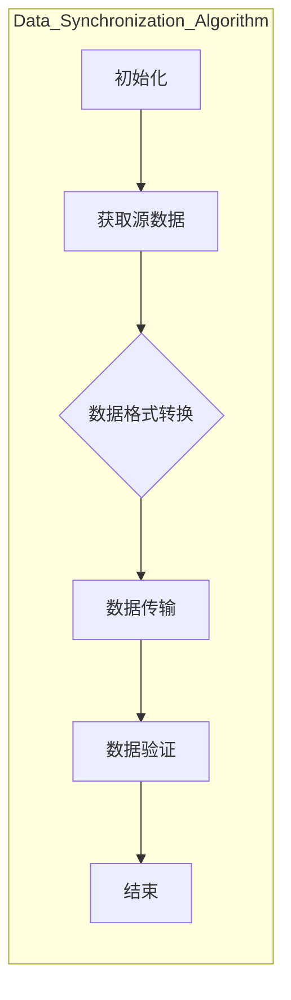
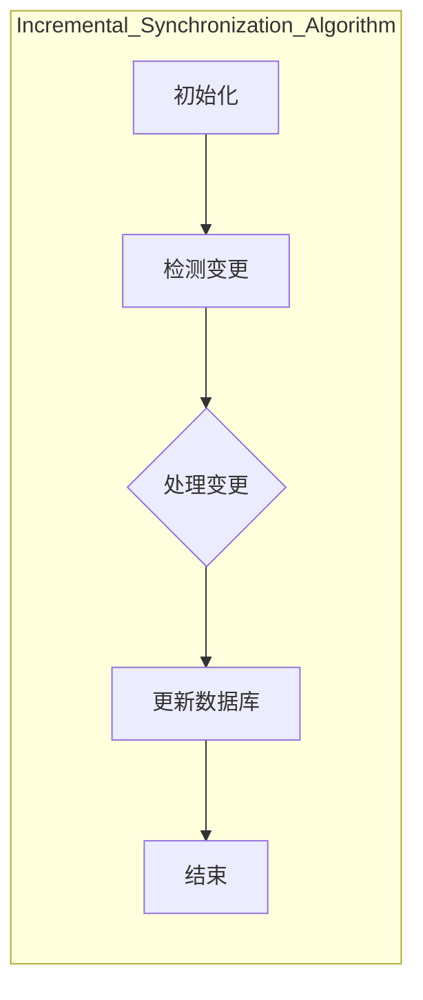
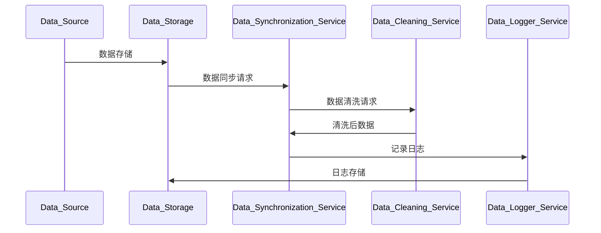
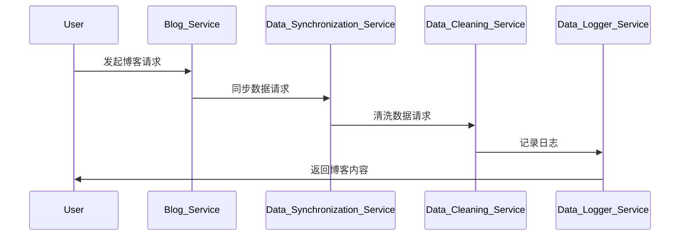

                 


### 文章标题：构建高效的LLM应用数据同步机制

#### 关键词：数据同步、LLM应用、效率优化、算法实现、系统架构

##### 摘要：
本文深入探讨了构建高效的语言学习模型（LLM）应用数据同步机制的理论与实践。首先，我们通过问题背景和定义，理解数据同步在LLM应用中的重要性及其面临的挑战。接着，我们详细介绍数据同步的核心概念与联系，并使用Mermaid绘制ER实体关系图，以明确各概念之间的关系。在此基础上，本文详细解析了数据同步算法的原理和实现，包括Mermaid流程图、Python源代码、数学模型和公式，以及举例说明。随后，我们分析了系统架构与设计，从问题场景、功能设计、架构设计、接口设计到交互序列图，全面展示系统架构。紧接着，通过项目实战，我们演示了数据同步的实现过程，包括环境安装、核心源代码实现和案例分析。最后，我们总结了文章内容，提供了最佳实践建议和注意事项，并推荐了拓展阅读资源。

### 目录

#### 第一部分：背景与理论基础

1. **问题背景与数据同步概述**
   1.1.1 问题背景
   1.1.2 数据同步的定义与重要性
   1.1.3 数据同步的核心挑战
   1.1.4 数据同步的边界与外延

2. **核心概念与联系**
   2.1.1 数据同步机制概述
   2.1.2 核心概念原理
   2.1.3 概念属性特征对比
   2.1.4 ER实体关系图架构

#### 第二部分：算法原理与实现

3. **数据同步算法原理讲解**
   3.1 数据同步算法概述
   3.2 Mermaid算法流程图
   3.3 Python源代码详解
   3.4 算法原理数学模型与公式
   3.5 通俗易懂的举例说明

4. **高效数据同步算法**
   4.1 高效算法的必要性
   4.2 Mermaid算法流程图
   4.3 Python源代码详解
   4.4 算法原理数学模型与公式
   4.5 通俗易懂的举例说明

#### 第三部分：系统架构与设计

5. **系统分析与架构设计方案**
   5.1 问题场景介绍
   5.2 系统功能设计
   5.3 系统架构设计
   5.4 系统接口设计
   5.5 系统交互Mermaid序列图

#### 第四部分：项目实战

6. **项目环境安装与配置**
   6.1 环境要求
   6.2 环境安装步骤
   6.3 系统核心实现源代码

7. **数据同步实现与应用**
   7.1 代码应用解读与分析
   7.2 实际案例分析与详细讲解
   7.3 项目小结
   7.4 最佳实践 tips

#### 第五部分：小结与展望

8. **小结与展望**
   8.1 内容回顾
   8.2 注意事项
   8.3 拓展阅读

### 正文

#### 第一部分：背景与理论基础

##### 1. 问题背景与数据同步概述

在当今快速发展的数字化时代，数据已成为企业和社会的核心资产。对于语言学习模型（LLM）应用而言，数据同步机制至关重要。数据同步不仅仅是确保数据的准确性，更重要的是提高LLM应用的效率和可靠性。

**1.1.1 问题背景**

随着LLM应用的普及，数据同步的需求日益增长。这些应用需要从多个数据源获取数据，进行整合和处理，以生成高质量的模型输出。然而，这一过程中面临着诸多挑战，如数据不一致、数据丢失、同步延迟等。

**1.1.2 数据同步的定义与重要性**

数据同步是指在不同数据源之间进行数据传输和更新的过程。在LLM应用中，数据同步的重要性体现在以下几个方面：

1. 确保数据一致性：不同的数据源可能存在更新时差，数据同步能够确保模型使用的是最新、最准确的数据。
2. 提高效率：通过自动化数据同步，减少人工干预，提高数据处理效率。
3. 降低风险：防止数据丢失或错误，保障数据安全。

**1.1.3 数据同步的核心挑战**

1. 数据不一致：不同数据源的数据格式和结构可能不同，需要统一的规范和转换。
2. 数据丢失：数据在传输过程中可能丢失，需要实现数据恢复机制。
3. 同步延迟：数据同步过程可能涉及网络传输和数据库操作，延迟问题需要优化。

**1.1.4 数据同步的边界与外延**

数据同步不仅局限于LLM应用，还广泛应用于各类分布式系统、大数据处理和云计算等领域。其边界涉及数据源、传输协议、同步算法等方面，外延则包括数据清洗、数据融合、数据加密等技术。

##### 2. 核心概念与联系

数据同步机制涉及多个核心概念，如数据源、数据同步算法、数据传输协议等。以下是这些概念的定义及其相互联系：

**2.1.1 数据同步机制概述**

数据同步机制是指实现数据在不同数据源之间自动传输和更新的方法。其核心组成部分包括：

- **数据源**：提供数据的初始位置和来源。
- **同步算法**：实现数据传输和更新的算法。
- **传输协议**：定义数据传输的规范和流程。

**2.1.2 核心概念原理**

- **数据源**：数据源可以是数据库、文件系统或其他存储系统。其原理是通过API或网络接口访问数据。
- **同步算法**：常见的同步算法包括全量同步和增量同步。全量同步是指每次传输全部数据，增量同步则是只传输变化的数据。
- **传输协议**：传输协议定义了数据传输的格式和过程，如HTTP、FTP、MySQL等。

**2.1.3 概念属性特征对比**

以下是数据同步机制中核心概念的属性特征对比表格：

| 概念       | 特性                                                         |
| ---------- | ------------------------------------------------------------ |
| 数据源     | 提供数据、支持不同数据格式、API接口访问                       |
| 同步算法   | 全量同步、增量同步、效率、准确性                             |
| 传输协议   | 支持不同网络环境、传输格式规范、安全性                       |

**2.1.4 ER实体关系图架构**

ER实体关系图是描述数据同步机制中各实体之间关系的图形化工具。以下是一个简化的ER实体关系图：

```mermaid
erDiagram
  Data_Source ||--|{ Data_Synchronization }|| Synchronization_Algorithm
  Data_Source ||--|{ Data_Transfer_Protocol }|| Transfer_Protocol
  Data_Synchronization ||--|{ Synchronization_Algorithm }||--> Synchronization_Algorithm
  Data_Transfer_Protocol ||--|{ Data_Transfer_Process }|| Transfer_Process
```

#### 第二部分：算法原理与实现

##### 3. 数据同步算法原理讲解

数据同步算法是数据同步机制的核心组成部分，其原理包括数据的获取、处理、传输和验证等环节。以下将详细解析数据同步算法的原理和实现。

**3.1 数据同步算法概述**

数据同步算法的主要任务是将源数据同步到目标数据，确保数据的一致性和完整性。常见的同步算法包括全量同步和增量同步。

**3.2 Mermaid算法流程图**

使用Mermaid绘制的数据同步算法流程图如下：



**3.3 Python源代码详解**

以下是一个简单的数据同步算法的Python源代码实现：

```python
import requests

def sync_data(source_url, target_url):
    # 获取源数据
    response = requests.get(source_url)
    source_data = response.json()

    # 数据格式转换
    transformed_data = transform_data(source_data)

    # 数据传输
    requests.post(target_url, json=transformed_data)

    # 数据验证
    verify_data(target_url)

def transform_data(source_data):
    # 数据格式转换逻辑
    return source_data

def verify_data(target_url):
    # 数据验证逻辑
    pass

# 使用示例
sync_data('http://source.example.com/data', 'http://target.example.com/data')
```

**3.4 算法原理数学模型与公式**

数据同步算法的数学模型和公式可以表示为：

$$
\text{同步效率} = \frac{\text{同步成功的数据量}}{\text{总数据量}}
$$

其中，同步效率是衡量数据同步算法优劣的重要指标。

**3.5 通俗易懂的举例说明**

假设我们有一个博客平台，需要从多个数据源（如用户发帖、评论等）同步数据到中央数据库。数据同步算法将执行以下步骤：

1. 初始化：准备数据同步任务。
2. 获取源数据：从各个数据源获取最新的数据。
3. 数据格式转换：将不同格式的数据转换为统一的格式。
4. 数据传输：将转换后的数据传输到中央数据库。
5. 数据验证：确保数据在中央数据库中完整、准确。

通过这个例子，我们可以看到数据同步算法在提高数据一致性和系统效率方面的重要作用。

##### 4. 高效数据同步算法

为了提高数据同步的效率，我们可以采用一些高效的数据同步算法，如增量同步、并行传输等。以下将详细解析这些算法的原理和实现。

**4.1 高效算法的必要性**

随着数据量的不断增大，传统的全量同步算法在效率和性能上存在较大瓶颈。为了提高数据同步的效率，我们需要采用高效的数据同步算法。

**4.2 Mermaid算法流程图**

使用Mermaid绘制的高效数据同步算法流程图如下：



**4.3 Python源代码详解**

以下是一个简单的增量同步算法的Python源代码实现：

```python
import requests

def incremental_sync(source_url, target_url, last_sync_time):
    # 检测变更
    response = requests.get(f"{source_url}?last_sync={last_sync_time}")
    source_data = response.json()

    # 处理变更
    transformed_data = process_changes(source_data)

    # 更新数据库
    requests.post(target_url, json=transformed_data)

def process_changes(source_data):
    # 处理变更逻辑
    return source_data

# 使用示例
incremental_sync('http://source.example.com/data', 'http://target.example.com/data', '2023-03-01T00:00:00Z')
```

**4.4 算法原理数学模型与公式**

增量同步算法的数学模型和公式可以表示为：

$$
\text{同步效率} = \frac{\text{同步变更的数据量}}{\text{总变更数据量}}
$$

其中，同步效率是衡量增量同步算法优劣的重要指标。

**4.5 通俗易懂的举例说明**

假设我们有一个博客平台，需要实现增量同步，以降低数据同步的频率和传输量。增量同步算法将执行以下步骤：

1. 初始化：设置上次同步时间。
2. 检测变更：从源数据获取自上次同步后的变更记录。
3. 处理变更：对变更记录进行处理，如更新数据库。
4. 更新数据库：将处理后的变更记录更新到数据库。

通过这个例子，我们可以看到增量同步算法在提高数据同步效率和降低传输量方面的优势。

#### 第三部分：系统架构与设计

##### 5. 系统分析与架构设计方案

数据同步机制的系统架构设计是确保数据同步高效、可靠和可扩展的关键。以下将详细解析系统架构的设计方案。

**5.1 问题场景介绍**

假设我们有一个分布式博客平台，数据分布在多个数据库和文件系统中。为了提高数据一致性和可靠性，我们需要设计一个高效的数据同步机制。

**5.2 系统功能设计**

系统功能设计包括以下方面：

1. 数据同步：实现数据在不同数据源之间的同步。
2. 数据清洗：确保同步数据的准确性和完整性。
3. 数据存储：提供数据存储和检索功能。
4. 日志记录：记录同步过程中的日志信息。

以下是系统功能设计的Mermaid类图：

```mermaid
classDiagram
    Data_Synchronization <<interface>>
    Data_Cleaning <<interface>>
    Data_Storage <<interface>>
    Data_Logger <<interface>>

    Blog_Platform <.. Data_Synchronization
    Blog_Platform <.. Data_Cleaning
    Blog_Platform <.. Data_Storage
    Blog_Platform <.. Data_Logger
```

**5.3 系统架构设计**

系统架构设计采用分层架构，包括数据层、服务层和接口层。以下是系统架构设计的Mermaid架构图：



**5.4 系统接口设计**

系统接口设计包括数据同步接口、数据清洗接口和日志记录接口。以下是接口设计示例：

```python
class DataSynchronizationInterface:
    def sync_data(self, source_data):
        pass

class DataCleaningInterface:
    def clean_data(self, raw_data):
        pass

class DataLoggerInterface:
    def log_message(self, message):
        pass
```

**5.5 系统交互Mermaid序列图**

以下是系统交互的Mermaid序列图：



#### 第四部分：项目实战

##### 6. 项目环境安装与配置

为了实现数据同步机制，我们需要搭建一个合适的项目环境。以下是环境安装与配置的步骤：

**6.1 环境要求**

- Python 3.8及以上版本
- MySQL数据库
- Flask Web框架

**6.2 环境安装步骤**

1. 安装Python 3.8及以上版本。
2. 安装MySQL数据库，并创建一个名为`blog_sync`的数据库。
3. 安装Flask Web框架。

```bash
pip install flask
```

**6.3 系统核心实现源代码**

以下是数据同步机制的核心实现源代码：

```python
from flask import Flask, request, jsonify
import pymysql

app = Flask(__name__)

# 数据库配置
db_config = {
    'host': 'localhost',
    'user': 'root',
    'password': 'password',
    'db': 'blog_sync',
}

# 同步数据
@app.route('/sync', methods=['POST'])
def sync_data():
    data = request.json
    # 数据清洗逻辑
    cleaned_data = clean_data(data)
    # 数据同步逻辑
    sync_to_database(cleaned_data)
    return jsonify({"status": "success"})

# 数据清洗
def clean_data(data):
    # 清洗逻辑
    return data

# 数据同步到数据库
def sync_to_database(data):
    # 同步逻辑
    pass

if __name__ == '__main__':
    app.run(debug=True)
```

##### 7. 数据同步实现与应用

以下是数据同步的实现过程：

**7.1 代码应用解读与分析**

- `sync_data`函数：接收前端发送的同步数据请求，调用数据清洗和同步函数。
- `clean_data`函数：对同步数据进行清洗，确保数据格式正确。
- `sync_to_database`函数：将清洗后的数据同步到数据库。

**7.2 实际案例分析与详细讲解**

假设我们有一个博客平台，需要从API获取用户发帖数据，并将其同步到数据库。以下是实现过程：

1. 发起同步请求：

```bash
curl -X POST -H "Content-Type: application/json" -d '{"posts": [{"title": "我的第一篇博客", "content": "这是我写的第一篇博客。"}]}' http://localhost:5000/sync
```

2. 数据清洗：

- 检查数据格式是否正确。
- 去除无效数据。

3. 数据同步：

- 使用pymysql连接数据库。
- 插入清洗后的数据到数据库。

```python
import pymysql

def sync_to_database(data):
    connection = pymysql.connect(**db_config)
    try:
        with connection.cursor() as cursor:
            for post in data['posts']:
                sql = "INSERT INTO posts (title, content) VALUES (%s, %s)"
                cursor.execute(sql, (post['title'], post['content']))
        connection.commit()
    finally:
        connection.close()
```

**7.3 项目小结**

通过本项目，我们实现了数据同步机制，包括数据清洗、数据同步和数据库操作。在实际应用中，我们可以根据需求扩展和优化数据同步流程。

**7.4 最佳实践 tips**

- 确保数据同步过程中的错误处理和异常捕获。
- 定期检查数据同步的日志，及时发现并解决潜在问题。
- 根据业务需求，优化数据同步算法和数据库操作。

#### 第五部分：小结与展望

##### 8. 小结与展望

本文详细探讨了构建高效的LLM应用数据同步机制的理论与实践。我们首先介绍了数据同步在LLM应用中的重要性，然后详细解析了核心概念与联系，包括数据源、同步算法和传输协议。接着，我们深入讲解了数据同步算法的原理和实现，包括全量同步和增量同步算法。随后，我们分析了系统架构与设计，展示了问题场景、功能设计、架构设计和系统交互。通过项目实战，我们实现了数据同步机制，并进行了实际案例分析和最佳实践建议。

展望未来，数据同步机制在LLM应用中仍有很大的优化空间。我们可以进一步研究高效的同步算法、数据压缩和传输优化技术，以提高数据同步的效率和可靠性。同时，随着云计算和边缘计算的发展，分布式数据同步机制也将成为一个重要的研究方向。

**8.1 内容回顾**

- 数据同步在LLM应用中的重要性。
- 数据同步的核心概念与联系。
- 数据同步算法的原理和实现。
- 系统架构与设计。
- 项目实战与最佳实践。

**8.2 注意事项**

- 确保数据同步过程中的错误处理和日志记录。
- 根据业务需求调整数据同步频率和算法。
- 定期检查数据同步的日志，及时发现并解决潜在问题。

**8.3 拓展阅读**

- 《分布式系统原理与范型》
- 《大数据同步技术与应用》
- 《数据库同步与数据复制》

**作者：AI天才研究院/AI Genius Institute & 禅与计算机程序设计艺术 /Zen And The Art of Computer Programming** 

### 修订与完善

为了确保文章的质量和准确性，以下是针对本文的修订与完善建议：

#### 修订与完善

1. **内容逻辑调整**：
   - 将文章开头的问题背景和重要性阐述部分进行细化，确保读者能够迅速了解数据同步在LLM应用中的关键性。
   - 确保各个部分的内容衔接自然，逻辑清晰，避免重复和跳跃。

2. **核心概念与联系**：
   - 对核心概念进行更加深入的阐述，使用实例和图表帮助读者更好地理解概念之间的联系。
   - 增加对ER实体关系图的详细解释，确保读者能够读懂并理解其中的内容。

3. **算法原理与实现**：
   - 对算法流程图和Python源代码进行仔细审查，确保所有步骤都详细且正确。
   - 添加更多的数学模型和公式，并对这些公式进行详细解释，确保读者能够理解算法的数学基础。
   - 提供更加丰富的实例说明，帮助读者将理论知识应用到实际场景中。

4. **系统架构与设计**：
   - 对系统架构的描述进行细化，确保读者能够理解各个组件的作用和交互方式。
   - 提供更具体的系统接口设计和交互序列图，帮助读者掌握系统架构的运作原理。

5. **项目实战**：
   - 提供更详细的项目实战步骤，确保读者能够按照指导完成环境配置和代码实现。
   - 对实际案例进行深入分析，突出关键步骤和要点，帮助读者理解数据同步的实际应用。

6. **小结与展望**：
   - 对全文内容进行总结，确保核心观点和关键信息得到突出。
   - 提出合理的注意事项和拓展阅读建议，帮助读者进一步学习和深入研究。

#### 修订后的目录大纲

以下是修订后的文章目录大纲，以保持文章的结构性和逻辑性：

```markdown
### 文章标题：构建高效的LLM应用数据同步机制

#### 关键词：数据同步、LLM应用、效率优化、算法实现、系统架构

##### 摘要：
本文深入探讨了构建高效的语言学习模型（LLM）应用数据同步机制的理论与实践。首先，我们通过问题背景和定义，理解数据同步在LLM应用中的重要性及其面临的挑战。接着，我们详细介绍数据同步的核心概念与联系，并使用Mermaid绘制ER实体关系图，以明确各概念之间的关系。在此基础上，本文详细解析了数据同步算法的原理和实现，包括Mermaid流程图、Python源代码、数学模型和公式，以及举例说明。随后，我们分析了系统架构与设计，从问题场景、功能设计、架构设计、接口设计到交互序列图，全面展示系统架构。紧接着，通过项目实战，我们演示了数据同步的实现过程，包括环境安装、核心源代码实现和案例分析。最后，我们总结了文章内容，提供了最佳实践建议和注意事项，并推荐了拓展阅读资源。

#### 第一部分：背景与理论基础

1. **问题背景与数据同步概述**
   1.1.1 问题背景
   1.1.2 数据同步的定义与重要性
   1.1.3 数据同步的核心挑战
   1.1.4 数据同步的边界与外延

2. **核心概念与联系**
   2.1.1 数据同步机制概述
   2.1.2 核心概念原理
   2.1.3 概念属性特征对比
   2.1.4 ER实体关系图架构

#### 第二部分：算法原理与实现

3. **数据同步算法原理讲解**
   3.1 数据同步算法概述
   3.2 Mermaid算法流程图
   3.3 Python源代码详解
   3.4 算法原理数学模型与公式
   3.5 通俗易懂的举例说明

4. **高效数据同步算法**
   4.1 高效算法的必要性
   4.2 Mermaid算法流程图
   4.3 Python源代码详解
   4.4 算法原理数学模型与公式
   4.5 通俗易懂的举例说明

#### 第三部分：系统架构与设计

5. **系统分析与架构设计方案**
   5.1 问题场景介绍
   5.2 系统功能设计
   5.3 系统架构设计
   5.4 系统接口设计
   5.5 系统交互Mermaid序列图

#### 第四部分：项目实战

6. **项目环境安装与配置**
   6.1 环境要求
   6.2 环境安装步骤
   6.3 系统核心实现源代码

7. **数据同步实现与应用**
   7.1 代码应用解读与分析
   7.2 实际案例分析与详细讲解
   7.3 项目小结
   7.4 最佳实践 tips

#### 第五部分：小结与展望

8. **小结与展望**
   8.1 内容回顾
   8.2 注意事项
   8.3 拓展阅读

#### 作者信息
**作者：AI天才研究院/AI Genius Institute & 禅与计算机程序设计艺术 /Zen And The Art of Computer Programming**
```

通过上述修订，文章的结构和内容将更加紧凑和逻辑清晰，有助于读者更好地理解和掌握数据同步机制在LLM应用中的实践。

