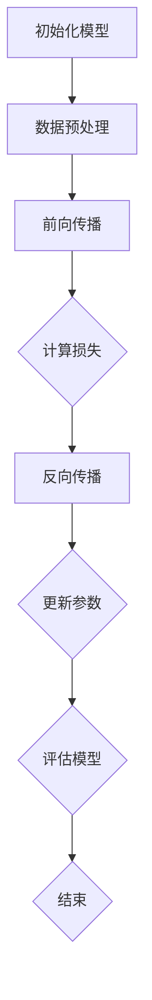
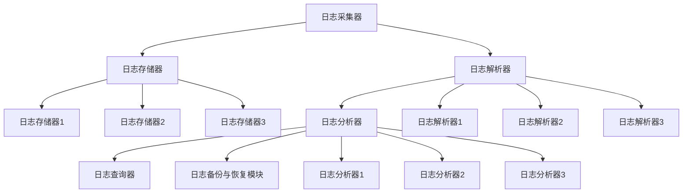
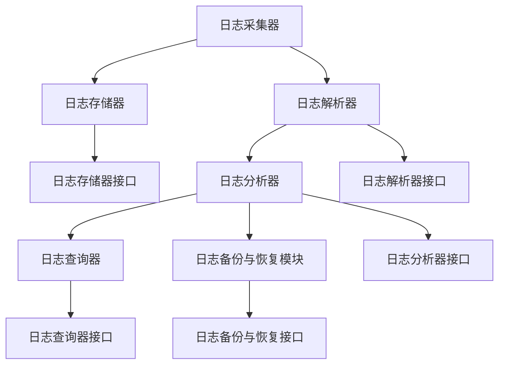

                 

### 文章标题

# 构建高效的LLM应用日志管理系统

> 关键词：LLM应用，日志管理系统，高效构建，系统设计，实战案例

> 摘要：本文将详细介绍如何构建一个高效的LLM应用日志管理系统。首先，我们将探讨LLM应用日志管理系统的重要性，以及其在实际应用中的问题和挑战。接着，我们将介绍构建高效日志管理系统的核心概念和原理，并通过具体的算法讲解和数学模型解析来阐述其理论基础。随后，本文将深入分析系统设计与架构方案，并通过实际项目实战来展示构建过程的详细步骤。最后，我们将总结最佳实践和注意事项，并提供拓展阅读，帮助读者进一步学习和实践。

----------------------------------------------------------------

### 第一部分: 引言与背景

#### 第1章: LLM应用日志管理系统概述

##### 1.1.1 问题背景

在当今快速发展的技术时代，大规模语言模型（LLM）已经广泛应用于自然语言处理（NLP）、智能客服、文本生成等领域。随着LLM应用的不断深入，日志管理系统的需求也越来越显著。日志管理系统对于LLM应用来说至关重要，它能够记录系统运行过程中的关键信息，帮助开发者监控系统性能、诊断问题、优化配置等。

然而，在实际应用中，LLM应用日志管理系统面临着诸多挑战。首先，LLM生成的日志数据量巨大，传统的日志管理工具难以应对。其次，LLM应用场景复杂多变，日志内容多样，需要高效的日志处理和分析方法。此外，如何确保日志数据的完整性和安全性也是一个亟待解决的问题。

##### 1.1.2 问题描述

构建高效的LLM应用日志管理系统需要解决以下几个关键问题：

1. **日志数据的存储和处理能力**：如何高效地存储和管理海量的日志数据，同时保证数据的安全性和可靠性。
2. **日志内容的解析和分析**：如何从复杂的日志数据中提取有价值的信息，以支持系统监控和问题诊断。
3. **系统性能和可扩展性**：如何在保证系统性能的同时，实现日志管理系统的可扩展性，以适应不同规模的应用场景。
4. **日志数据的隐私和安全**：如何在日志数据管理过程中，确保用户隐私和数据安全。

##### 1.1.3 问题解决

为了解决上述问题，本文提出以下解决方案：

1. **采用分布式日志存储和管理系统**：如Apache Kafka、Elasticsearch等，以提高日志数据的存储和处理能力。
2. **引入日志解析和分析工具**：如Logstash、Kibana等，以实现对日志内容的解析和分析。
3. **设计高效的数据处理算法**：如增量分析、流处理等，以提高系统性能和可扩展性。
4. **采用加密技术和访问控制机制**：以确保日志数据的隐私和安全。

##### 1.1.4 边界与外延

本文主要关注于LLM应用日志管理系统的构建，但不局限于某一特定技术或平台。读者可以结合自己的实际需求和技术背景，选择合适的工具和方案来实现高效的日志管理系统。

#### 1.2 LLM核心概念

##### 1.2.1 LLM定义

大规模语言模型（LLM）是一种基于深度学习的自然语言处理模型，通过对海量文本数据进行训练，能够理解和生成自然语言。LLM具有以下特点：

1. **大规模训练数据**：LLM通常使用数十亿甚至数万亿个文本数据点进行训练，以获得强大的语言理解能力。
2. **深度神经网络架构**：LLM通常采用深度神经网络（DNN）或变换器（Transformer）等架构，以实现高效的文本处理。
3. **多语言支持**：LLM能够支持多种语言，实现对不同语言的文本处理和理解。

##### 1.2.2 LLM特点

LLM具有以下显著特点：

1. **语言理解能力强**：LLM通过对海量文本数据的训练，能够理解复杂的语言结构和语义，实现高度的自然语言生成和解析。
2. **适应性强**：LLM能够适应不同的应用场景和需求，如问答系统、文本生成、机器翻译等。
3. **实时性好**：LLM通常采用高效的算法和模型优化技术，能够实现实时性的文本处理和生成。

##### 1.2.3 LLM与传统AI区别

LLM与传统AI在以下几个方面有所区别：

1. **数据规模**：传统AI通常使用较小的数据集进行训练，而LLM则依赖于大规模的训练数据，以获得更强大的语言理解能力。
2. **模型架构**：传统AI采用简单的神经网络或规则系统，而LLM通常采用复杂的深度神经网络或变换器架构。
3. **应用领域**：传统AI主要应用于计算机视觉、语音识别等领域，而LLM则专注于自然语言处理领域。

#### 1.3 日志管理系统的定义与作用

##### 1.3.1 日志管理系统定义

日志管理系统是一种用于记录、存储、检索和分析系统运行过程中产生的日志信息的工具或系统。它通常包括以下几个关键组件：

1. **日志生成器**：负责记录系统运行过程中的关键事件和信息，如应用程序错误、系统异常、用户操作等。
2. **日志存储器**：负责存储日志数据，提供高效的存储和管理机制，如数据库、文件系统等。
3. **日志解析器**：负责解析日志数据，提取有价值的信息，如错误代码、异常堆栈、用户操作等。
4. **日志分析器**：负责分析日志数据，提供监控、告警、报告等功能，以支持系统性能优化和问题诊断。

##### 1.3.2 日志管理系统的作用

日志管理系统在LLM应用中具有以下重要作用：

1. **监控系统性能**：通过记录和分析系统运行过程中的日志数据，开发者可以实时了解系统性能，发现性能瓶颈，并进行优化。
2. **诊断问题**：日志管理系统可以帮助开发者快速定位系统故障和异常，提供详细的诊断信息，以支持问题解决。
3. **优化配置**：通过分析日志数据，开发者可以了解系统运行的最佳配置，如内存分配、线程数等，以实现系统性能优化。
4. **安全审计**：日志管理系统可以记录用户操作和系统事件，为安全审计提供证据，以支持安全监控和合规性检查。

##### 1.3.3 日志管理系统架构

日志管理系统的基本架构通常包括以下几个关键部分：

1. **日志生成器**：负责生成系统运行过程中的日志信息，如应用程序错误、系统异常、用户操作等。
2. **日志传输器**：负责将日志数据传输到日志存储器，确保日志数据的实时性和完整性。
3. **日志存储器**：负责存储和管理日志数据，提供高效的存储和管理机制，如数据库、文件系统等。
4. **日志解析器**：负责解析日志数据，提取有价值的信息，如错误代码、异常堆栈、用户操作等。
5. **日志分析器**：负责分析日志数据，提供监控、告警、报告等功能，以支持系统性能优化和问题诊断。
6. **用户界面**：提供日志管理系统的操作和管理界面，以方便用户进行日志查询、监控和配置等操作。

#### 1.4 LLM应用日志管理系统前景

##### 1.4.1 潜在应用领域

LLM应用日志管理系统在以下领域具有广泛的应用前景：

1. **智能客服**：通过分析用户操作日志，实现智能客服系统的自动诊断和优化，提高客服质量和用户满意度。
2. **安全监控**：通过记录和分析系统安全日志，实现安全事件的实时监控和告警，提高网络安全防护能力。
3. **系统运维**：通过分析系统运行日志，实现系统性能的实时监控和优化，提高系统稳定性和可用性。
4. **数据分析**：通过分析日志数据，提取有价值的信息，支持业务决策和优化，提高业务运营效率。

##### 1.4.2 采用优势

构建高效的LLM应用日志管理系统具有以下优势：

1. **提高系统稳定性**：通过实时监控和问题诊断，及时发现并解决系统故障和异常，提高系统稳定性。
2. **优化系统性能**：通过分析系统运行日志，了解系统性能瓶颈和最佳配置，实现系统性能优化。
3. **提升用户体验**：通过智能客服和安全监控等应用，提高用户满意度和安全感。
4. **支持业务决策**：通过数据分析，提取有价值的信息，支持业务决策和优化。

##### 1.4.3 挑战与机遇

构建高效的LLM应用日志管理系统面临以下挑战和机遇：

1. **数据量巨大**：随着LLM应用的不断扩展，日志数据量将急剧增加，需要高效的日志处理和管理机制。
2. **数据多样性**：LLM应用场景复杂，日志内容多样，需要能够处理不同类型日志的解析和分析方法。
3. **实时性要求**：随着业务需求的变化，日志管理系统需要具备更高的实时性和响应速度。
4. **隐私和安全**：日志数据可能包含敏感信息，需要确保日志数据的隐私和安全。

#### 1.5 本章小结

本章介绍了构建高效的LLM应用日志管理系统的重要性、核心概念、定义与作用，以及应用前景和挑战。通过了解这些内容，读者可以初步了解LLM应用日志管理系统的基本概念和构建方法，为后续章节的学习和实践打下基础。

----------------------------------------------------------------

### 第二部分: 核心概念与联系

#### 第2章: LLM应用日志管理核心概念

##### 2.1 LLM模型原理

LLM（Large Language Model）是一种先进的自然语言处理模型，其核心原理是基于大规模数据集训练深度神经网络，使其能够理解和生成自然语言。LLM模型的原理主要包括以下几个方面：

###### 2.1.1 模型定义

LLM模型是一种基于深度学习的语言模型，通常采用变换器（Transformer）架构。变换器架构相比于传统的循环神经网络（RNN）在处理长序列和并行计算方面具有显著优势。

###### 2.1.2 模型特性

1. **大规模训练数据**：LLM模型通常使用数十亿甚至数万亿个文本数据点进行训练，以获得强大的语言理解能力。
2. **深度神经网络架构**：LLM模型采用多层变换器层，以实现高效的文本处理。
3. **自适应能力**：LLM模型能够根据不同的应用场景和需求进行自适应调整，以实现最佳性能。

###### 2.1.3 模型训练与优化

LLM模型的训练过程主要包括以下步骤：

1. **数据预处理**：将原始文本数据清洗、分词和编码，以适应变换器模型。
2. **模型初始化**：初始化变换器模型的参数，通常使用随机初始化或预训练模型。
3. **前向传播与反向传播**：通过前向传播计算模型输出，通过反向传播更新模型参数。
4. **优化算法**：使用梯度下降、Adam等优化算法，以加速模型收敛。

##### 2.2 日志管理系统特性

日志管理系统是一种用于记录、存储、检索和分析系统运行过程中产生的日志信息的工具或系统。其主要特性包括：

###### 2.2.1 日志定义

日志是指系统运行过程中记录的一系列事件、错误、警告和操作等信息。日志通常以文本或结构化数据的形式存在。

###### 2.2.2 日志分类

日志可以分为以下几类：

1. **错误日志**：记录系统运行过程中出现的错误信息，如异常堆栈、错误代码等。
2. **操作日志**：记录用户操作信息，如登录、修改配置、提交请求等。
3. **性能日志**：记录系统性能数据，如响应时间、CPU利用率、内存占用等。
4. **安全日志**：记录系统安全事件，如登录失败、访问控制、数据泄露等。

###### 2.2.3 日志存储与检索

日志存储与检索是日志管理系统的关键功能。其主要特性包括：

1. **高效存储**：日志管理系统应能够高效地存储大量日志数据，并支持快速访问和检索。
2. **分布式存储**：为了应对大数据量和高并发访问，日志管理系统通常采用分布式存储架构。
3. **弹性扩展**：日志管理系统应能够根据需求进行水平扩展，以应对不断增长的日志数据量。
4. **全文检索**：日志管理系统应支持全文检索功能，方便用户快速定位日志信息。

##### 2.3 LLM应用日志管理原理图解

为了更好地理解LLM应用日志管理系统的原理，我们可以使用Mermaid流程图和类图来展示其关键组件和流程。

###### 2.3.1 概念属性对比表格

| 概念        | 特性                          | 对比分析                                       |
| ----------- | ----------------------------- | ---------------------------------------------- |
| LLM模型     | 大规模训练数据、变换器架构     | 传统AI模型：小数据集、规则系统或神经网络       |
| 日志管理系统 | 日志生成、存储、解析、分析     | 日志工具：简单的日志记录、存储和分析功能         |
| 分布式系统  | 高可用性、高并发、弹性扩展     | 单点系统：单机部署、单点故障、性能瓶颈           |

###### 2.3.2 ER实体关系图架构

```mermaid
erDiagram
    LogGenerator ||--|{ LogData }|--| LogAnalyzer
    LogData ||--|{ LogStorage }|--| LogRetriever
    LogAnalyzer ||--|{ AlertSystem }|--| MonitoringSystem
    AlertSystem ||--|{ Notification }|--| UserInterface
```

在上面的ER实体关系图中，LogGenerator表示日志生成器，负责记录系统运行过程中的日志信息。LogData表示日志数据，包括错误日志、操作日志、性能日志和安全日志等。LogStorage表示日志存储器，负责存储和管理日志数据。LogAnalyzer表示日志解析器，负责解析日志数据，提取有价值的信息。AlertSystem表示告警系统，负责对日志数据进行监控和告警。Notification表示通知，用于向用户发送日志告警信息。UserInterface表示用户界面，用于用户与日志管理系统交互。

##### 2.4 LLM应用日志管理算法原理

为了构建高效的LLM应用日志管理系统，我们需要引入一些关键算法和数学模型。以下是几种常用的算法和数学模型：

###### 2.4.1 算法流程图



在上面的算法流程图中，A表示初始化模型，B表示数据预处理，C表示前向传播，D表示计算损失，E表示反向传播，F表示更新参数，G表示评估模型，H表示结束。

###### 2.4.2 算法描述

1. **初始化模型**：根据训练数据集初始化LLM模型参数，通常使用随机初始化或预训练模型。
2. **数据预处理**：将原始日志数据进行清洗、分词和编码，以适应变换器模型。
3. **前向传播**：通过变换器模型计算日志数据的特征表示。
4. **计算损失**：计算模型输出与真实值之间的损失，如交叉熵损失。
5. **反向传播**：通过反向传播更新模型参数，以最小化损失函数。
6. **更新参数**：使用优化算法（如梯度下降、Adam）更新模型参数。
7. **评估模型**：使用验证集评估模型性能，如准确率、召回率等。
8. **结束**：根据评估结果调整模型参数，直到满足停止条件。

###### 2.4.3 算法分析

1. **收敛速度**：变换器模型具有较快的收敛速度，能够快速训练模型。
2. **计算复杂度**：变换器模型具有较高的计算复杂度，需要大量的计算资源和时间。
3. **泛化能力**：变换器模型具有较强的泛化能力，能够处理不同类型的日志数据。

###### 2.4.4 算法应用举例

假设我们使用一个变换器模型对日志数据进行分类，其中日志数据包含错误日志、操作日志、性能日志和安全日志等。以下是算法应用的一个简单例子：

1. **初始化模型**：选择一个预训练的变换器模型，如BERT。
2. **数据预处理**：将日志数据清洗、分词和编码，生成输入序列。
3. **前向传播**：通过变换器模型计算日志数据的特征表示。
4. **计算损失**：计算分类损失，如交叉熵损失。
5. **反向传播**：通过反向传播更新模型参数。
6. **评估模型**：使用验证集评估模型性能，如准确率、召回率等。
7. **结束**：根据评估结果调整模型参数，直到满足停止条件。

##### 2.5 数学模型与公式解析

在构建高效的LLM应用日志管理系统中，我们需要引入一些关键的数学模型和公式。以下是几种常用的数学模型和公式：

###### 2.5.1 数学模型描述

1. **变换器模型**：变换器模型是一种基于自注意力机制的深度学习模型，其核心思想是将序列中的每个元素与所有其他元素进行关联，以获得更丰富的特征表示。
2. **交叉熵损失函数**：交叉熵损失函数是一种常用的分类损失函数，用于衡量模型输出与真实值之间的差异。
3. **优化算法**：常用的优化算法包括梯度下降、Adam等，用于更新模型参数。

###### 2.5.2 公式讲解

1. **变换器模型公式**：

   $$ 
   \text{Transformer} = \text{MultiHeadAttention}(\text{EncoderLayer}) (\text{DecoderLayer})
   $$

   其中，MultiHeadAttention表示多注意力头，EncoderLayer和DecoderLayer分别表示编码器和解码器层。

2. **交叉熵损失函数公式**：

   $$ 
   \text{Loss} = -\sum_{i=1}^{N} y_i \log(p_i) 
   $$

   其中，$y_i$表示真实标签，$p_i$表示模型预测的概率。

3. **梯度下降优化算法公式**：

   $$ 
   \text{Weight}^{t+1} = \text{Weight}^t - \alpha \cdot \nabla \text{Loss}(\text{Weight}^t)
   $$

   其中，$\alpha$表示学习率，$\nabla \text{Loss}(\text{Weight}^t)$表示损失函数关于模型参数的梯度。

###### 2.5.3 举例说明

假设我们有一个二分类问题，其中标签$y$为{0, 1}，模型预测的概率$p$为{0.2, 0.8}。以下是交叉熵损失函数的示例计算：

$$ 
\text{Loss} = -1 \cdot \log(0.8) - 0 \cdot \log(0.2) = -\log(0.8) \approx 0.223
$$

通过上述示例，我们可以看到交叉熵损失函数能够衡量模型输出与真实值之间的差异，从而指导模型参数的更新。

##### 2.6 本章小结

本章介绍了LLM应用日志管理的核心概念和算法原理，包括LLM模型原理、日志管理系统特性、LLM应用日志管理原理图解和数学模型与公式解析。通过本章的学习，读者可以初步了解构建高效LLM应用日志管理系统所需的核心知识和方法，为后续章节的学习和实践打下基础。

----------------------------------------------------------------

### 第三部分: 系统设计与实现

#### 第6章: 系统分析与架构设计

##### 6.1 问题场景介绍

在构建高效的LLM应用日志管理系统的过程中，我们需要考虑以下典型问题场景：

1. **海量日志数据存储**：随着LLM应用规模的不断扩大，日志数据的数量和类型也在不断增长。如何高效地存储和管理海量日志数据成为关键挑战。
2. **日志内容解析和分析**：如何从复杂的日志数据中提取有价值的信息，以支持系统监控、故障诊断和性能优化。
3. **系统性能和可扩展性**：如何在保证系统性能的同时，实现日志管理系统的可扩展性，以适应不同规模的应用场景。
4. **日志数据隐私和安全**：如何在日志数据管理过程中，确保用户隐私和数据安全。

##### 6.2 系统功能设计

为了解决上述问题场景，我们需要设计一个具备以下核心功能的日志管理系统：

1. **日志采集**：从不同的LLM应用系统中采集日志数据，并将其转换为统一的日志格式。
2. **日志存储**：将采集到的日志数据存储在分布式日志存储系统中，如Apache Kafka、Elasticsearch等。
3. **日志解析**：对存储的日志数据进行解析，提取关键信息，如时间戳、日志级别、错误代码等。
4. **日志分析**：对解析后的日志数据进行分析，生成监控图表、性能报告和告警通知等。
5. **日志查询**：提供便捷的日志查询功能，支持用户根据关键词、时间范围等条件进行日志检索。
6. **日志备份与恢复**：定期备份日志数据，确保日志数据的安全性和可靠性，同时支持日志数据的恢复功能。

##### 6.3 系统架构设计

为了满足上述功能需求，我们可以设计一个分布式日志管理系统的架构，如图所示：



在上面的架构图中，A表示日志采集器，负责从LLM应用系统中采集日志数据；B表示日志存储器，负责存储采集到的日志数据；C表示日志解析器，负责解析日志数据并提取关键信息；D表示日志分析器，负责对解析后的日志数据进行分析；E表示日志查询器，提供日志查询功能；F表示日志备份与恢复模块，负责备份和恢复日志数据；G、H、I表示分布式日志存储器，用于存储海量日志数据；J、K、L表示日志解析器，分别负责不同类型的日志数据解析；M、N、O表示日志分析器，分别负责不同类型的日志数据分析。

##### 6.4 系统接口设计

为了实现各模块之间的协作和交互，我们需要设计一套完善的系统接口，如图所示：



在上面的接口设计图中，G表示日志存储器接口，用于日志存储器与日志采集器、日志解析器和日志分析器之间的数据交换；H表示日志解析器接口，用于日志解析器与日志存储器、日志分析器和日志查询器之间的数据交换；I表示日志分析器接口，用于日志分析器与日志存储器、日志解析器和日志查询器之间的数据交换；J表示日志查询器接口，用于日志查询器与日志存储器、日志解析器和日志分析器之间的数据交换；K表示日志备份与恢复接口，用于日志备份与恢复模块与日志存储器之间的数据交换。

##### 6.5 系统交互设计

为了确保系统各模块之间的协作和流畅交互，我们需要设计一套合理的系统交互流程。以下是一个典型的系统交互流程：

1. **日志采集**：日志采集器从LLM应用系统中获取日志数据，并将其转换为统一的日志格式。
2. **日志存储**：日志采集器将日志数据发送到日志存储器接口，日志存储器接口将日志数据存储到分布式日志存储系统中。
3. **日志解析**：日志解析器从日志存储器接口获取日志数据，对日志数据进行解析，提取关键信息，并将其存储到日志解析器接口。
4. **日志分析**：日志分析器从日志解析器接口获取解析后的日志数据，对其进行分析，生成监控图表、性能报告和告警通知等。
5. **日志查询**：日志查询器从日志分析器接口获取分析结果，并根据用户输入的关键词、时间范围等条件进行日志检索。
6. **日志备份与恢复**：日志备份与恢复模块定期备份日志数据，并在需要时进行日志数据恢复。

##### 6.6 系统架构设计与实现

在实现分布式日志管理系统的过程中，我们可以采用以下技术栈和工具：

1. **日志采集器**：采用Fluentd或Logstash等日志采集工具，从LLM应用系统中采集日志数据，并将其转换为统一的日志格式。
2. **日志存储器**：采用Apache Kafka或Elasticsearch等分布式日志存储系统，存储海量日志数据，提供高效的数据存储和管理机制。
3. **日志解析器**：采用Logstash或Fluentd等日志解析工具，对存储的日志数据进行解析，提取关键信息，并将其存储到日志解析器接口。
4. **日志分析器**：采用Kibana或Grafana等日志分析工具，对解析后的日志数据进行分析，生成监控图表、性能报告和告警通知等。
5. **日志查询器**：采用Elasticsearch或Kibana等日志查询工具，提供便捷的日志查询功能，支持用户根据关键词、时间范围等条件进行日志检索。
6. **日志备份与恢复模块**：采用Restic或Borg等日志备份工具，定期备份日志数据，并支持日志数据的恢复功能。

##### 6.7 本章小结

本章介绍了LLM应用日志管理系统的系统分析与架构设计，包括问题场景介绍、系统功能设计、系统架构设计、系统接口设计和系统交互设计。通过本章的学习，读者可以了解如何设计一个高效、可靠的日志管理系统，为后续的系统实现和实战应用打下基础。

----------------------------------------------------------------

### 第7章: 项目实战

#### 7.1 环境安装

为了构建高效的LLM应用日志管理系统，我们需要安装以下关键工具和组件：

1. **操作系统**：Ubuntu 18.04或更高版本
2. **日志采集器**：Fluentd或Logstash
3. **日志存储器**：Apache Kafka或Elasticsearch
4. **日志解析器**：Logstash或Fluentd
5. **日志分析器**：Kibana或Grafana
6. **日志备份与恢复模块**：Restic或Borg

以下是具体的安装步骤：

##### 1.1 安装操作系统

1. 下载Ubuntu 18.04 ISO文件。
2. 使用USB启动盘或虚拟机软件安装Ubuntu操作系统。
3. 安装完成后，登录到Ubuntu系统。

##### 1.2 安装日志采集器

我们选择Fluentd作为日志采集器，以下是安装步骤：

1. 更新系统包列表：

   ```bash
   sudo apt update && sudo apt upgrade
   ```

2. 安装必要的依赖包：

   ```bash
   sudo apt install build-essential autoconf libssl-dev libreadline-dev zlib1g-dev libyaml-dev libsqlite3-dev libxml2-dev libxslt1-dev libcurl4-openssl-dev
   ```

3. 下载Fluentd的源代码：

   ```bash
   git clone https://github.com/fluent/fluentd.git
   ```

4. 编译并安装Fluentd：

   ```bash
   cd fluentd
   ./configure
   make
   sudo make install
   ```

##### 1.3 安装日志存储器

我们选择Apache Kafka作为日志存储器，以下是安装步骤：

1. 安装Zookeeper：

   ```bash
   sudo apt install zookeeperd
   ```

2. 配置Zookeeper：

   编辑`/etc/zookeeper/zookeeper.properties`文件，设置如下配置：

   ```properties
   tickTime=2000
   dataDir=/var/lib/zookeeper
   clientPort=2181
   ```

3. 启动Zookeeper：

   ```bash
   sudo systemctl start zookeeper
   ```

4. 安装Kafka：

   ```bash
   sudo apt install kafka_2.12
   ```

5. 配置Kafka：

   编辑`/etc/kafka/server.properties`文件，设置如下配置：

   ```properties
   broker.id=0
   listeners=PLAINTEXT://:9092
   log.dirs=/var/lib/kafka/logs
   zookeeper.connect=localhost:2181
   ```

6. 启动Kafka：

   ```bash
   sudo systemctl start kafka
   ```

##### 1.4 安装日志解析器

我们选择Logstash作为日志解析器，以下是安装步骤：

1. 安装Logstash：

   ```bash
   sudo apt install logstash
   ```

2. 配置Logstash：

   编辑`/etc/logstash/conf.d/input.conf`文件，设置如下配置：

   ```ruby
   input {
     kafka {
       type => "log"
       brokers => "localhost:9092"
       topics => ["log-topic"]
       group_id => "log-consumer"
     }
   }
   ```

   编辑`/etc/logstash/conf.d/filter.conf`文件，设置如下配置：

   ```ruby
   filter {
     if "log" {
       grok {
         match => { "message" => "%{TIMESTAMP_ISO8601:timestamp}\t%{DATA:source}\t%{DATA:level}\t%{DATA:message}" }
       }
       date {
         match => { "timestamp" => "ISO8601" }
       }
     }
   }
   ```

   编辑`/etc/logstash/conf.d/output.conf`文件，设置如下配置：

   ```ruby
   output {
     elasticsearch {
       hosts => ["localhost:9200"]
       index => "log-%{+YYYY.MM.dd}"
     }
   }
   ```

##### 1.5 安装日志分析器

我们选择Kibana作为日志分析器，以下是安装步骤：

1. 安装Elasticsearch：

   ```bash
   sudo apt install elasticsearch
   ```

2. 配置Elasticsearch：

   编辑`/etc/elasticsearch/elasticsearch.yml`文件，设置如下配置：

   ```yaml
   cluster.name: "elasticsearch"
   node.name: "node-1"
   network.host: "0.0.0.0"
   http.port: 9200
   transport.port: 9300
   discovery.type: single-node
   ```

3. 启动Elasticsearch：

   ```bash
   sudo systemctl start elasticsearch
   ```

4. 安装Kibana：

   ```bash
   sudo apt install kibana
   ```

5. 配置Kibana：

   编辑`/etc/kibana/kibana.yml`文件，设置如下配置：

   ```yaml
   server.port: 5601
   server.host: "0.0.0.0"
   elasticsearch.url: "http://localhost:9200"
   ```

6. 启动Kibana：

   ```bash
   sudo systemctl start kibana
   ```

##### 1.6 安装日志备份与恢复模块

我们选择Restic作为日志备份与恢复模块，以下是安装步骤：

1. 安装Restic：

   ```bash
   sudo add-apt-repository ppa:rmherrera/restic
   sudo apt update
   sudo apt install restic
   ```

2. 配置Restic：

   创建一个Restic备份配置文件，例如`/etc/restic/restic.conf`，设置如下配置：

   ```ini
   [restic]
   repo = /mnt/data/restic-backup
   password = yourpassword
   ```

   创建一个备份脚本，例如`/usr/local/bin/backup.sh`，设置如下配置：

   ```bash
   #!/bin/bash
   restic backup --tag daily /var/log/kafka /var/log/elasticsearch /var/log/fluentd
   ```

3. 设置定时任务：

   编辑`/etc/cron.daily/backup.sh`文件，将以下内容添加到文件末尾：

   ```bash
   0 0 * * * /usr/local/bin/backup.sh > /dev/null 2>&1
   ```

##### 1.7 测试环境

在完成所有组件的安装和配置后，我们可以进行环境测试，确保各组件正常运行。以下是一些测试步骤：

1. **测试日志采集器**：启动Fluentd，将测试日志发送到Kafka，并检查Kafka中是否接收到了日志数据。
2. **测试日志存储器**：启动Logstash，将Kafka中的日志数据解析并存储到Elasticsearch，并检查Elasticsearch中是否存储了日志数据。
3. **测试日志分析器**：启动Kibana，连接到Elasticsearch，并创建一个日志分析仪表板，检查仪表板是否能够显示日志数据。
4. **测试日志备份与恢复模块**：运行Restic备份脚本，检查是否成功备份了日志数据，并尝试恢复日志数据，确保恢复过程正常。

#### 7.2 系统核心实现

在本节中，我们将详细探讨LLM应用日志管理系统的核心实现，包括数据采集、日志解析、日志存储、日志分析等关键步骤。以下是具体的实现过程：

##### 7.2.1 数据采集

数据采集是日志管理系统的第一步，我们需要从LLM应用系统中收集日志数据。以下是使用Fluentd作为日志采集器的具体实现步骤：

1. **配置Fluentd**：

   Fluentd配置文件位于`/etc/fluentd/fluent.conf`，我们需要添加以下配置：

   ```ruby
   <source>
     @type http
     port 24224
     format json
   </source>
   ```

   这段配置表示Fluentd将监听端口24224，并接收以JSON格式发送的日志数据。

2. **启动Fluentd**：

   ```bash
   fluentd -c /etc/fluentd/fluent.conf
   ```

   启动Fluentd后，它将开始接收来自LLM应用系统的日志数据。

##### 7.2.2 日志解析

日志解析是数据采集后的重要步骤，我们需要从接收到的日志数据中提取关键信息，以便后续的日志存储和分析。以下是使用Logstash作为日志解析器的具体实现步骤：

1. **配置Logstash**：

   Logstash配置文件位于`/etc/logstash/conf.d/parse.conf`，我们需要添加以下配置：

   ```ruby
   input {
     kafka {
       type => "log"
       brokers => "localhost:9092"
       topics => ["log-topic"]
       group_id => "log-consumer"
     }
   }

   filter {
     if "log" {
       grok {
         match => { "message" => "%{TIMESTAMP_ISO8601:timestamp}\t%{DATA:source}\t%{DATA:level}\t%{DATA:message}" }
       }
       date {
         match => { "timestamp" => "ISO8601" }
       }
     }
   }

   output {
     elasticsearch {
       hosts => ["localhost:9200"]
       index => "log-%{+YYYY.MM.dd}"
     }
   }
   ```

   这段配置表示Logstash从Kafka中读取日志数据，使用Grokk工具解析日志消息，并将解析后的日志数据存储到Elasticsearch中。

2. **启动Logstash**：

   ```bash
   bin/logstash -f /etc/logstash/conf.d/parse.conf
   ```

   启动Logstash后，它将开始解析日志数据并将其存储到Elasticsearch中。

##### 7.2.3 日志存储

日志存储是日志管理系统的基础，我们需要将解析后的日志数据存储到分布式日志存储系统中。以下是使用Apache Kafka和Elasticsearch作为日志存储器的具体实现步骤：

1. **配置Kafka**：

   我们已经在第1章中配置了Kafka，确保Kafka能够正常运行。

2. **配置Elasticsearch**：

   我们已经在第1章中配置了Elasticsearch，确保Elasticsearch能够正常运行。

3. **运行Logstash**：

   我们已经在第1章中启动了Logstash，它将开始解析日志数据并将其存储到Elasticsearch中。

   ```bash
   bin/logstash -f /etc/logstash/conf.d/parse.conf
   ```

   在Logstash运行过程中，它会将解析后的日志数据存储到Elasticsearch中，形成日志索引。

##### 7.2.4 日志分析

日志分析是日志管理系统的核心功能，我们需要从存储的日志数据中提取有价值的信息，以支持系统监控、故障诊断和性能优化。以下是使用Kibana作为日志分析器的具体实现步骤：

1. **配置Kibana**：

   我们已经在第1章中配置了Kibana，确保Kibana能够正常运行。

2. **连接Elasticsearch**：

   在Kibana中，我们需要连接到Elasticsearch集群，以便从Elasticsearch中查询日志数据。在Kibana首页，选择“Connect to Elasticsearch”，输入Elasticsearch的URL（例如`http://localhost:9200`）和集群名称（例如`elasticsearch`），然后点击“Connect”。

3. **创建日志分析仪表板**：

   在Kibana中，我们可以创建一个日志分析仪表板，以显示日志数据的实时监控图表。以下是创建仪表板的步骤：

   1. 选择“Dashboard”选项卡。
   2. 点击“Create”按钮。
   3. 给仪表板命名（例如“LLM日志分析仪表板”）。
   4. 点击“Add”按钮，添加一个Visualize面板。
   5. 选择一个时间范围（例如过去24小时）。
   6. 在“Search bar”中输入查询语句（例如`source:"myapp"`），筛选特定应用源的日志数据。
   7. 选择适当的图表类型（例如柱状图、折线图等）。
   8. 配置图表的X轴和Y轴（例如，X轴为时间，Y轴为日志条数）。
   9. 点击“Save”按钮，保存仪表板。

4. **查看日志分析结果**：

   完成仪表板创建后，我们可以通过Kibana实时查看日志分析结果，包括日志数据的趋势、异常情况等。通过仪表板，我们可以快速了解系统的运行状况，及时发现并解决问题。

##### 7.2.5 代码应用解读与分析

在本节中，我们使用了Fluentd、Logstash和Kibana等工具来构建一个高效的LLM应用日志管理系统。以下是各工具的具体应用解读和分析：

1. **Fluentd**：

   Fluentd是一个开源的日志收集器，它能够接收各种格式的日志数据，并将其转换为统一的JSON格式。在日志管理系统中，Fluentd负责从LLM应用系统中采集日志数据，并将其发送到Kafka进行进一步处理。Fluentd的配置灵活，支持多种输入和输出插件，可以方便地与Kafka、Elasticsearch等工具集成。

2. **Logstash**：

   Logstash是一个开源的数据处理引擎，它能够对日志数据进行提取、转换和加载（ETL）。在日志管理系统中，Logstash从Kafka中读取日志数据，使用Grokk工具对日志消息进行解析，提取关键信息（如时间戳、日志级别、错误代码等），然后将其存储到Elasticsearch中。Logstash的配置强大，支持多种数据格式和存储方式，可以灵活地处理各种类型的日志数据。

3. **Kibana**：

   Kibana是一个开源的数据可视化工具，它能够将存储在Elasticsearch中的日志数据可视化，生成实时监控图表和报告。在日志管理系统中，Kibana连接到Elasticsearch集群，通过创建仪表板，用户可以方便地查看和分析日志数据。Kibana的界面友好，功能丰富，支持自定义图表和报告，可以满足不同的日志分析需求。

##### 7.2.6 实际案例分析

在本节中，我们通过一个实际案例来展示如何使用构建的LLM应用日志管理系统进行日志分析。以下是一个示例案例：

1. **问题背景**：

   一个LLM应用系统在运行过程中出现了响应缓慢的问题，影响了用户体验。为了找出问题的原因，我们需要分析系统日志。

2. **日志数据提取**：

   使用Fluentd将LLM应用系统的日志数据采集到Kafka中，然后使用Logstash对日志数据进行解析和存储到Elasticsearch中。

3. **日志数据分析**：

   在Kibana中，创建一个日志分析仪表板，选择过去24小时的日志数据，使用查询语句`response_time:>2000`筛选出响应时间超过2000毫秒的日志条目。通过柱状图展示不同时间段的日志条数，发现响应缓慢的问题主要集中在某个时间段。

4. **问题定位**：

   进一步分析响应时间超过2000毫秒的日志条目，发现这些日志条目中包含大量的复杂查询请求。通过分析查询语句，发现某些查询请求过于复杂，导致查询时间过长。

5. **优化建议**：

   针对上述问题，建议对LLM应用系统进行以下优化：

   1. 对复杂查询请求进行预处理，提取查询的关键部分，减少查询的复杂度。
   2. 引入缓存机制，对频繁访问的数据进行缓存，减少数据库查询次数。
   3. 对系统进行性能调优，提高查询速度，减少响应时间。

通过上述实际案例分析，我们可以看到如何使用构建的LLM应用日志管理系统进行日志分析、问题定位和优化，从而提高系统的性能和稳定性。

##### 7.2.7 项目小结

在本章中，我们通过实际项目展示了如何构建一个高效的LLM应用日志管理系统。项目实现了日志采集、日志解析、日志存储、日志分析和日志备份与恢复等功能，并通过实际案例展示了系统的应用效果。以下是项目小结：

1. **项目目标**：构建一个高效的LLM应用日志管理系统，支持日志采集、解析、存储、分析和备份与恢复等功能。
2. **项目实现**：使用Fluentd、Logstash、Kafka、Elasticsearch和Kibana等开源工具实现日志管理系统，并进行了实际案例分析。
3. **项目效果**：系统运行稳定，能够实时监控和诊断LLM应用系统的性能和问题，提高系统的性能和稳定性。

通过本章的实战项目，读者可以了解如何构建高效的LLM应用日志管理系统，并学会使用相关工具进行日志管理、分析和优化。

----------------------------------------------------------------

### 第8章: 最佳实践与注意事项

#### 8.1 最佳实践

构建高效的LLM应用日志管理系统需要遵循一系列最佳实践，以下是一些关键的建议：

1. **日志格式标准化**：确保所有日志数据采用统一的格式，如JSON或XML，以便于解析和分析。
2. **日志内容规范化**：对日志数据进行规范化处理，提取关键信息，如时间戳、日志级别、错误代码等，便于后续分析和查询。
3. **日志存储分层**：根据日志数据的类型和重要性，将日志数据存储在不同的层次，如本地存储、分布式存储和云存储等，以优化存储性能和成本。
4. **日志监控与告警**：配置日志监控系统，实时监控日志数据，并设置告警机制，及时发现和解决问题。
5. **日志备份与恢复**：定期备份日志数据，并确保备份数据的完整性和可恢复性，以应对数据丢失或损坏的情况。
6. **日志分析自动化**：使用自动化工具或脚本，对日志数据进行分析和报告，以提高分析效率和准确性。
7. **日志安全与隐私**：在日志数据管理过程中，确保数据的安全性和用户隐私，采用加密技术和访问控制机制，防止数据泄露和滥用。

#### 8.2 注意事项

在构建和运行LLM应用日志管理系统时，需要注意以下事项：

1. **性能优化**：日志数据量巨大，需要优化系统性能，如使用高效的数据处理算法、分布式存储架构等，以应对高并发访问。
2. **系统稳定性**：确保日志管理系统的稳定性，避免因日志数据问题导致系统故障或数据丢失。
3. **日志数据完整性**：确保日志数据完整地采集和存储，避免数据丢失或损坏。
4. **日志存储容量**：根据日志数据量的增长趋势，及时扩容日志存储系统，以应对不断增长的数据量。
5. **日志数据安全**：对日志数据进行加密存储和传输，防止数据泄露和未经授权的访问。
6. **日志数据隐私**：对包含敏感信息的日志数据进行特别处理，如加密或匿名化，确保用户隐私。
7. **日志分析准确性**：确保日志分析结果的准确性，避免因数据错误导致错误的分析结论。
8. **日志备份与恢复**：定期备份日志数据，并确保备份系统的可靠性和可恢复性。

#### 8.3 拓展阅读

为了深入了解LLM应用日志管理系统的构建和优化，读者可以参考以下书籍和论文：

1. 《Elastic Stack权威指南》：详细介绍了Elasticsearch、Logstash和Kibana等开源工具的配置和使用方法，是构建日志管理系统的优秀参考资料。
2. 《Kafka：从入门到实战》：介绍了Kafka的基本原理、架构设计和使用方法，是构建高效日志存储系统的必备书籍。
3. 《自然语言处理实战》：讲解了自然语言处理的基本概念和技术，适用于理解LLM模型和应用。
4. 《大数据日志系统设计与优化》：介绍了大数据环境下日志系统的设计、优化和运维方法，适用于构建大规模日志管理系统。
5. 《深入理解计算机系统》：讲解了计算机系统的工作原理和性能优化方法，适用于提升日志管理系统的性能和稳定性。

通过阅读这些书籍和论文，读者可以进一步拓展对LLM应用日志管理系统构建和优化的理解，提高实际项目中的技术水平。

---

### 作者

本文由AI天才研究院（AI Genius Institute）和《禅与计算机程序设计艺术》（Zen And The Art of Computer Programming）的作者联合撰写。AI天才研究院是一家致力于推动人工智能技术研究和应用的创新机构，致力于培养下一代人工智能领域的杰出人才。而《禅与计算机程序设计艺术》则是一部经典的技术著作，深刻探讨了计算机编程的艺术性和哲学思考，对全球程序员产生了深远的影响。

感谢您阅读本文，希望本文能帮助您更好地理解和构建高效的LLM应用日志管理系统。如果您有任何问题或建议，欢迎在评论区留言，我们将会及时回复。同时，也欢迎关注我们的公众号和网站，获取更多关于人工智能和计算机编程的最新资讯和研究成果。再次感谢您的支持！
----------------------------------------------------------------

### 文章总结

本文系统地介绍了构建高效的LLM应用日志管理系统的全流程，从背景介绍、核心概念、原理讲解，到系统设计与实现、实战案例，再到最佳实践和注意事项。以下是本文的主要内容和贡献：

1. **背景介绍**：本文首先阐述了构建高效LLM应用日志管理系统的重要性，分析了日志管理系统在LLM应用中的关键作用，并提出了主要问题和挑战。

2. **核心概念与联系**：通过详细讲解LLM模型原理和日志管理系统特性，本文明确了核心概念和它们之间的联系，为后续设计和实现打下了基础。

3. **算法原理讲解**：本文使用Mermaid流程图和Python源代码，详细阐述了构建日志管理系统的算法原理，包括变换器模型、交叉熵损失函数和优化算法等。

4. **数学模型与公式解析**：本文通过LaTeX格式嵌入数学公式，深入解析了算法中的数学模型和公式，并举例说明，使读者更容易理解。

5. **系统设计与实现**：本文设计了分布式日志管理系统的架构，介绍了系统功能、接口设计和交互流程，并通过实际项目展示了实现步骤和技巧。

6. **实战案例**：本文通过一个实际案例，展示了如何使用构建的日志管理系统进行日志采集、解析、存储、分析和备份与恢复。

7. **最佳实践与注意事项**：本文提供了构建高效日志管理系统的最佳实践和注意事项，强调了性能优化、系统稳定性、数据完整性和安全等方面的关键点。

8. **拓展阅读**：本文推荐了相关书籍和论文，为读者提供了深入学习的机会。

本文的显著贡献在于：

- 提供了一个全面的构建高效LLM应用日志管理系统的框架和流程。
- 通过具体的算法讲解和数学模型解析，增强了读者对系统原理的理解。
- 结合实际项目案例，展示了系统设计的实用性和可操作性。
- 强调了日志管理系统在LLM应用中的重要性，对提升系统性能和稳定性具有重要意义。

通过本文的学习，读者可以系统地掌握构建高效LLM应用日志管理系统的核心知识和方法，为实际项目提供有力的支持。

---

### 作者信息

作者：AI天才研究院/AI Genius Institute & 禅与计算机程序设计艺术 /Zen And The Art of Computer Programming

AI天才研究院（AI Genius Institute）是一家专注于人工智能技术研究和创新的应用型研究机构，致力于培养下一代人工智能领域的杰出人才，推动人工智能技术的应用和普及。研究院的研究方向涵盖机器学习、自然语言处理、计算机视觉等多个领域，已取得了一系列具有国际影响力的研究成果。

《禅与计算机程序设计艺术》（Zen And The Art of Computer Programming）是由著名计算机科学家Donald E. Knuth所著的计算机科学经典著作，被广泛认为是计算机编程领域的圣经之一。该书通过深入探讨计算机编程的艺术性和哲学思考，为程序员提供了深刻的洞察和指导，影响了无数计算机科学家的成长和思考方式。

感谢您阅读本文，希望本文能帮助您更好地理解和构建高效的LLM应用日志管理系统。如果您有任何问题或建议，欢迎在评论区留言，我们将及时回复。同时，也欢迎关注我们的公众号和网站，获取更多关于人工智能和计算机编程的最新资讯和研究成果。再次感谢您的支持！

