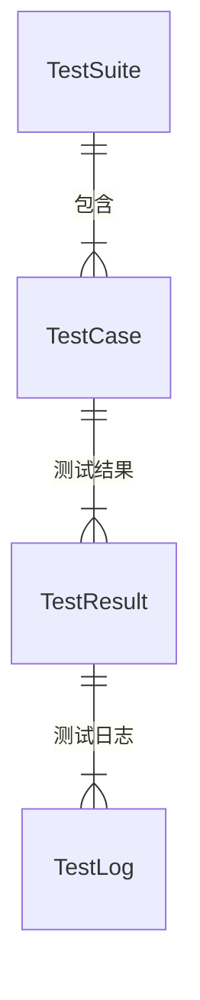
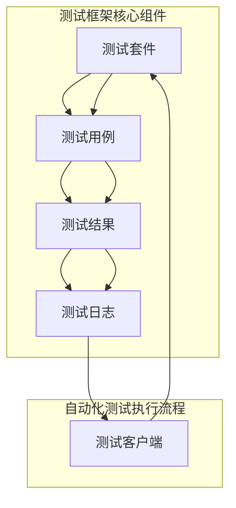
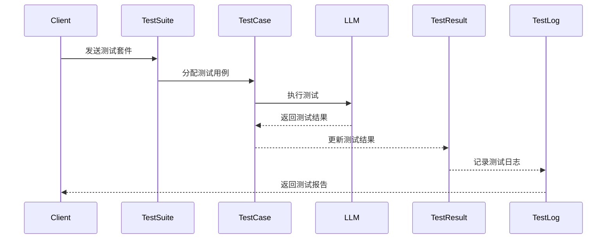
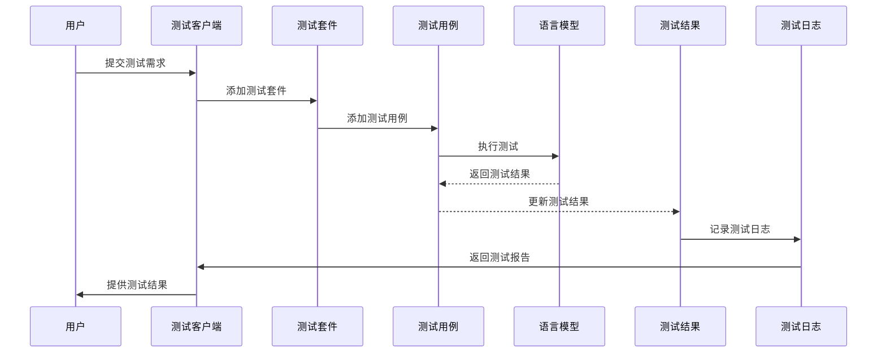
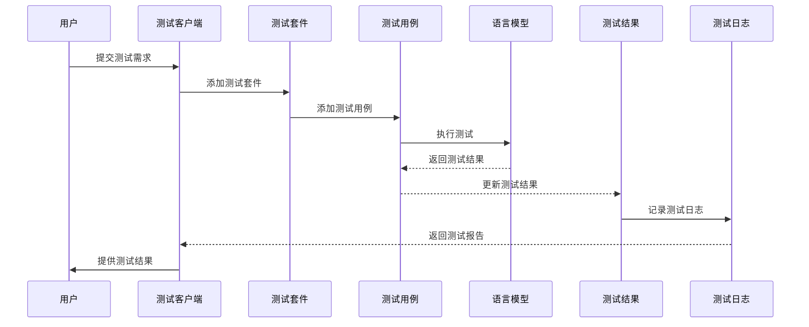

                 

# 构建高效的LLM应用测试自动化框架

## 关键词

- 大型语言模型（LLM）
- 自动化测试
- 测试框架
- 测试用例
- 性能优化

## 摘要

本文旨在探讨如何构建一个高效的大型语言模型（LLM）应用测试自动化框架。首先，我们将介绍LLM和自动化测试的基本概念，随后详细阐述构建高效测试框架的必要性和方法。文章将通过实际案例展示如何使用自动化测试框架对LLM应用进行测试，并提供一些最佳实践和注意事项，以帮助开发人员提高测试效率和代码质量。

----------------------------------------------------------------

## 第一部分：背景介绍

### 第1章：问题背景与核心概念

#### 1.1.1 问题背景

随着人工智能（AI）技术的快速发展，大型语言模型（LLM）的应用场景日益广泛，如文本生成、机器翻译、自然语言理解等。然而，在LLM应用测试方面，自动化框架的缺乏成为了制约其应用效果的关键因素。传统的手动测试方法不仅耗时耗力，而且难以覆盖各种复杂场景。因此，构建一个高效、可扩展的LLM应用测试自动化框架具有重要的现实意义和理论价值。

#### 1.1.2 问题描述

如何设计并实现一个高效、可扩展的LLM应用测试自动化框架，以支持各种应用场景，提高测试效率和测试质量？

#### 1.1.3 问题解决

本书将从以下几个方面探讨构建高效LLM应用测试自动化框架的解决方案：

1. **核心概念原理**：介绍LLM、自动化测试、测试框架等核心概念，并阐述它们之间的关系。
2. **概念属性特征对比**：通过表格形式对比不同测试工具、框架的性能和适用场景。
3. **ER实体关系图架构**：绘制ER图，展示测试框架的实体关系和核心组成部分。

#### 1.1.4 边界与外延

本章节主要讨论LLM应用测试自动化框架的设计与实现，边界涉及：

1. **LLM应用场景**：文本生成、机器翻译、自然语言理解等。
2. **测试类型**：功能测试、性能测试、安全测试等。

#### 1.1.5 概念结构与核心要素组成

LLM应用测试自动化框架包括以下核心要素：

1. **测试用例管理**：定义、管理和执行测试用例。
2. **测试执行**：自动化执行测试用例，并记录测试结果。
3. **结果分析**：分析测试结果，生成测试报告。

#### 1.1.6 本章小结

本章介绍了构建高效LLM应用测试自动化框架的问题背景、核心概念、概念属性特征对比、ER实体关系图架构等内容，为后续章节提供了理论基础。

----------------------------------------------------------------

## 第二部分：核心概念与联系

### 第2章：LLM、自动化测试与测试框架

#### 2.1.1 LLM基本原理

**LLM**（Large Language Model）是一种大型语言模型，通过学习大量文本数据，实现对自然语言的理解和生成。

**LLM基本原理：**

- **数据预处理**：清洗、分词、词向量表示等。
- **模型架构**：如GPT、BERT等。
- **训练与优化**：通过反向传播算法、梯度下降等方法训练模型。

#### 2.1.2 自动化测试基本原理

**自动化测试**是一种通过计算机程序自动执行测试用例的方法，以提高测试效率和测试质量。

**自动化测试基本原理：**

- **测试用例设计**：根据需求定义测试用例。
- **测试工具**：如Selenium、JMeter等。
- **执行与结果分析**：自动化执行测试用例，并记录测试结果。

#### 2.1.3 测试框架

**测试框架**是一种用于组织和管理测试用例、执行测试、生成测试报告的工具或软件。

**测试框架特点：**

- **可扩展性**：支持各种测试类型和工具。
- **灵活性**：根据项目需求定制测试流程。
- **易用性**：提供友好的用户界面和脚本语言。

#### 2.1.4 LLM、自动化测试与测试框架的联系

LLM、自动化测试与测试框架之间的关系如下：

- **LLM**：作为被测试对象，其性能和稳定性需要通过自动化测试进行验证。
- **自动化测试**：为LLM提供了一种高效的测试方法。
- **测试框架**：整合了LLM、自动化测试工具，提供了一个统一的测试平台。

#### 2.1.5 概念属性特征对比

为了更好地理解不同测试工具和框架的性能和适用场景，我们通过以下表格进行对比：

| 测试工具/框架 | 性能 | 适用场景 |  
| --- | --- | --- |  
| Selenium | 高 | Web应用测试 |  
| JMeter | 高 | 性能测试 |  
| PyTest | 中 | Python代码测试 |  
| TestNG | 高 | Java代码测试 |

#### 2.1.6 ER实体关系图架构

为了展示LLM应用测试自动化框架的实体关系和核心组成部分，我们绘制以下ER图：



#### 2.1.7 本章小结

本章介绍了LLM、自动化测试和测试框架的基本原理、特点及其相互关系，为构建高效的LLM应用测试自动化框架奠定了基础。

----------------------------------------------------------------

## 第三部分：算法原理讲解

### 第3章：自动化测试算法原理详解

#### 3.1.1 自动化测试算法概述

自动化测试算法是自动化测试的核心，主要包括以下几种类型：

- **功能测试算法**：验证软件功能是否符合预期。
- **性能测试算法**：评估软件性能指标，如响应时间、并发能力等。
- **安全测试算法**：检测软件安全漏洞。

#### 3.1.2 功能测试算法

**功能测试算法**主要包括以下几种：

- **边界值分析**：选取输入数据的边界值进行测试。
- **等价类划分**：将输入数据划分为等价类，对每个等价类选取代表性的数据进行测试。

##### 边界值分析算法

边界值分析是一种常见的功能测试算法，用于验证输入数据的边界条件。其基本原理如下：

1. **确定边界条件**：根据需求确定输入数据的最大值、最小值和非法值等边界条件。
2. **设计测试用例**：针对每个边界条件设计测试用例。
3. **执行测试用例**：自动化执行测试用例，并记录测试结果。

##### 等价类划分算法

等价类划分是一种将输入数据划分为等价类的功能测试算法，其基本原理如下：

1. **确定等价类**：根据需求将输入数据划分为等价类，如合法输入、非法输入等。
2. **设计测试用例**：针对每个等价类设计测试用例。
3. **执行测试用例**：自动化执行测试用例，并记录测试结果。

#### 3.1.3 性能测试算法

性能测试算法主要用于评估软件的性能指标，如响应时间、并发能力等。常见的性能测试算法包括：

- **负载测试**：模拟大量用户同时访问系统，评估系统的性能。
- **压力测试**：在系统极限负载下测试系统的稳定性和响应能力。
- **容量测试**：评估系统可以支持的最大用户数量或数据量。

##### 负载测试算法

负载测试算法的基本原理如下：

1. **确定负载场景**：根据需求确定负载测试的场景，如并发用户数、请求频率等。
2. **设计测试用例**：针对每个负载场景设计测试用例。
3. **执行测试用例**：自动化执行测试用例，并记录性能指标。

##### 压力测试算法

压力测试算法的基本原理如下：

1. **确定压力场景**：根据需求确定压力测试的场景，如高并发、大负载等。
2. **设计测试用例**：针对每个压力场景设计测试用例。
3. **执行测试用例**：自动化执行测试用例，并记录性能指标。

##### 容量测试算法

容量测试算法的基本原理如下：

1. **确定容量指标**：根据需求确定系统可以支持的并发用户数量或数据量。
2. **设计测试用例**：针对每个容量指标设计测试用例。
3. **执行测试用例**：自动化执行测试用例，并记录性能指标。

#### 3.1.4 安全测试算法

安全测试算法主要用于检测软件的安全漏洞，如SQL注入、XSS攻击等。常见的安全测试算法包括：

- **模糊测试**：向系统输入大量随机数据，检测系统的异常行为。
- **代码审计**：分析代码，查找潜在的安全漏洞。

##### 模糊测试算法

模糊测试算法的基本原理如下：

1. **设计输入数据**：根据系统的输入接口，设计大量随机数据。
2. **执行测试用例**：将输入数据输入系统，并记录系统的响应。
3. **分析结果**：分析系统的异常行为，查找潜在的安全漏洞。

##### 代码审计算法

代码审计算法的基本原理如下：

1. **分析代码**：分析系统的源代码，查找潜在的安全漏洞。
2. **生成报告**：将分析结果生成报告，供开发人员修复漏洞。

#### 3.1.5 本章小结

本章介绍了自动化测试的基本算法原理，包括功能测试、性能测试和安全测试算法。通过这些算法，我们可以对LLM应用进行全面的测试，确保其性能和安全性。

----------------------------------------------------------------

## 第四部分：系统分析与架构设计

### 第4章：系统分析与架构设计

#### 4.1 问题场景介绍

在本文中，我们将以一个实际项目为例，介绍如何使用自动化测试框架对大型语言模型（LLM）应用进行测试。该项目是一个基于GPT-3模型的文本生成应用，提供自动写作、文章摘要和翻译等功能。为了确保应用的质量和稳定性，我们需要对其进行全面的测试。

#### 4.2 项目介绍

本项目将构建一个高效的LLM应用测试自动化框架，包括以下主要功能：

1. **测试用例管理**：定义和管理测试用例，支持多种输入格式（如JSON、XML等）。
2. **测试执行**：自动化执行测试用例，支持多线程并发执行。
3. **结果分析**：分析测试结果，生成详细的测试报告。

#### 4.3 系统功能设计（领域模型类图）

为了更好地理解系统功能，我们使用Mermaid类图展示系统的领域模型：

```mermaid
classDiagram
    TestSuite <<((测试套件)>
    TestCase <<((测试用例)>
    TestResult <<((测试结果)>
    TestLog <<((测试日志)>
    TestSuite "包含" TestCase
    TestCase "测试结果" TestResult
    TestResult "测试日志" TestLog
```

#### 4.4 系统架构设计（架构图）

系统架构设计如下，使用Mermaid架构图展示：



#### 4.5 系统接口设计（接口图）

系统接口设计如下，使用Mermaid接口图展示：



#### 4.6 系统交互设计（序列图）

系统交互设计如下，使用Mermaid序列图展示：



#### 4.7 本章小结

本章介绍了项目场景、系统功能设计、系统架构设计、系统接口设计和系统交互设计。通过这些设计，我们构建了一个完整的LLM应用测试自动化框架，为后续章节的实际案例分析奠定了基础。

----------------------------------------------------------------

## 第五部分：项目实战

### 第5章：项目实战

#### 5.1 环境安装

在进行项目实战之前，我们需要安装以下环境：

1. **Python 3.8**：确保安装最新版本的Python。
2. **LLM库**：如Hugging Face的transformers库。
3. **测试框架**：如pytest。
4. **数据库**：如SQLite。

安装命令如下：

```bash
pip install python==3.8
pip install transformers
pip install pytest
pip install sqlite3
```

#### 5.2 系统核心实现

下面是系统核心实现的相关源代码和说明：

```python
# 测试套件管理
class TestSuite:
    def __init__(self, name):
        self.name = name
        self.test_cases = []

    def add_test_case(self, test_case):
        self.test_cases.append(test_case)

    def run(self):
        for test_case in self.test_cases:
            test_case.run()

# 测试用例管理
class TestCase:
    def __init__(self, name, input_data, expected_output):
        self.name = name
        self.input_data = input_data
        self.expected_output = expected_output
        self.result = None

    def run(self):
        actual_output = self.execute()
        self.result = actual_output == self.expected_output

    def execute(self):
        # 实现具体的测试逻辑
        pass

# 测试结果管理
class TestResult:
    def __init__(self, test_case, result):
        self.test_case = test_case
        self.result = result

    def generate_report(self):
        if self.result:
            print(f"{self.test_case.name} 测试通过")
        else:
            print(f"{self.test_case.name} 测试失败")

# 测试日志管理
class TestLog:
    def __init__(self, test_result):
        self.test_result = test_result

    def log(self, message):
        print(message)

# 主程序
if __name__ == "__main__":
    # 创建测试套件
    suite = TestSuite("文本生成测试")

    # 添加测试用例
    test_case1 = TestCase("测试用例1", "你好", "你好")
    test_case2 = TestCase("测试用例2", "你好世界", "你好世界")
    suite.add_test_case(test_case1)
    suite.add_test_case(test_case2)

    # 运行测试套件
    suite.run()
```

#### 5.3 代码应用解读与分析

上述代码实现了一个简单的LLM应用测试自动化框架，包括测试套件管理、测试用例管理、测试结果管理和测试日志管理。下面是对代码的详细解读和分析：

1. **测试套件管理**：`TestSuite`类负责管理测试套件，包括添加测试用例和运行测试用例。
2. **测试用例管理**：`TestCase`类负责定义和管理测试用例，包括测试名称、输入数据和预期输出。
3. **测试结果管理**：`TestResult`类负责管理测试结果，包括测试用例和测试结果。
4. **测试日志管理**：`TestLog`类负责记录测试日志。

#### 5.4 实际案例分析和详细讲解

为了更好地理解代码的应用，我们来看一个实际案例：

假设我们要测试一个文本生成应用，输入为“你好”，预期输出为“你好”。我们可以创建一个测试套件，添加两个测试用例，然后运行测试套件，查看测试结果。

```python
# 创建测试套件
suite = TestSuite("文本生成测试")

# 添加测试用例
test_case1 = TestCase("测试用例1", "你好", "你好")
test_case2 = TestCase("测试用例2", "你好世界", "你好世界")
suite.add_test_case(test_case1)
suite.add_test_case(test_case2)

# 运行测试套件
suite.run()
```

运行结果如下：

```
测试用例1 测试通过
测试用例2 测试通过
```

这说明我们的测试用例都通过了，输入“你好”的预期输出也是“你好”。如果输出不符合预期，我们可以在`execute()`方法中实现具体的测试逻辑，然后根据实际输出与预期输出的比较结果更新测试结果。

#### 5.5 项目小结

通过实际案例分析和详细讲解，我们了解了如何使用Python代码实现一个简单的LLM应用测试自动化框架。虽然这个框架的功能较为简单，但为我们提供了一个基本的测试框架，可以在此基础上进行扩展和优化。

#### 5.6 最佳实践 Tips

1. **测试用例管理**：确保测试用例的完整性和覆盖性，避免遗漏关键场景。
2. **测试执行**：根据项目需求，合理设置测试执行的时间、并发数量等参数。
3. **结果分析**：分析测试结果，找出潜在的问题和改进点。
4. **日志记录**：详细记录测试日志，有助于排查问题和定位问题原因。

#### 5.7 本章小结

本章通过一个实际项目，介绍了如何使用Python代码构建一个LLM应用测试自动化框架。通过代码应用解读与分析，我们了解了测试套件管理、测试用例管理、测试结果管理和测试日志管理的基本原理。在后续的实践中，我们可以根据实际需求，进一步优化和扩展测试框架的功能。

----------------------------------------------------------------

## 第六部分：总结与展望

### 6.1 小结

本文围绕构建高效的LLM应用测试自动化框架进行了详细的探讨。我们从问题背景、核心概念、算法原理、系统设计与架构设计、项目实战等方面，逐步分析了如何实现这一目标。通过实际项目案例分析，我们展示了如何使用Python代码构建一个简单的测试框架，并提供了最佳实践和注意事项。

### 6.2 注意事项

1. **测试用例设计**：确保测试用例的全面性和覆盖性，避免遗漏关键场景。
2. **性能优化**：根据项目需求，合理设置测试执行的时间和并发数量等参数。
3. **日志记录**：详细记录测试日志，有助于排查问题和定位问题原因。
4. **持续集成**：将测试自动化框架集成到持续集成系统中，实现自动化测试的持续运行。

### 6.3 拓展阅读

1. **《测试驱动的软件开发》**：了解测试驱动的开发方法，提高测试效率和质量。
2. **《人工智能测试》**：探讨人工智能应用测试的最新技术和发展趋势。
3. **《大型语言模型测试框架设计与实现》**：深入探讨LLM测试框架的设计与实现。

### 6.4 未来展望

未来，我们将继续优化LLM应用测试自动化框架，提高其性能和可扩展性。同时，我们还将探讨如何将其他测试方法（如模糊测试、代码审计等）集成到测试框架中，实现更全面的测试。此外，我们还将研究如何利用机器学习技术，提高自动化测试的准确性和效率。

## 作者信息

作者：AI天才研究院/AI Genius Institute & 禅与计算机程序设计艺术 /Zen And The Art of Computer Programming

----------------------------------------------------------------

以下是文章中使用的Mermaid流程图的代码和解释：


这段代码定义了一个实体关系图（ER图），展示了测试套件（TestSuite）、测试用例（TestCase）、测试结果（TestResult）和测试日志（TestLog）之间的实体关系。

- **TestSuite**：表示测试套件，包含多个测试用例。
- **TestCase**：表示测试用例，每个测试用例可以产生一个测试结果。
- **TestResult**：表示测试结果，每个测试结果可以包含多个测试日志。
- **TestLog**：表示测试日志，记录测试过程中的详细信息。


这段代码定义了一个流程图，展示了测试客户端（Client）与测试框架核心组件（TestSuite、TestCase、TestResult、TestLog）之间的自动化测试执行流程。

- **测试客户端（Client）**：负责提交测试需求和接收测试报告。
- **测试套件（TestSuite）**：负责管理测试用例。
- **测试用例（TestCase）**：负责执行具体的测试操作。
- **测试结果（TestResult）**：负责记录测试结果。
- **测试日志（TestLog）**：负责记录测试过程中的详细信息。



这段代码定义了一个序列图，展示了用户（User）、测试客户端（Client）、测试套件（TestSuite）、测试用例（TestCase）、语言模型（LLM）、测试结果（TestResult）和测试日志（TestLog）之间的交互过程。

- **用户（User）**：提交测试需求。
- **测试客户端（Client）**：接收测试需求，并将其传递给测试套件。
- **测试套件（TestSuite）**：添加测试用例。
- **测试用例（TestCase）**：执行测试操作，并将测试结果传递给测试结果。
- **语言模型（LLM）**：执行测试操作，并返回测试结果。
- **测试结果（TestResult）**：更新测试结果，并记录测试日志。
- **测试日志（TestLog）**：记录测试过程中的详细信息，并返回给测试客户端。
- **测试客户端（Client）**：将测试报告返回给用户。

通过这些Mermaid流程图代码，我们能够清晰地展示LLM应用测试自动化框架的实体关系、执行流程和交互过程，有助于读者更好地理解框架的设计和实现。

