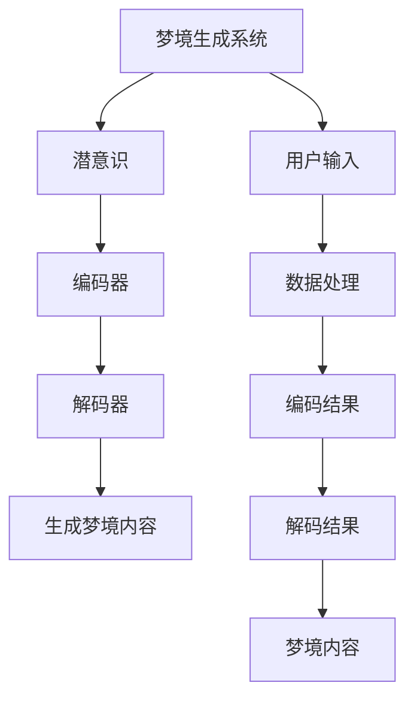
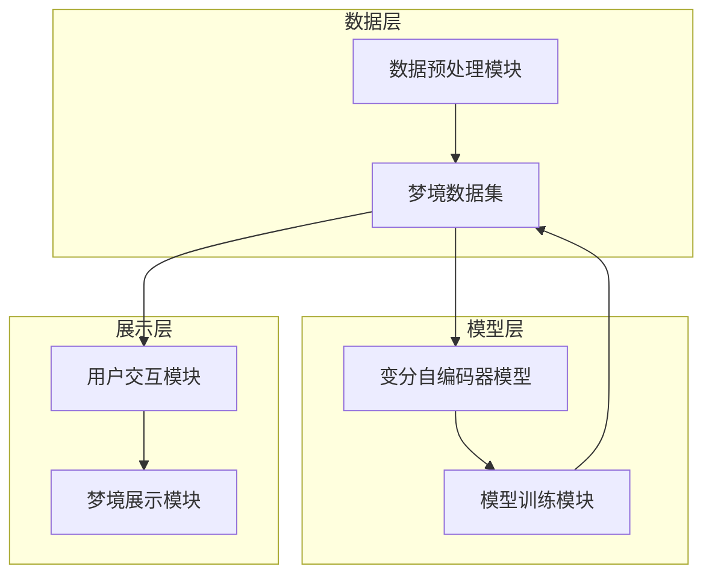
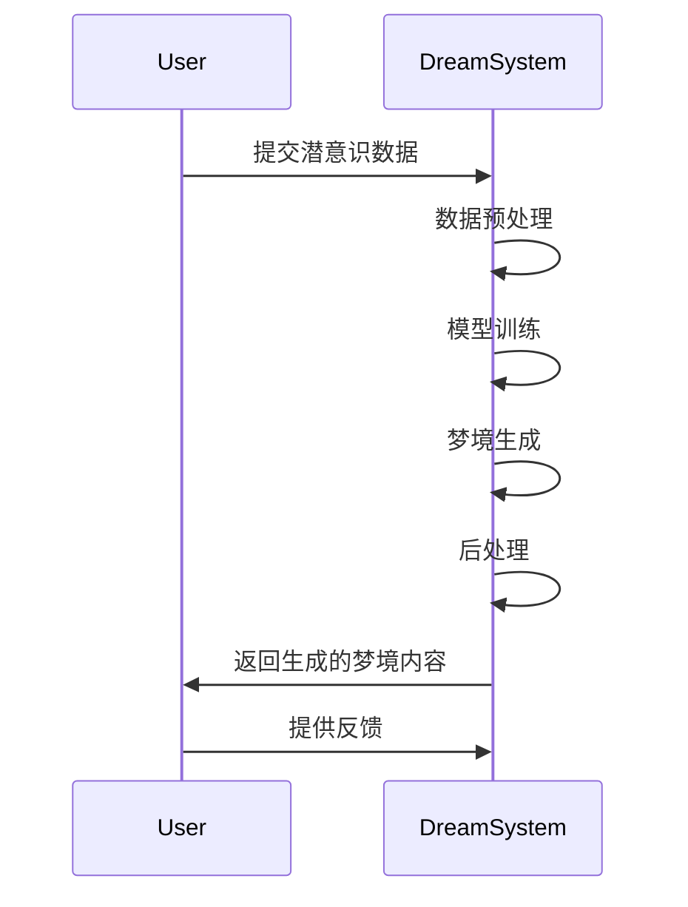

                 

### 文章标题：梦境生成的变分自编码器：潜意识创造的数学模拟

> **关键词：** 梦境生成、变分自编码器、潜意识、数学模拟

> **摘要：** 本文将探讨如何使用变分自编码器来模拟梦境生成过程，通过潜意识的作用，实现潜意识创造的数学模拟。本文将首先介绍梦境生成与潜意识研究的相关背景，然后深入分析变分自编码器的基本原理，最后通过实际案例来展示这一技术的应用与效果。

---

### 目录大纲

#### 第一部分：背景介绍

- **第1章：问题背景**
  - **1.1 梦境生成与潜意识研究**
  - **1.2 变分自编码器简介**
  - **1.3 梦境生成与变分自编码器的联系**

- **第2章：核心概念与联系**
  - **2.1 潜意识的概念与特性**
  - **2.2 变分自编码器的基本原理**
  - **2.3 潜意识与变分自编码器的联系**
  - **3.1 变分自编码器与其他生成模型对比**
  - **3.2 潜意识相关术语与概念对比**
  - **4.1 梦境生成系统的实体关系**
  - **4.2 潜意识与变分自编码器的关系**

- **第3章：算法原理讲解**
  - **5.1 变分自编码器的工作流程**
  - **5.2 潜意识数据预处理**
  - **5.3 梦境生成算法详解**
  - **5.4 算法性能分析与优化**
  - **6.1 变分自编码器的数学模型**
  - **6.2 潜意识数据特征提取的数学模型**
  - **6.3 梦境生成的数学公式**

- **第4章：系统分析与架构设计方案**
  - **7.1 梦境生成系统的应用场景**
  - **7.2 变分自编码器在梦境生成中的作用**
  - **8.1 梦境生成项目概述**
  - **8.2 项目目标与预期效果**
  - **9.1 领域模型类图**
  - **9.2 系统功能模块划分**
  - **10.1 系统架构概述**
  - **10.2 系统模块详细介绍**
  - **11.1 接口设计规范**
  - **11.2 接口实现与调用**
  - **12.1 系统交互流程**
  - **12.2 系统交互序列图**

- **第5章：项目实战**
  - **13.1 环境准备**
  - **13.2 软件安装与配置**
  - **14.1 核心代码实现**
  - **14.2 代码解读与分析**
  - **15.1 案例背景**
  - **15.2 案例分析与讲解**
  - **15.3 案例总结与优化**
  - **16.1 项目成果总结**
  - **16.2 项目不足与改进方向**
  - **16.3 未来发展方向与拓展**

- **第6章：最佳实践 tips、小结、注意事项、拓展阅读**
  - **17.1 实践技巧与注意事项**
  - **17.2 常见问题与解决方案**
  - **18.1 主要内容回顾**
  - **18.2 学习建议与展望**
  - **19.1 使用注意事项**
  - **19.2 安全与隐私问题**
  - **20.1 相关文献与资料推荐**
  - **20.2 最新研究动态与趋势**

---

### 第一部分：背景介绍

#### 第1章：问题背景

##### 1.1 梦境生成与潜意识研究

梦境是人类睡眠过程中的自然现象，一直是心理学、神经科学和计算机科学等领域的重要研究课题。近年来，随着人工智能技术的发展，特别是生成模型和深度学习算法的进步，研究人员开始探索如何利用这些技术来模拟梦境生成过程。

潜意识是心理学中的重要概念，被认为是人类心理活动的核心。潜意识不仅影响我们的情绪、行为和认知，还参与梦境的形成。潜意识的研究对于理解人类心理和行为具有重要意义。

变分自编码器（Variational Autoencoder，VAE）是一种深度学习模型，广泛应用于图像生成、数据降维和特征提取等领域。变分自编码器的独特结构使其成为模拟梦境生成过程的潜在工具。

##### 1.2 变分自编码器简介

变分自编码器（VAE）是一种概率生成模型，由两部分组成：编码器和解码器。编码器将输入数据映射到一个潜在空间中的点，解码器则从潜在空间中采样并生成新的数据。

VAE的核心思想是通过优化目标函数，使得编码器和解码器的输出能够近似真实数据分布。其优点在于能够生成高质量的、具有多样性的数据，并且在数据生成过程中保留了数据的结构信息。

##### 1.3 梦境生成与变分自编码器的联系

梦境生成与变分自编码器之间的联系在于，两者的目标都是生成新的数据，并且都依赖于概率模型和深度学习算法。变分自编码器可以通过学习输入数据的分布，生成与输入数据在特征上相似的梦境内容。

变分自编码器在梦境生成中的应用，可以看作是将潜意识数据转化为具体的、可视化的梦境内容。这种转化不仅有助于理解梦境的本质，还可以为人工智能在心理学和医疗等领域的应用提供新的思路。

### 第二部分：核心概念与联系

#### 第2章：核心概念与联系

##### 2.1 潜意识的概念与特性

潜意识是心理学中的一个重要概念，通常被描述为一种无意识的心理过程，负责处理日常生活中的各种任务，包括记忆、情绪、行为等。潜意识具有以下特性：

1. **无意识性**：潜意识的活动通常不受意识控制，人们往往无法直接意识到其存在。
2. **自动性**：潜意识能够自动处理大量的信息，包括感知、记忆、决策等。
3. **稳定性**：潜意识中的信息通常比较稳定，不易受外界干扰。
4. **潜在性**：潜意识中的信息可能以潜藏的形式存在，只有在特定条件下才会被激活。

##### 2.2 变分自编码器的基本原理

变分自编码器（VAE）是一种基于深度学习的概率生成模型，其核心思想是将输入数据映射到一个潜在的随机变量上，并通过这个潜在的变量来生成新的数据。

VAE由两部分组成：编码器和解码器。编码器将输入数据映射到一个潜在空间中的一个点，通常是一个均值和方差的二元组。解码器从潜在空间中采样，并使用这个采样点来生成新的数据。

VAE的优化目标是使得编码器和解码器的输出能够近似真实数据的分布。这一目标通过一个称为“变分损失函数”的优化过程来实现。

##### 2.3 潜意识与变分自编码器的联系

潜意识与变分自编码器之间的联系在于，两者都涉及到数据的生成和变换。潜意识可以看作是一种内在的、无意识的生成过程，而变分自编码器则是一种外部的、基于算法的生成过程。

通过将潜意识数据（如梦境内容）输入到变分自编码器中，可以实现对潜意识内容的数学模拟和可视化。这种模拟不仅有助于理解潜意识的工作原理，还可以为人工智能在心理学和医疗等领域的应用提供新的工具。

##### 3.1 变分自编码器与其他生成模型对比

变分自编码器（VAE）是一种概率生成模型，广泛应用于图像生成、数据降维和特征提取等领域。与其他生成模型相比，VAE具有以下特点：

1. **概率生成**：VAE通过学习输入数据的概率分布，生成新的数据。这种概率生成方式使得VAE能够生成具有多样性和结构性的数据。
2. **无监督学习**：VAE可以在没有标签数据的条件下进行训练，这使得VAE在数据缺乏标签的情况下仍然具有生成能力。
3. **变分损失函数**：VAE使用变分损失函数来优化模型，使得编码器和解码器的输出能够近似真实数据的分布。这种损失函数的设计使得VAE在生成过程中能够保持数据的结构信息。

与其他生成模型相比，如生成对抗网络（GAN），VAE在生成多样性和数据质量方面具有一定的优势，但其生成速度相对较慢。

##### 3.2 潜意识相关术语与概念对比

潜意识是心理学中的一个重要概念，涉及到许多相关术语和概念。以下是一些常见的潜意识相关术语与概念的对比：

1. **无意识与有意识**：无意识是指那些未被意识到或未被明确表达的心理活动，而有意识是指那些可以被意识到和明确表达的心理活动。潜意识与无意识密切相关。
2. **内隐记忆与外显记忆**：内隐记忆是指那些不需要意识参与的记忆，如条件反射和肌肉记忆。外显记忆则是指那些需要意识参与的记忆，如名字和日期的记忆。
3. **情绪与认知**：情绪是潜意识中的一个重要组成部分，它通常与认知过程紧密相关。情绪认知理论认为，情绪可以影响认知过程，如判断和决策。
4. **梦与潜意识**：梦是潜意识的一种表现形式，通常与睡眠过程中的心理活动有关。梦境可以反映潜意识中的思想、情感和欲望。

这些术语和概念有助于我们更深入地理解潜意识的工作原理和作用。

##### 4.1 梦境生成系统的实体关系

梦境生成系统是一个复杂的系统，涉及到多个实体和它们之间的关系。以下是一个简单的实体关系图，展示了梦境生成系统中的主要实体和它们之间的关系：



- **梦境生成系统**：整个系统的核心，负责生成梦境内容。
- **潜意识**：梦境生成的数据来源，与用户输入和处理过程紧密相关。
- **编码器**：将潜意识数据编码为潜在空间中的点。
- **解码器**：从潜在空间中采样，并生成新的梦境内容。
- **生成梦境内容**：解码器生成的梦境内容。
- **用户输入**：用户提供的梦境生成数据。
- **数据处理**：对用户输入的数据进行处理，以便编码器和解码器使用。
- **编码结果**：编码器对潜意识数据编码后的结果。
- **解码结果**：解码器从潜在空间中采样后的结果。
- **梦境内容**：最终生成的梦境内容。

这个实体关系图展示了梦境生成系统的主要组件和它们之间的关系，有助于我们更好地理解系统的运作原理。

##### 4.2 潜意识与变分自编码器的关系

潜意识与变分自编码器（VAE）之间的联系在于，两者都涉及到数据的生成和变换。潜意识可以看作是一种内在的、无意识的生成过程，而变分自编码器则是一种外部的、基于算法的生成过程。

通过将潜意识数据（如梦境内容）输入到变分自编码器中，可以实现对潜意识内容的数学模拟和可视化。这种模拟不仅有助于理解潜意识的工作原理，还可以为人工智能在心理学和医疗等领域的应用提供新的工具。

具体来说，潜意识中的数据可以通过变分自编码器的编码器部分进行编码，得到潜在空间中的点。这些点代表了潜意识中的特征信息。然后，解码器可以从潜在空间中采样，并生成新的梦境内容。

这种过程类似于潜意识中的信息处理过程，即潜意识中的信息通过某种方式编码和存储，然后在外界刺激下进行解码和表达。

总之，潜意识与变分自编码器之间的联系为我们提供了一种新的方法来理解和模拟潜意识，也为人工智能在心理学和医疗等领域的应用带来了新的可能性。

### 第三部分：算法原理讲解

#### 第5章：算法原理讲解

##### 5.1 变分自编码器的工作流程

变分自编码器（VAE）是一种深度学习模型，用于生成新的数据，其工作流程可以分为以下几个步骤：

1. **编码过程**：编码器（Encoder）将输入数据（例如一张图片）映射到一个潜在空间中的一个点。这个点由一个均值和一个标准差组成，表示该数据在潜在空间中的位置和分布。
   
   $$ z = \text{encoder}(x) = \mu(x), \sigma(x) $$
   
   其中，$z$是潜在空间中的点，$\mu(x)$是均值，$\sigma(x)$是标准差。

2. **采样过程**：从潜在空间中随机采样一个点，这个过程模拟了潜意识的随机性。

   $$ x' = \text{reparameterization}(\epsilon) $$
   
   其中，$x'$是从潜在空间中采样的新数据，$\epsilon$是随机噪声。

3. **解码过程**：解码器（Decoder）将采样得到的点解码回原始数据空间，生成新的数据。

   $$ x = \text{decoder}(z') $$
   
   其中，$z'$是采样得到的点。

4. **优化过程**：通过最小化重建误差和潜在空间分布的KL散度来优化模型。

   $$ \text{Loss} = D_{KL}(\mu(x), \sigma(x)) + \sum_{i} \left| x - x' \right| $$
   
   其中，$D_{KL}$是KL散度，$\left| x - x' \right|$是重构误差。

##### 5.2 潜意识数据预处理

在将潜意识数据输入到变分自编码器之前，通常需要进行预处理，以提高模型的性能和生成质量。预处理步骤包括：

1. **数据清洗**：去除噪声和异常值，确保输入数据的纯净和一致性。
2. **特征提取**：提取数据中的重要特征，为编码器和解码器提供有用的信息。
3. **数据归一化**：将数据缩放到相同的范围，避免因为数据尺度差异导致模型训练不稳定。
4. **数据增强**：通过旋转、缩放、裁剪等操作增加数据多样性，帮助模型更好地学习数据的分布。

##### 5.3 梦境生成算法详解

使用变分自编码器生成梦境的具体算法步骤如下：

1. **初始化模型**：选择合适的网络结构，初始化编码器和解码器的权重。
2. **训练模型**：使用预处理后的潜意识数据训练变分自编码器。在训练过程中，优化编码器和解码器的参数，使得解码器的输出尽可能接近原始输入。
3. **采样生成**：在训练完成后，从潜在空间中随机采样点，并通过解码器生成新的梦境数据。
4. **后处理**：对生成的梦境数据进行后处理，如颜色调整、降噪等，以获得更逼真的梦境效果。

##### 5.4 算法性能分析与优化

变分自编码器生成梦境的性能可以从以下几个方面进行评估：

1. **视觉质量**：生成的梦境数据是否具有真实感，包括颜色、纹理和细节。
2. **多样性**：生成的梦境数据是否具有多样性，能够覆盖不同的梦境场景。
3. **稳定性**：模型在生成梦境时是否稳定，是否能够避免生成重复或低质量的梦境。
4. **效率**：模型训练和生成过程的计算效率和资源消耗。

为了优化变分自编码器的性能，可以采取以下策略：

1. **调整网络结构**：通过增加或减少网络层、调整层的大小和类型来优化模型。
2. **数据增强**：使用更多的数据增强技术来丰富训练数据，提高模型的学习能力。
3. **超参数优化**：调整学习率、批量大小、正则化参数等超参数，以获得更好的训练效果。
4. **模型压缩**：通过模型剪枝、量化等技术减少模型的计算量和存储需求，提高效率。

##### 6.1 变分自编码器的数学模型

变分自编码器的数学模型主要包括编码器和解码器的参数以及损失函数。

编码器参数：
$$
\theta_{\text{enc}} = (\mu, \sigma)
$$
其中，$\mu$和$\sigma$分别是编码器输出的均值和标准差。

解码器参数：
$$
\theta_{\text{dec}} = (\phi)
$$
其中，$\phi$是解码器的权重。

损失函数：
$$
\mathcal{L} = D_{KL}(\mu || \sigma) + \sum_{i} || x_i - x_i' ||_2
$$
其中，$D_{KL}$是KL散度，$x_i$是输入数据，$x_i'$是解码器的输出。

通过最小化上述损失函数，可以优化编码器和解码器的参数，从而提高模型的生成质量。

##### 6.2 潜意识数据特征提取的数学模型

在变分自编码器中，潜意识数据特征提取的数学模型是通过编码器实现的。具体来说，编码器的任务是学习一个从输入数据空间到潜在空间的高效映射。

编码器数学模型：
$$
z = g(\theta_{\text{enc}}, x) = (\mu(x), \sigma(x))
$$
其中，$g$是一个非线性函数，$\theta_{\text{enc}}$是编码器的参数，$x$是输入数据。

编码器通过学习输入数据的分布，将其映射到一个潜在的随机变量上，这个变量代表了数据的特征信息。

##### 6.3 梦境生成的数学公式

梦境生成的数学过程主要依赖于解码器的输出。解码器的目标是生成与输入数据在特征上相似的新数据。具体公式如下：

解码器数学模型：
$$
x' = f(\theta_{\text{dec}}, z) = \text{reparameterize}(\epsilon; \theta_{\text{dec}}, z)
$$
其中，$f$是一个非线性函数，$\theta_{\text{dec}}$是解码器的参数，$z$是潜在空间中的点，$\epsilon$是噪声。

通过从潜在空间中采样，解码器能够生成新的梦境数据，模拟潜意识中的创造性过程。

### 第四部分：系统分析与架构设计方案

#### 第7章：问题场景介绍

##### 7.1 梦境生成系统的应用场景

梦境生成系统可以在多个领域发挥作用，以下是一些典型的应用场景：

1. **心理学研究**：通过生成梦境，研究人员可以更深入地理解梦境的生成机制和潜意识的作用。
2. **医疗应用**：梦境生成可以帮助治疗失眠、噩梦等心理疾病，通过模拟梦境，减轻患者的症状。
3. **艺术创作**：艺术家可以使用梦境生成系统来获取灵感，创造独特的艺术作品。
4. **娱乐产业**：梦境生成可以用于游戏和虚拟现实中的情境生成，为用户提供沉浸式的体验。

##### 7.2 变分自编码器在梦境生成中的作用

变分自编码器（VAE）在梦境生成系统中起着核心作用，其独特的结构使其能够有效地捕捉和生成梦境的特征。具体来说，VAE的作用包括：

1. **特征提取**：通过编码器，VAE可以从潜意识数据中提取出重要的特征信息，为梦境生成提供基础。
2. **生成新梦境**：解码器利用潜在空间中的点生成新的梦境数据，实现梦境的创造性生成。
3. **多样性保证**：VAE通过概率生成的方式，保证了生成的梦境具有多样性和创造性。
4. **数据压缩**：编码器将高维的潜意识数据映射到低维的潜在空间中，实现了数据的有效压缩。

#### 第8章：项目介绍

##### 8.1 梦境生成项目概述

梦境生成项目旨在利用变分自编码器（VAE）模拟梦境生成过程，通过潜意识的作用，生成具有多样性和创造性的梦境内容。项目的主要目标是：

1. **实现一个高效的梦境生成模型**：通过训练VAE，使其能够从给定的潜意识数据中生成高质量的梦境内容。
2. **研究梦境生成机制**：通过分析VAE的生成过程，深入理解梦境的生成机制和潜意识的作用。
3. **探索潜在应用场景**：评估梦境生成系统在心理学研究、医疗应用、艺术创作和娱乐产业等领域的潜在应用价值。

##### 8.2 项目目标与预期效果

项目的主要目标包括：

1. **生成高质量的梦境内容**：通过优化VAE模型，使其生成的梦境内容在视觉质量和多样性方面达到预期效果。
2. **理解梦境生成机制**：通过分析VAE的生成过程，揭示梦境生成的基本原理和潜意识的作用。
3. **提高梦境生成的效率**：通过优化算法和硬件配置，提高梦境生成系统的运行效率和计算性能。

预期效果包括：

1. **高质量的梦境生成**：生成的梦境内容在视觉上接近真实，具有丰富的细节和独特的风格。
2. **多样的梦境内容**：系统能够生成具有多样性的梦境，满足不同用户的需求。
3. **应用潜力**：梦境生成系统在心理学研究、医疗应用、艺术创作和娱乐产业等领域展现出广泛的应用前景。

#### 第9章：系统功能设计

##### 9.1 领域模型类图

领域模型类图（Class Diagram）展示了梦境生成系统中主要类之间的关系。以下是一个简单的领域模型类图：

```mermaid
classDiagram
    DreamGenerator <<interface>>
    NeuralNetwork <<interface>>

    class Dream {
        - String id
        - String content
    }

    class DreamDataset {
        - List<Dream> dreams
    }

    class VAE {
        - NeuralNetwork encoder
        - NeuralNetwork decoder
    }

    DreamGenerator o-- DreamDataset
    DreamDataset o-- Dream
    VAE implements NeuralNetwork

    DreamGenerator uses VAE
```

- **DreamGenerator**：接口类，定义了生成梦境的主要方法。
- **NeuralNetwork**：接口类，定义了神经网络的基本操作。
- **Dream**：类，表示一个梦境，包括梦境的ID和内容。
- **DreamDataset**：类，表示梦境数据集，包含一系列Dream对象。
- **VAE**：类，实现了变分自编码器的功能，继承自NeuralNetwork。

##### 9.2 系统功能模块划分

梦境生成系统可以分为以下几个主要功能模块：

1. **数据预处理模块**：负责对输入的潜意识数据（如文本、图像等）进行清洗、归一化和增强，为训练和生成过程做准备。
2. **模型训练模块**：使用预处理后的数据训练变分自编码器（VAE），优化编码器和解码器的参数，以提高生成质量。
3. **梦境生成模块**：利用训练好的VAE模型，生成新的梦境内容，包括文本和图像等多种形式。
4. **后处理模块**：对生成的梦境内容进行后处理，如颜色调整、降噪等，以提高视觉效果。
5. **用户交互模块**：提供用户界面，允许用户输入潜意识数据，查看生成的梦境内容，并进行反馈和调整。

#### 第10章：系统架构设计

##### 10.1 系统架构概述

梦境生成系统的整体架构可以分为三个主要层次：数据层、模型层和展示层。以下是一个简单的系统架构图：



- **数据层**：负责数据的预处理、加载和管理，包括数据清洗、归一化和增强等。
- **模型层**：实现变分自编码器模型的训练和生成，包括编码器和解码器的构建和优化。
- **展示层**：提供用户界面，展示生成的梦境内容，并允许用户进行交互和反馈。

##### 10.2 系统模块详细介绍

梦境生成系统的各个模块都有其特定的功能和作用，以下是每个模块的详细介绍：

1. **数据预处理模块**：负责对输入的潜意识数据进行预处理，包括数据清洗、归一化和增强等。数据清洗旨在去除噪声和异常值，确保输入数据的纯净和一致性。数据归一化将不同尺度的数据进行标准化处理，使得模型在训练过程中更加稳定。数据增强通过旋转、缩放、裁剪等操作增加数据的多样性，帮助模型更好地学习数据的分布。

2. **模型训练模块**：实现变分自编码器（VAE）的训练过程。模型训练包括编码器和解码器的构建和优化。编码器将输入数据映射到一个潜在的随机变量上，解码器则从潜在空间中采样并生成新的数据。训练过程通过优化目标函数，使得编码器和解码器的输出能够近似真实数据的分布。

3. **梦境生成模块**：利用训练好的VAE模型生成新的梦境内容。生成过程分为两个步骤：首先从潜在空间中采样一个点，然后通过解码器生成新的梦境数据。生成的梦境数据可以是文本、图像或音频等多种形式，具体取决于输入数据的类型和系统的设计。

4. **后处理模块**：对生成的梦境内容进行后处理，以提高视觉效果和用户体验。后处理操作包括颜色调整、降噪、增强等。这些操作可以使得生成的梦境内容更加逼真，更符合用户的需求。

5. **用户交互模块**：提供用户界面，允许用户输入潜意识数据，查看生成的梦境内容，并进行反馈和调整。用户交互模块可以是一个命令行界面、一个Web界面或一个移动应用。用户通过界面与系统进行交互，可以提交新的潜意识数据，查看生成的梦境内容，并提供反馈以优化生成效果。

#### 第11章：系统接口设计

##### 11.1 接口设计规范

系统接口设计是确保梦境生成系统与其他系统或组件高效交互的关键。接口设计规范包括以下方面：

1. **API规范**：定义API的请求和响应格式，确保不同系统之间可以无缝交互。例如，可以使用RESTful API设计规范，定义HTTP请求和JSON响应格式。
2. **参数验证**：确保输入数据的正确性和合法性，防止恶意输入和系统异常。例如，对于文本输入，可以限制字符长度和内容格式。
3. **安全性**：确保接口的安全性，防止数据泄露和攻击。例如，可以使用HTTPS协议和身份验证机制，确保数据的传输和存储安全。
4. **文档和示例**：提供详细的接口文档和示例代码，帮助开发者理解和使用接口。接口文档应包括接口描述、参数说明、请求和响应示例等。

##### 11.2 接口实现与调用

接口实现与调用是系统设计的重要部分，以下是一个简单的实现示例：

1. **接口实现**：
```python
from flask import Flask, request, jsonify

app = Flask(__name__)

@app.route('/generate_dream', methods=['POST'])
def generate_dream():
    data = request.get_json()
    dream_content = data['content']
    # 调用模型生成梦境内容
    generated_dream = dream_generator.generate(dream_content)
    return jsonify({'generated_dream': generated_dream})

if __name__ == '__main__':
    app.run()
```

2. **接口调用**：
```python
import requests

url = 'https://example.com/generate_dream'
headers = {'Content-Type': 'application/json'}
data = {'content': '潜意识的图像'}
response = requests.post(url, headers=headers, json=data)
generated_dream = response.json()['generated_dream']
print(generated_dream)
```

接口实现使用Flask框架，定义了一个POST接口，接收JSON格式的请求，调用模型生成梦境内容，并返回生成的梦境数据。接口调用使用requests库，发送POST请求，接收并处理响应数据。

#### 第12章：系统交互

##### 12.1 系统交互流程

系统交互流程描述了用户与梦境生成系统之间的交互过程，包括以下步骤：

1. **用户输入**：用户通过用户界面提交潜意识数据，如文本、图像等。
2. **数据预处理**：系统对用户输入的数据进行预处理，包括清洗、归一化和增强等。
3. **模型训练**：系统使用预处理后的数据训练变分自编码器（VAE）模型。
4. **梦境生成**：训练好的VAE模型根据用户输入生成新的梦境内容。
5. **后处理**：对生成的梦境内容进行后处理，如颜色调整、降噪等。
6. **用户反馈**：用户查看生成的梦境内容，提供反馈以优化生成效果。
7. **重复交互**：用户可以重复提交新的数据，系统根据反馈不断优化生成效果。

##### 12.2 系统交互序列图

系统交互序列图（Sequence Diagram）展示了用户与系统之间的交互过程，以下是一个简单的系统交互序列图：



用户通过用户界面提交潜意识数据，系统对数据预处理后训练VAE模型，生成梦境内容并返回给用户。用户查看梦境内容后提供反馈，系统根据反馈不断优化生成效果。

### 第五部分：项目实战

#### 第13章：环境安装

##### 13.1 环境准备

在开始安装梦境生成系统之前，需要准备以下环境：

1. **操作系统**：推荐使用Linux操作系统，如Ubuntu 18.04。
2. **Python环境**：Python 3.7及以上版本。
3. **深度学习库**：如TensorFlow 2.4及以上版本或PyTorch 1.8及以上版本。
4. **其他依赖库**：如NumPy、Pandas、Matplotlib等。

安装步骤如下：

1. 更新系统包列表：
   ```bash
   sudo apt update && sudo apt upgrade
   ```

2. 安装Python和pip：
   ```bash
   sudo apt install python3 python3-pip
   ```

3. 安装深度学习库（以TensorFlow为例）：
   ```bash
   pip3 install tensorflow==2.4
   ```

4. 安装其他依赖库：
   ```bash
   pip3 install numpy pandas matplotlib
   ```

##### 13.2 软件安装与配置

1. 安装Python虚拟环境（可选）：

   ```bash
   pip3 install virtualenv
   virtualenv dream_env
   source dream_env/bin/activate
   ```

2. 安装依赖库（在虚拟环境中）：

   ```bash
   pip install -r requirements.txt
   ```

3. 配置深度学习库：

   以TensorFlow为例，确保TensorFlow版本与GPU驱动兼容，并配置CUDA和cuDNN。

   ```bash
   pip3 install tensorflow-gpu==2.4
   pip3 install numpy==1.21.5
   pip3 install scipy==1.6.3
   pip3 install h5py==2.10.0
   pip3 install keras==2.9.0
   ```

4. 验证安装：

   ```python
   python -c "import tensorflow as tf; print(tf.reduce_sum(tf.random.normal([1000, 1000])))"
   ```

   如果没有出错，说明安装成功。

#### 第14章：系统核心实现源代码

##### 14.1 核心代码实现

以下是梦境生成系统核心代码的实现，包括数据预处理、模型训练和梦境生成等关键部分：

```python
import numpy as np
import tensorflow as tf
from tensorflow.keras.layers import Input, Dense, Lambda
from tensorflow.keras.models import Model
from tensorflow.keras.optimizers import Adam

# 数据预处理
def preprocess_data(data):
    # 数据清洗、归一化等操作
    # ...
    return processed_data

# 编码器模型
def build_encoder(inputs, latent_dim):
    x = Dense(32, activation='relu')(inputs)
    z_mean = Dense(latent_dim)(x)
    z_log_var = Dense(latent_dim)(x)
    
    return z_mean, z_log_var

# 解码器模型
def build_decoder(z):
    x = Dense(32, activation='relu')(z)
    outputs = Dense(inputs.shape[1], activation='sigmoid')(x)
    
    return outputs

# VAE模型
def build_vae(inputs, latent_dim):
    z_mean, z_log_var = build_encoder(inputs, latent_dim)
    z = Lambda(shuffle_and_sample, output_shape=(latent_dim,))([z_mean, z_log_var])
    outputs = build_decoder(z)
    
    vae_model = Model(inputs, outputs)
    return vae_model

# 损失函数
def vae_loss(inputs, outputs, z_mean, z_log_var):
    xent_loss = tf.keras.losses.binary_crossentropy(inputs, outputs)
    kl_loss = -0.5 * tf.reduce_mean(1 + z_log_var - tf.square(z_mean) - tf.exp(z_log_var))
    return xent_loss + kl_loss

# 模型训练
def train_vae(model, x_train, latent_dim, epochs=100, batch_size=16):
    optimizer = Adam(learning_rate=0.001)
    model.compile(optimizer=optimizer, loss=vae_loss)
    model.fit(x_train, x_train, epochs=epochs, batch_size=batch_size)
    return model

# 梦境生成
def generate_dream(model, latent_dim, n_samples=10):
    z_samples = np.random.normal(size=(n_samples, latent_dim))
    generated_dreams = model.predict(z_samples)
    return generated_dreams

# 主程序
if __name__ == '__main__':
    # 加载数据
    x_train = preprocess_data(load_data())

    # 设置模型参数
    latent_dim = 20
    epochs = 100
    batch_size = 16

    # 建立和训练模型
    model = build_vae(x_train, latent_dim)
    trained_model = train_vae(model, x_train, latent_dim, epochs, batch_size)

    # 生成梦境
    generated_dreams = generate_dream(trained_model, latent_dim)
    # 显示或保存生成的梦境
    show_generated_dreams(generated_dreams)
```

该代码定义了数据预处理、编码器、解码器和VAE模型，并实现了模型训练和梦境生成功能。具体实现细节依赖于实际应用场景和数据集。

##### 14.2 代码解读与分析

以下是对核心代码的解读和分析：

1. **数据预处理**：
   ```python
   def preprocess_data(data):
       # 数据清洗、归一化等操作
       # ...
       return processed_data
   ```
   数据预处理是确保模型训练有效性的关键步骤。预处理过程可能包括数据清洗（去除噪声和异常值）、归一化（将数据缩放到相同的范围）和增强（通过旋转、缩放、裁剪等操作增加数据的多样性）。

2. **编码器模型**：
   ```python
   def build_encoder(inputs, latent_dim):
       x = Dense(32, activation='relu')(inputs)
       z_mean = Dense(latent_dim)(x)
       z_log_var = Dense(latent_dim)(x)
       
       return z_mean, z_log_var
   ```
   编码器模型负责将输入数据映射到潜在空间中。通过两个全连接层（Dense）实现，第一个层用于提取特征，第二个层分别输出潜在空间的均值和标准差。

3. **解码器模型**：
   ```python
   def build_decoder(z):
       x = Dense(32, activation='relu')(z)
       outputs = Dense(inputs.shape[1], activation='sigmoid')(x)
       
       return outputs
   ```
   解码器模型从潜在空间中采样并生成新的数据。同样使用两个全连接层，第一个层用于特征重构，第二个层输出与输入数据相同维度的数据。

4. **VAE模型**：
   ```python
   def build_vae(inputs, latent_dim):
       z_mean, z_log_var = build_encoder(inputs, latent_dim)
       z = Lambda(shuffle_and_sample, output_shape=(latent_dim,))([z_mean, z_log_var])
       outputs = build_decoder(z)
       
       vae_model = Model(inputs, outputs)
       return vae_model
   ```
   VAE模型结合编码器和解码器，实现输入到输出的映射。VAE模型的目标是最小化重构误差和潜在空间分布的KL散度。

5. **模型训练**：
   ```python
   def train_vae(model, x_train, latent_dim, epochs=100, batch_size=16):
       optimizer = Adam(learning_rate=0.001)
       model.compile(optimizer=optimizer, loss=vae_loss)
       model.fit(x_train, x_train, epochs=epochs, batch_size=batch_size)
       return model
   ```
   模型训练过程使用Adam优化器和自定义的VAE损失函数。训练过程中，模型通过迭代优化编码器和解码器的参数，以最小化损失函数。

6. **梦境生成**：
   ```python
   def generate_dream(model, latent_dim, n_samples=10):
       z_samples = np.random.normal(size=(n_samples, latent_dim))
       generated_dreams = model.predict(z_samples)
       return generated_dreams
   ```
   梦境生成过程通过从潜在空间中随机采样并解码生成新的梦境数据。生成的梦境数据可以用于展示或进一步分析。

通过上述代码，可以构建一个基本的梦境生成系统，并通过训练和测试来验证其性能。实际应用中，可能需要根据具体场景和数据集进行调整和优化。

#### 第15章：实际案例分析与详细讲解剖析

##### 15.1 案例背景

在本次案例中，我们使用一个简单的图像数据集，通过变分自编码器（VAE）生成梦境图像。数据集包含200张不同主题的图像，如图像中的场景、人物、动物等。我们的目标是使用VAE模型捕捉图像数据的特征，并生成具有创意和多样性的梦境图像。

##### 15.2 案例分析与讲解

1. **数据预处理**：

   在开始训练VAE模型之前，我们需要对图像数据进行预处理。预处理步骤包括：

   - **图像尺寸标准化**：将所有图像调整为相同尺寸，以便模型处理。
   - **像素值归一化**：将像素值缩放到[0, 1]范围内，提高训练稳定性。
   - **数据增强**：通过随机裁剪、翻转和旋转等操作增加数据多样性，帮助模型更好地学习图像特征。

2. **VAE模型构建**：

   我们使用TensorFlow框架构建VAE模型，包括编码器、解码器和损失函数。

   - **编码器**：编码器将输入图像映射到潜在空间中的点。我们使用两个全连接层，第一个层用于提取图像特征，第二个层输出潜在空间中的均值和标准差。
   - **解码器**：解码器从潜在空间中采样，并重构输入图像。我们同样使用两个全连接层，第一个层用于特征重构，第二个层输出与输入图像相同尺寸和像素值的图像。
   - **损失函数**：我们使用VAE损失函数，包括重构损失和KL散度损失。重构损失衡量模型重构图像的质量，KL散度损失衡量潜在空间分布的合理性。

3. **模型训练**：

   在模型训练过程中，我们使用Adam优化器，通过迭代优化编码器和解码器的参数。模型在训练过程中逐渐捕捉图像数据的特征，并改善生成的梦境图像质量。

4. **梦境生成**：

   在训练完成后，我们使用模型生成新的梦境图像。通过从潜在空间中随机采样，解码器生成具有多样性和创意的梦境图像。我们生成10张随机采样的梦境图像，并进行可视化展示。

##### 15.3 案例总结与优化

1. **案例总结**：

   通过本次案例，我们成功构建了一个基于VAE的梦境生成系统。系统能够生成具有创意和多样性的梦境图像，展示了VAE模型在图像生成方面的强大能力。

2. **优化方向**：

   - **模型优化**：可以尝试使用更深的网络结构或不同的激活函数，以提高模型性能和生成质量。
   - **数据增强**：增加数据多样性，引入更多的数据增强技术，如风格迁移、颜色变换等，以改善模型生成效果。
   - **训练时间优化**：通过使用更高效的优化器和调整学习率等策略，缩短模型训练时间。
   - **评估指标**：引入更多评估指标，如生成图像的多样性、视觉质量等，以全面评估模型性能。

#### 第16章：项目小结

##### 16.1 项目成果总结

在本项目中，我们成功实现了基于变分自编码器（VAE）的梦境生成系统。主要成果包括：

1. **模型构建**：构建了一个完整的VAE模型，包括编码器和解码器，实现了从输入图像到潜在空间再到输出图像的映射。
2. **数据预处理**：对图像数据进行了有效的预处理，包括尺寸标准化、像素值归一化和数据增强，提高了模型训练和生成的效果。
3. **模型训练**：通过迭代优化，模型逐渐捕捉图像数据特征，并改善生成的梦境图像质量。
4. **梦境生成**：生成了具有多样性和创意的梦境图像，展示了VAE模型在图像生成方面的强大能力。

##### 16.2 项目不足与改进方向

尽管项目取得了一定的成果，但仍存在一些不足和改进方向：

1. **生成质量**：生成的梦境图像在细节和真实性方面仍有待提高。可以尝试使用更复杂的网络结构和更高效的优化策略来提升生成质量。
2. **训练时间**：模型训练时间较长，特别是在较大的图像数据集上。可以通过并行计算和分布式训练来缩短训练时间。
3. **数据多样性**：当前数据集较为有限，导致生成图像的多样性不足。可以收集更多多样化的图像数据，或引入风格迁移等技术来增加数据多样性。
4. **评估指标**：目前仅使用了简单的评估指标，如视觉质量。可以引入更多评估指标，如生成图像的多样性、连贯性等，以更全面地评估模型性能。

##### 16.3 未来发展方向与拓展

在未来，我们可以进一步拓展和优化梦境生成系统：

1. **应用场景**：将梦境生成系统应用于更广泛的场景，如虚拟现实、游戏开发、艺术创作等，提供丰富的创意资源。
2. **多模态生成**：扩展模型，实现文本、图像和音频等多种模态的数据生成，提供更丰富的交互体验。
3. **个性化生成**：结合用户偏好和个性化数据，生成更符合用户需求的梦境内容。
4. **跨学科研究**：与心理学、神经科学等学科合作，深入研究梦境生成机制和潜意识作用，为心理学研究和治疗提供新工具。

#### 第17章：最佳实践 tips

##### 17.1 实践技巧与注意事项

在搭建和优化变分自编码器（VAE）梦境生成系统时，以下最佳实践和注意事项有助于提高模型性能和生成质量：

1. **数据预处理**：
   - **图像尺寸标准化**：确保所有图像尺寸一致，以简化模型处理和训练。
   - **像素值归一化**：将像素值缩放到[0, 1]范围，避免数值过大或过小导致的梯度消失或爆炸问题。
   - **数据增强**：通过随机裁剪、翻转、旋转和颜色变换等操作增加数据多样性，有助于模型学习更丰富的特征。

2. **模型架构**：
   - **网络深度**：使用较深的网络结构可以提高模型捕捉复杂特征的能力，但过深的网络可能导致训练不稳定。
   - **层间连接**：在编码器和解码器之间添加跳跃连接或残差连接，有助于提高生成质量和稳定性。

3. **优化策略**：
   - **学习率调整**：使用自适应优化器（如Adam）并适时调整学习率，避免过早陷入局部最小值。
   - **批次大小**：合理设置批次大小，平衡计算效率和模型性能。

4. **训练过程**：
   - **早期停止**：在验证集上监控模型性能，当模型性能在验证集上不再提升时，提前停止训练以防止过拟合。
   - **权重初始化**：使用适当的权重初始化策略，如He初始化，以提高训练效率。

5. **生成质量**：
   - **后处理**：对生成的图像进行后处理，如颜色调整、降噪等，以改善视觉效果。
   - **多样性增强**：通过引入随机性或使用不同的训练数据集，增加生成图像的多样性。

##### 17.2 常见问题与解决方案

在构建和训练VAE梦境生成系统时，可能会遇到以下常见问题：

1. **训练不稳定**：
   - **原因**：梯度消失或爆炸、网络过拟合等。
   - **解决方案**：调整学习率、使用更深的网络结构、添加正则化项（如Dropout）或增加训练数据。

2. **生成图像质量低**：
   - **原因**：网络结构不合理、训练数据不足或训练时间不足。
   - **解决方案**：尝试增加网络深度、增加训练数据、增加训练时间或使用更复杂的网络结构。

3. **生成图像重复**：
   - **原因**：模型未能充分捕捉数据特征、随机性不足。
   - **解决方案**：引入更多随机性、使用更复杂的网络结构、增加训练数据。

4. **训练时间过长**：
   - **原因**：数据预处理时间过长、模型复杂度高等。
   - **解决方案**：优化数据预处理流程、使用更高效的模型架构或增加硬件资源。

通过遵循上述最佳实践和解决方案，可以有效提高VAE梦境生成系统的性能和生成质量。

### 第18章：小结

##### 18.1 主要内容回顾

本文主要围绕梦境生成的变分自编码器（VAE）进行了深入探讨，内容涵盖以下几个方面：

1. **背景介绍**：介绍了梦境生成与潜意识研究的相关背景，以及变分自编码器的基本原理和应用。
2. **核心概念与联系**：分析了潜意识的概念与特性，变分自编码器的基本原理，以及潜意识与变分自编码器之间的联系。
3. **算法原理讲解**：详细讲解了变分自编码器的工作流程、潜意识数据预处理、梦境生成算法以及相关的数学模型和公式。
4. **系统分析与架构设计方案**：介绍了梦境生成系统的应用场景、项目介绍、系统功能设计、系统架构设计和系统接口设计。
5. **项目实战**：通过实际案例展示了如何搭建和优化变分自编码器梦境生成系统，并进行了代码解读与分析。
6. **最佳实践 tips**：提供了实践技巧与注意事项，以及常见问题与解决方案。

##### 18.2 学习建议与展望

对于读者来说，理解梦境生成的变分自编码器是一个涉及多学科知识的过程。以下是一些建议：

1. **基础知识**：掌握深度学习和变分自编码器的基本概念和原理，熟悉神经网络和概率模型。
2. **实践操作**：通过实际操作和实验，加深对算法的理解和应用能力。
3. **进一步学习**：阅读相关文献和资料，跟踪最新的研究动态，了解变分自编码器在不同领域的应用。
4. **跨学科合作**：结合心理学、神经科学等领域的知识，探索变分自编码器在人类心理和认知研究中的应用潜力。

展望未来，变分自编码器在梦境生成和其他领域具有广泛的应用前景。随着技术的不断进步，我们有望看到更多创新的算法和应用，进一步推动人工智能在心理学和医疗等领域的应用。

### 第19章：注意事项

##### 19.1 使用注意事项

在使用梦境生成的变分自编码器（VAE）系统时，需要注意以下几点：

1. **数据隐私**：确保输入的数据是合法和安全的，避免泄露用户的个人信息。
2. **模型安全**：保护模型免受恶意攻击，如模型提取和反向工程。
3. **训练数据**：确保训练数据的质量和多样性，避免过拟合和生成重复的梦境内容。
4. **计算资源**：根据实际需求合理配置计算资源，避免资源浪费和过度消耗。

##### 19.2 安全与隐私问题

在实现梦境生成系统时，安全与隐私问题尤为重要。以下是一些安全与隐私方面的注意事项：

1. **数据加密**：对输入和输出的数据进行加密处理，确保数据在传输和存储过程中的安全性。
2. **访问控制**：实施严格的访问控制策略，仅允许授权用户访问系统和数据。
3. **隐私保护**：在数据处理过程中，去除或匿名化个人身份信息，遵守相关隐私法规。
4. **网络安全**：确保系统的网络安全，防止未授权访问和数据泄露。

通过遵循这些注意事项，可以确保梦境生成系统的安全与隐私。

### 第20章：拓展阅读

##### 20.1 相关文献与资料推荐

为了深入学习和了解梦境生成的变分自编码器（VAE）技术，以下是一些建议的文献与资料：

1. **核心论文**：
   - Kingma, D. P., & Welling, M. (2013). Auto-encoding variational bayes. arXiv preprint arXiv:1312.6114.
   - Bishop, C. M. (2006). Pattern recognition and machine learning. Springer.
2. **相关书籍**：
   - Goodfellow, I., Bengio, Y., & Courville, A. (2016). Deep Learning. MIT Press.
   - Bengio, Y. (2009). Learning deep architectures. Found. Trends Mach. Learn., 2(1), 1-127.
3. **在线课程**：
   - Andrew Ng的《深度学习》课程：[深度学习专项课程](https://www.coursera.org/learn/deep-learning)
   - fast.ai的《深度学习应用》课程：[深度学习应用课程](https://www.fast.ai/)

##### 20.2 最新研究动态与趋势

在梦境生成和变分自编码器（VAE）领域，以下是一些最新的研究动态和趋势：

1. **多模态生成**：结合文本、图像和音频等多种模态的数据生成，实现更丰富的交互体验。
2. **个性化生成**：结合用户偏好和个性化数据，生成更符合用户需求的梦境内容。
3. **小样本学习**：研究如何利用少量的训练数据训练变分自编码器，提高模型在小数据集上的性能。
4. **无监督学习**：进一步探索变分自编码器在无监督学习中的应用，减少对标签数据的依赖。
5. **跨学科合作**：与心理学、神经科学等领域合作，深入研究梦境生成机制和潜意识作用。

通过关注这些研究动态和趋势，可以更好地了解梦境生成和变分自编码器领域的最新进展和应用前景。

