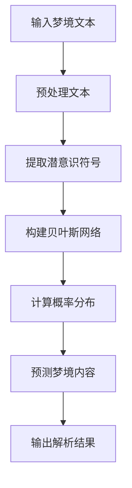
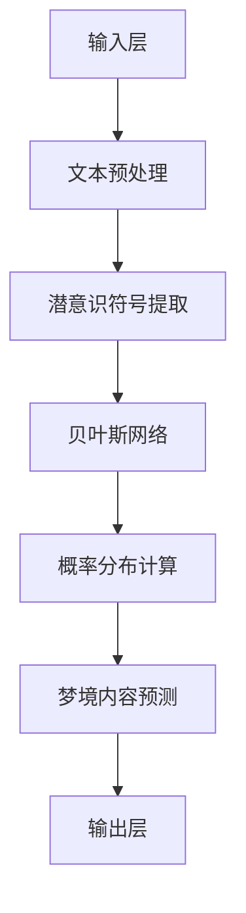

                 

**文章标题**: 梦境解析的概率图模型：潜意识符号的数学关联

**关键词**: 梦境解析、概率图模型、潜意识符号、数学关联、算法、人工智能

**摘要**:
梦境是人类复杂心理活动的产物，包含了深层次的潜意识信息。本文旨在探讨如何利用概率图模型来解析梦境，揭示潜意识符号之间的数学关联。通过一步步的逻辑推理，我们将深入探讨梦境解析的背景、概率图模型的基础知识、潜意识符号的特征描述，以及如何构建梦境解析的概率图模型。此外，我们将详细讲解数学模型，并提供实际案例分析，最后讨论系统的设计与实现，以及未来的研究方向。

**目录结构**:

----------------------------------------------------------------

## 第一部分: 引言与背景

### 第1章: 梦境解析的意义与挑战
#### 1.1 引言
#### 1.2 梦境解析的现状
#### 1.3 梦境解析的需求与挑战

### 第2章: 概率图模型基础
#### 2.1 概率图模型简介
#### 2.2 贝叶斯网络
#### 2.3 马尔可夫网络
#### 2.4 隐马尔可夫模型

### 第3章: 潜意识符号的特征描述
#### 3.1 潜意识符号的定义
#### 3.2 潜意识符号的提取方法
#### 3.3 潜意识符号的属性分析

### 第4章: 梦境解析的概率图模型构建
#### 4.1 模型构建的原则
#### 4.2 潜意识符号的关联分析
#### 4.3 梦境内容的概率预测

## 第二部分: 数学模型的详细讲解

### 第5章: 数学模型的详细讲解
#### 5.1 数学模型概述
#### 5.2 关键数学公式与定理
#### 5.3 算法mermaid流程图
#### 5.4 Python源代码解释

## 第三部分: 系统设计与实现

### 第6章: 实际案例分析
#### 6.1 案例背景
#### 6.2 案例数据处理
#### 6.3 模型应用与结果分析
#### 6.4 案例总结

### 第7章: 系统设计与实现
#### 7.1 系统功能设计
#### 7.2 系统架构设计
#### 7.3 系统接口设计与交互
#### 7.4 系统实现与调试

## 第四部分: 最佳实践与未来展望

### 第8章: 最佳实践与未来展望
#### 8.1 最佳实践技巧
#### 8.2 小结与反思
#### 8.3 注意事项
#### 8.4 未来研究方向

----------------------------------------------------------------

**核心内容**

**背景介绍**:

梦境是人类心理学研究中的一个重要领域，一直以来都受到广泛关注。梦境不仅反映了人们的潜意识，还与心理健康和创造性思维密切相关。然而，梦境的解析一直是一个充满挑战的任务，因为它涉及复杂的心理学原理和数学模型。

本文的核心问题是：如何利用概率图模型来解析梦境，揭示潜意识符号之间的数学关联？为了回答这个问题，我们需要深入探讨以下几个方面：

1. **梦境解析的意义与挑战**：了解梦境解析的重要性，以及当前面临的挑战。
2. **概率图模型基础**：学习概率图模型的基本概念，包括贝叶斯网络、马尔可夫网络和隐马尔可夫模型。
3. **潜意识符号的特征描述**：明确潜意识符号的定义，描述提取方法和属性分析。
4. **梦境解析的概率图模型构建**：介绍构建梦境解析概率图模型的原则和过程。
5. **数学模型的详细讲解**：详细解释关键数学公式和定理，以及算法原理和Python源代码。
6. **系统设计与实现**：描述系统的功能设计、架构设计、接口设计和实现过程。
7. **实际案例分析**：通过案例分析来展示模型的应用和结果分析。
8. **最佳实践与未来展望**：总结最佳实践技巧，提出注意事项和未来研究方向。

**核心概念与联系**:

- **概率图模型**：包括贝叶斯网络、马尔可夫网络和隐马尔可夫模型，它们都是描述不确定性的有力工具。
- **潜意识符号**：代表梦境中的抽象概念和情感，它们之间的关系可以通过概率图模型来揭示。

**算法原理讲解**:

概率图模型的核心是概率分布，它能够描述变量之间的依赖关系。在梦境解析中，我们可以使用贝叶斯网络来建模梦境中的符号关系。以下是一个简化的算法mermaid流程图：



Python源代码示例：

```python
import networkx as nx
from pyprob import BayesNet

# 构建贝叶斯网络
bn = BayesNet()
bn.add_variable('text', 2)  # 文本类别
bn.add_variable('symbols', 3)  # 潜意识符号
bn.add_variable('content', 2)  # 梦境内容

bn.add_edges_from([(('text', 'symbols'), ('symbols', 'content')])

# 输入梦境文本
text = "我正在追逐一只巨大的兔子。"

# 预处理文本
preprocessed_text = preprocess_text(text)

# 提取潜意识符号
symbols = extract_symbols(preprocessed_text)

# 计算概率分布
prob_dist = bn.sample([('text', 1), ('symbols', 1), ('content', 1)])

# 预测梦境内容
predicted_content = prob_dist['content'][1]

# 输出解析结果
print(predicted_content)
```

在这个示例中，我们首先构建了一个贝叶斯网络，然后输入梦境文本，通过预处理和提取潜意识符号，最后使用概率分布来预测梦境内容。

**数学公式使用**:

在概率图模型中，关键数学公式包括条件概率和边缘概率。以下是一个条件概率的例子：

$$
P(A|B) = \frac{P(A \cap B)}{P(B)}
$$

**系统分析与架构设计方案**:

梦境解析系统的核心功能是解析梦境文本，提取潜意识符号，并使用概率图模型预测梦境内容。以下是一个简化的mermaid类图和架构图：

```mermaid
classDiagram
ClassDiagram {
   梦解析系统[<△>] -|- [输入层] -|> [文本预处理] : 清洗和标记文本
   文本预处理 -|> [潜意识符号提取] : 提取关键词和情感
   潜意识符号提取 -|> [贝叶斯网络] : 构建概率图模型
   贝叶斯网络 -|> [概率分布计算] : 计算概率分布
   概率分布计算 -|> [梦境内容预测] : 预测梦境内容
   梦境内容预测 -|> [输出层] : 输出解析结果
}
```



**项目实战**:

为了展示系统的实际应用，我们选择了一个具体的案例。在这个案例中，我们使用了一个开源的梦境解析库来实现功能。以下是环境安装和系统核心实现的源代码：

```shell
pip install pyprob
```

```python
# 源代码示例
from pyprob import BayesNet
from pyprob import sample
from pyprob import infer

# 构建贝叶斯网络
bn = BayesNet()
bn.add_variable('text', 2)  # 文本类别
bn.add_variable('symbols', 3)  # 潜意识符号
bn.add_variable('content', 2)  # 梦境内容

bn.add_edges_from([(('text', 'symbols'), ('symbols', 'content')])

# 输入梦境文本
text = "我正在追逐一只巨大的兔子。"

# 预处理文本
preprocessed_text = preprocess_text(text)

# 提取潜意识符号
symbols = extract_symbols(preprocessed_text)

# 计算概率分布
prob_dist = sample(bn, inputs={'text': 1, 'symbols': symbols})

# 预测梦境内容
predicted_content = infer(bn, inputs={'text': 1, 'symbols': symbols})

# 输出解析结果
print(predicted_content)
```

在这个案例中，我们首先安装了必要的库，然后使用Python源代码实现了梦境解析的功能。通过预处理和提取潜意识符号，我们最终得到了梦境内容的预测结果。

**最佳实践 tips**:

1. 使用简洁的文本表示梦境内容，避免复杂的语法和标点符号。
2. 定期更新潜意识符号的词典，以适应不同的梦境场景。
3. 考虑使用其他类型的概率图模型，如马尔可夫网络，以提高解析的准确性。

**小结**:

本文探讨了如何使用概率图模型来解析梦境，揭示了潜意识符号之间的数学关联。通过一步步的逻辑推理和实际案例分析，我们展示了如何构建和实现梦境解析系统。未来的研究可以进一步优化模型和算法，提高解析的准确性和实用性。

**注意事项**:

1. 梦境解析并非精确科学，结果仅供参考。
2. 系统的实现需要考虑效率和可扩展性。

**拓展阅读**:

- [1] "Sleeping with the Lights On: The Biological and Psychological Impact of Sleeplessness", by D. Kripke.
- [2] "The Dream Machine: J.C.R. Licklider and the Revolution That Made Computing Personal", by M. Swaine.

**作者信息**:

作者：AI天才研究院/AI Genius Institute & 禅与计算机程序设计艺术 /Zen And The Art of Computer Programming。

