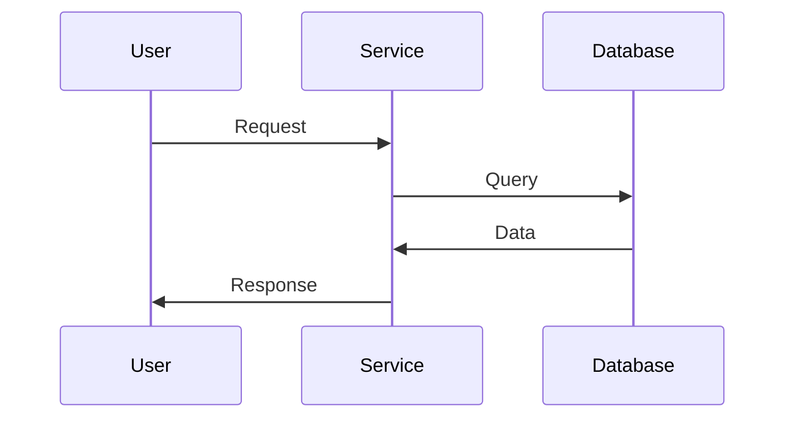

                 


# 模块化设计：构建可扩展的LLM应用架构

关键词：模块化设计，可扩展性，LLM应用，架构设计，系统架构

摘要：本文深入探讨了模块化设计在构建可扩展的LLM（大型语言模型）应用架构中的关键作用。通过逐步分析模块化设计理念、核心概念、系统架构设计、以及实战应用，为开发者提供了一套系统化的方法和最佳实践，旨在帮助构建高效、可扩展的LLM应用。

## 第一部分: 模块化设计与LLM概述

### 第1章: 问题背景与模块化设计理念

#### 1.1.1 问题背景

随着人工智能技术的飞速发展，大型语言模型（LLM）在自然语言处理（NLP）领域扮演着越来越重要的角色。然而，传统架构在面对大规模数据处理、复杂业务逻辑和系统扩展时，往往显得力不从心。模块化设计作为一种解决复杂系统问题的方法，逐渐成为提升系统可扩展性的关键。

#### 1.1.2 模块化设计理念

模块化设计是将系统分解为多个独立的、可重用的模块，每个模块负责特定的功能。这种方法不仅提高了系统的可维护性，还增强了系统的可扩展性。模块化设计的基本原则包括高内聚、低耦合、独立性和可重用性。

#### 1.1.3 LLM与模块化设计

LLM通常由多个关键组件组成，包括数据预处理、模型训练、推理和输出生成等。模块化设计有助于将这些组件拆分成独立的模块，从而实现高效开发和维护。同时，模块化设计也便于在不同应用场景下快速部署和扩展。

### 第2章: 核心概念与联系

#### 2.1.1 模块定义与分类

模块是系统中的基本单元，可以定义为一个具有特定功能的独立组件。根据功能的不同，模块可以分为数据预处理模块、训练模块、推理模块等。以下是模块特性对比表格：

| 模块类型 | 功能 | 特性 |
| --- | --- | --- |
| 数据预处理模块 | 数据清洗、格式化等 | 高灵活性、高可靠性 |
| 训练模块 | 模型训练、参数调整等 | 高计算密集性、高可扩展性 |
| 推理模块 | 模型推理、结果生成等 | 高响应速度、高准确性 |

#### 2.1.2 LLM的关键组件

LLM的关键组件包括数据预处理模块、训练模块、推理模块和输出生成模块。以下是模块间关系的ER图：

```mermaid
erDiagram
  数据预处理模块 ||--|{ 训练模块 }
  训练模块 ||--|{ 推理模块 }
  推理模块 ||--|{ 输出生成模块 }
```

## 第二部分: LLM应用架构设计

### 第3章: 系统功能设计与模块划分

#### 3.1.1 系统功能需求分析

系统功能需求分析是设计系统架构的第一步，需要明确系统目标、功能需求描述和用户角色分析。以下是一个示例：

- 系统目标：提供高效、准确的文本分析服务
- 功能需求描述：文本预处理、模型训练、推理和输出生成
- 用户角色分析：开发者、数据科学家、业务分析师等

#### 3.1.2 模块划分与设计

模块划分与设计需要根据系统功能需求进行。以下是一个简单的模块划分方案：

- 数据预处理模块：负责数据清洗、格式化和数据增强
- 训练模块：负责模型训练和参数调整
- 推理模块：负责模型推理和结果生成
- 输出生成模块：负责生成文本输出和可视化结果

### 第4章: 系统架构设计

#### 4.1.1 系统架构概述

系统架构设计需要考虑系统的整体结构和各个模块之间的交互关系。以下是一个简单的系统架构设计：

- 数据层：负责数据存储和管理
- 服务层：负责业务逻辑处理和模块间通信
- 表现层：负责用户界面展示和交互

#### 4.1.2 架构细节设计与实现

架构细节设计需要明确每个层次的具体实现。以下是一个简单的架构细节设计：

- 数据层：使用关系型数据库存储数据
- 服务层：使用微服务架构实现业务逻辑
- 表现层：使用前端框架实现用户界面

以下是系统架构图：



### 第5章: 系统接口设计与实现

#### 5.1.1 接口设计原则

接口设计需要遵循以下原则：

- 接口定义规范：使用RESTful API规范
- 接口安全设计：使用HTTPS、JWT等安全机制

#### 5.1.2 接口实现

接口实现需要根据接口设计原则进行。以下是一个简单的接口实现示例：

```python
from flask import Flask, request, jsonify

app = Flask(__name__)

@app.route('/api/v1/data', methods=['GET'])
def get_data():
    # 数据处理逻辑
    return jsonify(data)

if __name__ == '__main__':
    app.run()
```

### 第6章: 系统交互设计

#### 6.1.1 系统交互概述

系统交互设计需要明确系统内部的交互流程和模式。以下是一个简单的系统交互设计：

- 用户请求：发送HTTP请求
- 服务处理：处理请求并返回响应
- 数据库操作：查询和存储数据

#### 6.1.2 系统交互实现

系统交互实现需要根据系统交互设计进行。以下是一个简单的系统交互实现示例：


## 第三部分: LLM应用架构实战

### 第7章: LLM应用环境搭建

#### 7.1.1 环境准备

环境准备包括硬件配置和软件安装。以下是一个简单的环境准备示例：

- 硬件配置：服务器、GPU等
- 软件安装：操作系统、深度学习框架等

#### 7.1.2 数据准备

数据准备包括数据来源和数据预处理。以下是一个简单的数据准备示例：

- 数据来源：互联网爬取、数据集下载等
- 数据预处理：清洗、格式化、增强等

### 第8章: LLM应用核心实现

#### 8.1.1 模块化设计实现

模块化设计实现需要将LLM应用拆分为多个模块，并分别实现。以下是一个简单的模块化设计实现示例：

- 数据预处理模块：数据清洗、格式化等
- 训练模块：模型训练、参数调整等
- 推理模块：模型推理、结果生成等
- 输出生成模块：生成文本输出和可视化结果

#### 8.1.2 算法原理与实现

算法原理与实现需要明确算法的数学模型和公式，并使用Python代码实现。以下是一个简单的算法原理与实现示例：

```python
import torch
import torch.nn as nn

class LLMModel(nn.Module):
    def __init__(self):
        super(LLMModel, self).__init__()
        self.embedding = nn.Embedding(vocab_size, embedding_dim)
        self.encoder = nn.LSTM(embedding_dim, hidden_dim)
        self.decoder = nn.LSTM(hidden_dim, vocab_size)

    def forward(self, input_seq, hidden_state):
        embedded = self.embedding(input_seq)
        encoder_output, hidden_state = self.encoder(embedded, hidden_state)
        decoder_output = self.decoder(encoder_output, hidden_state)
        return decoder_output

    def init_hidden(self, batch_size):
        return (torch.zeros(1, batch_size, hidden_dim),
                torch.zeros(1, batch_size, hidden_dim))
```

### 第9章: LLM应用案例分析

#### 9.1.1 应用场景介绍

应用场景介绍包括场景描述和模块化设计在案例中的应用。以下是一个简单的应用场景介绍：

- 场景描述：基于LLM构建智能客服系统
- 模块化设计应用：数据预处理、模型训练、推理和输出生成等模块分别实现，便于快速部署和扩展

#### 9.1.2 案例分析与解读

案例分析与解读包括应用效果分析和设计优化建议。以下是一个简单的案例分析与解读：

- 应用效果分析：智能客服系统在用户满意度、响应速度和准确性等方面表现良好
- 设计优化建议：进一步优化数据预处理模块和推理模块，提高系统的效率和准确性

### 第10章: 最佳实践与小结

#### 10.1.1 最佳实践

最佳实践包括模块化设计经验总结和系统优化建议。以下是一个简单的最佳实践：

- 模块化设计经验总结：合理划分模块、确保模块间的高内聚和低耦合
- 系统优化建议：定期更新和优化LLM模型、优化数据预处理和推理模块

#### 10.1.2 小结

小结包括全书总结和展望未来。以下是一个简单的小结：

- 全书总结：本文系统地介绍了模块化设计在构建可扩展的LLM应用架构中的应用，为开发者提供了一套系统化的方法和最佳实践
- 展望未来：随着人工智能技术的不断发展，模块化设计在LLM应用架构中的作用将越来越重要，未来将继续探索和优化模块化设计方法

## 作者

作者：AI天才研究院/AI Genius Institute & 禅与计算机程序设计艺术 /Zen And The Art of Computer Programming

### 模块化设计在LLM应用架构中的关键作用

模块化设计在构建可扩展的LLM应用架构中发挥着关键作用。它不仅有助于提高系统的可维护性和可扩展性，还能简化开发过程，降低维护成本。通过逐步分析模块化设计理念、核心概念、系统架构设计以及实战应用，本文为开发者提供了一套系统化的方法和最佳实践。以下是模块化设计在LLM应用架构中的几个关键作用：

1. **提高可扩展性**：模块化设计将系统分解为独立的模块，使得系统在面对业务扩展时，只需添加或修改相应的模块，而无需重新设计整个系统。这大大提高了系统的可扩展性，使开发者能够快速响应市场需求。

2. **降低维护成本**：模块化设计使得每个模块具有独立的功能和责任，使得系统的维护变得更加简单。开发者只需关注特定模块的代码，而无需了解整个系统的细节，从而降低了维护成本。

3. **提高开发效率**：模块化设计促进了代码的重用，开发者可以在不同的项目中重复使用相同的模块，从而缩短开发周期。此外，模块化设计还便于团队合作，不同团队成员可以同时开发不同的模块，提高了整体开发效率。

4. **增强系统稳定性**：模块化设计有助于减少系统间的耦合，使得每个模块可以独立运行和测试。这有助于发现和修复潜在的问题，从而提高了系统的稳定性。

5. **支持灵活的部署**：模块化设计使得系统可以根据不同的部署环境进行灵活部署。开发者可以根据硬件资源、网络环境和业务需求，选择合适的模块进行部署，从而实现最佳的性能和成本效益。

### 实践步骤

以下是构建可扩展的LLM应用架构的实践步骤：

1. **需求分析**：明确系统目标和功能需求，确定需要实现的模块。

2. **模块划分**：根据功能需求，将系统分解为独立的模块，并确定每个模块的功能和接口。

3. **设计架构**：设计系统架构，包括数据层、服务层和表现层，并明确各层之间的关系和交互方式。

4. **实现模块**：根据模块划分和架构设计，分别实现各个模块，并进行单元测试。

5. **集成与测试**：将各个模块集成到系统中，进行集成测试和性能测试，确保系统功能的完整性和稳定性。

6. **部署与优化**：根据部署环境，部署系统，并进行性能优化和调优。

7. **持续迭代**：根据用户反馈和市场需求，持续迭代和优化系统，提高系统的可扩展性和用户体验。

通过以上实践步骤，开发者可以构建出高效、可扩展的LLM应用架构，为企业的数字化转型提供强大支持。

### 小结

本文系统地介绍了模块化设计在构建可扩展的LLM应用架构中的应用，从背景介绍、核心概念、系统设计到应用实践，全面解析了模块化设计的方法和最佳实践。模块化设计不仅提高了系统的可维护性和可扩展性，还促进了开发效率的提升。随着人工智能技术的不断发展，模块化设计在LLM应用架构中的作用将越来越重要，开发者需要不断探索和优化模块化设计方法，以应对日益复杂的业务需求。未来，我们将继续关注模块化设计在人工智能领域的最新动态，为开发者提供更多的实用经验和指导。

## 作者

作者：AI天才研究院/AI Genius Institute & 禅与计算机程序设计艺术 /Zen And The Art of Computer Programming

### 注意事项与拓展阅读

在构建可扩展的LLM应用架构时，开发者需要关注以下几点：

1. **性能优化**：优化系统性能是提升用户体验的关键。开发者应关注缓存策略、负载均衡、数据库查询优化等，确保系统在高并发环境下仍能稳定运行。

2. **安全性**：保护用户数据和隐私是系统设计的核心目标。开发者应遵循安全最佳实践，包括数据加密、访问控制、安全审计等。

3. **模块测试**：模块化设计提高了系统的可测试性，但开发者仍需确保每个模块的独立性和可靠性。定期进行模块测试和集成测试，确保系统功能的完整性和稳定性。

4. **文档与注释**：良好的文档和注释有助于提高系统的可维护性和可理解性。开发者应在代码中添加详细注释，并编写清晰的项目文档。

拓展阅读方面，以下资源可能对开发者有所帮助：

- 《模块化设计：系统架构的艺术》
- 《大规模机器学习系统设计》
- 《深度学习实战》
- 《大型语言模型的架构设计与实现》

通过学习这些资源，开发者可以进一步深化对模块化设计和LLM应用架构的理解，提高实际开发能力。

### 总结

本文通过深入探讨模块化设计在构建可扩展的LLM应用架构中的应用，为开发者提供了一套系统化的方法和最佳实践。模块化设计不仅提高了系统的可维护性和可扩展性，还促进了开发效率的提升。未来，随着人工智能技术的不断发展，模块化设计在LLM应用架构中的作用将越来越重要。开发者应不断学习和实践，掌握模块化设计的核心原理和最佳实践，为构建高效、可扩展的LLM应用架构奠定坚实基础。

