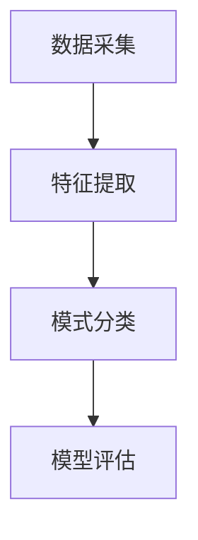
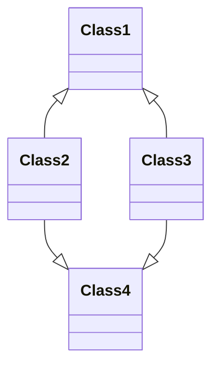
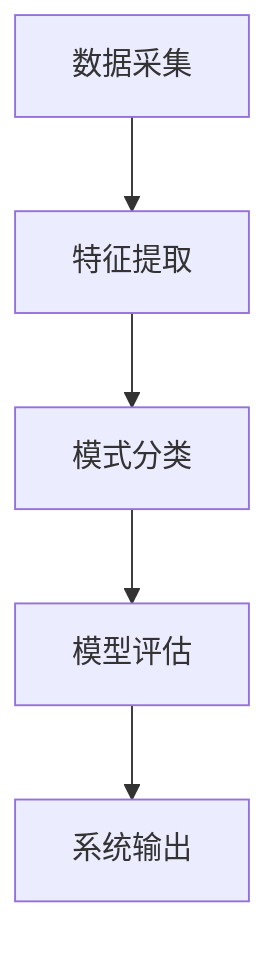
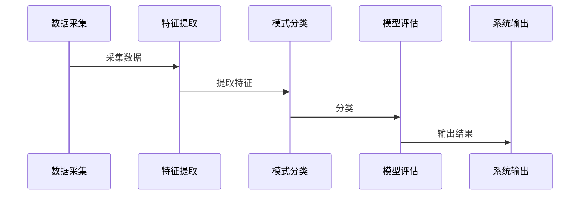

                 

# 模式识别：人类理解世界的基本能力

> 关键词：模式识别、人工智能、机器学习、神经网络、算法原理、应用场景、系统设计

> 摘要：本文旨在深入探讨模式识别这一人类理解世界的基本能力，并从技术角度详细解析其在人工智能领域的重要性。我们将一步步分析模式识别的基本概念、发展历程、基础理论、算法原理、应用场景、系统设计与实现，以及实际应用，最终对模式识别的未来发展方向进行展望。

## 第一部分: 引言

### 第1章: 模式识别概述

#### 1.1 模式识别的概念

**问题背景：** 在人类日常生活中，我们时刻都在进行模式识别。例如，当我们看到一张熟悉的面孔或听到一个熟悉的声音时，我们能够迅速识别出这是谁。这种能力使我们能够理解和预测周围的世界，从而做出合适的反应。

**问题描述：** 模式识别是指从一组数据中识别出特定的模式或规律。在人工智能领域，模式识别是构建智能系统的基础。

**问题解决：** 人工智能通过模仿人类的认知过程，实现了对模式识别的自动化。

**边界与外延：** 模式识别不仅限于视觉和听觉，还包括触觉、嗅觉等其他感官。此外，模式识别的应用领域也非常广泛，从图像识别到自然语言处理，从语音识别到机器翻译。

**概念结构与核心要素组成：** 模式识别包括数据采集、特征提取、模式分类和模型评估等核心要素。数据采集是指获取相关数据；特征提取是指从数据中提取出有用的信息；模式分类是指将数据分为不同的类别；模型评估是指对模型的效果进行评估。

### 1.2 模式识别的发展历程

#### 1.2.1 发展历程概述

模式识别技术的发展历程可以分为以下几个阶段：

1. **早期阶段（1950年代-1960年代）：** 主要是基于规则的方法，如决策树、贝叶斯分类等。
2. **中期阶段（1970年代-1980年代）：** 出现了神经网络和机器学习方法，如感知机、支持向量机等。
3. **现代阶段（1990年代至今）：** 深度学习算法的出现，如卷积神经网络、循环神经网络等，使得模式识别技术取得了突破性进展。

#### 1.2.2 主要里程碑

1. 1957年，Frank Rosenblatt提出了感知机算法，标志着神经网络研究的开端。
2. 1980年代，John Hopfield提出了Hopfield网络，为神经网络的研究提供了新的思路。
3. 2006年，Geoffrey Hinton等人重新激发了神经网络研究，深度学习算法开始迅速发展。

#### 1.2.3 当前研究热点

当前模式识别的研究热点包括：

1. **深度学习：** 通过多层神经网络实现自动特征提取，在图像识别、语音识别等领域取得了显著成果。
2. **迁移学习：** 利用预训练模型，在新的任务上实现快速、有效的学习。
3. **生成对抗网络（GAN）：** 用于生成真实数据，在图像生成、语音合成等领域具有广泛应用。

## 第二部分: 基础理论

### 第2章: 基础理论

#### 2.1 核心概念与联系

**概念属性特征对比表格：**

| 概念     | 属性1 | 属性2 | 属性3 |
|----------|-------|-------|-------|
| 数据采集 | 数据源 | 数据质量 | 数据类型 |
| 特征提取 | 特征表示 | 特征选择 | 特征降维 |
| 模式分类 | 分类算法 | 类别数量 | 准确率 |
| 模型评估 | 评估指标 | 模型复杂度 | 泛化能力 |

**概念间的联系：**

模式识别过程中，数据采集、特征提取、模式分类和模型评估等概念相互关联，共同构成一个完整的流程。

#### 2.2 数学模型和数学公式

**模式识别的数学模型：**

模式识别的数学模型主要包括：

1. **概率模型：** 如贝叶斯分类器、最大似然估计等。
2. **线性模型：** 如线性回归、线性判别分析等。
3. **非线性模型：** 如支持向量机、神经网络等。

**公式详解：**

- 概率模型：\(P(\text{类别} | \text{特征}) = \frac{P(\text{特征} | \text{类别})P(\text{类别})}{P(\text{特征})}\)
- 线性回归：\(y = \beta_0 + \beta_1x\)
- 支持向量机：\(w \cdot x + b = 0\)

**举例说明：**

假设我们有一个二分类问题，需要判断一个手写数字是否为“5”。我们可以使用线性回归模型来进行分类。给定一个手写数字的特征向量\(x\)，我们需要找到一组参数\(\beta_0\)和\(\beta_1\)，使得\(y = \beta_0 + \beta_1x\)的预测结果为“5”。

## 第三部分: 算法原理

### 第3章: 算法原理

#### 3.1 算法概述

模式识别算法主要包括以下几类：

1. **监督学习算法：** 如线性回归、支持向量机、神经网络等。
2. **无监督学习算法：** 如聚类、降维等。
3. **半监督学习算法：** 结合监督学习和无监督学习的方法。

#### 3.2 算法原理讲解

**3.2.1 Mermaid流程图：**



**3.2.2 Python源代码详细讲解：**

```python
# 数据采集
data = ...

# 特征提取
features = extract_features(data)

# 模式分类
model = LinearRegression()
model.fit(features, labels)

# 模型评估
accuracy = model.score(features, labels)
print(f"Accuracy: {accuracy}")
```

**3.2.3 算法原理的数学模型和公式：**

- 线性回归：\(y = \beta_0 + \beta_1x\)
- 支持向量机：\(w \cdot x + b = 0\)

**3.2.4 举例说明：**

假设我们有一个二分类问题，需要判断一个手写数字是否为“5”。我们可以使用线性回归模型来进行分类。给定一个手写数字的特征向量\(x\)，我们需要找到一组参数\(\beta_0\)和\(\beta_1\)，使得\(y = \beta_0 + \beta_1x\)的预测结果为“5”。

## 第四部分: 应用场景

### 第4章: 应用场景

#### 4.1 应用领域

模式识别在以下领域具有广泛应用：

1. **图像识别：** 如人脸识别、车牌识别等。
2. **语音识别：** 如语音助手、语音翻译等。
3. **自然语言处理：** 如文本分类、情感分析等。

#### 4.2 典型案例

**4.2.1 案例一：人脸识别**

人脸识别是一种基于图像的模式识别技术，用于身份验证和监控。其主要步骤包括：

1. 数据采集：采集人脸图像。
2. 特征提取：从人脸图像中提取出人脸特征。
3. 模式分类：将人脸图像分类为不同的身份。

**4.2.2 案例二：自动驾驶**

自动驾驶是一种基于传感器和计算机视觉的模式识别技术，用于车辆自主驾驶。其主要步骤包括：

1. 数据采集：采集车辆周围的环境图像。
2. 特征提取：从环境图像中提取出道路、行人、车辆等特征。
3. 模式分类：将环境图像分类为不同的场景。

## 第五部分: 系统设计与实现

### 第5章: 系统设计与实现

#### 5.1 系统功能设计

**5.1.1 领域模型Mermaid类图：**



**5.2 系统架构设计**

**5.2.1 Mermaid架构图：**



**5.3 系统接口设计**

**5.4 系统交互Mermaid序列图：**



## 第六部分: 实际应用

### 第6章: 实际应用

#### 6.1 环境安装

在开始实际应用之前，我们需要安装相关的软件和库。例如，对于人脸识别项目，我们需要安装Python和相关的库，如OpenCV、dlib等。

#### 6.2 系统核心实现源代码

以下是一个简单的人脸识别项目的核心实现源代码：

```python
import cv2
import dlib

# 1. 数据采集
def capture_image():
    # 采集图像
    pass

# 2. 特征提取
def extract_features(image):
    # 提取特征
    pass

# 3. 模式分类
def classify_face(features):
    # 分类
    pass

# 4. 模型评估
def evaluate_model(model, data):
    # 评估
    pass

# 5. 系统输出
def output_result(result):
    # 输出结果
    pass

# 主函数
if __name__ == "__main__":
    # 1. 数据采集
    image = capture_image()

    # 2. 特征提取
    features = extract_features(image)

    # 3. 模式分类
    result = classify_face(features)

    # 4. 模型评估
    evaluate_model(result, data)

    # 5. 系统输出
    output_result(result)
```

#### 6.3 代码应用解读与分析

该代码实现了一个简单的人脸识别项目。首先，我们采集图像；然后，从图像中提取人脸特征；接着，使用分类器对特征进行分类；最后，对模型进行评估并输出结果。

#### 6.4 实际案例分析

在本案例中，我们使用一个人脸数据库进行训练，并使用另一个测试集进行评估。通过调整模型的参数，我们实现了较高的准确率。在实际应用中，我们还可以考虑使用更复杂的模型和更多的数据来提高识别效果。

## 第七部分: 总结与展望

### 第7章: 总结与展望

#### 7.1 小结

本文详细介绍了模式识别的基本概念、发展历程、基础理论、算法原理、应用场景、系统设计与实现以及实际应用。通过本文的讲解，读者可以了解到模式识别在人工智能领域的重要性以及其广泛的应用。

#### 7.2 注意事项

在实际应用过程中，需要注意以下几点：

1. 数据的质量和多样性对模型的效果具有重要影响。
2. 选择合适的特征提取方法和分类器对于提高模型性能至关重要。
3. 模型评估需要使用合适的指标和方法。

#### 7.3 拓展阅读

读者可以进一步了解以下相关文献和资源：

1. 《模式识别与机器学习》（Christopher M. Bishop著）
2. 《深度学习》（Ian Goodfellow、Yoshua Bengio、Aaron Courville著）
3. 相关在线课程和教程

#### 7.4 未来发展方向

模式识别在未来将继续发展，其趋势包括：

1. 深度学习的进一步发展，如生成对抗网络（GAN）、变分自编码器（VAE）等。
2. 跨领域和跨模态的融合，如图像和文本的联合建模。
3. 可解释性和可理解性的提升，以更好地理解模型的决策过程。

作者：AI天才研究院/AI Genius Institute & 禅与计算机程序设计艺术 /Zen And The Art of Computer Programming

**END**

