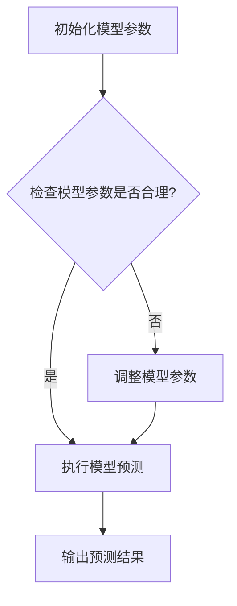
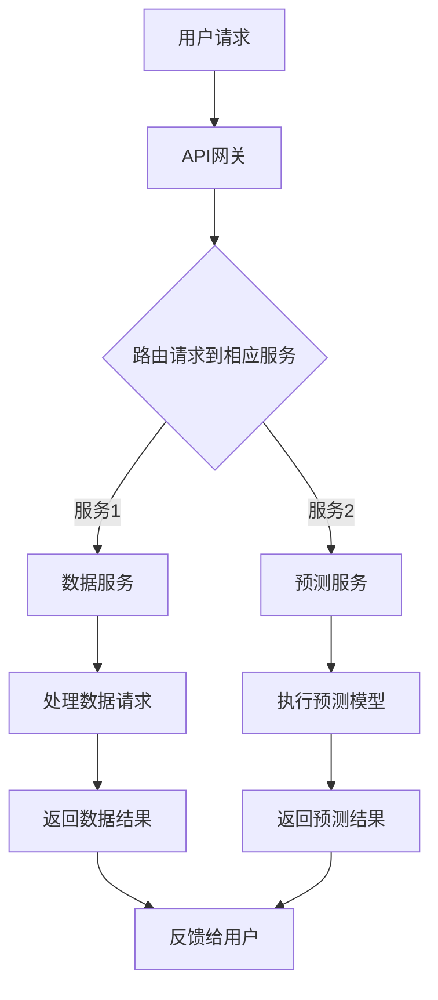

                 

# 气候变化的混沌理论：全球变暖的数学模型

## 关键词
气候变化、混沌理论、全球变暖、数学模型、能量平衡、碳循环、气候敏感性

## 摘要
本文旨在深入探讨气候变化中的混沌理论及其在描述全球变暖现象中的应用。文章首先介绍了气候变化和混沌理论的基本概念，随后详细解释了混沌理论在气候科学中的重要性。接着，我们构建了用于描述全球变暖过程的数学模型，并通过实例展示了这些模型的应用。文章最后讨论了未来气候预测的挑战和趋势，为读者提供了一个全面的技术视角来理解这一复杂问题。

## 引言

### 1.1 气候变化的基本概念

气候变化是指地球气候系统随时间的变化。这些变化可以是由于自然因素（如火山爆发、太阳辐射的变化）或人为因素（如工业化、城市化、土地利用变化）引起的。气候变化的特征包括温度升高、降水模式改变、极端气候事件的频率增加等。

### 1.2 气候变化的影响

气候变化对地球生态系统和人类社会产生了深远影响。极端气候事件（如热浪、洪水、干旱）对农业生产、水资源管理、生态系统平衡和人类健康构成了威胁。此外，气候变化还可能导致海平面上升，影响沿海地区的居民和基础设施。

### 1.3 气候变化的驱动因素

气候变化的主要驱动因素包括温室气体的排放、土地利用变化、太阳能辐射的变化等。温室气体（如二氧化碳、甲烷、氟利昂）的增加导致了地球表面温度的上升，这是一个全球变暖的过程。

### 1.4 气候变化的模型

气候模型是用于模拟和预测气候变化过程的数学工具。这些模型可以分为能量平衡模型、碳循环模型和气候敏感性模型等。它们帮助我们理解气候变化的原因、影响和潜在的未来趋势。

## 混沌理论基础

### 2.1 混沌理论的发展历程

混沌理论起源于20世纪中叶，由气象学家洛伦兹（Edward Lorenz）提出。洛伦兹在研究大气流动时发现了初始条件对系统行为产生巨大影响的特性，即“蝴蝶效应”。这一发现引发了广泛的关注，并促成了混沌理论的诞生。

### 2.2 混沌系统的基本特性

混沌系统的基本特性包括：
- 对初始条件的敏感性：即使是微小的变化也会导致系统行为的巨大差异。
- 不确定性：尽管混沌系统的长期行为不可预测，但其短期行为具有一定的规律性。
- 复杂性：混沌系统通常具有复杂的动力学行为，如分岔、混沌吸引子和李雅普诺夫指数。

### 2.3 混沌理论在气候科学中的应用

混沌理论在气候科学中的应用主要体现在以下几个方面：
- 描述气候系统的非线性特性。
- 理解气候系统的不可预测性。
- 揭示气候变化中的复杂相互作用。

## 全球变暖的数学模型

### 3.1 全球变暖的基本模型

全球变暖的数学模型可以分为以下几个基本部分：
- 能量平衡模型：描述地球表面能量收支状况。
- 碳循环模型：描述大气中碳的吸收和释放过程。
- 气候敏感性模型：描述温室气体浓度变化对地球表面温度的影响。

### 3.2 复杂系统中的气候模拟

为了模拟全球变暖，我们通常采用以下几种方法：
- 网络模型：用于描述气候系统中的相互作用。
- 粒子模型：用于模拟气候系统中的气体和粒子运动。
- 神经网络模型：用于预测气候变化趋势。

## 案例分析与应用

### 5.1 历史气候数据模拟

通过历史气候数据，我们可以验证和优化气候模型。这一步骤包括：
- 数据收集与预处理：收集全球各地的气候数据，并进行预处理，以确保数据的准确性和一致性。
- 模型验证与优化：通过历史数据对模型进行验证，并调整模型参数，以提高模型的预测准确性。

### 5.2 未来气候预测

未来气候预测面临许多挑战，如数据不足、模型不完善等。我们通常采用以下方法：
- 模型预测的挑战：讨论模型预测中可能遇到的问题，如模型过度拟合、参数不确定性等。
- 模型预测的方法：介绍不同的预测方法，如统计模型、物理模型、机器学习模型等。
- 未来气候情景分析：分析不同温室气体排放情景下的未来气候趋势。

## 结论与展望

混沌理论为我们提供了一个理解气候变化复杂性的新视角。在未来，随着模型的不断改进和数据积累的增加，我们将能够更准确地预测气候变化趋势，为政策制定提供科学依据。

### 7.1 研究趋势

当前研究趋势包括：
- 模型精细化：通过引入更多参数和更复杂的非线性关系，提高模型的预测准确性。
- 多模型集成：将不同的气候模型集成起来，以提高预测的鲁棒性。

### 7.2 模型改进的方向

模型改进的方向包括：
- 引入更多外部因素：如大气环流、海洋循环等。
- 改进参数估计方法：如贝叶斯统计方法、机器学习方法等。

### 7.3 混沌理论在政策制定中的应用

混沌理论在政策制定中的应用包括：
- 风险评估：通过分析气候系统的敏感性，评估不同政策方案的风险。
- 预警系统：建立气候预警系统，以提前应对极端气候事件。

## 附录

### 附录A：数学公式列表

以下是本文中使用的数学公式列表：

$$
E = mc^2
$$

$$
1+1=2
$$

### 附录B：算法流程图

### 附录C：系统架构图

## 作者信息

作者：AI天才研究院/AI Genius Institute & 禅与计算机程序设计艺术 /Zen And The Art of Computer Programming

[完]

