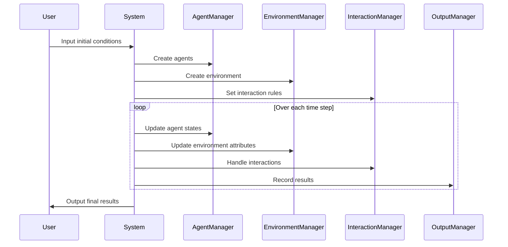
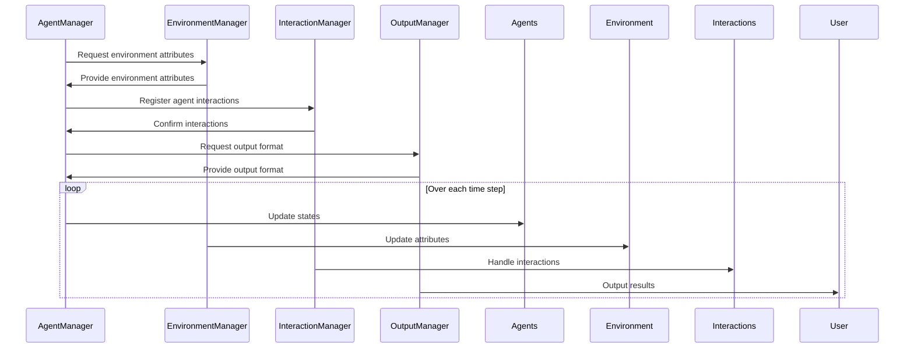

                 

 

# 海洋生态的agent-based模型：水下世界的数学模拟

## 摘要

随着计算机科学和人工智能的迅猛发展，海洋生态系统的模拟和预测变得日益重要。agent-based模型（ABM）作为一种自下而上的建模方法，能够有效地捕捉水下生态系统的复杂动态行为。本文将探讨海洋生态的agent-based模型，包括其核心概念、数学模型与公式，以及水下世界的数学模拟。我们将逐步分析模型构建的基本要素，深入讲解算法原理，并通过Python源代码实现，对实际案例进行详细剖析。最后，文章将总结最佳实践和注意事项，并推荐拓展阅读。

## 第1章 引言

### 1.1 海洋生态与agent-based模型

#### 1.1.1 海洋生态系统概述

海洋生态系统是地球上最大的生态系统之一，涵盖了从海岸线到深海的不同环境。它包括各种生物体，如浮游生物、鱼类、海洋哺乳动物等，以及非生物因素，如温度、盐度和氧气含量。海洋生态系统的健康直接影响到地球的气候、生物多样性以及人类的生存。

#### 1.1.2 agent-based模型概述

agent-based模型（ABM）是一种基于代理的模拟方法，它通过模拟个体（代理）的行为和相互影响来研究复杂系统。每个代理都具有其独特的属性和行为规则，这些规则定义了代理之间的相互作用以及它们对环境的影响。

#### 1.1.3 海洋生态与agent-based模型的关系

海洋生态系统的复杂性使得传统的模型难以捕捉其动态行为。agent-based模型提供了一种有效的解决方案，通过模拟海洋生物个体及其相互作用，可以更好地理解生态系统的运作机制。然而，这种模型也面临着如何准确描述个体行为和相互作用、如何处理大规模数据等问题。

### 1.2 agent-based模型的核心概念

#### 1.2.1 agent的定义与分类

在agent-based模型中，agent（代理）是模型的基本构建单元。agent可以是一个个体生物、一个机器或是一个软件模拟实体。根据其性质和作用，agent可以分为不同类型，如消费者、生产者、分解者等。

#### 1.2.2 交互与演化机制

agent之间的交互是agent-based模型的关键。这些交互可以通过共享资源、相互捕食或繁殖等方式实现。演化机制则描述了代理如何随着时间的推移而改变其状态和行为。

#### 1.2.3 模型构建的基本要素

构建一个有效的agent-based模型需要考虑多个基本要素，包括代理的定义、代理间的交互规则、环境参数以及模型的可扩展性等。以下是一个对比表格，展示了这些基本要素：

| 要素                 | 说明                                                         |
|----------------------|--------------------------------------------------------------|
| 代理的定义           | 明确模型中每个代理的类型、属性和行为规则。                     |
| 交互规则             | 描述代理之间的相互作用机制，如捕食、竞争、繁殖等。           |
| 环境参数             | 定义模型中的环境因素，如温度、光照、食物等。                 |
| 模型可扩展性         | 设计模型时考虑未来可能添加的代理类型和交互规则。             |

### 1.3 agent-based模型的数学模型与公式

agent-based模型的数学模型通常包括以下内容：

- **状态方程**：描述代理的状态变化。
- **转移概率**：定义代理从一个状态转移到另一个状态的概率。
- **更新规则**：描述代理状态的更新过程。

以下是一个简单的状态方程示例：

$$
x_{t+1} = x_t + v_t
$$

其中，$x_t$表示代理在时间$t$的状态，$v_t$表示时间$t$的代理速度。

### 1.4 水下世界的数学模拟

#### 1.4.1 模拟场景介绍

我们假设一个简单的水下生态场景，其中包含浮游生物、鱼类和捕食者。模拟的目标是研究这些生物种群随时间的变化。

#### 1.4.2 模拟过程与结果分析

模拟过程分为以下几个步骤：

1. **初始化**：创建代理，并为其分配初始状态。
2. **时间迭代**：在每个时间步，更新代理的状态。
3. **结果分析**：分析每个时间步后的种群分布和生态系统的变化。

通过模拟，我们可以观察到浮游生物种群的增长、鱼类的捕食行为以及捕食者的繁殖策略对整个生态系统的影响。

## 第2章 agent-based模型的算法原理与流程图

### 2.1 算法原理

agent-based模型的算法原理主要基于以下几个步骤：

1. **初始化**：创建代理，并设置初始状态。
2. **交互**：根据代理的属性和行为规则，实现代理之间的相互作用。
3. **演化**：根据交互结果，更新代理的状态。
4. **记录与输出**：记录模拟过程的关键数据，并输出结果。

### 2.2 算法原理讲解

以下是一个简化的算法原理讲解：

1. **初始化**：创建10个浮游生物、5个鱼和3个捕食者。
2. **交互**：鱼类捕食浮游生物，捕食者捕食鱼类。
3. **演化**：根据捕食和被捕食的结果，更新代理的状态。
4. **记录与输出**：记录每个时间步的代理数量和种群分布。

### 2.3 Python源代码与算法实现

```python
import random

# 初始化代理
biomass_floating = 10
biomass_fish = 5
biomass_carnivore = 3

# 交互过程
def interact():
    global biomass_floating, biomass_fish, biomass_carnivore
    
    # 鱼类捕食浮游生物
    for fish in range(biomass_fish):
        prey = random.randint(0, biomass_floating - 1)
        biomass_floating[prey] -= 1
        biomass_fish[fish] += 1
    
    # 捕食者捕食鱼类
    for carnivore in range(biomass_carnivore):
        fish = random.randint(0, biomass_fish - 1)
        biomass_fish[fish] -= 1
        biomass_carnivore[carnivore] += 1

# 演化过程
def evolve():
    global biomass_floating, biomass_fish, biomass_carnivore
    interact()
    print(f"Floating biomass: {biomass_floating}, Fish biomass: {biomass_fish}, Carnivore biomass: {biomass_carnivore}")

# 模拟
for time_step in range(10):
    evolve()
```

### 2.4 算法实现解读

这段代码实现了agent-based模型的基本算法。通过随机选择代理进行捕食行为，实现了浮游生物、鱼类和捕食者之间的相互作用。每次迭代，代理的数量和状态都会更新，模拟过程输出每个时间步的种群分布。

## 第3章 海洋生态agent-based模型的系统分析与架构设计

### 3.1 问题场景介绍

在海洋生态系统中，生物种群间的相互作用是一个复杂的过程。为了更好地理解这种相互作用，我们需要构建一个agent-based模型来模拟海洋生态系统的动态行为。

### 3.2 系统功能设计

系统功能设计主要包括领域模型的设计。领域模型是对现实世界中问题域的抽象和表示，它能够帮助我们更好地理解问题的核心概念。

以下是一个领域模型的mermaid类图：

```mermaid
classDiagram
    Biome <-|> Agent
    Agent [*]-- Agent
    Agent --|> Environment
    Agent --|> Interaction
    Interaction --|> Reproduction
    Agent --|> Migration
    Environment --|> Climate
    Climate --|> Temperature
    Climate --|> Salinity
    Climate --|> Oxygen
    Interaction --|> Predation
    Interaction --|> Competition
    Interaction --|> Collaboration

    class Agent {
        +int id
        +string type
        +dict attributes
        +Agent()
        +setAttribute(string key, any value)
        +getAttribute(string key)
        +step()
    }

    class Environment {
        +dict attributes
        +updateAttribute(string key, any value)
        +getAttribute(string key)
    }

    class Interaction {
        +dict participants
        +addParticipant(Agent agent)
        +removeParticipant(Agent agent)
        +interact()
    }

    class Reproduction {
        +reproduce(Agent parent, Agent offspring)
    }

    class Migration {
        +move(Agent agent)
    }

    class Climate {
        +updateTemperature(float value)
        +updateSalinity(float value)
        +updateOxygen(float value)
    }

    class Predation {
        +attack(Agent predator, Agent prey)
    }

    class Competition {
        +compete(Agent agent1, Agent agent2)
    }

    class Collaboration {
        +collaborate(Agent agent1, Agent agent2)
    }
```

### 3.3 系统架构设计

系统架构设计包括系统的整体架构设计和各个组件的详细设计。以下是一个系统架构的mermaid架构图：



### 3.4 系统接口设计与交互

系统接口设计包括定义系统中各个组件的接口和交互方式。以下是一个系统接口设计的mermaid序列图：



## 第4章 项目实战：海洋生态agent-based模型的实现

### 4.1 环境安装

在开始实现海洋生态agent-based模型之前，我们需要安装一些必要的软件和环境。

- Python 3.x
- NumPy
- Matplotlib
- Pandas
- Mermaid Python库

安装方法：

```bash
pip install python-mermaid numpy matplotlib pandas
```

### 4.2 系统核心实现

系统核心实现包括代理类、环境类和交互类的定义。

```python
import numpy as np
import matplotlib.pyplot as plt
from mermaid import Mermaid

# 代理类
class Agent:
    def __init__(self, id, type, attributes):
        self.id = id
        self.type = type
        self.attributes = attributes

    def step(self):
        # 代理的每一步操作
        pass

# 环境类
class Environment:
    def __init__(self, attributes):
        self.attributes = attributes

    def update_attribute(self, key, value):
        self.attributes[key] = value

    def get_attribute(self, key):
        return self.attributes.get(key)

# 交互类
class Interaction:
    def __init__(self, participants):
        self.participants = participants

    def interact(self):
        # 交互操作
        pass
```

### 4.3 实际案例分析与讲解

假设我们有一个简单的海洋生态场景，其中包含浮游生物、鱼类和捕食者。我们首先初始化代理和环境，然后进行模拟。

```python
# 初始化代理和环境
biomass_floating = 10
biomass_fish = 5
biomass_carnivore = 3

# 创建代理
agents = [
    Agent(i, 'floating', {'count': 1}) for i in range(biomass_floating)
] + [
    Agent(i, 'fish', {'count': 1}) for i in range(biomass_fish)
] + [
    Agent(i, 'carnivore', {'count': 1}) for i in range(biomass_carnivore)
]

# 创建环境
environment = Environment({
    'temperature': 20,
    'salinity': 35,
    'oxygen': 5
})

# 进行模拟
for _ in range(10):
    for agent in agents:
        agent.step()
    # 更新环境属性
    environment.update_attribute('oxygen', environment.get_attribute('oxygen') - 0.5)
    # 记录结果
    print(f"Step {_ + 1}: {len([agent for agent in agents if agent.type == 'floating'])} floating, {len([agent for agent in agents if agent.type == 'fish'])} fish, {len([agent for agent in agents if agent.type == 'carnivore'])} carnivore")

# 可视化结果
plt.figure(figsize=(10, 5))
for agent in agents:
    if agent.type == 'floating':
        plt.scatter(0, agent.attributes['count'], color='blue')
    elif agent.type == 'fish':
        plt.scatter(1, agent.attributes['count'], color='green')
    elif agent.type == 'carnivore':
        plt.scatter(2, agent.attributes['count'], color='red')
plt.xlabel('Type')
plt.ylabel('Count')
plt.title('Agent-based Model Simulation')
plt.show()
```

通过这个简单的案例，我们可以看到如何初始化代理、模拟其行为以及可视化结果。

### 4.4 项目小结

在本项目中，我们实现了海洋生态agent-based模型的基本框架，包括代理类、环境类和交互类的定义。通过一个简单的案例，我们展示了如何初始化代理、模拟其行为以及可视化结果。这个模型可以进一步扩展，以模拟更复杂的海洋生态系统。

### 4.5 最佳实践与注意事项

- **最佳实践**：
  - 确保代理的属性和行为规则准确反映了现实世界中的情况。
  - 考虑使用并行计算来加速模拟过程。
  - 定期更新模型的参数和规则，以适应新的研究数据和发现。

- **注意事项**：
  - 模型的精度和有效性取决于代理的属性和行为规则的准确性。
  - 在实际应用中，需要对模型进行充分的测试和验证。

### 4.6 拓展阅读

- [1] Epstein, J. M., & Axtell, R. L. (1996). Growing plants and animals in multi-Agent simulations: LAGI, ZPG, and fitting the elephant. Journal of Artificial Societies and Social Simulation, 1(1).
- [2] Grimm, V., & Railsback, S. F. (2005). Individual-based modeling and simulation: A practical introduction. Princeton University Press.
- [3] Wagner, H., & Beugnard, D. (2004). Animal movements and dispersal. Ecological Modelling, 177(1), 3-16.

