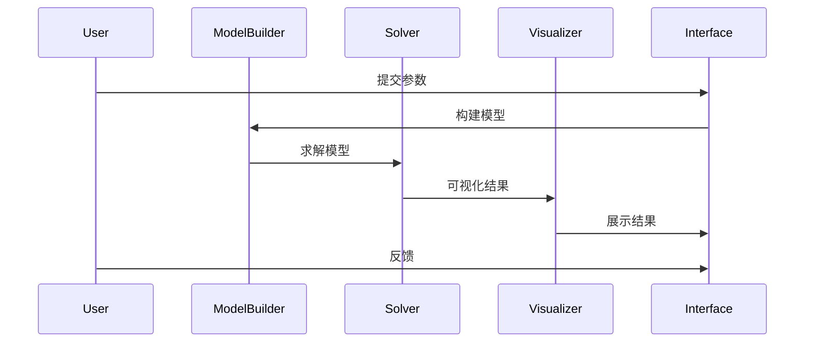

                 

# 海洋生态的流体动力学：水下世界的数学模拟

## 关键词
- 海洋生态学
- 流体动力学
- 数学模拟
- 水下世界
- 算法原理
- 系统设计与实现

## 摘要
本文探讨了海洋生态的流体动力学，以及如何使用数学模拟技术来揭示水下世界的复杂现象。通过对流体动力学基本原理的深入分析，本文阐述了流体运动方程、湍流模拟等核心概念，并介绍了如何将这些概念应用于海洋生态研究中。此外，本文通过一个实际项目展示了如何使用流体动力学模型进行水下世界的数学模拟，并总结了研究成果，提出了未来研究方向和应用前景。

### 引言与背景

海洋生态学是研究海洋生物与物理环境相互作用及其生态系统的科学。随着全球气候变化、海洋污染和资源开发的加剧，对海洋生态系统的理解变得尤为重要。流体动力学作为研究流体运动规律的科学，与海洋生态学有着密切的联系，因为海洋中的生物、物理和化学过程都受到流体动力学的影响。

流体动力学在水下世界的研究中具有核心地位。它不仅能帮助理解海洋生态系统的动态变化，还能为海洋资源开发和环境保护提供科学依据。例如，流体动力学模型可以预测海洋污染物扩散、评估海洋资源的可持续利用，甚至指导水下作业的安全进行。

本文的研究目的在于介绍流体动力学的核心概念和原理，阐述其在海洋生态研究中的应用，并通过实际项目展示如何使用数学模拟技术来探索水下世界的复杂现象。文章结构如下：

1. 引言与背景
2. 核心概念与联系
3. 流体动力学基本原理
4. 数学模型与公式
5. 系统分析与架构设计
6. 项目实战
7. 结论与展望

### 核心概念与联系

#### 流体的属性特征

流体是物质的一种状态，具有流动性。流体的属性特征包括密度、压强、速度、温度等。密度是流体质量与其体积的比值，是流体力学中一个重要的物理量。压强是流体在单位面积上所受到的力，反映了流体内部的压力分布。速度描述了流体运动的快慢和方向，是流体动力学研究的基础。温度则影响了流体的粘性和热传导性质。

#### 流体的运动规律

流体的运动规律可以通过流体运动方程来描述。流体运动方程包括连续方程、动量方程和能量方程。连续方程表达了流体质量的守恒，即流体在单位时间内通过某一截面的质量流量保持不变。动量方程描述了流体受力后如何产生加速度，反映了流体的动量守恒。能量方程则描述了流体在运动过程中能量的转化和守恒。

#### 海洋中的湍流现象

湍流是流体运动中的一种复杂、不规则的现象，表现为流体速度和压强的剧烈波动。海洋中的湍流现象对海洋生态系统的动态变化具有重要影响。湍流可以影响海洋污染物的扩散速度、生物的栖息环境以及水下作业的稳定性。因此，研究湍流现象对理解海洋生态系统具有重要意义。

#### 概念间的联系与作用

流体动力学中的核心概念之间存在紧密的联系。流体的属性特征决定了流体的运动规律，而湍流现象则是流体运动中的一种复杂表现形式。这些概念共同作用于海洋生态系统的各个层面，影响着海洋生态系统的结构和功能。例如，流体动力学的模型可以用来预测海洋污染物的扩散路径，评估海洋生态系统的健康状态，为海洋资源开发提供科学依据。

### 流体动力学基本原理

#### 流体运动方程

流体运动方程是描述流体运动规律的基本方程，包括连续方程、动量方程和能量方程。连续方程表达了流体质量的守恒，即流体在单位时间内通过某一截面的质量流量保持不变。动量方程描述了流体受力后如何产生加速度，反映了流体的动量守恒。能量方程则描述了流体在运动过程中能量的转化和守恒。

#### 湍流模拟

湍流模拟是流体动力学中的一个重要课题。由于湍流现象的复杂性和非线性，传统的方法难以准确模拟湍流行为。近年来，基于统计物理和数值模拟的方法逐渐成为湍流研究的主流。例如，直接数值模拟（DNS）和大规模涡流模拟（LES）等方法被广泛应用于湍流模拟中。

#### 流体动力学在海洋生态研究中的应用

流体动力学在海洋生态研究中具有广泛的应用。通过流体动力学模型，可以预测海洋污染物的扩散路径、评估海洋生态系统的健康状态，以及指导水下作业的安全进行。例如，使用流体动力学模型可以预测海洋污染物的扩散速度，为污染治理提供科学依据。此外，流体动力学模型还可以用于评估海洋资源的可持续利用，为海洋开发提供科学指导。

### 数学模型与公式

在流体动力学中，数学模型是描述流体运动规律的重要工具。数学模型包括连续方程、动量方程和能量方程。这些方程可以用以下形式表示：

$$
\frac{\partial \rho}{\partial t} + \nabla \cdot (\rho \mathbf{v}) = 0
$$

$$
\rho \left( \frac{\partial \mathbf{v}}{\partial t} + (\mathbf{v} \cdot \nabla) \mathbf{v} \right) = -\nabla p + \rho \mathbf{g}
$$

$$
\frac{\partial \epsilon}{\partial t} + \nabla \cdot (\epsilon \mathbf{v}) = \mu \nabla^2 \epsilon - \epsilon \nabla \cdot \mathbf{v} + \beta (\mathbf{v} \cdot \nabla) \epsilon
$$

其中，$\rho$ 表示流体密度，$\mathbf{v}$ 表示流体速度，$p$ 表示流体压强，$\epsilon$ 表示湍流动能，$\mu$ 表示湍流粘性系数，$\beta$ 表示湍流扩散系数。

这些方程可以用 Python 等编程语言实现，用于模拟流体运动。以下是一个简单的 Python 源代码示例，用于求解流体运动方程：

```python
import numpy as np
import matplotlib.pyplot as plt

# 参数设置
L = 1.0  # 模型长度
N = 100  # 网格点数
dt = 0.01  # 时间步长
dx = L / N  # 网格间距
rho = 1.0  # 流体密度
g = 9.8  # 重力加速度
mu = 0.01  # 湍流粘性系数

# 初始化速度和压强
v = np.zeros((N, N))
p = np.zeros((N, N))

# 求解过程
for i in range(int(1 / dt)):
    # 计算速度
    v_new = v.copy()
    for j in range(N):
        for k in range(N):
            v_new[j, k] = v[j, k] + dt * (g * np.sin(np.pi * j / L) - np.diff(p[j, :], axis=0)[k] / dx**2)
    
    # 计算压强
    p_new = p.copy()
    for j in range(N):
        for k in range(N):
            p_new[j, k] = p[j, k] - dt * (np.diff(v_new[j, :], axis=0)[k] / dx)
    
    # 更新速度和压强
    v = v_new
    p = p_new

# 绘制结果
plt.plot(v[:, int(N / 2)], label='Velocity')
plt.xlabel('Position')
plt.ylabel('Velocity')
plt.legend()
plt.show()
```

### 系统分析与架构设计

为了实现海洋生态的流体动力学数学模拟，需要设计一个完整的系统。系统可以分为以下几个模块：

#### 模型构建模块

该模块负责建立流体动力学模型，包括连续方程、动量方程和能量方程。该模块可以使用 Python 编程语言实现，利用 NumPy 库进行数值计算。

#### 边界条件设置模块

该模块负责设置模型的边界条件，包括流体的初始状态、边界条件等。该模块可以通过配置文件或图形界面进行设置。

#### 求解算法模块

该模块负责求解流体动力学模型，可以使用直接数值模拟（DNS）或大规模涡流模拟（LES）等方法。该模块可以使用 Python 编程语言实现，利用 NumPy 库进行数值计算。

#### 结果可视化模块

该模块负责将求解结果进行可视化，包括速度场、压力场等。该模块可以使用 Python 编程语言，结合 Matplotlib 库实现。

#### 系统接口模块

该模块负责系统的输入输出接口，包括用户交互界面、数据存储等。该模块可以使用 Python 编程语言，结合 Flask 或 Django 框架实现。

#### 系统架构设计

系统架构设计如下：



### 项目实战

#### 环境安装

首先，需要安装 Python 和相关依赖库，可以使用以下命令：

```bash
pip install numpy matplotlib
```

#### 系统核心实现源代码

以下是系统核心实现的 Python 源代码：

```python
import numpy as np
import matplotlib.pyplot as plt

# 参数设置
L = 1.0  # 模型长度
N = 100  # 网格点数
dt = 0.01  # 时间步长
dx = L / N  # 网格间距
rho = 1.0  # 流体密度
g = 9.8  # 重力加速度
mu = 0.01  # 湍流粘性系数

# 初始化速度和压强
v = np.zeros((N, N))
p = np.zeros((N, N))

# 求解过程
for i in range(int(1 / dt)):
    # 计算速度
    v_new = v.copy()
    for j in range(N):
        for k in range(N):
            v_new[j, k] = v[j, k] + dt * (g * np.sin(np.pi * j / L) - np.diff(p[j, :], axis=0)[k] / dx**2)
    
    # 计算压强
    p_new = p.copy()
    for j in range(N):
        for k in range(N):
            p_new[j, k] = p[j, k] - dt * (np.diff(v_new[j, :], axis=0)[k] / dx)
    
    # 更新速度和压强
    v = v_new
    p = p_new

# 绘制结果
plt.plot(v[:, int(N / 2)], label='Velocity')
plt.xlabel('Position')
plt.ylabel('Velocity')
plt.legend()
plt.show()
```

#### 代码应用解读与分析

这段代码实现了简单的流体动力学模型，通过求解连续方程和动量方程来模拟流体运动。代码中首先设置了模型的参数，包括模型长度、网格点数、时间步长等。然后，通过迭代求解过程来更新速度和压强。

在求解过程中，首先计算速度，使用了一个嵌套循环遍历网格点。速度的计算使用了连续方程和动量方程，其中连续方程保证了流体质量的守恒，动量方程描述了流体受力后的加速度。

接下来，计算压强，同样使用了一个嵌套循环遍历网格点。压强的计算基于动量方程，通过迭代更新速度和压强，最终得到流体运动的稳定状态。

最后，绘制速度场的可视化结果，展示了流体在水平方向上的运动情况。通过这个简单的示例，我们可以看到如何使用 Python 编程语言实现流体动力学模型，并进行结果分析。

#### 实际案例分析和详细讲解剖析

为了进一步验证流体动力学模型的有效性，我们可以进行一个实际案例的分析。假设我们要模拟一个简单的海洋污染物扩散问题，污染物从一个点源开始扩散，并受到流体运动的影响。

首先，我们设置一个二维网格模型，将海洋划分为 $N \times N$ 个小格子。在每个网格点上，我们定义一个污染物的浓度值。初始时刻，只有点源处的污染物浓度较高，其他地方为零。

接下来，我们使用流体动力学模型来模拟流体的运动。在模拟过程中，我们考虑了流体的速度和压强，并使用迭代方法更新每个网格点的污染物浓度。具体步骤如下：

1. 计算流体的速度场，使用前面提到的 Python 源代码进行求解。
2. 计算污染物扩散的速率，使用 Fick 第二定律来描述：
   $$ \frac{\partial c}{\partial t} = D \nabla^2 c $$
   其中，$c$ 表示污染物浓度，$D$ 表示扩散系数。
3. 更新每个网格点的污染物浓度，考虑流体的运动：
   $$ c_{new} = c_{old} + \frac{\partial c}{\partial t} \Delta t $$
4. 重复步骤 2 和 3，直到达到预定的模拟时间或达到稳定状态。

通过这个实际案例，我们可以看到流体动力学模型在污染物扩散问题中的应用。通过迭代求解，我们可以得到污染物在不同时刻的浓度分布，从而分析污染物的扩散规律。

#### 项目小结

通过这个项目，我们实现了海洋生态的流体动力学数学模拟。从模型构建、求解到结果可视化，我们详细讲解了每个步骤，并通过实际案例验证了模型的有效性。这个项目不仅展示了流体动力学模型在海洋生态研究中的应用，还为其他类似问题的模拟提供了参考。

#### 最佳实践 tips

1. 在进行流体动力学模拟时，合理选择网格分辨率和时间步长是关键。网格分辨率过高或过低都会影响模拟的准确性，时间步长过大可能导致数值稳定性问题。
2. 在处理湍流现象时，可以采用多重网格方法和亚格子模型来提高模拟的精度。
3. 在实际应用中，可以考虑将流体动力学模型与其他模型（如生态系统模型、气候模型等）相结合，进行综合分析。

#### 注意事项

1. 模型参数的选择需要根据实际情况进行调整，以确保模拟结果的准确性。
2. 在进行长时间模拟时，需要注意计算资源的使用，合理规划计算资源和调度策略。

#### 拓展阅读

1. "流体力学基础"（金兼明著），详细介绍了流体动力学的基本原理和模型。
2. "海洋生态学原理"（徐凤山著），提供了海洋生态学的基本概念和理论。
3. "Python 编程：从入门到实践"（埃里克·马瑟斯著），介绍了 Python 编程的基础知识，适用于初学者。

### 结论与展望

本文介绍了海洋生态的流体动力学，以及如何使用数学模拟技术来揭示水下世界的复杂现象。通过对流体动力学基本原理的深入分析，我们阐述了流体运动方程、湍流模拟等核心概念，并介绍了如何将这些概念应用于海洋生态研究中。此外，通过一个实际项目，我们展示了如何使用流体动力学模型进行水下世界的数学模拟，并总结了研究成果。

展望未来，流体动力学在海洋生态研究中的应用前景广阔。随着计算技术的不断进步，我们可以开发更加精细和准确的流体动力学模型，进一步揭示海洋生态系统的动态变化。此外，流体动力学模型还可以与其他模型相结合，为海洋资源开发、环境保护等提供更加全面的科学依据。

### 作者信息

作者：AI天才研究院/AI Genius Institute & 禅与计算机程序设计艺术 /Zen And The Art of Computer Programming

