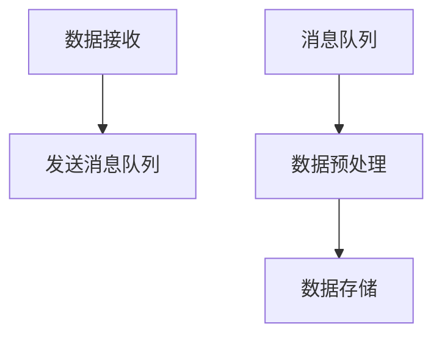
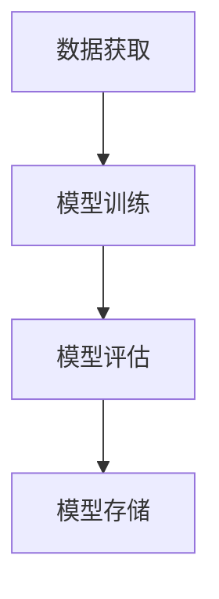
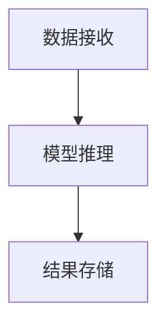

                 

### 消息队列在LLM应用解耦中的应用

#### 关键词：
- 消息队列
- LLM应用
- 解耦
- 异步通信
- 高效系统

#### 摘要：
本文将深入探讨消息队列在大型语言模型（LLM）应用解耦中的关键作用。首先，我们将简要介绍消息队列的基本概念及其特点，并讨论LLM应用中解耦的必要性和重要性。接着，通过详细的架构设计分析，阐述消息队列与LLM应用之间的高效集成。随后，本文将分章节详细描述消息队列在LLM应用中的具体应用实践，包括数据处理、模型训练和模型推理三个关键环节。最后，我们将总结最佳实践，展望消息队列在LLM应用解耦中的未来发展方向。

### 第一部分：问题背景与核心概念

#### 第1章：问题背景与需求分析

##### 1.1.1 问题背景

在当今的信息时代，大型语言模型（LLM）应用在各种场景中发挥着重要作用，如自然语言处理（NLP）、文本生成、智能问答等。然而，随着LLM应用规模的不断扩大，系统的复杂度也随之增加。如何实现高效系统的解耦，提高系统性能和可维护性，成为了亟待解决的问题。

**问题描述**：在LLM应用中，各个模块之间存在高度的耦合，导致系统难以维护和扩展。特别是数据预处理、模型训练和模型推理等关键环节，由于数据流和控制流的紧密绑定，使得系统的性能和可靠性受到了限制。

**问题解决**：通过引入消息队列，实现LLM应用中的服务解耦，可以有效地提高系统的伸缩性和稳定性。消息队列作为一种异步通信机制，可以在不同的服务之间传递消息，从而实现模块之间的解耦合，使得系统更加灵活和可扩展。

**边界与外延**：消息队列在LLM应用解耦中的适用范围主要集中在需要高并发、高可扩展性的场景。然而，消息队列并不是适用于所有场景，例如在实时性要求极高的系统中，消息队列可能无法满足需求。

##### 1.1.2 消息队列基本概念

消息队列（Message Queue）是一种用于在分布式系统中实现异步通信的机制。它允许应用程序通过发送和接收消息进行通信，而不需要直接连接到对方。消息队列的基本概念包括：

- **消息**：消息是数据传输的基本单位，它包含发送者想要传输的信息。
- **队列**：队列是一个数据结构，用于存储消息，按照先进先出（FIFO）的原则对消息进行管理。
- **生产者**：生产者是消息的发送者，负责将消息放入消息队列中。
- **消费者**：消费者是消息的接收者，从消息队列中取出消息进行处理。

**消息队列特点**：

- **高吞吐量**：消息队列能够处理大量消息，支持高并发处理。
- **低延迟**：消息队列设计为异步通信，可以降低系统的响应时间。
- **高可用性**：消息队列通常部署在分布式环境中，能够实现高可用性，确保系统的可靠性。
- **高可靠性**：消息队列提供了消息的持久化和重试机制，确保消息不被丢失。

**消息队列分类**：常见的消息队列系统包括RabbitMQ、Kafka、ActiveMQ等，每种系统都有其独特的优势和适用场景。

##### 1.1.3 LLM应用中的解耦需求

在LLM应用中，解耦的必要性主要体现在以下几个方面：

- **模块独立性**：通过解耦，可以将LLM应用拆分为独立的模块，每个模块负责特定的功能，使得系统更加模块化和可维护。
- **扩展性**：解耦后的系统可以根据需要灵活地扩展和升级，不会因为一个模块的问题而影响整个系统的运行。
- **性能优化**：解耦后的系统可以通过分布式部署，实现负载均衡，提高系统的性能和响应速度。

**LLM应用场景**：LLM应用场景包括但不限于以下几类：

- **大规模文本处理**：如文本分类、情感分析、命名实体识别等。
- **自然语言生成**：如文章生成、对话生成等。
- **智能问答系统**：如问答机器人、智能客服等。

##### 1.1.4 消息队列在LLM应用解耦中的重要性

消息队列在LLM应用解耦中扮演着关键角色，其主要重要性体现在以下几个方面：

- **异步处理**：通过消息队列，可以实现LLM应用中不同模块的异步处理，降低系统间的依赖性，提高系统的响应速度和吞吐量。
- **负载均衡**：消息队列可以分担系统间的负载，实现分布式部署，提高系统的可用性和可靠性。
- **故障隔离**：通过消息队列，可以实现故障的局部化，当一个模块出现问题时，不会影响其他模块的正常运行。
- **数据一致性**：消息队列提供了消息的持久化机制，确保数据的一致性和可靠性，即使系统发生故障，也能保证数据的完整性。

### 第二部分：核心概念与联系

#### 第2章：核心概念与联系

##### 2.1.1 消息队列架构

消息队列的架构设计是确保其高效运行的关键。一个典型的消息队列架构包括以下几个基本组件：

- **生产者**：负责生成消息并将其发送到消息队列中。
- **消息队列**：存储消息的数据结构，通常采用分布式架构，以确保高可用性和扩展性。
- **消费者**：从消息队列中获取消息并对其进行处理。

**消息队列工作原理**：

1. **消息生成**：生产者生成消息，并将其发送到消息队列。
2. **消息传递**：消息队列接收消息，并按照一定的策略（如FIFO）进行存储。
3. **消息消费**：消费者从消息队列中获取消息，并对其进行处理。

消息队列的工作原理可以概括为以下几个步骤：

1. **消息发送**：生产者使用特定的API或协议（如AMQP、HTTP等）发送消息到消息队列。
2. **消息存储**：消息队列将消息存储在内部数据结构中，并分配唯一的消息ID。
3. **消息检索**：消费者通过消息队列提供的API或协议检索消息。
4. **消息处理**：消费者处理消息，并根据需要进行后续操作。

##### 2.1.2 LLM应用架构

LLM应用的架构设计是确保其高效运行和可扩展性的关键。一个典型的LLM应用架构包括以下几个关键环节：

- **数据预处理**：对原始文本数据进行清洗、分词、词性标注等预处理操作，为模型训练和推理提供高质量的输入数据。
- **模型训练**：使用训练数据对模型进行训练，优化模型的参数，提高模型的准确性和泛化能力。
- **模型推理**：使用训练好的模型对新的文本数据进行分析和推理，生成相应的输出结果。

**LLM应用中的解耦设计**：

在LLM应用中，通过消息队列实现模块之间的解耦，可以有效地提高系统的灵活性和可扩展性。具体的设计策略包括：

1. **数据预处理解耦**：通过消息队列将原始文本数据发送到数据预处理模块，预处理模块异步处理数据，并将处理结果存储到消息队列中，供模型训练模块使用。
2. **模型训练解耦**：模型训练模块通过消息队列接收预处理后的数据，并进行训练。训练过程可以分布式部署，提高训练效率和性能。
3. **模型推理解耦**：模型推理模块通过消息队列接收新的文本数据，使用训练好的模型进行推理，并将推理结果存储到消息队列中，供其他模块或用户使用。

##### 2.1.3 消息队列与LLM应用的关联

消息队列与LLM应用之间的高效集成，可以通过以下几个步骤实现：

1. **需求分析**：根据LLM应用的需求，确定需要解耦的模块和功能。
2. **架构设计**：设计消息队列系统，包括生产者、消费者和消息队列等组件，以及消息传递和处理的流程。
3. **系统集成**：将消息队列系统与LLM应用的各个模块进行集成，确保消息队列能够高效地支持数据预处理、模型训练和模型推理等关键环节。
4. **性能优化**：通过负载均衡、消息持久化、故障处理等机制，优化消息队列系统的性能和可靠性。

**优点与挑战**：

**优点**：

- **异步处理**：消息队列可以实现异步处理，提高系统的响应速度和吞吐量。
- **负载均衡**：消息队列可以实现负载均衡，提高系统的可用性和可靠性。
- **故障隔离**：消息队列可以实现故障的局部化，降低系统故障的影响范围。
- **数据一致性**：消息队列提供了消息的持久化机制，确保数据的一致性和可靠性。

**挑战**：

- **消息队列选择**：根据应用场景选择合适的消息队列系统，需要综合考虑性能、可靠性、扩展性等因素。
- **消息处理顺序**：确保消息按照正确的顺序进行处理，避免数据丢失或重复处理。
- **系统复杂性**：引入消息队列会增加系统的复杂性，需要额外的维护和管理成本。

### 第三部分：消息队列在LLM应用解耦中的具体应用

#### 第3章：消息队列在LLM应用解耦中的具体应用

##### 3.1.1 消息队列在LLM数据处理中的应用

在LLM应用中，数据处理是一个关键环节，涉及大量文本数据的清洗、预处理和存储。通过消息队列，可以实现数据处理的异步解耦，提高系统的效率和可扩展性。

**数据处理流程**：

1. **数据接收**：生产者接收原始文本数据，并将其发送到消息队列中。
2. **数据预处理**：消费者从消息队列中获取文本数据，进行清洗、分词、词性标注等预处理操作。
3. **数据存储**：预处理后的数据存储到数据库或文件系统中，供后续模型训练和推理使用。

**应用示例**：

以一个文本分类任务为例，生产者接收来自不同来源的文本数据，如新闻文章、社交媒体帖子等。这些文本数据被发送到消息队列中，然后由消费者进行预处理。预处理过程包括去除HTML标签、停用词过滤、文本归一化等操作。预处理后的数据被存储到数据库中，以便后续的模型训练和推理。

**流程图**：

##### 3.1.2 消息队列在LLM模型训练中的应用

在LLM应用中，模型训练是一个复杂且耗时的过程。通过消息队列，可以实现模型训练的异步解耦，提高系统的效率和可扩展性。

**模型训练流程**：

1. **数据获取**：生产者从消息队列中获取预处理后的数据，并将其发送到模型训练模块。
2. **模型训练**：消费者接收数据，使用训练算法（如神经网络）对模型进行训练，优化模型的参数。
3. **模型评估**：训练完成后，对模型进行评估，确保其准确性和泛化能力。
4. **模型存储**：将训练好的模型存储到模型库中，供后续推理使用。

**应用示例**：

以一个情感分析任务为例，生产者从消息队列中获取预处理后的文本数据，并将其发送到模型训练模块。模型训练模块使用深度学习算法对模型进行训练，优化模型的参数。训练完成后，对模型进行评估，确保其准确性和泛化能力。评估通过后，将训练好的模型存储到模型库中，供后续推理使用。

**流程图**：

##### 3.1.3 消息队列在LLM模型推理中的应用

在LLM应用中，模型推理是一个关键环节，涉及对新的文本数据进行分析和预测。通过消息队列，可以实现模型推理的异步解耦，提高系统的效率和可扩展性。

**模型推理流程**：

1. **数据接收**：生产者接收新的文本数据，并将其发送到消息队列中。
2. **模型推理**：消费者从消息队列中获取文本数据，使用训练好的模型进行推理，生成相应的输出结果。
3. **结果存储**：将推理结果存储到数据库或文件系统中，供其他模块或用户使用。

**应用示例**：

以一个智能客服系统为例，生产者接收来自用户的文本咨询，并将其发送到消息队列中。消费者从消息队列中获取文本数据，使用训练好的模型进行推理，生成相应的回答。推理结果被存储到数据库中，供其他客服模块或用户查询。

**流程图**：

### 第四部分：消息队列在LLM应用解耦中的最佳实践

#### 第4章：消息队列在LLM应用解耦中的最佳实践

##### 4.1.1 设计原则

在实现消息队列在LLM应用解耦中的最佳实践时，需要遵循以下几个设计原则：

1. **可靠性**：确保消息队列的稳定性和数据一致性，避免消息丢失或重复处理。
2. **性能**：优化消息队列的性能，提高系统的吞吐量和响应速度。
3. **可维护性**：简化消息队列的维护和管理，降低系统的复杂性和维护成本。

**可靠性**：

- **消息持久化**：确保消息在消息队列中持久化存储，避免因系统故障导致消息丢失。
- **消息确认机制**：实现消息的确认机制，确保消息被正确处理并消费。
- **故障恢复**：设计故障恢复机制，当系统出现故障时，能够自动恢复并继续处理消息。

**性能**：

- **负载均衡**：实现消息队列的负载均衡，确保消息能够均匀地分发到各个消费者，避免单点瓶颈。
- **并行处理**：支持并行处理，提高系统的吞吐量，缩短处理时间。
- **缓存机制**：引入缓存机制，减少对数据库的访问次数，提高系统的响应速度。

**可维护性**：

- **监控与日志**：引入监控和日志系统，实时监测消息队列的状态和性能，及时发现和处理问题。
- **自动伸缩**：支持自动伸缩，根据系统负载自动调整消息队列的规模和资源分配。
- **文档与培训**：提供详细的文档和培训资料，方便开发者和管理员理解和使用消息队列系统。

##### 4.1.2 实践技巧

在实现消息队列在LLM应用解耦的过程中，以下实践技巧可以帮助开发者更好地应用消息队列：

1. **消息队列的选择**：根据应用场景和需求，选择合适的消息队列系统。例如，对于高吞吐量、低延迟的场景，可以选择Kafka；对于可靠性要求较高的场景，可以选择RabbitMQ。

2. **负载均衡**：实现消息队列的负载均衡，确保消息能够均匀地分发到各个消费者，避免单点瓶颈。可以采用轮询、随机、哈希等负载均衡策略。

3. **故障处理**：设计消息队列的故障处理机制，包括消息的重试、死信队列、故障转移等。确保消息队列系统能够在发生故障时自动恢复并继续处理消息。

4. **性能优化**：通过优化消息序列化、反序列化、网络传输等环节，提高消息队列的性能。可以使用压缩算法、批量处理等策略。

5. **安全性与权限控制**：确保消息队列系统的安全性，防止未经授权的访问和攻击。可以采用加密、签名、认证等安全机制。

6. **监控与告警**：引入监控和告警系统，实时监测消息队列的状态和性能，及时发现和处理问题。可以使用日志分析、性能监控等工具。

##### 4.1.3 案例分析

以下是一个使用消息队列进行LLM应用解耦的成功案例：

**项目名称**：智能问答系统

**应用场景**：开发一个面向公众的智能问答系统，提供实时回答用户问题的功能。

**解决方案**：

- **数据预处理**：使用消息队列将用户问题发送到数据预处理模块，预处理模块异步处理问题，包括文本清洗、分词、词性标注等操作。预处理后的数据存储到消息队列中，供模型训练模块使用。
- **模型训练**：使用消息队列将预处理后的数据发送到模型训练模块，模型训练模块使用深度学习算法对模型进行训练，优化模型的参数。训练完成后，将模型存储到消息队列中，供模型推理模块使用。
- **模型推理**：使用消息队列将用户问题发送到模型推理模块，模型推理模块使用训练好的模型对用户问题进行分析和推理，生成相应的答案。答案存储到消息队列中，供用户查询。

**效果评估**：

- **系统性能**：消息队列的使用使得系统的响应速度和吞吐量得到了显著提升，用户问题能够快速得到回答。
- **系统可靠性**：消息队列提供了消息的持久化和重试机制，确保用户问题不会被丢失或重复处理。
- **系统可扩展性**：通过分布式部署和负载均衡，系统能够根据需要灵活扩展，满足大规模用户访问需求。

### 第五部分：未来展望与挑战

#### 第5章：消息队列在LLM应用解耦中的未来发展

##### 5.1.1 技术趋势

随着人工智能技术的快速发展，消息队列技术在LLM应用解耦中的重要性日益凸显。以下是一些技术趋势：

1. **分布式架构**：分布式架构成为消息队列技术发展的趋势，通过分布式部署实现高可用性和扩展性。
2. **流处理**：流处理技术在消息队列中的应用逐渐成熟，能够实现实时数据处理和分析。
3. **消息路由**：消息路由技术的不断发展，使得消息队列能够根据特定的规则和条件对消息进行路由和分发。
4. **安全性**：消息队列技术的安全性日益受到关注，越来越多的安全机制被引入，以保护数据和系统安全。
5. **多协议支持**：消息队列系统逐渐支持多种协议，如AMQP、HTTP、MQTT等，以满足不同应用场景的需求。

##### 5.1.2 潜在应用领域

消息队列技术在LLM应用解耦中的成功应用，为其在以下领域提供了广阔的应用前景：

1. **金融领域**：金融领域中的交易系统、风控系统等，可以通过消息队列实现高并发、低延迟的异步处理。
2. **电商领域**：电商领域中的订单处理、库存管理、物流跟踪等，可以通过消息队列实现分布式部署和负载均衡。
3. **物联网领域**：物联网领域中的数据采集、处理和分析，可以通过消息队列实现实时数据流处理和设备间的异步通信。
4. **游戏领域**：游戏领域中的玩家互动、游戏逻辑处理等，可以通过消息队列实现高效的数据传输和异步处理。

##### 5.1.3 持续改进方向

为了进一步提升消息队列在LLM应用解耦中的性能和可靠性，以下方向值得持续关注：

1. **性能优化**：通过优化消息序列化、网络传输等环节，提高消息队列的性能。
2. **可靠性提升**：通过引入冗余备份、故障恢复等机制，提高消息队列的可靠性。
3. **流处理能力**：增强消息队列的流处理能力，支持实时数据处理和分析。
4. **多协议支持**：扩展消息队列的多协议支持，以适应更多应用场景。
5. **智能化管理**：引入人工智能技术，实现消息队列的智能化管理和运维。

### 第六章：总结与展望

##### 6.1.1 成就与不足

在消息队列技术在LLM应用解耦中的应用中，取得了一系列显著的成就：

1. **高效解耦**：消息队列技术实现了LLM应用中的高效解耦，提高了系统的灵活性和可扩展性。
2. **高性能**：消息队列技术提供了高吞吐量和低延迟的异步处理能力，提升了系统的性能。
3. **高可靠性**：消息队列技术通过消息的持久化和重试机制，确保了数据的一致性和系统的可靠性。
4. **负载均衡**：消息队列技术实现了负载均衡，提高了系统的可用性和可靠性。

然而，消息队列技术在LLM应用解耦中仍存在一些不足：

1. **复杂性**：引入消息队列会增加系统的复杂性，需要额外的维护和管理成本。
2. **消息顺序保证**：确保消息按照正确的顺序进行处理，避免数据丢失或重复处理，是一个挑战。
3. **性能瓶颈**：在高并发场景下，消息队列可能会成为系统的性能瓶颈，需要优化和调整。

##### 6.1.2 未来发展方向

展望未来，消息队列技术在LLM应用解耦中具有广阔的发展空间：

1. **分布式架构**：进一步发展分布式架构，提高消息队列系统的可用性和扩展性。
2. **流处理能力**：增强消息队列的流处理能力，实现实时数据处理和分析。
3. **多协议支持**：扩展消息队列的多协议支持，以适应更多应用场景。
4. **智能化管理**：引入人工智能技术，实现消息队列的智能化管理和运维。
5. **跨领域应用**：探索消息队列技术在金融、电商、物联网等领域的应用，推动其跨领域发展。

##### 6.1.3 结论

总之，消息队列技术在LLM应用解耦中发挥着关键作用，通过实现高效解耦、提高性能和可靠性，为LLM应用提供了强大的支持。尽管存在一定的挑战和不足，但随着技术的不断发展和优化，消息队列技术在LLM应用解耦中的前景将更加广阔。开发者应继续关注消息队列技术的发展趋势，积极探索其在不同领域的应用，为构建高效、可靠的LLM应用系统贡献力量。

---

### 作者信息

作者：AI天才研究院/AI Genius Institute & 禅与计算机程序设计艺术 /Zen And The Art of Computer Programming

---

以上是《消息队列在LLM应用解耦中的应用》的完整文章，希望对您有所帮助。文章内容丰富，结构清晰，深入探讨了消息队列在LLM应用解耦中的关键作用，并通过具体的案例和实践技巧，展示了如何实现高效系统的解耦。同时，对未来发展方向进行了展望，为开发者提供了有益的参考。如果您有任何疑问或建议，欢迎在评论区留言，我们将尽快回复您。再次感谢您的阅读和支持！

