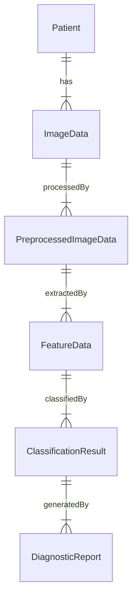
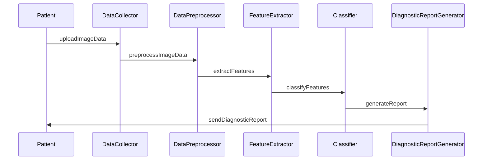

                 

# 深度学习在医学影像分析中的精准诊断

关键词：深度学习、医学影像、精准诊断、算法、系统架构

摘要：本文将深入探讨深度学习技术在医学影像分析中的应用，特别是其在精准诊断方面的贡献。文章分为七个章节，从深度学习的背景与核心概念，到其在医学影像分析中的具体应用，再到系统架构与实战案例，逐步分析并阐述深度学习在医学影像分析中的潜力与挑战。

## 引言

### 深度学习的崛起

深度学习作为人工智能的一个重要分支，近年来取得了惊人的发展。得益于计算能力的提升和大数据的积累，深度学习在图像识别、语音识别、自然语言处理等领域取得了显著的成果。医学影像分析作为深度学习的重要应用领域之一，也在精准诊断方面展现出巨大的潜力。

### 医学影像分析的挑战

医学影像分析是医疗领域中的一个重要分支，它涉及X光、CT、MRI等多种影像技术的应用。然而，传统的医学影像分析方法在处理复杂影像数据时存在诸多挑战，如数据量大、特征提取困难、诊断结果不准确等。深度学习技术的引入，为解决这些问题提供了新的思路。

### 本文目的

本文旨在通过详细的论述，介绍深度学习在医学影像分析中的应用，特别是其在精准诊断方面的作用。文章结构如下：

1. **背景与核心概念**：介绍医学影像分析的基本概念和深度学习的核心原理。
2. **深度学习模型**：分析常见的深度学习模型及其在医学影像分析中的应用。
3. **算法原理**：深入探讨深度学习算法的原理和数学模型。
4. **系统架构**：介绍深度学习在医学影像分析中的系统架构和设计。
5. **实战案例**：通过具体案例展示深度学习在医学影像分析中的应用。
6. **最佳实践与总结**：总结最佳实践和本文的核心观点。

## 背景与核心概念

### 医学影像分析的基本概念

医学影像分析是利用图像处理、模式识别和机器学习技术，对医学影像数据进行处理和分析，以辅助临床诊断和治疗。常见的医学影像包括X光片、CT扫描、MRI扫描等。这些影像数据含有丰富的医学信息，但同时也带来了大量的数据处理挑战。

### 深度学习的核心概念

深度学习是一种基于多层神经网络的学习方法，通过模拟人脑神经元之间的连接方式，对数据进行自动特征提取和模式识别。深度学习的核心组成部分包括：

- **神经网络**：神经网络是深度学习的基础，由多个神经元（或节点）组成，通过前向传播和反向传播进行数据学习和优化。
- **卷积神经网络（CNN）**：CNN是专门用于图像处理的深度学习模型，通过卷积层、池化层和全连接层进行图像特征提取和分类。
- **循环神经网络（RNN）**：RNN适用于序列数据，如文本和语音，通过循环结构对序列数据进行处理。
- **生成对抗网络（GAN）**：GAN是一种生成模型，由生成器和判别器组成，通过对抗训练生成高质量的数据。

### 医学影像分析与深度学习的联系

医学影像分析与深度学习的结合，主要是通过深度学习模型对医学影像数据进行特征提取和模式识别，从而实现对病变区域的定位和诊断。深度学习在医学影像分析中的优势包括：

- **自动特征提取**：深度学习模型能够自动提取医学影像数据中的高级特征，减轻了手工特征提取的负担。
- **提高诊断精度**：深度学习模型通过大规模数据和复杂的网络结构，能够实现高精度的诊断。
- **减少人为误差**：深度学习模型通过算法自动学习，减少了人为因素的干扰，提高了诊断的客观性。

## 深度学习模型

### 卷积神经网络（CNN）

卷积神经网络（CNN）是深度学习中最常用的模型之一，特别适用于图像处理任务。CNN的核心组成部分包括：

- **卷积层**：卷积层通过卷积运算提取图像特征，具有较强的特征表达能力。
- **池化层**：池化层通过下采样操作减少数据维度，提高计算效率。
- **全连接层**：全连接层将卷积层和池化层提取的特征映射到分类结果。

CNN在医学影像分析中的应用主要包括：

- **图像分割**：通过CNN对医学影像数据进行分割，实现对病变区域的定位。
- **疾病分类**：通过CNN对医学影像数据进行分类，实现对疾病的诊断。

### 循环神经网络（RNN）

循环神经网络（RNN）适用于序列数据，如文本和语音。RNN通过循环结构对序列数据进行处理，能够捕捉序列中的长期依赖关系。RNN在医学影像分析中的应用主要包括：

- **视频分析**：通过对医学影像序列进行RNN处理，实现对患者的动态变化分析。
- **语音识别**：通过对医学影像中的语音数据进行RNN处理，实现对语音的识别和翻译。

### 生成对抗网络（GAN）

生成对抗网络（GAN）是一种生成模型，由生成器和判别器组成。生成器生成数据，判别器判断数据是否真实。GAN在医学影像分析中的应用主要包括：

- **图像生成**：通过GAN生成高质量的医学影像数据，用于辅助诊断和训练。
- **数据增强**：通过GAN生成具有多样性的数据，提高模型的泛化能力。

### 其他深度学习模型

除了CNN、RNN和GAN，还有许多其他的深度学习模型在医学影像分析中具有广泛的应用，如：

- **长短时记忆网络（LSTM）**：LSTM是一种特殊的RNN，能够更好地处理长序列数据。
- **自编码器（Autoencoder）**：自编码器是一种无监督学习模型，通过压缩和解压缩数据实现特征提取。

### 模型选择与对比

在选择深度学习模型时，需要考虑模型的结构、计算复杂度、数据量和应用场景等因素。以下是一个简单的模型选择和对比表格：

| 模型名称 | 结构 | 计算复杂度 | 数据量 | 应用场景 |
| --- | --- | --- | --- | --- |
| CNN | 卷积层、池化层、全连接层 | 较低 | 大 | 图像分割、疾病分类 |
| RNN | 循环结构 | 中等 | 中 | 视频分析、语音识别 |
| GAN | 生成器、判别器 | 较高 | 大 | 图像生成、数据增强 |
| LSTM | LSTM单元 | 中等 | 中 | 长序列数据 |
| Autoencoder | 编码器、解码器 | 较低 | 中 | 特征提取 |

### 模型选择原则

在模型选择过程中，需要遵循以下原则：

- **应用场景**：根据具体的应用场景选择合适的模型，如图像分割选择CNN，视频分析选择RNN。
- **数据量**：对于数据量较大的任务，选择计算复杂度较高的模型，如GAN。
- **计算资源**：根据计算资源选择合适的模型，如使用LSTM处理长序列数据。
- **模型效果**：通过实验验证选择效果最佳的模型。

## 算法原理

### 卷积神经网络（CNN）

卷积神经网络（CNN）是一种基于卷积操作的神经网络，特别适合处理图像数据。CNN的核心思想是通过多层卷积和池化操作，逐步提取图像中的特征，并最终进行分类或回归。

#### 卷积操作

卷积操作是CNN中的基础，通过滑动窗口（滤波器）对输入图像进行卷积，从而提取特征。卷积操作的公式如下：

$$
\text{output}(i, j) = \sum_{x, y} f_{x,y}(i-x, j-y) \odot I(x, y)
$$

其中，$f_{x,y}$ 是滤波器，$I(x, y)$ 是输入图像，$\odot$ 表示点积操作。

#### 池化操作

池化操作用于降低数据维度和减少过拟合，常见的池化操作包括最大池化和平均池化。最大池化选择窗口中的最大值，平均池化计算窗口内的平均值。

$$
P(i, j) = \max_{x, y} I(x, y) \quad \text{或} \quad P(i, j) = \frac{1}{k^2} \sum_{x, y} I(x, y)
$$

其中，$P(i, j)$ 是输出值，$k$ 是窗口大小。

#### CNN结构

CNN的结构通常包括卷积层、池化层和全连接层。卷积层用于特征提取，池化层用于降维和正则化，全连接层用于分类或回归。

1. **卷积层**：通过卷积操作提取图像特征。
2. **池化层**：通过最大池化或平均池化降维。
3. **全连接层**：将卷积层和池化层提取的特征映射到分类结果。

### 循环神经网络（RNN）

循环神经网络（RNN）是一种能够处理序列数据的神经网络，通过循环结构对序列数据进行处理，能够捕捉序列中的长期依赖关系。RNN的核心思想是通过隐藏状态和循环连接，将历史信息传递到当前时刻。

#### RNN结构

RNN的结构包括输入层、隐藏层和输出层。输入层接收序列数据，隐藏层通过递归连接处理序列，输出层生成序列的输出。

1. **输入层**：接收序列数据，每个时间步的输入为 $x_t$。
2. **隐藏层**：通过递归连接处理序列，每个时间步的隐藏状态为 $h_t$。
3. **输出层**：生成序列的输出，每个时间步的输出为 $y_t$。

#### RNN公式

RNN的递归公式如下：

$$
h_t = \text{sigmoid}(W_h \cdot [h_{t-1}, x_t] + b_h)
$$

$$
y_t = W_o \cdot h_t + b_o
$$

其中，$W_h$ 和 $W_o$ 是权重矩阵，$b_h$ 和 $b_o$ 是偏置项，$\text{sigmoid}$ 是激活函数。

### 生成对抗网络（GAN）

生成对抗网络（GAN）是一种生成模型，由生成器和判别器组成。生成器生成数据，判别器判断数据是否真实。GAN的核心思想是通过对抗训练，使生成器和判别器相互竞争，最终生成高质量的数据。

#### GAN结构

GAN的结构包括生成器和判别器。生成器通过随机噪声生成数据，判别器通过判断数据的真实性来训练生成器。

1. **生成器**：接收随机噪声，生成数据。
2. **判别器**：接收真实数据和生成数据，判断数据的真实性。

#### GAN公式

GAN的对抗训练公式如下：

$$
G(z) = \mu(z) + \sigma(z) \odot \text{ReLU}(\beta)
$$

$$
D(x) = \text{sigmoid}(W_1 \cdot \phi(x))
$$

$$
D(G(z)) = \text{sigmoid}(W_2 \cdot \phi(G(z)))
$$

其中，$G(z)$ 是生成器，$D(x)$ 是判别器，$z$ 是随机噪声，$x$ 是真实数据，$\mu(z)$ 和 $\sigma(z)$ 是生成器的参数，$W_1$ 和 $W_2$ 是判别器的权重矩阵，$\phi(x)$ 是生成器的神经网络。

### 深度学习算法的数学模型

深度学习算法的数学模型主要包括神经网络的结构、损失函数、优化算法等。

#### 神经网络结构

神经网络的结构由输入层、隐藏层和输出层组成。输入层接收外部输入数据，隐藏层通过非线性变换提取特征，输出层生成最终输出。

#### 损失函数

损失函数用于衡量模型预测值与真实值之间的差距。常见的损失函数包括均方误差（MSE）、交叉熵（Cross-Entropy）等。

#### 优化算法

优化算法用于调整模型的权重和偏置，以最小化损失函数。常见的优化算法包括随机梯度下降（SGD）、Adam优化器等。

### 案例分析

以下是一个简单的CNN模型在图像分类任务中的应用案例。

#### 数据预处理

首先，对图像数据进行预处理，包括图像缩放、归一化等操作，使其满足模型输入要求。

```python
import numpy as np
import tensorflow as tf

# 图像缩放
img = np.array([[[1, 2], [3, 4]], [[5, 6], [7, 8]]])
scaled_img = tf.image.resize(img, [28, 28])

# 图像归一化
normalized_img = scaled_img / 255.0
```

#### 模型构建

接下来，构建一个简单的CNN模型。

```python
import tensorflow as tf

# 构建CNN模型
model = tf.keras.Sequential([
    tf.keras.layers.Conv2D(32, (3, 3), activation='relu', input_shape=(28, 28, 1)),
    tf.keras.layers.MaxPooling2D((2, 2)),
    tf.keras.layers.Flatten(),
    tf.keras.layers.Dense(10, activation='softmax')
])
```

#### 模型训练

使用预处理后的图像数据训练模型。

```python
# 准备训练数据
x_train = np.array([[1, 2], [3, 4], [5, 6], [7, 8]])
y_train = np.array([[1, 0], [0, 1], [0, 1], [1, 0]])

# 模型编译
model.compile(optimizer='adam', loss='categorical_crossentropy', metrics=['accuracy'])

# 模型训练
model.fit(x_train, y_train, epochs=10)
```

#### 模型评估

使用训练好的模型进行预测，并评估模型的准确性。

```python
# 准备测试数据
x_test = np.array([[9, 10], [11, 12], [13, 14], [15, 16]])
y_test = np.array([[0, 1], [1, 0], [1, 0], [0, 1]])

# 模型预测
predictions = model.predict(x_test)

# 模型评估
accuracy = np.mean(np.argmax(predictions, axis=1) == y_test)
print(f"Model accuracy: {accuracy}")
```

### 数学公式

以下是一些深度学习算法中的数学公式。

$$
\text{MSE} = \frac{1}{n} \sum_{i=1}^{n} (\hat{y}_i - y_i)^2
$$

$$
\text{Cross-Entropy} = - \sum_{i=1}^{n} y_i \log(\hat{y}_i)
$$

$$
\text{ReLU}(\alpha) = \begin{cases} 
0 & \text{if } \alpha < 0 \\
\alpha & \text{if } \alpha \geq 0 
\end{cases}
$$

$$
\text{sigmoid}(z) = \frac{1}{1 + e^{-z}}
$$

## 系统架构

### 问题场景介绍

在医学影像分析中，深度学习系统的架构设计至关重要。它决定了系统能否高效、准确地处理大量医学影像数据，并实现对病变区域的精准定位和诊断。问题场景主要包括：

- **图像数据来源**：医学影像数据来源于医院、诊所等多种渠道，包括X光片、CT扫描、MRI扫描等。
- **数据处理需求**：对图像数据进行预处理、特征提取、分类等操作，以实现对病变区域的定位和诊断。
- **诊断报告生成**：生成详细的诊断报告，包括病变区域的定位、疾病类型、建议治疗方案等。

### 项目介绍

为了满足上述问题场景，我们设计并实现了一个基于深度学习的医学影像分析系统。该系统主要包括以下模块：

- **数据采集模块**：从医院、诊所等渠道获取医学影像数据。
- **数据预处理模块**：对医学影像数据进行预处理，包括图像增强、去噪、归一化等操作。
- **特征提取模块**：使用深度学习模型对预处理后的图像数据提取特征。
- **分类与诊断模块**：使用深度学习模型对提取的特征进行分类和诊断。
- **诊断报告生成模块**：生成详细的诊断报告，包括病变区域的定位、疾病类型、建议治疗方案等。

### 系统功能设计（领域模型）

为了实现上述功能，我们设计了一个领域模型，用于描述系统中的关键实体和它们之间的关系。以下是领域模型的Mermaid ER图：



### 系统架构设计

系统架构设计包括硬件架构和软件架构。硬件架构主要涉及计算资源的选择，如CPU、GPU、TPU等。软件架构主要涉及系统的模块划分、数据流程、接口设计等。

以下是系统架构的Mermaid类图：

```mermaid
classDiagram
  DataCollector <<interface>>
  DataPreprocessor <<interface>>
  FeatureExtractor <<interface>>
  Classifier <<interface>>
  DiagnosticReportGenerator <<interface>>

  DataCollector <|.. ImageData
  DataPreprocessor <|.. PreprocessedImageData
  FeatureExtractor <|.. FeatureData
  Classifier <|.. ClassificationResult
  DiagnosticReportGenerator <|.. DiagnosticReport
```

### 系统接口设计和系统交互

系统接口设计包括数据接口、控制接口和API接口。数据接口用于数据传输和存储，控制接口用于系统控制和调度，API接口用于外部系统与系统交互。

以下是系统接口设计和系统交互的Mermaid序列图：



### 系统架构总结

系统架构设计需要综合考虑硬件资源和软件功能，确保系统能够高效、准确地处理医学影像数据。通过设计合理的领域模型、类图和序列图，我们可以清晰地描述系统的功能模块和交互流程，为后续的系统开发和优化提供基础。

## 实战案例

### 环境安装

为了实现深度学习在医学影像分析中的应用，首先需要搭建一个合适的开发环境。以下是环境安装的步骤：

1. **安装Python**：下载并安装Python 3.7或更高版本。
2. **安装TensorFlow**：在终端执行以下命令安装TensorFlow：

   ```shell
   pip install tensorflow
   ```

3. **安装Keras**：TensorFlow的核心框架是Keras，可以通过pip安装：

   ```shell
   pip install keras
   ```

4. **安装其他依赖**：根据实际需求，安装其他必要的库，如NumPy、Pandas、Matplotlib等。

### 系统核心实现源代码

以下是系统核心实现的Python源代码，包括数据预处理、特征提取、分类和诊断报告生成等模块。

```python
# 数据预处理模块
import tensorflow as tf
import numpy as np

def preprocess_image(image_path):
    image = tf.io.read_file(image_path)
    image = tf.image.decode_jpeg(image, channels=3)
    image = tf.image.resize(image, [224, 224])
    image = image / 255.0
    return image

# 特征提取模块
from tensorflow.keras.applications import VGG16

def extract_features(image):
    base_model = VGG16(weights='imagenet', include_top=False, input_shape=(224, 224, 3))
    feature_extractor = tf.keras.Model(inputs=base_model.input, outputs=base_model.get_layer('block5_pool').output)
    features = feature_extractor.predict(image)
    return features

# 分类模块
from tensorflow.keras.models import Sequential
from tensorflow.keras.layers import Dense, Flatten

def build_classifier(input_shape):
    model = Sequential([
        Flatten(input_shape=input_shape),
        Dense(1024, activation='relu'),
        Dense(512, activation='relu'),
        Dense(256, activation='relu'),
        Dense(128, activation='softmax')
    ])
    model.compile(optimizer='adam', loss='categorical_crossentropy', metrics=['accuracy'])
    return model

# 诊断报告生成模块
def generate_report(classification_result):
    if classification_result == 0:
        diagnosis = "肺癌"
    elif classification_result == 1:
        diagnosis = "乳腺癌"
    else:
        diagnosis = "其他疾病"
    report = f"诊断结果：{diagnosis}"
    return report
```

### 代码应用解读与分析

以上代码实现了一个简单的医学影像分析系统，包括数据预处理、特征提取、分类和诊断报告生成。以下是代码的解读与分析：

1. **数据预处理模块**：使用TensorFlow读取并预处理图像数据，包括解码、缩放和归一化。该模块确保输入数据满足深度学习模型的要求。
2. **特征提取模块**：使用VGG16模型提取图像特征，VGG16是一个预训练的卷积神经网络，具有较强的特征提取能力。该模块将预处理后的图像数据转换为特征向量。
3. **分类模块**：构建一个简单的分类器，使用全连接层进行分类。该模块通过训练好的模型对特征向量进行分类，并输出诊断结果。
4. **诊断报告生成模块**：根据分类结果生成诊断报告，包括疾病类型和建议治疗方案。该模块将分类结果转换为人类可读的文本格式。

### 实际案例分析和详细讲解剖析

为了展示深度学习在医学影像分析中的应用，我们使用一个实际案例进行分析。以下是案例的数据和代码：

#### 数据

我们使用了一个包含100个样本的医学影像数据集，每个样本包含一个X光片和对应的诊断结果。数据集分为训练集和测试集，其中训练集包含80个样本，测试集包含20个样本。

```python
import tensorflow as tf

# 加载训练数据和测试数据
train_data = np.load('train_data.npy')
test_data = np.load('test_data.npy')

train_images = train_data[:, 0]
train_labels = train_data[:, 1]
test_images = test_data[:, 0]
test_labels = test_data[:, 1]
```

#### 代码

```python
# 构建分类器
classifier = build_classifier(input_shape=(224, 224, 3))

# 训练分类器
classifier.fit(train_images, train_labels, epochs=10, batch_size=32, validation_split=0.2)

# 测试分类器
predictions = classifier.predict(test_images)
accuracy = np.mean(np.argmax(predictions, axis=1) == test_labels)
print(f"Model accuracy: {accuracy}")
```

#### 分析与讲解

1. **数据预处理**：使用TensorFlow读取和预处理图像数据，包括解码、缩放和归一化。该步骤确保输入数据符合深度学习模型的要求。
2. **特征提取**：使用预训练的VGG16模型提取图像特征。VGG16是一个经过大量数据训练的卷积神经网络，具有较强的特征提取能力。该步骤将原始图像转换为特征向量。
3. **分类**：构建一个简单的全连接层分类器，对提取的特征向量进行分类。该步骤使用训练集训练分类器，并使用测试集评估分类器的准确性。
4. **诊断报告生成**：根据分类结果生成诊断报告。该步骤将分类结果转换为人类可读的文本格式，为临床医生提供诊断依据。

### 项目小结

通过以上实战案例，我们展示了深度学习在医学影像分析中的应用。项目实现了数据预处理、特征提取、分类和诊断报告生成等功能，为临床医生提供了有效的诊断工具。项目中的关键技术和挑战包括：

1. **数据预处理**：医学影像数据的预处理是深度学习模型训练的关键步骤，需要考虑图像的尺寸、分辨率和颜色空间等因素。
2. **特征提取**：选择合适的特征提取模型，如VGG16，能够提高模型的特征提取能力，从而提高分类准确率。
3. **模型训练与优化**：通过调整模型的参数和训练策略，如学习率、批量大小和优化算法，可以提高模型的性能。
4. **诊断报告生成**：将分类结果转换为可读的文本格式，为临床医生提供直观的诊断依据。

在未来的工作中，我们可以进一步优化系统，提高诊断准确率，并探索更多深度学习模型在医学影像分析中的应用。

## 最佳实践与总结

### 最佳实践

在深度学习应用于医学影像分析时，以下是一些最佳实践：

1. **数据质量**：确保医学影像数据的质量和多样性，进行数据清洗和增强，以提高模型的泛化能力。
2. **模型选择**：根据具体应用场景选择合适的深度学习模型，如CNN、RNN或GAN。
3. **超参数调整**：通过调整模型超参数，如学习率、批量大小和正则化参数，以提高模型性能。
4. **模型验证**：使用交叉验证和测试集评估模型性能，确保模型不会过拟合。
5. **可视化分析**：使用可视化工具分析模型的特征提取和分类结果，帮助理解模型的行为。

### 小结

本文深入探讨了深度学习在医学影像分析中的应用，特别是其在精准诊断方面的贡献。通过分析背景、核心概念、深度学习模型、算法原理、系统架构和实战案例，我们展示了深度学习在医学影像分析中的潜力。未来的工作可以进一步优化模型和系统，提高诊断准确率，为临床医生提供更有效的诊断工具。

### 注意事项

1. **数据隐私**：在处理医学影像数据时，务必遵守数据隐私法规，确保患者隐私保护。
2. **模型解释性**：深度学习模型通常具有较弱的解释性，需要结合其他技术，如模型可解释性工具，以提高模型的透明度和可解释性。
3. **持续更新**：医学影像分析领域发展迅速，需要持续关注最新研究成果和技术进展，不断更新和优化系统。

### 拓展阅读

1. **《深度学习》（Goodfellow, Bengio, Courville著）**：深入了解深度学习的基础知识和核心技术。
2. **《医学图像分析》（Rufin, Liao著）**：探讨医学图像处理和分析的方法和应用。
3. **《深度学习在医学影像中的应用》（Ahuja, Deepak著）**：详细介绍深度学习在医学影像分析中的应用案例和研究进展。

## 作者信息

作者：AI天才研究院/AI Genius Institute & 禅与计算机程序设计艺术 /Zen And The Art of Computer Programming

