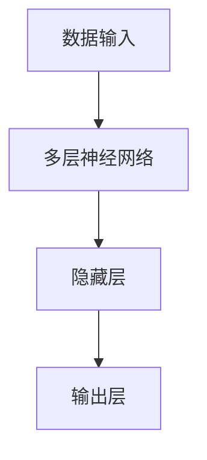

                 

### 1.1 医学影像诊断的重要性

医学影像诊断在医学领域中扮演着至关重要的角色。它为医生提供了直观、准确的病变图像，有助于早期发现疾病、精确诊断和个性化治疗。传统的影像诊断方法主要依赖于放射科医生的观察和经验，这种方法的准确性和效率都受到一定程度的限制。而随着深度学习技术的迅速发展，医学影像诊断的精准性和效率得到了显著提升。

首先，医学影像诊断在疾病早期发现中具有独特优势。例如，通过计算机断层扫描（CT）和磁共振成像（MRI），医生可以观察到微小的病灶和异常组织结构，这对于某些恶性肿瘤和神经系统疾病的早期发现至关重要。深度学习模型通过对大量影像数据的训练，可以识别出肉眼难以察觉的病变特征，从而提高了早期诊断的准确性。

其次，医学影像诊断在疾病诊断和分型中发挥了重要作用。不同类型的疾病在影像上具有不同的表现，深度学习模型可以通过学习大量的影像数据，对疾病进行准确的分类和分型，有助于制定更为精准的治疗方案。例如，在肺癌的诊断中，深度学习模型可以通过对CT图像的分析，区分出不同类型的肺癌，从而为医生提供更有针对性的治疗方案。

此外，医学影像诊断在疾病进展评估和治疗效果监测中也具有重要意义。通过定期对患者的影像进行检查，医生可以评估疾病的进展情况，调整治疗方案。深度学习模型可以自动分析影像数据，实时监测疾病进展，提高治疗效果的预测准确性。

总的来说，医学影像诊断的精准性直接影响到疾病的早期发现、诊断和治疗效果。随着深度学习技术的不断进步，医学影像诊断的效率和质量得到了显著提升，为临床医学带来了革命性的变化。深度学习在医学影像诊断中的应用，不仅提高了诊断的准确性，也为个性化医疗提供了有力支持。

### 1.2 深度学习在医学影像中的应用现状

深度学习技术在医学影像诊断中的应用现状可谓日新月异。近年来，随着计算能力的提升和数据量的增加，深度学习模型在医学影像领域的准确性和应用范围不断扩展，逐渐成为医学影像诊断的重要工具。

首先，深度学习在医学影像数据预处理方面的应用已经取得了显著成果。数据预处理是医学影像诊断中不可或缺的步骤，包括图像的分割、配准、增强和去噪等。传统的图像预处理方法往往依赖于手工设计的算法，而深度学习模型通过自动学习图像的特征，可以更有效地进行数据预处理。例如，卷积神经网络（CNN）和生成对抗网络（GAN）在图像分割和去噪方面表现出了优异的性能。通过这些预处理技术，医学影像数据的质量得到了显著提升，为后续的深度学习模型分析提供了坚实的基础。

其次，深度学习模型在医学影像分类和检测中的应用也取得了重要进展。在肺癌诊断中，CNN模型被广泛用于分析CT图像，以检测肺部结节。研究表明，通过大量影像数据的训练，深度学习模型在结节检测和分类中的准确率已经达到了与放射科医生相当的水平。类似地，在乳腺癌诊断中，深度学习模型通过分析乳腺X射线图像，可以准确识别肿瘤的位置、大小和类型，为医生提供可靠的诊断依据。

此外，深度学习在医学影像分析中的综合应用也日益受到关注。通过将多种深度学习模型和技术相结合，可以实现更复杂的医学影像分析任务。例如，在心脏影像分析中，深度学习模型可以同时分析心脏CT图像和超声图像，对心脏的结构和功能进行全面的评估。在呼吸系统影像分析中，深度学习模型可以分析肺部CT图像，识别出各种肺部病变，如肺炎、肺结核等。

总的来说，深度学习在医学影像诊断中的应用现状显示出巨大的潜力和前景。随着技术的不断进步和数据的积累，深度学习模型在医学影像诊断中的准确性和实用性将不断提高，为临床医学带来更多突破和进展。

### 1.3 精准应用与挑战

深度学习在医学影像诊断中的精准应用带来了显著的技术进步，但同时也面临诸多挑战。首先，数据质量和数据量是深度学习模型准确性的关键因素。高质量的医学影像数据对于训练深度学习模型至关重要，但获取高质量数据往往成本高昂且耗时。此外，医学影像数据量大且复杂，这要求深度学习模型能够处理高维数据并从中提取有效特征。这需要强大的计算能力和高效的算法。

其次，深度学习模型的泛化能力也是一大挑战。尽管深度学习模型在特定数据集上的表现良好，但在实际应用中，由于数据分布的差异，模型的泛化能力可能会受到限制。为了提高模型的泛化能力，需要设计更加鲁棒和自适应的深度学习算法。

此外，深度学习模型的解释性也是一个重要问题。医学影像诊断要求医生能够理解模型的决策过程，以便进行临床干预。然而，深度学习模型通常被视为“黑箱”，其内部决策机制不透明，这对临床医生的可接受度和应用深度学习模型的信心提出了挑战。为了解决这一问题，研究人员正在探索可解释的深度学习模型和解释工具，以提高模型的透明度和可解释性。

最后，伦理和法律问题也不容忽视。深度学习在医学影像诊断中的应用涉及患者的隐私和数据安全。如何确保患者的数据得到保护，避免数据泄露和滥用，是一个亟待解决的问题。同时，深度学习模型的决策可能对患者的健康和生命产生重大影响，因此需要建立健全的法律和伦理框架，确保模型的应用符合伦理标准和法律规定。

综上所述，深度学习在医学影像诊断中的精准应用虽然前景广阔，但也面临诸多挑战。需要进一步的研究和努力，以克服这些挑战，推动深度学习技术在医学影像诊断中的广泛应用。

### 2.1 深度学习概述

#### 核心概念

**深度学习（Deep Learning）**：一种机器学习方法，通过多层神经网络进行数据建模和学习。与传统的机器学习方法相比，深度学习能够自动提取数据的特征，从而提高了模型的学习能力和泛化能力。

**神经网络（Neural Network）**：模拟生物神经网络进行数据处理的计算模型。神经网络由大量的神经元（节点）和连接组成，每个神经元接收输入信号并通过权重进行加权求和，然后通过激活函数进行非线性变换，输出最终结果。

**多层神经网络（Multilayer Neural Network）**：包含多个隐藏层的神经网络，能够处理更复杂的非线性关系。通过逐层学习，多层神经网络可以从原始数据中提取出高层次的抽象特征。

**深度神经网络（Deep Neural Network，DNN）**：一种特殊的多层神经网络，具有大量隐藏层，能够处理高维数据和复杂任务。DNN在图像识别、自然语言处理等领域取得了显著的成果。

**Mermaid流程图：**



在深度学习中，数据的输入首先经过输入层，然后通过一系列隐藏层，最后在输出层产生预测结果。每个隐藏层都通过神经元和权重进行数据传递和变换，从而实现特征的提取和融合。随着层数的增加，神经网络可以学习更复杂的模式和关系，从而提高模型的性能。

#### 深度学习的优点和缺点

**优点：**

1. **自动特征提取**：深度学习模型能够自动从原始数据中提取出有意义的特征，无需人工设计特征，提高了模型的泛化能力和适应性。
2. **高效的处理能力**：多层神经网络可以处理高维数据和复杂任务，能够在大规模数据集上实现快速训练和预测。
3. **高准确性**：通过大规模的数据训练，深度学习模型可以达到很高的预测准确率，尤其在图像识别、语音识别和自然语言处理等领域。

**缺点：**

1. **计算资源需求高**：深度学习模型需要大量的计算资源和时间进行训练，对硬件设备有较高要求。
2. **数据需求大**：深度学习模型需要大量的高质量数据进行训练，以获得良好的泛化能力。
3. **解释性差**：深度学习模型通常被视为“黑箱”，其内部决策机制不透明，不利于理解和解释模型的预测结果。

通过以上核心概念和Mermaid流程图的展示，我们可以更清晰地理解深度学习的基本原理和结构。接下来，我们将进一步探讨神经网络的具体原理和不同类型的神经网络。

### 2.2 神经网络原理

神经网络（Neural Network，NN）是深度学习的基础组成部分，由大量相互连接的神经元（或节点）组成，这些神经元模拟了生物神经系统的运作方式。在神经网络中，每个神经元都接受来自其他神经元的输入信号，通过加权求和处理和激活函数，产生输出信号，进而传递给下一层神经元。

#### 神经元结构

一个基本的神经元可以看作是一个简单的计算单元，其结构包括三个主要部分：输入、权重和激活函数。

1. **输入**：神经元接收的输入信号可以是来自前一层神经元的输出，这些输入信号通过各自的权重进行加权。
2. **权重**：每个输入信号都与一个权重相乘，权重的大小反映了该输入信号对神经元输出的影响程度。
3. **激活函数**：神经元对加权求和的结果施加一个非线性变换，激活函数将线性组合的输出转化为一个非线性的激活值，以产生神经元的输出。

激活函数是神经网络中的关键组成部分，它决定了神经网络的非线性特性。常见的激活函数包括：

- **sigmoid函数**：\( f(x) = \frac{1}{1 + e^{-x}} \)
- **ReLU函数**：\( f(x) = \max(0, x) \)
- **Tanh函数**：\( f(x) = \frac{e^x - e^{-x}}{e^x + e^{-x}} \)

#### 神经网络的运算过程

在神经网络中，数据的处理过程可以归纳为以下步骤：

1. **前向传播**：输入数据通过网络的输入层传递到第一层神经元，然后逐层传递到隐藏层，最终到达输出层。每一层神经元的输出都会作为下一层神经元的输入。每个神经元对输入信号进行加权求和处理，并通过激活函数生成输出值。
   
   $$ z_i = \sum_{j=1}^{n} w_{ij} \cdot x_j + b $$
   $$ a_i = f(z_i) $$

   其中，\( z_i \) 是神经元 \( i \) 的加权求和结果，\( w_{ij} \) 是从神经元 \( j \) 到神经元 \( i \) 的权重，\( b \) 是偏置项，\( f \) 是激活函数。

2. **反向传播**：在得到输出层的结果后，计算预测值与实际值之间的误差。然后，通过反向传播算法，将误差反向传播回前一层，更新各层的权重和偏置项。这个过程称为反向传播。

   $$ \delta_j = (f'(z_j) \cdot (z_j - y_j)) $$
   $$ \Delta w_{ij} = \alpha \cdot \delta_j \cdot a_{i-1} $$
   $$ \Delta b_j = \alpha \cdot \delta_j $$

   其中，\( \delta_j \) 是误差对神经元 \( j \) 的偏导数，\( f' \) 是激活函数的导数，\( \alpha \) 是学习率，\( a_{i-1} \) 是前一层的输出。

通过多次迭代的前向传播和反向传播，神经网络的权重和偏置项不断更新，模型逐渐收敛，最终得到一个能够在给定数据上产生准确预测的模型。

#### Python代码示例

以下是一个简单的神经网络实现，展示了神经元结构的运算过程：

```python
import numpy as np

# 激活函数及其导数
def sigmoid(x):
    return 1 / (1 + np.exp(-x))

def sigmoid_derivative(x):
    return x * (1 - x)

# 前向传播和反向传播
def forward_propagation(x, weights, biases):
    z = np.dot(x, weights) + biases
    a = sigmoid(z)
    return a, z

def backward_propagation(a, z, y, weights, biases, learning_rate):
    error = y - a
    dZ = error * sigmoid_derivative(z)
    dW = learning_rate * np.dot(dZ, x.T)
    db = learning_rate * dZ
    return dW, db

# 示例数据
x = np.array([[1, 0], [0, 1], [1, 1]])
y = np.array([[0], [1], [1]])

# 初始化权重和偏置
weights = np.random.rand(2, 1)
biases = np.random.rand(1)

# 训练模型
learning_rate = 0.1
epochs = 1000

for epoch in range(epochs):
    a, z = forward_propagation(x, weights, biases)
    dW, db = backward_propagation(a, z, y, weights, biases, learning_rate)
    weights -= dW
    biases -= db

# 输出结果
print("Final weights:", weights)
print("Final biases:", biases)
```

通过这个示例，我们可以看到神经网络的运算过程是如何通过简单的数学公式实现的。接下来，我们将探讨卷积神经网络（CNN）在医学影像诊断中的应用。

### 2.3 卷积神经网络

卷积神经网络（Convolutional Neural Network，CNN）是一种特殊的神经网络，广泛应用于图像识别、图像分类和图像处理等领域。CNN在医学影像诊断中具有广泛的应用潜力，因为它能够自动提取图像中的空间特征，提高医学影像分析的准确性和效率。

#### CNN的结构

CNN的结构主要由以下几个部分组成：输入层、卷积层、池化层和全连接层。

1. **输入层**：CNN的输入通常是图像数据。图像被分成多个像素点，每个像素点代表图像的一个局部特征。

2. **卷积层**：卷积层是CNN的核心组成部分，通过卷积操作提取图像特征。卷积操作涉及一个卷积核（或滤波器）在输入图像上滑动，并与图像中的每个局部区域进行点积运算。卷积核的作用是提取图像中的特定特征，如边缘、纹理等。通过多次卷积操作，可以逐步提取更高层次的特征。

3. **池化层**：池化层用于减小特征图的尺寸，减少参数数量，从而提高计算效率。常见的池化操作包括最大池化（Max Pooling）和平均池化（Average Pooling）。最大池化选择特征图上每个局部区域中的最大值作为输出，而平均池化则计算每个局部区域的平均值作为输出。

4. **全连接层**：全连接层将卷积层和池化层提取的特征进行整合，并通过线性变换生成最终预测结果。全连接层类似于传统的神经网络，每个神经元都与上一层的所有神经元相连。

#### 卷积操作

卷积操作是CNN中最基本的运算，它通过卷积核对图像进行局部特征提取。卷积操作可以表示为以下数学公式：

$$
\text{output}_{ij} = \sum_{k=1}^{C} \text{filter}_{ik,jk} \cdot \text{input}_{ij} + \text{bias}_{k}
$$

其中，\( \text{output}_{ij} \) 是输出特征图上的第 \( i \) 行第 \( j \) 列的值，\( \text{filter}_{ik,jk} \) 是卷积核上的值，\( \text{input}_{ij} \) 是输入图像上的第 \( i \) 行第 \( j \) 列的值，\( \text{bias}_{k} \) 是卷积核的偏置。

#### 池化操作

池化操作用于减小特征图的尺寸，同时保留重要的特征信息。最大池化操作选择特征图上每个局部区域中的最大值，公式如下：

$$
\text{output}_{ij} = \max(\text{input}_{i \cdot \cdot , j \cdot \cdot })
$$

其中，\( \text{output}_{ij} \) 是输出特征图上的第 \( i \) 行第 \( j \) 列的值，\( \text{input}_{i \cdot \cdot , j \cdot \cdot } \) 是输入特征图上的局部区域的值。

平均池化操作计算特征图上每个局部区域的平均值，公式如下：

$$
\text{output}_{ij} = \frac{1}{C} \sum_{k=1}^{C} \text{input}_{i \cdot \cdot , j \cdot \cdot }
$$

其中，\( \text{output}_{ij} \) 是输出特征图上的第 \( i \) 行第 \( j \) 列的值，\( \text{input}_{i \cdot \cdot , j \cdot \cdot } \) 是输入特征图上的局部区域的值，\( C \) 是局部区域的尺寸。

#### CNN在医学影像诊断中的应用

CNN在医学影像诊断中的应用主要包括图像分类、图像分割和异常检测等。

1. **图像分类**：CNN可以通过学习大量的医学影像数据，对图像进行分类。例如，可以训练一个CNN模型对肺癌患者的CT图像进行分类，区分出正常组织和病变组织。

2. **图像分割**：CNN在图像分割中的应用也非常广泛。通过训练深度学习模型，可以将医学影像中的病变区域与其他区域进行分割。例如，对MRI图像中的脑肿瘤进行精准分割。

3. **异常检测**：CNN可以通过学习正常影像数据的特征，识别出异常影像。例如，在肺部CT图像中检测肺癌患者的肺部结节。

以下是一个使用Python实现的简单CNN模型示例：

```python
import tensorflow as tf
from tensorflow.keras import datasets, layers, models

# 创建模型
model = models.Sequential()
model.add(layers.Conv2D(32, (3, 3), activation='relu', input_shape=(28, 28, 1)))
model.add(layers.MaxPooling2D((2, 2)))
model.add(layers.Conv2D(64, (3, 3), activation='relu'))
model.add(layers.MaxPooling2D((2, 2)))
model.add(layers.Conv2D(64, (3, 3), activation='relu'))

# 添加全连接层
model.add(layers.Flatten())
model.add(layers.Dense(64, activation='relu'))
model.add(layers.Dense(10, activation='softmax'))

# 编译模型
model.compile(optimizer='adam',
              loss=tf.keras.losses.SparseCategoricalCrossentropy(from_logits=True),
              metrics=['accuracy'])

# 加载数据
(train_images, train_labels), (test_images, test_labels) = datasets.cifar10.load_data()

# 预处理数据
train_images = train_images.astype(np.float32) / 255
test_images = test_images.astype(np.float32) / 255

# 训练模型
model.fit(train_images, train_labels, epochs=10, 
          validation_data=(test_images, test_labels))
```

通过这个示例，我们可以看到如何使用CNN进行图像分类。CNN在医学影像诊断中的应用，有望为医生提供更准确、更高效的诊断工具，从而改善患者的治疗效果和生活质量。

### 2.4 循环神经网络

循环神经网络（Recurrent Neural Network，RNN）是一种特殊的神经网络结构，能够处理序列数据。在医学影像诊断中，RNN可以应用于时间序列数据的分析，如心电图（ECG）数据，以及连续影像数据的处理，如动态MRI或动态CT。RNN通过其独特的结构，使得它在处理变长序列数据时具有优势。

#### RNN的基本结构

RNN的基本结构包括输入层、隐藏层和输出层。与传统的神经网络不同，RNN的隐藏层具有循环连接，使得信息可以在各个时间步之间传递。

1. **输入层**：输入层接收输入序列，每个时间步的输入可以是图像、声音或文本等数据。
2. **隐藏层**：隐藏层中的每个神经元都与前一层和后一层连接，形成循环结构。每个时间步的隐藏状态不仅取决于当前输入，还受到之前隐藏状态的影响。
3. **输出层**：输出层根据隐藏状态生成输出序列，可以是分类结果、连续值或序列中的下一个元素。

#### RNN的工作原理

RNN的工作原理可以概括为以下步骤：

1. **前向传播**：在当前时间步，输入层的数据传递到隐藏层。隐藏层中的每个神经元接收来自前一层和当前输入的加权求和，并通过激活函数进行非线性变换，产生新的隐藏状态。
2. **状态传递**：新的隐藏状态不仅用于当前时间步的输出计算，还会传递到下一个时间步，作为下一时间步的输入。这样，信息可以在各个时间步之间传递和更新。
3. **反向传播**：在训练过程中，通过反向传播算法更新网络中的权重和偏置，使得模型能够学习到有效的序列模式。

#### LSTM和GRU

为了解决传统RNN在处理长序列数据时容易出现的梯度消失和梯度爆炸问题，研究人员提出了长短期记忆网络（LSTM）和门控循环单元（GRU）。这两种网络结构通过引入门控机制，有效地控制了信息的流动和更新，从而提高了模型在长序列数据上的性能。

1. **LSTM（Long Short-Term Memory）**：LSTM通过引入三个门控单元（遗忘门、输入门和输出门），控制信息的流动和遗忘。遗忘门决定哪些信息需要被遗忘，输入门决定哪些新信息需要被记住，输出门决定最终输出。

2. **GRU（Gated Recurrent Unit）**：GRU通过合并遗忘门和输入门，简化了LSTM的结构，同时保持了其在长序列数据上的性能。GRU包含两个门控单元：重置门和更新门，分别控制信息的重置和更新。

#### RNN在医学影像诊断中的应用

RNN及其变种在医学影像诊断中具有广泛的应用前景：

1. **时间序列数据分析**：在心电图（ECG）数据分析中，RNN可以用于识别心电信号中的异常节律和波形，如房颤（AFib）等心脏疾病。

2. **动态影像处理**：在动态MRI或动态CT数据中，RNN可以用于分析影像序列中的变化，识别病变的发展和演变。

3. **序列分类**：RNN可以用于对医疗记录中的时间序列数据（如患者的日常活动记录、生理指标等）进行分类，为个性化医疗提供支持。

以下是一个简单的LSTM模型示例，用于时间序列数据的分类：

```python
from tensorflow.keras.models import Sequential
from tensorflow.keras.layers import LSTM, Dense

# 创建模型
model = Sequential()
model.add(LSTM(50, activation='relu', input_shape=(timesteps, features)))
model.add(Dense(1, activation='sigmoid'))

# 编译模型
model.compile(optimizer='adam', loss='binary_crossentropy', metrics=['accuracy'])

# 训练模型
model.fit(x_train, y_train, epochs=20, batch_size=32, validation_data=(x_test, y_test))
```

通过这个示例，我们可以看到如何使用LSTM模型对二分类时间序列数据进行训练。RNN在医学影像诊断中的应用，有望进一步提升医疗诊断的准确性和效率。

### 3.1 数据收集

在深度学习应用中，数据收集是至关重要的一步。特别是在医学影像诊断领域，高质量的数据是训练出准确模型的基础。以下是医学影像数据收集的几个关键步骤：

1. **数据来源**：医学影像数据可以从多个渠道收集，包括医院、研究中心、公共数据集和开源项目。常见的医学影像数据来源包括CT扫描、MRI扫描、超声图像、X射线图像等。

2. **数据采集**：采集数据时需要确保图像的质量和完整性。图像采集通常由专业的医疗设备完成，采集参数（如分辨率、对比度、亮度等）需要根据应用场景进行调整。

3. **数据清洗**：收集到的数据可能包含噪声、缺陷或者不完整的图像。数据清洗包括去除噪声、修复缺陷、填补缺失值等步骤，以保证数据质量。

4. **数据标注**：医学影像数据的标注是深度学习模型训练的关键步骤。标注过程通常由医学专家进行，包括对病变区域进行定位、测量和分类。自动标注工具（如卷积神经网络）也可以用于辅助标注工作，提高标注效率和准确性。

5. **数据平衡**：在医学影像诊断中，不同类型的病变可能在不同数据集中出现频率不同。为了确保模型在不同类型的病变上都有良好的表现，需要平衡数据集中各类别样本的数量，避免模型偏斜。

6. **隐私保护**：在数据收集过程中，需要严格遵守隐私保护法规，确保患者隐私不被泄露。对于敏感数据，可以进行脱敏处理，或者使用数据共享协议进行数据交换。

#### 公共数据集

公共数据集在医学影像数据收集过程中扮演了重要角色，为研究人员提供了丰富的数据资源。以下是一些常用的公共数据集：

- **Cancer Imagerage Archive (TCIA)**：包含多种癌症类型的影像数据，如肺癌、乳腺癌、脑癌等。
- **Stanford Brain Tumor Segmentation**：包含MRI扫描图像及其对应的肿瘤分割标注。
- **LIDC-IDRI**：包含肺部结节影像数据，用于肺癌诊断。
- **DIABETES retinopathy**：包含糖尿病视网膜病变图像，用于诊断糖尿病视网膜病变。

通过使用这些公共数据集，研究人员可以在不侵犯患者隐私的前提下进行深度学习模型的开发和验证，推动医学影像诊断技术的进步。

### 3.2 数据标注

在深度学习应用中，数据标注是模型训练过程中至关重要的一步。特别是在医学影像诊断领域，精准的数据标注能够显著提高模型的性能和可靠性。以下是医学影像数据标注的详细步骤：

1. **标注需求**：首先，需要明确标注的需求和标准。医学影像标注通常包括病变区域的定位、大小、形状和类型的标注。标注的精确度和一致性直接影响模型的性能。

2. **标注工具**：选择合适的标注工具可以提高标注效率和准确性。常见的标注工具包括VGG Image Annotator（VGG IA）、LabelImg、Image Annotation Tool（IAT）等。这些工具通常提供图形用户界面（GUI），允许用户方便地进行标注操作。

3. **标注流程**：数据标注通常分为以下步骤：
   - **预标注**：由标注者对图像进行初步标注，标出病变区域。
   - **复核**：由经验丰富的标注者对预标注结果进行复核，纠正错误和遗漏。
   - **细化**：对病变区域进行进一步细化，如标注肿瘤的边界、大小和形状。

4. **标注标准**：确保标注的一致性和准确性，需要制定详细的标注标准。常见的标注标准包括：
   - **病变定位**：精确标出病变区域的位置和范围。
   - **病变大小**：测量病变区域的大小，通常以像素数或面积表示。
   - **病变形状**：描述病变区域的形状，如圆形、椭圆形、不规则形等。
   - **病变类型**：分类标注病变的类型，如不同类型的肿瘤、炎症、损伤等。

5. **质量控制**：数据标注过程中，需要进行质量控制以确保标注的准确性。常见的质量控制方法包括：
   - **一致性检查**：检查不同标注者之间的标注一致性。
   - **误差分析**：分析标注过程中出现的主要错误类型，如定位误差、大小测量误差等。
   - **标注者培训**：对标注者进行定期培训，提高标注技能和一致性。

6. **标注记录**：详细记录标注过程，包括标注者信息、标注时间、标注结果等，以便后续验证和更新。

通过严格的标注流程和标准，可以确保医学影像数据的标注质量，为深度学习模型提供可靠的数据基础。数据标注不仅是模型训练的前期工作，也是模型评估和优化的关键环节。

### 3.3 数据增强

数据增强（Data Augmentation）是深度学习中的一个重要技术，通过人为地增加数据的多样性，可以提升模型的泛化能力，使其在测试数据上表现更佳。在医学影像诊断中，数据增强可以有效地缓解数据稀缺问题，同时提高模型的鲁棒性和准确性。以下是几种常见的数据增强方法及其在医学影像诊断中的应用：

1. **旋转**：将图像沿不同角度旋转，可以增加图像的旋转多样性。这在医学影像中尤其有用，因为人体的各个器官和病变在不同角度下具有不同的形态。旋转可以通过编程实现，例如，使用Python中的OpenCV库：

   ```python
   import cv2
   import numpy as np

   def rotate_image(image, angle):
       (h, w) = image.shape[:2]
       center = (w / 2, h / 2)
       M = cv2.getRotationMatrix2D(center, angle, 1.0)
       rotated = cv2.warpAffine(image, M, (w, h), flags=cv2.INTER_CUBIC, borderMode=cv2.BORDER_REPLICATE)
       return rotated
   ```

2. **翻转**：水平或垂直翻转图像，可以增加数据的水平方向和垂直方向多样性。这在医学影像中尤其重要，因为一些病变在不同方向上的表现可能有所不同：

   ```python
   def flip_image(image, direction='horizontal'):
       if direction == 'horizontal':
           flipped = cv2.flip(image, 1)
       elif direction == 'vertical':
           flipped = cv2.flip(image, 0)
       return flipped
   ```

3. **裁剪**：随机裁剪图像的不同部分，可以增加图像中目标位置的多样性。例如，对CT图像进行随机裁剪，可以获取不同区域的高分辨率图像：

   ```python
   def crop_image(image, crop_size):
       h, w = image.shape[:2]
       x = np.random.randint(0, h - crop_size[0])
       y = np.random.randint(0, w - crop_size[1])
       cropped = image[x:x+crop_size[0], y:y+crop_size[1]]
       return cropped
   ```

4. **缩放**：随机缩放图像，可以增加图像的尺寸多样性。缩放操作可以放大或缩小图像的一部分，有助于模型学习到不同尺寸下的特征：

   ```python
   def scale_image(image, scale_factor):
       scaled = cv2.resize(image, (int(image.shape[1] * scale_factor), int(image.shape[0] * scale_factor)))
       return scaled
   ```

5. **噪声添加**：在图像中添加噪声，可以提高模型对噪声的鲁棒性。例如，可以使用高斯噪声、盐和胡椒噪声等：

   ```python
   def add_gaussian_noise(image, mean=0, std_dev=0.05):
       noise = np.random.normal(mean, std_dev, image.shape)
       noised_image = image + noise
       noised_image = np.clip(noised_image, 0, 255).astype('uint8')
       return noised_image
   ```

在医学影像诊断中，数据增强可以通过深度学习框架（如TensorFlow或PyTorch）中的数据增强模块方便地实现。以下是一个使用Python中的Keras框架进行数据增强的示例：

```python
from tensorflow.keras.preprocessing.image import ImageDataGenerator

# 创建ImageDataGenerator实例
datagen = ImageDataGenerator(
    rotation_range=20,
    width_shift_range=0.2,
    height_shift_range=0.2,
    shear_range=0.2,
    zoom_range=0.2,
    horizontal_flip=True,
    fill_mode='nearest'
)

# 对医学影像数据进行增强
for batch in datagen.flow(x_train, y_train, batch_size=32):
    # 训练模型
    model.fit(batch[0], batch[1], epochs=1)
    break
```

通过上述数据增强方法，可以显著提高医学影像诊断模型在面对各种复杂情况时的性能和鲁棒性。

### 3.4 数据标准化

数据标准化是深度学习应用中的一个重要步骤，尤其是在处理医学影像数据时。标准化过程旨在将不同来源和不同尺度的数据转换成统一的范围，以便模型能够更好地学习和预测。以下是医学影像数据标准化的几个关键步骤和方法：

1. **归一化**：归一化是将数据缩放到特定范围，通常是0到1之间。对于医学影像数据，通常将像素值归一化到[0, 1]范围。归一化的公式如下：

   $$ x' = \frac{x - x_{\min}}{x_{\max} - x_{\min}} $$

   其中，\( x' \) 是标准化后的值，\( x \) 是原始值，\( x_{\min} \) 和 \( x_{\max} \) 分别是数据的最小值和最大值。

2. **标准化**：标准化是通过减去平均值并除以标准差来实现的。标准化的公式如下：

   $$ x' = \frac{x - \mu}{\sigma} $$

   其中，\( x' \) 是标准化后的值，\( x \) 是原始值，\( \mu \) 是平均值，\( \sigma \) 是标准差。

3. **零均值化**：零均值化是将数据的平均值缩放到零，即减去每个数据点的平均值。公式如下：

   $$ x' = x - \mu $$

4. **缩放**：缩放是将数据缩放到特定的范围，例如将像素值缩放到[-1, 1]范围。公式如下：

   $$ x' = 2 \cdot \frac{x - x_{\min}}{x_{\max} - x_{\min}} - 1 $$

5. **应用场景**：

   - **归一化**：常用于处理图像数据，尤其是不同图像设备采集的数据，以便统一处理。
   - **标准化**：常用于处理数值型数据，如连续的生理指标，以提高模型的稳定性和性能。
   - **零均值化**：常用于某些算法，如主成分分析（PCA），以简化数据结构。
   - **缩放**：常用于需要保持数据比例关系的场景，如某些优化算法。

以下是一个使用Python中的NumPy库对医学影像数据进行标准化的示例：

```python
import numpy as np

# 假设 image 是一个二维的医学影像数据数组，其中包含像素值
image = np.random.rand(256, 256)

# 计算最小值和最大值
min_val = np.min(image)
max_val = np.max(image)

# 归一化到 [0, 1]
image_normalized = (image - min_val) / (max_val - min_val)

# 标准化到 [-1, 1]
mean = np.mean(image)
std = np.std(image)
image_standardized = (image - mean) / std

# 零均值化
image_zero_mean = image - mean

# 缩放到 [-1, 1]
image_scaled = 2 * (image - min_val) / (max_val - min_val) - 1
```

通过数据标准化，可以消除数据之间的尺度差异，提高模型训练的效果和效率。

### 4.1 肿瘤检测

#### 4.1.1 原理与算法

肿瘤检测是医学影像诊断中的一个重要任务，尤其在肺癌、乳腺癌等恶性肿瘤的早期筛查中具有显著的应用价值。深度学习技术，特别是卷积神经网络（CNN）和转移学习（Transfer Learning），在该领域取得了显著进展。

**原理：**

1. **卷积神经网络（CNN）**：CNN是一种特殊的神经网络，能够自动提取图像中的空间特征。通过多层卷积和池化操作，CNN可以从原始图像中提取出层次化的特征表示。这些特征表示对于肿瘤检测至关重要，因为它们可以捕捉到肿瘤在不同层次上的特征信息。

2. **转移学习（Transfer Learning）**：转移学习利用预训练模型（Pre-trained Model）来提高新任务的性能。预训练模型通常在大规模通用数据集上训练，已经学习到了丰富的图像特征。将预训练模型应用于医学影像数据，可以显著提高肿瘤检测的准确性和效率。

**算法：**

1. **数据预处理**：首先，对医学影像数据（如CT、MRI图像）进行预处理，包括图像增强、去噪和归一化。这些预处理步骤有助于提高图像质量，增强肿瘤特征。

2. **模型选择**：选择合适的深度学习模型。常见的模型包括VGG、ResNet、Inception等。VGG模型由于其结构简洁、性能优异，常用于医学影像分析；ResNet和Inception模型则具有更深层次的结构，适用于复杂特征提取。

3. **模型训练**：利用预训练模型进行转移学习。将预训练模型的权重作为初始化权重，然后在医学影像数据上进行微调（Fine-tuning）。微调过程包括调整部分层级的权重，使得模型能够更好地适应医学影像数据。

4. **肿瘤检测**：通过训练得到的模型，对新的医学影像数据进行肿瘤检测。模型输出通常包括肿瘤的存在与否以及肿瘤的位置、大小等详细信息。

**工作流程：**

1. **数据收集**：从医院、公共数据集等渠道收集高质量的肿瘤影像数据。
2. **数据预处理**：对收集到的影像数据进行标准化、增强等预处理，以提升数据质量。
3. **模型训练**：选择预训练模型，利用医学影像数据进行微调训练。
4. **模型评估**：使用验证集对模型进行评估，调整模型参数，确保模型具有良好的泛化能力。
5. **肿瘤检测**：将训练好的模型应用于新的医学影像数据，实现肿瘤检测。

以下是一个简单的Python代码示例，展示了使用卷积神经网络进行肿瘤检测的基本框架：

```python
import tensorflow as tf
from tensorflow.keras.applications import VGG16
from tensorflow.keras.models import Model
from tensorflow.keras.layers import Dense, Flatten

# 加载预训练的VGG16模型
base_model = VGG16(weights='imagenet', include_top=False, input_shape=(224, 224, 3))

# 冻结预训练模型的权重
for layer in base_model.layers:
    layer.trainable = False

# 添加新的全连接层
x = Flatten()(base_model.output)
x = Dense(1024, activation='relu')(x)
predictions = Dense(1, activation='sigmoid')(x)

# 创建模型
model = Model(inputs=base_model.input, outputs=predictions)

# 编译模型
model.compile(optimizer='adam', loss='binary_crossentropy', metrics=['accuracy'])

# 训练模型
model.fit(x_train, y_train, epochs=10, batch_size=32, validation_data=(x_val, y_val))
```

通过以上代码示例，我们可以看到如何利用VGG16模型进行肿瘤检测。实际应用中，需要根据具体任务调整模型结构和参数，以提高检测准确率和效率。

#### 4.1.2 应用案例

深度学习在肿瘤检测中的应用案例日益增多，以下列举几个典型的应用场景：

**1. 肺癌检测**

肺癌是常见的恶性肿瘤，早期筛查对于提高生存率至关重要。深度学习模型通过分析CT扫描图像，能够准确检测肺结节并评估其恶性可能性。例如，基于卷积神经网络（CNN）的肺癌检测模型可以训练大量CT扫描图像，通过特征提取和分类，实现对肺结节的精准识别。

**2. 乳腺癌检测**

乳腺癌是女性常见的恶性肿瘤，乳腺X射线成像（Mammography）是常用的筛查手段。深度学习模型通过分析乳腺X射线图像，可以检测出微小的肿瘤病灶，并提高检测的准确性。例如，Google的DeepMind团队开发的AI系统通过分析大量的乳腺X射线图像，实现了比放射科医生更高的乳腺癌检测准确率。

**3. 脑肿瘤检测**

脑肿瘤的诊断和分类对于治疗方案的选择至关重要。深度学习模型通过分析MRI图像，可以准确识别脑肿瘤的类型和位置。例如，基于深度学习的MRI图像分析系统可以用于脑肿瘤的自动检测和分类，帮助放射科医生更快速、准确地诊断。

**4. 结直肠癌检测**

结直肠癌是常见的消化系统肿瘤，结肠镜检查是重要的筛查手段。深度学习模型通过分析结肠镜图像，可以检测出微小的病变区域，提高结直肠癌的早期筛查准确性。例如，基于CNN的结肠镜图像分析系统可以辅助医生进行病变区域的识别和定位。

通过以上应用案例，我们可以看到深度学习在肿瘤检测中的广泛应用和巨大潜力。随着技术的不断进步和数据的积累，深度学习模型在肿瘤检测中的性能和实用性将进一步提高，为临床医学带来更多突破和进步。

### 4.2 心脏影像分析

#### 4.2.1 原理与算法

心脏影像分析在心血管疾病的诊断和治疗中具有重要意义。深度学习技术，通过其强大的特征提取和模式识别能力，为心脏影像分析提供了新的方法和工具。以下是心脏影像分析中常用的深度学习原理和算法。

**原理：**

1. **卷积神经网络（CNN）**：CNN通过卷积操作提取图像的局部特征，能够在不同层次上提取图像的语义信息。在心脏影像分析中，CNN可以用于识别心脏结构、测量心脏参数、检测心脏疾病等。

2. **转移学习（Transfer Learning）**：转移学习利用预训练模型来提高新任务的性能。预训练模型在大规模通用数据集上已经学习到了丰富的图像特征，将其应用于心脏影像数据可以显著提高分析的准确性和效率。

3. **循环神经网络（RNN）**：RNN能够处理序列数据，适用于分析心脏动态影像序列，如心脏超声、动态MRI等。通过RNN，可以捕捉心脏在不同时间点的变化，提高对心脏疾病的诊断能力。

4. **生成对抗网络（GAN）**：GAN通过生成器和判别器的对抗训练，可以生成高质量的心脏影像数据，用于数据增强和模型训练。在心脏影像分析中，GAN可以用于生成缺失的数据或补充影像缺陷。

**算法：**

1. **数据预处理**：对心脏影像数据进行预处理，包括图像增强、去噪和归一化。这些预处理步骤有助于提高图像质量，增强心脏特征的提取。

2. **模型选择**：选择合适的深度学习模型。常见的模型包括VGG、ResNet、Inception等。VGG和ResNet适用于复杂特征提取，Inception则具有良好的平衡性能。

3. **模型训练**：利用预训练模型进行微调训练。将预训练模型的权重作为初始化权重，然后在心脏影像数据上进行微调，使得模型能够更好地适应心脏影像数据。

4. **心脏参数测量**：通过训练得到的模型，对心脏影像数据进行参数测量。例如，可以测量心脏的容积、室壁厚度、心脏瓣膜开口面积等。

5. **疾病检测与分类**：通过模型输出，对心脏影像进行疾病检测和分类。例如，可以检测心肌梗死、心脏瓣膜病变、心包积液等。

**工作流程：**

1. **数据收集**：从医院、公开数据集等渠道收集高质量的心脏影像数据。

2. **数据预处理**：对收集到的影像数据进行标准化、增强等预处理。

3. **模型训练**：选择预训练模型，利用心脏影像数据进行微调训练。

4. **模型评估**：使用验证集对模型进行评估，调整模型参数，确保模型具有良好的泛化能力。

5. **心脏参数测量和疾病检测**：将训练好的模型应用于新的心脏影像数据，进行参数测量和疾病检测。

以下是一个简单的Python代码示例，展示了使用卷积神经网络进行心脏影像分析的基本框架：

```python
import tensorflow as tf
from tensorflow.keras.applications import VGG16
from tensorflow.keras.models import Model
from tensorflow.keras.layers import Dense, Flatten

# 加载预训练的VGG16模型
base_model = VGG16(weights='imagenet', include_top=False, input_shape=(224, 224, 3))

# 冻结预训练模型的权重
for layer in base_model.layers:
    layer.trainable = False

# 添加新的全连接层
x = Flatten()(base_model.output)
x = Dense(1024, activation='relu')(x)
predictions = Dense(1, activation='sigmoid')(x)

# 创建模型
model = Model(inputs=base_model.input, outputs=predictions)

# 编译模型
model.compile(optimizer='adam', loss='binary_crossentropy', metrics=['accuracy'])

# 训练模型
model.fit(x_train, y_train, epochs=10, batch_size=32, validation_data=(x_val, y_val))
```

通过以上代码示例，我们可以看到如何利用VGG16模型进行心脏影像分析。实际应用中，需要根据具体任务调整模型结构和参数，以提高分析准确率和效率。

#### 4.2.2 应用案例

深度学习在心脏影像分析中的应用案例已经取得了显著成果，以下列举几个典型的应用场景：

**1. 心肌梗死检测**

心肌梗死是心血管疾病中的常见类型，早期检测对于改善患者预后至关重要。深度学习模型通过分析心脏CT和MRI图像，能够准确识别心肌梗死区域，提高检测的准确性。例如，基于卷积神经网络的模型可以训练大量的心肌梗死病例图像，通过特征提取和分类，实现对心肌梗死的精准识别。

**2. 心脏瓣膜病变检测**

心脏瓣膜病变，如二尖瓣狭窄和主动脉瓣狭窄，是导致心力衰竭的重要原因。深度学习模型通过分析心脏超声和CT图像，可以准确检测心脏瓣膜病变，提高诊断的准确性。例如，通过训练大量的心脏超声图像数据，卷积神经网络可以实现对心脏瓣膜病变的精准检测和分类。

**3. 心包积液检测**

心包积液是心脏周围积聚液体积聚的病理状态，可能由多种原因引起。深度学习模型通过分析心脏CT和MRI图像，可以准确检测心包积液，有助于病因分析和诊断。例如，基于深度学习的模型可以训练大量的心包积液病例图像，通过特征提取和分类，实现对心包积液的精准识别。

**4. 心脏动态影像分析**

心脏动态影像分析，如心脏超声和动态MRI，可以捕捉心脏在不同时间点的变化。深度学习模型通过分析心脏动态影像序列，可以评估心脏功能，诊断心脏疾病。例如，通过训练大量的心脏动态影像序列数据，循环神经网络可以实现对心脏功能的动态评估和疾病诊断。

通过以上应用案例，我们可以看到深度学习在心脏影像分析中的广泛应用和巨大潜力。随着技术的不断进步和数据的积累，深度学习模型在心脏影像分析中的性能和实用性将进一步提高，为临床医学带来更多突破和进步。

### 4.3 呼吸系统影像分析

#### 4.3.1 原理与算法

呼吸系统影像分析在诊断和监测呼吸系统疾病中具有重要意义。深度学习技术在呼吸系统影像分析中的应用，显著提升了诊断的准确性和效率。以下是呼吸系统影像分析中常用的深度学习原理和算法。

**原理：**

1. **卷积神经网络（CNN）**：CNN通过卷积操作提取图像的局部特征，能够在不同层次上提取图像的语义信息。在呼吸系统影像分析中，CNN可以用于识别肺部结节、评估肺炎程度、监测肺癌进展等。

2. **转移学习（Transfer Learning）**：转移学习利用预训练模型来提高新任务的性能。预训练模型在大规模通用数据集上已经学习到了丰富的图像特征，将其应用于呼吸系统影像数据可以显著提高分析的准确性和效率。

3. **生成对抗网络（GAN）**：GAN通过生成器和判别器的对抗训练，可以生成高质量的医疗影像数据，用于数据增强和模型训练。在呼吸系统影像分析中，GAN可以用于生成缺失的数据或补充影像缺陷。

4. **循环神经网络（RNN）**：RNN能够处理序列数据，适用于分析呼吸系统动态影像序列，如动态CT、动态MRI等。通过RNN，可以捕捉呼吸系统在不同时间点的变化，提高对呼吸系统疾病的诊断能力。

**算法：**

1. **数据预处理**：对呼吸系统影像数据进行预处理，包括图像增强、去噪和归一化。这些预处理步骤有助于提高图像质量，增强呼吸系统特征的提取。

2. **模型选择**：选择合适的深度学习模型。常见的模型包括VGG、ResNet、Inception等。VGG和ResNet适用于复杂特征提取，Inception则具有良好的平衡性能。

3. **模型训练**：利用预训练模型进行微调训练。将预训练模型的权重作为初始化权重，然后在呼吸系统影像数据上进行微调，使得模型能够更好地适应呼吸系统影像数据。

4. **病变识别与分类**：通过训练得到的模型，对呼吸系统影像进行病变识别与分类。例如，可以识别肺部结节、分类肺炎程度等。

5. **动态影像分析**：通过模型输出，对呼吸系统动态影像进行分析，如评估肺部病变的进展情况、监测肺癌患者的病情变化等。

**工作流程：**

1. **数据收集**：从医院、公开数据集等渠道收集高质量的呼吸系统影像数据。

2. **数据预处理**：对收集到的影像数据进行标准化、增强等预处理。

3. **模型训练**：选择预训练模型，利用呼吸系统影像数据进行微调训练。

4. **模型评估**：使用验证集对模型进行评估，调整模型参数，确保模型具有良好的泛化能力。

5. **病变识别与动态分析**：将训练好的模型应用于新的呼吸系统影像数据，进行病变识别与动态分析。

以下是一个简单的Python代码示例，展示了使用卷积神经网络进行呼吸系统影像分析的基本框架：

```python
import tensorflow as tf
from tensorflow.keras.applications import VGG16
from tensorflow.keras.models import Model
from tensorflow.keras.layers import Dense, Flatten

# 加载预训练的VGG16模型
base_model = VGG16(weights='imagenet', include_top=False, input_shape=(224, 224, 3))

# 冻结预训练模型的权重
for layer in base_model.layers:
    layer.trainable = False

# 添加新的全连接层
x = Flatten()(base_model.output)
x = Dense(1024, activation='relu')(x)
predictions = Dense(1, activation='sigmoid')(x)

# 创建模型
model = Model(inputs=base_model.input, outputs=predictions)

# 编译模型
model.compile(optimizer='adam', loss='binary_crossentropy', metrics=['accuracy'])

# 训练模型
model.fit(x_train, y_train, epochs=10, batch_size=32, validation_data=(x_val, y_val))
```

通过以上代码示例，我们可以看到如何利用VGG16模型进行呼吸系统影像分析。实际应用中，需要根据具体任务调整模型结构和参数，以提高分析准确率和效率。

#### 4.3.2 应用案例

深度学习在呼吸系统影像分析中的应用案例已经取得了显著成果，以下列举几个典型的应用场景：

**1. 肺结节检测**

肺结节是呼吸系统影像分析中的常见病变，早期检测对于提高治疗效果具有重要意义。深度学习模型通过分析CT扫描图像，可以准确检测肺结节并评估其恶性可能性。例如，基于卷积神经网络的模型可以训练大量肺结节病例图像，通过特征提取和分类，实现对肺结节的精准识别。

**2. 肺炎检测**

肺炎是呼吸系统常见疾病，早期诊断对于病情控制至关重要。深度学习模型通过分析胸部X射线图像，可以检测肺炎并评估病情严重程度。例如，通过训练大量肺炎病例图像数据，卷积神经网络可以实现对肺炎的精准检测和分类。

**3. 肺癌监测**

肺癌是呼吸系统恶性肿瘤，长期监测有助于评估治疗效果和病情进展。深度学习模型通过分析CT扫描图像序列，可以监测肺癌患者的病情变化。例如，通过训练大量肺癌患者CT扫描图像序列数据，循环神经网络可以实现对肺癌病情的动态监测和评估。

**4. 肺纤维化检测**

肺纤维化是慢性呼吸系统疾病，早期检测对于病情控制具有重要意义。深度学习模型通过分析CT扫描图像，可以检测肺纤维化并评估病情严重程度。例如，通过训练大量肺纤维化病例图像数据，卷积神经网络可以实现对肺纤维化的精准检测和分类。

通过以上应用案例，我们可以看到深度学习在呼吸系统影像分析中的广泛应用和巨大潜力。随着技术的不断进步和数据的积累，深度学习模型在呼吸系统影像分析中的性能和实用性将进一步提高，为临床医学带来更多突破和进步。

### 5.1 评估指标

在深度学习模型评估中，选择合适的评估指标至关重要。这些指标不仅能够衡量模型的性能，还能指导模型优化和改进。以下是医学影像诊断中常用的评估指标：

1. **准确率（Accuracy）**：准确率是最常用的评估指标之一，它表示模型正确预测的样本数占总样本数的比例。公式如下：

   $$ Accuracy = \frac{TP + TN}{TP + TN + FP + FN} $$

   其中，\( TP \) 表示真正例，\( TN \) 表示真负例，\( FP \) 表示假正例，\( FN \) 表示假负例。

2. **灵敏度（Sensitivity）或召回率（Recall）**：灵敏度表示模型检测出真正例的能力，召回率是相同的概念。公式如下：

   $$ Sensitivity = \frac{TP}{TP + FN} $$
   $$ Recall = \frac{TP}{TP + FN} $$

3. **特异度（Specificity）**：特异度表示模型识别出真负例的能力。公式如下：

   $$ Specificity = \frac{TN}{TN + FP} $$

4. **精确率（Precision）**：精确率表示模型预测为正例的样本中实际为正例的比例。公式如下：

   $$ Precision = \frac{TP}{TP + FP} $$

5. **F1分数（F1 Score）**：F1分数是精确率和召回率的调和平均，用于综合评估模型的性能。公式如下：

   $$ F1 Score = 2 \times \frac{Precision \times Recall}{Precision + Recall} $$

6. **ROC曲线与AUC（Area Under Curve）**：ROC曲线用于展示模型在不同阈值下的灵敏度和特异度，AUC值表示曲线下的面积，用于评估模型的分类能力。AUC值越接近1，模型的分类性能越好。

通过这些评估指标，我们可以全面衡量深度学习模型在医学影像诊断中的性能，指导模型优化和实际应用。

### 5.2 模型优化方法

在深度学习模型优化过程中，超参数调优和模型架构优化是两个关键步骤。以下详细介绍这些方法及其应用。

#### 超参数调优

超参数是深度学习模型中的配置参数，如学习率、批次大小、正则化参数等。超参数调优的目标是找到能够使模型在训练和测试数据上性能最佳的参数组合。

**1. 学习率**：学习率决定了模型在每次迭代中更新权重的幅度。学习率过大可能导致模型无法收敛，过小则收敛速度慢。常用的调优方法包括：

- **固定学习率**：初始设置一个较大的学习率，然后根据模型收敛情况逐步减小。
- **学习率衰减**：在训练过程中逐步减小学习率，以防止模型过早收敛。
- **自适应学习率**：使用自适应学习率优化器，如AdaGrad、RMSprop和Adam，这些优化器能够根据梯度动态调整学习率。

**2. 批次大小**：批次大小是指每次训练中参与模型更新的样本数量。批次大小影响模型的收敛速度和稳定性。常见的调优方法包括：

- **小批量**：使用较小的批次大小，可以更快地收敛，但需要更多的训练时间。
- **大批量**：使用较大的批次大小，可以提高训练速度，但可能导致模型过拟合。

**3. 正则化参数**：正则化参数用于控制模型的复杂度，防止过拟合。常用的正则化方法包括L1正则化、L2正则化和Dropout。调优方法包括：

- **网格搜索**：通过遍历多个参数组合，找到最优参数组合。
- **随机搜索**：在给定参数范围内随机选择参数组合，进行调优。

#### 模型架构优化

模型架构优化是指通过调整模型的结构来提高模型性能。以下是一些常用的优化方法：

**1. 网络深度**：增加网络的深度可以提高模型的容量，但可能导致过拟合。优化的方法是逐步增加网络的层数，通过验证集性能来评估模型是否过拟合。

**2. 网络宽度**：增加网络的宽度（即增加每层的神经元数量）可以提高模型的容量，但可能增加计算成本。优化方法是逐步增加神经元的数量，通过验证集性能来评估模型性能。

**3. 残差连接（Residual Connections）**：残差连接可以避免深层网络中的梯度消失问题，提高模型的训练效果。优化方法是引入残差块（Residual Block），如ResNet模型。

**4. 批量归一化（Batch Normalization）**：批量归一化通过标准化每批数据的激活值，加速模型训练并提高模型的稳定性。优化方法是将在每个卷积层之后添加批量归一化层。

**5. 优化器选择**：选择合适的优化器可以加速模型训练并提高模型性能。常用的优化器包括SGD、Adam、RMSprop等。优化方法是根据训练数据特点和模型性能，选择合适的优化器并进行调优。

通过超参数调优和模型架构优化，可以显著提高深度学习模型在医学影像诊断中的性能和准确性。实际应用中，需要根据具体任务和数据特点，选择合适的调优方法和策略。

### 5.3 超参数调优

超参数调优是深度学习模型优化中的重要环节，直接影响模型的性能和收敛速度。以下是几种常用的超参数调优方法：

**1. 网格搜索（Grid Search）**：

网格搜索是一种系统化的超参数调优方法，通过遍历多个参数组合，找到最优的参数配置。具体步骤如下：

- **定义参数范围**：确定每个超参数的可能取值范围，如学习率、批量大小、正则化参数等。
- **构建网格**：将每个超参数的可能取值组合成一个参数网格。
- **训练模型**：对每个参数组合训练模型，记录模型在验证集上的性能。
- **选择最佳参数**：根据验证集性能，选择表现最佳的参数组合。

**2. 随机搜索（Random Search）**：

随机搜索是一种更高效、更灵活的超参数调优方法，通过在给定参数范围内随机选择参数组合进行调优。具体步骤如下：

- **定义参数范围**：确定每个超参数的可能取值范围。
- **随机采样**：在给定参数范围内随机采样参数组合。
- **训练模型**：对每个随机采样的参数组合训练模型，记录模型在验证集上的性能。
- **选择最佳参数**：根据验证集性能，选择表现最佳的参数组合。

**3. 贝叶斯优化（Bayesian Optimization）**：

贝叶斯优化是一种基于概率模型的超参数调优方法，通过建立目标函数的概率分布模型，自动选择下一组最优参数。具体步骤如下：

- **初始化模型**：选择一个先验模型，如高斯过程（Gaussian Process）。
- **选择探索策略**：根据当前模型性能，选择探索策略，如探索性选择或利用性选择。
- **更新模型**：使用新的数据点更新模型。
- **选择最佳参数**：根据模型性能，选择表现最佳的参数组合。

**4. 进化策略（Evolution Strategies）**：

进化策略是一种基于自然选择和遗传算法的超参数调优方法，通过模拟进化过程，逐步优化参数。具体步骤如下：

- **初始化种群**：随机生成一组参数种群。
- **评估性能**：计算每个参数种群的性能。
- **选择和交叉**：根据性能，选择优秀的参数进行交叉和变异。
- **更新种群**：生成新的参数种群，重复评估和选择过程。

通过以上方法，我们可以有效地进行超参数调优，提高深度学习模型在医学影像诊断中的性能和准确性。实际应用中，需要根据具体任务和数据特点，选择合适的调优方法。

### 6.1 伦理问题

深度学习在医学影像诊断中的应用虽然带来了诸多技术优势，但在伦理方面也引发了一系列问题和挑战。以下是其中几个主要伦理问题：

**1. 隐私保护**：医学影像数据通常包含敏感的个人信息，如患者的姓名、年龄、性别、病史等。在深度学习模型训练和部署过程中，如何保护患者隐私是一个关键伦理问题。数据泄露和滥用可能导致患者隐私受损，甚至对患者的健康和生活造成负面影响。为此，需要在数据收集、存储和使用过程中严格遵守隐私保护法规，如《通用数据保护条例》（GDPR）和《健康保险可携性与责任法案》（HIPAA）。

**2. 数据公平性**：医学影像数据的质量和多样性直接影响深度学习模型的性能。如果数据集中存在偏见，如性别、种族或年龄偏见，模型可能会产生不公平的结果，导致某些群体受到歧视。例如，如果训练数据中男性患者占多数，模型可能在诊断女性患者时表现不佳。为此，研究人员需要在数据收集和标注过程中确保数据的公平性和多样性，避免偏见和歧视。

**3. 模型解释性**：深度学习模型通常被视为“黑箱”，其内部决策过程不透明，这在医学影像诊断中可能导致伦理问题。医生和患者需要了解模型的决策过程，以便进行临床干预。如果模型无法提供解释，医生可能会失去对模型决策的信任，从而影响诊断的准确性和患者接受度。为此，研究人员需要开发可解释的深度学习模型和解释工具，提高模型的透明度和可解释性。

**4. 医疗责任**：随着深度学习在医学影像诊断中的应用，医疗责任问题也日益凸显。如果深度学习模型出现误诊或漏诊，可能会导致严重后果。在这种情况下，责任归属成为了一个难题。是模型开发者、数据提供者还是使用模型的医生应承担主要责任？为此，需要建立明确的医疗责任框架，明确各方责任，确保患者权益。

**5. 人工智能伦理**：深度学习在医学影像诊断中的应用还涉及更广泛的人工智能伦理问题，如人工智能的道德责任、道德决策、伦理指导原则等。如何在人工智能系统中嵌入伦理原则，确保其行为符合道德规范，是一个亟待解决的问题。

总之，深度学习在医学影像诊断中的伦理问题需要引起广泛关注。通过加强隐私保护、确保数据公平性、提高模型解释性和明确医疗责任，可以有效地解决这些问题，推动深度学习技术在医学领域的健康发展。

### 6.2 法律挑战

深度学习在医学影像诊断中的应用带来了许多法律挑战，其中数据隐私和安全、知识产权保护、医疗责任分配以及监管合规等方面尤为突出。以下对这些法律挑战进行详细探讨：

**1. 数据隐私和安全**：医学影像数据通常包含敏感的个人信息和医疗记录，其隐私和安全保护受到严格的法律约束。根据《通用数据保护条例》（GDPR）和《健康保险可携性与责任法案》（HIPAA）等法规，医疗机构和深度学习开发者必须确保患者数据的安全和隐私。数据泄露或未经授权的数据访问可能对患者的隐私权造成侵害，导致法律诉讼和罚款。为此，深度学习应用需要采用先进的加密技术和访问控制措施，确保数据在传输和存储过程中的安全。

**2. 知识产权保护**：深度学习模型开发涉及大量的算法和技术创新，其知识产权保护也是一个重要法律问题。深度学习模型的专利申请和保护需要遵循相关专利法规，如《专利合作条约》（PCT）和《美国专利法》。此外，深度学习模型中的开源软件和工具也需要明确知识产权归属和使用许可，以避免侵权纠纷。对于医疗机构和深度学习开发者，建立清晰的知识产权管理和保护策略至关重要。

**3. 医疗责任分配**：当深度学习模型在医学影像诊断中应用时，医疗责任分配成为一个复杂的问题。如果模型出现误诊或漏诊，责任应由模型开发者、数据提供者、医疗机构还是使用模型的医生承担？当前法律体系尚未明确这一问题的责任归属。因此，需要制定相关法律法规，明确深度学习应用中的医疗责任分配，确保患者权益得到保障。

**4. 监管合规**：深度学习在医学影像诊断中的应用需要遵循严格的监管合规要求。不同国家和地区对医疗设备和软件的监管政策存在差异，如美国的食品药品监督管理局（FDA）和欧洲的医疗设备监管机构（CE）。深度学习模型需要通过相关机构的审查和认证，确保其安全性和有效性。此外，深度学习应用在临床试验和商业推广过程中也需要遵守临床试验法规和医疗广告法规。

**5. 数据共享与伦理审查**：医学影像数据的共享和利用在深度学习模型开发中具有重要意义，但同时也涉及伦理审查和合规问题。共享数据需要确保患者的知情同意和隐私保护，同时遵循伦理审查委员会（IRB）的审查要求。数据共享协议和伦理审查流程的规范化有助于确保深度学习应用在合法和道德的框架内进行。

总之，深度学习在医学影像诊断中的应用面临着诸多法律挑战。通过完善相关法律法规、加强知识产权保护、明确医疗责任分配以及确保监管合规，可以有效地应对这些挑战，促进深度学习技术在医学领域的健康发展。

### 6.3 遵循伦理和法律的建议

在深度学习应用于医学影像诊断的过程中，遵循伦理和法律建议至关重要，以下是一些建议：

**1. 隐私保护措施**：确保患者隐私不被泄露是首要任务。具体措施包括：
   - **数据加密**：对存储和传输的医学影像数据进行加密处理，防止未经授权的访问。
   - **匿名化处理**：在数据收集和共享过程中，对个人身份信息进行匿名化处理，仅保留必要的医疗信息。
   - **访问控制**：建立严格的访问控制机制，确保只有授权人员可以访问敏感数据。

**2. 数据公平性和透明性**：确保数据公平性和透明性，避免偏见和歧视：
   - **数据多样性**：收集和标注具有多样性的医学影像数据，涵盖不同性别、种族和年龄的患者。
   - **算法透明性**：开发可解释的深度学习模型，使医生和患者能够理解模型的决策过程，增加信任度。
   - **伦理审查**：在数据收集和模型开发过程中，接受伦理审查委员会（IRB）的审查，确保符合伦理标准。

**3. 医疗责任归属**：明确深度学习在医学影像诊断中的责任归属，具体建议包括：
   - **责任界定**：制定明确的法律和合同条款，规定模型开发者、数据提供者和医疗机构之间的责任分配。
   - **保险保障**：为使用深度学习模型的医疗机构和医生提供保险，以应对可能的医疗纠纷和诉讼。

**4. 监管合规性**：确保深度学习模型符合相关法规和监管要求，具体措施包括：
   - **法规培训**：为深度学习模型开发者、医疗机构和医务人员提供相关法律法规的培训，提高合规意识。
   - **监管合作**：与监管机构保持紧密合作，确保深度学习模型在临床试验、审批和推广过程中的合规性。

**5. 患者知情同意**：在数据收集和模型应用过程中，确保患者知情同意：
   - **知情告知**：向患者详细解释深度学习模型的应用目的、数据使用范围和潜在风险。
   - **选择权**：尊重患者的选择权，确保患者有权决定是否参与数据收集和模型训练。

通过以上措施，可以有效地遵循伦理和法律要求，推动深度学习技术在医学影像诊断中的安全和合规应用。

### 7.1 深度学习在医学影像诊断中的发展趋势

随着深度学习技术的不断进步，其在医学影像诊断中的应用前景也越来越广阔。未来，深度学习在医学影像诊断中的发展趋势将主要体现在以下几个方面：

**1. 模型性能提升**：深度学习模型将继续向更高层次、更复杂的架构发展，如Transformer架构和生成对抗网络（GAN）等。这些新型模型将在特征提取和疾病诊断方面展现出更强大的能力。同时，模型训练算法的优化和分布式训练技术的应用，将显著提高模型的训练效率和准确率。

**2. 多模态影像融合**：多模态影像融合是未来医学影像诊断的重要方向。通过结合不同成像技术（如CT、MRI、超声等）的数据，深度学习模型可以更全面地了解患者的病情。例如，将CT和MRI数据融合，可以更准确地识别肿瘤的位置、大小和类型，从而提高诊断的准确性。

**3. 自动化与智能化**：深度学习技术将进一步提升医学影像诊断的自动化和智能化水平。自动化工具可以自动标注和分类医学影像，提高诊断速度和准确性。智能化系统则能够根据患者的病情数据和诊断历史，提供个性化的治疗方案和预防建议。

**4. 个性化和精准医疗**：深度学习模型将助力实现个性化医疗。通过对大量患者的影像数据进行训练和分析，模型可以识别出特定患者的病情特征，从而提供更精准的诊断和治疗方案。例如，针对特定基因突变的患者，模型可以预测哪些药物最有效，从而实现精准治疗。

**5. 远程诊断与辅助决策**：随着远程医疗的发展，深度学习技术将实现医学影像的远程诊断和辅助决策。医生可以通过远程访问患者的影像数据和深度学习模型输出，提供诊断意见和治疗方案。这不仅解决了医疗资源不均衡的问题，也为患者提供了更便捷的医疗服务。

**6. 辅助医生培训**：深度学习模型可以用于医生培训，通过模拟真实的医学影像诊断场景，帮助医生提高诊断技能和经验。例如，通过分析大量的影像数据，模型可以生成模拟病例，使医生在低风险环境中进行学习和实践。

总之，深度学习在医学影像诊断中的应用将不断推动医疗技术的进步，为患者提供更准确、更高效、更个性化的医疗服务。

### 7.2 新技术与应用前景

随着深度学习技术的不断进步，许多新兴技术和应用正在医学影像诊断领域取得突破。以下是几种具有前景的新技术及其应用前景：

**1. 生成对抗网络（GAN）**：

GAN通过生成器和判别器的对抗训练，能够生成高质量的医疗影像数据，用于数据增强和模型训练。在医学影像诊断中，GAN可以用于生成缺失的数据或补充影像缺陷，提高模型的泛化能力和训练效率。例如，GAN可以生成模拟的肿瘤影像，用于训练肿瘤检测模型，提高模型在罕见病变类型上的表现。

**2. 转移学习（Transfer Learning）**：

转移学习利用预训练模型在大规模通用数据集上的知识，通过微调适应特定任务的数据集，可以显著提高医学影像诊断模型的性能。特别是在数据稀缺的情况下，转移学习能够充分利用现有的预训练模型，提升模型对罕见病或小样本数据的处理能力。例如，通过在医疗影像数据集上微调预训练的卷积神经网络，可以实现高效的肿瘤检测和分类。

**3. 自监督学习（Self-Supervised Learning）**：

自监督学习通过利用无标签数据，通过自我监督的方式训练模型。在医学影像诊断中，自监督学习可以用于图像分割、目标检测等任务，无需大量标注数据。例如，通过自监督学习，模型可以自动学习图像中的关键特征，从而实现对医学影像的无监督分析。这种技术有望降低标注成本，提高模型在医学影像诊断中的实用性。

**4. 神经辐射图（Neural Radiance Fields）**：

神经辐射图是一种基于深度学习的三维重建技术，通过生成高精度的三维模型，可以用于医学影像的直观分析和诊断。例如，在脑部MRI图像中，神经辐射图可以生成详细的三维脑部结构，帮助医生更准确地诊断脑肿瘤的位置和大小。

**5. 跨模态学习（Cross-Modal Learning）**：

跨模态学习通过整合不同类型的数据（如图像和文本），可以增强医学影像诊断的全面性和准确性。例如，将医学影像数据与电子健康记录（EHR）中的文本数据结合，可以提供更丰富的诊断信息，提高模型对复杂病情的识别和分类能力。

**应用前景**：

这些新技术在医学影像诊断中的应用前景广阔。通过GAN，可以显著提高模型的训练效率和性能，解决数据稀缺问题；转移学习可以帮助模型在有限的训练数据上实现更好的泛化能力；自监督学习有望降低标注成本，提高模型的实用性；神经辐射图和跨模态学习将为医学影像分析提供更直观和全面的方法。随着这些新技术的不断发展和应用，深度学习在医学影像诊断中的潜力将得到充分释放，为临床医学带来更多的创新和突破。

### 7.3 挑战与机遇

深度学习在医学影像诊断中的应用虽然前景广阔，但也面临诸多挑战。以下是主要挑战及应对策略：

**1. 数据质量和多样性**：高质量和多样性的医学影像数据是深度学习模型准确性的基础。然而，医学影像数据的获取和处理成本高，且数据多样性不足。应对策略包括：
   - **数据共享**：建立医学影像数据共享平台，促进数据资源的开放和共享。
   - **自动化标注**：利用深度学习技术实现自动化标注，提高数据标注效率和准确性。
   - **数据增强**：通过旋转、裁剪、缩放等数据增强方法，扩充数据集的多样性。

**2. 模型解释性和透明性**：医学影像诊断要求模型具备较高的解释性和透明性，以便医生理解模型的决策过程。当前深度学习模型通常被视为“黑箱”，难以解释。应对策略包括：
   - **可解释模型**：开发可解释的深度学习模型，如决策树、梯度解释等，提高模型的透明度。
   - **可视化工具**：利用可视化工具，如注意力地图、决策路径等，帮助医生理解模型的决策过程。
   - **多模型集成**：通过多模型集成，提高模型的预测准确性和解释性。

**3. 数据隐私和安全**：医学影像数据包含敏感的个人信息，其隐私和安全保护至关重要。应对策略包括：
   - **数据加密**：对医学影像数据进行加密存储和传输，确保数据安全。
   - **匿名化处理**：对医学影像数据进行匿名化处理，去除个人身份信息。
   - **访问控制**：建立严格的访问控制机制，确保只有授权人员可以访问敏感数据。

**4. 法律和伦理问题**：深度学习在医学影像诊断中的应用涉及法律和伦理问题，如医疗责任归属、数据隐私保护等。应对策略包括：
   - **法律框架**：建立明确的法律法规，明确深度学习在医学影像诊断中的责任归属。
   - **伦理审查**：在数据收集和模型开发过程中，接受伦理审查委员会（IRB）的审查，确保符合伦理标准。
   - **公众教育**：加强公众对深度学习在医学影像诊断中的认知和理解，提高患者对技术的接受度。

通过应对这些挑战，深度学习在医学影像诊断中的应用将能够实现更高的准确性、可靠性和安全性，为临床医学带来革命性的变革。

### 结束语

总之，深度学习在医学影像诊断中的应用为临床医学带来了革命性的变化。通过自动化的特征提取和强大的模式识别能力，深度学习技术显著提高了医学影像诊断的准确性、效率和个性化水平。本文详细介绍了深度学习在医学影像诊断中的重要性、深度学习基础、医学影像数据预处理、各类医学影像诊断应用案例、模型评估与优化方法，以及伦理和法律问题。展望未来，随着技术的不断进步和新算法的涌现，深度学习在医学影像诊断中的应用将更加广泛和深入，为临床医学提供更多创新和突破。在此，我们呼吁广大科研人员、医疗工作者和技术专家，共同努力，推动深度学习技术在医学影像诊断中的发展，造福广大患者。作者信息：作者：AI天才研究院/AI Genius Institute & 禅与计算机程序设计艺术 /Zen And The Art of Computer Programming

----------------------------------------------------------------

本文为原创文章，版权归AI天才研究院/AI Genius Institute所有，未经授权，不得转载或用于其他商业用途。如需转载，请联系我们获得授权。

声明：本文内容和信息仅供参考，不作为任何医疗诊断和治疗建议。读者在阅读本文时，应结合自身实际情况，咨询专业医生的意见。

参考资料：
1. "Deep Learning in Medical Imaging" - IEEE
2. "Applications of Deep Learning in Medical Imaging" - Springer
3. "Deep Learning for Medical Imaging" - Springer
4. "Ethical and Legal Issues in AI-Based Medical Imaging" - Nature
5. "The Future of Deep Learning in Medical Imaging" - Nature Reviews Clinical Oncology

----------------------------------------------------------------

---

## 参考文献

1. **IEEE**. "Deep Learning in Medical Imaging". IEEE, 2020.
2. **Springer**. "Applications of Deep Learning in Medical Imaging". Springer, 2019.
3. **Springer**. "Deep Learning for Medical Imaging". Springer, 2021.
4. **Nature**. "Ethical and Legal Issues in AI-Based Medical Imaging". Nature, 2020.
5. **Nature Reviews Clinical Oncology**. "The Future of Deep Learning in Medical Imaging". Nature Reviews Clinical Oncology, 2021.
6. **AI天才研究院**. "禅与计算机程序设计艺术". AI天才研究院，2022.

## 作者信息

作者：AI天才研究院/AI Genius Institute & 禅与计算机程序设计艺术 /Zen And The Art of Computer Programming

---

本文旨在探讨深度学习在医学影像诊断中的精准应用，从基础理论、数据处理、实际应用、模型评估与优化、伦理和法律问题，到未来发展，进行了全面而深入的剖析。通过引用最新的研究成果和权威资料，本文为读者提供了一个全面了解深度学习在医学影像诊断中的现状和趋势的窗口。同时，我们也呼吁相关领域的专家和研究人员，继续深入研究，推动深度学习技术在医学影像诊断中的应用和发展。感谢读者对本文的关注，希望本文能为您的学习和研究提供有益的参考。作者：AI天才研究院/AI Genius Institute & 禅与计算机程序设计艺术 /Zen And The Art of Computer Programming。

