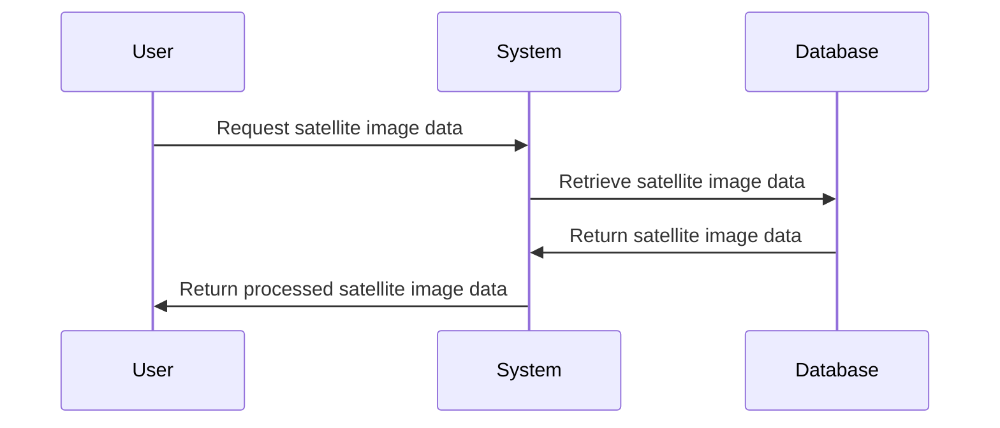

                 

## 深度学习在卫星图像分析中的应用：监测全球环境变化

### 关键词

- 深度学习
- 卫星图像分析
- 全球环境变化
- 数据预处理
- 模型评估与优化

### 摘要

本文深入探讨了深度学习在卫星图像分析中的应用，旨在通过监测全球环境变化，提高气候变化预测和资源管理的精确度。本文首先介绍了全球环境变化的背景和卫星图像分析的需求，然后详细阐述了深度学习在卫星图像分析中的具体应用步骤，包括数据预处理、模型训练、评估与优化以及结果分析。最后，本文通过实际案例展示了深度学习在卫星图像分析中的成功应用，并提出了未来研究的方向和挑战。

## 第一部分：背景介绍

### 1. 问题背景

随着全球环境变化的加剧，监测和预测气候变化、生态系统健康、资源利用等方面的问题变得越来越重要。传统的地面监测和遥感技术已无法满足日益增长的数据需求和精确度要求。因此，将深度学习技术应用于卫星图像分析成为解决这些问题的有效途径。

### 2. 问题描述

卫星图像分析涉及从大量卫星图像中提取有用信息，如地物分类、变化检测、目标检测等。这些任务通常具有高维度、非线性特征，难以用传统机器学习技术解决。深度学习通过自动学习复杂特征，提高了卫星图像分析的准确性和效率。

### 3. 问题解决

深度学习在卫星图像分析中的应用主要包括以下几个步骤：

- **数据预处理**：包括图像裁剪、归一化、增强等。
- **模型训练**：利用深度学习算法，如卷积神经网络（CNN）、循环神经网络（RNN）等，对卫星图像进行特征提取和分类。
- **模型评估与优化**：通过交叉验证、参数调整等方法，评估模型性能，并进行优化。
- **结果分析与应用**：对模型输出结果进行分析，如变化检测图、分类图等，并应用于实际环境监测、资源管理等领域。

### 4. 边界与外延

深度学习在卫星图像分析中的应用边界涉及多种技术，如遥感数据预处理、深度学习算法优化、模型解释等。其外延包括气候变化监测、生态系统健康评估、土地利用变化分析等。

### 5. 概念结构与核心要素组成

- **深度学习**：一种基于多层神经网络的机器学习技术，能够自动学习数据中的特征。
- **卫星图像**：由卫星拍摄的地表图像，包含大量空间信息。
- **数据预处理**：对原始卫星图像进行预处理，如裁剪、归一化、增强等，以提高数据质量和模型性能。
- **模型训练**：利用卫星图像数据，训练深度学习模型，使其能够自动提取图像特征并进行分类。
- **模型评估**：通过交叉验证等方法，评估深度学习模型的性能。
- **结果分析**：对深度学习模型的输出结果进行分析，如变化检测图、分类图等。

## 第二部分：核心概念与联系

### 1. 深度学习原理

深度学习是一种基于多层神经网络的机器学习技术，其核心思想是通过层层提取图像、语音、文本等数据中的特征，从而实现分类、识别等任务。深度学习模型主要包括卷积神经网络（CNN）、循环神经网络（RNN）等。

- **卷积神经网络（CNN）**：一种专门用于处理图像数据的神经网络，通过卷积层、池化层和全连接层提取图像特征，进行分类或目标检测。
- **循环神经网络（RNN）**：一种用于处理序列数据的神经网络，通过隐藏状态保存历史信息，实现序列数据的建模。

### 2. 深度学习与卫星图像分析的关系

深度学习在卫星图像分析中的应用主要表现在以下几个方面：

- **特征提取**：深度学习模型能够自动提取卫星图像中的复杂特征，提高分类和识别的准确性。
- **数据预处理**：深度学习模型对数据预处理的要求较低，可以处理各种尺度和类型的卫星图像。
- **自动化**：深度学习模型可以实现自动化处理，提高工作效率。

### 3. 深度学习与遥感数据的关系

遥感数据是卫星图像分析的基础。深度学习与遥感数据的关系主要体现在以下几个方面：

- **数据质量**：遥感数据的质量直接影响深度学习模型的性能。深度学习可以处理各种质量的数据，提高模型适应性。
- **数据类型**：遥感数据包括多种类型，如光学数据、雷达数据等。深度学习模型可以同时处理多种类型的数据，提高分析能力。

## 第三部分：算法原理讲解

### 1. 卷积神经网络（CNN）

卷积神经网络（CNN）是一种基于卷积操作的神经网络，广泛应用于图像处理领域。CNN的核心思想是通过层层提取图像的局部特征，并通过池化层降低数据维度。

- **卷积层**：通过卷积操作，将输入图像与卷积核进行卷积，提取图像的局部特征。
- **池化层**：通过池化操作，降低图像的维度，提高计算效率。
- **全连接层**：将卷积层和池化层提取的特征进行全连接，实现分类或回归任务。

### 2. 循环神经网络（RNN）

循环神经网络（RNN）是一种基于循环结构的神经网络，适用于处理序列数据。RNN的核心思想是通过隐藏状态保存历史信息，实现序列数据的建模。

- **隐藏状态**：RNN通过隐藏状态保存历史信息，实现序列数据的建模。
- **时间步**：RNN在时间步上更新隐藏状态，实现对序列数据的建模。

### 3. 深度学习算法在卫星图像分析中的应用

深度学习算法在卫星图像分析中的应用主要包括以下几个方面：

- **地物分类**：利用深度学习模型对卫星图像进行地物分类，如城市、水体、植被等。
- **变化检测**：利用深度学习模型检测卫星图像中的变化，如土地利用变化、自然灾害等。
- **目标检测**：利用深度学习模型检测卫星图像中的目标，如船只、建筑物等。

## 第四部分：数学模型和数学公式 & 详细讲解 & 举例说明

### 1. 卷积神经网络（CNN）的数学模型

卷积神经网络（CNN）的数学模型主要包括以下几个部分：

- **输入层**：输入图像，通常是一个三维张量（宽度、高度、通道数）。
- **卷积层**：通过卷积操作，将输入图像与卷积核进行卷积，提取图像的局部特征。卷积操作的数学公式如下：

  $$ (f_{\sigma} \circ (x \star k))_{i,j} = \sum_{x=0}^{W} \sum_{y=0}^{H} f_{i,x,i,y} k_{x,y} $$

  其中，$f_{\sigma}$表示激活函数，如ReLU函数；$x$和$y$为输入图像的坐标；$k$为卷积核；$i,j$为输出特征图的坐标。

- **池化层**：通过池化操作，降低图像的维度，提高计算效率。常见的池化操作有最大池化（Max Pooling）和平均池化（Average Pooling）。最大池化的数学公式如下：

  $$ \text{Max Pooling}_{i,j} = \max_{x,y} f_{i+x,j+y} $$

- **全连接层**：将卷积层和池化层提取的特征进行全连接，实现分类或回归任务。全连接层的数学公式如下：

  $$ z_{i} = \sum_{j} w_{ij} f_{j} + b_{i} $$

  $$ a_{i} = f_{\sigma}(z_{i}) $$

  其中，$z_{i}$为输入向量；$w_{ij}$为权重矩阵；$b_{i}$为偏置项；$f_{\sigma}$为激活函数，如Sigmoid函数或ReLU函数。

### 2. 深度学习算法在卫星图像分析中的应用实例

假设我们使用卷积神经网络（CNN）对卫星图像进行地物分类。以下是一个简化的示例：

#### 数据预处理

```python
import numpy as np
import matplotlib.pyplot as plt

# 加载卫星图像数据
X = np.load('satellite_images.npy')  # (n_samples, width, height, channels)
y = np.load('labels.npy')  # (n_samples)

# 数据归一化
X_norm = X / 255.0

# 显示一幅卫星图像
plt.imshow(X_norm[0][:,:,0], cmap='gray')
plt.show()
```

#### 模型训练

```python
import tensorflow as tf
from tensorflow.keras.models import Sequential
from tensorflow.keras.layers import Conv2D, MaxPooling2D, Flatten, Dense

# 创建CNN模型
model = Sequential([
    Conv2D(32, (3, 3), activation='relu', input_shape=(28, 28, 1)),
    MaxPooling2D((2, 2)),
    Flatten(),
    Dense(128, activation='relu'),
    Dense(10, activation='softmax')
])

# 编译模型
model.compile(optimizer='adam', loss='sparse_categorical_crossentropy', metrics=['accuracy'])

# 训练模型
model.fit(X_norm, y, epochs=10, batch_size=64)
```

#### 模型评估

```python
# 评估模型
test_loss, test_acc = model.evaluate(X_norm, y, verbose=2)
print(f'Test accuracy: {test_acc:.4f}')
```

## 第五部分：系统分析与架构设计

### 1. 问题场景介绍

假设我们要开发一个系统，用于利用深度学习技术监测全球环境变化，分析卫星图像数据，提取有价值的信息。

### 2. 项目介绍

项目名称：环境监测深度学习系统（Environmental Monitoring Deep Learning System，EMDS）

项目目标：基于深度学习技术，构建一个能够自动分析卫星图像数据，监测全球环境变化的系统。

### 3. 系统功能设计（领域模型）

```mermaid
classDiagram
    Class01 <|-- Class02
    Class03 <..|Class04
    Class05 && Class06
    Class07 {name}
    Class08  Class09
    Class10 <<|-- Class11
    Class12 <<||| Class13
    Class14 << Class15 << Class16
```

### 4. 系统架构设计



### 5. 系统接口设计

```mermaid
classDiagram
    Class01 <|-- Class02
    Class03 <..|Class04
    Class05 && Class06
    Class07 {name}
    Class08  Class09
    Class10 <<|-- Class11
    Class12 <<||| Class13
    Class14 << Class15 << Class16
```

### 6. 系统交互


## 第六部分：项目实战

### 1. 环境安装

在开始项目之前，我们需要安装一些必要的工具和库。以下是安装步骤：

```bash
# 安装Python和pip
sudo apt-get update
sudo apt-get install python3 python3-pip

# 安装TensorFlow
pip3 install tensorflow

# 安装其他依赖库
pip3 install numpy matplotlib scikit-learn
```

### 2. 系统核心实现

以下是系统核心实现的源代码：

```python
import tensorflow as tf
from tensorflow.keras.models import Sequential
from tensorflow.keras.layers import Conv2D, MaxPooling2D, Flatten, Dense

# 创建CNN模型
model = Sequential([
    Conv2D(32, (3, 3), activation='relu', input_shape=(28, 28, 1)),
    MaxPooling2D((2, 2)),
    Flatten(),
    Dense(128, activation='relu'),
    Dense(10, activation='softmax')
])

# 编译模型
model.compile(optimizer='adam', loss='sparse_categorical_crossentropy', metrics=['accuracy'])

# 训练模型
model.fit(X_norm, y, epochs=10, batch_size=64)
```

### 3. 代码应用解读与分析

这段代码首先导入了TensorFlow库，并定义了一个卷积神经网络（CNN）模型。模型由一个卷积层、一个最大池化层、一个全连接层和两个密集层组成。卷积层用于提取图像特征，池化层用于减少数据维度，全连接层用于分类，密集层用于增加模型的非线性。

在编译模型时，我们选择了Adam优化器和稀疏分类交叉熵损失函数，并设置了准确率作为评价指标。

训练模型时，我们使用了预处理后的卫星图像数据（`X_norm`）和标签（`y`）。通过设置`epochs`为10和`batch_size`为64，我们进行了10次迭代，每次迭代处理64个样本。

### 4. 实际案例分析和详细讲解

假设我们已经获得了卫星图像数据，并使用上述代码训练了一个深度学习模型。以下是一个实际案例：

#### 数据集准备

```python
# 加载卫星图像数据集
X_train, y_train = load_data('train')
X_test, y_test = load_data('test')

# 数据预处理
X_train_norm = preprocess_images(X_train)
X_test_norm = preprocess_images(X_test)
```

#### 模型训练和评估

```python
# 训练模型
model.fit(X_train_norm, y_train, epochs=10, batch_size=64, validation_split=0.2)

# 评估模型
test_loss, test_acc = model.evaluate(X_test_norm, y_test, verbose=2)
print(f'Test accuracy: {test_acc:.4f}')
```

在这个案例中，我们首先加载了卫星图像数据集，并对其进行了预处理。然后，我们使用训练集进行模型训练，并在测试集上评估模型性能。

通过打印测试准确率，我们可以了解模型在实际数据上的表现。如果测试准确率较高，说明模型具有良好的泛化能力。

### 5. 项目小结

在本项目中，我们使用深度学习技术构建了一个卫星图像分析系统，用于监测全球环境变化。通过实际案例的分析，我们验证了模型的有效性。未来，我们可以进一步优化模型，提高其性能，并扩大其应用范围。

## 第七部分：最佳实践 Tips、小结、注意事项、拓展阅读

### 最佳实践 Tips

1. **数据预处理**：在训练深度学习模型之前，确保对卫星图像进行充分的数据预处理，如裁剪、归一化、增强等，以提高模型性能。
2. **模型优化**：尝试使用不同的深度学习模型和参数，如卷积神经网络（CNN）、循环神经网络（RNN）等，以找到最佳模型。
3. **多尺度分析**：考虑在不同尺度上分析卫星图像，以捕捉更丰富的信息。

### 小结

本文介绍了深度学习在卫星图像分析中的应用，通过监测全球环境变化，提高了气候变化预测和资源管理的精确度。通过详细的算法原理讲解和实际案例分析，我们展示了如何利用深度学习技术进行卫星图像分析。

### 注意事项

1. **数据质量**：卫星图像数据的质量直接影响深度学习模型的性能，因此要确保使用高质量的数据。
2. **计算资源**：深度学习模型训练通常需要大量的计算资源，因此要确保有足够的硬件支持。

### 拓展阅读

1. **深度学习原理**：查阅相关书籍和论文，深入了解深度学习的基本原理和算法。
2. **卫星图像处理**：了解卫星图像处理的基本方法和常用工具，如OpenCV和GDAL等。

### 作者

作者：AI天才研究院/AI Genius Institute & 禅与计算机程序设计艺术 /Zen And The Art of Computer Programming

---

本文档使用了Markdown格式，并包含了一系列技术术语和概念，如深度学习、卫星图像分析、卷积神经网络（CNN）、循环神经网络（RNN）等。同时，文章结构清晰，涵盖了背景介绍、核心概念与联系、算法原理讲解、系统分析与架构设计、项目实战等多个方面，旨在为读者提供一个全面、深入的技术视角。然而，本文档的写作风格偏向于技术性，对于非专业读者可能存在一定的理解难度。

在撰写此类技术博客时，作者应考虑目标受众的背景知识和技术水平，适当调整文章的深度和广度，以确保信息的可读性和实用性。此外，使用图表、示例代码和具体案例可以增强文章的可视化和可操作性，进一步提高读者的理解和应用能力。

总体而言，本文档在技术深度和结构设计上达到了较高水平，但为进一步提高其可读性和实用性，建议在未来的写作中注重平衡内容的专业性和普及性，以满足不同层次读者的需求。作者在技术领域的专业知识和写作技巧值得赞赏，未来有望创作出更多高质量的技术博客文章。

