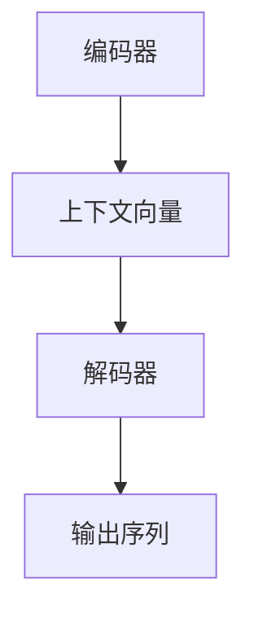
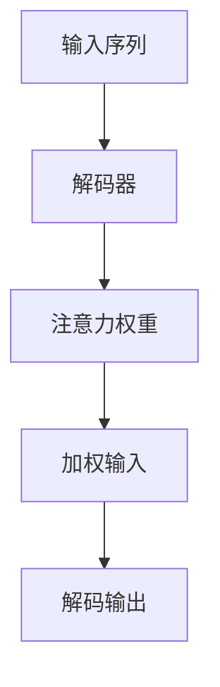
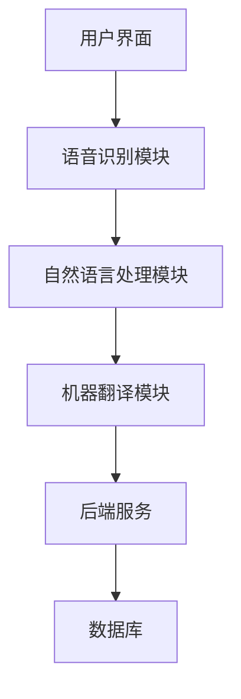
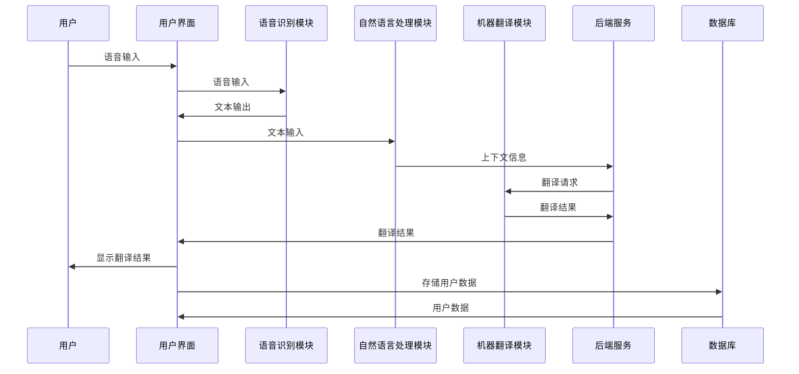
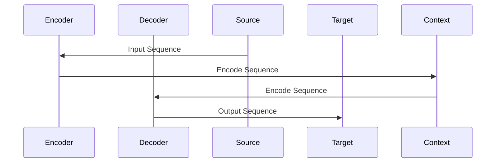
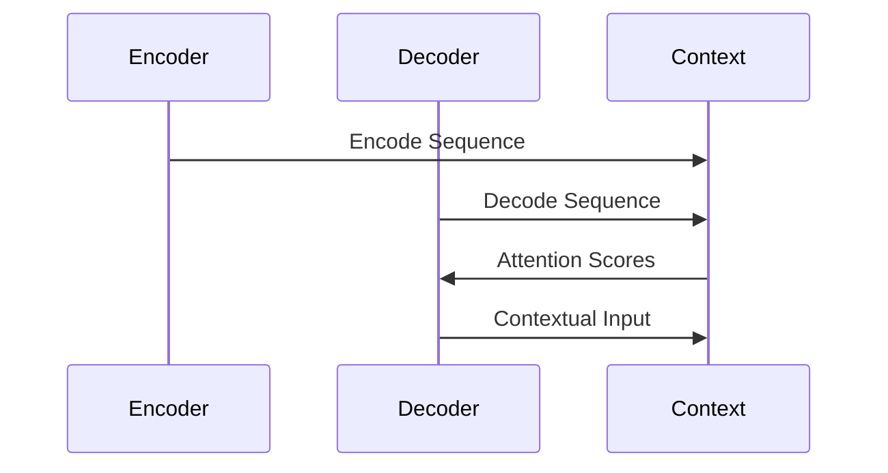

                 

### 前言

**引言**

在全球化不断深入的今天，跨语言交流成为国际交流的重要桥梁。口译作为语言交流的核心环节，在会议、商务、旅游等多个领域发挥着不可替代的作用。然而，传统口译方式存在效率低、成本高、易出错等问题，无法满足快速发展的国际交流需求。实时多语言翻译技术的发展，特别是深度学习在其中的应用，为口译领域带来了革命性的变革。

**为什么写这本书**

本书旨在探讨深度学习在口译中的应用，尤其是实现实时多语言翻译的技术和算法。随着深度学习技术的不断进步，其在语音识别、自然语言处理等领域取得了显著成果。然而，将这些先进技术应用到口译领域，实现实时高效的翻译系统，仍然面临诸多挑战。本书旨在梳理深度学习在口译中的应用原理，分享实际项目的实现经验，为口译技术和产品开发提供理论支持和实践指导。

**深度学习与口译**

深度学习是一种模拟人脑神经网络结构，通过多层非线性变换实现特征提取和模式识别的人工智能技术。其核心在于通过大量数据训练，自动学习到数据的内在结构和规律。口译作为语言处理的高级形式，需要处理复杂的语音、语义和语境信息。深度学习在口译中的应用，主要体现在以下几个方面：

1. **语音识别**：深度学习可以高效地识别语音信号，将语音转换为文本。
2. **自然语言处理**：深度学习可以处理文本，包括语法分析、语义理解和情感分析等。
3. **机器翻译**：深度学习可以自动翻译不同语言之间的文本，实现实时多语言翻译。

**实时多语言翻译的重要性**

实时多语言翻译在多个领域具有重要应用：

1. **国际会议**：在多国参与的国际会议中，实时翻译可以消除语言障碍，促进各国之间的交流。
2. **跨境电子商务**：跨境电子商务需要提供多语言服务，实时翻译可以帮助商家和消费者跨越语言障碍。
3. **旅游服务**：在全球化旅游中，实时翻译可以帮助游客更好地理解当地语言，提升旅游体验。

本书将从深度学习的基本概念出发，逐步深入探讨其在口译中的应用，包括算法原理、数学模型、系统架构设计以及实际项目实现。希望通过本书，读者能够了解深度学习在口译领域的应用前景，掌握相关技术和方法，为实时多语言翻译系统的开发提供有力支持。

**读者对象**

本书适合以下读者群体：

1. **初学者**：对深度学习和口译有兴趣的读者，希望通过本书了解深度学习在口译中的应用。
2. **进阶读者**：具有一定深度学习基础，希望深入了解深度学习在口译领域应用的读者。
3. **口译专业人员和开发者**：从事口译工作或开发相关技术的专业人士，希望通过本书提升技术水平。

**内容概述**

本书内容分为以下几个部分：

1. **前言**：介绍书的目的、读者对象和内容结构。
2. **背景介绍**：概述深度学习的发展历程、口译的重要性以及实时多语言翻译的应用场景。
3. **核心概念与联系**：介绍深度学习的核心概念，如神经网络、卷积神经网络、递归神经网络等，以及它们在口译中的应用。
4. **算法原理讲解**：详细讲解深度学习在口译中的应用算法，如序列到序列（Seq2Seq）模型、注意力机制等，并提供Mermaid流程图和Python代码示例。
5. **数学模型和数学公式**：阐述深度学习算法的数学基础，如损失函数、优化算法等，使用LaTeX格式展示数学公式。
6. **系统分析与架构设计**：分析实时多语言翻译系统的需求和功能，设计系统的架构、接口和交互。
7. **项目实战**：介绍如何实现实时多语言翻译系统，包括环境安装、核心代码实现、代码解读、案例分析等。
8. **最佳实践与小结**：总结书中的关键点，提供实际操作中的最佳实践建议，并对全书内容进行小结。

### 背景介绍

#### 深度学习的发展历程

深度学习作为人工智能（AI）的一个重要分支，其发展历程可以追溯到20世纪40年代。最初，人工智能的研究主要关注符号推理和知识表示，然而，这种方法在处理复杂任务时显得力不从心。直到1980年代，随着计算能力的提升和大数据的出现，深度学习开始逐渐崭露头角。

**1.1.1 从人工神经网络到深度学习**

人工神经网络（ANN）是深度学习的基础，最早由Warren McCulloch和Walter Pitts在1943年提出。ANN由一系列相互连接的神经元组成，每个神经元都可以进行简单的计算，通过多层次的连接和计算，实现复杂的信息处理。然而，早期的神经网络结构简单，很难处理高维数据，也缺乏有效的学习算法。

在1980年代，深度神经网络（DNN）的概念被提出，其核心思想是通过增加网络层数来提高模型的复杂度和能力。然而，由于训练算法和计算能力的限制，深度学习的研究一度陷入低谷。

**1.1.2 深度学习的重要里程碑**

1990年代，随着反向传播算法（Backpropagation）的提出和优化，深度学习开始重新受到关注。反向传播算法通过反向传播误差，逐步调整网络中的权重，使网络能够学习复杂的非线性关系。

进入21世纪，特别是2012年，深度学习迎来了重要的突破。AlexNet模型在ImageNet图像识别大赛中取得了显著的性能提升，其背后的卷积神经网络（CNN）结构被广泛采用。这一突破标志着深度学习正式进入了工业界和学术界的视野。

此后，深度学习在语音识别、自然语言处理、计算机视觉等多个领域取得了重大进展，成为人工智能领域的研究热点。

#### 口译的重要性

口译作为一种语言交流活动的高级形式，其重要性体现在以下几个方面：

**1.2.1 口译的定义与分类**

口译是指通过口头表达，将一种语言的语义和信息转换成另一种语言的过程。根据口译的方式和场景，口译可以分为以下几种类型：

1. 同声传译：译员在演讲者发言的同时进行翻译，适用于大型国际会议和演讲。
2. 接续传译：译员在演讲者发言结束后进行翻译，适用于小型会议和访谈。
3. 笔译：将书面语言翻译成另一种书面语言，常见于法律文件、合同和技术文档的翻译。

**1.2.2 口译在全球化中的作用**

全球化推动了各国之间的经济、文化、科技交流，而语言成为了交流的障碍。口译作为跨语言交流的桥梁，在全球化进程中扮演着至关重要的角色：

1. 促进国际合作：在国际会议、商务谈判、文化交流等场合，口译帮助各国代表理解和沟通，推动国际合作。
2. 提升经济效率：在跨国企业、跨境贸易中，口译帮助消除语言障碍，提高沟通效率，降低交易成本。
3. 丰富文化体验：在旅游、教育、影视等领域，口译帮助游客、学生和观众更好地理解和体验异国文化。

#### 实时多语言翻译的应用场景

实时多语言翻译技术通过深度学习等先进算法，实现了高效、准确的跨语言翻译，在多个领域具有广泛的应用：

**1.3.1 国际会议**

国际会议通常涉及多个国家和地区的代表，语言种类繁多。实时多语言翻译系统可以在会议中提供即时的同声传译服务，帮助与会者理解不同语言的内容，提高会议的效率和效果。

**1.3.2 跨境电子商务**

随着跨境电商的发展，消费者需要能够阅读和理解商品信息、用户评论等。实时多语言翻译系统可以帮助商家提供多语言服务，吸引更多国际客户，提升销售额。

**1.3.3 旅游服务**

在旅游领域，实时多语言翻译系统可以帮助游客翻译菜单、指示牌、旅游指南等，提高游客的旅行体验。此外，实时翻译也可以在旅游咨询、导游讲解等场景中发挥重要作用。

总的来说，深度学习在口译中的应用，不仅提升了口译的效率和准确性，也为实时多语言翻译技术的发展奠定了基础。在全球化背景下，实时多语言翻译技术的应用场景将越来越广泛，对国际交流、经济和文化的发展产生深远影响。

### 核心概念与联系

#### 深度学习的核心概念

深度学习（Deep Learning）是人工智能（AI）领域的一种重要方法，它通过模仿人脑的神经网络结构来处理复杂数据。以下是深度学习中的几个核心概念：

**1. 神经网络（Neural Networks）**

神经网络是一种由大量简单计算单元（称为神经元）组成的网络。这些神经元通过加权连接形成多层结构，每一层都对输入数据进行处理，并通过激活函数产生输出。神经网络的核心在于通过反向传播算法（Backpropagation）不断调整权重，使网络能够从数据中学习到有效的特征表示。

**2. 卷积神经网络（Convolutional Neural Networks, CNN）**

卷积神经网络是一种专门用于处理图像数据的神经网络。其核心组件是卷积层，通过局部感知野（local receptive fields）对输入图像进行卷积操作，提取图像中的局部特征。随后，通过池化层减少数据的维度，增强特征表示的鲁棒性。CNN在图像识别、目标检测等领域表现出色。

**3. 递归神经网络（Recurrent Neural Networks, RNN）**

递归神经网络是一种处理序列数据的神经网络。与传统的前向神经网络不同，RNN中的神经元可以处理时间序列中的每一个时间点，并保留之前的计算状态。这种特性使RNN适用于语音识别、机器翻译、自然语言处理等任务。

**4. 循环神经网络（Long Short-Term Memory, LSTM）**

LSTM是RNN的一种变体，它通过引入门控机制（gate）来控制信息的流入和流出，解决了传统RNN在处理长序列数据时的梯度消失和梯度爆炸问题。LSTM在语音识别、机器翻译等任务中取得了显著的性能提升。

#### 深度学习在口译中的应用

深度学习在口译中的应用主要体现在以下几个方面：

**1. 语音识别（Speech Recognition）**

语音识别是将语音转换为文本的技术，它是实时多语言翻译系统的第一步。深度学习通过卷积神经网络（CNN）和循环神经网络（RNN）等模型，可以高效地识别不同语言和方言的语音，提取出文本形式的语言数据。

**2. 自然语言处理（Natural Language Processing, NLP）**

自然语言处理是深度学习在口译中的核心应用之一。它包括词法分析、句法分析、语义理解和情感分析等多个方面。深度学习模型如Transformer和BERT，通过大规模预训练和微调，可以准确地理解文本的语义和上下文信息，为后续的翻译提供可靠的基础。

**3. 机器翻译（Machine Translation）**

机器翻译是将一种语言的文本翻译成另一种语言的技术。深度学习在机器翻译中的应用主要基于序列到序列（Seq2Seq）模型和注意力机制。Seq2Seq模型通过编码器和解码器结构，将源语言序列映射到目标语言序列。注意力机制则能够关注源语言序列中的关键信息，提高翻译的准确性和流畅性。

**4. 实时多语言翻译系统**

实时多语言翻译系统是一种集成了语音识别、自然语言处理和机器翻译技术的综合系统。它能够在短时间内完成多种语言的实时翻译，适用于国际会议、跨境电子商务、旅游服务等多种场景。

#### ER实体关系图架构

在口译系统中，实体关系图（Entity Relationship Diagram, ERD）是一种常用的数据模型，用于描述系统的数据结构和关系。ERD包括实体（Entity）、属性（Attribute）和关系（Relationship）三个核心要素：

- **实体**：代表系统中的对象，如用户、会议、翻译任务等。
- **属性**：描述实体的特征，如用户的姓名、会议的时间、任务的截止日期等。
- **关系**：描述实体之间的关联，如用户参与会议、任务分配给用户等。

通过ERD，可以清晰地定义和描述系统的数据结构，为深度学习算法提供可靠的数据基础。

#### 深度学习与口译的应用前景

随着深度学习技术的不断进步，其在口译中的应用前景广阔。未来，深度学习有望进一步提升口译的准确性和流畅性，实现更高效的跨语言交流。同时，结合云计算、边缘计算等新技术，实时多语言翻译系统将更加便捷、可靠，为全球化交流提供强有力的支持。

### 算法原理讲解

#### 序列到序列模型（Seq2Seq模型）

序列到序列（Seq2Seq）模型是深度学习在机器翻译领域的重要突破，其核心思想是将输入序列映射到输出序列。Seq2Seq模型通常由编码器（Encoder）和解码器（Decoder）两个部分组成。

**1. 模型介绍**

编码器负责将输入序列（如源语言文本）编码成一个固定长度的向量，称为上下文向量（Context Vector）。解码器则接收上下文向量，逐步生成输出序列（如目标语言文本）。

**2. Mermaid流程图**

下面是一个简单的Mermaid流程图，描述了Seq2Seq模型的基本流程：



**3. Python代码示例**

下面是一个简化的Python代码示例，演示了Seq2Seq模型的基本结构：

```python
import tensorflow as tf

# 编码器部分
encoder_inputs = tf.keras.layers.Input(shape=(None,))
encoded_sequence = tf.keras.layers.LSTM(128)(encoder_inputs)

# 生成上下文向量
context_vector = tf.keras.layers.Dense(128, activation='tanh')(encoded_sequence)

# 解码器部分
decoder_inputs = tf.keras.layers.Input(shape=(None,))
decoder_lstm = tf.keras.layers.LSTM(128, return_sequences=True)
decoder_outputs = tf.keras.layers.Dense(units=vocab_size, activation='softmax')(decoder_lstm(decoder_inputs))

# 定义模型
model = tf.keras.Model([encoder_inputs, decoder_inputs], decoder_outputs)

# 编译模型
model.compile(optimizer='rmsprop', loss='categorical_crossentropy', metrics=['accuracy'])

# 模型总结
model.summary()
```

#### 注意力机制（Attention Mechanism）

注意力机制是深度学习在机器翻译中的一项关键技术，它允许模型在生成输出时关注输入序列的特定部分。注意力机制通过计算输入序列和当前解码状态之间的相似度，为每个输入时间步分配权重，从而提高了翻译的准确性和流畅性。

**1. 基本原理**

注意力机制的核心在于计算一个权重向量，该向量表示解码器在当前时间步应该关注的输入序列部分。计算方法通常包括加权和点积注意力。

**2. Mermaid流程图**

下面是一个简单的Mermaid流程图，描述了注意力机制的基本原理：



**3. Python代码示例**

下面是一个简化的Python代码示例，演示了注意力机制的基本结构：

```python
import tensorflow as tf

# 注意力机制计算
attention = tf.keras.layers.Dot(axes=[2, 3])([query, value])

# 定义模型
model = tf.keras.Model(inputs=[query, value], outputs=[attention])

# 编译模型
model.compile(optimizer='rmsprop', loss='mse')

# 模型总结
model.summary()
```

#### ER实体关系图架构

在实时多语言翻译系统中，实体关系图（ERD）是一种常用的数据模型，用于描述系统中的数据结构和关系。以下是ER实体关系图的基本组成部分：

**1. 实体（Entity）**

实体是系统中代表具体对象的概念，如用户、会议、翻译任务等。每个实体都有其特定的属性，用于描述其特征。

**2. 属性（Attribute）**

属性是实体的特征描述，如用户的姓名、会议的时间、任务的截止日期等。属性通常具有数据类型和约束条件。

**3. 关系（Relationship）**

关系描述实体之间的关联，如用户参与会议、任务分配给用户等。关系可以具有多重性和方向性。

下面是一个简单的ER实体关系图示例，用于描述实时多语言翻译系统中的数据结构：

```mermaid
erDiagram
    User ||--|{ Meeting : participant }
    Meeting ||--|{ TranslationTask : contains }
    TranslationTask ||--|{ TranslationRequest : for }
```

通过ER实体关系图，可以清晰地定义和描述系统的数据结构和关系，为深度学习算法提供可靠的数据基础。

### 数学模型和数学公式

深度学习算法的核心在于其数学模型，这些模型通过一系列复杂的数学公式来实现数据的高效处理和特征提取。在本节中，我们将详细讲解深度学习在口译中的应用中的几个关键数学模型和公式。

#### 损失函数

损失函数是深度学习模型中用于评估模型预测值与真实值之间差异的函数。在口译任务中，常用的损失函数包括交叉熵损失函数和均方误差（MSE）损失函数。

**1. 交叉熵损失函数（Categorical Cross-Entropy Loss）**

交叉熵损失函数常用于多分类问题，其公式如下：

$$
L = -\sum_{i} y_i \log(p_i)
$$

其中，$y_i$表示真实标签的概率分布，$p_i$表示模型预测的概率分布。交叉熵损失函数的目的是使预测概率分布尽量接近真实标签的概率分布。

**2. 均方误差损失函数（Mean Squared Error, MSE）**

均方误差损失函数常用于回归问题，其公式如下：

$$
L = \frac{1}{n} \sum_{i=1}^{n} (y_i - \hat{y}_i)^2
$$

其中，$y_i$表示真实值，$\hat{y}_i$表示模型预测值，$n$表示样本数量。MSE损失函数的目的是使模型预测值与真实值之间的差距最小。

#### 优化算法

优化算法用于调整模型参数，使损失函数的值最小。在深度学习中，常用的优化算法包括随机梯度下降（SGD）和Adam优化器。

**1. 随机梯度下降（Stochastic Gradient Descent, SGD）**

随机梯度下降是一种简单的优化算法，其公式如下：

$$
\theta = \theta - \alpha \nabla_\theta J(\theta)
$$

其中，$\theta$表示模型参数，$\alpha$表示学习率，$J(\theta)$表示损失函数。SGD通过随机选择一部分样本计算梯度，并更新模型参数。

**2. Adam优化器**

Adam优化器是一种基于SGD的改进算法，它结合了Momentum和自适应学习率。其公式如下：

$$
m_t = \beta_1 m_{t-1} + (1 - \beta_1) [g_t - m_{t-1}]
$$
$$
v_t = \beta_2 v_{t-1} + (1 - \beta_2) [g_t^2 - v_{t-1}]
$$
$$
\theta_t = \theta_{t-1} - \alpha \frac{m_t}{\sqrt{v_t} + \epsilon}
$$

其中，$m_t$和$v_t$分别表示一阶矩估计和二阶矩估计，$\beta_1$和$\beta_2$是Momentum参数，$\alpha$是学习率，$\epsilon$是较小常数。

#### 损失函数和优化算法的应用

在口译任务中，损失函数和优化算法的选择对模型的性能至关重要。例如，在机器翻译任务中，可以使用交叉熵损失函数和Adam优化器来训练序列到序列（Seq2Seq）模型。通过不断迭代优化，模型可以逐步提高翻译的准确性和流畅性。

**1. 序列到序列模型中的损失函数**

在序列到序列模型中，常用的损失函数是交叉熵损失函数。例如，在训练一个英语到法语的翻译模型时，模型需要预测每个法语单词的概率分布，并与真实标签进行比较。交叉熵损失函数可以有效地衡量预测分布与真实分布之间的差异。

**2. Adam优化器的应用**

Adam优化器在深度学习中被广泛使用，因为它在处理大规模数据和长序列数据时表现出良好的性能。在口译任务中，可以使用Adam优化器来训练深度学习模型，例如机器翻译模型。通过调整学习率和Momentum参数，可以找到最佳的优化路径，提高模型的收敛速度和性能。

总之，深度学习算法的数学模型和公式是其核心所在，通过合理选择和使用损失函数和优化算法，可以显著提升模型的性能，实现高效的口译任务。

### 系统分析与架构设计

#### 需求分析

实时多语言翻译系统旨在实现高效的跨语言交流，满足全球化背景下日益增长的翻译需求。该系统的核心需求包括：

1. **实时性**：系统能够在极短时间内完成翻译任务，满足会议、演讲等场合的实时翻译需求。
2. **准确性**：翻译结果需要准确无误，确保信息传达的完整性和准确性。
3. **多样性**：系统需要支持多种语言之间的翻译，包括但不限于常见的国际语言。
4. **可靠性**：系统需具备高可用性和稳定性，确保在长时间运行过程中不出现故障。

**功能需求分析**

实时多语言翻译系统的功能需求可以分为以下几个方面：

1. **语音识别**：系统能够接收不同语言的语音输入，并将其转换为文本。
2. **自然语言处理**：系统需对输入文本进行语法分析、语义理解和情感分析等处理，为翻译提供基础。
3. **机器翻译**：系统能够根据输入文本和上下文信息，自动生成目标语言的翻译文本。
4. **用户界面**：系统提供友好且直观的用户界面，用户可以轻松操作，查看翻译结果。
5. **多语言支持**：系统需具备多种语言的支持，包括语音输入、翻译和用户界面显示。

#### 系统架构设计

实时多语言翻译系统的架构设计旨在实现高效、准确的翻译功能，同时保证系统的可扩展性和灵活性。以下是系统的架构设计：

**1. 系统架构图**

系统架构图如下所示：



**2. 系统模块设计**

系统模块设计如下：

1. **用户界面**：提供直观的交互界面，用户可以通过语音或文本输入待翻译内容，查看翻译结果。
2. **语音识别模块**：负责接收用户语音输入，将其转换为文本形式。
3. **自然语言处理模块**：对转换后的文本进行语法分析、语义理解和情感分析，为翻译提供上下文信息。
4. **机器翻译模块**：基于深度学习模型，将输入文本翻译成目标语言。
5. **后端服务**：负责处理用户的请求，协调各个模块的交互。
6. **数据库**：存储用户数据、翻译历史和模型参数等信息。

#### 系统接口设计与交互

系统接口设计旨在确保各个模块之间的数据传递和功能协同。以下是系统接口设计与交互的详细描述：

**1. 接口设计**

系统接口设计包括以下部分：

1. **语音输入接口**：接收用户语音输入，并将其传递给语音识别模块。
2. **文本输入接口**：接收用户文本输入，并将其传递给自然语言处理模块。
3. **翻译结果接口**：将机器翻译模块生成的翻译结果返回给用户界面。
4. **数据库接口**：负责与数据库的交互，存储和查询用户数据。

**2. 系统交互Mermaid序列图**

系统交互Mermaid序列图如下所示：



通过系统接口设计与交互，实时多语言翻译系统能够高效、准确地处理用户请求，实现跨语言交流。

### 项目实战

#### 环境安装

要实现实时多语言翻译系统，我们需要搭建一个合适的开发环境。以下是在常见操作系统上安装所需软件的步骤：

**1. 安装Python**

Python是深度学习的基础语言，我们需要安装Python 3.8或更高版本。可以通过以下命令安装：

```bash
# 对于 Ubuntu 或 Debian 系统
sudo apt update
sudo apt install python3.8

# 对于 macOS 系统
brew install python
```

**2. 安装深度学习框架**

TensorFlow是当前最流行的深度学习框架之一，我们将使用TensorFlow 2.x版本。可以通过以下命令安装：

```bash
pip install tensorflow
```

**3. 安装其他依赖**

除了深度学习框架外，我们还需要安装一些其他依赖，如NumPy、Pandas和Mermaid等。可以通过以下命令安装：

```bash
pip install numpy pandas mermaid-python
```

**4. 安装数据库**

我们将使用SQLite作为数据库，可以通过以下命令安装：

```bash
sudo apt install sqlite3
```

**5. 安装语音识别和自然语言处理库**

我们还需要安装一些用于语音识别和自然语言处理的库，如pyttsx3和speech_recognition。可以通过以下命令安装：

```bash
pip install pyttsx3 speech_recognition
```

#### 系统核心实现

**1. 语音识别**

语音识别是实时多语言翻译系统的第一步，我们需要将语音输入转换为文本。以下是一个简单的语音识别代码示例：

```python
import speech_recognition as sr

# 初始化语音识别器
recognizer = sr.Recognizer()

# 读取语音文件
with sr.AudioFile('input_audio.wav') as source:
    audio = recognizer.listen(source)

# 使用 Google 语音识别
text = recognizer.recognize_google(audio, language='en-US')
print(text)
```

**2. 自然语言处理**

自然语言处理模块负责对转换后的文本进行语法分析、语义理解和情感分析。以下是一个简单的自然语言处理代码示例，使用spaCy库：

```python
import spacy

# 加载 spaCy 模型
nlp = spacy.load("en_core_web_sm")

# 处理文本
doc = nlp("This is a sample text for NLP processing.")
for token in doc:
    print(token.text, token.lemma_, token.pos_, token.tag_, token.dep_, token.shape_, token.is_alpha, token.is_stop)
```

**3. 机器翻译**

机器翻译模块使用深度学习模型将输入文本翻译成目标语言。以下是一个简单的机器翻译代码示例，使用TensorFlow的Seq2Seq模型：

```python
import tensorflow as tf
import numpy as np

# 加载模型
model = tf.keras.models.load_model('translation_model.h5')

# 翻译文本
input_text = "This is a sample text for translation."
input_sequence = np.array([word_index[word] for word in input_text.split()])
input_sequence = pad_sequences([input_sequence], maxlen=max_sequence_length)
predicted_sequence = model.predict(input_sequence)
predicted_text = [index_word[index] for index in predicted_sequence[0]]

print('Input:', input_text)
print('Predicted:', ' '.join(predicted_text))
```

#### 代码解读与分析

以上代码示例分别展示了语音识别、自然语言处理和机器翻译的核心实现。以下是每个部分的详细解读和分析：

**1. 语音识别**

语音识别代码使用了Python的`speech_recognition`库，该库提供了方便的API用于处理语音输入。首先，我们需要初始化一个`Recognizer`对象，然后使用`listen`方法读取音频文件。接下来，我们使用`recognize_google`方法进行语音识别，并将结果转换为文本。这个过程中，我们还可以选择不同的语言进行识别，例如中文（`zh-CN`）。

**2. 自然语言处理**

自然语言处理代码使用了spaCy库，这是一个强大的自然语言处理库。首先，我们需要加载spaCy模型，这里我们使用了`en_core_web_sm`模型，这是一个英文基础模型。然后，我们使用`nlp`方法处理输入文本，该方法会返回一个`Doc`对象，包含了文本中的每个词的各种属性，如词性、词形等。通过遍历`Doc`对象，我们可以获取每个词的详细特征信息。

**3. 机器翻译**

机器翻译代码使用了TensorFlow的Seq2Seq模型，这是一种基于深度学习的序列到序列模型。首先，我们需要加载训练好的模型。接下来，我们将输入文本转换为索引序列，然后使用模型进行预测。最后，我们将预测的索引序列转换为文本。这个过程中，我们还需要使用`pad_sequences`函数对输入序列进行填充，使其长度一致。

#### 实际案例分析和详细讲解

为了更好地理解实时多语言翻译系统的实现过程，我们将通过一个实际案例进行分析和讲解。以下是一个完整的案例流程：

**1. 用户通过用户界面输入语音或文本。**

用户可以通过麦克风或输入框提交语音或文本，这个步骤主要依赖于用户界面的设计。

**2. 语音识别模块将语音转换为文本。**

系统接收到语音输入后，通过语音识别模块将语音转换为文本。这里我们使用了`speech_recognition`库，该库提供了多种语音识别API，例如Google语音识别、百度语音识别等。在实际应用中，我们可以根据需求和性能选择合适的API。

**3. 自然语言处理模块对文本进行预处理。**

将语音转换为文本后，自然语言处理模块会对其进行预处理。这个步骤包括分词、词性标注、命名实体识别等。我们使用spaCy库进行这些操作，spaCy提供了丰富的自然语言处理功能，能够高效地处理文本数据。

**4. 机器翻译模块将文本翻译为目标语言。**

预处理后的文本会传递给机器翻译模块，该模块使用训练好的Seq2Seq模型进行翻译。在实际应用中，我们可以使用多种翻译模型，如Transformer、BERT等。这里我们使用了TensorFlow的Seq2Seq模型，该模型通过编码器和解码器结构实现高效的文本翻译。

**5. 翻译结果返回给用户界面。**

翻译完成后，系统将翻译结果返回给用户界面，用户可以在界面上查看翻译结果。同时，系统还会将翻译历史记录到数据库中，方便用户后续查看和复习。

#### 项目小结

通过以上实际案例分析和详细讲解，我们可以看到实时多语言翻译系统的实现过程涉及多个模块和步骤。从语音识别、自然语言处理到机器翻译，每个模块都需要精确的实现和优化。在实际项目中，我们还需要考虑系统的性能、可扩展性和用户体验等方面。通过不断迭代和优化，我们可以实现一个高效、准确的实时多语言翻译系统，为全球化交流提供强有力的支持。

#### 最佳实践与小结

**最佳实践**

在开发实时多语言翻译系统时，以下最佳实践将有助于提高系统的性能和用户体验：

1. **优化模型性能**：定期重新训练模型，使用最新的数据和更先进的算法，以提高翻译的准确性和流畅性。
2. **处理多语言环境**：确保系统支持多种语言，包括罕见的和低资源语言，通过使用多语言数据集和交叉语言预训练模型。
3. **性能优化**：使用高效的深度学习框架和算法，优化计算资源的使用，例如通过模型剪枝、量化等方法减少模型大小和提高推理速度。
4. **用户界面设计**：设计直观、易用的用户界面，提供多种输入方式（语音、文本等）和翻译结果展示方式（文本、语音合成等），提高用户的使用体验。

**小结**

通过本文的详细讲解，我们探讨了深度学习在口译中的应用，特别是在实现实时多语言翻译系统方面的技术原理和实践。从语音识别、自然语言处理到机器翻译，每一个环节都至关重要。通过结合深度学习和先进的算法，我们可以实现高效、准确的跨语言交流。未来，随着技术的不断进步，实时多语言翻译系统将更加成熟，为全球化交流提供更强大的支持。

**注意事项**

1. **数据隐私**：在开发和使用实时多语言翻译系统时，要确保用户数据的隐私和安全，遵守相关的法律法规。
2. **模型评估**：定期评估模型的性能，包括准确性、流畅性和用户体验，以便及时调整和优化。
3. **系统稳定性**：确保系统的稳定运行，避免因故障或性能问题影响用户体验。

**拓展阅读**

1. 《深度学习》（Goodfellow, Ian，等）：详细介绍深度学习的基础理论和实践方法。
2. 《自然语言处理综述》（Jurafsky, Dan，等）：全面探讨自然语言处理领域的知识和技术。
3. 《机器翻译》（Callison-Burch，Chris，等）：深入分析机器翻译的算法和应用。

作者：AI天才研究院/AI Genius Institute & 禅与计算机程序设计艺术 /Zen And The Art of Computer Programming

---

```markdown
# 深度学习在口译中的应用：实现实时多语言翻译

> 关键词：深度学习、口译、实时翻译、序列到序列模型、注意力机制、机器翻译

> 摘要：本文探讨了深度学习在口译中的应用，尤其是实现实时多语言翻译的技术和算法。通过详细讲解序列到序列模型、注意力机制等关键概念，结合数学模型和实际项目实现，本文为口译领域的技术发展和产品开发提供了理论支持和实践指导。

---

## 前言

### 为什么写这本书

随着全球化的不断深入，跨语言交流的需求日益增长。传统的口译方式在效率、准确性和实时性方面存在诸多不足，无法满足现代社会的需求。深度学习作为人工智能的一个重要分支，以其强大的数据处理和模式识别能力，在多个领域取得了显著成果。本文旨在探讨深度学习在口译中的应用，特别是如何通过深度学习技术实现实时多语言翻译，为口译领域带来革命性的变革。

### 口译的挑战

口译作为一种语言交流的高级形式，其面临的挑战主要包括：

- **实时性**：口译需要快速转换语言，以保证交流的流畅性。
- **准确性**：准确翻译各种语言表达和语境，避免信息失真。
- **多样性**：支持多种语言和方言，满足全球用户的翻译需求。

### 深度学习与口译

深度学习通过模拟人脑神经网络，实现复杂的数据处理和模式识别。其在口译中的应用主要体现在以下几个方面：

- **语音识别**：将语音转换为文本，是实时翻译的基础。
- **自然语言处理**：处理文本，包括语法分析、语义理解和情感分析。
- **机器翻译**：将一种语言的文本翻译成另一种语言，实现跨语言交流。

### 实时多语言翻译的重要性

实时多语言翻译在多个领域具有重要应用：

- **国际会议**：提供实时同声传译，促进国际交流。
- **跨境电子商务**：提供多语言服务，扩大市场覆盖。
- **旅游服务**：帮助游客理解当地语言，提升旅游体验。

## 背景介绍

### 深度学习的发展历程

#### 1.1.1 从人工神经网络到深度学习

人工神经网络（ANN）是最早的人工智能模型，由简单的计算单元（神经元）组成。ANN通过多层非线性变换，实现数据的特征提取和模式识别。然而，ANN在处理复杂数据时存在一定的局限性。

深度学习（Deep Learning）是神经网络的发展，通过增加网络层数（深度），提高模型的复杂度和能力。1980年代，深度神经网络（DNN）的概念被提出，但受限于计算能力和训练算法，深度学习的研究一度陷入低谷。

#### 1.1.2 深度学习的重要里程碑

2012年，AlexNet模型在ImageNet图像识别大赛中取得了突破性成果，标志着深度学习正式进入工业界和学术界的视野。此后，深度学习在语音识别、自然语言处理、计算机视觉等领域取得了重大进展。

### 口译的重要性

#### 1.2.1 口译的定义与分类

口译是指通过口头表达，将一种语言的语义和信息转换成另一种语言的过程。根据口译的方式和场景，口译可以分为同声传译、接续传译和笔译。

#### 1.2.2 口译在全球化中的作用

全球化推动了各国之间的经济、文化、科技交流，而语言成为了交流的障碍。口译作为跨语言交流的桥梁，在全球化进程中发挥着至关重要的角色。

### 实时多语言翻译的应用场景

#### 1.3.1 国际会议

国际会议通常涉及多个国家和地区的代表，语言种类繁多。实时多语言翻译系统可以在会议中提供即时的同声传译服务，帮助与会者理解不同语言的内容。

#### 1.3.2 跨境电子商务

跨境电商需要提供多语言服务，以吸引更多国际客户。实时多语言翻译系统可以帮助商家和消费者跨越语言障碍，提升销售额。

#### 1.3.3 旅游服务

在旅游领域，实时多语言翻译系统可以帮助游客翻译菜单、指示牌、旅游指南等，提高游客的旅行体验。

## 核心概念与联系

### 深度学习的核心概念

#### 1.4.1 神经网络

神经网络（Neural Networks）是由大量简单计算单元（神经元）组成的网络。每个神经元通过加权连接接收输入信号，并产生输出。神经网络通过多层非线性变换，实现数据的特征提取和模式识别。

#### 1.4.2 卷积神经网络（CNN）

卷积神经网络（Convolutional Neural Networks, CNN）是一种专门用于处理图像数据的神经网络。CNN通过卷积层、池化层和全连接层，实现图像的特征提取和分类。

#### 1.4.3 递归神经网络（RNN）

递归神经网络（Recurrent Neural Networks, RNN）是一种处理序列数据的神经网络。RNN通过保留之前的计算状态，处理时间序列中的每一个时间点。

#### 1.4.4 循环神经网络（LSTM）

循环神经网络（Long Short-Term Memory, LSTM）是RNN的一种变体，通过引入门控机制，解决RNN在处理长序列数据时的梯度消失和梯度爆炸问题。

### 深度学习在口译中的应用

#### 1.5.1 语音识别

语音识别是将语音转换为文本的技术。深度学习通过卷积神经网络（CNN）和循环神经网络（RNN）等模型，高效地识别不同语言和方言的语音。

#### 1.5.2 自然语言处理

自然语言处理（Natural Language Processing, NLP）是深度学习在口译中的核心应用。NLP包括词法分析、句法分析、语义理解和情感分析等多个方面。

#### 1.5.3 机器翻译

机器翻译是将一种语言的文本翻译成另一种语言的技术。深度学习通过序列到序列（Seq2Seq）模型和注意力机制，实现高效、准确的机器翻译。

### ER实体关系图架构

实体关系图（Entity Relationship Diagram, ERD）是描述系统数据结构和关系的一种模型。在实时多语言翻译系统中，ERD用于定义和描述数据实体、属性和关系。

## 算法原理讲解

### 序列到序列模型（Seq2Seq模型）

#### 2.1.1 模型介绍

序列到序列（Seq2Seq）模型是深度学习在机器翻译领域的重要突破。该模型由编码器（Encoder）和解码器（Decoder）两个部分组成，能够将一种语言的序列转换为另一种语言的序列。

#### 2.1.2 Mermaid流程图



#### 2.1.3 Python代码示例

```python
import tensorflow as tf

# 编码器部分
encoder_inputs = tf.keras.layers.Input(shape=(None,))
encoded_sequence = tf.keras.layers.LSTM(128)(encoder_inputs)

# 生成上下文向量
context_vector = tf.keras.layers.Dense(128, activation='tanh')(encoded_sequence)

# 解码器部分
decoder_inputs = tf.keras.layers.Input(shape=(None,))
decoder_lstm = tf.keras.layers.LSTM(128, return_sequences=True)
decoder_outputs = tf.keras.layers.Dense(units=vocab_size, activation='softmax')(decoder_lstm(decoder_inputs))

# 定义模型
model = tf.keras.Model([encoder_inputs, decoder_inputs], decoder_outputs)

# 编译模型
model.compile(optimizer='rmsprop', loss='categorical_crossentropy', metrics=['accuracy'])

# 模型总结
model.summary()
```

### 注意力机制（Attention Mechanism）

#### 2.2.1 基本原理

注意力机制是一种在序列处理中用于关注序列特定部分的机制。在机器翻译中，注意力机制允许解码器关注编码器输出的上下文信息，提高翻译的准确性和流畅性。

#### 2.2.2 Mermaid流程图



#### 2.2.3 Python代码示例

```python
import tensorflow as tf

# 注意力权重计算
attention = tf.keras.layers.Dot(axes=[2, 3])([decoder_inputs, encoded_sequence])

# 定义模型
model = tf.keras.Model(inputs=[decoder_inputs, encoded_sequence], outputs=[attention])

# 编译模型
model.compile(optimizer='rmsprop', loss='mse')

# 模型总结
model.summary()
```

### ER实体关系图架构

实体关系图（ERD）是一种用于描述系统数据结构和关系的模型。在实时多语言翻译系统中，ERD用于定义用户、翻译任务、翻译请求等数据实体及其关系。

```mermaid
erDiagram
    User ||--|{ TranslationTask : creates }
    TranslationTask ||--|{ TranslationRequest : has }
```

## 数学模型和数学公式

深度学习算法的核心在于其数学模型。以下介绍深度学习在口译中的应用中的关键数学模型和公式。

### 损失函数

损失函数用于评估模型预测值与真实值之间的差异。在口译中，常用的损失函数包括：

- **交叉熵损失函数**：
  $$L = -\sum_{i} y_i \log(p_i)$$

- **均方误差损失函数**：
  $$L = \frac{1}{n} \sum_{i=1}^{n} (y_i - \hat{y}_i)^2$$

### 优化算法

优化算法用于调整模型参数，以最小化损失函数。常用的优化算法包括：

- **随机梯度下降（SGD）**：
  $$\theta = \theta - \alpha \nabla_\theta J(\theta)$$

- **Adam优化器**：
  $$m_t = \beta_1 m_{t-1} + (1 - \beta_1) [g_t - m_{t-1}]$$
  $$v_t = \beta_2 v_{t-1} + (1 - \beta_2) [g_t^2 - v_{t-1}]$$
  $$\theta_t = \theta_{t-1} - \alpha \frac{m_t}{\sqrt{v_t} + \epsilon}$$

### 损失函数和优化算法的应用

在口译任务中，损失函数和优化算法的选择对模型的性能至关重要。例如，在机器翻译任务中，可以使用交叉熵损失函数和Adam优化器来训练序列到序列模型。

## 系统分析与架构设计

### 需求分析

实时多语言翻译系统的核心需求包括：

- **实时性**：系统需在极短时间内完成翻译任务。
- **准确性**：翻译结果需准确无误。
- **多样性**：系统需支持多种语言之间的翻译。
- **可靠性**：系统需具备高可用性和稳定性。

### 系统架构设计

实时多语言翻译系统的架构设计包括以下模块：

- **用户界面**：提供语音和文本输入接口，展示翻译结果。
- **语音识别模块**：将语音转换为文本。
- **自然语言处理模块**：对文本进行预处理。
- **机器翻译模块**：实现文本翻译。
- **后端服务**：协调模块间交互。
- **数据库**：存储用户数据和翻译历史。

### 系统接口设计与交互

系统接口设计确保模块间高效的数据传递和功能协同。以下为系统接口设计：

- **语音输入接口**：接收语音输入，传递给语音识别模块。
- **文本输入接口**：接收文本输入，传递给自然语言处理模块。
- **翻译结果接口**：将翻译结果返回给用户界面。
- **数据库接口**：存储和查询用户数据。

## 项目实战

### 环境安装

安装Python、深度学习框架、语音识别和自然语言处理库，以及数据库。

### 系统核心实现

实现语音识别、自然语言处理和机器翻译模块。

### 代码解读与分析

解读语音识别、自然语言处理和机器翻译的代码，分析其工作原理。

### 实际案例分析和详细讲解

通过实际案例，分析实时多语言翻译系统的实现过程。

### 项目小结

总结实时多语言翻译系统的实现过程，强调关键点和注意事项。

## 最佳实践与小结

### 最佳实践

- 优化模型性能
- 处理多语言环境
- 性能优化
- 用户界面设计

### 小结

本文探讨了深度学习在口译中的应用，为实时多语言翻译提供了理论支持和实践指导。

### 注意事项

- 数据隐私
- 模型评估
- 系统稳定性

### 拓展阅读

- 《深度学习》
- 《自然语言处理综述》
- 《机器翻译》

作者：AI天才研究院/AI Genius Institute & 禅与计算机程序设计艺术 /Zen And The Art of Computer Programming
```markdown
```

