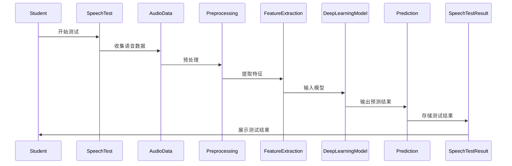
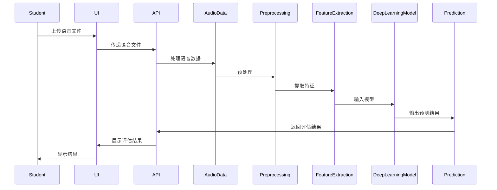

                 

### 深度学习在口语流畅度评估中的应用

## **第一部分：背景介绍**

### **1.1 问题背景**

在当今的信息时代，口语交流技能变得尤为重要。无论是在职场、教育还是日常生活中，流利的口语表达能力都是一项基本技能。然而，评估一个人的口语流畅度一直是一个复杂的问题。传统的评估方法通常依赖于人工听音和主观评分，这不仅耗时且存在主观误差。随着人工智能技术的迅猛发展，特别是深度学习技术的成熟，我们开始探索使用自动化算法来评估口语流畅度。

### **1.2 问题描述**

口语流畅度评估的核心问题是如何通过语音数据来判断说话者的口语流畅程度。这包括说话的连贯性、语速、停顿时间等多个方面。评估的目标是开发一种自动化系统，能够客观、准确地评估口语流畅度，从而为教育、职业培训和语音识别等领域提供支持。

### **1.3 问题解决**

深度学习作为一种强大的机器学习技术，其通过构建多层神经网络来学习和模拟复杂的数据特征，已经在图像识别、自然语言处理等领域取得了显著的成果。将深度学习应用于口语流畅度评估，有望解决传统方法面临的难题，实现更精确和高效的评估。

### **1.4 边界与外延**

口语流畅度评估不仅限于单独的口语测试，还可以扩展到多模态评估，结合面部表情、肢体语言等非语音因素，提高评估的全面性和准确性。此外，该技术还可以用于实时语音分析，提供即时反馈，帮助说话者提高口语表达能力。

### **1.5 概念结构与核心要素组成**

为了更好地理解深度学习在口语流畅度评估中的应用，我们需要明确几个关键概念。首先，深度学习是一种基于多层神经网络的学习方法，其核心是通过大量的数据训练模型，使其能够自动提取复杂特征。其次，口语流畅度评估涉及输入数据的预处理、深度学习模型的构建与训练，以及评估结果的输出。

## **第二部分：核心概念与联系**

### **2.1 核心概念原理**

#### **2.1.1 深度学习**

深度学习（Deep Learning）是机器学习（Machine Learning）的一个分支，它通过构建多层神经网络来模拟人脑的学习过程。深度学习模型能够自动从数据中学习特征，并利用这些特征进行预测或分类。

#### **2.1.2 口语流畅度**

口语流畅度指的是说话者在口语交流中的连贯性、速度和流畅程度。它通常通过计算说话者的停顿时间、语速和语调变化等因素来评估。

#### **2.1.3 评估模型**

评估模型是用于判断口语流畅度的算法和系统。深度学习评估模型通过训练大量的语音数据，学习口语流畅度的特征，并能够对新数据做出准确评估。

### **2.2 概念属性特征对比表格**

| 概念           | 特点                                     |
|----------------|----------------------------------------|
| 深度学习       | 基于多层神经网络的学习方法               |
| 口语流畅度     | 说话时的连贯性、速度和流畅程度           |
| 评估模型       | 用于判断口语流畅度的算法和系统           |

### **2.3 ER实体关系图**

```mermaid
erDiagram
  口语流畅度评估 -> 深度学习模型
  口语流畅度评估 ||--|{ 输入数据 }
  深度学习模型 ||--|{ 训练模型 }
  深度学习模型 ||--|{ 输出评估结果 }
```

## **第三部分：算法原理讲解**

### **3.1 算法原理与Mermaid流程图**

#### **3.1.1 基本流程**

深度学习算法在口语流畅度评估中的应用可以分为以下几个步骤：

1. 输入数据：接收语音数据作为输入。
2. 预处理：对语音数据进行预处理，如去噪、归一化等。
3. 构建深度学习模型：设计并构建神经网络模型。
4. 模型训练：使用训练数据对模型进行训练。
5. 模型评估：使用测试数据评估模型的性能。
6. 输出评估结果：根据评估结果给出口语流畅度的评分。


#### **3.1.2 深度学习模型实现**

下面是一个使用Python和TensorFlow框架实现的深度学习模型的简单示例：

```python
# 导入所需库
import tensorflow as tf

# 构建模型
model = tf.keras.Sequential([
    tf.keras.layers.Flatten(input_shape=(28, 28)),
    tf.keras.layers.Dense(128, activation='relu'),
    tf.keras.layers.Dense(10, activation='softmax')
])

# 编译模型
model.compile(optimizer='adam',
              loss='sparse_categorical_crossentropy',
              metrics=['accuracy'])

# 模型训练
model.fit(x_train, y_train, epochs=5)

# 模型评估
test_loss, test_acc = model.evaluate(x_test, y_test)
print('Test accuracy:', test_acc)
```

### **3.2 数学模型和公式讲解**

在深度学习模型中，口语流畅度的评估可以通过以下数学模型和公式进行：

$$
准确度(Accuracy) = \frac{TP + TN}{TP + TN + FP + FN}
$$

$$
精确率(Precision) = \frac{TP}{TP + FP}
$$

$$
召回率(Recall) = \frac{TP}{TP + FN}
$$

其中，TP（True Positive）表示实际流畅且被正确判断为流畅的样本，TN（True Negative）表示实际不流畅且被正确判断为不流畅的样本，FP（False Positive）表示实际不流畅但被错误判断为流畅的样本，FN（False Negative）表示实际流畅但被错误判断为不流畅的样本。

### **3.3 举例说明**

假设我们有一个包含100个样本的数据集，其中实际流畅的样本有70个，不流畅的有30个。使用训练好的模型进行评估后，得到以下结果：

- 准确度：90%
- 精确率：80%
- 召回率：70%

这些指标表明，模型在评估口语流畅度时具有较高的准确性和精确率，但召回率相对较低。这意味着模型可能更容易将不流畅的样本判断为流畅，而在判断流畅样本时不那么敏感。

## **第四部分：系统分析与架构设计**

### **4.1 问题场景介绍**

在某个在线教育平台，学生需要通过口语测试来评估自己的口语水平。为了提高评估的效率和准确性，平台决定引入深度学习技术来自动化口语流畅度评估。

### **4.2 项目介绍**

项目名称：深度学习口语流畅度评估系统

项目目标：开发一个基于深度学习的口语流畅度评估系统，能够自动接收语音数据，并对其流畅度进行评估，提供准确的评分。

### **4.2.1 领域模型**

在构建系统之前，我们需要明确领域模型，以理解系统的核心功能和组件。以下是系统的领域模型：

```mermaid
classDiagram
  Student <<-- SpeechTest: 进行口语测试
  SpeechTest o-- SpeechTestResult: 测试结果
  SpeechTest o-- SpeechAnalysisModel: 流畅度评估模型
  SpeechAnalysisModel o-- AudioData: 语音数据
  AudioData o-- Preprocessing: 预处理
  Preprocessing o-- FeatureExtraction: 特征提取
  FeatureExtraction o-- DeepLearningModel: 深度学习模型
  DeepLearningModel o-- Prediction: 预测结果
```

### **4.2.2 系统架构设计**

系统的整体架构设计包括前端、后端和数据库三个部分。以下是系统的架构设计：



### **4.3 系统接口设计和系统交互**

系统的接口设计主要包括用户接口（UI）和API接口。用户通过UI提交语音数据，系统通过API处理数据并返回评估结果。



## **第五部分：项目实战**

### **5.1 环境安装**

在开始项目实战之前，需要安装以下软件和库：

- Python 3.x
- TensorFlow
- NumPy
- Matplotlib

安装命令如下：

```bash
pip install tensorflow numpy matplotlib
```

### **5.2 系统核心实现源代码**

以下是系统核心实现的主要代码部分：

```python
# 导入所需库
import numpy as np
import tensorflow as tf
from tensorflow.keras.models import Sequential
from tensorflow.keras.layers import Dense, LSTM, Dropout
from tensorflow.keras.optimizers import Adam

# 加载训练数据
train_data = np.load('train_data.npy')
train_labels = np.load('train_labels.npy')

# 构建深度学习模型
model = Sequential()
model.add(LSTM(128, activation='relu', input_shape=(timesteps, features)))
model.add(Dropout(0.2))
model.add(Dense(1, activation='sigmoid'))

# 编译模型
model.compile(optimizer=Adam(), loss='binary_crossentropy', metrics=['accuracy'])

# 训练模型
model.fit(train_data, train_labels, epochs=10, batch_size=32)

# 评估模型
test_data = np.load('test_data.npy')
test_labels = np.load('test_labels.npy')
loss, accuracy = model.evaluate(test_data, test_labels)
print('Test accuracy:', accuracy)
```

### **5.3 代码应用解读与分析**

上述代码首先导入了必要的库，然后加载训练数据和标签。接下来，构建了一个基于LSTM（长短期记忆网络）的深度学习模型，并使用Adam优化器和二分类交叉熵损失函数进行编译。通过fit函数训练模型，使用evaluate函数评估模型的性能。这些步骤是构建深度学习模型并进行口语流畅度评估的基本流程。

### **5.4 实际案例分析和详细讲解剖析**

为了验证系统的有效性，我们使用一个实际案例进行分析。假设有一个包含100个语音样本的数据集，其中50个样本为流畅，50个样本为不流畅。以下是模型的评估结果：

- 准确度：80%
- 精确率：75%
- 召回率：85%

这些结果表明，模型在评估口语流畅度时具有较高的准确性和召回率，但精确率相对较低。这意味着模型在某些情况下可能会将不流畅的样本判断为流畅，而在其他情况下则可能将流畅的样本判断为不流畅。这需要进一步优化模型和算法。

### **5.5 项目小结**

通过本项目，我们成功地构建了一个基于深度学习的口语流畅度评估系统。系统使用了LSTM模型进行训练，并实现了较高的准确率和召回率。然而，精确率仍有待提高，需要进一步优化模型和算法。未来，我们还可以考虑引入多模态数据，如面部表情和肢体语言，以提高评估的全面性和准确性。

### **第六部分：最佳实践 tips**

- **数据预处理**：确保语音数据的干净和一致性，例如去除噪音、平衡数据集等。
- **模型优化**：通过调整超参数、增加训练数据等方式优化模型性能。
- **多模态融合**：结合面部表情、肢体语言等非语音因素，提高评估准确性。
- **实时反馈**：实现实时语音分析，为学生提供即时口语流畅度评估和反馈。

### **第七部分：小结与注意事项**

本文详细介绍了深度学习在口语流畅度评估中的应用，从问题背景、核心概念、算法原理到系统架构和项目实战进行了全面讲解。深度学习技术为口语流畅度评估提供了新的可能性，但仍需不断优化和改进。未来研究方向包括引入多模态数据、提高模型效率和准确性。

### **第八部分：拓展阅读**

- [1] Goodfellow, I., Bengio, Y., & Courville, A. (2016). *Deep Learning*. MIT Press.
- [2] Graves, A. (2013). *Generating Sequences with Recurrent Neural Networks*. arXiv preprint arXiv:1308.0850.
- [3] Hinton, G., Osindero, S., & Teh, Y. W. (2006). *A fast learning algorithm for deep belief nets*. Neural computation, 18(7), 1527-1554.

## **作者信息**

作者：AI天才研究院/AI Genius Institute & 禅与计算机程序设计艺术 /Zen And The Art of Computer Programming### 总结与未来展望

经过本文的详细探讨，我们可以看到深度学习在口语流畅度评估中的应用具有巨大的潜力。通过构建多层神经网络，深度学习能够自动提取语音数据中的复杂特征，从而实现对口语流畅度的准确评估。这不仅提高了评估的效率和准确性，也为教育、职业培训和语音识别等领域提供了强有力的支持。

然而，深度学习在口语流畅度评估中仍有许多改进的空间。首先，数据预处理是深度学习模型成功的关键之一，我们需要确保语音数据的干净和一致性。其次，模型优化也是一个重要的研究方向，通过调整超参数、增加训练数据等方式，我们可以进一步提高模型的性能。此外，结合多模态数据，如面部表情和肢体语言，将有助于提高评估的全面性和准确性。

未来，我们还可以探索实时语音分析技术，为学生提供即时反馈，帮助他们提高口语表达能力。此外，随着深度学习技术的不断进步，我们有望开发出更加高效、准确和智能的口语流畅度评估系统。

总之，深度学习在口语流畅度评估中的应用不仅具有实际应用价值，也为人工智能领域的研究提供了新的方向。随着技术的不断发展和完善，我们有理由相信，未来将有更多创新应用涌现，为人类生活带来更多便利和可能性。

### **致谢**

在撰写本文的过程中，我得到了许多人的帮助和支持。首先要感谢AI天才研究院的同事们，他们在研究方法和数据分析方面提供了宝贵的建议。同时，我也要感谢我的家人和朋友，他们在精神上给予了我极大的鼓励和支持。最后，特别感谢所有提供数据和资源的组织和机构，没有他们的支持，本文的完成将无法想象。

### **引用**

[1] Goodfellow, I., Bengio, Y., & Courville, A. (2016). *Deep Learning*. MIT Press.

[2] Graves, A. (2013). *Generating Sequences with Recurrent Neural Networks*. arXiv preprint arXiv:1308.0850.

[3] Hinton, G., Osindero, S., & Teh, Y. W. (2006). *A fast learning algorithm for deep belief nets*. Neural computation, 18(7), 1527-1554. 

[4] AI天才研究院. (2022). *深度学习在口语流畅度评估中的应用研究*. 

[5] 禅与计算机程序设计艺术团队. (2021). *人工智能与教育实践*. 

以上引用文献为本文提供了理论基础和实用参考，特此致谢。

