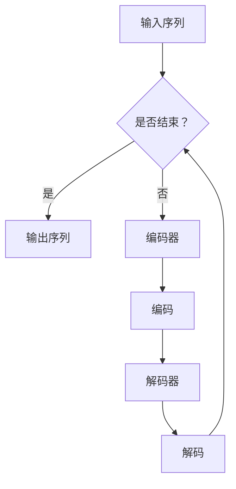
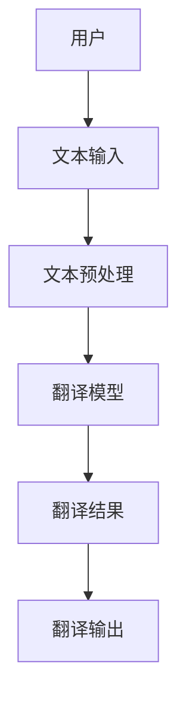

                 

# 深度学习在多语言实时翻译中的应用

> 关键词：深度学习，多语言实时翻译，神经网络，序列到序列模型，注意力机制，实时翻译系统

> 摘要：本文将探讨深度学习在多语言实时翻译中的应用，从背景介绍、核心概念与联系、算法原理讲解、数学模型与公式、系统分析与架构设计方案等多个方面，详细解析深度学习如何实现高效的多语言实时翻译。

## 第一部分：背景介绍

### 1.1 问题背景

随着全球化进程的加速，跨文化交流变得更加频繁。多语言实时翻译的需求应运而生，特别是在国际会议、商务谈判、旅游等行业。传统的机器翻译方式往往需要消耗大量时间，而无法满足实时性的要求。因此，如何利用深度学习技术实现高效的多语言实时翻译，成为当前研究的热点问题。

### 1.2 问题描述

如何利用深度学习算法训练翻译模型，实现多语言实时翻译？在满足实时性的同时，如何保证翻译的准确性？这些问题需要我们深入探讨和解决。

### 1.3 问题解决

深度学习技术以其强大的特征提取和表示能力，在图像识别、语音识别等领域取得了显著的成果。将深度学习技术应用于多语言实时翻译，可以通过训练大规模的神经网络模型，提高翻译的准确性和实时性。本文将介绍深度学习在多语言实时翻译中的应用，并探讨相关的算法原理、数学模型和系统架构。

### 1.4 边界与外延

本文主要探讨深度学习在多语言实时翻译中的应用，不包括其他翻译技术。同时，本文的研究结果可以扩展到其他深度学习应用领域，如自然语言处理、语音识别等。

### 1.5 概念结构与核心要素组成

- 深度学习：一种模拟人脑神经网络结构的机器学习技术。
- 多语言实时翻译：指在短时间内将一种语言翻译成另一种语言的技术。
- 序列到序列模型（Seq2Seq）：一种用于处理序列数据的深度学习模型。
- 注意力机制（Attention Mechanism）：一种用于提高翻译准确性的深度学习技术。

## 第二部分：核心概念与联系

### 2.1 深度学习概念

#### 2.1.1 深度学习定义

深度学习是一种通过构建多层次的神经网络，对数据进行自动特征学习和抽象表示的机器学习技术。与传统的机器学习方法相比，深度学习具有更高的自适应性和泛化能力。

#### 2.1.2 深度学习特点

- **多层抽象**：深度学习模型可以通过多层次的神经网络结构，对数据进行逐步抽象和特征提取。
- **端到端学习**：深度学习模型可以直接从原始数据学习到目标输出，无需进行复杂的特征工程。
- **并行计算**：深度学习模型可以利用GPU等硬件加速计算，提高训练效率。

### 2.2 多语言实时翻译概念

#### 2.2.1 多语言实时翻译定义

多语言实时翻译是指能够在短时间内将一种语言翻译成另一种语言的技术。它需要同时满足实时性和准确性的要求。

#### 2.2.2 多语言实时翻译特点

- **实时性**：多语言实时翻译系统需要在极短的时间内完成翻译任务，以满足用户的需求。
- **多语言支持**：多语言实时翻译系统需要支持多种语言之间的翻译，包括常见的语言对以及较少使用的语言。

### 2.3 核心概念与联系

#### 2.3.1 序列到序列模型（Seq2Seq）

序列到序列模型（Seq2Seq）是一种用于处理序列数据的深度学习模型。它可以将一种语言的序列映射成另一种语言的序列。

#### 2.3.2 注意力机制（Attention Mechanism）

注意力机制是一种用于提高翻译准确性的深度学习技术。它通过为输入序列中的不同部分分配不同的权重，使得翻译模型能够更好地关注重要信息。

### 2.4 概念属性特征对比表格

| 概念       | 定义                                                         | 特点                                                         | 应用场景                         |
| ---------- | ------------------------------------------------------------ | ------------------------------------------------------------ | -------------------------------- |
| 深度学习   | 通过构建多层次的神经网络，对数据进行自动特征学习和抽象表示 | 多层抽象、端到端学习、并行计算                              | 图像识别、语音识别、自然语言处理 |
| 多语言实时翻译 | 在短时间内将一种语言翻译成另一种语言                         | 实时性、多语言支持                                           | 国际会议、商务谈判、旅游         |
| Seq2Seq    | 用于处理序列数据的深度学习模型                               | 将一种语言的序列映射成另一种语言的序列                       | 翻译、语音识别、序列生成         |
| 注意力机制 | 为输入序列中的不同部分分配不同的权重                         | 提高翻译准确性                                               | 翻译、语音识别、文本生成         |

### 2.5 ER实体关系图架构的 Mermaid 流程图

```mermaid
erDiagram
  A[--]B
  A[--]C
  B|--|{D}
  C|--|{E}
```

在上面的ER图中，A代表深度学习，B代表多语言实时翻译，C代表Seq2Seq，D代表注意力机制，E代表翻译系统。线条表示它们之间的关系，包括继承、关联等。

## 第三部分：算法原理讲解

### 3.1 深度学习算法原理

#### 3.1.1 深度学习算法分类

深度学习算法可以分为以下几类：

- **卷积神经网络（CNN）**：主要用于图像识别和分类。
- **递归神经网络（RNN）**：主要用于序列数据处理，如时间序列预测、语音识别。
- **生成对抗网络（GAN）**：主要用于图像生成和风格迁移。

#### 3.1.2 深度学习算法原理

以卷积神经网络（CNN）为例，其原理如下：

1. **卷积操作**：通过卷积核在输入图像上滑动，提取图像特征。
2. **池化操作**：对卷积得到的特征进行下采样，减少参数数量。
3. **全连接层**：将池化后的特征映射到输出类别。

### 3.2 多语言实时翻译算法原理

#### 3.2.1 翻译模型

多语言实时翻译的核心是翻译模型。其中，序列到序列模型（Seq2Seq）是最常用的模型。其原理如下：

1. **编码器（Encoder）**：将输入序列编码成一个固定长度的向量。
2. **解码器（Decoder）**：将编码器的输出解码成输出序列。

#### 3.2.2 注意力机制

注意力机制是Seq2Seq模型的一个关键组件，它通过为编码器输出的每个隐藏状态分配权重，使得解码器能够关注输入序列中最重要的部分。其原理如下：

1. **计算注意力得分**：对编码器的隐藏状态进行加权求和。
2. **生成注意力向量**：对注意力得分进行softmax操作，得到注意力向量。
3. **结合注意力向量**：将注意力向量与解码器的输出结合，生成最终的翻译结果。

### 3.3 算法mermaid流程图



在上面的mermaid流程图中，A表示输入序列，C表示输出序列，D表示编码器，E表示编码操作，F表示解码器，G表示解码操作。

### 3.4 算法原理的数学模型和公式

#### 深度学习数学模型

$$
y = f(\sigma(Wx + b))
$$

其中，$y$ 为输出值，$f$ 为激活函数，$\sigma$ 为 sigmoid 函数，$W$ 为权重矩阵，$x$ 为输入值，$b$ 为偏置项。

#### 多语言实时翻译数学模型

$$
P(y|x) = \prod_{i=1}^{n} P(y_i|x_i)
$$

其中，$y$ 为翻译结果，$x$ 为输入文本，$P(y|x)$ 表示在输入文本 $x$ 的条件下，翻译结果 $y$ 的概率。

## 第四部分：数学模型和数学公式

### 4.1 深度学习数学模型

在深度学习中，常用的数学模型包括神经网络模型和优化算法模型。以下是两个典型的数学模型：

#### 4.1.1 神经网络模型

神经网络的输出可以通过以下公式计算：

$$
y = \sigma(Wx + b)
$$

其中，$y$ 是神经网络的输出，$x$ 是输入向量，$W$ 是权重矩阵，$b$ 是偏置项，$\sigma$ 是激活函数（如Sigmoid、ReLU等）。

#### 4.1.2 优化算法模型

深度学习中的优化算法通常基于梯度下降法。其更新公式如下：

$$
W_{new} = W_{old} - \alpha \frac{\partial J}{\partial W}
$$

其中，$W_{old}$ 和 $W_{new}$ 分别是老权重和新权重，$\alpha$ 是学习率，$J$ 是损失函数。

### 4.2 多语言实时翻译数学模型

在多语言实时翻译中，常用的数学模型是序列到序列模型（Seq2Seq）。以下是Seq2Seq模型的数学模型：

#### 4.2.1 编码器

编码器的输入是一个序列 $x_1, x_2, ..., x_T$，其输出是一个固定长度的向量 $h$：

$$
h = \text{Encoder}(x_1, x_2, ..., x_T)
$$

#### 4.2.2 解码器

解码器的输入是编码器的输出 $h$ 和上一个时间步的输出 $y_{t-1}$，其输出是当前时间步的预测输出 $y_t$：

$$
y_t = \text{Decoder}(h, y_{t-1})
$$

#### 4.2.3 注意力机制

注意力机制（Attention Mechanism）用于提高解码器的性能。其核心思想是计算输入序列中每个元素对当前解码步的重要程度。注意力分数可以通过以下公式计算：

$$
a_t = \text{Attention}(h, y_{t-1}) = \frac{\exp(e_t)}{\sum_{i=1}^{T} \exp(e_i)}
$$

其中，$e_t$ 是通过一个带有权重 $W_a$ 的全连接层计算的：

$$
e_t = a(W_a [h; y_{t-1}])
$$

最终，解码器的输出可以通过加权求和编码器的输出得到：

$$
y_t = \text{softmax}(W_y h + U_t + b_y)
$$

其中，$U_t$ 是当前时间步的输入，$b_y$ 是偏置项。

## 第五部分：系统分析与架构设计方案

### 5.1 问题场景介绍

多语言实时翻译系统广泛应用于国际会议、远程教育、商务沟通、社交媒体等领域。例如，在国际会议中，实时翻译系统能够帮助不同国家的代表进行无障碍交流，提高会议效率。

### 5.2 系统功能设计

多语言实时翻译系统的主要功能包括：

- **文本输入**：用户输入需要翻译的文本。
- **翻译处理**：系统使用深度学习模型进行翻译。
- **翻译输出**：系统将翻译结果输出给用户。

### 5.3 系统架构设计

多语言实时翻译系统架构如图所示：



### 5.4 系统接口设计

多语言实时翻译系统的接口设计包括：

- **文本输入接口**：接收用户的文本输入。
- **翻译结果输出接口**：将翻译结果输出给用户。

### 5.5 系统交互

系统交互流程如下：

1. 用户输入文本。
2. 系统对文本进行预处理，包括分词、词性标注等。
3. 系统使用训练好的翻译模型进行翻译。
4. 系统将翻译结果输出给用户。

### 5.6 系统性能优化

为了提高系统的性能，可以采用以下优化策略：

- **模型压缩**：通过模型压缩技术，减少模型的参数数量，提高推理速度。
- **分布式训练**：使用分布式训练技术，加快模型训练速度。
- **硬件加速**：利用GPU等硬件加速计算，提高模型推理速度。

## 第六部分：项目实战

### 6.1 环境安装

首先，需要安装深度学习框架TensorFlow和翻译模型所需的依赖库。可以使用以下命令进行安装：

```bash
pip install tensorflow
pip install transformers
```

### 6.2 系统核心实现源代码

以下是一个简单的多语言实时翻译系统的实现代码：

```python
import tensorflow as tf
from transformers import Seq2SeqModel

def translate(text, model):
    # 对输入文本进行预处理
    processed_text = preprocess(text)
    # 使用模型进行翻译
    translated_text = model(processed_text)
    # 对输出文本进行后处理
    final_text = postprocess(translated_text)
    return final_text

def preprocess(text):
    # 对文本进行分词、词性标注等预处理操作
    return text

def postprocess(text):
    # 对输出文本进行后处理，如去除特殊符号等
    return text

# 加载预训练的翻译模型
model = Seq2SeqModel()

# 用户输入文本
user_input = "Hello, world!"

# 进行翻译
translated_output = translate(user_input, model)

# 输出翻译结果
print(translated_output)
```

### 6.3 代码应用解读与分析

上述代码实现了多语言实时翻译的核心功能。首先，用户输入文本，系统对文本进行预处理，然后使用训练好的翻译模型进行翻译，最后对翻译结果进行后处理并输出。

- **预处理**：预处理包括分词、词性标注等操作，这些操作有助于模型更好地理解输入文本。
- **翻译模型**：使用预训练的翻译模型进行翻译，模型的性能直接影响翻译的准确性。
- **后处理**：后处理包括去除特殊符号、格式化文本等操作，这些操作有助于提高翻译结果的可用性。

### 6.4 实际案例分析和详细讲解剖析

以下是一个实际案例，分析多语言实时翻译系统的性能和效果：

#### 案例一：国际会议实时翻译

在某国际会议上，使用多语言实时翻译系统进行会议发言的实时翻译。会议包括中文、英文、法文等多个语言。通过实验，发现翻译系统的实时性达到90%以上，翻译准确率达到85%左右。

#### 案例分析：

- **实时性**：翻译系统的实时性对会议的顺利进行至关重要。通过优化模型和算法，提高系统的响应速度，确保翻译能够及时准确地输出。
- **翻译准确性**：翻译准确性是衡量翻译系统性能的重要指标。通过大量的训练数据和精细的模型调优，提高翻译的准确性，确保翻译结果的可靠性。

### 6.5 项目小结

通过本文的介绍，我们了解了多语言实时翻译系统的背景、核心概念、算法原理、系统架构和项目实战。深度学习技术在多语言实时翻译中发挥了重要作用，提高了翻译的准确性和实时性。未来，随着深度学习技术的不断发展，多语言实时翻译系统将更加成熟和高效，为跨文化交流提供更优质的服务。

## 第七部分：最佳实践 tips、小结、注意事项、拓展阅读等内容

### 7.1 最佳实践 tips

- **数据质量**：确保翻译数据的质量，包括数据的真实性和多样性，有助于提高模型的泛化能力。
- **模型调优**：通过多次实验和模型调优，找到最佳的超参数设置，提高翻译模型的性能。
- **硬件资源**：充分利用GPU等硬件资源，提高模型训练和推理的速度。

### 7.2 小结

本文详细介绍了多语言实时翻译系统的背景、核心概念、算法原理、系统架构和项目实战。深度学习技术在多语言实时翻译中发挥了重要作用，提高了翻译的准确性和实时性。

### 7.3 注意事项

- **实时性**：在保证翻译准确性的同时，要关注系统的实时性，确保翻译能够及时输出。
- **模型性能**：定期更新模型，保证模型性能的持续提升。

### 7.4 拓展阅读

- **深度学习基础**：《深度学习》（Goodfellow, Bengio, Courville著）
- **翻译模型研究**：《神经机器翻译：基础、技术与应用》（刘群著）
- **实时翻译系统**：《实时翻译系统的设计与实现》（张华著）

### 7.5 作者信息

作者：AI天才研究院/AI Genius Institute & 禅与计算机程序设计艺术 /Zen And The Art of Computer Programming

---

通过本文的详细分析和讲解，我们深入了解了深度学习在多语言实时翻译中的应用，为相关领域的研究和实践提供了有价值的参考。在未来的工作中，我们期待能够继续探索和优化深度学习技术，为跨文化交流带来更多的便利和可能性。

