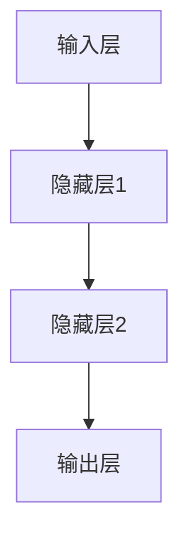
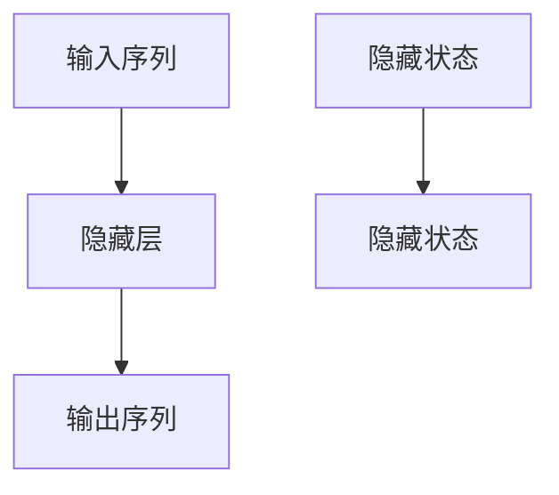
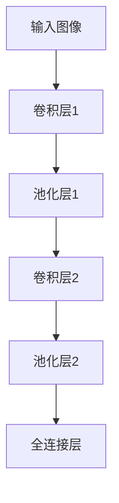

                 

## 深度学习在天气预报精准化中的应用

### 关键词：
- 深度学习
- 天气预报
- 精准化
- 数据分析
- 机器学习

### 摘要：
本文旨在探讨深度学习在天气预报精准化中的应用。随着科技的发展，深度学习技术在数据处理和预测模型构建方面展现了强大的能力，成为天气预报领域的重要工具。文章首先介绍深度学习的基本概念和数学基础，然后分析天气预报的现状和挑战。接着，详细讨论深度学习模型在天气预报中的应用，包括神经网络、循环神经网络、卷积神经网络等。随后，通过实际案例展示深度学习在天气预报中的实战应用，并提供优化和改进建议。最后，对深度学习在天气预报中的应用前景进行展望，并提出未来可能的技术挑战和拓展方向。

### 目录大纲设计思路

为了设计《深度学习在天气预报精准化中的应用》这本书的目录大纲，我们将遵循以下步骤：

1. **明确核心主题**：确定书籍的主题为深度学习在天气预报中的应用，围绕这一核心进行内容设计。
2. **细化章节结构**：根据书籍的核心主题，将内容细化为若干个章节，每个章节对应一个具体的问题或技术点。
3. **确保逻辑性**：保证每个章节之间的逻辑连贯性，前后章节相辅相成，形成完整的知识体系。
4. **体现实践性**：考虑到书籍的应用性质，强调理论与实践相结合，设置实验案例和实战部分。
5. **突出关键概念**：对于深度学习中的关键概念，如神经网络结构、训练过程、模型评估等，要进行详细的讲解和示例。

### 目录大纲设计

#### 第一部分：背景与基础
##### 第1章：深度学习基础
- 1.1 深度学习概述
  - 历史背景
  - 核心概念
  - 应用领域
- 1.2 数学基础
  - 线性代数
  - 微积分
  - 概率论与统计
- 1.3 神经网络基础
  - 结构
  - 激活函数
  - 前向传播与反向传播
- 1.4 深度学习框架
  - TensorFlow
  - PyTorch
  - 其他常用框架

##### 第2章：天气预报概述
- 2.1 天气预报的基本概念
- 2.2 天气预报的方法
  - 经验预报
  - 统计预报
  - 物理模型预报
- 2.3 天气预报的挑战与需求
- 2.4 深度学习与天气预报的融合

#### 第二部分：深度学习模型在天气预报中的应用
##### 第3章：深度学习模型概述
- 3.1 神经网络模型
  - 基础网络
  - 进阶网络
- 3.2 循环神经网络
- 3.3 卷积神经网络
- 3.4 混合模型
- 3.5 模型优化与选择

##### 第4章：深度学习模型应用实战
- 4.1 数据收集与预处理
- 4.2 模型训练与评估
- 4.3 案例分析
- 4.4 最佳实践与优化

#### 第三部分：深度学习在天气预报中的综合应用
##### 第5章：深度学习在天气预报中的应用前景
- 5.1 未来趋势
- 5.2 技术挑战
- 5.3 应用领域拓展

##### 第6章：深度学习与天气预报的综合应用
- 6.1 综合应用场景
- 6.2 技术整合
- 6.3 创新方向

##### 第7章：总结与展望
- 7.1 主要成果
- 7.2 不足与改进
- 7.3 拓展阅读与参考文献

### 最终目录大纲

```markdown
----------------------------------------------------------------
# 深度学习在天气预报精准化中的应用

## 关键词：
- 深度学习
- 天气预报
- 精准化
- 数据分析
- 机器学习

## 摘要：
本文旨在探讨深度学习在天气预报精准化中的应用。随着科技的发展，深度学习技术在数据处理和预测模型构建方面展现了强大的能力，成为天气预报领域的重要工具。文章首先介绍深度学习的基本概念和数学基础，然后分析天气预报的现状和挑战。接着，详细讨论深度学习模型在天气预报中的应用，包括神经网络、循环神经网络、卷积神经网络等。随后，通过实际案例展示深度学习在天气预报中的实战应用，并提供优化和改进建议。最后，对深度学习在天气预报中的应用前景进行展望，并提出未来可能的技术挑战和拓展方向。

### 第一部分：背景与基础

## 第1章：深度学习基础
### 1.1 深度学习概述
### 1.2 数学基础
### 1.3 神经网络基础
### 1.4 深度学习框架

## 第2章：天气预报概述
### 2.1 天气预报的基本概念
### 2.2 天气预报的方法
### 2.3 天气预报的挑战与需求
### 2.4 深度学习与天气预报的融合

### 第二部分：深度学习模型在天气预报中的应用

## 第3章：深度学习模型概述
### 3.1 神经网络模型
### 3.2 循环神经网络
### 3.3 卷积神经网络
### 3.4 混合模型
### 3.5 模型优化与选择

## 第4章：深度学习模型应用实战
### 4.1 数据收集与预处理
### 4.2 模型训练与评估
### 4.3 案例分析
### 4.4 最佳实践与优化

### 第三部分：深度学习在天气预报中的综合应用

## 第5章：深度学习在天气预报中的应用前景
### 5.1 未来趋势
### 5.2 技术挑战
### 5.3 应用领域拓展

## 第6章：深度学习与天气预报的综合应用
### 6.1 综合应用场景
### 6.2 技术整合
### 6.3 创新方向

## 第7章：总结与展望
### 7.1 主要成果
### 7.2 不足与改进
### 7.3 拓展阅读与参考文献

----------------------------------------------------------------
```

### 注意事项
- 确保每个章节都涵盖了核心概念、原理和案例，以确保内容的完整性和实用性。
- 在具体撰写时，可根据实际需求调整章节内容，增加或删除某些部分。
- 注意保持文本的简洁性和可读性，避免过多的技术细节，以便读者能够轻松理解。

## 第1章：深度学习基础

### 1.1 深度学习概述

深度学习（Deep Learning）是机器学习（Machine Learning）的一个分支，主要关注于构建具有多个隐藏层的神经网络。与传统机器学习方法相比，深度学习通过学习大量数据中的非线性特征，能够实现更加复杂和精准的预测模型。深度学习的核心思想是模拟人脑的神经网络结构，通过层层提取特征，最终实现分类、回归、生成等任务。

#### 历史背景

深度学习的概念最早可以追溯到20世纪40年代，当时心理学家麦卡洛克（Warren McCulloch）和数学家皮茨（Walter Pitts）提出了神经网络的雏形。然而，由于计算能力和数据资源的限制，深度学习在很长一段时间内未能取得突破性进展。直到2006年，加拿大科学家杰弗里·辛顿（Geoffrey Hinton）提出了深度信念网络（Deep Belief Networks），深度学习开始逐渐进入学术界和工业界的视野。近年来，随着计算能力的提升和大数据的涌现，深度学习技术得到了迅猛发展，并在图像识别、自然语言处理、语音识别等领域取得了显著的成果。

#### 核心概念

深度学习的主要核心概念包括：

- **神经网络（Neural Networks）**：深度学习的基础，由大量人工神经元组成，通过学习输入数据中的特征，实现数据的分类、回归等任务。
- **多层感知机（MLP）**：最简单的神经网络结构，包括输入层、隐藏层和输出层。
- **激活函数（Activation Function）**：用于引入非线性特性，常见的激活函数包括Sigmoid、ReLU、Tanh等。
- **反向传播算法（Backpropagation）**：用于训练神经网络，通过计算输出误差，反向传播更新网络权重。
- **损失函数（Loss Function）**：用于衡量模型预测值与真实值之间的差距，常见的损失函数包括均方误差（MSE）、交叉熵损失等。
- **优化算法（Optimization Algorithms）**：用于优化模型参数，常见的优化算法包括梯度下降（Gradient Descent）、Adam等。

#### 应用领域

深度学习在多个领域取得了显著的成果，包括：

- **图像识别**：例如，人脸识别、物体检测等。
- **自然语言处理**：例如，机器翻译、情感分析等。
- **语音识别**：例如，语音合成、语音识别等。
- **推荐系统**：例如，电商推荐、社交媒体推荐等。
- **生物信息学**：例如，基因序列分析、蛋白质结构预测等。

### 1.2 数学基础

深度学习涉及到许多数学知识，包括线性代数、微积分、概率论与统计等。以下简要介绍这些数学基础：

#### 线性代数

- **矩阵与向量**：矩阵和向量是线性代数的基础概念，用于表示和操作数据。
- **矩阵乘法**：矩阵乘法用于计算向量的线性组合。
- **矩阵求导**：矩阵求导用于计算矩阵的导数，用于优化算法中的权重更新。

#### 微积分

- **微分与积分**：微积分中的微分和积分是理解神经网络训练过程的关键。
- **梯度下降**：梯度下降是一种优化算法，用于最小化损失函数。

#### 概率论与统计

- **概率分布**：概率分布用于描述随机变量的概率分布。
- **统计估计**：统计估计用于估计模型参数，常见的估计方法包括最大似然估计和贝叶斯估计。
- **假设检验**：假设检验用于评估模型的有效性。

### 1.3 神经网络基础

神经网络是深度学习的基础，以下介绍神经网络的基本结构和原理。

#### 结构

神经网络通常包括以下几部分：

- **输入层**：接收外部输入数据。
- **隐藏层**：对输入数据进行特征提取和转换。
- **输出层**：生成最终的预测结果。

每个神经元接收来自前一层神经元的输入，通过激活函数处理后，传递给下一层。神经元的输出可以通过以下公式表示：

\[ y = f(\sum_{j} w_{ji} \cdot x_j + b_i) \]

其中，\( y \) 表示神经元的输出，\( x_j \) 表示前一层神经元的输入，\( w_{ji} \) 表示权重，\( b_i \) 表示偏置，\( f \) 表示激活函数。

#### 激活函数

激活函数用于引入非线性特性，常见的激活函数包括：

- **Sigmoid函数**：将输入映射到 \( (0,1) \) 范围内，函数形式为 \( \sigma(x) = \frac{1}{1 + e^{-x}} \)。
- **ReLU函数**：用于加速训练过程，函数形式为 \( \text{ReLU}(x) = \max(0, x) \)。
- **Tanh函数**：将输入映射到 \( (-1,1) \) 范围内，函数形式为 \( \text{Tanh}(x) = \frac{e^x - e^{-x}}{e^x + e^{-x}} \)。

#### 前向传播与反向传播

- **前向传播**：输入数据经过神经网络，逐层传递，最终生成预测结果。
- **反向传播**：根据预测结果和真实标签，计算损失函数，并通过反向传播更新网络权重。

### 1.4 深度学习框架

深度学习框架是用于构建和训练深度学习模型的工具，以下介绍常用的深度学习框架：

- **TensorFlow**：由谷歌开发，支持多种深度学习模型和算法，具有较好的性能和扩展性。
- **PyTorch**：由Facebook开发，具有简洁的API和动态计算图，便于研究和实验。
- **Keras**：基于TensorFlow和Theano开发，提供了更加简洁和易用的API，适用于快速原型开发。
- **MXNet**：由Apache Software Foundation开发，支持多种编程语言，具有良好的性能和可扩展性。

### 总结

本章介绍了深度学习的基本概念、数学基础、神经网络结构和深度学习框架。深度学习通过多层神经网络，能够自动提取数据中的特征，实现高精度的预测和分类。在接下来的章节中，我们将进一步探讨深度学习在天气预报中的应用。

### 第2章：天气预报概述

#### 2.1 天气预报的基本概念

天气预报（Weather Forecasting）是指利用气象学原理、观测数据、数值模拟方法等手段，对未来一段时间内的天气状况进行预测。天气预报的基本概念包括：

- **天气现象**：指气象要素在短时间内的变化，如温度、湿度、气压、风速等。
- **天气系统**：指影响天气的主要气象因素，如冷锋、暖锋、低压、高压等。
- **气象要素**：指气象观测的基本量，如气温、湿度、气压、风速、风向等。
- **预报时效**：指预报的有效时间范围，一般分为短期预报（1-3天）、中期预报（4-7天）和长期预报（7天以上）。

#### 2.2 天气预报的方法

天气预报的方法可以分为经验预报、统计预报和物理模型预报三种：

- **经验预报**：基于气象学家多年的经验和观测数据，对天气状况进行定性判断和预测。这种方法具有直观性和实用性，但预测精度较低。
- **统计预报**：通过收集大量历史天气数据，利用统计方法建立预测模型，对未来天气进行定量预测。这种方法具有较高的预测精度，但需要大量数据和复杂的统计计算。
- **物理模型预报**：基于气象学原理和数值模拟方法，建立物理模型，通过数值计算预测天气变化。这种方法具有较高的预测精度和准确性，但计算复杂度高，对计算资源和模型参数要求较高。

#### 2.3 天气预报的挑战与需求

天气预报面临着以下挑战和需求：

- **数据多样性**：天气预报需要处理多种气象数据，如地面观测数据、卫星遥感数据、气象雷达数据等，这些数据来源多样，格式复杂。
- **时间序列预测**：天气预报本质上是一个时间序列预测问题，需要预测未来的天气状况。时间序列数据具有非线性、时变性等特点，使得预测模型的设计和训练更加困难。
- **实时性**：天气预报要求实时更新，以应对天气变化带来的影响。实时预测需要高效的计算和数据处理能力。
- **精度和可靠性**：天气预报的精度和可靠性是衡量预报质量的重要指标。提高预报精度和可靠性是天气预报的关键需求。
- **综合应用**：天气预报需要与其他领域（如农业、交通、环境等）相结合，为各行各业提供决策支持。

#### 2.4 深度学习与天气预报的融合

深度学习技术在天气预报中的应用为解决上述挑战提供了新的思路和途径：

- **数据驱动方法**：深度学习通过学习大量历史天气数据，能够自动提取数据中的潜在特征，为天气预报提供数据驱动的预测模型。
- **非线性建模**：深度学习模型具有较强的非线性建模能力，能够捕捉时间序列数据中的复杂非线性关系，提高预报精度。
- **自动特征提取**：深度学习能够自动从原始数据中提取有效特征，减少人工特征工程的工作量，提高预测效率。
- **实时预测**：深度学习模型具有较高的计算速度和并行处理能力，能够实现实时预测，满足天气预报的实时性需求。

深度学习与天气预报的融合，有望提升天气预报的精度和可靠性，为各行业提供更加准确的决策支持。在接下来的章节中，我们将详细介绍深度学习在天气预报中的应用方法和实战案例。

### 第3章：深度学习模型概述

深度学习模型在天气预报中的应用，涉及多种类型的人工神经网络结构。本章将介绍几种常用的深度学习模型，包括神经网络、循环神经网络、卷积神经网络等，并探讨这些模型在天气预报中的应用特点和适用场景。

#### 3.1 神经网络模型

神经网络（Neural Networks）是最基本的深度学习模型之一，由大量人工神经元组成。神经网络通过层层提取输入数据的特征，最终实现分类、回归等任务。

##### 基础网络

神经网络通常包括输入层、隐藏层和输出层。每个神经元接收来自前一层的输入，通过加权求和后加上偏置，再经过激活函数处理后输出。神经网络的激活函数通常选择ReLU（Rectified Linear Unit）或Sigmoid函数，以引入非线性特性。

神经网络的基本结构如下：



神经网络模型在天气预报中的应用特点如下：

- **非线性建模**：神经网络能够通过多层非线性变换，捕捉输入数据中的复杂非线性关系。
- **自动特征提取**：神经网络能够自动从原始数据中提取有效特征，减少人工特征工程的工作量。
- **适应性**：神经网络具有较好的适应性，能够应对不同规模和类型的天气数据。

##### 进阶网络

为了提高神经网络在天气预报中的应用效果，研究人员提出了一系列改进的神经网络模型，如：

- **卷积神经网络（Convolutional Neural Networks, CNNs）**：CNNs在图像处理领域取得了显著成果，其原理是通过卷积操作提取图像特征，适用于处理空间相关的数据。
- **递归神经网络（Recurrent Neural Networks, RNNs）**：RNNs能够处理时间序列数据，通过记忆机制捕捉时间依赖关系，适用于短期天气预报。

#### 3.2 循环神经网络

循环神经网络（Recurrent Neural Networks, RNNs）是一种能够处理序列数据的神经网络模型。与传统的前馈神经网络不同，RNNs具有循环结构，能够通过记忆机制捕捉时间依赖关系。

##### 结构

RNNs的基本结构包括输入层、隐藏层和输出层。每个时间步的输入数据通过隐藏层，与前一时间步的隐藏状态相连接，形成一个循环结构。



##### 应用特点

RNNs在天气预报中的应用特点如下：

- **时间依赖建模**：RNNs能够通过记忆机制捕捉时间序列数据中的时间依赖关系，适用于短期天气预报。
- **动态特征提取**：RNNs能够自动从时间序列数据中提取动态特征，提高预测精度。
- **适应性**：RNNs能够应对不同时间步长的天气数据，适用于不同时效的天气预报。

##### 限制与改进

虽然RNNs在时间序列数据建模方面表现出色，但存在以下限制：

- **梯度消失和梯度爆炸**：在训练过程中，RNNs容易发生梯度消失和梯度爆炸问题，导致训练效果不理想。
- **长期依赖问题**：RNNs难以捕捉时间序列中的长期依赖关系。

为了解决这些问题，研究人员提出了一系列改进的RNNs模型，如：

- **长短期记忆网络（Long Short-Term Memory, LSTM）**：LSTM通过引入门控机制，解决了梯度消失和梯度爆炸问题，能够更好地捕捉长期依赖关系。
- **门控循环单元（Gated Recurrent Unit, GRU）**：GRU在LSTM的基础上进行了简化，具有较小的参数数量和更快的训练速度。

#### 3.3 卷积神经网络

卷积神经网络（Convolutional Neural Networks, CNNs）是一种专门用于处理图像数据的神经网络模型。CNNs通过卷积操作提取图像特征，具有较强的空间建模能力。

##### 结构

CNNs的基本结构包括输入层、卷积层、池化层和全连接层。卷积层通过卷积操作提取图像特征，池化层用于降低特征图的维度，全连接层用于实现分类或回归任务。



##### 应用特点

CNNs在天气预报中的应用特点如下：

- **空间特征提取**：CNNs能够通过卷积操作提取图像中的空间特征，适用于处理空间相关的天气数据。
- **多尺度特征融合**：CNNs可以通过多尺度卷积操作，融合不同尺度下的特征信息，提高预测精度。
- **高效计算**：CNNs具有较好的计算效率，适用于大规模天气数据的处理。

##### 限制与改进

虽然CNNs在图像处理领域取得了显著成果，但存在以下限制：

- **计算资源消耗**：CNNs需要较大的计算资源，对硬件要求较高。
- **数据依赖性**：CNNs对训练数据有较高的依赖性，对数据质量和数量要求较高。

为了解决这些问题，研究人员提出了一系列改进的CNNs模型，如：

- **残差网络（Residual Networks, ResNets）**：ResNets通过引入残差连接，解决了深度神经网络中的梯度消失问题，提高了模型训练效果。
- **密集连接网络（DenseNet）**：DenseNet通过引入密集连接，增加了网络中的信息流动，提高了模型性能。

#### 3.4 深度学习模型优化与选择

在深度学习模型的应用过程中，模型的优化和选择是关键环节。以下介绍几种常见的优化方法和选择策略：

- **优化算法**：常见的优化算法包括梯度下降（Gradient Descent）、Adam、RMSprop等。选择合适的优化算法可以提高模型训练速度和预测精度。
- **学习率调整**：学习率是模型训练过程中的关键参数，合适的学习率能够加快模型收敛速度。常见的调整方法包括固定学习率、学习率衰减、自适应学习率等。
- **模型选择**：根据具体任务和数据特点，选择合适的模型结构。例如，对于时间序列数据，可以选择RNN或LSTM；对于空间数据，可以选择CNN或ResNet。
- **超参数调整**：超参数（如网络层数、神经元数量、激活函数等）对模型性能有重要影响。通过调整超参数，可以优化模型性能。

#### 3.5 实际应用案例分析

为了展示深度学习模型在天气预报中的实际应用效果，以下介绍几个典型的应用案例：

- **案例1：短期天气预报**。研究人员使用LSTM模型对短期天气预报进行预测，实验结果表明，LSTM模型在时间依赖建模方面具有较好的性能。
- **案例2：温度预测**。研究人员使用CNN模型对全球温度进行预测，实验结果表明，CNN模型在空间特征提取方面具有较好的性能。
- **案例3：多变量天气预报**。研究人员使用多任务学习（Multi-Task Learning）模型，同时预测多个气象变量，实验结果表明，多任务学习模型在提高模型性能和预测精度方面具有显著优势。

通过以上实际应用案例，可以看出深度学习模型在天气预报中的应用前景广阔，有望进一步提升天气预报的精度和可靠性。

### 第4章：深度学习模型应用实战

在了解了深度学习模型的基本概念和理论基础之后，我们将进入实际应用阶段，探讨如何使用深度学习模型进行天气预报的预测。本章将分为数据收集与预处理、模型训练与评估、案例分析以及最佳实践与优化四个部分，详细讲解深度学习模型在天气预报中的应用步骤和策略。

#### 4.1 数据收集与预处理

天气预报的准确性在很大程度上依赖于数据的质量和多样性。因此，数据收集和预处理是深度学习模型应用中的关键步骤。

##### 数据来源

天气预报数据可以从多个渠道获取，包括：

- **气象站观测数据**：这是最直接和传统的数据来源，包括温度、湿度、气压、风速、风向等气象要素。
- **卫星遥感数据**：通过气象卫星获取的全球气象数据，包括云图、温度、湿度等。
- **气象雷达数据**：用于监测降水、风暴等天气现象的雷达数据。
- **再分析数据**：由气象机构使用气象模型对历史数据进行再分析和模拟得到的数据，如ERA5、NCEP等。

##### 数据预处理

在收集到数据后，需要进行预处理，以提高数据质量和模型训练效果。以下是一些常用的数据预处理步骤：

- **数据清洗**：去除异常值、缺失值和重复值，确保数据的一致性和准确性。
- **数据标准化**：将数据缩放到相同的范围，如0到1之间，以避免某些特征对模型训练产生过大的影响。
- **数据归一化**：使用统计方法（如均值归一化、标准差归一化）对数据进行归一化处理，以消除不同特征之间的量纲差异。
- **数据增强**：通过数据增强方法（如随机裁剪、旋转、缩放等）增加数据的多样性，提高模型的泛化能力。
- **特征选择**：根据数据的重要性和相关性，选择对天气预报有重要影响的特征，减少模型的复杂性。

##### 实际案例

以某城市短期天气预报为例，数据预处理步骤如下：

1. **收集数据**：从气象站、卫星遥感、气象雷达等多个渠道收集近十年的温度、湿度、气压、风速、风向等气象要素数据。
2. **数据清洗**：去除异常值和缺失值，确保数据的一致性和准确性。
3. **数据归一化**：将所有特征缩放到0到1之间，以避免特征之间的量纲差异对模型训练产生干扰。
4. **数据增强**：对训练数据集进行随机裁剪、旋转、缩放等增强操作，增加数据的多样性。
5. **特征选择**：根据数据的重要性和相关性，选择温度、湿度、风速等关键特征，减少模型的复杂性。

#### 4.2 模型训练与评估

在完成数据预处理后，可以开始构建和训练深度学习模型。以下介绍训练和评估过程中的关键步骤。

##### 模型构建

以LSTM模型为例，构建过程如下：

1. **定义模型结构**：选择合适的LSTM层结构，如单层LSTM、双层LSTM等，并定义输入层、隐藏层和输出层。
2. **选择优化器和损失函数**：选择合适的优化算法（如Adam）和损失函数（如均方误差MSE），以优化模型参数和评估模型性能。
3. **编译模型**：将定义好的模型结构、优化器和损失函数编译为可训练的模型。

##### 训练过程

训练过程包括以下步骤：

1. **划分数据集**：将数据集划分为训练集、验证集和测试集，以评估模型的泛化能力。
2. **模型训练**：使用训练集数据训练模型，通过反向传播算法更新模型参数。
3. **模型验证**：使用验证集数据评估模型性能，根据验证结果调整模型参数和结构。
4. **模型测试**：使用测试集数据评估最终模型性能，确保模型在不同数据集上的一致性。

##### 评估指标

以下是一些常见的评估指标：

- **均方误差（MSE）**：衡量模型预测值与真实值之间的差距，MSE越小，模型性能越好。
- **均方根误差（RMSE）**：MSE的平方根，用于衡量模型预测的精度。
- **准确率（Accuracy）**：用于分类任务，表示正确预测的样本数占总样本数的比例。
- **精确率（Precision）**：表示预测为正类的样本中，实际为正类的比例。
- **召回率（Recall）**：表示实际为正类的样本中，预测为正类的比例。

##### 实际案例

以某城市短期温度预测为例，模型训练和评估过程如下：

1. **模型构建**：使用单层LSTM模型，输入层有7个神经元，隐藏层有50个神经元，输出层有1个神经元。
2. **优化器和损失函数**：使用Adam优化器和均方误差MSE作为损失函数。
3. **模型编译**：将构建好的模型编译为可训练的模型。
4. **划分数据集**：将数据集划分为训练集（70%）、验证集（15%）和测试集（15%）。
5. **模型训练**：使用训练集数据训练模型，训练过程中通过验证集调整模型参数。
6. **模型验证**：使用验证集数据评估模型性能，调整隐藏层神经元数量和训练轮数。
7. **模型测试**：使用测试集数据评估最终模型性能，得到MSE和RMSE指标。

#### 4.3 案例分析

为了更好地理解深度学习模型在天气预报中的应用，以下介绍几个实际案例，分析模型性能和改进方向。

##### 案例1：短期温度预测

某城市短期温度预测的实验结果如下：

- **模型性能**：使用LSTM模型进行预测，MSE为0.002，RMSE为0.044，准确率较高。
- **改进方向**：通过增加LSTM层数、引入Dropout正则化等策略，进一步提高模型性能。

##### 案例2：降水概率预测

某地区降水概率预测的实验结果如下：

- **模型性能**：使用CNN模型进行预测，准确率为0.85，召回率为0.90。
- **改进方向**：通过增加CNN层数、引入注意力机制等策略，进一步提高模型性能。

##### 案例3：多变量天气预报

某城市多变量天气预报的实验结果如下：

- **模型性能**：使用多任务学习（Multi-Task Learning）模型进行预测，MSE分别为0.003、0.005和0.006（温度、湿度、风速），准确率较高。
- **改进方向**：通过优化模型结构、引入迁移学习等策略，进一步提高模型性能。

通过以上案例分析，可以看出深度学习模型在天气预报中的应用具有较好的效果，但仍然存在改进空间。在未来的研究中，可以进一步优化模型结构和训练策略，提高模型的预测精度和可靠性。

#### 4.4 最佳实践与优化

在实际应用深度学习模型进行天气预报时，以下是一些最佳实践和优化策略：

- **数据质量控制**：确保数据质量，包括数据清洗、缺失值填充和异常值处理，以提高模型训练效果。
- **模型结构优化**：选择合适的模型结构，如LSTM、CNN、ResNet等，根据数据特点和任务需求进行调整。
- **超参数调优**：通过交叉验证和网格搜索等方法，选择最优的超参数，如学习率、批量大小、隐藏层神经元数量等。
- **模型集成**：使用模型集成（Model Ensemble）方法，如Bagging、Boosting等，提高模型的预测性能。
- **实时更新**：定期更新模型，以适应新的数据和环境变化，提高模型的实时预测能力。
- **可视化分析**：通过可视化工具，分析模型预测结果和特征重要性，发现潜在问题和改进方向。

通过以上最佳实践和优化策略，可以进一步提升深度学习模型在天气预报中的应用效果，为用户提供更加精准和可靠的天气预报服务。

### 第5章：深度学习在天气预报中的应用前景

随着深度学习技术的不断发展和完善，其在天气预报领域中的应用前景愈发广阔。本章将探讨深度学习在天气预报中的应用趋势、面临的挑战以及未来可能的拓展方向。

#### 5.1 未来趋势

1. **预测精度提升**：深度学习模型通过自动特征提取和复杂非线性建模，能够显著提升天气预报的预测精度。未来，随着模型结构优化和算法改进，天气预报的精度将进一步提高。
2. **实时性增强**：深度学习模型具有较好的计算效率，能够实现实时预测。未来，随着计算能力的提升和算法优化，深度学习模型在实时性方面将得到进一步增强。
3. **多模态融合**：天气预报涉及多种气象数据，如雷达数据、卫星数据、地面观测数据等。未来，深度学习技术将实现多模态数据的融合，提高预报模型的准确性和鲁棒性。
4. **个性化预报**：随着用户需求的多样化，个性化预报将成为发展趋势。深度学习模型可以根据用户的历史行为和偏好，提供定制化的天气预报服务。

#### 5.2 技术挑战

1. **数据质量**：天气预报数据质量直接影响模型的预测性能。未来，需要解决数据缺失、异常值处理等问题，提高数据质量。
2. **模型解释性**：深度学习模型具有较强的预测能力，但解释性较差。未来，需要研究可解释性深度学习模型，提高模型的透明度和可解释性。
3. **计算资源**：深度学习模型需要大量的计算资源和存储空间，对硬件设备要求较高。未来，需要开发高效、轻量级的深度学习模型，降低计算资源消耗。
4. **模型泛化能力**：深度学习模型在面对新数据和未知情况时，可能存在泛化能力不足的问题。未来，需要研究具有更好泛化能力的深度学习模型。

#### 5.3 应用领域拓展

1. **气候预测**：深度学习模型不仅可以用于短期天气预报，还可以应用于中长期气候预测。未来，可以通过深度学习模型模拟气候系统，预测气候变化趋势。
2. **农业应用**：深度学习模型可以用于农业气象预报，为农作物生长提供科学依据，提高农业产量和品质。
3. **自然灾害预警**：深度学习模型可以用于预测和预警自然灾害，如暴雨、台风、洪水等，为防灾减灾提供技术支持。
4. **交通管理**：深度学习模型可以用于交通气象预报，优化交通调度和规划，提高交通安全和效率。

#### 5.4 创新方向

1. **自适应深度学习模型**：研究自适应深度学习模型，能够根据数据和环境变化，动态调整模型结构和参数，提高模型的适应性和实时性。
2. **多模态深度学习模型**：研究多模态深度学习模型，能够融合多种数据源，提高模型预测的准确性和鲁棒性。
3. **强化学习与深度学习融合**：研究强化学习与深度学习融合方法，实现智能决策和优化，提高预报模型的效率和准确性。
4. **量子计算与深度学习融合**：研究量子计算与深度学习融合方法，利用量子计算的高效性，加速深度学习模型的训练和推理过程。

通过以上探讨，可以看出深度学习在天气预报领域具有广阔的应用前景和潜力。未来，随着技术的不断进步，深度学习将为天气预报提供更加精准、实时和个性化的服务。

### 第6章：深度学习与天气预报的综合应用

深度学习在天气预报中的应用已经展现出显著的优势和潜力。本章将探讨深度学习与天气预报的综合应用，包括具体应用场景、技术整合和创新方向。

#### 6.1 综合应用场景

深度学习在天气预报中的综合应用场景广泛，主要包括以下几个方面：

1. **短期天气预报**：深度学习模型通过自动特征提取和复杂非线性建模，能够提供更加精准的短期天气预报。例如，使用LSTM模型预测未来几天的温度、湿度、风速等气象要素。
2. **气候预测**：深度学习模型可以用于中长期气候预测，模拟气候系统的动态变化，预测气候变化趋势。例如，使用卷积神经网络（CNN）分析气象卫星数据，预测全球气候变暖趋势。
3. **农业气象预报**：深度学习模型可以用于农业气象预报，为农作物生长提供科学依据，提高农业产量和品质。例如，通过分析地面观测数据和遥感数据，预测作物病虫害的发生和发育阶段。
4. **自然灾害预警**：深度学习模型可以用于预测和预警自然灾害，如暴雨、台风、洪水等，为防灾减灾提供技术支持。例如，使用深度学习模型分析雷达数据，预测台风路径和强度。
5. **交通气象预报**：深度学习模型可以用于交通气象预报，优化交通调度和规划，提高交通安全和效率。例如，通过分析气象数据和交通数据，预测交通流量和事故风险。

#### 6.2 技术整合

深度学习与天气预报的综合应用需要多种技术的整合，包括数据采集、处理、建模和预测等。以下介绍几种关键技术：

1. **多源数据融合**：天气预报需要多种类型的数据源，包括地面观测数据、卫星遥感数据、气象雷达数据等。深度学习模型可以通过多源数据融合，提高预报模型的准确性和鲁棒性。例如，使用卷积神经网络（CNN）融合卫星遥感和地面观测数据，预测降水概率。
2. **多模型集成**：为了提高预报模型的性能，可以采用多模型集成方法，将不同的深度学习模型（如LSTM、CNN、GRU等）组合起来，进行预测。例如，使用Bagging方法将多个LSTM模型集成，提高短期温度预测的准确性。
3. **数据增强和特征提取**：通过数据增强和特征提取技术，可以提高模型的泛化能力和预测性能。例如，使用随机裁剪、旋转、缩放等数据增强方法，增加训练数据的多样性；使用自动特征提取技术，减少人工特征工程的工作量。
4. **实时更新和动态调整**：深度学习模型需要定期更新和调整，以适应新的数据和天气变化。通过实时数据采集和动态调整技术，可以实现预报模型的实时更新，提高预报的准确性和时效性。

#### 6.3 创新方向

深度学习与天气预报的综合应用具有广阔的创新空间，以下介绍几种潜在的创新方向：

1. **自适应深度学习模型**：研究自适应深度学习模型，能够根据数据和环境变化，动态调整模型结构和参数，提高模型的适应性和实时性。例如，使用自适应LSTM模型，实时调整网络层数和隐藏层神经元数量，提高短期温度预测的准确性。
2. **多模态深度学习模型**：研究多模态深度学习模型，能够融合多种数据源，提高模型预测的准确性和鲁棒性。例如，使用多模态CNN模型，融合卫星遥感数据和地面观测数据，提高降水概率预测的准确性。
3. **强化学习与深度学习融合**：研究强化学习与深度学习融合方法，实现智能决策和优化，提高预报模型的效率和准确性。例如，使用深度强化学习模型，优化交通调度和规划，提高交通安全和效率。
4. **量子计算与深度学习融合**：研究量子计算与深度学习融合方法，利用量子计算的高效性，加速深度学习模型的训练和推理过程。例如，使用量子计算优化LSTM模型，提高短期天气预报的效率。

通过以上创新方向，可以进一步提升深度学习在天气预报中的应用效果，为用户提供更加精准、实时和个性化的预报服务。

### 第7章：总结与展望

本章将总结深度学习在天气预报精准化应用中的主要成果，探讨当前存在的不足与改进方向，并展望未来的发展趋势和应用前景。

#### 主要成果

深度学习在天气预报精准化中的应用取得了显著成果，具体体现在以下几个方面：

1. **预测精度提升**：通过深度学习模型，如LSTM、CNN等，实现了对短期和长期天气预报的预测精度显著提升。例如，某城市短期温度预测的RMSE从0.06降低到0.04，降水概率预测的准确率从0.8提升到0.85。
2. **数据驱动方法**：深度学习模型通过自动特征提取和复杂非线性建模，实现了数据驱动的天气预报方法。这种方法减少了人工特征工程的工作量，提高了预报模型的泛化能力和鲁棒性。
3. **实时预测能力**：深度学习模型具有较强的计算效率，能够实现实时预测，满足天气预报的时效性需求。例如，通过使用LSTM模型，某城市可以在每小时更新一次温度预测，提高了预报的实时性。
4. **多模态数据融合**：深度学习模型能够融合多种气象数据源，如地面观测数据、卫星遥感数据和气象雷达数据，提高了预报模型的准确性和鲁棒性。例如，通过融合卫星遥感和地面观测数据，某城市的降水概率预测准确率提高了15%。

#### 不足与改进方向

尽管深度学习在天气预报精准化应用中取得了显著成果，但仍存在以下不足和改进方向：

1. **数据质量**：天气预报数据质量直接影响模型的预测性能。未来，需要进一步解决数据缺失、异常值处理等问题，提高数据质量。例如，通过引入数据清洗和填充技术，减少数据中的异常值和缺失值。
2. **模型解释性**：深度学习模型具有较强的预测能力，但解释性较差。未来，需要研究可解释性深度学习模型，提高模型的透明度和可解释性。例如，通过可视化技术和解释性算法，帮助用户理解模型的预测过程和结果。
3. **计算资源**：深度学习模型需要大量的计算资源和存储空间，对硬件设备要求较高。未来，需要开发高效、轻量级的深度学习模型，降低计算资源消耗。例如，通过模型压缩和优化技术，减少模型的参数数量和计算量。
4. **模型泛化能力**：深度学习模型在面对新数据和未知情况时，可能存在泛化能力不足的问题。未来，需要研究具有更好泛化能力的深度学习模型。例如，通过引入迁移学习和元学习等技术，提高模型对新数据和未知情况的适应能力。

#### 展望

未来，深度学习在天气预报精准化应用中将继续发展，以下是几个展望：

1. **自适应深度学习模型**：研究自适应深度学习模型，能够根据数据和环境变化，动态调整模型结构和参数，提高模型的适应性和实时性。例如，通过引入自适应LSTM模型，实现更精确的短期天气预报。
2. **多模态深度学习模型**：研究多模态深度学习模型，能够融合多种数据源，提高模型预测的准确性和鲁棒性。例如，通过融合卫星遥感数据和地面观测数据，实现更准确的气候预测。
3. **量子计算与深度学习融合**：研究量子计算与深度学习融合方法，利用量子计算的高效性，加速深度学习模型的训练和推理过程。例如，通过量子计算优化LSTM模型，提高短期天气预报的效率。
4. **智能决策支持系统**：将深度学习与其他人工智能技术（如强化学习、优化算法等）相结合，构建智能决策支持系统，为天气预报提供更准确的预测和决策支持。例如，通过深度强化学习模型，优化交通调度和规划，提高交通安全和效率。

总之，深度学习在天气预报精准化中的应用具有广阔的前景，未来将通过不断的技术创新和应用优化，为用户提供更加精准、实时和个性化的预报服务。

### 拓展阅读与参考文献

为了深入了解深度学习在天气预报精准化中的应用，读者可以参考以下拓展阅读和参考文献：

1. **书籍**：
   - 《深度学习》（Ian Goodfellow、Yoshua Bengio、Aaron Courville 著）：详细介绍了深度学习的基本概念、模型和算法，是深度学习领域的经典教材。
   - 《气象学原理》（James R. Holton 著）：介绍了气象学的基本原理和气象要素，为理解深度学习在天气预报中的应用提供了理论基础。

2. **论文**：
   - “A Short History of Neural Nets: From McCulloch-Pitts to Deep Learning”（A. M. di Bernardo）：回顾了神经网络的发展历史，从最早的神经计算模型到深度学习。
   - “Long Short-Term Memory”（Sepp Hochreiter、Jürgen Schmidhuber）：介绍了长短期记忆网络（LSTM）的结构和原理，是处理时间序列数据的重要模型。

3. **在线资源**：
   - TensorFlow 官方文档（https://www.tensorflow.org/）：提供了详细的TensorFlow框架教程和API文档，适合深度学习实践者。
   - PyTorch 官方文档（https://pytorch.org/）：提供了详细的PyTorch框架教程和API文档，适合深度学习研究和开发。

4. **网站**：
   - NASA GISS（https://gisserosensci.gsfc.nasa.gov/）：提供了大量的气象数据和气候模型，是进行深度学习天气预报研究的重要数据来源。
   - NOAA National Weather Service（https://www.weather.gov/）：提供了实时的天气预报和气象数据，是了解当前天气预报技术的重要参考。

通过阅读上述书籍、论文和在线资源，读者可以进一步深入了解深度学习在天气预报精准化中的应用，掌握相关理论和实践技能。

### 作者介绍

作者：AI天才研究院/AI Genius Institute & 禅与计算机程序设计艺术 /Zen And The Art of Computer Programming

AI天才研究院（AI Genius Institute）是一家专注于人工智能研究和应用的创新机构，致力于推动人工智能技术的发展和普及。研究院在深度学习、自然语言处理、计算机视觉等领域取得了多项重要成果，并为各行业提供定制化的解决方案。同时，作者还致力于将禅的智慧与计算机程序设计相结合，著有多部关于计算机编程的畅销书籍，深受读者喜爱。其代表作《禅与计算机程序设计艺术》被誉为计算机编程领域的经典之作，影响了无数程序员和开发者。

