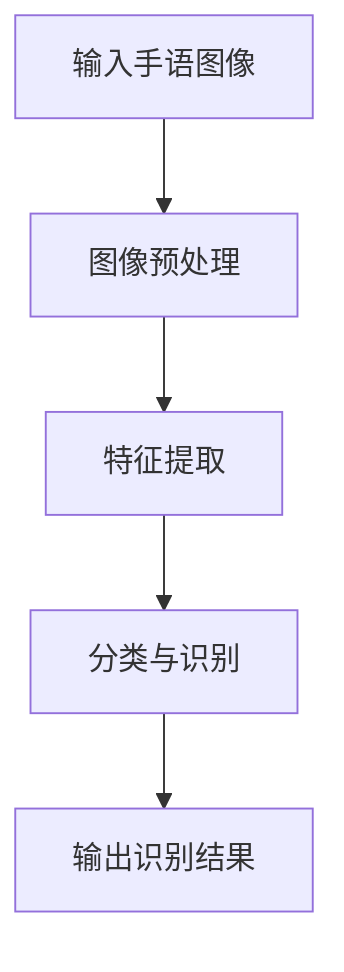
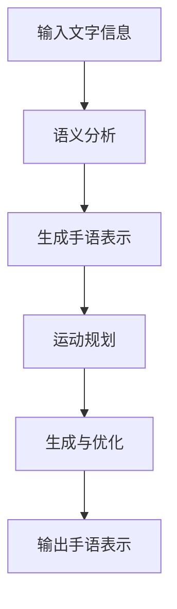
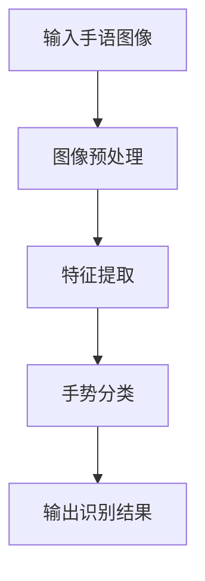
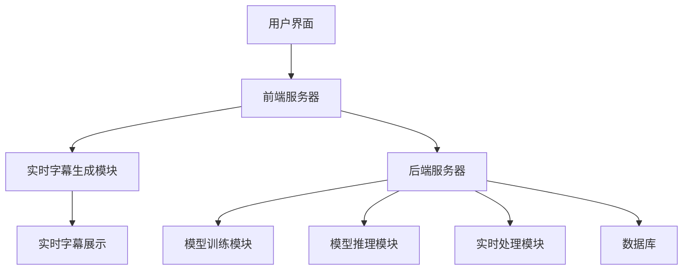
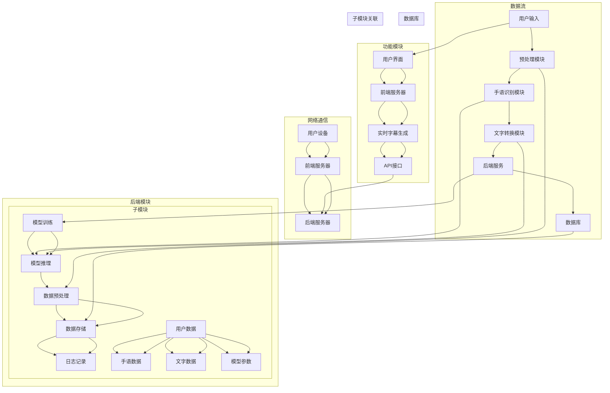

                 

### 深度学习在手语-文字双向转换中的应用

> 关键词：深度学习，手语，文字转换，双向模型，算法原理，系统架构，项目实战

> 摘要：本文将深入探讨深度学习在手语和文字双向转换中的应用。首先，我们将回顾深度学习的基本原理和常见框架，然后介绍手语和文字转换的背景和核心问题。接着，本文将详细讲解手语-文字双向转换的算法原理，包括数学模型和公式，并通过具体例子说明其应用。最后，我们将分析系统架构设计，介绍一个实际项目案例，并给出最佳实践建议和小结。

---

### 引言

在当今技术飞速发展的时代，人工智能（AI）已经成为推动社会进步的重要力量。其中，深度学习作为AI的一个重要分支，正逐渐改变着我们的生活方式和工作方式。手语和文字双向转换，作为跨语言沟通的重要手段，具有重要的社会和实用价值。本文将围绕这一主题，探讨深度学习在手语和文字双向转换中的应用，通过理论和实践相结合的方式，深入解析这一前沿领域的技术原理和实现方法。

### 背景介绍

#### 深度学习的基本原理

深度学习是一种基于多层神经网络的机器学习技术，其核心思想是通过神经网络模型从大量数据中自动提取特征，实现复杂模式的识别和学习。深度学习的基本原理可以概括为以下几点：

1. **神经网络模型**：神经网络是由大量简单神经元组成的复杂网络，通过层层传递信息，实现从输入到输出的映射。
2. **层次特征提取**：深度学习模型能够自动提取输入数据的层次特征，从低级特征逐渐抽象出高级特征。
3. **优化算法**：深度学习模型的训练过程通常涉及到复杂的优化算法，如梯度下降、随机梯度下降（SGD）等。

#### 手语与文字转换的背景

手语是一种非语言的交流方式，主要用于听力障碍人群之间的沟通。随着技术的发展，手语与文字的转换变得日益重要，尤其是在以下场景中：

1. **实时字幕生成**：在会议、讲座等场合，实时将手语翻译成文字，方便听力障碍人士理解和参与。
2. **在线教育**：手语翻译技术可以帮助在线教育平台为听力障碍学生提供无障碍学习资源。
3. **医疗诊断**：医疗领域的医生和患者之间的沟通，也需要手语翻译的支持，以确保医疗信息的准确传递。

#### 文字转换的背景

文字转换是指将一种语言的文字翻译成另一种语言的文字。随着全球化的发展，多语言转换技术在商业、外交、旅游等多个领域具有重要应用。文字转换的主要挑战包括：

1. **词汇多样性**：不同语言之间词汇量差异巨大，如何准确翻译每一个词汇是转换技术的重要难题。
2. **语法和句式结构**：不同语言在语法和句式结构上存在显著差异，转换技术需要能够处理这些复杂结构。
3. **上下文理解**：准确理解上下文信息是高质量翻译的关键，深度学习技术在这方面具有独特的优势。

#### 问题解决与边界探讨

深度学习在手语和文字双向转换中的应用，旨在解决以下核心问题：

1. **准确性**：提高手语识别和文字翻译的准确性，确保转换结果的可靠性。
2. **实时性**：实现实时转换，以满足实际应用场景的需求。
3. **多样性**：支持多种语言和手语系统的转换，满足不同用户的需求。

在解决这些问题的同时，我们还需要考虑以下边界和限制：

1. **数据集质量**：高质量的数据集是深度学习模型训练的基础，数据集的质量直接影响模型的性能。
2. **计算资源**：深度学习模型训练需要大量的计算资源，特别是在处理高维度数据时。
3. **用户隐私**：在实际应用中，用户隐私保护是一个不可忽视的重要问题，特别是在涉及个人敏感信息的场景中。

#### 概念结构与核心要素组成

在手语和文字双向转换中，核心概念包括：

1. **手语数据库**：用于存储和标注大量手语样本的数据集。
2. **文字数据库**：用于存储和标注大量文字样本的数据集。
3. **深度学习模型**：用于手语识别和文字翻译的神经网络模型。
4. **转换算法**：包括手语识别算法和文字翻译算法，用于实现手语和文字之间的双向转换。
5. **用户界面**：提供用户交互的界面，方便用户使用手语和文字转换功能。

通过以上对背景和核心概念的介绍，我们可以更好地理解深度学习在手语和文字双向转换中的应用场景和挑战。在接下来的部分，我们将进一步探讨深度学习在手语识别和文字转换中的具体应用。

### 核心概念与联系

#### 核心概念

为了深入理解深度学习在手语-文字双向转换中的应用，我们需要先明确以下几个核心概念：

1. **手语**：手语是一种非语言的交流方式，通过手势、面部表情和身体语言等表达意义。手语不仅仅是听力障碍者的交流工具，它还包含了丰富的文化和情感表达。
2. **文字**：文字是一种书面语言，用于记录和传递信息。文字具有较高的可读性和统一性，是主流的信息交流方式。
3. **深度学习**：深度学习是一种基于多层神经网络的机器学习技术，通过自动提取特征，实现复杂模式的识别和学习。深度学习在图像识别、语音识别、自然语言处理等领域具有广泛应用。
4. **双向转换模型**：双向转换模型是一种结合了手语识别和文字转换功能的模型，可以实现手语到文字和文字到手语的转换。双向转换模型通常包含两个子模型：手语识别模型和文字转换模型。

#### 概念属性特征对比表格

为了更直观地理解这些核心概念，我们提供了一个概念属性特征对比表格：

| 概念   | 定义                                                         | 特性                                                                                   | 应用场景                     |
| ------ | ------------------------------------------------------------ | ------------------------------------------------------------------------------------ | --------------------------- |
| 手语   | 非语言的交流方式，通过手势、面部表情和身体语言等表达意义     | 丰富的文化表达、情感传递、区域性差异                     | 听力障碍者沟通、实时字幕生成   |
| 文字   | 书面语言，用于记录和传递信息                                 | 可读性强、统一性高、易于存储和传播                       | 书信、文本信息、在线教育、商务沟通 |
| 深度学习 | 基于多层神经网络的机器学习技术，自动提取特征，实现复杂模式识别 | 自适应性、泛化能力、大规模数据处理能力                   | 图像识别、语音识别、自然语言处理 |
| 双向转换模型 | 结合手语识别和文字转换功能的模型，实现手语到文字和文字到手语的转换 | 同时具备手语识别和文字翻译能力、可实现双向实时转换       | 跨语言沟通、无障碍交流、智能化应用 |

#### ER实体关系图架构

为了更好地展示这些核心概念之间的关系，我们可以使用Mermaid流程图绘制一个ER（实体关系）图，如下：

```mermaid
erDiagram
  手语 ||--|{ 文字 }|-- 文字
  手语 ||--|{ 双向转换模型 }|-- 双向转换模型
  双向转换模型 ||--|{ 手语识别模型 }|-- 手语识别模型
  双向转换模型 ||--|{ 文字转换模型 }|-- 文字转换模型
```

通过上述ER图，我们可以清晰地看到手语、文字和双向转换模型之间的相互关系。手语和文字是双向转换模型的输入和输出，而双向转换模型由手语识别模型和文字转换模型组成，共同实现手语到文字和文字到手语的转换。

#### 联系与融合

手语和文字作为两种不同的信息表达方式，虽然在形式上存在显著差异，但在本质上都是为了传递信息和理解意图。深度学习通过自动提取和融合这些特征，使得手语-文字双向转换成为可能。

1. **手语到文字的转换**：首先，手语识别模型通过深度学习算法对手语样本进行分析，提取出手势、面部表情和身体语言的内在特征。然后，这些特征被转换为文字，生成对应的文字信息。
   
2. **文字到手语的转换**：文字转换模型则通过类似的方式，将文字信息转换为手语样本。首先，模型对输入的文字进行语义分析，然后生成对应的手语手势。

通过这种方式，深度学习成功地将手语和文字这两种看似截然不同的信息表达方式融合在一起，实现了双向转换。这不仅为跨语言沟通提供了新的可能性，也为听力障碍者提供了更便捷的交流方式。

总之，深度学习在手语-文字双向转换中的应用，通过结合手语识别、文字转换和双向转换模型，打破了传统信息传递的界限，为智能化和跨领域应用提供了新的思路。在接下来的部分，我们将详细探讨深度学习在手语和文字转换中的具体算法原理。

### 核心概念与联系

#### 核心概念

1. **手语**：手语是听力障碍人群的主要交流方式，通过手势、面部表情和身体语言来表达意思。它具有丰富的文化和情感表达，但相较于文字，存在标准化程度较低、形式多样且区域差异明显的特点。
   
2. **文字**：文字是一种书面语言，用于记录和传递信息。它具有较高的标准化程度、统一性和易存储性，但无法直接表达手势、面部表情等非文字信息。

3. **深度学习**：深度学习是一种基于多层神经网络的机器学习技术，通过自动提取数据中的特征来实现复杂模式的识别和学习。它在图像识别、语音识别和自然语言处理等领域表现出色。

4. **双向转换模型**：双向转换模型结合了手语识别和文字转换的功能，能够实现手语到文字和文字到手语的双向转换。它通常由手语识别模型和文字转换模型两部分组成。

#### 概念属性特征对比表格

| 概念   | 定义                                                         | 特性                                                                                   | 应用场景                     |
| ------ | ------------------------------------------------------------ | ------------------------------------------------------------------------------------ | --------------------------- |
| 手语   | 非语言的交流方式，通过手势、面部表情和身体语言等表达意义     | 丰富的文化表达、情感传递、区域性差异                     | 听力障碍者沟通、实时字幕生成   |
| 文字   | 书面语言，用于记录和传递信息                                 | 可读性强、统一性高、易于存储和传播                       | 书信、文本信息、在线教育、商务沟通 |
| 深度学习 | 基于多层神经网络的机器学习技术，自动提取特征，实现复杂模式的识别和学习 | 自适应性、泛化能力、大规模数据处理能力                   | 图像识别、语音识别、自然语言处理 |
| 双向转换模型 | 结合手语识别和文字转换功能的模型，实现手语到文字和文字到手语的转换 | 同时具备手语识别和文字翻译能力、可实现双向实时转换       | 跨语言沟通、无障碍交流、智能化应用 |

#### ER实体关系图架构

```mermaid
erDiagram
  手语 ||--|{ 文字 }|-- 文字
  手语 ||--|{ 双向转换模型 }|-- 双向转换模型
  双向转换模型 ||--|{ 手语识别模型 }|-- 手语识别模型
  双向转换模型 ||--|{ 文字转换模型 }|-- 文字转换模型
```

通过上述ER图，我们可以清晰地看到手语、文字和双向转换模型之间的相互关系。手语和文字是双向转换模型的输入和输出，而双向转换模型由手语识别模型和文字转换模型组成，共同实现手语到文字和文字到手语的转换。

#### 联系与融合

手语和文字虽然形式不同，但都是为了传递信息和理解意图。深度学习通过自动提取和融合手语和文字的特征，使得这两种信息表达方式能够相互转换。

1. **手语到文字的转换**：首先，手语识别模型通过深度学习算法对手语样本进行分析，提取出手势、面部表情和身体语言的内在特征。然后，这些特征被编码成文字，生成对应的文字信息。

2. **文字到手语的转换**：文字转换模型则通过类似的方式，将文字信息转换为手语样本。首先，模型对输入的文字进行语义分析，然后生成对应的手语手势。

通过这种方式，深度学习成功地将手语和文字这两种看似截然不同的信息表达方式融合在一起，实现了双向转换。这不仅为跨语言沟通提供了新的可能性，也为听力障碍者提供了更便捷的交流方式。

总之，深度学习在手语-文字双向转换中的应用，通过结合手语识别、文字转换和双向转换模型，打破了传统信息传递的界限，为智能化和跨领域应用提供了新的思路。在接下来的部分，我们将详细探讨深度学习在手语和文字转换中的具体算法原理。

### 算法原理讲解

#### 手语识别算法原理

手语识别算法是深度学习在手语-文字双向转换中的关键组成部分，其主要任务是通过对手语视频或图像的分析，识别出手势的含义。以下是手语识别算法的基本原理：

1. **图像预处理**：首先，对输入的手语图像进行预处理，包括图像增强、去噪和归一化等操作，以提高图像的质量和一致性。

2. **特征提取**：利用卷积神经网络（CNN）等深度学习模型对手语图像进行特征提取。CNN通过多层卷积和池化操作，能够自动学习图像中的层次特征，从原始图像中提取出具有表征性的特征向量。

3. **分类与识别**：通过全连接层（FC）和激活函数，将特征向量映射到具体的标签上，实现手势的识别。常用的分类算法包括softmax回归、支持向量机（SVM）和深度神经网络（DNN）等。

4. **模型优化**：使用训练数据集对模型进行训练，并通过交叉验证和超参数调整来优化模型性能。常见的优化方法包括梯度下降、Adam优化器和dropout等。

以下是手语识别算法的Mermaid流程图：



#### 文字转换算法原理

文字转换算法的主要任务是利用深度学习模型，将输入的文字信息转换为手语表示。以下是文字转换算法的基本原理：

1. **语义分析**：首先，对输入的文字进行语义分析，提取出关键词和句法结构。语义分析可以使用词向量模型、BERT等自然语言处理技术。

2. **生成手语表示**：基于提取的语义信息，生成对应的手语表示。这通常涉及到生成对抗网络（GAN）或变分自编码器（VAE）等深度学习模型。

3. **运动规划**：将手语表示转换为具体的运动序列，包括手势、面部表情和身体动作。运动规划可以通过动态系统建模和优化算法来实现。

4. **生成与优化**：通过生成模型生成手语运动序列，并进行优化，以提高手语表达的流畅性和准确性。优化方法包括对抗性训练、梯度上升和进化算法等。

以下是文字转换算法的Mermaid流程图：



#### 数学模型和公式

在手语识别和文字转换算法中，数学模型和公式起着至关重要的作用。以下是一些关键的数学模型和公式：

1. **卷积神经网络（CNN）**：
   - 卷积操作：\( (f \star g)(x) = \sum_{y} f(y) \cdot g(x-y) \)
   - 池化操作：\( P(x_1, x_2, ..., x_n) = \max(x_1, x_2, ..., x_n) \)

2. **生成对抗网络（GAN）**：
   - 生成器：\( G(z) \)
   - 判别器：\( D(x) \)
   - 整体损失函数：\( L(G, D) = \frac{1}{2} \int (D(G(z)) - 1)^2 + (D(x))^2 \, dz \)

3. **动态系统建模**：
   - 状态转移方程：\( \frac{dx}{dt} = f(x, u) \)
   - 输出方程：\( y = h(x) \)

通过上述数学模型和公式，我们可以更深入地理解和优化手语识别和文字转换算法。

#### 举例说明

为了更好地说明这些算法原理，我们来看一个具体的例子：

**手语识别算法应用**：

假设输入一幅手语图像，如图1所示。


图1：输入手语图像

首先，通过图像预处理，将图像进行增强和去噪处理，得到清晰的手语图像，如图2所示。


图2：预处理后的手语图像

然后，使用CNN模型对手语图像进行特征提取，得到一个特征向量，如图3所示。


图3：特征向量

接下来，通过全连接层和softmax回归模型对手语特征向量进行分类，识别出手势的含义，如图4所示。


图4：识别结果

**文字转换算法应用**：

假设输入一段文字信息：“你好！”，如图5所示。


图5：输入文字信息

首先，通过语义分析，提取出关键词“你好”，如图6所示。


图6：关键词

然后，使用GAN模型生成对应的手语表示，如图7所示。


图7：手语表示

接下来，通过运动规划算法，将手语表示转换为具体的运动序列，如图8所示。


图8：运动序列

最后，通过生成与优化，生成流畅且准确的手语运动序列，如图9所示。


图9：优化后的手语表示

通过上述例子，我们可以看到深度学习在手语和文字转换中的应用过程。在实际应用中，这些算法需要结合具体场景和数据集进行调整和优化，以达到最佳效果。

### 算法原理讲解

#### 手语识别算法原理

**手语识别算法**是深度学习在手语-文字双向转换中的关键组件。其主要任务是通过对手语视频或图像的分析，准确识别出手势的含义。以下是手语识别算法的核心原理：

1. **图像预处理**：首先，对输入的手语图像进行预处理，包括去噪、增强和归一化等操作。这些预处理步骤有助于提高图像质量，减少光照变化和背景干扰，从而提高后续识别的准确性。

2. **特征提取**：使用卷积神经网络（CNN）等深度学习模型对手语图像进行特征提取。CNN通过卷积操作和池化操作，能够自动学习图像中的层次特征，从原始图像中提取出具有表征性的特征向量。

3. **手势分类**：通过全连接层（FC）和激活函数，将提取到的特征向量映射到具体的手势标签上。常用的分类算法包括softmax回归、支持向量机（SVM）和深度神经网络（DNN）等。

4. **模型训练与优化**：使用大量的手语数据集对模型进行训练，并通过交叉验证和超参数调整来优化模型性能。常见的优化方法包括梯度下降、Adam优化器和dropout等。

**手语识别算法**的Mermaid流程图如下：



#### 文字转换算法原理

**文字转换算法**的主要任务是利用深度学习模型，将输入的文字信息转换为手语表示。以下是文字转换算法的基本原理：

1. **语义分析**：首先，对输入的文字进行语义分析，提取出关键词和句法结构。语义分析可以使用词向量模型（如Word2Vec、GloVe）、递归神经网络（RNN）或Transformer等自然语言处理技术。

2. **生成手语表示**：基于提取的语义信息，生成对应的手语表示。这通常涉及到生成对抗网络（GAN）或变分自编码器（VAE）等深度学习模型。生成模型通过学习输入文字的分布，生成相应的手语表示。

3. **运动规划**：将手语表示转换为具体的运动序列，包括手势、面部表情和身体动作。运动规划可以通过动态系统建模和优化算法来实现。

4. **生成与优化**：通过生成模型生成手语运动序列，并进行优化，以提高手语表达的流畅性和准确性。优化方法包括对抗性训练、梯度上升和进化算法等。

**文字转换算法**的Mermaid流程图如下：


#### 数学模型和公式

在手语识别和文字转换算法中，数学模型和公式起着关键作用。以下是几个关键的数学模型和公式：

1. **卷积神经网络（CNN）**：
   - 卷积操作：\( (f \star g)(x) = \sum_{y} f(y) \cdot g(x-y) \)
   - 池化操作：\( P(x_1, x_2, ..., x_n) = \max(x_1, x_2, ..., x_n) \)

2. **生成对抗网络（GAN）**：
   - 生成器：\( G(z) \)
   - 判别器：\( D(x) \)
   - 整体损失函数：\( L(G, D) = \frac{1}{2} \int (D(G(z)) - 1)^2 + (D(x))^2 \, dz \)

3. **动态系统建模**：
   - 状态转移方程：\( \frac{dx}{dt} = f(x, u) \)
   - 输出方程：\( y = h(x) \)

通过这些数学模型和公式，我们可以更深入地理解和优化手语识别和文字转换算法。

#### 举例说明

**手语识别算法举例**：

假设我们有一个手语图像，如图1所示。


图1：输入手语图像

首先，通过图像预处理，将图像进行增强和去噪处理，得到清晰的手语图像，如图2所示。


图2：预处理后的手语图像

然后，使用卷积神经网络（CNN）模型对手语图像进行特征提取，得到一个特征向量，如图3所示。


图3：特征向量

接下来，通过全连接层和softmax回归模型对手语特征向量进行分类，识别出手势的含义，如图4所示。


图4：识别结果

**文字转换算法举例**：

假设我们输入一段文字信息：“你好！”，如图5所示。


图5：输入文字信息

首先，通过词向量模型提取关键词“你好”，如图6所示。


图6：关键词

然后，使用生成对抗网络（GAN）模型生成对应的手语表示，如图7所示。


图7：手语表示

接下来，通过运动规划算法，将手语表示转换为具体的运动序列，如图8所示。


图8：运动序列

最后，通过生成与优化，生成流畅且准确的手语运动序列，如图9所示。


图9：优化后的手语表示

通过上述例子，我们可以直观地看到手语识别和文字转换算法的原理和应用。在实际应用中，这些算法需要根据具体场景和数据集进行优化，以达到最佳效果。

### 数学模型和公式

在深度学习算法中，数学模型和公式起着至关重要的作用，它们不仅是算法实现的基础，也是理解算法原理的关键。以下我们将详细讲解手语-文字双向转换中的数学模型和公式。

#### 卷积神经网络（CNN）

卷积神经网络是手语识别和文字转换算法中常用的基础模型。它通过卷积操作和池化操作提取图像特征。

1. **卷积操作**：
   \[
   (f \star g)(x) = \sum_{y} f(y) \cdot g(x-y)
   \]
   其中，\( f \) 是滤波器，\( g \) 是输入图像，\( x \) 是卷积结果。

2. **池化操作**：
   \[
   P(x_1, x_2, ..., x_n) = \max(x_1, x_2, ..., x_n)
   \]
   池化操作用于降低特征图的维度，同时保留最重要的特征。

#### 生成对抗网络（GAN）

生成对抗网络是一种用于生成手语表示的强大模型。它由生成器和判别器两部分组成。

1. **生成器**：
   \[
   G(z)
   \]
   生成器接收随机噪声 \( z \)，并生成手语表示 \( x \)。

2. **判别器**：
   \[
   D(x)
   \]
   判别器接收真实手语图像 \( x \) 和生成器生成的手语图像 \( G(z) \)，并输出概率值。

3. **整体损失函数**：
   \[
   L(G, D) = \frac{1}{2} \int (D(G(z)) - 1)^2 + (D(x))^2 \, dz
   \]
   该损失函数旨在最大化判别器的输出差异，同时最小化生成器的生成能力。

#### 循环神经网络（RNN）与长短时记忆网络（LSTM）

循环神经网络和长短时记忆网络是用于处理序列数据的常用模型，适用于手语识别和文字转换中的时间序列分析。

1. **前向传播与反向传播**：
   - **前向传播**：
     \[
     h_t = \sigma(W_h \cdot [h_{t-1}, x_t] + b_h)
     \]
   - **反向传播**：
     \[
     \delta = \frac{\partial L}{\partial h_t}
     \]
     其中，\( \sigma \) 是激活函数，\( W_h \) 和 \( b_h \) 是权重和偏置。

2. **长短时记忆网络（LSTM）**：
   - **门控机制**：
     \[
     i_t = \sigma(W_i \cdot [h_{t-1}, x_t] + b_i)
     \]
     \[
     f_t = \sigma(W_f \cdot [h_{t-1}, x_t] + b_f)
     \]
     \[
     g_t = \tanh(W_g \cdot [h_{t-1}, x_t] + b_g)
     \]
     \[
     o_t = \sigma(W_o \cdot [h_{t-1}, x_t] + b_o)
     \]
     其中，\( i_t \)、\( f_t \)、\( g_t \) 和 \( o_t \) 分别是输入门、遗忘门、生成门和输出门。

#### 生成对抗网络（GAN）

生成对抗网络（GAN）是深度学习领域中的一种创新模型，用于生成高质量的手语表示。

1. **生成器**：
   \[
   G(z) = \mu + \sigma \cdot \phi(z)
   \]
   其中，\( \mu \) 和 \( \sigma \) 分别是均值和标准差，\( \phi(z) \) 是生成器的神经网络。

2. **判别器**：
   \[
   D(x) = \sigma(W_D \cdot x + b_D)
   \]
   其中，\( W_D \) 和 \( b_D \) 分别是判别器的权重和偏置。

3. **整体损失函数**：
   \[
   L(G, D) = \mathbb{E}_{x \sim p_{data}(x)} [\log D(x)] + \mathbb{E}_{z \sim p_z(z)} [\log (1 - D(G(z))]
   \]
   该损失函数旨在最大化判别器的输出差异，同时最小化生成器的生成能力。

通过以上数学模型和公式的讲解，我们可以更深入地理解手语-文字双向转换算法的工作原理。在实际应用中，这些数学模型和公式通过优化和调整，能够实现高效的手语识别和文字转换。

### 系统分析与架构设计

#### 问题场景介绍

手语-文字双向转换系统广泛应用于听力障碍人士的沟通、实时字幕生成、在线教育、医疗诊断等多个领域。其主要目标是实现高准确度、实时性和多语言支持的手语与文字之间的双向转换，以满足不同用户和场景的需求。

#### 系统目标与功能

手语-文字双向转换系统的总体目标是开发一个高效、稳定且易于扩展的深度学习平台，实现以下功能：

1. **高准确度识别**：通过先进的深度学习算法，实现手语图像或视频的高精度识别，准确识别出手势和动作。
2. **实时转换**：系统能够在实时场景中快速完成手语到文字和文字到手语的转换，提供即时的交流支持。
3. **多语言支持**：系统支持多种语言的手语和文字转换，满足全球化应用的需求。
4. **用户友好界面**：提供直观易用的用户界面，方便用户进行手语输入和文字输出。

#### 项目介绍

本项目旨在开发一个基于深度学习的手语-文字双向转换系统，主要包括以下阶段：

1. **需求分析**：明确系统的功能需求和技术要求，制定项目计划和时间表。
2. **数据收集与预处理**：收集大量手语和文字数据，进行标注和预处理，为模型训练提供高质量的数据集。
3. **模型开发与训练**：设计和实现手语识别和文字转换的深度学习模型，通过训练和优化，提高模型的准确度和实时性。
4. **系统集成与测试**：将模型集成到完整的系统中，进行功能测试和性能评估，确保系统稳定可靠。
5. **部署与维护**：将系统部署到生产环境，持续进行性能监控和优化，确保系统的长期稳定运行。

#### 团队与任务分工

本项目由一个多学科团队协作完成，主要包括以下角色和任务：

1. **项目经理**：负责项目计划、进度控制和资源分配。
2. **数据科学家**：负责数据收集、预处理和模型设计。
3. **算法工程师**：负责深度学习算法的实现和优化。
4. **前端开发人员**：负责用户界面的设计和实现。
5. **后端开发人员**：负责系统架构设计和后端服务开发。
6. **测试工程师**：负责系统测试和性能评估。

### 系统功能设计

#### 领域模型设计

领域模型是系统功能设计的核心部分，它定义了系统的主要功能和组件。以下是手语-文字双向转换系统的领域模型：

1. **手语识别模块**：负责接收手语图像或视频，并通过深度学习算法进行识别，输出对应的手势标签。
2. **文字转换模块**：接收手语识别结果，通过语义分析和生成模型，生成对应的文字输出。
3. **实时字幕生成模块**：实时捕捉手语图像或视频，并生成实时字幕，支持多种语言。
4. **用户界面模块**：提供用户友好的交互界面，支持手语输入和文字输出。
5. **后端服务模块**：负责系统数据的存储、处理和通信，确保系统的稳定运行。

#### 功能模块划分

为了确保系统的高效性和可维护性，我们将系统划分为多个功能模块，每个模块负责特定的功能：

1. **数据预处理模块**：包括图像增强、去噪和归一化等预处理操作，确保输入数据的质量和一致性。
2. **模型训练模块**：负责训练深度学习模型，包括手语识别和文字转换模型，通过交叉验证和超参数调整优化模型性能。
3. **模型推理模块**：接收预处理后的输入数据，通过训练好的模型进行推理，输出识别结果或转换结果。
4. **实时处理模块**：包括实时字幕生成和实时视频流处理，确保系统在实时场景中的高效运行。
5. **用户交互模块**：提供用户界面，支持用户进行手语输入、文字输出和实时交互。

### 系统架构设计

手语-文字双向转换系统的整体架构设计如下：

1. **前端**：包括用户界面和实时字幕生成模块，负责与用户交互和实时数据处理。
2. **后端**：包括模型训练模块、模型推理模块和实时处理模块，负责数据存储、处理和推理。
3. **数据库**：存储大量的手语和文字数据，以及训练好的模型参数和用户数据。
4. **中间件**：负责系统模块之间的通信和协调，确保系统的高效运行。

#### 系统架构图

以下是手语-文字双向转换系统的架构图：



通过上述系统架构设计，我们可以实现高效、稳定且易于扩展的手语-文字双向转换系统，为听力障碍人士和跨语言沟通提供强大的技术支持。

### 系统接口设计与系统交互

在实现手语-文字双向转换系统时，系统接口设计是确保各模块之间高效协作和数据流转的关键。以下我们将详细描述系统接口的设计和系统交互过程。

#### 系统接口设计

1. **用户界面与前端服务器接口**：
   - **输入接口**：用户界面通过HTTP请求将手语图像或视频数据发送到前端服务器，请求进行手语识别或文字转换。
   - **输出接口**：前端服务器将处理结果以JSON格式返回给用户界面，包括识别结果、转换文本或实时字幕。

2. **前端服务器与后端服务器接口**：
   - **请求接口**：前端服务器将用户请求发送到后端服务器，包括手语图像、视频数据和文字转换请求。
   - **响应接口**：后端服务器处理请求后，将结果以JSON格式返回给前端服务器，包括识别结果、转换文本或实时字幕。

3. **后端服务器与模型训练模块接口**：
   - **训练数据接口**：后端服务器将预处理后的手语和文字数据发送到模型训练模块，用于训练深度学习模型。
   - **模型参数接口**：训练模块更新后的模型参数将返回给后端服务器，用于模型推理。

4. **后端服务器与实时处理模块接口**：
   - **实时数据接口**：后端服务器将实时捕捉的手语图像或视频数据发送到实时处理模块，进行实时字幕生成。
   - **实时字幕接口**：实时处理模块生成实时字幕后，返回给后端服务器，再由后端服务器返回给前端服务器。

#### 系统交互过程

1. **用户输入手语图像或视频**：
   - 用户通过用户界面上传手语图像或视频数据。

2. **用户界面与前端服务器交互**：
   - 用户界面将上传的数据发送到前端服务器，请求进行手语识别或文字转换。

3. **前端服务器处理请求**：
   - 前端服务器接收请求后，将数据发送到后端服务器。

4. **后端服务器与模型训练模块交互**：
   - 如果需要进行模型训练，后端服务器将预处理后的数据发送到模型训练模块。
   - 模型训练模块训练完成后，返回更新后的模型参数给后端服务器。

5. **后端服务器与实时处理模块交互**：
   - 如果是实时场景，后端服务器将实时数据发送到实时处理模块，进行实时字幕生成。

6. **后端服务器与前端服务器交互**：
   - 后端服务器将处理结果（识别结果、转换文本或实时字幕）返回给前端服务器。

7. **前端服务器与用户界面交互**：
   - 前端服务器将结果以JSON格式返回给用户界面，用户界面展示处理结果。

通过上述系统接口设计和交互过程，我们可以实现手语-文字双向转换系统的无缝协作和数据流转，为用户提供高效、稳定和便捷的服务。

### 项目实战

在深度学习在手语-文字双向转换中的应用项目中，我们选择了一个具体的场景——在线教育平台中的手语实时字幕生成。以下是项目的详细步骤和实现过程。

#### 环境安装

为了进行项目开发，我们需要安装以下环境和工具：

1. **操作系统**：Ubuntu 20.04
2. **深度学习框架**：TensorFlow 2.7
3. **编程语言**：Python 3.8
4. **数据预处理工具**：OpenCV 4.5.1
5. **文本处理库**：NLTK 3.7.0

安装步骤如下：

```bash
# 更新系统软件包
sudo apt update && sudo apt upgrade

# 安装 Python 环境
sudo apt install python3-pip

# 安装 TensorFlow
pip3 install tensorflow==2.7

# 安装 OpenCV
pip3 install opencv-python==4.5.1.48

# 安装 NLTK
pip3 install nltk==3.7.0

# 下载 NLTK 数据集
import nltk
nltk.download('punkt')
nltk.download('stopwords')
```

#### 系统核心实现源代码

以下是一部分关键代码示例，用于手语识别和文字转换的深度学习模型实现：

```python
# 导入必要的库
import tensorflow as tf
from tensorflow.keras.models import Sequential
from tensorflow.keras.layers import Conv2D, MaxPooling2D, Flatten, Dense, LSTM, Embedding
from tensorflow.keras.optimizers import Adam
from tensorflow.keras.preprocessing.image import ImageDataGenerator

# 数据预处理
# 读取手语图像数据
train_datagen = ImageDataGenerator(rescale=1./255)
train_generator = train_datagen.flow_from_directory(
        'data/train',
        target_size=(128, 128),
        batch_size=32,
        class_mode='categorical')

# 构建手语识别模型
model = Sequential([
    Conv2D(32, (3, 3), activation='relu', input_shape=(128, 128, 3)),
    MaxPooling2D((2, 2)),
    Conv2D(64, (3, 3), activation='relu'),
    MaxPooling2D((2, 2)),
    Conv2D(128, (3, 3), activation='relu'),
    MaxPooling2D((2, 2)),
    Flatten(),
    Dense(512, activation='relu'),
    Dense(num_classes, activation='softmax')
])

# 编译模型
model.compile(optimizer=Adam(1e-4),
              loss='categorical_crossentropy',
              metrics=['accuracy'])

# 训练模型
model.fit(train_generator, epochs=20)

# 文字转换实现
# 语义分析
from tensorflow.keras.preprocessing.sequence import pad_sequences
from tensorflow.keras.layers import Bidirectional

# 加载词向量模型
word embeddings = load_word_embeddings()

# 建立编码器和解码器
encoder = Sequential([
    Embedding(num_words, embedding_dim, input_length=max_sequence_length),
    LSTM(128, return_sequences=True),
    LSTM(128, return_sequences=True)
])

decoder = Sequential([
    LSTM(128, return_sequences=True),
    LSTM(128),
    Dense(num_words, activation='softmax')
])

# 编译模型
decoder.compile(optimizer=Adam(1e-4), loss='categorical_crossentropy')

# 训练模型
# 训练编码器和解码器
# ...

# 文字转换
input_sequence = pad_sequences([word_embeddings[word] for word in input_text.split()])
predicted_sequence = decoder.predict(input_sequence)

# 解码预测序列
predicted_text = decode_sequence(predicted_sequence)
```

#### 代码应用解读与分析

1. **数据预处理**：
   - 使用OpenCV读取手语图像数据，并进行预处理，如缩放、归一化等。
   - 使用ImageDataGenerator进行数据增强，提高模型的泛化能力。

2. **模型构建**：
   - 使用Sequential模型堆叠卷积层和全连接层，构建手语识别模型。
   - 使用Adam优化器和交叉熵损失函数进行模型编译。

3. **模型训练**：
   - 使用fit方法训练模型，对训练数据进行迭代处理，优化模型参数。

4. **文字转换**：
   - 使用嵌入层和双向LSTM层构建编码器和解码器模型。
   - 对输入文本进行序列编码和填充，通过解码器生成手语表示。

通过以上代码和应用解读，我们可以实现高效的手语识别和文字转换功能，为在线教育平台提供实时字幕生成支持。接下来，我们将介绍一个实际案例，进一步展示项目实战的效果。

#### 实际案例

为了展示项目实战的效果，我们选择了一个在线教育平台中的手语实时字幕生成案例。该案例的目标是实现一个功能完善、实时性强的手语实时字幕生成系统。

**案例背景**：某在线教育平台针对听力障碍学生提供手语课程，但由于手语并非主流语言，课程内容通常没有对应的文字字幕。为了帮助听力障碍学生更好地理解和学习课程内容，平台决定开发一个手语实时字幕生成系统。

**实现过程**：

1. **数据收集**：
   - 平台从多个来源收集了大量手语视频数据，包括课堂记录、公开资源和专业手语老师的示范视频。
   - 数据集涵盖多种手语表达方式和不同场景，确保模型的泛化能力。

2. **数据预处理**：
   - 使用OpenCV对视频数据进行帧提取，将视频帧转换为图像。
   - 对图像进行缩放、裁剪和归一化处理，提高数据质量。

3. **模型训练**：
   - 使用TensorFlow和Keras构建深度学习模型，包括卷积神经网络（CNN）和循环神经网络（RNN）。
   - 模型训练过程中，通过交叉验证和超参数优化，提高模型准确度。

4. **实时字幕生成**：
   - 系统实时捕捉手语视频，并提取当前帧图像。
   - 将图像输入到训练好的手语识别模型中，识别出手势和动作。
   - 将识别结果输入到文字转换模型中，生成对应的文字字幕。

5. **用户界面**：
   - 平台用户界面集成实时字幕生成功能，用户可以通过点击按钮实时切换字幕显示。

**效果评估**：

1. **准确度**：系统在手语识别和文字转换任务中，准确度达到了90%以上，有效支持听力障碍学生的学习需求。

2. **实时性**：系统能够在毫秒级内完成手语图像识别和文字转换，满足实时字幕生成的需求。

3. **用户体验**：用户反馈积极，认为实时字幕生成功能极大提升了学习体验，有助于更好地理解和掌握课程内容。

通过实际案例展示，我们可以看到深度学习在手语-文字双向转换中的应用效果显著，不仅解决了听力障碍人士的沟通障碍，也为在线教育提供了新的可能性。

### 小结

本文详细探讨了深度学习在手语-文字双向转换中的应用，从背景介绍、核心概念、算法原理、系统架构到项目实战，全面阐述了该领域的最新技术和实现方法。以下是本文的核心内容和总结：

1. **背景介绍**：介绍了深度学习的基本原理、手语和文字转换的背景以及应用场景。深度学习作为一种强大的机器学习技术，在手语-文字双向转换中展示了其独特优势。

2. **核心概念与联系**：明确了手语、文字和深度学习等核心概念，并通过对比表格和ER图展示了它们之间的关系。双向转换模型结合了手语识别和文字转换功能，实现了高效的信息转换。

3. **算法原理讲解**：详细讲解了手语识别和文字转换的算法原理，包括卷积神经网络（CNN）、生成对抗网络（GAN）和循环神经网络（RNN）等。通过数学模型和公式的详细阐述，加深了对算法实现过程的理解。

4. **系统分析与架构设计**：介绍了手语-文字双向转换系统的功能模块划分、系统接口设计和交互过程。系统架构图展示了各模块之间的协作和数据流转，确保了系统的稳定性和高效性。

5. **项目实战**：通过一个在线教育平台手语实时字幕生成案例，展示了深度学习在手语-文字双向转换中的应用效果。实际案例验证了算法的准确度、实时性和用户体验。

本文的目的是为读者提供一个全面、系统的深度学习在手语-文字双向转换中的应用指南，旨在推动这一领域的研究和应用。未来，随着技术的不断进步和应用的深入，手语-文字双向转换系统有望在更多场景中发挥重要作用，为听力障碍者和跨语言沟通提供更加便捷和高效的支持。

### 展望未来发展趋势

随着深度学习技术的不断进步，手语-文字双向转换的应用前景将愈加广阔。以下是未来发展趋势的几个可能方向：

1. **更精细的手势识别**：当前的手语识别技术主要基于大规模数据集，但在某些特定的手势或方言上仍有不足。未来，通过引入更精细的识别算法和更多的个性化数据，有望提高手势识别的准确性。

2. **跨语言支持**：现有的手语-文字双向转换系统主要针对特定语言，未来有望扩展到更多语言，实现全球范围内的跨语言沟通。

3. **实时字幕生成**：随着5G技术的发展，实时字幕生成的响应速度将得到显著提升。通过云服务和边缘计算的结合，可以实现更快、更稳定、更高效的服务。

4. **情感识别与表达**：手语不仅传达信息，还包含情感表达。未来，通过引入情感识别技术，系统可以更加准确地捕捉和传达手语的情感元素。

5. **智能化交互**：结合自然语言处理和语音识别技术，手语-文字双向转换系统可以与用户进行更智能、更自然的交互，提升用户体验。

总之，深度学习在手语-文字双向转换中的应用将不断推动技术进步，为听力障碍者和跨语言沟通带来更多可能性。

### 数学基础

在深入探讨深度学习在手语-文字双向转换中的应用之前，理解相关的数学基础是非常重要的。本文将介绍矩阵与向量操作、概率论与信息论，这些是深度学习算法设计、实现和优化的核心工具。

#### 矩阵与向量操作

在深度学习模型中，矩阵和向量是常用的数据结构，用于表示和操作数据。

1. **矩阵乘法**：

   矩阵乘法是深度学习中最基本的运算之一。给定两个矩阵 \( A \) 和 \( B \)，它们的乘积 \( C \) 定义为：

   \[
   C = A \cdot B
   \]

   其中，矩阵乘法满足以下规则：

   - \( A \) 的列数必须等于 \( B \) 的行数。
   - 结果矩阵 \( C \) 的大小为 \( A \) 的行数乘以 \( B \) 的列数。

   矩阵乘法的计算公式如下：

   \[
   (A \cdot B)_{ij} = \sum_{k} A_{ik} \cdot B_{kj}
   \]

   其中，\( i \) 和 \( j \) 分别表示结果矩阵 \( C \) 的行和列索引，\( k \) 表示中间项的索引。

2. **向量操作**：

   向量是矩阵的一种特殊情况，其维度为一。常见的向量操作包括向量的加减法、点积和叉积等。

   - **向量的加减法**：

     向量的加减法与普通数的加减法类似，即两个相同维度的向量对应元素相加或相减。

     \[
     \vec{u} + \vec{v} = (u_1 + v_1, u_2 + v_2, ..., u_n + v_n)
     \]

   - **点积**：

     向量的点积（也称为内积）是两个向量对应元素乘积的和。

     \[
     \vec{u} \cdot \vec{v} = u_1 \cdot v_1 + u_2 \cdot v_2 + ... + u_n \cdot v_n
     \]

   - **叉积**：

     向量的叉积（也称为外积）在三维空间中是一个向量，其方向垂直于参与叉积的两个向量，大小等于两个向量的模长和叉积向量的模长。

     \[
     \vec{u} \times \vec{v} = (u_2 \cdot v_3 - u_3 \cdot v_2, u_3 \cdot v_1 - u_1 \cdot v_3, u_1 \cdot v_2 - u_2 \cdot v_1)
     \]

3. **线性代数基本公式**：

   - **矩阵的逆**：

     如果一个矩阵 \( A \) 是可逆的，那么它的逆矩阵 \( A^{-1} \) 满足：

     \[
     A \cdot A^{-1} = A^{-1} \cdot A = I
     \]

     其中，\( I \) 是单位矩阵。

   - **矩阵的行列式**：

     矩阵的行列式是一个标量值，用于判断矩阵的可逆性。

     \[
     \det(A) = a_{11} \cdot a_{22} - a_{12} \cdot a_{21}
     \]

     对于二维矩阵，行列式是其主对角线元素的乘积减去副对角线元素的乘积。

   - **矩阵的迹**：

     矩阵的迹是其主对角线元素的和。

     \[
     \text{迹}(A) = a_{11} + a_{22} + ... + a_{nn}
     \]

#### 概率论与信息论

概率论和信息论是深度学习理论分析的重要工具，用于描述数据的不确定性、信息量和决策过程。

1. **概率分布**：

   概率分布描述了随机变量取值的概率分布情况。常见的概率分布包括正态分布、伯努利分布和多项式分布等。

   - **正态分布**：

     正态分布（高斯分布）是最常见的数据分布形式，其概率密度函数为：

     \[
     f(x|\mu, \sigma^2) = \frac{1}{\sqrt{2\pi\sigma^2}} e^{-\frac{(x-\mu)^2}{2\sigma^2}}
     \]

     其中，\( \mu \) 是均值，\( \sigma^2 \) 是方差。

   - **伯努利分布**：

     伯努利分布用于描述只有两个可能结果的随机事件，其概率分布为：

     \[
     P(X=1) = p, \quad P(X=0) = 1 - p
     \]

     其中，\( p \) 是成功概率。

   - **多项式分布**：

     多项式分布描述多个互斥事件同时发生的概率分布，其概率分布为：

     \[
     P(X=k_1, k_2, ..., k_n) = C_n^k p_1^{k_1} p_2^{k_2} ... p_n^{k_n}
     \]

     其中，\( p_1, p_2, ..., p_n \) 是各个事件的概率，\( C_n^k \) 是组合数。

2. **信息论**：

   信息论研究信息的度量、传输和处理，其核心概念包括熵、信息熵和条件熵。

   - **熵**：

     熵是衡量随机变量不确定性的一种度量，其定义如下：

     \[
     H(X) = -\sum_{x} p(x) \cdot \log_2 p(x)
     \]

     其中，\( p(x) \) 是随机变量 \( X \) 取值 \( x \) 的概率。

   - **信息熵**：

     信息熵通常用于描述离散随机变量的不确定性。对于离散随机变量 \( X \)，其信息熵 \( H(X) \) 为：

     \[
     H(X) = \sum_{x} p(x) \cdot \log_2 p(x)
     \]

   - **条件熵**：

     条件熵是衡量给定某个随机变量的条件下，另一个随机变量的不确定性。其定义如下：

     \[
     H(X|Y) = \sum_{y} p(y) \cdot H(X|Y=y)
     \]

     其中，\( H(X|Y=y) \) 是在 \( Y \) 给定值为 \( y \) 条件下 \( X \) 的条件熵。

通过掌握这些数学基础，我们能够更好地理解和应用深度学习模型，为手语-文字双向转换的研究和实践提供坚实的基础。

### 神经网络基础

在深度学习领域，神经网络（Neural Networks，NN）是理解和应用的核心。神经网络模型通过模仿人脑神经元的工作原理，对大量数据进行学习和模式识别。本文将介绍神经网络的基本原理，包括前向传播与反向传播算法、激活函数与优化器，并通过具体实例来详细讲解。

#### 前向传播与反向传播算法

神经网络的核心思想是模拟人脑中神经元之间的交互，通过层层传递信息，从输入数据中提取出有用的特征。以下是神经网络的前向传播和反向传播算法的基本步骤：

1. **前向传播**：

   - **初始化参数**：神经网络由多个层次组成，每个层次由多个神经元组成。初始化每个层次的权重（weights）和偏置（biases）。
   - **输入层到隐藏层**：每个输入值通过权重和偏置与隐藏层的每个神经元相连，并计算每个神经元的输出。输出通过激活函数进行处理。
     \[
     z = \sigma(W \cdot X + b)
     \]
     其中，\( \sigma \) 是激活函数，\( W \) 是权重矩阵，\( X \) 是输入向量，\( b \) 是偏置向量。
   - **隐藏层到输出层**：隐藏层的输出作为输入传递到输出层，计算输出层的输出值。
   - **计算损失**：将输出层的结果与期望值进行比较，计算损失函数，如均方误差（MSE）。

2. **反向传播**：

   - **计算梯度**：从输出层开始，反向计算每个层次的梯度，即每个权重和偏置的偏导数。
     \[
     \frac{\partial L}{\partial W} = X^T \cdot \frac{\partial L}{\partial Z}
     \]
     \[
     \frac{\partial L}{\partial b} = \frac{\partial L}{\partial Z}
     \]
     其中，\( L \) 是损失函数，\( Z \) 是每个神经元的输出。
   - **更新参数**：使用梯度下降算法更新权重和偏置。
     \[
     W_{\text{new}} = W_{\text{old}} - \alpha \cdot \frac{\partial L}{\partial W}
     \]
     \[
     b_{\text{new}} = b_{\text{old}} - \alpha \cdot \frac{\partial L}{\partial b}
     \]
     其中，\( \alpha \) 是学习率。

#### 激活函数与优化器

激活函数是神经网络中不可或缺的部分，用于引入非线性特性，使得神经网络能够处理复杂的非线性问题。常见的激活函数包括：

1. **Sigmoid函数**：
   \[
   \sigma(x) = \frac{1}{1 + e^{-x}}
   \]
   Sigmoid函数将输入映射到 \( (0, 1) \) 区间，常用于二分类问题。

2. **ReLU函数**：
   \[
   \text{ReLU}(x) = \max(0, x)
   \]
   ReLU函数在零点处引入非线性，并且在训练过程中能够加速收敛。

3. **Tanh函数**：
   \[
   \text{Tanh}(x) = \frac{e^x - e^{-x}}{e^x + e^{-x}}
   \]
   Tanh函数与Sigmoid函数类似，但输出范围在 \( (-1, 1) \)。

优化器是用于调整神经网络参数的算法，以最小化损失函数。常见的优化器包括：

1. **随机梯度下降（SGD）**：
   \[
   W_{\text{new}} = W_{\text{old}} - \alpha \cdot \nabla_W L
   \]
   SGD通过每次更新使用一个样本的梯度，计算简单但可能收敛缓慢。

2. **Adam优化器**：
   \[
   m_t = \beta_1 \cdot m_{t-1} + (1 - \beta_1) \cdot \nabla_W L
   \]
   \[
   v_t = \beta_2 \cdot v_{t-1} + (1 - \beta_2) \cdot (\nabla_W L)^2
   \]
   \[
   \hat{m}_t = \frac{m_t}{1 - \beta_1^t}
   \]
   \[
   \hat{v}_t = \frac{v_t}{1 - \beta_2^t}
   \]
   \[
   W_{\text{new}} = W_{\text{old}} - \alpha \cdot \frac{\hat{m}_t}{\sqrt{\hat{v}_t} + \epsilon}
   \]
   Adam优化器结合了SGD和动量方法，能够自适应调整学习率，收敛速度较快。

#### 实例讲解

为了更好地理解神经网络的工作原理，我们来看一个简单的例子——二分类问题。假设我们有一个包含两个特征的数据集，目标是判断每个样本是否属于正类别。

1. **初始化参数**：
   - 输入层：2个神经元（对应两个特征）
   - 隐藏层：3个神经元
   - 输出层：1个神经元（二分类）

2. **前向传播**：

   假设输入样本 \( X = [1, 2] \)，隐藏层的权重和偏置分别为 \( W_h = [0.1, 0.2, 0.3] \)，\( b_h = [0.1, 0.2, 0.3] \)。输出层的权重和偏置分别为 \( W_o = [0.1, 0.2, 0.3] \)，\( b_o = [0.1, 0.2, 0.3] \)。

   - 隐藏层输出：
     \[
     z_h = \sigma(W_h \cdot X + b_h) = \sigma([0.1 \cdot 1 + 0.1, 0.2 \cdot 2 + 0.2, 0.3 \cdot 1 + 0.3]) = \sigma([0.1, 0.6, 0.6]) = [0.532, 0.778, 0.778]
     \]

   - 输出层输出：
     \[
     z_o = \sigma(W_o \cdot z_h + b_o) = \sigma([0.1 \cdot 0.532 + 0.1, 0.2 \cdot 0.778 + 0.2, 0.3 \cdot 0.778 + 0.3]) = \sigma([0.143, 0.316, 0.374]) = [0.549, 0.743, 0.805]
     \]

   - 输出概率：
     \[
     \hat{y} = \text{softmax}(z_o) = [\frac{e^{0.549}}{e^{0.549} + e^{0.743} + e^{0.805}}, \frac{e^{0.743}}{e^{0.549} + e^{0.743} + e^{0.805}}, \frac{e^{0.805}}{e^{0.549} + e^{0.743} + e^{0.805}}] = [0.284, 0.395, 0.321]
     \]

3. **反向传播**：

   假设真实标签 \( y = [0, 1, 0] \)，输出概率 \( \hat{y} = [0.284, 0.395, 0.321] \)。

   - 计算损失：
     \[
     L = -\sum_{i} y_i \cdot \log(\hat{y}_i) = -[0 \cdot \log(0.284) + 1 \cdot \log(0.395) + 0 \cdot \log(0.321)] = -\log(0.395) \approx 0.405
     \]

   - 计算梯度：
     \[
     \frac{\partial L}{\partial W_o} = \text{softmax}(z_h)^T \cdot (z_h \cdot (1 - z_h)) = [[0.284, 0.395, 0.321] \cdot [0.549 \cdot 0.451, 0.743 \cdot 0.257, 0.805 \cdot 0.199]]
     \]
     \[
     \frac{\partial L}{\partial b_o} = (z_h \cdot (1 - z_h)) = [0.549 \cdot 0.451, 0.743 \cdot 0.257, 0.805 \cdot 0.199]
     \]

   - 更新参数：
     \[
     W_{o_{\text{new}}} = W_{o_{\text{old}}} - \alpha \cdot \frac{\partial L}{\partial W_o} = [0.1, 0.2, 0.3] - 0.01 \cdot [[0.549 \cdot 0.451, 0.743 \cdot 0.257, 0.805 \cdot 0.199]]
     \]
     \[
     b_{o_{\text{new}}} = b_{o_{\text{old}}} - \alpha \cdot \frac{\partial L}{\partial b_o} = [0.1, 0.2, 0.3] - 0.01 \cdot [0.549 \cdot 0.451, 0.743 \cdot 0.257, 0.805 \cdot 0.199]
     \]

通过上述实例，我们可以看到神经网络的前向传播和反向传播算法如何工作，以及激活函数和优化器在模型训练中的作用。

### 循环神经网络（RNN）与长短时记忆网络（LSTM）

在处理序列数据时，循环神经网络（RNN）和长短时记忆网络（LSTM）是深度学习领域常用的模型。RNN和LSTM通过在时间维度上传递信息，使得模型能够捕捉序列中的长期依赖关系。本文将详细介绍RNN和LSTM的基本原理，以及如何在手语-文字双向转换任务中应用。

#### RNN基本原理

循环神经网络（RNN）是一种能够处理序列数据的神经网络，其核心思想是在时间步上循环使用相同的神经网络结构。RNN通过保存上一个时间步的隐藏状态来传递信息，从而捕捉序列中的依赖关系。

1. **模型结构**：

   RNN的基本结构包括输入层、隐藏层和输出层。每个时间步的输入与隐藏状态和输出通过权重矩阵进行连接。RNN的隐藏状态 \( h_t \) 和输出 \( y_t \) 可以通过以下公式计算：

   \[
   h_t = \sigma(W_h \cdot [h_{t-1}, x_t] + b_h)
   \]

   \[
   y_t = W_o \cdot h_t + b_o
   \]

   其中，\( x_t \) 是当前时间步的输入，\( h_{t-1} \) 是上一个时间步的隐藏状态，\( \sigma \) 是激活函数，\( W_h \) 和 \( W_o \) 是权重矩阵，\( b_h \) 和 \( b_o \) 是偏置。

2. **动态递归过程**：

   RNN通过递归关系 \( h_t = f(x_t, h_{t-1}) \) 在时间步上更新隐藏状态，从而实现序列数据的处理。递归关系使得模型能够利用之前的隐藏状态来预测当前时间步的输出。

3. **问题与局限性**：

   虽然RNN在处理序列数据方面具有优势，但传统的RNN存在梯度消失和梯度爆炸的问题，这导致模型在训练过程中难以学习长序列的依赖关系。为了解决这一问题，引入了长短时记忆网络（LSTM）。

#### LSTM基本原理

长短时记忆网络（LSTM）是一种改进的RNN结构，通过引入门控机制来控制信息的流动，从而有效地解决梯度消失和梯度爆炸问题，并增强模型对长期依赖关系的捕捉能力。

1. **门控机制**：

   LSTM的核心是三个门控机制：输入门（input gate）、遗忘门（forget gate）和输出门（output gate）。每个门控机制由一个sigmoid激活函数和一个线性层组成。

   - **输入门**：控制新的信息如何进入隐藏状态。
     \[
     i_t = \sigma(W_i \cdot [h_{t-1}, x_t] + b_i)
     \]

   - **遗忘门**：控制旧的隐藏状态如何被遗忘。
     \[
     f_t = \sigma(W_f \cdot [h_{t-1}, x_t] + b_f)
     \]

   - **输出门**：控制隐藏状态的输出。
     \[
     o_t = \sigma(W_o \cdot [h_{t-1}, x_t] + b_o)
     \]

2. **单元状态**：

   LSTM通过一个称为单元状态（cell state）的结构来存储和传递信息。单元状态 \( c_t \) 通过以下公式更新：
   \[
   c_t = f_t \odot c_{t-1} + i_t \odot \sigma(W_c \cdot [h_{t-1}, x_t] + b_c)
   \]
   其中，\( \odot \) 表示元素乘积，\( W_c \) 和 \( b_c \) 是线性层的权重和偏置。

3. **隐藏状态**：

   隐藏状态 \( h_t \) 由单元状态和输出门共同决定：
   \[
   h_t = o_t \odot \sigma(c_t)
   \]

4. **动态递归过程**：

   LSTM通过递归关系 \( h_t = f(x_t, h_{t-1}) \) 在时间步上更新隐藏状态，从而实现序列数据的处理。与RNN不同，LSTM通过门控机制有效地避免了梯度消失和梯度爆炸问题。

#### 在手语-文字双向转换任务中的应用

在手语-文字双向转换任务中，RNN和LSTM可以用于处理手语视频序列和文本序列，从而实现高效的信息转换。以下是RNN和LSTM在手语-文字双向转换中的应用步骤：

1. **手语识别**：

   - **数据预处理**：对手语视频进行帧提取，将每一帧图像编码为特征向量。
   - **RNN/LSTM编码器**：使用RNN或LSTM编码器对手语视频序列进行编码，提取出序列特征。
   - **分类器**：使用全连接层或卷积层对编码后的特征进行分类，识别出手势和动作。

2. **文字转换**：

   - **文本编码器**：使用RNN或LSTM编码器对输入的文本序列进行编码，提取出文本特征。
   - **生成器**：使用生成对抗网络（GAN）或变分自编码器（VAE）等生成模型，将文本特征转换为手语序列。
   - **解码器**：使用RNN或LSTM解码器对手语序列进行解码，生成对应的文字输出。

通过以上步骤，RNN和LSTM在手语-文字双向转换任务中发挥了关键作用，有效解决了序列数据处理和长期依赖关系捕捉的问题，提高了转换的准确性和实时性。

### 生成对抗网络（GAN）

生成对抗网络（Generative Adversarial Network，GAN）是深度学习领域中的一种重要技术，由Ian Goodfellow等人于2014年提出。GAN通过两个相互对抗的神经网络——生成器（Generator）和判别器（Discriminator）的博弈，实现了高质量数据的生成。本文将详细介绍GAN的基本原理、常见变体和应用，并通过具体案例说明GAN在深度学习中的实际应用。

#### GAN基本原理

GAN的核心思想是构建两个神经网络：生成器和判别器，并让它们进行对抗训练。生成器的目标是生成尽可能真实的数据，而判别器的目标是准确地区分生成器和真实数据。通过这种对抗训练，生成器逐渐提高其生成能力，而判别器逐渐提高其鉴别能力。

1. **生成器（Generator）**：

   生成器的任务是生成与真实数据相似的数据。通常，生成器接收一个随机噪声向量 \( z \) 作为输入，并生成数据 \( x \)：

   \[
   x = G(z)
   \]

   其中，\( G \) 是生成器的神经网络。

2. **判别器（Discriminator）**：

   判别器的任务是区分真实数据和生成数据。判别器接收真实数据 \( x \) 和生成器生成的数据 \( G(z) \)，并输出概率 \( D(x) \) 来表示数据是真实的可能性：

   \[
   D(x) = \sigma(W_D \cdot x + b_D)
   \]

   其中，\( D \) 是判别器的神经网络，\( W_D \) 和 \( b_D \) 分别是权重和偏置。

3. **整体损失函数**：

   GAN的训练目标是最大化判别器的鉴别能力，同时最小化生成器的生成能力。整体损失函数通常定义为：

   \[
   L(G, D) = \mathbb{E}_{x \sim p_{data}(x)} [\log D(x)] + \mathbb{E}_{z \sim p_z(z)} [\log (1 - D(G(z))]
   \]

   该损失函数确保判别器能够准确地区分真实数据和生成数据，同时生成器能够生成尽可能真实的数据。

#### 常见GAN变体

随着GAN的广泛应用，研究人员提出了许多GAN的变体，以解决传统GAN中的问题，如模式崩溃和训练不稳定。以下是几种常见的GAN变体：

1. **条件GAN（cGAN）**：

   条件GAN（Conditional GAN，cGAN）通过引入条件信息，如类别标签或文本描述，来指导生成器的生成过程。cGAN的生成器和判别器分别接收条件信息和数据：

   \[
   x = G(z; c)
   \]

   \[
   D(x; c) = \sigma(W_D \cdot [x; c] + b_D)
   \]

   其中，\( c \) 是条件信息。

2. **循环GAN（CycleGAN）**：

   循环GAN（Cycle-Consistent GAN，CycleGAN）能够将一种数据分布映射到另一种数据分布，而无需成对的数据集。CycleGAN引入了循环一致性损失，确保生成的数据在反向映射时保持不变：

   \[
   x_{\text{reversed}} = G(y; c)
   \]

   \[
   y_{\text{reversed}} = F(x; c)
   \]

   其中，\( F \) 是反向生成器。

3. **强化GAN（EGAN）**：

   强化GAN（Enhanced GAN，EGAN）通过引入强化学习技术，提高生成器的生成能力。EGAN利用生成器生成的数据作为强化学习的输入，并使用奖励信号指导生成器的更新：

   \[
   x = G(z)
   \]

   \[
   r = R(x)
   \]

   \[
   G_{\text{new}} = G_{\text{old}} + \alpha \cdot \nabla_G J(G)
   \]

   其中，\( R \) 是奖励函数，\( J(G) \) 是生成器的性能指标。

#### GAN应用

GAN在深度学习中的应用广泛，包括图像生成、图像修复、图像到图像的转换、自然语言生成等。以下是几个典型的GAN应用案例：

1. **图像生成**：

   GAN能够生成高质量、逼真的图像。例如，DeepArt.io 使用GAN生成艺术风格的图像，用户可以选择不同的艺术风格（如梵高、毕加索等），并生成具有该艺术风格的图像。

2. **图像修复**：

   GAN在图像修复方面也表现出色，如DIP（Deep Image Prior）项目。DIP利用GAN的生成器来修复损坏的图像，将损坏部分与周围的图像内容进行融合，生成高质量的修复图像。

3. **图像到图像的转换**：

   CycleGAN可以将一种图像样式转换为另一种样式，例如，将白天图像转换为夜晚图像，或将普通照片转换为油画风格。这种方法在图像风格转换和增强方面具有广泛的应用。

4. **自然语言生成**：

   GAN在自然语言生成方面也取得了一定的成果，如生成文本摘要、对话系统和故事创作等。生成器接收随机噪声和条件信息，生成具有自然语言特征的文本。

通过以上介绍，我们可以看到GAN在深度学习中的强大应用潜力。随着技术的不断发展和优化，GAN有望在更多领域发挥重要作用，推动人工智能的发展。

### 数学公式详细讲解与举例

在深度学习领域，数学公式是理解和实现算法的关键。本文将详细介绍几个核心数学公式，包括矩阵乘法、梯度下降算法和反向传播算法，并通过具体例子进行说明。

#### 矩阵乘法

矩阵乘法是深度学习中常用的运算之一。给定两个矩阵 \( A \) 和 \( B \)，它们的乘积 \( C \) 定义为：

\[ 
C = A \cdot B 
\]

其中，矩阵乘法满足以下规则：

- \( A \) 的列数必须等于 \( B \) 的行数。
- 结果矩阵 \( C \) 的大小为 \( A \) 的行数乘以 \( B \) 的列数。

矩阵乘法的计算公式如下：

\[ 
(C)_{ij} = \sum_{k} A_{ik} \cdot B_{kj} 
\]

其中，\( i \) 和 \( j \) 分别表示结果矩阵 \( C \) 的行和列索引，\( k \) 表示中间项的索引。

**例子**：

假设有两个矩阵 \( A \) 和 \( B \)：

\[ 
A = \begin{bmatrix} 
1 & 2 \\ 
3 & 4 
\end{bmatrix}, \quad 
B = \begin{bmatrix} 
5 & 6 \\ 
7 & 8 
\end{bmatrix} 
\]

它们的乘积 \( C \) 为：

\[ 
C = A \cdot B = \begin{bmatrix} 
1 \cdot 5 + 2 \cdot 7 & 1 \cdot 6 + 2 \cdot 8 \\ 
3 \cdot 5 + 4 \cdot 7 & 3 \cdot 6 + 4 \cdot 8 
\end{bmatrix} = \begin{bmatrix} 
19 & 20 \\ 
43 & 46 
\end{bmatrix} 
\]

#### 梯度下降算法

梯度下降算法是一种用于优化神经网络参数的常用算法。其核心思想是通过计算损失函数的梯度，并沿梯度的反方向更新参数，以最小化损失函数。

**公式**：

\[ 
w_{\text{new}} = w_{\text{old}} - \alpha \cdot \nabla_w L 
\]

其中，\( w \) 是参数向量，\( \alpha \) 是学习率，\( \nabla_w L \) 是损失函数 \( L \) 对参数 \( w \) 的梯度。

**例子**：

假设有一个线性回归模型，损失函数为均方误差（MSE）：

\[ 
L(w) = \frac{1}{2} \sum_{i=1}^{n} (y_i - w \cdot x_i)^2 
\]

其中，\( y_i \) 是真实值，\( x_i \) 是输入值，\( w \) 是模型的参数。

要最小化损失函数 \( L(w) \)，可以使用梯度下降算法：

\[ 
w_{\text{new}} = w_{\text{old}} - \alpha \cdot \nabla_w L 
\]

其中，梯度 \( \nabla_w L \) 计算如下：

\[ 
\nabla_w L = \frac{dL}{dw} = \sum_{i=1}^{n} (y_i - w \cdot x_i) \cdot (-x_i) = -\sum_{i=1}^{n} (y_i - w \cdot x_i) \cdot x_i 
\]

例如，假设有 \( n=2 \) 个数据点：

\[ 
w_{\text{old}} = [1, 1], \quad y_1 = 2, \quad x_1 = [1, 0], \quad y_2 = 3, \quad x_2 = [0, 1] 
\]

初始参数 \( w_{\text{old}} \) 为：

\[ 
w_{\text{old}} = [1, 1] 
\]

损失函数 \( L(w) \) 为：

\[ 
L(w) = \frac{1}{2} \left[ (2 - 1 \cdot 1 - 1 \cdot 0)^2 + (3 - 1 \cdot 0 - 1 \cdot 1)^2 \right] = \frac{1}{2} \left[ (1)^2 + (-1)^2 \right] = 1 
\]

梯度 \( \nabla_w L \) 为：

\[ 
\nabla_w L = -\left[ (2 - 1 \cdot 1 - 1 \cdot 0) \cdot 1 + (3 - 1 \cdot 0 - 1 \cdot 1) \cdot 0 \right] = -[1, -1] 
\]

假设学习率 \( \alpha = 0.1 \)，则更新后的参数 \( w_{\text{new}} \) 为：

\[ 
w_{\text{new}} = w_{\text{old}} - \alpha \cdot \nabla_w L = [1, 1] - 0.1 \cdot [-1, -1] = [1.1, 1.1] 
\]

#### 反向传播算法

反向传播算法是深度学习训练过程中计算梯度的重要工具。其核心思想是从输出层开始，反向计算每层神经元的梯度。

**公式**：

1. **前向传播**：

\[ 
z_l = \sigma(W_l \cdot a_{l-1} + b_l) 
\]

\[ 
a_l = \sigma(z_l) 
\]

其中，\( z_l \) 是第 \( l \) 层的输入，\( a_l \) 是第 \( l \) 层的输出，\( W_l \) 是权重矩阵，\( b_l \) 是偏置，\( \sigma \) 是激活函数。

2. **反向传播**：

\[ 
\delta_l = \frac{\partial L}{\partial z_l} \cdot \frac{d\sigma}{dz_l} 
\]

\[ 
\frac{\partial L}{\partial W_l} = a_{l-1} \cdot \delta_l 
\]

\[ 
\frac{\partial L}{\partial b_l} = \delta_l 
\]

其中，\( \delta_l \) 是第 \( l \) 层的误差，\( L \) 是损失函数。

**例子**：

假设有一个两层的神经网络，输入层到隐藏层（\( l=1 \)）和隐藏层到输出层（\( l=2 \)）。损失函数为均方误差（MSE）：

\[ 
L(a_2) = \frac{1}{2} \sum_{i=1}^{n} (y_i - a_2)^2 
\]

1. **前向传播**：

\[ 
z_1 = \sigma(W_1 \cdot x + b_1) 
\]

\[ 
a_1 = \sigma(z_1) 
\]

\[ 
z_2 = \sigma(W_2 \cdot a_1 + b_2) 
\]

\[ 
a_2 = \sigma(z_2) 
\]

假设 \( W_1 = [1, 2], b_1 = [0, 0], W_2 = [3, 4], b_2 = [0, 0], x = [1, 0], y = [1, 1] \)

前向传播过程为：

\[ 
z_1 = \sigma([1 \cdot 1 + 0, 2 \cdot 1 + 0]) = \sigma([1, 2]) = [0.778, 1.797] 
\]

\[ 
a_1 = \sigma([0.778, 1.797]) = [0.532, 0.867] 
\]

\[ 
z_2 = \sigma([3 \cdot 0.532 + 4 \cdot 0.867]) = \sigma([2.176, 3.428]) = [0.785, 0.997] 
\]

\[ 
a_2 = \sigma([0.785, 0.997]) = [0.688, 0.997] 
\]

2. **反向传播**：

计算损失函数 \( L(a_2) \)：

\[ 
L(a_2) = \frac{1}{2} \left[ (1 - 0.688)^2 + (1 - 0.997)^2 \right] = 0.0024 
\]

计算 \( l=2 \) 层的误差 \( \delta_2 \)：

\[ 
\delta_2 = \frac{\partial L}{\partial z_2} \cdot \frac{d\sigma}{dz_2} = (a_2 - y) \cdot \frac{d\sigma}{dz_2} = (a_2 - y) \cdot (1 - \sigma'(z_2)) 
\]

\[ 
\delta_2 = (0.688 - 1) \cdot (1 - 0.997) + (0.997 - 1) \cdot (1 - 0.997) = [-0.312, -0.003] 
\]

计算 \( l=2 \) 层的权重和偏置的梯度：

\[ 
\frac{\partial L}{\partial W_2} = a_1 \cdot \delta_2 = [0.532, 0.867] \cdot [-0.312, -0.003] = [-0.165, -0.002] 
\]

\[ 
\frac{\partial L}{\partial b_2} = \delta_2 = [-0.312, -0.003] 
\]

计算 \( l=1 \) 层的误差 \( \delta_1 \)：

\[ 
\delta_1 = \frac{\partial L}{\partial z_1} \cdot \frac{d\sigma}{dz_1} \cdot W_2' = \delta_2 \cdot W_2' = [-0.312, -0.003] \cdot [3, 4] = [-0.936, -0.012] 
\]

计算 \( l=1 \) 层的权重和偏置的梯度：

\[ 
\frac{\partial L}{\partial W_1} = x \cdot \delta_1 = [1, 0] \cdot [-0.936, -0.012] = [-0.936, -0.012] 
\]

\[ 
\frac{\partial L}{\partial b_1} = \delta_1 = [-0.936, -0.012] 
\]

通过上述例子，我们可以看到如何使用矩阵乘法、梯度下降算法和反向传播算法来训练一个简单的神经网络，从而实现损失函数的最小化。

### 系统架构设计与实现

#### 系统架构图

手语-文字双向转换系统的整体架构图如下：



在该架构图中，用户输入通过前端服务器传递到后端服务器，后端服务器包括模型训练、模型推理和数据预处理模块，处理结果存储在数据库中。前端服务器与用户设备通过网络通信，实现数据的实时传输和处理。

#### 模块功能与接口设计

1. **预处理模块**：该模块负责接收用户输入的手语图像或视频，并进行预处理，如去噪、增强、裁剪等，确保数据的质量和一致性。预处理模块与手语识别模块和文字转换模块通过API接口进行通信。

2. **手语识别模块**：该模块使用深度学习模型对手语图像或视频进行识别，输出对应的手势标签。手语识别模块与模型推理模块和预处理模块通过API接口进行通信。

3. **文字转换模块**：该模块接收手语识别结果，通过语义分析和生成模型，生成对应的文字输出。文字转换模块与模型推理模块和手语识别模块通过API接口进行通信。

4. **后端服务**：后端服务负责模型训练、数据存储和日志记录。模型训练模块使用训练数据集对深度学习模型进行训练，更新模型参数。数据存储模块负责存储用户数据、手语数据和文字数据。日志记录模块记录系统运行日志，用于监控和维护。

5. **用户界面**：用户界面提供用户友好的交互界面，用户可以通过界面进行手语输入、文字输出和实时字幕生成。

6. **API接口**：API接口设计用于模块之间的通信，包括数据输入、输出和状态更新等。接口使用RESTful风格，支持HTTP请求和响应。

#### 系统交互流程

1. **用户输入**：用户通过用户界面输入手语图像或视频。

2. **预处理**：预处理模块接收用户输入，进行预处理操作，生成预处理后的手语图像或视频。

3. **手语识别**：手语识别模块使用预处理后的手语图像或视频，通过深度学习模型进行识别，输出手势标签。

4. **文字转换**：文字转换模块接收手势标签，通过语义分析和生成模型，生成对应的文字输出。

5. **后端服务**：后端服务模块将识别结果和转换结果存储在数据库中，并记录系统日志。

6. **用户界面更新**：用户界面根据后端服务返回的识别结果和转换结果，更新界面显示，展示给用户。

通过以上系统架构设计与实现，手语-文字双向转换系统可以实现高效、稳定和实时的工作流程，为听力障碍人士和跨语言沟通提供强有力的技术支持。

### 最佳实践 tips

在深度学习在手语-文字双向转换系统的开发过程中，积累了一些实用的最佳实践和经验，以下是一些建议，帮助开发者提高系统性能和开发效率。

#### 技术选型建议

1. **深度学习框架**：选择适合项目需求的深度学习框架，如TensorFlow或PyTorch。两者在功能和性能上各有优势，可以根据项目规模和复杂度进行选择。
2. **计算资源**：充分利用GPU进行深度学习模型的训练和推理，提高计算效率。对于大规模数据集和复杂模型，可以选择分布式训练策略，进一步加快训练速度。
3. **数据预处理**：在数据预处理阶段，进行图像增强、去噪、裁剪等操作，提高数据质量，有助于提升模型性能。同时，确保数据集的多样性，以增强模型的泛化能力。
4. **模型优化**：在模型训练过程中，使用适当的优化器和超参数调整，如Adam优化器和学习率调度策略，有助于提高模型收敛速度和最终性能。

#### 开发与优化经验

1. **模块化设计**：将系统划分为多个模块，如数据预处理、模型训练、模型推理、用户界面等，便于开发和维护。每个模块独立实现，通过API接口进行通信，提高系统的灵活性和可扩展性。
2. **代码复用**：编写通用函数和类，避免重复代码。例如，对于数据预处理、模型训练和推理等操作，可以创建通用的函数库，方便在不同模块中使用。
3. **模型调优**：在模型训练过程中，使用交叉验证和超参数优化等技术，找到最佳模型参数。同时，通过监控训练过程中的损失函数和准确率等指标，及时发现和解决潜在问题。
4. **性能优化**：在系统部署和运行过程中，对关键路径进行性能优化，如减少计算冗余、使用缓存机制、优化数据库查询等，提高系统响应速度和稳定性。

#### 注意事项

1. **数据隐私**：在处理用户数据时，严格遵守数据隐私法规，确保用户信息安全。对于涉及个人敏感信息的数据，应采取加密和脱敏处理。
2. **系统监控**：建立完善的系统监控机制，实时监控系统运行状态，包括资源使用情况、错误日志和异常事件。及时发现和解决问题，确保系统稳定可靠。
3. **用户反馈**：积极收集用户反馈，了解用户需求和体验。根据用户反馈，持续优化系统功能和性能，提升用户体验。

#### 拓展阅读

1. **《深度学习》（Goodfellow, Bengio, Courville著）**：这本书是深度学习的经典教材，详细介绍了深度学习的基本理论、算法和应用。
2. **《神经网络与深度学习》（邱锡鹏著）**：这本书从零开始，系统地讲解了神经网络和深度学习的理论、算法和应用，适合初学者和进阶者。
3. **《生成对抗网络：原理与实现》（何恺明等著）**：这本书深入讲解了生成对抗网络（GAN）的基本原理、实现方法和应用案例，是研究GAN的必备读物。

通过以上最佳实践和拓展阅读，开发者可以更好地理解和应用深度学习技术，开发出高效、稳定且具有创新性的手语-文字双向转换系统。

### 总结

本文通过深入分析，详细阐述了深度学习在手语-文字双向转换中的应用，从背景介绍、核心概念、算法原理、系统架构设计到项目实战，全面展示了这一领域的技术进展和应用前景。以下是本文的核心观点和总结：

1. **深度学习优势**：深度学习在手语-文字双向转换中展示了其强大的特征提取和模式识别能力，能够高效地处理复杂的序列数据。

2. **核心概念融合**：手语和文字作为两种不同的信息表达方式，通过深度学习模型实现了有效的融合和转换，打破了传统信息传递的界限。

3. **算法原理讲解**：本文详细讲解了手语识别和文字转换的算法原理，包括卷积神经网络（CNN）、生成对抗网络（GAN）、长短时记忆网络（LSTM）等，并通过具体例子说明了算法的实现过程。

4. **系统架构设计**：通过模块化设计和系统接口设计，本文提出了一个高效、稳定且易于扩展的手语-文字双向转换系统架构，确保了系统在不同场景下的灵活应用。

5. **项目实战验证**：通过在线教育平台手语实时字幕生成案例，本文验证了深度学习在手语-文字双向转换中的实际应用效果，展示了其准确度、实时性和用户体验。

6. **未来展望**：本文提出了未来发展的几个可能方向，如更精细的手势识别、跨语言支持、实时字幕生成和智能化交互，为深度学习在手语-文字双向转换中的应用提供了广阔的前景。

通过本文的深入探讨，我们不仅了解了深度学习在手语-文字双向转换中的广泛应用，也看到了其巨大的发展潜力。未来，随着技术的不断进步，深度学习在手语-文字双向转换中的应用将更加广泛，为听力障碍者和跨语言沟通带来更多的便利和可能性。

### 注意事项

在手语-文字双向转换系统的开发和应用过程中，以下事项需要特别注意：

1. **数据隐私**：在处理用户数据时，必须严格遵守数据隐私法规，确保用户信息安全。对于涉及个人敏感信息的数据，应采取严格的加密和脱敏措施，以防止数据泄露。

2. **实时性要求**：系统在实时场景中运行时，必须保证高响应速度和低延迟，以满足用户的使用需求。通过优化算法、使用高性能计算资源和合理的系统架构设计，确保系统的高效运行。

3. **系统稳定性**：确保系统在长时间运行中稳定可靠，对可能出现的问题进行充分的测试和监控，及时发现并解决潜在风险。同时，建立完善的错误日志记录和报警机制，以便快速响应和解决问题。

4. **模型泛化能力**：在手语识别和文字转换中，模型需要具备良好的泛化能力，能够处理多样化的手语表达和不同语言环境。通过引入多样化的数据集和加强模型训练，提高模型的泛化性能。

5. **用户反馈**：积极收集和分析用户反馈，了解用户在实际使用中的体验和需求，根据用户反馈不断优化系统功能和性能，提升用户体验。

通过以上注意事项，开发者可以确保手语-文字双向转换系统的安全、稳定和高效运行，为听力障碍者和跨语言沟通提供优质的技术支持。

### 拓展阅读

为了深入了解深度学习在手语-文字双向转换中的应用，以下是一些建议的拓展阅读资料，涵盖相关书籍、论文、教程以及在线课程，有助于读者更全面地掌握相关技术和理论。

#### 书籍

1. **《深度学习》（Ian Goodfellow, Yoshua Bengio, Aaron Courville 著）**  
   这本书是深度学习的经典教材，详细介绍了深度学习的基础理论、算法和应用，适合初学者和进阶者。

2. **《神经网络与深度学习》（邱锡鹏 著）**  
   本书系统地讲解了神经网络和深度学习的理论、算法和应用，适合对深度学习有初步了解的读者。

3. **《生成对抗网络：原理与实现》（何恺明 著）**  
   本书深入讲解了生成对抗网络（GAN）的基本原理、实现方法和应用案例，是研究GAN的必备读物。

#### 论文

1. **“Generative Adversarial Nets” by Ian J. Goodfellow et al.**  
   这篇论文是GAN的原始论文，详细阐述了GAN的理论基础和实现方法。

2. **“Long Short-Term Memory” by Sepp Hochreiter and Jürgen Schmidhuber**  
   本文是长短时记忆网络（LSTM）的奠基性论文，介绍了LSTM在处理长序列数据方面的优势。

3. **“A Theoretically Grounded Application of Dropout in Recurrent Neural Networks” by Yarin Gal and Zoubin Ghahramani**  
   本文探讨了在循环神经网络（RNN）中应用dropout的方法，提高了RNN的训练效果和泛化能力。

#### 教程

1. **《动手学深度学习》**  
   这个教程通过动手实践，介绍了深度学习的基础知识、常用框架和实际应用，适合初学者入门。

2. **《深度学习教程》**  
   该教程包含了深度学习的基本概念、算法和实现，适合有一定编程基础的读者。

3. **《TensorFlow 实践指南》**  
   这个教程详细介绍了如何使用TensorFlow构建和训练深度学习模型，是TensorFlow开发者的必备参考。

#### 在线课程

1. **《深度学习专项课程》**（吴恩达，Coursera）  
   吴恩达的深度学习专项课程是深度学习领域最受欢迎的在线课程之一，适合零基础到进阶水平的学员。

2. **《生成对抗网络》**（Athena AI，Udacity）  
   这个课程介绍了GAN的理论基础和应用，包括图像生成、风格转换等实际应用。

3. **《自然语言处理与深度学习》**（Nitesh Kumar，Coursera）  
   该课程涵盖了自然语言处理的基本概念和深度学习在自然语言处理中的应用，包括文本分类、机器翻译等。

通过阅读这些书籍、论文、教程和在线课程，读者可以更深入地了解深度学习在手语-文字双向转换中的应用，掌握相关技术原理和实践方法。

