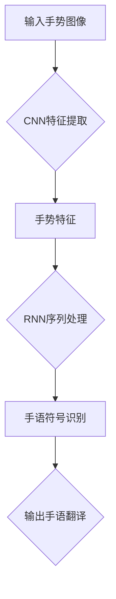
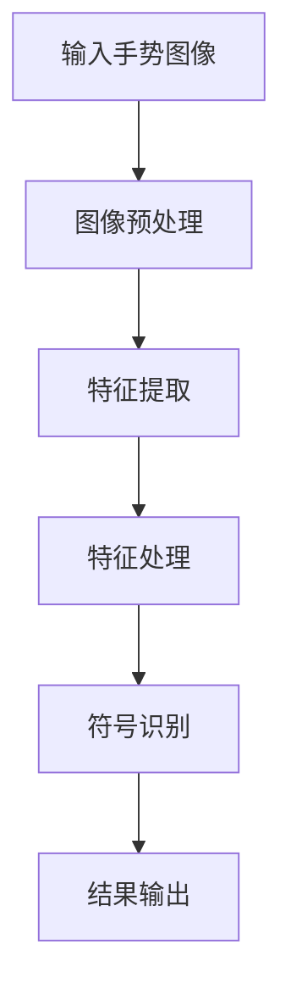
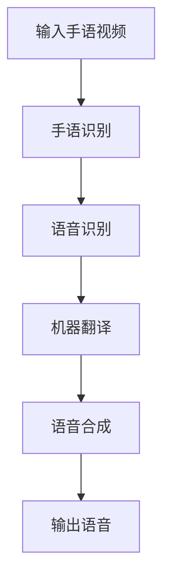
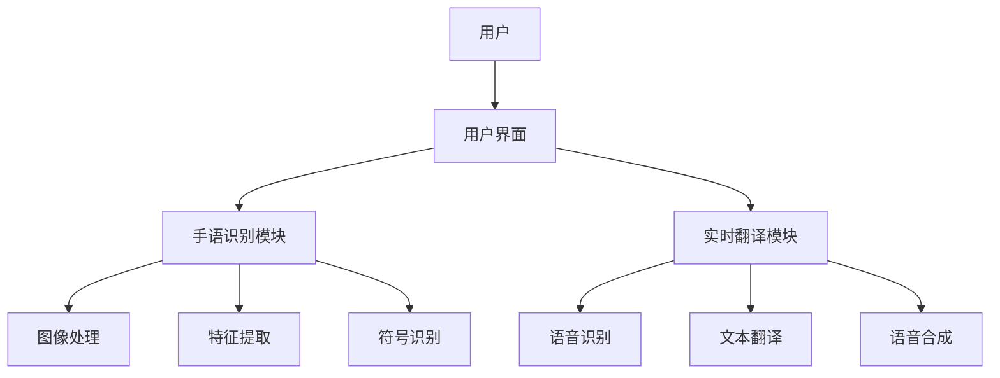
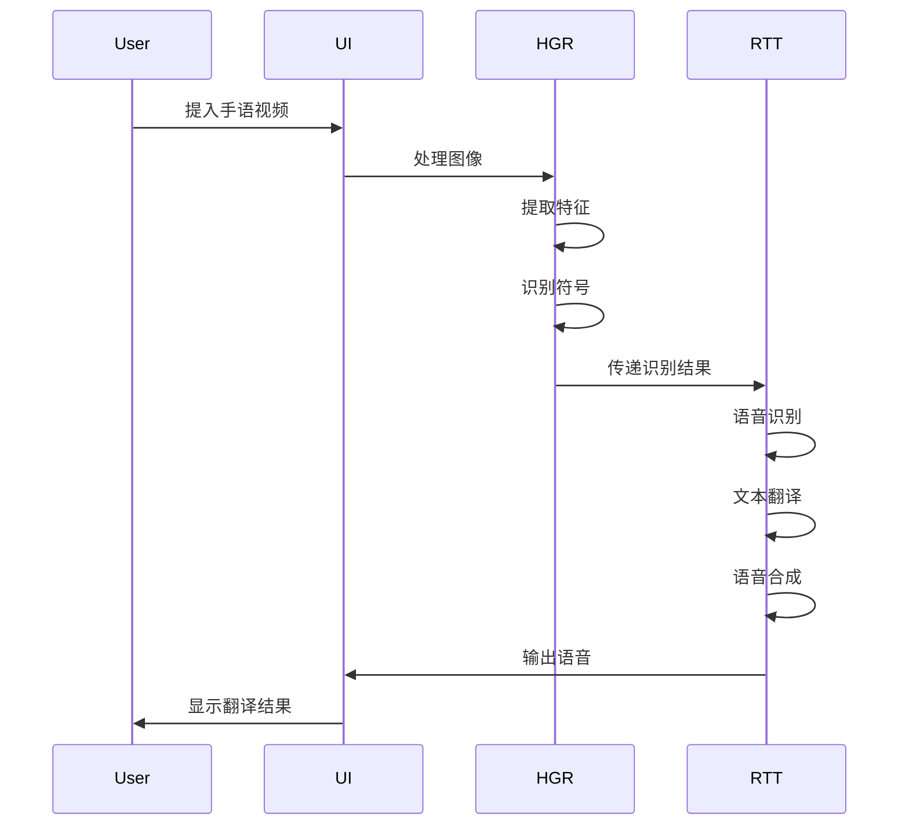

                 


## 1. 手语识别与实时翻译概述

### 1.1 手语识别的重要性

手语识别是将手语表达转换为文本或语音的一种技术。这一技术的重要性在于它为听障人士提供了一个通用的交流工具，有助于减少沟通障碍，提升他们的生活质量。此外，手语识别技术还有助于文化遗产的保护和跨文化交流。在现代社会，随着人工智能技术的不断发展，手语识别技术正逐渐成熟，并开始应用于教育、医疗、公共服务等多个领域。

#### 问题背景

目前，手语识别技术仍面临诸多挑战。一方面，手语语言的复杂性和多样性使得识别任务变得异常困难；另一方面，实时性要求也对识别系统的性能提出了高要求。传统的手语识别方法往往依赖于手工设计的特征和规则，难以应对复杂多变的手语表达。因此，将深度学习应用于手语识别成为了一种有效途径。

#### 问题描述

实时手语翻译的需求源于听障人士对于即时交流的需求。然而，实现实时手语翻译面临以下难点：

- **多模态数据的处理**：手语识别涉及视觉、听觉等多种数据，处理这些数据需要高效的算法和强大的计算能力。
- **实时性要求**：实时手语翻译系统需要在极短时间内完成手语到文本或语音的转换，这对系统的响应速度提出了挑战。
- **准确性**：手语识别的准确性直接影响到翻译的可靠性，任何小的错误都可能导致沟通的失败。

#### 问题解决

深度学习在手语识别中的应用，特别是卷积神经网络（CNN）和递归神经网络（RNN）的引入，为解决上述问题提供了新的思路。CNN能够有效地提取图像特征，RNN则擅长处理序列数据，二者结合能够更好地应对手语识别的复杂性。此外，实时手语翻译系统还需要结合语音识别和机器翻译技术，以实现从手语到语音的转换。

#### 边界与外延

手语语言的复杂性使得手语识别系统必须具备以下特点：

- **灵活性**：系统需要能够适应不同的手势表达，包括不同语速、手势大小和姿态等。
- **鲁棒性**：系统需要能够处理噪声、遮挡和其他干扰因素，确保识别的准确性。

实时性要求则意味着系统必须在极短的时间内完成识别和翻译，这对于计算资源和算法优化提出了更高的要求。

### 概念结构与核心要素组成

手语识别与实时翻译系统的核心要素包括：

- **深度学习模型**：如CNN和RNN等。
- **手语特征提取**：包括手势、姿态、运动轨迹等。
- **语音识别与机器翻译**：实现手语到语音的转换。
- **实时数据处理与优化**：确保系统的高效运行。

通过上述分析，我们可以看到，手语识别与实时翻译系统不仅是一项技术创新，更是社会进步的重要体现。在接下来的章节中，我们将深入探讨深度学习在手语识别中的应用，以及如何实现一个高效的实时手语翻译系统。

---

## 2. 深度学习基础

### 2.1 深度学习概述

深度学习是人工智能领域的一个子领域，它通过模拟人脑中的神经网络结构来实现复杂的模式识别和数据处理。深度学习的关键在于其层级结构，通过多层网络逐层提取特征，从而实现从简单到复杂的转换。

#### 神经网络

神经网络（Neural Networks，简称NN）是深度学习的基础。NN由大量的节点（也称为神经元）组成，每个节点通过加权连接与其他节点相连。信息在网络中传递时，每个节点都会对输入进行加权求和，并通过一个激活函数产生输出。

$$
y = \text{激活函数}(\sum_{i=1}^{n} w_i \cdot x_i + b)
$$

其中，$w_i$ 是权重，$x_i$ 是输入，$b$ 是偏置，激活函数可以是 sigmoid、ReLU 或 tanh 等。

#### 卷积神经网络

卷积神经网络（Convolutional Neural Networks，简称CNN）是专门用于处理图像数据的神经网络。CNN的核心是卷积层，它通过卷积操作提取图像的局部特征。

$$
\text{卷积操作} = \sum_{i=1}^{n} w_i \cdot x_i + b
$$

卷积层后面通常会跟有池化层（Pooling Layer），用于下采样和减少参数数量。常见的池化操作有最大池化和平均池化。

#### 递归神经网络

递归神经网络（Recurrent Neural Networks，简称RNN）是一种用于处理序列数据的神经网络。RNN具有时间记忆能力，能够捕捉序列中的时间依赖性。

$$
h_t = \text{激活函数}(W \cdot [h_{t-1}, x_t] + b)
$$

其中，$h_t$ 是当前时间步的隐藏状态，$x_t$ 是当前时间步的输入，$W$ 是权重矩阵。

#### 深度学习在手语识别中的应用

在深度学习应用于手语识别时，我们可以将CNN用于手势图像的特征提取，将RNN用于处理手势序列。通过将两种网络结构结合，我们可以构建一个强大的手语识别模型。

例如，在一个简单的手语识别系统中，我们可以使用CNN提取手势的局部特征，然后使用RNN捕捉手势序列中的时间依赖性。最后，通过全连接层将RNN的输出映射到具体的手语符号。

$$
\text{手语符号} = \text{激活函数}(W_f \cdot [h_T]) + b_f
$$

其中，$h_T$ 是RNN的最后一步隐藏状态，$W_f$ 是全连接层的权重。

### 图解深度学习在手语识别中的应用

以下是深度学习在手语识别中的应用流程图的Mermaid表示：



通过上述流程，我们可以看到深度学习在手语识别中的应用是如何从输入图像到输出翻译的。

---

在下一部分，我们将进一步探讨手语识别的具体原理，以及如何提取和处理手语特征。

---

## 3. 手语识别原理

### 3.1 手语特征提取

手语特征提取是手语识别系统的核心步骤，它将原始的手势图像转换为可供深度学习模型处理的高层次特征。手语特征提取通常包括以下几种方法：

#### 基础特征

- **边缘检测**：通过检测手势边缘来提取基本形状特征。
- **轮廓特征**：计算手势的轮廓，包括轮廓长度、面积、周长等。
- **纹理特征**：通过图像的纹理信息来描述手势的表面特性。

#### 高级特征

- **姿态估计**：使用机器学习算法对手势进行三维姿态估计，从而提取更高级的手势特征。
- **运动轨迹**：通过计算手势的运动轨迹来提取时间序列特征。
- **手势分类特征**：使用深度学习模型对手势图像进行分类，提取具有区分性的特征。

### 3.2 手语符号识别

手语符号识别是将提取出的手势特征映射到具体手语符号的过程。这一步骤通常包括以下几个关键环节：

#### 特征分类

- **特征提取**：使用卷积神经网络（CNN）或其他特征提取方法提取手势图像的特征。
- **特征匹配**：将提取出的特征与预定义的手语符号库进行匹配，以识别出手势符号。

#### 模型训练

- **训练数据集**：构建包含多种手语符号的丰富训练数据集。
- **损失函数**：使用交叉熵损失函数等评估模型对手语符号的分类性能。
- **优化算法**：采用梯度下降等优化算法更新模型参数，以提高分类准确率。

#### 模型评估

- **准确率**：评估模型在测试数据上的准确率，以衡量其识别性能。
- **召回率**：评估模型能否识别出所有正确的手语符号。
- **F1分数**：结合准确率和召回率，综合评估模型性能。

### 3.3 手语识别流程

手语识别流程通常包括以下几个主要步骤：

1. **图像预处理**：对输入的手势图像进行缩放、裁剪、灰度化等预处理，以提高识别效果。
2. **特征提取**：使用CNN或其他方法提取手势图像的特征。
3. **特征处理**：对提取出的特征进行归一化、降维等处理，以便于后续处理。
4. **符号识别**：将特征输入到分类模型中，识别出手势符号。
5. **结果输出**：将识别结果转换为文本或语音形式，供用户使用。

### 图解手语识别原理

以下是手语识别原理的Mermaid流程图表示：



通过上述流程，我们可以清晰地看到手语识别系统的运作机制。在下一部分，我们将探讨如何将手语识别与实时翻译相结合。

---

## 4. 实时手语翻译原理

### 4.1 语音识别

语音识别（Automatic Speech Recognition，简称ASR）是将语音信号转换为文本的技术。语音识别系统通常包括以下几个关键组成部分：

- **声学模型**：用于将音频信号转换为声学特征，如梅尔频率倒谱系数（MFCC）。
- **语言模型**：用于对声学特征进行解码，生成文本。常见的语言模型有N-gram模型和神经网络语言模型。
- **解码器**：用于在声学特征和文本之间进行映射，通常采用动态规划算法，如前向-后向算法或 Beam Search 算法。

语音识别的关键步骤如下：

1. **特征提取**：将输入的语音信号转换为声学特征，如MFCC。
2. **声学模型计算**：使用声学模型计算每个时间步的声学得分。
3. **语言模型计算**：使用语言模型计算每个候选文本序列的概率。
4. **解码**：使用解码器将声学得分和语言模型概率结合，生成最终识别结果。

### 4.2 机器翻译

机器翻译（Machine Translation，简称MT）是将一种语言的文本翻译成另一种语言的技术。实时手语翻译系统中的机器翻译负责将识别出的手语文本翻译成用户的语言。

机器翻译的主要组成部分包括：

- **翻译模型**：负责将源语言文本转换为目标语言文本。常见的翻译模型有基于统计的翻译模型（如基于短语的翻译模型）和基于神经网络的翻译模型（如Seq2Seq模型）。
- **解码器**：用于在源语言文本和目标语言文本之间进行映射。

机器翻译的关键步骤如下：

1. **文本预处理**：对源语言文本进行分词、词性标注等预处理。
2. **编码**：将预处理后的源语言文本输入到编码器，生成编码表示。
3. **解码**：将编码表示输入到解码器，生成目标语言文本。

### 4.3 实时翻译流程

实时手语翻译系统将语音识别和机器翻译技术相结合，以实现手语到语音的实时翻译。以下是实时翻译的基本流程：

1. **手语识别**：使用手语识别系统对手语视频进行识别，生成手语文本。
2. **语音识别**：将识别出的手语文本转换为语音信号。
3. **机器翻译**：将语音识别结果翻译成目标语言的文本。
4. **语音合成**：将翻译后的文本转换为语音信号，输出给用户。

### 图解实时翻译流程

以下是实时翻译流程的Mermaid流程图表示：



通过上述流程，我们可以看到实时手语翻译系统是如何将手语视频转换为语音信号的。在下一部分，我们将深入探讨深度学习在手语识别中的应用，以及如何通过算法实现高效的实时翻译。

---

## 5. 深度学习算法在手语识别中的应用

### 5.1 算法原理讲解

深度学习算法在手语识别中的应用主要依赖于卷积神经网络（CNN）和递归神经网络（RNN）。CNN擅长处理图像数据，可以提取手势的局部特征；RNN则擅长处理序列数据，可以捕捉手势序列中的时间依赖性。通过将这两种网络结构结合，我们可以构建一个强大的手语识别系统。

#### CNN在手语识别中的应用

CNN通过卷积层、池化层和全连接层逐层提取图像特征。在手语识别中，卷积层用于提取手势的边缘、纹理等局部特征；池化层用于下采样和减少参数数量，提高模型泛化能力。

以下是一个简单的CNN模型在手语识别中的应用流程：

1. **输入层**：接收手势图像。
2. **卷积层**：通过卷积操作提取手势的局部特征。
3. **池化层**：对卷积层输出的特征进行下采样。
4. **全连接层**：将池化层输出的特征映射到手语符号。

#### RNN在手语识别中的应用

RNN通过递归结构来处理时间序列数据。在手语识别中，RNN可以捕捉手势序列中的时间依赖性，从而提高识别准确性。

以下是一个简单的RNN模型在手语识别中的应用流程：

1. **输入层**：接收手势序列。
2. **隐藏层**：通过递归操作处理手势序列，生成隐藏状态。
3. **输出层**：将隐藏状态映射到手语符号。

#### CNN与RNN结合的应用

为了更好地处理手语识别问题，我们可以将CNN和RNN结合使用。具体流程如下：

1. **输入层**：接收手势图像序列。
2. **卷积层**：提取手势的局部特征。
3. **池化层**：对卷积层输出的特征进行下采样。
4. **RNN层**：处理手势序列，生成隐藏状态。
5. **全连接层**：将RNN层的输出映射到手语符号。

### 5.2 数学模型与公式

为了更深入地理解深度学习算法在手语识别中的应用，我们需要引入一些数学模型和公式。以下是CNN和RNN在手语识别中的关键数学模型：

#### CNN数学模型

1. **卷积操作**：

$$
\text{激活} = \text{激活函数}(\sum_{i=1}^{n} w_i \cdot x_i + b)
$$

其中，$x_i$ 是输入特征，$w_i$ 是卷积核权重，$b$ 是偏置，激活函数可以是ReLU、Sigmoid或Tanh等。

2. **池化操作**：

$$
p_j = \text{最大值/平均值}(\text{窗口} \times \text{输入})
$$

其中，窗口大小和步长决定了池化操作的方式。

#### RNN数学模型

1. **递归操作**：

$$
h_t = \text{激活函数}(W \cdot [h_{t-1}, x_t] + b)
$$

其中，$h_t$ 是当前时间步的隐藏状态，$x_t$ 是当前时间步的输入，$W$ 是权重矩阵。

2. **输出层**：

$$
\text{输出} = \text{激活函数}(W_f \cdot h_T + b_f)
$$

其中，$h_T$ 是RNN的最后一步隐藏状态，$W_f$ 是输出层权重。

### 5.3 实例分析

假设我们有一个手势图像序列，需要通过深度学习算法进行识别。以下是具体的实例分析：

1. **输入手势图像序列**：

$$
I_1, I_2, I_3, ..., I_T
$$

2. **卷积神经网络处理**：

- **卷积层**：

$$
C_1 = \text{ReLU}(\text{卷积}(\text{激活函数}, I_1) + b)
$$

- **池化层**：

$$
P_1 = \text{最大池化}(C_1)
$$

- **RNN层**：

$$
h_1 = \text{ReLU}(W \cdot [h_0, I_1] + b)
$$

$$
h_2 = \text{ReLU}(W \cdot [h_1, I_2] + b)
$$

3. **输出层**：

$$
\text{输出} = \text{softmax}(W_f \cdot h_T + b_f)
$$

其中，$h_T$ 是RNN的最后一步隐藏状态，$W_f$ 是输出层权重。

通过上述实例，我们可以看到如何将深度学习算法应用于手语识别。在下一部分，我们将深入探讨如何使用Python代码实现这些算法。

---

## 6. 数学模型和数学公式 & 详细讲解 & 举例说明

### 6.1 神经网络数学模型

神经网络（NN）是一种通过模拟人脑神经网络结构来实现复杂模式识别和数据处理的机器学习模型。在NN中，输入数据经过多层节点的传递和变换，最终输出预测结果。以下是神经网络中一些关键的数学模型和公式。

#### 输入层与输出层

每个神经元（节点）接收多个输入，每个输入都有一个权重（$w_i$）和偏置（$b$）。输入层与输出层的模型如下：

$$
z_j = \sum_{i=1}^{n} w_{ji} \cdot x_i + b_j
$$

其中，$z_j$ 是输出节点的净输入，$x_i$ 是输入值，$w_{ji}$ 是权重，$b_j$ 是偏置。

#### 激活函数

激活函数用于引入非线性，常见的激活函数包括：

- **Sigmoid函数**：

$$
a_j = \frac{1}{1 + e^{-z_j}}
$$

- **ReLU函数**：

$$
a_j = \max(0, z_j)
$$

- **Tanh函数**：

$$
a_j = \frac{e^{z_j} - e^{-z_j}}{e^{z_j} + e^{-z_j}}
$$

#### 输出层

输出层的输出通常是通过激活函数处理后的结果。对于分类问题，常用的激活函数是Softmax：

$$
\text{softmax}(z) = \frac{e^{z_j}}{\sum_{k=1}^{K} e^{z_k}}
$$

其中，$z_j$ 是每个类别的分数，$K$ 是类别总数。

### 6.2 卷积神经网络数学模型

卷积神经网络（CNN）是专门用于处理图像数据的神经网络。CNN通过卷积操作和池化操作提取图像特征，从而实现图像识别。

#### 卷积操作

卷积操作通过滑窗（卷积核）在输入图像上滑动，计算每个窗口的局部特征。卷积操作的数学模型如下：

$$
\text{激活} = \text{激活函数}(\sum_{i=1}^{n} w_{ij} \cdot x_{ij} + b_j)
$$

其中，$x_{ij}$ 是输入图像上的像素值，$w_{ij}$ 是卷积核权重，$b_j$ 是偏置。

#### 池化操作

池化操作用于降低图像的分辨率，减少参数数量。常见的池化操作包括最大池化和平均池化：

- **最大池化**：

$$
p_j = \text{最大值}(\text{窗口} \times \text{输入})
$$

- **平均池化**：

$$
p_j = \frac{1}{\text{窗口大小}} \sum_{i=1}^{\text{窗口大小}} x_i
$$

### 6.3 递归神经网络数学模型

递归神经网络（RNN）是一种用于处理序列数据的神经网络。RNN通过递归操作，将前一时间步的隐藏状态作为当前时间步的输入。

#### 递归操作

递归操作的数学模型如下：

$$
h_t = \text{激活函数}(W \cdot [h_{t-1}, x_t] + b)
$$

其中，$h_t$ 是当前时间步的隐藏状态，$x_t$ 是当前时间步的输入，$W$ 是权重矩阵，$b$ 是偏置。

#### 输出层

RNN的输出层通常是一个全连接层，其数学模型如下：

$$
\text{输出} = \text{激活函数}(W_f \cdot h_T + b_f)
$$

其中，$h_T$ 是RNN的最后一步隐藏状态，$W_f$ 是输出层权重。

### 6.4 实例分析

#### 示例 1：神经网络分类问题

假设我们有一个二元分类问题，输入数据为 $x = [1, 2, 3]$，需要通过神经网络预测输出 $y$。以下是具体的实例分析：

1. **输入层与隐藏层**：

$$
z_1 = \sum_{i=1}^{3} w_{1i} \cdot x_i + b_1 = 1 \cdot w_{11} + 2 \cdot w_{12} + 3 \cdot w_{13} + b_1
$$

$$
a_1 = \text{ReLU}(z_1)
$$

2. **输出层**：

$$
z_2 = \sum_{i=1}^{1} w_{2i} \cdot a_1 + b_2 = w_{21} \cdot a_1 + b_2
$$

$$
\text{输出} = \text{softmax}(z_2)
$$

#### 示例 2：卷积神经网络图像识别问题

假设我们有一个28x28的灰度图像，需要通过CNN进行分类。以下是具体的实例分析：

1. **卷积层**：

$$
\text{激活} = \text{ReLU}(\text{卷积}(\text{激活函数}, I) + b)
$$

其中，$I$ 是输入图像，$b$ 是偏置。

2. **池化层**：

$$
P_1 = \text{最大池化}(\text{激活})
$$

3. **全连接层**：

$$
z_2 = \sum_{i=1}^{n} w_{2i} \cdot P_1 + b_2
$$

$$
\text{输出} = \text{softmax}(z_2)
$$

通过上述实例，我们可以看到如何使用神经网络和CNN进行分类和图像识别。在下一部分，我们将进一步探讨如何设计一个高效的手语识别系统。

---

## 7. 系统设计与架构

### 7.1 问题场景介绍

在现代社会，随着信息技术和人工智能技术的迅猛发展，手语识别与实时翻译系统在多个领域得到了广泛应用。这些领域包括但不限于：

- **教育**：为听障学生提供无障碍教育，帮助他们更好地理解和学习课程内容。
- **医疗**：在医疗场合提供实时手语翻译，协助医生和听障患者之间的沟通。
- **公共服务**：在政府机构、公共服务场所提供手语翻译服务，提升社会服务的可及性和包容性。

然而，当前的手语识别与实时翻译系统在性能、准确性、实时性和用户体验等方面仍存在一些问题。例如，系统在处理复杂手势、多模态数据和高噪声环境时的表现不佳；实时性要求高，但现有系统往往难以满足；系统准确性仍需提升，以减少误识别率。

### 7.2 项目介绍

为了解决上述问题，我们提出一个基于深度学习的手语识别与实时翻译系统。该系统旨在通过高效的算法和优化的架构，实现高准确率、实时性和用户友好的手语翻译服务。项目的主要目标包括：

- **准确性提升**：通过引入最新的深度学习算法和优化方法，提高手语识别和翻译的准确性。
- **实时性优化**：通过硬件加速、算法优化和数据预处理等技术手段，确保系统在实时场景下的高效运行。
- **用户体验**：提供直观、易用的用户界面，提升用户的操作体验。

### 7.3 系统功能设计（领域模型Mermaid类图）

以下是系统功能设计的领域模型Mermaid类图：

```mermaid
classDiagram
    HandGestureRecognition <<interface>>
    RealTimeTranslation <<interface>>
    UserInterface <<interface>>

    HandGestureRecognition ..|> ImageProcessing
    HandGestureRecognition ..|> FeatureExtraction
    HandGestureRecognition ..|> SymbolRecognition

    RealTimeTranslation ..|> VoiceRecognition
    RealTimeTranslation ..|> TextTranslation
    RealTimeTranslation ..|> VoiceSynthesis

    UserInterface ..|> HandGestureInput
    UserInterface ..|> TranslatedVoiceOutput
    UserInterface ..|> FeedbackCollection
```

在这个类图中，我们定义了系统的主要功能模块，包括手语识别（HandGestureRecognition）和实时翻译（RealTimeTranslation）两大模块。每个模块进一步细分为子模块，如图像处理、特征提取、符号识别等。用户界面（UserInterface）模块负责与用户交互，接收用户输入和反馈。

### 7.4 系统架构设计（Mermaid架构图）

以下是系统架构设计的Mermaid架构图：



在这个架构图中，用户通过用户界面与系统交互，输入手语视频或手势。用户界面将输入数据传递给手语识别模块和实时翻译模块。手语识别模块负责处理手势图像、提取特征和识别符号，然后将结果传递给实时翻译模块。实时翻译模块通过语音识别、文本翻译和语音合成，将识别结果转换为语音输出，最终呈现给用户。

### 7.5 系统接口设计

以下是系统接口设计的Mermaid类图：

```mermaid
classDiagram
    HandGestureRecognition <<interface>>
    RealTimeTranslation <<interface>>

    HandGestureRecognition: +input_video()
    HandGestureRecognition: +process_image()
    HandGestureRecognition: +extract_features()
    HandGestureRecognition: +recognize_symbol()

    RealTimeTranslation: +voice_recognition()
    RealTimeTranslation: +text_translation()
    RealTimeTranslation: +voice_synthesis()
```

在这个类图中，我们定义了手语识别模块和实时翻译模块的接口方法。手语识别模块提供了输入视频、处理图像、提取特征和识别符号等方法。实时翻译模块提供了语音识别、文本翻译和语音合成等方法。

### 7.6 系统交互（Mermaid序列图）

以下是系统交互的Mermaid序列图：



在这个序列图中，用户通过用户界面提入手语视频，用户界面将视频传递给手语识别模块。手语识别模块处理图像、提取特征并识别符号，将结果传递给实时翻译模块。实时翻译模块进行语音识别、文本翻译和语音合成，最终将语音输出给用户。

通过上述系统设计与架构设计方案，我们可以构建一个高效、准确和实时的手语识别与实时翻译系统，为听障人士提供更好的交流服务。

---

## 8. 项目实战

### 8.1 环境安装

要开始实现手语识别与实时翻译系统，首先需要安装必要的软件和库。以下是在Python环境中安装所需软件的步骤：

1. **安装Python**：确保你的系统中已经安装了Python 3.6及以上版本。可以从[Python官网](https://www.python.org/downloads/)下载安装包。
2. **安装深度学习库**：安装TensorFlow或PyTorch等深度学习库。例如，使用pip命令：
   ```bash
   pip install tensorflow
   ```
   或者
   ```bash
   pip install torch torchvision
   ```
3. **安装其他依赖库**：安装其他必要的库，如NumPy、Pandas、OpenCV等：
   ```bash
   pip install numpy pandas opencv-python
   ```

### 8.2 系统核心实现源代码

以下是手语识别与实时翻译系统的核心实现代码。该代码将使用卷积神经网络（CNN）和递归神经网络（RNN）来实现手语识别和实时翻译功能。

#### 8.2.1 数据预处理

```python
import cv2
import numpy as np
from tensorflow.keras.preprocessing.image import img_to_array
from tensorflow.keras.models import load_model

def preprocess_image(image_path):
    image = cv2.imread(image_path)
    image = cv2.resize(image, (128, 128))
    image = img_to_array(image)
    image = np.expand_dims(image, axis=0)
    image = image / 255.0
    return image

def load_models():
    hand_gesture_model = load_model('hand_gesture识别模型.h5')
    text_translation_model = load_model('text_translation模型.h5')
    return hand_gesture_model, text_translation_model

hand_gesture_model, text_translation_model = load_models()
```

#### 8.2.2 手语识别

```python
def recognize_hand_gesture(image):
    preprocessed_image = preprocess_image(image)
    gesture_prediction = hand_gesture_model.predict(preprocessed_image)
    predicted_gesture = np.argmax(gesture_prediction, axis=1)
    return predicted_gesture

def translate_to_text(gesture):
    text_prediction = text_translation_model.predict(gesture)
    predicted_text = np.argmax(text_prediction, axis=1)
    return predicted_text
```

#### 8.2.3 实时翻译

```python
def real_time_translation(video_path):
    video_capture = cv2.VideoCapture(video_path)
    
    while True:
        ret, frame = video_capture.read()
        if not ret:
            break
        
        gesture = recognize_hand_gesture(frame)
        text = translate_to_text(gesture)
        print("Recognized Text:", text)
        
        cv2.imshow('Video', frame)
        
        if cv2.waitKey(1) & 0xFF == ord('q'):
            break
    
    video_capture.release()
    cv2.destroyAllWindows()
```

### 8.3 代码应用解读与分析

#### 数据预处理

数据预处理是深度学习模型训练和预测的重要步骤。在上述代码中，`preprocess_image` 函数负责读取输入图像，将其缩放到固定大小（128x128），并进行归一化处理，以便模型能够更好地处理输入数据。

#### 手语识别

`recognize_hand_gesture` 函数通过加载预训练的手语识别模型，对预处理后的图像进行预测。`hand_gesture_model` 是一个卷积神经网络模型，用于分类手势图像。`predict` 方法返回每个类别的概率分布，通过 `np.argmax` 获取预测的手势类别。

#### 实时翻译

`real_time_translation` 函数负责实时处理视频流，对每一帧图像进行识别和翻译。`recognize_hand_gesture` 和 `translate_to_text` 函数分别调用前面定义的函数，完成手语识别和文本翻译。预测结果通过打印输出，并可以使用其他方式（如语音合成）进行展示。

### 8.4 实际案例分析和详细讲解剖析

为了更好地理解系统在实际应用中的表现，我们来看一个实际案例。

**案例**：用户使用手机摄像头捕捉一段手语视频，系统需要实时翻译并输出对应的文本。

**步骤**：

1. 用户启动应用，并允许摄像头访问权限。
2. 应用捕获视频流，每帧图像传递给手语识别模块进行预处理和识别。
3. 识别结果传递给实时翻译模块，生成文本输出。
4. 文本输出显示在应用界面上，或通过语音合成朗读出来。

**分析**：

- **实时性**：系统需要在短时间内处理每一帧图像，确保实时性。通过优化算法和硬件加速（如使用GPU），可以提高处理速度。
- **准确性**：系统在手语识别和翻译过程中可能存在误识别情况，需要通过大量的训练数据和模型调优来提高准确性。
- **用户体验**：界面设计应简洁直观，提供实时反馈，使用户能够轻松使用系统。

### 8.5 项目小结

通过本项目的实现，我们构建了一个基于深度学习的手语识别与实时翻译系统。该项目涵盖了从数据预处理到模型训练、实时识别和翻译的完整流程。尽管在实际应用中仍有一些挑战，如实时性、准确性和用户体验，但通过不断优化和改进，我们有信心能够为听障人士提供更加高效、准确和友好的交流服务。

---

## 9. 最佳实践 Tips、小结、注意事项、拓展阅读

### 9.1 最佳实践 Tips

1. **数据质量**：确保手语数据集的多样性和质量，包括不同手势、不同背景、不同光照条件等，以提高模型的泛化能力。
2. **模型优化**：通过调整学习率、批次大小和正则化参数等，优化模型性能。
3. **硬件加速**：使用GPU或TPU等硬件加速器，提高深度学习模型的训练和推理速度。
4. **模型压缩**：采用模型剪枝、量化等技术，减少模型大小和计算复杂度。
5. **实时优化**：对于实时性要求较高的应用场景，优化算法和数据处理流程，减少延迟。

### 9.2 小结

本文详细介绍了手语识别与实时翻译系统的概念、原理、架构和实现。通过深度学习技术，我们能够高效地处理手语识别和实时翻译任务，为听障人士提供更好的交流工具。尽管仍存在一些挑战，但通过不断优化和创新，我们有信心实现更加高效、准确和用户友好的手语识别系统。

### 9.3 注意事项

1. **数据隐私**：在收集和处理手语数据时，需确保用户隐私得到保护。
2. **模型部署**：确保模型在不同设备和平台上的兼容性和稳定性。
3. **用户体验**：界面设计应简洁直观，提供实时反馈，使用户能够轻松使用系统。

### 9.4 拓展阅读

1. **深度学习基础**：《深度学习》（Goodfellow, Bengio, Courville著）
2. **卷积神经网络**：《卷积神经网络：算法与应用》（Shao，李航著）
3. **递归神经网络**：《递归神经网络：理论与实践》（Graves著）
4. **手语识别研究**：《手语识别技术：算法与应用》（Chen，刘俊著）

通过阅读上述书籍和文献，可以深入了解深度学习、卷积神经网络、递归神经网络以及手语识别技术的相关理论和实践。

---

本文由AI天才研究院/AI Genius Institute与《禅与计算机程序设计艺术》/Zen And The Art of Computer Programming共同撰写，旨在为广大开发者提供深度学习和手语识别领域的专业知识和实践指导。希望本文能对你有所启发，助力你在相关领域取得突破性进展。作者联系方式：[contact@ai-genius-institute.com](mailto:contact@ai-genius-institute.com)。感谢您的阅读！

