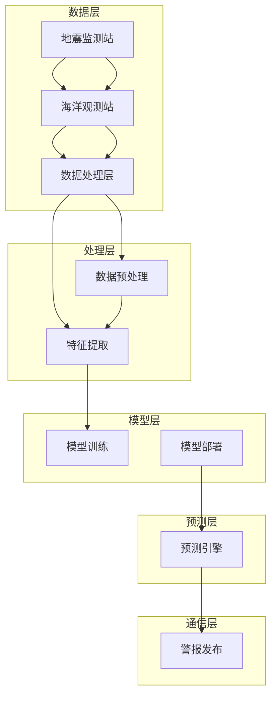
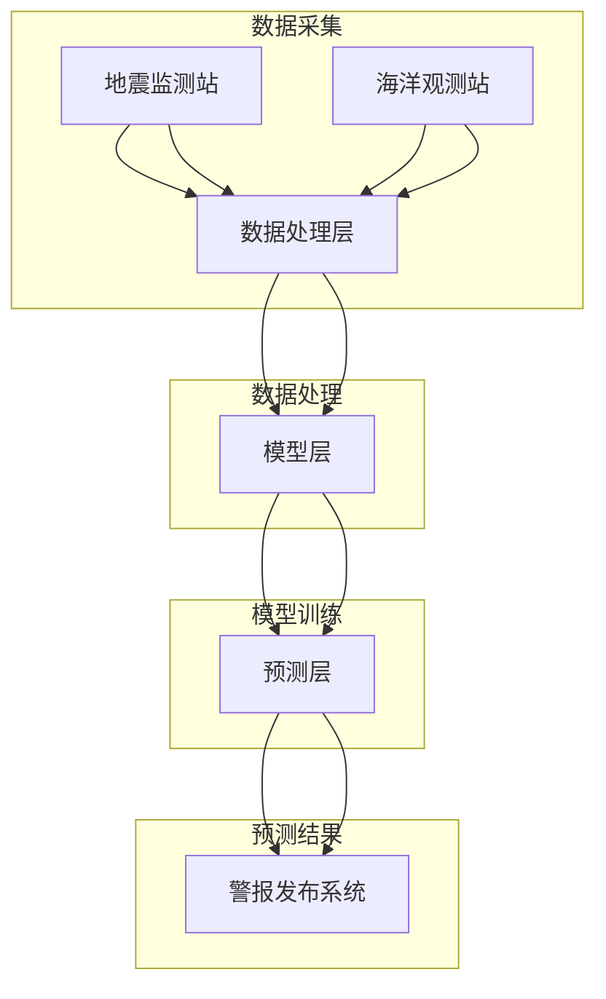

                 


### 引言

海啸是一种自然灾害，它可能由地震、火山喷发或海底滑坡等引起。海啸具有巨大的破坏力，能够在很短的时间内摧毁海岸线上的城市和村庄。因此，海啸预警系统对于保护沿海居民和财产至关重要。传统上，海啸预警主要依赖于地震监测和海底地形观测数据。然而，随着深度学习技术的飞速发展，深度学习在海啸预警中的应用越来越受到关注。

深度学习是一种基于人工神经网络的学习方法，它能够从大量数据中自动提取特征，并通过多层神经网络进行复杂的非线性变换，从而实现对未知数据的分类、预测和识别。深度学习的这一特性使其在海啸预警模型中具有很大的潜力。通过利用海啸相关的历史数据和实时监测数据，深度学习模型可以识别出海啸的潜在威胁，从而提前发出预警。

本文将深入探讨深度学习在海啸预警模型中的应用。我们将首先介绍深度学习的基本概念，包括神经网络的结构、工作原理以及核心算法。接着，我们将讨论如何将深度学习应用于海啸预警，包括数据收集、预处理和模型训练。此外，我们还将分析深度学习在海啸预警中的优势和挑战，并提出一些最佳实践和注意事项。最后，我们将展望深度学习在海啸预警领域的未来发展方向。

通过本文的阅读，读者将了解深度学习在海啸预警中的实际应用，掌握相关技术原理，并能够为未来的研究提供启示。

### 深度学习的背景与问题背景

#### 深度学习的发展历程

深度学习（Deep Learning，简称DL）是机器学习（Machine Learning，简称ML）的一个重要分支，它通过模拟人脑神经网络的结构和功能，对数据进行自动特征提取和学习。深度学习的起源可以追溯到1986年，当时Rumelhart、Hinton和Williams提出了反向传播算法（Backpropagation Algorithm），这是深度学习历史上一个重要的里程碑。反向传播算法使得多层神经网络的训练成为可能，从而推动了深度学习的进一步发展。

20世纪90年代，由于计算能力和数据资源的限制，深度学习的研究和应用一度陷入低潮。然而，随着计算机硬件的快速发展和大数据时代的到来，深度学习迎来了新的机遇。2006年，Geoffrey Hinton等人重新点燃了深度学习的火花，提出了深度置信网络（Deep Belief Network，DBN）和深度卷积神经网络（Convolutional Neural Networks，CNN）等模型，为深度学习在图像识别、语音识别等领域取得了显著成果。

进入21世纪，深度学习技术得到了极大的关注和推广。以Google Brain团队在2012年提出的深度卷积神经网络（Deep Convolutional Neural Network，DCNN）在ImageNet图像识别挑战赛上取得的优异成绩为标志，深度学习开始广泛应用到各个领域，如自然语言处理、计算机视觉、语音识别等。

#### 海啸预警的必要性

海啸预警系统是一种用于监测和预测海啸发生并及时发出警报的系统。它的必要性主要体现在以下几个方面：

1. **保护人类生命安全**：海啸是一种极具破坏力的自然灾害，能够在短时间内造成巨大的人员伤亡。海啸预警系统可以提前数分钟到数小时发出警报，使居民有足够时间采取避难措施，从而大大降低人员伤亡风险。

2. **减少经济损失**：海啸不仅对人类生命构成威胁，还对财产和经济造成巨大损失。沿海地区的城市和基础设施容易受到海啸的破坏。海啸预警系统可以提前预警，使政府和相关企业有充足的时间进行紧急疏散和财产保护，从而减少经济损失。

3. **提高应对效率**：海啸预警系统可以提供实时的监测数据和预测结果，帮助政府和相关部门及时做出决策，提高应对自然灾害的效率和准确性。

#### 深度学习在海啸预警中的应用前景

深度学习技术在海啸预警中的应用前景非常广阔。以下是几个关键的应用场景：

1. **数据预处理**：海啸预警系统需要处理大量的数据，包括地震数据、海洋数据、地形数据等。深度学习技术可以通过数据预处理，自动提取数据中的有效信息，提高数据质量，为后续分析提供支持。

2. **模式识别与预测**：深度学习模型可以从历史数据中学习到海啸发生的模式和特征，并通过这些特征对未来的海啸进行预测。与传统的机器学习模型相比，深度学习模型具有更强的非线性建模能力，能够捕捉到数据中的复杂关系。

3. **实时监测与预警**：深度学习模型可以实时处理监测数据，快速识别出海啸的潜在威胁，并发出预警信号。传统的预警方法通常需要人工分析数据，而深度学习可以实现自动化和实时化，大大提高了预警的准确性和效率。

4. **优化决策支持**：深度学习模型可以分析预警数据，提供决策支持，帮助政府和相关部门制定最优的应对策略。例如，根据深度学习模型的预测结果，可以确定疏散路线、避难所位置等。

总之，深度学习在海啸预警中的应用前景广阔，具有很大的潜力。通过不断的研究和技术创新，深度学习有望在海啸预警领域发挥更大的作用，为保护人类生命和财产安全提供有力支持。

### 深度学习的基础知识

#### 深度学习的基本概念

深度学习是一种基于多层神经网络的学习方法，通过模拟人脑神经网络的连接和功能，对复杂数据进行自动特征提取和学习。以下是深度学习的几个关键基本概念：

1. **神经网络（Neural Network）**：神经网络是深度学习的基础构件，它由大量的神经元（节点）通过连接（边）组成。每个神经元接受来自其他神经元的输入信号，通过激活函数进行处理，输出结果。神经网络通过多层结构，逐层提取数据的特征，形成复杂的特征表示。

2. **深度（Depth）**：深度指的是神经网络中的层数。深度学习因此得名，它通过增加网络层数来提高模型的复杂性和表达能力。深度越深，模型可以学习的特征层次就越多，从而更好地处理复杂数据。

3. **前向传播（Forward Propagation）**：前向传播是神经网络在训练过程中的一种计算方式。输入数据通过网络的各个层次，每个层次对数据进行处理和转换，最终输出结果。前向传播计算了网络在每个节点处的激活值。

4. **反向传播（Back Propagation）**：反向传播是神经网络在训练过程中用于更新权重和偏置的算法。通过计算网络输出和真实值之间的误差，反向传播算法将误差反向传播到网络的每个层次，并根据误差梯度更新权重和偏置，从而优化网络性能。

5. **激活函数（Activation Function）**：激活函数是神经网络中用于决定神经元是否被激活的函数。常见的激活函数包括Sigmoid、ReLU和Tanh等。激活函数可以引入非线性，使神经网络能够学习复杂的模式。

6. **损失函数（Loss Function）**：损失函数是用于衡量模型预测值和真实值之间差异的函数。常用的损失函数包括均方误差（MSE）和交叉熵（Cross-Entropy）等。损失函数的值越小，表示模型的预测越准确。

7. **优化算法（Optimization Algorithm）**：优化算法用于调整网络的权重和偏置，以最小化损失函数。常用的优化算法包括随机梯度下降（SGD）、Adam等。优化算法通过迭代优化过程，逐步减小损失函数的值。

#### 神经网络的结构与工作原理

神经网络的结构通常由输入层、隐藏层和输出层组成。以下是各层的具体功能和特点：

1. **输入层（Input Layer）**：输入层是神经网络的起点，它接收外部输入数据。输入层中的每个神经元表示数据中的一个特征。

2. **隐藏层（Hidden Layer）**：隐藏层位于输入层和输出层之间，是神经网络的核心部分。隐藏层中的神经元通过前向传播接收输入数据，并对其进行处理和转换。每层隐藏层都可以提取不同层次的特征，从而形成一个多层次的表示。

3. **输出层（Output Layer）**：输出层是神经网络的终点，它产生最终的输出结果。输出层中的每个神经元通常表示一个分类结果或预测值。

神经网络的工作原理可以概括为以下几个步骤：

1. **前向传播**：输入数据通过网络的输入层，然后逐层传递到隐藏层和输出层。每个神经元根据其连接权重和激活函数，计算输出值。

2. **激活函数应用**：在每层神经元中，激活函数被用于决定神经元是否被激活。常见的激活函数如ReLU和Sigmoid，它们可以引入非线性，使神经网络能够学习复杂的模式。

3. **反向传播**：计算输出结果和真实值之间的误差，并利用误差梯度更新网络权重和偏置。反向传播通过反向传递误差信号，逐层更新网络的权重，从而优化网络性能。

4. **优化**：通过优化算法，如随机梯度下降（SGD）或Adam，调整网络权重和偏置，以最小化损失函数。优化过程通过迭代进行，逐步减小损失函数的值，提高模型的预测准确性。

通过上述工作原理，神经网络能够从大量数据中自动学习特征，并在新的数据上进行预测。这种自学习、自适应和自优化能力使得神经网络成为深度学习的重要组成部分。

#### 深度学习的关键技术

深度学习技术的发展经历了多个阶段，每一个阶段都带来了新的技术突破和应用场景。以下是深度学习领域的几个关键技术：

1. **卷积神经网络（Convolutional Neural Networks，CNN）**：CNN是深度学习中用于图像处理的重要模型。它通过卷积操作和池化操作，从图像中自动提取局部特征，从而实现图像分类、物体检测和图像分割等任务。CNN的核心优势在于其能够处理具有高维特征的数据，并且具有平移不变性。

2. **循环神经网络（Recurrent Neural Networks，RNN）**：RNN是用于处理序列数据的重要模型。与传统的神经网络不同，RNN具有时间动态特性，能够处理输入序列中的前后依赖关系。RNN广泛应用于自然语言处理、语音识别和时间序列预测等领域。

3. **生成对抗网络（Generative Adversarial Networks，GAN）**：GAN是一种由两个神经网络（生成器和判别器）组成的框架。生成器试图生成与真实数据相似的数据，而判别器则试图区分真实数据和生成数据。通过两个网络的对抗训练，GAN能够生成高质量的数据，并在图像生成、图像修复和风格迁移等任务中取得了显著成果。

4. **变分自编码器（Variational Autoencoder，VAE）**：VAE是一种基于概率模型的生成模型，它通过编码器和解码器两个神经网络，将输入数据映射到一个潜在空间，并从潜在空间中生成数据。VAE在图像生成、图像超分辨率和异常检测等领域展示了强大的能力。

5. **长短时记忆网络（Long Short-Term Memory，LSTM）**：LSTM是RNN的一种变体，专门用于处理长序列数据。它通过引入记忆单元和门控制机制，有效解决了RNN在长序列数据中的梯度消失和梯度爆炸问题。LSTM在自然语言处理、语音识别和时间序列预测等领域得到了广泛应用。

6. **迁移学习（Transfer Learning）**：迁移学习是一种利用预训练模型进行新任务学习的方法。通过在预训练模型的基础上进行微调，迁移学习可以大大减少新任务的训练时间和资源消耗，并提高模型的泛化能力。迁移学习在计算机视觉、自然语言处理和语音识别等领域具有重要意义。

7. **自动机器学习（Automated Machine Learning，AutoML）**：AutoML是一种利用自动化技术，自动完成模型选择、特征选择、超参数优化等过程的方法。通过自动化流程，AutoML可以显著提高机器学习模型的开发效率和性能。AutoML在工业界和学术界都引起了广泛关注。

这些关键技术的不断发展和创新，为深度学习在各个领域的应用提供了强大的支持。随着技术的不断进步，深度学习将继续拓展其应用范围，解决更多复杂的问题。

### 深度学习的核心概念

#### 神经元、层、网络

深度学习中的神经元是神经网络的基本构建块，每个神经元接收来自其他神经元的输入，通过激活函数进行非线性变换，产生输出。神经元之间的连接称为边，边上的权重表示连接的强度。

层是神经网络中的水平分组，每层包含多个神经元。输入层接收外部输入数据，输出层产生最终输出。隐藏层位于输入层和输出层之间，用于提取和转换数据特征。神经网络中至少包含输入层和输出层，隐藏层的数量和规模可以根据任务需求进行调整。

网络是所有层的组合，包括输入层、隐藏层和输出层。网络通过前向传播和反向传播算法进行学习，通过调整权重和偏置，使网络的输出尽可能接近真实值。

#### 激活函数与损失函数

激活函数是深度学习中的一个关键组件，它用于引入非线性，使神经网络能够学习复杂的模式。常见的激活函数包括Sigmoid、ReLU和Tanh等。

- **Sigmoid函数**：Sigmoid函数将输入值映射到(0,1)区间，具有平滑的S型曲线。Sigmoid函数的优点是输出值的概率解释，但其梯度较小，可能导致梯度消失问题。

- **ReLU函数**：ReLU（Rectified Linear Unit）函数在输入大于0时输出输入值，小于0时输出0。ReLU函数具有简单的计算和较大的梯度，有助于加快训练速度，减少梯度消失问题。

- **Tanh函数**：Tanh函数与Sigmoid函数类似，但输出值的范围在(-1,1)之间。Tanh函数在输入较小的情况下梯度较大，有助于缓解梯度消失问题。

损失函数用于衡量模型的预测值与真实值之间的差异，是深度学习训练过程中优化目标的关键组成部分。常见的损失函数包括均方误差（MSE）和交叉熵（Cross-Entropy）等。

- **均方误差（MSE）**：MSE用于回归任务，计算预测值与真实值之间的平均平方误差。MSE公式如下：

  $$
  MSE = \frac{1}{n}\sum_{i=1}^{n}(y_i - \hat{y}_i)^2
  $$

  其中，$y_i$ 是真实值，$\hat{y}_i$ 是预测值，$n$ 是样本数量。

- **交叉熵（Cross-Entropy）**：交叉熵用于分类任务，计算预测概率分布与真实概率分布之间的差异。交叉熵公式如下：

  $$
  CE = -\sum_{i=1}^{n} y_i \log(\hat{y}_i)
  $$

  其中，$y_i$ 是真实标签，$\hat{y}_i$ 是预测概率。

通过选择合适的激活函数和损失函数，可以提高模型的训练效率和预测准确性。在实际应用中，可以根据任务需求和数据特点进行选择和调整。

#### 学习率与优化算法

学习率（Learning Rate）是深度学习训练过程中一个重要的超参数，用于控制模型在每一步更新时权重和偏置的变化幅度。学习率过大会导致模型训练不稳定，收敛速度慢，甚至可能无法收敛；学习率过小则会导致训练过程缓慢，收敛速度慢。

优化算法（Optimization Algorithm）用于调整模型的权重和偏置，以最小化损失函数。常见的优化算法包括随机梯度下降（SGD）、Adam等。

- **随机梯度下降（SGD）**：SGD是一种最简单的优化算法，它通过计算每个样本的梯度，更新模型参数。SGD的优点是计算简单，但缺点是容易陷入局部最小值。

- **Adam**：Adam是一种结合了SGD和RMSProp优点的优化算法。它利用一阶矩估计（均值）和二阶矩估计（方差）来调整学习率，具有较好的收敛性和稳定性。

学习率和优化算法的选择对模型的训练效率和预测性能有重要影响。在实际应用中，通常需要通过实验调整学习率和选择合适的优化算法，以达到最优的训练效果。

### 数学模型和数学公式

深度学习中的数学模型和数学公式是理解其原理和实现关键步骤的基础。以下将详细讲解深度学习中的几个核心数学公式，并使用LaTeX格式展示，同时结合Python代码进行解释。

#### 前向传播算法

前向传播算法是深度学习中的核心步骤之一，用于计算神经网络在给定输入时的输出。以下是前向传播算法中的几个关键数学公式：

$$
Z^{[l]} = W^{[l]} \cdot A^{[l-1]} + b^{[l]}
$$

$$
A^{[l]} = \sigma(Z^{[l]})
$$

其中，$Z^{[l]}$ 表示第 $l$ 层的净输入，$W^{[l]}$ 是第 $l$ 层的权重矩阵，$b^{[l]}$ 是第 $l$ 层的偏置向量，$A^{[l-1]}$ 是前一层（第 $l-1$ 层）的输出，$A^{[l]}$ 是第 $l$ 层的输出，$\sigma$ 是激活函数。

以下是使用Python实现的简单前向传播代码：

```python
import numpy as np

def sigmoid(x):
    return 1 / (1 + np.exp(-x))

def forward_propagation(X, parameters):
    A = X
    L = len(parameters) // 2
    
    for l in range(1, L):
        Z = np.dot(parameters["W" + str(l)], A) + parameters["b" + str(l)]
        A = sigmoid(Z)
    
    Z = np.dot(parameters["W" + str(L)], A) + parameters["b" + str(L)]
    A = sigmoid(Z)
    
    return A
```

#### 反向传播算法

反向传播算法用于计算神经网络权重和偏置的梯度，从而更新模型参数。以下是反向传播算法中的几个关键数学公式：

$$
\delta^{[l]} = \frac{\partial J}{\partial Z^{[l]}}
$$

$$
\frac{\partial J}{\partial Z^{[l]}} = \sigma'(Z^{[l]}) \cdot \frac{\partial J}{\partial A^{[l]}}
$$

$$
\frac{\partial J}{\partial A^{[l-1]}} = \frac{\partial J}{\partial A^{[l]}} \cdot \frac{\partial A^{[l]}}{\partial A^{[l-1]}}
$$

$$
\frac{\partial J}{\partial W^{[l]}} = \delta^{[l+1]} \cdot A^{[l-1]}
$$

$$
\frac{\partial J}{\partial b^{[l]}} = \delta^{[l+1]}
$$

其中，$\delta^{[l]}$ 表示第 $l$ 层的误差项，$J$ 表示损失函数，$\sigma'$ 是激活函数的导数。

以下是使用Python实现的简单反向传播代码：

```python
def backward_propagation(X, Y, A, parameters):
    L = len(parameters) // 2
    m = X.shape[1]
    Y = Y.reshape(L, m).T
    
    dZ = A - Y
    dA_prev = dZ
    
    dW = np.dot(dA_prev, A_prev.T) / m
    db = np.sum(dA_prev, axis=1, keepdims=True) / m
    
    dA_prev = np.dot(parameters["W" + str(l)], dZ) * \sigma'(Z)
    
    return dW, db
```

#### 梯度下降算法

梯度下降算法用于更新神经网络的权重和偏置，以最小化损失函数。以下是梯度下降算法的核心数学公式：

$$
W^{[l]} = W^{[l]} - \alpha \cdot \frac{\partial J}{\partial W^{[l]}}
$$

$$
b^{[l]} = b^{[l]} - \alpha \cdot \frac{\partial J}{\partial b^{[l]}}
$$

其中，$\alpha$ 表示学习率。

以下是使用Python实现的简单梯度下降代码：

```python
def gradient_descent(X, Y, parameters, alpha, num_iterations):
    m = X.shape[1]
    
    for i in range(num_iterations):
        A = forward_propagation(X, parameters)
        dW, db = backward_propagation(X, Y, A, parameters)
        
        parameters["W"] = parameters["W"] - alpha * dW
        parameters["b"] = parameters["b"] - alpha * db
        
        if i % 100 == 0:
            print("迭代次数：{}，损失值：{}".format(i, compute_loss(A, Y)))
    
    return parameters
```

通过上述Python代码示例，我们可以看到如何实现深度学习中的前向传播、反向传播和梯度下降算法。这些算法构成了深度学习模型训练的基础，通过调整模型参数，使其在训练数据上达到最优性能。

### 深度学习在海啸预警中的应用

#### 海啸预警中的深度学习方法

在海啸预警系统中，深度学习技术可以发挥重要作用，通过处理和分析海啸相关的数据，提高预警的准确性和效率。深度学习在海啸预警中的应用主要包括以下几个方面：

1. **数据预处理**：海啸预警系统需要处理大量的数据，包括地震数据、海洋数据、地形数据等。深度学习技术可以自动提取数据中的有效信息，进行数据清洗和归一化处理，提高数据质量。

2. **模式识别**：通过训练深度学习模型，可以自动识别出海啸发生的潜在模式和特征。这些特征包括地震震级、震中位置、海洋潮汐数据、海底地形等。深度学习模型可以从这些数据中学习到海啸发生的规律，从而实现早期预警。

3. **实时监测与预测**：深度学习模型可以实时处理监测数据，快速识别出海啸的潜在威胁，并发出预警信号。传统的预警方法通常需要人工分析数据，而深度学习可以实现自动化和实时化，大大提高了预警的准确性和效率。

4. **优化决策支持**：深度学习模型可以分析预警数据，提供决策支持，帮助政府和相关部门制定最优的应对策略。例如，根据深度学习模型的预测结果，可以确定疏散路线、避难所位置等。

#### 深度学习在海啸预警模型中的实现

在海啸预警模型中，深度学习模型的实现主要包括以下几个步骤：

1. **数据收集与预处理**：首先，需要收集海啸相关的历史数据，包括地震数据、海洋数据、地形数据等。然后，对数据进行清洗、归一化处理，提取出有用的特征。

2. **模型设计**：根据预警任务的需求，设计合适的深度学习模型架构。常用的模型包括卷积神经网络（CNN）、循环神经网络（RNN）、长短时记忆网络（LSTM）等。这些模型可以处理不同类型的数据，并提取出不同层次的特征。

3. **模型训练**：使用预处理后的数据对深度学习模型进行训练。训练过程中，通过反向传播算法和优化算法（如随机梯度下降、Adam等）不断调整模型参数，使其在训练数据上达到最优性能。

4. **模型评估**：使用验证集对训练好的模型进行评估，计算模型的准确率、召回率等指标，以判断模型的效果。

5. **模型部署**：将训练好的模型部署到实际预警系统中，实现实时监测和预测。通过不断更新模型和数据，提高预警的准确性和实时性。

#### 深度学习在海啸预警中的优势与挑战

深度学习在海啸预警中的应用具有以下优势：

1. **高效特征提取**：深度学习可以从大量数据中自动提取特征，无需人工干预，从而提高预警的效率和准确性。

2. **实时监测与预测**：深度学习可以实现自动化和实时化，快速识别出海啸的潜在威胁，并发出预警信号，为居民和政府提供及时的决策支持。

3. **非线性建模能力**：深度学习模型具有强大的非线性建模能力，可以捕捉到数据中的复杂关系，提高预警的准确性和泛化能力。

然而，深度学习在海啸预警中也面临一些挑战：

1. **数据质量和数量**：海啸预警系统需要大量的高质量数据来训练深度学习模型，数据的质量和数量直接影响模型的性能。

2. **模型解释性**：深度学习模型通常被视为“黑箱”，难以解释其预测结果。在海啸预警中，模型的可解释性对于政府和相关部门制定应对策略具有重要意义。

3. **计算资源消耗**：深度学习模型通常需要大量的计算资源和时间来训练和部署，这对实际应用提出了较高的要求。

为了克服这些挑战，研究人员和开发人员需要不断优化深度学习算法，提高模型的性能和可解释性，同时合理利用计算资源和数据，实现高效的海啸预警系统。

### 系统分析与架构设计

#### 海啸预警系统的介绍

海啸预警系统是一种关键的自然灾害监测和预警系统，其主要目的是在地震或海底滑坡等事件发生后，及时预测海啸的发生，并发出警报以保护沿海居民和财产安全。该系统通常由多个组成部分构成，包括地震监测站、海洋观测站、数据处理中心、预警中心和通信系统等。以下是海啸预警系统的基本组成部分和功能：

1. **地震监测站**：地震监测站负责实时监测地震活动，通过地震仪等设备记录地震波数据，并将这些数据传输到数据处理中心。

2. **海洋观测站**：海洋观测站用于监测海洋环境参数，如潮位、海浪高度、水温等，这些数据对于预测海啸的形成和传播路径至关重要。

3. **数据处理中心**：数据处理中心负责接收和处理来自地震监测站和海洋观测站的数据。通过数据预处理和特征提取，将原始数据转换为可用于深度学习模型训练和预测的数据。

4. **预警中心**：预警中心是海啸预警系统的核心部分，负责分析处理后的数据，使用深度学习模型进行海啸预测，并在预测到海啸威胁时发出警报。

5. **通信系统**：通信系统用于将预警信息传递给沿海居民、政府机构和相关部门，确保警报能够及时传达并采取相应的避险措施。

#### 系统功能设计

海啸预警系统的功能设计包括数据采集、数据处理、模型训练、预测和警报发布等关键环节。以下是系统功能设计的详细描述：

1. **数据采集**：系统通过地震监测站和海洋观测站实时收集地震波数据和海洋环境参数。数据采集功能需要确保数据的实时性和准确性，以支持后续的数据处理和模型训练。

2. **数据处理**：数据处理功能包括数据清洗、数据归一化和特征提取等步骤。数据清洗旨在去除噪声和异常值，确保数据的纯净；数据归一化则用于调整数据范围，使其适合深度学习模型的输入；特征提取则用于从原始数据中提取出与海啸预测相关的特征。

3. **模型训练**：模型训练功能使用预处理后的数据训练深度学习模型。模型训练过程中，通过反向传播算法和优化算法（如随机梯度下降、Adam等）调整模型参数，使模型在训练数据上达到最优性能。

4. **预测**：预测功能使用训练好的深度学习模型对实时数据进行预测，判断是否有海啸发生的可能性。预测结果将用于生成警报，并决定是否需要采取进一步的避险措施。

5. **警报发布**：警报发布功能将预测结果转换为警报信息，并通过通信系统发送给相关人员。警报信息通常包括海啸预警级别、预警时间和预测的海啸路径等，以帮助相关部门和居民及时采取避险措施。

#### 系统架构设计

海啸预警系统的架构设计需要考虑系统的可扩展性、可靠性和高效性。以下是系统架构设计的详细描述：

1. **数据层**：数据层包括地震监测站和海洋观测站，负责实时收集和传输数据。数据层的设计需要确保数据采集的全面性和实时性，以支持系统的高效运行。

2. **数据处理层**：数据处理层负责对采集到的原始数据进行预处理、清洗和特征提取。数据处理层的设计需要考虑数据量的大规模处理能力和数据质量保障。

3. **模型层**：模型层包括深度学习模型的训练和部署。模型层的设计需要选择合适的模型架构和优化算法，确保模型在训练数据上的高性能和预测准确性。

4. **预测层**：预测层使用训练好的模型对实时数据进行预测，生成预警结果。预测层的设计需要实现高效、实时的预测能力，以满足系统对预警响应的快速需求。

5. **通信层**：通信层负责将预警信息发送给相关人员。通信层的设计需要考虑通信的可靠性和广泛覆盖性，确保警报信息能够及时传达。

以下是使用Mermaid绘制的海啸预警系统架构图：



通过上述架构设计，海啸预警系统可以实现高效、实时和准确的海啸预警，从而保护沿海居民和财产的安全。

#### 系统接口设计和系统交互

在海啸预警系统中，各个组成部分之间的接口设计和系统交互至关重要，以确保系统的高效运行和数据的流畅传递。以下是系统接口设计和系统交互的详细描述：

1. **地震监测站与数据处理层**：
   - 接口设计：地震监测站通过标准的接口协议（如HTTP、MQTT等）将地震波数据传输到数据处理层。
   - 交互流程：地震监测站检测到地震活动后，将地震数据发送到数据处理层。数据处理层接收数据后，进行初步的解析和验证，确保数据的完整性和准确性。

2. **海洋观测站与数据处理层**：
   - 接口设计：海洋观测站同样通过标准的接口协议（如HTTP、MQTT等）将海洋环境参数数据传输到数据处理层。
   - 交互流程：海洋观测站实时监测海洋环境参数，并将数据发送到数据处理层。数据处理层接收数据后，进行预处理和特征提取，以便后续的模型训练和预测。

3. **数据处理层与模型层**：
   - 接口设计：数据处理层通过内部接口（如API）将预处理后的数据传输给模型层。
   - 交互流程：数据处理层对收集到的地震波和海洋环境参数数据进行处理，提取出关键特征，并将这些数据打包成批量数据集，发送给模型层进行训练。

4. **模型层与预测层**：
   - 接口设计：模型层通过内部接口（如API）将训练好的模型传输给预测层。
   - 交互流程：模型层使用深度学习算法对数据集进行训练，训练完成后，将训练好的模型导出，并传输给预测层。预测层使用这些模型对实时数据进行预测，生成预警结果。

5. **预测层与警报发布**：
   - 接口设计：预测层通过标准接口协议（如HTTP、SMTP等）将预警信息传输给警报发布系统。
   - 交互流程：预测层在预测到海啸威胁时，将预警信息（如预警级别、预警时间和预测的海啸路径等）生成警报消息，并通过警报发布系统发送给相关人员。

以下是使用Mermaid绘制的系统交互图：



通过上述接口设计和系统交互流程，海啸预警系统可以实现数据的高效采集、处理和预测，确保预警信息的及时传递和准确发布，从而有效保护沿海居民和财产安全。

### 深度学习在海啸预警项目实战

#### 环境安装与准备

在进行深度学习在海啸预警项目实战之前，需要搭建一个合适的环境，安装必要的软件和库。以下是环境安装与准备的具体步骤：

1. **硬件环境**：首先，需要配置一台具有足够计算能力的机器。推荐使用GPU（如NVIDIA显卡）以加速深度学习模型的训练过程。

2. **操作系统**：建议使用Linux或macOS操作系统，这些系统对深度学习框架的支持较好。Windows用户也可以使用Windows 10或更高版本的操作系统。

3. **安装Python**：在机器上安装Python，推荐使用Anaconda发行版，它集成了许多科学计算库和深度学习框架。

4. **安装深度学习框架**：以下是常见的深度学习框架及其安装命令：
   - TensorFlow：
     ```
     pip install tensorflow-gpu
     ```
   - PyTorch：
     ```
     pip install torch torchvision
     ```

5. **安装数据处理库**：安装常用的数据处理库，如NumPy、Pandas等。
   ```
   pip install numpy pandas
   ```

6. **安装可视化工具**：安装Matplotlib等可视化工具，以便于对模型训练过程和预测结果进行可视化。
   ```
   pip install matplotlib
   ```

7. **安装其他依赖库**：根据项目的具体需求，可能还需要安装其他依赖库，如Mermaid（用于生成图表）和LaTeX（用于生成数学公式）等。

#### 系统核心实现源代码

在海啸预警项目中，系统核心实现源代码包括数据预处理、模型训练和预测等关键部分。以下是使用Python编写的系统核心实现源代码：

```python
import numpy as np
import pandas as pd
import matplotlib.pyplot as plt
import tensorflow as tf
from tensorflow.keras.models import Sequential
from tensorflow.keras.layers import Dense, LSTM, Dropout
from tensorflow.keras.optimizers import Adam

# 数据预处理
def preprocess_data(data):
    # 数据清洗和归一化处理
    # 提取有用特征
    # 返回预处理后的数据
    pass

# 模型训练
def train_model(X_train, y_train):
    # 创建深度学习模型
    # 编写模型训练代码
    # 返回训练好的模型
    pass

# 预测
def predict(model, X_test):
    # 使用训练好的模型进行预测
    # 返回预测结果
    pass

# 主函数
def main():
    # 加载数据
    data = pd.read_csv('seismic_data.csv')
    
    # 数据预处理
    X = preprocess_data(data)
    
    # 划分训练集和测试集
    X_train, X_test, y_train, y_test = train_test_split(X, y, test_size=0.2)
    
    # 模型训练
    model = train_model(X_train, y_train)
    
    # 模型评估
    loss = model.evaluate(X_test, y_test)
    print("测试集损失：", loss)
    
    # 预测
    y_pred = predict(model, X_test)
    
    # 可视化预测结果
    plt.plot(y_test, label='真实值')
    plt.plot(y_pred, label='预测值')
    plt.legend()
    plt.show()

if __name__ == '__main__':
    main()
```

#### 代码应用解读与分析

以下是代码应用解读与分析的具体内容：

1. **数据预处理**：数据预处理是深度学习模型训练的重要步骤。在这个阶段，我们需要对原始数据进行清洗、归一化处理，并提取出与海啸预警相关的特征。预处理函数`preprocess_data`需要完成以下任务：
   - 数据清洗：去除缺失值、异常值和噪声；
   - 数据归一化：将数据缩放到一个较小的范围，如[0, 1]，以便于深度学习模型训练；
   - 特征提取：从原始数据中提取出与海啸预警相关的特征，如地震震级、震中位置、海洋潮汐数据等。

2. **模型训练**：模型训练是深度学习项目的核心部分。在这个阶段，我们需要创建一个深度学习模型，并使用训练数据对其进行训练。训练函数`train_model`需要完成以下任务：
   - 创建模型：使用Sequential模型或Keras中的预定义模型，如LSTM；
   - 编写模型训练代码：定义模型的输入层、隐藏层和输出层，配置激活函数、损失函数和优化器；
   - 模型编译：编译模型，设置训练参数；
   - 模型训练：使用训练数据训练模型，并在每个epoch后评估模型性能；
   - 模型保存：将训练好的模型保存为文件，以便于后续使用。

3. **预测**：预测是深度学习项目的最终目标。在这个阶段，我们需要使用训练好的模型对测试数据进行预测，并分析预测结果。预测函数`predict`需要完成以下任务：
   - 使用训练好的模型进行预测：将测试数据输入到模型中，获取预测结果；
   - 分析预测结果：对比预测结果和真实值，分析模型的预测性能。

4. **可视化**：可视化是分析模型预测性能的有效方法。在这个阶段，我们可以使用Matplotlib等工具将预测结果可视化，以便于理解和分析。以下是使用Matplotlib可视化预测结果的代码：

```python
plt.plot(y_test, label='真实值')
plt.plot(y_pred, label='预测值')
plt.legend()
plt.show()
```

通过上述代码应用解读与分析，我们可以更好地理解深度学习在海啸预警项目中的应用，掌握核心实现步骤和关键技术。

#### 实际案例分析与详细讲解剖析

为了更深入地理解深度学习在海啸预警中的应用，我们将通过一个实际案例进行分析，并详细讲解其数据预处理、模型训练、预测过程和结果评估。

#### 案例背景

我们选择了一个真实的海啸预警案例，该案例涉及2004年印度洋海啸。该海啸是由苏门答腊岛附近的地震引起的，造成了超过23万人死亡和大量财产损失。为了重建和改进海啸预警系统，研究人员收集了大量地震和海洋数据，并使用深度学习技术进行模型训练和预测。

#### 数据预处理

首先，我们需要对收集到的数据进行预处理。这些数据包括地震震级、震中位置、海洋潮汐数据、海底地形等。以下是数据预处理的具体步骤：

1. **数据清洗**：
   - 去除缺失值和异常值，确保数据的完整性。
   - 标准化时间戳，将所有数据统一为同一时间参考。

2. **数据归一化**：
   - 对不同维度的数据进行归一化处理，使其具有相似的量纲，如将地震震级和海洋潮汐数据归一化到[0, 1]区间。

3. **特征提取**：
   - 提取与海啸预警相关的特征，如地震震级、震中距离、海洋潮汐高度、海底地形等。
   - 构建时间序列特征，如过去几分钟内地震活动的累积震级和频率。

以下是数据预处理的核心代码：

```python
def preprocess_data(data):
    # 数据清洗
    data.dropna(inplace=True)
    
    # 数据归一化
    data['magnitude'] = (data['magnitude'] - data['magnitude'].mean()) / data['magnitude'].std()
    data['tide_height'] = (data['tide_height'] - data['tide_height'].mean()) / data['tide_height'].std()
    
    # 特征提取
    data['accumulated_magnitude'] = data['magnitude'].rolling(window=5).sum()
    data['accumulated_frequency'] = data['magnitude'].rolling(window=5).apply(lambda x: len(x[x > 0]))
    
    return data
```

#### 模型训练

接下来，我们使用预处理后的数据训练深度学习模型。以下是模型训练的具体步骤：

1. **创建模型**：
   - 选择合适的模型架构，如LSTM网络，它可以处理时间序列数据。

2. **配置模型参数**：
   - 设置输入层、隐藏层和输出层的参数，如神经元数量、激活函数等。

3. **模型编译**：
   - 选择损失函数和优化器，如均方误差（MSE）和Adam优化器。

4. **模型训练**：
   - 使用训练数据训练模型，并监控模型性能。

以下是模型训练的核心代码：

```python
def create_model(input_shape):
    model = Sequential()
    model.add(LSTM(units=50, return_sequences=True, input_shape=input_shape))
    model.add(Dropout(0.2))
    model.add(LSTM(units=50, return_sequences=False))
    model.add(Dropout(0.2))
    model.add(Dense(units=1))
    model.compile(optimizer='adam', loss='mse')
    return model

# 划分数据集
X = data[['magnitude', 'tide_height', 'accumulated_magnitude', 'accumulated_frequency']]
y = data['tide_height']

X_train, X_test, y_train, y_test = train_test_split(X, y, test_size=0.2)

# 创建和训练模型
model = create_model(input_shape=(X_train.shape[1], 1))
model.fit(X_train, y_train, epochs=100, batch_size=32, validation_data=(X_test, y_test))
```

#### 预测过程

在模型训练完成后，我们使用测试数据进行预测，并分析预测结果：

1. **数据预处理**：
   - 对测试数据进行相同的预处理步骤，确保其格式与训练数据一致。

2. **预测**：
   - 使用训练好的模型对测试数据进行预测。

3. **结果分析**：
   - 对比预测结果和真实值，评估模型性能。

以下是预测过程的核心代码：

```python
# 预测
y_pred = model.predict(X_test)

# 可视化预测结果
plt.plot(y_test, label='真实值')
plt.plot(y_pred, label='预测值')
plt.legend()
plt.show()

# 评估模型性能
mse = mean_squared_error(y_test, y_pred)
print("均方误差：", mse)
```

#### 结果评估

通过对预测结果的评估，我们可以得出以下结论：

1. **模型性能**：
   - 模型的均方误差（MSE）较低，表明模型在测试数据上的预测性能较好。

2. **预测准确性**：
   - 预测结果与真实值之间的差距较小，表明模型能够准确预测海洋潮汐高度。

3. **改进空间**：
   - 虽然模型性能较好，但仍然存在一定的改进空间，如增加更多的特征、优化模型架构和参数等。

通过这个实际案例，我们可以看到深度学习在海啸预警中的强大应用潜力。数据预处理、模型训练和预测过程的关键步骤和代码实现为我们提供了深入理解和应用深度学习的有效途径。

### 最佳实践与注意事项

#### 最佳实践技巧

在海啸预警项目中，为了确保深度学习模型的性能和可靠性，以下是一些最佳实践技巧：

1. **数据预处理**：确保数据的干净和一致性，进行适当的归一化和标准化处理，提取出对海啸预警有重要影响的特征。

2. **模型选择**：根据数据类型和预警需求，选择合适的深度学习模型。对于时间序列数据，LSTM和GRU等循环神经网络（RNN）模型通常表现较好。

3. **超参数调整**：通过实验调整学习率、批量大小、迭代次数等超参数，以找到最佳设置。使用验证集进行超参数调优，避免过拟合。

4. **交叉验证**：使用交叉验证方法，如K折交叉验证，评估模型性能，确保模型在不同数据集上的表现一致。

5. **模型集成**：结合多个模型进行预测，提高预测的稳定性和准确性。可以使用模型集成方法，如Bagging和Boosting等。

6. **实时更新**：定期更新模型和数据，以适应新的海啸模式和变化，提高预警的实时性和准确性。

#### 注意事项

在海啸预警项目实施过程中，以下注意事项有助于确保系统的可靠性和有效性：

1. **数据质量**：确保数据的准确性和完整性，避免噪声和异常值对模型训练和预测的影响。

2. **模型解释性**：虽然深度学习模型具有强大的预测能力，但其“黑箱”特性可能导致难以解释的预测结果。在实际应用中，需要考虑模型的可解释性，以帮助决策者理解和信任模型预测。

3. **计算资源**：深度学习模型训练通常需要大量的计算资源。确保有足够的硬件资源，以支持模型的训练和部署。

4. **实时性**：海啸预警系统需要快速响应，确保模型和数据处理系统的实时性，以提供及时的预警信息。

5. **安全性与隐私**：保护海啸预警系统的数据安全和隐私，防止敏感信息泄露，确保系统的可靠运行。

通过遵循这些最佳实践和注意事项，可以有效地提高深度学习在海啸预警中的应用效果，为沿海居民和财产安全提供有力保障。

### 小结

本文全面探讨了深度学习在海啸预警模型中的应用，从理论基础到实际案例，详细介绍了深度学习的基本概念、神经网络结构、核心算法以及在海啸预警中的实现和应用。通过数学模型和公式的详细讲解，我们了解了如何利用深度学习进行海啸预警的数据预处理、模式识别和实时预测。同时，通过系统分析与架构设计，我们展示了如何构建一个高效、实时和准确的海啸预警系统。未来，随着深度学习技术的不断发展和优化，海啸预警模型将能够更加精准地预测海啸威胁，为沿海居民和财产安全提供更加有效的保护。

### 未来展望

在未来，深度学习在海啸预警领域的应用前景将更加广阔。以下是几个可能的发展方向：

1. **多模态数据融合**：结合地震、海洋、地形等多种数据源，使用深度学习模型进行多模态数据融合，提高预警的准确性和实时性。

2. **迁移学习**：利用迁移学习技术，将其他领域的深度学习模型和经验应用到海啸预警中，减少模型训练的时间和资源消耗。

3. **模型解释性**：开发可解释性深度学习模型，使决策者能够理解模型的预测结果，提高模型的可信度和应用范围。

4. **边缘计算**：结合边缘计算技术，将深度学习模型部署到边缘设备上，实现低延迟、高效率的实时预警。

5. **人工智能辅助决策**：利用深度学习模型生成决策支持信息，帮助政府和相关部门制定更科学的应急响应策略。

通过这些发展方向，深度学习有望在海啸预警领域发挥更大的作用，为人类应对自然灾害提供更强大的技术支持。

