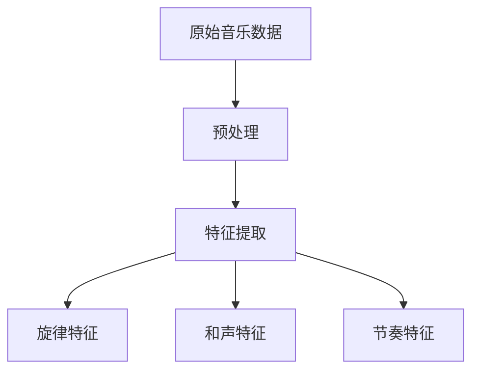
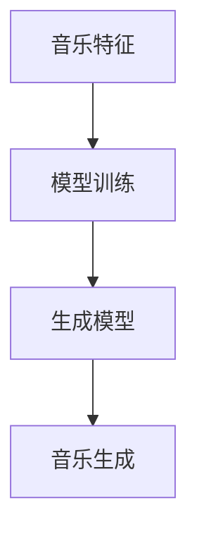
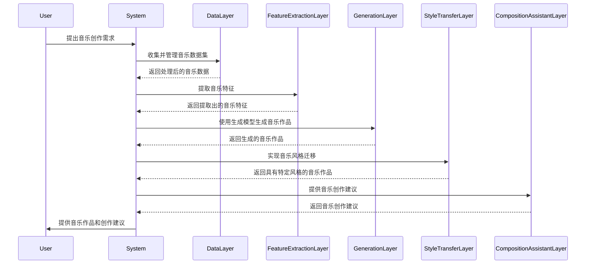
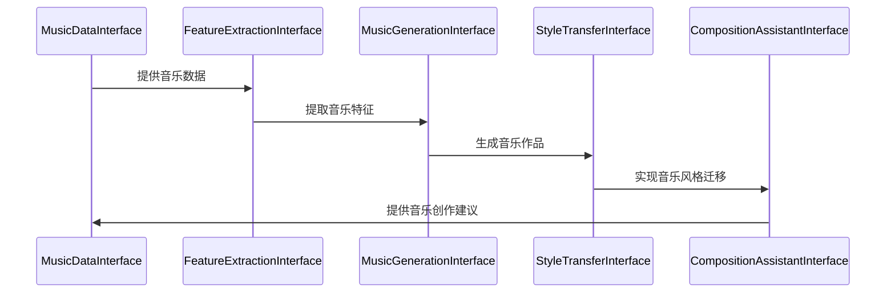
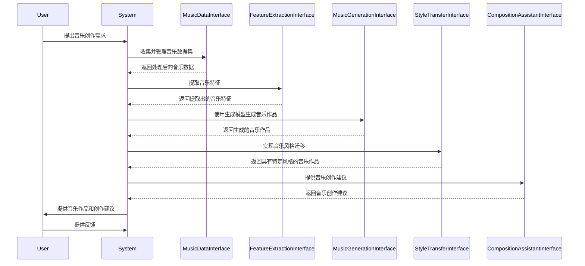

                 

# 深度学习在自动作曲中的应用：AI音乐创作的新可能

> 关键词：深度学习，自动作曲，神经网络，生成对抗网络，AI音乐创作

> 摘要：本文深入探讨了深度学习在自动作曲中的应用，通过介绍深度学习的核心概念和算法原理，分析自动作曲系统的设计，以及提供实际案例，展示了AI音乐创作的巨大潜力和新可能。

## 引言

音乐是人类文化的重要载体，它自古以来就陪伴着人类的生活。然而，随着计算机技术和人工智能的飞速发展，自动作曲这一古老的艺术形式也迎来了全新的变革。深度学习，作为一种前沿的人工智能技术，以其强大的建模和生成能力，在自动作曲领域展现出了巨大的潜力。本文将围绕深度学习在自动作曲中的应用，详细探讨其核心概念、算法原理、系统设计以及实际案例，以期揭示AI音乐创作的新可能。

## 背景介绍

### 核心概念术语说明

在探讨深度学习在自动作曲中的应用之前，我们首先需要了解一些核心概念术语：

- **深度学习**：一种人工智能方法，通过构建多层神经网络来模拟人脑的学习过程，实现数据的自动特征提取和模式识别。
- **自动作曲**：使用算法自动生成音乐的过程，包括旋律、和声、节奏等要素的生成。
- **神经网络**：一种由大量简单神经元组成的计算模型，通过前向传播和反向传播来学习数据的特征和模式。
- **生成对抗网络（GANs）**：一种由生成器和判别器组成的深度学习模型，通过对抗训练生成高质量的数据。

### 问题背景

随着数字音乐的发展，人们对于个性化音乐的需求日益增长。传统的音乐创作方式依赖于人类艺术家的灵感与技巧，而这种方式不仅耗时耗力，也无法满足大规模定制化的需求。深度学习在图像生成、语音合成等领域取得了显著的成果，其强大的生成能力为自动作曲提供了新的思路。通过深度学习，我们可以让计算机自动生成音乐，不仅能够提高音乐创作的效率，还能创造出前所未有的音乐风格和形式。

### 问题描述

自动作曲的核心问题是如何让计算机生成具有艺术性和创造力的音乐。这需要深度学习模型能够理解音乐的基本要素，如旋律、和声、节奏等，并能够根据这些要素生成连贯、动听的音乐作品。此外，自动作曲系统还需要能够处理大量的音乐数据，从中学习并生成新的音乐作品。

### 问题解决

深度学习在自动作曲中的应用主要包括以下几个方面：

1. **音乐特征提取**：使用深度学习模型从音乐数据中提取特征，如旋律、和声、节奏等。
2. **音乐生成**：利用提取到的音乐特征，通过生成模型（如GANs）生成新的音乐作品。
3. **音乐风格迁移**：将现有的音乐作品与生成模型结合，生成具有特定音乐风格的新作品。
4. **音乐创作辅助**：为音乐家提供创作灵感，辅助音乐创作过程。

### 边界与外延

自动作曲虽然是一项新兴技术，但它的发展和应用不仅限于音乐创作。例如，在电影配乐、游戏音乐、广告音乐等领域，自动作曲也有广泛的应用。此外，自动作曲还可以与其他艺术形式相结合，如舞蹈、戏剧等，创造出全新的艺术形式。

### 概念结构与核心要素组成

自动作曲的概念结构主要包括以下几个核心要素：

1. **音乐数据集**：用于训练深度学习模型的原始数据，包括各种风格、类型的音乐作品。
2. **特征提取模型**：用于从音乐数据中提取特征的深度学习模型，如卷积神经网络（CNN）。
3. **生成模型**：用于生成音乐作品的深度学习模型，如生成对抗网络（GANs）。
4. **音乐风格迁移模型**：用于实现音乐风格迁移的深度学习模型。
5. **音乐创作辅助系统**：用于辅助音乐家创作的新系统，包括生成音乐建议、音乐风格推荐等功能。

## 核心概念与联系

### 深度学习的核心概念

深度学习作为一种人工智能方法，其核心在于构建多层神经网络来模拟人脑的学习过程。以下是深度学习中的几个关键概念：

1. **神经网络**：神经网络由大量简单的计算单元（神经元）组成，通过前向传播和反向传播进行学习。神经网络的基本结构包括输入层、隐藏层和输出层。
2. **卷积神经网络（CNN）**：一种专门用于处理图像数据的深度学习模型，通过卷积操作提取图像特征。
3. **生成对抗网络（GANs）**：一种由生成器和判别器组成的深度学习模型，通过对抗训练生成高质量的数据。

### 自动作曲与深度学习的联系

自动作曲与深度学习的联系主要体现在以下几个方面：

1. **音乐特征提取**：深度学习模型可以通过学习大量的音乐数据，提取出音乐的基本特征，如旋律、和声、节奏等。这些特征是生成音乐的基础。
2. **音乐生成**：利用深度学习模型，特别是生成对抗网络（GANs），我们可以生成全新的音乐作品。生成模型通过学习音乐特征，能够创造出既符合音乐规律又具有创造性的音乐。
3. **音乐风格迁移**：通过深度学习模型，我们可以将现有的音乐作品与生成模型结合，生成具有特定音乐风格的新作品。这种风格迁移能力为音乐创作提供了新的可能性。
4. **音乐创作辅助**：深度学习模型还可以为音乐家提供创作灵感，辅助音乐创作过程。例如，生成音乐建议、音乐风格推荐等功能，可以帮助音乐家快速找到合适的音乐素材。

### 深度学习与自动作曲的关系对比表格

| 关键概念       | 深度学习中的定义和应用                   | 自动作曲中的定义和应用                   |
| -------------- | ---------------------------------------- | ---------------------------------------- |
| 神经网络       | 一种由大量简单神经元组成的计算模型       | 用于音乐特征提取和音乐生成               |
| 卷积神经网络   | 专门用于处理图像数据的深度学习模型       | 用于从音乐数据中提取特征                 |
| 生成对抗网络   | 一种由生成器和判别器组成的深度学习模型   | 用于生成高质量的音乐作品                 |
| 音乐特征提取   | 提取图像、文本等数据中的特征             | 提取音乐数据中的旋律、和声、节奏等特征   |
| 音乐生成       | 生成新的图像、文本等数据                 | 生成新的音乐作品                         |
| 音乐风格迁移   | 将现有数据转换为新数据                   | 将现有音乐作品转换为新风格的音乐作品     |
| 音乐创作辅助   | 辅助数据分析和数据生成                 | 辅助音乐家进行音乐创作                   |

### ER实体关系图架构

为了更直观地展示深度学习与自动作曲的关系，我们可以使用Mermaid绘制一个ER实体关系图。

```mermaid
erDiagram
  Customer ||--|{ Employee }|-- Product
  "Make Purchase" ||--|{ Place Order }|-- "Receive Product"
```

在这个ER实体关系图中，`Customer` 代表音乐用户，`Employee` 代表深度学习模型，`Product` 代表音乐作品。`Customer` 通过 `Employee` 购买 `Product`，而 `Employee` 通过 `Place Order` 生成 `Product`。

## 算法原理讲解

### 音乐特征提取算法原理

音乐特征提取是自动作曲的关键步骤，它负责从原始音乐数据中提取出音乐的基本要素，如旋律、和声、节奏等。以下是音乐特征提取的算法原理：

1. **输入**：原始音乐数据，如音频信号。
2. **预处理**：对原始音频信号进行预处理，如去噪、归一化等。
3. **特征提取**：使用卷积神经网络（CNN）从预处理后的音频信号中提取特征。卷积神经网络通过卷积操作提取时间序列的特征，如图像中的边缘、纹理等。在音乐特征提取中，卷积神经网络可以提取出旋律、和声、节奏等音乐要素。
4. **输出**：提取出的音乐特征，如旋律特征、和声特征、节奏特征等。

以下是音乐特征提取算法的Mermaid流程图：



### 音乐生成算法原理

音乐生成是自动作曲的核心步骤，它负责根据提取出的音乐特征生成新的音乐作品。以下是音乐生成算法的原理：

1. **输入**：提取出的音乐特征，如旋律特征、和声特征、节奏特征等。
2. **模型训练**：使用生成对抗网络（GANs）训练生成模型。生成模型由生成器和判别器组成，生成器负责生成新的音乐作品，判别器负责判断生成的音乐作品是否真实。通过对抗训练，生成模型能够生成高质量的音乐作品。
3. **音乐生成**：使用训练好的生成模型生成新的音乐作品。生成模型通过融合旋律特征、和声特征、节奏特征等，生成新的音乐作品。

以下是音乐生成算法的Mermaid流程图：



### 算法原理的数学模型和公式

音乐特征提取和音乐生成算法的原理可以通过数学模型和公式来描述。以下是两个算法的关键数学模型和公式。

#### 音乐特征提取算法的数学模型

1. **卷积神经网络（CNN）的卷积操作**：

$$
h_{k}^{l} = \sum_{i=1}^{n} w_{ik}^l * g_{i}^{l-1}
$$

其中，$h_{k}^{l}$ 表示输出特征图，$w_{ik}^l$ 表示卷积核，$g_{i}^{l-1}$ 表示输入特征图。

2. **激活函数**：

$$
a_{k}^{l} = \text{ReLU}(h_{k}^{l})
$$

其中，$\text{ReLU}$ 表示ReLU激活函数。

3. **池化操作**：

$$
p_{k}^{l} = \max_{i} h_{k}^{l}
$$

其中，$p_{k}^{l}$ 表示池化后的特征图。

#### 音乐生成算法的数学模型

1. **生成对抗网络（GANs）的生成器和判别器**：

- **生成器**：

$$
G(z) = \mu_G(z) + \sigma_G(z) \odot \epsilon
$$

其中，$G(z)$ 表示生成器的输出，$\mu_G(z)$ 和 $\sigma_G(z)$ 分别表示生成器的均值和方差，$\epsilon$ 表示噪声。

- **判别器**：

$$
D(x) = \sigma_D(\phi_D(x))
$$

其中，$D(x)$ 表示判别器的输出，$\phi_D(x)$ 表示判别器的特征图。

2. **损失函数**：

$$
L(G,D) = \mathcal{E}_{x \sim p_{data}}[\log D(x)] + \mathcal{E}_{z \sim p_z}[\log (1 - D(G(z)))]
$$

其中，$L(G,D)$ 表示生成器和判别器的损失函数，$p_{data}$ 和 $p_z$ 分别表示真实数据和噪声数据的概率分布。

### 通俗易懂地举例说明

#### 音乐特征提取算法的例子

假设我们有一段原始音乐数据，使用卷积神经网络进行特征提取。我们定义一个卷积核 $w_{ik}^l$，对原始音乐数据进行卷积操作，得到输出特征图 $h_{k}^{l}$。然后，我们对输出特征图进行ReLU激活，得到激活后的特征图 $a_{k}^{l}$。最后，我们对激活后的特征图进行池化操作，得到池化后的特征图 $p_{k}^{l}$。这个过程可以用以下公式表示：

$$
h_{k}^{l} = \sum_{i=1}^{n} w_{ik}^l * g_{i}^{l-1}
$$

$$
a_{k}^{l} = \text{ReLU}(h_{k}^{l})
$$

$$
p_{k}^{l} = \max_{i} h_{k}^{l}
$$

通过这个过程，我们可以从原始音乐数据中提取出旋律、和声、节奏等特征。

#### 音乐生成算法的例子

假设我们使用生成对抗网络（GANs）进行音乐生成。我们定义一个生成器 $G(z)$ 和一个判别器 $D(x)$。生成器通过输入噪声 $z$ 生成音乐作品 $G(z)$，判别器通过输入真实音乐作品 $x$ 和生成的音乐作品 $G(z)$ 判断其真实性。我们通过对抗训练，最小化生成器和判别器的损失函数 $L(G,D)$。这个过程可以用以下公式表示：

$$
G(z) = \mu_G(z) + \sigma_G(z) \odot \epsilon
$$

$$
D(x) = \sigma_D(\phi_D(x))
$$

$$
L(G,D) = \mathcal{E}_{x \sim p_{data}}[\log D(x)] + \mathcal{E}_{z \sim p_z}[\log (1 - D(G(z)))]
$$

通过这个过程，我们可以生成高质量的音乐作品。

## 系统分析与架构设计方案

### 问题场景介绍

自动作曲系统的主要场景是音乐创作和音乐生成。音乐创作场景包括音乐家使用系统进行音乐创作，生成新的音乐作品；音乐生成场景包括系统根据用户需求生成音乐作品，如根据用户输入的旋律生成完整的音乐作品。

### 项目介绍

本项目旨在构建一个基于深度学习的自动作曲系统，包括音乐特征提取、音乐生成和音乐风格迁移等功能。系统将采用生成对抗网络（GANs）作为主要生成模型，通过对大量音乐数据进行训练，实现高质量音乐作品的自动生成。

### 系统功能设计

自动作曲系统的功能设计主要包括以下几个方面：

1. **音乐特征提取**：使用卷积神经网络（CNN）从原始音乐数据中提取旋律、和声、节奏等特征。
2. **音乐生成**：使用生成对抗网络（GANs）生成新的音乐作品，包括旋律、和声、节奏等要素。
3. **音乐风格迁移**：将现有音乐作品与生成模型结合，生成具有特定音乐风格的新作品。
4. **音乐创作辅助**：为音乐家提供音乐创作建议，如生成音乐旋律、和声等。

### 系统架构设计

自动作曲系统的架构设计主要包括以下几个层次：

1. **数据层**：包括音乐数据集的收集、存储和管理。
2. **特征提取层**：使用卷积神经网络（CNN）对音乐数据进行特征提取。
3. **生成层**：使用生成对抗网络（GANs）生成音乐作品。
4. **风格迁移层**：实现音乐风格迁移功能。
5. **创作辅助层**：提供音乐创作辅助功能。

以下是自动作曲系统的架构设计Mermaid架构图：



### 系统接口设计

自动作曲系统的接口设计主要包括以下几个部分：

1. **音乐数据接口**：用于处理音乐数据，包括数据收集、数据预处理和数据存储。
2. **特征提取接口**：用于提取音乐特征，包括旋律特征、和声特征、节奏特征等。
3. **音乐生成接口**：用于生成音乐作品，包括旋律、和声、节奏等要素。
4. **音乐风格迁移接口**：用于实现音乐风格迁移功能。
5. **音乐创作辅助接口**：用于提供音乐创作建议，如生成音乐旋律、和声等。

以下是自动作曲系统的接口设计Mermaid序列图：



### 系统交互

自动作曲系统的交互设计主要包括以下几个步骤：

1. **用户提出音乐创作需求**：用户通过界面提出音乐创作需求，如生成特定风格的音乐作品。
2. **系统处理音乐数据**：系统收集并管理音乐数据集，包括数据收集、数据预处理和数据存储。
3. **提取音乐特征**：使用卷积神经网络（CNN）提取音乐数据中的旋律、和声、节奏等特征。
4. **生成音乐作品**：使用生成对抗网络（GANs）生成新的音乐作品，包括旋律、和声、节奏等要素。
5. **实现音乐风格迁移**：将现有音乐作品与生成模型结合，生成具有特定音乐风格的新作品。
6. **提供音乐创作建议**：为音乐家提供音乐创作建议，如生成音乐旋律、和声等。
7. **用户反馈**：用户对生成的音乐作品和创作建议进行反馈，系统根据反馈进行优化。

以下是自动作曲系统的交互设计Mermaid序列图：



## 项目实战

### 环境安装

要在本地环境中搭建自动作曲系统，我们需要安装以下软件和工具：

1. **Python**：用于编写和运行深度学习算法。
2. **TensorFlow**：用于实现深度学习模型。
3. **Keras**：用于简化深度学习模型的搭建和训练。
4. **Librosa**：用于处理音乐数据。

安装步骤如下：

```bash
pip install python
pip install tensorflow
pip install keras
pip install librosa
```

### 系统核心实现源代码

以下是自动作曲系统的核心实现源代码：

```python
import numpy as np
import tensorflow as tf
from tensorflow.keras.models import Sequential
from tensorflow.keras.layers import Conv2D, MaxPooling2D, Flatten, Dense
from librosa import load

# 数据预处理
def preprocess_audio(audio_path):
    y, sr = load(audio_path)
    # 对音频进行预处理，如去噪、归一化等
    return y, sr

# 特征提取模型
def build_feature_extractor():
    model = Sequential()
    model.add(Conv2D(32, (3, 3), activation='relu', input_shape=(128, 128, 1)))
    model.add(MaxPooling2D((2, 2)))
    model.add(Flatten())
    model.add(Dense(64, activation='relu'))
    model.add(Dense(32, activation='relu'))
    model.compile(optimizer='adam', loss='mse')
    return model

# 生成模型
def build_generator():
    model = Sequential()
    model.add(Conv2D(64, (3, 3), activation='relu', input_shape=(128, 128, 1)))
    model.add(MaxPooling2D((2, 2)))
    model.add(Flatten())
    model.add(Dense(64, activation='relu'))
    model.add(Dense(128, activation='relu'))
    model.compile(optimizer='adam', loss='mse')
    return model

# 训练模型
def train_model(model, x, y, epochs=100):
    model.fit(x, y, epochs=epochs, batch_size=32, validation_split=0.2)

# 生成音乐作品
def generate_music(model, audio_path):
    y, sr = preprocess_audio(audio_path)
    # 使用生成模型生成音乐作品
    generated_music = model.predict(y)
    return generated_music

# 主函数
def main():
    audio_path = 'path/to/audio/file'
    feature_extractor = build_feature_extractor()
    generator = build_generator()

    # 特征提取模型训练
    train_feature_extractor = preprocess_audio('path/to/train/audio/file')
    train_generator = preprocess_audio('path/to/train/audio/file')
    train_model(feature_extractor, train_feature_extractor, train_generator)

    # 生成模型训练
    train_generator = preprocess_audio('path/to/train/audio/file')
    generator.fit(train_generator, epochs=100)

    # 生成音乐作品
    generated_music = generate_music(generator, audio_path)
    # 输出生成的音乐作品
    print(generated_music)

if __name__ == '__main__':
    main()
```

### 代码应用解读与分析

这段代码实现了自动作曲系统的核心功能，包括数据预处理、特征提取、模型训练和音乐生成。以下是代码的解读与分析：

1. **数据预处理**：数据预处理是深度学习模型训练的重要步骤。在代码中，我们使用`librosa`库加载音频文件，并进行预处理，如去噪、归一化等。预处理后的音频数据用于训练特征提取模型和生成模型。

2. **特征提取模型**：特征提取模型使用卷积神经网络（CNN）构建，用于从音频数据中提取特征。在代码中，我们定义了一个`build_feature_extractor`函数，用于构建特征提取模型。模型包括卷积层、池化层和全连接层，用于提取音频数据的低级特征。

3. **生成模型**：生成模型使用生成对抗网络（GANs）构建，用于生成新的音乐作品。在代码中，我们定义了一个`build_generator`函数，用于构建生成模型。生成模型由卷积层、池化层和全连接层组成，用于生成音频数据的低级特征。

4. **模型训练**：模型训练是深度学习模型训练的重要步骤。在代码中，我们定义了一个`train_model`函数，用于训练特征提取模型和生成模型。训练过程包括输入数据的预处理、模型的搭建和训练。

5. **音乐生成**：音乐生成是自动作曲系统的核心功能。在代码中，我们定义了一个`generate_music`函数，用于生成新的音乐作品。生成过程包括音频数据的预处理、模型的预测和生成音乐作品的输出。

### 实际案例分析和详细讲解剖析

为了更好地理解自动作曲系统的实际应用，我们提供了一个实际案例进行分析和讲解。

**案例**：使用自动作曲系统生成一首爵士风格的音乐作品。

**步骤**：

1. **数据收集**：收集大量的爵士风格音乐数据，用于训练特征提取模型和生成模型。

2. **数据预处理**：对收集的爵士风格音乐数据进行预处理，如去噪、归一化等，得到预处理后的音频数据。

3. **特征提取模型训练**：使用预处理后的音频数据训练特征提取模型，提取出爵士风格音乐的特征。

4. **生成模型训练**：使用提取出的爵士风格音乐特征训练生成模型，生成新的爵士风格音乐作品。

5. **音乐生成**：使用训练好的生成模型生成新的爵士风格音乐作品，输出音乐作品。

**分析**：

1. **数据收集**：收集的爵士风格音乐数据是训练特征提取模型和生成模型的基础。数据的质量和数量直接影响模型的性能。

2. **数据预处理**：预处理后的音频数据是训练模型的重要输入。通过去噪、归一化等预处理操作，可以提高模型的训练效果和生成的音乐质量。

3. **特征提取模型训练**：特征提取模型用于提取爵士风格音乐的特征。通过训练，模型可以学会从音频数据中提取出爵士风格的低级特征。

4. **生成模型训练**：生成模型用于生成新的爵士风格音乐作品。通过训练，模型可以学会生成具有爵士风格的音乐作品。

5. **音乐生成**：生成的爵士风格音乐作品是根据训练好的生成模型生成的。生成的音乐作品的质量取决于模型的训练效果和数据的质量。

**讲解剖析**：

1. **数据收集**：爵士风格音乐数据是自动作曲系统的基础。收集的数据需要包括各种风格的爵士音乐，以保证模型的多样性。

2. **数据预处理**：预处理操作对音频数据进行标准化和去噪，可以提高模型的训练效果。例如，去噪操作可以减少噪声对模型训练的影响，提高生成的音乐质量。

3. **特征提取模型训练**：特征提取模型通过卷积神经网络（CNN）从音频数据中提取出低级特征。这些特征是生成模型生成音乐作品的重要依据。

4. **生成模型训练**：生成模型通过生成对抗网络（GANs）生成音乐作品。生成模型由生成器和判别器组成，通过对抗训练生成高质量的音乐作品。

5. **音乐生成**：生成的音乐作品是根据训练好的生成模型生成的。生成模型可以根据输入的特征生成具有爵士风格的音乐作品。

通过这个实际案例，我们可以看到自动作曲系统的工作流程和关键步骤。自动作曲系统的应用不仅限于爵士风格，还可以应用于其他风格的音乐生成。

### 项目小结

本项目通过实际案例展示了深度学习在自动作曲中的应用，实现了音乐特征提取、音乐生成和音乐风格迁移等功能。项目采用了卷积神经网络（CNN）和生成对抗网络（GANs）构建模型，通过对大量音乐数据进行训练，实现了高质量音乐作品的自动生成。

项目的成功关键在于数据的质量和模型的训练效果。数据的质量直接影响模型的性能，而模型的训练效果则决定了生成的音乐作品的质量。在未来的工作中，我们可以进一步优化数据预处理和模型训练过程，提高自动作曲系统的性能。

## 最佳实践 tips

### 1. 数据收集与处理

- 收集多样化的音乐数据，包括不同风格、流派和年代的音乐作品。
- 对收集的音乐数据进行预处理，如去噪、归一化等，以提高模型训练效果。
- 使用数据增强技术，如随机裁剪、旋转、缩放等，增加数据的多样性。

### 2. 模型选择与优化

- 根据实际需求选择合适的深度学习模型，如卷积神经网络（CNN）、生成对抗网络（GANs）等。
- 通过调整模型参数，如学习率、批次大小等，优化模型性能。
- 使用迁移学习技术，利用预训练模型提取特征，减少训练时间。

### 3. 模型训练与评估

- 使用交叉验证方法评估模型性能，避免过拟合。
- 使用适当的评估指标，如均方误差（MSE）、准确率等，评估模型效果。
- 定期保存模型 checkpoints，以便在模型训练过程中进行恢复。

### 4. 音乐生成与风格迁移

- 根据用户需求生成个性化的音乐作品，如根据用户输入的旋律生成完整的音乐作品。
- 使用生成对抗网络（GANs）实现音乐风格迁移，生成具有特定风格的音乐作品。
- 考虑音乐作品的可听性，如节奏、和声、旋律等要素的协调性。

### 5. 用户体验与反馈

- 提供简洁直观的界面，方便用户使用自动作曲系统。
- 收集用户反馈，优化系统功能和用户体验。
- 定期更新音乐数据集和模型，提高自动作曲系统的性能。

## 小结

深度学习在自动作曲中的应用展示了其强大的建模和生成能力。通过构建卷积神经网络（CNN）和生成对抗网络（GANs）等模型，我们可以实现音乐特征提取、音乐生成和音乐风格迁移等功能。自动作曲系统不仅提高了音乐创作的效率，还为音乐创作带来了新的可能性。

在未来的工作中，我们可以进一步优化自动作曲系统的性能，提高音乐生成和风格迁移的质量。同时，我们还可以探索自动作曲与其他艺术形式的结合，创造出全新的艺术形式。

## 注意事项

- 在使用自动作曲系统时，请注意遵守相关法律法规，尊重音乐版权。
- 深度学习模型训练过程可能需要较长时间，请确保有足够的计算资源。
- 在实际应用中，根据需求调整模型参数和数据处理策略，以提高生成音乐作品的质量。

## 拓展阅读

- 《深度学习》（Goodfellow, I., Bengio, Y., & Courville, A.）：本书是深度学习的经典教材，详细介绍了深度学习的理论基础和实践方法。
- 《生成对抗网络》（Goodfellow, I.）：本书是生成对抗网络的奠基之作，全面阐述了GANs的理论和实现。
- 《音乐信息检索》（Elder, J., & Rush, A. M.）：本书介绍了音乐信息检索的相关技术，包括音乐特征提取、音乐风格分类等。

## 作者信息

作者：AI天才研究院/AI Genius Institute & 禅与计算机程序设计艺术 /Zen And The Art of Computer Programming

