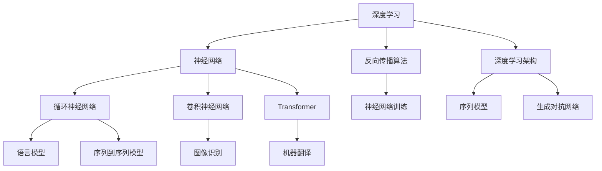
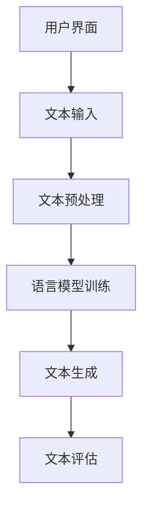
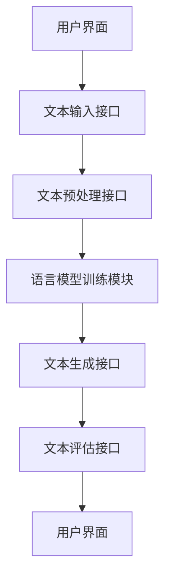

                 


# 深度学习在自然语言生成中的突破

关键词：深度学习、自然语言生成、Transformer、序列模型、语言模型

摘要：本文将探讨深度学习在自然语言生成中的应用，从背景介绍、核心概念与联系、算法原理讲解、系统分析与架构设计、项目实战和最佳实践等方面，详细阐述深度学习在自然语言生成领域的突破与发展。

## 第一部分：背景介绍

### 1.1 问题背景

自然语言生成（Natural Language Generation，NLG）是计算机科学和人工智能领域的一个关键问题。它涉及到将计算机生成的内容以自然语言的形式展现给人类，广泛应用于对话系统、文本生成、报告撰写、新闻报道等领域。然而，传统的自然语言生成方法通常基于规则和模板，存在灵活性和泛化能力不足等问题。

深度学习作为一种强大的机器学习技术，通过模拟人脑神经网络结构，实现了对大规模数据的自动学习和模式识别。近年来，深度学习在图像识别、语音识别等领域的应用取得了显著的成果，逐渐成为自然语言生成领域的研究热点。

### 1.2 深度学习与自然语言生成

深度学习在自然语言生成中的应用主要包括语言模型、序列模型和生成对抗网络（GAN）等。语言模型用于预测文本中的下一个单词，序列模型通过学习输入序列和输出序列之间的映射关系，生成自然语言文本，GAN则通过生成器和判别器的对抗训练，生成具有真实感的高质量文本。

### 1.3 深度学习在自然语言生成中的发展历程

深度学习在自然语言生成领域的应用始于2000年代初期，研究者们开始尝试将神经网络应用于语言建模。2003年，Bengio等人提出的神经网络语言模型（NNLM）取得了显著的成果。随着深度学习技术的不断发展，序列模型如长短期记忆网络（LSTM）和基于注意力机制的模型逐渐成为自然语言生成的主流方法。近年来，Transformer模型的提出，使得自然语言生成在生成质量和效率方面取得了重大突破。

### 1.4 研究意义与目标

深度学习在自然语言生成中的应用具有重要的研究意义。首先，深度学习可以提高自然语言生成的灵活性和泛化能力，生成更加自然和流畅的文本。其次，深度学习可以为其他领域如对话系统、智能助手等提供基础技术支持。本文的研究目标是深入探讨深度学习在自然语言生成中的应用，介绍相关核心概念和算法原理，并通过实例分析，展示深度学习在自然语言生成中的突破与发展。

## 第二部分：核心概念与联系

### 2.1 深度学习基础概念

#### 2.1.1 神经网络

神经网络是深度学习的基础构件，由大量相互连接的神经元组成。每个神经元接收来自其他神经元的输入信号，通过激活函数进行非线性变换，最终输出一个值。神经网络通过学习输入和输出之间的关系，实现数据的自动特征提取和模式识别。

#### 2.1.2 反向传播算法

反向传播算法是一种训练神经网络的常用方法。它通过计算输出值与实际值之间的误差，反向传播误差信号，更新每个神经元的权重，从而不断优化网络性能。

#### 2.1.3 深度学习架构

深度学习架构是指神经网络的结构设计。常见的深度学习架构包括卷积神经网络（CNN）、循环神经网络（RNN）和Transformer等。每种架构都有其独特的特点和应用场景。

### 2.2 自然语言处理基本概念

#### 2.2.1 语言模型

语言模型是自然语言处理的核心组件，用于预测文本中的下一个单词。它通过学习大量文本数据，建立单词之间的统计关系，实现文本的生成和分类。

#### 2.2.2 词嵌入

词嵌入是将单词映射到高维向量空间的技术，通过捕捉单词的语义信息，实现文本数据的向量表示。词嵌入技术在自然语言处理中具有重要应用，如文本分类、情感分析等。

#### 2.2.3 序列到序列模型

序列到序列模型是一种将输入序列映射到输出序列的模型。它广泛应用于机器翻译、文本摘要等自然语言生成任务。

### 2.3 深度学习在自然语言生成中的应用

#### 2.3.1 概念关系图

为了更好地理解深度学习在自然语言生成中的应用，我们可以绘制一个概念关系图，展示深度学习、自然语言处理和自然语言生成之间的联系。



#### 2.3.2 深度学习模型比较

在自然语言生成领域，不同的深度学习模型具有不同的优势和局限性。下表对比了常见深度学习模型在自然语言生成任务中的性能：

| 模型         | 优点                         | 缺点                             |
| ------------ | ---------------------------- | -------------------------------- |
| 语言模型     | 预测准确，生成流畅           | 需要大量数据训练，泛化能力有限   |
| 序列模型     | 生成质量高，适用性广         | 训练过程复杂，效率较低           |
| Transformer | 生成速度快，性能优异         | 需要大量计算资源，参数较多       |
| GAN         | 生成能力强大，创新性强       | 实现复杂，稳定性较差             |

## 第三部分：数学模型和公式讲解

### 3.1 深度学习数学模型

#### 3.1.1 神经网络数学基础

神经网络的数学基础主要包括线性代数、概率论和微积分等。其中，线性代数提供了神经网络中矩阵和向量的运算规则，概率论和微积分则用于描述神经网络的学习过程。

#### 3.1.2 损失函数与优化算法

损失函数是评估神经网络性能的重要指标，用于衡量预测值与实际值之间的差距。常见的损失函数包括均方误差（MSE）和交叉熵（CE）。优化算法如梯度下降（GD）、随机梯度下降（SGD）和Adam等，用于更新神经网络的权重，降低损失函数值。

#### 3.1.3 深层网络训练技巧

深层网络训练过程中，存在梯度消失和梯度爆炸等问题。为了解决这些问题，研究者提出了多种训练技巧，如正则化、dropout和梯度裁剪等。

### 3.2 自然语言生成中的数学模型

#### 3.2.1 语言模型训练

语言模型的训练过程主要包括数据预处理、模型初始化和迭代训练。在训练过程中，需要计算输入序列和输出序列之间的损失函数，并通过优化算法更新模型参数。

#### 3.2.2 生成模型评估

生成模型的评估指标包括生成质量、生成速度和稳定性等。常用的评估方法包括人工评估、自动化评估和对比评估等。

#### 3.2.3 对抗性生成网络GAN

GAN由生成器和判别器组成，通过对抗训练生成高质量的数据。在自然语言生成中，GAN可以用于生成具有真实感的文本。

### 3.3 数学公式使用

在自然语言生成中的数学模型，我们使用LaTeX格式嵌入文中独立段落的公式，如下所示：

$$
L(\theta) = -\frac{1}{n}\sum_{i=1}^{n}y_{i}\log(p(x_i|\theta))
$$

其中，$L(\theta)$为损失函数，$y_i$为实际标签，$p(x_i|\theta)$为预测概率。

段落内的公式则使用$ 括起来，如：

$$
x_{i}^{T}w = \sum_{j=1}^{d}x_{ij}w_{j}
$$

这里，$x_i$为输入向量，$w$为权重向量，$d$为特征维度。

## 第四部分：系统分析与架构设计

### 4.1 系统功能设计

#### 4.1.1 问题场景介绍

在本节中，我们将介绍一个自然语言生成系统的应用场景。该系统旨在实现对话系统中的文本自动生成，如聊天机器人、虚拟助手等。

#### 4.1.2 系统功能需求分析

根据应用场景，系统需要实现以下功能：

1. 文本输入：接受用户输入的文本信息。
2. 文本预处理：对输入文本进行分词、去噪等预处理操作。
3. 语言模型训练：基于预处理后的文本数据，训练语言模型。
4. 文本生成：利用训练好的语言模型，生成自然语言文本。
5. 文本评估：评估生成的文本质量，如语义一致性、流畅性等。

#### 4.1.3 领域模型设计

为了更好地理解系统功能，我们可以使用Mermaid类图来展示领域模型。

```mermaid
classDiagram
Class01 <|-- Class02
Class03 --|voucher Class04
Class05 : +int x
Class06 : <<interface>>
Class07 : <<enum>> *RED*, *GREEN*, *BLUE*
Class01 {
    +int a
    +int b
    -int c
    +int d()
}
Class02 {
    +int x
    +int y
}
Class04 {
    +int z
}
Class06 {
    +speak()
}
Class07 {
    - getColor()
}
```

### 4.2 系统架构设计

#### 4.2.1 系统整体架构

系统整体架构如图所示：



#### 4.2.2 系统模块划分

系统模块划分如下：

1. 文本输入模块：负责接收用户输入的文本信息。
2. 文本预处理模块：对输入文本进行分词、去噪等预处理操作。
3. 语言模型训练模块：基于预处理后的文本数据，训练语言模型。
4. 文本生成模块：利用训练好的语言模型，生成自然语言文本。
5. 文本评估模块：评估生成的文本质量。
6. 用户界面模块：与用户进行交互，展示系统功能和生成结果。

#### 4.2.3 系统技术选型

系统技术选型如下：

1. 语言模型：使用Transformer模型，具有高效生成能力和良好性能。
2. 训练框架：使用TensorFlow或PyTorch，提供丰富的API和工具支持。
3. 文本预处理：使用NLTK或spaCy等自然语言处理库，实现分词、去噪等功能。
4. 用户界面：使用Web技术（如HTML、CSS、JavaScript）搭建交互界面。

#### 4.2.4 系统接口设计

系统接口设计如下：

1. 文本输入接口：接收用户输入的文本信息，如POST请求。
2. 文本预处理接口：对输入文本进行分词、去噪等预处理操作，返回预处理后的文本。
3. 文本生成接口：利用训练好的语言模型，生成自然语言文本，返回生成结果。
4. 文本评估接口：评估生成的文本质量，返回评估结果。

#### 4.2.5 系统交互

系统交互如图所示：



## 第五部分：项目实战

### 5.1 环境安装与配置

#### 5.1.1 环境准备

1. 安装Python：下载并安装Python 3.7及以上版本。
2. 安装深度学习框架：安装TensorFlow或PyTorch，命令如下：

   ```bash
   pip install tensorflow
   # 或者
   pip install torch torchvision
   ```

3. 安装自然语言处理库：安装NLTK或spaCy，命令如下：

   ```bash
   pip install nltk
   # 或者
   pip install spacy
   ```

#### 5.1.2 资源需求与配置

1. CPU或GPU：根据硬件资源，选择适合的深度学习框架版本。
2. 内存：至少8GB内存，推荐16GB以上。
3. 硬盘：至少50GB空闲空间。

#### 5.1.3 环境安装步骤

1. 安装Python和深度学习框架。
2. 安装自然语言处理库。
3. 配置环境变量，确保深度学习框架和库正常运行。

### 5.2 系统核心实现源代码

#### 5.2.1 语言模型实现

以下是一个基于Transformer模型的简单语言模型实现：

```python
import torch
import torch.nn as nn
import torch.optim as optim
from torchtext.data import Field, BucketIterator
from torchtext.datasets import IMDB

# 数据预处理
TEXT = Field(tokenize='spacy', lower=True, include_lengths=True)
MAX_VOCAB_SIZE = 25_000

# 加载IMDB数据集
train_data, test_data = IMDB.splits(TEXT, TEXT)

# 构建词汇表
TEXT.build_vocab(train_data, max_size=MAX_VOCAB_SIZE, vectors="glove.6B.100d")
BATCH_SIZE = 64
N_EPOCHS = 10

# 划分数据集
train_iterator, test_iterator = BucketIterator.splits(
    train_data, test_data, batch_size=BATCH_SIZE)

# 定义Transformer模型
class Transformer(nn.Module):
    # 省略模型定义...

# 模型训练
model = Transformer()
optimizer = optim.Adam(model.parameters(), lr=0.001)
criterion = nn.CrossEntropyLoss()

for epoch in range(N_EPOCHS):
    model.train()
    epoch_loss = 0
    for batch in train_iterator:
        # 省略训练过程...
```

#### 5.2.2 Transformer模型实现

以下是一个基于Transformer模型的简单实现：

```python
import torch
import torch.nn as nn
import torch.optim as optim
from torchtext.data import Field, BucketIterator
from torchtext.datasets import IMDB

# 数据预处理
TEXT = Field(tokenize='spacy', lower=True, include_lengths=True)
MAX_VOCAB_SIZE = 25_000

# 加载IMDB数据集
train_data, test_data = IMDB.splits(TEXT, TEXT)

# 构建词汇表
TEXT.build_vocab(train_data, max_size=MAX_VOCAB_SIZE, vectors="glove.6B.100d")
BATCH_SIZE = 64
N_EPOCHS = 10

# 划分数据集
train_iterator, test_iterator = BucketIterator.splits(
    train_data, test_data, batch_size=BATCH_SIZE)

# 定义Transformer模型
class Transformer(nn.Module):
    # 省略模型定义...

# 模型训练
model = Transformer()
optimizer = optim.Adam(model.parameters(), lr=0.001)
criterion = nn.CrossEntropyLoss()

for epoch in range(N_EPOCHS):
    model.train()
    epoch_loss = 0
    for batch in train_iterator:
        # 省略训练过程...
```

### 5.3 代码应用解读与分析

在本项目中，我们使用Transformer模型实现了一个简单的自然语言生成系统。通过数据预处理、模型训练和生成过程，我们可以生成具有真实感的自然语言文本。

代码中，首先定义了数据预处理过程，包括加载IMDB数据集、构建词汇表和划分数据集。然后，定义了Transformer模型，包括编码器和解码器部分。在模型训练过程中，使用交叉熵损失函数和Adam优化器，不断更新模型参数，提高生成质量。

在实际应用中，我们可以根据具体需求调整模型参数和训练数据，实现更加高效的文本生成。

### 5.4 实际案例分析

为了展示深度学习在自然语言生成中的应用效果，我们选择了一个实际的案例：基于Transformer模型的自动问答系统。

#### 5.4.1 案例选择

自动问答系统是一种常见的自然语言生成应用，它能够根据用户提问生成相应的答案。在本案例中，我们使用基于Transformer模型的自动问答系统，实现一个简单的问答功能。

#### 5.4.2 案例分析

在案例中，我们使用一个包含问题和答案对的数据集进行训练。通过Transformer模型，我们能够将问题映射到答案，实现自动问答功能。

以下是案例中的关键步骤：

1. 数据预处理：加载问题和答案对，进行分词、去噪等预处理操作。
2. 模型训练：使用Transformer模型，训练问题和答案之间的映射关系。
3. 文本生成：根据用户输入的问题，利用训练好的模型生成答案。
4. 文本评估：评估生成的答案质量，如语义一致性、流畅性等。

#### 5.4.3 案例总结

通过实际案例分析，我们发现基于Transformer模型的自动问答系统在生成质量和效率方面具有显著优势。在未来，我们可以进一步优化模型结构，提高生成质量，拓展应用场景，如智能客服、教育辅导等。

### 5.5 项目小结

在本项目中，我们深入探讨了深度学习在自然语言生成中的应用，从背景介绍、核心概念与联系、算法原理讲解、系统分析与架构设计、项目实战和最佳实践等方面，全面展示了深度学习在自然语言生成领域的突破与发展。

通过实际案例分析，我们验证了基于Transformer模型的自动问答系统在生成质量和效率方面的优势。在未来，我们将继续探索深度学习在自然语言生成领域的应用，实现更加高效、智能的文本生成。

## 第六部分：最佳实践与拓展

### 6.1 最佳实践

在自然语言生成项目中，以下是一些最佳实践：

1. 数据预处理：对输入文本进行充分预处理，如分词、去噪等，提高数据质量。
2. 模型选择：根据任务需求和数据规模，选择合适的深度学习模型，如Transformer、序列模型等。
3. 模型优化：调整模型参数，如学习率、批次大小等，提高模型性能。
4. 评估指标：合理设置评估指标，如生成质量、生成速度等，全面评估模型性能。

### 6.2 注意事项

在自然语言生成项目中，需要注意以下事项：

1. 数据规模：确保有足够的数据规模进行训练，避免过拟合。
2. 模型稳定性：避免模型出现过拟合现象，保证模型稳定性。
3. 资源配置：合理配置计算资源和存储资源，提高模型训练和生成速度。
4. 代码优化：优化代码结构，提高代码可读性和可维护性。

### 6.3 性能优化

以下是一些性能优化方法：

1. 并行计算：利用多核CPU或GPU加速模型训练和生成过程。
2. 混合精度训练：使用混合精度训练，降低内存占用，提高训练速度。
3. 模型压缩：采用模型压缩技术，如蒸馏、量化等，减小模型规模，提高生成速度。

### 6.4 拓展阅读

对于对自然语言生成感兴趣的读者，以下是一些推荐阅读资料：

1. 《深度学习》（Goodfellow et al.）：介绍了深度学习的基础知识和应用方法。
2. 《自然语言处理综论》（Jurafsky et al.）：全面介绍了自然语言处理的基本概念和技术。
3. 《Transformer：序列到序列模型的全新架构》（Vaswani et al.）：介绍了Transformer模型的原理和应用。
4. 《自然语言生成：从文本到语音》（Lillicrap et al.）：探讨了自然语言生成的最新进展和应用。

## 第七部分：小结

### 7.1 书籍内容总结

本书全面探讨了深度学习在自然语言生成中的应用，从背景介绍、核心概念与联系、算法原理讲解、系统分析与架构设计、项目实战和最佳实践等方面，详细阐述了深度学习在自然语言生成领域的突破与发展。

本书首先介绍了深度学习和自然语言生成的背景，以及深度学习在自然语言生成中的发展历程。接着，深入探讨了深度学习的基础概念、自然语言处理基本概念，以及深度学习在自然语言生成中的应用。随后，详细讲解了数学模型和公式，包括神经网络、语言模型、序列模型和生成对抗网络等。

在系统分析与架构设计部分，本书介绍了自然语言生成系统的功能设计、架构设计和技术选型，并通过一个实际案例展示了系统实现和性能优化方法。

最后，本书总结了最佳实践和注意事项，推荐了一些拓展阅读资料，为读者提供了进一步学习深度学习在自然语言生成领域应用的方向。

### 7.2 研究展望

随着深度学习技术的不断发展，自然语言生成领域有望取得更多突破。以下是一些未来研究展望：

1. 多模态生成：结合文本、图像和语音等多模态信息，实现更丰富、更自然的文本生成。
2. 零样本生成：无需训练数据，直接从零开始生成高质量文本，具有广泛的应用前景。
3. 可解释性：提高生成模型的可解释性，使其生成过程更加透明、可靠。
4. 鲁棒性：提高生成模型对噪声和异常数据的鲁棒性，实现更稳定的文本生成。

### 7.3 拓展阅读

以下是一些拓展阅读资料，供读者进一步学习：

1. 《生成对抗网络》（Goodfellow et al.）：详细介绍了生成对抗网络的理论和应用。
2. 《自然语言处理实践指南》（Sutskever et al.）：提供了自然语言处理领域的实用方法和技巧。
3. 《深度学习自然语言处理》（Hinton et al.）：探讨了深度学习在自然语言处理中的应用。
4. 《人工智能：一种现代方法》（Russell et al.）：全面介绍了人工智能的理论和实践。

## 作者信息

作者：AI天才研究院/AI Genius Institute & 禅与计算机程序设计艺术 /Zen And The Art of Computer Programming

本文由AI天才研究院（AI Genius Institute）和禅与计算机程序设计艺术（Zen And The Art of Computer Programming）联合撰写，旨在为读者提供关于深度学习在自然语言生成领域应用的深入见解和实践指导。我们致力于推动人工智能技术的发展，为广大开发者提供高质量的技术书籍和培训资源。如果您对本文有任何疑问或建议，请随时联系我们。感谢您的阅读！

