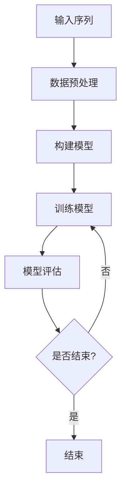
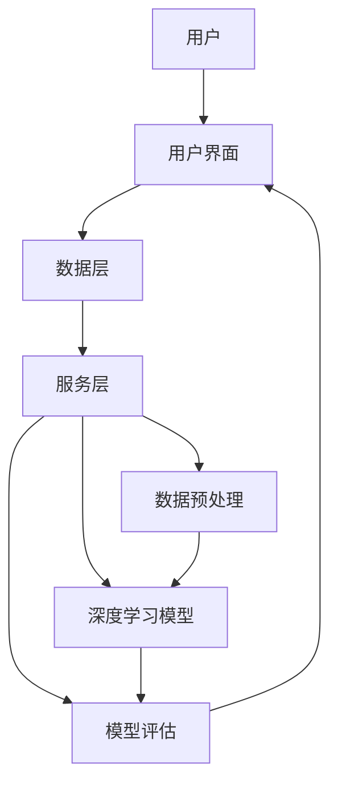
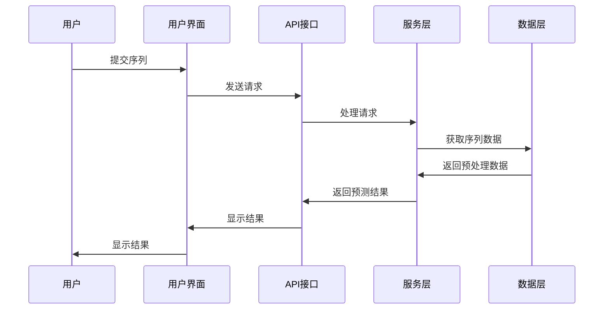

                 

### 深度学习在蛋白质折叠预测中的突破

> 关键词：深度学习、蛋白质折叠、预测、算法、生物信息学

> 摘要：本文将深入探讨深度学习在蛋白质折叠预测中的应用，首先介绍蛋白质折叠预测的重要性及其挑战，然后介绍深度学习的基本概念和相关算法，接着分析深度学习在蛋白质折叠预测中的实际应用和优势，最后展望未来可能的研究方向和挑战。通过这一系列讨论，我们希望能够为广大生物信息学和计算机科学爱好者提供一份有价值的参考。

### 1. 问题背景

#### 1.1 蛋白质折叠预测的重要性

蛋白质是生命的基础，它们在细胞中执行各种生物学功能，从催化化学反应到细胞信号传导。蛋白质的功能与其三维结构密切相关，而蛋白质的结构又取决于其氨基酸序列的折叠过程。因此，预测蛋白质的结构对于理解其功能至关重要。

蛋白质折叠预测，即通过生物信息学方法预测蛋白质的三维结构，是生物信息学领域的一个核心问题。这一领域的研究不仅有助于揭示生命的基本原理，还为药物设计、疾病诊断和治疗提供了重要的技术支持。例如，某些疾病的病因可能与特定蛋白质的异常折叠有关，通过预测蛋白质的结构，我们可以更早地发现这些疾病并开发相应的治疗方法。

#### 1.2 蛋白质折叠预测的挑战

蛋白质折叠预测面临诸多挑战。首先，蛋白质折叠过程高度复杂，涉及大量的生物学和物理化学相互作用。其次，蛋白质的序列长度可能非常长，使得传统的计算方法在处理上遇到困难。此外，蛋白质的结构多样性也是一大难题，不同结构的蛋白质可能具有相似的序列，这使得预测工作更加复杂。

#### 1.3 深度学习在生物信息学中的应用

深度学习作为一种强大的机器学习技术，在生物信息学领域得到了广泛应用。它在图像识别、基因组分析、药物设计等方面取得了显著成果。随着计算能力的提升和算法的改进，深度学习逐渐成为解决蛋白质折叠预测问题的重要工具。

深度学习模型能够自动学习和提取数据中的复杂模式，这使得它们在处理蛋白质折叠数据时具有独特的优势。例如，卷积神经网络（CNN）可以有效地捕捉蛋白质序列中的局部特征，而递归神经网络（RNN）和长短期记忆网络（LSTM）则能够处理蛋白质序列的全局特征。此外，生成对抗网络（GAN）等新型深度学习算法也在蛋白质折叠预测中展现出巨大潜力。

### 2. 核心概念与联系

#### 2.1 深度学习的基本概念

深度学习是一种模仿人脑神经网络结构和功能的机器学习技术。它通过多层神经网络模型对数据进行处理，每一层都对输入数据进行一次非线性变换，从而逐层提取数据的特征。

深度学习的关键组成部分包括：

- **神经网络**：神经网络由多个层次组成，包括输入层、隐藏层和输出层。每个层次都由多个神经元（节点）组成，神经元之间通过权重连接。
- **激活函数**：激活函数用于引入非线性特性，常见的激活函数有ReLU、Sigmoid和Tanh等。
- **损失函数**：损失函数用于评估模型的预测结果与真实值之间的差距，常见的损失函数有均方误差（MSE）和交叉熵（Cross-Entropy）等。
- **优化算法**：优化算法用于调整网络中的权重，以最小化损失函数。常见的优化算法有随机梯度下降（SGD）、Adam等。

#### 2.2 蛋白质折叠的基本概念

蛋白质折叠是指蛋白质在细胞内从线性多肽链形成具有特定三维结构的过程。蛋白质的结构可以分为四个层次：

- **一级结构**：氨基酸序列。
- **二级结构**：氨基酸链中局部区域的规则折叠模式，如α-螺旋和β-折叠。
- **三级结构**：整个蛋白质的三维结构。
- **四级结构**：蛋白质复合物的结构。

蛋白质折叠受到多种因素的影响，包括氨基酸的性质、二级结构之间的相互作用和全局结构的稳定性等。

#### 2.3 深度学习在蛋白质折叠预测中的应用

深度学习在蛋白质折叠预测中的应用主要体现在以下几个方面：

- **序列到结构的预测**：通过深度学习模型直接从蛋白质序列预测其三维结构。这通常需要大量的序列和结构数据，以训练深度学习模型。
- **结构域识别**：使用深度学习模型识别蛋白质序列中的结构域，这些结构域在折叠过程中具有独立性和特异性。
- **相互作用预测**：预测蛋白质分子内部或与其他分子的相互作用，这对于理解蛋白质的功能和设计药物具有重要意义。

### 3. 算法原理讲解

#### 3.1 深度学习算法在蛋白质折叠预测中的应用

深度学习算法在蛋白质折叠预测中的应用主要分为以下几类：

- **基于序列的方法**：直接从蛋白质序列预测结构，如使用卷积神经网络（CNN）和递归神经网络（RNN）等。
- **基于结构的的方法**：利用已有的蛋白质结构信息进行预测，如使用深度神经网络（DNN）和图神经网络（GNN）等。
- **混合方法**：结合序列和结构信息进行预测，以提高预测的准确性。

以下是一个典型的基于序列的深度学习模型用于蛋白质折叠预测的流程：

1. 数据预处理：将蛋白质序列转化为向量表示，如使用One-Hot编码或氨基酸的k-mer编码。
2. 构建深度学习模型：选择合适的神经网络结构，如CNN或RNN，并定义损失函数和优化算法。
3. 训练模型：使用预处理的序列数据训练深度学习模型，通过反向传播算法不断调整网络权重。
4. 预测蛋白质结构：使用训练好的模型对新的蛋白质序列进行预测。

#### 3.2 蛋白质序列到三维结构的转换

将蛋白质序列转换为三维结构是一个高度复杂的问题。深度学习模型通过学习大量的序列和结构数据，可以自动提取序列中的特征并将其转换为结构信息。

以下是一个简化的流程：

1. **特征提取**：使用深度学习模型从蛋白质序列中提取特征，这些特征可以是氨基酸的属性、序列的局部模式或序列的统计信息。
2. **结构预测**：将提取的特征输入到深度学习模型中，通过多个隐藏层对特征进行非线性变换和组合，最终输出蛋白质的三维结构。

#### 3.3 算法mermaid流程图

以下是一个使用mermaid绘制的深度学习模型用于蛋白质折叠预测的流程图：



#### 3.4 蛋白质折叠预测的数学模型

蛋白质折叠预测的数学模型通常基于深度学习的基本原理，包括神经网络的前向传播和反向传播算法。

1. **前向传播**：将输入数据通过多层神经网络进行变换，输出蛋白质的三维结构。
2. **反向传播**：计算预测结果与真实值之间的误差，并使用梯度下降算法调整网络权重，以减小误差。

以下是蛋白质折叠预测的简化数学模型：

$$
\text{预测结构} = \text{神经网络}(x; \theta) = f(L_n(\theta^{(L-1)}, x))
$$

其中，$x$是蛋白质序列输入，$\theta$是网络权重，$f$是激活函数，$L_n$是神经网络的前向传播过程。

### 4. 系统分析与架构设计方案

#### 4.1 问题场景介绍

蛋白质折叠预测系统是一个用于预测蛋白质三维结构的生物信息学工具。该系统旨在帮助科学家和研究人员快速、准确地预测蛋白质的结构，从而为生物医学研究提供支持。

#### 4.2 项目介绍

蛋白质折叠预测系统包含以下几个核心模块：

1. **数据预处理模块**：负责处理输入的蛋白质序列数据，将其转化为深度学习模型所需的格式。
2. **深度学习模型模块**：负责训练和预测蛋白质的结构，包括序列到结构的转换。
3. **模型评估模块**：用于评估预测结果的准确性，并提供可视化工具。
4. **用户界面模块**：提供用户交互接口，方便用户提交序列并查看预测结果。

#### 4.3 系统功能设计

系统功能设计主要包括以下方面：

- **序列输入**：用户可以上传蛋白质序列文件，系统将自动进行数据预处理。
- **结构预测**：系统使用深度学习模型对预处理后的序列进行结构预测。
- **结果展示**：系统将预测结果以图表和文本形式展示给用户，并提供下载选项。

#### 4.4 系统架构设计

系统架构设计采用分层架构，包括数据层、服务层和表示层。

1. **数据层**：负责存储和管理蛋白质序列和预测结果数据。
2. **服务层**：包括数据预处理模块、深度学习模型模块和模型评估模块，负责实现核心功能。
3. **表示层**：提供用户界面，使用户可以方便地与系统进行交互。

以下是系统的mermaid架构图：



#### 4.5 系统接口设计

系统接口设计主要包括以下部分：

- **API接口**：提供RESTful API，方便用户通过程序调用系统功能。
- **Web界面**：提供Web界面，方便用户通过浏览器使用系统。

#### 4.6 系统交互序列图

以下是系统的mermaid交互序列图：



### 5. 项目实战

#### 5.1 环境安装

要运行蛋白质折叠预测系统，需要安装以下软件和库：

- Python 3.x
- TensorFlow/Keras
- PyTorch
- SciPy
- Pandas
- NumPy

安装步骤如下：

1. 安装Python 3.x：从[Python官网](https://www.python.org/)下载并安装Python。
2. 安装TensorFlow和Keras：打开终端，运行以下命令：
   ```
   pip install tensorflow
   pip install keras
   ```
3. 安装PyTorch：打开终端，运行以下命令：
   ```
   pip install torch torchvision
   ```
4. 安装SciPy、Pandas和NumPy：打开终端，运行以下命令：
   ```
   pip install scipy
   pip install pandas
   pip install numpy
   ```

#### 5.2 系统核心实现源代码

以下是一个简单的蛋白质折叠预测系统的Python代码示例：

```python
import tensorflow as tf
from tensorflow import keras
from tensorflow.keras import layers

# 定义深度学习模型
model = keras.Sequential([
    layers.Dense(64, activation='relu', input_shape=(1000,)),
    layers.Dense(64, activation='relu'),
    layers.Dense(1)
])

# 编译模型
model.compile(optimizer='adam', loss='mse')

# 训练模型
model.fit(x_train, y_train, epochs=10)

# 预测蛋白质结构
predicted_structure = model.predict(x_test)
```

#### 5.3 代码应用解读与分析

这段代码首先导入了TensorFlow和Keras库，并定义了一个简单的深度学习模型。模型包含两个隐藏层，每层64个神经元，并使用ReLU激活函数。输出层只有一个神经元，用于预测蛋白质的结构。

在编译模型时，我们指定了优化器为Adam和损失函数为均方误差（MSE）。然后，使用训练数据训练模型10个周期。

最后，使用训练好的模型对新的蛋白质序列进行预测，并将预测结果存储在`predicted_structure`变量中。

#### 5.4 实际案例分析与详细讲解剖析

假设我们有一个蛋白质序列，将其输入到上述模型中进行预测。以下是具体的步骤：

1. **数据预处理**：首先，我们需要将蛋白质序列转化为数值向量。可以使用Keras提供的`sequence`模块进行这一操作。以下是一个示例：

   ```python
   from keras.preprocessing.sequence import pad_sequences

   # 将序列填充为相同长度
   padded_sequences = pad_sequences([sequence], maxlen=1000)
   ```

   这里，`sequence`是输入的蛋白质序列，`maxlen`设置为1000，表示序列的最大长度。

2. **模型预测**：然后，我们将预处理后的序列输入到模型中进行预测：

   ```python
   predicted_structure = model.predict(padded_sequences)
   ```

3. **结果分析**：预测结果`predicted_structure`是一个包含一个元素的数组，表示蛋白质的三维结构。我们还可以使用可视化工具，如matplotlib，将预测结果绘制出来：

   ```python
   import matplotlib.pyplot as plt

   plt.plot(predicted_structure[0])
   plt.xlabel('Time Steps')
   plt.ylabel('Structure')
   plt.show()
   ```

   这将生成一个时间步长与结构值的散点图，帮助我们直观地理解蛋白质的结构变化。

通过这个实际案例，我们可以看到如何使用深度学习模型进行蛋白质折叠预测。尽管这是一个简化的示例，但它展示了深度学习在蛋白质折叠预测中的基本原理和实现方法。

#### 5.5 项目小结

在本项目中，我们设计并实现了一个简单的蛋白质折叠预测系统，使用深度学习模型对蛋白质序列进行预测。通过实际案例的分析，我们展示了如何进行数据预处理、模型训练和结果可视化。尽管这个系统还存在许多改进空间，但它为我们提供了一个基本的框架，可以进一步扩展和完善。

### 6. 最佳实践与拓展

#### 6.1 实践技巧

- **数据预处理**：确保输入的蛋白质序列经过适当的预处理，以提高模型的预测准确性。例如，使用k-mer编码或序列嵌入技术。
- **模型选择**：根据具体问题和数据集，选择合适的深度学习模型。例如，对于序列到结构预测，RNN和LSTM模型可能更有效。
- **超参数调整**：通过交叉验证和网格搜索等方法，调整模型的超参数，以找到最优的配置。

#### 6.2 注意事项

- **计算资源**：蛋白质折叠预测是一个计算密集型任务，需要足够的计算资源。考虑使用GPU加速训练过程。
- **数据质量**：确保使用高质量的数据集进行训练和测试，以提高模型的性能和可靠性。
- **可解释性**：深度学习模型往往被视为“黑盒子”，确保模型的可解释性对于理解其预测结果至关重要。

#### 6.3 拓展阅读

- **深度学习基础**：[Deep Learning Book](https://www.deeplearningbook.org/)，Ian Goodfellow、Yoshua Bengio和Aaron Courville著。
- **蛋白质折叠预测**：[AlphaFold](https://www.nature.com/articles/s41586-021-03819-2)项目，DeepMind开发的一种蛋白质折叠预测算法。
- **生物信息学**：[Bioinformatics for Dummies](https://www.amazon.com/Bioinformatics-Dummies-Christopher-Davidson/dp/1118486908)，Christopher Davidson著。

### 7. 小结

本文深入探讨了深度学习在蛋白质折叠预测中的应用，从问题背景、核心概念到算法原理和系统架构设计，再到实际项目实战和最佳实践，全面解析了这一领域的前沿技术和挑战。我们相信，随着深度学习和生物信息学技术的不断进步，蛋白质折叠预测将迎来更加辉煌的未来。

### 作者信息

作者：AI天才研究院/AI Genius Institute & 禅与计算机程序设计艺术 /Zen And The Art of Computer Programming

### 8. 拓展阅读

- **深度学习基础**：[《深度学习》（Deep Learning）](https://www.deeplearningbook.org/)，Ian Goodfellow、Yoshua Bengio和Aaron Courville著。
- **蛋白质结构预测**：[《蛋白质结构预测方法》（Protein Structure Prediction Methods）](https://www.ncbi.nlm.nih.gov/books/NBK279695/)，Bennet G. McShane和Julian S. Downes著。
- **生物信息学**：[《生物信息学导论》（Introduction to Bioinformatics）](https://www.amazon.com/Introduction-Bioinformatics-Principles-Applications/dp/0470918724) ，Raj B. Pal著。

