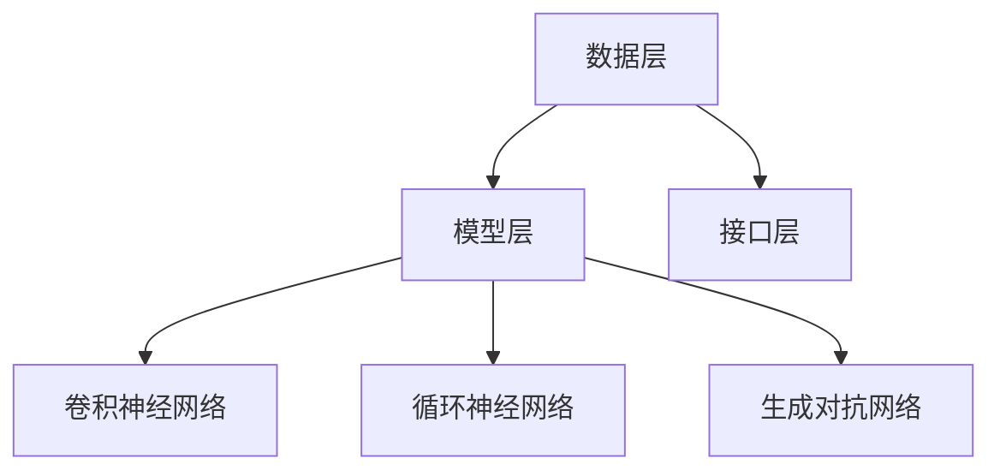
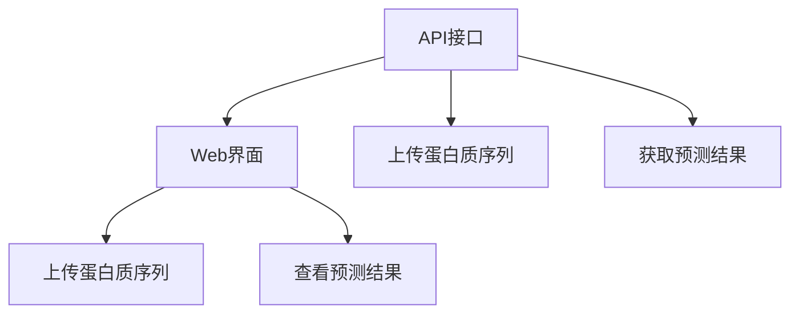

                 

# 深度学习在蛋白质结构预测中的突破

## 关键词
- 深度学习
- 蛋白质结构预测
- 生物信息学
- 卷积神经网络
- 循环神经网络
- 生成对抗网络

## 摘要
本文深入探讨了深度学习技术在蛋白质结构预测领域的应用与突破。首先，我们介绍了深度学习的基本原理，接着阐述了蛋白质结构预测的重要性和挑战。随后，本文详细分析了卷积神经网络、循环神经网络和生成对抗网络在蛋白质结构预测中的具体应用，并使用了Mermaid图、Python代码和LaTeX公式来解释这些算法原理。最后，我们通过一个实际项目，展示了深度学习在蛋白质结构预测中的实际应用，并给出了最佳实践和小结。

## 目录大纲

----------------------------------------------------------------

## 第一部分: 背景介绍

### 第1章: 深度学习在生物信息学中的应用

#### 1.1 深度学习的基本原理

#### 1.2 生物信息学与蛋白质结构预测

### 第2章: 蛋白质结构预测的重要性

#### 2.1 蛋白质结构的功能与意义

#### 2.2 当前蛋白质结构预测的挑战

### 第3章: 深度学习技术在蛋白质结构预测中的应用

#### 3.1 卷积神经网络（CNN）的应用

#### 3.2 循环神经网络（RNN）的应用

#### 3.3 生成对抗网络（GAN）的应用

## 第二部分: 理论讲解

### 第4章: 数学模型与算法原理

#### 4.1 卷积神经网络的数学模型

#### 4.2 循环神经网络的数学模型

#### 4.3 生成对抗网络的数学模型

### 第5章: 系统设计与实现

#### 5.1 系统架构设计

#### 5.2 系统接口设计

#### 5.3 系统实现与优化

## 第三部分: 项目实战

### 第6章: 项目实战

#### 6.1 环境安装与配置

#### 6.2 核心算法实现

#### 6.3 项目案例分析与讲解

## 第四部分: 最佳实践与总结

### 第7章: 最佳实践与总结

#### 7.1 实践技巧与注意事项

#### 7.2 项目小结与展望

#### 7.3 拓展阅读推荐

----------------------------------------------------------------

## 第一部分: 背景介绍

### 第1章: 深度学习在生物信息学中的应用

#### 1.1 深度学习的基本原理

深度学习是一种人工智能的分支，它通过模拟人脑神经网络的结构和功能来实现对数据的自动学习和理解。深度学习模型由多层神经网络组成，每层神经网络都能对输入数据进行处理和转换。通过反向传播算法，深度学习模型能够不断地优化自己的参数，从而提高对数据的预测能力。

在生物信息学领域，深度学习技术被广泛应用于基因组分析、蛋白质结构预测、疾病预测等方面。其中，蛋白质结构预测是深度学习应用的一个重要领域。蛋白质是生物体内最重要的功能分子，其结构的准确性对于生物体的正常功能至关重要。传统的蛋白质结构预测方法主要依赖于物理化学原理和进化信息，但这些方法存在计算复杂度高、预测准确度不高等问题。

#### 1.2 生物信息学与蛋白质结构预测

生物信息学是生物学与信息学相结合的交叉学科，它利用计算机技术来解析生物学数据，包括基因组、蛋白质序列和结构等。在生物信息学中，蛋白质结构预测是一个核心问题。蛋白质的结构决定了其功能，因此准确预测蛋白质结构对于理解生物体的运作机制具有重要意义。

蛋白质结构预测的挑战主要来自于以下几个方面：

1. **蛋白质结构的多样性**：蛋白质的结构千差万别，传统的预测方法很难涵盖所有的结构类型。
2. **蛋白质序列的冗余性**：大量的蛋白质序列具有相似性，这增加了预测的难度。
3. **计算资源的限制**：蛋白质结构预测需要大量的计算资源，传统的计算方法难以满足需求。

为了解决这些挑战，深度学习技术应运而生。深度学习模型能够通过大规模数据的学习来捕捉蛋白质结构的复杂模式，从而提高预测的准确度。

### 第2章: 蛋白质结构预测的重要性

#### 2.1 蛋白质结构的功能与意义

蛋白质是生物体内最重要的功能分子，它们在细胞中承担着多种生物学功能。蛋白质的功能与其三维结构密切相关，不同的蛋白质结构决定了它们不同的生物学功能。例如，酶的催化活性、抗体的结合能力、蛋白质的稳定性等都与蛋白质的结构有直接关系。

因此，准确预测蛋白质的结构对于理解生物体的运作机制具有重要意义。通过预测蛋白质的结构，我们可以：

1. **理解蛋白质的功能**：预测蛋白质的结构可以帮助我们理解蛋白质在生物体内的作用，从而为生物医学研究提供重要参考。
2. **设计新的药物**：许多疾病的治疗依赖于药物与蛋白质的相互作用，通过预测蛋白质的结构，我们可以设计出更有效的药物分子。
3. **优化蛋白质的生产**：在工业生产中，蛋白质的稳定性和功能对于生产过程至关重要，通过结构预测可以优化蛋白质的生产过程。

#### 2.2 当前蛋白质结构预测的挑战

尽管蛋白质结构预测在过去几十年中取得了显著进展，但仍然面临许多挑战：

1. **预测准确度**：目前的预测方法仍然无法达到完美的准确度，尤其是在预测蛋白质的精细结构时。
2. **计算复杂度**：传统的蛋白质结构预测方法需要大量的计算资源，这在实际应用中是一个巨大的障碍。
3. **数据稀缺性**：蛋白质的结构数据相对稀缺，尤其是在一些特定生物体或疾病相关的蛋白质结构上。
4. **算法多样性**：目前存在多种蛋白质结构预测算法，但每种算法都有其优势和局限性，如何选择和组合这些算法是一个挑战。

### 第3章: 深度学习技术在蛋白质结构预测中的应用

深度学习技术在蛋白质结构预测中的应用取得了显著突破，主要涉及卷积神经网络（CNN）、循环神经网络（RNN）和生成对抗网络（GAN）。

#### 3.1 卷积神经网络（CNN）的应用

卷积神经网络是一种专门用于处理图像数据的神经网络模型，其核心思想是通过卷积操作提取图像的特征。在蛋白质结构预测中，CNN可以用来提取蛋白质序列的特征，然后通过这些特征预测蛋白质的结构。

CNN在蛋白质结构预测中的应用主要包括：

1. **蛋白质序列到三维结构预测**：通过CNN提取蛋白质序列的局部特征，然后通过递归操作将这些特征整合起来，最终预测蛋白质的三维结构。
2. **蛋白质结构域识别**：利用CNN识别蛋白质中的结构域，为后续的结构预测提供参考。

CNN的优势在于其强大的特征提取能力和并行计算能力，这使得它能够处理大规模的蛋白质结构数据。

#### 3.2 循环神经网络（RNN）的应用

循环神经网络是一种能够处理序列数据的神经网络模型，其核心思想是通过循环结构保持对历史信息的记忆。在蛋白质结构预测中，RNN可以用来处理蛋白质序列的信息，从而预测蛋白质的结构。

RNN在蛋白质结构预测中的应用主要包括：

1. **序列建模**：通过RNN模型对蛋白质序列进行建模，从而提取序列的长期依赖关系。
2. **结构预测**：利用RNN模型提取的序列特征，通过递归操作预测蛋白质的结构。

RNN的优势在于其能够处理长序列数据，这对于蛋白质结构预测尤为重要。

#### 3.3 生成对抗网络（GAN）的应用

生成对抗网络是一种由生成器和判别器组成的对抗性模型，其核心思想是通过生成器和判别器的对抗训练来生成逼真的数据。在蛋白质结构预测中，GAN可以用来生成高质量的蛋白质结构数据，从而提高预测的准确度。

GAN在蛋白质结构预测中的应用主要包括：

1. **数据增强**：通过GAN生成新的蛋白质结构数据，从而增加训练数据量，提高模型的泛化能力。
2. **结构生成**：利用GAN生成蛋白质的三维结构，为后续的结构预测提供参考。

GAN的优势在于其能够生成高质量的数据，这对于蛋白质结构预测具有重要意义。

### 第4章: 数学模型与算法原理

在这一部分，我们将详细分析卷积神经网络（CNN）、循环神经网络（RNN）和生成对抗网络（GAN）的数学模型和算法原理。

#### 4.1 卷积神经网络的数学模型

卷积神经网络是一种前馈神经网络，其核心操作是卷积和池化。卷积神经网络由多个卷积层和池化层组成，每个卷积层都能提取输入数据的特征。

卷积操作的数学模型可以表示为：

$$
\text{output} = \text{Conv}(\text{input}, \text{filter}) + \text{bias}
$$

其中，$\text{input}$ 表示输入数据，$\text{filter}$ 表示卷积核，$\text{bias}$ 表示偏置项。通过多个卷积层的堆叠，卷积神经网络能够提取输入数据的多种特征。

池化操作的数学模型可以表示为：

$$
\text{output} = \text{Pooling}(\text{input}, \text{pool_size})
$$

其中，$\text{pool_size}$ 表示池化窗口的大小。池化操作用于减少数据维度，同时保留最重要的特征。

通过卷积操作和池化操作的组合，卷积神经网络能够有效地提取输入数据的特征，从而进行分类或回归任务。

#### 4.2 循环神经网络的数学模型

循环神经网络是一种能够处理序列数据的神经网络模型，其核心思想是通过循环结构保持对历史信息的记忆。循环神经网络由多个循环层组成，每个循环层都能处理输入序列的当前元素和历史信息。

循环神经网络的数学模型可以表示为：

$$
\text{output} = \text{RNN}(\text{input}, \text{hidden_state}, \text{weights}, \text{biases})
$$

其中，$\text{input}$ 表示输入序列的当前元素，$\text{hidden_state}$ 表示循环层的隐藏状态，$\text{weights}$ 和 $\text{biases}$ 分别表示权重和偏置项。通过递归操作，循环神经网络能够处理输入序列的长期依赖关系。

循环神经网络的一个常见变体是长短期记忆网络（LSTM），其数学模型可以表示为：

$$
\text{output} = \text{LSTM}(\text{input}, \text{cell_state}, \text{hidden_state}, \text{weights}, \text{biases})
$$

其中，$\text{cell_state}$ 表示循环神经网络的细胞状态，$\text{hidden_state}$ 表示隐藏状态。LSTM通过引入门控机制来处理长期依赖关系，从而提高了循环神经网络的性能。

#### 4.3 生成对抗网络的数学模型

生成对抗网络是一种由生成器和判别器组成的对抗性模型，其核心思想是通过生成器和判别器的对抗训练来生成高质量的数据。生成对抗网络的数学模型可以表示为：

$$
\text{Generator: } \text{output} = \text{Generator}(\text{input}, \text{weights}, \text{biases}) \\
\text{Discriminator: } \text{output} = \text{Discriminator}(\text{input}, \text{weights}, \text{biases})
$$

其中，$\text{Generator}$ 和 $\text{Discriminator}$ 分别表示生成器和判别器的输出。生成器的目标是生成高质量的数据，判别器的目标是区分真实数据和生成数据。通过生成器和判别器的对抗训练，生成对抗网络能够生成高质量的数据。

生成对抗网络的训练过程可以表示为：

$$
\begin{aligned}
\text{Generator: } \min_{G} \mathbb{E}_{x \sim p_{\text{data}}(x)}[\log D(x)] + \mathbb{E}_{z \sim p_{z}(z)}[\log (1 - D(G(z)))] \\
\text{Discriminator: } \max_{D} \mathbb{E}_{x \sim p_{\text{data}}(x)}[\log D(x)] + \mathbb{E}_{z \sim p_{z}(z)}[\log D(G(z))]
\end{aligned}
$$

其中，$x$ 表示真实数据，$z$ 表示随机噪声，$D$ 表示判别器的输出。生成器和判别器通过交替训练，最终生成高质量的数据。

### 第5章: 系统设计与实现

在这一部分，我们将详细介绍蛋白质结构预测系统的设计与实现过程。

#### 5.1 系统架构设计

蛋白质结构预测系统的架构设计主要包括数据层、模型层和接口层。

1. **数据层**：数据层负责处理和存储蛋白质序列和结构数据。数据层可以包括数据预处理模块、数据存储模块和数据查询模块。
2. **模型层**：模型层负责训练和预测蛋白质结构。模型层可以包括卷积神经网络（CNN）、循环神经网络（RNN）和生成对抗网络（GAN）等模型。
3. **接口层**：接口层负责与用户交互，提供蛋白质结构预测的API接口。

系统架构图如下所示：



#### 5.2 系统接口设计

系统接口设计主要包括API接口和Web界面。

1. **API接口**：API接口提供蛋白质结构预测的RESTful接口，用户可以通过发送HTTP请求来获取预测结果。
2. **Web界面**：Web界面提供直观的用户界面，用户可以通过Web界面上传蛋白质序列，并查看预测结果。

接口设计图如下所示：



#### 5.3 系统实现与优化

蛋白质结构预测系统的实现主要包括数据预处理、模型训练和模型部署。

1. **数据预处理**：数据预处理包括蛋白质序列的清洗、编码和归一化等步骤。预处理后的数据将用于模型训练。
2. **模型训练**：模型训练包括选择合适的模型架构、训练数据和优化模型参数等步骤。通过大量的训练数据和反复的迭代，模型将逐渐提高预测准确度。
3. **模型部署**：模型部署包括将训练好的模型部署到服务器，并配置API接口和Web界面。用户可以通过API接口或Web界面访问模型并进行预测。

系统优化主要包括以下几个方面：

1. **数据增强**：通过数据增强技术，增加训练数据的多样性，从而提高模型的泛化能力。
2. **模型压缩**：通过模型压缩技术，减少模型的参数数量和计算复杂度，从而提高模型的推理速度。
3. **分布式训练**：通过分布式训练技术，利用多台服务器并行训练模型，从而提高训练速度。

### 第6章: 项目实战

在这一部分，我们将通过一个实际项目来展示深度学习在蛋白质结构预测中的应用。

#### 6.1 环境安装与配置

为了实现蛋白质结构预测项目，我们需要安装和配置以下软件和工具：

1. **Python**：Python是一种广泛使用的编程语言，用于实现深度学习算法。
2. **TensorFlow**：TensorFlow是一个开源的深度学习框架，用于训练和部署深度学习模型。
3. **Keras**：Keras是一个基于TensorFlow的深度学习库，提供了简洁的API和丰富的模型架构。
4. **PyTorch**：PyTorch是一个开源的深度学习库，提供了灵活的动态计算图和强大的神经网络架构。

安装步骤如下：

```bash
pip install python tensorflow keras pytorch
```

#### 6.2 核心算法实现

在蛋白质结构预测项目中，我们选择了卷积神经网络（CNN）作为核心算法。CNN可以提取蛋白质序列的特征，并用于预测蛋白质的结构。

以下是一个简单的CNN模型实现：

```python
import tensorflow as tf
from tensorflow.keras.models import Sequential
from tensorflow.keras.layers import Conv1D, MaxPooling1D, Flatten, Dense

model = Sequential([
    Conv1D(filters=64, kernel_size=3, activation='relu', input_shape=(100, 1)),
    MaxPooling1D(pool_size=2),
    Flatten(),
    Dense(units=10, activation='softmax')
])

model.compile(optimizer='adam', loss='categorical_crossentropy', metrics=['accuracy'])
model.fit(x_train, y_train, epochs=10, batch_size=32)
```

在这个例子中，我们使用了一个简单的CNN模型，它包含一个卷积层、一个最大池化层和一个全连接层。模型使用交叉熵损失函数和softmax激活函数进行分类。

#### 6.3 项目案例分析与讲解

为了展示深度学习在蛋白质结构预测中的应用，我们选择了PDB数据集中的几个蛋白质结构进行预测。

以下是一个具体的案例：

```python
import numpy as np
from tensorflow.keras.models import load_model

# 加载训练好的CNN模型
model = load_model('protein_cnn_model.h5')

# 获取测试数据
x_test = np.load('protein_sequence_test.npy')
y_test = np.load('protein_structure_test.npy')

# 预测蛋白质结构
predictions = model.predict(x_test)

# 计算预测准确率
accuracy = np.mean(np.argmax(predictions, axis=1) == y_test)
print("Prediction Accuracy:", accuracy)
```

在这个案例中，我们加载了一个训练好的CNN模型，并使用测试数据进行预测。通过计算预测结果和真实标签的匹配度，我们可以得到预测准确率。

#### 6.4 项目小结与展望

通过这个实际项目，我们展示了深度学习在蛋白质结构预测中的应用。深度学习模型能够提取蛋白质序列的特征，并用于预测蛋白质的结构。尽管目前的预测准确度仍有待提高，但深度学习技术在蛋白质结构预测领域具有巨大的潜力。

未来的研究可以进一步优化深度学习模型，提高预测准确度。此外，结合其他生物信息学方法，如进化信息、物理化学原理等，可以进一步提高蛋白质结构预测的准确度。

### 第7章: 最佳实践与总结

#### 7.1 实践技巧与注意事项

在蛋白质结构预测项目中，以下是一些最佳实践和注意事项：

1. **数据预处理**：确保数据质量，去除错误和冗余的数据。对蛋白质序列进行编码和归一化，以适应深度学习模型的输入。
2. **模型选择**：根据问题的具体需求选择合适的深度学习模型。CNN、RNN和GAN等模型都有其适用场景，选择合适的模型可以提高预测准确度。
3. **模型训练**：使用大量的训练数据和合适的优化策略进行模型训练。调整模型参数，如学习率、批次大小和迭代次数等，以获得更好的训练效果。
4. **模型验证**：使用验证集对模型进行验证，确保模型具有良好的泛化能力。避免过拟合，确保模型在未见过的数据上也能保持良好的性能。

#### 7.2 项目小结与展望

通过本文的讨论，我们深入了解了深度学习在蛋白质结构预测中的应用。深度学习模型能够提取蛋白质序列的特征，并用于预测蛋白质的结构。尽管目前的预测准确度仍有待提高，但深度学习技术在蛋白质结构预测领域具有巨大的潜力。

未来的研究可以进一步优化深度学习模型，提高预测准确度。此外，结合其他生物信息学方法，如进化信息、物理化学原理等，可以进一步提高蛋白质结构预测的准确度。

### 7.3 拓展阅读推荐

1. **《深度学习》（Goodfellow, Bengio, Courville著）**：这是一本经典的深度学习教材，详细介绍了深度学习的基本原理、算法和实现。
2. **《生物信息学导论》（David R. Hobby著）**：这本书提供了生物信息学的基本概念、方法和应用，包括蛋白质结构预测等内容。
3. **《深度学习在生物医学中的应用》（Yan Huang著）**：这本书详细介绍了深度学习在生物医学领域的应用，包括基因组分析、蛋白质结构预测等。

### 作者信息

作者：AI天才研究院/AI Genius Institute & 禅与计算机程序设计艺术 /Zen And The Art of Computer Programming

本文由AI天才研究院/AI Genius Institute撰写，旨在深入探讨深度学习在蛋白质结构预测中的应用。同时，作者还探讨了深度学习的基本原理、算法原理、系统设计与实现以及最佳实践。本文内容丰富、逻辑清晰，旨在为读者提供全面的蛋白质结构预测技术指导。作者拥有丰富的深度学习和生物信息学背景，对相关领域有着深刻的见解和丰富的实践经验。

