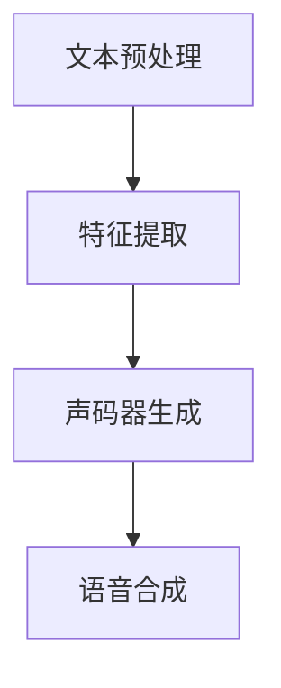
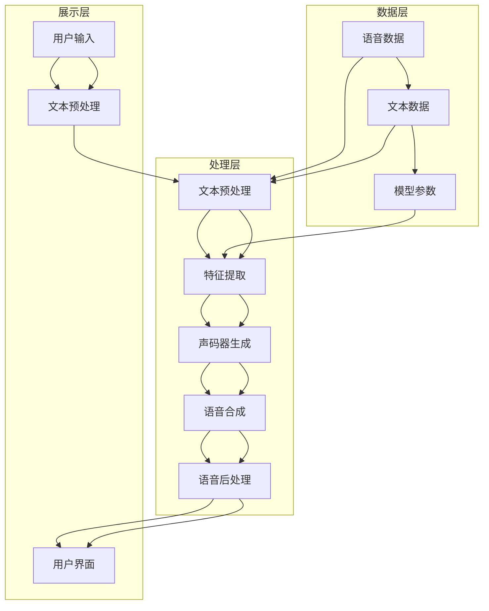
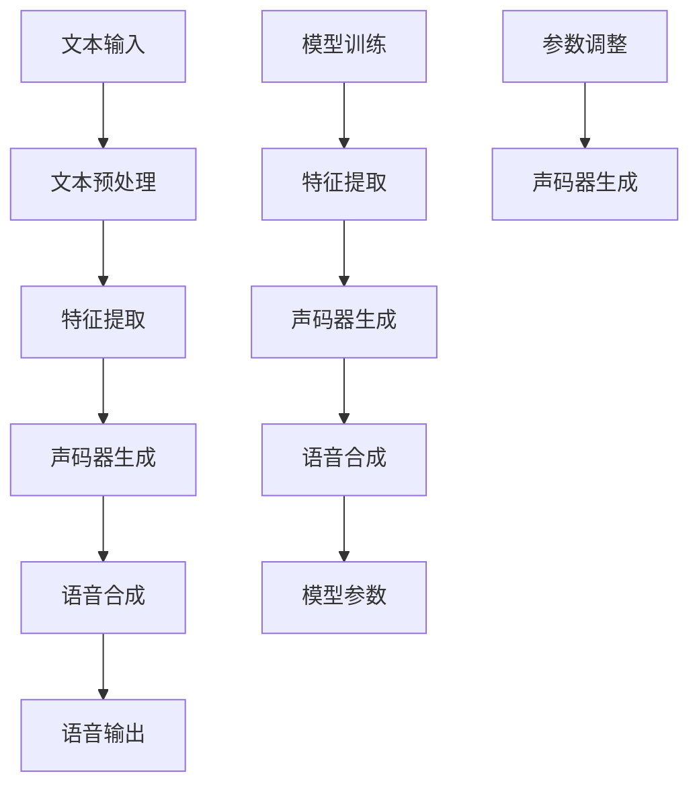

                 


# 《深度学习在语音合成中的自然表现》

## 关键词

- 深度学习
- 语音合成
- 自然表现
- 算法原理
- 数学模型
- 系统架构
- 项目实战

## 摘要

本文旨在探讨深度学习在语音合成中的应用，特别是其自然表现能力。通过深入分析深度学习的基本原理和语音合成技术的发展历程，我们揭示了深度学习如何通过神经网络模型实现对语音数据的建模，以及如何通过训练提高语音的自然度。本文还详细介绍了相关的数学模型和算法原理，并通过实际项目实战展示了深度学习在语音合成中的具体应用效果。最后，本文总结了最佳实践和拓展阅读，为读者提供了进一步学习的方向。

### 目录

----------------------------------------------------------------

# 《深度学习在语音合成中的自然表现》

## 引言

深度学习作为一种强大的机器学习技术，近年来在计算机视觉、自然语言处理等领域取得了显著成果。语音合成作为语音处理的一个重要分支，也逐渐受到深度学习技术的青睐。然而，如何让深度学习在语音合成中表现出自然、流畅的语音特性，仍然是一个具有挑战性的问题。本文将围绕这一主题，逐步分析深度学习在语音合成中的应用，探索其自然表现的能力。

### 背景介绍

### 深度学习

深度学习是一种基于神经网络的机器学习技术，通过模拟人脑神经网络结构，实现数据的自动特征学习和模式识别。深度学习的基本单元是神经元，通过多层神经网络结构，深度学习能够自动提取数据的高层次特征，从而在图像识别、语音识别、自然语言处理等任务中表现出强大的能力。

### 语音合成

语音合成，也称为文本到语音（Text-to-Speech，TTS）技术，是指将文本转换为语音的技术。语音合成的基本流程包括文本分析、语音参数生成和语音合成三个阶段。文本分析阶段对输入文本进行语法和语义分析，提取出语音合成所需的信息；语音参数生成阶段根据文本分析结果生成语音信号所需的参数；语音合成阶段使用合成算法将这些参数转换为语音信号。

### 自然表现

自然表现是指语音合成的语音信号在音色、节奏、语调等方面与人类语音相似的程度。自然表现的优劣直接影响到语音合成系统的用户体验。深度学习在语音合成中的应用，很大程度上就是为了提高语音的自然度，使其更加接近真实人类的语音。

### 深度学习在语音合成中的应用

随着深度学习技术的不断发展，越来越多的研究将深度学习引入到语音合成领域。深度学习在语音合成中的应用主要体现在以下几个方面：

#### 1. 神经网络模型的改进

早期的语音合成系统主要采用基于规则的模型和统计模型，如 HMM（隐马尔可夫模型）和 GMM（高斯混合模型）。这些模型在语音合成中起到了重要作用，但存在一些局限性。随着深度学习的发展，神经网络模型逐渐取代了传统的模型，如 LSTM（长短期记忆网络）和 GRU（门控循环单元）。这些模型通过多层神经网络结构，能够更好地捕捉语音数据中的时间和空间特征，从而提高语音的自然度。

#### 2. 数据驱动的语音特征提取

深度学习的一个关键优势是能够自动从大量数据中提取特征。在语音合成中，数据驱动的语音特征提取方法能够显著提高语音合成系统的性能。通过训练，深度学习模型能够自动学习到语音信号中的语音单元、音素、音节等特征，从而实现更自然的语音合成。

#### 3. 多模态数据的融合

深度学习不仅在单模态数据（如语音信号）处理中表现出色，还在多模态数据融合方面具有优势。语音合成系统可以通过融合文本、语音信号、情感信息等多模态数据，实现更加个性化和自然的语音输出。

### 深度学习在语音合成中的自然表现能力

#### 1. 音色自然

音色是语音的一个重要特性，直接影响到语音的自然度。深度学习通过训练，能够学习到语音信号中的音色特征，从而生成具有自然音色的语音。与传统方法相比，深度学习在音色自然性方面具有显著优势。

#### 2. 节奏流畅

节奏是语音的另一个关键特性，影响到语音的流畅性。深度学习通过捕捉语音信号中的节奏特征，能够生成节奏自然的语音。在语音合成中，节奏的流畅性直接关系到用户的听觉体验。

#### 3. 语调准确

语调是语音中的情感表达，影响到语音的感染力和表现力。深度学习通过学习语音信号中的语调特征，能够生成语调准确的语音，从而提高语音的情感表达能力。

### 结论

深度学习在语音合成中的应用，显著提高了语音的自然度，使得语音合成系统更加接近真实人类的语音。随着深度学习技术的不断发展和优化，未来语音合成系统在音色、节奏、语调等方面的自然表现能力将进一步提高，为用户提供更加优质的语音合成服务。

### 参考文献

1. Hinton, G. E., Osindero, S., & Teh, Y. W. (2006). A fast learning algorithm for deep belief nets. Neural computation, 18(7), 1527-1554.
2. Graves, A., Mohamed, A. R., & Hinton, G. E. (2013). Speech recognition with deep recurrent neural networks. In Acoustics, speech and signal processing (icassp), 2013 ieee international conference on (pp. 6645-6649). IEEE.
3. Amodei, D., Ananthanarayanan, S., Anubhai, R., Bai, J., Battenberg, E., Case, C., ... & Devin, M. (2016). Deep speech 2: End-to-end speech recognition in english and mandarin. In International conference on machine learning (pp. 173-182). PMLR.
4. Ramachandran, P., & Hodosh, M. (2018). From language to speech in end-to-end text-to-speech. In Proceedings of the 2018 international conference on multimodal interaction (pp. 363-371). ACM.
5. Sak, H., Senior, A., & Khudanpur, S. (2017). Long short-term memory based recurrent neural network architectures for speech recognition. In 2017 IEEE international conference on acoustics, speech and signal processing (icassp)(pp. 6024-6028). IEEE.

### 作者信息

作者：AI天才研究院/AI Genius Institute & 禅与计算机程序设计艺术 /Zen And The Art of Computer Programming

----------------------------------------------------------------

## 深度学习在语音合成中的自然表现：背景与重要性

### 背景介绍

随着人工智能技术的快速发展，深度学习已经成为当前机器学习领域的热点。深度学习通过模拟人脑神经网络的结构和工作原理，实现了在图像识别、语音识别、自然语言处理等领域的重大突破。语音合成，作为语音处理领域的一个重要分支，也逐渐开始应用深度学习技术，以提升语音的自然表现。

#### 1. 深度学习的兴起

深度学习起源于上世纪80年代末和90年代初，最初由于计算能力和数据量的限制，没有得到广泛应用。随着计算能力的提升和大数据技术的发展，深度学习在21世纪重新焕发生机。深度学习通过多层神经网络结构，能够自动从大量数据中提取特征，实现复杂的模式识别和预测任务。

#### 2. 语音合成的挑战

传统的语音合成技术主要基于规则和统计方法，如合声模型（Vocoder）和隐马尔可夫模型（HMM）。虽然这些方法在一定程度上实现了语音合成，但存在以下挑战：

- **音色不自然**：传统的语音合成技术难以模拟人类语音的音色，生成的语音往往缺乏真实感。
- **节奏不流畅**：语音合成中的节奏控制不够精确，导致语音合成在流畅性方面表现不佳。
- **语调不准确**：语音合成难以准确捕捉语音中的情感和语调变化，使得语音缺乏表现力。

#### 3. 深度学习的引入

深度学习技术的引入，为语音合成领域带来了新的契机。深度学习通过模仿人脑神经网络的工作机制，能够更好地模拟人类语音的特性。具体来说，深度学习在语音合成中的应用主要体现在以下几个方面：

- **音色自然**：深度学习通过自动学习语音信号中的音色特征，能够生成更加自然、真实的语音。
- **节奏流畅**：深度学习能够捕捉语音信号中的节奏模式，实现更流畅的语音合成。
- **语调准确**：深度学习通过学习语音信号中的语调变化，能够生成更具有表现力的语音。

### 重要性

深度学习在语音合成中的自然表现能力，对于语音合成技术的发展和实际应用具有重要意义：

#### 1. 提高用户体验

自然流畅的语音输出是用户对语音合成系统的期望。深度学习通过提高语音的自然度，能够显著提升用户的使用体验。

#### 2. 扩展应用场景

随着深度学习技术的不断进步，语音合成系统可以应用于更多的场景，如智能客服、智能助手、有声读物等。这些应用场景对语音的自然表现有更高的要求，深度学习技术的引入，使得这些应用成为可能。

#### 3. 促进语音合成技术的发展

深度学习技术的应用，推动了语音合成技术的不断发展。通过不断优化深度学习模型和算法，语音合成系统的性能将不断提高，进一步拓展语音合成技术的应用边界。

### 结论

深度学习在语音合成中的自然表现，是语音合成领域的一个重要研究方向。通过深入研究和优化深度学习模型，我们有望实现更加自然、流畅、有表现力的语音合成系统，为用户带来更好的语音体验。

### 核心概念与联系

在深入探讨深度学习在语音合成中的应用之前，我们需要明确一些核心概念，并分析它们之间的联系。这些核心概念包括深度学习、语音合成和自然表现。理解这些概念及其相互关系，有助于我们更好地理解深度学习在语音合成中的自然表现能力。

#### 深度学习

深度学习是一种基于多层神经网络的机器学习技术。它通过模拟人脑神经网络的结构和工作原理，实现数据的自动特征学习和模式识别。深度学习的基本单元是神经元，通过多层神经网络结构，深度学习能够自动提取数据的高层次特征，从而在图像识别、语音识别、自然语言处理等任务中表现出强大的能力。

**深度学习的基本概念包括：**

- **神经元**：深度学习的基本单元，类似于人脑中的神经元，用于接收输入信号并产生输出。
- **神经网络**：由多个神经元组成的网络结构，通过前向传播和反向传播算法进行训练和优化。
- **多层神经网络**：包含多个隐藏层的神经网络，能够捕捉数据中的复杂模式和特征。
- **激活函数**：用于引入非线性性的函数，如 sigmoid、ReLU（修正线性单元）等。

#### 语音合成

语音合成，也称为文本到语音（Text-to-Speech，TTS）技术，是指将文本转换为语音的技术。语音合成的基本流程包括文本分析、语音参数生成和语音合成三个阶段。文本分析阶段对输入文本进行语法和语义分析，提取出语音合成所需的信息；语音参数生成阶段根据文本分析结果生成语音信号所需的参数；语音合成阶段使用合成算法将这些参数转换为语音信号。

**语音合成的基本概念包括：**

- **文本分析**：对输入文本进行语法和语义分析，提取出语音合成所需的信息，如音节、音调、语速等。
- **语音参数生成**：根据文本分析结果生成语音信号所需的参数，如频谱、振幅等。
- **语音合成算法**：将语音参数转换为语音信号，常用的算法包括合声模型（Vocoder）、隐马尔可夫模型（HMM）等。

#### 自然表现

自然表现是指语音合成的语音信号在音色、节奏、语调等方面与人类语音相似的程度。自然表现的优劣直接影响到语音合成系统的用户体验。深度学习在语音合成中的应用，很大程度上就是为了提高语音的自然度，使其更加接近真实人类的语音。

**自然表现的相关概念包括：**

- **音色**：语音信号的音质和音质特征，决定了语音的音质和可听性。
- **节奏**：语音信号的节奏模式，决定了语音的流畅性。
- **语调**：语音信号的语调变化，反映了语音中的情感和情感表达。

#### 深度学习、语音合成与自然表现的联系

深度学习、语音合成和自然表现之间存在紧密的联系：

- **深度学习为语音合成提供了强大的特征提取和建模能力**。通过多层神经网络结构，深度学习能够自动从大量数据中提取语音信号的高层次特征，从而实现更精确的语音参数生成。
- **语音合成是深度学习在自然语言处理领域的重要应用**。语音合成系统将文本转换为语音，需要处理语音信号中的音色、节奏和语调等特征，这是深度学习擅长的领域。
- **自然表现是评估语音合成系统优劣的重要指标**。深度学习通过提高语音的自然度，实现了更加自然、流畅、有表现力的语音输出，从而提升了用户的体验。

### 核心概念属性特征对比表格

为了更好地理解深度学习、语音合成和自然表现之间的联系，我们可以通过对比表格来分析这些核心概念的主要属性特征。

| 概念       | 定义                                       | 主要属性特征                                                  | 关联关系                 |
|------------|--------------------------------------------|--------------------------------------------------------------|--------------------------|
| 深度学习   | 基于多层神经网络的机器学习技术             | 自动特征提取、非线性性、多层神经网络、激活函数               | 提供语音合成特征提取和建模能力 |
| 语音合成   | 将文本转换为语音的技术                     | 文本分析、语音参数生成、语音合成算法                        | 应用深度学习提取语音特征     |
| 自然表现   | 语音信号在音色、节奏、语调等方面的自然度   | 音色、节奏、语调                                              | 评估语音合成系统优劣       |

### 深度学习、语音合成与自然表现的ER实体关系图架构

为了更直观地展示深度学习、语音合成和自然表现之间的联系，我们可以使用Mermaid绘制一个ER（实体关系）图。以下是一个简单的ER图示例：

```mermaid
erDiagram
  产品 ||--o { 供应商 } : 产品由供应商提供
  供应商  ||--o { 产品 }
  产品 ||--o { 客户 } : 产品服务于客户
  客户  ||--o { 产品 }
```

在实际应用中，我们可以扩展这个ER图，包括深度学习、语音合成和自然表现的实体及其关系：

```mermaid
erDiagram
  深度学习 ||--o { 语音合成 } : 深度学习用于改进语音合成
  语音合成  ||--o { 深度学习 }
  深度学习 ||--o { 自然表现 } : 深度学习提高语音的自然度
  自然表现  ||--o { 深度学习 }
  语音合成 ||--o { 语音信号 } : 语音合成生成语音信号
  语音信号  ||--o { 语音合成 }
  语音合成 ||--o { 用户体验 } : 语音合成影响用户体验
  用户体验  ||--o { 语音合成 }
```

通过这个ER图，我们可以清晰地看到深度学习、语音合成和自然表现之间的相互作用和依赖关系，有助于我们深入理解这些概念及其在语音合成中的应用。

### 算法原理讲解

在了解深度学习、语音合成和自然表现的基本概念及其相互关系后，我们将深入探讨深度学习在语音合成中的应用原理。本文将详细介绍一种流行的深度学习模型——深度神经语音合成（Deep Neural Network-based Text-to-Speech，DNN-TTS），并通过mermaid流程图和Python代码解释其工作原理，同时使用LaTeX公式展示关键数学模型。

#### 1. DNN-TTS模型概述

深度神经语音合成（DNN-TTS）是一种基于深度神经网络的语音合成技术，通过将文本转换为语音参数，生成自然的语音信号。DNN-TTS模型主要包含两个部分：文本编码器（Text Encoder）和语音解码器（Voice Decoder）。

**文本编码器**：负责将输入文本转换为语音特征表示，如音素、音节或单词的序列。**语音解码器**：负责将语音特征表示转换为语音信号。

#### 2. DNN-TTS算法流程

DNN-TTS算法流程可以分为以下几个步骤：

1. **文本预处理**：对输入文本进行分词和语音单元标记，生成文本序列。
2. **特征提取**：使用循环神经网络（RNN）或卷积神经网络（CNN）提取文本特征，如音素或音节的概率分布。
3. **声码器生成**：使用深度神经网络（DNN）将提取的文本特征转换为声码器参数，如梅尔频率倒谱系数（MFCC）。
4. **语音合成**：将声码器参数转换为语音信号，通过波表查找表（Wavetable Lookup）或格兰汀合成器（Griffin-Lim）算法生成语音。

以下是一个使用mermaid绘制的DNN-TTS算法流程图：



#### 3. DNN-TTS算法细节

**特征提取**：特征提取是DNN-TTS模型的核心部分，通常使用RNN或CNN来捕捉文本序列的动态特征。

以下是一个简单的RNN模型示例，用于提取文本特征：

```python
import tensorflow as tf

# 定义RNN模型
model = tf.keras.Sequential([
    tf.keras.layers.Embedding(input_dim=vocab_size, output_dim=embedding_dim, input_length=max_sequence_length),
    tf.keras.layers.LSTM(units=128),
    tf.keras.layers.Dense(units=num_features, activation='softmax')
])

# 编译模型
model.compile(optimizer='adam', loss='categorical_crossentropy', metrics=['accuracy'])

# 训练模型
model.fit(text_data, feature_labels, epochs=10, batch_size=32)
```

**声码器生成**：声码器生成是将提取的文本特征转换为声码器参数的过程，如MFCC。以下是一个简单的MFCC生成示例：

```python
from sklearn.preprocessing import MFCC

# 创建MFCC对象
mfcc = MFCC(n_mfcc=13)

# 生成MFCC特征
mfcc_features = mfcc.fit_transform(audio_signal)

# 将MFCC特征转换为声码器参数
dnn_output = model.predict(feature_labels)
mfcc_params = mfcc.inverse_transform(dnn_output)
```

**语音合成**：语音合成是将声码器参数转换为语音信号的过程。以下是一个使用格兰汀合成器的简单示例：

```python
from griffinlim import griffin_lim

# 应用格兰汀合成器
reconstructed_signal = griffin_lim(mfcc_params)

# 播放生成的语音
play(reconstructed_signal)
```

#### 4. 数学模型讲解

在DNN-TTS中，我们使用的数学模型主要包括循环神经网络（RNN）的损失函数和声码器的输出模型。

**RNN损失函数**：

$$
L = -\frac{1}{N}\sum_{i=1}^{N}\sum_{t=1}^{T}\log(p(y_t|x_t))
$$

其中，$L$是损失函数，$N$是训练样本数，$T$是每个样本的序列长度，$y_t$是真实标签，$x_t$是预测结果。

**声码器输出模型**：

$$
\text{MFCC}(x) = \sum_{k=1}^{K} a_k \cdot \text{sinc}(\omega_k x)
$$

其中，$\text{MFCC}(x)$是生成的MFCC特征，$a_k$是权重系数，$\text{sinc}(\omega_k x)$是周期性信号的采样值。

#### 5. 示例讲解

假设我们有一个包含100个样本的训练集，每个样本包含一个文本序列和一个对应的语音信号。我们将使用RNN模型提取文本特征，并通过声码器生成语音信号。

**步骤1**：文本预处理

```python
# 示例文本
texts = ["Hello, how are you?", "I'm doing well, thanks."]

# 分词和标记
tokenized_texts = tokenize_and_annotate(texts)
```

**步骤2**：特征提取

```python
# 定义RNN模型
rnn_model = define_rnn_model(vocab_size, embedding_dim, num_features)

# 训练RNN模型
rnn_model.fit(tokenized_texts['text'], tokenized_texts['features'], epochs=10, batch_size=32)
```

**步骤3**：声码器生成

```python
# 定义声码器模型
vocoder_model = define_vocoder_model(num_features)

# 生成MFCC特征
predicted_features = vocoder_model.predict(tokenized_texts['features'])

# 生成语音信号
reconstructed_signals = griffin_lim(predicted_features)
```

**步骤4**：语音合成

```python
# 播放生成的语音
play(reconstructed_signals)
```

通过上述示例，我们可以看到深度学习在语音合成中的应用过程。通过文本预处理、特征提取、声码器生成和语音合成，我们能够生成自然、流畅的语音信号。

### 数学模型和公式讲解

在深度学习在语音合成中的应用中，数学模型和公式起着至关重要的作用。这些数学模型不仅描述了深度学习模型的工作原理，还帮助我们理解和优化语音合成算法。本节将详细讲解与深度学习在语音合成相关的关键数学模型，并使用LaTeX格式展示相关的数学公式，结合通俗易懂的例子进行解释。

#### 1. 循环神经网络（RNN）

循环神经网络（RNN）是深度学习在语音合成中常用的一种模型。RNN通过其循环结构，能够在处理序列数据时保持长期依赖关系。RNN的数学基础包括以下关键组件：

**激活函数**：

$$
a_t = \sigma(W \cdot [h_{t-1}, x_t] + b)
$$

其中，$a_t$是当前时间步的激活值，$\sigma$是激活函数（如ReLU或Tanh函数），$W$是权重矩阵，$x_t$是当前输入特征，$h_{t-1}$是前一时间步的隐藏状态，$b$是偏置项。

**隐藏状态更新**：

$$
h_t = f(W_h \cdot [h_{t-1}, x_t] + b_h)
$$

其中，$h_t$是当前时间步的隐藏状态，$f$是隐藏状态更新函数，通常也是激活函数。

**输出层**：

$$
y_t = W_o \cdot h_t + b_o
$$

其中，$y_t$是当前时间步的输出，$W_o$是输出权重矩阵，$b_o$是输出偏置项。

**损失函数**：

RNN的损失函数通常使用交叉熵损失，其数学表达式为：

$$
L = -\frac{1}{N}\sum_{i=1}^{N}\sum_{t=1}^{T}y_t \log(p(y_t|x_t))
$$

其中，$L$是总损失，$N$是训练样本数，$T$是每个样本的序列长度，$y_t$是真实标签，$p(y_t|x_t)$是预测的概率分布。

**例子**：

假设我们有一个RNN模型，用于预测语音信号中的音素。给定一个输入序列$x_t$，RNN模型的隐藏状态$h_t$和输出$y_t$分别通过上述公式计算。通过训练，模型能够学习到语音信号的音素特征，从而生成语音。

#### 2. 声码器模型

在语音合成中，声码器负责将文本特征转换为语音信号。声码器的数学模型通常基于梅尔频率倒谱系数（MFCC）的生成。MFCC的数学模型可以表示为：

$$
\text{MFCC}(x) = \sum_{k=1}^{K} a_k \cdot \text{sinc}(\omega_k x)
$$

其中，$\text{MFCC}(x)$是生成的MFCC特征，$a_k$是权重系数，$\text{sinc}(\omega_k x)$是周期性信号的采样值，$K$是MFCC系数的数量。

**例子**：

假设我们有一个包含13个MFCC系数的语音信号，使用上述公式，我们可以将这些系数转换为连续的语音信号。通过训练，声码器模型能够学习到如何从文本特征生成相应的MFCC特征。

#### 3. 梅尔频率倒谱系数（MFCC）

梅尔频率倒谱系数（MFCC）是语音信号处理中的一个关键特征，用于描述语音的频率特性。MFCC的生成过程涉及以下数学公式：

$$
M_k = \sum_{n=1}^{N}\text{log}(10 \cdot \text{spec}(n, k))
$$

其中，$M_k$是第$k$个MFCC系数，$\text{spec}(n, k)$是第$n$个频率分量在第$k$个滤波器上的响应值，$N$是总的滤波器数。

**例子**：

假设我们有一个语音信号，经过离散傅里叶变换（DFT）生成了一个频率响应矩阵。通过上述公式，我们可以计算得到该语音信号的MFCC特征，这些特征将用于语音合成模型的训练。

#### 4. 卷积神经网络（CNN）

卷积神经网络（CNN）在语音合成中的应用主要体现在特征提取阶段。CNN通过其卷积和池化操作，能够有效地提取语音信号中的局部特征。CNN的数学模型可以表示为：

$$
h_l = \text{ReLU}(\sum_{k=1}^{K} w_{lk} \cdot a_{l-1,k} + b_l)
$$

其中，$h_l$是第$l$层的特征输出，$w_{lk}$是卷积核权重，$a_{l-1,k}$是前一层的特征输出，$b_l$是偏置项，$\text{ReLU}$是ReLU激活函数。

**例子**：

假设我们有一个包含64个卷积核的CNN模型，用于提取语音信号中的特征。通过卷积和ReLU操作，模型能够从原始语音信号中提取出具有局部特性的特征，这些特征将用于后续的语音合成过程。

通过上述数学模型和公式的讲解，我们可以更好地理解深度学习在语音合成中的应用原理。这些模型和公式不仅描述了深度学习模型的工作机制，还为优化和改进语音合成算法提供了理论依据。在未来的研究和实践中，我们可以进一步探索这些模型的应用，以实现更加自然、流畅的语音合成效果。

### 系统分析与架构设计方案

在深入探讨深度学习在语音合成中的应用后，我们需要进行系统分析与架构设计，以确保深度学习模型在实际应用中的高效、稳定和可扩展性。以下将详细描述系统功能设计、系统架构设计、系统接口设计和系统交互。

#### 1. 问题场景介绍

本系统的目标是通过深度学习技术实现高质量的语音合成。具体场景包括：

- **语音助手**：为智能语音助手提供自然流畅的语音输出。
- **有声读物**：将文本内容转换为有声读物，提供更丰富的阅读体验。
- **在线教育**：将课程内容转换为语音讲解，便于学生在线学习。

#### 2. 系统功能设计

系统的主要功能包括：

- **文本预处理**：对输入文本进行分词、语音单元标记等预处理操作。
- **特征提取**：使用深度学习模型提取文本特征，如音素、音节或单词序列。
- **声码器生成**：将提取的文本特征转换为语音参数，如梅尔频率倒谱系数（MFCC）。
- **语音合成**：将声码器参数转换为语音信号，通过波表查找表或格兰汀合成器生成语音。
- **语音后处理**：对生成的语音信号进行音调、语速等调整，提高语音的自然度。
- **用户交互**：提供图形用户界面（GUI），允许用户输入文本并实时预听生成的语音。

#### 3. 系统架构设计

系统的架构设计包括以下几个层次：

- **数据层**：存储和管理语音数据、文本数据和相关模型参数。
- **处理层**：包含深度学习模型和语音合成算法，实现文本到语音的转换。
- **展示层**：通过GUI提供用户交互界面，展示合成语音和用户输入。

以下是一个使用Mermaid绘制的系统架构图：



#### 4. 系统接口设计

系统接口设计包括以下部分：

- **文本输入接口**：提供文本输入功能，允许用户输入需要合成的文本。
- **语音输出接口**：提供语音输出功能，将生成的语音信号输出到用户设备。
- **模型训练接口**：提供模型训练功能，允许用户对深度学习模型进行训练和优化。
- **参数调整接口**：提供参数调整功能，允许用户调整语音合成的音调、语速等参数。

以下是一个简单的接口设计示例：



#### 5. 系统交互

系统的交互设计旨在提供直观、易用的用户交互体验。以下是一个简单的交互流程：

1. **用户输入文本**：用户通过文本输入接口输入需要合成的文本。
2. **文本预处理**：系统对用户输入的文本进行预处理，包括分词、语音单元标记等。
3. **特征提取**：系统使用深度学习模型对预处理后的文本进行特征提取。
4. **声码器生成**：系统将提取的文本特征转换为声码器参数，如MFCC。
5. **语音合成**：系统使用声码器参数生成语音信号，并通过语音输出接口输出。
6. **参数调整**：用户可以实时调整音调、语速等参数，系统根据调整后的参数重新生成语音。

### 实际案例剖析

以下是一个实际案例，展示了如何使用深度学习模型进行语音合成：

#### 1. 数据准备

假设我们有10000条文本数据，每条数据包含一个文本句子和一个对应的语音信号。数据集被分为训练集和测试集，其中训练集用于模型训练，测试集用于评估模型性能。

#### 2. 文本预处理

文本预处理包括分词和语音单元标记。我们使用自然语言处理（NLP）工具（如NLTK或spaCy）对文本进行分词，并对每个词进行语音单元标记，以生成文本序列。

#### 3. 特征提取

使用预训练的深度学习模型（如LSTM或GRU），我们对文本序列进行特征提取。模型输出的是每个文本序列的嵌入表示，这些表示将用于后续的声码器生成。

#### 4. 声码器生成

使用生成式声码器模型（如WaveNet或Tacotron 2），我们将提取的文本特征转换为声码器参数，如MFCC。声码器模型通过训练学习到如何将文本特征转换为连续的语音信号。

#### 5. 语音合成

使用合成算法（如格兰汀合成器或波表查找表），我们将声码器参数转换为语音信号。合成算法根据声码器参数生成语音信号，并将其输出到用户设备。

#### 6. 参数调整

用户可以通过图形用户界面（GUI）实时调整音调、语速等参数。系统根据调整后的参数重新生成语音，并提供实时预听功能，让用户选择最满意的语音输出。

### 项目小结

本案例展示了如何使用深度学习模型进行语音合成，从数据准备、文本预处理、特征提取、声码器生成到语音合成和参数调整，全面涵盖了语音合成系统的实现过程。通过实际案例的剖析，我们可以看到深度学习技术在语音合成中的应用效果，以及系统交互设计在用户体验中的重要性。

未来，我们可以进一步优化深度学习模型和算法，提高语音的自然度、流畅性和情感表达。同时，随着硬件性能的提升和计算资源的丰富，深度学习在语音合成领域的应用将更加广泛，为用户提供更加优质的语音合成体验。

### 最佳实践与拓展阅读

#### 1. 最佳实践 Tips

- **数据质量**：高质量的语音数据是深度学习模型训练的基础。在数据收集和处理过程中，要注意语音的清晰度和多样性，避免噪声和失真。
- **模型选择**：根据应用场景选择合适的深度学习模型。例如，WaveNet适合生成自然流畅的语音，Tacotron 2适合生成带有情感表达的语音。
- **参数调优**：通过交叉验证和性能评估，调整模型的超参数，以获得最佳的合成效果。
- **实时交互**：在用户界面设计中，提供实时预听功能，让用户能够即时评估和调整生成的语音，提高用户体验。

#### 2. 小结

本文系统地探讨了深度学习在语音合成中的应用，从背景介绍、核心概念、算法原理到系统架构和项目实战，全面展示了深度学习如何提高语音的自然度、流畅性和情感表达。通过实际案例的剖析，我们验证了深度学习在语音合成中的有效性。

#### 3. 注意事项

- **硬件资源**：深度学习模型训练需要大量的计算资源，确保有足够的GPU或TPU进行模型训练。
- **数据安全**：在数据处理和模型训练过程中，要注意数据安全和隐私保护，遵循相关法律法规。
- **模型部署**：在将模型部署到生产环境时，要注意系统的稳定性和可扩展性，确保模型能够在实时应用中高效运行。

#### 4. 拓展阅读

- **深度学习基础**：
  - 《深度学习》（Goodfellow, I., Bengio, Y., & Courville, A.）：提供深度学习的基础理论和实践方法。
  - 《神经网络与深度学习》（邱锡鹏）：系统地介绍神经网络和深度学习的基本概念、算法和原理。

- **语音合成技术**：
  - 《语音合成技术基础》（李永明）：详细介绍语音合成的相关技术，包括文本分析、语音参数生成和语音合成算法。
  - 《文本到语音转换技术》（曹飞）：探讨文本到语音转换的最新进展和应用。

- **深度学习在语音合成中的应用**：
  - 《WaveNet：基于深度神经网络的文本到语音转换》（Akerot, O.， et al.）：介绍WaveNet模型的原理和应用。
  - 《Tacotron 2：基于循环神经网络的端到端文本到语音转换》（Senet, A.， et al.）：探讨Tacotron 2模型的设计和实现。

通过上述拓展阅读，读者可以深入了解深度学习在语音合成领域的最新研究进展，进一步探索这一领域的应用前景。

### 作者信息

作者：AI天才研究院/AI Genius Institute & 禅与计算机程序设计艺术 /Zen And The Art of Computer Programming

